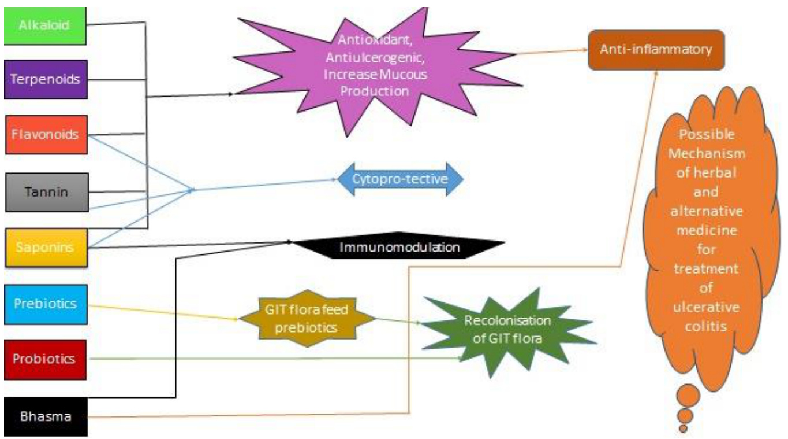

# Role of Traditional and Alternative Medicine in Treatment of Ulcerative Colitis

Article  in  International Journal of Pharmacognosy and Phytochemical Research $\cdot \cdot$ September 2013   
DOI: 10.13140/2.1.1130.3360

3 authors, including:

## Review Article

### Role of Traditional and Alternative Medicine in Treatment of Ulcerative Colitis

Shyam Baboo Prasad1, Vidhu Aeri2, \*Yashwant1

1School of Pharmaceutical Sciences, Lovely Professional University, Phagwara, Punjab, INDIA 2Faculty of Pharmacy, Jamia Hamdard, Hamdard Nagar, New Delhi, INDIA

## Abstract

Currently available treatment options for ulcerative colitis (UC) in modern medicine have several adverse effects. Therefore, there is a need to develop safe and effective treatment modalities for ulcerative colitis (UC). Traditional and alternative medicine play an important role in the management of UC as they were developed from the experience of people which passed from one generation to next since history of civilisation. This article presents a review on some reported traditional and alternative medicine for UC.

Key words: Ulcerative colitis, Inflammatory bowel disease, Colitis, Colon, Inflammation, Traditional medicine, Herbal medicine etc.

## Introduction

Inflammatory bowel disease (IBD) is a general term for a group of chronic inflammatory disorders of unknown etiology involving the gastrointestinal tract. Chronic IBD may be divided into two major groups, ulcerative colitis (UC) and Crohn's disease (CD), clinically characterized by recurrent inflammatory involvement of intestinal segments with several manifestations often resulting in an unpredictable course1. Ulcerative colitis is an inflammatory chronic disease primarily affecting the colonic mucosa; the extent and severity of colon involvement are variable. In its most limited form it may be restricted to the distal rectum, while in its most extended form the entire colon is involved. However, $80 \%$ of the patients present with disease extending from the rectum to the splenic flexure, and only $20 \%$ have pancolitis . Although the causes of IBD remain unclear, considerable progress has been made recently in the identification of important pathophysiologic mechanisms, and further and newer knowledge has been obtained from recent studies concerning their epidemiology, natural history, diagnosis and treatment.

## Symptoms

Initial symptoms of ulcerative colitis include diarrhoea, blood in stool, pain, weight loss, arthralgia, fever, loss of appetite, ophtalmopathies, nausea, vomiting, abscesses, fistulae and lymph node swelli3. Symptoms of mild, moderate and chronic UC is reported in table 1

## Epidemiology

Ulcerative colitis is usually associated with recurrent attacks with complete remission of symptoms in the interim. The disease is more common in Caucasians than in Blacks or Orientals with an increased incidence (three to six fold) in Jewish. Both sexes are equally affected. The peak occurrence of both diseases (UC and CD) is between ages 15 and 35, it has been reported in every decade of life. A familial incidence of IBD is currently recorded.  In Asia, Africa and South America, cases of UC is reported less as compared to European country. Breast feeding, smoking and appendectomy are associated with reduced rick of UC. Depression, western diet, left-handedness may increase risk of $\mathrm { U C } ^ { 3 , 4 }$ .

## Pathophysiology

The cause of UC still remains unclear, but on the basis of research in recent years point to an over stimulation or inadequate regulation of the

mucosal immune system as a major pathophysiologic pathway, and particular emphasis has been given to either the study of mucosal inflammation or immunologic reactions. When the disease is active, the lamina propria of the mucosa becomes highly infiltrated with a mixture of acute and chronic inflammatory cells. There is a predominant increase in mucosal Immunoglobulin G (IgG) production, evidence of complement activation, and activation of macrophages and T cells. This immunological activity is associated with the release of a vast array of cytokines, kinins, leukotriene, platelet activating factor (PAF) and reactive oxygen metabolites. These mediators not only serve to amplify the immune and inflammatory response, but they also have direct effects on epithelial function, on endothelial function (which may increase permeability and lead to ischemia), and on repair mechanisms, thus increasing collagen synthesis. In addition, many of the cytokines (interleukins 1 and 6, tumour necrosis factor) will activate an acute phase response, resulting in fever and a rise in serum acute phase proteins5,6,7.

## Diagnosis

The diagnosis of UC is made on clinical suspicion and confirmed by biopsy, stool examinations, sigmoidoscopy or colonoscopy, or barium radiographic examination .

## Complication

Table: Symptoms of mild, moderate and chronic UC   

<html><body><table><tr><td>Symptoms</td><td>Mild</td><td>Moderate</td><td>chronic</td></tr><tr><td>Stool frequency per day (mostly bloody)</td><td><4</td><td>4-6</td><td>>6</td></tr><tr><td>Temperature (°F)</td><td>Normal</td><td>99-100</td><td>>100</td></tr><tr><td>Pulse (beats/min)</td><td><90</td><td>90-100</td><td>>100</td></tr><tr><td>Weight loss (%)</td><td>None</td><td>1-10</td><td>>10</td></tr><tr><td>Albumin (g/dL)</td><td>Normal</td><td>3-3.5</td><td><3</td></tr><tr><td>Haematocrit (%)</td><td>Normal</td><td>30-40</td><td><30</td></tr><tr><td>Erythrocyte sedimentation rate (ESR) (mm/h</td><td><20</td><td>20-30</td><td>>30</td></tr></table></body></html>

Major complications of UC include toxic mega colon, intestinal perforation, and massive bleeding. Toxic mega colon is characterized by a sepsis-like syndrome and extensive distension of the colon $( > 6 \mathrm { c m } )$ . Chronic blood loss leads to microcytic anaemia. Complication of chronic ulcerative colitis may leads to colon cancer. The risk for cancer are generally seen after ten years of colitis.

### Medication

There is no an effective medicine to cure the UC but the mainstream treatment depends on reduction of the abnormal inflammation in the colon lining and thereby relieves the symptoms of diarrhoea, rectal bleeding, and abdominal pain. The treatment depends on the severity of the disease; therefore treatment is adjusted for each individual8. Most people with mild or moderate ulcerative colitis are treated with corticosteroids (dexamethasone) to reduce inflammation and relieve symptoms9. Near about $2 5 \%$ of patients with UC using steroids become steroid-dependent after one year, and virtually all develop steroid-related adverse events10. Other drugs as immune modulators (azathioprine and 6- mercapto-purine) that reduce inflammation by affecting the immune system and amino salicylates are available11. However, treatments with amino salicylates medications is typically accompanied with adverse side effects such as nausea, dizziness, changes in blood chemistry (including anaemia and leukopenia) and skin rashes12.

### Traditional and alternative medicine in treatment of ulcerative colitis

Proanthocyanidins isolated from grape seed were investigated for their activity in the treatment of recurrent ulcerative colitis (UC) in rats. The treatment facilitated recovery of pathologic changes in the colon after induction of recurrent colitis, as demonstrated by reduced colonic weight/length ratio and macroscopic and microscopic damage scores . Another study confirmed this fact as, Proanthocyanidins exerts a beneficial antiinflammatory effect in the acute phase of (2,4,6- trinitrobenzenesulfonic acid (TNBS)-induced colitis in rats14.

The administration of alcohol extract of Garcinia cambogia (Clusiaceae) in TNBS-induced colitis rats significantly improved the macroscopic damage and caused substantial reductions in increases in myeloperoxidase (MPO) activity and Cycloxegenase-2 (COX-2) expression. In addition, Garcinia cambogia extract treatment was able to reduce prostaglandin E2 (PGE2) and IL-1beta colonic levels15.

Zingiber Officinale (Zingiberaceae) extract was evaluated for anti-ulcerative colitis activity. Results showed a valuable effect of ginger extract against acetic acid-induced ulcerative colitis possibly by its antioxidant and anti-inflammatory properties16.

The protective effects of Angelica sinensis (Apiaceae) polysaccharides could be explained partially by oxidative stress and glutathione (GSH) depletion which are associated with the pathological mechanism of UC. The protective effects of Angelica sinensis polysaccharides are closely related to the prevention of oxidative stress, which may occur during neutrophil infiltration in the pathological process of $\mathrm { U C } ^ { \bar { 1 } 7 }$ .

The effect of polysaccharide obtained from Rheum tanguticum (Polygonaceae) on hydrogen peroxideinduced human intestinal epithelial cell injury and they found that, Pre- treatment of the cells with RTP could significantly elevate cell survival. Rheum tanguticum polysaccharide may have cytoprotective and anti-oxidant effects against $\mathrm { H } _ { 2 } \mathrm { O } _ { 2 }$ -induced intestinal epithelial cell injury by inhibiting cell apoptosis and necrosis. This might be one of the possible mechanisms of Rheum tanguticum polysaccharide for the treatment of ulcerative colitis in rats18.

Camellia sinensis (Theaceae) extract was found to be effective in the treatment of ulcerative colitis. Both diarrhoea and loss of body weight can be significantly attenuated by the treatment with Camellia sinensis extract. The mechanism of action was associated to remarkable amelioration of the disruption of the colonic architecture, significant reduction of colonic (MPO) and tumour necrosis factor- alpha (TNF-α) production19.

  
Figure: 1 Proposed hypothesis for mechanism of herbal and alternative medicine for treatment of ulcerative colitis

Aqueous extract of root of Withania somnifera (Solanaceae) showed anti-oxidant activity by reducing (Hydrogen peroxide) $\mathrm { H } _ { 2 } \mathrm { O } _ { 2 }$ and (Nitric oxide) NO. It has lipid peroxidation inhibition activity. The extracts scored positively on histopathological parameters like necrosis, edema and neutrophil infiltration in TNBS-induced IBD rat model20.

Glycoprotein isolated from Gardenia jasminoides has reported effective in (Dextran sodium sulphate) DSS induced UC in mice21.

The ethanol extracts of Ficus bengalensis (Moraceae) declined colon mucosal damage index and disease activity index in the colons of rats with $\mathrm { I B D } ^ { 2 2 }$ .

Patrinia scabiosaefolia (Valerianaceae) are usually used to treat anti-inflammatory diseases, especially for colonic inflammations, virus infections and hepatitis. The root extracts of Patrinia scabiosaefolia suppressed weight loss, diarrhoea, gross bleeding, infiltrations of immune cells, prevented shortening of colon length and enlargement of spleen size in mice with DSS induced colitis. Histological study indicated that the extracts reduced edema, mucosal damage, the loss of crypts23.

Avicennia marina (Acanthaceae) decreased the colonic lipid peroxides, glutathione peroxidase, and serum nitric oxide, lesion score and wet colon weight, and increased the colonic and erythrocyte superoxide dismutase and glutathione levels compared with colitis control24.

Aqueous extract from dry seeds of Benincasa hispida (Cucurbitaceae) showed strong antioxidant activity in a dose-dependent manner25. The dried seed extracts produced significant reduction in ulcer index in Wistar albino rats26.

Methanol extract of leaves of Rhodomyrtus tomentosa were studied on the production of inflammatory mediators NO and PGE2. The molecular mechanism of methanol extract of leaves of Rhodomyrtus tomentosa mediated inhibition, including target enzymes, were studied with RAW264.7, peritoneal macrophage, and HEK293 cells. Additionally, the in vivo antiinflammatory activity of this extract was evaluated with mouse gastritis and colitis models. Methanol extract of leaves of Rhodomyrtus tomentosa clearly inhibited the production of NO and PGE2 in lipopolysaccharide (LPS)-activated RAW264.7 cells and peritoneal macrophages in a dose-dependent manner27.

Berberis vulgaris fruit extract (BFE) with three different doses (375, 750, and $1 5 0 0 \ \mathrm { m g / K g ) }$ was administered orally or rectally prior to ulcer induction. Berberine chloride (BEC) $( 1 0 \mathrm { \ m g / K g ) }$ , prednisolone $( 5 \ \mathrm { \ m g / K g ) }$ , hydrocortisone acetate enema $( 2 0 \mathrm { \ m g / K g ) }$ and normal saline $( 5 \ \mathrm { \ m L } / \ \mathrm { \ K g } )$ were considered as respective controls. The tissue was assessed macroscopically for damage scores, area, index and weight/length ratio. They were also examined histopathologically for inflammation extent and severity, crypt damage, invasion involvement and total colitis index. Results indicated that greater doses of oral BFE (750, $1 5 0 0 \ \mathrm { m g / K g ) }$ as well as BEC $( 1 0 \mathrm { \ m g / K g ) }$ were effective to protect against colonic damage. By rectal pre-treatment, the extract was only effective to diminish the ulcer index and the efficacy was not significant for mucosal inflammation parameters. In conclusion BFE, which is nearly devoid of berberine, was effective to protect against colitis and this might be attributed to its anthocyanin constituents28.

UC has a lesser prevalence in smokers than nonsmokers. Studies using a transdermal nicotine patch have shown clinical and histological improvement29

A pure curcumin preparation was administered in an open label study to five patients with ulcerative proctitis and five with Crohn's disease. All proctitis patients improved, with reductions in concomitant medications30.

Oral Aloe vera taken for 4 weeks produced a clinical response more often than placebo; it also reduced the histological disease activity and appeared to be safe31.

Bromelain has been found to be effective in improvement of clinical and histologic severity of colonic inflammation in a murine colitis model of IL-10- deficient mice32.

In a double-blind trial, patient with UC had a reduction in symptoms such as bleeding and remained in remission longer than those who took 20 g of ground Psyllium seeds twice daily with water compared with those who were on the medication mesalazine alone33.

Guggulsterone significantly reduced the severity of DSS-induced murine colitis as assessed by clinical disease activity score, colon length, and histology .

Diammonium glycyrrhizinate could improve intestinal mucosal inflammation in rats and, importantly, reduce expression of TNF- $\mathfrak { a }$ in inflamed mucosa35.

In one of clinical studied the treatment of 30 patients with chronic UC, and gave 20 patients a Boswellia gum preparation $\mathrm { 9 0 0 ~ m g }$ daily divided into 3 doses for 6 weeks), and 10 patients sulfasalazine $\mathrm { ~ 3 ~ g ~ }$ daily divided into 3 doses for 6 weeks). They concluded that Boswellia was an effective treatment with few side effects, because 14 out of the 20 patients treated went into remission, and furthermore, 18 out of the 20 patients found an improvement in one or more parameters. In comparison, in the group taking sulfasalazine, 4 out of 10 went into remission, and 6 out of 10 showed improvement in one or more of the above parameters36.

The modulation of inflammatory molecules by tannins can decrease the damage produced by MMPs. The intestinal permeability and the defect in mucin can leave patients with UC vulnerable to increased inflammation. Tannins can modulate this increase, as well as the pathogenic bacteria associated with UC and the increase in inflammatory molecules. Current research with flavonoids and UC demonstrate a protective effect in mice treated with the colitis-inducing agent, dextran sulphate sodium, so as to prevent the occurrence of colitis. Green tea polyphenols have shown similar benefits in mice by attenuating colonic injury induced by experimental colitis. The research highlights how condensed plant tannins could be an effective treatment option to address each of these contributing factors in the GI inflammation of UC and should be investigated further in clinical trials37.

Silymarin is a flavonoid component of Silybum marianum. Silymarin contains antioxidants and inhibits the inflammatory reactions. silymarin is effective in improving of the inflammation and repair of the colon ulcer induced acetic acid. So, making use of silymarin can be considered as a suggestive way for the colitis treatment38.

Terminalia chebula extract $( 6 0 0 \mathrm { m g / k g } )$ showed healing effects against acetic acid-induced colonic damage score and weight when administered orally daily for 14 days39.

Bacterial recolonization

Alteration in GIT flora may leads to UC. Probiotics as supplement is beneficial in such cases. The available clinical data shows the role of intestinal micro biota in the pathogenesis of IBD and there by provides an evidence that alteration in the intestinal micro biota with the help of probiotics can be helpful in the treatment of disease. E.g. Bifidobacteria infantis has been found to reduce the inflammatory response of the gut lining by inhibiting the bacteroides. Lactobacillus plantarum has also been reported to be used in IBD. A probiotic formulation containing no of microbes (VSL#3) used in case of ulcerative colitis although its clinical efficacy is not certain. E. coli has also been used in case of ulcerative colitis but its clinical efficacy depends upon its dose40,41,42,43,44.

Iron supplementation

The gradual loss of blood from GIT often leads to anaemia. Adequate disease control usually improves anaemia of chronic disease, but iron deficiency anaemia should be treated with iron supplements. In Ayurveda lauha bhasma and mandur bhasma is recommended in iron deficiency anaemia45.

## Conclusion

Herbal and alternative medicine play important role in prophylaxis and cure of UC. As the pathophysiology of UC is still not clear but the possible mechanism of herbal and traditional medicine for treatment of UC is described in figure 1. Alkaloids and terpenoids may be used in Ulcerative colitis because of antioxidant and antiulcerogenic activity. Anti ulcerogenic activity may be due to increase secretion of mucous. Phenolics (flavonoids, tannins) and saponins may act by antioxidant, cytoprotective and antiulcerogenic activity. Saponin and Ayurvedic bhasma may act by immunomodulation and anti-inflammatory activity. Prebiotic and probiotic helps in recolonisation of GIT flora. The proposed hypothesis may trigger the researcher to investigate new medicine which can be used in treatment of ulcerative colitis.

## References

1. Packey CD and Sartor RB (2008) Interplay of commensal and pathogenic bacteria, genet- ic mutations, and immunoregulatory defects in the pathogenesis of inflammatory bowel diseases. J Int Med 263: 597-606.   
2. Faubion WA, Loftus EV and Harmsen WS (2001) The natural history of corticosteroid therapy for inflammatory bowel disease: a population-based study. Gastroenterol 121: 255-260.   
3. Kathleen AH and Julie SJ (2003) Inflammatory bowel disease Part I : Ulcerative colitispathophysiology and conventional and alternative treatment option. Alt med rev 8: 247-283.   
4. Lindberg E, Tysk C, Andersson K and Jarnerot G (1988) Smoking and inflammatory bowel disease. A case control study. Gut 39: 352-357.   
5. Jewell DP (1989)  Aetiology and pathogenesis of ulcerative colitis and Crohn's disease Postgraduate Medical Journal 65: 718-719.   
6. Tysk C, Lindberg E, Jarnerot G and Floderus MB (1988) Ulcerative colitis and Crohn's disease in an unselected population of monozygotic and dizygotic twins. A study of heritability and the influence of smoking. Gut 29: 990-996.   
7. Biemond I, Burnham WR, D'Amaro J and Langman, MJS (1986) HLA-A and B antigens in inflammatory bowel disease. Gut 27: 934-941.   
8. Botoman VA, Bonner GF and Botoman DA (1998) Management of inflammatory bowel disease. Am. Fam. Phys 57: 57-68.   
9. Hanauer SB, Korelitz BI, Rutgeerts P, Peppercorn MA, Thisted RA, Cohen RD and  Present DH (2004) Postoperative maintenance of Crohn’s disease remission with 6-mercaptopurine, Gastroenterol 127: 723-729.   
10. Faubion WA, Loftus EV and Harmsen WS (2001) The natural history of corticosteroid therapy for inflammatory bowel disease: a population-based study. Gastroenterol 121: 255-260.   
11. Bresci G, Parisi G, Gambardella L, Banti S, Bertoni M, Rindi G and Capria A (1997) Evaluation of clinical patterns in ulcerative colitis:along-termfollow-up. Int J Clin Pharmacol Res 17:17-22.   
12. Rachmilewitz D (1989) Coated mesalazine (5- aminosalicylic acid) versus sulphasalazine in the treatment of active ulcerative colitis: a randomised trial. BMJ 298: 82-86.   
13. Wang YH, Yang XL, Wang L, Cui MX, Cai YQ, Li XL and Wu YJ (2010) Effects of proanthocyanidins from grape seed on treatment of recurrent ulcerative colitis in rats. Can J Physiol Pharmacol 88: 888-898.   
14. 1 Li XL, Cai YQ, Qin H and Wu YJ (2008) Therapeutic effect and mechanism of proanthocyanidins from grape seeds in rats with TNBS-induced ulcerative colitis. Can. J Physiol Pharmacol 86:841-849.   
15. 1 Dos RSB, de OCC, Acedo SC, Miranda DD, Ribeiro ML, Pedrazzoli JJ and Gambero, A (2009) Attenuation of colitis injury in rats using Garcinia cambogia extract. Phytother Res 23: 324–329.   
16. El-Abhar HS, Hammad, LN and Gawad HS (2008) Modulating effect of ginger extract on rats with ulcerative colitis. J Ethnopharmacol 118: 367–372.   
17. Wong VK, Yu L and Cho CH (2008) Protective effect of polysaccharides from Angelica sinensis on ulcerative colitis in rats. Inflammopharmacology 16: 162–167.   
18. Liu LN, Mei QB, Liu L, Zhang F, Liu ZG, Wang ZP and Wang RT (2005) Protective effects of Rheum tanguticum polysaccharide against hydrogen peroxide-induced intestinal epithelial cell injury. World J. Gastroenterol 11: 1503–1507.   
19. Mazzon E, Muia C, Paola RD, Genovese T, Menegazzi M, De Sarro A, Suzuki H and Cuzzocrea S (2005) Green tea polyphenol extract attenuates colon injury induced by experimental colitis. Free Rad Res 39: 1017–1025.   
20. Pawar P, Gilda S, Sharma S, Jagtap S, Paradkar A, Mahadik K, Ranjekar $\mathrm { ~ \bf ~ P ~ }$ and Harsulkar A (2011) Rectal gel application of Withania somnifera root extract expounds anti-inflammatory and  mucoestorative activity in TNBS-induced inflammatory bowel disease. BMC Complement Altern Med 28: 11–34.   
21. Oh PS and Lim KT (2006) Plant originated glycoprotein has anti-oxidative and antiinflammatory effects on dextran sulfate sodiuminduced colitis in mouse. J Biomed Sci 13: 549– 560.   
22. Patel MA, Patel P K and Patel MB (2010) Effects of ethanol extract of Ficus bengalensis (bark) on inflammatory bowel disease. Indian J Pharmacol 42: 214–218.   
23. Cho EJ, Shin JS, Noh YS, Cho YW, Hong SJ, Park JH, Lee JY, Lee JY and Lee KT (2011) Antiinflammatory effects of methanol extract of Patrinia scabiosaefolia in mice with ulcerative colitis. J Ethnopharmacol 136: 428–435.   
24. Rise CL, Prabhu VV and Guruvayoorappan C (2012) Effect of marine mangrove Avicennia marina (Forssk.) Vierh against acetic acid-induced ulcerative colitis in experimental mice. J Environ Pathol Toxicol Oncol 31: 179-192.   
25. Samad NB, Debnath T, Jin HL, Lee BR, Park PJ, Lee SY, Lim BO (2013) Antioxidant activiy of benincasa hispida seeds. J Food Biochem 37: 388- 395.   
26. Rachchh MA and Jain SM (2008) Gastroprotective effect of Benincasa hispida fruit extract. Indian J Pharmacol 40: 271–275.   
27. Deok J, Woo SY, Yanyan Y, Gyeongsug N, Ji HK, Deok HY, Hyung JN, Skchan L, Tae WK, Gi HS and Jae Y ((2013)  In vitro and in vivo antiinflammatory effect of Rhodomyrtus tomentosa methanol extract. J Ethnopharmacol 146: 205–213.   
28. Mohsen M, Alireza G, Parvin M, and Elham JS (2011) Comparative Study of Berberis vulgaris Fruit Extract and Berberine Chloride Effects on Acetic Acid-Induced Colitis in Rats. Iranian J Pharm Res 10: 97-110   
29. Guslandi M (1999) Nicotine treatment for ulcerative colitis.  J Clin Pharmacol 48: 481-484.   
30. Peter R, Holt MD, Seymour K and Robert K (2005) Curcumin Therapy in Inflammatory Bowel Disease: A Pilot Study. Digestive Diseases and Sciences 50: 2191-2193   
31. Langmead L, Feakins RM, Goldthorpe S, Holt H, Tsironi E, De Silva A, Jewell DP and Rampton DS (2004) Randomized, double-blind, placebocontrolled trial of oral aloe vera gel for active ulcerative colitis. Aliment Pharmacol Ther 19: 739-47.   
32. Kane S and Goldberg M (2000) Use of bromelain for mild ulcerative colitis. JAnn Intern Med 18:680-682   
33. Fernandez BF, Hinojosa J, Sanchez LJL, Navarro E, Martinez SJF, Garcia PA, Gonzalez HF, Riera J, Gonzalez LV, Dominguez AF, Gine JJ, Moles J and Gomollon F (1999) Randomized clinical trial of Plantago ovata seeds (dietary fiber) as compared with mesalamine in maintaining remission in ulcerative colitis. Spanish Group for the Study of Crohn's Disease and Ulcerative Colitis . Gassull MAAm J Gastroenterol 94:427-33.   
34. Cheon JH, Kim JS, Kim JM, Kim N and Jung HC (2006) Plant sterol guggulsterone inhibits nuclear factor-kappaB signaling in intestinal epithelial cells by blocking IkappaB kinase and ameliorates acute murine colitis. Bowel Dis 12:1152-61.   
35. Yuan H, Ji WS, Wu KX, Jiao JX, Sun LH, Feng YT (2006) Anti-inflammatory effect of Diammonium Glycyrrhizinate in a rat model of ulcerative colitis. World J Gastroenterol 12:4578- 81.   
36. Gupta I, Parihar A, Malhotra P, Gupta S, Ludtke R, Safayhi H, Ammon HP(2011) Effects of gum resin of Boswellia serrata in patients with chronic colitis. Planta Med 67:391-395.   
37. Catherine C (2009) Plant tannins: A novel approach to the treatment of ulcerative colitis. Natural Medi J 1: 1-4   
38. Vahid HJ, Farshid K and Habibollah J (2012) The investigation of silymarin effect on colon ulcer induced acetic acid in mice. Annals  Biol Res 3:3691-369.   
39. Gautam MK, Goel S, Ghatule R, Singh A, Nath G and Goel RK (2012) Curative effect of Terminalia chebula extract on acetic acid-induced experimental colitis: role of antioxidants, free radicals and acute inflammatory marker Inflammopharmacol 32: 1-7.   
40. Ishikawa H, Akedo I, Umesaki Y, Tanaka R, Imaoka A and Otani T (2003)  Randomized controlled trial of the effect of bifidobacteriafermented milk on ulcerative colitis. J American College of Nutrition 22: 56-63.   
41. Kruis W, Schutz E, Fric P, Fixa B, Judmaier G and Stolte M (1997) Double-blind comparison of an oral Escherichia coli preparation and mesalazine in maintaining remission of ulcerative colitis. Aliment Pharmacol Therapy 11: 853-858   
42. Shiba T, Aiba Y, Ishikawa H (2003) The suppressive effect of Bifidobacteria on Bacteroides vulgatus, a putative pathogenic microbe in inflammatory bowel disease. Microbiol Immunol 47: 371-378.   
43. Niedzielin K, Kordecki H and Birkenfeld BA (2001) Controlled, double blind, randomized study on the efficacy of Lactobacillus plantarum 299V in patients with irritable bowel syndrome. European J Gastroenterol  Hepatol 13: 1143–1147.   
44. Steidler L, Hans W and Schotte L (2000) Treatment of murine colitis by Lactococcus lactis secreting interleukin-10. Scientifica 289: 1352- 1355.   
45. Sarkar PK, Prajapati PK, Chaudhary AK, Shukla VJ and Ravishankar B (2010) Haematinic evaluation of lauha bhasma and mandur bhasma on $\mathrm { H g c l } _ { 2 }$ induced anaemia in rats. Indian j pharmacol 59: 791-795.