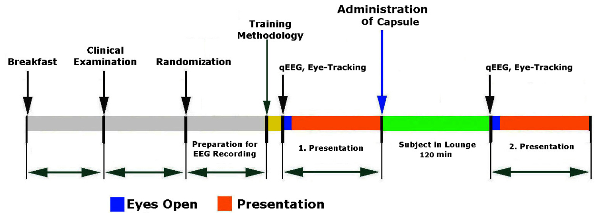
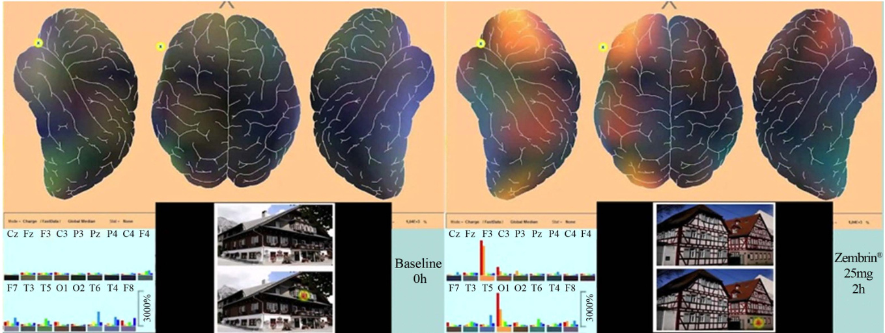
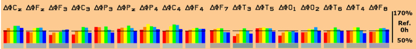
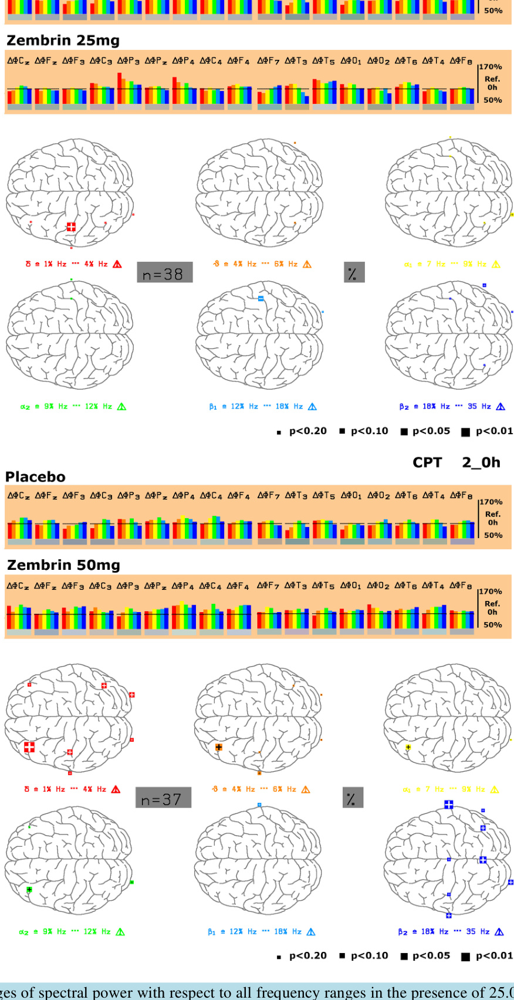

#### Psychophysiological Effects of Zembrin® Using Quantitative EEG Source Density in Combination with Eye-Tracking in 60 Healthy Subjects. A Double-Blind, Randomized, Placebo-Controlled, 3-Armed Study with Parallel Design

Wilfried Dimpfel1, Nigel Gericke2, Samir Suliman3, Gwladys N. Chiegoua Dipah3

1Justus-Liebig-University, Giessen, Germany   
2HG&H Pharmaceuticals (Pty) Ltd., Bryanston, South Africa   
3NeuroCode AG, Wetzlar, Germany   
Email:dimpfel1945@web.de

Received 7 July 2016; accepted 6 September 2016; published 9 September 2016

Copyright $\circledcirc$ 2016 by authors and Scientific Research Publishing Inc.   
This work is licensed under the Creative Commons Attribution International License (CC BY). http://creativecommons.org/licenses/by/4.0/

# Abstract

The endemic South African succulent plant Sceletium tortuosum (L.) N.E. Br., family Mesembryathemaceae, is known as kanna in Nama, kougoed in Afrikaans, and sceletium in English. The plant has been used as a tea and as a masticatory for millennia by indigenous San hunter-gatherers and Nama pastoralists for endurance and well-being. It has been reported that the plant “gives strength to their limbs, and takes away pain, and makes their memory strong”. The current investigation aimed at the psychophysiological characterization of 25.0 and $\mathbf { 5 0 . 0 \ m g }$ of a special extract marketed as Zembrin® in comparison to placebo using a new methodology called “EnkephaloVision”. This combination of EEG Neurocode-Tracking and Eye-Tracking allows for concomitant analysis of time epochs of only $\mathbf { 3 6 4 ~ m s }$ duration. Spectral EEG analysis during cognitive and emotional challenges revealed statistically significant increases of delta $\bf ( p < 0 . 0 1$ during arithmetic calculation and watching a boring animal video) and theta spectral power $\bf ( p < 0 . 1 0$ during these same challenges) in the presence of Zembrin® within the frontal brain. It is these same increases of slow waves in the frontal brain that are described in the literature during performance of mental tests. This indicates a positive effect of Zembrin® on the electrical activity of the brain during cognitive processing. In addition, alpha1 and alpha2 spectral power in the frontal brain was increased during several challenges including brain teasing, arithmetic calculations and performance of a memory test. From the literature, increases of spectral alpha1 power indicate a greater degree of

How to cite this paper: Dimpfel, W., Gericke, N., Suliman, S. and Dipah, G.N.C. (2016) Psychophysiological Effects of Zembrin® Using Quantitative EEG Source Density in Combination with Eye-Tracking in 60 Healthy Subjects. A Double-Blind, Randomized, Placebo-Controlled, 3-Armed Study with Parallel Design. Neuroscience and Medicine, 7, 114-132. http://dx.doi.org/10.4236/nm.2016.73013

calmness and may represent decreased depressive symptoms, while increases in alpha2 waves have been related to memory. Beta2 waves increased during mental performance in the presence of the higher dosage of Zembrin® in parietal, occipital and temporal brain regions. In comparison to placebo, Zembrin® induced frequency changes in the brain, which have been related to enhanced attention and memory. These results may represent a positive action of Zembrin® on cognitive and emotional processes in the brain.

# Keywords

Sceletium Tortuosum, Zembrin®, EEG, Neurocode-Tracking, Eye-Tracking, Psychophysiology, Spectral Power, EnkephaloVision, CATEEM®

## 1. Introduction

### 1.1. Ethnobotanical

The endemic South African succulent plant Sceletium tortuosum (L.) N.E. Br., family Mesembryathemaceae, is known as kanna in Nama, kougoed in Afrikaans, and sceletium in English. This plant has one of the oldest documented histories of use in South Africa, with the earliest unequivocal written record dated to 1685 [1]. Kolben declared that sceletium was “the greatest cheerer of the spirits, and the noblest restorative in the world” [2]. The plant has been used as a tea and as a masticatory for millennia by indigenous San hunter-gatherers and Nama pastoralists for endurance and well-being. An 1873 ethnobotanical record (the entry is for kaauwgoed the old Dutch name for sceletium) reports that the plant “gives strength to their limbs, and takes away pain, and makes their memory strong” (Manuscript MSS BC151 006, Manuscript and Archives Department of the University of Cape Town) [3].

Over the last two decades manufactured products containing sceletium raw material and extracts have become widely available as supplements, health teas and beverages sold through farm stalls, health food shops, pharmacies and via internet and by multi-level marketing. The products are typically used for promoting a sense of calm, well-being, relieving stress, elevating mood, reducing anxiety and enhancing focus and concentration.

## 1.2. Pharmacology

A proprietary standardized and characterized extract of a cultivated selection of Sceletium tortuosum (Zembrin®) was shown in-vitro to be a dual 5-HT uptake inhibitor and PDE4 inhibitor [4]. In an in-vivo study in rats, field potential recordings were made for three doses of this extract and for a saline control [5]. Zembrin dose dependently attenuated spectral power in all electroencephalogram frequency ranges to varying degrees. Comparison of the electropharmacograms of Zembrin with the electropharmacograms of selected botanical extracts and pharmaceuticals demonstrated that this extract Sceletium tortuosum produces a similar EEG signature to Ginkgo biloba, and to the EEG signature of the synthetic PDE4-inhibitor rolipram, supporting potential health and wellness applications for improving mood and cognitive function.

## 1.3. Clinical Studies

Extract Sceletium tortuosum (Zembrin®) has been shown to be safe and well tolerated in pre-clinical [6] and clinical studies [7]. The acute effects of extract Sceletium tortuosum (Zembrin®) administration in 16 healthy young adults was studied in a pharmaco-fMRI study focused on anxiety-related activity in the amygdala and its connected neuro-circuitry. Amygdala reactivity to fearful faces under low perceptual load conditions was attenuated after a single $2 5 . 0 ~ \mathrm { m g }$ dose of Zembrin . Follow-up connectivity analysis on the emotion matching task demonstrated that amygdale-hypothalamus coupling was also reduced. These results demonstrated for the first time the attenuating effects of Sceletium tortuosum on the threat circuitry of the human brain and provide supporting evidence that the dual 5-HT reuptake inhibition and PDE4 inhibition of Zembrin might have anxiolytic potential by attenuating the sub-cortical threat response [8].

The neurocognitive effects of extract Sceletium tortuosum (Zembrin) was tested for the first time in a repeat dose crossover study in a group of adults $( \boldsymbol { \mathrm { n } } = 2 \boldsymbol { \mathrm { 1 } }$ , mean age 54.6 years) using the CNS Vital Signs® battery of tests. Zembrin $^ { \textregistered } 2 5 . 0 \mathrm { m g }$ daily dosage taken for 3 weeks significantly improved executive function and cognitive set flexibility compared with the placebo group. These promising cognitive enhancing effects lend support to PDE4 inhibition as a possible mechanism of action for Zembrin®, operating through the PDE4-cAMP-PCREB cascade [9].

### 1.4. Neurophysiological Background

Drugs typically exert their action within the organism by interaction with defined large protein molecular targets, including receptors, enzymes, ion channels, and transporters. With respect to the central nervous system, neurotransmitter receptors represent a major drug target. Interaction of drugs with these molecules induces a signaling cascade, which finally ends up with the control of ion channel conductance. Since the electric activity of single neurons depends on the set of momentarily active ion channels, communication between neurons is governed by channel activity. From here, it is obvious that electrical field potentials contain the net information of larger local networks of electrically active neurons, reflecting the interaction of drugs with their targets within the concert of neurotransmission.

Frequency analysis of the field potentials in the presence of drugs can be depicted as the so-called electropharmacogram, which has been widely used to characterize drug actions on rat [10] and human brains [11]. Interpretation of the results is made with respect to the likely underlying neurotransmitter activity responsible for changes in the selected frequency ranges, and aims at advancing an understanding of possible clinical applications in humans. The relationship between EEG delta waves and cholinergic neurotransmission was first recognized in 2005 [12], and it was recognized that theta waves are influenced by drugs acting at the biochemically defined norepinephrine alpha2 receptor [13]. Presynaptic interaction with this receptor leads to drowsiness and sleep, and increases of theta waves have been used as part of a formula describing depth of sleep in humans. Dopaminergic activity is reflected by changes in alpha2 frequencies [14].

Many herbal preparations have been tested using neurophysiological techniques [15] [16]. In order to characterize the psychophysiological effect of Zembrin®, a new clinical study design was used, named “EnkephaloVision”. This new approach consists of the combination of quantitative EEG recording during cognitive and emotional challenges with conventional Eye-Tracking, providing very high time resolution of epochs of $3 6 4 ~ \mathrm { { m s } }$ (Neurocode-Tracking) [17].

In the present study 60 subjects, randomized to receive a single dose of $2 5 . 0 ~ \mathrm { m g }$ or $5 0 . 0 \ \mathrm { m g \ Z e m b r i n } ^ { \textregistered }$ , or placebo, were exposed visually to 5 cognitive (Stroop-Test, Brain Teaser, Memory-Test, Picture Comparison, CPT-Test) and 4 emotional challenges (Emotion Pictures, Animal Videos and Horror Videos), by asking for task performance and watching video clips of a short duration. Regional quantitative EEG changes in the presence of these challenges during baseline recording have been documented in a preceding publication [18].

### 2. Materials and Methods

#### 2.1. Subjects

Sixty healthy male and female subjects (30/30) aged between 40 and 75 years were recruited by announcements in the newspaper. Mean age was $5 1 . 5 3 \pm 7 . 7 8$ (male) and $5 1 . 9 3 \pm 7 . 3 4$ (female).

Inclusion criteria:

Healthy male and female subjects. Age between 40 and 75 years (both included). Subjects fluent in the German language. Right handed. BMI (body mass index) $> 1 8$ or $< 3 2$ . Subject must be capable of giving informed consent. • Acceptance of written consent to participate in the study after education in written and oral form (informed consent). No psychiatric or neurologic disease including epilepsy, cerebrovascular disturbance or traumatic injury. No major or untreated disease including severe uncontrolled diabetes, ischemia, infarct, unstable angina pectoris or uncontrolled high blood pressure.

No presence of clinically relevant pathological EEG features or artifact-free portion of the screening EEG $< 3 0 \%$ . No clinically relevant allergic symptoms. No detection of alcohol at the time of initial examination (day SC) or on study day A (negative alcohol test) or by case history. No detection of drugs (positive drug test) at the time of initial examination (day SC) or drug abuse within the last 6 months. No consumption of clinically relevant medication during last fourteen days before and during the active study period based on the notification of the subject or his case history. No consumption of medication with primarily central action (i.e. psychotropic drugs or centrally acting antihypertensive). No known intolerance/hypersensitivity (allergy) to plant-derived extracts or any of the ingredients of the investigational product (anamnestic). No presence of a rare genetic disease such as fructose intolerance, glucose-galactose malabsorption or sucrase-isomaltase deficiency (anamnestic). No consumption of unusual quantities or misuse of coffee (more than 4 cups a day), tea (more than 4 cups a day) or tobacco (more than 20 cigarettes per day). No smoking on day A. No participation in another clinical trial within the last 30 days. • No positive pregnancy test (day A). • No lactation.

#### 2.2. Investigational Product

The active ingredient of the investigational product is a special extract of the above ground material of a cultivated traditionally used selection of Sceletium tortuosum, Zembrin®. This is standardized and characterized after aqueous ethanolic extraction (purified water $30 \%$ V/V and ethanol $70 \%$ V/V, spray-dried onto a maltodextrin carrier), and was manufactured to GMP by Polifenoles Naturales S.L., Las Palmas, Gran Canaria, Spain. UPLC analysis against validated analytical reference standards confirmed that the total alkaloid content of the extract conformed to the specification of $0 . 4 \%$ total alkaloids, and the relative concentrations of mesembrenol and mesembrenone greater than $60 \%$ by weight, and mesembrine less than $20 \%$ by weight. Active capsules contained $2 5 . 0 ~ \mathrm { m g }$ and $5 0 . 0 ~ \mathrm { m g }$ of the extract, together with mannitol as excipient, while identical-looking placebo capsules contained only mannitol. Placebo and active capsules were manufactured according to GMP by Hubertus Apotheke, Berlin, Germany.

#### 2.3. Quantitative EEG

EnkephaloVision is the term for the new combination of quantitative EEG (Neurocode-Tracking) and EyeTracking.

In this study a 17-channel EEG recording was combined with Eye-Tracking. Details of the EEG recording method have been published earlier [19]. A new modified software for analysis of shorter time epochs of $3 6 4 ~ \mathrm { { m s } }$ duration was used (neo-CATEEM , supplied by MEWICON CATEEM-Tec GmbH, 4164 Schwarzenberg, Austria). A manuscript containing details and validation of the software package—now called “Neurocode-Tracking”—has been published [20]. In short: For the present new approach, the EEG frequency ranges to be analyzed had to be adjusted slightly to give the following exact ranges. Delta: $1 . 3 7 5 \textrm { - } 4 . 1 2 5 ~ \mathrm { H z }$ ; Theta: 4.125 - $6 . 8 7 5 ~ \mathrm { H z }$ ; Alpha1: $6 . 8 7 5 \textrm { - } 9 . 6 2 5 ~ \mathrm { H z }$ ; Alpha2: $9 . 6 2 5 \textrm { - } 1 2 . 3 7 5 ~ \mathrm { H z }$ ; Beta1: $1 2 . 3 7 5 \mathrm { ~ - ~ } 1 7 . 8 7 5 ~ \mathrm { H z }$ ; Beta2: 17.875 - $3 4 . 3 7 5 \mathrm { H z }$ . This adjustment is a precondition for the new fast dynamic frequency analysis (Neurocode-Tracking) because under this condition each frequency range from delta up to alpha2 contains only one frequency (middle frequency within the particular frequency band). Data were analyzed in the current source density mode [21]. All other features remained identical to the classic analysis currently in use for nearly 20 years [17]. Maps were constructed by transforming spectral power values into spectral colors followed by additive color mixture (RGB-mode as in TV).

The recording was performed in the presence of a video clip (s. methods), which contained several different cognitive and emotional challenges in series (Table 1). The total video was presented twice: a) during baseline recording and b) $1 2 0 ~ \mathrm { { m i n } }$ after intake of one capsule $\mathrm { Z e m b r i n } ^ { \textregistered } 2 5 . 0 ~ \mathrm { m g }$ or $5 0 . 0 ~ \mathrm { m g }$ or one placebo capsule. Representative scenes from the total video are given in Figures 3-11. The time line of consecutive scenes is documented in the following Table 1.

Table 1. Challenges during EEG recordings at experimental days.   

<html><body><table><tr><td colspan="3">Neurocode-Tracking in combination with Eye-Tracking audio-visual presentations</td></tr><tr><td colspan="3">Elements Time</td></tr><tr><td>1</td><td>Instructions of volunteers in the Neurocode-Tracking method</td><td>5 min. 00 s</td></tr><tr><td>2</td><td>Gong (for synchronization Neurocode-Tracking (qEEG and Eye-Tracking)</td><td>21 s</td></tr><tr><td>3</td><td>Black screen (Eyes open)</td><td>1 min. 00 s</td></tr><tr><td>4</td><td>Fix Cross 1 min (Eyes open)</td><td>1 min. 00 s</td></tr><tr><td>5</td><td>Picture Comparison (n =1 foil) with 8 errors including instructions</td><td>1 min. 15 s</td></tr><tr><td>6</td><td>Stroop Test (n = 8 foils) including instructions</td><td>1 min. 00 s</td></tr><tr><td>7</td><td>Memory Test (n = 4 tasks) including instructions</td><td>1 min. 35 s</td></tr><tr><td>8</td><td>CPT-Test (concentration performance test) (n = 4 tasks) including instructions</td><td>2 min. 20 s</td></tr><tr><td>9</td><td>Brain Teaser(n=1O foils) including instructions</td><td>5 min. 15 s</td></tr><tr><td>10</td><td>Emotional Pictures</td><td>1 min. 00 s</td></tr><tr><td>11</td><td>Video “Animals” relaxing</td><td>52 s</td></tr><tr><td>12</td><td>Video“Horror”</td><td>1 min. 11 s</td></tr><tr><td>13</td><td>Video “Animals” exciting</td><td>1 min. 10 s</td></tr><tr><td></td><td>Total Time excl. instructions of volunteers</td><td>17 min. 59 s</td></tr></table></body></html>

#### 2.4. Eye-Tracking

Eye-Tracking (equipment and software from Tobii AB, S-18217 Danderyd Sweden), was performed concomitantly with Neurocode-Tracking (fast dynamic quantitative EEG recording). All mental and emotional challenges were presented as a single video clip. Single challenges were first constructed as a Power Point file and then converted into a final video clip (by Adobe Captivate software). For offline analysis and synchronization with the eye-track data a screen grabber (Adobe Captivate) was used to produce a video containing all successively calculated EEG maps of $3 6 4 ~ \mathrm { m s }$ duration. A second video was obtained from the eye-tracker software running on a separate computer. It is called a “gaze overlay” movie depicting the presented pictures, tasks or video films. In this gaze overlay video the momentary gaze of the subject is documented by a red spot. The presentation always started with an audio signal (gong). This audio signal was registered by screen capture of the EEG computer and was used for synchronization of both videos by means of a video cut software (Adobe Premiere Pro). Due to the processing time of the brain (300 to $4 0 0 ~ \mathrm { { m s } }$ ) plus that of the computer (depends individually on the type and number of active processors!) the gaze overlay video is shifted in our case (quad core, 3.4 Giga-Hz) for one second in order to obtain synchronized images between gaze and the particular EEG epoch of $3 6 4 ~ \mathrm { { m s } }$ . For detailed offline documentation a movie was exported and analyzed image by image. Single representative images containing the gaze and corresponding EEG map (called an Enkephaloglyph [21]) were cut from the screen by a video editing software tool available on all computers.

#### 2.5. Statistical and Analytical Plans

EEG data from the first recording session before intake of the capsules are given as absolute numbers $( \mu \mathrm { V } ^ { 2 } )$ . For exploratory statistical evaluation the non-parametric Wilcoxon test was used. For mathematical differentiation of the different mental loads linear discriminant analysis according to Fischer was used. Results from the first three discriminant functions were projected into space (X, Y and Z coordinates), whereas results from the fourth to sixth discriminant functions were coded into red, green and blue color, respectively, followed an additive color mixture (so-called RGB-mode). In order to document statistically the different electric reaction of the brain to various cognitive and emotional loads, data from each part of the presentation were divided by the data obtained during fixation of the cross on the monitor (1 minute) at the beginning. Comparison of the effect of $2 5 . 0 ~ \mathrm { m g }$ , $5 0 . 0 \ \mathrm { { \dot { m g } } Z e m b r { \dot { i } } { \dot { n } } } ^ { \oplus }$ capsules versus placebo was accomplished by evaluation of the second EEG recording of the day 120 minutes after intake. Data from the first recording (baseline) were set to $100 \%$ and electrophysiological changes produced by placebo or $\mathrm { Z e m b r i n } ^ { \textregistered } 2 5 . 0 \mathrm { ~ m g }$ or $5 0 . 0 \mathrm { m g }$ capsules are depicted as $\%$ -changes thereof. Estimation of the number of subjects to be included into the study was performed by considering data from earlier experimental results obtained under a similar experimental design. Level of statistical significance in comparison to placebo was defined as $\mathbf { \dot { \bar { p } } < 0 . 1 0 }$ , $\ddot { \mathfrak { p } } < 0 . 0 5$ and $\mathfrak { s } \ast \mathfrak { s } _ { \mathfrak { p } } < \bar { 0 . 0 1 }$ . The study was conducted according to the Protocol after approval by the Ethikkommission [ethics committee] of the “Landesärztekammer Frankfurt, Germany on 14.07.2015 (PP_2615_HG & H_FINAL V1.0_14072015). The study was conducted from September to December 2015.

### 3. Results

First step in the analysis was to find out if the different cognitive and visually presented emotional challenges lead to changes of spectral power. For this goal data from each type of challenge were averaged over the total presentation time of cognitive or emotional challenges in order to follow each of the brain regions with respect to the pattern of spectral power changes with respect to each frequency. These data have been published separately [18]. In short: Mental activation in terms of functional anatomy was observed primarily in lateral forebrain as increases of delta and theta frequencies during all challenges starting with the boring animal video. The more complex the single challenges were, the more brain regions and frequencies became involved. In addition to the frontal brain areas, the temporal and parietal areas showed changes of electric brain activity in terms of increases (delta, theta and beta waves) or decreases (alpha waves in central regions).

The absolute starting values of spectral power in the six frequency ranges (delta to beta2) are given in Table 2. These values do not differ from each other in a statistically significant way—except for the electrode position F7 and F8 with respect to delta and theta power—suggesting that both groups—placebo and verum—have a similar starting position. This allows for a pre-post comparison of drug action. These absolute values are set to $100 \%$ and drug induced changes are documented in $\%$ of these starting values.

The effect of Zembrin® was tested by using a new methodology called “EnkephaloVision”, which consists of a combination of a fast quantitative EEG analysis termed “Neurocode-Tracking” and Eye-Tracking (for details see methods). Sixty subjects were exposed to a series of mental tasks and emotional audio-visual video-clips before and 2 hours after intake of 25.0 or $5 0 . 0 \mathrm { m g }$ of $\mathsf { Z e m b r i n } ^ { \mathbb { B } }$ or placebo (for timeline s. Figure 1). After synchronization of the EEG video and the eye track video by means of the “gong” at the beginning of the experiment one can compare scene by scene of the combined video with respect to placebo intake or intake of the two doses of Zembrin®. Representative examples for evaluation of single scenes and a group evaluation during the picture comparison and during performance of brain teasers are documented in Figures 2-5, respectively.

For example, comparing the spectral pattern of a baseline scene during performance of a picture comparison with a pattern in the presence of $2 5 . 0 \mathrm { m g }$ of Zembrin® shows huge increases of delta and theta waves in the left frontal area (electrode position $\mathrm { F } _ { 3 , } ^ { \cdot \mathrm { ~ \cdot ~ } }$ ) and in the left occipital lobe (electrode position $\mathbf { O } _ { 1 , } ^ { \cdot \mathrm { ~ \rangle ~ } }$ as documented in Figure 2 on the right side. A similar pattern emerged in the presence of $5 0 . 0 \mathrm { m g } \mathrm { Z e m b r i n } ^ { \textregistered }$ during performance of brain teasing (Figure 3). Again increases of delta and theta waves are seen at left frontal areas (electrode positions $\mathrm { F } _ { 3 }$ and $\mathrm { F } _ { 7 }$ as documented in Figure 3 on the right side. Here one can also observe an increase of theta waves within

  
Figure 1. Time line of experimental day.

Table 2. Spectral power with respect to 17 locations under the recording condition “eyes open”. Comparison of the absolute starting values of both groups of subjects. Data are given as $\mu \mathrm { V } ^ { 2 }$ within each frequency range (delta-beta2). $\mathbf { M } =$ median value. $\operatorname { E } =$ indicates electrode positions according to the so-called 10/20 system [22]. $\mathrm { \sf P l } =$ placebo; $2 5 ~ { \mathrm { m g } } = { \mathrm { Z e m b r i n } } ^ { \textcircled { \circ } } ~ 2 5 . 0$ mg and $5 0 \mathrm { m g = Z e m b r i n ^ { \textregistered } 5 0 . { \overset { \cdot } { 0 } } m g }$ .   

<html><body><table><tr><td colspan="10">Absolute values of "eyes open" 0 h</td><td colspan="3"></td><td colspan="5"></td></tr><tr><td></td><td colspan="3">Delta</td><td colspan="3">Theta</td><td colspan="3">Alpha1</td><td colspan="3">Alpha2</td><td colspan="3">Beta1</td><td colspan="3">Beta2</td></tr><tr><td>E</td><td>n =18 n5=2g n=1g n=1 n=20</td><td></td><td></td><td></td><td></td><td></td><td></td><td></td><td></td><td></td><td></td><td></td><td></td><td></td><td></td><td></td><td>19=2091919</td><td></td></tr><tr><td>Cz</td><td>0.95</td><td>0.94</td><td>0.99</td><td>0.85</td><td>0.59</td><td>0.90</td><td>0.58</td><td>0.51</td><td>0.59</td><td>0.53</td><td>0.45</td><td>0.41</td><td>0.51</td><td>0.67</td><td>0.48</td><td>1.15</td><td>0.71</td><td>0.94</td></tr><tr><td>Fz</td><td>1.74</td><td>1.49</td><td>1.92</td><td>1.28</td><td></td><td></td><td>0.91</td><td>0.81</td><td>1.16</td><td>0.57</td><td>0.61</td><td>0.92</td><td>0.74</td><td>0.87</td><td>0.59</td><td>0.92</td><td></td><td>0.78</td></tr><tr><td>F3</td><td>1.56</td><td>1.63</td><td></td><td></td><td>1.02</td><td>1.09</td><td></td><td></td><td></td><td></td><td></td><td></td><td></td><td></td><td></td><td></td><td>1.06</td><td></td></tr><tr><td></td><td></td><td></td><td>1.42</td><td>1.03</td><td>0.97</td><td>1.15</td><td>0.92</td><td>0.64</td><td>0.95</td><td>0.79</td><td>0.58</td><td>0.85</td><td>1.08</td><td>0.89</td><td>1.00</td><td>1.47</td><td>2.87</td><td>2.17</td></tr><tr><td>C3</td><td>0.77</td><td>0.89</td><td>0.85</td><td>0.66</td><td>0.56</td><td>0.77</td><td>1.02</td><td>0.72</td><td>0.98</td><td>0.89</td><td>0.75</td><td>0.95</td><td>1.38</td><td>1.24</td><td>0.97</td><td>1.93</td><td>1.52</td><td>1.63</td></tr><tr><td>P3</td><td>0.56</td><td>0.59</td><td>0.77</td><td>0.52</td><td>0.40</td><td>0.63</td><td>0.81</td><td>0.37</td><td>0.71</td><td>0.67</td><td>0.33</td><td>0.72</td><td>0.83</td><td>0.48</td><td>0.69</td><td>0.87</td><td>0.60</td><td>0.68</td></tr><tr><td>Pz</td><td>0.57</td><td>0.94</td><td>0.72</td><td>0.47</td><td>0.56</td><td>0.60</td><td>0.54</td><td>0.59</td><td>0.66</td><td>0.51</td><td>0.54</td><td>0.48</td><td>0.61</td><td>0.72</td><td>0.55</td><td>0.71</td><td>0.73</td><td>0.68</td></tr><tr><td>P4</td><td>0.64</td><td>0.61</td><td>0.48</td><td>0.43</td><td>0.45</td><td>0.40</td><td>0.46</td><td>0.40</td><td>0.40</td><td>0.61</td><td>0.38</td><td>0.63</td><td>0.65</td><td>0.42</td><td>0.48</td><td>0.69</td><td>0.69</td><td>0.52</td></tr><tr><td>C4</td><td>0.78</td><td>0.98</td><td>0.87</td><td>0.64</td><td>0.68</td><td>0.74</td><td>0.82</td><td>0.57</td><td>1.01</td><td>0.91</td><td>0.83</td><td>0.77</td><td>1.54</td><td>1.05</td><td>0.80</td><td>1.46</td><td>1.53</td><td>0.99</td></tr><tr><td>F4</td><td>1.24</td><td>1.38</td><td>1.14</td><td>0.87</td><td>0.75</td><td>0.92</td><td>0.81</td><td>0.66</td><td>0.92</td><td>0.61</td><td>0.55</td><td>0.59</td><td>0.74</td><td>1.04</td><td>0.65</td><td>1.51</td><td>1.58</td><td>1.21</td></tr><tr><td>F7</td><td>4.26</td><td>7.26</td><td>4.20</td><td>2.40</td><td>3.40</td><td>3.73</td><td>2.17</td><td>1.88</td><td>2.33</td><td>1.58</td><td>1.71</td><td>2.39</td><td>2.24</td><td>2.27</td><td>2.77</td><td>2.97</td><td>4.65</td><td>4.09</td></tr><tr><td>T3</td><td>2.08</td><td>2.16</td><td>2.77</td><td>1.37</td><td>2.03</td><td>1.70</td><td>1.46</td><td>1.54</td><td>2.43</td><td>1.37</td><td>1.65</td><td>2.56</td><td>2.17</td><td>3.00</td><td>3.04</td><td>3.44</td><td>3.57</td><td>3.86</td></tr><tr><td>T5</td><td>1.63</td><td>1.03</td><td>1.78</td><td>1.52</td><td>0.84</td><td>1.03</td><td>1.89</td><td>1.04</td><td>2.01</td><td>2.34</td><td>1.02</td><td>1.94</td><td>2.10</td><td>1.31</td><td>2.18</td><td>1.71</td><td>1.71</td><td>2.07</td></tr><tr><td>01</td><td>1.47</td><td>1.76</td><td>1.74</td><td>1.04</td><td>0.92</td><td>1.31</td><td>1.29</td><td>0.87</td><td>1.01</td><td>0.83</td><td>0.86</td><td>0.77</td><td>1.12</td><td>1.20</td><td>0.92</td><td>1.65</td><td>1.72</td><td>1.20</td></tr><tr><td>02</td><td>1.49</td><td>1.83</td><td>2.00</td><td>1.08</td><td>0.94</td><td>1.21</td><td>1.03</td><td>0.83</td><td>1.25</td><td>0.87</td><td>0.87</td><td>0.98</td><td>1.36</td><td>0.97</td><td>0.67</td><td>1.57</td><td>1.40</td><td>1.17</td></tr><tr><td>T6</td><td>1.51</td><td>1.19</td><td>1.74</td><td>1.31</td><td>0.86</td><td>1.26</td><td>1.80</td><td>1.21</td><td>1.84</td><td>1.44</td><td>1.06</td><td>1.86</td><td>2.12</td><td>1.44</td><td>1.85</td><td>1.83</td><td>1.52</td><td>2.08</td></tr><tr><td>T4</td><td>1.99</td><td>2.35</td><td>2.15</td><td>1.60</td><td>1.34</td><td>1.51</td><td>1.95</td><td>1.09</td><td>1.49</td><td>1.78</td><td>1.45</td><td>1.27</td><td>2.17</td><td>2.44</td><td>1.75</td><td>2.23</td><td>3.21</td><td>2.68</td></tr><tr><td>F8</td><td>3.95</td><td>6.80</td><td>4.70</td><td>2.25</td><td>2.72</td><td>2.76</td><td>1.91</td><td>1.65</td><td>1.73</td><td>1.59</td><td>1.23</td><td>2.42</td><td>2.18</td><td>2.25</td><td>1.92</td><td>3.05</td><td>3.80</td><td>3.42</td></tr><tr><td>M</td><td>1.39</td><td>1.40</td><td>1.61</td><td>0.97</td><td>0.92</td><td>1.12</td><td>0.90</td><td>0.72</td><td>1.21</td><td>0.84</td><td>0.82</td><td>1.05</td><td>1.16</td><td>1.13</td><td>0.95</td><td>1.41</td><td>1.37</td><td>1.35</td></tr></table></body></html>

  
Figure 2. Representative scene of $3 6 4 ~ \mathrm { m s }$ duration during baseline recording (left side) and in the presence of $2 5 . 0 ~ \mathrm { m g }$ Zembrin® 2 h after intake (right side). Upper part: maps according to RGB mode as described under methods. Lower part left: global median spectral power (s. methods) for each of the 17 electrode positions. Colored bars represent frequency ranges: red (delta), orange (theta), yellow (alpha1), green (alpha2), turquoise (beta1), blue (beta2). Lower part right: Picture comparison presented by the Eye-Tracking software. Current glance of the volunteer is represented by a yellow-red spot.

  
Figure 3. Representative scene of 364 ms duration during baseline recording (left side) and in the presence of $5 0 . 0 ~ \mathrm { m g }$ Zembrin® 2 h after intake (right side). Upper part: maps according to RGB mode as described under methods. Lower part left: global median spectral power (s. methods) for each of the 17 electrode positions. Colored bars represent frequency ranges: red (delta), orange (theta), yellow (alpha1), green (alpha2), turquoise (beta1), blue (beta2). Lower part right: Picture comparison presented by the Eye-Tracking software. Current glance of the volunteer is represented by a yellow-red spot.

  
Figure 4. Representative scene of $3 6 4 ~ \mathrm { { m s } }$ duration $^ { 2 \mathrm { ~ h ~ } }$ after intake of placebo (left side) and $2 \mathrm { ~ h ~ }$ after intake of $2 5 . 0 ~ \mathrm { m g }$ of Zembrin® (right side). Data are documented for the whole group during performance of the same brain teaser (see upper part of the images). Current glances of the volunteers are represented by yellow-red spots.

the right temporal lobe (electrode position $\mathrm { T } _ { 6 } \mathrm { \dot { \Omega } }$ ).

Comparable results were obtained by group analysis. During performance of brain teasing delta and theta spectral power increases in the presence of $2 5 . 0 ~ \mathrm { m g }$ of $\mathrm { Z e m b r i n } ^ { \textregistered }$ in the lateral forebrain (electrode positions $\mathrm { F } _ { 3 }$ and $\mathrm { F _ { 8 } } \mathrm { \dot { } }$ ) and with respect to delta also at electrode position $\mathrm { F } _ { 8 } .$ , as documented in Figure 4 (Please note different scaling on the ordinate!). Intake of $5 0 . 0 ~ \mathrm { m g }$ of Zembrin also resulted in enormous increases of delta and theta spectral power in the lateral frontal cortex at the same electrode positions during performance of brain teasing as documented in Figure 5.

Averaging the spectral power values over the duration of a single challenge like the performance of the arithmetical calculation allows for detection of changes with respect to the whole surface of the brain including statistical evaluation in comparison to placebo. Examples for this test in the presence of 25.0 or $5 0 . 0 ~ \mathrm { m g }$ of Zem$\mathrm { \ b r i n } ^ { \circledast }$ are given in Figure 6. In the presence of $2 5 . 0 \mathrm { m g }$ of $\mathsf { Z e m b r i n } ^ { \mathbb { B } }$ (Figure 6, upper image) increases of delta and theta spectral power are observed in the parietal lobe (electrode positions ${ \bf P } _ { 3 }$ and $\mathrm { P } _ { 4 }$ ), left temporal lobe (electrode positions ${ \mathrm { T } } _ { 3 }$ and ${ \mathrm { T } } _ { 5 } { \mathrm { \dot { } } }$ ) and centrally (electrode position $\mathrm { C } _ { 3 }$ ). Statistical significance $( \mathtt { p } < 0 . 0 5 )$ was only reached centrally.

In the presence of $5 0 . 0 ~ \mathrm { m g }$ of Zembrin®, increases of delta were observed within several brain regions most pronounced in the frontal lobe at electrode position $\mathrm { F } _ { 3 }$ . Here was a statistical significance of $\mathrm { ~ p ~ } < 0 . 0 5$ was reached. The difference to placebo with respect to theta spectral power at the same location $\left( \operatorname { F } _ { 3 } \right)$ was significant with $\mathrm { ~ p ~ } < 0 . 1$ . At the same time beta2 power increased within several brain areas in a statistically significant manner (Figure 6, lower image).

In order to see whether there was a drug induced difference with respect to cognitive or emotional challenges, average values of spectral power were calculated on the whole series of consecutive cognitive or emotional challenges, respectively. During cognitive challenges some increases of delta and theta power were seen in the parietal lobe $\left( \mathsf { P } _ { 3 } \right)$ and temporal lobe $( \mathrm { T } _ { 5 } )$ in the presence of $2 5 . 0 \mathrm { m g }$ of $\mathsf { Z e m b r i n } ^ { \mathbb { \oplus } }$ , which, however, did not reach statistical significance except for central electrode position $\mathbf { C } _ { 3 }$ with $\mathfrak { p } < 0 . 1$ (Figure 7). In general, less alpha1 and alpha2 spectral power was produced, however, with only occasional statistical significance. The higher

  
Figure 5. Representative scene of $3 6 4 ~ \mathrm { { m s } }$ duration $^ { 2 \mathrm { ~ h ~ } }$ after intake of placebo (left side) and $^ { 2 \mathrm { ~ h ~ } }$ after intake of $5 0 . 0 \mathrm { m g }$ of Zembrin® (right side). Data are documented for the whole group during performance of the same brain teaser (upper part of the image). Current glances of the volunteers are represented by yellow-red spots.

## CPT 2_0h

  
Figure 6. Local changes of spectral power with respect to all frequency ranges in the presence of $2 5 . 0 \mathrm { m g }$ (upper image) or $5 0 . 0 ~ \mathrm { m g }$ of Zembrin (lower image) during performance of the arithmetic calculation test “CPT”. Statistical comparison of time-averaged data to placebo is documented for different p values indicated by seize of the quads.

### Cognitive Challenges 2_0h

#### Placebo

  
$2 5 . 0 \mathrm { m g }$ (upper image) or $5 0 . 0 ~ \mathrm { m g }$ of Zembrin® (lower image) during consecutive performance of all cognitive challenges. Statistical comparison of time-averaged data to placebo is documented for different p values indicated by seize of the quads.

#### Placebo

#### Emotional Challenges 2_0h

  
Figure 8. Local changes of spectral power with respect to all frequency ranges in the presence of $2 5 . 0 \mathrm { m g }$ (upper image) or $5 0 . 0 ~ \mathrm { m g }$ of Zembrin® (lower image) during consecutive performance of all emotional challenges. Statistical comparison of time-averaged data to placebo is documented for different p values indicated by seize of the quads.

  
Figure 9. Overview on spectral power changes in the delta and theta range at the frontal electrode positions $\mathrm { F } _ { 3 }$ and $\overline { { \mathrm { F _ { 4 } } } }$ during single cognitive and emotional challenges. Statistical comparison to placebo data was performed according to non-parametric Wilcoxon test. $^ { * } \mathrm { p } < 0 . 1 0 ; ^ { * * } \mathrm { p } < 0 . 0 5$ ; $\mathfrak { p } < 0 . 0 1$ .

  
Figure 10. Overview on spectral power changes in the alpha1 and alpha2 range at the frontal electrode positions $\mathrm { F } _ { 3 }$ and $\overline { { \mathrm { F } _ { 4 } } }$ during single cognitive and emotional challenges. Statistical comparison to placebo data was performed according to non-parametric Wilcoxon test. $\mathbf { \bar { p } } < 0 . 1 0 ; \mathbf { \bar { \Phi } } ^ { * * } \mathbf { p } < 0 . 0 5$ .

dosage of $5 0 . 0 \mathrm { m g }$ of Zembrin® induced increases of delta and theta power in most brain regions: The strongest changes were observed frontally at electrode position $\mathrm { F } _ { 3 }$ with statistical significance $( \mathtt { p } < 0 . 0 5 )$ . In addition, at this region statistically significant increase of alpha1 waves also emerged. Finally, some increases of beta2 power were detected during this series of consecutive cognitive challenges.

A similar but less pronounced pattern of changes in the presence of Zembrin® was observed during consecutive emotional challenges. A statistical trend was only seen in the presence of the higher dosage of Zembrin with respect to delta and theta waves (Figure 8).

Since most significant drug induced changes of spectral power occurred in the lateral frontal lobe, data from this region (electrode positions $\mathrm { F } _ { 3 }$ and $\mathrm { F } _ { 4 }$ ) were averaged in order to uncover changes with respect to every single challenge. The result is depicted for placebo, $2 5 . 0 ~ \mathrm { m g }$ and $5 0 . 0 ~ \mathrm { m g }$ of Zembrin in Figure 9 for delta and theta and in Figure 10 for alpha1 and alpha2. Beta waves did not change in this frontal region. Changes in the presence of the lower dosage only reached statistical significance in comparison to placebo during performance of brain teasing with respect to delta waves. The higher dosage of $5 0 . 0 \mathrm { m g }$ of $\mathsf { Z e m b r i n } ^ { \mathbb { B } }$ induced statistically significant increases of delta waves during performance of the memory test, the arithmetic calculation, brain teasing and looking at a boring animal video. Theta waves were increased during arithmetic calculation, watching emotional pictures and looking at a boring animal video (Figure 9). Increases of alpha1 reached statistical significance during relaxation, performance of arithmetic calculations, brain teasing, looking at emotional pictures and the boring animal video. Increases of alpha2 waves reached statistical significance during relaxation, memory test, arithmetic calculation and brain teasing.

Finally, data were fed into a linear discriminant analysis in order to process all data (102 variables) and compare the effect of $\mathsf { Z e m b r i n } ^ { \mathbb { B } }$ to other compounds or medications recorded during earlier clinical trials using quantitative EEG. The result is depicted in Figure 11. Both dosages of Zembrin® were projected at distance to placebo.

Evaluation of the psychometric performance revealed only a small tendency of improvement with respect to some of the tests in comparison to placebo. An overview of the results is given in Table 3. No statistical significance was reached.

  
Figure 11. Result of discriminant analysis based on all brain regions and frequencies 120 minutes after intake of placebo or $2 5 ~ \mathrm { m g }$ or $5 0 ~ \mathrm { m g }$ Zembrin. Results from the first three discriminant functions are depicted with the space coordinates x, y and $\textbf { z }$ . Results from the next three discriminant functions are depicted as RGB color mixture like in TV technology. Zembrin® projected. Difference to baseline is taken for each drug. Diazepam and Fluoxetine are looked at 1 hour after intake, Hypericum and Zembrin® after 2 hours, all other preparations 3 hours after intake.

Table 3. Mental performance in cognitive tests: picture comparison, Stroop test, memory test, CPT-concentration performance test and brain teasers before and $^ { 2 \mathrm { h } }$ after intake of 1 capsule Zembrin® $^ { \circ } 2 5 . 0 \mathrm { m g }$ , $5 0 . 0 ~ \mathrm { m g }$ or placebo. $\mathrm { S D = }$ standard deviation, $\mathbf { S E M = }$ standard error of the mean.   

<html><body><table><tr><td colspan="5">rtire</td></tr><tr><td colspan="5">Performance of picture comparison</td></tr><tr><td></td><td></td><td>Placebo</td><td> 25 Verum</td><td> 50 Verum</td></tr><tr><td rowspan="4">0h</td><td>Mean</td><td>54.17</td><td>49.38</td><td>53.95</td></tr><tr><td>SD</td><td>16.61</td><td>14.32</td><td>15.62</td></tr><tr><td>SEM</td><td>3.91</td><td>3.20</td><td>3.58</td></tr><tr><td>Mean</td><td>58.33</td><td>63.75</td><td>59.21</td></tr><tr><td rowspan="3">2h</td><td>SD</td><td>12.13</td><td>13.99</td><td>9.17</td></tr><tr><td>SEM</td><td>2.86</td><td>3.13</td><td>2.10</td></tr><tr><td colspan="4">Performance of Stroop test</td></tr><tr><td rowspan="5">0h</td><td></td><td>Placebo</td><td>25 Verum</td><td> 50 Verum</td></tr><tr><td>Mean</td><td>93.06</td><td>96.88</td><td>96.32</td></tr><tr><td>SD</td><td>18.30</td><td>13.98</td><td>16.06</td></tr><tr><td>SEM</td><td>4.31</td><td>3.13</td><td>3.68</td></tr><tr><td>Mean</td><td>95.14</td><td>100.00</td><td>100.00</td></tr><tr><td rowspan="3">2h</td><td>SD</td><td>12.96</td><td>0.00</td><td>0.00</td></tr><tr><td>SEM</td><td>3.06</td><td>0.00</td><td>0.00</td></tr><tr><td colspan="4">Performance of memory test</td></tr><tr><td rowspan="5">0h</td><td></td><td>Placebo</td><td>25 Verum</td><td> 50 Verum</td></tr><tr><td>Mean</td><td>70.83</td><td>77.50</td><td>85.53</td></tr><tr><td>SD</td><td>17.68</td><td>26.78</td><td>20.94</td></tr><tr><td>SEM</td><td>4.17</td><td>5.99</td><td>4.81</td></tr><tr><td>Mean</td><td>80.56</td><td>73.75</td><td>80.26</td></tr><tr><td>2h</td><td>SD</td><td>18.30</td><td>26.25</td><td>27.10</td></tr><tr><td colspan="5">SEM 4.31 5.87 6.22</td></tr><tr><td colspan="5">Performance of concentration performance test</td></tr><tr><td rowspan="4">0h</td><td></td><td>Placebo</td><td>25 Verum</td><td> 50 Verum</td></tr><tr><td>Mean SD</td><td>41.67</td><td>38.75</td><td>36.84</td></tr><tr><td></td><td>28.44</td><td>35.80</td><td>34.73</td></tr><tr><td>SEM</td><td>6.70</td><td>8.00</td><td>7.27</td></tr><tr><td rowspan="3">2h</td><td>Mean</td><td>45.83</td><td>32.50</td><td>48.68</td></tr><tr><td>SD</td><td>33.49</td><td>25.78</td><td>31.70</td></tr><tr><td> SEM</td><td>7.89</td><td>5.76</td><td>7.27</td></tr><tr><td colspan="5">Performance of Brain Teaser</td></tr><tr><td rowspan="4"></td><td></td><td>Placebo</td><td> 25 Verum</td><td> 50 Verum</td></tr><tr><td>Mean</td><td>55.00</td><td>51.00</td><td>50.53</td></tr><tr><td>SD</td><td>19.78</td><td>18.89</td><td>21.47</td></tr><tr><td> SEM</td><td>4.66</td><td>4.22</td><td>4.93</td></tr><tr><td rowspan="3">2h</td><td>Mean</td><td>65.00</td><td>60.50</td><td>65.79</td></tr><tr><td>SD</td><td>19.78</td><td>19.86</td><td>17.42</td></tr><tr><td> SEM</td><td>4.66</td><td>4.44</td><td>4.00</td></tr></table></body></html>

#### 4. Discussion

An important issue with regard to interpretation of quantitative EEG features is to discriminate between socalled baseline activity recorded during a relaxed state (usually with eyes open) and during sensory input or under mental load. As shown in 1974 [23] and later [24] as well as in the 1990’s. Schober [25], cognitive processing induced prominent increases of frontal spectral delta and theta power. This has also been verified using the newly developed methodology of EnkephaloVision [18], and in addition to increases of delta and theta power within the frontal brain, increases of beta power in temporal and parietal regions were observed. Spectral delta power is usually accepted to be related to sleep [26], however during sleep the extent of increase is much higher and occurs in all brain regions, whereas delta increase during mental loads is restricted to the frontal brain. Interestingly, higher delta and theta power have been related to estimation of mental energy versus tiredness, where increases indicated higher mental energy [27]. It has been even suggested that psychometric testing could be replaced by direct measurement of quantitative EEG using source density analysis [28].

It is known from the literature that oscillatory brain dynamics in the theta frequency range are functionally related to the retrieval of lexical semantic information [29]. Spectral theta oscillations have also been described earlier by other authors during a working memory task [30]. The present investigation revealed that the same frequencies in the same brain regions were changed in the presence of $\boldsymbol { Z } \mathrm { e m b r i n } ^ { \mathrm { \odot } }$ . Increases of delta and theta spectral power in the frontal brain indicate stronger mental activation, and in the presence of Zembrin® this happens to occur during cognitive and emotional challenges to a significant degree in comparison to placebo.

Within the frontal brain increases of alpha1 spectral power were also observed in the presence of Zembrin®. Higher spectral alpha1 power indicates relaxation and a higher degree of calmness [31]. In addition, there is evidence from a study in Parkinson patients that those suffering from depressive symptomatology showed significantly lower absolute alpha1 spectral power [32]. The increase observed in the presence of Zembrin may be interpreted as a positive effect on calmness and mood.

During performance of the memory test, the arithmetic calculation and solving brain teasers alpha2 spectral power was increased in the presence of Zembrin® in frontal brain. In addition to theta power, alpha2 power in particular has been related to memory processes [33] [34]. Since spectral alpha power has been used to discriminate patients with mild cognitive impairment from controls during a memory working task [35], it can be extrapolated that Zembrin may have a positive influence on memory related brain processes.

Cognitive challenges also lead to increases of beta2 spectral power as reported earlier [18]. The additional increases of beta2 power as observed in the temporal, parietal and occipital region during this experimental seriesi.e. during performance of arithmetic calculation in the presence of the higher dosage of Zembrin® may therefore indicate a positive action of Zembrin® on those electrical circuits involved during cognitive processing. This reasoning is underlined by a positive tendency with respect to psychometric performance in the presence of both dosages of $\mathsf { Z e m b r i n } ^ { \odot }$ . Possibly, the duration of the different tasks was too short to unravel statistically significant actions.

Feeding all 102 parameters into a linear discriminant analysis revealed not only a distance between placebo and Zembrin®, but also a distance between the two dosages of Zembrin®. This may indicate a dose-response, with slightly different action of the two dosages: the $2 5 ~ \mathrm { m g }$ dose projects not far from L-theanine, used as to reduce psychological stress and enhance concentration, and the $5 0 ~ \mathrm { m g }$ dose projects in the vicinity of Hypericum extract, typically recommended or prescribed for treatment of depression.

#### 5. Conclusion

The present investigation was undertaken in order to find out if single doses of Zembrin® could change the activity of electric circuits of the brain only two hours after ingestion, under the condition of several cognitive and emotional challenges documented by concomitant Eye-Tracking. In comparison to placebo, Zembrin® induced enhanced increases in power of frontal delta, theta, alpha1 and alpha2 frequencies during several tasks. Since increases in these frequencies in the frontal brain have been related to attention and memory, these results may represent a positive dose dependent action of Zembrin® on cognitive and emotional processes in the brain.

#### Acknowledgements

Mrs. Ingrid K. Keplinger-Dimpfel is thanked for performance of the logistics of the study and quality control.

We greatly appreciate the experimental work as well as the data documentation performed by Mrs. Leonie Schombert.

#### References

[1] Waterhouse, G., De Wet, G.C., Pheiffer, R.H. (1979) Simon van der Stel’s Journey to Namaqualand in 1685. Human & Rousseau, Cape Town.   
[2] Kolben, P. (1738) The Present State of the Cape of Good Hope. In: Medley, G., Trans., Innys, W. and Matiby, R., Eds., Vol. 1, 2nd Edition, London.   
[3] M.S.S. BC151 006 (1873) Bleek and Lloyd Collection, Manuscript and Archives Department of the University of Cape Town.   
[4] Harvey, A.L., Young, L.C., Viljoen, A.M. and Gericke, N.P. (2011) Pharmacological Actions of the South African Medicinal and Functional Food Plant Sceletium tortuosum and Its Principal Alkaloids. Journal of Ethnopharmacology, 137, 1124-1129. http://dx.doi.org/10.1016/j.jep.2011.07.035   
[5] Dimpfel, W., Schombert, L. and Gericke, N. (2016) Electropharmacogram of Sceletium tortuosum Extract Based on Spectral Local Field Power in Conscious Freely Moving Rats. Journal of Ethnopharmacology, 177, 140-147. http://dx.doi.org/10.1016/j.jep.2015.11.036   
[6] Murbach, T.S., Hirka, G., Szakonyiné, I.P., Gericke, N. and Endres, J.R. (2014) A Toxicological Safety Assessment of a Standardized Extract of Sceletium tortuosum (Zembrin®) in Rats. Food and Chemical Toxicology, 74, 190-199. http://dx.doi.org/10.1016/j.fct.2014.09.017   
[7] Nell, H., Siebert, M., Chellan, P. and Gericke, N. (2013) A Randomized, Double-Blind, Parallel-Group, Placebo-Controlled Trial of Extract Sceletium tortuosum (Zembrin) in Healthy Adults. The Journal of Alternative and Complementary Medicine, 19, 898-904. http://dx.doi.org/10.1089/acm.2012.0185   
[8] Terburg, D., Syal, S., Rosenberger, L.A., Heany, S., Phillips, N., Gericke, N., Stein, D.J. and van Honk, J. (2013) Acute Effects of Sceletium tortuosum (Zembrin), a Dual 5-HT Reuptake and PDE4 Inhibitor, in the Human Amygdala and Its Connection to the Hypothalamus. Neuropsychopharmacology, 38, 2708-2716. http://dx.doi.org/10.1038/npp.2013.183   
[9] Chiu, S., Gericke, N., Farina-Woodbury, M., Badmaev, V., Raheb, H., Terpstra, K., Antongiorgi, J., Bureau, Y., Cernovsky, Z., Hou, J., Sanchez, V., Williams, M., Copen, J., Husni, M. and Goble, L. (2014) Proof-of-Concept Randomized Controlled Study of Cognition Effects of the Proprietary Extract Sceletium tortuosum (Zembrin) Targeting Phosphodiesterase-4 in Cognitively Healthy Subjects: Implications for Alzheimer’s Dementia. Evidence-Based Complementary and Alternative Medicine, 2014, Article ID: 682014. http://dx.doi.org/10.1155/2014/682014   
[10] Christian, E.P., Snyder, D.H., Song, W., DaGurley, D.A., Smolka, J., Maier, D.L., Ding, M., Gharahdaghi, F., Liu, X.F., Chopra, M., Ribadeneira, M., Marc, J., Chapdelaine, M.J., Dudley, A., Arriza, J.L., Maciag, C., Quirk, M.C. and Doherty, J.J. (2015) EEG-β/γ Spectral Power Elevation in Rat: A Translatable Biomarker Elicited by GABAAα2/3- Positive Allosteric Modulators at Nonsedating Anxiolytic Doses. Journal of Neurophysiology, 1, 116-131. http://dx.doi.org/10.1152/jn.00539.2013   
[11] Alonso, J.F., Romero, S., Ballester, M.R., Antonijoan, R.M. and Mananas, M.A. (2015) Stress Assessment Based on EEG Univariate Features and Functional Connectivity Measures. Physiological Measurement, 36, 1351-1365. http://dx.doi.org/10.1088/0967-3334/36/7/1351   
[12] Dimpfel, W. (2005) Pharmacological Modulation of Cholinergic Brain Activity and Its Reflection in Special EEG Frequency Ranges from Various Brain Areas in the Freely Moving Rat (Tele-Stereo-EEG). European Neuropsychopharmacology, 15, 673-682. http://dx.doi.org/10.1016/j.euroneuro.2005.03.006   
[13] Dimpfel, W. and Schober, F. (2001) Norepinephrine, EEG Theta Waves and Sedation. Brain Pharmacology, 1, 89-97.   
[14] Dimpfel, W. (2008) Pharmacological Modulation of Dopaminergic Brain Activity and Its Reflection in Spectral Frequencies of the Rat Electropharmacogram. Neuropsychobiology, 58, 178-186. http://dx.doi.org/10.1159/000191124   
[15] Dimpfel, W., Koch, K. and Weiss, G. (2011) Early Effect of NEURAPAS® Balance on Current Source Density (CSD) of Human EEG. BMC Psychiatry, 11, 123-138. http://dx.doi.org/10.1186/1471-244X-11-123   
[16] Dimpfel, W., Koch, K. and Weiss, G. (2012) Single Dose Effects of PASCOFLAIR® on Current Source Density (CSD) of Human EEG. Neuroscience & Medicine, 3, 130-140. http://dx.doi.org/10.4236/nm.2012.32018   
[17] Dimpfel, W. (2015) Drug Discovery and Translational Medicine Based on Neurophysiological Techniques Provide a Holistic Approach to Saving Animals. Books on Demand, Norderstedt.   
[18] Dimpfel, W., Chiegoua Dipah, G.N. and Gericke, N. (2016) Enkephalo Vision: Anatomical Functionality Indicated by Ultrashort Transient Regional EEG Spectral Power Changes during Cognitive and Emotional Challenges. World Journal of Neuroscience, 6, 90-10. http://dx.doi.org/10.4236/wjns.2016.62012   
[19] Dimpfel, W. (2014) Neurophysiological Effects of Rhodiola Rosea Extract Containing Capsules (A Double-Blind, Randomised, Placebo-Controlled Study). International Journal of Nutrition and Food Sciences, 3, 157-165.   
[20] Dimpfel, W. and Hofmann, H.C. (2014) Neurocode-Tracking Based on Quantitative Fast Dynamic EEG Recording in Combination with Eye-Tracking. World Journal of Neuroscience, 4, 106-119. http://dx.doi.org/10.4236/wjns.2014.42013   
[21] Dimpfel, W. (2011) Enkephaloglyphen: Spektrale Signaturen der elektrischen Gehirntätigkeit als Spiegel der Psyche. Books on Demand, Norderstedt.   
[22] Jasper, H.H. (1958) The Ten-Twenty Electrode System of the International Federation. Electroencephalography and Clinical Neurophysiology, 10, 371-375.   
[23] Dolce, G. and Waldeier, H. (1974) Spectral and Multivariate Analysis of EEG Changes during Mental Activity in Man. Electroencephalography and Clinical Neurophysiology, 36, 577-584. http://dx.doi.org/10.1016/0013-4694(74)90224-7   
[24] Mizuki, Y., Tanaka, M., Isozaki, H., Nishijima, H. and Inanaga, K. (1980) Periodic Appearance of Theta Rhythm in the Frontal Midline Area during Performance of a Mental Task. Electroencephalography and Clinical Neurophysiology, 49, 345-351. http://dx.doi.org/10.1016/0013-4694(80)90229-1   
[25] Schober, F., Schellenberg, R. and Dimpfel, W. (1995) Reflection of Mental Exercise in the Dynamic Quantitative Topographical EEG. Neurobiology, 31, 98-112.   
[26] Coenen, A.M.L. (1998) Neural Phenomena Associated with Vigilance and Consciousness: From Cellular Mechanisms to Electroencephalographic Pattern. Consciousness and Cognition, 7, 42-53. http://dx.doi.org/10.1006/ccog.1997.0324   
[27] Wyczesany, M., Kaiser, J. and Coenen, A.M.L. (2008) Subjective Mood Estimation Co-Varies with Spectral Power EEG Characteristics. Acta Neurobiologiae Experimentalis, 68, 180-192.   
[28] Corradini, P.L. and Persinger, M.A. (2015) Replace Psychometric Inferences with Direct Brain Measurements: LORETA Reflects Traditional Cerebral Loci for Neuropsychological Tests. Neuroscience & Medicine, 6, 107-115. http://dx.doi.org/10.4236/nm.2015.63018   
[29] Bastiaansen, M.C., Oostenfeld, R., Jensen, O. and Hagoort, P. (2008) I See What You Mean: Theta Power Increases Are Involved in the Retrieval of Lexical Semantic Information. Brain and Language, 106, 15-28. http://dx.doi.org/10.1016/j.bandl.2007.10.006   
[30] Raghavachari, S., Lisman, J.E., Tully, M., Madsen, J.R. and Bromfield, E.B. (2006) Theta Oscillations in Human Cortex during a Working Memory Task: Evidence for Local Generators. Journal of Neurophysiology, 95, 1630-1638. http://dx.doi.org/10.1152/jn.00409.2005   
[31] Crawford, H.J., Clarke, S.W. and Kitner-Triolo, M. (1996) Selfgenerated Happy and Sad Emotions in Low and Highly Hypnotizable Persons during Waking and Hypnosis: Laterality and Regional EEG Activity Differences. International Journal of Psychophysiology, 24, 239-266. http://dx.doi.org/10.1016/S0167-8760(96)00067-0   
[32] Filipovic, S.R., Covicovic-Sternic, N., Stojanovic-Svetel, M., Lecic, D. and Kostic, V.S. (1989) Depression in Parkinson Disease: An EEG Frequency Analysis Study. Parkinsonism & Related Disorders, 4, 171-178. http://dx.doi.org/10.1016/S1353-8020(98)00027-3   
[33] Klimesch, W., Doppelmayr, M., Pachinger, T. and Ripper, B. (1997) Brain Oscillations and Human Memory: EEG Correlates in the Upper Alpha and Theta Band. Neuroscience Letters, 238, 9-12. http://dx.doi.org/10.1016/S0304-3940(97)00771-4   
[34] Klimesch, W. (1999) EEG Alpha and Theta Oscillations Reflect Cognitive and Memory Performance: A Review and Analysis. Brain Research Reviews, 29, 169-195. http://dx.doi.org/10.1016/S0165-0173(98)00056-3   
[35] Zheng, L., Jiang, Z. and Yu, E. (2007) Alpha Spectral Power and Coherence in the Patients with Mild Cognitive Impairment during a Three-Level Working Memory Task. Journal of Zhejiang University Science, 8, 584-592. http://dx.doi.org/10.1631/jzus.2007.B0584

Submit or recommend next manuscript to SCIRP and we will provide best service for you:

Accepting pre-submission inquiries through Email, Facebook, LinkedIn, Twitter, etc. A wide selection of journals (inclusive of 9 subjects, more than 200 journals) Providing 24-hour high-quality service   
User-friendly online submission system   
Fair and swift peer-review system   
Efficient typesetting and proofreading procedure   
Display of the result of downloads and visits, as well as the number of cited articles Maximum dissemination of your research work   
Submit your manuscript at: http://papersubmission.scirp.org/