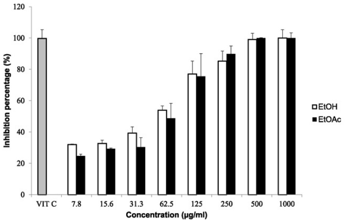

# Sceletium tortuosum demonstrates in vitro anti-HIV and free radical scavenging activity

P. Kapewangolo a,⁎, T. Tawha a, T. Nawinda a, M. Knott b, R. Hans a

a Department of Chemistry and Biochemistry, Faculty of Science, University of Namibia, Namibia b School of Pharmacy, University of Namibia, Namibia

a r t i c l e i n f o

a b s t r a c t

Article history:   
Received 29 April 2016   
Received in revised form 10 June 2016   
Accepted 24 June 2016   
Available online 9 July 2016

Edited by AR Ndhlala

Keywords:   
Sceletium tortuosum   
Anti-HIV   
Radical scavenging   
Phytochemicals

Crude extracts of commercially available Sceletium tortuosum (Aizoaceae) were investigated for in vitro anti-HIV and free radical scavenging activity for the first time. In addition, the chemical profile of S. tortuosum was determined using qualitative and quantitative phytochemical analysis. Crude extracts were prepared from dried plant parts of S. tortuosum. Ethanol and ethyl acetate extracts from the plants were tested for inhibitory activity against HIV-1 enzymes; protease (PR), reverse transcriptase (RT) and integrase (IN). S. tortuosum revealed the presence of anthraquinones, terpenes, polyphenols, anthocyanin, tannins, alkaloids, glycosides, carbohydrates and coumarins. The total phenolic, flavonoid and tannin contents were $1 7 1 . 8 9 \pm 0 . 0 5 \mathrm { m g G A E / g }$ , $6 7 8 . 5 1 \pm 0 . 0 1 \mathrm { { \ m g } 0 E / g }$ and $9 0 3 . 1 5 \pm$ $0 . 0 2 \mathrm { m g T A E / g }$ extract, respectively. Ethanol and ethyl acetate extracts of S. tortuosum inhibited HIV-1 RT and PR respectively. HIV-1 RT inhibition testing had $\mathrm { I C } _ { 5 0 }$ values of $< 5 0$ and $1 2 1 . 7 \pm 2 . 5 { \mu \mathrm { g / m L } }$ for ethanol and ethyl acetate extracts, respectively. In addition, both extracts also inhibited HIV-1 PR with $\mathrm { I C } _ { 5 0 }$ values $< 1 0 0 up \mu \mathrm { g / m L }$ Results of the antiradical activity indicate a dose-dependent ability of the extracts to scavenge DPPH radicals. For this experiment, $\mathrm { I C } _ { 5 0 }$ values of $4 9 . 0 \pm 0 . 2$ and $6 4 . 7 \pm 3 . 1 \mu \mathrm { g / m L }$ were obtained from the ethanolic and ethyl acetate extracts, respectively. This suggests that S. tortuosum might be a useful potential source of new lead compounds in the development of new anti-HIV and radical scavenging compounds.

$\mathfrak { C }$ 2016 SAAB. Published by Elsevier B.V. All rights reserved.

# 1. Introduction

Medicinal plants constitute an effective source of both traditional and modern medicine. About $8 0 \%$ of rural population depends on herbal medicine for primary health care (WHO, 2005). Over the years, the World Health Organization has advocated that countries should devote more attention to traditional medicine with a view to identify and explore aspects that provide safe and effective remedies for ailments of both microbial and non-microbial origin (WHO, 2005).

Southern Africa has a remarkable diversity of plants with a long tradition of medicinal use. A number of these plants reportedly contain compounds with anti-HIV and antioxidant properties (Van Wyk and Gericke, 2000; Van Wyk, 2011). Due to drug toxicity and the emergence of drug resistant viral strains (Clavel and Hance, 2004), there is an ongoing search for improved treatment against HIV/AIDS.

Sceletium tortuosum is widely distributed throughout Southern Africa and belongs to the family Aizoaceae, sub-family Mesembryanthemaceae. It is commonly referred to as Koegoed (Afrikaans), Kanna (Khoi) and

Sceletium (English) (Smith et al., 1996). S. tortuosum powders are commercially available as capsules known as “kanna” (Harvey et al., 2011; Shikanga et al., 2012) and are used to treat psychiatric disorders such as depression and anxiety (Gericke and Viljoen, 2008). Recent studies have highlighted a potential link between oxidative stress in the pathogenesis of neuropsychiatric disorders (Bakunina et al., 2015; Moylan et al., 2014; Smaga et al., 2015). Oxidative stress is caused by the accumulation of free radicals in the body which can be neutralized or scavenged by either endogenous or exogenous antioxidants. Some plant species belonging to the Aizoaceae family, for example Carpobrotus edulis, are used traditionally in the Eastern Cape, South Africa to boost the immune system of persons with HIV/AIDS as well as treat associated opportunistic infections (Omoruyi et al., 2012a; Vuuren and Naidoo, 2010). Omoruyi et al. (2012b) reported the antioxidant properties of C. edulis and linked the free radical scavenging activity of the extracts to the traditional success of the plant in managing aspects of HIV/AIDS.

HIV reportedly induces oxidative stress by disturbing cellular antioxidant defences and by initiating oxidative reactions. For this reasons oxidative stress is regarded as one of the mechanisms that contributes to the progression of HIV to AIDS (Gil et al., 2003; Kashou and Agarwal, 2011; Mallery et al., 2004). Advanced cases of HIV infection leaves individuals prone to opportunistic infections because of progressive immunodeficiency caused by the virus. Therefore, naturally occurring antioxidants could play a role as inexpensive therapeutic agents that could reduce the HIV viral load of affected individuals. As a result, investigating both the anti-HIV and radical scavenging properties of such plants is recommended.

## 2. Material and methods

### 2.1. Plant cultivation

The dried whole plant parts were kindly donated by Farm Vredelus in July 2014. Farm Vredelus is located in Mariental, Namibia and specializes in rare desert plants with well-known medicinal and healing properties. The farm exports various medicinal plant products including S. tortuosum capsules. S. tortuosum identification (M1362) was undertaken by Silke Rugheimer at the National Herbarium of Namibia. S. tortuosum seedlings were grown in shade net tunnels and subsequently planted out. Plant coordinates: $5 ~ 2 3 ^ { \circ } ~ 5 6 ^ { \prime } ~ 3 0 ^ { \prime \prime } ~ \mathrm { E } ~ 1 8 ^ { \circ } ~ 1 9 ^ { \prime } ~ 1 2 ^ { \prime \prime }$ . S. tortuosum was manually harvested and the roots were removed, dried and milled. Drying of the plant samples was done in a shade; air dried manner away from direct sunlight. The seed was produced in 2005 and certified organic by Namibia Organic Association (NOA) and Ecologic Certification (ECOCERT) for EU and USA.

### 2.2. Plant extraction

Powdered plant parts $( 1 1 1 . 2 { \mathrm { ~ g } } )$ were steeped in ethanol (1 L) at room temperature for $4 8 \mathrm { h }$ . The filtrate was concentrated under vacuum and one half of the residue was re-dissolved in ethyl acetate to exclude highly polymeric tannins which are regarded as non-specific enzyme inhibitors (Kapewangolo et al., 2013). The resulting extracts were dried and stored at room temperature until further use.

### 2.3. Qualitative phytochemical screening

The major secondary metabolite classes such as alkaloids, anthraquinones, coumarins, terpenes, saponins, phenols, flavonoids, emodins and tannins were screened for using reported methods (Mir et al., 2013; Ugochukwu et al., 2013).

### 2.4. Quantitative phytochemical analysis

Total phenolic, flavonoid and tannin contents present in S. tortuosum ethanol extract were determined and quantified following previously described standard procedures (Gracelin et al., 2013; Marinova et al., 2005).

#### 2.4.1. Total phenolic content $( T P C )$

The TPC was determined by using the Folin–Ciocalteu assay (Gracelin et al., 2013). In brief, $1 ~ \mathrm { m L }$ of extract $\mathrm { { 1 \ m g / m L } ) }$ in double distilled water $\mathrm { \backslash d d H } _ { 2 } 0 \}$ was mixed with $0 . 5 ~ \mathrm { m L }$ of $2 \mathsf { M }$ Folin–Ciocalteu reagent and $1 . 5 ~ \mathrm { m L }$ of $2 0 \%$ $\mathsf { \cdot N a } _ { 2 } \mathsf { C O } _ { 3 }$ . The volume was made up to $8 ~ \mathrm { m L }$ with $\mathrm { \ d d H } _ { 2 } 0 .$ . After incubation for 2 h at room temperature, the UV absorbance against the prepared reagent blank was taken at $7 6 5 \mathrm { n m }$ The TPC was determined from extrapolation of the calibration curve $\mathbf { R } ^ { 2 } = \mathbf { \Phi }$ 0.997) which was made by preparing various gallic acid solutions (0.3, 0.6, 1.3, 2.5, $5 ~ \mathrm { m g / m L }$ ). The TPC was expressed as milligrammes (mg) of gallic acid equivalents (GAE) per $\mathbf { g }$ of extract ${ \mathrm { ~ m g G A E / g } }$ extract).

#### 2.4.2. Total flavonoid content (TFC)

The TFC was determined following a modified version of the method reported by Marinova et al. (2005). Briefly, $1 \mathrm { m L }$ of sample $( 1 \mathrm { m g / m L } )$ or a standard solution of quercetin (0.3, 0.6, 1.3, $2 . 5 , 5 \mathrm { m g / m L }$ ) was added to $4 \mathrm { m L }$ of $\mathrm { \ d d H _ { 2 } O }$ and $0 . 3 \mathrm { m L }$ of $5 \% N a N O _ { 2 }$ . After 5 min, 0.3 mL $1 0 \% \mathsf { A l C l } _ { 3 }$ and $2 \mathrm { m L } 1 \mathrm { M N a O H }$ were added to the mixture. The total volume was made up to $1 0 ~ \mathrm { m L }$ with $\mathrm { \ d d H } _ { 2 } 0$ . The solution was mixed well and the

UV absorbance was measured against the reagent blank at $5 1 0 ~ \mathrm { { n m } }$ . The total flavonoids were expressed $\mathsf { a s } \ \mathsf { m g }$ of quercetin equivalents per $\mathsf { g }$ of extract $\mathrm { \langle m g \ O E / g }$ extract) using the gallic acid calibration curve $\mathrm {  ~ R } ^ { 2 } = 0 . 9 9 0 \$ ).

#### 2.4.3. Total tannin content (TTC)

The TTC of S. tortuosum was determined according to a method previously described by Gracelin et al. (2013). In brief, $5 \mathrm { m L }$ of the filtered sample $\mathrm { { \langle 1 0 \ m g / m L } }$ ) was mixed with $2 { \mathrm { ~ m L } }$ of 0.1 M $\mathrm { F e C l } _ { 3 }$ in $0 . 1 \mathrm { ~ M ~ H C l }$ and 0.008 M $\mathrm { K } _ { 4 } [ \mathrm { F e } ( \mathrm { C N } ) _ { 6 } ]$ . UV absorbance at $1 2 0 ~ \mathrm { { n m } }$ was read after $1 0 \ \mathrm { m i n }$ of incubation at room temperature. A standard calibration curve was prepared using various concentrations of tannic acid (0.3, $0 . 6 , 1 . 3 , 2 . 5 , 5 \mathrm { m g / m L } ,$ . TTC was expressed as mg tannic acid equivalents per $\mathsf { g }$ of extract $( { \mathrm { m g ~ T A E / g } }$ extract) using the tannic acid calibration curve $\mathbf { R } ^ { 2 } = 0 . 9 9 9 \mathbf { \Phi } .$ ).

#### 2.5. Anti-HIV assays

#### 2.5.1. HIV-1 protease assay

The HIV-1 protease (PR) inhibition assay was conducted using the FRET-based Sensolyte HIV-1 protease assay kit (Anaspec). Briefly, HIV-1 PR and the fluorogenic substrate were mixed with the extracts to a final reaction volume of $1 0 0 ~  { \mu \mathrm { L } }$ in a 96 well black assay plate (BRAND). The fluorescence intensity was measured at an excitation wavelength of $3 4 0 \mathrm { n m }$ and an emission wavelength of $4 9 0 \mathrm { n m }$ using a SpectraMax M2 plate reader. Acetyl pepstatin (AP) was used as a known inhibitor of HIV-1 PR. Other assay controls included a blank treatment with no extracts and, background controls with just extracts and buffer. S. tortuosum was tested at final concentrations of 25, 50, 100, 150, 200 and $2 5 0 ~ \mu \mathrm { g / m L }$ The $\mathrm { I C } _ { 5 0 }$ values were determined using GraphPad prism software (GraphPad Software Inc.).

#### 2.5.2. HIV-1 reverse transcriptase colorimetric assay

The in vitro HIV-1 reverse transcriptase (RT) activity of the extracts was evaluated using a non-radioactive HIV-RT colorimetric assay kit from Roche Diagnostics. The protocol outlined in the kit was followed using $4 \mathrm { n g }$ of enzyme per well. Extracts were tested at known concentrations (25, 50, 100, 150, 200, $2 5 0 \mu \mathrm { g / m L }$ . The extract concentrations were incubated with RT for 1 h at $3 7 ^ { \circ } \mathrm { C } .$ Subsequent hourly incubations involved the addition of an antibody conjugated to peroxidase, which binds to the digoxigenin-labelled DNA. In the final step, the peroxidase substrate solution $[ 2 , 2 ^ { \prime }$ -azino-bis-(3-ethylbenzthiazoline-6-sulfonic acid)] was cleaved by the peroxidase enzyme, producing a coloured reaction product. Doxorubicin was used as a positive control (Kuete et al., 2010; Mbaveng et al., 2011). The absorbance of the samples was read at $4 0 5 \mathrm { n m }$ using a SpectraMax M2 plate reader. $\mathrm { I C } _ { 5 0 }$ values were computed using GraphPad prism software.

#### 2.5.3. HIV-1 Integrase colorimetric assay

A non-radioactive HIV-1 integrase assay kit (XpressBio) was used to measure the inhibitory effects of S. tortuosum extracts against HIV-1 integrase (Jiang et al., 2010). Streptavidin-coated 96-well plates were coated with a double-stranded HIV-1 LTRU5 donor substrate (DS) DNA containing an end-labelled biotin by manufacturer. Full-length recombinant HIV-1 integrase protein was then loaded onto the oligo substrate. Extracts (0.2, 0.4, 0.8, 1 and $2 \mathrm { m g / m L }$ ) were added to the enzyme reaction and then a different double stranded target substrate (TS) DNA containing a $3 ^ { \prime }$ -end modification was added to the reaction mixture. The HRP-labelled antibody was directed against the TS $3 ^ { \prime }$ - end modification and the absorbance due to the HRP antibody–TMB peroxidase substrate reaction was measured at $4 5 0 \ \mathrm { n m }$ . Sodium azide was included as a positive control.

#### 2.5.4. Antiradical activity: DPPH assay method

The free radical scavenging activity of S. tortuosum extracts was evaluated using a modified method previously described by Kapewangolo et al. (2013). Briefly, extracts dissolved in ethanol were mixed with a ${ 9 0 \mu \mathrm { M } 2 } , 2$ -diphenyl-1-picrylhydrazyl (DPPH) ethanol solution to give final extract concentrations of 7.81, 15.63, 31.25, 62.5, 125, 250, 500 and $1 0 0 0 \mu \mathrm { g / m L }$ . After $3 0 \mathrm { m i n }$ incubation at room temperature, sample absorbance was measured at $5 2 0 \mathrm { n m }$ (SpectraMax M2). Absorbance values obtained were converted into percentage antiradical activity (Kuete et al., 2010; Marxen et al., 2007). Ascorbic acid was used as a standard control. $\mathrm { I C } _ { 5 0 }$ values were then calculated using GraphPad Prism software.

### 3. Results and discussion

Phytochemical results revealed that S. tortuosum extracts contained anthraquinones, terpenes, polyphenols, anthocyanin, tannins, alkaloids, glycosides, carbohydrates and coumarins. The amounts of total phenolic, flavonoid and tannin from ethanol extract were found to be $1 7 1 . 8 9 \pm 0 . 0 5 ~ \mathrm { m g ~ G A E / g }$ , $6 7 8 . 5 1 \pm 0 . 0 1 \mathrm { { \ m g \ Q E / g } }$ and $9 0 3 . 1 5 \ \pm$ $0 . 0 2 ~ \mathrm { m g ~ T A E / g }$ extract, respectively. The relative amounts of tannin and flavonoid components were observed to be higher than that of the phenolic components as shown in Table 1. Phytochemical content was only determined for the ethanol extract of S. tortuosum due to the type of extraction undertaken in this study; extraction of dried plant parts in ethanol followed by subsequent extraction of the ethanol filtrate with ethyl acetate to exclude highly polar tannins which are non-specific enzyme inhibitors (Klos et al., 2009). Minimal literature was available on the phytochemical analysis of S. tortuosum, with the exception of alkaloids from S. tortuosum. In the literature, the phytochemical investigation of C. edulis, a plant also belonging to the same family Aizoaceae, demonstrated a high tannin content in the ethanolic extract which is in agreement with data presented in this study (Omoruyi et al., 2012b). However, the relative amount of total phenolic content for C. edulis in the literature was higher than that reported for S. tortuosum in this study. In addition, Omoruyi et al. (2012b) reported lower flavonoid content for C. edulis ethanolic extract. A literature search revealed minimal information on the phytochemical investigation of plants belonging to the Aizoaceae family, thus, encouraging extensive research to be conducted on these plants. The high tannin and flavonoid contents observed here for S. tortuosum can be attributed to the good radical scavenging activity detected. The effect of tannins and flavonoids on the protection of cells from oxidativeinduced damage/death has been reported (Panat et al., 2016; Zielińska-Przyjemska et al., 2015) and the relatively high content of these phytochemicals recorded for S. tortuosum is noteworthy.

The activity of S. tortuosum extracts against HIV-1 RT, IN and PR varied. $\mathrm { I C } _ { 5 0 }$ values were obtained for both the ethanolic and ethyl acetate extracts (Table 2). Both extracts possessed anti-RT and anti-PR activities. The ethanolic extract inhibited HIV-1 RT by $5 9 . 9 \%$ at $1 0 0 ~ \mathrm { \mu g / m L }$ $( \mathrm { I C } _ { 5 0 } < 5 0 \mu \mathrm { g / m L } )$ and at the same concentration HIV-1 PR was inhibited by $9 1 . 1 \%$ . The ethyl acetate extract inhibited HIV-1 RT by $56 . 7 \%$ at $2 0 0 \mu \mathrm { g / m L }$ $\mathrm { ' } \mathrm { I C } _ { 5 0 } = 1 2 1 . 7 \pm 2 . 5 \mu \mathrm { g / m L } )$ and inhibition of HIV-1 PR was $100 \%$ at $1 0 0 \mu \mathrm { g / m L }$ . Doxorubicin, used as a positive control for HIV-1 RT, showed an inhibition of $9 0 . 1 \%$ at $2 5 \mu \mathrm { g } / \mathrm { m L } ,$ while the known inhibitor for HIV-1 PR, acetyl pepstatin, gave an inhibition of $9 2 . 6 \%$ at $1 0 ~ \mu \mathrm { g / m L }$ . Both extracts demonstrated weak activity against HIV-1 integrase with less than $20 \%$ inhibition at the highest concentration tested ${ 4 0 0 } ~ \mu \mathrm { g / m L } )$ . This data suggests that S. tortuosum contains compounds that specifically inhibit HIV-1 RT and PR. However, as only crude extracts were tested, it should be noted that the synergistic therapeutic actions of various phytochemicals (Ma et al., 2009) could also be responsible for the bioactivity observed here.

Table 1 Total phenolic (TPC), total flavonoid (TFC) and total tannin (TTC) contents in ethanol extract of S. tortuosum dried plant parts.   

<html><body><table><tr><td>Phytochemical detected</td><td>S. tortuosum sample</td></tr><tr><td>TPC (mg GAE/g)</td><td>171.89 ± 0.05</td></tr><tr><td>TFC (mg QE/g)</td><td>678.51 ± 0.01</td></tr><tr><td>TTC (mg TAE/g)</td><td>903.15 ± 0.02</td></tr></table></body></html>

All analyses are the mean of triplicate measurements $\pm$ standard deviation.

Table 2 HIV-1 enzyme inhibitory activity of S. tortuosum extracts and positive controls.   

<html><body><table><tr><td>Sample</td><td colspan="3">IC50 (μg/mL)± SD</td></tr><tr><td></td><td>HIV-1 RT</td><td>HIV-1 PR</td><td>HIV-1 IN</td></tr><tr><td>Ethanol extract</td><td><50</td><td><100</td><td>>400</td></tr><tr><td>Ethyl acetate extract</td><td>121.7 ± 2.5</td><td><100</td><td>>400</td></tr><tr><td>Acetyl pepstatina</td><td>1</td><td><10</td><td>1</td></tr><tr><td>Doxorubicinb</td><td><25</td><td>1</td><td>1</td></tr><tr><td>Sodium azide'</td><td>1</td><td>1</td><td><10</td></tr></table></body></html>

a Positive control for HIV-1 protease (PR). b Positive control for HIV-1 reverse transcriptase (RT). c Positive control for HIV-1 integrase (IN): concentration in $\% .$

The results of the antiradical activity indicated in Fig. 1 showed a dose-dependent response. $\mathrm { I C } _ { 5 0 }$ values of $4 9 . 0 \pm 0 . 2$ and $6 4 . 7 \pm$ $3 . 1 \mu \mathrm { g } / \mathrm { m L }$ were obtained for both the ethanol and ethyl acetate extracts, respectively. The free radical scavenging activity of S. tortuosum observed in the present study could be attributed to the presence of potential antioxidant compounds including coumarins, flavonoids, phenols and alkaloids (Gupta and Sharma, 2006). The radical scavenging activity of S. tortuosum is an indication that it is a potential natural antioxidant. S. tortuosum is traditionally used to treat depression and anxiety (Gericke and Viljoen, 2008). There are recent reports on the potential role of oxidative stress in the pathogenesis of psychiatric diseases (Bakunina et al., 2015; Smaga et al., 2015) and the antiradical potential of S. tortuosum could be attributed to the popular use of this commercial plant in managing depression and anxiety.

Oxidative stress is also largely linked to the activation of HIV-1 leading to the development of AIDS (Allard et al., 1998; Gil del Valle et al., 2013). Therefore, having an agent with both anti-HIV and antioxidant properties is of therapeutic importance. Currently, there exist no reports on the HIV inhibitory properties of S. tortuosum, making this in vitro HIV study a first for this plant.

### 4. Conclusion

The in vitro anti-HIV data presented here provides evidence that S. tortuosum contains compounds with inhibitory effects against both HIV-1 RT and PR. In addition, the plant also appears to possess compounds with antiradical properties. The free radical scavenging results obtained in this study justify the traditional success of S. tortuosum in managing depression and anxiety. The anti-HIV results obtained substantiate the use of selected Aizoaceae plants in managing HIV/AIDS. Further research will include the isolation and identification of these active compounds (using bio-assayed fractionated guidance) as well as determining their exact mechanisms of action.

  
Fig. 1. Free radical scavenging activity of the crude extracts from S. tortuosum. The data represents the mean of multiple replicates. Vitamin C was used as a standard control with an inhibition of $9 9 . 8 \%$ at $5 0 \mu \mathrm { g / m L }$ $\mathrm { ' } \mathrm { I C } _ { 5 0 } < 1 . 6 \mu \mathrm { g / m L } \mathrm { ' }$ . S. tortuosum ethanol (EtOH) and ethyl acetate (EtAOc) extracts demonstrated good antiradical activity with $\mathrm { I C } _ { 5 0 }$ values of $4 9 . 0 \pm 0 . 2$ and $6 4 . 7 \pm 3 . 1 \mu \mathrm { g / m L } ,$ , respectively.

#### Acknowledgements

Authors acknowledge Farm Vredelus in Mariental (Namibia) for the donation of S. tortuosum. This work was supported by the University of Namibia's Research and Publications Office [Grant number URPC/2014/ 184].

#### References

Allard, J.P., Aghdassi, E., Chau, J., Salit, I., Walmsley, S., 1998. Oxidative stress and plasma antioxidant micronutrients in humans with HIV infection. The American Journal of Clinical Nutrition 67, 143–147.   
Bakunina, N., Pariante, C.M., Zunszain, P.A., 2015. Immune mechanisms linked to depression via oxidative stress and neuroprogression. Immunology 144, 365–373.   
Clavel, F., Hance, A.J., 2004. HIV drug resistance. The New England Journal of Medicine 350, 1023–1035.   
Gericke, N., Viljoen, A.M., 2008. Sceletium—a review update. Journal of Ethnopharmacology 119, 653–663.   
Gil del Valle, L., Hernández, R.G., Ávila, J.P., 2013. Oxidative stress associated to disease progression and toxicity during antiretroviral therapy in human immunodeficiency virus infection. Journal Virology Microbiology 2013. http://dx.doi.org/10.5171/2013. 279685.   
Gil, L., Mart, G., González, I., Tarinas, A., Álvarez, A., Giuliani, A., Molina, R., Tápanes, R., Pérez, J., Sonia, O., 2003. Contribution to characterization of oxidative stress in HIV/AIDS patients. Pharmacological Research 47, 217–224.   
Gracelin, S.D.H., John, G.A., Jeya, P.B., Kumar, R., 2013. Qualitative and quantitative analysis of phytochemicals in five Pteris species. International Journal of Pharmacy and Pharmaceutical Sciences 5, 4–6.   
Gupta, V.K., Sharma, S.K., 2006. Plants as natural antioxidants. Natural Product Radiance 5, 326–334.   
Harvey, A.L., Young, L.C., Viljoen, A.M., Gericke, N.P., 2011. Pharmacological actions of the South African medicinal and functional food plant Sceletium tortuosum and its principal alkaloids. Journal of Ethnopharmacology 137, 1124–1129.   
Jiang, F., Chen, W., Yi, K., Wu, Z., Si, Y., Han, W., Zhao, Y., 2010. The evaluation of catechins that contain a galloyl moiety as potential HIV-1 integrase inhibitors. Clinical Immunology 137, 347–356.   
Kapewangolo, P., Hussein, A.A., Meyer, D., 2013. Inhibition of HIV-1 enzymes , antioxidant and anti-inflammatory activities of Plectranthus barbatus. Journal of Ethnopharmacology 149, 184–190.   
Kashou, A.H., Agarwal, A., 2011. Oxidants and antioxidants in the pathogenesis of HIV/AIDS. Open Reproductive Science Journal 3, 154–161.   
Klos, M., van deVenter, M., Milne, P.J., Traore, H.N., Meyer, D., Oosthuizen, V., 2009. In vitro anti-HIV activity of five selected South African medicinal plant extracts. Journal of Ethnopharmacology 124, 182–188.   
Kuete, V., Metuno, R., Keilah, P.L., Tshikalange, E.T., Ngadjui, B.T., 2010. Evaluation of the genus Treculia for antimycobacterial, anti-reverse transcriptase, radical scavenging and antitumor activities. South African Journal Botany 76, 530–535.   
Ma, X.H., Zheng, C.J., Han, L.Y., Xie, B., Jia, J., Cao, Z.W., Li, Y.X., Chen, Y.Z., 2009. Synergistic therapeutic actions of herbal ingredients and their mechanisms from molecular interaction and network perspectives. Drug Discovery Today 14, 579–588.   
Mallery, S.R., Pei, P., Landwehr, D.J., Clark, C.M., Bradburn, J.E., Ness, G.M., Robertson, F.M., 2004. Implications for oxidative and nitrative stress in the pathogenesis of AIDS-related Kaposi's sarcoma. Carcinogenesis 25, 597–603.   
Marinova, D., Ribarova, F., Atanassova, M., 2005. Total phenolics and total flavonoids in bulgarian fruits and vegetables. Journal of the University of Chemical Technology and Metallurgy 40, 255–260.   
Marxen, K., Vanselow, K.H., Lippemeier, S., Hintze, R., Ruser, A., Hansen, U., 2007. Determination of DPPH radical oxidation caused by methanolic extracts of some microalgal species by linear regression analysis of spectrophotometric measurements. Sensors 7, 2080–2095.   
Mbaveng, A.T., Kuete, V., Mapunya, B.M., Beng, V.P., Nkengfack, A.E., Meyer, J.J.M., Lall, N., 2011. Evaluation of four Cameroonian medicinal plants for anticancer, antigonorrheal and antireverse transcriptase activities. Environmental Toxicology and Pharmacology 32, 162–167.   
Mir, M.A., Sawhney, S.S., Jassal, M.M.S., 2013. Qualitative and quantitative analysis of phytochemicals of Taraxacum officinale. The Journal of Pharmacy and Pharmacology 2, 1–5.   
Moylan, S., Berk, M., Dean, O.M., Samuni, Y., Williams, L.J., O'Neil, A., Hayley, A.C., Pasco, J.A., Anderson, G., Jacka, F.N., Maes, M., 2014. Oxidative & nitrosative stress in depression: why so much stress? Neuroscience and Biobehavioral Reviews 45, 46–62.   
Omoruyi, B.E., Bradley, G., Afolayan, A.J., 2012a. Ethnomedicinal survey of medicinal plants used for the management of HIV/AIDS infection among local communities of Nkonkobe Municipality, Eastern Cape. South Africa Journal Medicinal Plants Research 6, 3603–3608.   
Omoruyi, B.E., Bradley, G., Afolayan, A.J., 2012b. Antioxidant and phytochemical properties of Carpobrotus edulis (L.) bolus leaf used for the management of common infections in HIV/AIDS patients in Eastern Cape Province. BMC Complementary and Alternative Medicine 12. http://dx.doi.org/10.1186/1472–6882–12-215.   
Panat, N.A., Maurya, D.K., Ghaskadbi, S.S., Sandur, S.K., 2016. Troxerutin, a plant flavonoid, protects cells against oxidative stress-induced cell death through radical scavenging mechanism. Food Chemistry 194, 32–45.   
Shikanga, E.A., Kamatou, G.P.P., Chen, W., Combrinck, S., Viljoen, A.M., 2012. Validated RP-UHPLC PDA and GC–MS methods for the analysis of psychoactive alkaloids in Sceletium tortuosum. South African Journal Botany 82, 99–107.   
Smaga, I., Niedzielska, E., Gawlik, M., Moniczewski, A., Krzek, J., Przegalinski, E., Pera, J., Filip, M., 2015. Oxidative stress as an etiological factor and a potential treatment target of psychiatric disorders. Part 2. Depression, anxiety, schizophrenia and autism. Pharmacological Reports 67, 569–580.   
Smith, M.T., Crouch, N.R., Gericke, N., Hirst, M., 1996. Psychoactive constituents of the genus Sceletium N.E.Br. and other Mesembryanthemaceae: a review. Journal of Ethnopharmacology 50, 119–130.   
Ugochukwu, S.C., Arukwe Uche, I., Onuoha, I., 2013. Preliminary phytochemical screening of different solvent extracts of stem bark and roots of Dennetia tripetala G. Baker Asian Journal Plant Science Research 3, 10–13.   
Van Wyk, B.-E., 2011. The potential of South African plants in the development of new medicinal products. South African Journal Botany 77, 812–829. http://dx.doi.org/10. 1016/j.sajb.2011.08.011.   
Van Wyk, B.-E., Gericke, N., 2000. People's Plants: a Guide to Useful Plants of Southern Africa. Briza Publications, Pretoria.   
Vuuren, S.F.V., Naidoo, D., 2010. An antimicrobial investigation of plants used traditionally in southern Africa to treat sexually transmitted infections. Journal of Ethnopharmacology 130, 552–558.   
WHO, 2005. National policy on traditional medicine and regulation of herbal medicines. Report of a WHO Global Survey World Health Organization.   
Zielińska-Przyjemska, M., Ignatowicz, E., Krajka-Kuźniak, V., Baer-Dubowska, W., 2015. Effect of tannic acid, resveratrol and its derivatives, on oxidative damage and apoptosis in human neutrophils. Food and Chemical Toxicology 84, 37–46.