# JournalofAdvancedPharmacyResearch

## A Phytochemical and Biological Review on Plants of the Family Aizoaceae

Khayrya A. Youssif1, Ali Elshamy $^ 2$ , Mohamed A. Rabeh $^ { 1 , 2 }$ , Nagwan M. Gabr3, Eman G. Haggag

$^ { I }$ Department of Pharmacognosy, Faculty of Pharmacy, Modern University for Technology and Information, Cairo, Egypt, $^ 2$ Department of Pharmacognosy, Faculty of Pharmacy, Cairo University, Cairo, Egypt, 3Department of Pharmacognosy, Faculty of Pharmacy, Helwan University, Cairo, Egypt, 11795.

\*Corresponding author: Prof. Dr. Eman Gaber Haggag, Department of Pharmacognosy, Faculty of Pharmacy, Helwan University, Cairo, Egypt, 11795 Tel. +201000023022 Email address: wemisr@gmail.com

Submitted on: 26-04-2019; Revised on: 12-06-2019; Accepted on: 18-06-2019

To cite this article: Youssif, K. A.; Elshamy, A.; Rabeh, M. A.; Gabr, N. M.; Haggag, E. G. A Phytochemical and Biological Review on Plants of the Family Aizoaceae. J. Adv. Pharm. Res. 2019, 3 (4), 158-181. DOI: 10.21608/APRH.2019.12303.1083

ABSTRACT

Objectives: This study is aimed to be a comprehensive review of the phytochemical constituents and biological activities of Aizoaceae family plants (Mesembryanthemaceae). Methods: This study is covering articles between 1969 and 2018, reviewed from internationally accepted databases and scientific data from scientific Journals. Results: Phytochemically studied plants of family Aizoaceae have shown the presence of various classes of compounds including; alkaloids, triterpenes, sterols, lignans, phenolic compounds, betacyanins, and essential oils. Biological studies on plants of family Aizoaceae have indicated various bioactive potentials including antioxidant, antidiabetic, antimicrobial, antitumor, hepatoprotective, anti-inflammatory and other effects. The reported medicinal plants of family Aizoaceae were selected and summarized on the basis of their; phytochemical constituents and biological activities. Conclusion: The results of this study may inspire further ethno-botanical and ethno-pharmacological research and investigations toward drug discovery.

Keywords: Aizoaceae; Biological activities; Phytochemical constituents

### INTRODUCTION

The Aizoaceae (Mesembryanthemaceae) family is mostly composed of succulent plants of which $9 9 \%$ are found in South or Southwest of Africa. The other one-percent are found in coastal areas of Australia, New Zealand, Mediterranean area, Canary Islands, and the western coasts of Chile and California1.

Family Aizoaceae constitutes a major part of the Southern African succulent flora. With approximately 1860 species in 127 genera, and in India the family is represented by three genera, namely, Sesuvium, Trianthema and Zaleya with seven species distributed in the coastal and lowland areas of peninsular India and the Gangetic plains2. It is also South Africa's second largest plant family3. Based on the division given by Bittrich & Hartmann4, five subfamilies are recognized: Aizooideae, Mesembryanthmoideae, Rushioideae, Sesuvioideae and Tetragonioideae5. In Egypt, Boulos6 recognized five genera, but Hosny7 listed only four genera without considering Sesuvium. According to Boulos6 and Hosny7, Trianthema is represented in Egypt by two species: T. portulacastrum L. and either T. triquetra Willd. Ex Spreng. (according to Boulos6) or $T .$ Crystalline (Forssk.) Vahl (according to Hosny7). Zaleya is represented by two species: Z. pentandra (L.) C. Jeffrey and Z. decandra (L.) Burm. f.6, or by only one species: Z. pentandra (L.) C. Jeffrey7. This family is represented in Egypt by 6 genera and 10 species8. It typically inhabits dry subtropical deserts and wet tropical coasts5-9. Native species of Aizoaceae are distributed through Mediterranean coastal habitats and the Nile Valley as weeds of cultivated land, and extend to deserts.

Many members of the family are of economic importance as ornamentals and in cultivation worldwide10 as some of them are used to stabilize sand dunes in coastal regions 11 while others are important as medicinal plants12 e.g. Tetragonia tetragonioides is used in treatment of enteritis and stomach ache as well as stomach cancer and ulcer12. Extracts from these plants are used as preservatives, as a remedy against throat infections and in soap making13. Although Aizoaceae is considered as one of the most diverse and abundant families, it was found that it is the least studied in terms of medicinal potential14. It would, therefore, be important to extensively investigate other plants of family Aizoaceae for future drug discovery. Thus, we aimed to make a comprehensive review of the chemical constituents and biological activities of family Aizoaceae covering the articles between 1969 and 2018.

#### MATERIAL AND METHODS

The research strategy employed in the review of family Aizoaceae includes internationally accepted databases like Science Direct, Scopus and Web of Science as well as scientific data collected from scientific Journals.

#### RESULTS AND DISCUSSION Phytochemical constituents

A variety of chemicals have been isolated from different species of family Aizoaceae including; alkaloids, triterpenes, sterols, lignans, flavonoids, phenolic compounds, essential oils, and some miscellaneous compounds5-15-16.

#### Alkaloids

Mesembrine alkaloids are considered to be the primary active constituents of the South African medicinal plant Sceletium tortuosum Aizoaceae), and it is used as the dried or fermented aerial material from the plant, which is known as Kanna (Aka, Channa, Kougoed). Traditional regional use ranged from relieving thirst, mild analgesia, and alteration of mood19. Only two genera of family Aizoaceae were reported to be rich with alkaloids which are genus Sceletium and genus Trianthema as shown in Table 1. Sceletium spp. is currently the only known genus having species with relatively high levels of mesembrine19, which belong to the crinane class of compounds based on the alkaloid skeleton17. Jeffs et al.

(1982) categorized the various Sceletium alkaloids into four structural groups: (1) the 3a-aryl-cisoctahydroindole class (e.g. mesembrine and the new isolated alkaloid channaine)17-18, (2) C-seco mesembrine alkaloids (e.g. joubertiamine), (3) alkaloids containing a 2,3 disubstituted pyridine moiety and 2 nitrogen atoms (e.g. Sceletium alkaloid A4) and (4) a ring C-seco Sceletium alkaloid A4 group (e.g. tortuosamine)20. The mesembrine alkaloid is the most studied of the mesembrine alkaloids due to its relative abundance in S. tortuosum and biological activity, it was initially partially isolated, characterized, and named by Zwicky, and it was purified and crystallized as picrate19. Mesembranol and its acetylated derivative, 4-Oacetylmesembrenol was also isolated together with 4-Odemethylmesembrenol and 4-O-demethylmesembranol from Sceletium spp in addition to mesembrenone. Joubertiamine and its derivatives represented a new structural class different from the known mesembranes. Joubertiamine, dehydrojoubertiamine, and dihydrojoubertiamine were all referred to as the secomesembranes and were isolated from Sceletium joubertii17. The preponderance of research on Sceletium alkaloids has revolved around isolation and structural elucidation. Very little is known about the distribution and chemotaxonomic patterns of these alkaloids within the genus17.

#### Di-, Tri-, tetra-terpenes, and sterols:

Phytochemical screening and analysis of some species of family Aizoaceae showed presence of di-, tri, and tetraterpenes. $\beta \cdot$ - amyrin, oleanolic acid, Uvaol were isolated from the leaves’ methanolic extract of $C$ . edulis16, while ecdysterone, were isolated from aqueous and organic extracts of S. portulacastrum and $T .$ portulacastrum15-24 Pentandradione and pentandraone were isolated only from the methanolic extract of $Z .$ pentandra50-51.

Sterols and their glycosides e.g. (Stigmasterol, $\beta$ -Sitosterol, Stigmasterol 3-O- $\cdot \beta$ -D-glucoside and $\beta \cdot$ - Sitosterol 3-O- $\beta$ -D-glucoside and the novel and recently isolated sterol 17-(5-ethyl-6-methylheptan-2-yl)- 4,4,10,13-tetramethyl-hexadecahydro-1H-cyclopenta (α) phenanthren-3-ol ) have been reported to be isolated from T. portulacastrum15-16-21-22-24-25-26-27-28 as shown in Table 2.

#### Lignans and neolignans:

Aptenia cordifolia and T. turgidifolium leaves are the only reported member of family Aizoaceae to show the presence of lignans and neolignans e.g. Pinorsinol, syringaresinol, di-erythro-syringylglycrol- $\beta$ - $O \mathrm { - } 4 { , } 4 ^ { \setminus }$ -syringarsinol ether and apteniol A-G were isolated from the methanolic extract of the leaves of $A$ . cordifolia22-29-30-31. Isoamericanin A was isolated from T. turgidifolium 22 as shown in Table 3.

<html><body><table><tr><td colspan="4">Table1.Alkaloids isolated from plants of family Aizoaceae</td></tr><tr><td> Source</td><td>Used part/extract</td><td>Chemical constituents</td><td>Compound no.</td></tr><tr><td>Sceletium spp. Sceletium tortuosum (L.) N. E. Br. of the entire plant Sceletium joubertii L. Bolus</td><td>Acid-base extraction</td><td>- △ mesembrenone17 - 4`-O-demethylmesemranol17 - Mesembrenol17 - Mesembranol17 - 4`-O-demethylmesemrenone17 - Sceletenone17 - N-demethyl-N-formyl mesembrenone17</td><td>1- →12</td></tr><tr><td>Sceletium spp. Sceletium tortuosum (L.) N. E. of the entire plant Sceletium joubertii L.Bolus</td><td>Acid-base extraction- Dehyrojoubertiamine17</td><td>- O-acetylmesembrenoll7 - Mesembrane17 - N-demethylmesembrenol17 - N-demethylmesembranol17 - Hordenine17 - Dihyrojoubertiamine17 - Joubertiamine17 - Joubertinamine17 - O-methyldehydro-joubertiamine17 - O-methyljoubertiamine17 - O-methyldihydro-joubertiamine17 - 3`-methoxy-4`- O-methyljoubertiamine17 4-(3,4-dimethoxyphenyl)-4-[2-acetyl methylamino) ethyl]cyclohexanone17 - 3`-methoxy-4`- O-methyljoubertiaminol17 4-(3-methox-4-hydroxyphenyl)-4-[2- (acetylmethylamino) ethylcyclohexadienone17 3a-(3,4-dimethoxyphenyl)-1-methyl- 1,2,3,3a,4,5,6,8,9,9b-decahydro-7H- pyrrolo[2,3-f] quinolin-7-one17 - Sceletium alkaloid A417 - Touruosaminel7</td><td>13 →32</td></tr><tr><td></td><td></td><td>- N-formyltortuosamine17 - N-acetyltortuosamine17 - Mesembrenone17 - Channaine18 - Mesembrine17 - 4`- O-demethylmesemrenol17</td><td></td></tr><tr><td>T. decandra L.</td><td>leaves, seeds</td><td>Organic extracts of-Trianthemine22 fruitsand</td><td></td></tr><tr><td>T. portulacastrum L.</td><td>Organic extracts of- Punarnavine23 the entire plant</td><td></td><td>33</td></tr><tr><td>Sesuvium portulacastrum L.</td><td>Aqueous, methanolic and organic extracts of</td><td>- Trianthemine23 - Capsaicin21-25</td><td>34</td></tr></table></body></html>

Table 2. Reported plants of family Aizoaceae showing sterols, di-, tri-, and tetra-terpenes:   

<html><body><table><tr><td>Reported Source</td><td>Used part/extract</td><td>Chemical constituents</td><td>Compound no.</td><td></td></tr><tr><td>Carpobrotus edulisL.Bolus</td><td>Methanolic extraxct of the leaves</td><td>- β- amyrin16 - Oleanolic acid16 - Uvaol6</td><td>35</td><td>→37</td></tr><tr><td>Sesuvium portulacastrum L.</td><td>Aqueous,ethanolic and dichloromethane extracts of leaves and stems</td><td>- Ecdysterone15 - Ecdysone15 - 22,23-Dihydrostigmasterol21-25 - Ethyl iso-allocholate26 - Squalene26</td><td>38</td><td>→43</td></tr><tr><td>- Trianthema decandra L.</td><td>Leaves,fruits and seeds organic extracts</td><td>- 3-Acetyl aleuritolic acid22 - Stigmasterol 3- O-β-D-glucoside22 - β-Sitosterol 3- O-β-D-glucoside22</td><td>441</td><td>→47</td></tr><tr><td>Trianthema portulacastrum L.</td><td>Organic extracts of the aerial parts</td><td>- Ecdysterone24 - 3-Acetyl aleuritolic acid24 -Stigmasterol24 - β-Sitosterol24 - Stigmasterol 3- O-β-D-glucoside24 - β-Sitosterol 3- O-β-D-glucoside24 - Trianthenol22-24</td><td>44</td><td>38 50</td></tr><tr><td>Zaleya pentandra L.</td><td>Methanolic extract of the aerial parts</td><td>- Pentandradione28 - Pentandraone28</td><td>51,52</td><td></td></tr></table></body></html>

#### Fatty acids, and fatty alcohols:

Sesuvium portulacastrum is the only member of family Aizoaceae with data reported on isolates of fatty acids and fatty alcohols as shown in Table 4. It showed the presence of; Linolenic acid, oleic acid, eicosyl ester, 9,12,15-Octadecatrienoic acid, 2,3- dihydroxypropyl ester, (Z,Z,Z)-, hexadecanoic acid ethyl ester, lauric acid, tridecanoic acid, myristic acid, pentadecanoic acid, palmitic acid, heptadecanoic acid, stearic acid, oleic acid, linoleic acid, nonadecanoic acid, arachidic acid, heneicosanoic acid, behenic acid, octadecanoic acid, 1-Docosanol and rhodopsin, which were isolated from dichloromethane extract of its leaves and stems11-26-32-33.

#### Catechins and phenolic acids

Reported data showed that catechins and phenolic acids were isolated from six members only of family Aizoaceae which are; A. cordifolia, C. edulis, M. crystallinum, S. portulacastrum, T. decandra, and T. portulacastrum14-21-22-25-26-29-33-34-35-36. It has been reported, that epicatechin was isolated from the organic extracts of the leaves of two different plant species C. edulis and S. portulacastrum14-21-22-25-26-29-33-34-35-36. On the other hand, we found, that 2,6-bis(1,1- dimethylethyl)-4-methylphenol is the only phenolic compound isolated from M. crystallinum. Other isolated catechins and phenolic compounds are shown in Table 5.

#### Flavonoids

Several flavonoids were isolated from different species of family Aizoaceae. Rutin was isolated from the leaves ethyl acetate extract of C. edulis and Mesembryanthemum forsskaolii. Moreover, the new compound C-methyl flavone was isolated from the organic extracts of the whole plant of the two species T. portulacastrum and T. decandra11-22-24-34-37-38-39-40. Moreover, 2-(3’,4’dihydroxyphenyl) 3,5,7- trihydroxychromen-4 one was also isolated from T. decandra40. Other isolated compounds are shown in Table 6.

#### Betacyanin

The genus Lampranthus of family Aizoaceae was observed according to the reported data in Table (7) to show the presence of betacyanins. This includes Lampranhus peersu and Lampranthus sociorum. Betanin was isolated from the two plant species Drosanthemum floribundum and Lampranthus spp. Also, dopaxanthin was the only betacyanin isolated from Glottiphyllum longum, while $\beta$ -Cyanin was isolated from T. portulacastrum24-41-42-43-44.

Table 3. Lignans, neolignans isolated from plants of family Aizoaceae   

<html><body><table><tr><td>Species</td><td>Used part/extract</td><td>Chemical constituents</td><td>Compound no.</td><td></td></tr><tr><td rowspan="5">Aptenia cordifolia L.F.</td><td rowspan="5">Methanolic extract of the leaves</td><td>- Pinorsinol29</td><td>53</td><td>59</td></tr><tr><td>- Syringaresinol29</td><td></td><td></td></tr><tr><td>- Di-erythro-syringylglycrol-β-o-4,4`-</td><td></td><td></td></tr><tr><td>syringarsinol ether29</td><td></td><td></td></tr><tr><td>- Apteniol A,B,C,D,E,F</td><td></td><td></td></tr><tr><td rowspan="2">Trianthema turgidifolium F.</td><td></td><td>- Apteniol G30</td><td></td><td></td></tr><tr><td>Methanolic extract of the leaves</td><td>-Isoamericanin A22</td><td></td><td></td></tr></table></body></html>

Table 4. Fatty acids and fatty alcohols isolated from plants of family Aizoaceae   

<html><body><table><tr><td>Species</td><td>Used part/extract</td><td>Chemical constituents</td><td colspan="2">Compound no.</td></tr><tr><td>Sesuvium portulacastrumL.</td><td>Dichloromethane extracts of leaves and stems</td><td>- Linolenic acid11-32 - Oleic acid eicosyl ester26 - 9,12,15-Octadecatrienoic acid,2,3- dihydroxypropyl ester,(Z,Z,Z)-26 -Hexadecanoic acid ethylester26</td><td>60</td><td>→63</td></tr><tr><td>Sesuvium portulacastrum L.</td><td>Dichloromethane extracts of leaves and stems</td><td>- Lauric acid32 - Tridecanoic acid32 - Pentadecanoic acid32 - Palmitic acid11,32 - Heptadecanoic acid32 - Myristic acid11,32</td><td>64</td><td>→79</td></tr></table></body></html>

#### Nitrogen containing compounds

The reported data showed that some nitrogencontaining compounds like 2-(dimethylamino)-1- phenylethanol, 3-(1H-inol-3-yl) propionic acid, 3-(1Hinol-3-yl)propionic acid methyl ester, (2S,E)-N-[2- Hydroxy-2-(4-hydroxyphenyl)ethyl] Ferulamide, (E)- N--[2-Hydroxy-2-(4-hydroxy-3-methoxyphenyl)-ethyl] ferulamide, and (E)-N-[2-(4-Hydroxyphenyl)-2- propoxyethyl] ferulamide has been isolated from the methanolic extract of A. cordifolia, in addition to many compounds e.g. Trans-4-hydroxyprolinebtaine, and Pyrrolo [1,2-A] Pyrazin-1,4-dione,hexahydro-3- (phenylmethyl) were isolated from aqueous and organic extracts of  S. porulacastrum. Moreover, nicotinic acid is the only isolated nitrogen-containing compound isolated from T. portulacastrum15-21-23-25-29-31-33as shown in Table 8.

#### Essential oils

The available data reported that only the leaves of S. porulacastrum yielded oil via hydro-distillation which upon analysis using GC-MS showed the following composition: о-cymene, $\mathbf { \boldsymbol { a } }$ -pinene, $2 \cdot \beta \cdot$ - pinene, trans-caryophyllene, 1,8- cineole, limonene, $\mathbf { \boldsymbol { a } } .$ - terpinene, $\mathfrak { a }$ -terpinolene, camphene, (-)-bornylacetate, tridecane and $\mathfrak { a }$ -humulene21-45 as shown in Table 9.

#### Miscellaneous compounds:

It has been reported, that different miscellaneous compounds have been isolated from five different plants of family Aizoaceae including; A. cordifolia, C. edulis, T. portulacastrum and S. portulacastrum16-23-24-26-29-33-46-47 as shown in Table 10.

Table 5. Catechins and phenolic acids and their esters isolated from plants of family Aizoaceae   

<html><body><table><tr><td> Species</td><td>Used part/extract</td><td>Chemical constituents</td><td>Compound no.</td></tr><tr><td>Aptenia cordifolia L.F.</td><td>Methanolic extract of the leaves</td><td>- 4-hydroxybenzoic acid29 - Dihyrocinnamic acid29 - 4-hydroxy-dihydrocinnamic acid29 - Dihydrofrulic acid29 - 3,4-dimethoxy-dihyrocinnamic acid29 -3,4-dimethoxy-dihyro cinnamic acid methyl</td><td>80 >85</td></tr><tr><td>Carpobrotus edulis L.Bolus</td><td>Leaves methanolic and- Ferulic acid34 ethylacetate extract</td><td>- 3,4,5-Trimethoxyphenol29 - 3-Hydroxy-7,8-dihydro-β-ionone29 - 3,4-dimethoxycinnamic acid29 - Catechin14 - Epicatechin14</td><td>86</td></tr><tr><td>Mesembryanthemum</td><td>Methanolic extract of</td><td>- Procyanidin (B5)14 2,6-bis(1,1-dimethylethyl)-4-methylphenol35.36</td><td>89</td></tr><tr><td>crystallinum L. Sesuvium portulacastrumL.</td><td>the leaves Aqueous,ethanolic and dichloromethane extracts of leaves and</td><td>- Phenol,2,4-bis(1,1-dimethylethyl)3 - Gallic acid21,25 - Epicatechin21.25</td><td>87 90</td></tr><tr><td>Trianthema decandra L.</td><td>Leaves, fruits and seeds organic extracts</td><td>- Benzoic acid21 - Benzoic acid,4-ethoxy-,ethyl ester26 - 5- Hydroxy-2-methoxy benzaldehyde22 - P-Methoxybenzoic acid22 - P-Propoxybenzoic acid22 - Leptorumol22</td><td>94</td></tr><tr><td>Trianthema portulacastrum L.</td><td>Organic extracts of the aerial parts</td><td>- 4-hydroxybenzoic acid24 - 3,4-Dimethoxycinnamic acid24.35 - Pyrogallol24 - 5- Hydroxy-2-methoxy benzaldehyde35 - Protocatechuic acid24</td><td>80,81 94</td></tr></table></body></html>

#### Biological activities:

Members of family Aizoaceae are known to have diverse biological activities including antihyperlipidemic, antipyretic, diuretic, antioxidant, anticancer, larvicidal, analgesic, anti-rheumatic, anticholera, emetic, laxative, anti-inflammatory andantimicrobial. As well as being used in the treatment of; skin diseases, specific blood diseases, jaundice, cataract, night blindness, heart diseases, joint pain, dropsy, ascites, edema, and others as shown in Table 11.

#### Antioxidant activity

Oxidative stress can cause damage to tissues and cells. Free radicals, such as nitric oxide, superoxide anions, and hydroxyl radicals, can result in oxidative stress and may inflict damage in almost every organ. Furthermore, cancers also can arise from excess reactive oxygen species (ROS) that can damage cellular DNA. The antioxidant potential of the following plant organic extracts: $T .$ . portulacastrum, Mesembryanthemum forsskaolii, Aizoon canariense,

Table 6. Flavonoids isolated from plants of family Aizoaceae   

<html><body><table><tr><td>Species</td><td>Used part/extract</td><td>Chemical constituents</td><td>Figure no.</td></tr><tr><td>Carpobrotus edulis L.Bolus</td><td>Ethyl acetate extract of leaves</td><td>- Rutin34 - Hyperoside34</td><td>103,104</td></tr><tr><td>Mesembryanthemum forsskaoliiHochst.exBioss</td><td>Methanolic extract of the entire herb</td><td>- Neohesperidin34 - Rutin37 - Apigenin37</td><td>103 105 →108</td></tr><tr><td>Sesuvium portulacastrum L.</td><td>Aqueous,ethanolic and dichloromethane</td><td>- Apigenin-7-O-glucoside37 - Kaempferol-3-O-glucoside37 - Isorhamnetin-3-O-β-glucopyranoside37 - 3,5,4`-trihyroxy-6,7-dimethoxyflavonel1 - 3,5-dihydroxy-6,3',4' -trimethoxy-flavone-7-0-[α-</td><td>103,109</td></tr><tr><td>Trianthema portulacastrum</td><td>extracts of the leaves and stems Organic extracts of the</td><td>L-rhamnopyranosyl-1 (1—6)- β-D- Glucopyranosidel1 - Quercetin24</td><td>103,110</td></tr><tr><td>L.</td><td>dried plant</td><td>- C-Methyl Flavone24.38 - 5,2'-dihydroxy-7-methoxy-6, 8-dimethylflavone39</td><td></td></tr><tr><td>Trianthema decandra L.</td><td>Leaves, fruits and seeds organic extracts</td><td>- C-Methyl Flavone22 - 2 - (3’,4’dihydroxyphenyl) 3,5,7 - trihydroxy-</td><td>103,111</td></tr></table></body></html>

Table 7. Betacyanins isolated from plants of family Aizoaceae   

<html><body><table><tr><td> Species</td><td>Used part/extract</td><td>Chemical constituents</td><td>Compound no.</td></tr><tr><td rowspan="3">Drosanthemum floribundum (Haw.) N.E.Br.</td><td rowspan="3">Methanolic extract of the flowers</td><td>- Betanidine41</td><td rowspan="3">112 >115</td></tr><tr><td>- Isobetanidine41</td></tr><tr><td>- Betanin41 - Isobtanin41</td></tr><tr><td>Glottiphyllum longum (Haw.) N.E.Br.</td><td>Methanolic extract of the flowers</td><td>Dopaxanthin42</td><td>116</td></tr><tr><td>Lampranthus spp</td><td>Aqueous extract of the</td><td>- Betanin43 - Isobtanin43</td><td>114, 115</td></tr><tr><td>Lampranthus sociorum</td><td>flowers Methanolic extract of</td><td>Betanidin 5-0-[2"-O-(E)-feruloyl- β -(1",2')-</td><td>117</td></tr><tr><td>N.E.Br. Lampranhus peersii N.E.Br.</td><td>the flowers Methanolic extract of</td><td>glucuronosyl-β-glucoside]44 Betanidin- 5-0-[6'- O-(E)-feruloyl- β-glucoside]44</td><td>118</td></tr><tr><td>Trianthema portulacastrum</td><td>the flowers Organic extracts of the</td><td>β-Cyanin24</td><td>119</td></tr></table></body></html>

Mesembryanthemum Nodiflorum, Mesembryanthemum crystallinum, Mesembryanthemum forsskaolii, S. portulacastrum Mesembryanthemum nodiflorum, Carpobrotus edulis, Mesembryanthemum edule Mesembryanthemum crystallinum and T. decandra were investigated by 1,1-diphenyl-2-picryl hydrazyl (DPPH) and hydrogen peroxide assays. The results indicated that the organic extracts possessed a concentration-dependent free radicalscavenging activity against DPPH and hydrogen peroxide radicals, which was comparable with standard ascorbic acid15-22-24-36-37-48-49-50.

#### Anticancer activity:

The organic extracts of the following plants: T. portulacastrum, S. portulacastrum, Carpobrotus edulis and T. decandra showed anticancer activity against mouse lymphoma cells and hepatic carcinoma using MTT assay16-22-24-33.

The protective role of $T .$ . portulacastrum against diethylnitrosoamine–induced experimental hepatocarcinogenesis was evaluated. Morphometric evaluation of focal lesions showed a reduction of altered liver cell foci/cm2 and a reduction of the average focal area. A decrease in the percentage of liver parenchyma occupied by foci seems to suggest the anticarcinogenic potential of the plant extract in DENAinduced hepatocarcinogenesis22.

Table 8. Nitrogen containing compounds isolated from plants of family Aizoaceae   

<html><body><table><tr><td> Species</td><td>Used part/extract</td><td>Chemical constituents</td><td colspan="2">Compound no.</td></tr><tr><td></td><td>Leaves methanolic extract</td><td>- 2-(dimethylamino)-1-phenylethanol29 - 3-(1H-inol-3-yl) propionic acid29 - 3-(1H-inol-3-yl) propionic acid methyl ester29 - (2S,E)-N-[2-Hydroxy-2-(4-hydroxyphenyl) ethyl] Ferulamide31 - (E)-N-[2-Hydroxy-2-(4-hydroxy-3- methoxyphenyl)-ethyl] ferulamide31</td><td>120 →125</td></tr><tr><td>Sesuvium portulacastrum L.</td><td>Aqueous,methanolic and organic extracts of the whole dried plant</td><td>- Trans-4-hydroxyprolinebtaine15 - Pyrrolo[1,2-A] Pyrazin-1,4-dione,hexahydro-3- (phenylmethyl)33 - Pyrrolo[1,2-A] Pyrazin-1,4-dione,hexahydro-3- (2-methylpropyl)33 - Butanoic acid, pyrolidide33</td><td>126 →130</td></tr><tr><td>Trianthema portulacastrum L. Organic extracts of the- Nicotinic acid23</td><td>whole dried plant</td><td></td><td>131</td></tr></table></body></html>

Table 9. Essential oils isolated from plants of family Aizoaceae   

<html><body><table><tr><td> Species</td><td>Used part/extract</td><td>Chemical constituents</td><td>Compound no.</td></tr><tr><td>Sesuvium porulacastrum L.</td><td>Leaves hydrodistillation</td><td> - O-cymene21,45</td><td>132 →143</td></tr><tr><td></td><td></td><td>- α-Pinene21,45</td><td></td></tr><tr><td></td><td></td><td>- 2-β-Pinene45</td><td></td></tr><tr><td></td><td></td><td>- Trans-Caryophyllene21,45</td><td></td></tr><tr><td></td><td></td><td>- 1,8- Cineole21,45</td><td></td></tr><tr><td></td><td></td><td> - Limonene21,45</td><td></td></tr><tr><td></td><td></td><td>- α-Terpinene21-45</td><td></td></tr><tr><td></td><td></td><td>- α-Terpinolene21,45</td><td></td></tr><tr><td></td><td></td><td>- Camphene21,45</td><td></td></tr><tr><td></td><td></td><td>- (-)-Bornylacetate21,45</td><td></td></tr><tr><td></td><td></td><td>- Tridecane21,45</td><td></td></tr><tr><td></td><td></td><td>- α- Humulene21,45</td><td></td></tr></table></body></html>

Table 10. Miscellaneous compounds isolated from plants of family Aizoaceae   

<html><body><table><tr><td>Species</td><td>Used part/extract</td><td>Chemical constituents</td><td>Compound no.</td><td></td></tr><tr><td colspan="3">Aptenia cordifolia L.F.</td><td>- 4-(hydroxymethyl) phenol29 144 - 4-(hydroxymethyl)-2.6 dimethoxyphenol29</td><td>→149</td></tr><tr><td colspan="3" rowspan="6"></td><td>one29 - Mgastigm-4-ene-3,9-dione29 - 4-oxo-7,8-dihydro-β-ionone29</td><td></td></tr><tr><td></td><td>- (3R,9R)-3,9-dihyroxymegastigm-5-</td><td></td></tr><tr><td></td><td>- 3-O-methyl-chiro-inositol29 en-4-one29</td><td></td></tr><tr><td>Methanolic extract of the</td><td></td><td>150</td></tr><tr><td>Carpobrotus edulisL.Bolus</td><td>Monogalactosyl diacylglyceroll6</td><td></td><td></td></tr><tr><td>Trianthema portulacastrum L.</td><td>leaves Organic extracts of the</td><td>- β-Carotene24 - Ascorbic acid23</td><td>151,152</td></tr><tr><td>Trianthema decandra L.</td><td>dried whole plant Methanolic extract of the</td><td>Bis (2-ethyl hexyl) phthalate46</td><td>153</td></tr><tr><td></td><td>leaves</td><td></td><td></td></tr><tr><td>Sesuvium portulacastrum L. organic extracts of the</td><td>Aqueous, methanolic and</td><td>- Hentriacontane33</td><td>154 →159</td></tr></table></body></html>

#### Analgesic, antinociceptive, antihyperglycemic and hepatoprotectiveactivity

The methanol extract of the leaves of $T .$ portulacastrum and T. decandra have remarkable analgesic, antinociceptive activity, antihyperglycemic and hepatoprotective activity22-24.

The analgesic activity of the leaf extract of $T .$ decandra was detected by hot plate and acetic acidinduced writhing response method. The results indicate that the administration of leaf extract of $T .$ . decandra exhibit central analgesic properties since it exerted a significant and dose-dependent effect on the chemical (acetic acid-induced) and thermic (heat) painful stimuli from the respective doses of 100 and $2 0 0 \mathrm { m g / k g ^ { 2 2 } }$ .

Many natural plant extracts have been investigated with respect to the suppression of glucose production from carbohydrates in the gut or glucose absorption from the intestine.

$a -$ amylase catalyzes the hydrolysis of $_ { \mathrm { ~ a ~ } - 1 , 4 - }$ glucosidic linkages of starch, glycogen and various oligosaccharides and $\mathfrak { a }$ -glucosidase further breaks down the disaccharides into simpler sugars, readily available for the intestinal absorption. The inhibition of their activity, in the digestive tract of humans, is considered to be effective to control diabetes by diminishing the absorption of glucose decomposed from starch by these enzymes. Therefore, effective and nontoxic inhibitors of $\mathfrak { a }$ - amylase and $\mathfrak { a }$ -glucosidase have long been sought, and for the first time, studies have revealed the antidiabetic potential of $T .$ decandra and these studies could be helpful to develop medicinal preparations for diabetes22.

The probable mechanism by which $T _ { \mathbf { \delta } }$ portulacastrum exerts its hepatoprotective action against paracetamol or thioacetamide-induced hepatocellular metabolic alterations could be by the stimulation of hepatic regeneration through an improved synthesis of protein or accelerated detoxification and excretion22.

#### Anti-inflammatory activity

The anti-inflammatory activity of methanolic and organic extracts of the following plants: $T .$ portulacastrum, Aizoon canariense, Aizoon hispanicum,

<html><body><table><tr><td colspan="3">Table 11.Different plant species and their biological activities reported in family Aizoaceae</td></tr><tr><td>Plant name</td><td>Biological activities</td><td>References</td></tr><tr><td>Aptenia cordifolia L.F.</td><td>- Algicide activity</td><td>29</td></tr><tr><td></td><td>- Antifungal</td><td></td></tr><tr><td>Aizoon canarienseL.</td><td>- Antioxidant - Antibacterial</td><td>48,51,52</td></tr><tr><td></td><td> - Skin diseases</td><td></td></tr><tr><td></td><td> - Emetic</td><td></td></tr><tr><td></td><td> - Antiiflammatory</td><td></td></tr><tr><td></td><td> - Antifungal</td><td></td></tr><tr><td></td><td> - Wound healing</td><td></td></tr><tr><td>Aizoon hispanicum L.</td><td>Antiiflammatory</td><td>51</td></tr><tr><td></td><td></td><td></td></tr><tr><td>Carpobrotus acinaciformisL.</td><td>Antidiarrhea and dysentery</td><td>50.53</td></tr><tr><td>Carpobrotus edulisL.Bolus</td><td> - Antioxidant</td><td>16,34,35,53,54</td></tr><tr><td></td><td> - Anticancer</td><td></td></tr><tr><td></td><td> - Antibacterial</td><td></td></tr><tr><td></td><td> - Antidiarrhea and dysentery</td><td></td></tr><tr><td></td><td>- Anti HFFIV/AIDS</td><td></td></tr><tr><td>Carpobrotus muirii L.</td><td>Antidiarrhea and dysentery</td><td>53</td></tr><tr><td></td><td> - Antioxidant</td><td></td></tr><tr><td>Galenia Africana L.</td><td>- Antituberculosis</td><td>55</td></tr><tr><td></td><td>- Asthma and obstructive pulmonary diseases</td><td></td></tr><tr><td>Gisekia phernaceoides L.</td><td>Antibacterial</td><td>56</td></tr><tr><td>Lampranthus francisciL.Bolus</td><td>Anticandidal</td><td>57</td></tr><tr><td>Mesembryanthemum anatomicum Haw.</td><td> - Mood altering</td><td>58</td></tr><tr><td></td><td>- CNS stimulant</td><td></td></tr><tr><td>Mesembryanthemum crystallinum L.</td><td> - Antioxidant</td><td>35,36,48,50</td></tr><tr><td></td><td>- Antifungal</td><td></td></tr><tr><td></td><td>- Antibacterial</td><td></td></tr><tr><td>Mesembryanthemum forsskaolii Hochst.</td><td> - Antioxidant</td><td>35,37</td></tr><tr><td>ex Bioss</td><td>- Antibacterial</td><td></td></tr><tr><td></td><td> - Antifungal</td><td></td></tr><tr><td>Mesembryanthemum nodiflorum L.</td><td> - Antibacterial</td><td>35,49</td></tr><tr><td></td><td> - Antioxidant</td><td></td></tr><tr><td></td><td> - Antifungal</td><td></td></tr><tr><td></td><td>- Cytotoxic</td><td></td></tr><tr><td>Sceletium spp.</td><td>- Antiinflammatory</td><td>17,58</td></tr><tr><td></td><td>- Asthma and obstructive pulmonary diseases</td><td></td></tr><tr><td></td><td>- Cytotoxic</td><td></td></tr><tr><td></td><td>- Psoriasis</td><td></td></tr><tr><td></td><td>- Cocaine like activity</td><td></td></tr><tr><td></td><td></td><td></td></tr><tr><td></td><td>- Antidepressant</td><td></td></tr><tr><td></td><td>- Psychiatric conditions</td><td></td></tr><tr><td>Sceletium tortuosum (L.) N.E.Br.</td><td> - Antianxiety</td><td>17,58,59</td></tr><tr><td></td><td> - Antidote in alcohol poisoning</td><td></td></tr><tr><td></td><td>- Antidepressant</td><td></td></tr><tr><td></td><td>- Psychiatric conditions</td><td></td></tr><tr><td></td><td>- Antianxiety</td><td></td></tr><tr><td>Sesuvium portulacastrum L.</td><td>- Hypnotic and sedative</td><td></td></tr><tr><td></td><td> - Antioxidant</td><td>15,33</td></tr><tr><td></td><td> - Anticancer</td><td></td></tr><tr><td></td><td> - Antifungal</td><td></td></tr><tr><td></td><td>- Antibacterial</td><td></td></tr><tr><td></td><td> - Antiulcerogenic</td><td></td></tr><tr><td></td><td>- Kidney disorders</td><td></td></tr></table></body></html>

Table 11. Cont.   

<html><body><table><tr><td>Sesuvium verrucosum Raf.</td><td>Cytotoxic</td><td>21</td></tr><tr><td>TrianthemadecandraL.</td><td>- Antioxidant</td><td>22.40</td></tr><tr><td></td><td>- Anticancer</td><td></td></tr><tr><td></td><td>- Analgesic and antinociceptive</td><td></td></tr><tr><td></td><td>- Antihyperglycemic</td><td></td></tr><tr><td></td><td>- Hepatoprotective</td><td></td></tr><tr><td></td><td>- Antiinflammatory</td><td></td></tr><tr><td></td><td>- Antibacterial</td><td></td></tr><tr><td></td><td>- Antifungal</td><td></td></tr><tr><td></td><td>- Antiulcerogenic</td><td></td></tr><tr><td></td><td>- Wound healing</td><td></td></tr><tr><td>Zaleya pentandra L.</td><td>- Antiacetylcholinesterase</td><td>28,60,61</td></tr><tr><td></td><td>- Antibutyrylcholinesterase</td><td></td></tr><tr><td></td><td>- Antifungal</td><td></td></tr><tr><td></td><td>- Stomach diseases</td><td></td></tr><tr><td></td><td>- Respiratory tract infection and cough</td><td></td></tr><tr><td></td><td>- Asthma and obstructive pulmonary diseases</td><td></td></tr><tr><td></td><td>- Laxative</td><td></td></tr><tr><td></td><td> - Blood diseases</td><td></td></tr><tr><td></td><td>- Jaundince</td><td></td></tr><tr><td></td><td>- Larvicidal</td><td></td></tr><tr><td></td><td>- Cataract and night blindness</td><td></td></tr></table></body></html>

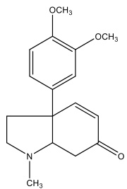

(1) $\Delta ^ { 7 }$ Mesembrenone

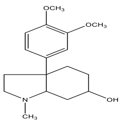

(2) 4\`-O- demethylmesemranol

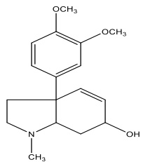

(3) Mesembrenol

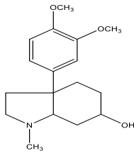

(4)  Mesembranol

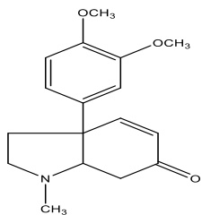

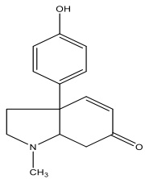

(6) Sceletenone

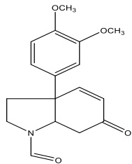

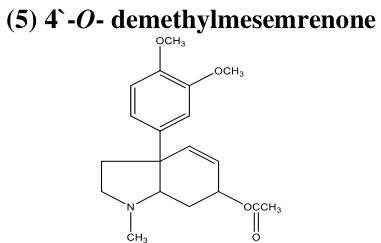

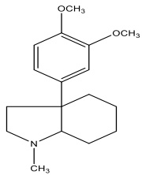

(7) $N$ -demethyl-N- formyl mesembrenone

(8) $o$ -acetylmesembrenol

(9) Mesembrane

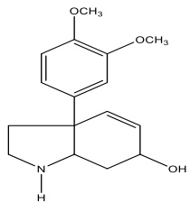

(10) $N$ -demethylmesembrenol

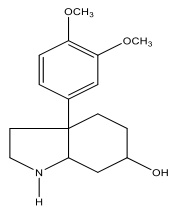

(11) N- demethylmesembranol

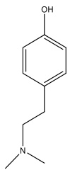

#### (12) Hordinine

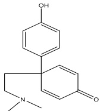

(13) Dehyrojoubertiamine

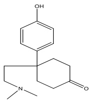

(14) Dihyrojoubertiamine

(15) Joubertiamine

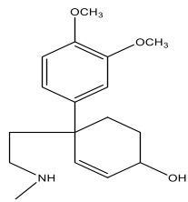

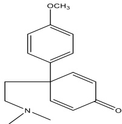

(16) Joubertinamine

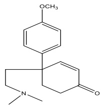

(17) $\textbf { \em o }$ -methyldehydro joubertiamine

#### (18) $\textbf { \em o }$ -methyl joubertiamine

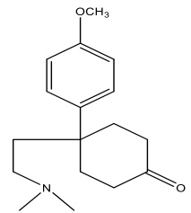

(19) $\textbf { \em o }$ -methyl dihydrojoubertiamin (20) $3 ^ { \circ }$ -methoxy- $\cdot \pmb { 4 } ^ { \setminus }$ -о- methyl joubertiamine

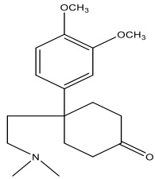

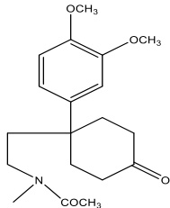

(21) 4-(3,4dimethoxyphenyl)-4 – [2- (acetyl methyl) amino] ethyl cyclohexanone

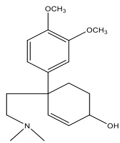

(22) $_ { 3 ^ { \setminus } }$ -methoxy- $. 4 \cdot O$ -methyl joubertiaminol

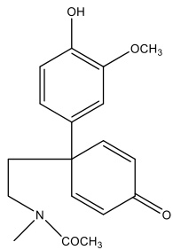

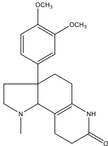

(23) 4-(3-methox-4-hydroxy phenyl)-4- [2 (acetyl methyl) amino] ethyl cyclohexanone

(24) 3a-(3,4-dimethoxy phenyl)-1- methyl1,2,3,3a,4,5,6,8,9,9b - decahydro-7H-pyrrolo[2,3-f] quinolin-7-one

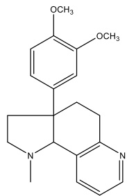

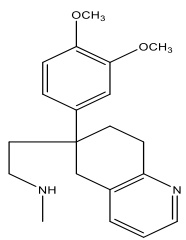

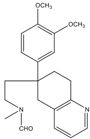

(26) Touruosamine (25) Sceletium alkaloid A4 (27) $N$ -formyl tortuosamine http://aprh.journals.ekb.eg/ 170

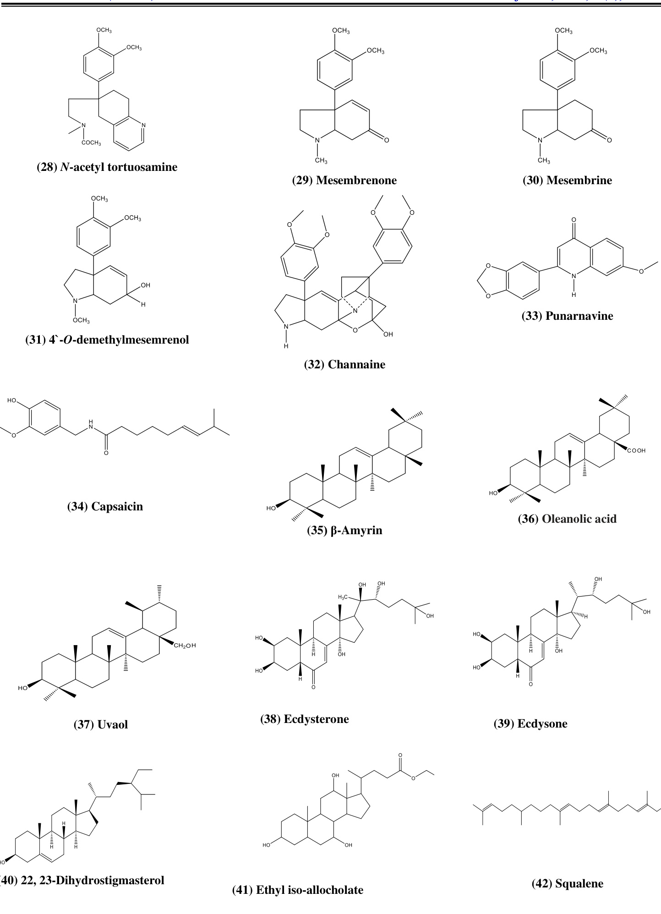

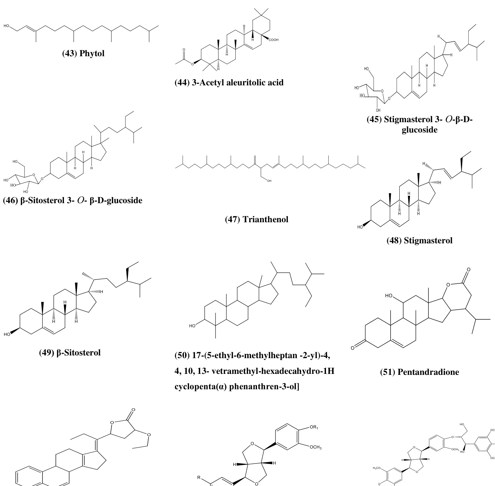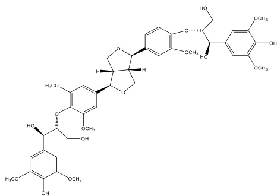

(53) Pinorsinol $\scriptstyle \mathrm { R = R l = H }$ Syringaresinol $\scriptstyle \mathrm { R = O C H } _ { 3 }$ , $\boldsymbol { \mathrm { R 1 } } \mathrm { = } \boldsymbol { \mathrm { H } }$ (54) Di-erythro-syringylglycrol-β-о- $^ { 4 , 4 ^ { \circ } \cdot }$ - syringaresinol ether

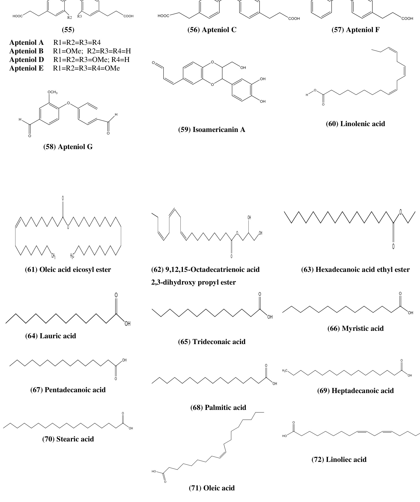

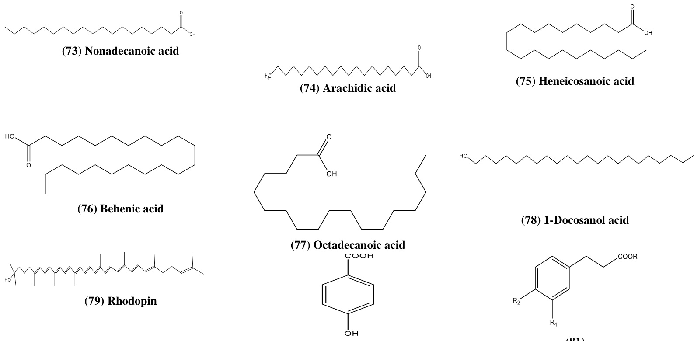  
(81)

(80) 4-hydroxy benzoic acid

Dihyrocinnamic acid $R = R _ { 1 } = R _ { 2 } = { \mathrm { H } }$ 4-hydroxy- $\scriptstyle \mathrm { R = R _ { 1 } = H }$ , $\scriptstyle \mathrm { { R } } _ { 2 } = \mathrm { { O H } }$ dihydrocinnamic acid

Dihydrofrulic acid $\scriptstyle \mathrm { R = H }$ , $\scriptstyle \mathbf { R } _ { 1 } = \mathbf { O C H 3 }$ , R2=OH

3,4-dimethoxydihyrocinnamic acid $\scriptstyle \mathrm { R = H }$ , $\scriptstyle \mathbf { R } _ { 1 } = \mathbf { R } _ { 2 } = \mathbf { O C H } 3$ $\scriptstyle \mathrm { R = C H } _ { 3 }$ , $\mathrm { R } _ { 1 } { = } \mathrm { R } _ { 2 } { = } \mathrm { O C H } _ { 3 }$

3,4-dimethoxy-dihyro cinnamic acid methyl ester

$\scriptstyle \mathrm { R = C H _ { 2 } C H _ { 3 } }$ , $\mathrm { R } _ { 1 } { = } \mathrm { R } _ { 2 } { = } \mathrm { O C H } _ { 3 }$

3,4-dimethoxydihyrocinnamic acid ethyl ester

3,4-dimethoxycinnamic $\scriptstyle \mathrm { R = H }$ , $R _ { 1 } { = } R _ { 2 } { = } \mathrm { O C H } _ { 3 }$ acid

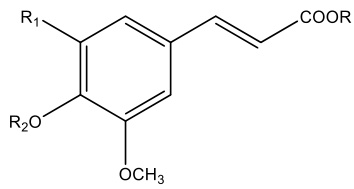

Ferulic acid $scriptstyle \mathrm { R = R } 1 = \mathrm { R } 2 = \mathrm { H }$ Methyl ferulate $\scriptstyle \mathrm { R = C H } _ { 3 }$ , ${ \bf R } 1 { = } { \bf R } 2 { = } { \bf H }$ Sinapic acid $scriptstyle \mathrm { R = R } 2 = \mathrm { H }$ , $\scriptstyle \mathrm { R 1 = O C H } _ { 3 }$ 3,4,5 tri-methoxy $\scriptstyle \mathrm { R = H }$ , $\scriptstyle \mathrm { \mathrm { R 1 = O C H } } _ { 3 }$ , ${ \mathrm { R } } 2 { \mathrm { = } } { \mathrm { C H } } _ { 3 }$ cinnamic acid

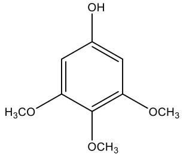  
(82)

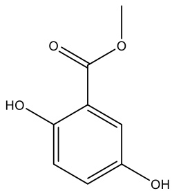

(83) Methyl 2,5-dihydroxybenzoate (84) 3,4,5-Trimethoxyphenol (85) 3-Hydroxy-7,8-dihydro- $\mathbf { \beta } \mathbf { \cdot } \mathbf { \beta }$ -ionone

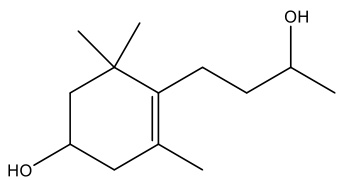

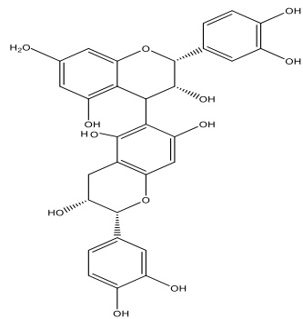

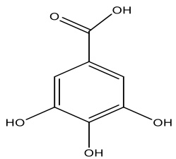

(91) Gallic acid

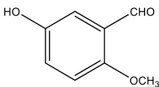

(94) 5-Hydroxy-2-methoxy benzaldehyde (89) 2,6-bis(1,1-dimethylethyl)-4- methylphenol

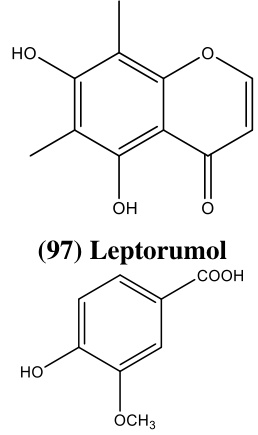

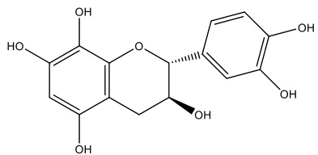  
(86) Catechin

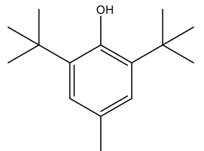

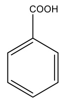

(92) Benzoic acid (95) $\pmb { \rho }$ -methoxy benzoic acid (101) O- coumaric acid (90) Phenol 2,4-bis(1,1-dimethylethyl)

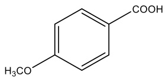

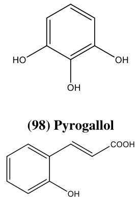

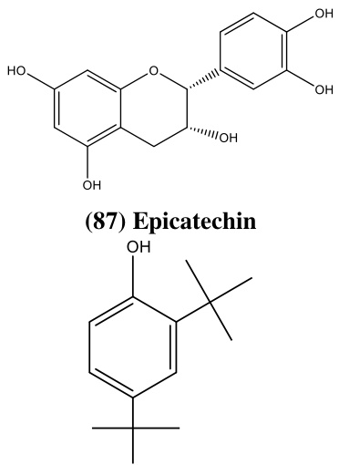

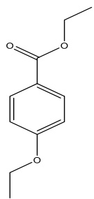

(93) Benzoic acid, 4-ethoxy ethyl ester

(100) Vanillic acid

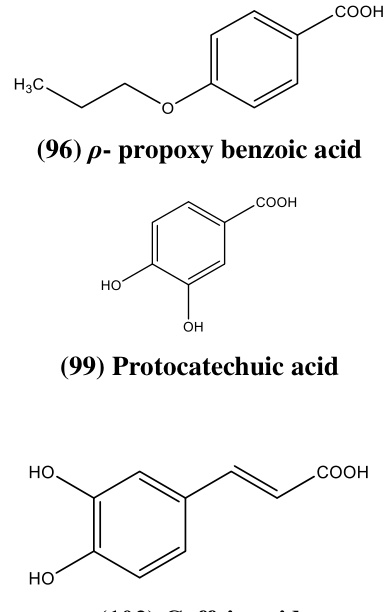  
(102) Caffeic acid

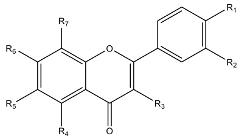  
(103)

Compound R1 R2 R3 R4 R5 R6 R7 Rutin OH OH O-Rutinose OH H OH H Quercetin OH OH OH OH H OH H $^ { 3 , 5 , 4 ^ { \setminus } }$ -trihyroxy-6,7- OH H OH OH OCH3 OCH3 H dimethoxyflavone C-Methyl flavone H H H OCH3 CH3 OCH3 CH3 Hyperoside OH OH O-Galactose OH H OH H

  
(104) Neohesperidin

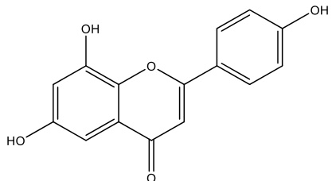

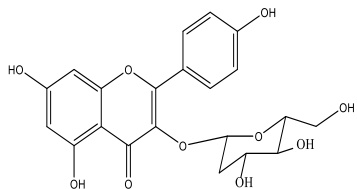  
(107) Kaempherol 3- O – glucoside

  
(105) Apigenin

  
(106) Apigenin-7-O-glucoside

  
(108) Isorhamnetin -3 –O- β glucoside

(109) 3, 5-dihydroxy-6,3 ',4' –trimethoxy flavone-7-0-[α-L-rhamnopyranosyl $( \mathbf { 1 - 6 } ) - \mathbf { \beta } .$ -D – glucopyranoside

(110) 5, ${ \bf \nabla } ^ { 2 ^ { \prime } }$ -dihydroxy-7-methoxy-6, 8 – dimethyl flavone

(111) 2 - $( 3 ^ { \circ }$ , 4’ dihydroxy-phenyl) - 3, 5, 7-trihydroxy-chromen-4-one (117) Betanidin 5-O-[2”-O-(E)-feruloyl- $\mathfrak { \textbf { \beta } }$ - (1”,2’)- glucuronosyl- $\mathbf { \beta } \mathbf { \cdot } \mathbf { \beta }$ -glucoside]

  
(112) Betanidine

  
(113) Isobetanidine

  
(114) Betanine

  
(115) Isobetanine

  
(116) Dopaxanthin

  
(118) Betanidin- 5-O-[6’- O-(E)-feruloyl- β- glucoside]

  
(120) 2-(dimethylamino)- 1-phenylethanol

  
(121)

3-( $1 H$ -inol-3-yl) propionic acid $\scriptstyle \mathrm { R = H }$ 3-( $1 H$ -inol-3-yl) propionic acid methyl ester $\scriptstyle \mathrm { R = C H } _ { 3 }$

(122) (2S, E)-N-[2-Hydroxy-2-(4- hydroxyphenyl) ethyl] ferulamide $\scriptstyle \mathrm { R = H }$

$\mathbf { \tau } ( \mathbf { E } )$ -N-[2-(4-Hydroxyphenyl)-2- propoxyethyl] ferulamide $\mathbf { R } { = } \mathbf { n } { \cdot }$ - Propyl

(123) (E)-N-[2-Hydroxy-2-(4-hydroxy-3- methoxyphenyl)- ethyl] ferulamide

(124) (E, E)-N, N-Dityramin-4,40 -dihydroxy3,50 - dimethoxy-b,30 -bicinnamamide

(125) 7-Hydroxy-1-(4-hydroxy-3- methoxyphenyl)-N2, N3-bis(4-   
hydroxyphenethyl)-6-methoxy-1,2- dihydronaphthalene-2,3- dicarboxamide

(126) Trans-4-hydroxy prolinebtaine

  
(127) Pyrrolo[1,2-A] Pyrazin-1,4-dione, hexahydro-3-(phenylmethyl)

Pyrazin-1,4-dione, hexahydro

4-(hydroxymethyl) phenol $\boldsymbol { \mathrm { R } } = \boldsymbol { \mathrm { H } }$ 4-(hydroxymethyl)-2, 6 $\mathrm { R } = \mathrm { O C H } _ { 3 }$ dimethoxyphenol

(146) (9R)-9-hyroxymegastigm-4-ene-3-one $\scriptstyle \mathrm { R = O R l = H }$ , $\mathfrak { a }$ OH Megastigm-4-ene-3,9-dione $\scriptstyle \mathrm { R = R l = O }$

(149) 3-O-methyl-chiro-inositol (152) Ascorbic acid (155) L- $( + )$ -ascorbic acid, 2-6- dihexaecanoate

(158) Dibutylphthalate (150) Monogalactosyldiacylglycerol (157) 1-monolinoleoylglyceroltrimethylsilyl ether

  
(147) 4-oxo-7, 8-dihydro- $\mathbf { \beta } \mathbf { \cdot } \mathbf { \beta }$ -ionone

  
(153) Bis (2-ethyl hexyl) phthalate

  
(156) Vitamin E

  
(159) Diisooctyl phthalate

  
(148) (3R, 9R)-3,9-dihyroxymegastigm-5-en-4-one

  
(154) Hentriacontane

  
(151) β-Carotene

Structures of isolated metabolites from family Aizozceae

T. decandra and Sceletium spp. was evaluated against formaldehyde-induced arthritis in rats, and a significant inhibition of chemically-induced arthritis, indicates anti-inflammatory potential17-22-24-51.

Anti-inflammatory activity was evaluated in acute and chronic models. Significant antiinflammatory activity was observed for chloroform extract of T. decandra in both carrageenan, dextran, and mediators induced edema models. The chloroform extract showed maximum inhibition of $5 8 . 3 6 \%$ at the dose of $2 0 0 \ \mathrm { m g / k g }$ after 3 hrs of drug treatment in carrageenan-induced paw edema. The chloroform extract of $T .$ . decandra also exhibited significant antiinflammatory properties in dextran-induced paw edema model. Dextran-induced paw edema is known to be mediated both by histamine and serotonin. Dextran induces fluid accumulation, which contains little protein and few neutrophils, whereas carrageenan induces protein rich exudation containing large number of neutrophils. The extract effectively suppressed the inflammation produced by both carrageenan and dextran22.

#### Antimicrobial activity

It has been reported that the methanolic extract of M. nodiflorum, M. crystallinum, M. forsskaolii, and Aizon canariense showed a broad-spectrum antibacterial and antifungal activity against: Bacillus subtilis, K. pneumonia, S. aureus, S. pyogenes, E. coli, A. fumigatus, A. nigar, C. albicans, and Mucor spp48. For C. edulis five bioactive flavonoid compounds, rutin, neohesperidin, hyperoside, cactichin, and ferulic acid were isolated from the ethyl acetate fraction and individually or collectively were responsible for the antibacterial against 11 known human pathogenic bacteria, five Gram-positive: Staphylococcus epidermidis, Staphylococcus aureus, Bacillus subtilis, Streptococcus pneumoniae, Streptococcus pyogenes, and six Gram-negative: Pseudomonas aeruginosa, Haemophilus influenzae, Eschericha coli, Klebsiella pneumoniae, Acinetobacter baumanii, Moraxella catarrhalis 34. Moreover, the isolated compounds from the ethanolic extract of Galenia Africana showed a remarkable antimycobacterial activity against M. smegmatis and M. tuberculosis55.

The extracts and the essential oil from the fresh leaves of S. portulacastrum showed antibacterial, antifungal. The ethanolic extract showed potential antibacterial activity against the causative agents and pathogens related to various gastrointestinal disorders leading to indigestion, dysentery, and diarrhea15. Moreover, the ethanolic extract of the S. portulacastrum showed potential against the causative agents of nosocomial infections, Staphylococcus aureus and $E .$ . coli, while the essential oil exhibited notable antibacterial activity against both Gram-positive and

Gram-negative bacteria as well as significant antifungal15. In addition, S. portulacastrum, showed positive activity against human immunodeficiency viruses15. Finally, it was reported that the new isolated flavonoid $2 \ - \ ( 3 ^ { \circ } , \ 4 ^ { \circ }$ dihydroxy-phenyl) - 3, 5, 7- trihydroxy-chromen-4-one isolated from $T .$ . decandra showed antibacterial activity against Pseudomonas aeruginosa and by molecular docking it was found that FAS II $\beta$ -hydroxyacyl-ACP $( F a b Z )$ of $P$ . aeruginosa is a potential target of the isolated compound40. There are many other reported biological activities of members of family Aizoaceae as shown in Table 11.

CONCLUSIONS

From this review, it can be deduced that the major compounds of family Aizoaceae are alkaloids, triterpenes, flavonoids, sterols, lignans, fatty acids, phenolic acids, and essential oils. The review also showed that different extracts of aerial parts of plants of family Aizoaceae posse diverse biological activities such as anti-acetylcholinesterase, antibutyrylcholinesterase, anti-infective, antihyperlipidemic, antipyretic, antifertility, diuretic, nephroprotective and others. It would, therefore, be important to extensively investigate their phytochemicals and pharmacologically determine their activities for future drug discovery and development.

Conflict of interest

The authors declare that there is no conflict of interest regarding the publication of this paper.

REFERENCES

1. James, A.R. Mesembryanthemaceae, Newsletter of the Tucson Cactus and Botanical Society. 1982, 12, 1.   
2. Rasingam, L. Aizoaceae (Magnoliopsida: Caryophyllales) - a new family record to the flora of Andaman Islands, India, JOTT. 2012, 4 (6), 2653-2655.   
3. Chesselet, P.; Mössmer, M.; Smith, G. Research priorities in the succulent plant family Mesembryanthemaceae Fenzl, S. Afr. J. Sci. 1995, 91, 197-209.   
4. Bittrich, V.; Harbnann, E. The Aizoaceae - a new approach. Bot. J. Linn. Soc. 1988, 97, 239-254.   
5. Eggli, U.; Hartmann, K. Illustrated Handbook of succulent plants, Springer-Verlag Berlin Heidelberg GmbH. 2001, pp. 1-2.   
6. Boulos L. Flora of Egypt. AzollaceaeOxalidaceae, Cairo, Egypt: Al-Hadara Publishing, 1999.   
7. Hosny A. Aizoaceae. In: El Hadidi MN, editor. Flora Aegyptiaca. The Palm Press., Cairo I, 2000, 96-100. Boulos Flora of Egypt, checklist. Al-Hadara Publishing, 1999.   
9. Hartmann H. Aizoaceae. In: Kubitzki K, Rohwer JG, Bittrich V, editors. the families and genera of vascular plants. II. Flowering Plants. Dicotyledons: Magnoliid, Hamamelid and Caryophyllid families. Berlin: Springer, 1993, 37-69.   
10. Vivrette, J.; Bleck, E.; Ferren, R. Aizoaceae Flora of North America, ed. N. R. Morin. New York, Oxford: Oxford University Press. 2003, 4, 75-91.   
11. Heywood, H. Flowering plants of the world. Mayflower Books. Elsevier, New York, 2007.   
12. Walters, M.; Figueiredo, E.; Crouch, R.; Winter, D.; Smith, F.; Zimmermann, G.; Mashop, K. Aizoaceae, Council for Scientific and Industrial Research, South Africa. 2012, 64-69.   
13. Rood, B. Uit die veldapteek. Tafelberg Publishers, Cape Town,1994.   
14. Elmarie, W.; Johan, C. Pretorius. Purification and identification of active antibacterial components in Carpobrotus edulis L. J. Ethnopharmacol. 2001, 76, 87–91.   
15. Manbir, K.; Nitika. Review on Sea purslane, $J$ Pharmacogn Phytochem. 2015, 3(5), 22-24.   
16. Martins, A.; Vasas, A.; Schelz, S.; Viveiros, M., Molnar, J.; Hohmann, J.; Amaral, L. Constituents of Carpobrotus edulis Inhibit P Glycoprotein of MDR1-transfected Mouse Lymphoma Cells, Anticancer Res. 2010, 30(3), 829-836.   
17. Gerickea, N.; Viljoenb, M. Sceletium— A review update, J. Ethnopharmacol. 2008, 119(3), 653–663.   
18. Vealea, C.; Chenc, W.; Chaudharyc, S.; Kituyid, S.; Isaacsb, M.; Hoppe, H.; Edkins, A.; Combrinck, S.; Meharic, B.; Viljoenc, A. NMR structural elucidation of channaine, an unusual alkaloid from Sceletium tortuosum, Phytochem. Lett. 2018, 23, 189-193.   
19. John, K. Mesembrine Alkaloids: Review of their Occurrence, Chemistry, and Pharmacology, J. Ethnopharmacol. 2017, 195, 10-19.   
20. Jeffs, W.; Capps, M.; Redfearn, R. Sceletium alkaloids. Structures of five new bases from Sceletium namaquense. J. Org. Chem. 1982, 47, 3611–3617.   
21. Cybulska, I.; Brudecki, G.; Alassali, A.; Thomsen, J. Phytochemical composition of some common coastal halophytes of the United Arab Emirates, EJFA. 2014, 26(12), 1046-1056.   
22. Geethalakshmi, R., Sarada, L.; Ramasamy, K. Trianthema decandra L: A review on its phytochemical and pharmacological profile, Int. J. Eng. Sci. Technol. 2010, 2(5), 976-979.   
23. Sukalingam, K.; Ganesan, K.; Ponnusamy, K.; Venugopal, V. Pharmacological Properties of Trianthema portulacastrum L and its Therapeutic Potential as Complementary Medicine, JPCBS. 2015, 4 (2), 269-274.   
24. Yamaki, J.; Kalyan C.; Venkata, N.; Mandal, A.; Bhattacharyya, P.; Bishayee, A. Health-promoting and disease-preventive potential of Trianthema portulacastrum Linn. (Gadabani) —An Indian medicinal and dietary plant, J. Integr. Med. 2016, 14 (2), 84-99.   
25. Al-Azzawi A.; Alguboori, A.; Hachim, Y., Najat M.; Al Shaimaa, A.; Sad, M. Preliminary phytochemical and antibacterial screening of Sesuvium portulacastrum in the United Arab Emirates, Pharmacogn. Res. 2012, 4 (4), 219-224.   
26. Sheela, D.; Uthayakumari, F. GC-MS analysis of bioactive constituents from coastal sand dune taxon Sesuvium portulacastrum (L.), Bio. Disc. 2013, 4(1), 47-53.   
27. Geethalakshmi, R.; Sarada, L. In vitro and in silico antimicrobial activity of sterol and flavonoid isolated from Trianthema decandra L. Microb. pathog. 2018, 121, 77-86.   
28. Afzal, S.; Chaudhary, B.; Uzair, M.; Afzal, K.; Bokhari, T. Isolation of pentandraone from methanolic extract of aerial parts of Zaleya pentandra, Int. Res. J. Pharm. 2013, 4 (10), 21-23.   
29. DellaGreca, M.; Fiorentinob, A.; Izzob, A.; Napolia, F.; Purcaroa, R.; Zarrellia, A. Phytotoxicity of Secondary Metabolites from Aptenia cordifolia, Chem. Biodivers. 2007, 4, 118- 128.   
30. DellaGreca, M.; Marino, C.; Previtera, L.; Purcaro, R.; Zarrelli, A. Apteniols A–F, oxyneolignans from the leaves of Aptenia cordifolia. Tetrahedron. 2005, 61, 11924-11929.   
31. DellaGreca, M.; Previtera, L.; Purcaro, R.; Zarrelli, A. Cinnamic acid amides and lignanamides from Aptenia cordifolia. Tetrahedron. 2006, 62, 2877-2882.   
32. Chandrasekaran, M.; Senthilkumar, A.; Venkatesalu, V. Antibacterial and antifungal efficacy of fatty acid methyl esters from the leaves of Sesuvium portulacastrum L., Eur. Rev. Med. Pharmacol. Sci. 2011, 15, 775-780.   
33. Kumar, A.; Kumari, S.; Somasundaram, T. Gas Chromatography-Mass Spectrum (GC-MS) Analysis of Bioactive Components of the Methanol Extract of Halophyte, Sesuvium portulacastrum L., IJAPB. 2014, 3 (3), 766-772.   
34. Van der Watt, E.; Pretorius, C. Purification and identification of active antibacterial components in Carpobrotus edulis L., J. Ethnopharmacol. 2001, 76, 87–91.   
35. Ibtissem, B.; Abdelly, C.; Sfar, S. Antioxidant and Antibacterial Properties of Mesembryanthemum crystallinum and Carpobrotus edulis Extracts, ACES. 2012, 2, 359-365.   
36. Ibtissem, B.; Imen, M.; Souad, S. Dosage of 2, 6- Bis (1.1-Dimethylethyl)-4-Methylphenol (BHT) in the Plant Extract Mesembryanthemum crystallinum, J Biomed Biotechnol. 2010, 2010, 1-5.   
37. Moawad, A.; Amin, E.; Mohammed, R. Diffusionordered Spectroscopy of Flavonol Mixture from Mesembryanthemum forsskaolii (Aizoaceae), EJMP. 2016, 16(1), 1-8.   
38. Kavitha, D.; Parvatham, R.; Padma, R. Assessment of trianthema portulacastrum for its antimicrobial potential and investigation of their phytochemicals using HPTLC, GC-MS, and IR, Int J Pharm Pharm Sci. 2014, 6 (1), 675-686.   
39. Karim, M.; Kalam, A.; Alam, A.; Alam K.; Jahan, N.; Jafri, A. Biskhapra (Trianthema portulacastrum Linn) and its medicinal utility mentioned in Unani System of Medicine–A Review, IJPSR. 2015, 6(4), 790-795.   
40. Geethalakshmi, R.; Sundaramurthi, J.; Sarada, L. Antibacterial activity of flavonoid isolated from Trianthema decandra against Pseudomonas aeruginosa and molecular docking study of FabZ. Microb. Pathog. 2018, 121, 87-92.   
41. Impellizzeri, G.; Piattelli, M.; Sciuto, S. Acylated betacyanins from Drosanthemum floribundum, Phytochemistry. 1973, 12, 2295-2296.   
42. Impellizzeri, G.; Piattelli, M.; Sciuto, S. A New betaxanthin from glottiphyllum longum, Phytochemistry. 1973, 12, 2293-2294.   
43. Piattelli, M. Impellizzeri, G. Betacyanins from lampranthus sp. (aizoaceae), Phytochemistry. 1969, 8, 1595-1596.   
44. Strack, D.; Bokern, M.; Marxen, N.; Wray, V. Feruloylbetanin from petals of Lampranthus and feruloylamaranthin from cell suspension cultures of Chenopodium rubrum, Phytochemistry. 1988, 27(11), 3529-3531.   
45. Magwa, L.; Gundidza, M.; Gwerua, N.; Humphrey, G. Chemical composition and biological activities of essential oil from the leaves of Sesuvium portulacastrum, J. Ethnopharmacol. 2005, 103, 85–89.   
46. Veeresh; Kumar, P.; Lavanya, A.; Suresh, P.; Mounika, N. Pharmacological potentials of Trianthema decandra- A review, J Pharmacogn Phytochem. 2017, 6(2), 290-294.   
47. Gagare, B.; Jadhav, S. Comparative Phytochemical profiling of various extracts, from different parts of Sesuvium portulacastrum using GCMS, FTIR and ICP AES, IJESM. 2017, 6(6), 267-276.   
48. El-Amier, A.; Haroun, A.; El-Shehaby, O.; Alhadithy, N. Antioxidant and Antimicrobial Properties of Some Wild Aizoaceae Species Growing in Egyptian Desert, J. Environ. Sci. 2016, 5 (1), 1-10.   
49. Doudach, L.; Meddah, B.; Benbacer, L.; Hammani, K.; El mzibri, M.; Elomri, A.; Cherrah, Y. Ethnopharmacological studies of Mesembryanthemum nodiflorum, Pharmacology. 2013, 4(2), 246-258.   
50. Mohammed, R.; El-Hawary, S.; Abo-youssef, M. Biological investigation of some wild Aizoaceae and Chenopediaceae species growing in Egypt, J. Nat. Prod. 2012, 5, 193-206.   
51. Qasem, R. Prospects of wild medicinal and industrial plants of saline habitats in the Jordan valley, Pak. J. Bot. 2015, 47 (2), 551-570.   
52. Abdallah, A.; Ali Merito, A.; Hassan, S.; Aboubaker, D.; Djama, M.; Asfaw, Z.; Kelbessa, E. Medicinal plants and their uses by the people in the Region of Randa, Djibouti, J. Ethnopharmacol. 2013, 148, 701–713.   
53. Stark, D.; Mtui, J.; Balemba, B. Ethnopharmacological survey of plants used in the traditional treatment of gastrointestinal pain, inflammation and diarrhea in Africa: future perspectives for integration into modern medicine. Animals 2013, 3, 158-227.   
54. Omoruyi, E.; Bradley, G.; Afolayan, J. Antioxidant and phytochemical properties of Carpobrotus edulis (L.) bolus leaf used for the management of common infections in HIV/AIDS patients in Eastern Cape Province, BMC Complem ALtern M. 2012, 12, 215.   
55. Van Wyk, E.; Van Oudtshoorn, B.; Gericke, N. Medicinal Plants of South Africa. Briza Publications, Pretoria, ISBN 1-875093-09-5, 1997.   
56. De Ghosh, M.; Ramakrishna, S.; Ramakrishna, M. Antimicrobial activity and phytochemical analysis of medicinal plants, WJPPS. 2014, 3(6), 1794- 1799.   
57. Moyo, B.; Mukanganyama, S. The Anticandidal and Toxicity Properties of Lampranthus francisci, J. Mycol. 2015, 2015, 1-15.   
58. Van Wyk, E.; Gericke, N. People’s Plants: A Guide to Useful Plants of Southern Africa, Briza Publications, Pretoria, ISBN 978-1-875093- s19-9, 2000.   
59. VanWyk, E. A broad review of commercially important southern African medicinal plants, J. Ethnopharmacol. 2008, 119, 342–355.   
60. Afzal, S.; Chaudhary, B.; Ahmad, A.; Afzal, K. Preliminary phytochemical analysis and antifungal activities of crude extracts of Zaleya pentandra and Corchorus depressus linn., Acta Pol Pharm. 2015, 72, 329-334.   
61. Afzal, S.; Chaudhry, B.; Afzal, K.; Saeed, J.; Hakash, S.; Qadir, M. Acetyl cholinesterase and butyryl cholinesterase inhibitory activities of Zaleya pentandra. Acta Pol Pharm. 2017, 74 (3),