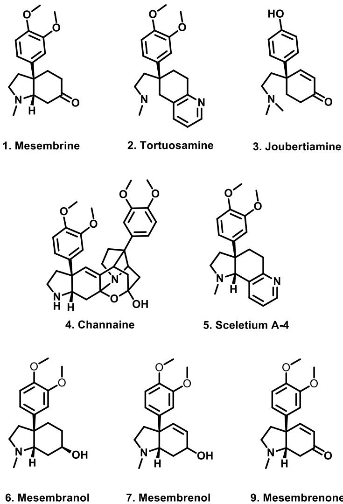
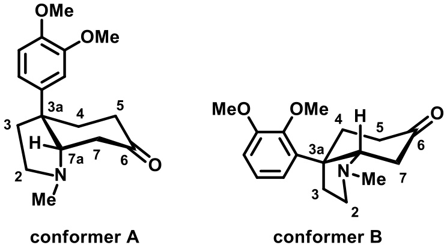
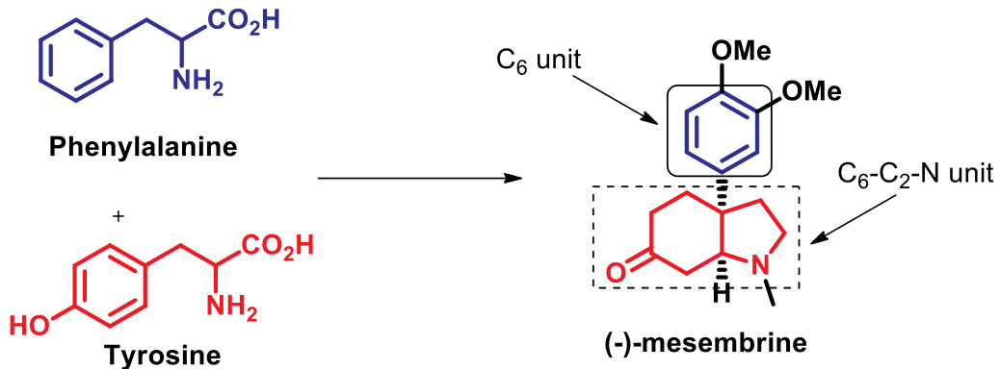
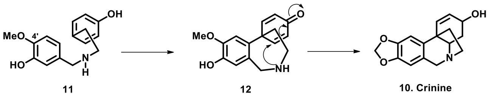
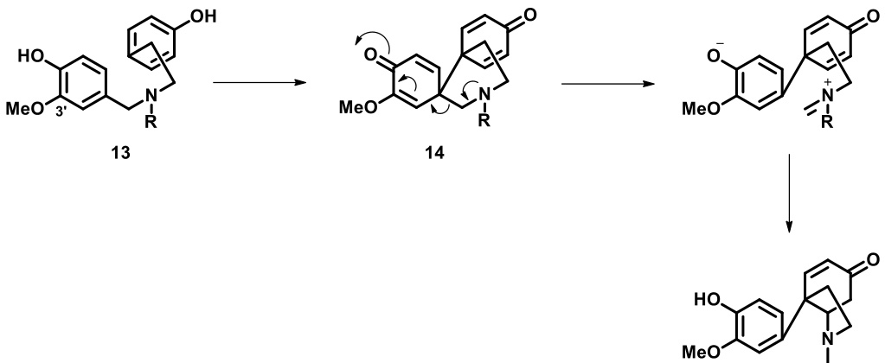
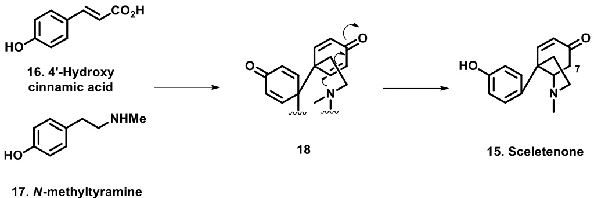
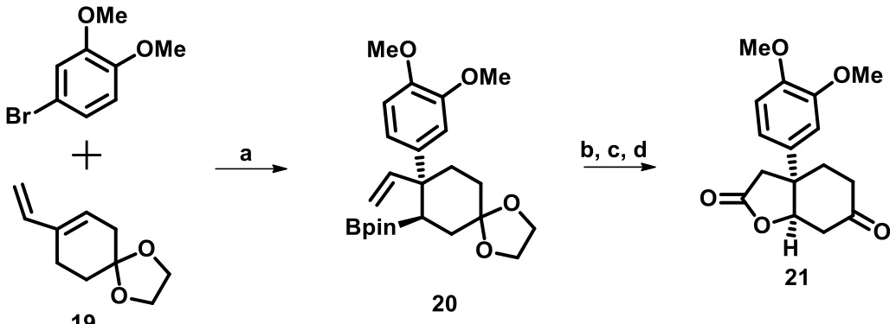
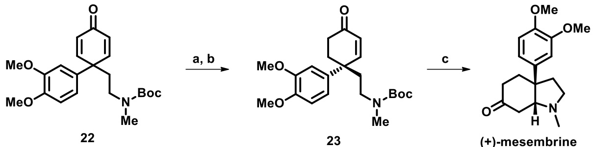
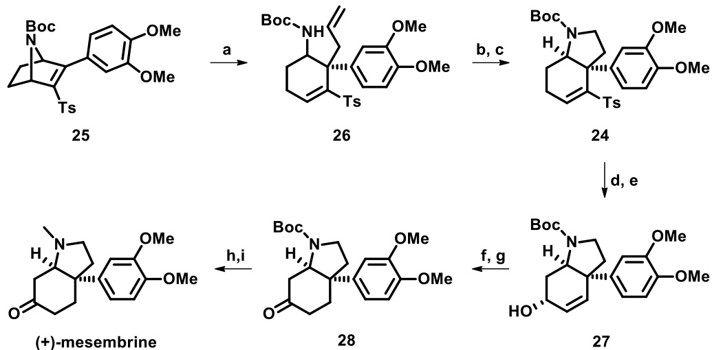
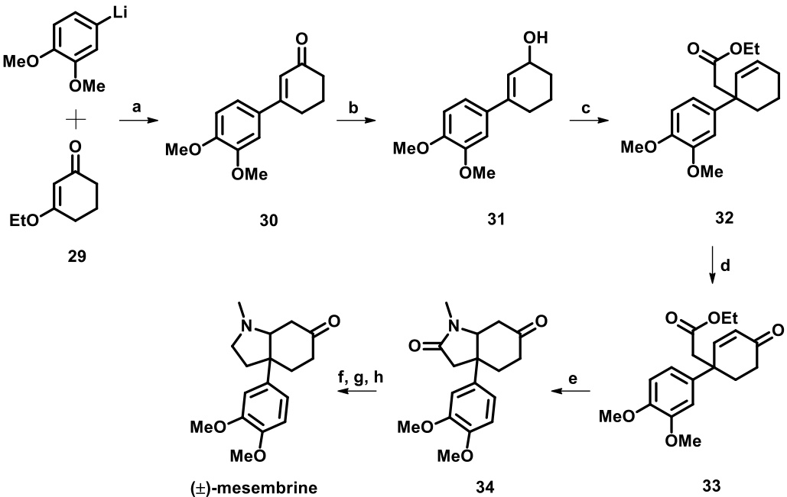

# Review

## Mesembrine: The archetypal psycho-active Sceletium alkaloid

Felix Makoloa, Alvaro Viljoena,b, Clinton G.L. Vealec,\*

a Department of Pharmaceutical Sciences, Faculty of Science, Tshwane University of Technology, Private Bag X680, Pretoria, 0001, South Africa b SAMRC Herbal Drugs Research Unit, Faculty of Science, Tshwane University of Technology, Private Bag X680, Pretoria, 0001, South Africa c School of Chemistry and Physics, Pietermaritzburg Campus, University of KwaZulu-Natal, Private Bag X01, Scottsville, 3209, South Africa

A R T I C L E I N F O

A B S T R A C T

Keywords:   
Sceletium tortuosum   
Mesembrine   
Alkaloid   
Mood elevation   
Congested quaternary carbon

$( - )$ -Mesembrine is a chiral alkaloid that features an aryloctahydroindole skeleton and is most commonly found in species of the succulent genus Sceletium. Several Sceletium species are used by various ethnic groups in South Africa to manage disorders of the central nervous system. Binding assays have revealed that mesembrine is a more potent inhibitor of the serotonin transporter (SERT) than fluoxetine (Prozac) which has prompted the commercialization of mesembrine-containing consumer products. The congested all carbon quaternary stereocenter present at the bridgehead of mesembrine has rendered it a compound of interest for research in synthetic chemistry, which has assisted in the absolute configuration of the naturally occurring isomer to be assigned. Accordingly, this review will cover the recent literature pertaining to the distribution, structural elucidation, chemotaxonomy, biosynthesis, organic synthesis, as well as the biological activities of $( - )$ -mesembrine. Recent synthetic procedures of the non-natural enantiomer as well as the racemate are also considered.

# 1. Introduction

The psychoactive properties of species belonging to the Sceletium genus (Mesembryanthemum) are well documented in the literature (Gericke, 2018; Gericke and Viljoen, 2008; Smith et al., 1996; Stafford et al., 2008). Historically, dried leaves of Sceletium have been used widely by indigenous groups native to southern Africa to elevate the mood and ease anxiety and tension and by shepherds as appetite suppressants during long journeys in dried areas (Gericke and Van Wyk, 1997). Furthermore, extracts prepared from Sceletium have been developed into commercial products for the treatment of central nervous system related disorders including Zembrin®, which is a standardised extract of Sceletium, used by patients for enhancing mood, decreasing anxiety and stress, and improving cognitive function (Dimpfel et al., 2017; Patnala and Kanfer, 2009). The psychoactive properties of Sceletium are attributed to the presence of structurally related alkaloids (Harvey et al., 2011) which can be classified into several skeleton types as shown in Fig. 1 including the mesembrine-type (1), tortuosaminetype (2), the joubertiamine-type (3), channaine (4) and Sceletium alkaloid A4 (5) (Jeffs, 1981; Veale et al., 2018). However, of these, the mesembrine-type scaffold is the most prevalent, which in addition to (1) includes mesembranol (6), mesembrenol (7) and mesembrenone (8) which all share a common cis-3a-aryloctahydroindole nucleus (Krstenansky, 2017).

Due in part to its relative abundance in Sceletium, the naturally occurring levorotatory isomer $( - )$ -mesembrine was the first alkaloid of its group to be structurally characterized (Bodendorf and Krieger, 1957; Jeffs, 1981; Krstenansky, 2017; Popelak and Lettenbauer, 1967). Furthermore, $( - )$ -mesembrine inhibits serotonin reuptake, and has displayed promise as a mild anti-depressant, anxiolytic, mood elevator and anti-addiction agent (Smith et al., 1996; Stafford et al., 2008). This intriguing biological utility, in addition to its quaternary stereogenic centre has resulted in this compound being intensively pursued through total synthesis (Czekelius, 2018). Accordingly, the purpose of this review is to provide a summary of the isolation, pharmacology and recent stereoselective synthesis of $( - )$ -mesembrine.

# 2. Botanical distribution

There are eight recognised species of the genus Sceletium: S. crassicaule (Haw.) L. Bolus, S. emarcidum (Thumb.) L. Bolus ex H. J. Jaccobson, S. exalatum Gerbaulet, S. expansum (L.). Bolus [nt], S. rigidum L. Bolus, S. strictum L. Bolus, S. tortuosum (l.) N. E. Br. [nt] and S. varians (Haw.) (Gerbaulet, 1996). S. expansum, S. strictum, S. tortuosum $( = s .$ . joubertii $= s .$ namaquence), S. crassicaule, and S. varians $( = s$ . subvelutinum) are classified under the ‘tortuosum’ type sub-group. While, the rest of the species, S. emarcidum, S. exalatum and S. rigidum belong to the emarcidum type. The alkaloid (−)-mesembrine is known to occur in at least three species of the ‘tortuosum’ type such as S. tortuosum, S. strictrum, and S. expansum. On the other hand, this alkaloid has not been detected in the ‘emarcidum’ type species of Sceletium (Patnala and Kanfer, 2013). Though $( - )$ -mesembrine has been isolated mainly from Sceletium plants, gas chromatography-mass spectrometry analysis on some selected plants by Smith et al. (1998) have indicated their occurrence in other genera of the Mesembryanthemaceae family. Apterna cordifolia, Delosperma pruinosum, and Delosperma pottsii appeared to have some level of $( - )$ -mesembrine. Whereas other species showed negligible or non-detectable level of (−)-mesembrine. The distribution of $( - )$ -mesembrine in plant families is summarised in Table 1.

  
Fig. 1. Structures of selected Sceletium alkaloids.

  
Fig. 2. The two possible conformers of $( - )$ -mesembrine.

The concentration of $( - )$ -mesembrine vary in Sceletium plants. This quantitative difference in the plant is affected by factors such as seasonal variation, growing conditions, age of plant, storing/processing (Smith et al., 1998). The content of this alkaloid is reported to be approximately $1 \%$ in S. namaquense and known to occur in lesser quantities in S. strictum. It has been isolated as a partial racemate from S. tortuosum (Jeffs, 1981).

## 3. Structure and stereochemistry

Following the initial isolation of $( - )$ -mesembrine, Zwicky incorrectly assigned its molecular formula to be $\mathrm { C _ { 1 6 } H _ { 1 9 } N O _ { 4 } }$ (Zwicky, 1914). However, its molecular formula was correctly assigned as $\mathrm { C _ { 1 7 } H _ { 2 3 } N O _ { 3 } }$ by Rimington and Roets (1937). $( - )$ -Mesembrine features a cis-fused octahydroindole unit linked to a freely rotatable aryl moiety. This octahydroindole nucleus derives from a saturated pyrrolidine ring fused to a cyclohexanone, via two bridge-head chiral carbons (C-3a and 7a), whose relative cis arrangement was elucidated from degradation studies and synthesis of the racemate (Popelak et al., 1960; Stevens et al., 1968). This arrangement allows for two likely conformations namely conformation A and B (Fig. 2). A lack of evidence of transdiaxial coupling with the C-7a hydrogen, led to mesembrine being assigned to conformation A, which in conjunction to circular dichroism and $\mathbf { x }$ -ray crystallography studies of 6-epimesembrenol methiodide led the absolute configuration of $( - )$ - mesembrine being assigned as 3aS, 7aS (Coggon et al., 1970; Jeffs et al., 1969).

## 4. Biosynthesis

Early proposed biosynthetic pathways for $( - )$ -mesembrine involved a condensation between a $\mathsf { C } _ { 6 } – \mathsf { C } _ { 2 } – \mathsf { N }$ and a ${ \sf C } _ { 6 }$ subunit (Bodendorf and Kloss, 1961). Through the incorporation of radiolabelled amino acids, into living specimens of S. stricium, Jeffs and co-workers proposed that the octahydroindole moiety is formed through the elaboration of the $\mathsf { C } _ { 6 } – \mathsf { C } _ { 2 } – \mathsf { N }$ subunit, which is provided by tyrosine, while phenylalanine is source of the remaining C-6 subunit, responsible for the aryl side chain (Fig. 3). In addition, they determined that L-methionine was the source of both the O and $N _ { \mathbf { \delta } }$ -methyl moieties (Jeffs et al., 1971).Jeffs et al., 1967

Table 1 Plant sources of mesembrine.   

<html><body><table><tr><td>Plant species</td><td>Family</td><td>Detection Method</td><td>Isolation method</td><td>References</td></tr><tr><td>Aptenia cordifolia</td><td>Mesembryanthemaceae</td><td>GC-MS</td><td>N.A.a</td><td>1</td></tr><tr><td>Delosperma pruinosum</td><td>Mesembryanthemaceae</td><td>GC-MS</td><td>N.A.</td><td>1</td></tr><tr><td>Delosperma pottsii</td><td>Mesembryanthemaceae</td><td>GC- MS</td><td>N.A.</td><td>1</td></tr><tr><td>Narcissus pallidulus</td><td>Amaryllidaceae</td><td>GC-MS</td><td>N.A.</td><td>2</td></tr><tr><td>Narcissus triandrus</td><td>Amaryllidaceae</td><td>GC-MS</td><td>N.A.</td><td>3</td></tr><tr><td>Sceletium crassicaule</td><td>Mesembryanthemaceae</td><td>UPLC</td><td>N.A.</td><td>4</td></tr><tr><td>Sceletium expansum</td><td>Mesembryanthemaceae</td><td>HPLC</td><td>N.D.b</td><td>5,8</td></tr><tr><td>Sceletium strictrum</td><td>Mesembryanthemaceae</td><td>HPLC, GLPC</td><td>CC</td><td>5,6</td></tr><tr><td>Sceletium tortuosum</td><td>Mesembryanthemaceae</td><td>GC-MS,HPLC,UPLC</td><td>HSCCC, CC,PTLC</td><td>1, 4, 5, 7</td></tr></table></body></html>

1. Smith et al. (1998), 2.Berkov et al. (2014), 3.Pigni et al. (2013), 4. Shikanga et al. (2013), 5. Patnala and Kanfer (2013), 6.Jeffs et al. (1970), 7. Shikanga et al. (2011). 8. Zwicky (1914). a N.A. $\mathbf { \Sigma } =$ not available. b N.D. $\mathbf { \Sigma } =$ Not detailed.

  
Fig. 3. Early proposed biosynthetic pathway for mesembrine.

  
Fig. 4. Crinine biosynthetic pathway.

Biosynthetic pathways of the related Amaryllidaceae alkaloids such as crinine (10) have been shown (Fig. 4) to occur via the oxidative cyclisation of $4 ^ { \prime }$ -O-methyl norbelladine (11), which results in the formation of a dienone derivative (12) capable of undergoing intramolecular Michael addition, ultimately leading to the crinine skeleton (Barton et al., 1963; Battersby et al., 1964; Jeffs et al., 1974).

However, incorporation of radiolabelled norbelladine analogues into S. strictum suggested rather that 3′-O-methyl norbelladine (13) was the biosynthetic precursor of the mesembrines. This led Jeffs et al. (1974b) to postulate that the bis-spirodienone (14) is the intermediate in mesembrine biosynthesis (Fig. 5). However, while doubly labelled phenylalanine incorporation experiments, supported the formation of a general bis-spirodienone intermediate, Jeffs et al. (1974b) found that $3 ^ { \prime } \mathrm { . }$ $o$ -methyl norbelladine is not incorporated into mesembrine intact, thereby indicating that this specific intermediate is incorrect, thus excluding Fig. 5 as the biosynthetic pathway.

The biosynthetic pathway of mesembrine was finally resolved following the identification of sceletenone (15) as one of several minor mesembrine-like alkaloids (Jeffs et al., 1974b), in addition to the discovery of mono-hydroxylated joubertiamine (Arndt and Kruger, 1970). This led Jeffs et al. (1974b) to postulate a unified biosynthetic pathway for Sceletium alkaloids, through which sceletenone is a common precursor. As depicted in Fig. 6, the first step resembles that of the biosynthesis of colchicine (Battersby et al., 1972), in which phenylalanine derived $4 ^ { \prime }$ -hydroxy cinnamic acid (16) and $N$ -functionalised tyramine (17), derived from tyrosine, combine to form a bis-spirodienone (18), which undergoes intramolecular Michael addition to form the sceletenone skeleton, which would then require late stage ring oxidation to form the required-oxygenated ring system of mesembrine (Jeffs et al., 1974b). A series of carefully designed radiolabelled experiments confirmed the intermediacy of cinnamic and 4′hydroxycinnamic acid in 3a-aryl octahydroindole formation (Jeffs et al., 1976) possibly via an aldehyde (Herbert and Kattah, 1989), whilst showing that formation of the octahydroindole skeleton involves a stereospecific protonation at position 7, which would need to occur after Michael addition at C-7 (Jeffs et al., 1976). Finally, it was confirmed that sceletenone is the biosynthetic precursor to the mesembrine class of alkaloids (Jeffs et al., 1978; Jeffs and Karle, 1977).

### 5. Synthesis

Quaternary stereogenic centres are privileged structural features which occur in numerous natural products, many of which possess potent biological activities (Pandey et al., 2018). However, formation of this structural feature, particularly enantioselectively, represents a significant synthetic challenge (Christoffers and Mann, 2001; Corey and Guzman-Perez, 1998).

  
Fig. 5. Proposed biosynthesis of mesembrine alkaloids involving the bis-spirodienone intermediate.

  
Fig. 6. Confimred biosynthetic pathway for sceletenone.

  
Scheme 1. a) It-BuCuBr $( 5 \mathrm { m o l } \ \% )$ , Pd–P $\mathsf { - B u } _ { 2 } \mathbf { C H } _ { 2 } t$ -Bu-G3 (1 mol $\%$ ), DMAP (2 equiv.), $( { \tt B p i n } ) _ { 2 }$ (2 equiv), KOt-Bu (1.5 equiv.), toluene, 45 °C, $^ { 1 2 \mathrm { h } }$ ; b) (i) ${ \bf B H } _ { 3 } { \bf \cdot } { \bf S M e } _ { 2 } .$ THF, $0 { - } 2 2 ^ { \circ } \mathrm { C } ;$ (ii) $\mathrm { H } _ { 2 } \mathrm { O } _ { 2 }$ NaOH; c) Cul $5 \mathrm { m o l } \% )$ , bipy $( 5 \mathrm { m o l } \% )$ ), TEMPO $( 5 \mathrm { m o l \% } )$ , NMI ( $1 0 \mathrm { m o l } \mathrm { \ } \%$ , MeCN, air, $2 2 { \overset { \circ } { \mathbf { C } } } _ { ; }$ $^ { 1 2 \mathrm { h } }$ ; d) 4M HCl, THF, $2 2 ^ { \circ } \mathrm { ~ C ~ }$ , 2 h.

Accordingly, the construction of the all carbon stereocentre of mesembrine has proven to be an attractive target for total synthesis, beginning with the first synthesis of racemic mesembrine by Shamma and Rodríguez (1965). In their synthesis of $( + )$ -mesembrine, Yamada and Otani (1971) were the first to report an asymmetric synthesis of this natural product, while Takano et al. (1981) exploited (D)-mannitol as a chiral transfer template for enantioselective synthesis of $( - )$ -mesembrine. The synthesis of mesembrine has been expertly covered in two separate reviews (Czekelius, 2018; Du et al., 2010) which will be updated here.

Smith and Kevin Brown (2017) developed a synthetic procedure utilising cooperative Pd/Cu catalysis for the regioselective arylboration of isoprenes in order to develop useful building blocks for chemical synthesis. In the course of this study, the authors noted that the incorporation of quantitative amounts of DMAP resulted in the formation of a carbon quaternary centre. In order to demonstrate the utility of this transformation, they conducted a formal synthesis of racemic mesembrine. Applying their protocol (Scheme 1) to cyclic diene (19), resulted in the generation of the anti-diastereomer (20) from which they applied a sequential hydroboration oxidation protocol to generate lactone (21), a known precursor to mesembrine (Kulkarni et al., 2002).

As mentioned, the primary challenge in the enantioselective synthesis of mesembrine is the construction of the all carbon quaternary centre, which several groups have sought to overcome through the desymmetrisation of $\gamma , \gamma$ -disubstituted cyclohexadienones (Han et al., 2016; Naganawa et al., 2016). Accordingly, Bokka et al. (2018) developed related methodology where chiral cyclohexenones which feature the critical all carbon stereocenter could be generated using a copper catalyst under mild conditions (Bokka et al., 2018). Application of their method to $N$ -Boc protected cyclohexadienone (22), resulted in enone (23) at an ee of $9 7 \%$ . Acid mediated $N$ -Boc removal and subsequent conjugate addition, completed the octahydroindole ring resulting in the formation of $( + )$ -mesembrine (Scheme 2).

Verma et al. (2018) sought to generate a common hydroindole intermediate (24) from which several related Sceletium and Amaryllidaceae alkaloids could divergently be generated. Selective nucleophilic attack of the 7-azabicyclic system (25) with allylmagnesium bromide, resulted in the formation of the desired isomer of (26). Oxidative cleavage of the double bond, followed by reductive amination resulted in the formation of (24). Detosylation and subsequent $\mathsf { s e o } _ { 2 }$ allylic oxidation delivered alcohol (27). Sequential olefin reduction with Raney nickel and alcohol oxidation in the presence of Dess-Martin periodinane, resulted in the formation of ketone analogue (28). Finally, $N$ -Boc removal and methylation, delivered $( + )$ -mesembrine (Scheme 3).

Kim et al. (2018) developed an efficient seven-step synthesis of racemic mesembrine starting from the commercially available 3-ethoxy2-cyclohexen-1-one (29). Condensation of 29, with (3,4-dimethoxyphenyl)lithium, formed the arylated cyclohexanone (30) which was subsequently reduced in the presence of diisobutylaluminium hydride to generate the key allyl alcohol intermediate (31). The pivotal Johnson-Claisen rearrangement resulted in compound (32) which features the critical quaternary benzylic carbon. Following oxidation with chromium trioxide to form the $\mathbf { \alpha } _ { \alpha , \beta }$ -unsaturated ketone (33), treatment of the ester with methylamine, resulted in amidation and subsequent intramolecular conjugate addition to form the lactam ring (34). Protection of the cyclohexanone, followed by lactam reduction and acetal hydrolysis resulted in the formation of racemic mesembrine (Scheme 4).

#### 6. Biological activity and commercial interest

The ethnopharmacological applications of Sceletium extracts, particularly for the treatment of disorders of the central nervous system and mood enhancing capabilities has been well described (Smith et al., 1996). Accordingly several studies have attempted to elucidate the role, if any, $( - )$ -mesembrine may play, and which biological pathways it may interact with.

  
Scheme 2. a) CuCl $\mathrm { 5 m o l ~ \% }$ ). $^ { ( R , R ) }$ -Ph-BPE $5 \mathrm { m o l } \%$ ). NaOtBu $5 \mathrm { m o l } \%$ ); b) PMHS (1.1 equiv), toluene, $0 { - } 2 2 ^ { \circ } \mathrm { C } ;$ c) TFA, DCM, r.t.

Scheme 3. a) AllylMgBr, $\mathrm { C u ( O T f ) } _ { 2 } ,$ 1.3-bis (2,4,6-trimethylphenyl)imidazolium chloride, $\mathrm { E t } _ { 2 } \mathrm { O } /$ $\mathrm { C H } _ { 2 } \mathrm { C l } _ { 2 } ,$ $\cdot 7 ^ { \circ } \mathrm { C } ,$ $1 0 \mathrm { m i n }$ ; b) $\mathrm { O s O _ { 4 } \ N a l O _ { 4 } }$ , aetone/water (1:1); c) $\mathrm { N a C N B H } _ { 3 }$ THF/AcOH, $2 5 ^ { \circ } \mathrm { ~ C ~ }$ ; d) Na–Hg. B $( \mathrm { O H } ) _ { 3 }$ , THF/MeOH (1:1), r.t., $2 \mathrm { h }$ ; e) $S { \mathrm { e O } } _ { 2 }$ , ${ \tt N a H C O } _ { 3 }$ dioxane, $1 0 2 ^ { \circ } \mathrm { C }$ , 16 h; f) Raney Ni, $\mathrm { H } _ { 2 }$ , EtOH. $6 5 ^ { \circ } \mathrm { C }$ , ${ \bf \nabla } _ { 2 \ h ; \ { \bf g } ) }$ DMP, $\mathrm { C H } _ { 2 } \mathrm { C l } _ { 2 }$ . $0 ^ { \circ } \mathrm { C } ,$ $^ { 8 \mathrm { h } }$ ; h) TFA, $\mathrm { C H } _ { 2 } \mathrm { C l } _ { 2 }$ , $0 ^ { \circ } \mathrm { C } ,$ $\mathbf { 8 \hat { h } ; }$ i) HCHO, ${ \mathrm { N a C N B H } } _ { 3 }$ 25 °C, $2 5 \mathrm { { m i n } }$ .

Inhibition of type 4 phosphodiesterases (PDE-4) with the mesembrine resembling compound rolipram has been shown to exert an anti-depressant effect via stimulation of both pre- and post-synaptic neurotransmission (Wachtel and Schneider, 1986). Furthermore, rolipram has been shown to have a neuroprotective effect following spinal injury (Schaal et al., 2012). Nevertheless, while standardised Sceletium extracts have shown activity as PDE-4 inhibitors, $( - )$ -mesembrine was only found to be weak inhibitor of this target (Harvey et al., 2011). Similarly, $( - )$ -mesembrine showed negligible activity as a choline esterase inhibitor and in a radio-ligand binding assay against the cannabinoid CB1 receptor (Harvey et al., 2011; Lubbe et al., 2010). However, the study of Harvey et al. (2011) found that $( - )$ -mesembrine bound strongly to the serotonin transporter protein, suggesting potential as an SSRI.

In vitro and in vivo data together with emerging clinical evidence have resulted in several patent being filed for pharmaceutical compositions containing mesembrine for the treatment of a wide range of psychological and psychiatric disorders (www.freepatentsonline.com). The United States Patent 6,288,104 described the use of mesembrine and related compounds as potent serotonin-uptake inhibitors, and its

Scheme 4. a) −78 °C. 1 h; b) DIBAL-H, toluene, $- 7 8 ^ { \circ } \mathrm { C } ,$ $1 0 \mathrm { m i n }$ ; c) $\begin{array} { r l } { \mathbf { M e C ( O E t ) } _ { 3 } , } \end{array}$ , 2-nitrophenol, 140 °C $2 0 \mathrm { h }$ ; d) $\mathrm { C r O } _ { 3 }$ 3,5-DMP, $\mathrm { C H } _ { 2 } \mathrm { C l } _ { 2 } ,$ $- 1 0 { - } 2 5 ^ { \circ } \mathrm { C } ;$ e) $\mathbf { M e N H } _ { 2 }$ EtOH, 60 °C, 3 h; f) Ethylene glycol, TsOH, benzene, $1 2 0 ^ { \circ } \mathrm { C }$ , $\mathsf { 5 h } ;$ ; g) $\mathrm { L i A I H } _ { 4 }$ . THF, reflux, 5h $\mathbf { h }$ ) 1M HCl, THF, reflux, $^ { 4 \mathrm { h } }$ .

use in pharmaceutical compositions for the treatment of conditions that respond to treatment with a serotonin-uptake inhibitor, such as mild to moderate depression. Recently, the patent filed by Davies (2016) describes the use of a pharmaceutical formulation containing an extract of Sceletium tortuosum comprising of $> 7 0 \%$ (w/w) stabilized mesembrine as a monoamine releasing agent (Davies, 2016). The formulation is claimed to be useful in treating mild to moderate depression, stress and anxiety, cancer, inflammation, obesity, hypertension, and obsessivecompulsive disorders. Since its identification as a potent PDE inhibitor, mesembrine has been selected by several inventors as a potential agent in combination therapy. The United States Patent 9504663 filed by (Freissmuth et al., 2016) describes the combination of prostacyclin with a known PDE4 inhibitor such as mesembrine for preventing or treating cystic fibrosis.

# 7. Conclusion

The ethnopharmacology of Sceletium species in addition to its quaternary stereocenter has rendered $( - )$ -mesembrine a transdisciplinary molecule of interest. This has resulted in numerous synthetic, biosynthetic, pharmacological, structural and medicinal chemistry studies. However, despite the substantial interest that $( - )$ -mesembrine has courted, numerous unanswered questions still remain, particularly pertaining to its pharmacological significance. As a molecule of interest, this brief review has sought to efficiently summarise the literature in order to give the reader a holistic overview of the current state of $( - )$ -mesembrine research, and allow for the identification of new pertinent questions to advance our understanding of this important compound.

Acknowledgements

This work was financially supported by the Tshwane University of Technology, Pretoria, South Africa.

References

Arndt, R.R., Kruger, P.E.J., 1970. Alkaloids from sceletium joubertii L. Bol. The structure of joubertiamine, dihydrojoubertiamine, and dehydrojoubertiamine. Tetrahedron Lett. 11, 3237–3240. https://doi.org/10.1016/S0040-4039(01)98440-0.   
Barton, D.H.R., Kirby, G.W., Taylor, J.B., Thomas, G.M., 1963. 866. Phenol oxidation and biosynthesis. Part VI. The biogenesis of amaryllidaceae alkaloids. J. Chem. Soc. 4545. https://doi.org/10.1039/jr9630004545.   
Battersby, A.R., Blinks, R., Breuer, S.W., Fales, H.M., Wildman, W.C., Highet, R.J., 1964. Alkaloid biosynthesis. Part III. Amaryllidaceae alkaloids: the biosynthesis of lycorine and its relatives. J. Chem. Soc. VI 1595–1609.   
Battersby, A.R., Dobson, T.A., Foulkes, D.M., Herbert, R.B., 1972. Alkaloid biosynthesis. Part XVI. Colchicine: origin of the tropolone ring and studies with the C6-C3-C6-C1 system. J. Chem. Soc. Perkin Trans. 1, 1730–1736. https://doi.org/10.1039/ P19720001730.   
Berkov, S., Martínez-Francés, V., Bastida, J., Codina, C., Ríos, S., 2014. Evolution of alkaloid biosynthesis in the genus Narcissus. Phytochemistry 99, 95–106. https://doi. org/10.1016/j.phytochem.2013.11.002.   
Bodendorf, K., Kloss, P., 1961. On the decomposition and biogenesis of the alkaloids mesembrine and mesembrenine. Arch. Pharm. 294, 654–661.   
Bodendorf, K., Krieger, W., 1957. Über die alkaloide von Mesembryanthemum tortuosum L. Arch. Pharm. 290, 441–448.   
Bokka, A., Mao, J.X., Hartung, J., Martinez, S.R., Simanis, J.A., Nam, K., Jeon, J., Shen, X., 2018. Asymmetric synthesis of remote quaternary centers by copper-catalyzed desymmetrization: an enantioselective total synthesis of $( + )$ -Mesembrine. Org. Lett. 20, 5158–5162. https://doi.org/10.1021/acs.orglett.8b02084.   
Christoffers, J., Mann, A., 2001. Enantioselective construction of quaternary stereocenters. Angew. Chem. Int. Ed. 40, 4591–4597. https://doi.org/10.1002/1521- 3773(20011217)40:24 $<$ 4591::AID-ANIE4591 $>$ 3.0.CO;2-V.   
Coggon, P., Farrier, D.S., Jeffs, P.W., McPhail, A.T., 1970. Absolute configuration of mesembrine and related Alkaloids : X-ray analysis of 6-epimesembranol methiodide. J. Chem. Soc. Phys. Org. 0, 1267–1271. https://doi.org/10.1039/J29700001267.   
Corey, E.J., Guzman-Perez, A., 1998. The catalytic enantioselective construction of molecules with quaternary carbon stereocenters. Angew. Chem. Int. Ed. 37, 388–401. https://doi.org/10.1002/(SICI)1521-3773(19980302)37:4 $<$ 388::AID-ANIE388 ${ > } 3$ . 0.CO;2-V.   
Czekelius, C., 2018. Total synthesis of mesembrine – the construction of quaternary stereocenters by gold-catalyzed diyne desymmetrization. Isr. J. Chem. https://doi.org/ 10.1002/ijch.201700060.   
Davies, R.P., 2016. Stabilized Mesembrine Compositions. US Patent Application 2016/ 0038551.   
Dimpfel, W., Gericke, N., Suliman, S., Dipah, G.N.C., 2017. Effect of Zembrin&reg; on brain electrical activity in 60 older subjects after 6 Weeks of daily intake. A prospective, randomized, double-blind, placebo-controlled, 3-armed study in a parallel design. World J. Neurosci. 07, 140–171. https://doi.org/10.4236/wjns.2017.71011.   
Du, Y., Liang, F., Zhang, L., 2010. Review of total synthesis of mesembrine. Chin. J. Org. Chem. 30, 47–59.   
Freissmuth, M., Gloeckel, C., Koening, X., Keuerleber, S., 2016. Compositions for the treatment of cystic fibrosis. US Patent Application 9 (504), 663.   
Gerbaulet, M., 1996. Revision of the genus sceletium N.E.Br (aizoaceae). Bot. Jarhbücher 118, 9–24.   
Gericke, N., 2018. Kabbo's !Kwaiń: the past, present and possible future of kanna. In: McKenna, D. (Ed.), The Ethnopharmacologic Search for Psychoactive Drugs. Synergetic Press, pp. 122–150.   
Gericke, N., Viljoen, A.M., 2008. Sceletium - a review update. J. Ethnopharmacol. 119, 653–663.   
Gericke, N.P., Van Wyk, B., 1997. PCT Int. Appl., WO 9746234 CAN 128, 80030.   
Han, Y., Breitler, S., Zheng, S.L., Corey, E.J., 2016. Enantioselective conversion of achiral cyclohexadienones to chiral cyclohexenones by desymmetrization. Org. Lett. 18, 6172–6175. https://doi.org/10.1021/acs.orglett.6b03186.   
Harvey, A.L., Young, L.C., Viljoen, A.M., Gericke, N.P., 2011. Pharmacological actions of the South African medicinal and functional food plant Sceletium tortuosum and its principal alkaloids. J. Ethnopharmacol. 137, 1124–1129.   
Herbert, R.B., Kattah, A.E., 1989. The biosynthesis of Sceletium alkaloids in Sceletium subvelutinum. L. Bolus. Tetrahedron Lett. 30, 141–144. https://doi.org/10.1016/ S0040-4039(01)80346-4.   
Jeffs, P., 1981. Sceletium alkaloids. Alkaloids Chem. Physiol. 19, 1–80.   
Jeffs, P.W., Ahmann, G., Campbell, H.F., Farrier, D.S., Ganguli, G., Hawks, R.L., 1970. Alkaloids of sceletium Species.1 III.2 the structures of four new alkaloids from S. Strictum. J. Org. Chem. 35, 3512–3518. https://doi.org/10.1021/jo00835a071.   
Jeffs, P.W., Archie, W.C., Farrier, D.S., 1967. Biosynthesis of mesembrine. Incorporation of one-carbon units and the origin of the C6 unit. J. Am. Chem. Soc. 89, 2509–2510. https://doi.org/10.1021/ja00986a062.   
Jeffs, P.W., Archie, W.C., Hawks, R.L., Farrier, D.S., 1971. Sceletium alkaloids. IV. Biosynthesis of mesembrine and related alkaloids. Amino acid precursors. J. Am. Chem. Soc. 93, 3752–3758. https://doi.org/10.1021/ja00744a032.   
Jeffs, P.W., Campbell, H.F., Farrier, D.S., Ganguli, G., Martin, N.H., Molina, G., 1974. Incorporation of phenylalanine and examination of norbelladines as precursors of the mesembrine alkaloids. Phytochemistry 13, 933–945. https://doi.org/10.1039/ C29710000228.   
Jeffs, P.W., Capps, T., Johnson, D.B., Karle, J.M., Martin, N.H., Rauckman, B., 1974b. Sceletium alkaloids. VI. Minor alkaloids of S. Namaquense and S. Strictum. J. Org. Chem. 39, 2703–2710. https://doi.org/10.1021/jo00932a008.   
Jeffs, P.W., Hawks, R.L., Farrier, D.S., 1969. Structure of the mesembranols and the absolute configuration of mesembrine and related alkaloids. J. Am. Chem. Soc. 91, 3831–3839. https://doi.org/10.1021/ja01042a025.   
Jeffs, P.W., Johnson, B., Martin, N.E.D., Rauckman, B.S., 1976. Post -tyrosine intermediates in the biosynthesis of mesembrine alkaloids and stereochemistry of protonation at C-7 in the formation of the octahydroindole skeleton. J. Chem. Soc., Chem. Commun. 82–83.   
Jeffs, P.W., Karle, J.M., 1977. Late stages in the biosynthesis of mesembrine: sceletenone as a precursor to the cis-3a-(3,4-dimethoxyphenyl)octahydroindole alkaloids. J. Chem. Soc., Chem. Commun. 60–61. https://doi.org/10.1039/C39770000060.   
Jeffs, P.W., Karle, J.M., Martin, N.H., 1978. Cinnamic acid intermediates as precursors to mesembrine and some observations on the late stages in the biosynthesis of the mesembrine alkaloids. Phytochemistry 17, 719–728. https://doi.org/10.1016/ S0031-9422(00)94215-8   
Kim, H., Choi, H., Lee, K., 2018. A concise total synthesis of $( \pm )$ -Mesembrine. Synlett 29, 1203–1206. https://doi.org/10.1055/s-0036-1591547.   
Krstenansky, J.L., 2017. Mesembrine alkaloids: review of their occurrence, chemistry, and pharmacology. J. Ethnopharmacol. 195, 10–19. https://doi.org/10.1016/j.jep.2016. 12.004.   
Kulkarni, M.G., Rasne, R.M., Davawala, S.I., Doke, A.K., 2002. Allyl vinyl ethers via Wittig olefination: a short and efficient synthesis of $( \pm )$ -mesembrine. Tetrahedron Lett. 43, 2297–2298. https://doi.org/10.1016/S0040-4039(02)00227-7.   
Lubbe, A., Khatib, A., Yuliana, N.D., Jinap, S., Verpoorte, R., 2010. Cannabinoid CB1 receptor binding and acetylcholinesterase inhibitory activity of Sceletium tortuosum L. Int. Food Res. J. 17, 349–355.   
Naganawa, Y., Kawagishi, M., Ito, J.I., Nishiyama, H., 2016. Asymmetric induction at remote quaternary centers of cyclohexadienones by rhodium-catalyzed conjugate hydrosilylation. Angew. Chem. Int. Ed. 55, 6873–6876. https://doi.org/10.1002/ anie.201601636.   
Pandey, G., Mishra, A., Khamrai, J., 2018. Generation of all carbon quaternary stereocenters at the C-3 carbon of piperidinones and pyrrolidinones and its application in natural product total synthesis. Tetrahedron 74, 4903–4915. https://doi.org/10. 1016/j.tet.2018.05.004.   
Patnala, S., Kanfer, I., 2013. Chemotaxonomic studies of mesembrine-type alkaloids in Sceletium plant species. South Afr. J. Sci. 109. https://doi.org/10.1590/sajs.2013/ 882.   
Patnala, S., Kanfer, I., 2009. Investigations of the phytochemical content of Sceletium tortuosum following the preparation of “Kougoed” by fermentation of plant material. J. Ethnopharmacol. 121, 86–91. https://doi.org/10.1016/j.jep.2008.10.008.   
Pigni, N.B., Ríos-Ruiz, S., Luque, F.J., Viladomat, F., Codina, C., Bastida, J., 2013. Wild daffodils of the section Ganymedes from the Iberian Peninsula as a source of mesembrane alkaloids. Phytochemistry 95, 384–393. https://doi.org/10.1016/j. phytochem.2013.07.010.   
Popelak, A., Haack, G., Lettenbauer, G., Spingler, H., 1960. No title. Naturwissenschaften 47, 156.   
Popelak, A., Lettenbauer, G., 1967. The mesembrine alkaloids. Alkaloids Chem. Physiol. 9, 467–482.   
Rimington, C., Roets, G.C.S., 1937. The isolation of the alkaloidal constituent of the drug “channa” or “kougoed” (Mesembryanthemum anatomicum and M. tortuosum). Onderstepoort J. Vet. Res. 9, 187–191.   
Schaal, S.M., Garg, M. Sen, Ghosh, M., Lovera, L., Lopez, M., Patel, M., Louro, J., Patel, S., Tuesta, L., Chan, W.M., da Pearse, D., 2012. The therapeutic profile of rolipram, PDE target and mechanism of action as a neuroprotectant following spinal cord injury. PLoS One 7, e43634. https://doi.org/10.1371/journal.pone.0043634.   
Shamma, M., Rodríguez, H.R., 1965. The total synthesis of $( \pm )$ -mesembrine. Tetrahedron Lett. 6, 4847–4851.   
Shikanga, E.A., Viljoen, A., Combrinck, S., Marston, A., 2011. Isolation of Sceletium alkaloids by high-speed countercurrent chromatography. Phytochem. Lett. 4, 190–193.   
Shikanga, E.A., Viljoen, A.M., Vermaak, I., Combrinck, S., 2013. A novel approach in herbal quality control using hyperspectral imaging: discriminating between sceletium tortuosum and sceletium crassicaule. Phytochem. Anal. 24, 550–555. https://doi. org/10.1002/pca.2431.   
Smith, K.B., Kevin Brown, M., 2017. Regioselective arylboration of isoprene and its derivatives by Pd/Cu cooperative catalysis. J. Am. Chem. Soc. 139, 7721–7724. https:// doi.org/10.1021/jacs.7b04024.   
Smith, M.T., Crouch, N.R., Gericke, N., Hirst, M., 1996. Psychoactive constituents of the genus Sceletium N.E.Br. and other Mesembryanthemaceae: a review. J. Ethnopharmacol. 50, 119–130. https://doi.org/10.1016/0378-8741(95)01342-3.   
Smith, M.T., Field, C.R., Crouch, N.R., Hirst, M., 1998. The distribution of mesembrine

alkaloids in selected taxa of kanna and their modification in the sceletium derived 'Kougoed’. Pharm. Biol. 36, 173–179. https://doi.org/10.1076/phbi.36.3.173.6350. Stafford, G.I., Pedersen, M.E., van Staden, J., Jäger, A.K., 2008. Review on plants with CNS-effects used in traditional South African medicine against mental diseases. J. Ethnopharmacol. 119, 513–537. https://doi.org/10.1016/j.jep.2008.08.010. Stevens, R.V., Ellis, M.C., Wentland, M.P., 1968. Thermal rearrangement of cyclopropylimines. III. Total synthesis of pyridine alkaloids. J. Am. Chem. Soc. 90, 5576–5579. https://doi.org/10.1021/ja01022a047. Takano, S., Imamura, Y., Ogasawara, K., 1981. Enantioselective synthesis of natural mesembrine using (D)-mannitol as a chiral template, a model study for the enantioselective synthesis of the amaryllidaceae alkaloids. Tetrahedron Lett. 22, 4479–4482. https://doi.org/10.1016/S0040-4039(01)93019-9. Veale, C.G.L., Chen, W., Chaudhary, S., Kituyi, S.N., Isaacs, M., Hoppe, H., Edkins, A.L., Combrinck, S., Mehari, B., Viljoen, A., 2018. NMR structural elucidation of channaine, an unusual alkaloid from Sceletium tortuosum. Phytochem. Lett. 23, 189–193. https://doi.org/10.1016/j.phytol.2017.11.018. Verma, P., Chandra, A., Pandey, G., 2018. Diversity-oriented approach toward the syntheses of amaryllidaceae alkaloids via a common chiral synthon. J. Org. Chem. 83, 9968–9977. https://doi.org/10.1021/acs.joc.8b01368. Wachtel, H., Schneider, H.H., 1986. Rolipram, a novel antidepressant drug, reverses the hypothermia and hypokinesia of monoamine-depleted mice by an action beyond postsynaptic monoamine receptors. Neuropharmacology 25, 1119–1126. https://doi. org/10.1016/0028-3908(86)90159-0. Yamada, S., Otani, G., 1971. Total synthesis of $( + )$ -Mesembrine by asymmetric synthesis with amino acid. Tetrahedron Lett. 16, 1133–1136. Zwicky, E., 1914. “Über channa” Zurich.