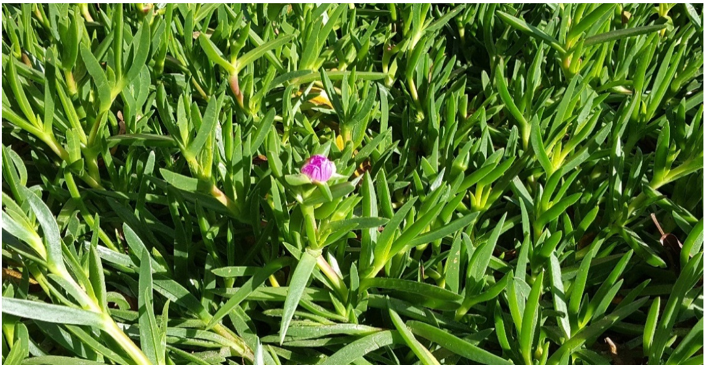
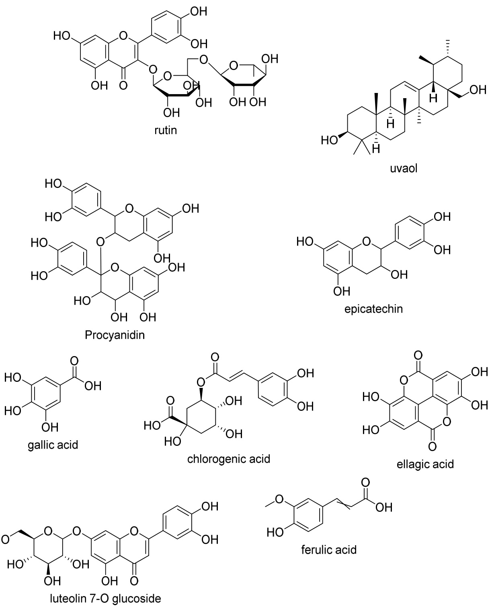

# Review Ethnopharmacology, Therapeutic Properties and Nutritional Potentials of Carpobrotus edulis: A Comprehensive Review

Kolajo Adedamola Akinyede $^ { 1 , 2 , * \oplus }$ , Okobi Eko Ekpo $\mathbf { 1 } _ { \textcircled { 1 } }$ and Oluwafemi Omoniyi Oguntibeju 3,\*

1 Department of Medical Bioscience, University of the Western Cape, Bellville, Cape Town 7530, South Africa; oekpo@uwc.ac.za   
2 Department of Science Technology, Biochemistry unit, The Federal Polytechnic P.M.B.5351, Ado Ekiti, Ekiti State 360231, Nigeria   
3 Phytomedicine and Phytochemistry Group, Oxidative Stress Research Centre, Department of Biomedical Sciences, Faculty of Health and Wellness Sciences, Cape Peninsula University of Technology, P.O. Box 1906, Bellville 7535, South Africa   
\* Correspondence: adedamola_ak@fedpolyado.edu.ng (K.A.A.); oguntibejuo@cput.ac.za (O.O.O.); Tel.: +27-21-953-8495 (O.O.O.)

Received: 17 June 2020; Accepted: 26 July 2020; Published: 16 September 2020

Abstract: Carpobrotus edulis, formerly known as Mesembryanthemum edule $L ,$ belongs to the Aizoaceae family of plants. It is a facultative halophytic invasive medicinal and edible succulent plant that is native to South Africa and is distributed worldwide. Hitherto, this plant appears to be mainly known for its ornamental use in decorations, soil stabilization, and erosion control, and not for its many potential medicinal and nutritional benefits, thus suggesting its underutilization. This review presents cogent and comprehensive information on the distribution, ethnomedicinal use, phytochemistry, pharmacology, toxicology, and nutritional value of Carpobrotus edulis and provides the rationale for further pharmacognostic research that will validate its many folkloric medicinal and nutraceutical claims, and promote its standardization into a commercially available product. The reported traditional use of this plant for the treatment of sinusitis, diarrhoea, tuberculosis, infantile eczema, fungal and bacterial infections, oral and vaginal thrush, high blood pressure, diabetes, wound infections, spider and tick bites, sore throat as well as mouth infections are well documented. Its therapeutic activities such as anti-proliferative, antioxidant, antifungal, antibacterial, antidiabetic, anti-inflammatory, cytotoxicity, and nutritional value have also been reported to be attributable to the array of phytoconstituents present in the plant. These have promoted renewed research interests into this valuable medicinal plant with a view to repositioning and expanding its uses from the current predominantly ornamental and environmental management role to include phytotherapeutical applications through scientific validation studies that will improve its value for the drug discovery process as well as its contribution to food security.

Keywords: Carpobrotus edulis; ethnomedicinal; photochemistry; pharmacology; therapeutic; distribution; pharmaceutical

## 1. Introduction

Carpobrotus edulis (C. edulis) is a medicinal and edible succulent plant that belongs to the Aizoaceae family, which is considered to be South Africa’s most diverse and abundant plant family that has been the least studied for medicinal properties. C. edulis is a facultative halophyte that is common in the Eastern and Western Cape regions of South Africa, but are widely found along other coastal areas of Africa and other continents. C. edulis is known in English as Hottentot fig or highway ice ipclea nptloarntsoour  sfioguprlafingt  pwlhainlte,inwAhiflreikiananAs,fritikisa aknso,witn ibsykmnaonwynnabymesmavinzy: “ngahmaeuskuvimz”:  “ghaouenkauvmy”,, “hgohtotentaovtys”v,y“”,ho“tkteaantpostesvy”,, “pkearadpesevvyy”,”,““rapnerkdveyv”,y”“,s“uruarnvkyv”y,”o,r“s“uvuyrevrayn”,ko”.r “InvyiseirZanulku”,. iItniissicZalulleud, “itikishacamllbei-dl a“imkahbaumlabiw-loa”moarb“ulamwgo”ngoroz“iu”mangdonitgsoizsi”XhanosdaitnsaismieXihso“siagcnuakmuemisa”“i[g1c].u

C. edulis is a mat-forming plant with bright green foliage and leaves that could have red, orange,, or purple-coloured margins and surfaces [2] as shown in Figure 1 below.. This plant reproduces both sexually and asexually, producing large ffllowers and fflleshy indehiscent fruits that contain arrays of seeds. The pllaanttgrgorowswsb ybiynviandviandginagndacnodl ocnoilzoinigzitnheg etnhveireonvmireontmthernotutghriotusgstholiotsn s,towlhoincsh, swprheiacdh salporneagdt haleosnogiltshuersfoaiclesuyirefladcienygienlediwngranmeewt sr atmetvseratyenvoedrey fnordperfopreprrporpoeprapgraotpioanga[t3i]o.nC[.3]e.dCu.l iesdcualins cbaenfobeunfoduond colinffcsl, cfso,acstoalstraolcrkosc,kas,nadndudnuenseswhwehreriet  stpsrperaedasdswidideleyl,y,fofrorminingga crreepiing  mat on the surface, displacing several other coastal  ffllora [4] and negatively affffecting  species diversiity [5–7].. Some European counttrriiess havee prrohibi ibtieteddththeererlelaesaes eofofplpalnatnstsbebleolnognignigntgottohtehCeaCrapropborobtruostusspescpiecsiteos tporoptreoctecdt eadrearse,ams,aimnaliynblyecbaeucsaeuosfe  tohfetihneviansvivaseinvesnseosfstohfisthsipsescpiesci[e8s].[

  
Figure 1. The ffllowering carpobrotus edulis plant and its taxonomy [2].

Although C. edulis is naturally distributed beyond the shores of Africa through mammals by way of ingesting the fruits and discarding its seeds, high adaptability and tolerance to environmental stress factors suchaass aslailniintiyt,y,drdoruoguhgth,t,anadndexecxescsesos loifglhitghtavheavhe pheldpteodstuos saiunstiatisns iptrseasdpr[e9a].dT[h9]e. fTahme lfyamAiilzyoaAciezaoeacaenadesaunbdfasmuiblfyaRmuislyhhRiouisdhehaieoicdoenatea cnoanbtoaiunt 1a5b8o5utsp1e5c8i5essipne1ci1e2sgien 1er1a2 gheanteirnac tuhdaet iCn.cleududleisC[.1e0d]u,litsh[u1s0,],ththeups,rothperpirdoepnetriifidceantitiofincaotfi oindoifvinduiavlidsupealcisepsechiaes  ahlaws a lyswabyesenbeaenc haacllheanllgeengtoe tbo tbaontiacnalicraelsreasrecahrecrhs,e rs,o smoemoe  ofwhwohmomhahvaeveonolnylyfofcoucsuesde donon hthee vaariroiouss partrtss off the plant that difffferentiate it frromoot thererclcolsoesleyl-yr-erlealtaetdedspsepcieecsi,ese,speescpieaclliayllCyarCpaorbprotbursotaucsinaciinfoarcimfoisr.mTish. lTeahveelseaofveCs. eodfuCli.seadruelistraariegshttraoirgshotmoretsiomesetciumrevsecduarnvdeditasnrdecietsptraeclepitsatculerbiisntifuorrbimn,ifmoreams,urmienagsuberitnwgeebnet2w0e–e4n0 $2 0 { - } 4 0 \mathrm { m m }$ oangdaetilnogn ignationtghienpteodtihcel.peTdhiecleol.beThoef tlhoeb ecaolfytxhies cuanleyqxuiasl,utnheqluoanl,gtehstebleoinge3st0–b7ei0n(g8030m–7m0) $\left( 8 0 \mathrm { m m } \right)$ )rtaenstd1s0h–o3r5temst $1 0 { - } 3 5 \mathrm { m m }$ ,ewcohriloelltaheacsoyreolloawhapsetyaelslothwatpfeatadles atshatthefapdleanats tmhaetuprleasn,twmhailteurtehse, owvhailreythaesoavbaoruyth7a–s1a1blouctul7i.–1T1hleosceuflei.atTuhreseafreatduifrfesrearnet idniffoetrhenrtCinaroptohberrotCuasrspobercoiteuss[s3,p8e,c1i1e]s. [3,8,11].

The use of medicinal plants in drug development is well documented and research into these plants should take into consideration some criteria suggested by Baker et al. [12], which include the traditional use of the plant by the local population, the enormity of various ailments or diseases the plant is used for, the extent of geographical spread and availability of large quantities of the plant and ffiinally, the natural sustainability of the plant over prolonged periods. Although C. edulis is one of the Carprobotus species that meet these criteria, its use for medicinal and nutritional purposes appears to be overshadowed by its other uses. There is a dearth of publlished information on C.. edullis,, hence, our aim in this review is to discuss its ethnopharmacology, phytochemistry, therapeutic use, and nuttrritiitionala lvavlauleuaenadntdo ptroovpirdoevindeewninefworimnfatoiromnaotinoitns opnoteitnstiaplortoelnetianlprlaolnet-ibnaspeldadnrt-ubgasdeisdcodvreurgy adinsdc odveevreyloapnmd ednet.v

### 2. Research Methodology

A literature search was conducted with such keywords as Carpobrotus species, Carpobrotus edulis, distribution, antioxidant, traditional use, medicinal uses, ethnomedicinal uses, ethnopharmacology, phytochemistry, pharmacology, anti-proliferative, antifungal, antibacterial, antidiabetic, anti-inflammatory, toxicity, food value in major databases including Science Direct, Google Scholar, BioMed Central (BMC), Web of Science, Springer link, Scopus, and PubMed. Other important information in this review was extracted from scientific articles, electronic books, conference papers, and online theses.

#### 2.1. Distribution and Survival of Carpobrotus edulis

C. edulis is native to the Eastern Cape, Western Cape, and Northern Cape provinces of South Africa where it grows predominantly on the slopes of inland and coastal areas of low elevations [8]. Some authors have reported that C. edulis is abundant along the coast of Portugal [13,14] and is well distributed and grown in Australia [15], New Zealand [16], Northern Africa [17], North America [8], South America [18], Western Asia [19], and Europe [20]. This plant was introduced to Europe, Australia, New Zealand, Southern Europe, and the USA as an ornamental plant in the 19th century [3,21] and is planted along highways, beach parking lots, military and private yards, among other locations for the purposes of soil stabilization and aesthetics [22]. Some of the factors that have ensured the survival of C. edulis include the plant’s ability to adjust to the available levels of nutrients [23], survival in saline environments [24], adaptability to variable pH levels [25] as well as the ability to reproduce both vegetatively and sexually [26].

#### 2.2. Taxonomic Classification of Carpobrotus edulis

Domain: Eukaryota; Kingdom: Plantae; Phylum: Spermatophyta; Subphylum: Angiospermae; Class: Dicotyledonae; Order: Caryophyllales; Family: Aizoaceae; Genus: Carpobrotus; Species: Carpobrotus edulis.

#### 2.3. Traditional Use of Carpobrotus edulis

Thring and Weitz [27] documented and reported on some medicinal plants including C. edulis that are of enormous importance for the treatment of many disease conditions. The juice and sap from C. edulis leaves are traditionally used to treat throat and mouth infections [28], dysentery [29] and digestive problems [28,29], tuberculosis [28], and skin conditions such as burns and wounds as well as for the management of common infections in HIV/AIDS [1]. These authors have also reported the use of C. edulis for the treatment of toothache, earache, oral thrush, virginal thrush, blood pressure, and diabetes mellitus [1]. C. edulis has also been reported to play an important role as a traditional food additive to improve the nutrient composition of food, as its edible fleshy shoot when soaked in water and well-prepared has been used as a food preservative [30]. A summary of the traditional use of this plant is shown in the Table 1 below.

Table 1. Ethnomedicinal uses of Carpobrotus edulis.   

<html><body><table><tr><td>Part of PlantUsed or Administered</td><td>Traditional Use</td><td>Reference</td></tr><tr><td>Leaves—Leaf juice or leaf pulp</td><td>Used to treat inflammation,dysentery, digestive troubles,tuberculosis,toothache,earache.The juice is used as an antiseptic for wounds and burns and vaginal thrush.</td><td>[29,31,32]</td></tr><tr><td>Leaves—The juice from the powdered leaf</td><td>Treatment of oral thrush.</td><td>[27,29,33-35]</td></tr></table></body></html>

Table 1. Cont.   

<html><body><table><tr><td>Part of Plant Used or Administered</td><td>Traditional Use</td><td>Reference</td></tr><tr><td>Leaves-Leaf juice or leaf pulp</td><td>Treatment of throat infections,burn stomach problems chilblains,mouth ulcers,sinusitis and diabetes.</td><td>[1,36,37]</td></tr><tr><td>Fruit</td><td>Food and antimicrobial Food agent. The dried fruits are eaten directly or used to make jams, preserves and act as a flavor.</td><td>[38]</td></tr></table></body></html>

#### 2.4. Phytochemistry of Carpobrotus edulis

Phytochemicals are secondary metabolites responsible for the many activities often associated with the use of medicinal plants for the treatment, amelioration, and management of various ailments including life-threatening diseases. The qualitative phytochemical screening of C. edulis for its content of twelve important phytochemicals namely saponins, chlorides, sulfates, coumarins, flavonoids, alkaloids, anthraquinones, iridoids, cyanogenic glycosides, cardiac glycosides, carbohydrates/glycosides, unsaturated sterols/triterpenoids and tannins has been reported by Eman [39]. All the identified phytochemicals except iridoids were found to be present in varying amounts in the different plant parts: stem, leaves, and flowers of C. edulis [39]. Furthermore, the preparation of the various extracts of C. edulis leaves with water, ethanol, acetone, and hexane solvents revealed differences in the content of phenols, flavonoids, flavonols, proanthocyanidins, tannins, saponins, and alkaloids, as shown in the table below [1].

The evaluation of the amount of phytochemicals revealed that the leaf extract of C. edulis had $5 5 7 \pm 0 . 2 3 \mathrm { m g \ T E / g }$ (Trolox equivalent) of phenolic content, $1 . 1 9 \pm 0 . 0 4 \mathrm { m g Q E / g }$ (Quercetin equivalent) of the flavonoid content, and $4 8 9 \mathrm { m g / g }$ of tannin content, which were highest for the acetone, hexane, and ethanol solvents, respectively [1] as seen in Table 2. In contrast, a similar study carried out on the peel and flesh of C. edulis fruit indicated that the peel of the fruit of C. edulis had $2 7 2 . 8 3 \pm 5 . 5 9 \mathrm { m g \mathrm { T E / g } }$ of phenolic content, $1 . 5 8 \pm 0 . 1 0 \mathrm { m g \mathrm { T E / g } }$ of flavonoid content, and $2 0 . 3 \pm 0 . 9 8 \mathrm { m g / g }$ of tannin content, with the highest values from the ethanol solvent only in comparison with other solvents [39]. Overall, no single solvent can completely extract the various phytochemicals because of the huge difference in the chemical properties of these phytochemicals. In addition, the amount of phytochemicals in the plant varies with the different part of the plant and season of harvest. Chokoe et al. [40] reported that the C. edulis leaves harvested during autumn had higher amounts of these phytochemicals regardless of the solvent of extraction when compared with other parts of the plant.

Table 2. Evaluation of the quantities of phytochemicals in the leaf extract of Carpobrotus edulis. Data were obtained in triplicate and presented as mean $\pm$ standard deviation [1].   

<html><body><table><tr><td>Phytochemicals</td><td>Aqueous</td><td>Ethanol</td><td>Acetone</td><td>Hexane</td></tr><tr><td>Phenols mg TE/g</td><td>517 ± 0.40</td><td>330.8 ± 0.04</td><td>557 ± 0.23</td><td>64.14 ± 0.15</td></tr><tr><td>Flavonoids mg QE/g</td><td>0.29 ± 0.01</td><td>0.28 ± 0.01</td><td>0.65 ± 0.04</td><td>1.19 ± 0.04</td></tr><tr><td>Flavonols mg QE/g</td><td>0.05 ± 0.001</td><td>0.05 ± 0.001</td><td>0.023 ± 0.05</td><td>0.19 ± 0.03</td></tr><tr><td>Proanthocyanidins mg CE/g</td><td>896 ± 0.05</td><td>115.28 ± 0.007</td><td>753.87 ± 0.02</td><td>134.91 ± 0.01</td></tr><tr><td>Tannins (mg/g)</td><td>461 ± 0.07</td><td>489 ± 0.38</td><td>384 ± 0.14</td><td>64 ± 0.14</td></tr><tr><td>Saponins (mg/g)</td><td>34 ± 0.21</td><td>45 ± 0.26</td><td>11 ± 0.071</td><td>2± 0.035</td></tr><tr><td>Alkaloids (mg/g)</td><td>45 ± 0.06</td><td>38 ± 0.02</td><td>31 ± 0.021</td><td>3 ± 0.015</td></tr></table></body></html>

In one study on C. edulis, van der Watt and Pretorius [41] reported that flavonoids are the major component of the leaves of this plant that include ferulic acid, catechol, tannins, rutin, neohesperidin, and hyperosides. The structures of some of the phytochemicals identified in C. edulis are shown in Figure 2 below. These active principles such as flavonoids have been reported to mitigate infections caused by bacteria [42–44] and have also been reported to have cardioprotective, antiviral, and anticancer properties. The first evidence of the presence of potent phenolics in C. edulis was obtained from the use of LC/ESI-MS/MS techniques to fractionate the extract, yielding procyanidins and propelargonidins as the major active polyphenolics present [45]. It was demonstrated that $\beta$ -carotene bleaching inhibition, in vitro DPPH, and ABTS free radical scavenging activities of C. edulis confer biological actions such as iScmi.mPhuarnmo. 2m0o20d,u8l8,atxoFrOy,RaPnEtEiRo xRiEdVaInEtW, and neuroprotective potential in drug development.

  
Figure 2. Some selected structures of phytochemicals identiffiied in Carpobrotus edulliis [43].

Martins et all..[[45]]sshoweedththatathteh eprpersesnecneceofofmomnongoagl acltaocstoylsdyiladciyalcgyllygcleyrcoelr(olM(GMDGD)Gu)vauovl,aoβl-, $\beta$ -maymriynr,ino,leoalenaonliocliacciadci,dc,actaetcehcihni,na,nadndepeipciactaetcehcihninininC.C.ededuluilsisccoonffeerrssbotth anttii--prolliifferatiive property and inhibition of P-glycoprotein that causes drug resistance in cancer. Furthermore, essential oils from the leaves of C. edulis have been identified to contain some active components or phytochemicals [46], which include monoterpenes, oxygenated monoterpenes, diterpenes, oxygenated diterpenes, and fatty acids. The essential oils consist of different components that function in diverse ways that are beneficial to human health. The antioxidant, antimicrobial, and immune-modulating activities of C. edulis could be linked to these active components of essential oils, especially the monoterpenes, sesquiterpenes, diterpenes, and fatty acid esters [46].

The Table 3 below shows some of the identified components of the essential oils following hydro-distillation and analysis with gas chromatography mass spectrometry (GC-MS) techniques of the acetone, hexane, and ethanolic extracts of the leaves of C. edulis. A total of twenty-eight compounds that account for $9 9 . 9 9 \%$ of the total essential oils were identified in the leaves of C. edulis [46].

Table 3. List of the molecules present in the essential oils of the leaves of Carpobrotus edulis [46].   

<html><body><table><tr><td>Compounds</td><td>Chemical Formula</td></tr><tr><td>Monoterpenes</td><td></td></tr><tr><td>Isoterpinolene</td><td>C10H16</td></tr><tr><td>Nephthalene,1,2-dihydro-2,5,8-tri</td><td>C12H10</td></tr><tr><td>Nephthalene,1,2-dihydro-2,5,8-tri</td><td>C12H10</td></tr><tr><td>BistrimethylsilylN-acetylEICOSAS</td><td>C15H33NO5Si3</td></tr><tr><td>Oxygenated monoterpenes</td><td></td></tr><tr><td>Mercaptoacetic acid, bis (trismethylsilyl)</td><td>C8H20O2SSi2</td></tr><tr><td>Eicosamethylcyclodecasiloxane</td><td>C8H24O4Si4</td></tr><tr><td>N-Octanol</td><td>C8H18O</td></tr><tr><td>Nonylaldehyde</td><td>C9H18O</td></tr><tr><td>Trans-β-demascenone</td><td>C13H18 O</td></tr><tr><td>Trans-2-tridecenal</td><td>C13H24O</td></tr><tr><td>Tetradecamethylcycloheptasiloxane</td><td>C14H42O7Si7</td></tr><tr><td>Tetradecamethylcycloheptasiloxane</td><td>C14H42O7Si7</td></tr><tr><td>Tetradecamethylcycloheptasiloxane</td><td>C14H42O7Si7</td></tr><tr><td>Sesquiterpenes</td><td></td></tr><tr><td>Octadecane</td><td>C18H38</td></tr><tr><td>Octadecane</td><td>C18H38</td></tr><tr><td>1-octadecene</td><td>C18H36</td></tr><tr><td>Nonadecane</td><td>C18H40</td></tr><tr><td>Oxygenated sesquiterpene</td><td></td></tr><tr><td>2-pentadecanone,6,10,14-trimethyl</td><td>C18H36O</td></tr><tr><td>Diterpenes</td><td></td></tr><tr><td>Eicosane</td><td>C20H42</td></tr><tr><td>Eicosane</td><td>C20H42</td></tr><tr><td>Oxygenated diterpenes</td><td></td></tr><tr><td>Phytol (2-Hexadecen-1-o1, 3,7,11,15-tetramethyl)</td><td>C20H40O</td></tr><tr><td>Trisiloxane,1,1,1,5,5,5-hexamethyl-3-[(trimethylsilyl)oxy]</td><td>C24H72O12Si12</td></tr><tr><td>Tetrasiloxane,1,1,1,5,7,7,7-heptamethyl-3,bis[(trimethylsilyl)oxy]</td><td>2C24H72O12Si12</td></tr><tr><td>3-Isopropoxy-1,1,1,7,7,7-hexamethyl-3,5,5-tri(trismethylsiloxy) tetrasiloxane</td><td>2C24H72O12Si12</td></tr><tr><td>Tetrasiloxane-1,1,1,5,7,7,7-heptamethyl-3,3 bis[(trismethylsilyl)oxy)l</td><td>C24H72O12Si12</td></tr><tr><td>Fatty acids</td><td></td></tr><tr><td>Benzoic acid, 2,5-bis (trimethylsiloxy-,trimethylsilyl ester)</td><td>C16H30O4Si3</td></tr><tr><td>Hexadecanoic acid,ethyl ester</td><td>C18H36O2</td></tr><tr><td>Hexadecanoic acid,1-methyl ethyl ester</td><td>C19H38O2</td></tr></table></body></html>

Many of the secondary metabolites in medicinal plants including C. edulis are known to have a wide range of beneficial properties that has attracted so much attention to the use of medicinal plants as candidates for the development of drugs [47], possibly because medicinal plants are adjudged to have potent pharmacological actions, are affordable, relatively safe, and readily available.

#### 2.5. Toxicity Studies on Carpobrotus edulis

Most medicinal plants have age-long use for the treatment of various diseases and their safety can only be guaranteed through in vitro and in vivo screening experiments that monitor mutagenicity, carcinogenicity, or embryotoxicity [48,49]. In one study, some medicinal plants including Carpobrotus mellei, Carpobrotus quadrifidus, and Carpobrotus edulis were subjected to the brine shrimp lethality test to determine cytotoxicity [50]. Findings revealed that the aqueous extract of Carpobrotus mellei and the methanolic extract of Carpobrotus quadrifidus were more toxic in the brine shrimp lethality test than C. edulis, with a death rate of $4 7 . 4 3 \%$ and $4 8 . 0 6 \%$ for test durations of $2 4 \mathrm { h }$ and $4 8 \mathrm { h } ,$ respectively [35]. The results from this study were also corroborated by another study in which the aqueous and methanolic extracts of C. edulis were found to be safe or non-toxic in the brine shrimp lethality bioassay [32].

In a study to investigate the potential of the aqueous–acetone extract of C. edulis in a tissue regeneration study using the flatworm Dugesia sicula as a model, the administration of the phenols from the C. edulis extract in the medium of Dugesia sicula at non-toxic concentrations revealed morphological alterations from the macroscopic analysis done, indicating possible toxicological effects of the polyphenols in the extract [51].

#### 3. Biological Activity of Carpobrotus edulis

The in vitro biological activities of C. edulis showed that the plant has antioxidant, immunoactive, antimicrobial, neuroprotective, and anticholinesterase properties [52–55]. Furthermore, this plant has also been reported to have anticancer [54], anti-bacterial [41], and antifungal properties [46].

#### 3.1. Antibacterial Properties

Multi-drug resistance (MDR) is a major challenge in the treatment of most infections including those caused by bacteria. Medicinal plants have long been used for MDR and the methanolic extract of C. edulis is known to be inactive against two bacteria, namely, methicillin-resistant-Staphylococcus aureus and the multidrug-resistant Mycobacterium tuberculosis [55]. The treatment of monocyte-derived human macrophages with the methanolic extract of C. edulis led to the inhibition of the growth of both bacteria, possibly via phagocytosis. This may be due to the ability of the monocyte-derived macrophages to concentrate the extract more than the highest concentration that is obtainable in the in vitro studies [55]. The inhibition of growth provides the scientific evidence and rationale for the use of this plant in traditional medicine for the treatment of infections [28] and also suggests that the plant could serve as an effective antimicrobial agent against MDR intracellular infections [55].

Furthermore, Martins et al. [45] reported on six compounds isolated from an extract of C. edulis, namely uvaol, $\beta$ -amyrin, oleanolic acid, catechin, epicatechin, and monogalactosyldiacylglycerol and their activity against different strains of bacteria. These compounds were tested for their activity against the efflux pump system of Gram-negative and Gram-positive bacteria and found to have varying effects. Oleanolic acid showed the highest activity in most of the bacterial strains tested while the greatest modulation or inhibition of efflux activity of MDR Gram-positive strains was attributed to uvaol, a tripertene, which was the most potent isolated compound. Meddeb and colleagues also reported that the aqueous–acetone extract of C. edulis contains different amounts of phenolics such as gallic acid, chlorogenic acid, catechin, 1,3-dicaffeoylquinic acid, caffeic acid and ferulic acid, which were adjudged to be effective against Gram-positive B. cereus and S. aureus as well as S. epidermidis. However, this extract did not show remarkable antimicrobial effects against Gram-negative E. coli, P. aeruginosa, and S. typhimurium [51].

Loaiza et al. [39] evaluated the fruit peel and flesh extracts of C. edulis for antibacterial activity against both Gram-positive and Gram-negative bacteria namely Escherichia coli ATCC 25922, Pseudomonas aeruginosa ATTC 27853, Klebsiella pneumoniae ATCC 70603, Staphylococcus aureus ATCC 43300 (MRSA), Salmonella enteritidis ATTC 13076, Sarcina lutea ATCC 9341, Proteus mirabilis ATCC 25933,

Bacillus cereus ATCC 11778, Staphylococcus epidermidis NRRL B-4268 and Listeria monocytogene NRRL B33314 using the slightly modified broth microdilution method with gentamicin used as a standard drug. The peel extracts were generally more active than the flesh extracts and mostly more effective against Gram-positive than Gram-negative bacteria. However, no activity was observed for both these extracts against P. aeruginosa, K. pneumoniae, P. mirabilis and C. albicans. The ethanol peel extract showed the highest activity against S. epidermidis with a minimum inhibitory concentration (MIC) of $0 . 7 8 \mathrm { m g / m L } ,$ much lower than for other extracts [39].

#### 3.2. Antifungal Properties

Omoruyi et al. [46] reported the antifungal activities of the hexane, acetone, ethanol, and aqueous leaf extracts of C. edulis on five pathogenic fungal strains: Candida albican, Candida krusei, Candida rugosa, Candida glabrata, and Cryptococcus neoformans. The results showed MIC values ranging between $0 . 0 2 \mathrm { - } 0 . 0 3 1 \mathrm { m g / m L }$ . The hexane extract was found to be the most potent against all five fungal strains with MICs ranging between $0 . 0 2 { - } 1 . 2 5 ~ \mathrm { m g / m L } ,$ while the aqueous and ethanolic extracts had no noticeable antifungal activity. In addition, the acetone extract showed substantial activity against Candida krusei only, with a MIC of $0 . 0 4 ~ \mathrm { m g / m L }$ [46]. The activity of the essential oil extracted from the leaves of C. edulis was also tested against five pathogenic fungal strains and found to be similar to the high potency observed for the hexane extract, which is in agreement with the work of Steenkamp et al. [56].

Furthermore, the study carried out on the anti-fungal activity of the peel and flesh extracts of the fruit of C. eduli against Candida parapsilopsis, and Candida albican ATCC 2655 showed that both the aqueous and ethanol extracts of the peel of C. edulis fruit only inhibited the growth of Candida parapsilopsis alone, having the same MIC of $6 . 2 5 \mathrm { m g / m L }$ while no activity was detected for the flesh of C. eduli fruit extracts against the two fungal strains tested [39].

#### 3.3. Antioxidant Properties

The antioxidant characteristics and phenolic compounds extracted from the leaves, stem, and roots of C. edulis were evaluated in vitro using different assays such as total antioxidant capacity, DPPH scavenging activity, iron reducing power, and $\beta$ -carotene bleaching test (BCBT) were conducted by Falleh et al. [43]. The different parts of the plant were found to have higher antioxidant activity when compared with butylated hydroxytoluene BHT, the positive control, in the order: stem $>$ leaf $>$ roots. Reversed-phase High Performance Liquid Chromatography (RP-HPLC) analysis was also used to determine the phenolic composition in the extracts and the highest amount of polyphenolic compounds was $8 6 . 5 \mathrm { m g G A E } \mathrm { g } ^ { - 1 }$ DW in the stem extract and $6 8 . 7 \mathrm { m g } \mathrm { G A E } \mathrm { g } ^ { - 1 }$ DW in the leaf extracts of C. edulis, respectively. Catechin and procyanidins B2 were more abundant in the stem, while quercitrin and avicularin were more abundant in the leaves of C. edulis as revealed by HPLC analysis [43].

Omoruyi et al. [1] reported the antioxidant activity of the aqueous, ethanol, acetone, and hexane extracts of C. edulis using the 1,1-diphenyl-2-picrylhydrazyl (DPPH), $^ { 2 , 2 ^ { \prime } }$ -azino-bis (3-ethylbenzthiazoline-6-sulfonic acid) (ABTS) diammonium salt, hydrogen peroxide $( \mathrm { H } _ { 2 } \mathrm { O } _ { 2 } ) .$ , nitric oxide (NO), and the ferric reducing power (FRAP) assays. The findings indicated variations in the percentages of the phytoconstituents based on the different solvents used for the extraction. The acetone extract was reported to contain more phenolics at $5 5 . 7 \pm 0 . 4 0 4 \%$ ; the aqueous extract had more proanthocyanidins $( 8 6 . 9 \pm 0 . 0 0 5 \% )$ ) while the ethanol extract had $4 . 5 \pm 0 . 0 5 7 \%$ alkaloids, $4 8 . 9 \pm 0 . 2 8 \%$ tannins, and $4 . 5 \pm 0 . 2 6 2 \%$ saponins, respectively [1]. Flavonoids and flavonols were greater in the hexane extract when compared with other extracts, while the aqueous and ethanol extracts demonstrated a strong inhibition against the DPPH, ABTS, and NO scavenging radicals. The findings from this work indicate that both the aqueous and ethanol extracts of C. edulis leaves were the best for assessing antioxidant capacity [1].

Falleh et al. [57] investigated the phenolic contents of the varying leaf, stem, and root aqueous–methanolic fractions of C. edulis. The phenol-rich fractions of $2 0 \%$ , $6 0 \%$ , and $4 0 \%$ in the leaf, stem, and root extracts respectively ranged from 671 to $9 8 9 ~ \mathrm { m g }$ GAE $\mathbf { g } ^ { - 1 }$ DR. The FRAP value was found to be $4 0 \%$ in the leaf and $4 0 \%$ in the stem extracts, representing 86 and $9 6 ~ \mu \mathrm { g / m L ^ { - 1 } }$ , respectively, and the highest total antioxidant effect was seen in the root $( 4 0 \% )$ , representing $3 9 5 \mathrm { m g }$ GAE $\mathbf { g } ^ { - 1 }$ DR. Thus, various parts of C. edulis are potential sources of natural antioxidants [57].

#### 3.4. Neuroprotective Properties

The first evidence of the neuroprotective effects of C. edulis was reported by Custódio et al. [52], who showed that the methanolic extracts of C. edulis could inhibit both acetylcholinesterase and butyrylcholinesterase enzymes (dual role), thus providing a basis for the potential use of the plant for the management and treatment of different neurodegenerative disorders of the brain [58]. Cholinesterase inhibitors (ChEIs) are important mechanism-mediated molecules that alleviate cognitive dysfunction [58].

A study by Mulaudzi and co-workers on the inhibitory capacity of various extracts of C. edulis against the acetylcholinesterase enzyme (AChE) using a colorimetric method of analysis showed that the $5 0 \%$ methanolic, $7 0 \%$ acetone, and aqueous extract of C. edulis had half-maximal inhibitory concentration $( \mathrm { I C } _ { 5 0 } )$ of $2 8 . 8 \pm 3 . 0 7 \mathrm { m g / m L } ,$ $\mathrm { 3 4 . 0 \pm 2 . 8 8 \ m g / m L } ,$ and $2 0 . 0 \pm 0 . 0 8 \mathrm { m g / m L } ,$ respectively, at $1 \mathrm { m g / m L }$ of the extract compared with the standard drug Galanthamine, which had an $\mathrm { I C } _ { 5 0 }$ value of $8 2 . 8 \pm 0 . 2 9 ~ \mu \mathrm { M }$ against AChE [59]. These extracts showed lower anticholinesterase activity in comparison with a similar Carpobrotus species, Carpobrotus dimidiatus [59]. The neuroprotective action of C. edulis via the inhibition of AChE could be accentuated by an increase in cholinergic function induced by the nutritionally important polyunsaturated fatty acids (PUFAs) present in C. edulis [52], which is known to inhibit AChE hydrolysis or enhance AChE release to alleviate disease symptoms [60]. Another neuroprotection study by Enogieru et al. [61] in our research group showed that pre-treatment with the aqueous extract of C. edulis prevented apoptosis and oxidative stress in a cellular model of Parkinson’s disease (PD) and provides the rationale for further investigation of the effects of this plant on other pathophysiological pathways of this disease. Another study by Zarrock et al. [62] $7 \beta$ hydroxycholesterol ( $7 \beta$ -OHC), was found to induce cell death and oxidative stress in cultured murine oligodendrocytes (158N) and these effects were reversed by the ethanol–water extract of C. edulis, which demonstrated the neuroprotective potential of this extract in age-related diseases associated with oxidative stress and lipid peroxidation.

#### 3.5. Antidiabetic Properties

Diabetes and its complications remain one of the major non-communicable health conditions that are prevalent in both developed and developing countries of the world. Different mechanisms are targeted in research that is aimed at the development of effective anti-diabetic drugs. The use of medicinal plants in the development of drugs for the treatment of diabetes is preferred over synthetic drugs, which are known to have many deleterious side effects.

Oxidative stress and pro-inflammatory advanced glycation end products (AGEs) remain some of the mechanisms that aggravate the complications of diabetes mellitus. Hafsa et al. [36] reported the antiglycation activity of C. edulis extracts for the first time and found that there was significant inhibition of the fluorescent AGEs formed by the ethanol–water extract of C. edulis. The antiglycation property or the inhibitory mechanisms of (AGEs) are important for the prevention and amelioration of induced AGE diabetic complications [63]. This antiglycation property or inhibitory effect on protein glycation is an important attribute of the C. edulis ethanol–water extract [36] and could support other evidence to justify the traditional use of C. edulis for the treatment of diabetes mellitus. Furthermore, one of the most important mechanisms for the development of drugs for the treatment of diabetes mellitus is the inhibition of $\alpha$ -amylase and $\alpha$ -glucosidase activity. The development of inhibitors for these carbohydrate-metabolizing enzymes has helped to regulate postprandial hyperglycemia in circulation, which is an important strategy in the treatment of diabetes mellitus [64,65]. In type 2 diabetes mellitus, abnormalities of glucose homeostasis are linked to postprandial hyperglycemia, which that is observed early enough in the pathophysiology of diabetes mellitus. Overall, $\alpha$ -amylase and $\alpha$ -glucosidase inhibitors could regulate abysmal glucose levels after carbohydrate catabolism.

Medicinal plants have become attractive for the treatment of postprandial hyperglycemia because they are adjudged not to cause hypoglycemia, have good safety profiles, do not induce insulin secretion while regulating postprandial hyperglycemia, and have less side effects compared to available synthetic drugs [64,66,67].

The potential anti-diabetic activity of C. edulis leaf extracts via the inhibition of $\alpha$ -glucosidase by its aqueous, methanol $( 5 0 \% )$ , and acetone $( 7 0 \% )$ extracts was evaluated by Mulaudzi and colleagues [59]. The aqueous extract showed an $\mathrm { I C } _ { 5 0 }$ value of $5 ~ { \mu \mathrm { g / m L } }$ compared with the standard $\alpha \mathrm { . }$ -glucosidase inhibitor, acarbose, which has an $\mathrm { I C } _ { 5 0 }$ value of $4 2 9 ~ { \mu \mathrm { g / m L } } ,$ a reflection of the high significance of $\alpha$ -glucosidase inhibition; this further substantiates the use of water to prepare C. edulis extracts as done traditionally in the treatment of diabetes mellitus. Overall, the C. edulis leaf extracts had strong inhibitory action against $\alpha$ -glucosidase enzymes in the in vitro assay [59]. In another study, the aqueous, ethanol, and acetone extracts from the fruits of C. edulis were shown to display low inhibition activity to $\alpha$ -amylase and $\alpha$ -glucosidase enzymes, ranging from $0 . 1 3 \pm 0 . 0 1$ to $0 . 2 4 \pm 0 . 0 1$ $\mathrm { m m o l / A C A E / g }$ and $0 . 3 3 \pm 0 . 0 2$ to $0 . 4 7 \pm 0 . 0 1 \mathrm { \ m m o l / A C A E / g } ,$ , respectively [39]. This result was in contrast to a previous study that reported a higher enzymatic inhibitory activity at an $\mathrm { I C } _ { 5 0 }$ value of $5 ~ { \mu \mathrm { g / m L } }$ [59]. This probably provides scientific evidence or support for the use of this plant for the traditional treatment and management of diabetes mellitus.

#### 3.6. Anti-Inflammatory Properties

Inflammation is a protective response by the body to ensure the removal of detrimental stimuli, as well as a healing process for repairing damaged tissue caused by such factors as microbial infection, cellular injury, and myocardial infarction [68]. Many diseases such as arthritis, polymyalgia rheumatica, heart conditions, asthma, cancer, and inflammatory bowel are linked to inflammatory processes [69,70] while in conditions such as diabetes mellitus, inflammation is adjudged a common risk factor of their pathogenesis [59,71]. Drugs that alleviate or ameliorate inflammation and its associated painful episodes often work through hindering the enzymes needed by the body to produce pro-inflammatory eicosanoids [72]. Eicosanoids such as prostanoids, leukotrienes, and thromboxanes are pro-inflammatory mediators that are produced when cyclooxygenase (COX), lipoxygenase (LOX), and P 450 epoxygenase metabolize arachidonic acid in the metabolic pathway [73], and these molecules are implicated in many pathological conditions that are related to the inflammatory process. Targeting or inhibition of these molecules is important in biological processes to ameliorate inflammation. Some medicinal plants are known to have an effective anti-inflammatory activity or potential as a result of which much attention is now being given to the isolation of novel anti-inflammatory compounds with minimal or no side-effects from medicinal plants.

Mulaudzi et al. [59] reported that the aqueous, methanol $( 5 0 \% )$ , and acetone $( 7 0 \% )$ extracts of C. edulis subjected to the 15-lipoxygenase (LOX) enzyme inhibition model had $\mathrm { I C } _ { 5 0 }$ values of $5 9 . 8 \pm 5 . 5 0 ~ \mu \mathrm { g / m L } ,$ , $1 2 0 . 2 \pm 1 7 . 4 2 \mu \mathrm { g / m L } ,$ and $2 2 . 3 \pm 4 . 1 1 \mu \mathrm { g / m L } ,$ respectively. The $\mathrm { I C } _ { 5 0 }$ value not greater than $1 0 0 ~ \mu \mathrm { g / m L }$ obtained from the $7 0 \%$ acetone and water extracts of C. edulis indicated the strong potential of these extracts to inhibit the LOX enzyme, which is one of the key enzymes implicated in inflammation. The C. edulis extracts had a significant LOX-17 inhibitory activity when compared with extracts of C. dimidiatus [59], whereas the C. dimidiatus leaf extracts exhibited higher cyclooxygenase-2 (COX-2) than COX-1 enzyme inhibition than C. edulis in another study by Fawole et al [69].

#### 3.7. Antiproliferative Properties

Many studies have validated the use of different medicinal plants as antiproliferative or anti-cancer agents [74–79]. There are pieces of scientific evidence to show that C. edulis extracts have anti-cancer properties that promote the inhibition of abnormal cell growth in different cancer cell lines caused by oncogenic factors. Ordway et al. [56] showed that the methanolic leaf extract of C. edulis at non-toxic concentrations could inhibit the verapamil sensitive pump of the L5178 mouse T-cell lymphoma cell line. Evidence on the anti-proliferative property of C. edulis leaf extract showed that P-glycoprotein, known for its drug resistance potential, was inhibited in the mouse lymphoma cell lines [47]. Seven compounds were identified from the methanolic extract of C. edulis subjected to fractions of chloroform and ethyl acetate using 1D, 2D NMR, and MS and these include such triterpenes as $\beta$ -amyrin, uvaol, oleanolic acid, monogalactosyldiacylglycerol, catechin, and epicatechin as well as procyanidin B5. Overall, the antiproliferative activity and the reversal of multidrug resistance in MDR mouse lymphoma cell lines was the most significant with the compound uvoal, compared with other compounds tested [45].

Hafsa et al. [36] reported the cytotoxic effects and hence the anti-proliferative activities of the aqueous and ethanol–water (same ratio) extracts of C. edulis on human colon cancer cell lines (HCT-116). This study showed that the ethanol–water extract significantly decreased cell viability after $2 4 \mathrm { - h }$ incubation compared to the aqueous extract [36], and this anti-proliferative effect could be attributed to the constituents, especially the seven major phenolics: sinapic acid, ferulic acid, luteolin 7-O-glucoside, hyperside, isoquercitin, ellagic acid, and isorhamnetin 3-O-rutinoside. A recent in vitro preliminary cytotoxicity study on the effects of C. edulis on U251 and U87 malignant glioblastoma cell lines showed that the extract elicits an anti-proliferative property and also inhibited colony formation in U251 cells [80].

#### 4. Dietary Uses of Carpobrotus edulis

Many medicinal plants are edible and contain quality nutrients, thus presenting reasonable potential to be developed into a new food product or prepared into such nutrient-rich condiments as food additives, spices, and flavors. Other forms of preparation could include tonics, nuts, wine, jelly, and vegetables, to mention a few. Van Wykj reported that 16 indigenous plants from South Africa including C. edulis gave rise to 119 commercialized African products of which food products or additives are prominent. The fruits of C. edulis were rated very high for the production of such food products as jam, chutney, or sauce and other dried processed products [81].

In one study, the leaves of C. edulis were evaluated to ascertain adequacy and suitability for human composition in terms of nutrients and safety. The parameters of proximate chemical analysis evaluated showed that antioxidants were higher than other halophytes, an indication that C. edulis has a great potential as a nutritional supplement to tackle oxidative-stress linked disease conditions [53]. Similarly, edible wild fruits of five Carpobrotus species including C. edulis were assessed for their nutritional significance through proximate chemical analysis [82]. Findings showed considerably high moisture levels of $7 7 . 6 \%$ to $9 0 . 3 \%$ , carbohydrate levels of $5 8 . 8 \%$ to $7 0 . 3 \%$ , energy levels of 1240 to 1370 kJ $1 0 0 { \mathrm { g } } ^ { - 1 }$ , and protein levels were considered adequate at $8 . 1 \%$ to $2 6 . 0 \%$ . On the other hand, the lipid levels were considered low at $0 . 9 \%$ to $2 . 4 \%$ , while the elemental concentrations were in the decreasing trends of $\mathtt { C a }$ $> \mathrm { M g } > \mathrm { F e } > \mathrm { M n } > \mathrm { Z n } \mathrm { \sim } \mathrm { C u } > \mathrm { C r } > \mathrm { S e } \mathrm { \sim } \mathrm { N i } \mathrm { \sim } \mathrm { C o }$ [82]. Overall, the findings from the study showed that the Carpobrotus species evaluated could positively contribute to human nutritional needs in the form of a dietary supplement because of the rich array of essential nutrients in these plants compared to most cultivated fruits like oranges, apples, and grapes. This could potentially contribute positively to the improvement of global food security since these plants have been reported to be widely distributed in different parts of the world.

#### 5. Conclusions

An extensive literature search was done for this review to reveal important ethnopharmacological, phytochemical, and biological properties of Carpobrotus edulis as well as its nutritional value. It is clear from the literature search that this plant has been an important source of traditional medicines for decades, especially for the management of tuberculosis and other respiratory infections, toothaches and earaches, facial eczema, wounds and burns, hypertension, and diabetes mellitus, among others. Some of the ethnomedicinal uses of this plant have been scientifically validated and pharmacological activities such as antimicrobial, anti-proliferative, antioxidant, neuroprotective, anti-inflammatory, and antidiabetic activities have also been studied as discussed in this review. The non-therapeutic uses of C. edulis including its nutritional use were also highlighted. It is hoped that this review will elicit renewed research interests in this valuable medicinal plant with the overall aim of repositioning and expanding its uses from its predominantly ornamental and environmental management role to evidence-based phytotherapeutic uses through scientific studies aimed at validating its folkloric medicinal and therapeutic efficacy for drug discovery and development purposes. Hitherto, only limited in vitro scientific studies have been reported, hence more scientific validation studies are necessary in the form of toxicological and pharmacological profiling of Carpobrotus edulis in more in vitro and animal models, as a prelude for human investigations through clinical trials.

Author Contributions: Conceptualization, K.A.A., O.E.E., and O.O.O.; Writing of the original draft, K.A.A.; Writing—review and editing, K.A.A., O.E.E., and O.O.O.; Supervision, O.E.E. and O.O.O. All authors have read and agreed to the published version of the manuscript.

Funding: This research received no external funding.

Acknowledgments: The authors acknowledge the support of the institutions, University of the Western Cape, (UWC) Bellville, Cape Town 7530, South Africa, Cape Peninsula University of Technology, (CPUT) P.O. Box 1906, Bellville 7535, South Africa, and the Federal Polytechnic P.M.B.5351, Ado Ekiti, Ekiti State, Nigeria toward the completion of this review article.

Conflicts of Interest: The authors declare no conflicts of interest.

#### References

1. Omoruyi, B.E.; Bradley, G.; Afolayan, A.J. Antioxidant and phytochemical properties of carpobrotus edulis (l.) bolus leaf used for the management of common infections in HIV/AIDS patients in eastern cape province. Bmc Complement. Altern. Med. 2012, 12, 215. [CrossRef] [PubMed]   
2. Albert, M.E.; D’Antonio, C.M.; Schierenbeck, K.A. Hybridization and introgression in carpobrotus spp.(Aizoaceae) in california. I. Morphological evidence. Am. J. Bot. 1997, 84, 896–904. [CrossRef] [PubMed]   
3. Wisura, W.; Glen, H. The South African species of carpobrotus (mesembryanthema–Aizoaceae). Contrib. Bolus Herb. 1993, 15, 76–107.   
4. D’antonio, C. Invasion of coastal plant communities by the introduced succulent, carpobrotus edulis (Aizoaceae). Roles Fire Herbiv. 1992, 95, 14–21.   
5. Roiloa, S.R.; Rodríguez-Echeverría, S.; Freitas, H.; Retuerto, R. Developmentally-programmed division of labour in the clonal invader carpobrotus edulis. Biol. Invasions 2013, 15, 1895–1905. [CrossRef]   
6. Vilà, M.; Siamantziouras, A.S.D.; Brundu, G.; Camarda, I.; Lambdon, P.; Médail, F.; Moragues, E.; Suehs, C.M.; Traveset, A.; Troumbis, A.Y. Widespread resistance of Mediterranean island ecosystems to the establishment of three alien species. Divers. Distrib. 2008, 14, 839–851. [CrossRef]   
7. Traveset, A.; Moragues, E.; Valladares, F. Spreading of the invasive Carpobrotus aff. Acinaciformis in Mediterranean ecosystems: The advantage of performing in different light environments. Appl. Veg. Sci. 2008, 11, 45–54. [CrossRef]   
8. Campoy, J.G.; Acosta, A.T.; Affre, L.; Barreiro, R.; Brundu, G.; Buisson, E.; González, L.; Lema, M.; Novoa, A.; Retuerto, R. Monographs of invasive plants in europe: Carpobrotus. Bot. Lett. 2018, 165, 440–475. [CrossRef]   
9. D’Antonio, C.M. Mechanisms controlling invasion of coastal plant communities by the alien succulent carpobrotus edulis. Ecology 1993, 74, 83–95. [CrossRef]   
10. Kubitzki, K.; Rohwer, J.G.; Bittrich, V. Flowering Plants·Dicotyledons: Magnoliid, Hamamelid and Caryophyllid Families; Springer Science & Business Media: Berlin, Germany, 2013; Volume 2.   
11. Gonçalves, M. Carpobrotus. In Flora Ibérica: Plantas Vasculares de la Península Ibérica e Islas Baleares; Spanish National Research Council: Madrid, Spain, 1990.   
12. Baker, J.T.; Borris, R.P.; Carté, B.; Cordell, G.A.; Soejarto, D.D.; Cragg, G.M.; Gupta, M.P.; Iwu, M.M.; Madulid, D.R.; Tyler, V.E. Natural product drug discovery and development: New perspectives on international collaboration. J. Nat. Prod. 1995, 58, 1325–1357. [CrossRef]   
13. Almeida, J.; Marchante, E.; Marchante, H.; Freitas, H. A brief report on the invasive flora of portugal. Aliens 2003, 18, 16–18.   
14. De Almeida, J.D.; Freitas, H. The exotic and invasive flora of portugal. Bot. Complut. 2001, 25, 317–327.   
15. Weber, E.; D’antonio, C.M. Phenotypic plasticity in hybridizing carpobrotus spp.(Aizoaceae) from coastal california and its role in plant invasion. Can. J. Bot. 2000, 77, 1411–1418. [CrossRef]   
16. Howell, C. Consolidated List of Environmental Weeds in New Zealand; Science & Technical Pub., Department of Conservation Wellington: Wellington, New Zealand, 2008.   
17. Brandes, D. Urban Flora of Sousse (Tunisia); Institut für Botanik: Hannover, Germany, 2001.   
18. Schmalzer, P.A.; Hinkle, C.R. Species Biology and Potential for Controlling Four Exotic Plants (Ammophila Arenaria, Carpobrotus Edulis, Cortaderia Jubata and Gasoul Crystallinum) on Vandenberg Air Force Base, California; NASA Kennedy Space Center: Cocoa Beach, FL, USA, 1987.   
19. Dufour-Dror, J.; Fragman-Sapir, O.; Avishai, M.; Valczak, M.; Yaacoby, T.; Kagan, S.; Vered-Leshner, H.; Galon, I.; Heller, A.; Gotlieb, A. Israel’s Least Wanted Alien Ornamental Plant Species; The Ministry of Environmental Protection, Israel Nature & Parks Authority and the Ministry of Agriculture: Jerusalem, Israel, 2013.   
20. Verlaque, R.; Affre, L.; Diadema, K.; Suehs, C.M.; Médail, F. Unexpected morphological and karyological changes in invasive carpobrotus (Aizoaceae) in Provence (se france) compared to native South African species. Comptes Rendus Biol. 2011, 334, 311–319. [CrossRef] [PubMed]   
21. Suehs, C.; Affre, L.; Médail, F. Invasion dynamics of two alien carpobrotus (Aizoaceae) taxa on a Mediterranean island: I. Genetic diversity and introgression. Heredity 2004, 92, 31. [CrossRef]   
22. Washburn, J.; Frankie, G. Dispersal of a scale insect, pulvinariella mesembryanthemum (Homoptera: Coccoidea) on ice plant in California. Environ. Entomol. 1981, 10, 724–727. [CrossRef]   
23. Novoa, A.; González, L. Impacts of carpobrotus edulis (l.) ne br. On the germination, establishment and survival of native plants: A clue for assessing its competitive strength. PLoS ONE 2014, 9, e107557. [CrossRef] [PubMed]   
24. Rodrigues, A.S.; Silva, S.E.; Marabuto, E.; Silva, D.N.; Wilson, M.R.; Thompson, V.; Yurtsever, S.; Halkka, A.; Borges, P.A.; Quartau, J.A. New mitochondrial and nuclear evidence support recent demographic expansion and an atypical phylogeographic pattern in the spittlebug Philaenus spumarius (Hemiptera, aphrophoridae). PLoS ONE 2014, 9, e98375. [CrossRef]   
25. Vilà, M.; D’antonio, C.M. Fitness of invasive carpobrotus (Aizoaceae) hybrids in coastal california. Ecoscience 1998, 5, 191–199. [CrossRef]   
26. D’Antonio, C.M.; Mahall, B.E. Root profiles and competition between the invasive, exotic perennial, carpobrotus edulis, and two native shrub species in california coastal scrub. Am. J. Bot. 1991, 78, 885–894. [CrossRef]   
27. Thring, T.; Weitz, F. Medicinal plant use in the Bredasdorp/Elim region of the southern Overberg in the western cape province of South Africa. J. Ethnopharmacol. 2006, 103, 261–275. [CrossRef]   
28. Van Wyk, B.-E.; Van Oudtshoorn, B.; Gericke, N. Medicinal Plants of South Africa; Briza publications: Pretoria, South Africa, 1997.   
29. Watt, J.M.; Breyer-Brandwijk, M.G. The Medicinal and Poisonous Plants of Southern and Eastern Africa Being an Account of Their Medicinal and Other Uses, Chemical Composition, Pharmacological Effects and Toxicology in Man and Animal; E. and S. Livingstone Ltd.: Edinburgh, UK, 1962.   
30. Van Wyk, B.-E. The potential of South African plants in the development of new medicinal products. S. Afr. J. Bot. 2011, 77, 812–829. [CrossRef]   
31. Van Wyk, B.-E.; Van Oudtshoorn, B.; Gericke, N. Medicinal Plants of South Africa; Briza: Pretoria, South Africa, 2009.   
32. Cock, I.; Van Vuuren, S. Anti-proteus activity of some South African medicinal plants: Their potential for the prevention of rheumatoid arthritis. Inflammopharmacology 2014, 22, 23–36. [CrossRef] [PubMed]   
33. Van Wyk, B.-E. A review of Khoi-san and cape dutch medical ethnobotany. J. Ethnopharmacol. 2008, 119, 331–341. [CrossRef] [PubMed]   
34. Henley-Smith, C.; Botha, F.; Lall, N. The use of plants against oral pathogens. Formatex 2013, 30, 1375–1384.   
35. Akhalwaya, S.; van Vuuren, S.; Patel, M. An in vitro investigation of indigenous South African medicinal plants used to treat oral infections. J. Ethnopharmacol. 2018, 210, 359–371. [CrossRef] of protein glycation, antioxidant and antiproliferative activities of Carpobrotus edulis extracts. Biomed. Pharmacother. 2016, 84, 1496–1503. [CrossRef]   
37. Cock, I.; Van Vuuren, S. South African food and medicinal plant extracts as potential antimicrobial food agents. J. Food Sci. Technol. 2015, 52, 6879–6899. [CrossRef]   
38. Eman, A. Phytochemical screening on different plants parts of some succulent plants of Egypt. N. Y. Sci. J. 2011, 4, 15–18.   
39. Castañeda-Loaiza, V.; Placines, C.; Rodrigues, M.J.; Pereira, C.; Zengin, G.; Uysal, A.; Jeko, J.; Cziáky, Z.; Reis, C.P.; Gaspar, M.M. If you cannot beat them, join them: Exploring the fruits of the invasive species Carpobrotus edulis (l.) ne br as a source of bioactive products. Ind. Crop. Prod. 2020, 144, 112005. [CrossRef]   
40. Chokoe, P.K.; Masoko, P.; Mokgotho, M.P.; Howard, R.L.; Mampuru, L.J. Does seasonal variation influence the phytochemical and antibacterial properties of Carpobrotus edulis? Afr. J. Biotechnol. 2008, 7, 4164–4171.   
41. Van der Watt, E.; Pretorius, J.C. Purification and identification of active antibacterial components in Carpobrotus edulis L. J. Ethnopharmacol. 2001, 76, 87–91. [CrossRef]   
42. Ibtissem, B.; Abdelly, C.; Sfar, S. Antioxidant and antibacterial properties of mesembryanthemum crystallinum and carpobrotus edulis extracts. Adv. Chem. Eng. Sci. 2012, 2, 359–365. [CrossRef]   
43. Falleh, H.; Ksouri, R.; Medini, F.; Guyot, S.; Abdelly, C.; Magné, C. Antioxidant activity and phenolic composition of the medicinal and edible halophyte mesembryanthemum edule L. Ind. Crop. Prod. 2011, 34, 1066–1071. [CrossRef]   
44. Martins, A.; Vasas, A.; Viveiros, M.; Molnár, J.; Hohmann, J.; Amaral, L. Antibacterial properties of compounds isolated from carpobrotus edulis. Int. J. Antimicrob. Agents 2011, 37, 438–444. [CrossRef]   
45. Martins, A.; Vasas, A.; Schelz, Z.; Viveiros, M.; Molnár, J.; Hohmann, J.; Amaral, L. Constituents of carpobrotus edulis inhibit p-glycoprotein of mdr1-transfected mouse lymphoma cells. Anticancer Res. 2010, 30, 829–835.   
46. Omoruyi, B.E.; Afolayan, A.J.; Bradley, G. Chemical composition profiling and antifungal activity of the essential oil and plant extracts of mesembryanthemum edule (l.) bolus leaves. Afr. J. Tradit. Complement. Altern. Med. 2014, 11, 19–30. [CrossRef]   
47. Huang, D.-J.; Chun-Der, L.; Hsien-Jung, C.; Yaw-Huei, L. Antioxidant and antiproliferative activities of sweet potato (ipomoea batatas [l.] lamtainong 57′) constituents. Bot. Bull. Acad. Sin. 2004, 45, 179–186.   
48. El Hilaly, J.; Israili, Z.H.; Lyoussi, B. Acute and chronic toxicological studies of ajuga iva in experimental animals. J. Ethnopharmacol. 2004, 91, 43–50. [CrossRef]   
49. Gayathri, R.; Venkataraman, A.; Vishnupriya, V.; Jainu, M. Acute toxicity studies of acetone mace extract of myristica fragrans houtt on rats. Drug Invent. Today 2018, 10, 1508–1510.   
50. Jooste, C.S. Brine Shrimp Lethality Test and Acetylcholine Esterase Inhibition Studies on Selected South African Medicinal Plants; University of the Western Cape: Cape Town, South Africa, 2012.   
51. Meddeb, E.; Charni, M.; Ghazouani, T.; Cozzolino, A.; Fratianni, F.; Raboudi, F.; Nazzaro, F.; Fattouch, S. Biochemical and molecular study of Carpobrotus edulis bioactive properties and their effects on dugesia sicula (turbellaria, tricladida) regeneration. Appl. Biochem. Biotechnol. 2017, 182, 1131–1143. [CrossRef] [PubMed]   
52. Custódio, L.; Ferreira, A.C.; Pereira, H.; Silvestre, L.; Vizetto-Duarte, C.; Barreira, L.; Rauter, A.P.; Alberício, F.; Varela, J. The marine halophytes Carpobrotus edulis l. And arthrocnemum macrostachyum l. Are potential sources of nutritionally important PUFAS and metabolites with antioxidant, metal chelating and anticholinesterase inhibitory activities. Bot. Mar. 2012, 55, 281–288. [CrossRef]   
53. Rocha, M.; Rodrigues, M.; Pereira, C.; Pereira, H.; da Silva, M.; da Rosa Neng, N.; Nogueira, J.; Varela, J.; Barreira, L.; Custódio, L. Biochemical profile and in vitro neuroprotective properties of carpobrotus edulis l., a medicinal and edible halophyte native to the coast of south africa. S. Afr. J. Bot. 2017, 111, 222–231. [CrossRef]   
54. Ordway, D.; Hohmann, J.; Viveiros, M.; Viveiros, A.; Molnar, J.; Leandro, C.; Arroz, M.J.; Gracio, M.A.; Amaral, L. Carpobrotus edulis methanol extract inhibits the MDR efflux pumps, enhances killing of phagocytosed S. Aureus and promotes immune modulation. Phytother. Res. 2003, 17, 512–519. [CrossRef]   
55. Martins, M.; Ordway, D.; Kristiansen, M.; Viveiros, M.; Leandro, C.; Molnar, J.; Amaral, L. Inhibition of the Carpobrotus edulis methanol extract on the growth of phagocytosed multidrug-resistant mycobacterium tuberculosis and methicillin-resistant staphylococcus aureus. Fitoterapia 2005, 76, 96–99. [CrossRef]   
56. Steenkamp, V.; Fernandes, A.; Van Rensburg, C. Screening of Venda medicinal plants for antifungal activity against candida albicans. S. Afr. J. Bot. 2007, 73, 256–258. [CrossRef]   
57. Falleh, H.; Trabelsi, N.; Bonenfant-Magné, M.; Le Floch, G.; Abdelly, C.; Magné, C.; Ksouri, R. Polyphenol content and biological activities of mesembryanthemum edule organs after fractionation. Ind. Crop. Prod. 2013, 42, 145–152. [CrossRef]   
58. Fan, L.-Y.; Chiu, M.-J. Pharmacological treatment for Alzheimer’s disease: Current approaches and future strategies. Acta Neurol. Taiwan 2010, 19, 228–245.   
59. Mulaudzi, R.B.; Aremu, A.O.; Rengasamy, K.R.; Adebayo, S.A.; McGaw, L.J.; Amoo, S.O.; Van Staden, J.; Du Plooy, C.P. Antidiabetic, anti-inflammatory, anticholinesterase and cytotoxicity determination of two Carpobrotus species. S. Afr. J. Bot. 2019, 125, 142–148. [CrossRef]   
60. Willis, L.M.; Shukitt-Hale, B.; Joseph, J.A. Dietary polyunsaturated fatty acids improve cholinergic transmission in the aged brain. Genes Nutr. 2009, 4, 309. [CrossRef]   
61. Enogieru, A.B.; Omoruyi, S.I.; Ekpo, O.E. Antioxidant and apoptosis-inhibition potential of carpobrotus edulis in a model of Parkinson’s disease. J. Afr. Assoc. Physiol. Sci. 2018, 6, 126–135.   
62. Zarrouk, A.; Smach, M.A.; Hafsa, J.; Sghaier, R.; Hammami, M.; Charfeddine, B. Effects of carpobrotus edulis extract on oxidative stress and 158n oligodendrocyte death. Biomed. Environ. Sci. 2019, 32, 291–299. [PubMed]   
63. Da Silva Morrone, M.; de Assis, A.M.; da Rocha, R.F.; Gasparotto, J.; Gazola, A.C.; Costa, G.M.; Zucolotto, S.M.; Castellanos, L.H.; Ramos, F.A.; Schenkel, E.P. Passiflora manicata (Juss.) aqueous leaf extract protects against reactive oxygen species and protein glycation in vitro and ex vivo models. Food Chem. Toxicol. 2013, 60, 45–51. [CrossRef] [PubMed]   
64. Laoufi, H.; Benariba, N.; Adjdir, S.; Djaziri, R. In vitro $\alpha$ -amylase and $\alpha$ -glucosidase inhibitory activity of Ononis angustissima extracts. J. Appl. Pharm. Sci. 2017, 7, 191–198.   
65. Rubilar, M.; Jara, C.; Poo, Y.; Acevedo, F.; Gutierrez, C.; Sineiro, J.; Shene, C. Extracts of maqui (Aristotelia chilensis) and murta (ugni molinae turcz.): Sources of antioxidant compounds and $\alpha$ -glucosidase/ $\mathbf { \chi } _ { \alpha }$ -amylase inhibitors. J. Agric. Food Chem. 2011, 59, 1630–1637. [CrossRef] [PubMed]   
66. Neuser, D.; Benson, A.; Brückner, A.; Goldberg, R.B.; Hoogwerf, B.J.; Petzinna, D. Safety and tolerability of acarbose in the treatment of type 1 and type 2 diabetes mellitus. Clin. Drug Investig. 2005, 25, 579–587. [CrossRef]   
67. Kazeem, M.; Adamson, J.; Ogunwande, I. Modes of inhibition of $\alpha$ -amylase and $\alpha \mathrm { . }$ -glucosidase by aqueous extract of morinda lucida benth leaf. Biomed. Res. Int. 2013, 2013. [CrossRef]   
68. Takeuchi, O.; Akira, S. Pattern recognition receptors and inflammation. Cell 2010, 140, 805–820. [CrossRef]   
69. Fawole, O.; Amoo, S.; Ndhlala, A.; Light, M.; Finnie, J.; Van Staden, J. Anti-inflammatory, anticholinesterase, antioxidant and phytochemical properties of medicinal plants used for pain-related ailments in South Africa. J. Ethnopharmacol. 2010, 127, 235–241. [CrossRef]   
70. Iwalewa, E.; McGaw, L.; Naidoo, V.; Eloff, J. Inflammation: The foundation of diseases and disorders. A review of phytomedicines of South African origin used to treat pain and inflammatory conditions. Afr. J. Biotechnol. 2007, 6. [CrossRef]   
71. Donath, M.Y. Targeting inflammation in the treatment of type 2 diabetes: Time to start. Nat. Rev. Drug Discov. 2014, 13, 465. [CrossRef]   
72. White, H.L.; Glassman, A.T. A simple radiochemical assay for prostaglandin synthetase. Prostaglandins 1974, 7, 123–129. [CrossRef]   
73. Umamaheswaran, S.; Dasari, S.K.; Yang, P.; Lutgendorf, S.K.; Sood, A.K. Stress, inflammation, and eicosanoids: An emerging perspective. Cancer Metastasis Rev. 2018, 37, 203–211. [CrossRef]   
74. Talib, W.H.; Mahasneh, A.M. Antiproliferative activity of plant extracts used against cancer in traditional medicine. Sci. Pharm. 2010, 78, 33–46. [CrossRef]   
75. Baharum, Z.; Akim, A.M.; Taufiq-Yap, Y.H.; Hamid, R.A.; Kasran, R. In vitro antioxidant and antiproliferative activities of methanolic plant part extracts of theobroma cacao. Molecules 2014, 19, 18317–18331. [CrossRef]   
76. Nguyen, N.H.; Ta, Q.T.H.; Pham, Q.T.; Luong, T.N.H.; Phung, V.T.; Duong, T.-H.; Vo, V.G. Anticancer activity of novel plant extracts and compounds from adenosma bracteosum (bonati) in human lung and liver cancer cells. Molecules 2020, 25, 2912. [CrossRef]   
77. Baldivia, D.D.S.; Leite, D.F.; Castro, D.T.H.D.; Campos, J.F.; Santos, U.P.D.; Paredes-Gamero, E.J.; Carollo, C.A.; Silva, D.B.; de Picoli Souza, K.; Dos Santos, E.L. Evaluation of in vitro antioxidant and anticancer properties of the aqueous extract from the stem bark of stryphnodendron adstringens. Int. J. Mol. Sci. 2018, 19, 2432. [CrossRef]   
78. Solowey, E.; Lichtenstein, M.; Sallon, S.; Paavilainen, H.; Solowey, E.; Lorberboum-Galski, H. Evaluating medicinal plants for anticancer activity. Sci. World J. 2014, 2014. [CrossRef]   
79. Chanda, S.; Nagani, K. In vitro and in vivo methods for anticancer activity evaluation and some Indian medicinal plants possessing anticancer properties: An overview. J. Pharmacogn. Phytochem. 2013, 2, 140–152.   
80. Omoruyi, S.I.; Enogieru, A.B.; Ekpo, O.E. Preliminary cytotoxic activity of sutherladia frutescens and carpobrotus edulis on malignant glioblastoma cells. Trop. J. Nat. Prod. Res. 2019, 3, 175–179. [CrossRef]   
81. Van Wyk, B.-E. The potential of South African plants in the development of new food and beverage products. S. Afr. J. Bot. 2011, 77, 857–868. [CrossRef]   
82. Broomhead, N.K.; Moodley, R.; Jonnalagadda, S.B. Chemical and elemental analysis of the edible fruit of five Carpobrotus species from South Africa: Assessment of nutritional value and potential metal toxicity. Int. J. Environ. Health Res. 2019, 1–15. [CrossRef]