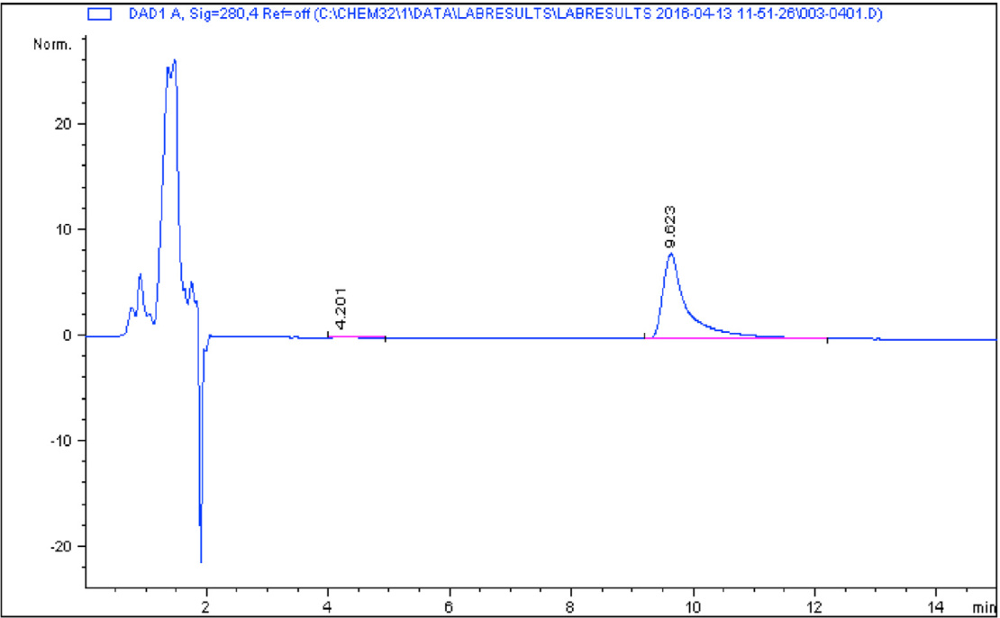
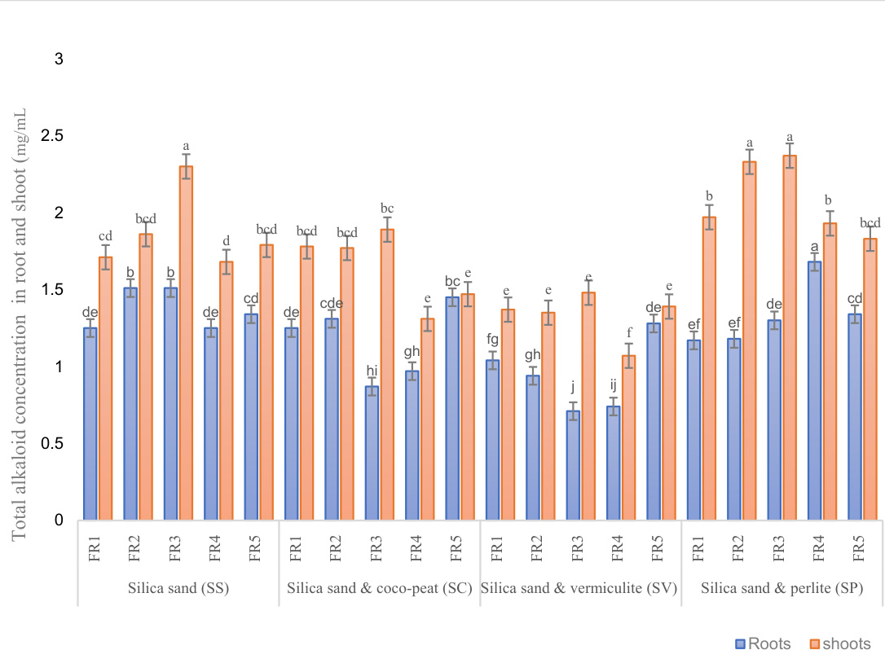
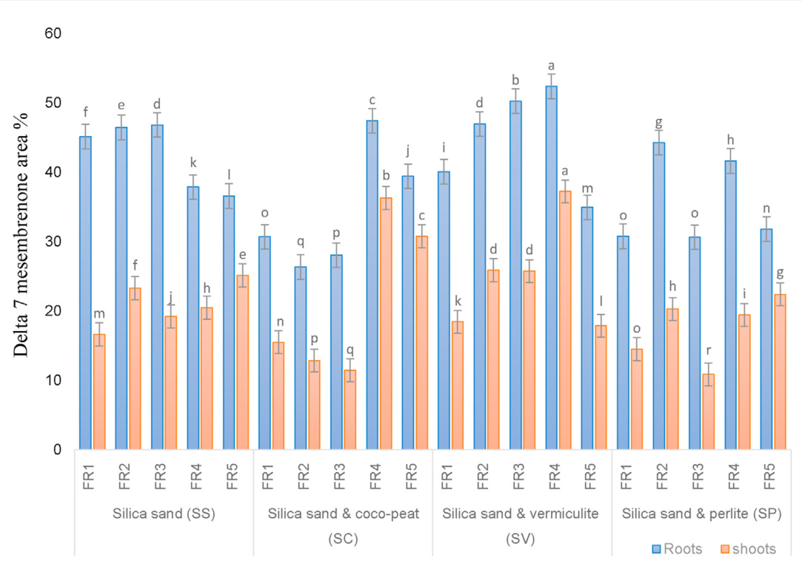
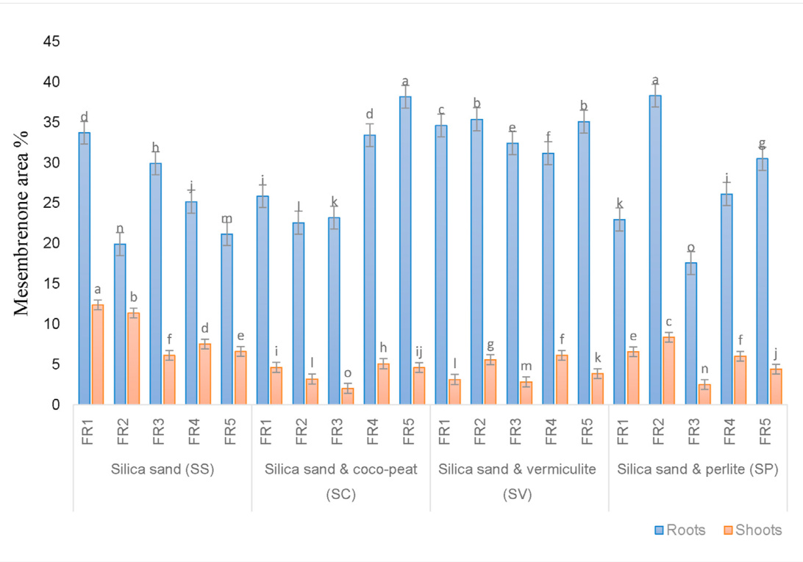
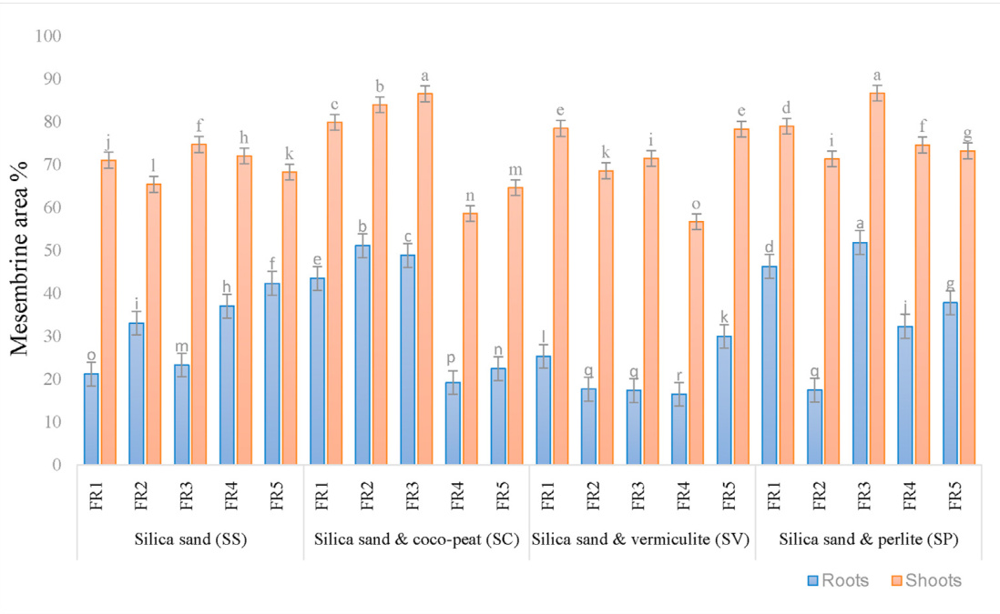
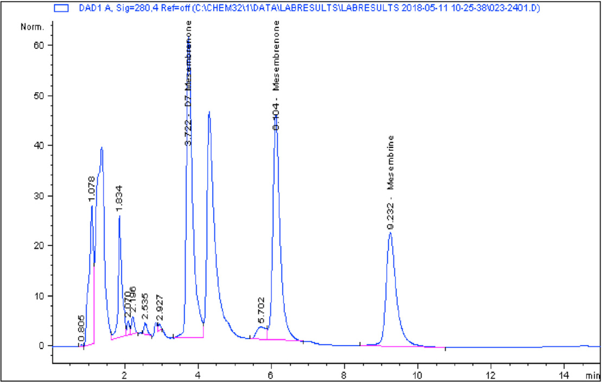
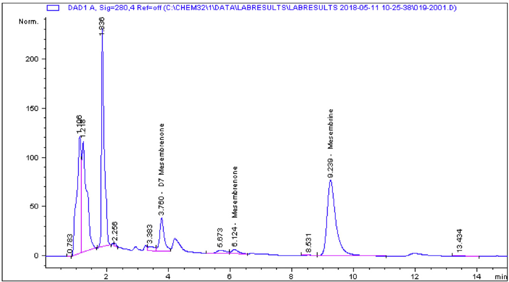
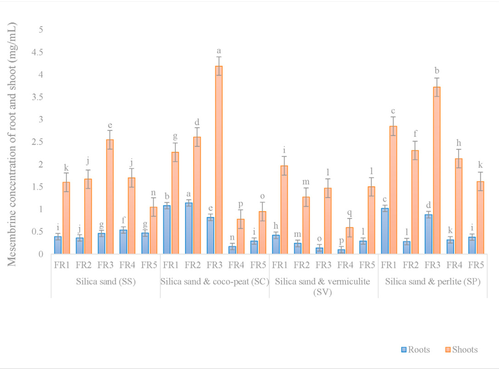

Research article

# Variabilities in alkaloid concentration of Sceletium tortuosum (L.) N.E. Br in response to different soilless growing media and fertigation regimes in hydroponics

Richard James Faber a, Charles Petrus Laubscher a,\*, Fanie Rautenbach b, Muhali Olaide Jimoh a

a Department of Horticultural Sciences, Cape Peninsula University of Technology, Bellville 7537, Cape Town, South Africa b Department of Biomedical Sciences, Cape Peninsula University of Technology, Bellville 7537, Cape Town, South Africa

## A R T I C L E I N F O

Keywords:   
Alkaloids   
Delta 7 mesembrenone   
Fertigation regimes   
Hydroponics   
Mesembrenone   
Mesembrine   
Soilless media   
Food science   
Agricultural science   
Environmental science   
Biological sciences   
Metabolite   
Pharmaceutical science

## A B S T R A C T

This study was designed to investigate the variations in alkaloid concentrations of Sceletium tortuosum when grown in soilless mediums under different fertigation regimes and to examine the suitability of the plant for hydroponic cultivation. A mother plant obtained from Verve Dynamics (Pty) Ltd (a manufacturer and supplier of purified botanical extracts) was cultivated into three hundred plants used for this research study. Twenty treatments were evaluated with 15 sample replicates. Treatments were made up of 4 different soilless growing media, namely: pure silica sand, $5 0 \%$ silica sand with $5 0 \%$ coco-peat, $5 0 \%$ silica sand with $5 0 \%$ vermiculite, and $5 0 \%$ silica sand with $5 0 \%$ perlite. These growing media were tested in conjunction with 5 different fertigation regimes (FR). Plants grown in FR1 received aqueous nutrient solution once every week, FR2 received aqueous nutrient solution once every second week, FR3 received aqueous nutrient solution once every third week, FR4 received aqueous nutrient solution once every fourth week and FR5 received aqueous nutrient solution once every fifth week respectively. Results from this experiment showed that different soilless growing media and fertigation had varying effects on alkaloid concentrations in S. tortuosum. It was also observed that roots contained higher amounts of delta 7 mesembrenone and mesembrenone, while shoots contained higher amounts of the alkaloid mesembrine.

### 1. Introduction

In modern societies, plant-derived medicines are progressively becoming popular and generally embraced in traditional cultures globally as natural drugs and safe alternatives to synthetic chemicals. The biologically active ingredients locked up in plant tissues as secondary metabolites are the major drivers of plant-based treatments and are the target molecules by pharmaceutical, flavour, aroma, and agrochemical industries [1, 2]. Early detection of penicillin from mould, salicylic acid in willow bark, cardiotonic in foxglove and morphine from poppies aided the establishment of pharmaceutical industries [3]. In addition, increased knowledge about bioactive compounds in medicinal plants coupled with sustained efforts on the analysis of micronutrients that are responsible for this bioactivity has led to the development of refined and purified dose-dependent chemical compounds as drugs [3, 4, 5]. The present and future priority thus lie in finding new plant-based chemicals, bearing in mind, sustainable conservation, rational utilization, and biodiversity management [6].

Secondary metabolites have been reported to be responsible for antibacterial, anti-fungal and anti-viral properties exhibited by plants and are thought to play a major role in the adaptation of plants to their environment [7, 8, 9]. Apart from protecting plants from pathogens, they confer allelopathic properties on plants, they possess ultra-violet absorbing structures capable of protecting plants from leaf damage caused by incident light intensity, and also, they have anti-feeding properties, protecting plants from insects and even larger animals [10, 11].

One of the potent compounds being isolated from plants for medicinal purposes is an alkaloid. Examples of alkaloids in isolated forms and their uses are caffeine (a stimulant), ephedrine (a stimulant), scopolamine (travel sickness), capsaicin (rheumatic pains), morphine (pain killer), codeine (antitussive), papaverine (phosphodiesterase inhibitor), quinine (anti-malarial), colchicines (gout), yohimbine (aphrodisiac), pilocarpine (glaucoma), berberine (psoriasis), ajmaline (antiarrhythmic) and various cardiac glycosides [4, 12, 13, 14, 15].

Typically, Sceletium spp. contain four classes of alkaloids; the 3a-arylcis-octahydroindole class, C-secomesembrine alkaloids, alkaloids containing a 2,3-disubstituted pyridine moiety and a ring C-seco Sceletium alkaloid A4 group and in particular, is one of the only plant genera known to carry mesembrine alkaloids [16, 17]). In S. tortuosum, alkaloids responsible for these psychoactive, sedative, euphoric properties and other biological activities are mesembrine and mesembrenone although, the concentration of alkaloids may vary within individual plants depending on their chemotype and degree of exposure to environmental stress [18, 19]. S. tortuosum is a succulent plant that belongs to the family Mesembryanthemaceae. It is indigenous to South Africa, especially in Namaqualand, where the plant is utilized regularly for its medicinal and psychoactive properties [20, 21]. With clear ethno-pharmaceutical value, it is also worthy to mention that the use of S. tortuosum develops no physical or psychological dependency [22].

Mesembrine serves a primary function as a monoamine releasing agent (MRA) and secondly as a selective serotonin reuptake inhibitor (SSRI), drug classes most commonly utilized in the treatment of anxiety and depression [23, 24]. Another alkaloid found in S. tortuosum is delta 7 mesembrenone, it is a potent antioxidant, and a powerful inhibitor of tyrosinase activity, kojic acid at high doses had an almost identical effect on this enzyme [25]. Alkaloid composition in different S. tortuosum plant extracts vary, and higher concentrations of certain alkaloids can have different medical properties. Thus, this study aimed to determine an optimal protocol for cultivating S. tortuosum with an adequate concentration of total alkaloids, as well as the alkaloids delta 7 mesembrenone, mesembrenone, and mesembrine to produce consistent high-quality medicinal plants.

### 2. Materials and methods

#### 2.1. Greenhouse experiment

This investigation was conducted between December 4th, 2017 and January 12 2018 in the research greenhouse facility at the Cape Peninsula University of Technology, Bellville, Cape Town, South Africa; GPS coordinates - $3 3 ^ { \circ } 5 5 ^ { \prime } 4 5 . 5 3 S$ , $1 8 ^ { \circ } 3 8 ^ { \prime }$ 31. 16E. The nature of the structure and the technology installed ensured control of the environment within the greenhouse. Midday ambience of the greenhouse was maintained between temperatures of $2 3 \mathrm { - } 2 7 ^ { \circ } \mathrm { C }$ and relative humidity between $4 0 \text{‰}$ .

#### 2.2. Plant preparation

One Sceletium tortuosum mother plant was obtained from Verve Dynamics, Somerset West. An additional ten mother plants were propagated and cultivated from this plant. Once these ten plants were large enough, $\pm 6 0 0 2 . 5 - 3 \mathrm { c m }$ stem cuttings were propagated from the mother plants to ensure a supply of more than 300 rooted cuttings, which was the number of plant material required for the experiment.

Cuttings were treated with Dynaroot™ No 1 (Active ingredient: $0 . 1 \%$ I.B.A.) as rooting hormone and planted into 200 and 128 cell styrofoam trays containing a 50/50 mixture of silica sand, and coco-peat as rooting medium. The trays were placed in an environmentally controlled propagation greenhouse at the Cape Peninsula University of Technology, Bellville campus. The first sign of roots was observed after 2 weeks, and roots had fully developed after 2 months. After rooting, trays were moved to the research greenhouse for acclimatization and watering was administered by hand. The best quality rooted cuttings in the batch were selected for the experiment.

#### 2.3. Hydroponic experiment

Five identical hydroponic systems were constructed following Teto et al. (2016). Each system consisted of one $7 0 \mathrm { ~ L ~ }$ capacity low-density polyethylene (LDPE) reservoir; four polyvinyl chlorides (PVC) square gutters $( 1 3 0 \mathrm { m m } \times 7 0 \mathrm { m m } \times 2 5 0 0 \mathrm { m m } )$ secured onto wire mesh tables $( 9 0 0 \mathrm { m m } \times 1 2 5 0 \mathrm { m } \times 2 5 0 0 \mathrm { m } )$ ; sixty $1 2 . 5 \times 1 2 . 5 \mathrm { c m }$ plastic pots, a 2 000 $\operatorname { L } / \hbar$ submersible water pump with a $2 . 5 \mathrm { m }$ head capacity, ten-meter $\textbf { x } 2 0$ mm LDPE irrigation piping; four reducers $( 2 0 \mathrm { m m } { - } 1 5 \mathrm { m m } )$ ; four $1 5 \mathrm { m m }$ flow regulators; one air pump, one air stone (15cm) and eight $2 0 ~ \mathrm { m m }$ bulkhead connectors. Reservoirs were kept filled to a level of approximately $5 0 \mathrm { L }$ with aqueous nutrient solution. Each gutter was sealed with PVC adhesive and fitted with an inlet guiding water towards the gutters and an outlet to return excess water to the reservoir. Each inlet consisted of LDPE irrigation piping converted from $2 0 \mathrm { m m }$ to $1 5 \mathrm { m m }$ diameter and each fitted with a $1 5 ~ \mathrm { m m }$ valve allowing maximum control of aqueous nutrient solution flow into gutters. All gutters were filled with silica sand to a depth of $\pm 1 . 5 \mathrm { c m }$ . Fifteen pots $( 1 2 . 5 \mathrm { c m } \times 1 2 . 5 \mathrm { c m } )$ were placed into each gutter on top of the silica sand. As water passes through the gutter the sand becomes fully saturated with an aqueous nutrient solution which is then imbibed by soilless growing media in pots via capillary action. Every gutter for each system represented a different soilless substrate in 15 pots, as follows: $1 0 0 \%$ silica sand (SS); a 50/50 mixture of silica sand and coco-peat (SC); a $5 0 / 5 0$ mixture of silica sand and vermiculite (SV) and a $5 0 / 5 0$ mixture of silica sand and perlite (SP).

Each separate system was manually controlled to fertigate plants with the same amount of aqueous nutrient solution at different time intervals. The five systems were given aqueous nutrient solution amounts as follows: Fertigation regime 1 (FR1) was fertigated once a week at $\pm 3 5 0 \mathrm { m L }$ per minute for $^ \textrm { \scriptsize 1 h }$ . Fertigation regime 2 (FR2) was fertigated every second week at $\pm 3 5 0 \mathrm { m L }$ per minute for $^ { 1 \mathrm { h } }$ . Fertigation regime 3 (FR3) was fertigated once every third week at $\pm ~ 3 5 0 ~ \mathrm { m l }$ per minute for $^ \textrm { \scriptsize 1 h }$ . Fertigation regime 4 (FR4) was fertigated once every fourth week at $\pm$ $3 5 0 ~ \mathrm { m L }$ per minute for $^ \textrm { \scriptsize 1 h }$ Fertigation regime 5 (FR5) was fertigated once every fifth week at $\pm 3 5 0 \mathrm { m L }$ per minute for $^ { \textrm { 1 h } }$ Fifteen plants, one per pot were placed into each soilless substrate of each system, which totals to 60 plants per hydroponic system and 300 plants for the entire experiment. Therefore 15 replicates in a randomized blocked design were tested for each media and fertigation regime combination.

All aqueous nutrient solutions used in the experiment were kept at a pH level of 6.0, and an electrical conductivity (EC) level of 0.5. EC levels of the aqueous nutrient solutions were monitored with a calibrated handheld digital EC meter (Hanna Instruments $\mathbf { \phi } ( \mathbf { \textcircled { R } } \mathbf { T M }$ HI 98312). Water reservoir pH levels were monitored with a calibrated handheld digital pH meter (Eurotech®™ pH 2 pen). For increasing pH, potassium hydroxide was used, while phosphoric acid was used for decreasing pH of aqueous nutrient solutions. For decreasing the EC of aqueous nutrient solutions, reverse osmosis water was added into reservoirs, while adding Hoagland Solution to aqueous nutrient solutions in reservoirs increased the EC. Pots were individually numbered and arranged randomly [26]. All gutters were slightly tilted to allow aqueous nutrient solutions to flow from one end (inlet) to the other (outlet). Each outlet was guided to a separate smaller gutter which then returned the aqueous nutrient solution to the reservoir, creating a circulating system.

#### 2.4. Treatment preparation

Soilless medium treatments were prepared using four different soilless medium combinations, namely: $1 0 0 \%$ silica sand (SS); a $5 0 / 5 0$ mixture of silica sand and coco-peat (SC); a 50/50 mixture of silica sand and vermiculite (SV) and a 50/50 mixture of silica sand and perlite (SP). For treatments SC, SV and SP equal parts of silica sand and coco-peat/ vermiculite/perlite were mixed. All silica sand used was thoroughly rinsed with tap water until water poured through the sand ran clear.

Fertigation regimes were achieved by installing identical pumps to all hydroponic systems. The amount of aqueous nutrient solution delivered to each grow bed was controlled by adjusting all output valves until $\pm 3 5 0$ mL per minute was measured. Measurement was achieved by placing an empty bucket below each output for $1 \ \mathrm { m i n }$ , the liquid captured in the bucket was decanted and measured using a $5 0 0 ~ \mathrm { m L }$ Erlenmeyer flask until the amount of aqueous nutrient solution for each output was measured at $\pm 3 5 0 ~ \mathrm { m L }$ for $1 \mathrm { m i n }$ . Treatment SSFR3 was selected for the control, as it contained $1 0 0 \%$ silica sand, which was the base of all soilless mediums used in this experiment as well as a mid-frequent fertigation regime (see Table 1).

#### 2.5. Data collection

#### 2.5.1. Drying and milling of plant material

Plants were placed in brown paper bags post-harvest and dried at $3 0 { - } 3 1 ~ ^ { \circ } \mathbf { C }$ in a forced convection oven (Daihan Labtech LDO-150F) until the material was crisp dry. Plants were then weighed using an electronic balance (RADWAG $\textsuperscript { \textregistered }$ Model PS 750.R2) with $_ { 0 . 0 0 1 \mathrm { ~ g ~ } }$ readability and recorded. Dried plants of each treatment were combined and milled to powder using a $5 0 ~ \mathrm { g }$ capacity standard coffee grinder (Mellerware - Aromatic Coffee Mill & Grinder), and stored in transparent zip-locked plastic bags. The coffee grinder was cleaned thoroughly between the milling of each treatment.

#### 2.5.2. Measuring total alkaloids

The total alkaloid content for roots and shoots were measured using the Bromo cresol green method based on an atropine standard [27]. For every treatment, 5 extractions were made. Extraction was done by placing $1 0 0 ~ \mathrm { { m g } }$ of plant material in $1 0 ~ \mathrm { m L }$ of methanol within a $1 5 ~ \mathrm { m L }$ lab-grade plastic tube for $2 4 \mathrm { h }$ after which tubes were centrifuged at 4000 rpm for $2 \mathrm { m i n }$ . One mL of methanol extract was transferred to a $5 0 ~ \mathrm { m L }$ lab-grade plastic tube with $5 \mathrm { m l }$ of buffered solution $\mathrm { ( p H 4 . 7 ) }$ , $1 2 ~ \mathrm { m L }$ of Bromo cresol green and $1 2 ~ \mathrm { m L }$ of chloroform. The chloroform separates from the Bromo cresol green and buffering solution and if a yellow colour is observed it means alkaloids are present in the extract. The yellow chloroform liquid was then placed in a 96 cell well plate using a pipette, 3 cells per extraction at $3 0 0 \mu \mathrm { L }$ and placed in a multi-scan spectrum reader. Extractions were observed at $4 1 7 ~ \mathrm { { n m } }$ , the wavelength for the colour yellow, and analysed with the software program SkanIt™ which measured the number of yellow pigments in a sample, that is, the total amount of alkaloids [28]. This analysis did not specify which individual alkaloids are present in extract samples, but rather just the total amount of alkaloids present in a sample.

#### 2.5.3. Measuring delta 7 mesembrenone, mesembrenone and mesembrine area $\%$

The most commonly used technique for analysing natural products is high-performance liquid chromatography (HPLC) with ultraviolet light detection. Due to the commercial unavailability of S. tortuosum alkaloid standards the HPLC tests for the area $\%$ of delta 7 mesembrenone, mesembrenone and mesembrine were based on standard references for mesembrine-type alkaloids as reported by [29]. The liquid or mobile phase used for S. tortuosum is water plus acetonitrile at a ratio of 72:28 plus $0 . 0 1 \%$ ammonia hydroxide. $2 0 ~ \mu \mathrm { L }$ of extractions were filtered into HPLC vials, the vials were then numerically placed in the sample collector according to treatment. From here the mobile phase and extract samples individually got injected into a column (C18-kromasil 100-5-C18) at a flow rate of $1 \ \mu \mathrm { L / m i n }$ , which separated the molecules and passed them through a UV detector and UV signatures at $2 8 0 ~ \mathrm { { n m } }$ were recorded and in turn, determined the area $\%$ of the different alkaloids. Procedures were done at room temperature and repeated 5 times for each treatment extraction sample.

#### 2.5.4. Measuring mesembrine

The pure mesembrine compound was injected into the HPLC system by itself, the peak observed as a result on the chromatograph represents mesembrine, which then draws a standard reference for other molecules to compare to, therefore if another molecule is injected and analysed in the same way and results are in the same peak on the chromatograph, they are the same molecule as the standard [21]. The HPLC method with UV detection was again used for this analysis. About $2 0 ~ \mu \mathrm { L }$ of extractions were filtered into HPLC vials, the vials were then numerically placed in the sample collector according to treatment. From here the mobile phase and extract samples individually got injected into a column (C18-kromasil 100-5-C18) at a flow rate of $1 ~ { \mu \mathrm { L / m i n } }$ , which separated the molecules and passed them through a UV detector and UV signatures at 280 nm, molecules that were identical to the mesembrine standard were recorded. Procedures were done at room temperature and repeated 5 times for each treatment extraction sample [29]. The standard for mesembrine (Verve Dynamics (Pty) Ltd) was used as a reference (Figure 1).

#### 2.6. Statistical analysis

All data collected were statistically analysed using two-way analysis of variance (ANOVA). Treatment means were compared and separated with Fischer's Least Significant Difference (L.S.D) at values of $\mathtt { p } \le 0 . 0 5$ , p $\leq 0 . 0 1$ and $\mathbf { p } \leq 0 . 0 0 1$ . The software program STATISTICA version 13 was used to perform all calculations on Windows 10 [30].

### 3. Results

#### 3.1. Total alkaloid concentrations in roots

The effect of soilless media and fertigation regime on total alkaloid concentrations in the root of S. tortuosum was statistically significant at the value of $\begin{array} { r } { \mathbf { p } \le 0 . 0 0 1 } \end{array}$ . The highest concentration of alkaloid $\left( 1 . 6 8 ~ \mathrm { m g / } \right.$ mL) was recorded in the SP medium under fertigation regime 4 (FR4) while the least value $\mathrm { 0 . 7 1 ~ m g / m L }$ was observed in SV medium under fertigation regime 3 (FR3).

#### 3.2. Total alkaloid concentrations in shoots

The effect of soilless media and fertigation regime on total alkaloid concentrations in the shoot of S. tortuosum was statistically significant at the value of $\mathtt { p } \le 0 . 0 0 1$ . At $\begin{array} { r } { \mathbf { p } \le 0 . 0 0 1 } \end{array}$ , soilless media SP and SS yielded the highest concentrations of alkaloid respectively under fertigation regime 3 (FR3) while the least value $\left( 1 . 0 7 ~ \mathrm { m g / m L } \right)$ was recorded in SV medium under fertigation regime 4 (FR4). Generally, roots were found to have an overall lowest concentration of total alkaloids than shoots whereas an overall highest concentration of total alkaloids was recorded in the shoots (Figure 2). Both soilless media SS and SP had equivalent and the highest influence on the total alkaloid concentration in the shoot under fertigation regime 3(FR3). This was followed by the soilless media SC while the least influence on the shoot was observed in SV media. Similarly, the root had the lowest alkaloid concentration in SV media under fertigation regime 4, followed by SC media under FR2; SS media under

<html><body><table><tr><td colspan="6">ablee system.</td></tr><tr><td></td><td>(FR1)</td><td>(FR2)</td><td>(FR3)</td><td>(FR4)</td><td>(FR5)</td></tr><tr><td>100% Silica sand (Ss)</td><td> SSFR1</td><td> SSFR2</td><td>SSFR3</td><td> SSFR4</td><td> SSFR5</td></tr><tr><td> 50% Silica sand & 50% coco-peat (SC)</td><td> SCFR1</td><td>SCFR2</td><td> SCFR3</td><td> SCFR4</td><td>SCFR5</td></tr><tr><td>50% Silica sand & 50% vermiculite (SV)</td><td>SVFR1</td><td>SVFR2</td><td>SVFR3</td><td>SVFR4</td><td> SVFR5</td></tr><tr><td>50% Silica sand & 50% perlite (SP)</td><td> SPFR1</td><td> SPFR2</td><td>SPFR3</td><td> SPFR4</td><td>SPFR5</td></tr><tr><td colspan="6">Note: FR1 = fertigation regime of±35O mL aqueous nutrient solution per minute for 1 h once a week. FRfertigatitr5 solution per minute for1h once every third week. FR4=frtig5srtg5 solution per minute for 1 h once every fourth week.</td></tr></table></body></html>

  
Figure 1. A chromatograph displaying mesembrine standard obtained from Verve Dynamics (Pty) Lt

FR2 and FR3; then SP media under FR4 which recorded the highest alkaloid concentration in the root.

#### 3.3. Delta 7 mesembrenone area $\%$ in roots

The effect of soilless media and fertigation regime on total alkaloid concentrations in the root of S. tortuosum was statistically significant at the value of $\mathtt { p } \le 0 . 0 0 1$ . The highest concentration of delta 7 mesembrenone in terms of area $( 5 2 . 3 7 \% )$ was recorded in the SV medium under fertigation regime 4 (FR4) while the least value $( 2 6 . 3 5 \% )$ was observed in SC medium under fertigation regime 2 (FR2).

  
Figure 2. Comparing the results of S. tortuosum root vs shoot total alkaloid concentration in response to 4 different soilless media and five fertigation regimes in hydroponics. Treatment SSFR3 was selected for the control. Mean values $\pm \ S \mathrm { E }$ are shown in columns. The mean values with different letters are significantly different at $\mathrm { { P } \leq 0 . 0 0 1 }$ $( ^ { * * * } )$ as calculated by Fisher's Least Significant Difference. FR1 $\ l =$ fertigation regime 1; $\mathrm { F R 2 } =$ fertigation regime 2; $\mathrm { F R } 3 =$ fertigation regime 3; $\mathrm { F R } 4 =$ fertigation regime 4; FR5 $\ l =$ fertigation regime 5.

  
Figure 3. Comparing the results of S. tortuosum root vs shoot delta 7 mesembrenone concentration in terms of area $\%$ in response to 4 different soilless media and five fertigation regimes in hydroponics. Treatment SSFR3 was selected for the control.

#### 3.4. Delta 7 mesembrenone area $\%$ in shoots

The effect of soilless media and fertigation regime on total alkaloid concentrations in the shoot of S. tortuosum was statistically significant at the value of $\begin{array} { r } { \mathbf { p } \le 0 . 0 0 1 } \end{array}$ . At $\mathtt { p } \le 0 . 0 0 1$ , soilless media SV yielded the highest concentration of delta 7 mesembrenone area $( 3 7 . 2 3 \% )$ under fertigation regime 4 (FR4) while the least value $( 1 0 . 8 5 \% )$ was recorded in SP medium under fertigation regime 3 (FR3). In general, roots had an overall higher concentration of delta 7 mesembrenone in terms of area $\%$ than shoots while shoots had an overall lower concentration of delta 7 mesembrenone in terms of area $\%$ than roots (Figures 3, 6, and 7).

  
Figure 4. Comparing the results of S. tortuosum root vs shoot mesembrenone concentration in terms of area $\%$ in response to 4 different soilless media and five fertigation regimes in hydroponics. Treatment SSFR3 was selected for the control.

  
Figure 5. Comparing the results of S. tortuosum root vs shoot mesembrenone concentration in terms of area $\%$ in response to 4 different soilless media and five fertigation regimes in hydroponics. Treatment SSFR3 was selected for the control.

#### 3.5. Mesembrenone area % in root

The effect of soilless media and fertigation regime on mesembrenone area $\%$ in the root of S. tortuosum was statistically significant at the value of $\mathrm { ~ p ~ } \leq \ 0 . 0 0 1$ . At $\mathrm { ~ p ~ } \leq \ 0 . 0 0 1$ , the highest concentrations of mesembrenone area $\%$ were recorded in the SC medium under fertigation regime 5 (FR5) and SP medium under fertigation regime 2 (FR2) while the least value $( 1 7 . 5 6 \%$ ) was observed in SP medium under fertigation regime 2 (FR2).

#### 3.6. Mesembrenone area $\%$ in shoot

The effect of soilless media and fertigation regime on mesembrenone area $\%$ in the shoot of S. tortuosum was statistically significant at the value of $\begin{array} { r } { \mathbf { p } \le 0 . 0 0 1 } \end{array}$ . At $\begin{array} { r } { \mathbf { p } \le 0 . 0 0 1 } \end{array}$ , soilless medium SS yielded the highest mesembrenone area $\%$ under fertigation regime 1 (FR1) while the least value (2.02) was recorded in SC medium under fertigation regime 3 (FR3). In general, roots had an overall higher concentration of mesembrenone in terms of area $\%$ than shoots while shoots had an overall lower concentration of mesembrenone in terms of area $\%$ than roots (Figures 4, 6, and 7).

  
Figure 6. HPLC chromatograph results for treatment SSFR3 root extract displaying delta 7 mesembrenone, mesembrenone and mesembrine area $\%$

  
Figure 7. HPLC chromatograph results for treatment SPFR4 shoot extract displaying delta 7 mesembrenone, mesembrenone and mesembrine area $\%$

#### 3.7. Mesembrine area $\%$ of root

The effect of soilless media and fertigation regime on mesembrine area $\%$ in the root of S. tortuosum was statistically significant at the value of $\begin{array} { r } { \mathbf { p } \le \mathbf { 0 } . 0 0 1 } \end{array}$ . At $\begin{array} { r } { \mathbf { p } \le \mathbf { 0 } . 0 0 1 } \end{array}$ , the highest mesembrine area of $5 1 . 8 3 \%$ was recorded in the SP medium under fertigation regime 3 (FR3) while the least value $( 1 6 . 4 5 ~ \% )$ was observed in SV medium under fertigation regime 4 (FR4).

#### 3.8. Mesembrine area $\%$ of the shoot

The effect of soilless media and fertigation regime on mesembrine area $\%$ in the shoot of S. tortuosum was statistically significant at the value of $\mathbb { P } \le 0 . 0 0 1$ . At $\mathrm { ~ p ~ } \leq 0 . 0 0 1$ , soilless medium SS yielded the highest mesembrine area $\%$ $8 6 . 5 2 \%$ and $8 6 . 6 5 \%$ ) respectively under fertigation regime 3 (FR3) while the least value $( 5 6 . 6 5 \% )$ was recorded in SV medium under fertigation regime 4 (FR4). In general, shoots had an overall higher concentration of mesembrine area $\%$ than roots while roots had an overall lower mesembrine area in terms of area $\%$ than roots (Figures 5, 6, and 7).

  
Figure 8. Comparing total mesembrine concentration in the root and shoot extracts of S. tortuosum in response to four different soilless media and five fertigation regimes in hydroponics.

#### 3.9. Mesembrine concentrations in root

The effect of soilless media and fertigation regime on mesembrine concentrations in the root of S. tortuosum was statistically significant at the value of $\begin{array} { r } { \mathbf { p } \le 0 . 0 0 1 } \end{array}$ . At $\begin{array} { r } { \mathbf { p } \le 0 . 0 0 1 } \end{array}$ , the highest mesembrine concentration of (1.14) was recorded in the SC medium under fertigation regime 2 (FR2) while the least value (0.10) was observed in SV medium under fertigation regime 4 (FR4).

#### 3.10. Mesembrine concentrations in shoot

The effect of soilless media and fertigation regime on mesembrine concentration in the shoot of S. tortuosum was statistically significant at the value of $\begin{array} { r } { \mathbf { p } \le 0 . 0 0 1 } \end{array}$ . At $\mathtt { p } \le 0 . 0 0 1$ , soilless medium SC yielded the highest concentration of mesembrine (4.19) respectively under fertigation regime 3 (FR3) while the least value (0.59) was recorded in SV medium under fertigation regime 4 (FR4). In general, shoots had an overall higher concentration of mesembrine concentration than roots while roots had an overall lower mesembrine concentration than shoots. All 20 treatments significantly differed from one another (Figure 8).

### 4. Discussion & conclusion

Treatments applied in this investigation had a significant effect on the alkaloid concentrations of S. tortuosum. The results obtained in this research agree with [10] and [8] which state that S. tortuosum responds to biotic and abiotic stresses by controlling their influx of secondary metabolite concentrations. It was further noticed that root extracts of plants samples had more delta 7 mesembrenone and mesembrenone concentrations than shoots, while shoots had more mesembrine. Shoots had a higher content of total alkaloids than the roots.

S. tortuosum is a one of a kind medicinal crop plant, containing various alkaloids for application in the pharmacological industry [16, 19, 20]. This study has shown there is a clear effect on alkaloid concentration in S. tortuosum root and shoots extracts in response to different soilless media, fertigation regimes as well as soilless media in conjunction with fertigation regimes [31, 32]. Shoot extracts contained a higher concentration of total alkaloids than root extracts, however, root extracts had an overall higher amount of delta 7 mesembrenone, and mesembrenone in terms of area $\%$ , while shoots had higher amounts of mesembrine.

Compared with the mesembrine standard, shoots had an overall higher concentration of mesembrine than the roots. These results suggest that roots of S. tortuosum should be harvested to extract delta 7 mesembrenone and mesembrenone molecules, while the shoots should be harvested for extracting mesembrine. These findings agree with [21], which states that mesembrine is the major alkaloid in S. tortuosum along with minor alkaloids delta 7 mesembrenone and mesembrenone. Further studies would be needed to test how other methods of fertigation, various organic/soilless media and a combination of both would affect the concentration yields of mesembrine-type alkaloids when cultivating S. tortuosum in soil or hydroponics. More research is also required on how the fermentation of S. tortuosum plant material affects alkaloid concentrations.

Declarations

Author contribution statement

Richard James Faber: Performed the experiments; Analyzed and interpreted the data; Wrote the paper.

Charles Petrus Laubscher: Conceived and designed the experiments; Contributed reagents, materials, analysis tools or data.

Fanie Rautenbach: Contributed reagents, materials, analysis tools or data.

Muhali Olaide Jimoh: Analyzed and interpreted the data; Wrote the paper.

Funding statement

This work was supported by Cape Peninsula University of Technology (CPUT), through the National Research Foundation and University Research Fund.

Data availability statement

Data included in article.

Declaration of interests statement

The authors declare no conflict of interest.

Additional information

No additional information is available for this paper.

Acknowledgements

Authors appreciate Richard Davies, Managing Director of Verve Dynamics (Pty) Ltd who supplied the initial Sceletium tortuosum mother plant for this study and gave special permission for the use of their mesembrine standard.

References

[1] B.-E. van Wyk, M. Wink, Medicinal Plants of the World, second ed., Briza Publications, Pretoria, South Africa & CAB International, Nosworthy Way, Wallingford, 2018. https://books.google.co.za/books?. (Accessed 22 July 2020).   
[2] M.O. Jimoh, A.J. Afolayan, F.B. Lewu, Antioxidant and phytochemical activities of Amaranthus caudatus L . harvested from different soils at various growth stages, Sci. Rep. 9 (2019) 12965.   
[3] G.M. Rishton, Natural products as a robust source of new drugs and drug leads: past successes and present day issues, Am. J. Cardiol. 101 (2008) S43 S49.   
[4] S. Karuppusamy, A review on trends in production of secondary metabolites from higher plants by in vitro tissue, organ and cell cultures, J. Med. Plants Res. 3 (2009) 1222 1239.   
[5] M.O. Jimoh, A.J. Afolayan, F.B. Lewu, Nutrients and antinutrient constituents of Amaranthus caudatus L. Cultivated on different soils, Saudi J. Biol. Sci. (2020). In press.   
[6] J.D. Philipson, Plants as source of valuable products, in: Secondary Products from Plant Tissue Culture, Clarendon Press, Oxford, 1990.   
[7] O.D. Adegbaju, G.A. Otunola, A.J. Afolayan, Effects of growth stage and seasons on the phytochemical content and antioxidant activities of crude extracts of Celosia argentea L. Heliyon 6 (6) (2020), e04086, 1 11.   
[8] M.A. Ashraf, M. Iqbal, R. Rasheed, I. Hussain, M. Riaz, M.S. Arif, Environmental Stress and Secondary Metabolites in Plants: an Overview, 2018.   
[9] O.A. Idris, O.A. Wintola, A.J. Afolayan, Evaluation of the bioactivities of Rumex crispus L. leaves and root extracts using toxicity, antimicrobial, and antiparasitic assays, Evidence-Based Compl Alter . Med. (2019) 1 13.   
[10] F. Bourgaud, A. Gravot, S. Milesi E. Gontier, Producti–on of plant secondary metabolites: a historical perspective, Plant Sci. 161 (2001) 839 851.   
[11] M.A. Jimoh, O.A. Idris, M.O. Jimoh, Cytotoxicity, phytochemical, antiparasitic screening, and antioxidant activities of Mucuna pruriens (Fabaceae), Plants 9 (2020) 1 13.   
[12] M. Wink, A.W. Alfermann, R. Franke, B. Wetterauer, M. Distl, J. Windho€vel, O. Krohn, E. Fuss, H. Garden, A. Mohagheghzaden, E. Wildi, P. Ripplinger, Sustainable bioproduction of phytochemicals by plant in vitro cultures: anticancer agents, Plant Genet. Resour. 3 (2) (2005) 90 100.   
[13] T.L. Olatunji, A.J. Afolayan, Comparison of nutritional, antioxidant vitamins and capsaicin contents in Capsicum annuum and C. frutescens, Int. J. Veg. Sci. 18 (2019) 1 18.   
[14] М.R. Hamidi, B. Jovanova, Т.K. Panovska, Toxicоlogical evaluation of the plant products using Brine Shrimp (Artemia salina L.) model, Maced. Pharm. Bull. 60 (2014) 9 18.   
[15] S.O. Salami, A.J. Afolayan, Suitability of Roselle- Hibiscus sabdariffa L. as raw material for soft drink production, J. Food Qual. (2020) 1 9.   
[16] O. Gericke, N. Gericke, D.J. Stein, Sceletium tortuosum, in–: Complement. Integr. Treat., 2017, pp. 195 199.

R.J. Faber et al.

[17] J.L. Krstenansky, Mesembrine alkaloids: review of their occurrence, chemistry, and pharmacology, J. Ethnopharmacol. 195 (2017).   
[18] B. Muszynska, M. Łojewski, J. Rojowski, W. Opoka, K. Sułkowska-Ziaja, Natural products of relevance in the prevention and supportive treatment of depression, Psychiatr. Pol. 49 (2015) 435 453.   
[19] A.L. Harvey, L.C. Young, A.M. Viljoen, N.P. Gericke, Pharmacological actions of the South African medicinal and functional food plant Sceletium tortuosum and its principal alkaloids, J. Ethnopharmacol. (2011).   
[20] W. Dimpfel, L. Schombert, N. Gericke, Electropharmacogram of Sceletium tortuosum extract based on spectral local field power in conscious freely moving rats, J. Ethnopharmacol. 177 (2016) 140 147.   
[21] S. Patnala, I. Kanfer, Chemotaxonomic studies of mesembrine-type alkaloids in Sceletium plant species, S. Afr. J. Sci. 109 (2013) 1 5.   
[22] B.-E. van Wyk, M. Wink, Phytomedicines, Herbal Drugs, and Plant Poisons, first ed., Briza Publications, Pretoria, 2015.   
[23] D.D. Coetzee, V. Lopez, C. Smith, High-mesembrine Sceletium extract (TrimesemineTM ) is a monoamine releasing agent, rather than only a selective serotonin reuptake inhibitor, J. Ethnopharmacol. 177 (2016) 111 116.   
[24] G.I. Stafford, M.E. Pedersen, J. van Staden, A.K. J€ager, Review on –plants with CNSeffects used in traditional South African medicine against mental diseases, J. Ethnopharmacol. 119 (2008) 513 537.   
[25] A.C. Bennett, A. Van-Camp, V. Lopez, C. Smith, Sceletium tortuosum may delay chronic disease progression via alkaloid-dependent antioxidant or antiinflammatory action, J. Physiol. Biochem. 74 (2018) 539 547.   
[26] A.A. Teto, C.P. Laubscher, P.A. Ndakidemi, I. Matimati, Paclobutrazol retards vegetative growth in hydroponically-cultured Leonotis leonurus (L.) R.Br. Lamiaceae for a multipurpose flowering potted plant, South Afr. J. Bot. 106 (2016) 67 70.   
[27] M. Hadizadeh, H. Ofoghi, M. Kianirad, Z. Amidi, Elicitation of pharmaceutical alkaloids biosynthesis by salicylic acid in marine microalgae Arthrospira platensis, Algal Res. 42 (2019) 101597.   
[28] S. Fadhil, M.H. Reza, G. Rouhollah, V.R.M. Reza, Spectrophotometric determination of total alkaloids in peganum harmala L. Using Bromocresol green, Res. J. Phytochem. 1 (2007) 79 82.   
[29] S. Patnala, I. Kanfer, HPLC analysis of mesembrine-type alkaloids in Sceletium plant material used as an african traditional medicine, J. Pharm. Pharmaceut. Sci. 13 (2010) 558 570.   
[30] I. TIBCO So–ftware, Statistica (data analysis software system), version 13, 2017.   
[31] A.K. Shukla, M. Mall, S.K. Rai, S. Singh, P. Nair, G. Parashar, A.K. Shasany, S.C. Singh, V.K. Joshi, S.P.S. Khanuja, A transcriptomic approach for exploring the molecular basis for dosha-balancing property-based classification of plants in Ayurveda, Mol. Biol. Rep. 40 (2013) 3255 3262.   
[32] A. Silber, A. Bar-Tal, Nutrition of Substrate-Grown Plants, 2008.