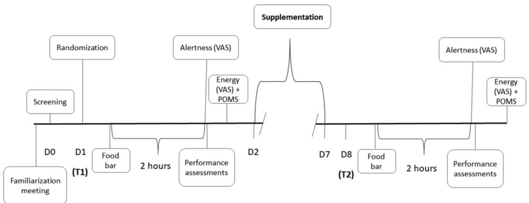

#### Ergogenic Effects of 8 Days of Sceletium Tortuosum Supplementation on Mood, Visual Tracking, and Reaction in Recreationally Trained Men and Women

Jay R. Hoffman,1 Irit Markus,2 Gal Dubnov-Raz,3 and Yftach Gepner2

1Department of Molecular Biology, Ariel University, Ariel, Israel; 2Department of Epidemiology and Preventive Medicine, School of Public Health, Sackler Faculty of Medicine and Sylvan Adams Sports Institute, Tel Aviv University, Tel Aviv, Israel; and 3The Edmond and Lily Safra Children’s Hospital, Sheba Medical Center, and Sackler Faculty of Medicine, Tel Aviv University, Tel Aviv, Israel

# Abstract

Hoffman, JR, Marcus, I, Dubnov-Raz, G, and Gepner, Y. Ergogenic effects of 8 days of Sceletium tortuosum supplementation on mood, visual tracking, and reaction in recreationally trained men and women. J Strength Cond Res 34(9): 2476–2481, 2020— Sceletium tortuosum (ST) is a South African plant that has been reported to promote a sense of well-being in healthy individuals and used in treating people with anxiety, stress, or depression. These studies have been conducted in middle-aged and older adults, but no investigations have been performed in a healthy, young adult population. Thus, the purpose of this study was to examine the effect of 8 days of ST extract (25-mg) supplementation on changes in reactive agility, visual tracking, and mood. Sixty recreationally trained men $( n = 4 8 )$ and women $( n = 1 2 )$ , between 20 and 35 years, were randomly assigned to 1 of 2 groups: ST or placebo (PL). Subjects were tested on 2 occasions: before supplementation and 2-hours after supplementation on day 8. Subjects completed a subjective questionnaire to assess alertness and energy using a visual analog scale (VAS). In addition, subjects completed the Profile of Mood States questionnaire and performed reactive agility and visual tracking assessments. Significant improvements were noted for ST in complex reactive performance that required subjects to respond to repeated visual stimuli with a cognitive load compared with PL. However, no significant changes were noted between the groups in either VAS or total mood score. In addition, no differences were observed in simple reaction assessments. The results of this study demonstrate an ergogenic benefit in complex reactive tasks that include a cognitive load. However, in this subject population studied, no benefits in mood were observed.

Key Words: dietary intervention, cognitive enhancer, reactive agility, performance, nutrition

## Introduction

Sceletium tortuosum (ST) is a South African plant that has been reported to promote a sense of well-being in healthy individuals and used in treating people with anxiety, stress, or depression (7). The physiological mechanism linked to its potential benefits seems to be related to its role as a potent blocker of the serotonin (5-HT) transporter and specifically act as an inhibitor of phosphodiesterase-4 (PDE4) (10). Serotonin reuptake inhibitors are generally used to treat depression, and recent evidence suggests that PDE4 inhibitors can also be used as a potential treatment option for depression (8). PDE4 inhibitors have also been reported to attenuate proinflammatory cytokines (8). The potential therapeutic benefit in the use of ST is that it may inhibit both 5-HT and PDE4, potentially requiring a lower dose to achieve desired efficacy, reducing the incidents of adverse events.

Serotonin is a neurotransmitter found in the brain that has an important role in neuroplasticity (13). Dysfunction in neuroplasticity can result in learning and memory deficits, and it can contribute to the pathophysiology of depression (13). Decreases in serotonin as a result of an attenuated synthesis is thought to be a cause of depression (16). Blocking the reuptake of 5-HT, thus maintaining 5-HT concentrations, has been used as therapeutic treatment for depression (17).

Phosphodiesterases (PDE) are a group of enzymes that catalyze the hydrolysis of cyclic adenosine monophosphate (cAMP) (15). Of the 11 PDEs, PDE4 has received much focus in neurodysfunction because of its strong expression in the brain (9). The immediate downstream effector of cAMP is protein kinase A (PKA), which is activated upon cAMP binding and translocates to the nucleus where it phosphorylates cAMP response element binding protein (CREB). cAMP response element binding protein is a transcription factor that binds to cAMP response element promoter sites (2) located on specific CREB-mediated genes such as brain-derived neurotrophic factor (BDNF), which can alter synaptic function (6). Altered PDE4 signaling directly results in cAMP alterations (9). The use of PDE4 inhibition as a therapeutic option is to maintain the cAMP intracellular cascade. Others have reported that PDE4 inhibition can also attenuate inflammatory cytokines (12).

Terburg et al. (21) reported that a single administration of ST extract $( 2 5 ~ \mathrm { m g } )$ can reduce anxiety-related amygdala reactivity and attenuate amygdala-hypothalamus coupling, providing the initial evidence that this plant is a dual PDE4 and 5-HT reuptake inhibitor for the treatment of anxiety disorders and depression. A subsequent investigation examined a $2 5 \mathrm { - m g }$ dose consumed for 3 weeks in middle-aged healthy men and women (4). Results from this investigation demonstrated improvements in mood and in cognitive function, including improvements in composite, verbal, and visual memory, reaction time, processing speed, executive function, and complex attention. A recent study reported that a single $( 2 5 \mathrm { - m g } )$ dose of ST extract was capable of improving cognition and mood, as determined by eye tracking ability in middle-aged (40–75 years) adults (5). Whether ingestion of this supplement can enhance athletic performance in a young, active population is not known. Thus, the purpose of this study was to examine the effect of 8 days of ST ingestion on changes in reactive agility, visual tracking, and mood.

### Methods

### Experimental Approach to the Problem

The effect of 8 days of ST extract $\cdot 2 5 \mathrm { - m g } )$ supplementation on reactive agility, visual tracking, and mood was examined in healthy, college-aged men and women. All subjects were garrisoned active but were not competitive athletes. Subjects were randomized into either a placebo or active ingredient group. Physical performance assessments included multiple object tracking, visual tracking speed, and reactive performance measures. Resting mood states and visual analog scales (VASs) to assess fatigue and focus were also employed. All assessments were conducted in a single day before and after the supplementation period.

### Subjects

Sixty recreationally trained men $( n = 4 8$ ) and women $( n = 1 2$ ), between 20 and 35 years, volunteered to participate in this study. After an explanation of all procedures, risks, and benefits, each subject provided his or her written informed consent to participate in the study. The Institutional Review Board of Tel Aviv University approved this research study. Subjects were randomized into either the active ingredient ST (mean $\pm \ : S D$ : 26 men and 4 women, $2 7 . 7 \pm 4 . 2$ years, $1 7 5 . 2 \pm 5 . 5 \mathrm { c m }$ , $7 8 . 1 \pm 1 0 . 9 \mathrm { k g } )$ or the PL (22 men and 8 women, $2 7 . 6 \pm 3 . 8$ years, $1 7 3 . 0 \pm 1 0 . 2 \mathrm { c m }$ , $8 1 . 1 \pm 1 8 . 5 \mathrm { ~ k g } )$ group. The randomization procedure was performed with an allocation ratio of 1:1 between the two study groups. Subjects were randomized without strata after all had been recruited, in one phase, after baseline measurements were assessed. Prior to data collection, all subjects performed a familiarization session in which they performed 3 trials in all reactive performance measures. Following the familiarization session, subjects were tested on two occasions; before supplementation (T1) and 2-hours following supplementation on day 8 (T2). Figure 1 details the groups and the experimental conditions. Subjects were healthy (as determined by a medical history questionnaire) and active (exercising at least 2 days per week for the past 6-weeks). Subjects were not consuming any performance enhancing drugs or cognitive enhancing supplements at the time of recruitment.

### Procedures

During each testing session subjects reported to the laboratory following a 3-hour fast and without having consumed caffeine for 18 hours. Upon arrival to the laboratory subjects were provided with a protein bar. Two hours after consuming the protein bar (All-in protein bar, Hadera, Israel, $3 6 . 5 \mathrm { ~ g ~ }$ protein, $2 9 . 9 \ \mathrm { g }$ carbohydrate, $1 0 . 1 \ \mathrm { g }$ fat), they were asked to complete a subjective questionnaire to assess alertness using a VAS.

Following the VAS questionnaire, subjects then performed the visual tracking and reactive agility assessments. Immediately after testing, subjects were required to complete 2 additional questionnaires that required them to focus on their mood (Profile of Mood States [POMS]) and energy level (see below). During the testing session at T2, subjects followed the assessment protocol as on T1, with the exception of consuming their final (D8) supplement before eating the protein bar.

Mood Questionnaire and VAS for Alertness and Energy. Subjects were asked to quantify their degree of alertness and energy using a $1 0 \mathrm { - c m }$ VAS. Subjects provided their levels of alertness and energy by making a mark on a horizontal line with words anchored at each end of the VAS. Questions were structured as “My level of alertness is:” and “My level of energy is:” with low and high serving as the verbal anchor representing the extreme ratings. Therefore, the greater the measured value, the greater the feeling. The validity and reliability of VAS in assessing alertness and energy has been previously established (14).

Profile of Mood States. Analysis of mood was performed through the administration of the POMS Questionnaire. This questionnaire consists of 58 words or phrases in a Likert format that provides measures of specific mood states (19). It provides measures of tension, depression, anger, vigor, fatigue, and confusion. Total mood disturbance (TMD) was calculated by subtracting vigor from the sum of the 5 other negative measures and adding 100 to avoid a negative result.

Reactive Performance Assessments: Multiple Object Tracking and Visual Tracking Speed. Visual tracking speed was evaluated via completion of 1 core session on the Neurotracker 3D multiple object tracking device (CogniSens Athletic, Inc., Montreal, QC, Canada) as previously described (18). A single core session is composed of 20 individual trials calculating spatial awareness by determining a threshold speed for the effective perception and processing of visual information of the individual being tested. Each trial was performed in an isolated room, free of distractions. During each assessment, a 3-dimensional transparent cube containing 8 identical yellow balls, measuring $1 4 \mathrm { c m }$ in diameter, was presented on a screen. Four of these balls were randomly illuminated for 2 seconds before returning to the baseline yellow color. Each subject was instructed to track these 4 balls for the duration of each of the 20 trials. During each trial, all 8 yellow balls moved simultaneously and individually throughout all regions of the cube for 8 seconds. The random, continuous, movement patterns of each ball were only affected by collisions (impact and bounce) with the wall of the cube and the other balls. At the conclusion of 8 seconds, the balls were frozen in place and assigned a value (1–8). The subject was instructed to identify, by number, the 4 balls that were originally illuminated at the start of the trial. The speed at which the balls moved on the next trial was dependent on the correct identification of the illuminated balls and was adjusted between trials in a staircase (1 up 1 down) fashion. At the end of the 20 trials, visual tracking speed was determined to be the fastest speed (in centimeters per second) at which the subject could correctly identify all balls with $1 0 0 \%$ accuracy. Subjects completed 1 trial on the Neurotracker during both T1 and T2 testing.

Reaction Time and Reactive Agility. Reaction time was measured for the upper body on the Dynavision D2 Visuomotor Training Device (D2; Dynavision International LLC, West Chester, OH) as previously described (23). Briefly, the D2 is a light-training reaction device, developed to train sensory motor integration through the visual system. It consists of a board $( 4 \times 4$ ft) that can be raised or lowered relative to the height of the subject. The board contains 64 target buttons arranged into 5 concentric circles that can be illuminated to serve as a stimulus for the subject. For each task, subjects were instructed to take an athletic stance, consisting of flexed knees, low center of gravity, and upright posture. The D2 board was then raised or lowered to the height of the subject, such that the liquid crystal display (LCD) screen was approximately at eye level, and the outermost target buttons were within hands reach.

  
Figure 1. Study design.

Three separate tests were performed with the D2 device: The first assessment measured visual, motor, and physical reaction time with the dominant hand. The test was initiated when the subject placed their hand on the illuminated “home” button. At this point, a stimulus was presented in 1 of the 5 locations, parallel to the home button. Visual reaction time was determined as the amount of time it took to identify the stimulus and initiate a reaction by leaving the home button. Motor response time was measured as the amount of time it took to physically strike the stimulus following the initial visual reaction, and physical reaction time was determined by the total elapsed time from the introduction of the target stimulus to the physical completion of the task (returning to the home button after striking the stimulus). This was repeated 10 times. The average time for all 10 attempts was recorded. The second assessment (mode A) performed on the D2 device measured the subject’s ability to react to a stimulus as it changed positions on the board. An initial stimulus was presented on the D2 in a random location. The stimulus remained lit until the subjects struck it. The stimulus then appeared at another random location. The subjects was instructed to identify and strike as many stimuli as possible within 60 seconds. The total number of hits was recorded. The next assessment (mode B) on the D2 was similar to the second assessment, and subjects were required to react to a visual stimulus as it changed positions on the board. However, the stimulus remained illuminated for 1 second before changing to another random location on the board. However, during the assessment, the subject was required to verbally recite a 5-digit number that presented on the center screen of the D2 during each assessment. Each subject was required to correctly identify the 5-digit number and strike as many stimuli as possible within 60 seconds. The number of hits, average time per hit, and the number of missed stimuli were recorded (e.g., 5-digit numbers that were not correctly identified).

Reactive agility was measured using the FITLIGHT Trainer (FITLIGHT Corp, Aurora, ON, Canada) as previously described (20). The FITLIGHT is a wireless reaction system composed of 4 light emitting diodes (LED) lights controlled by a computer tablet. Subjects were required to stand $3 \mathrm { - m }$ perpendicular to a series of 4 lights aligned in a semicircle $1 \mathrm { ~ m ~ }$ apart such that the distance between the starting position and each light was equal. At the onset of the protocol, the subject stood in the middle of the 4 lights. In random fashion, one of the lights was illuminated, and the subject was required to sprint and react to the light by waving his or her hand $1 0 \ \mathrm { c m }$ above the light and then return to the starting position backpedaling. In total, 5 lights were illuminated. The subject had 2 seconds to recognize and reach each light. A 1- second pause was provided between the dimming of one light and the illumination of the next light. The total time and the average reaction time per light was recorded. A second assessment with FITLIGHT was completed to assess reactive agility with decision making. During this test, the lights were placed in a Y-shaped format. Subjects stood $2 \mathrm { m }$ in front of the first light. Upon a visual stimulus (first light was illuminated), the subject sprinted in a straight line to the second light ( $3 \mathrm { m }$ from the starting position). The third and fourth lights were placed $4 5 ^ { \circ }$ to the right and left of the second light $1 . 5 \mathrm { ~ m ~ }$ away). As the subject sprinted to the second light, one of the lights was illuminated, and the subject was required to reach that light. A total of 10 attempts was performed. The sum of all 10 sprints was recorded.

Supplementation Protocol. The ST supplement (Zembrin) was obtained from PLT Health Solutions (Morristown, NJ). Both the supplement and placebo were in capsule form and were similar in appearance and taste. Subjects in the supplement group were provided with 1 capsule of ST at a dose of $2 5 ~ \mathrm { m g }$ per serving consumed once per day, whereas subjects in the placebo group were provided with an equivalent amount of corn maltodextrin and rice protein. Subjects were requested to consume the supplement in the morning during breakfast. Each subject was provided with a bottle containing a week’s supply of capsule. All bottles were returned at the end of the week. In addition, subjects were requested to list any side effects or changes they experienced during the supplementation period. All capsules left in the bottle were counted and recorded.

#### Statistical Analyses

Analyses of covariance (ANCOVA) were used to analyze all and subjective measures of energy, alertness, and mood (11). Pre and post values were used as the covariate and dependent variable, respectively, following verification of the homogeneity of regression (22). In the event of a significant $f$ ratio, least significant difference post hoc pairwise comparisons were used to examine the differences among the groups. In accordance with Vickers

pyright $\copyright$ 2020 National Strength and Conditioning Association. Unauthorized reproduction of this article is prohibited.

(22), results of the ANCOVA were also converted to change from pre. An alpha level of $p \leq 0 . 0 5$ was considered statistically significant for all comparisons. All data are reported as mean $\pm \ : S D$ . Statistical analysis was performed with SPSS (IBM Statistics for Windows, Version 23.0; IBM Corp, Armonk, NY). Considering that no previous data have been published with this specific dietary supplement and reactive performance, we performed a statistical power calculation using WinPepi statistical analyses software (PEPI- for-Windows, version 9.5) based on changes in reaction performance with cognitive load (FITLIGHT—Y test) from T1 to T2 from this present study. A 3.2-second difference between groups and 3.2 and $3 . 8 \ S D '$ s for each group yielded a statistical power of $9 2 . 8 \%$ for the study.

a significant difference $( p < 0 . 0 0 1 )$ was observed between ST and PL in reactive agility that required decision making (e.g., direction of movement).

The effect of the supplement on mood and subjective changes in alertness and energy can be observed in Table 2. No significant differences in tension or anxiety $( p ~ = ~ 0 . 4 0 )$ , depression $( p \ =$ 0.46), anger or hostility $( \boldsymbol { p } = 0 . 4 3 )$ , vigor $( p = 0 . 1 5 )$ , or confusion $( p = 0 . 4 9 )$ were noted between ST and PL. Although subjective feelings of fatigue was significantly lower $( p ~ = ~ 0 . 0 2 3 )$ in PL compared with ST, no difference $( p = 0 . 1 9 )$ was noted in TMD between the groups. Furthermore, no differences were observed in subjective feelings of alertness $( p = 0 . 3 7 )$ or energy $( p = 0 . 5 7 )$ ： from the VAS scores between ST and PL.

#### Results

Of the 60 subjects who were enrolled in the study, 59 of the subjects completed data collection. One subject from ST was unable to return for posttesting because of a scheduling conflict. No side effects associated with supplementation were reported during the study. Based on ST and PL consumption (determined by the number of capsules returned), compliance for supplementation was $1 0 0 \%$ among all subjects.

Results for all reactive performance and visual tracking data are presented in Table 1. Visual tracking performance was similar $( p =$ 0.72) between ST and PL during the 8-day supplementation period. In addition, no differences (all $p$ values ${ > } 0 . 0 5$ ) were observed between ST and PL in motor, visual, and physical reaction time in the Dynavision assessment. In addition, no differences $( p > 0 . 0 5 )$ between ST and PL were observed in mode A performance in the Dynavision assessment. However, a significantly greater performance $( p = 0 . 0 5 )$ was noted in the number of successful hits in mode B performance between ST and PL. The change in performance of ST (react to a visual performance while announcing a $5$ -digit number) $\langle 3 . 6 3 \pm 7 . 1 8$ hits) was significantly greater than PL $\left( 0 . 2 3 \pm 1 2 . 4 2 \right.$ hits). However, no differences were seen between ST and PL in missed stimuli $( p = 0 . 4 9 )$ or average time per hit $( p = 0 . 4 2 )$ .

No significant differences were noted in the change in performance in the FITLIGHT assessments between $\mathrm { \Omega } \mathrm { S T }$ and PL. No differences were observed in total time $( p = 0 . 4 1 )$ and average reaction time per light $( p = 0 . 4 2 )$ ) between ST and PL. However,

#### Discussion

The results of this study revealed that ingestion of $2 5 ~ \mathrm { m g }$ of ST extract per day for 8 days significantly improved reactive performance to a visual stimulus when a cognitive stress was added to the task. However, when subjects were not tasked with any cognitive load, improvements to a single to multiple visual stimuli were not seen. In addition, the supplement protocol used in this study did not result in any changes in subjective feelings of mood, alertness, or energy in the study population.

Previous investigations using the same dose, but in a different study population, have reported significant improvements in mood and cognitive function in middle-aged and older adult men and women (4,5). The Chiu et al. investigation (4) used a 3-week supplementation protocol, whereas Dimpfel et al. (5) examined a single acute dose. Based upon those studies, we chose an 8-day supplement protocol. However, one of the differences between our study and the others was the age of the subjects. Previous studies demonstrating the efficacy of ST extract recruited subjects. Who were between 40 and 65 years. The subjects in the present study ranged in age from 20 to 35 years. It is likely that improvements previously demonstrated in older adults were related to a greater potential for a response in older adults. As the adult brain ages, it becomes more vulnerable to neurodysfunction and inflammation, increasing the risk for a variety of cognitive disorders (1,3). The younger adults that volunteered for the present study were free from any psychological or neurological dysfunction and were all healthy and physically active. Thus, a supplement that has been shown to inhibit serotonin uptake and PDE4 (21) may not be efficacious if brain serotonin levels or cAMP levels are within normal ranges.

Table 1 Unadjusted reactive performance and visual tracking data.\*†   

<html><body><table><tr><td rowspan="2"></td><td colspan="2">T1</td><td colspan="2">T2</td></tr><tr><td>ST</td><td>PL</td><td>ST</td><td>PL</td></tr><tr><td>Neurotracker</td><td>1.2 ± 0.5</td><td>1.1 ± 0.5</td><td>1.2 ± 0.4</td><td>1.1 ± 0.4</td></tr><tr><td>Dynavision assessments</td><td></td><td></td><td></td><td></td></tr><tr><td>Visual reaction time (s)</td><td>0.36 ± 0.05</td><td>0.33 ± 0.09</td><td>0.36 ± 0.05</td><td>0.29 ± 0.13</td></tr><tr><td>Motor reaction time (s)</td><td>0.25 ± 0.09</td><td>0.28 ± 0.10</td><td>0.27 ± 0.07</td><td>0.22 ± 0.12</td></tr><tr><td>Physical reaction time (s)</td><td>0.60 ± 0.11</td><td>0.67 ± 0.12</td><td>0.61 ± 0.17</td><td>0.67 ± 0.16</td></tr><tr><td>Mode a hits</td><td>87.6 ± 10.5</td><td>79.6 ± 12.3</td><td>90.4 ± 9.4</td><td>81.0 ± 13.4</td></tr><tr><td>Mode B hits</td><td>71.5 ± 12.0</td><td>57.3 ± 20.3</td><td>76.0 ± 11.5‡</td><td>56.7 ± 20.1</td></tr><tr><td>Mode B time per hit</td><td>0.67 ± 0.04</td><td>0.74 ± 0.10</td><td>0.65 ± 0.05</td><td>0.74 ± 0.10</td></tr><tr><td>Mode B missed stimuli</td><td>1.3 ± 1.7</td><td>1.9 ± 1.6</td><td>1.8 ± 1.6</td><td>1.4 ± 1.0</td></tr><tr><td>FITLIGHT assessments</td><td></td><td></td><td></td><td></td></tr><tr><td>Total lights hits</td><td>12.2 ± 1.3</td><td>12.5 ± 0.9</td><td>12.2 ± 1.3</td><td>12.6 ± 1.1</td></tr><tr><td>Average time per light (s)</td><td>1.53 ± 0.20</td><td>1.60 ± 0.17</td><td>1.87 ± 1.86</td><td>1.60 ± 0.21</td></tr><tr><td>Y reaction test (s)</td><td>19.7 ± 3.7</td><td>19.8 ± 8.5</td><td>18.9 ± 3.4‡</td><td>22.2 ± 3.9</td></tr></table></body></html>

\*ST $\ l =$ sceletium tortuosum extract; PL $\ c =$ placebo; ${ \mathsf { V A S } } =$ visual analog scale; POMS $\mathbf { \Sigma } = \mathbf { \Sigma }$ profile of mood states. †All data are reported as mean $\pm \ S D$ . ‡Significant difference between the groups.

Table 2 Unadjusted mood and subjective changes in alertness and energy.\*†   

<html><body><table><tr><td rowspan="2"></td><td colspan="2">T1</td><td colspan="2">T2</td></tr><tr><td>ST</td><td>PL</td><td>ST</td><td>PL</td></tr><tr><td>VAS</td><td></td><td></td><td></td><td></td></tr><tr><td>Alertness (cm)</td><td>9.5 ± 2.6</td><td>9.0 ± 3.1</td><td>9.2 ± 3.0</td><td>9.6 ± 2.8</td></tr><tr><td>Energy (cm)</td><td>10.8 ± 2.3</td><td>10.2 ± 2.6</td><td>9.9 ± 3.1</td><td>10.4 ± 2.7</td></tr><tr><td>POMS</td><td></td><td></td><td></td><td></td></tr><tr><td>Tension/anxiety</td><td>6.6 ± 3.7</td><td>7.1 ± 4.1</td><td>6.8 ± 4.0</td><td>6.0 ± 3.7</td></tr><tr><td>Depression</td><td>1.9 ± 3.2</td><td>3.4 ± 5.9</td><td>1.6 ± 3.0</td><td>2.7 ± 4.2</td></tr><tr><td>Anger/hostility</td><td>4.5 ± 2.3</td><td>5.7 ± 5.9</td><td>4.7 ± 3.0</td><td>4.3 ± 3.5</td></tr><tr><td>Vigor</td><td>20.9 ± 5.9</td><td>20.0 ± 6.5</td><td>18.5 ± 7.3</td><td>20.5 ± 6.3</td></tr><tr><td>Fatigue</td><td>5.2 ± 4.7</td><td>5.7 ± 4.0</td><td>5.0 ± 4.2‡</td><td>3.1 ± 3.0</td></tr><tr><td>Confusion</td><td>5.6 ± 3.6</td><td>6.7± 4.5</td><td>4.9 ± 2.6</td><td>4.7 ± 3.0</td></tr><tr><td>Total mood score</td><td>102.8 ± 16.3</td><td>108.6 ± 22.9</td><td>104.4 ± 17.6</td><td>100.2 ± 15.3</td></tr></table></body></html>

${ } ^ { \star } \mathrm { S } \mathsf { T } =$ sceletium tortuosum extract; PL $\mathbf { \Sigma } =$ placebo; ${ \mathsf { V A S } } =$ visual analog scale; POMS $\mathbf { \Sigma } = \mathbf { \Sigma }$ profile of mood states. †All data are reported as mean $\pm \ : S D$ . ‡Significant difference between the groups.

Interestingly, in the reactive assessments that required a cognitive load (i.e., mode B total hits and the time to complete the 10 attempts in the Y reaction test), significant improvements were noted in the performance response by ST. It is possible that when subjects were forced to multitask (e.g., respond to a moving visual stimulus and respond verbally to a 5-digit number), the benefits of ST extract appear to provide an ergogenic effect in these young adults. This was consistent with the improvement in complex attention reported by Chiu et al. (4). Although speculative, inhibiting PDE4 action through ST extract ingestion may have enhanced BDNF expression altering neuronal function in the brain, enhancing the ability to respond to multiple stimuli. Further research will need to address this hypothesis in detail and examine if ST is mainly beneficial in more complex cognitive tasks.

Previous research has reported improved mood following an acute ingestion of ST extract (5). However, not only did we not see any changes in mood but also the mood score for fatigue was significantly reduced for PL compared with ST. These results seem to be spurious in nature because there is no physiological explanation for how subjects consuming a placebo would reduce subjective feelings of fatigue, whereas no change was noted in subjects consuming the active ingredient supplement. Nevertheless, no differences were noted between the groups in TMD, clearly indicating supplementation with ST extract in young adults provides no benefits in mood. However, these results should be interpreted in the appropriate context. Subjects were young, healthy, and active with no cognitive or environmental stress. Under these conditions, a supplement that is considered to be a cognitive and mood enhancer may not be beneficial. However, when the task becomes complicated the benefits of this supplement may be realized.

We acknowledge that our study has several limitations. Our supplement protocol was based on limited number of previous studies in an older population group. In addition, we have no absorption or pharmacokinetic information. Furthermore, we chose a limited set of cognitive and mood tests (although all established and validated), based on previously described effects of ST in a different subject population. It is possible that other tools may have yielded different results and that other areas of brain function that were not tested may be affected by this supplement.

In summary, the results of this study demonstrate an ergogenic benefit in complex reactive tasks that include a cognitive load. However, results do not support the data from previous investigations regarding improved mood. However, those studies were conducted with older adults who may be more sensitive for cognitive enhancement from inhibition of serotonin reuptake and PDE4. Additional research examining ST extract ingestion in young adults should be examined during fatigue or stressful conditions and possibly with additional cognitive tasks or emotional areas.

Practical Applications

The results of this study suggest that this new dietary ingredient, ST extract, may provide an ergogenic benefit in young adults who are performing a reactive agility task with a cognitive load. The data presented fuels further study into the benefits that this novel ingredient may have.

Acknowledgments

The authors thank PLT Health Solutions (Morristown, NJ) for providing support for this study.

References

1. Bartsch T, Wulff P. The hippocampus in aging and disease: From plasticity to vulnerability. Neuroscience 309: 1–16, 2015.   
2. Carlezon WA, Duman RS, Nestler EJ. The many faces of CREB. Trends Neurosci 28: 436–445, 2005.   
3. Chesnokova V, Pechnick RN, Wawrowsky K. Chronic peripheral inflammation, hippocampal neurogenesis, and behavior. Brain Behav Immun 58: 1–8, 2016.   
4. Chiu S, Gericke N, Farina-Woodbury M, et al. Proof-of-Concept randomized controlled study of cognition effects of the proprietary extract Sceletium tortuosum (Zembrin) targeting phosphodiesterase-4 in cognitively healthy subjects: Implications for Alzheimer’s Dementia. Evid Based Complement Alternat Med 2014: 682014, 2014.   
5. Dimpfel W, Gericke N, Suliman S, Dipah GNC. Psychophysiological effects of Zembrin® using quantitative EEG source Density in combination with eye-tracking in 60 healthy subjects. A Double-blind, randomized, placebo-controlled, 3-Armed study with parallel design. Neurosci Med 7: 114–132, 2016.   
6. Finkbeiner S, Tavazoie SF, Maloratsky A, et al. CREB: A major mediator of neuronal neurotrophin responses. Neuron 19: 1031–1047, 1997.   
7. Gericke N, Viljoen AM. Sceletium—a review update. J Ethnopharmacol 119: 653–663, 2008.   
8. Gooderham M, Papp K. Selective phosphodiesterase inhibitors for psoriasis: Focus on Apremilast. BioDrugs 29: 327–339, 2015.   
9. Hansen RT, Zhang HT. The past, present, and future of phosphodiesterase-4 modulation for age-induced memory loss. Adv Neurobiol 17: 169–199, 2017.   
10. Harvey AL, Young LC, Viljoenb AM, Gericke NP. Pharmacological actions of the South African medicinal and functional food plant Sceletium tortuosum and its principal alkaloids. J Ethnopharmacol 137: 1124–1129, 2011.   
11. Huck SW, McLean RA. Using a repeated measures ANOVA to analyze the data from a pretest-posttest design: A potentially confusing task. Psychol Bull 82: 511, 1975.   
12. Korhonen R, Ho¨ mm¨o T, Ker¨anen T, et al. Attenuation of TNF production and experimentally induced inflammation by PDE4 inhibitor rolipram is mediated by MAPK phosphatase-1. Br J Pharmacol 169: 1525–1536, 2013.   
13. Kraus C, Castren S, Kasper S, Lanzenberger R. Serotonin and neuroplasticity—links between molecular, functional and structural pathophysiology in depression. Neurosci Biobehav Rev 77: 317–326, 2017.   
14. Lee KA, Hicks G, Nino-Murcia G. Validity and reliability of a scale to assess fatigue. Psychiatry Research 36: 291–298, 1991.   
15. Li YF, Huang Y, Amsdell SL, et al. Antidepressant- and anxiolytic-like effects of the phosphodiesterase-4 inhibitor rolipram on behavior depend on cyclic AMP response element binding protein-mediated neurogenesis in the hippocampus. Neuropsychopharmacology 34: 2404–2419, 2009.   
16. Maes M. Evidence for an immune response in major depression: A review and hypothesis. Prog Neuro Psychopharmacol Biol Psychiatr 19: 11–38, 1995.   
17. Maes M, Leonard BE, Myint AM, Kubera M, Verkerk R. The new ’5-HT’ hypothesis of depression: Cell-mediated immune activation induces indoleamine 2,3-dioxygenase, which leads to lower plasma tryptophan and an increased synthesis of detrimental tryptophan catabolites (TRYCATs), both of which contribute to the onset of depression. Prog Neuropsychopharmacol Biol Psychiatry 35: 702–721, 2011.   
18. Mangine GT, Hoffman JR, Wells AJ, et al. Visual tracking speed is related to basketball-specific measures of performance in NBA players. J Strength Cond Res 28: 2406–2414, 2014.   
19. McNair DM, Lorr M, Droppleman LF. Profile of Mood States Manual. San Diego, CA: Educational and Industrial Testing Services, 1971.   
20. Ostfeld I, Ben-Moshe Y, Hoffman MW, Shalev H, Hoffman JR. Effect of spearmint extract containing rosmarinic Acid on physical and executive functioning after a tactical operation. J Spec Oper Med Winter 18: 92–96, 2018.   
21. Terburg D, Syal S, Rosenberger LA, et al. Acute effects of Sceletium tortuosum (Zembrin), a dual 5-HT reuptake and PDE4 inhibitor, in the human amygdala and its connection to the hypothalamus. Neuropsychopharmacology 38: 2708–2716, 2013.   
22. Vickers AJ. The use of percentage change from baseline as an outcome in a controlled trial is statistically inefficient: A simulation study. BMC Med Res Methodol 1: 6, 2001.   
23. Wells AJ, Hoffman JR, Beyer KS, et al. Reliability of the dynavision (TM) D2 for assessing reaction time performance. J Sports Sci Med 13: 145–150, 2014.

opyright $\copyright$ 2020 National Strength and Conditioning Association. Unauthorized reproduction of this article is prohibited.