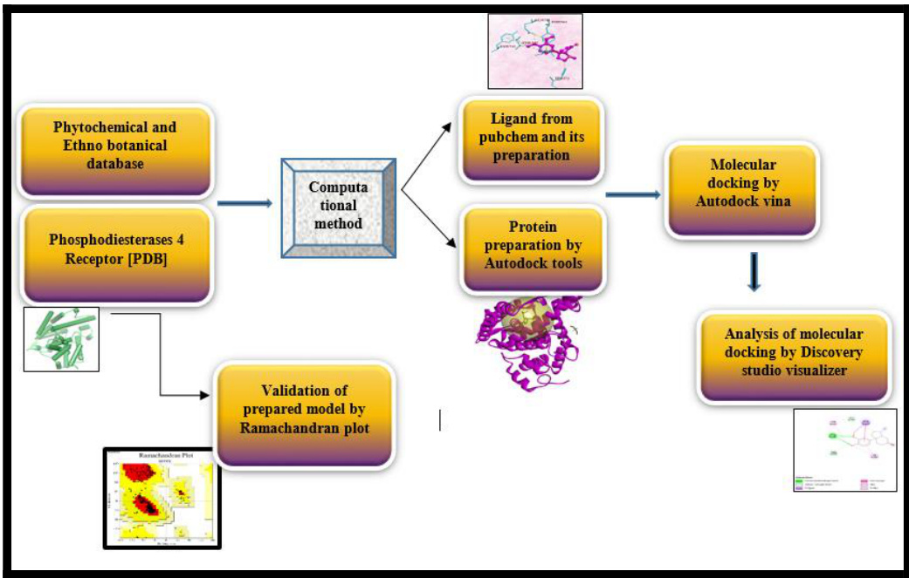
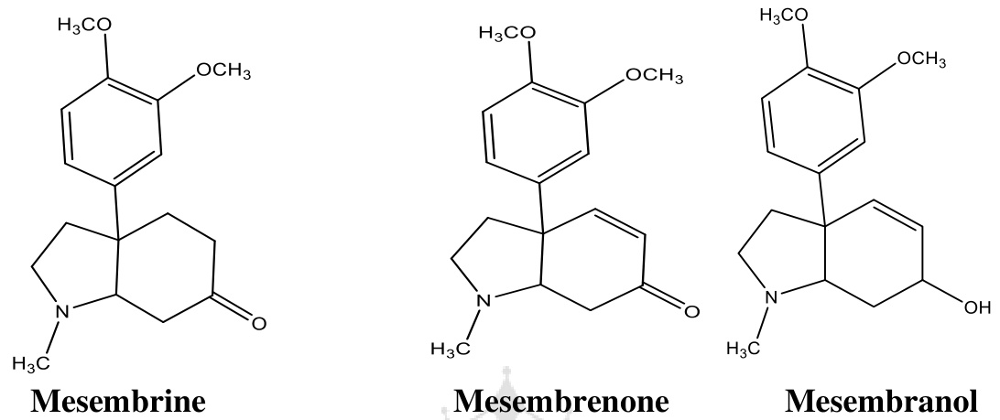
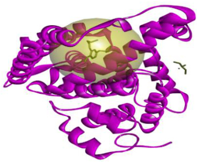
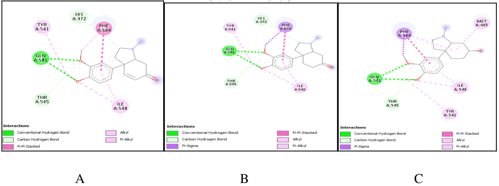
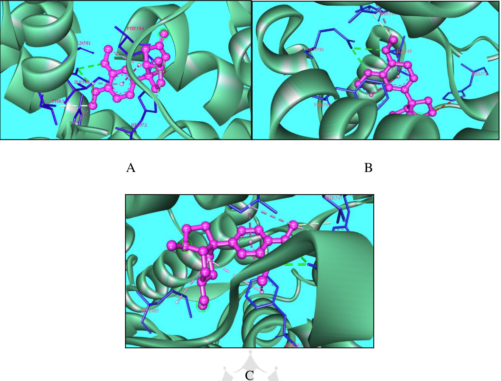
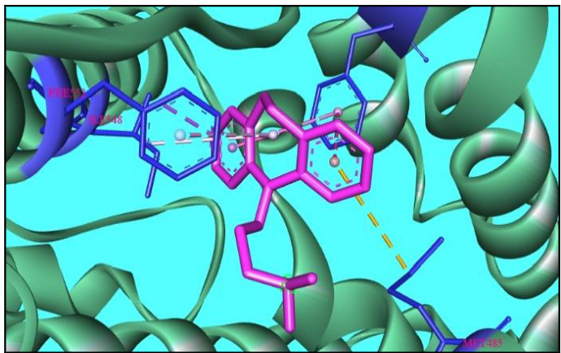
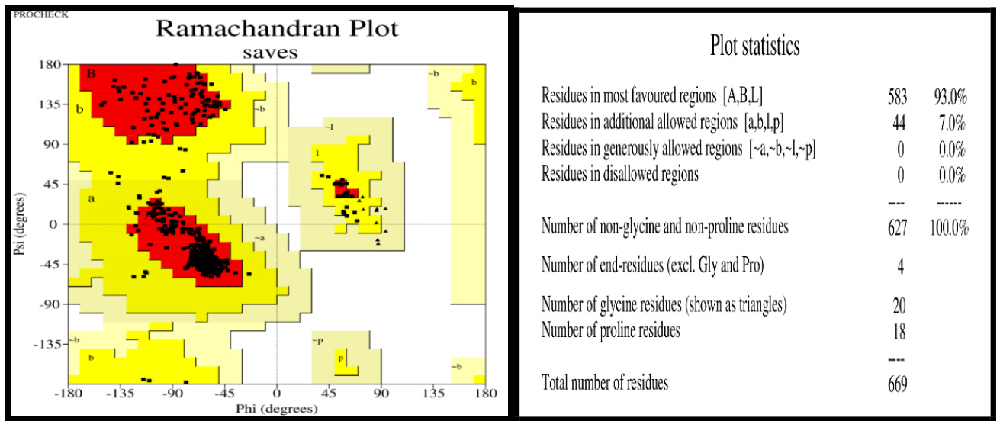

# In Silico Docking Analysis of Few Antidepressant Phytoconstituents of South African Endemic Plant Sceletium tortuosum

Article $\mathbf { \nabla } \cdot \mathbf { \varepsilon }$ September 2021

0

3 authors:

Human Journals   
Research Article   
September 2021 Vol.:22, Issue:2   
$\circledcirc$ All rights are reserved by Manisha Kotadiya et al.

## InSilicoDocking Analysis of Few Antidepressant Phytoconstituents of South African Endemic Plant Sceletiumtortuosum

Manisha Kotadiya\*1, Mina Sinhar2, Reena Korat3

1Department of Pharmaceutical chemistry, Shree Swaminarayan Sanskar College of pharmacy, Zundal, Gandhinagar, Gujarat, India\*

2Department of Pharmaceutics, H.N. Shukla College of pharmacy, Rajkot, Gujarat, India2

3Department of Pharmaceutics, H.N. Shukla College of pharmacy, Rajkot, Gujarat, India3

Submitted: 25 August 2021   
Accepted: 31 August 2021   
Published: 30 September 2021

Keywords: In Silico, Mesembrine, Docking approach, Phosphodiesterase 4, Depression, Ramachandran plot

ABSTRACT

Background: Depression is a disorder that leads to disability worldwide and its liability seems to increase in the future. The Phytoconstituents as medicinal drugs obtained from various plants have remarkable attention towards drug discovery for various disease treatments using different techniques. Mesembrine, Mesembrenone, and Mesembranol obtained from a plant extract of Sceletium tortuosum were reported as potent Antidepressants. Objective: The current effort deals with computational study of a few Phytoconstituents obtained from plant extract as potent Phosphodiesterase 4 inhibitors in the treatment of depression and their comparison with standard drug Imipramine. Methods: In silico methods were adopted to study the interactions between Phosphodiesterase 4 as receptor and mesembrine, mesembrenone, and mesembranolas ligands. Docking studies of selected Phytoconstituentswere carried using autodock 4.2 and autodock vina (PyRxtool) to assess and compare the binding energies of these Phytoconstituents with receptor to the binding energy of Imipramine. Analysis of docking results was done using a discovery studio visualizer. The validation of the receptor was carried out by a pro-check validation tool. For the drug likeliness, the drulito tool was used.  Results: Analysis of docking result showed that all Phytoconstituents found to have better binding energy with Phosphodiesterase 4 receptor and can act as potent antidepressant agents. Mesembrenone, Mesembrine, and Mesembranol showed the estimated free binding energy of-8.2 kcal/mol, -8.1kcal/mol, and $8 . 0 \mathrm { k c a l / m o l }$ respectively with Phosphodiesterase 4. All selected Phytoconstituents showed better binding energy than imipramine $\left( - 7 . 9 \mathrm { { k c a l / m o l } } \right)$ with Phosphodiesterase 4. Conclusion: Based on the computational study, it was concluded that compounds from a medicinal plant with promising biological activity can recognize as a valuable and alternative drug lead for depression treatment.

www.ijppr.humanjournals.com

Graphical Abstract:

# 1. INTRODUCTION:

Among all, Depression is a diminishing mental disorder and possibly it has become a major cause of ill health and death worldwide. It undesirably affects the span and quality of life, decreases mobility, and also compiled with anxiety. It is a motor disorder that leads to loss of interest in life and leads to lethargy.

Depression is characterized anatomically by neuronal atrophy and troubles in composite neuroplastic circuits in the brain. The medicinal drugs which are available in the market, they are fused with lots of adverse effects and side effects besides their biological effect. In today’s scenario, medicinal drugs of plant origin are a safe and alternative way to treat depression [1].

The endemic plant of South Africa Scelentium tortuosum of the succulent family Mesembryathemaceae has a long history of medicinal and traditional use by San and Khoikhoi people as a masticatory and medicine [2-3] and after by colonial farmers as a psychotropic in nature in tincture form [4]. From the last 15 years, the plant has attracted attention for its theorised applications in endorsing a sense of wellbeing and relieving stress in human beings and for the treatment of anxiety and depression in clinically anxious and depressed patients [5-6]. Cyclic nucleotide Phosphodiesterases comprise a diverse group of enzymes that are important regulators of signal transduction. Phosphodiesterases are classified into 11 families based on sequence homology, substrates, and regulation by

www.ijppr.humanjournals.com

modulators. Enzymes found in the PDE4 family catalyze the hydrolysis of cyclic Adenosine monophosphate (cAMP) and have a critical role in controlling the intracellular concentration of cAMP and increasing phosphorylation of cAMP-response element-binding protein [7]. This shows a downregulation of the cAMP cascade that can be restored using Phosphodiesterase 4 inhibitors [8], which gives an idea that is reinforced by an increasing number of in vivo studies and [9]. The biological actions of a standardized extract of the plant (mesembrine) have been reported to be dual Phosphodiesterase 4 inhibitor and 5-HT reuptake inhibitor [10-11]. The chemical structure of Phytoconstituents is given below in figure 1.

  
Figure No 1:Chemical Structure of Phytoconstituents.

Thus the present work targets to recognize the mechanism of action of a few antidepressant Phytoconstituents obtained from Sceletium tortuosum, an African endemic plant with the computational approach of phytochemical search, molecular docking simulation to predict the pocket region of the protein, and binding conformations of ligands with the receptor protein, validation of protein and comparison of standard drug binding energies with the ligand binding energies with receptor protein [12].

## 2. MATERIAL AND METHODS:

### 2.1. Data source:

All selected plant-derived antidepressant Phytoconstituents were investigated using Dr. Duke’s Phytochemical and Ethnobotanical Database.   
(http://phytochem.nal.usda.gov/phytochem/search)

www.ijppr.humanjournals.com

2.2. Drug likeliness:

Phytochemical components were downloaded from PubChem, and the structures were translated into PDB format using open babel software and the drug-likeliness of the compounds was evaluated using the Drulito program.

2.3. Docking studies:

# 2.3.1. Ligand preparation:

The 2d and 3d structures of the Phytoconstituents were obtained from the PubChem database (https://pubchem.ncbi.nlm.nih.gov/) in Sdf format. The open babel in PyRx software [13] was used to convert a sdf file into a pdf file.

2.3.2. Preparation of Protein:

The sequence of Phosphodiesterase 4 receptor protein was retrieved from RCSB PDB data bank (https://www.rcsb.org/).in PDB format [15].The protein receptor has chains A and B. Before docking, the protein was cleaned, all the heterogeneous atoms were removed, polar hydrogen atoms were added and water molecules are removed as water molecules may interfere during receptor-ligand interaction.

安

2.3.3. Active Site Prediction:

An important step is a precise prediction of active sites throughout bioinformatics. During this analysis, the Active Site of Phosphodiesterase 4 was projected (Figure 3) by Drug Discovery StudioVisualizer (PDB ID: 3I8V) [16].

www.ijppr.humanjournals.com

  
Figure no 3: Prediction of the active site by discovery studio visualizer

# 2.3.4. Compound screening using Autodock vina:

Computational molecular docking of all active Phytoconstituents with the receptor protein was executed using Autodock vina [14]. All Ligands were found flexible during the docking assignment, and protein was kept rigid. The energy of all Phytoconstituents was minimized in the PyRx virtual screening tool [17], then these Phytoconstituents were then read as input for Autodock vina, to get the docking simulation. The grid dimension was specified to $6 1 . 3 \mathrm { x } 2 5 \mathrm { x } 5 5$ and cavity points were assigned to $X = 2 8 . 1 9 8$ , $\mathrm { Y } = 1 1 . 4 9$ , and $Z = - 1 9 . 3 9$ with score function A. The ligand with minimum binding energy value (kcal/mol) was considered to be the best target ligand interaction. Root-mean-square deviation (RMSD) of less than1.0 Å were deemed optimal and clustered to determine the desirable relation. To validate the result of the docking process of the current study, redocking of the co-crystallized structure of the protein (Phosphodiesterase 4) bound with the inhibitor EH58 into the same active site of the protein was performed. Discovery Studio visualizer was used to examine the docking site visually.

### 3. RESULTS AND DISCUSSION

#### 3.1. Drug likeliness properties

Drulito software[18] was used to study the physicochemical properties of selected active compounds. All Phytoconstituents obeyed Lipinski’s rule (Table 1).

www.ijppr.humanjournals.com

Table No 1: Physicochemical properties of ligands following the rule of drug likeliness.   

<html><body><table><tr><td>Sr. No.</td><td>Ligands</td><td>MW</td><td>Clogp</td><td>HBA</td><td>HBD</td><td>TPSA</td><td>MR</td><td>nRB</td><td>No. of Deviations</td></tr><tr><td>1</td><td>Mesembrenone</td><td>287.15</td><td>1.281</td><td>4</td><td>0</td><td>38.77</td><td>86.94</td><td>3</td><td>0</td></tr><tr><td>2</td><td>Mesembrine</td><td>289.17</td><td>0.77</td><td>4</td><td></td><td>38.77</td><td>86.11</td><td>3</td><td>0</td></tr><tr><td>3</td><td>Mesembranol</td><td>291.18</td><td>1.85</td><td>4</td><td>1</td><td>41.93</td><td>83.95</td><td>3</td><td>0</td></tr></table></body></html>

### 3.2.Molecular docking studies

Molecular docking was performed for 3 Phytoconstituents obtained from Scelentium tortuosum to discover a prospective antidepressant drug against PDEs 4 receptor protein (PDB ID: 3I8V All 4 Phytoconstituents were bound to the target receptor protein and rated based on their docking results. Top three compounds with a docking value of $- 8 . 2 \mathrm { \ k c a l / m o l }$ and $- 8 . 1 \mathrm { \ k c a l / m o l }$ and 8.0 kcal/moare considered to be a good illustration for depression control. For a detailed review, refer to (Table 2). All compounds were chosen based on ligand-protein binding interactions (Figures 4, 5).

Table  No 2: Binding energy of ligands with Phosphodiesterase 4.   

<html><body><table><tr><td>SR. No.</td><td>Ligands</td><td>MAN (kcal/mol) Binding energy</td><td>RMSD</td></tr><tr><td>1</td><td>Mesembrenone</td><td>-8.2</td><td>0</td></tr><tr><td>2</td><td>mesembrine</td><td>-8.1</td><td>0</td></tr><tr><td>3</td><td>Mesembranol</td><td>-8.0</td><td>0</td></tr></table></body></html>

### 3.3. Studies on molecular interaction:

The rigid docking results were expected utilizing Discovery Studio visualizer for communications assessment. Table3provided the best binding sites for protein-ligand interaction. The strongest connection was noticed in the Mesembrenone with PDEs 4 protein complexes of $- 8 . 2 \ \mathrm { k c a l / m o l }$ . The PDEs 4 with Mesembrenone complex formed three hydrogen bonds, i.e.GLN A: 581, THR A: 545, HIS A: 372, and three hydrophobic interactions with PHE A: 584, TYR A: 541, ILE A: 548. Mesembrine complex formed three hydrogen bonds i.e.  GLN A: 581, THR A: 545, HIS A: 372, and three hydrophobic interactions with PHE A: 584, TYR A: 541, ILE A: 548. Mesembranol formed two hydrogen bond interactions with GLN A: 581, THR A: 545, and four hydrophobic interactions with the

www.ijppr.humanjournals.com

residues of PHE A: 584, TYR A: 541, ILE A: 548, MET A: 485. None of the compounds exhibited electrostatic interactions with the protein.

Table No 3. Interaction of phosphodiesterase 4 amino acid residues with ligands at receptor sites.

<html><body><table><tr><td rowspan="2">Sr. No.</td><td rowspan="2">Ligands</td><td rowspan="2">Binding energy, (kcal/mol)</td><td colspan="2">Amino acid involved in the interaction</td></tr><tr><td>Hydrogen bond interaction</td><td>Hydrophobic interaction</td></tr><tr><td>1</td><td>Mesembrenone</td><td>-8.2</td><td>GLNA: 581, THR A: 545, HIS A: 372</td><td>PHE A: 584, TYR A: 541, ILE A: 548</td></tr><tr><td>2</td><td>Mesembrine</td><td>-8.1</td><td>GLN A: 581, THR A: 545,HIS A: 372</td><td>PHE A: 584, TYR A: 541, ILE A: 548</td></tr><tr><td>3</td><td>Mesembranol</td><td>-8.0</td><td>GLNA: 581, THR A: 545,</td><td>PHE A: 584, TYR A: 541, ILE A: 548, MET A: 485</td></tr></table></body></html>

  
Figure no 4: Interaction of ligands with Phosphodiesterase 4 receptor protein. (A) Mesembrenone, (B) Mesembrine, (C) Mesembranol

  
Figure no 5:3D Interaction of ligands with PDEs 4 receptor protein. (A) Mesembrenone, (B) Mesembrine, (C) Mesembranol

  
Figure no 6:3D Interaction of Imipramine with Phosphodiesterase 4 receptor protein.

#### 3.4. Verification and validation of Protein model using Procheck, Ramachandran plot:

Verification of the built model was done to ensure whether the model was planned correctly and the algorithms were executed. The result of validation was shown that the distribution of amino acid residues was obtained at the most favorable region in the Ramachandran plot.

www.ijppr.humanjournals.com

This is a sign of the stereochemical quality of the model taken for the structural analysis, and also validated the target-ligand binding efficacy of the structure. Ramachandran plot shows the main chain torsion angles phi, psi $( \boldsymbol { \Phi } , \boldsymbol { \Psi } )$ (Ramachandran angles) in a protein of known structure (Figures 1 and 2). The Ramachandran plot shows the phi-psi torsion angles for all amino acid residues in the structure (except those at the chain termini) which were classified according to their regions in the quadrangle [19]. The red regions in the graph indicate the most allowed regions whereas the yellow regions represent allowed regions. In PDEs 4 protein model, $93 \%$ of the amino acid residues were in the most favored region, $7 \%$ in the allowed region, $0 \%$ in the generously allowed region, and $0 \%$ of amino acid residues found in the disallowed regions.

  
Figure no 7: Ramachandran plot of Phosphodiesterase 4 receptor protein generated by Procheck

## CONCLUSION:

According to research, we used bioinformatics tools, Autodock vina, PyRx tool,Drulito discovery studio visualizer 2021, and Procheck to detect the potential of Phytoconstituents obtained from Scelentium tortuosum plant extract. Based on results we can conclude that the three Phytoconstituents, mesembrenone, mesembrine, and mesembranol should be extended for in Vitro and pre-clinical studies as potent and safe Phosphodiesterase 4 inhibitors to improve quality of life by regulating mood and reversal of functional and social incapacitiesconcomitant with depression. Molecular docking continues to hold great promise in the field of computer-based drug design which screens small molecules by orienting and scoring them in the binding site of the targeted protein. Comparative docking analysis of

www.ijppr.humanjournals.com

phytoconstituents with synthetic drugs for the treatment of depression such as imipramine also suggests that these Phytoconstituents can be an unconventional and safe source for treatment and mitigation of depression. Thus, this can be an alternative pathway that has remarkable value for drug discovery and the treatment of depression.

ETHICS APPROVAL AND CONSENT TO PARTICIPATE

Not applicable.

HUMAN AND ANIMAL RIGHTS

No animals/humans were required for docking studies.

CONSENT FOR PUBLICATION

Not applicable.

AVAILABILITY OF DATA AND MATERIALS

The source of data and material is mentioned within the article.

FUNDING

None.

CONFLICT OF INTEREST

No conflict of interest, financial or other.

ACKNOWLEDGEMENT

No acknowledgment.

# 5. REFERENCES:

[1] Sibi PI.; Meera P., In-silico docking analysis of constituents of Zingiber officinale as antidepressant. Journal of Pharmacognosy and Phytotherapy,2013,5(6), 101-105.   
[2] Smith C., The effects of Sceletium tortuosum in an in vivo model of psychological Stress. J Ethnopharmacol,2011, 133(1), 31-36.   
[3] David Terburg, Supriya Syal, Lisa Rosenberger A., Sarah Heany, Nicole Phillips,Nigel Gericke, Dan Stein J., Jack van Honk, Acute Effects of Sceletium tortuosum (Zembrin), a Dual 5-HT Reuptake and PDE4 Inhibitor, in the Human Amygdala and its Connection to the Hypothalamus. Neuropsychopharmacology, 2013, 38, 2708- 2716.   
[4] Van Wyk B.E., Gorelik B., The history and ethnobotany of Cape herbal teas.South African Journal of Botany, 2017, 113, 18-38.

www.ijppr.humanjournals.com

[5] Gericke N., Clinical application of selected South African medicinal plants. Aust JMed Herbalism,2001 13, 3.   
[6] Gericke N., Viljoen A.M., Sceletium–a review update, Journal of Ethnopharmacology, 2008, 119, 653-663. [7] Yun-Feng Li, Ying Huang, Simon L., Amsdell, Lan Xiao, James MO, Donnell, Han-Ting Zhang, Antidepressant and Anxiolytic like Effects of the Phosphodiesterase-4 InhibitorRolipram on Behavior Depend on Cyclic AMP Response Element Binding Protein Mediated Neurogenesis in the Hippocampus, Neuropsychopharmacology,2009, 34, 2404-2419.   
[8] Duman R.S., Malberg J., Thome J. Neural plasticity to stress and antidepressant Treatment. Biological Psychiatry,1999, 46(9), 1181-1191.   
[9] Halene T.B, Siegel S.J., PDE inhibitors in psychiatry-future options for dementia, Depression and schizophrenia? Drug Discovery Today,2007, 12, 870-878.   
[10] Ye Y., Jackson K., O’Donnell J.M. Effects of repeated antidepressant treatment ofType 4A phosphodiesterase (PDE4A) in rat brain. J Neurochem, 2000, 74(3), 1257-1262.   
[11] Cashman JR., Voelker T., Johnson R., Janowsky A., Stereoselective inhibition of Serotonin re-uptake and phosphodiesterase by dual inhibitors as potential agents for Depression. Bioorg Med. Chem.,2009, 17(1), 337– 343.   
[12] Singla R.K., Editorial: in silico drug design and medicinal chemistry. Curr Top Med Chem2015, 15(11), 971-2.   
[13] O’Boyle N.M., Banck M., James CA., Morley C., Vandermeersch T., Hutchison G.R. Open Babel: An open chemical toolbox. J Cheminform,2011, 3(33), 1-14.   
[14] Morris G.M., Huey R., Lindstrom W, Michel Sanner F., Richard Belew K.David Goodsell S.,Arthur Olson J., Autodock4 and AutoDockTools4: Automated Docking with selective receptor flexibility. J Comput Chem. 2009, 30(16), 2785–2791.   
[15] Joel L. Sussman, L. Dawei Lin, Jiansheng Jiang, Nancy Manning O., Jaime Prilusky, Otto Ritter,Enrique Abola E., Protein Data Bank (PDB): database of three-dimensional Structuralinformation of biological macromolecules. Acta Crystallogr D Biol Crystallogr. 1998, 54, 1078–1084.   
[16] Seeliger D., de Groot BL., Ligand docking and binding site analysis with PyMOL andAutodock/Vina. J. Comput. Aided Mol. Des.2010,24, 417–422.   
[17] Dallakyan S., Olson A.J., Small molecule library screening by docking with PyRx. Methods Mol Biol., Jonathan e. Hempel, Charles H. Williams, Charles C. hong Ed., 2015, 1263, 243-250.   
[18] Richard Bickerton G., Gaia V., Paolini, Jeremy Besnard, Sorel Muresan, Andrew L., Quantifying the chemical beauty of drugs, Nat. Chem.,2014, 4, 90-98.   
[19] Hollingsworth A., Andrew Karplus P., A fresh look at the Ramachandran plot and the Occurrence of standard structures in proteins. Biomol Concepts.2010, 1(1-3), 271-283