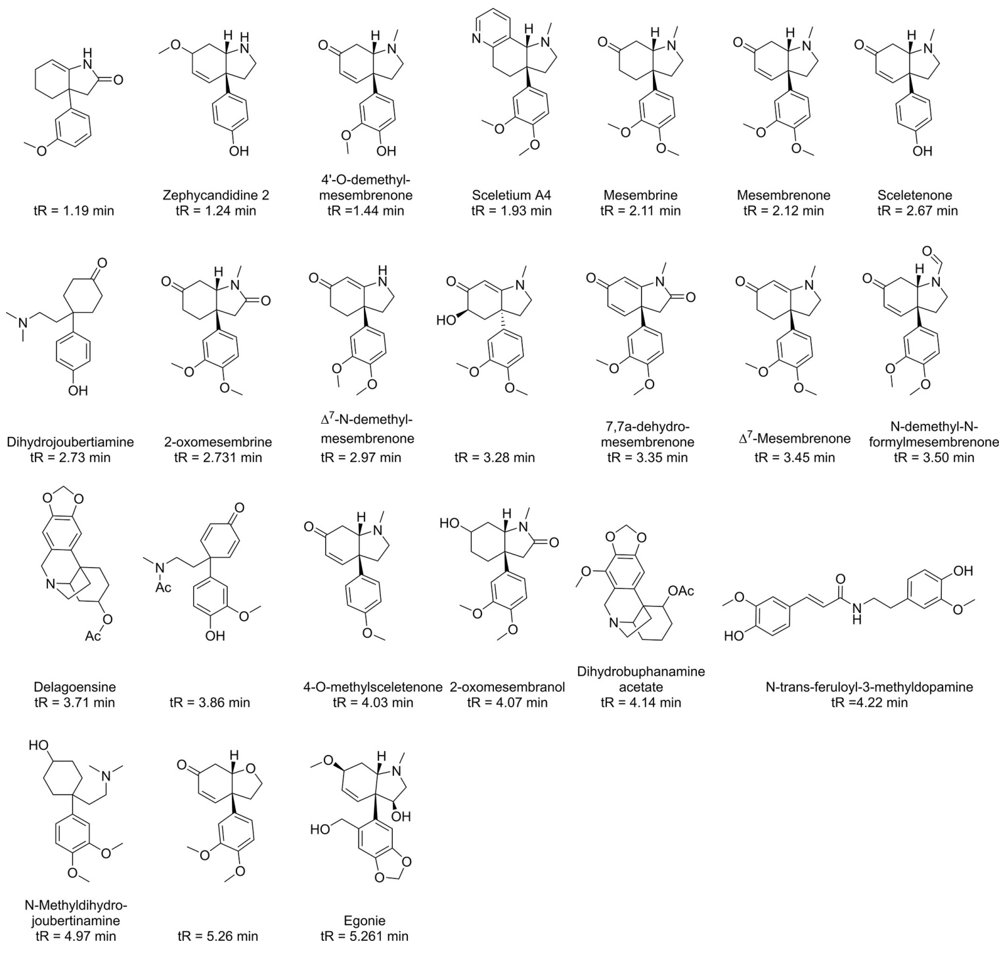
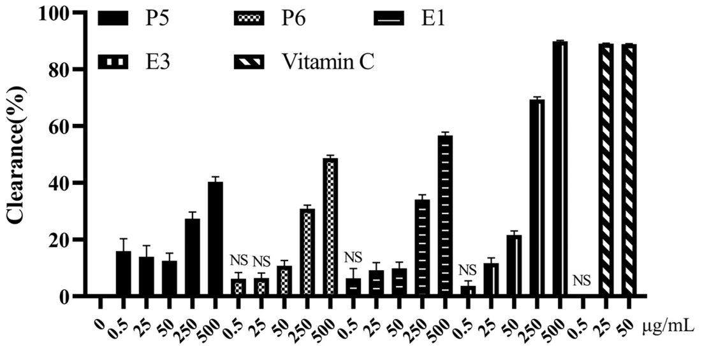
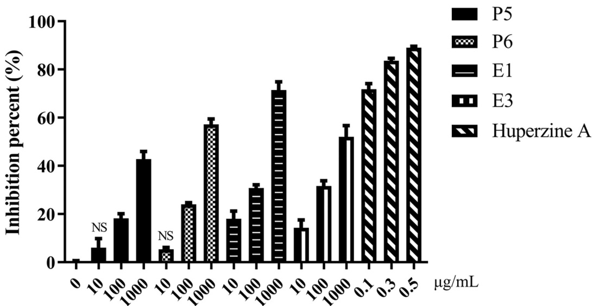
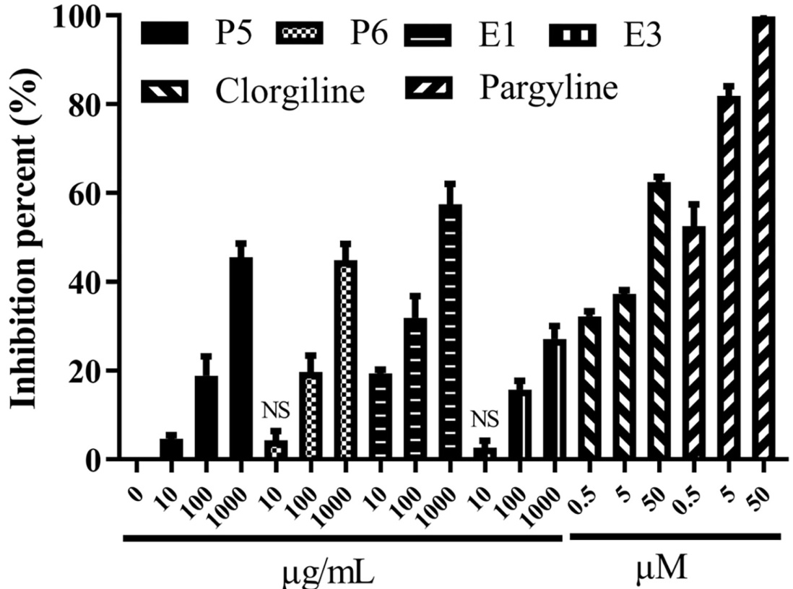
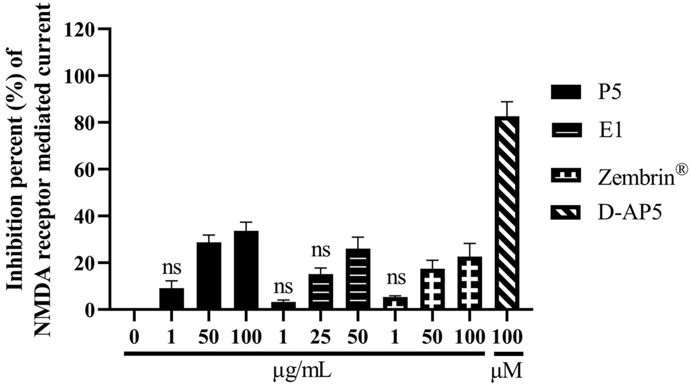
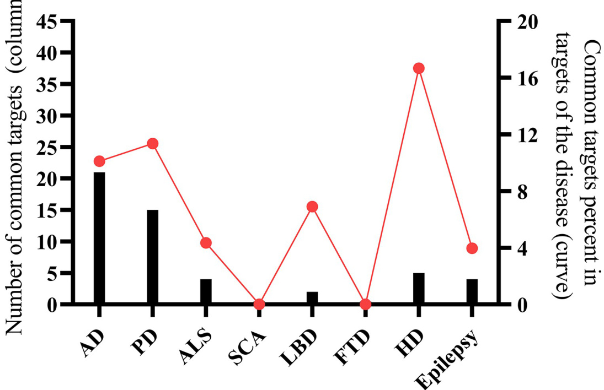
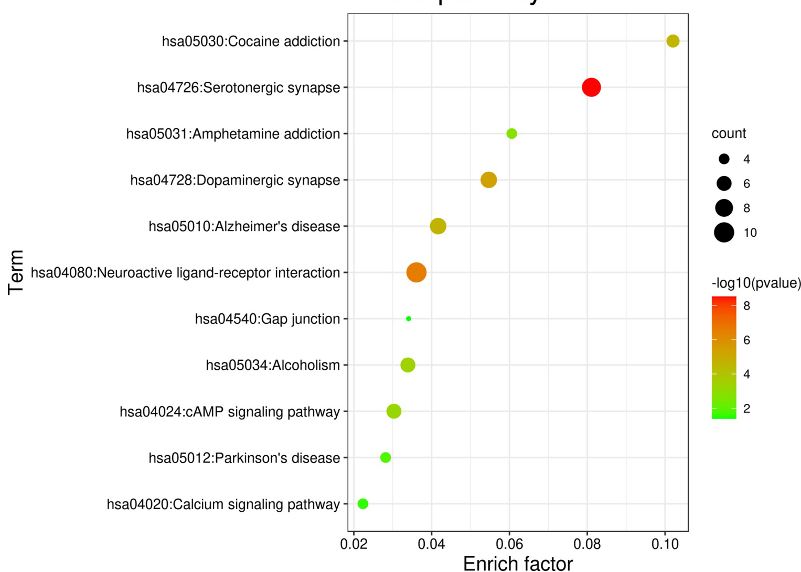
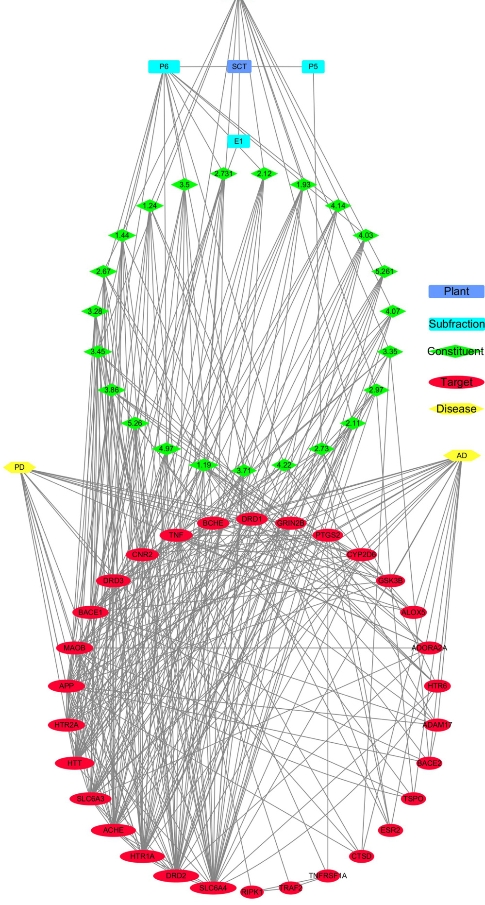
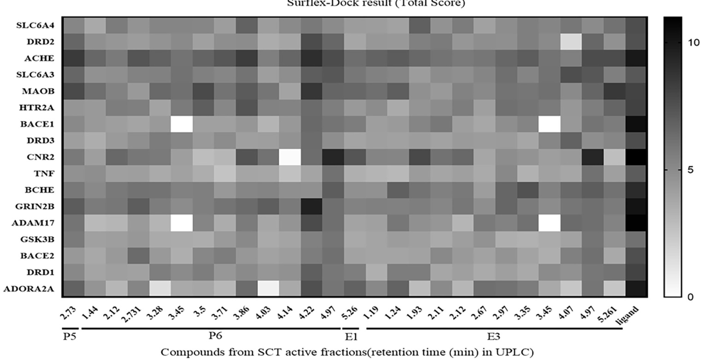
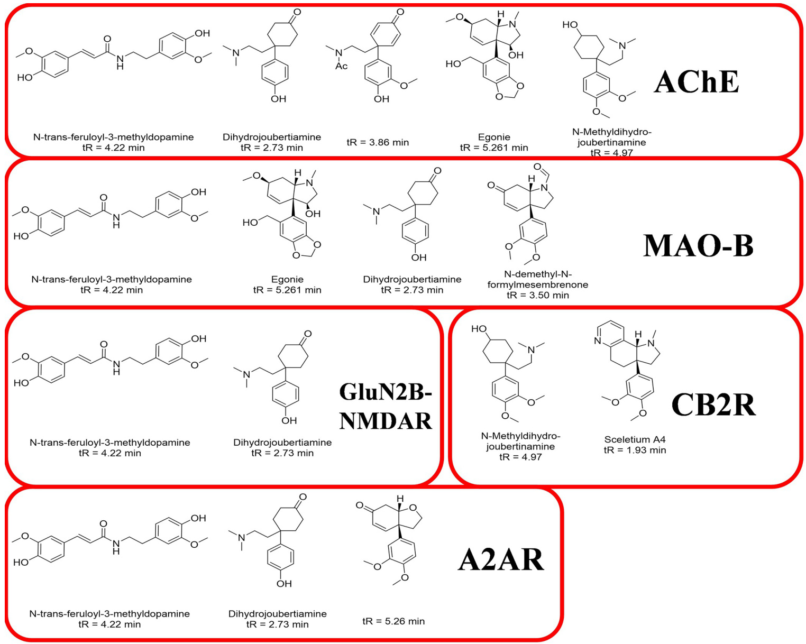

RESEARCH ARTICLE

#### A network pharmacology-based approach to explore the therapeutic potential of Sceletium tortuosum in the treatment of neurodegenerative disorders

Citation: Luo Y, Shan L, Xu L, Patnala S, Kanfer I, Li J, et al. (2022) A network pharmacology-based approach to explore the therapeutic potential of Sceletium tortuosum in the treatment of neurodegenerative disorders. PLoS ONE 17(8): e0273583. https://doi.org/10.1371/journal. pone.0273583

Editor: Oksana Lockridge, University of Nebraska Medical Center, UNITED STATES

Received: February 24, 2022

Accepted: August 10, 2022

Data Availability Statement: All relevant data are within the paper.

Published: August 25, 2022

Copyright: $\circledcirc$ 2022 Luo et al. This is an open access article distributed under the terms of the Creative Commons Attribution License, which permits unrestricted use, distribution, and reproduction in any medium, provided the original author and source are credited.

Funding: The author(s) received no specific funding for this work.

Competing interests: The authors have declared that no competing interests exist.

Abbreviations: SCT, Sceletium tortuosum; MPP+, 1-methyl-4-phenylpyridinium; AChE, Acetylcholinesterase; MAO, monoamine oxidase;

Yangwen Luo1, Luchen Shan1, Lipeng $\mathbf { \boldsymbol { x } } \mathbf { \boldsymbol { u } } ^ { \mathsf { 1 } }$ , Srinivas Patnala2, Isadore Kanfer2¤, Jiahao Li1, Pei $\bar { \mathsf { Y } } \mathsf { u } ^ { 1 * }$ , Xu JunID

1 College of Pharmacy, Jinan University, Guangzhou, China, 2 Faculty of Pharmacy, Rhodes University, Grahamstown, South Africa

¤ Current address: Leslie Dan Faculty of Pharmacy, University of Toronto, Toronto, Canada \* peiyu@jnu.edu.cn (PY); xujun@jnu.edu.cn (JX)

#### Abstract

Sceletium tortuosum (SCT) has been utilized medicinally by indigenous Koi-San people purportedly for mood elevation. SCT extracts are reported to be neuroprotective and have efficacy in improving cognition. However, it is still unclear which of the pharmacological mechanisms of SCT contribute to the therapeutic potential for neurodegenerative disorders. Hence, this study investigated two aspects–firstly, the abilities of neuroprotective sub-fractions from SCT on scavenging radicals, inhibiting some usual targets relevant to Alzheimer’s disease (AD) or Parkinson’s disease (PD), and secondly utilizing the network pharmacology related methods to search probable mechanisms using Surflex-Dock program to show the key targets and corresponding SCT constituents. The results indicated sub-fractions from SCT could scavenge 2,2-diphenyl-1-picrylhydrazyl (DPPH) radical, inhibit acetylcholinesterase (AChE), monoamine oxidase type B (MAO-B) and N-methyl-D-aspartic acid receptor (NMDAR). Furthermore, the results of gene ontology and docking analyses indicated the key targets involved in the probable treatment of AD or PD might be AChE, MAO-B, NMDAR subunit2B (GluN2B-NMDAR), adenosine $\mathsf { A } _ { 2 \mathsf { A } }$ receptor and cannabinoid receptor 2, and the corresponding constituents in Sceletium tortuosum might be N-trans-feruloyl-3- methyldopamine, dihydrojoubertiamine and other mesembrine type alkaloids. In summary, this study has provided new evidence for the therapeutic potential of SCT in the treatment of AD or PD, as well as the key targets and notable constituents in SCT. Therefore, we propose SCT could be a natural chemical resource for lead compounds in the treatment of neurodegenerative disorders.

#### Introduction

Sceletium tortuosum (L.) N.E. Br (SCT), a South African herb, with a long history of use by Koi-San natives, is reported to have various pharmacological activities such as anti-depressant

NMDAR, N-methyl-D-aspartic acid receptor; AD, Alzheimer’s disease; PD, Parkinson’s disease; DPPH, 1,1-diphenyl-2-picrylhydrazyl; A2AR, adenosine A2A receptor; CB2R, cannabinoid receptor 2; KEGG, Kyoto Encyclopedia of Genes and Genomes.

[1], anti-anxiety [2], anti-epileptic [3] and analgesic [4] activities. Its extracts are reported to have shown efficacy in improving cognition [5, 6]. Cognition deficit is a predominantly general symptom of Alzheimer’s disease (AD) and in some cases of Parkinson’s diseases (PD)– hence it is postulated that neurodegenerative disorders that could be treated by compounds that possess neuroprotective effects [7–12]. Considering that there are certain neuroprotective constituents in SCT, which are reported to have the therapeutic potential in the treatment of neurodegenerative diseases, there is a need to invesigate the probable mechanisms that contribute to the possible treatment of neurodegenerative disorders, especially in AD or PD with cognitive impairments.

“Network pharmacology” (NP) methods have been usually applied in this form of research to access primary mechanisms of certain traditional Chinese medicines formula according to their traditional indications [13–16]. Some studies have also used NP to explore the possible novel indications for complicated Chinese traditional medicines [17, 18]. Application of NP could be further understood based on the published report by Fang JS et al who proposed and deciphered mechanism of action for some of the most widely studied medicinal herbs used in the treatment of AD [19].

Our previous study [20] has showed the neuroprotective sub-fractions and possible neuroprotective constituents (Fig 1) in the neuroprotective sub-fractions extracted from SCT. The petroleum ether and ethyl acetate fractions were confirmed to possess neuroprotective efficacy, been further separated by silica gel column to obtain sub-fractions tested by cell experiments. Furthermore, natural products generally consist of various and diverse active constituents depending on the extraction process [21], which can lead to neuroprotective fractions that exert neuroprotective effect of SCT and probably caused due to multiple constituents. Thus, it makes such investigations laborious and difficult to decipher the elicited mechanisms. Hence, investigating the possibility of SCT extract for treating neurodegenerative disorders, as an integrated system as applied by traditional Chinese medicine, would provide insight by utilizing NP methods is a logical and scientific approach.

In this study, spectrophotometric assays were performed on SCT sub-fractions to assess neuroprotective action related efficacies based on the scavenging radicals, inhibiting acetylcholinesterase (AChE), monoamine oxidases (MAOs) and N-methyl-D-aspartic acid receptor (NMDAR). Subsequently, relevant NP methods and molecular docking were performed to understand the possible mechanisms that provide evidence to corelate the therapeutic potential of SCT in the treatment of AD or PD.

Furthermore, it is important to identify the key targets, and the corresponding constituents in neuroprotective sub-fractions involved in the probable treatment of AD or PD [2, 4, 22–33].

#### Methods

#### The neuroprotective sub-fractions from SCT and their identified constituents

Based on our previous study [20], SCT plant powder was extracted with alcohol and which was further extracted with petroleum ether and ethyl acetate. The petroleum ether and ethyl acetate fractions were confirmed to possess neuroprotective efficacy on ${ \mathrm { M P P ^ { + } } }$ -injured N2a cells or L-glutamate-injured PC12 cells. The active fractions were further separated by silica gel column to obtain sub-fractions. The sub-fractions were also tested by cell experiments [34– 36] to give four neuroprotective sub-fractions–P5, P6, E1 and E3 ( $\mathrm { { ^ { * } P ^ { * } } }$ and “E” mean the subfractions of petroleum ether and ethyl acetate fractions respectively). The active sub-fractions were once again preliminarily identified the constituents that were separated and identified

  
Fig 1. The constituents of neuroprotective sub-fractions from SCT in previous study. (tR represents their retention time in UPLC).

https://doi.org/10.1371/journal.pone.0273583.g001

from SCT in the current study. The chemical structures of these constituents are depicted in Fig 1.

#### DPPH scavenging assay

The ability of the neuroprotective sub-fractions from SCT to scavenge 2,2-diphenyl-1-picrylhydrazyl (DPPH) radical was tested in 96-well polystyrene microtiter plates (Corning1). The extraction and separation methods to obtain the neuroprotective sub-fractions were performed as described in the previous study [20]. DPPH (TCI, Japan) was dissolved in methanol to obtain a concentration of $1 0 0 \mu \mathrm { M }$ . The wells contained $1 0 0 \mu \mathrm { L }$ DPPH and then added $1 0 0 \mu \mathrm { L }$ of sub-fraction samples in different concentrations. Blank wells contained methanol in place of DPPH and control wells contained only methanol in place of samples. After shocking on a microoscillator, the plate was kept in the dark for 50 minutes. The absorbance was detected at a wavelength of $5 1 7 \mathrm { n m }$ using a microplate reader (Bio-Tek Instruments Inc, USA). The clearance percent of DPPH was expressed as mean $\pm$ SEM calculated by following formula:

\[
\mathrm { C l e a r a n c e \ ( \% ) } = \frac { A _ { \mathrm { c o n t r o l } } - ( A _ { \mathrm { s a m p l e } } - A _ { \mathrm { b l a n k } } ) } { A _ { \mathrm { c o n t r o l } } } \times 1 0 0 \%
\]

#### AChE inhibition assay

The experiment to test the AChE inhibiting ability of neuroprotective sub-fractions of SCT was performed as per procedure described by Ellman [37, 38]. $1 6 0 \mu \mathrm { L }$ of PBS $( 0 . 1 \mathrm { M } \mathrm { p H } = 8 \$ ), $1 0 \mu \mathrm { L }$ of sample and $1 0 \mu \mathrm { L }$ of AChE $( 0 . 5 \mathrm { U / m L }$ , Solarbio, Beijing) were mixed in 96 wells plate for $2 0 \mathrm { m i n }$ at $4 ^ { \circ } \mathrm { C } ,$ , and then the wells were added $1 0 \mu \mathrm { L }$ of $^ { 2 , 2 ^ { \prime } }$ -dithiodibenzoic acid $\mathrm { { . 1 0 ~ m M } }$ , MedChemExpress) and $1 0 \mu \mathrm { L }$ of acetylthiocholine iodide ( $1 0 \mathrm { m M }$ , Solarbio, Beijing) for another $3 0 \mathrm { m i n }$ at $3 7 ^ { \circ } \mathrm { C }$ . The absorbance was detected at a wavelength of $4 0 5 \mathrm { n m }$ . Blank wells had PBS added in place of AChE and control wells had PBS added in place of samples.

#### MAOs inhibition assay

The MAOs inhibition percent of neuroprotective sub-fractions from SCT was measured by following procedures described by Holt with some modifications [39].

This study is got pass by Jinan University Laboratory Animal Ethical Committee.The IACUC issue number is 20220225–03. All studies related to animals were performed in accordance with the standards set forth in the eighth edition of Guide for the Care and Use of Laboratory animals, published by the National Academy of Sciences, the National Academies Press, Washington D.C (License number: SCXK(粤)2018-0002).We use Pentobarbital Sodium as anesthesia and reduce the pain of death in rats by excessive anaesthesia.

Female Sprague—Dawley rat $( 2 8 6 \ \mathrm { g } )$ was killed by anesthetic, and its livers were dissected out, washed in ice-cold PBS (0.2 M, pH 7.6). Liver tissue ${ \bf ( 7 9 ) }$ was homogenized $1 { : } 2 0 \ ( \mathrm { w } / \mathrm { v } )$ in $0 . 3 { \mathrm { ~ M ~ } }$ sucrose with a mechanical homogenizer. Following centrifugation at $1 1 0 0 g$ for $1 2 \mathrm { m i n }$ , the supernatant was further centrifuged at $1 0 0 0 0 g$ for $3 0 \mathrm { m i n }$ to obtain a crude mitochondrial pellet, which was resuspended in $4 0 \mathrm { m l }$ of PBS used as the source of MAOs.

$4 0 \mu \mathrm { L }$ of MAOs and $4 0 \mu \mathrm { L }$ of samples were added in the wells for $2 0 \mathrm { m i n }$ at $3 7 ^ { \circ } \mathrm { C }$ and then the supplement of the enzyme substrate and chromogenic reagent were added for $6 0 \mathrm { m i n }$ at $3 7 ^ { \circ } \mathrm { C } .$ . The enzyme substrate was tyramine $\mathrm { \Delta } 5 \mathrm { m M }$ , Aladdin, Shanghai) and the chromogenic reagent was a mixture contained vanillic acid ( $\mathrm { \Delta } 5 \mathrm { m M }$ , Shanghaiyuanye, China), 4-aminoantipyrine (1mM, Shanghaiyuanye, China), peroxidase $\langle 5 \mathrm { U } / \mathrm { m L }$ , Solarbio, Beijing) in PBS. The absorbance was detected at a wavelength of $4 9 0 \mathrm { n m }$ . Blank wells had PBS added in place of tyramine and control wells had PBS added in place of samples.

The inhibition percentages of AChE and MAOs were expressed as mean $\pm$ SEM calculated by following formula:

\[
\mathrm { I n h i b i t i o n \ p e r c e n t { ( \% ) } } = \frac { A _ { \mathrm { c o n t r o l } } - ( A _ { \mathrm { s a m p l e } } - A _ { \mathrm { b l a n k } } ) } { A _ { \mathrm { c o n t r o l } } } \times 1 0 0 \%
\]

#### Primary culture of rat hippocampal neurons

The hippocampus tissue was separated from Sprague-Dawley neonatal rat and placed in cold phosphate buffer saline under an asepsis condition, and then was digested with $0 . 2 5 \%$ trypsin for $2 0 \mathrm { m i n }$ at $3 7 ^ { \circ } \mathrm { C } .$ After trypsinization, hippocampal neurons were suspended in DMEM (Gibco) containing $1 0 \%$ horse serum (Gibco) and cultured in polyethylenimine-coated coverslips at a density of $1 0 5 / \mathrm { c m } ^ { 2 }$ for $^ { 4 \mathrm { h } }$ at $3 7 ^ { \circ } \mathrm { C }$ . The medium was replaced with neurobasal medium (Gibco) containing B-27 supplement (Gibco) and L-glutamine (Gibco), and the cells were cultured at $3 7 ^ { \circ } \mathrm { C }$ in a humidified environment of $9 5 \%$ air and $5 \%$ $\mathrm { C O } _ { 2 }$ for 7 days.

#### Whole cell patch clamp

To investigate the effect of two sub-fractions from SCT on the NMDAR mediated current, whole cell patch clamp was used to the record of NMDAR current by an amplifier (EPC-10, HEKA, Germany). Before recording, a negative pressure was exerted on the hippocampal neuron’s surface through microelectrode and formed a $\mathbf { G } \Omega$ seal resistance, then the membrane potential was kept in $- 7 0 \mathrm { m V }$ . The hippocampal neurons were exposed to NMDA $( 1 0 0 \mu \mathrm { M } )$ , Glycine $( { 1 0 } { \mu \mathrm { M } } )$ and samples in different concentrations or D-2-Amino-5-phosphonovaleric acid (D-AP5) $( 1 0 0 \mu \mathrm { M } )$ .

NMDA $( 1 0 0 \mu \mathrm { M } )$ and Glycine $( { 1 0 } \mu \mathrm { M } )$ were used to activate the NMDA current. D-AP5, a NMDAR inhibitor, was used as a positive control. The current signals were recorded by the amplifier under a Gap-free mode and stored in PatchMaster software (HEKA, Germany).

Recording was allowed to start at least 5 min after the rupture of patch membrane to ensure stabilization of the intracellular milieu. Neurons that showed unstable or large (more than $\sim 5 0 \mathrm { p A } ,$ ) holding currents were rejected. The series resistance $\cdot { < } 1 5 \mathrm { M } \Omega \backslash$ and membrane capacitance were compensated and checked regularly during the recording.

The inhibition percentage of NMDAR was calculated according to the formula: (1-(INMDA + Glycine +Compound / INMDA +Glycine)) x 100%. Data were expressed as mean ± S.E.M.

Extracellular fluid $\mathrm { ( p H 7 . 4 ) }$ contained $1 4 0 \mathrm { m M N a C l }$ , $4 \mathrm { m M }$ KCl, 2 mM $\mathrm { C a C l } _ { 2 } { \bullet } 2 \mathrm { H } _ { 2 } \mathrm { O }$ , 10 mM HEPES, $5 \mathrm { m M }$ D-Glucose, $0 . 5 \mu \mathrm { M }$ TTX, $1 0 \mu \mathrm { M }$ NBQX, $1 0 \mu \mathrm { M }$ Strychnine and $1 0 \mu \mathrm { M }$ Bicuculline. Intracellular fluid $\mathrm { \langle p H 7 . 2 \rangle }$ ) contained 10 mM NaCl, 110 mM CsMeS, $2 \mathrm { m M }$ $\mathrm { M g C l } _ { 2 } { \bullet } 6 \mathrm { H } _ { 2 } \mathrm { O } .$ , $1 0 \mathrm { m M }$ HEPES, $1 0 \mathrm { m M }$ EGTA, 2 mM $\Nu _ { \tt d _ { 2 } }$ -ATP, $0 . 2 \mathrm { m M }$ $\Nu _ { \tt d _ { 2 } }$ -GTP.

#### Network pharmacology methods to decipher possible mechanisms of SCT

Targets of the constituents identified from SCT in our previous study were obtained from Polypharmacology Browser 2 (https://ppb2.gdb.tools/) [40]. Methods: ECfp4 Naive Bayes Machine Learning model produced on the fly with 2000 nearest neighbors from extended connectivity fingerprint ECfp4. Targets of neurodegenerative disorder were elements of the intersection set obtained from GeneCards [41] (https://www.genecards.org/, Relevance score $\geq 1 0$ ) and DisGeNET [42] (https://www.disgenet.org/, Score $\mathrm { \ g d a } \geq 0 . 1$ ) databases using following keywords: Alzheimer’s disease, Parkinson’s disease, amyotrophic lateral sclerosis, spinocerebellar ataxia, Lewy bodies, frontotemporal dementia, Huntington’s disease and epilepsy.

Protein–protein interaction data were acquired from STRING 11.0 [43] (https://string-db. org/cgi/input.pl) with the species limited to “Homo sapiens”.

GO and KEGG pathway enrichment analyses were performed by DAVID Bioinformatics Resources 6.8 [44] (https://david.ncifcrf.gov/). The targets from the intersection set of targets of the constituents and diseases were submitted to obtain the terms of biological process, molecular function, cellular component and Kyoto Encyclopedia of Genes and Genomes (KEGG) pathways.

All visualized network models were established via Cytoscape 3.8.0. The topological feature of each node in network model was assessed by calculating three parameters named “Degree”, “Betweenness Centrality (BC)” and “Closeness Centrality (CC) by Network Analyze tool in Cytoscape software.

#### Preliminary verification for the possible mechanisms by surflex-dock

The constituents were prepared by Sybyl- $\cdot \mathrm { X } 2 . 0$ . As docking ligands, their energy was minimized according following parameter settings: Powell method, $0 . 0 0 5 \mathrm { k c a l / m o l { \cdot } A }$ gradient termination, 1000 max iteration and Gasteiger-Huckel charges. Other settings were kept default.

The protein structures were obtained from PDB Protein Data Bank (http://www.rcsb.org/). To make docking pockets, the protein structures were extracted ligand substructure, repaired sidechains, added hydrogens and minimized their energy. Protomol generation mode was selected as “Ligand” and other settings were default. Reference molecules were set as their original ligands. Results of Total Score were output as the criterion to comparing the predictive affinities.

#### Statistical method

Each value was an average of data from 3 independent experiments and each experiment included 3 replicates. Data were expressed as mean $\pm$ SEM and analyzed using GraphPad Prism V8.0 (GraphPad Software, Inc., San Diego, CA, USA). One-way analysis of variance (ANOVA) and Dunnett’s test were used to evaluate statistical differences.

#### Results

#### SCT sub-fractions scavenge DPPH radical

The scavenging ability of DPPH radical of the SCT sub-fractions is depicted in Fig 2. The clearance percentages of four sub-fractions could all reach more than $4 0 \%$ at their highest concentration $( 5 0 0 \mu \mathrm { g / m L } )$ . Fraction E3 was the most potent sub-fraction on scavenging DPPH radical among these four neuroprotective sub-fractions from SCT, although weaker than the positive compounds–vitamin C.

#### SCT sub-fractions inhibit AChE

The AChE inhibition percent of four sub-fractions could reach more than $4 0 \%$ at their highest concentration $( 1 0 0 0 \mu \mathrm { g / m L }$ ). Since contrast to Huperzine–a AChE inhibitor, their effects on

  
Fig 2. The DPPH clearance percentages of active sub-fractions. Data were expressed as mean $\pm \mathsf { S } . \mathsf { E } . \mathsf { M }$ . from the data obtained from three independent experiments ${ \mathrm { ( n } } = 3 { \mathrm { ) } }$ ). NS represents the mean of group has no significant different with the mean of control group.

  
Fig 3. The inhibition percentages of active sub-fractions on AChE. Data were expressed as mean $\pm \ : \mathrm { S . E . M }$ . obtained from three independent experiments $( \boldsymbol { \mathrm { n } } = 3 )$ . NS represents the mean of group has no significant difference compared to the mean of control group.

https://doi.org/10.1371/journal.pone.0273583.g003

AChE were considered as slight efficacy. It also showed that fraction E1 exhibited more than $6 0 \%$ inhibition percent on AChE, which was the most potent sub-fraction among the extracts (Fig 3).

#### SCT sub-fractions inhibit MAOs

The results depicted in Fig 4 showed, MAO-A selective inhibitor—clorgiline could inhibit the MAOs by about $6 0 \%$ at $5 0 \mu \mathrm { M }$ , while MAO-B selective inhibitor–pargyline could inhibit the MAOs by close to $1 0 0 \%$ at $5 0 \mu \mathrm { M }$ . Since the enzyme substrate was tyramine, which could be common enzyme substrate for both MAO-A and MAO-B, the enzyme activity of the MAOs we used in this study was considered to be contributed mainly by MAO-B [45].

Except fraction E3, other three active sub-fractions presented more than $4 0 \%$ inhibition percent on MAOs at their highest concentration $\mathrm { \langle 1 0 0 0 \mu g / m L \rangle }$ ). The observed inhibition results were regarded as mild.

#### SCT sub-fractions inhibit NMDAR

Compared to Zembrin1, the more potent neuroprotective P5 and E1 fractions (compared with P6 and E3 in our previous study [20]) showed potent inhibiting effect on NMDAR-mediated current (Fig 5). However, this effect is not significant enough to be considered as main mechanism that elicits antidepressant action of SCT.

#### Common targets of constituents and neurodegenerative diseases

As indicated in the previous study, the neuroprotective sub-fractions and underlying neuroprotective constituents (structures were shown in Fig 1) in SCT [20]. Using Polypharmacology Browser 2, the predictive targets of the constituents from neuroprotective sub-fractions were compared with the targets of neurodegenerative diseases collected from GeneCards and DisGeNET databases. The results of their intersections were showed as Fig 6. Although the percent of overlapping targets in targets of HD was the maximum value $( 1 6 . 6 7 \% )$ among these neurodegenerative diseases, there were only 5 overlapping targets from the intersection.

  
Fig 4. The inhibition percentages of active sub-fractions on MAOs. Data were expressed as mean $\pm \mathrm { S . E . M }$ . obtained from three independent experiments $\left( \mathrm { n } = 3 \right)$ . NS represents the mean of group showed no significant difference with the mean of control group.

https://doi.org/10.1371/journal.pone.0273583.g004

Therefore, AD or PD was selected as adaptable disease because of the larger number and percentage of common targets (Table 1) than other disease conditions.

#### GO and KEGG pathway enrichment analysis

The overlapping targets of constituents and AD/PD could enrich in more than 20 terms of biological processes (the terms of which P value $< 0 . 0 0 1$ were showed as Fig 7), which mainly involved response to drug (GO:0042493), chemical synaptic transmission (GO:0007268), locomotory behavior (GO:0007626), memory (GO:0007613), learning (GO:0007612, GO:0008542), response to amphetamine (GO:0001975), behavioral response to cocaine (GO:0048148), dopaminergic synaptic transmission (GO:0001963), prepulse inhibition (GO:0060134), etc. These biological processes indicate that the extracts of SCT could exert neurological activities that are helpful to treat cognition deficit and behavioral disorders. The analysis of cellular functions (Fig 8) showed that these targets mainly included dopamine binding (GO:0035240), dopamine neurotransmitter receptor activity (GO:0004952), beta-amyloid binding (GO:0001540), drug binding (GO:0008144), enzyme binding (GO:0019899), etc. Moreover, these overlapping targets are mainly integral component of plasma membrane (GO:0005887), locate on plasma membrane (GO:0016021) and cell surface (GO:0009986), distribute on dendrite (GO:0030425) and axon (GO:0030424) (Fig 8). KEGG pathway analysis of these targets suggested that they play a role in neuroactive ligand-receptor interaction (hsa04080), serotonergic synapse (hsa04726), dopaminergic synapse (hsa04728), Alzheimer’s disease (hsa05010), alcoholism (hsa05034), cAMP signaling pathway (hsa04024), Parkinson’s disease (hsa05012), calcium signaling pathway (hsa04020), amphetamine addiction (hsa05031) (Fig 9).

  
Fig 5. The inhibition percentages of active sub-fractions on NMDAR-mediated current. Data were expressed as mean $\pm \ : \mathrm { S . E . M }$ . D-AP5 group: $\mathtt { n } = 4$ , other groups: ${ \mathfrak { n } } = 3$ . NS represents the mean of group has no significant different with the mean of control group.

https://doi.org/10.1371/journal.pone.0273583.g005

#### Constituents–targets–disease network diagram

The interactions of the overlapping targets, constituents and their possible targets and targets of AD or PD were fed into cytoscape 3.8.0 software to obtain a constituents-targets-disease network diagram (Fig 10). In this network diagram, there were 59 nodes and 345 edges, including 23 constituents, 30 targets, 2 diseases, 4 sub-fractions and 1 plant. The result of network analysis (Table 2) showed that degrees of the targets, of which gene names are SLC6A4, DRD2, ACHE, HTR1A, SLC6A3, HTT, APP, HTR2A, MAOB, BACE1, DRD3, TNF, CNR2, BCHE, DRD1 and GRIN2B, are more than 13 with betweenness centralities more than 0.005 and closeness centralities more than 0.5. The degrees of all constituents in this diagram are equal or greater than 6.

#### Key targets in the possible mechanisms of SCT in the treatment of AD or PD

Targets with a greater degree value (more than 13) or enriched in AD or PD KEGG pathway were selected to be docked with constituents from neuroprotective sub-fractions by SurflexDock (Total Score results showed as Fig 11).

The Total Score results indicated that many vital targets involved in AD or PD, for example AChE (ACHE), MAO-B (MAOB), GluN2B-NMDAR (GRIN2B), adenosine A2A receptor (A2AR, ADORA2A) and cannabinoid receptor 2 (CB2R, CNR2), have potent predicted binding activity with several SCT constituents. Moreover, SCT constituents as Fig 12 showed have higher Total Score with corresponding targets, which indicated that they are more possible to affect the targets to exert neuroprotective efficacy for the treatment of AD or PD.

#### The targets intersection of neurodegenerative diseases and neuroprotective sub-fractions

  
Fig 6. The intersection of targets from constituents and diseases. AD: Alzheimer‘s Disease; PD: Parkinson’s Disease; ALS: Amyotrophic Lateral Sclerosis; SCA: Spinocerebellar Ataxia; LBD: Lewy Body Dementia; FTD: Frontotemporal Dementia; HD: Huntington’s Disease.

https://doi.org/10.1371/journal.pone.0273583.g006

Table 1. Overlapping targets of constituents and AD/PD.   

<html><body><table><tr><td>Gene</td><td>Common name</td></tr><tr><td>ESR2</td><td>Estrogen receptor beta</td></tr><tr><td>MAOB</td><td>Monoamine oxidase type B</td></tr><tr><td>HTR6</td><td>5-hydroxytryptamine receptor 6</td></tr><tr><td>CYP2D6</td><td>Cytochrome P450 2D6</td></tr><tr><td>ACHE</td><td>Acetylcholinesterase</td></tr><tr><td>SLC6A4</td><td>Sodium-dependent serotonin transporter</td></tr><tr><td>SLC6A3</td><td>Sodium-dependent dopamine transporter</td></tr><tr><td>BACE1</td><td>Beta-secretase 1</td></tr><tr><td>HTR2A</td><td>5-hydroxytryptamine receptor 2A</td></tr><tr><td>CNR2</td><td>Cannabinoid receptor 2</td></tr><tr><td>BCHE</td><td>Cholinesterase</td></tr><tr><td>ALOX5</td><td>Polyunsaturated fatty acid 5-lipoxygenase</td></tr><tr><td>APP</td><td>Amyloid-beta precursor protein</td></tr><tr><td>TSPO</td><td>Translocator protein</td></tr><tr><td>GSK3B</td><td>Glycogen synthase kinase-3 beta</td></tr><tr><td>PTGS2</td><td>Prostaglandin G/H synthase 2</td></tr><tr><td>ADAM17</td><td>Disintegrin and metalloproteinase domain-containing protein 17</td></tr><tr><td>BACE2</td><td>Beta-secretase 2</td></tr><tr><td>GRIN2B</td><td>N-methyl D-aspartate receptor subtype 2B</td></tr></table></body></html>

(Continued)

Table 1. (Continued)   

<html><body><table><tr><td>Gene</td><td>Common name</td></tr><tr><td>CTSD</td><td>Cathepsin D</td></tr><tr><td>TNF</td><td>Tumor necrosis factor</td></tr><tr><td>HTR1A</td><td>5-hydroxytryptamine receptor 1A</td></tr><tr><td>DRD3</td><td>Dopamine D3 receptor</td></tr><tr><td>DRD2</td><td>Dopamine D2 receptor</td></tr><tr><td>DRD1</td><td>Dopamine D1 receptor</td></tr><tr><td>ADORA2A</td><td>Adenosine receptor A2a</td></tr><tr><td>HTT</td><td>Huntingtin</td></tr></table></body></html>

https://doi.org/10.1371/journal.pone.0273583.t001   
Fig 7. Enrichment analyses for constituents-AD/PD common targets: Biological process.

#### Discussion

The outcomes of this study demonstrated the efficacies of SCT neuroprotective sub-fractions in scavenging DPPH radical, inhibiting AChE, MAOs and NMDAR by experiments performed using in vitro models.

#### Biological process

GO:0051584\~regulation of dopamine uptake involved in synaptic transmission GO:0060134\~prepulse inhibition GO:0001963\~synaptic transmission, dopaminergic GO:0042053\~regulation of dopamine metabolic process GO:0048148\~behavioral response to cocaine count GO:0042417\~dopamine metabolic process 5.0 GO:0035815\~positive regulation of renal sodium excretion 7.5 GO:0014059\~regulation of dopamine secretion 10.0 GO:0007210\~serotonin receptor signaling pathway GO:0001975\~response to amphetamine -log10(pvalue) GO:0051968\~positive regulation of synaptic transmission, glutamatergic GO:0001659\~temperature homeostasis 10.0 GO:0006509\~membrane protein ectodomain proteolysis 7.5 GO:0008542\~visual learning GO:0007612\~learning 5.0 GO:0007613\~memory GO:0007626\~locomotory behavior GO:0042493\~response to drug GO:0045471\~response to ethanol GO:0007268\~chemical synaptic transmission 0.0 0.2 0.4 0.6 Enrich factor

https://doi.org/10.1371/journal.pone.0273583.g007

Molecular function Cellular component GO:0003990\~acetylcholinesterase activity- GO:0005641\~nuclear envelope lumen GO:0043198\~dendritic shaftGO:0004104\~cholinesterase activity GO:0031513\~nonmotileprimary cliumGO:0001591\~dopamine neurotransmiter receptoractivity,coupled via Gi/Go count GO:0045121\~membrane raft ? count · 2 GO:0004952\~dopamineneurotransmiterreceptoractivity . ：3 GO:0030424\~axon ： ：4 GO:0030425\~dendrite GO:0035240\~dopamine binding ： ：5 GO:0043005\~neuron projection :1 ： GO:0014069\~postsynaptic density GO:0001540\~beta-amyloid binding . -log10(pvalue) GO:0043025\~neuronal cell body -log10(pvalue) GO:0030594\~neurotransmiter receptor activity 6 GO:0005788\~endoplasmic reticulum lumen 5 GO:0009986\~cell surfaceGO:0004993\~G-protein coupled serotonin receptor activity- 5 4 GO:0005768\~endosome 3 GO:0004190\~aspartic-type endopeptidase activity 3 GO:0005887\~integral component of plasma membrane GO:0008144\~drug binding GO:0005794\~Golgi apparatus GO:0005886\~plasma membrane GO:0019899\~enzyme bindingGO:0016021\~integral component of membrane 0.000.250.500.751.00 0.0 0.1 0.2 0.3 Enrich factor Enrich factor

https://doi.org/10.1371/journal.pone.0273583.g008

The clearance percent of four sub-fractions could reach more than $4 0 \%$ at $5 0 0 ~ \mu \mathrm { g / m L }$ . In contrast to the radical scavenging efficacy of SCT extract in the previous study, E3 could present comparative performance on scavenging DPPH radical [46], which indicated the constituents with antioxidant effect of SCT was enriched in the ethyl acetate sub-fraction. Antioxidative effect is a known mechanism of certain compounds eliciting neuroprotective action [7, 47–49]. The results further suggest that SCT has potential to treat neurodegenerative disorders through its antioxidative effect.

The study also showed moderate inhibiting effect of SCT neuroprotective sub-fractions on AChE, which was more potent than the effect of SCT extract in previous study based on comparing their test concentrations [50]. The reduction of acetylcholine level in AD patient may cause cognitive and memory impairments [51]. Hence, AChE may accelerate the progression of AD though promoting the fibration of $\beta$ -amyloid [52]. Scopolamine, a muscarinic receptor antagonist, produces a blocking of the activity of the muscarinic acetylcholine receptor, and the concomitant appearance of transient cognitive amnesia and electrophysiological changes, which resemble those observed in AD [53, 54]. There are certain AChE inhibitors approved for AD, for example, donepezil and galanthamine. In fact, some studies had described the neuroprotective effect of AChE inhibitor [22, 23]. Hence, inhibiting AChE appears to be an underlying mechanism of the neuroprotective action of SCT.

The results of MAOs inhibiting assay showed, except E3, other three active sub-fractions (P5, P6 and E1) all presented more than $4 0 \%$ inhibition percent on MAOs at $1 0 0 0 ~ \mu \mathrm { g / m L }$ , which is still more potent than the inhibiting effect of SCT extract on MAO-A by comparing their concentrations [50]. Since MAO-A selective inhibitor (clorgyline) could not inhibit the crude MAOs close to $1 0 0 \%$ at $5 0 \mu \mathrm { M }$ , while MAO-B selective inhibitor (pargyline) could inhibit it close to $1 0 0 \%$ at at $5 0 \mu \mathrm { M }$ . This result indicated that enzyme activity of the crude MAOs used in this study mainly contributed by MAO-B [39, 45]. Excess MAOs catalyze oxidation of amino substance causing the generation of oxidative stress [55, 56]. Moreover, a MAO-B inhibitor–selegiline approved for PD was reported to suppress excess GABA produced from astrocytes and restores the impaired spike probability, synaptic plasticity, and learning and memory in the mice [24]. However, some clinical trials showed that the cognitive function of the placebo group had no significant difference compared to the group treated

#### KEGG pathway

  
Fig 9. Enrichment analyses for constituents-AD/PD common targets: KEGG pathway.

https://doi.org/10.1371/journal.pone.0273583.g009

with selegiline for a long term therapy [25, 26]. Instead of irreversible inhibitor like selegiline, a reversible MAO-B inhibitor (KDS2010) does not induce compensatory mechanisms in a long term therapy, which further attenuated increased astrocytic GABA levels and astrogliosis, enhanced synaptic transmission, rescued learning and memory impairments in APP/PS1 mice [27]. Thereby, MAO-B is considered as a key target of SCT in the treatment of AD or PD.

Furthermore, P5 and E1 fractions SCT presented a non-significant inhibition of NMDARmediated current in hippocampal neurons of Sprague-Dawley neonatal rats, which was more potent than the effect of Zembrin1 on NMDAR-mediated current and consistent with previous results [57]. NMDAR, an ionotropic glutamate receptor, which constitute a calcium-permeable component of fast excitatory neurotransmission, have been verified to participate neuro-physiologically in many cell signaling pathways resulting in several neurological diseases. An NMDAR inhibitor–esketamine was approved for depressive disorder ought to his rapid antidepressant action. The previous studies showed the potential of SCT on treating depressive disorder [2, 4, 28–33]. However, the results of this study indicated that the influence on NMDAR of these two fractions may be a subsequent effect resulted from affecting other targets but not NMDAR. Thus leading to a possibility that the anti-depressive action of SCT

  
Fig 10. SCT-sub-fraction-constituents-targets-disease network diagram.

<html><body><table><tr><td colspan="2">Table lenetwork.</td><td colspan="2"></td></tr><tr><td>Node Name</td><td>Degree</td><td>Betweenness Centrality</td><td>Closeness Centrality</td></tr><tr><td>SLC6A4</td><td>32</td><td>0.06260</td><td>0.62766</td></tr><tr><td>DRD2</td><td>31</td><td>0.05874</td><td>0.64130</td></tr><tr><td>ACHE</td><td>30</td><td>0.10778</td><td>0.65556</td></tr><tr><td>HTR1A</td><td>30</td><td>0.07519</td><td>0.64130</td></tr><tr><td>SLC6A3</td><td>26</td><td>0.03614</td><td>0.59596</td></tr><tr><td>HTT</td><td>23</td><td>0.03893</td><td>0.57282</td></tr><tr><td>APP</td><td>20</td><td>0.04156</td><td>0.57843</td></tr><tr><td>HTR2A</td><td>20</td><td>0.02568</td><td>0.56731</td></tr><tr><td>MAOB</td><td>20</td><td>0.02614</td><td>0.55140</td></tr><tr><td>BACE1</td><td>19</td><td>0.05334</td><td>0.57282</td></tr><tr><td>DRD3</td><td>17</td><td>0.01538</td><td>0.55660</td></tr><tr><td>TNF</td><td>15</td><td>0.08981</td><td>0.52679</td></tr><tr><td>CNR2</td><td>15</td><td>0.02514</td><td>0.55140</td></tr><tr><td>BCHE</td><td>14</td><td>0.01292</td><td>0.53636</td></tr><tr><td>DRD1</td><td>13</td><td>0.00678</td><td>0.52212</td></tr><tr><td>GRIN2B</td><td>13</td><td>0.00617</td><td>0.52212</td></tr><tr><td>PTGS2</td><td>12</td><td>0.02749</td><td>0.51754</td></tr><tr><td>CYP2D6</td><td>12</td><td>0.00583</td><td>0.53153</td></tr><tr><td>GSK3B</td><td>10</td><td>0.01317</td><td>0.47967</td></tr><tr><td>ADAM17</td><td>7</td><td>0.00234</td><td>0.45385</td></tr><tr><td>ADORA2A</td><td>7</td><td>0.00621</td><td>0.50000</td></tr><tr><td>ALOX5</td><td>7</td><td>0.00475</td><td>0.45385</td></tr><tr><td>HTR6</td><td>7</td><td>0.00442</td><td>0.49167</td></tr><tr><td>BACE2</td><td>6</td><td>0.00107</td><td>0.43704</td></tr><tr><td>CTSD</td><td>5</td><td>0.00113</td><td>0.42143</td></tr><tr><td>ESR2</td><td>5</td><td>0.00722</td><td>0.42143</td></tr><tr><td>TSPO</td><td>5</td><td>0.00034</td><td>0.41259</td></tr><tr><td>TNFRSF1A</td><td>4</td><td>0.00171</td><td>0.36646</td></tr><tr><td>RIPK1</td><td>3</td><td>0</td><td>0.35119</td></tr><tr><td>TRAF2</td><td>3</td><td>0</td><td>0.35119</td></tr><tr><td>1.19</td><td>12</td><td>0.02202</td><td>0.51304</td></tr><tr><td>4.97</td><td>11</td><td>0.00727</td><td>0.50000</td></tr><tr><td>3.45</td><td>10</td><td>0.00977</td><td>0.50000</td></tr><tr><td>3.86</td><td>10</td><td>0.01547</td><td>0.50000</td></tr><tr><td>5.26</td><td>10</td><td>0.03077</td><td>0.50427</td></tr><tr><td>1.44</td><td>9</td><td>0.00425</td><td>0.49580</td></tr><tr><td>3.28</td><td>9</td><td>0.00307</td><td>0.50000</td></tr><tr><td>1.24</td><td>9</td><td>0.00949</td><td>0.49580</td></tr><tr><td>2.67</td><td>9</td><td>0.00869</td><td>0.48361</td></tr><tr><td>2.12</td><td>8</td><td>0.00342</td><td>0.48361</td></tr><tr><td>2.731</td><td>8</td><td>0.00244</td><td>0.49167</td></tr><tr><td>3.50</td><td>8</td><td>0.00250</td><td>0.47967</td></tr><tr><td>1.93</td><td>8</td><td>0.00212</td><td>0.45385</td></tr><tr><td>2.73</td><td>7</td><td>0.02801</td><td>0.45385</td></tr><tr><td>4.03</td><td>7</td><td>0.00167</td><td>0.47581</td></tr><tr><td>4.14</td><td>7</td><td>0.00193</td><td>0.47581</td></tr><tr><td>2.11</td><td>7</td><td>0.00152</td><td>0.45038</td></tr></table></body></html>

(Continued)

Table 2. (Continued)   
https://doi.org/10.1371/journal.pone.0273583.t002   

<html><body><table><tr><td>Node Name</td><td>Degree</td><td>Betweenness Centrality</td><td>Closeness Centrality</td></tr><tr><td>2.97</td><td>7</td><td>0.00471</td><td>0.47967</td></tr><tr><td>3.35</td><td>7</td><td>0.01321</td><td>0.50427</td></tr><tr><td>4.07</td><td>7</td><td>0.00184</td><td>0.48361</td></tr><tr><td>5.261</td><td>7</td><td>0.00153</td><td>0.47200</td></tr><tr><td>3.71</td><td>6</td><td>0.00130</td><td>0.46825</td></tr><tr><td>4.22</td><td>6</td><td>0.00612</td><td>0.45385</td></tr></table></body></html>

extract can be due to inhibition efficacy of mesembrine and mesembrenone on phosphodiesterase-4 and serotonin transporter [58].

Therefore, results of the in vitro experiments indicated that there are neuroprotective constituents in SCT could protect neurons to treat neurodegenerative disorders by scavenging radicals, inhibiting AChE, MAOs and NMDAR. Different sub-fractions represented different degrees of influence on AChE, MAOs and NMDAR.

Moreover, the neuroprotective sub-fractions of SCT used to assess the potential use to treat AD or PD, was further supported by network pharmacology related methods applied in this study, which was also supported by the observed influence of SCT extract on cognition [5, 6]. Among several neurodegenerative disorders, the targets of AD or PD from database have most overlapping numbers with the targets predicted by Polypharmacology Browser 2. It is understood that the overlapping targets could be involved in memory, learning and behavior related biological process and enrich in AD and PD corresponding KEGG pathway. The network analysis and Surflex-Dock results have indicated that some key targets, AChE, MAO-B, GluN2B-NMDAR, A2AR and CB2R, can be influenced by SCT in the probable treatment of

  
Surflex-Dock result (Total Score)   
Fig 11. Surflex-dock results of SCT constituents with key targets in total score.

https://doi.org/10.1371/journal.pone.0273583.g011 https://doi.org/10.1371/journal.pone.0273583.g012

  
Fig 12. Constituents from SCT with their possible targets predicted by total score in surflex-dock.

AD or PD, and other constituents SCT or similar moieties of close chemical structures, such as egonie, sceletium A4, dihydrojoubertiamine, N-trans-feruloyl-3-methyldopamine, N-methyldihydrojoubertinamine and so on, should be concerned to have potential in affecting on corresponding targets (Fig 12).

In this study, the primary purpose was to explore possible targets of the neuroprotective SCT on neurodegenerative disorders by network pharmacology. According to the identified constituents from SCT in our previous study, the results of network pharmacology studies indicated some potential targets (AChE, MAOs and NMDAR) for SCT. Therefore, the neuroprotective SCT sub-factions were further tested in vitro for their efficacy on the potential targets. Encouragingly, the results of the fraction-targets in vitro experiments actually supported the network pharmacology results in this study. However, different sub-factions contained different natural products, the content of natural products were also various, which resulted in the different effects of different sub-factions to these potential target in this study. Certainly, in the next stage, the further studies would carry out to explain the bioactivity mechanism of different sub-fractions on their specific targets.

#### Conclusion

SCT neuroprotective sub-fractions have moderate potency of scavenging radicals, inhibiting AChE, MAOs and NMDAR, which are the possible mechanisms of its neuroprotective effect. The identified and other related constituents in SCT may have affects on biological systems to alter AChE, MAO-B, GluN2B-NMDAR, A2AR and CB2R, to exert their therapeutic potential in the probable treatment of AD or PD.

#### Author Contributions

Data curation: Yangwen Luo.

Formal analysis: Yangwen Luo.

Methodology: Luchen Shan, Lipeng Xu.

Project administration: Pei Yu, Xu Jun.

Resources: Srinivas Patnala, Isadore Kanfer.

Validation: Yangwen Luo.

Visualization: Yangwen Luo.

Writing – original draft: Yangwen Luo.

Writing – review & editing: Yangwen Luo, Srinivas Patnala, Isadore Kanfer, Jiahao Li.

#### References

1. Filipovic SR, Covickovic-Sternic N, Stojanovic-Svetel M, Lecic D, Kostic VS. Depression in Parkinson’s disease: an EEG frequency analysis study. Parkinsonism Relat Disord. 1998; 4(4):171–8. https://doi. org/10.1016/s1353-8020(98)00027-3 PMID: 18591107   
2. Gericke N, Harvey A, Viljoen A, Hofmeyr D, inventors; H.L. Hall & Sons Limited, S. Afr.. assignee. Sceletium extract and uses thereof patent US20120004275A1. 2012.   
3. Dimpfel W, inventor; HG&H Pharmaceuticals Pty. Ltd., S. Afr.. assignee. Mesembrenol and/or mesembranol for prophylaxis and treatment of patients suffering from epilepsy and associated diseases patent WO2019021196A1. 2019. 4. Loria MJ, Ali Z, Abe N, Sufka KJ, Khan IA. Effects of Sceletium tortuosum in rats. Journal of Ethnopharmacology. 2014; 155(1):731–5. https://doi.org/10.1016/j.jep.2014.06.007 PMID: 24930358   
5. Chiu S, Gericke N, Farina-Woodbury M, Badmaev V, Raheb, et al. Proof-of-Concept Randomized Controlled Study of Cognition Effects of the Proprietary Extract Sceletium tortuosum (Zembrin) Targeting Phosphodiesterase-4 in Cognitively Healthy Subjects: Implications for Alzheimer’s Dementia. Evid Based Complement Alternat Med. 2014; 2014:682014. https://doi.org/10.1155/2014/682014 PMID: 25389443 6. Hoffman JR, Markus I, Dubnov-Raz G, Gepner Y. Ergogenic Effects of 8 Days of Sceletium Tortuosum Supplementation on Mood, Visual Tracking, and Reaction in Recreationally Trained Men and Women. J Strength Cond Res. 2020; 34(9):2476–81. https://doi.org/10.1519/JSC.0000000000003693 PMID: 32740286   
7. Singh SK, Srivastav S, Castellani RJ, Plascencia-Villa G, Perry G. Neuroprotective and Antioxidant Effect of Ginkgo biloba Extract Against AD and Other Neurological Disorders. Neurotherapeutics. 2019; 16(3):666–74. https://doi.org/10.1007/s13311-019-00767-8 PMID: 31376068 8. Davies J, Chen J, Pink R, Carter D, Saunders N, Sotiriadis G, et al. Orexin receptors exert a neuroprotective effect in Alzheimer’s disease (AD) via heterodimerization with GPR103. Sci Rep. 2015; 5:12584. https://doi.org/10.1038/srep12584 PMID: 26223541 9. Chen P-H, Cheng F-Y, Cheng S-J, Shaw J-S. Predicting cognitive decline in Parkinson’s disease with mild cognitive impairment: a one-year observational study. Parkinson’s Dis. 2020:8983960. https://doi. org/10.1155/2020/8983960 PMID: 33178412   
10. Enache D, Pereira JB, Jelic V, Winblad B, Nilsson P, Aarsland D, et al. Increased Cerebrospinal Fluid Concentration of ZnT3 Is Associated with Cognitive Impairment in Alzheimer Disease. J Alzheimer’s Dis. 2020; 77(3):1143–55.   
11. Scott XO, Stephens ME, Desir MC, Dietrich WD, Keane RW, Pablo de Rivero Vaccari J. The inflammasome adaptor protein ASC in mild cognitive impairment and Alzheimer’s disease. Int J Mol Sci. 2020; 21 (13):4674. https://doi.org/10.3390/ijms21134674 PMID: 32630059   
12. Soles-Tarres I, Cabezas-Llobet N, Vaudry D, Xifro X. Protective effects of pituitary adenylate cyclaseactivating polypeptide and vasoactive intestinal peptide against cognitive decline in neurodegenerative diseases. Front Cell Neurosci. 2020; 14:221. https://doi.org/10.3389/fncel.2020.00221 PMID: 32765225   
13. Li J, Lu C, Jiang M, Niu X, Guo H, Li L, et al. Traditional chinese medicine-based network pharmacology could lead to new multicompound drug discovery. Evid Based Complement Alternat Med. 2012; 2012:149762. https://doi.org/10.1155/2012/149762 PMID: 23346189   
14. Xu J, Qi L, Cheng L, Zhang Y, Xu J, Lou W. Network pharmacology-based study on mechanism of Indigo Naturalis in treatment of primary biliary cirrhosis. Zhongxiyi Jiehe Ganbing Zazhi. 2020; 30 (5):52–4, 9, 109.   
15. Pan Y, Xu F, Gong H, Wu F-f, Chen L, Zeng Y-l, et al. Network pharmacology-based study on the mechanism of Ganfule in the prevention and treatment of primary liver cancer. Zhongchengyao. 2020; 42 (12):62–9.   
16. Liao J-m Qin Z-j, Yang Q-y Li R-q, Xu W-c. Network pharmacology-based study on mechanism of Spatholobus suberectus Dunn treating hepatocellular carcinoma. Guangxi Yixue. 2020; 42(14):72–7.   
17. Zheng C-S, Xu X-J, Ye H-Z, Wu G-W, Li X-H, Xu H-F, et al. Network pharmacology-based prediction of the multi-target capabilities of the compounds in Taohong Siwu decoction, and their application in osteoarthritis. Exp Ther Med. 2013; 6(1):125–32. https://doi.org/10.3892/etm.2013.1106 PMID: 23935733   
18. Hong M, Zhang Y, Li S, Tan HY, Wang N, Mu S, et al. A network pharmacology-based study on the hepatoprotective effect of Fructus Schisandrae. Molecules. 2017; 22(10):1617/1-/11.   
19. Fang J, Wang L, Wu T, Yang C, Gao L, Cai H, et al. Network pharmacology-based study on the mechanism of action for herbal medicines in Alzheimer treatment. Journal of Ethnopharmacology. 2016; 196:281–92. https://doi.org/10.1016/j.jep.2016.11.034 PMID: 27888133   
20. Luo Y, Patnala S, Shan L, Xu L, Dai Y, Kanfer I, et al. Neuroprotective Effect of Extract-fractions from Sceletium tortuosum and their Preliminary Constituents Identification by UPLC-qTOF-MS with Collision Energy and MassFragment Software. Journal of Pharmaceutical and Biomedical Sciences. 2021; 11 (02):31–46.   
21. Patnala S, Kanfer I. Chapter 6—Quality control, extraction methods, and standardization: Interface between traditional use and scientific investigation. In: Henkel R, Agarwal A, editors. Herbal Medicine in Andrology: Academic Press; 2021. p. 175–87.   
22. Tommonaro G, Garcia-Font N, Vitale RM, Pejin B, Iodice C, Canadas S, et al. Avarol derivatives as competitive AChE inhibitors, non hepatotoxic and neuroprotective agents for Alzheimer’s disease. Eur J Med Chem. 2016; 122:326–38. https://doi.org/10.1016/j.ejmech.2016.06.036 PMID: 27376495   
23. Takada Y, Yonezawa A, Kume T, Katsuki H, Kaneko S, Sugimoto H, et al. Nicotinic acetylcholine receptor-mediated neuroprotection by donepezil against glutamate neurotoxicity in rat cortical neurons. J Pharmacol Exp Ther. 2003; 306(2):772–7. https://doi.org/10.1124/jpet.103.050104 PMID: 12734391   
24. Jo S, Yarishkin O, Hwang YJ, Chun YE, Park M, Woo DH, et al. GABA from reactive astrocytes impairs memory in mouse models of Alzheimer’s disease. Nat Med (N Y, NY, U S). 2014; 20(8):886–96. https:// doi.org/10.1038/nm.3639 PMID: 24973918   
25. Froestl W, Muhs A, Pfeifer A. Cognitive enhancers (nootropics). Part 2: drugs interacting with enzymes. Update 2014. J Alzheimers Dis. 2014; 42(1):1–68. https://doi.org/10.3233/JAD-140402 PMID: 24903780   
26. Wilcock GK, Birks J, Whitehead A, Evans SJG. The effect of selegiline in the treatment of people with Alzheimer’s disease: a meta-analysis of published trials. Int J Geriatr Psychiatry. 2002; 17(2):175–83. https://doi.org/10.1002/gps.545 PMID: 11813282   
27. Park J-H, Ju YH, Choi JW, Song HJ, Jang BK, Woo J, et al. Newly developed reversible MAO-B inhibitor circumvents the shortcomings of irreversible inhibitors in Alzheimer’s disease. Sci Adv. 2019; 5(3): eaav0316. https://doi.org/10.1126/sciadv.aav0316 PMID: 30906861   
28. Dimpfel W, Schombert L, Gericke N. Electropharmacogram of Sceletium tortuosum extract based on spectral local field power in conscious freely moving rats. J Ethnopharmacol. 2016; 177:140–7. https:// doi.org/10.1016/j.jep.2015.11.036 PMID: 26608705   
29. Schell R. Sceletium tortuosum and Mesembrine: A Potential Alternative Treatment for Depression. United States of America: Scripps College; 2014.   
30. Dimpfel W, Gericke N, Suliman S, Dipah GNC. Psychophysiological effects of zembrin using quantitative EEG source density in combination with eye-tracking in 60 healthy subjects. A double-blind, randomized, placebo-controlled, 3-armed study with parallel design. Neurosci Med. 2016; 7(3):114–32.   
31. Dimpfel W, Gericke N, Suliman S, Dipah GNC. Effect of Zembrin on brain electrical activity in 60 older subjects after 6 weeks of daily intake. A prospective, randomized, double-blind, placebo-controlled, 3- armed study in a parallel design. World J Neurosci. 2017; 7(1):140–71.   
32. Carpenter JM, Ali Z, Abe N, Khan IA, Jourdan MK, Fountain EM, et al. The effects of Sceletium tortuosum (L.) N.E. Br. extract fraction in the chick anxiety-depression model. J Ethnopharmacol. 2016; 193:329–32. https://doi.org/10.1016/j.jep.2016.08.019 PMID: 27553978   
33. Terburg D, Syal S, Rosenberger LA, Heany S, Phillips N, Gericke N, et al. Acute Effects of Sceletium tortuosum (Zembrin), a Dual 5-HT Reuptake and PDE4 Inhibitor, in the Human Amygdala and its Connection to the Hypothalamus. Neuropsychopharmacology. 2013; 38(13):2708–16. https://doi.org/10. 1038/npp.2013.183 PMID: 23903032   
34. Singh A, Verma P, Raju A, Mohanakumar KP. Nimodipine attenuates the parkinsonian neurotoxin, MPTP-induced changes in the calcium binding proteins, calpain and calbindin. J Chem Neuroanat. 2019; 95:89–94. https://doi.org/10.1016/j.jchemneu.2018.02.001 PMID: 29427747   
35. Kupsch A, Gerlach M, Pupeter SC, Sautter J, Dirr A, Arnold G, et al. Pretreatment with nimodipine prevents MPTP-induced neurotoxicity at the nigral, but not at the striatal level in mice. NeuroReport. 1995; 6(4):621–5. https://doi.org/10.1097/00001756-199503000-00009 PMID: 7605913   
36. Ota H, Ogawa S, Ouchi Y, Akishita M. Protective effects of NMDA receptor antagonist, memantine, against senescence of PC12 cells: A possible role of nNOS and combined effects with donepezil. Exp Gerontol. 2015; 72:109–16. https://doi.org/10.1016/j.exger.2015.09.016 PMID: 26408226   
37. Ellman GL, Courtney KD, Andres V Jr., Featherstone RM. A new and rapid colorimetric determination of acetylcholinesterase activity. Biochem Pharmacol. 1961; 7:88–95. https://doi.org/10.1016/0006- 2952(61)90145-9 PMID: 13726518   
38. Orhan I, Sener B, Choudhary MI, Khalid A. Acetylcholinesterase and butyrylcholinesterase inhibitory activity of some Turkish medicinal plants. J Ethnopharmacol. 2004; 91(1):57–60. https://doi.org/10. 1016/j.jep.2003.11.016 PMID: 15036468   
39. Holt A, Sharman DF, Baker GB, Palcic MM. A continuous spectrophotometric assay for monoamine oxidase and related enzymes in tissue homogenates. Anal Biochem. 1997; 244(2):384–92. https://doi.org/ 10.1006/abio.1996.9911 PMID: 9025956   
40. Awale M, Reymond J-L. Polypharmacology Browser PPB2: Target Prediction Combining Nearest Neighbors with Machine Learning. J Chem Inf Model. 2019; 59(1):10–7. https://doi.org/10.1021/acs. jcim.8b00524 PMID: 30558418   
41. Stelzer G, Rosen N, Plaschkes I, Zimmerman S, Twik M, Fishilevich S, et al. The GeneCards Suite: From Gene Data Mining to Disease Genome Sequence Analyses. Curr Protoc Bioinformatics. 2016; 54:1.30.1–1..3. https://doi.org/10.1002/cpbi.5 PMID: 27322403   
42. Pinero J, Ramirez-Anguita JM, Sauch-Pitarch J, Ronzano F, Centeno E, Sanz F, et al. The DisGeNET knowledge platform for disease genomics: 2019 update. Nucleic Acids Res. 2020; 48(D1):D845–D55. https://doi.org/10.1093/nar/gkz1021 PMID: 31680165   
43. Szklarczyk D, Gable AL, Lyon D, Junge A, Wyder S, Huerta-Cepas J, et al. STRING v11: protein-protein association networks with increased cov upporting functional discovery in genome-wide experimental datasets. Nucleic Acids Res. 2019; 47(D1):D607–D13. https://doi.org/10.1093/nar/ gky1131 PMID: 30476243   
44. Huang DW, Sherman BT, Lempicki RA. Systematic and integrative analysis of large gene lists using DAVID bioinformatics resources. Nat Protoc. 2009; 4(1):44–57. https://doi.org/10.1038/nprot.2008.211 PMID: 19131956   
45. Stafford GI, Pedersen PD, J¨ager AK, Staden JV. Monoamine oxidase inhibition by southern African traditional medicinal plants. South African Journal of Botany. 2007; 73(3):384–90.   
46. Kapewangolo P, Tawha T, Nawinda T, Knott M, Hans R. Sceletium tortuosum demonstrates in vitro anti-HIV and free radical scavenging activity. South African Journal of Botany. 2016; 106:140–3.   
47. Gonzalez-Burgos E, Liaudanskas M, Viskelis J, Zvikas V, Janulis V, Gomez-Serranillos MP. Antioxidant activity, neuroprotective properties and bioactive constituents analysis of varying polarity extracts from Eucalyptus globulus leaves. J Food Drug Anal. 2018; 26(4):1293–302. https://doi.org/10.1016/j.jfda. 2018.05.010 PMID: 30249328   
48. Ren Z, Zhang R, Li Y, Li Y, Yang Z, Yang H. Ferulic acid exerts neuroprotective effects against cerebral ischemia/reperfusion-induced injury via antioxidant and anti-apoptotic mechanisms in vitro and in vivo. Int J Mol Med. 2017; 40(5):1444–56. https://doi.org/10.3892/ijmm.2017.3127 PMID: 28901374   
49. Yousef AOS, Fahad AA, Abdel Moneim AE, Metwally DM, El-Khadragy MF, Kassab RB. The neuroprotective role of coenzyme Q10 against lead acetate-induced neurotoxicity is mediated by antioxidant, anti-inflammatory and anti-apoptotic activities. Int J Environ Res Public Health. 2019; 16(16):2895.   
50. Coetzee DD, Lopez V, Smith C. High-mesembrine Sceletium extract (Trimesemine®) is a monoamine releasing agent, rather than only a selective serotonin reuptake inhibitor. J Ethnopharmacol. 2016; 177:111–6. https://doi.org/10.1016/j.jep.2015.11.034 PMID: 26615766   
51. Yue W, Li Y, Zhang T, Jiang M, Qian Y, Zhang M, et al. ESC-derived basal forebrain cholinergic neurons ameliorate the cognitive symptoms associated with Alzheimer’s disease in mouse models. Stem Cell Rep. 2015; 5(5):776–90. https://doi.org/10.1016/j.stemcr.2015.09.010 PMID: 26489896   
52. Inestrosa NC, Dinamarca MC, Alvarez A. Amyloid-cholinesterase interactions. Implications for Alzheimer’s disease. FEBS J. 2008; 275(4):625–32. https://doi.org/10.1111/j.1742-4658.2007.06238.x PMID: 18205831   
53. Spinks A, Wasiak J. Scopolamine (hyoscine) for preventing and treating motion sickness. Cochrane database of systematic reviews. 2011(6). https://doi.org/10.1002/14651858.CD002851.pub4 PMID: 21678338   
54. Ben-Barak J, Dudai Y. Scopolamine induces an increase in muscarinic receptor level in rat hippocampus. Brain Res. 1980; 193(1):309–13. https://doi.org/10.1016/0006-8993(80)90973-7 PMID: 7378826   
55. Naoi M, Riederer P, Maruyama W. Modulation of monoamine oxidase (MAO) expression in neuropsychiatric disorders- genetic and environmental factors involved in type A MAO expression. J Neural Transm. 2016; 123(2):91–106. https://doi.org/10.1007/s00702-014-1362-4 PMID: 25604428   
56. Youdim MBH, Bakhle YS. Monoamine oxidase: isoforms and inhibitors in Parkinson’s disease and depressive illness. Br J Pharmacol. 2006; 147(Suppl. 1):S287–S96. https://doi.org/10.1038/sj.bjp. 0706464 PMID: 16402116   
57. Dimpfel W, Franklin R, Gericke N, Schombert L. Effect of Zembrin $\left( \otimes \right)$ and four of its alkaloid constituents on electric excitability of the rat hippocampus. J Ethnopharmacol. 2018; 223:135–41. https://doi. org/10.1016/j.jep.2018.05.010 PMID: 29758341   
58. Harvey AL, Young LC, Viljoen AM, Gericke NP. Pharmacological actions of the South African medicinal and functional food plant Sceletium tortuosum and its principal alkaloids. J Ethnopharmacol. 2011; 137 (3):1124–9. https://doi.org/10.1016/j.jep.2011.07.035 PMID: 21798331