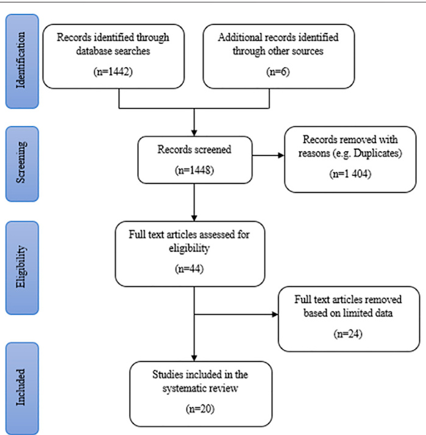
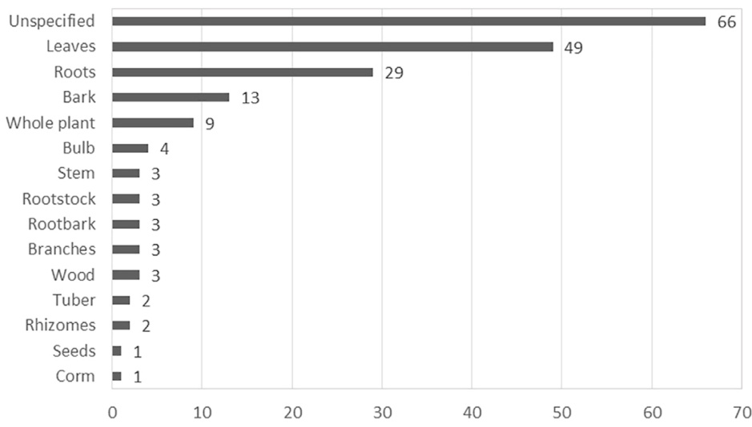
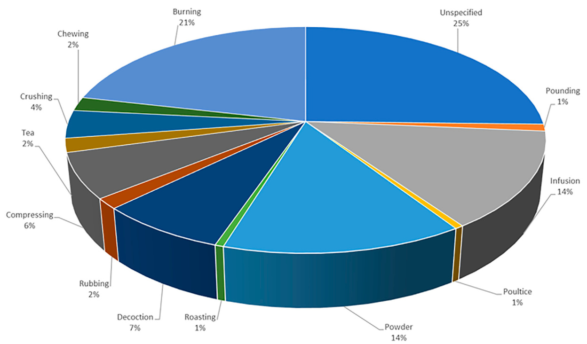
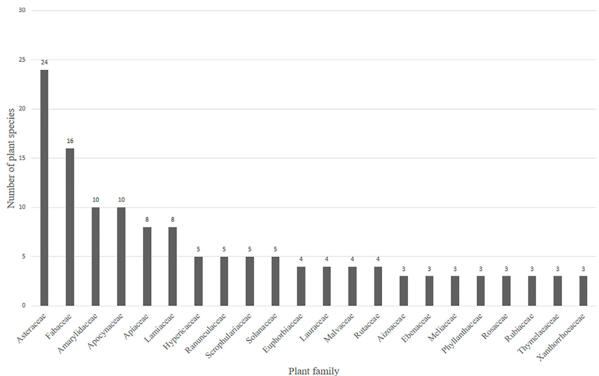

# Antidepressant Effects of South African Plants: An Appraisal of Ethnobotanical Surveys, Ethnopharmacological and Phytochemical Studies

Melia Bokaeng Bonokwane 1, Makhotso Lekhooa 2\*, Madeleen Struwig 1 and Adeyemi Oladapo Aremu 3\*

1Unit for Environmental Sciences and Management, Faculty of Natural and Agricultural Sciences, North-West University, Mmabatho, South Africa, 2Preclinical Drug Development Platform, Faculty of Health Sciences, North-West University, Potchefstroom, South Africa, 3Indigenous Knowledge Systems Centre, Faculty of Natural and Agricultural Sciences, North-West University, Mmabatho, South Africa

OPEN ACCESS

Edited by:

Sheng Wei, Shandong University of Traditional Chinese Medicine, China

Reviewed by:

Jui-Hu Shih, Tri-Service General Hospital, Taiwan Germain Sotoing Taiwe, University of Buea, Cameroon

\*Correspondence:

Makhotso Lekhooa Makhotso.Lekhooa@nwu.ac.za Adeyemi Oladapo Aremu Oladapo.Aremu@nwu.ac.za

Specialty section:

This article was submitted to Ethnopharmacology, a section of the journal Frontiers in Pharmacology

Received: 13 March 2022   
Accepted: 16 May 2022   
Published: 29 June 2022

Citation:

Bonokwane MB, Lekhooa M,   
Struwig M and Aremu AO (2022)   
Antidepressant Effects of South African Plants: An Appraisal of Ethnobotanical Surveys, Ethnopharmacological and Phytochemical Studies. Front. Pharmacol. 13:895286.   
doi: 10.3389/fphar.2022.895286

Globally, the search for safe and potent natural-based treatment for depression is receiving renewed interest given the numerous side-effects associated with many existing drugs. In South Africa, the use of plants to manage depression and related symptoms is fairly documented among different ethnic groups. In the current study, we reviewed existing ethnobotanical, ethnopharmacological and phytochemical studies on South African medicinal plants used to manage depression. Electronic databases were accessed for scientific literature that meets the inclusion criteria. Plants with ethnobotanical evidence were subjected to a further pharmacological review to establish the extent (if any) of their effectiveness as antidepressants. Critical assessment resulted in 20 eligible ethnobotanical records, which generated an inventory of 186 plants from 63 plant families. Due to the cultural differences observed in the definition of depression, or lack of definition in some cultures, most plants are reported to treat a wide range of atypical symptoms related to depression. Boophone disticha, Leonotis leonurus and Mentha longifolia were identified as the three most popular plants, with over eight mentions each from the ethnobotanical records. The dominant families were Asteraceae (24), Fabaceae (16), Amaryllidaceae (10), and Apocynaceae (10) which accounted for about $32 \%$ of the 186 plants. Only 27 $( \approx 1 4 . 5 \% )$ of the plants have been screened for antidepressant activity using in vitro and in vivo models. Agapanthus campanulatus, Boophone disticha, Hypericum perforatum, Mondia whitei and Xysmalobium undulatum, represent the most studied plants. Phytochemical investigation on nine out of the 27 plants revealed 24 compounds with antidepressant-like effects. Some of these included buphanidrine and buphanamine which were isolated from the leaves of Boophone disticha, $\Delta ^ { 9 }$ -tetrahydrocannabinol, cannabidiol and cannabichromene obtained from the buds of Cannabis sativa and carnosic acid, rosmarinic acid and salvigenin from Rosmarinus officinalis, A significant portion $( \approx 8 5 \% )$ of 186 plants with ethnobotanical records still require pharmacological studies to assess their potential antidepressant-like effects. This review remains a valuable reference material that may guide future ethnobotanical surveys to ensure their robustness and validity as well as database to identify promising plants to screen for pharmacology efficacy.

Keywords: alkaloids, Asteraceae, herbal medicine, ethnobotany, psychoactive plants, mental-health, indigenous knowlegde

## INTRODUCTION

Clinical depression represents one of the most prevalent and highly comorbid psychiatric conditions that causes a negative emotional experience associated with pathophysiological changes (Saki et al., 2014). In this review, we will differentiate between clinical depression (MDD) and the ailments/symptomology described as depression amongst communities (MDD-com). MDD is a mental health disorder characterized by a persistent depressed mood and loss of interest in activities once enjoyed, causing noticeably significant changes in the patient’s life (Mungai and Bayat, 2019). MDD brings about physiological, behavioral and psychological symptoms initiated through stressful life situations that are difficult to overcome (Martins and Brijesh, 2018; Fathinezhad et al., 2019). Symptoms of MDD may include a depressed mood, pervasive lack of energy, a change in sleeping patterns and psychomotor activity, changes in appetite and/or weight, cognitive disturbances that make it difficult to think, concentrate, or make decisions, feeling worthless, guilt, and repeated thoughts of death and suicidal attempts or idealizations (American Psychiatric Association, 2000; World Health Organisation, 2017). MDD is caused by imbalances with certain neurotransmitters in the central nervous system (Munir et al., 2020). According to Schildkraut, (1965), the most studied basis of the pathophysiology of MDD is the alteration of monoaminergic activity in the brain, which leads to the depletion of serotonin, dopamine and norepinephrine neurotransmitters. The noradrenaline and serotonin systems play an important role in stress response, the regulation of emotions and the neurobiology of depression (Ressler and Nemeroff, 2000). Antidepressants are the current MDD treatment focusing on improving monoamine activity, however, they are associated with adverse side effects and a delayed response time (Saki et al., 2014; Popa-Velea et al., 2015), leading to poor clinical outcomes.

MDD is one of the three leading causes of disease burden in South Africa and globally (Nglazi et al., 2016). The WHO ranked it as the largest contributor to global disability, with over an estimated 300 million people suffering from MDD globally in 2015 (World Health Organisation, 2017). It is projected that by 2030, MDD will be considered the global disease burden based on serious limitation on existing treatment methods owed to the therapeutic success, safety and efficacy of available antidepressants (Abbas et al., 2015). According to the South African Stress and Health (SASH) study, MDD is among the mental disorders with the highest lifetime prevalence in South Africa (Herman et al., 2009). MDD is more prevalent in females than in males (World Health Organisation, 2017). The correlation between hormonal changes in women and an increased prevalence of depression suggests that fluctuations in hormones during puberty, menstruation, after pregnancy and around menopause may trigger depression in women (Albert, 2015). In most developing countries, there is a limited access to treatment for mental disorders, especially in primary health care settings (Stafford et al., 2008; Ferrari et al., 2013). As a result, the communities have often used plants to alleviate some of the symptomology associated with depression or feeling unwell. Following the development of the WHO Traditional Medicine Strategy 2014–2023 and due to the legal acknowledgement of traditional healers, the South African government, as a member state of the WHO, developed legislation and policies to facilitate the institutionalization of traditional medicine in South Africa (Mothibe and Sibanda, 2019).

MDD-com includes mental health related problems that could be classified as depression based on similar clinical symptoms and is perceived by African traditional healers as caused by ancestors or bewitchment (Sorsdahl et al., 2009). When interviewed on the understanding of depression, one participant (traditional healer) from a South African study conducted by Starkowitz, (2013) stated that “traditionally, there is not something like depression,” while another participant replied “we don’t have the word depression.” Those with some degree of understanding of the concept defined MDD-com as “an experience of “feeling sick” inward and feeling down in your heart while the outside flesh will be feeling fine,” and “an experience that makes a person feel like lying down and covering themselves with a blanket” (Starkowitz, 2013). Several states, such as “being put down” by ancestors, experiencing headaches and migraines, being possessed by evil spirits, mourning, sorrow and being inflicted with curses often resemble a depressed and hopeless state (Stafford et al., 2008). Multiple somatic complaints such as headaches and fatigue represent the most common presentations of MDD-com in Zimbabwe (Todd et al., 1999). Wei et al. (2016) reported that the prevalence rate of depression in patients with headache was $1 9 . 7 \%$ , and that about $1 5 . 2 \%$ of the patients had headache due to somatic symptoms of depression (cause of headache) and $1 0 . 9 \%$ attributed their primary headache as a comorbidity of depression. Moreover, depression increased the risk of tension-type headache in study participants following laboratory stress (Janke et al., 2004). This overlap between depression and headache provides evidence of a link between medicinal plants used traditionally for headache and potential antidepressant properties. Particularly, appropriate utilization of disease categories and classification allow for cross-culture comparisons (Staub et al., 2015). Therefore, the emic perception and categorization of diseases (which usually comes from within a culture) has to be understood for the development of a culturally appropriate classification system (Heinrich et al., 2009).

The use of traditional medicine is widespread in South Africa, where an estimated $7 0 \mathrm { - } 8 4 \%$ of the black population consult traditional healers at some point (Koen et al., 2003; Robertson, 2006; Stafford et al., 2008). In addition, more people often utilize traditional healers than medical practitioners for their primary health care (Robertson, 2006). This can be attributed to preferences, the increased demand for herbal products in preventative health care and general well-being, and the easy availability of the cheaper, individualized and culturally appropriate traditional healthcare system (Mander, 1998; Viljoen et al., 2019). The use of commercially processed herbal preparations as part of traditional medicine, and the sale thereof, has increased over the last decade (Ndhlala et al., 2011). The use of herbal medicine such as psychotropic plant extracts is common amongst patients with mood-like and anxiety-like disorders, including MDD (Sarris et al., 2011). Boophone disticha is one of the most popular medicinal plants in South Africa where bulb infusions of this plant are used to treat headache and mental condition (Hutchings et al., 1996; Sobiecki, 2002). Sceletium tortuosum was used in the prehistoric times as a moodaltering substance, and the plant is chewed or drank traditionally for depression and stress (Hutchings et al., 1996; Van Wyk et al., 1997; Van Wyk and Gericke, 2000; Sobiecki, 2002). Infusions made from leaf, fruit and leaf decoctions of Schinus molle are used as antidepressants (Bhat and Jacobs, 1995). Several medicinal herbs are being used to treat mental disorders including depression (Fathinezhad et al., 2019). Hypericum perforatum L. is being used to treat mild depression as an alternative to conventional synthetic antidepressants (Nielsen et al., 2004), while Sceletium tortuosum (L.) N.E. Br has been developed into various pharmaceutical products for mood elevation (Stafford et al., 2008).

Despite the anecdotal and long-term use of medicinal plants for the treatment of MDD and related ailments in South Africa, an in-depth and up-to-date appraisal on this subject is lacking. Moreover, the need to bridge the cross-cultural gap observed in the definition of depression by exploring the regional, cultural and/or traditional concepts of depression as understood by South African traditional healers cannot be overemphasized. This review focuses on the ethnobotanical studies on South African plants with potential antidepressant effects, their pharmacological (in vitro and in vivo) screening and phytochemical assessment. This study is envisaged to provide an in-depth and current state of knowledge in the search for South African plants with antidepressant potential and identify critical gaps for future research direction in the on-going global search for safe and efficient antidepressants.

### MATERIALS AND METHODS

#### Literature Search Strategy

A web-based systematic literature search was conducted from March to November 2021 to identify ethnobotanical information on medicinal plants used traditionally in South Africa to treat MDD and MDD-com. The systematic review was conducted according to the PRISMA guidelines for reporting systematic reviews and meta-analysis (Moher et al., 2009; Moher et al., 2015). Electronic databases such as the Web of Science, MEDLINE (PubMed), ScienceDirect and Google Scholar were searched for published and unpublished scientific literature, including journal articles, books, theses and dissertations, on South African medicinal plants used to treat clinical depression and related ailments. These databases were searched using keywords/phrases such as South African medicinal plants, antidepressant effects of medicinal plants, ethnobotany of South Africa, indigenous plant use, medicinal plant use, South African psychoactive plants, Zulu medicinal plants. In addition, literature was retrieved from the library of the North-West University (NWU), South Africa. All medicinal plants identified by this search were subject to a further literature review to establish the extent (if any) of pharmacological research conducted into the efficacy of the plants as antidepressants. The electronic databases mentioned above were used to search for pharmacological studies providing supporting evidence of the antidepressant-like effects for each plant species, both in vitro and in vivo. To filter these studies, search terms “antidepressant effect of plants” and other keywords relating to depression and specific monoamines involved, together with plant species names, were used.

#### Eligibility Criteria

The screening of all search results involved reviewing the title and abstract of articles and identifying and selecting eligible publications, downloading identified research articles, and critically assessing the articles on how they met the inclusion criteria.

#### Inclusion Criteria

For a research article to be included in the review it must:

• Be a published ethnobotanical survey reporting potential antidepressant effects of medicinal plants • Indicate the traditional use, safety and toxicity of medicinal plants for depression and related ailments (e.g. headache, sorrow, mourning, nervousness, stress, tension, mental illness known as “spirits,” alcoholism, insomnia, insanity, feeling like crying) in South Africa • Be published or made available on the internet during the research period (i.e. up to November 30, 2021)

For Ethno-Pharmacological Studies • Plant extracts must be investigated against either Serotonin reuptake transporter (SERT), Dopamine transporter (DAT) and Noradrenalin transporter (NAT) receptors in vitro. • Evaluate the effect of plant extract on behavioral markers of depression in vivo and the safety/toxicity profile.

#### Exclusion Criteria

Research articles were excluded from the review if they:

• Ethnobotanical review articles (literature or systematic)

  
FIGURE 1 | Search strategy results for the identification of studies included in the systematic review.

• Focus on natural resources (other than plants) used for depression • Ethnobotanical surveys that is not focusing on South Africa • Have limited data (e.g. missing scientific plant names) on the medicinal use of plants for depression

#### Data Collection

Relevant data on the antidepressant-like effects of South African medicinal plants were extracted to Excel spreadsheets following the pre-defined criteria. Bibliographies from accessed articles, together with their citations, were downloaded and saved on an online reference manager (EndNote). Missing information from some articles (e.g. local names, life form of the plant, and misspelt scientific names) and in cases of research papers lacking geographic locations of the study, the data was retrieved through direct web searching (Google). Scientific names of plants, family, local names, life form of plants, method of preparation of the plant-based medicine, route of administration and short notes were collected for each plant from each article. Where possible, data on the ethnic group that uses the plants traditionally were collected. Plant species and family were validated in references to The World Flora Online (http://theworlflora.online) and PlantZAfrica (http:// pza.sanbi.org/) while the local names were confirmed using PlantZAfrica (http://pza.sanbi.org/). Any botanical synonyms or unaccepted names were updated to the recent updated plant nomenclature and are reported as such in this review. The plants listed in this review are arranged in alphabetical order based on plant families and scientific names.

#### RESULTS

#### Literature Search Results

A total of 1,442 publication records were identified from online database searches. Additional data were obtained from six literature sources (books) retrieved from the NWU library, making a total of 1,448 records that were screened. After the removal of duplicates, 44 articles and books were assessed for eligibility and explored relative to the inclusion criteria. The full text of 44 studies was reviewed in detail and 24 studies were removed due to limited data and other reasons stated in the exclusion criteria. Finally, 20 studies were reviewed for the documentation of the potential antidepressant-like effects of medicinal plants (Figure 1). The literature comprises of a total of 15 area specific ethnobotanical surveys $( 7 5 \% )$ and five plant inventories $( 2 5 \% )$ . These studies covered six out of the 9 (approximately $67 \%$ ) provinces in South Africa, with multiple studies being conducted in KwaZulu-Natal and Western Cape (both four studies). The most common method of data collection across the eligible articles was semi-structured and structured interviews ( $4 0 \%$ of the literature). Most of the literature reviewed covers a wide range of medicinal uses for each plant. However, for the purpose of this review, only the plant medicinal uses related to depression and associated symptoms were listed in the generated plant inventory.

The operational definition of MDD was inconsistent across most of the ethnobotanical literature reviewed. Most of the literature did not define MDD but a broad range of traditional medicinal uses in their surveys, rather than medicinal uses specific to MDD. Since most medicinal uses reported in the literature are indigenous knowledge gathered from South African traditional healers, records of the potential antidepressant effects of medicinal plants are listed as MDDcom, which entails ailments based largely on somatic symptoms such as headaches, fatigue, or spirits. According to Mosotho et al. (2008), there has been the misconception, until recently, that developing countries are relatively free of psychiatric problems, such as MDD, which are encountered in industrialized nations. Mosotho et al. (2008) also highlighted that MDD may be easily misdiagnosed since physical complaints, such as headaches, are not always recognized as a manifestation of depression. This lack of inconsistency between western and indigenous disease classification makes the evaluation of medicinal plant use in a western scientific setting more difficult (Staub et al., 2015; Weckerle et al., 2018).

The absence of methodological framework was evident in one of the reviewed study (Moteetee et al., 2019). A number of concerns were observed with the naming of the listed plants which are often encountered in published articles (Rivera et al., 2014). About $5 0 \%$ (10) of the articles listed at least one scientific name incorrectly either by misspelling the scientific name, recording an incorrect or ambiguous scientific name or by using non-standard author abbreviation (Van Wyk et al., 1997; Van Wyk and Gericke, 2000; Van Wyk et al., 2008; Mogale et al., 2015; Hulley and Van Wyk, 2019). In approximately $6 5 \%$ of the reviewed studies, there was no evidence of the identity of the medicinal plant recorded as the authors failed to provide details of the voucher specimen of the plants. Failure to provide sufficient details on the identification of the voucher specimen often makes the validation of the plant species difficult (Weckerle et al., 2018). Although some authors specified the plant parts used for the herbal preparation for managing depression and related ailments, this information was absent in many cases (Figure 2). Likewise, similar concern was evident with the method used for preparing the plants (Figure 3). These aforementioned concerns are important information required for the generation of plant inventory to ensure the integrity of data from ethnobotanical surveys.

  
FIGURE 2 | The frequency of medicinal plant parts used in South Africa for depression and related ailments.

  
FIGURE 3 | Different methods of preparation for medicinal plants $( n = 2 1 5 )$ . Out of the 186 medicinal plants recorded, several had ˃1 method used for preparation

#### South African Medicinal Plants With Potential Antidepressant Effects

Table 1 represents an overview of the key characteristics of each of the ethnobotanical studies reviewed. Included studies were conducted and published during the period from 1989 to 2019. A total of eight studies were conducted in the past 7 years. In this review, 186 medicinal plants from 63 plant families have been listed as being used in South Africa to treat MDD and MDD-com (Supplementary Table S1). The life forms for the plants included shrubs $( 4 0 \% )$ , trees $( 2 1 \% )$ , herbs $( 3 8 \% )$ and grasses $( 1 \% )$ . An overview of 54 medicinal plants that comprised of popular plants based on multiple mentions (37) from ethnobotanical studies and 27 plants with pharmacological evidence for depression are listed in Table 2. About $2 0 \%$ of the recorded plants (i.e. Adenia gummifera (Harv.) Harms, Albizia adianthifolia (Schum.) W.Wight, Ballota hirsuta Benth., Boophone disticha, Gomphocarpus fruticosus (L.) W.T.Aiton, Mentha longifolia (L.) L. and Leonotis leonurus (L.) R.Br.) were categorized as the most popular based on a relatively high number of mentions in the ethnobotanical surveys reviewed. The three most popular plants, with over eight mentions each from ethnobotanical surveys, included Boophone disticha, Leonotis leonurus and Mentha longifolia. Several other plants, such as Agapanthus campanulatus, Cannabis sativa, Heteromorpha trifoliata (H.L.Wendl.) Eckl. and Zeyh., Sceletium tortuosum, Schinus molle L. and Xysmalobium undulatum, have been used traditionally in South Africa to treat MDD and MDD-com (Hutchings et al., 1996; Van Wyk et al., 1997; Van Wyk and Gericke, 2000).

TABLE 1 | An overview of ethnobotanical literature documenting South African medicinal plants with potential antidepressant effects.   

<html><body><table><tr><td>Reference</td><td>Province</td><td>Area/region</td><td>Title/focus of the study</td><td>Ethnic group</td><td>No. of plant species</td><td>No. of plant families</td><td>Voucher specimen deposited</td><td>Characteristics of participants</td><td>Methodological framework (data collection and analysis,</td></tr><tr><td>Van Wyk and Gericke, (2000)</td><td>Southern Africa</td><td>Unspecified</td><td>An inventory of useful plants of Souther Africa</td><td>Unspecified</td><td>12</td><td>9</td><td>Unspecified</td><td>Unspecified</td><td>Ethnobotanical book</td></tr><tr><td>Van Wyk et al. (2008)</td><td>Eastern Cape and Western Cape</td><td>South-eastern Karoo, Graaff- Reinet and Murraysburg</td><td>An ethnobotanical survey of medicinal plants used in the southeastern Karoo</td><td>Xhosa, Khoikhoi and San</td><td>8</td><td>5</td><td>Unspecified</td><td>Local experts</td><td>Ethnobotanical field studies</td></tr><tr><td>Nortje and van Wyk, (2015)</td><td>Northern Cape</td><td>regions Kamiesberg, Namaqualand</td><td>An ethnobotanical survey of medicinal plants of the Kamiesberg, Namaqualand,</td><td>Khoisan</td><td>12</td><td>11</td><td>Yes</td><td>Local inhabitants</td><td>Semi-structured and structured interviews</td></tr><tr><td>Hutchings, (1989)</td><td>KZN</td><td>Unspecified</td><td>South Africa A survey and analysis of traditional medicinal plants as used by the Zulu, Xhosa and</td><td>Zulu, Xhosa and Sotho</td><td>40</td><td>22</td><td>Unspecified</td><td>Unspecified</td><td>Ethnobotanical field studies</td></tr><tr><td>Hutchings, et al. (1996)</td><td>KZN</td><td>Unspecified</td><td>Sotho An inventory of Zulu medicinal plants</td><td>Zulu</td><td>54</td><td>31</td><td>Unspecified</td><td>Traditional healers</td><td>Ethnobotanical book</td></tr><tr><td>Van Wyk et al. (1997)</td><td>Unspecified</td><td>South Africa</td><td>Inventory of medicinal plants of South Africa</td><td>Unspecified</td><td>27</td><td>19</td><td>Unspecified</td><td>Unspecified</td><td>Ethnobotanical book</td></tr><tr><td>Sobiecki, (2002)</td><td>Unspecified</td><td>Unspecified</td><td>A preliminary inventory of plants used for psychoactive purposes in southern African healing traditions</td><td>Unspecified</td><td>40</td><td>26</td><td>Unspecified</td><td>Traditional healers</td><td>Interviews</td></tr><tr><td>Corrigan et al. (2011)</td><td>KZN</td><td>KwaNibela Peninsula, St Lucia</td><td>An ethnobotanical survey of plants used in the KwaNibela Peninsula, St Lucia,</td><td>Zulu and Swati</td><td>2</td><td>2</td><td>Unspecified</td><td>Community members and traditional knowledge experts</td><td>Ethnobotanical field studies</td></tr><tr><td>Bhat and Jacobs, (1995)</td><td>Eastern Cape</td><td>Transkei</td><td>South Africa An ethnobotanical survey of traditional herbal medicine</td><td>Xhosa</td><td>3</td><td>3</td><td>Yes</td><td>Elderly vilagers, traditional doctors and herbalists</td><td>Interviews</td></tr><tr><td>Stafford, (2009)</td><td>KZN and Western Cape</td><td>Unspecified parts of KZN and Western Cape</td><td>used in Transkei Ethnobotanical literature survey of South African medicinal plants with central nervous</td><td>Zulu</td><td>34</td><td>23</td><td>Unspecified</td><td>Unspecified</td><td>Ethnobotanical field studies</td></tr><tr><td>Moffet, (2016)</td><td>Lesotho and Free State</td><td>Unspecified</td><td>An ethnobotanical survey of medicinal plants used by the</td><td>Sotho</td><td>45</td><td>23</td><td>Unspecified</td><td>Traditional healers</td><td>Interviews</td></tr></table></body></html>

TABLE 1 | (Continued) An overview of ethnobotanical literature documenting South African medicinal plants with potential antidepressant effects.   

<html><body><table><tr><td>Reference</td><td>Province</td><td>Area/region</td><td>Title/focus of the study</td><td>Ethnic group</td><td>No. of plant species</td><td>No. of plant families</td><td>Voucher specimen deposited</td><td>Characteristics of participants</td><td>Methodological framework (data collection and analysis,</td></tr><tr><td>Venter and Venter, (2016)</td><td>Unspecified</td><td>Unspecified</td><td>A list of useful South African indigenous trees</td><td>Unspecified</td><td>11</td><td>8</td><td>Unspecified</td><td>Unspecified</td><td>Ethnobotanical book</td></tr><tr><td>De Beer and Van Wyk, (2011)</td><td>Northern Cape</td><td>Agter-Hantam</td><td>An ethnobotanical survey of the Agter-Hantam, Northern Cape Province, South Africa</td><td>Khoi-San</td><td>7</td><td>6</td><td>Yes</td><td>Traditional healers and local people of Khoi-San descent</td><td>Interviews</td></tr><tr><td>Hulley and Van Wyk, (2019)</td><td>Western Cape</td><td>Western Little Karoo/Kannaland (Barrydale, Zoar, Calitzdorp and Vanwyksdorp)</td><td>Quantitative medicinal ethnobotany of Kannaland (western Little Karoo), South Africa</td><td>Khoi-San</td><td>21</td><td>16</td><td>Yes</td><td>Children (13-19 y/ o),adults (20-59 y/ o)and senior citizens(60 y/o and above) of Khoi</td><td>Ethnobotanical field survey</td></tr><tr><td>Mogale et al. (2019)</td><td>Limpopo</td><td>Central Sekhukhuneland (Frisgewaght at Phokwane, Ga- Moretsele/ Tsehlwaneng near Jane Furse and Ga- Sekhele near</td><td>The ethnobotany of Sekhukhuneland and the plants used by rural Bapedi people</td><td></td><td>3</td><td>2</td><td>Unspecified</td><td>Twenty-seven local inhabitants</td><td>Ethnobotanical field surveys and interviews</td></tr><tr><td>Moteetee et al. (2019)</td><td>Lesotho and the Free State</td><td>Unspecified</td><td>The ethnobotany of the Basotho of Lesotho and the Free State Province of South Africa</td><td>Sotho</td><td>17</td><td>13</td><td>Unspecified</td><td>Unspecified</td><td>Unspecified</td></tr><tr><td>Philander, (2011)</td><td>Western Cape</td><td>Unspecified</td><td>(South Sotho) An ethnobotany of Western Cape Rasta bush medicine</td><td>Khoi-San, Rastafari</td><td>18</td><td>15</td><td>Yes</td><td>Bush doctors</td><td>Ethnobotanical field survey, interview</td></tr><tr><td>Mongalo, (2018)</td><td>Limpopo</td><td>Blouberg area</td><td>Ethnobotanical knowledge of the lay people of Blouberg area (Pedi tribe), Limpopo Province, South</td><td>Pedi</td><td>2</td><td>2</td><td>Yes</td><td>Traditional healers and medicinal plant sellers</td><td>Ethnobotanical field survey, questionnaires</td></tr><tr><td>Thring and Weitz, (2006)</td><td>Western Cape</td><td>Bredasdorp/Elim region of the Southern Overberg</td><td>Africa Medicinal plant use in the Bredasdorp/ Elim region of the Southern Overberg in the Western Cape Province of</td><td>Coloured population</td><td>10</td><td>5</td><td>Yes</td><td>Elderly people</td><td>Interviews, questionnaires</td></tr><tr><td>and Van Wyk, (2019)</td><td></td><td></td><td>Zulu medicinal ethnobotany: new records from the Amandawe area of</td><td></td><td></td><td></td><td></td><td>members</td><td>Ethnobotanical field survey</td></tr></table></body></html>

KZN, KwaZulu-Natal.

<html><body><table><tr><td colspan="7">A presence of pharmacological evidence.</td></tr><tr><td>Plant family</td><td>Scientific name [synonyms]</td><td>Local name#</td><td>Life form</td><td>Plant part used</td><td>Method of preparation, route of administration and/or short notes</td><td>References</td></tr><tr><td>Aizoaceae</td><td>Sceletium tortuosum (L.) N.E.Br [Mesembryanthemum tortuosum L.]</td><td>Kanna (E); Kougoed (A)</td><td>Herb</td><td>Whole plant</td><td>Used as a psychoactive substance; Emetics made from leaves in boiling water are administered for the fearful dreams; Leaves used to treat headache; Whole plant chewed or drunk for depression and anxiety disorders; Past use as a mood-altering substance from prehistoric times； The dried plant material is prepared traditionally and chewed,smoked,or powdered and inhaled as a snuff; Whole plant used to elevate mood and reduce</td><td>Hutchings et al. (1996); Nortje and van Wyk, (2015); Philander, (2011); Sobiecki, (2002); Van Wyk and Gericke，(2000); Van Wyk et al. (1997)</td></tr><tr><td>Amaryllidaceae</td><td>Agapanthus campanulatus F.M. Leight.[A.campanulatus subsp. patens (F.M. Leight.)F.M. Leight.] Boophone disticha (L.f.) Herb. [AmaryllisdistichaL.f.,Brunsvigia</td><td>Bell agapanthus (E); Bloulelie (A); Ubani (Z); Leta-la-phofu (S); Ugebeleweni (X) Cape poison bulb,sore eye flower (E); Gifbol,seeroogblom (A);</td><td>Herb Herb</td><td>Unspecified</td><td>anxiety and stress Unspecified parts used by the Sotho to treat people with“spirit,”which is a type of mental disturbance; Unspecified Used as emetics and snuffed or inhaled medicines;Bulb decoctions</td><td>Moffett, (2016); Sobiecki, (2002); Stafford, (2009) Hutchings, (1989);</td></tr><tr><td></td><td>disticha (L.f.) Sweet,B. toxicaria (L.f. ex Aiton) Herb.]</td><td>Leshoma (S); Incwadi (X); Incotho (Z)</td><td></td><td>Bulb</td><td>are administered by mouth to adults suffering from headaches； Unspecified; Unspecified; Bulb infusions are drunk to induce hallucinations and to treat mental diseases; Unspecified; Bulbs are used to treat headache; Weak decoctions of bulb scales administered by mouth or</td><td>Hutchings et al. (1996); Moffett, (2016); Philander, (2011); Sobiecki, (2002); Stafford, (2009); Van Wyk and Gericke, (2000); Van Wyk,et al. (1997)</td></tr><tr><td></td><td>Haemathus coccineus L. [H. latifolius Salisb.] Scadoxus puniceus (L.) Fris and Nordal[Haemanthus puniceus L, H.rouperi auct. H. superbus</td><td>March flower,paintbrush lily (E); Bergajuin,bloedblom (A); Uzaneke (Z) Paintbrush lily (E); Rooikwas (A); Umgola (Z)</td><td>Herb Shrub</td><td>Roots Bulbs</td><td>as enemas for headache Boiled root decoctions are taken as emetics Bulbs are used for headaches; Unspecified</td><td>Hutchings et al. (1996) Hutchings et al. (1996);</td></tr><tr><td>Anacardiaceae</td><td>Baker] Schinus molle L. [S.angustifolia Sessé and Moc., S. huigan Molina,S. molle var. molle,S. Occidentalis Sesse and Moc.]</td><td>False pepper tree (E); Peperboom (A)</td><td>Tree</td><td>Stems, leaves</td><td>Infusions made from leaves and fruits and leaf decoctions are used as antidepressants; Unspecified part pressed on Wyk et al. (2008)</td><td>Van Wyk,et al. (1997) Bhat and Jacobs, (1995);Hulley and Van Wyk, (2019); Nortje and van Wyk, (2015); Van</td></tr></table></body></html>

TABLE 2 | (Continued) Examples of popular medicinal plants used against depression and related ailments in South Africa based on multiple mentions in ethnobotanical   

<html><body><table><tr><td colspan="4">literatureanatne presenceorpnarmacological evidence.</td><td rowspan="2">Plant part used</td><td rowspan="2">Method of preparation, route of administration</td><td rowspan="2">References</td></tr><tr><td>Plant family</td><td>Scientific name [synonyms]</td><td>Local name#</td><td>Life form</td></tr><tr><td>Apiaceae</td><td>Alepideaamatymbica Eckl.and Zeyh.[A.amatymbica var amatymbica Eckl.and Zeyh., A. amatymbica var.cordata Eckl. and Zeyh.,A. aquatica Kuntze, Eryngium amathymbicum (Eckl. and Zeyh.) Koso-Poll</td><td>Giant alepidea (E); Kalmoes (A); Ikhathazo (Z); lqwili(X); Lesoko (S)</td><td>Herb</td><td>Rhizome; roots</td><td>notes Dry rhizome and roots are smoked,or powdered and taken as a snuff to help prevent nervousness; Dry rhizomes are smoked or powdered and taken as snuff for mild sedation and vivid dreams; Fresh rhizomes are chewed,or decoctions are made from dried product. Also administered as snuff or</td><td>Sobiecki, (2002)； Van Wyk and Gericke, (2000); Van Wyk et al. (1997)</td></tr><tr><td></td><td>Centellaasiatica(L.) Urb.[C. asiaticavar.asiatica, C.asiatica var.crista Makino,C. hirtella Nannf.]</td><td>Indian pennywort (E); Inyongwane (X); Varkoortjies (A)</td><td>Herb</td><td>sedative Leaves</td><td>burnt and inhaled. Smoke from roots used as a mild Finely ground leaves used as snuff; Dried,powdered leaf used as a snuff,which produces a calming, sedative effect; Possesses anti-inflammatory, tranquilizing and age- related neuroprotective</td><td>Sobiecki, (2002); Van Wyk and Gericke, (2000); Van Wyk et al. (1997)</td></tr><tr><td></td><td>Heteromorpha trifoliata (H.L.Wendl.) Eckl. and Zeyh. [Bupleurum trifoliatum H.L.Wendl. and Bartl.]</td><td>Parsley tree (E); Mkatlala (S); Umbangandlala (Z)</td><td>Tree</td><td>Leaves</td><td>effects Emetics and snuffed or inhaled medicines; Leaf decoctions are administered for mental and nervous diseases e.g. smoked for headaches; The Sotho administer leaf decoctions for mental and nervous diseases,and Xhosa administer warm leaf infusions for similar</td><td>Hutchings, (1989); Hutchings et al. (1996); Sobiecki (2002)</td></tr><tr><td>Apocynaceae</td><td>Gomphocarpus fruticosus (L.) W.T.Aiton [Asclecias fruticosaL., G.fruticosus subsp.decipiens (N.E.Br) Goyder and Nicholas, G. fruticosus subsp.flavidus (N.E.Br) Goyder and Nicholas,G. fruticosus subsp.rostratus (N.E.Br) Goyder and Nicholas]</td><td>Milkweed (E); Tontelbos (A); Lebejana (S); Umsinga- Iwesalukazi (Z)</td><td>Herb</td><td>Whole plant</td><td>purposes Emetics and snuffed or inhaled medicines; Dried aerial parts used as snuff; Leaves are taken orally as headache treatment; Roots used as snuff to treat headache; Snuff made from powdered leaves used as a sedative; Unspecified; Snuff made from powdered</td><td>Hutchings, (1989); Moffett,(2016); Mogale et al. (2019); Nortje and van Wyk, (2015); Stafford, (2009); Van Wyk and Gericke, (2000); Van Wyk et al. (1997)</td></tr><tr><td></td><td>Hoodia gordoni (Masson) Sweet ex Decne.[Scytanthus gordonii</td><td>Bushman's hat,Hoodia (E); Bitterghaap (A)</td><td>Shrub</td><td>Unspecified</td><td>leaves is used asasedative; Snufffrom powdered leaves is used as a sedative Unspecified</td><td>Van Wyk et al. (1997)</td></tr><tr><td>gordoni Masson]</td><td>(Masson) Hook., Stapelia Mondia whitei (Hook.f.) Skeels</td><td>White's ginger (E); Umondi (Z)</td><td>Herb</td><td>Roots</td><td>Root infusions used to treat</td><td>Sobiecki, (2002);</td></tr><tr><td>whiteii Hook. f.]</td><td>[Chlorocodon whitei Hook.f., C.</td><td>Milk bush (E)； Bitterhout/melkbos</td><td>Herb</td><td>Roots</td><td>stress and tension in adults; Unspecified Emetics and snuffed or</td><td>Stafford, (2009) Hutchings, (1989);</td></tr><tr><td></td><td></td><td>(A); lyeza (X); shinga (Z); Leshokoa (S)</td><td></td><td></td><td>inhaled medicines; Unspecified; Used as</td><td>Hutchings et al. (1996);</td></tr><tr><td></td><td>Xysmalobiumundulatum (L.) W.T.Aiton [Asclepias ciliata Murray ex Decne.,A.leucotrica</td><td></td><td></td><td></td><td></td><td>Mofett,(2016); (Continued on following page)</td></tr></table></body></html>

TABLE 2 | (Continued) Examples of popular medicinal plants used against depression and related ailments in South Africa based on multiple mentions in ethnobotanical   

<html><body><table><tr><td colspan="8">literature and the presence of pharmacological evidence</td></tr><tr><td> Plant family</td><td>Scientific name [synonyms]</td><td>Local name#</td><td>Life form</td><td>Plant part used</td><td>Method of preparation, route of administration and/or short notes</td><td>References</td></tr><tr><td></td><td>Schltr.,A. undulata L., Gomphorcarpus undulatus (L.) Schltr.]</td><td></td><td></td><td></td><td>decongestant and for headache; Roots contain several glycosides with weak central nervous system depressant and antidepressant activity; Unspecified; Powdered root used as snuff</td><td>Sobiecki, (2002); Stafford, (2009); Van Wyk, et al. (1997)</td></tr><tr><td>Asparagaceae</td><td>Bowiea volubilis Harv. [Ophiobostryx volubilis (Harv.) Skeels,Schizobasopsis volubilis (Harv.)J.F.Macbr.]</td><td>Climbing onion (E); Knolklimop (A)；Herb Ugibisisila,iguleni,(Z); Umgaqana (X)</td><td></td><td>Bulb</td><td>Emetics and snuffed or inhaled medicines; Infusions made from crushed bulbs are used as protective washes when travelling; Bulb used to treat sore eyes and headache; Unspecified</td><td>Hutchings, (1989); Hutchings et al. (1996); Philander, (2011);； Van Wyk, et al. (1997)</td></tr><tr><td rowspan="4">Asteraceae</td><td>Afroaster hispida (Thunb.) J.C.Manning and Goldblatt [Aster bakerianus Burtt Davy ex C.A.Sm., A. asper (Less.) Schonland,A.bakerianus subsp. albiforus W.Lippert</td><td>Baker's wild aster (E); UdlutshanaHerb (Z); Umthekisana (X); Phoa (S)</td><td></td><td>Roots</td><td>Emetics and snuffed or inhaled medicines; Ground roots are taken as snuff for headaches; Dried, powdered roots taken as snuff or decoctions taken orally for headache; Dried,</td><td>Hutchings, (1989); Hutchings et al. (1996); Moffett, (2016); Van Wyk et al. (1997)</td></tr><tr><td>Artemisia afra Jacq.ex Willd. [A. tenuifolia Moench]</td><td>African wormwood (E); Wilde-als (A); Umhlonyane (X); Mhlonyane (Z); Lengana (B)</td><td>Shrub Leaves</td><td>snuff</td><td>powdered roots taken as Leaves used in the treatment of headache and anxiety; Infusions or steam from crushed leaves are commonly inhaled for headaches and colds;</td><td>Hulley and Van, Wyk (2019); Hutchings et al. (1996); Stafford, (2009); Thring and Weitz, (2006); Van Wyk et al. (1997)</td></tr><tr><td>Artemisia dracunculus L.[A. dracunculoides Purshl Pluchea scabrida DC.[Conyza scabrida (DC.) DC.Ex Miql</td><td>True tarragon,biting dragon (E) Oven bush (E); Bakbos (A);</td><td>Herb</td><td>Unspecified</td><td>Unspecified; Tea made from leaves used to treat headache; Unspecified Unspecified Unspecified parts used to treat headache; In Transkei,</td><td>Stafford, (2009) Hulley and Van Wyk,</td></tr><tr><td></td><td>Mokotedi-wa-thaba (S)</td><td>Shrub</td><td>Leaves</td><td>ground leaves are snuffed for headaches; Roots are used to treat depression; Leaves are placed on cloth with vinegar/brandy and wrapped around head for headache;Unspecified; Leaves placed in cloth with</td><td>(2019); Hutchings et al. (1996); Mogale et al. (2019); Moteetee et al. (2019); Thring and Weitz, (2006); van Wyk et al. (1997); Van Wyk et al. (2008)</td></tr><tr><td>[T.camphoratus var. Sch.Bip.]</td><td>Tarchonanthus camphoratusL. camphoratus,T.abyssinicus</td><td>Camphor bush (E); Kankerbos (A); Igqeba-elimhlophe (Z); Sefahla (S)</td><td>Tree</td><td>Branches; leaves</td><td>vinegar/brandy and wrapped around the head to treat headache Sotho's use smoke from burning green branches as an inhalant for headaches; Infusions of leaves and twigs used to treat headache; Branches are burnt,and smoke inhaled for the relief of headache (Continued on following page)</td><td>Hutchings et al. (1996); Moffett, (2016); Venter and Venter, (2016)</td></tr></table></body></html>

TABLE 2 | (Continued) Examples of popular medicinal plants used against depression and related ailments in South Africa based on multiple mentions in ethnobotanical literature and the presence of pharmacological evidence.   

<html><body><table><tr><td>Plant family</td><td>Scientific name [synonyms]</td><td>Local name#</td><td>Life form</td><td>Plant part used</td><td>Method of preparation, route of administration and/or short</td><td>References</td></tr><tr><td>Cannabaceae</td><td>Cannabis sativa L</td><td>Marijuana (E); Dagga (A); Umnya (X); Matekwane (S); Nsangu (Z)</td><td>Herb</td><td>whole plant</td><td>notes Used in the treatment of depressive mental conditions; Whole plant is used to treat “Vaal sick"and excessive headache; Smoked to induce well- being,relaxation,sociability and/or spirituality; Administered orally, intravenously or by topical application for treatment of depression and other</td><td>Hutchings et al. (1996); Mongalo et al. (2018); Van Wyk and Gericke, (2000); Van Wyk et al. (1997)</td></tr><tr><td>Capparaceae</td><td>Capparis tomentosa Lam. [C. alexandrae Chiov., C.biloba Hutch.and Dalziel, C.floribunda Wight]</td><td>Woolly caper bush (E); Wollerige(A); Imfinlo (X); Umabusane (Z)</td><td>Shrub</td><td>Roots</td><td>conditions Emetics and snuffed or inhaled medicines; Roots are burnt to form a powder that is rubbed into scarifications for the relief of headache;The Zulu use unspecified parts to treat madness; Powdered,burnt</td><td>Hutchings, (1989); Hutchings et al. (1996); Sobiecki, (2002)； Van Wyk et al. (1997)</td></tr><tr><td></td><td>Maerua angolensis DC.[M. angolensis subsp.angolensis]</td><td>Bead-bean tree,bead-pod tree (E);Knoppiesboontjieboom (A); Umenwayo (Z); Mogogwane (S); Mutamba-na-mme (V)</td><td>Tree</td><td>Leaves</td><td>roots rubbed into skin for headache Steam from leaves inhaled to treat headache</td><td>Venter and Venter, (2016)</td></tr><tr><td>Euphorbiaceae</td><td>Synadenium cupulare L.C. Wheeler</td><td>Dead-man's tree (E); Gifboom (A); Umbulele (Z)</td><td>Tree</td><td>Leaves</td><td>Emetics and snuffed or inhaled medicines; Leaves are broken up and inhaled to relieve headaches; Leaves are used as medicine for headache</td><td>Hutchings, (1989); Hutchings et al. (1996); Van Wyk and Gericke, (2000)</td></tr><tr><td>Fabaceae</td><td>Albiziaadianthifolia (Schum.) W.Wight [A.adianthifolia var. adianthifolia Schum.) W.Wight, Mimosaadianthifolia Schum.]</td><td>Flat-crown albizia (E); Platkroon (A); Umgadankawu (Z); Umhlandlothi (X)</td><td>Tree</td><td>Bark</td><td>Taken as snuff; Powdered barkis takenasa snuff for headaches;Powdered bark used as snuff; Bark is powdered and used as snuff for the relief of</td><td>Corrigan et al. (2011); Hutchings et al. (1996); Van Wyk et al. (1997); Venter and Venter, (2016)</td></tr><tr><td></td><td>Tephrosia capensis (Jacq.) Pers</td><td>Cape Tephrosia (E); Pelodimaroba (S)</td><td>Shrub</td><td>Roots</td><td>headache Emetics and snuffed or inhaled medicines; Dried powdered roots are used as snuff to relieve headaches; Dried roots snuffed for headache; Dried powdered roots are usedasa snuff for headachesand plant</td><td>Hutchings, (1989); Hutchings et al. (1996); Moffett, (2016); Sobiecki, (2002)</td></tr></table></body></html>

TABLE 2 | (Continued) Examples of popular medicinal plants used against depression and related ailments in South Africa based on multiple mentions in ethnobotanical literature and the presence of pharmacological evidence.   

<html><body><table><tr><td>Plant family</td><td>Scientific name [synonyms]</td><td>Local name#</td><td>Life form</td><td>Plant part used</td><td>Method of preparation,route of administration and/or short notes</td><td>References</td></tr><tr><td>Hypericaceae</td><td>Hypericum perforatum L.[H. vulgare Lam.,H.perforatum var. petiolatum Peterm</td><td>Saint John's wort (E); Johanneskruid (A)</td><td>Shrub</td><td>Whole plant</td><td>Popular in the West and in South Africa for treating mild depression,anxiety and sleep disorders; Powdered extracts used as</td><td>Sobiecki, (2002); Van Wyk et al. (1997)</td></tr><tr><td>Hypoxidaceae</td><td>Hypericum revolutum Vahl [H. kalmianum Vahl, H.revolutum subsp. revolutum] Hypoxis hemerocallidea Fisch,</td><td>Curry bush,forest primrose (E); Kerriebos (A)</td><td>Shrub</td><td>Unspecified</td><td>antidepressants Unspecified Emetics and snuffed or inhaled medicines; Corm</td><td>Stafford, (2009) Hutchings, (1989);</td></tr><tr><td></td><td>C.A. Mey.and Ave-Lall. [H.elata Hook.f., H. obconica Nel, H. patula Nel,H.rooperi T.Moore, H.rooperi var.forbesii Baker</td><td>Star flower,yellow star (E); Sterblom (A); Inkomfe (Z); Lotsane (S)</td><td>Shrub</td><td>Corm</td><td>infusions are given as emetics for mental disorders; Used as charm to cure headache and for anxiety and depression; Medicinal plant used for headache; Corm infusions are used for insanity; Infusions of corms and leaves used as emetics</td><td>Hutchings et al. (1996); Moffett, (2016); Moteetee et al. (2019); Sobiecki, (2002);Van Wyk et al. (1997)</td></tr><tr><td rowspan="4">Lamiaceae</td><td>Ballota hirsuta Benth.[B.africana Colmeiro,B.cinerea (Desr.) Briq.]</td><td>Cape horehound (E); Katterkruie (A)</td><td>Shrub</td><td>Leaves</td><td>Leaf infusions used for treating headache; Compresses on head to treat headache; Treats headaches;Used to treat headaches; Infusions used to treat headache; Drank to</td><td>Hulley and Van Wyk (2019); Nortje and van Wyk (2015); Philander (2011); Thring and Weitz (2006); Van Wyk et al. (1997); Van Wyk et al. (2008)</td></tr><tr><td>Leonotis leonurus (L.) R.Br. [Leonurus africanus Mil., Leonurus grandiflorus Moench, Leonurus superbus Medik., Phlomis leonurus L.,P.speciosa Salisb.]</td><td>Lion's ear,wild dagga (E); Wildedagga (A); Imvovo (X); Umcwili (Z)</td><td>Shrub</td><td>Whole plant</td><td>treat headache Emetics and snuffed or inhaled medicines; Cold water infusions from leaves are inhaled to relieve feverish headaches; Unspecified; Leaves are smoked for epilepsy and partial paralysis; Unspecified parts used for headache; Decoctions of</td><td>Hutchings, (1989); Hutchings et al. (1996); Philander, (2011); Sobiecki, (2002); Stafford, (2009)； Thring and Weitz, (2006); Van Wyk and Gericke, (2000); Van Wyk et al. (1997)</td></tr><tr><td>Mentha longifolia (L.) L.[M. longifolia (L.) Huds.]</td><td>Wild mint (E); Kruisement (A); Bohatsu (S); Umfuthana lomhlhanga (Z)</td><td>Herb</td><td>Leaves</td><td>flowers,stems and leaves are used to treat headache; Decoctions taken for headache Leaf infusion drank as tea and warm compress of leaves used for headache;</td><td>De Beer and Van Wyk, (2011); Hulley and Van Wyk (2019); Hutchings,</td></tr><tr><td></td><td></td><td></td><td></td><td>Unspecified part compressed on the head for headache; Emetics and snuffed or inhaled medicines; Sotho's sometimes plug their nose with crushed leaves and bind with a cloth for the relief</td><td>(1989); Hutchings et al. (1996)；Philander, (2011); Thring and Weitz,(2006); Van Wyk et al. (1997); Van Wyk et al. (2008)</td></tr></table></body></html>

TABLE 2 | (Continued) Examples of popular medicinal plants used against depression and related ailments in South Africa based on multiple mentions in ethnobotanical literature and the presence of pharmacological evidence.   

<html><body><table><tr><td>Plant family</td><td>Scientific name [synonyms]</td><td>Local name#</td><td>Life form</td><td>Plant part used</td><td>Method of preparation, route of administration and/or short notes</td><td>References</td></tr><tr><td rowspan="5">Lauraceae</td><td></td><td></td><td></td><td></td><td>infusions or decoctions drank for headache; Leaf infusion mixed with kruisement in tea for headache and general</td><td></td></tr><tr><td>Mentha spicataL.[Mentha crispata Schrad.ex Willd.] Rosmarinus officinalis L.[R. communis Noronha, R.</td><td>Spearmint, garden mint (E) Rosemary (E)</td><td>Herb Shrub</td><td>Leaves Unspecified</td><td>malaise Leaf infusion taken as tea to treat headache and colds Used medicinally to treat</td><td>Van Wyk et al. (2008)</td></tr><tr><td>communis var.communis] Cinnamomum camphora (L.)</td><td></td><td></td><td></td><td>headache</td><td>Philander, (2011)</td></tr><tr><td>J.Presl [Camphora (L.) H.Karst., Laurus camphora L.] Ocotea bullata (Burch.)E.Meyer in Drege [Laurus bullata Burch.,</td><td>Camphor laurel,camphor tree (E) Black stinkwood (E); Stinkhout (A);</td><td>Tree Tree</td><td>Unspecified Bark</td><td>Details not disclosed Emetics and snuffed or</td><td>Stafford, (2009) Hutchings, (1989);</td></tr><tr><td>Oreodaphne bullata (Burch.)</td><td>Unukani (X,Z)</td><td></td><td></td><td>inhaled medicines; Bark used as snuff,inhaled to treat headache;South Africans use unspecified parts as an emetic for emotional and nervous disorders;Finely ground bark used as snuff for headache</td><td>Hutchings et al. (1996); Sobiecki, (2002)； Van Wyk et al. (1997)</td></tr><tr><td>Meliaceae</td><td>Ekebergia capensis Sparrm. [E. mildbraedii Harms, E. ruppeliana (Fresen.) A. Rich., E. senegalensis Fuss]</td><td>Cape ash (E); Essenhout (A); Mmidibidi (S); Umnyamatsi (SS)</td><td>Tree</td><td>Leaves and roots</td><td>Vha-Venda use leaves and bark in emetics and for headache; Leaves are pounded in cold water and the solution is extracted and inhaled to treat mental problems; Roots used to</td><td>Hutchings et al. (1996); Sobiecki, (2002); Van Wyk et al. (1997); Venter and Vente, (2016)</td></tr><tr><td></td><td>Melia azedarach L</td><td>Chinaberry,persian lilac (E)</td><td>Tree</td><td>Leaves</td><td>treat headache; Root decoction taken orally to relieve headache Infusions made from a handful of leaves in half a cup of water are taken for abdominal pains</td><td>Hutchings et al. (1996)</td></tr><tr><td>Myricaceae</td><td>Morellaserrata (Lam.) Killick [Myrica serrata Lam.]</td><td>Mountain Waxberry (E); Berg- wasbessie (A); Ulethu (Z); Umaluleka (X); Maleleka (S)</td><td>Shrub</td><td>Rootbark</td><td>Emetics and snuffed or inhaled medicines; Rootbark decoctions are taken for headaches; Rootbark used for</td><td>Hutchings, (1989); Hutchings et al. (1996); Moffett, (2016)</td></tr><tr><td>Oleaceae</td><td>Olea europaea subsp.cuspidata (Wall. and G.Don) Cif. [O. europaea subsp.africana (Mill.) P.S.Green Kew Bul., O. chrysophylla Lam., O. kilimandscharica Knobl.]</td><td>Olive tree,wild olive (E); Olienhout (A); Umnquma (Z,X); Motlhware (B); Mutlhwari (V)</td><td>Tree</td><td>Leaves</td><td>headache Unspecified; Infusions of dry leavesused to treat headache; Medicinal plant used for headache; Unspecified</td><td>Hutchings et al. (1996); Moffett, (2016); Moteetee et al. (2019); Stafford, (2009)</td></tr></table></body></html>

TABLE 2 | (Continued) Examples of popular medicinal plants used against depression and related ailments in South Africa based on multiple mentions in ethnobotanical literature and the presence of pharmacological evidence.   

<html><body><table><tr><td>Plant family</td><td>Scientific name [synonyms]</td><td>Local name#</td><td>Life form</td><td>Plant part used</td><td>Method of preparation, route of administration and/or short notes</td><td>References</td></tr><tr><td>Passifloraceae</td><td>Adenia gummifera (Harv.) HarmsSnake-climber,monkey rope (E); [Modecca gummifera Harv.,A. rhodesica Suess.,A. gummifera var. gummifera]</td><td>Slangklimop (A); Impinda (Z)</td><td>Shrub</td><td>Roots</td><td>Root is used to make tonic, taken orally as stimulant for seediness or depression; Infusions made from roots in boiling water are administered as emetic tonics or stimulants for seediness or depression; Unspecified parts used to</td><td>Corrigan et al. (2011); Philander, (2011); Sobiecki, (2002)</td></tr><tr><td>Peraceae</td><td>Clutia pulchella L. [C.cotinifolia Salisb., C.pulchella var. genuina Mull.Arg., C. pulchella var. pulchella, C.gapinii Pax]</td><td>Common lightning bush (E); Gewone bliksembos (A); Podimolwetse (S); Umsimpane (X); Umembesa (Z)</td><td>Shrub</td><td>Unspecified</td><td>treat depression Used as emetics and snuffed or inhaled medicines;Used to treat headaches; Medicinal plant used for headache</td><td>Hutchings, (1989); Moffett, (2016); Moteetee et al. (2019)</td></tr><tr><td>Phyllanthaceae</td><td>Pseudophyllanthus ovalis (E.Mey. ex Sond.) Voronts and Petra Hoffm.[Andrachne ovalis (E.Mey.ex Sond.) Mull.Arg., Savia ovalis (E.Mey.ex Sond.) Pax and K.Hoffm.]</td><td>False lightning bush (E)</td><td>Shrub</td><td>Roots</td><td>Used as emetics and snuffed or inhaled medicines; Burnt roots are sniffed for headache; Root emetics taken to relieve morning stress and body aches and burned roots</td><td>Hutchings, (1989); Hutchings et al. (1996); Philander, (2011)</td></tr><tr><td>Poaceae</td><td>Cymbopogon nardus (L.) Rendle [C.virgatus Stapf ex Bor,C. validus (Stapf) Stapf ex Burtt Davy,Sorghum nardus (L.) Kuntze]</td><td>Tamboekiegras (A); Isicunge/ isiqunga (Z)</td><td>Grass</td><td>Shoot, roots</td><td>snuffed for headache Used to revitalise the nerves of moody people, Zulu use the roots and shoots to strengthen the nervous system</td><td>Sobiecki, (2002)</td></tr><tr><td>Polygalaceae</td><td>Securidaca longipedunculata Fresen. [Elsota longipendunculata (Fresen.) Kuntze,S.longipendunculata var. longipendunculata]</td><td>Violet tree,fibre tree (E); Rooipeultje (A); Mmaba (S); Iphuphuma (Z); Mpesu (M)</td><td>Tree</td><td>Roots; wood</td><td>Root kernel is used to treat headache; Powdered root/ wood rubbed on forehead for headache</td><td>Mongalo et al. (2018); Van Wyk et al. (1997)</td></tr><tr><td>Polygonaceae</td><td>Rumex sagittatus Thunb.[R. scandens Burch.,Acetosa sagittata Johnson and Briggs]</td><td>Climbing dock (E); Ranksuring (A); Umdende (Z); Tshitamba-tshedzi (M; Bodilaboboholo (S)</td><td>Herb</td><td>Rootstock</td><td>Emetics and snuffed or inhaled medicines; Powdered rootstock used by the Sotho as a snuff for headaches;Powdered rootstock used as snuff for headache; Used medicinally</td><td>Hutchings, (1989); Hutchings et al. (1996); Moffett, (2016); Moteetee et al. (2019)</td></tr><tr><td>Pteridaceae</td><td>Adiantum capillus-veneris L. [A. capillus-veneris var.capillus- veneris L.,A.capillus-veneris f. dissectum (M. Martens and Galeotti)Chingl</td><td>Southern maidenhair fern (E)</td><td>Herb</td><td>Leaves</td><td>to treat headache Used as emetics and snuffed or inhaled medicines; Dried leaves are smoked for head and chest colds</td><td>Hutchings, (1989); Hutchings et al. (1996)</td></tr><tr><td>Ranunculaceae</td><td>Ranunculusmultifidus Forssk.[R. striatus Hochst. ex A. Rich., R. udus Freyn.]</td><td>Common buttercup (E); Botterblom, kankerblare (A); Isijojokazana (Z); Hlapi (S)</td><td>Herb</td><td>Unspecified</td><td>Emetics and snuffed or inhaled medicines;Burning</td><td>Hutchings, (1989); Hutchings et al. (1996);</td></tr><tr><td></td><td></td><td></td><td></td><td></td><td>plant inhaled by the Sotho people to relieve headache; Smoke is inhaled to relieve headache</td><td>Moffett, (2016) (Continued on following page)</td></tr></table></body></html>

TABLE 2 | (Continued) Examples of popular medicinal plants used against depression and related ailments in South Africa based on multiple mentions in ethnobotanical literature and the presence of pharmacological evidence.   

<html><body><table><tr><td>Plant family</td><td>Scientific name [synonyms]</td><td>Local name#</td><td>Life form</td><td>Plant part used</td><td>Method of preparation, route of administration and/or short notes</td><td>References</td></tr><tr><td>Rhamnaceae</td><td>Ziziphus mucronata Wild. [Z. madecassus H.Pierrier,Z. mucronatasubsp.mucronata]</td><td>Buffalo thor (E); Blinkblaar-wag- 'n-bietjie (A); Umphafa (Z); Mongalo (S)</td><td>Tree</td><td>Leaves; bark</td><td>Unspecified;Powdered leaf and bark in wateris taken as an emetic Emetics and snuffed or</td><td>Van Wyk et al. (1997); Venter and Venter, (2016)</td></tr><tr><td>Rutaceae</td><td>Ptaeroxylon obliquum (Thunb.) Radlk. [P.utile Eckl.and Zeyh., Rhus obliqua Thunb.]</td><td>Sneezewood tree (E); Nieshout (A); Umthathi (X)</td><td>Tree</td><td>Bark and wood</td><td>inhaled medicines； Xhosas use powdered bark traditionally as a snuff and medically to relieve headaches; Used medicinally to treat headache; Powdered bark used as snuff; Powdered wood used as snuff; Bark and wood used to make</td><td>Hutchings, (1989); Hutchings et al. (1996); Philander, (2011); Sobiecki, (2002)；Van Wyk et al. (1997); Venter and Venter, (2016)</td></tr><tr><td>Salicaceae</td><td>Salix mucronata Thunb.[S. subserrata Willd.]</td><td>Cape Willow (E); Kaapse Wilger (A); Mogokare (S); Umnyezane (Z); Munengeledzi (M)</td><td>Tree</td><td>Leaves, roots</td><td>snuff to treat headache Leaves are compressed on the head to treat headache; Leaf compress used for headache; Used medicinally to treat headache; Decoctions or infusions used for headache; Root decoction used to treat</td><td>Hulley and Van, Wyk (2019); Nortje and van, Wyk (2015); Philander, (2011); Van Wyk et al. (1997); Venter and Venter, (2016)</td></tr><tr><td rowspan="4">Solanaceae</td><td>Datura feroxL. [D. laevis Bertol. D.quercifolia Kunth] Datura metel L. [D. metel var. dentata Schltdl.and Cham., D.</td><td>Long-spined thorn apple (E); Groot stinkblaar (A) Angel's trumpet (E)</td><td>Shrub Shrub</td><td>Unspecified</td><td>headache Unspecified Emetics and snuffed or</td><td>Stafford, (2009) Hutchings, (1989);</td></tr><tr><td>metel var. fastuosa (L.) Saff.] Datura stramonium L. [D. stramonium var.canescens</td><td>Common thorm apple (E); Malpitte</td><td>Shrub</td><td>Unspecified Leaves</td><td>inhaled medicines; Unspecified parts smoked for the relief of headache; Unspecified Unspecified part compressed on the head to</td><td>Hutchings et al. (1996); Sobiecki, (2002) Hulley and Van Wyk, (2019); Hutchings,</td></tr><tr><td>Roxb., D. stramonium var. chalybaea W.D.J.Koch]</td><td>(A); Ijoyi,umhlabavutha (X); lloyi (Z)</td><td></td><td></td><td>relieve headache; Emetics and snuffed or inhaled medicines； Unspecified parts smoked for the relief of headache;The Venda use the leaves to treat insanity. Healers inhale powdered roots and leaves as snuff for divinatory purposes; Unspecified; Dried and</td><td>(1989); Sobiecki, (2002); Stafford, (2009); Thring and Weitz, (2006); Van Wyk and Gerickev (2000); Van Wyk et al. (1997)</td></tr><tr><td>Nicotiana glauca Graham [N. glauca lateritia Lillol</td><td>Tree tobacco (E)</td><td>Shrub</td><td>Leaves</td><td>powdered leaves used as consciousness-altering snuff by diviners; Leaves used to treat headache Compressed on the head for headache (external use only); Leaf compress used to treat headache; Leaves are warmed and put on the head to relieve headache; Fresh leaves applied to the head as a poultice for</td><td>Hulley and Van Wyk (2019); Nortje and van Wyk (2015); Van Wyk and Gericke (2000); Van Wyk et al. (2008)</td></tr></table></body></html>

  
FIGURE 4 | Twenty-two plant families with three or more plant species recorded for the treatment of depression. In total, 63 plant families representing 186 plants were recorded in Supplementary Table S1. The remaining 41 families had only one or two plants. Thirty plant families were recorded in Table 2 as representing a narrowed-down 54 popular medicinal plants.

Boophone disticha is an important Southern Africa medicinal bulb and is popular in South Africa where it is used as herbal medicine by traditional healers to induce hallucinations, and as a medication for mental disorders (Hutchings et al., 1996; Stafford et al., 2008; Neergaard et al., 2009). Bulb infusions of this plant are drank by South African traditional healers and patients (Neergaard et al., 2009), and weak decoctions made from the bulb scales of are taken by mouth or as enemas for headache (Hutchings et al., 1996;

Van Wyk et al., 1997). Sceletium tortuosum has recently attracted attention for its long history of use in traditional medicine and its possible use in promoting well-being and treating depression and/ or stress (Sobiecki, 2002; Harvey et al., 2011). It was likely to have been used in the prehistoric times by hunter-gatherers and pastoralists as a mood-altering substance (Van Wyk and Gericke, 2000). The whole plant is chewed or drank traditionally as a psychoactive substance or medicine to elevate mood, reduce stress and treat anxiety and depression disorders (Hutchings et al., 1996; Van Wyk et al., 1997; Sobiecki, 2002). Xysmalobium undulatum has a long history of therapeutic use in South African traditional medicine (Helmstädter, 2015). The roots of this plant contain glycosides with weak central nervous system depressant and the extracts have demonstrated antidepressant activity (Hutchings et al., 1996). Powdered roots are used as snuff or inhaled medicine and as emetics (Hutchings, 1989; Van Wyk et al., 1997). Unspecified parts of Agapanthus campanulatus are used by the Sotho to treat people with “spirit,” which is a type of mental disturbance (Sobiecki, 2002). Infusions made from leaves, fruits, and leaf decoctions of Schinus molle are used traditionally as antidepressants (Bhat and Jacobs, 1995). Fresh leaves are placed on a cloth with vinegar and wrapped as compress on the head to treat headache (Van Wyk et al., 2008; Nortje and van Wyk, 2015; Hulley and Van Wyk, 2019). Cannabis sativa is widely used in traditional African medicine for both recreational and medicinal purposes (Hutchings et al., 1996; El-Alfy et al., 2010). The whole plant is used to treat “Vaal sick” and intense headache (Mongalo et al., 2018), smoked to induce well-being, relaxation, sociability and/or spirituality and administered orally, intravenously or by topical application for treatment of depression and other related conditions (Van Wyk et al., 1997; Van Wyk and Gericke, 2000). Decoctions from the leaves of Heteromorpha trifoliata (H.L.Wendl.) Eckl. and Zeyh. are administered for mental and nervous diseases and smoked for headaches (Hutchings et al., 1996). The Sotho and Xhosa administer leaf decoctions and infusions for the same purpose (Hutchings et al., 1996; Sobiecki, 2002). The continuous reliance on traditional medicine has led to an extensive indigenous knowledge and expertise within local communities, and documentation thereof, from which herbal product development can be initiated (Fennell et al., 2004; Ndhlala et al., 2011).

#### Plant Parts Used, Methods of Preparation and Routes of Administration

Based on the reviewed ethnobotanical literature, different plant parts were used in the preparation of medicinal plants used to treat MDD and MDD-com. Plant parts used for the preparations are specified in most studies, with leaves (49 times) being the most predominantly used plant part (Figure 2). However, about $3 5 \%$ (66) of the plants did not specify the plant parts used in the preparation of plant medicines. Fourteen plant parts (e.g. leaves, bark, roots, seeds, bulbs and the stem are used for the preparation of herbal medicines in various studies (Figure 2). Recorded plants were prepared using various preparation methods, including decoction, infusion, burning, compressing, crushing, pounding, tea and powder. The most frequently used method of preparation was burning, which accounted for approximately $2 1 \%$ of the plant medicines recorded (Figure 3). This method involves burning plant material and inhaling the smoke or smoking the dried plant material. The second most frequently used methods of preparation are infusion and powder, both used 28 times each. Recorded routes of administration included oral (drinking, chewing), nasal (snuffing, inhaling, steaming) and topical (applied on the skin, wrapped around the head). The most dominant route of administration is the nasal route which includes plants that are powdered and sniffed, and plants that are burnt and their smoke inhaled.

#### Plant Families Used for Depression and Related Ailments

A total of 63 plant families are being used in South Africa to treat MDD and MDD-com (Figure 4 and Supplementary Table S1). Twenty-two of the plant families recorded represented more than two plant species used traditionally against MDD. The remaining 41 plant families represented only one or two plant species. Plant families with three or more plant species recorded for the treatment of depression and related ailments are presented in Figure 4. Several plant families contain relatively higher numbers of plant species with potential antidepressant effects than others. Families with the highest numbers of plant species included Asteraceae (24) and Fabaceae (16), Amaryllidaceae (10), and Apocynaceae (10).

Asteraceae (Compositae) as a plant family is known to have diverse therapeutic applications, and has a long history in traditional medicine (Rolnik et al., 2021). Members of the Asteraceae are commonly used to treat various diseases since ancient times (Panda et al., 2018), including the observation in the current review (Figure 4). Asteraceae are known to produce a large quantity of terpenoids, such as hemiterpenes, sesquiterpenes, diterpenes, monoterpene and polyterpenes, and flavonoids, with common flavonols, quercetin and kaempferol and flavones apigenin and luteolin being widely distributed (Hutchings et al., 1996; Sülsen et al., 2017). Trigo et al. (2003) isolated and identified pyrrolizidine alkaloids of the senecionine, platyphylline, rosmarinine, senkirkine subgroups and triangularine group from the inflorescences of 14 Senecio (Asteraceae), one of the largest genera of flowering plants distributed worldwide. Sarker et al. (2001) investigated a methanolic extract from the seeds of Centaurea cyanus L. (Asteraceae) using preparative RP-HPLC analysis and afforded four alkaloids of the indole variety: moschamine, cismoschamine, centcyamine and cis-centcyamine. Existing pharmacological studies have reported the antidepressant-like activity of Artemisia dracunculus L. (Asteraceae) in animal models of depression (Jahani et al., 2019; Ilkhanizadeh et al., 2021). Although these studies did not isolate or identify any phytochemicals in their experiments, several phenolic compounds, such as, syringic acid, vanillic acid, chlorogenic acid, ferulic acid, caffeic acid, quercetin and luteolin are present in the plant material of A. dracunculus (Mumivand et al., 2017). The presence of these alkaloids may be rationale behind the extensive use of plants in this family for the alleviation of depressive symptoms in traditional medicine. Despite this plant family being the most mentioned in ethnobotany surveys, only a few of the plants have been investigated pharmacologically using models of depression to validate the recorded traditional uses.

Fabaceae often produces indole variety alkaloids, such as N-methyltryptamine, N-methyltryptophan, and choline, able to mimic the structure of the neurotransmitter serotonin, thereby antagonizing its action with resulting neuroprotective effects (Hutchings et al., 1996). Although no specific phytochemicals were isolated, aqueous extract of Albizia adianthifolia (Fabaceae) leaves increased swimming time and decreased immobility time in the forced swimming test conducted using male Wistar rats (Beppe et al., 2015). The antidepressant-like effect of this plant may be attributed to the potential presence of the indole alkaloids (Hutchings et al., 1996). The similarity in structure of indole alkaloids to neurotransmitters including serotonin has led to the prediction of the potential neurological and antidepressant effects of several medicinal plants and their active phytochemicals (Hamid et al., 2017). Further investigations are required to identify these alkaloids from medicinal plants belonging to the Fabaceae and explore their antidepressant-like effects.

Amaryllidaceae are extensively used traditionally for CNS activation, with uses such as treatment depression, epilepsy and other mental disorders (Stafford et al., 2008; Nair and Van Staden, 2014). Their pharmacological efficacy can be attributed to the presence of unique alkaloids previously isolated from several medicinal plants belonging to this plant family (Nair et al., 2013; Elgorashi, 2019). Amaryllidaceae is one of the 20 most important alkaloid containing plant families (Koutová et al., 2020). Plants from the Amaryllidaceae produce isoquinoline alkaloids classified into unique structurally diverse groups, with three major structural-types galanthamine, lycorine and crinine (Viladomat et al., 1997; Nair and Van Staden, 2013). The minor series of these alkaloids include tazettine, homolycorine, and montanine (Nair et al., 2013; Nair and Van Staden, 2013). Previous studies of Boophone disticha (Amaryllidaceae), a popular plant in South African traditional medicine, led to the identification of buphanamine, buphanisine, buphanidrine, distichamine and crinine and a confirmation of its antidepressant effects (Nielsen et al., 2004; Sandager et al., 2005; Neergaard et al., 2009). Raghoo et al. (2021) identified aromatic, lycorine or crinine type Amaryllidaceae alkaloids from the bulb of Ammocharis coranica (Koorbanally et al., 2000a; Elisha et al., 2013). Bay-Smidt et al. (2011) explored the tribe Haemantheae for potential target species for the discovery of serotonin reuptake transport protein inhibitors. From the study, lycorine, homolycorine and montanine type alkaloids were isolated from Haemanthus hirsutus Baker, the extract of H. sanguineus Jacq. yielded only montanine type alkaloids and $H .$ coccineus L. yielded montanine type and crinine type alkaloids, all with antidepressant effects. Furthermore, the alkaloid-rich extracts Haemanthus coccineus, H. montanus Baker and $H .$ . sanguineus yielded two isoquinoline montanine type Amaryllidaceae alkaloids, montanine and coccinine, both with antidepressant effects (Stafford et al., 2013). This serves as evidence that the plant family Amaryllidaceae is of significance and importance in phytochemical-based antidepressant drug discovery.

Apocynaceae as a plant family is an important and popular source of a number of drugs including simple indoles, carbolines, steroidal amines, isomeric quinindolines and quinindoles and miscellaneous type alkaloids (Raffauf and Flagler, 1960; Dey et al., 2017). Members of the Apocynaceae contain alkaloid ibogaine, which is used as a psychedelic drug for the treatment of substance addiction (Koenig and Hilber, 2015; Dey et al., 2017), ajmalicine, an alkaloid used as an antihypertensive drug used to treat high blood pressure (Wink and Roberts, 1998), and alstonine, an antipsychotic picralima alkaloid which prevents hyperlocomotion, memory deficit and social interaction deficit through antipsychosis mediated by 5-HT2A/C receptors (Dey et al., 2017). Members of the Apocynaceae often produce a vast range of indolic alkaloids, including tryptophan, and harman type alkaloids that are psychoactive (Trease and Evans, 1983). Mondia whitei (Hook.f.) Skeels commonly known as White’s ginger, is a popular South African plant used in folk medicine to treat diseases of the nervous system and it has demonstrated antidepressant properties under in vitro conditions (Pedersen et al., 2006; Pedersen et al., 2008; Neergaard et al., 2010; Aremu et al., 2011; Grabarczyk et al., 2015). Koorbanally et al. (2000b) reported the isolation and identification of the previously identified chemical compounds 2-hydroxy-4- methoxybenzaldehyde andreported the presence of Isovanillin from a methylene chloride extract of M. whitei. Neergaard et al. (2010) isolated a monoterpene lactone $( - )$ -loliolide from M.

whitei leaves and tested it for in-vitro for its affinity to SERT. The extracts showed good displacement of [3H]-citalopram in the SERT binding assay. In a binding assay, extracts of $M$ . whitei had exhibited affinity to SERT (Nielsen et al., 2004). Ethanolic extracts have further exhibited antidepressant activity in a functional SERT inhibition assay, and had an antidepressantlike effect in two in vivo models of depression (Pedersen et al., 2008). The authors suggested that the in vitro serotonin transporter affinity exhibited by the plant extracts was due to the lactone $( - )$ -loliolide.

Two members of the Solanaceae have demonstrated antidepressant-like effects in in vitro and in vivo investigations that evaluated the potential antidepressant effects of medicinal plants. An aqueous extract from Datura ferox L. seeds exhibited high affinity the SERT binding assay (Nielsen et al., 2004), while extracts from the fresh leaves of Datura stramonium L. exhibited antidepressant-like effects in the forced swimming test and open field test conducted by Devi et al. (2012). Other families representing medicinal plant species with pharmacological evidence against MDD are Aizoaceae (Sceletium tortuosum (L.) N.E. Br.), Cannabaceae (Cannabis sativa L.), Hypericaceae (Hypericum perforatum L.), Pteridaceae (Adiantum capillus-veneris), Lauraceae (Cinnamomum camphora), Poaceae (Cymbopogon nardus), Capparaceae (Maerua angolensis), Meliaceae (Melia azedarach), Polygalaceae (Securidaca longipedunculata), Rhamnaceae (Ziziphus mucronata) and Anarcadiaceae (Schinus molle) (Figure 4). To allow for easy identification and selection of potential medicinal plants for pharmacological investigation, the relationship between plant families with potential antidepressant effects and the various phytochemicals present in plants belonging to these families remain pertinent. This was achieved by looking closely at the phytochemical profiles of medicinal plants belonging to the four plant families with the highest number of plants recorded in this review. Based on the fact that plants in the same family may have similar phytochemical profiles, it is hypothesized that recognizing plant families of potential (based on the presence of anti-depressive phytochemicals) could lead to the discovery of potential medicinal plants within those families for pharmacological investigations using models of MDD. This approach may provide insight on the potential presence of novel phytochemical compounds of antidepressant value not previously isolated from medicinal plants and stimulate alternative antidepressant drug discovery.

#### Phytochemicals With Potential Antidepressant Effects

The reported ethnobotanical uses of the 186 medicinal plants were based on indigenous knowledge and expertise from traditional healers and knowledgeable community members. Many of these plants contain phytochemicals with psychoactive and pharmacological effects ranging from sedation, stimulation to euphoria and hallucinations (Sobiecki, 2002). Moreover, their effects lead to altering of perception, emotion and cognition, and change in consciousness (Alrashedy and Molina, 2016; Khan et al., 2018; Martins and Brijesh, 2018). Only 27 $( 1 4 . 5 \% )$ of the recorded plants have been investigated pharmacologically for depression while only nine were phytochemically characterised to identify phytochemicals with antidepressant-like effects. A total of 24 phytochemicals with antidepressant-like effects have been isolated and identified (Table 3). We also identified the plant part from which the phytochemicals were isolated, the methods of extraction used, the methods of isolation and identification as well as the molecular structures of the compound. These plants were represented by 12 pharmacological studies previously conducted to investigate the in vitro and in vivo antidepressant-like effects. Medicinal plants with the highest number of phytochemicals identified are Boophone disticha and Rosmarinus officinalis, each with five phytochemicals isolated, identified and their antidepressant effects investigated in various models of depression (Sandager et al., 2005; Neergaard et al., 2009; Sasaki et al., 2013; Abdelhalim et al., 2015). Phytochemical studies on Rosmarinus officinalis led to the identification of carnosic acid, rosmarinic acid (Sasaki et al., 2013), salvigenin, rosmanol and cirsimaritin (Abdelhalim et al., 2015), with proven antidepressant effects in the FST (Machado et al., 2009; Abdelhalim et al., 2015), TST (Machado et al., 2009; Sasaki et al., 2013; Abdelhalim et al., 2015; Sasaki et al., 2021) and OFT (Machado et al., 2009). The mood elevating properties of extract Sceletium. tortuosum, Zembrin , are due to the presence of mesembrine, a phytochemical with potent selective serotonin (5-HT) re-uptake activity (Van Wyk and Gericke, 2000; Harvey et al., 2011).

The most frequently used solvent for extraction of plant material was ethanol, being used in six out of the 12 studies $( 5 0 \% )$ , while the most popular method of extraction was maceration, which was used in four of the studies $( 3 3 . 3 \% )$ . Various methods were used to isolate and identify phytochemicals from plant extracts, and these include HPLC–UV separation, bioassay-guided fractionation, vacuum liquid chromatography, gas chromatography, column chromatography and preparative thin layer chromatography. Using bioassay-guided fractionation on VLC and preparative TLC, Sandager et al. (2005) isolated buphanidrine and buphanamine from the leaves of Boophone disticha and tested them for their affinity to the SERT protein. These phytochemicals inhibited affinity to the SERT in the rat brain. In addition, Neergaard et al. (2009) isolated buphanamine, buphanisine, crinine, buphanidrine and distichamine by repeated preparative HPLC and tested the activity of these compounds in a SERT binding and a functional SERT inhibition assay. Buphanamine, buphanidrine and distichamine showed high activity in SERT binding assay, whereas buphanidrine and distichamine showed activity in the functional SERT inhibition assay. El-Alfy et al. (2010) used preparative $\mathrm { C _ { 1 8 } }$ HPLC to isolate $\Delta ^ { 9 }$ -tetrahydrocannabinol ( $\boldsymbol { \Delta } ^ { \mathrm { 9 } }$ -THC), cannabidiol (CBD) and cannabichromene (CBC) from the buds of Cannabis sativa, the three phytochemicals that showed antidepressant-like effects in two animal models of depression (the force swimming test and the tail suspension test) conducted in the same study. Other phytochemicals isolated from indigenous plant extracts in similar studies, such as (R)-Citronellal, asiaticoside, adhyperforin, hypericin, loliolide and carnosic acid, have been investigated in various models of depression, where they showed positive antidepressant-like results (Öztürk et al., 1996; Neergaard et al., 2010; Kalshetty et al., 2012; Victoria et al., 2014; Sasaki et al., 2021). The use of phytochemicals in

MDD therapy is reported to decreases the risk of some severe disorders, including cardiovascular, autoimmune and neurodegenerative diseases (Lee and Bae, 2017).

#### Ethnopharmacological Investigations

For the analysis of pharmacological literature, we critically assessed the experimental approaches used, following methods described by Heinrich et al. (2020). Briefly, we looked at the correct identification of plant material under study, appropriate methodology, models, and controls. For a pharmacological study to be included in this review, it had to include a validated source of material, standard methodology for herbal antidepressant assays and access to full text articles written in the English language. Based on the inclusion criteria for this review, a total of 27 medicinal plants were investigated pharmacologically for their antidepressant activity. However, the majority of these plants were screened for antidepressant-like effects despite the absence of any ethnobotanical records indicating their use for such purposes in South African traditional medicine. Plants such as Agapanthus campanulatus, Haemathus coccineus, Scadoxus puniceus, and Mondia whitei have been confirmed to possess antidepressant effects, however, they are documented ethnobotanically to be administered in the treatment of mental disorders, insanity, headache, nervous disorder, used as tranquilizers, snuff and sedatives (Table 2). Out of the 186 medicinal plants recorded in this review (Supplementary Table S1), only 18 plants $( 9 . 7 \%$ of the total recorded plants) were recorded with indications for managing depression in ethnobotanical surveys. This has led to a paucity in pharmacological evidence on the antidepressantlike effects of South African medicinal plants.

Several biological assays have been used to investigate the antidepressant-like effects of South African medicinal plants, including in vitro biological assays (Nielsen et al., 2004; Sandager et al., 2005; Neergaard et al., 2009; Harvey et al., 2011; Stafford et al., 2013) and in vivo assays conducted using rodent models of depression (Machado et al., 2007; Machado et al., 2009; El-Alfy et al., 2010; Ahmadpoor et al., 2019; Rabiei and Setorki, 2019). The mechanism of action of most psychoactive compounds involves endocrine modulation of specific molecules in the CNS, modification of multiple biological effects on reuptake and/or receptor binding of various monoamines and interacting with neuronal receptors (Saki et al., 2014; Alrashedy and Molina, 2016). Medicinal plants and their bioactive compounds producing antidepressant therapeutic effects via interaction with serotonergic systems (SERT), noradrenergic (NAT) and dopaminergic (DAT) receptors (Machado et al., 2007; Stafford et al., 2008). Therefore, screening plant extracts for the effects they have on these neurotransmitters remain relevant for exploring plants used in traditional medicine for treating depression. Furthermore, the forced swimming test (FST) and tail suspension test (TST) represent the most widely used and well-established paradigm for screening medicinal plants for antidepressant activity using animals (Pedersen et al., 2008).

<html><body><table><tr><td colspan="7">TABLE3|Phytochemicals isolatedand chemical structures of compounds from plant withantidepressant-ike effects.</td></tr><tr><td>Scientific name</td><td>Reference</td><td>Plant part</td><td>Method of extraction</td><td>Methods for the isolation and identification</td><td>Compound</td><td>Molecular structure</td></tr><tr><td>Boophone disticha</td><td>Sandager et al. (2005)</td><td>Leaves</td><td>Vacuum fitration</td><td>Bioassay-guided fractionation onVLCand preparative TLC</td><td>Buphanamine Buphanadrine</td><td></td></tr><tr><td></td><td>Neergaard et al. (2009)</td><td>Bulbs</td><td>Liquid-liquid partitioning</td><td>HPLC-UV separation</td><td>Buphanamine</td><td></td></tr><tr><td></td><td></td><td></td><td></td><td></td><td>Buphanisine</td><td></td></tr><tr><td></td><td></td><td></td><td></td><td></td><td></td><td></td></tr><tr><td></td><td></td><td></td><td></td><td></td><td></td><td></td></tr><tr><td></td><td></td><td></td><td></td><td></td><td>Distichamine</td><td></td></tr><tr><td></td><td></td><td></td><td></td><td></td><td></td><td></td></tr><tr><td></td><td></td><td></td><td></td><td></td><td></td><td></td></tr><tr><td></td><td></td><td></td><td></td><td></td><td></td><td></td></tr><tr><td>Cannabis sativa</td><td></td><td></td><td></td><td></td><td></td><td></td></tr><tr><td></td><td>El-Alfy et al. (2010)</td><td>Buds</td><td>Column</td><td></td><td></td><td></td></tr><tr><td></td><td></td><td></td><td>chromatography</td><td>Preparative C18 HPLC</td><td>tetrahydrocannabinol (Δ9-THC)</td><td></td></tr><tr><td></td><td></td><td></td><td></td><td></td><td></td><td></td></tr><tr><td></td><td></td><td></td><td></td><td></td><td></td><td></td></tr><tr><td></td><td></td><td></td><td></td><td></td><td></td><td></td></tr><tr><td></td><td></td><td></td><td></td><td></td><td>Cannabidiol (CBD)</td><td></td></tr><tr><td></td><td></td><td></td><td></td><td></td><td></td><td></td></tr><tr><td></td><td></td><td></td><td></td><td></td><td></td><td></td></tr><tr><td></td><td></td><td></td><td></td><td></td><td></td><td></td></tr><tr><td></td><td></td><td></td><td></td><td></td><td></td><td></td></tr><tr><td></td><td></td><td></td><td></td><td></td><td></td><td></td></tr><tr><td></td><td></td><td></td><td></td><td></td><td></td><td></td></tr><tr><td></td><td></td><td></td><td></td><td></td><td></td><td></td></tr></table></body></html>

<html><body><table><tr><td colspan="8">TABLE3l(ContinuedPhytochemicalsisolatedandchemicalstructuresofcompoundsfromplantwithantidepressant-ikeefcts.</td></tr><tr><td>Scientific name</td><td>Reference</td><td>Plant part</td><td>Method of extraction</td><td>Methods for the isolation and identification</td><td>Compound</td><td></td><td>Molecular structure</td></tr><tr><td rowspan="5">Centella asiatica</td><td></td><td></td><td></td><td></td><td>Cannabichromene (CBC)</td><td></td><td></td></tr><tr><td>Kalshetty et al. (2012)</td><td>Leaves</td><td>Vacuum filtration</td><td>HPLC</td><td>Asiaticoside</td><td></td><td></td></tr><tr><td></td><td></td><td></td><td></td><td></td><td></td><td></td></tr><tr><td>Cymbopogon Victoria et al. (2014) Haemathus Stafford et al.</td><td>Unspecified Bulb scales</td><td>Reduced pressure disilation Maceration</td><td>GC/MS Column chromatography</td><td>(R)-Citronellal</td><td></td><td></td></tr><tr><td>coccineus</td><td>(2013)</td><td></td><td>and TLC profile</td><td>Montanine</td><td></td><td></td></tr><tr><td>Hypericum perforatum</td><td>Tian et al. (2014)</td><td>Unspecified</td><td></td><td></td><td>Coccinine</td><td></td><td></td></tr><tr><td rowspan="5"></td><td></td><td></td><td>Unspecified</td><td>Unspecified</td><td>Adhyperforin</td><td></td><td></td></tr><tr><td>Ozturk et al. (1996)</td><td>Aerial parts</td><td>Maceration</td><td>HPLC methods</td><td>Hypericin</td><td>！</td><td></td></tr><tr><td></td><td></td><td></td><td></td><td>Pseudohypericin</td><td></td><td></td></tr><tr><td></td><td></td><td></td><td></td><td></td><td></td><td></td></tr><tr><td>Mondia whitei Neergaard et al. (2010)</td><td>Leaves</td><td>Liquid-liquid partitioning</td><td>Vacuum liquid chromatography and Preparative HPLC</td><td>Loliolide</td><td></td><td></td></tr></table></body></html>

<html><body><table><tr><td colspan="6">BL3|(ontinued)Phytochemicals solatedandchemical structuresofcompoundsfromplantwithantidepressnt-ikeffects.</td></tr><tr><td>entific ne smarinus cinalis</td><td>Sasaki et al.</td><td>Plant part extraction Maceration</td><td>Method of the isolation and identification HPLC analysis</td><td>Methods for Compound Carnosic acid</td><td></td><td>Molecular structure</td></tr><tr><td></td><td></td><td></td><td></td><td></td><td></td><td></td></tr><tr><td></td><td></td><td></td><td></td><td></td><td>Rosmarinic acid</td><td></td></tr><tr><td></td><td></td><td></td><td></td><td></td><td></td><td></td></tr><tr><td></td><td></td><td></td><td></td><td>chromatography</td><td></td><td></td></tr><tr><td></td><td></td><td></td><td></td><td></td><td></td><td></td></tr><tr><td></td><td></td><td></td><td></td><td>Column chromatography and preparative thin layer</td><td></td><td></td></tr><tr><td></td><td>Abdelhalim</td><td></td><td></td><td></td><td></td><td></td></tr><tr><td></td><td></td><td></td><td></td><td></td><td></td><td></td></tr><tr><td></td><td></td><td></td><td></td><td></td><td></td><td></td></tr><tr><td></td><td></td><td></td><td></td><td></td><td></td><td></td></tr><tr><td></td><td></td><td></td><td></td><td></td><td></td><td></td></tr><tr><td></td><td>et al. (2015)</td><td>Whole plant Infusion</td><td></td><td>Salvigenin</td><td></td><td></td></tr><tr><td></td><td></td><td></td><td></td><td></td><td></td><td></td></tr><tr><td></td><td></td><td></td><td></td><td></td><td></td><td></td></tr><tr><td></td><td></td><td></td><td></td><td></td><td></td><td></td></tr><tr><td></td><td></td><td></td><td></td><td></td><td></td><td></td></tr><tr><td></td><td></td><td></td><td></td><td></td><td></td><td></td></tr><tr><td></td><td></td><td></td><td></td><td>Rosmanol</td><td></td><td></td></tr><tr><td></td><td></td><td></td><td></td><td></td><td></td><td></td></tr><tr><td></td><td></td><td></td><td></td><td></td><td></td><td></td></tr><tr><td></td><td></td><td></td><td></td><td></td><td></td><td></td></tr><tr><td></td><td></td><td></td><td></td><td></td><td></td><td></td></tr><tr><td></td><td></td><td></td><td></td><td></td><td></td><td></td></tr><tr><td></td><td></td><td></td><td></td><td></td><td></td><td></td></tr><tr><td></td><td></td><td></td><td></td><td></td><td></td><td></td></tr><tr><td></td><td></td><td></td><td></td><td></td><td>Cirsimaritin</td><td></td></tr><tr><td></td><td></td><td></td><td></td><td></td><td></td><td></td></tr><tr><td></td><td></td><td></td><td></td><td></td><td></td><td></td></tr><tr><td></td><td></td><td></td><td></td><td></td><td></td><td></td></tr><tr><td></td><td></td><td></td><td></td><td></td><td></td><td></td></tr><tr><td></td><td></td><td></td><td></td><td></td><td></td><td></td></tr><tr><td></td><td></td><td></td><td></td><td></td><td></td><td>0</td></tr><tr><td></td><td></td><td></td><td></td><td></td><td></td><td></td></tr><tr><td></td><td></td><td></td><td></td><td></td><td></td><td></td></tr><tr><td>eletium</td><td></td><td></td><td></td><td></td><td></td><td></td></tr><tr><td>uosum</td><td>Loria et al.</td><td>Leaves</td><td>Reduced pressure</td><td>HPLC fingerprinting</td><td>Mesembrine</td><td></td></tr><tr><td></td><td>(2014)</td><td></td><td>distillation</td><td>analysis</td><td></td><td></td></tr><tr><td></td><td></td><td></td><td></td><td></td><td></td><td></td></tr><tr><td></td><td></td><td></td><td></td><td></td><td></td><td></td></tr><tr><td></td><td></td><td></td><td></td><td></td><td></td><td></td></tr><tr><td></td><td></td><td></td><td></td><td></td><td></td><td></td></tr><tr><td></td><td></td><td></td><td></td><td></td><td></td><td></td></tr><tr><td></td><td></td><td></td><td></td><td></td><td></td><td></td></tr><tr><td></td><td></td><td></td><td></td><td></td><td></td><td></td></tr><tr><td></td><td></td><td></td><td></td><td></td><td></td><td></td></tr><tr><td></td><td></td><td></td><td></td><td></td><td></td><td></td></tr><tr><td></td><td></td><td></td><td></td><td></td><td></td><td></td></tr><tr><td></td><td></td><td></td><td></td><td></td><td></td><td></td></tr><tr><td></td><td></td><td></td><td></td><td></td><td></td><td></td></tr><tr><td></td><td></td><td></td><td></td><td></td><td></td><td></td></tr><tr><td></td><td></td><td></td><td></td><td></td><td></td><td></td></tr><tr><td></td><td></td><td></td><td></td><td></td><td></td><td></td></tr><tr><td></td><td></td><td></td><td></td><td></td><td></td><td></td></tr><tr><td></td><td></td><td></td><td></td><td></td></table></body></html>

TABLE 3 | (Continued) Phytochemicals isolated and chemical structures of compounds from plant with antidepressant-like effects.   

<html><body><table><tr><td>Scientific name</td><td>Reference</td><td>Plant part</td><td>Method of extraction</td><td>Methods for the isolation and identification</td><td>Compound</td><td>Molecular structure</td></tr><tr><td></td><td>Harvey et al. (2011)</td><td>Above- ground parts</td><td>Maceration</td><td>Filtration and column chromatography</td><td>Mesembrenone</td><td></td></tr><tr><td></td><td></td><td></td><td></td><td></td><td></td><td></td></tr><tr><td></td><td></td><td></td><td></td><td></td><td></td><td></td></tr><tr><td></td><td></td><td></td><td></td><td></td><td></td><td></td></tr><tr><td></td><td></td><td></td><td></td><td></td><td></td><td></td></tr><tr><td></td><td></td><td></td><td></td><td></td><td></td><td></td></tr><tr><td></td><td></td><td></td><td></td><td></td><td></td><td></td></tr><tr><td></td><td></td><td></td><td></td><td></td><td></td><td></td></tr><tr><td></td><td></td><td></td><td></td><td></td><td>Mesembrenol</td><td></td></tr><tr><td></td><td></td><td></td><td></td><td></td><td></td><td></td></tr><tr><td></td><td></td><td></td><td></td><td></td><td></td><td></td></tr><tr><td></td><td></td><td></td><td></td><td></td><td></td><td></td></tr><tr><td></td><td></td><td></td><td></td><td></td><td></td><td></td></tr><tr><td></td><td></td><td></td><td></td><td></td><td></td><td></td></tr><tr><td></td><td></td><td></td><td></td><td></td><td></td><td></td></tr><tr><td></td><td></td><td></td><td></td><td></td><td></td><td></td></tr><tr><td></td><td></td><td></td><td></td><td></td><td></td><td></td></tr><tr><td></td><td></td><td></td><td></td><td></td><td></td><td></td></tr><tr><td></td><td></td><td></td><td></td><td></td><td></td><td></td></tr><tr><td></td><td></td><td></td><td></td><td></td><td></td><td>01H</td></tr><tr><td></td><td></td><td></td><td></td><td></td><td></td><td></td></tr><tr><td></td><td></td><td></td><td></td><td></td><td></td><td></td></tr><tr><td></td><td></td><td></td><td></td><td></td><td></td><td></td></tr><tr><td></td><td></td><td></td><td></td><td></td><td></td><td></td></tr><tr><td></td><td></td><td></td><td></td><td></td><td></td><td></td></tr><tr><td></td><td></td><td></td><td></td><td></td><td></td><td></td></tr><tr><td></td><td></td><td></td><td></td><td></td><td></td><td></td></tr><tr><td></td><td></td><td></td><td></td><td></td><td></td><td></td></tr><tr><td></td><td></td><td></td><td></td><td></td><td></td><td></td></tr><tr><td></td><td></td><td></td><td></td><td></td><td></td><td></td></tr><tr><td></td><td></td><td></td><td></td><td></td><td></td><td></td></tr><tr><td></td><td></td><td></td><td></td><td></td><td></td><td></td></tr><tr><td></td><td></td><td></td><td></td><td></td><td></td><td></td></tr><tr><td></td><td></td><td></td><td></td><td></td><td></td><td></td></tr><tr><td></td><td></td><td></td><td></td><td></td><td></td><td></td></tr><tr><td></td><td></td><td></td><td></td><td></td><td></td><td></td></tr><tr><td></td><td></td><td></td><td></td><td></td><td></td><td></td></tr><tr><td></td><td></td><td></td><td></td><td></td><td></td><td></td></tr><tr><td></td><td></td><td></td><td></td><td></td><td></td><td></td></tr><tr><td></td><td></td><td></td><td></td><td></td><td></td><td></td></tr><tr><td></td><td></td><td></td><td></td><td></td><td></td><td></td></tr><tr><td></td><td></td><td></td><td></td><td></td><td></td><td></td></tr><tr><td></td><td></td><td></td><td></td><td></td><td></td><td></td></tr><tr><td></td><td></td><td></td><td></td><td></td><td></td><td></td></tr><tr><td></td><td></td><td></td><td></td><td></td><td></td><td></td></tr><tr><td></td><td></td><td></td><td></td><td></td><td></td><td></td></tr><tr><td></td><td></td><td></td><td></td><td></td><td></td><td></td></tr><tr><td></td><td></td><td></td><td></td><td></td><td></td><td></td></tr><tr><td></td><td></td><td></td><td></td><td></td><td></td><td></td></tr><tr><td></td><td></td><td></td><td></td><td></td><td></td><td></td></tr><tr><td></td><td></td><td></td><td></td><td></td><td></td><td></td></tr><tr><td></td><td></td><td></td><td></td><td></td><td></td><td></td></tr></table></body></html>

TLC, Thin layer chromatography; VLC, Vacuum liquid chromatography; HPLC, High-performance liquid chromatography; GC/MS, Gas chromatography-mass spectrometry. Molecular structures for compounds were exported from PubChem https://pubchem.ncbi.nlm.nih.gov/.

#### In Vitro Biological Assays (SERT, DAT and NAT Screening Assays)

In vitro assays utilized for the investigation of potential antidepressant effects of medicinal plants include the SERT (serotonin transporter) protein binding assay, the functional SERT uptake inhibition assay, the functional DAT (dopamine transporter) uptake inhibition assay and the functional NAT (noradrenalin transporter) uptake inhibition assay. The SERT binding assay includes, briefly, mixing a dilution of the extract with [3H] citalopram and rat brain tissue suspension, replacing the extract with paroxetine for positive control and with a buffer for negative control. All samples are then incubated for $^ { 2 \mathrm { h } }$ and filtered under vacuum before radioactivity is measured by liquid scintillation (Nielsen et al., 2004). For the functional inhibition of SERT, DAT and NAT, human SERT, NAT and DAT clones transfected in COS-7 cells are incubated for $3 0 \mathrm { m i n }$ in PBSCM containing $5 0 \mathrm { n M }$ [3H]-5-HT (SERT assay) or $5 0 \mathrm { n M }$ [3H]- dopamine (NAT and DAT assays) and increasing concentrations of extracts. The amount of accumulated [3H]-5-HT or [3H]- dopamine is determined by solubilizing cells in scintillant, followed by direct counting of plates. Specific uptake is calculated by subtracting uptake values from control values (Pedersen et al., 2008).

Nine plants including Agapanthus campanulatus, Boophone disticha, Datura ferox L., Hypericum perforatum and Mondia whitei were investigated for their antidepressant activity using in vitro models of depression (Table 4). Most of the in vitro investigations on the potential antidepressant effects of medicinal plants was conducted using the SERT binding assay. The pharmacological screening of medicinal plants for antidepressant effects has yielded several plants with noteworthy antidepressant activity. Ethanol extracts from the leaves of Agapanthus campanulatus, Boophone disticha and Mondia whitei exhibited antidepressant activity in vitro (Table 4). Methanol and ethanol extracts from the bulbs of Boophone disticha, Haemathus coccineus and Scadoxus puniceus showed affinity for the SERT protein in vitro. Most of these active leaf and bulb extracts were extracted using ethanol as a solvent. Generally, ethanol extracts were observed to have the most significant antidepressant activity. Pharmacological studies on Boophone disticha revealed that ethanolic extracts from this plant possess affinity to the SERT protein, and functional inhibition of SERT, DAT and NAT (Nielsen et al., 2004; Sandager et al., 2005; Pedersen et al., 2008; Neergaard et al., 2009). Powdered extracts of Hypericum perforatum are used traditionally as antidepressants and represent an accepted alternative to conventional synthetic antidepressants (Van Wyk et al., 1997; Nielsen et al., 2004). In vitro pharmacological investigations on $H .$ perforatum reported that this plant possesses affinity to SERT, and it inhibited SERT, NAT and DAT (Fiebich et al., 2011; Tian et al., 2014). The observed antidepressant pharmacological activities of H. perforatum appear to be attributed to adhyperforin, hypericin and pseudohypericin, previously isolated from dry extracts, with antidepressant activities as effective as conventional antidepressants desipramine and trimipramine (Öztürk et al., 1996; Tian et al., 2014). An ethanol extract from Sceletium tortuosum, with alkaloids mesembrine, mesembrenone and mesembrenol, has shown to inhibit serotonin uptake (Harvey et al., 2011).

#### In Vivo Biological Models

In vivo behavioral models such as the forced swimming test (FST), tail suspension test (TST) and the open-field test (OFT) were applied on in vivo models the investigation of potential antidepressant effects of medicinal plants. The forced swimming test is the most widely used test for screening of antidepressants and it involves placing rats or mice individually in plastic cylinders containing a column of water with no possible escape for $6 \mathrm { { m i n } }$ (Rabadia et al., 2013). After allowing the rats to acclimatize for $2 \mathrm { m i n }$ immobility time (in sec) is recorded in the last $4 \mathrm { { m i n } }$ of the test (Ahmadpoor et al., 2019). In the tail suspension test, rats or mice are individually hung by the tail using adhesive tape and attached to the edge of a tabletop hanging about $7 5 \mathrm { c m }$ above the floor. The total duration of immobility (the absence of any limb or body movements) is then recorded manually during the 6 min session (Pedersen et al., 2008). Differences that can be noted between the FST and the TST the response to drugs in both tests and the apparent increased sensitivity of the TST (Machado et al., 2009). The locomotor activity test involves recording the spontaneous activity of animals treated with the plant extracts in photoresistor actometers. Mice or rats are individually placed in actometers illuminated by two light beams for the recording of light beam interruptions and the number of light beam crossings are counted (Pedersen et al., 2008). Imipramine was used for positive control and Tween 80:water (1:10) was used as negative control in all the three in vivo studies (Pedersen et al., 2008).

TABLE 4 | Different in vitro assays utilized for investigating the antidepressant potential of medicinal plants.   

<html><body><table><tr><td>Plant species</td><td>Reference</td><td>Plant part</td><td>Solvent used</td><td>Model</td><td>Serotonin transporter (SERT) binding assay</td><td>SERT inhibition assay</td><td>Dopamine transporter (DAT) inhibition assay</td><td>Noradrenalin transporter (NAT) inhibition assay</td></tr><tr><td>Agapanthus campanulatus</td><td>Pedersen et al. (2008)</td><td>Unspecified</td><td>Ethanol</td><td>Whole rat brain; Human SERT clones; Human DAT clones</td><td>Extracts inhibited the binding of [3H]- citalopram with IC50 value of 4.9 ± 1.3 mg dry extract/ml Aqueous extracts of leaves and flowers</td><td>The extract inhibited SERT significantly with IC50 = 99.4 ug/ml</td><td>Extract inhibited DAT significantly with IC50 = 76.2 μg/ml</td><td>Extract exhibited potent inhibition of NAT, with IC50 = 84.9 μg/ml</td></tr><tr><td></td><td>Nielsen et al. (2004)i</td><td>Leaves; flowers</td><td>Ethanol and water</td><td>Rat brains from male Wistar rats</td><td>from A. campanulatus had more than 60% transport protein bound [3H] citalopram at the three highest concentrations</td><td></td><td></td><td></td></tr><tr><td rowspan="4">Boophone disticha</td><td>Pedersen et al. (2008)</td><td>Unspecified</td><td>Ethanol</td><td>Whole rat brain; Human SERT clones; Human</td><td>Extracts inhibited the binding of [3H]- citalopram with IC50 = 0.5 ± 1.5 mg/ml Buphanamine and</td><td>The extract inhibited SERT with IC50 = 423.8 μg/ml</td><td>Extract inhibited DAT, with IC50 = 93.5 ug/ml</td><td>Extract had potent inhibition of NAT, with IC50 =</td></tr><tr><td>Sandager et al. (2005)</td><td>Leaves</td><td>Ethanol</td><td>DAT clones Rat brain</td><td>buphanadrine showed affinity to the SERT Extracts displaced more than 50% of the</td><td></td><td></td><td>77.3 μg/ml</td></tr><tr><td>Nielsen et al. (2004)</td><td>Leaves; bulbs</td><td>Ethanol and water</td><td>Rat brains from male Wistar rats</td><td>transport protein bound [3H] citalopram at the three highest concentrations</td><td></td><td></td><td></td></tr><tr><td>Neergaard et al. (2009)</td><td>Bulbs</td><td>Ethanol</td><td>Rat brain; human COS-7 cells</td><td>Buphanamine, buphanidrine and distichamine were the most active (IC50 = 55 ± 4 μM (Ki = 23 μM),63±9 μM (Ki = 26 uM) and 65 ± 7 uM (Ki= 27 μM), respectively)</td><td>Buphanidrine and distichamine showed activity in the functional assay</td><td></td><td></td></tr><tr><td>Datura ferox</td><td>Nielsen et al. (2004)</td><td>Seeds</td><td>Ethanol and water</td><td>Rat brains from male Wistar rats</td><td>Extract had 80% transport protein bound [3H] citalopram at the three highest concentrations</td><td></td><td></td><td></td></tr><tr><td>Haemathus coccineus</td><td>Stafford et al. (2013)</td><td>Bulbs</td><td>Methanol</td><td>Rat brains from male Wistar rats</td><td>Extracts had considerable affinity for the SERT, with IC50 = 2 μg/ml</td><td></td><td></td><td></td></tr><tr><td>Hypericum perforatum</td><td>Tian et al. (2014)</td><td>Unspecified</td><td>Unspecified</td><td>Cell membranes; Rat synaptosome</td><td>Adhyperforin had strong binding affinity to the hSERT with Ki value = 18.75± 7.76 mg/ml</td><td>Adhyperforin potently blocked the uptake of 5-HT, with IC50 = 4.14 ± 0.29 mg/ml</td><td>Adhyperforin potently blocked the uptake of DA, with IC50 = 0.89 ± 0.07 mg/ml</td><td>Adhyperforin potently blocked the uptake of NE, with IC50 = 2.64 ± 0.35 mg/ml</td></tr></table></body></html>

TABLE 4 | (Continued) Different in vitro assays utilized for investigating the antidepressant potential of medicinal plants.   

<html><body><table><tr><td>Plant species</td><td>Reference</td><td>Plant part</td><td>Solvent used</td><td>Model</td><td>Serotonin transporter (SERT) binding assay</td><td>SERT inhibition assay</td><td>Dopamine transporter (DAT) inhibition</td><td>Noradrenalin transporter (NAT) inhibition</td></tr><tr><td></td><td>Fiebich et al. (2011)</td><td>Aerial parts</td><td>Ethanol</td><td>Rat cerebral cortex</td><td>Hypericum extracts (500 μg/ml) inhibited serotonin uptake by greater than 80%</td><td></td><td></td><td></td></tr><tr><td>Mondiawhitei</td><td>Pedersen et al. (2008)</td><td>Unspecified</td><td>Ethanol</td><td>Whole rat brain; Human SERT clones; Human DAT clones; Human NAT</td><td>Extracts inhibited the binding of [3H]- citalopram with IC50 value of 2.2 ± 1.4 mg</td><td>The extract inhibited SERT with IC50 = 283 μg/ml</td><td>No significant effect on this transporter</td><td>No significant effect on this transporter</td></tr><tr><td></td><td>Neergaard et al. (2010)</td><td>Leaves</td><td>Ethanol</td><td>Rat brain</td><td>Fractions containing (-)-loliolide showed good displacement of [3H]-citalopram</td><td></td><td></td><td></td></tr><tr><td>Scadoxus puniceus</td><td>Bay-Smidt et al. (2011)</td><td>Bulbs</td><td>Methanol</td><td>Rat brains, except cerebellum</td><td>Showed affinity to the SERT protein with IC50 >50 ug/ml</td><td></td><td></td><td></td></tr><tr><td>Sceletium tortuosum</td><td>Harvey et al. (2011)</td><td>Above- ground parts</td><td>70% ethanol, 30% water</td><td>5-HT1 receptors; DAT receptors</td><td>Extract had a marked effect (>80% inhibition of binding) at the 5-HT transporter binding site</td><td>No significant effect on this transporter</td><td>No significant effect on this transporter</td><td>No significant effect on this transporter</td></tr><tr><td></td><td>Coetzee et al. (2016)</td><td>Unspecified</td><td>Unspecified</td><td>Human astrocytes and GT1-7 cells</td><td></td><td>In astrocytes, extract had comparable effects to citalopram.In GT1-7 cells,similar effects to citalopram,but</td><td></td><td></td></tr><tr><td>Xysmalobium undulatum</td><td>Pedersen et al. (2008)</td><td>Unspecified</td><td>Ethanol</td><td>Whole rat brain; Human SERT clones; Human DAT clones;</td><td>Extracts inhibited the binding of [3H]- citalopram with IC50 = 1.1 ± 2.3 mg dry</td><td>No significant effect on this transporter</td><td>No significant effect on this transporter</td><td>No significant effect on this transporter</td></tr><tr><td></td><td>Nielsen et al. (2004)</td><td>All parts</td><td>Ethanol and water</td><td>clones Rat brains from male Wistar rats</td><td>Extract had more than 50% of the transport protein bound [3H]</td><td></td><td></td><td></td></tr></table></body></html>

A total of 24 plants, including Adiantum capillus-veneris, Agapanthus campanulatus, Albizia adianthifolia, Artemisia dracunculus, Boophone disticha and Cannabis sativa have been investigated in in vivo models (Table 5). Most of the in vivo studies were conducted using the rodent forced swimming test. Ethanol extracts from Albizia adianthifolia, Rosmarinus officinalis, Sceletium tortuosum and Ziziphus mucronata exhibited antidepressant activity in vivo. Ethanolic extracts from Boophone disticha exhibited antidepressant-like effects in the FST and TST (Pedersen et al., 2008). Previously isolated from B. disticha, buphanamine and buphanadrine structurally have the benzo-1,3-dioxole moiety in common with SSRI paroxetine, which could explain the observed anti-depressant-like properties (Sandager et al., 2005; Neergaard et al., 2009; Stafford et al., 2013), supporting the traditional use of this plant to treat mental disorders (Hutchings et al., 1996). Cannabis sativa cannabinoids $\Delta ^ { 9 }$ -THC, CBD and CBC induced significant antidepressant-like effects in animal models of depression (FST and TST) (El-Alfy et al., 2010; Zanelate et al., 2010). A study into CBD-induced antidepressant-like effects in the FST revealed that the antidepressant effects depend on levels of serotonin, but not noradrenaline, in the CNS (Zanelate et al., 2010; Sales et al., 2018). This serves as rationale for the traditional use of C. sativa to treat depressive mental conditions (Hutchings et al., 1996; Van Wyk et al., 1997). Oleuropein, which is considered the most active phenolic in ingredient Olea europaea subsp. cuspidata, significantly reduced levels of serotonin and dopamine and exhibited antidepressant-like effects in the FST, TST and OFT (Badr et al., 2020).

TABLE 5 | Different in vivo assays utilized for investigating the antidepressant potential of medicinal plants.   

<html><body><table><tr><td>Plant species</td><td>References</td><td>Plant part</td><td>Solvent used</td><td>Model</td><td>Forced swimming test (FST)</td><td>Tail suspension test (TST)</td><td>Open-field test (OFT)</td></tr><tr><td>Adiantum capillus-veneris</td><td>Ahmadpoor et al. (2019)</td><td>Whole plant</td><td>Ethanol</td><td>Male BALB/c mice (25-30 g)</td><td>Plant extract (100, 200,and 400 mg/kg) significantly decreased the immobility time Extract (200 mg/kg)</td><td></td><td></td></tr><tr><td></td><td>Rabiei and Setorki (2019)</td><td>Whole plant</td><td>Ethanol</td><td>Male rats (250-300 g)</td><td>significantly reduced immobility time duration while doses of 50 and 100 mg/kg had no significant effect on immobility</td><td></td><td></td></tr><tr><td>Agapanthus campanulatus</td><td>Pedersen et al. (2008)</td><td>Unspecified</td><td>Ethanol</td><td>Male albino Swiss mice (25-30 g)</td><td>Extract exhibited antidepressant-like effects at doses 250 and 500 mg/kg and yielded 74.4 and 62.3% relative immobility,</td><td>No significant effects</td><td>No effect on the spontaneous activity mice or rats</td></tr><tr><td>Albizia adianthifolia</td><td>Pedersen et al. (2008)</td><td>Unspecified</td><td>Ethanol</td><td>Male Wistar rats (220-300 g); Male C57BL/6J mice (19-27 g)</td><td>respectively Extract exhibited no significant effects</td><td></td><td></td></tr><tr><td></td><td>Aderibigbe et al. (2018)</td><td>Leaves</td><td>Ethanol</td><td>Male Swiss mice</td><td>Extract significantly reduced immobility time at doses 1.25 mg/kg (40.8 ± 13.1) and 2.50 mg/kg (42.4 ± 9.7) compared to control (170.0 ± 10.1)</td><td>Extract significantly reduced immobility time at dose1.25 mg/kg (85.2 ± 8.9) compared to control (142.6 ± 3.9) [p^ 0.05]</td><td></td></tr><tr><td></td><td>Beppe et al. (2015)</td><td>Leaves</td><td>Distilled water</td><td>Wistar rats (350 ± 50 g)</td><td>[p ^ 0.05] Both doses exhibited significant effects evidenced by the swimming time (F(3,36)= 21.09,p < 0.0001) and the immobility time (F(3,36)= 78.59,p <</td><td></td><td></td></tr><tr><td>Artemisia dracunculus</td><td>Jahani et al. (2019)</td><td>Aerial parts</td><td>Ethanol</td><td>Male Swiss mice and male NMRI mice (8-12 weeks; 18-25g)</td><td>0.0001) At doses 100,200, and 400 mg/kg, ethanolic extract decreased immobility time (162.30 ± 6.87, 161.60 ± 5.54,and</td><td>Extract at the doses of 100 and 200 mg/kg decreased immobility time (124.00 ± 6.58, 117.20 ± 2.50 s, respectively). No</td><td>Extract decreased immobility time in Swiss mice treated with 100 mg/kg</td></tr><tr><td></td><td>Ilkhanizadeh et al. (2021)</td><td>Whole plants</td><td>Ethanol</td><td>Adult female NMRI mice</td><td>153.60 ± 6.87 s, respectively) Extract (50 mg/kg) significantly reduced depression induced immobility time in comparison to OVX group (p < 0.05)</td><td>significant effect at dose 400 mg/kg Extract (50 mg/kg) significantly reduced depression induced immobility time (p <0.05)</td><td>Extract at doses 25 and 50 mg/kg significantly increasec the number of crossin in OFT test</td></tr></table></body></html>

TABLE 5 | (Continued) Different in vivo assays utilized for investigating the antidepressant potential of medicinal plants.   

<html><body><table><tr><td>Plant species</td><td>References</td><td>Plant part</td><td>Solvent used</td><td>Model</td><td>Forced swimming test (FST)</td><td>Tail suspension test (TST)</td><td>Open-field test (OFT)</td></tr><tr><td>Boophone disticha</td><td>Pedersen et al. (2008)</td><td>Unspecified</td><td>Ethanol</td><td>Male albino Swiss mice (25-30 g)</td><td>Extract exhibited an antidepressant-like activity at doses 250 and 500 mg/kg and yielded 84.9 and 83.3% relative immobility,</td><td>At a dose of 125 mg/kg, extract significantly exhibited an antidepressant-like activity</td><td>No effect on the spontaneous activity of mice or rats</td></tr><tr><td>Cannabis sativa</td><td>Pedersen et al. (2008)</td><td>Unspecified</td><td>Ethanol</td><td>Male Wistar rats (220-300 g); Male C57BL/6J mice (19-27 g)</td><td>respectively Extract exhibited an antidepressant-like activity at dose 250 mg/kg and yielded74.2%relative immobilty</td><td></td><td></td></tr><tr><td rowspan="3"></td><td>Zanelate et al. (2010) El-Alfy et al.</td><td>Unspecified Buds</td><td>Unspecified Hexane and</td><td>Male Swiss mice (20-25 g) 8 weeks old male</td><td>CBD treatment reduced immobility time (F6,59 = 3.89, p < 0.01) at dose 30 mg/kg △9-THC showed significant overall</td><td>△9-THC resulted in significant decrease in</td><td rowspan="3"></td></tr><tr><td>(2010)</td><td></td><td>water</td><td>Swiss Webster mice (24-30 g); 8 weeks old adult male DBA/2 mice (19-23 g)</td><td>reduction in immobility time (F [3,35]= 8.32; p = 0.0003).△8-THC had no significant effect on immobility time (F [3,44] = 2.14; p = 0.11).CBD revealed a significant decrease in immobility time (F</td><td>immobility time (F[3,32] = 3.29; p = 0.033).CBC resulted in significant reduction in immobility time (F[3,33]= 6.24; p = 0.002).CBD did not affect immobility time at any of the doses (F[3,33] = 0.59; p = 0.623)</td></tr><tr><td>Sales et al. (2018)</td><td>Unspecified</td><td>Unspecified</td><td>Male Swiss mice (8 weeks)</td><td>[3,42]= 3.89; p = 0.015) CBD at dose 10 mg/kg significantly reduced the immobility time in the FST (F3,25 = 6.104,p <0.05)</td><td>No significant effect on the locomotor activity in the open-field test</td></tr><tr><td rowspan="2">Centellaasiatica</td><td>Selvi et al. (2012)</td><td>Whole plant</td><td>Ethanol and distilled water</td><td>Male Wister rats (8 weeks old)</td><td>The extract at both doses exhibited significant reduction in immobility time compared to control</td><td></td><td></td></tr><tr><td>Ceremuga et al. (2015)</td><td>Unspecified</td><td>Unspecified</td><td>Male Sprague Dawley rats (250-300 g)</td><td>Asiatic acid (AA) from Centellaasiatica had no significant effect on immobility time. Significant effect (1.8),(p = 0.001) in the faecal pellet output (FPO)</td><td></td><td></td></tr></table></body></html>

TABLE 5 | (Continued) Different in vivo assays utilized for investigating the antidepressant potential of medicinal plants.   

<html><body><table><tr><td>Plant species</td><td>References</td><td> Plant part</td><td>Solvent used</td><td>Model</td><td>Forced swimming test (FST)</td><td>Tail suspension test (TST)</td><td>Open-field test (OFT)</td></tr><tr><td></td><td>Kalshetty et al. (2012)</td><td>Leaves</td><td>5Lof isopropyl alcohol</td><td>Male Sprague Dawley rats (250-270 g)</td><td></td><td></td><td>INDCA (3,10 or 30 mg/kg) significantly reduced the ambulation scores (30.3,51.2 and 64.7%; p <0.001)in the open filed test. INDCA (30 mg/kg) showed significant (p <0.01) reduction of rearing score (12.8,reduction of 47.5%).INDCA (30 mg/kg) treatment reduced the grooming</td></tr><tr><td>Cinnamomum camphora</td><td>Rabadia et al. (2013)</td><td>Bark</td><td>Ethanol</td><td>Swiss albino mice (18-30 g)</td><td>Rats showed significant decrease in their immobility times at all three doses (116.7 ± 6.146,110.8 ± 12.54; p < 0.05 and 101.7 ± 9.458; p <</td><td>Rats showed significant decrease in their immobility times at all three doses (133.3 ± 8.758,128.3±8.33;p< 0.05 and 122.5 ±8.342; p <0.01),respectively</td><td>score by 33.3%</td></tr><tr><td>Cymbopogon nardus</td><td>Victoria et al. (2014)</td><td>Unspecified</td><td>Ethanol</td><td>Adult male Swiss albino mice (25-35 g; 2-3 months old)</td><td>0.01), respectively No significant effects in the mouse FST.</td><td>No significant effects on mouse TST</td><td>No significant effect on exploratory and locomotor activities of mice</td></tr><tr><td>Datura stramonium</td><td>Devi et al. (2012)</td><td>Leaves</td><td>Distilled water</td><td>Adult male albino mice (26-32 g)</td><td>Extract caused a significant increase in immobility time (p “ 0.05 for 20 mg/kg,p" 0.01 for 40mg/kg)</td><td></td><td>The extract significantly decreased the locomotor activity when compared with the control. For 20 mg/kg (p < 0.05) and for 40 mg/kg (p <</td></tr><tr><td>Hoodia gordonii</td><td>Cit6 et al. (2015)</td><td>Unspecified</td><td>Unspecified</td><td>Male Swiss mice (25-30 g)</td><td>Significantly reduced immobility time of animals after acute administration of H. gordonii at doses of 25 and 50 mg/kg. Animals treated for 15 consecutive days at doses of 25 mg/kg</td><td></td><td>0.001) Extract did not alter locomotor activity when either dose was used</td></tr><tr><td>Hypericum perforatum</td><td>Tian et al. (2014)</td><td>Unspecified</td><td>Unspecified</td><td>Male Swiss mice (18-22 g)</td><td>reduced immobility time Adhyperforin (16 mg/kg) significantly decreased the immobility times of mice in the FST (p = 0.049)</td><td>Adhyperforin (16 mg/kg) significantly reduced the immobility times of mice (p = 0.043)</td><td>Adhyperforin had no significant effect on spontaneous locomotor activity in mice at any dose tested</td></tr></table></body></html>

TABLE 5 | (Continued) Different in vivo assays utilized for investigating the antidepressant potential of medicinal plants.   

<html><body><table><tr><td>Plant species</td><td>References</td><td>Plant part</td><td>Solvent used</td><td>Model</td><td>Forced swimming test (FST)</td><td>Tail suspension test (TST)</td><td>Open-field test (OFT)</td></tr><tr><td></td><td>Ozturk et al. (1996)</td><td>Aerial parts</td><td>50% ethyl alcohol</td><td>Adult male albino mice (30-45 g)</td><td>Dried plant extract from aerial parts of Hypericum perforatum decreased the swimming performance to a</td><td></td><td>Dried plant extracts from theaerial parts of Hypericumperforatum decreased the walking time to a statistically significant extent (p<0.05)</td></tr><tr><td></td><td>Ramalhete et al. (2016)</td><td>Aerial parts</td><td>Methanol</td><td>Male hsd:icr mice (28-34 g)</td><td>extent (p <0.05) Extract showed no significant effects</td><td>Extract showed non- significant effects like those of the control</td><td></td></tr><tr><td></td><td>Fiebich et al. (2011)</td><td>Aerial parts</td><td>Ethanol and water</td><td>Unspecified</td><td>Hypericum extract exerted a significant inhibitory effect on the Immobility of the rats at doses 180 and 360 mg/kg (p < 0.01)</td><td></td><td></td></tr><tr><td>revolutum</td><td>Ejigu and Engidawork, (2014)</td><td></td><td></td><td>Wistar male rats (7-10 weeks, 180-230 g); Male and female Swiss Albino mice (7-10 weeks, 22-32 g)</td><td>Extract significantly brought down immobilty time at both 200 mg/kg (33.72%，p <0.05) and 400 mg/kg</td><td>Extract at doses of 200 (44%,p <0.01) and 400 mg/kg (49%,p < 0.01) significantly reduced immobility time, 100 mg/kg did not show</td><td>Extract failed to produce any significant alteration in the parameters measured in the OFT</td></tr><tr><td>angolensis</td><td>Benneh et al. (2018)</td><td></td><td>Petroleum ether/ethyl acetate (50: 50) mixture</td><td>(20-25 g)</td><td>Maeruaangolensis extract (1000 mg/kg) significantly decreased the immobilty time and increased swimming time (F3,38 = 10.33, p < 0.0001) of mice</td><td>Maeruaangolensis extract at 1000 mg/kg significantly decreased the immobility time (F3 20= 5.744,p = 0.0053). Significant effect on duration at dose</td><td></td></tr><tr><td>Melia azedarach</td><td>Ishaq， (2016)</td><td>Flowers, twigs and roots</td><td>Methanol</td><td>Male and female NMRI mice (20-30 g)</td><td>15 mg/kg dose significantly (22.7%, p <0.005) decreased immobility time</td><td></td><td></td></tr><tr><td>Mentha spicata</td><td>Jedi et al. (2017)</td><td>Unspecified</td><td>Unspecified</td><td>Male mice</td><td>Essential oil (120 and 240 mg/kg) reduced immobilty time in mice</td><td>Essential oil at doses 120 7 240 mg/kg reduced immobility time</td><td></td></tr><tr><td>Mondiawhitei</td><td>Pedersen et al. (2008)</td><td>Unspecified</td><td>Ethanol</td><td>Male albino Swiss mice (25-30 g)</td><td>Extract exhibited no significant effects Extract exhibited an</td><td>No significant effects</td><td>No effect on the spontaneous activity of mice or rats</td></tr><tr><td></td><td>et al. (2008)</td><td></td><td></td><td>Male Wistar rats (220-300 g); Male C57BL/6J mice (19-27 g)</td><td>antidepressant-like activity at dose 250 mg/kg and yielded 69.9% relative immobility</td><td></td><td></td></tr><tr><td>subsp.cuspidata</td><td>(2020)</td><td></td><td>Unspecified</td><td>Male mice (20-25 g)</td><td>Immobility times were significantly reduced by Oleuropein at 8 mg/kg (p <0.01), 16 mg/kg (p < 0.001) and 32 mg/kg (p <</td><td>doses 8,16 and 32 mg/kg significantly decreased the immobility time in TST</td><td>significantlydecreased with oleuropein at 8 mg/kg (p < 0.01), 16 mg/kg (p < 0.001) and 32 mg/kg (p <</td></tr></table></body></html>

<html><body><table><tr><td></td><td>TABLE5T(Continued) Different invivo</td><td></td><td colspan="4"></td><td rowspan="2">Open-field test (OFT)</td></tr><tr><td>Plant species</td><td>References</td><td> Plant part</td><td>Solvent used</td><td>Model</td><td>Forced swimming test (FST)</td><td>Tail suspension test (TST)</td></tr><tr><td rowspan="2"></td><td>Perveen et al. (2013)</td><td>Unspecified</td><td>Unspecified</td><td>Male albino Wistar rats (140-280 g)</td><td>Significant increase in struggling time (p < 0.05 folowing repeated administration of</td><td></td><td rowspan="2"></td></tr><tr><td>Tariq et al. (2021)</td><td>Fruit</td><td>Ethanol</td><td>Sprague-Dawley rats (200-250 g)</td><td>extra-virgin olive oil Green and black olive extract significantly reduced the immobility period</td><td>Green and black olive extract treatment displayed less immobility time in TST</td></tr><tr><td rowspan="4">Rosmarinus officinalis</td><td>Machado et al. (2009)</td><td>Stems and leaves</td><td>Ethanol</td><td>Male Swiss mice (60-80 days old; 40-50 g)</td><td>The percent of reduction in the immobility time was 49.5% in FST with one-way ANOVA revealing a significant effect of the extract (100 mg/kg) in FST [F(4,31) = 6.24,</td><td>The percentage of reduction in immobility time was 22.9%,28.0% in TST,one-way ANOVA revealeda significant effect of the extract (10-100 mg/kg) in TST [F(4,29)= 6.80,Pb0.01]</td><td>Extract (1-300 mg/kg p.o.) did not significantly alter the number of the rearing of mice in OFT</td></tr><tr><td>Sasaki et al. (2013)</td><td>Leaves</td><td>Ethanol</td><td>Male ICR mice (3 weeks old; 35-40 g)</td><td>Pb0.01]</td><td>Immobility times were decreased to 91.98 ± and 66.81 ± 17.00 s for 100 mg/kg 12.06 s for 50 mg/kg</td><td rowspan="3"></td></tr><tr><td>Sasaki et al. (2021)</td><td>Whole plant</td><td>Ethanol and citric acid crystal</td><td>Male ICR mice (8 weeks old)</td><td></td><td>While 100 mg/kg significantlydecreased immobility time from day 2 onwards, 10 mg/kg only had decrease in immobility time at day 7 Salvigenin,rosmanol</td></tr><tr><td>Abdelhalim et al. (2015)</td><td>Whole plant</td><td>Petroleum ether, ethanol and ethyl acetate</td><td>Male Swiss mice (20-30 g)</td><td>Salvigenin, rosmanol and cirsimaritin (30 and 100 mg/kg) significantly decreased the immobility time in the FST as compared to the control (vehicle)</td><td>and cirsimaritin (30 and 100 mg/kg) caused a significant decrease in the immobility time as compared to the vehicle control group (p <0.05; p <0.01)</td></tr><tr><td>Securidaca longipedunculata</td><td>Adebiyi et al. (2006)</td><td>Roots</td><td>Distilled water</td><td>Swiss albino mice (25-30 g)</td><td>(p <0.05; p <0.001) Aqueous extract significantly decreased duration of immobility (p < 0.05)at the dose of</td><td></td><td></td></tr><tr><td>Sceletium tortuosum</td><td>Loria et al. (2014)</td><td>Leaves</td><td>Methanol and chloroform</td><td>Male Sprague Dawley rats (175-200 g, 6-7 weeks old</td><td>S.tortuosum extract significantly decreased floating time of rats 400 mg/kg</td><td></td><td></td></tr><tr><td>Schinus molle</td><td>Machado et al. (2007)</td><td>Stems, leaves</td><td>Hexane</td><td>Male Swiss mice (35-45 g)</td><td></td><td>Extract significantly decreased the immobility time at all doses. One-way ANOVA revealed a significant effect [F(4,25) = 11.14, Pb0.01]</td><td>100-600 mg/kg had no significant effect ol locomotor activity of mice as compared to control group. One- way ANOVA revealed [F(3,18)= 1.38, p = 0.27] Extract at dose range</td></tr></table></body></html>

TABLE 5 | (Continued) Different in vivo assays utilized for investigating the antidepressant potential of medicinal plants.   

<html><body><table><tr><td>Plant species</td><td>References</td><td>Plant part</td><td>Solvent used</td><td>Model</td><td>Forced swimming test (FST)</td><td>Tail suspension test (TST)</td><td>Open-field test (OFT)</td></tr><tr><td>Xysmalobium undulatum</td><td>Pedersen et al. (2008)</td><td>Unspecified</td><td>Ethanol</td><td>Male albino Swiss mice (25-30 g)</td><td>Extract exhibited an antidepressant-like activity at doses of 250 and 500 mg/kg and yielded 77.6% 67.9% relative immobility,</td><td>No significant effects</td><td>No effect on the spontaneousactivity o mice or rats</td></tr><tr><td></td><td>Pedersen et al. (2008)</td><td>Unspecified</td><td></td><td>Male Wistar rats (220-300 g); Male C57BL/6J mice (19-27 g)</td><td>respectively Extract exhibited no significant effects</td><td></td><td></td></tr><tr><td>Ziziphus mucronata</td><td>Wado, et al. (2020) Keugong</td><td>Leaves</td><td>Methanol and distilled water</td><td>Adult male Wistar rats</td><td>Chronic treatment with Ziziphus mucronata at both doses significantly reversed depressive behavior ([F (5,27)= 6.284; p <0.0005]</td><td></td><td></td></tr></table></body></html>

The most extensively studied plants included Agapanthus campanulatus, Boophone disticha, Hypericum perforatum, Mondia whitei and Xysmalobium undulatum. These plants were investigated in all the bioassays included in this study. Based on the plant parts screened, leaf extracts for 11 plants (Agapanthus campanulatus, Boophone disticha, Mondia whitei, Albizia adianthifolia, Centella asiatica, Rosmarinus officinalis, Sceletium tortuosum, Hypericum revolutum, Datura stramonium, Schinus molle and Ziziphus mucronata) demonstrated antidepressant activity. These studies serve as scientific rationale for the utilization of these pharmacological assays. Furthermore, we provides insight on the plant parts and solvents used in the preparation of anti-depressive plant extracts for pharmacological investigation.

#### Toxicity and Safety of South African Plants Used for Managing Depression

South Africa has a rich diversity of medicinal plants, however, this rich flora includes several plants with the potential to poison humans (Nair and Van Staden, 2013; Ndhlala et al., 2013). As highlighted in Table 6, there are safety concerns for some of the South African plants with anti-depressant potential. Among the listed plants, Boophone disticha, Haemanthus coccineus and Scadoxus puniceus have the isoquinoline alkaloids as the toxic compound characterized by symptoms such as dizziness (Ndhlala et al., 2013). In South Africa, traditional medicine prescription and use was not regulated in the past. It is also associated with the dangers of misadministration, and the potential long-term genotoxic effects that follow the prolonged use of self-prescribed popular herbal medicines (Fennell et al., 2004). Poisonous plants can lead to symptoms such as serious poisoning when ingested or irritation and/or discomfort after contact with the skin (Hutchings et al., 1996; Van Wyk et al., 1997). Adverse effects may include hallucinations, sedation, irrational behavior and more seriously coma and death (Van Wyk et al., 1997). Toxic substances from medicinal plants can affect important human organs while some are able to affect functional systems of the body, like the central nervous system (CNS), and interfere with the nerve function coordination of the body (Ndhlala et al., 2013). A comprehensive review on the ethnopharmacology and toxicology of alkaloids of the Amaryllidaceae of South Africa has been published (Nair and Van Staden, 2013). Boophone disticha is amongst the first recorded toxic plants to have caused fatalities due to poisoning after consumption by Sotho, Xhosa and Zulu people from South Africa or when its bulbs were used as arrow poisons by the Khoi and San, and is the most widely studied for its toxic effects (Hutchings et al., 1996; Nair and Van Staden, 2013). Many injuries have resulted from the toxic use of this plant (Sobiecki, 2002). Symptoms of non-fatal administration of this plant include an unsteady gait, dryness of the mouth and increased thirst, nausea, vomiting, impaired vision and variable emotional reactions followed by stupor and sleep for about an hour (Hutchings et al., 1996). The prolonged use of Cannabis sativa has toxic effects that include indifference, insomnia, lassitude, headaches, increased susceptibility to infections, sexual impotence, gastrointestinal disturbances, and personality changes (Hutchings et al., 1996). Side effects of regular use include heart palpitations, orthostatic hypotension, acute panic reactions, mental confusion, depression paranoia and acute toxic psychosis in some users (Hutchings et al., 1996). The seeds of Cinnamomum camphora, commonly known as camphor bush, contain cytotoxic proteins camphorin and cinnamomin that cause systemic toxicity when used as an inhalant for children, or in large amounts (Hutchings et al., 1996; Van Wyk et al., 1997).

TABLE 6 | Toxicity, side effects and safety indication of South African medicinal plants used traditionally to manage depression and related ailments.   

<html><body><table><tr><td>Plant species</td><td>Toxicity</td><td>Side effects</td><td>Safety indication</td><td>References</td></tr><tr><td>Agapanthus campanulatus</td><td>No reported toxicity</td><td>Gastrointestinal tract and kidney problems</td><td></td><td>Ndhlala et al. (2013)</td></tr><tr><td>Albiziaadianthifolia</td><td>No reported toxicity</td><td>No reported side effects</td><td>Leaf extracts do not induce neurotoxicity and this effect could be related to its antioxidant activity (increased activities of SOD,CAT, GSH level and the decreased levels</td><td>Beppe et al. (2015); Hutchings et al. (1996); Van Wyk et al. (1997)</td></tr><tr><td>Artemisia dracunculus</td><td>No reported toxicity</td><td>No reported side effects</td><td>Possible mechanism for anxiolytic and antidepressant effects reported to be the anti-oxidant activity of tarragon.Extract reduced the serum MDA while elevated SOD and GPX levels and has protective effect</td><td>Ilkhanizadeh et al. (2021); Khosravi et al. (2017); Mumivand et al. (2017)</td></tr><tr><td>Boophone disticha</td><td>Bulbs are reported to have caused both acute and fatal poisoning in human beings,following medicinal</td><td>Symptoms of non-fatal toxicity include dryness of the mouth and increased thirst, nausea,vomiting, impaired vision,and variable emotional reactions followed by</td><td>Several human deaths have been reported due to extremely toxic alkaloids. Internal use is dangerous</td><td>Hutchings et al. (1996); Ndhlala et al. (2011); Van Wyk and Gericke,(2000); Van Wyk</td></tr><tr><td>Cannabis sativa</td><td>Toxic effects of prolonged use include lassitude,indiference,lack of productive activity,insomnia, headaches,nystagmus,increased susceptibility to infections, gastrointestinal disturbances,sexual</td><td>Side effects include increased heart rate,palpitations,orthostatic hypotension,acute panic reactions, mental confusion,depression and paranoia. Acute toxic psychosis in</td><td>The mouse tetrad assay determined that △9-THC at 2.5 mg/kg dose in both the FST and TST does not cause any impairment of locomotor activity, change in body temperature or catalepsy</td><td>El-Alfy et al. (2010); Hutchings et al. (1996)</td></tr><tr><td>Centella asiatica</td><td>impotence and personality changes No reported toxicity</td><td>No reported side effects</td><td></td><td>Kalshetty et al. (2012); Van Wyk and Gericke,(2000)</td></tr><tr><td>Cinnamomum camphora</td><td>Death from respiratory causes is rare however use as an inhalant for children,or in large amounts should be avoided as it may cause systemic toxicity. Seeds contain cytotoxic</td><td>Large doses of this plant cause nausea and vomiting while high doses produce epileptiform convulsions</td><td>Small doses warm and soothe the epigastric region</td><td>Hutchings et al. (1996); Rabadia et al. (2013); Van Wyk et al. (1997)</td></tr><tr><td>Cymbopogon nardus</td><td>No reported toxicity</td><td>No reported side effects</td><td>The treatment of mice with (R)- Citronellal did not cause death of any animals and demonstrated lack of toxicological effects</td><td>Victoria et al. (2014)</td></tr><tr><td>Datura ferox</td><td>All plant parts are toxic</td><td>Pupil dilation,convulsion,tremor and appetite depression.Toxicity in livestock causes reduction in body weight, hypersalivation and an</td><td></td><td>Kovatsis et al. (1993)</td></tr><tr><td>Datura stramonium</td><td>Poisoning from cooked leaves. Ingestion of the seeds produces similar effects to Cannabis poisoning in children. Studies have shown it has potential to cause damage to the</td><td>altered gait Severe mental confusion, hallucinations,insomnia,increased heart rate and decreased saliva due to atropine,tropane,and hyoscine alkaloids. Blurred vision,suppressed salivation,vasodilation,hallucinations</td><td>There exists dangers of harmful side effects and self-medication without medical advice is not recommended</td><td>Devi et al. (2012); Hutchings et al. (1996); Ndhlala et al. (2013); Van Wyk et al. (1997)</td></tr><tr><td>Haemanthus coccineus</td><td>All members of genus Haemanthus are considered capable of causing dermatitis</td><td>Side effects have not been reported</td><td></td><td>Bay-Smidt et al. (2011); Stafford et al. (2013)</td></tr></table></body></html>

TABLE 6 | (Continued) Toxicity, side effects and safety indication of South African medicinal plants used traditionally to manage depression and related ailments.   

<html><body><table><tr><td>Plant species</td><td>Toxicity</td><td>Side effects</td><td>Safety indication</td><td>References</td></tr><tr><td>Hoodia gordonii</td><td>Has anorectic effects (produces loss of appetite)</td><td>Experiments resulted in decrease in food consumption and body mass of rats and an increase in ATP in the hypothalamus</td><td></td><td>Van Wyk et al. (1997)</td></tr><tr><td>Hypericum perforatum</td><td>No reported toxicity associated with internal use</td><td>Photosensitivity may occur in fair- skinned users,especially under fairly strong sunshine</td><td></td><td>Ozturk et al. (1996); Ramalhete et al. (2016); Tian et al. (2014); Van Wyk et al. (1997)</td></tr><tr><td>Maeruaangolensis</td><td>Seizure induction potential in mice</td><td>Physical signs such as tonic and/or clonic convulsions were observed during the Irwin test</td><td></td><td>Benneh et al. (2018)</td></tr><tr><td>Meliaazedarach</td><td>Significant poisoning may occur after large amounts of the fruit have been ingested.All plant parts are reported to be toxic.Fatal poisoning from the fruit and bark</td><td>Anuria,severe stomatitis and violent and sanguineous vomiting,nausea, and diarrhoea,followed by,mental confusion and stupor,respiratory problems,convulsions and partial to complete paralysis</td><td>Gastric lavage,egg whites and milk for shock treatment and symptomatic measures are recommended treat poisoning</td><td>Hutchings et al. (1996)</td></tr><tr><td>Mondiawhitei</td><td>No reported toxicity</td><td>No reported side effects</td><td>Mondia is reasonably expected to be safe when prepared and used according to traditional practices</td><td>Aremu et al. (2011); Koorbanally et al. (2000b); Neergaard et al. (2010)</td></tr><tr><td>Olea europaea subsp.cuspidata</td><td>No reported toxicity</td><td>Gastric symptoms may occur due to an irritant effect on the mucosa. Therefore,plant medicine should always be taken after meals</td><td>Significantly decreased the antioxidant pool of rat's brain</td><td>Hutchings et al. (1996); Tariq et al. (2021)</td></tr><tr><td>Rosmarinus officinalis</td><td>Dose ranges 50-200 mg/kg of Salvigenin,rosmanol and cirsimaritin did not produce any toxicity effects</td><td>No reported side effects</td><td>Protect neuronal cells against corticosterone-induced toxicity. Extract improved cellviability 30% in vitro</td><td>Abdelhalim et al. (2015); Sasaki et al. (2013)</td></tr><tr><td>Scadoxus puniceus</td><td>Human deaths and poisoning have been reported</td><td>Symptoms of non-fatal poisoning from the bulbs or leaves include visual disturbances,dizziness and CNS excitation or depression. Hypotension and convulsion</td><td></td><td>Ndhlala et al. (2013); Van Wyk et al. (1997)</td></tr><tr><td>Sceletium tortuosum</td><td>No toxicity reported</td><td>Intoxicating doses can cause euphoria</td><td>No severe adverse effects have been documented</td><td>Gericke and Viljoen (2008); Harvey et al. (2011); Van Wyk et al. (1997)</td></tr><tr><td>Securidaca longipedunculata</td><td>Securinine is toxic. Overdoses are potentially lethal and suicidal use has been documented</td><td></td><td></td><td>Van Wyk and Gericke (2000); Van Wyk et al. (1997)</td></tr><tr><td>Xysmalobium undulatum</td><td>Low toxicity</td><td>Severe gastrointestinal irritation from protracted poisoning</td><td></td><td>Van Wyk and Gericke (2000); Van Wyk et al. (1997)</td></tr><tr><td>Ziziphusmucronata</td><td>Low toxicity. Fruit is toxic but is considered edible and is used for porridge.Extracts from leaves have</td><td></td><td></td><td>Hutchings et al. (1996); Van Wyk et al. (1997)</td></tr></table></body></html>

SOD, Superoxide dismutase; GPX, Glutathione peroxidase; CAT, Catalase; GSH, Glutathione; MDA, Malondialdehyde; ROS, Reactive oxygen species.

## CONCLUSION AND FUTURE PERSPECTIVES

South Africa has a rich diversity of plants that have been recorded for the treatment of MDD. The systematic review of 20 ethnobotanical records led to the documentation of 186 medicinal plants from 63 families used locally for the treatment of MDD and MDD-com. Most of the plants were from Asteraceae, Fabaceae, Amaryllidaceae and Apocynaceae. These families have demonstrated rationale of their extensive use in traditional medicine given the presence of unique bioactive phytochemicals with antidepressant-like properties in plants belonging to these families. A large number of the literature reviewed listed local uses of medicinal plants for somatic symptoms described as mental health related problems, such as headache, that could be classified as depression based on similar clinical symptoms. The overlap and comorbidity observed between depression and headache in studies using humans provide evidence of a link between medicinal plants used traditionally for headache and the potential antidepressant effects of those plants. This link can be seen with plants such as Boophone disticha, Scadoxus puniceus, Maerua angolensis and Mentha spicata, which are listed in ethnobotanical literature as traditional medicine for headache, but also exhibited antidepressant-like effects in pharmacological studies reviewed in this paper. Moreover, Sceletium tortuosum, Xysmalobium undulatum, Cannabis sativa, Schinus molle and Hypoxis hemerocallidea represent some of the plants with reported ethnopharmacological uses for both depression and headache and have been validated for their antidepressant-like activity, suggesting that medicinal plants used ethnopharmacologically for headache may have some degree of antidepressant-like effects worth investigating.

Despite the extensive use of medicinal plants for MDD-com in traditional medicine, pharmacological evidence validating the antidepressant action of most plants and the search for phytochemicals of anti-depressive novelty are limited. Only 27 plants $( 1 4 . 5 \% )$ have been investigated for their antidepressant-like activity in in vitro and in vivo models of depression. Agapanthus campanulatus, Boophone disticha, Hypericum perforatum, Mondia whitei and Xysmalobium undulatum, were the most extensively pharmacologically studied based on investigation in all the models of depression reviewed in this paper. A total of nine plants were investigated in four in vitro models of depression, while 23 plants were investigated using in vivo models of depression. Nine out of the 27 plants, including Boophone disticha, Mondia whitei, Cannabis sativa, Hypericum perforatum and Rosmarinus officinalis underwent a further phytochemical investigation to identify the bioactive compounds responsible for their antidepressant-like effects. This led to the identification and isolation of 24 phytochemicals, including buphanidrine, buphanamine, distichamine, cannabidiol, asiaticoside, adhyperforin, hypericin and loliolide, of anti-depressive value. On the basis of the pharmacological and phytochemical data reviewed, medicinal plant extracts may contain more novel phytochemicals that can improve antidepressant therapy with a more rapid onset of antidepressant action and minimized side effects. This review provides a useful foundation for the investigation of pharmacological antidepressant-like effects of plants used traditionally without pharmacological validation. Furthermore, it will stimulate the development of new pharmacotherapies derived from plant extracts for use in the clinical treatment of depression. Future research of the antidepressant effects of South African medicinal plants should be explored and validated using additional models of depression with the aim of discovering plant species and novel compounds effective at treating MDD. Simultaneous evaluation of the ethnopharmacology and phytochemistry of medicinal plants used traditionally for depression provides a useful framework for the selection of potential candidate species for drug discovery based on traditional use and the presence of phytochemicals with antidepressant effects. Overall, Asteraceae, Fabaceae, Amaryllidaceae and Apocynaceae may hold plant species with phytochemicals capable of effectively treating MDD and its associated symptoms.

## AUTHOR CONTRIBUTIONS

This review was conducted by MBB with guidance and conceptualisation by ML and AOA. MS assisted with the confirmation of scientific plant names and plant families. MBB compiled the final manuscript under the supervision of ML, MS, and AOA.

## FUNDING

This work is based on the research supported wholly by the National Research Foundation of South Africa (Grant Number: UID 129 870; and MND 2104 095 93265). Additional financial support was provided by the North-West University Postgraduate Bursary. Article Processing Charge was paid by the Faculty of Natural and Agricultural Sciences, North-West University, South Africa.

## ACKNOWLEDGMENTS

We thank M. V. Chakale for his support and guidance in the compilation of this review.

## SUPPLEMENTARY MATERIAL

The Supplementary Material for this article can be found online at: https://www.frontiersin.org/articles/10.3389/fphar.2022.895286/ full#supplementary-material

REFERENCES   
Abbas, G., Rauf, K., and Mahmood, W. (2015). Saponins: the Phytochemical with an Emerging Potential for Curing Clinical Depression. Nat. Prod. Res. 29 (4), 302–307. doi:10.1080/14786419.2014.942661   
Abdelhalim, A., Karim, N., Chebib, M., Aburjai, T., Khan, I., Johnston, G. A., et al. (2015). Antidepressant, Anxiolytic and Antinociceptive Activities of Constituents from Rosmarinus officinalis. J. Pharm. Pharm. Sci. 18 (4), 448–459. doi:10.18433/j3pw38   
Adebiyi, R. A., Elsa, A. T., Agaie, B. M., and Etuk, E. U. (2006). Antinociceptive and Antidepressant-Like Effects of Securidaca longepedunculata Root Extract in Mice. J. Ethnopharmacol. 107 (2), 234–239. doi:10.1016/j.jep. 2006.03.017   
Aderibigbe, A. O. (2018). Antidepressant Activity of Ethanol Extract of Albizia adianthifolia (Schumach) W. F. Wight Leaf in Mice. Afr. J. Med. Med. Sci. 47 (2), 133–140.   
Ahmadpoor, J., Valipour Chahardahcheric, S., and Setorki, M. (2019). The Protective Effect of Hydroalcoholic Extract of the Southern Maidenhair Fern (Adiantum capillus-veneris) on the Depression and Anxiety Caused by Chronic Stress in Adult Male Mice: An Experimental Randomized Study. Iran. Red. Crescent Med. J. 21 (3), e86750. doi:10.5812/ircmj.86750   
Albert, P. R. (2015). Why Is Depression More Prevalent in Women? J. Psychiatry Neurosci. 40 (4), 219–221. doi:10.1503/jpn.150205   
Alrashedy, N. A., and Molina, J. (2016). The Ethnobotany of Psychoactive Plant Use: a Phylogenetic Perspective. PeerJ 4, e2546. doi:10.7717/peerj.2546   
American Psychiatric Association (2000). Diagnostic and Statistical Manual of Mental Disorders. Washington D.C.: DSM-IV-TR.   
Aremu, A. O., Cheesman, L., Finnie, J. F., and Van Staden, J. (2011). Mondia whitei (Apocynaceae): A Review of its Biological Activities, Conservation Strategies and Economic Potential. South Afr. J. Bot. 77 (4), 960–971. doi:10.1016/j.sajb. 2011.06.010   
Badr, A. M., Attia, H. A., and Al-Rasheed, N. (2020). Oleuropein Reverses Repeated Corticosterone-Induced Depressive-Like Behavior in Mice: Evidence of Modulating Effect on Biogenic Amines. Sci. Rep. 10 (1), 3336. doi:10.1038/ s41598-020-60026-1   
Bay-Smidt, M. G. K., Jäger, A. K., Krydsfeldt, K., Meerow, A. W., Stafford, G. I., Van Staden, J., et al. (2011). Phylogenetic Selection of Target Species in Amaryllidaceae Tribe Haemantheae for Acetylcholinesterase Inhibition and Affinity to the Serotonin Reuptake Transport Protein. South Afr. J. Bot. 77, 175–183. doi:10.1016/j.sajb.2010.07.016   
Benneh, C. K., Biney, R. P., Adongo, D. W., Mante, P. K., Ampadu, F. A., Tandoh, A., et al. (2018). Anxiolytic and Antidepressant Effects of Maerua angolensis DC. Stem Bark Extract in Mice. Depress Res. Treat. 2018, 1537371. doi:10.1155/ 2018/1537371   
Beppe, G. J., Dongmo, A. B., Foyet, H. S., Dimo, T., Mihasan, M., and Hritcu, L. (2015). The Aqueous Extract of Albizia adianthifolia Leaves Attenuates 6- Hydroxydopamine-Induced Anxiety, Depression and Oxidative Stress in Rat Amygdala. BMC Complement. Altern. Med. 15 (1), 374. doi:10.1186/s12906- 015-0912-0   
Bhat, R. B., and Jacobs, T. V. (1995). Traditional Herbal Medicine in Transkei. J. Ethnopharmacol. 48 (1), 7–12. doi:10.1016/0378-8741(95)01276-J   
Ceremuga, T. E., Valdivieso, D., Kenner, C., Lucia, A., Lathrop, K., Stailey, O., et al. (2015). Evaluation of the Anxiolytic and Antidepressant Effects of Asiatic Acid, a Compound from Gotu Kola or Centella asiatica, in the Male Sprague Dawley Rat. AANA J. 83 (2), 91–98.   
Citó, M. C., Silva, M. I., Santos, L. K., Fernandes, M. L., Melo, F. H., Aguiar, J. A., et al. (2015). Antidepressant-like Effect of Hoodia gordonii in a Forced Swimming Test in Mice: Evidence for Involvement of the Monoaminergic System. Braz J. Med. Biol. Res. 48 (1), 57–64. doi:10.1590/1414- 431X20144215   
Coetzee, D. D., López, V., and Smith, C. (2016). High-Mesembrine Sceletium Extract (Trimesemine™) Is a Monoamine Releasing Agent, rather Than Only a Selective Serotonin Reuptake Inhibitor. J. Ethnopharmacol. 177, 111–116. doi:10.1016/j.jep.2015.11.034   
Corrigan, B. M., Van Wyk, B.-E., Geldenhuys, C. J., and Jardine, J. M. (2011). Ethnobotanical Plant Uses in the KwaNibela Peninsula, St Lucia, South Africa. South Afr. J. Bot. 77 (2), 346–359. doi:10.1016/j.sajb.2010.09.017   
De Beer, J. J. J., and Van Wyk, B.-E. (2011). An Ethnobotanical Survey of the AgterHantam, Northern Cape Province, South Africa. South Afr. J. Bot. 77 (3), 741–754. doi:10.1016/j.sajb.2011.03.013   
Devi, M. R., Bawari, M., Paul, S. B., and Sharma, G. D. (2012). Characterization of the Toxic Effects Induced by Datura stramonium L. Leaves on Mice: A Behavioural, Biochemical and Ultrastructural Approach. Asian J. Pharm. Clin. Res. 5 (3), 143–146.   
Dey, A., Mukherjee, A., and Chaudhury, M. (2017). “Alkaloids from Apocynaceae,” in Studies in Natural Products Chemistry. Editor R. Attaur, 52, 373–488. doi:10. 1016/b978-0-444-63931-8.00010-2   
Ejigu, A., and Engidawork, E. (2014). Screening of the Antidepressant-Like Activity of Two Hypericum Species Found in Ethiopia. Eth. Pharm. J. 30 (1), 21–32. doi:10.4314/epj.v30i1.3   
El-Alfy, A. T., Ivey, K., Robinson, K., Ahmed, S., Radwan, M., Slade, D., et al. (2010). Antidepressant-like Effect of $\Delta ^ { 9 }$ -Tetrahydrocannabinol and Other Cannabinoids Isolated from Cannabis sativa L. Pharmacol. Biochem. Behav. 95 (4), 434–442. doi:10.1016/j.pbb.2010.03.004   
Elgorashi, E. E. (2019). Phytochemistry and Pharmacology of the Family Amaryllidaceae: An Overview of Research at RCPGD. Nat. Prod. Commun. 14, 1934578X1987292. doi:10.1177/1934578X19872929   
Elisha, I. L., Elgorashi, E. E., Hussein, A. A., Duncan, G., and Eloff, J. N. (2013). Acetylcholinesterase Inhibitory Effects of the Bulb of Ammocharis coranica (Amaryllidaceae) and its Active Constituent Lycorine. South Afr. J. Bot. 85, 44–47. doi:10.1016/j.sajb.2012.11.008   
Fathinezhad, Z., Sewell, R. D. E., Lorigooini, Z., and Rafieian-Kopaei, M. (2019). Depression and Treatment with Effective Herbs. Curr. Pharm. Des. 25 (6), 738–745. doi:10.2174/1381612825666190402105803   
Fennell, C. W., Lindsey, K. L., McGaw, L. J., Sparg, S. G., Stafford, G. I., Elgorashi, E. E., et al. (2004). Assessing African Medicinal Plants for Efficacy and Safety: Pharmacological Screening and Toxicology. J. Ethnopharmacol. 94 (2-3), 205–217. doi:10.1016/j.jep.2004.05.012   
Ferrari, A. J., Charlson, F. J., Norman, R. E., Patten, S. B., Freedman, G., Murray, C. J., et al. (2013). Burden of Depressive Disorders by Country, Sex, Age, and Year: Findings from the Global Burden of Disease Study 2010. PLoS Med. 10 (11), e1001547. doi:10.1371/journal.pmed.1001547   
Fiebich, B. L., Knörle, R., Appel, K., Kammler, T., and Weiss, G. (2011). Pharmacological Studies in an Herbal Drug Combination of St. John’s Wort (Hypericum perforatum) and Passion Flower (Passiflora incarnata): In Vitro and In Vivo Evidence of Synergy between Hypericum and Passiflora in Antidepressant Pharmacological Models. Fitoterapia 82 (3), 474–480. doi:10. 1016/j.fitote.2010.12.006   
Viladomat, V., Bastida, J., Codina, C., Nair, J., and Campbell, W. (1997). Alkaloids of the South African Amaryllidaceae. In Recent Research Developments in Phytochemistry. Vol. 1, Pandali, SG . (Ed.). Research Signpost Publishers, Trivandrum, India. 131–171.   
Gericke, N., and Viljoen, A. M. (2008). Sceletium a Review Update. J. Ethnopharmacol. 119 (3), 653–663. doi:10.1016/j.jep.2008.07.043   
Grabarczyk, M., Wińska, K., Mączka, W., Potaniec, B., and Anioł, M. (2015). Loliolide - the Most Ubiquitous Lactone. Acta Universitatis Lodziensis. Folia Biol. Et Oecolog. 11, 1–8. doi:10.1515/fobio-2015-0001   
Hamid, H. A., Ramli, A. N., and Yusoff, M. M. (2017). Indole Alkaloids from Plants as Potential Leads for Antidepressant Drugs: A Mini Review. Front. Pharmacol. 8, 96. doi:10.3389/fphar.2017.00096   
Harvey, A. L., Young, L. C., Viljoen, A. M., and Gericke, N. P. (2011). Pharmacological Actions of the South African Medicinal and Functional Food Plant Sceletium tortuosum and its Principal Alkaloids. J. Ethnopharmacol. 137 (3), 1124–1129. doi:10.1016/j.jep.2011.07.035   
Heinrich, M., Edwards, S., Moerman, D. E., and Leonti, M. (2009). Ethnopharmacological Field Studies: A Critical Assessment of Their Conceptual Basis and Methods. J. Ethnopharmacol. 124 (1), 1–17. doi:10. 1016/j.jep.2009.03.043   
Heinricha, M., Appendinob, G., Efferthc, T., Fürst, R., Izzoe, A. A., and Kayserf, O. (2020). Best Practice in Research – Overcoming Common Challenges in Phytopharmacological Research. J. Ethnopharmacol. 246, 112230. doi:10. 1016/j.jep.2019.112230   
Helmstädter, A. (2015). Xysmalobium undulatum (Uzara) Research - How Everything Began. J. Ethnopharmacol. 164, 385–387. doi:10.1016/j.jep.2014. 12.022   
Herman, A. A., Stein, D. J., Seedat, S., Heeringa, S. G., Moomal, H., and Williams, D. R. (2009). The South African Stress and Health (SASH) Study: 12-month and Lifetime Prevalence of Common Mental Disorders. South Afr. Med. J. 99 (5), 339–344.   
Hulley, I. M., and Van Wyk, B.-E. (2019). Quantitative Medicinal Ethnobotany of Kannaland (Western Little Karoo, South Africa): Non-Homogeneity Amongst Villages. South Afr. J. Bot. 122, 225–265. doi:10.1016/j.sajb.2018.03.014   
Hutchings, A., Scott, A. H., and Lewis, G. (1996). Zulu Medicinal Plants. An Inventory. Pietermaritzburg, South Africa: University of Natal Press.   
Hutchings, A. (1989). A Survey and Analysis of Traditional Medicinal Plants as Used by the Zulu; Xhosa and Sotho. Bothalia 19, 112–123. doi:10.4102/abc. v19i1.947   
Ilkhanizadeh, A., Asghari, A., Hassanpour, S., and Safi, S. (2021). Anti-depressant Effect of Artemisia dracunculus Extract is Mediated via GABAergic and Serotoninergic Systems in Ovariectomized Mice. J. Basic Clin. Pathophysiol. 9 (2), 32–41. doi:10.22070/jbcp.2021.15060.1148   
Ishaq, H. (2016). Anxiolytic and Antidepressant Activity of Different Methanolic Extracts of Melia azedarach Linn. Pak J. Pharm. Sci. 29 (5), 1649–1655.   
Jahani, R., Khaledyan, D., Jahani, A., Jamshidi, E., Kamalinejad, M., Khoramjouy, M., et al. (2019). Evaluation and Comparison of the Antidepressant-Like Activity of Artemisia dracunculus and Stachys lavandulifolia Ethanolic Extracts: an In Vivo Study. Res. Pharm. Sci. 14 (6), 544–553. doi:10.4103/ 1735-5362.272563   
Janke, E. A., Holroyd, K. A., and Romanek, K. (2004). Depression Increases Onset of Tension-type Headache Following Laboratory Stress. Pain 111 (3), 230–238. doi:10.1016/j.pain.2004.06.007   
Jedi, B., Saeid, A. M., and Mousavi, S. E. (2017). The Antidepressant-like Effects of Mentha spicata Essential Oil in Animal Models of Depression in Male Mice. J. Fasa Univ. Med. Sci. 7, 141–149.   
Kalshetty, P., Aswar, U., Bodhankar, S., Sinnathambi, A., Mohan, V., and Thakurdesai, P. (2012). Antidepressant Effects of Standardized Extract of Centella asiatica L in Olfactory Bulbectomy Model. Biomed. Aging Pathology 2 (2), 48–53. doi:10.1016/j.biomag.2012.03.005   
Keugong Wado, E., Kubicki, M., Ngatanko, A. H. H., Léa Blondelle, K. D., Jorelle linda, D., Roland, R. N., et al. (2020). Anxiolytic and Antidepressant Effects of Ziziphus mucronata Hydromethanolic Extract in Male Rats Exposed to Unpredictable Chronic Mild Stress: Possible Mechanisms of Actions. J. Ethnopharmacol. 260, 112987. doi:10.1016/j.jep.2020.112987   
Khan, H., Perviz, S., Sureda, A., Nabavi, S. M., and Tejada, S. (2018). Current Standing of Plant Derived Flavonoids as an Antidepressant. Food Chem. Toxicol. 119, 176–188. doi:10.1016/j.fct.2018.04.052   
Khosravi, H., Rahnema, M., and Asle-Rousta, M. (2017). Anxiolytic and Antidepressant Effects of Tarragon (Artemisia dracunculus L.) HydroAlcoholic Extract in Male Rats Exposed to Chronic Restraint Stress. Nova Biologica Reperta 4 (1), 1–8. doi:10.21859/acadpub.nbr.4.1.1   
Koen, L., Niehaus, D., Muller, J., and Laurent, C. (2003). Use of Traditional Treatment Methods in a Xhosa Schizophrenia Population. South Afr. Med. J. 93 (433), 443. doi:10.10520/EJC67965   
Koenig, X., and Hilber, K. (2015). The Anti-addiction Drug Ibogaine and the Heart: a Delicate Relation. Molecules 20 (2), 2208–2228. doi:10.3390/ molecules20022208   
Koorbanally, N., Mulholland, D. A., and Crouch, N. R. (2000a). Alkaloids and Triterpenoids from Ammocharis coranica (Amaryllidaceae). Phytochemistry 54 (1), 93–97. doi:10.1016/S0031-9422(00)00039-X   
Koorbanally, N., Mulholland, D. A., and Crouch, N. R. (2000b). Isolation of Isovanillin from Aromatic Roots of the Medicinal African Liane, Mondia whitei. J. Herbs, Spices Med. Plants 7 (3), 37–43. doi:10.1300/J044v07n03_05   
Koutová, D., Maafi, N., Havelek, R., Blunden, L., Rezácõová, G., Řezáčová, M., et al. (2020). Chemical and Biological Aspects of Montanine-type Alkaloids Isolated from Plants of the Amaryllidaceae Family. Molecules 25, 1–19. doi:10.3390/ molecules25102337   
Kovatsis, A., Flaskos, J., Nikolaidis, E., Kotsaki-Kovatsi, V. P., Papaioannou, N., and Tsafaris, F. (1993). Toxicity Study of the Main Alkaloids of Datura ferox in Broilers. Food Chem. Toxicol. 31 (11), 841–845. doi:10.1016/0278-6915(93) 90222-k   
Lee, G., and Bae, H. (2017). Therapeutic Effects of Phytochemicals and Medicinal Herbs on Depression. Biomed. Res. Int. 2017, 6596241. doi:10.1155/2017/ 6596241   
Loria, M. J., Ali, Z., Abe, N., Sufka, K. J., and Khan, I. A. (2014). Effects of Sceletium tortuosum in Rats. J. Ethnopharmacol. 155 (1), 731–735. doi:10.1016/j.jep.2014. 06.007   
Machado, D. G., Kaster, M. P., Binfaré, R. W., Dias, M., Santos, A. R., Pizzolatti, M. G., et al. (2007). Antidepressant-like Effect of the Extract from Leaves of Schinus molle L. in Mice: Evidence for the Involvement of the Monoaminergic System. Prog. Neuropsychopharmacol. Biol. Psychiatry 31 (2), 421–428. doi:10.1016/j. pnpbp.2006.11.004   
Machado, D. G., Bettio, L. E., Cunha, M. P., Capra, J. C., Dalmarco, J. B., Pizzolatti, M. G., et al. (2009). Antidepressant-like Effect of the Extract of Rosmarinus officinalis in Mice: Involvement of the Monoaminergic System. Prog. Neuropsychopharmacol. Biol. Psychiatry 33 (4), 642–650. doi:10.1016/j. pnpbp.2009.03.004   
Mander, M. (1998). Marketing of Indigenous Medicinal Plants in South Africa: A Case Study in Kwazulu-Natal. Rome, Italy: Food and Agriculture Organization of the United Nations   
Martins, J., and S, B. (2018). Phytochemistry and Pharmacology of Anti-depressant Medicinal Plants: A Review. Biomed. Pharmacother. 104, 343–365. doi:10.1016/ j.biopha.2018.05.044   
Mhlongo, L. S., and Van Wyk, B. E. (2019). Zulu Medicinal Ethnobotany: New Records from the Amandawe Area of KwaZulu-Natal, South Africa. South Afr. J. Bot. 122, 266–290. doi:10.1016/j.sajb.2019.02.012   
Moffett, R. O. (2016). Basotho Medicinal Plants / Meriana Ya Dimela Tsa Basotho. Translated by Ramotshela, L. Bloemfontein, South Africa SUN MeDIA Bloemfontein.   
Mogale, M. M. P., Van Wyk, B.-E., and Raimondo, D. C. (2015). Ethnobotany of the Bapedi. South Afr. J. Bot. 98, 191. doi:10.1016/j.sajb.2015.03.088   
Mogale, M. M. P., Raimondo, D. C., and VanWyk, B.-E. (2019). The Ethnobotany of Central Sekhukhuneland, South Africa. South Afr. J. Bot. 122, 90–119. doi:10. 1016/j.sajb.2019.01.001   
Moher, D., Liberati, A., Tetzlaff, J., and Altman, D. G. (2009). Preferred Reporting Items for Systematic Reviews and Meta-Analyses: the PRISMA Statement. BMJ 339, b2535. doi:10.1136/bmj.b2535   
Moher, D., Shamseer, L., Clarke, M., Ghersi, D., Liberati, A., Petticrew, M., et al. (2015). Preferred Reporting Items for Systematic Review and Meta-Analysis Protocols (PRISMA-P) 2015 Statement. Syst. Rev. 4 (1), 1–9. doi:10.1186/2046- 4053-4-1   
Mongalo, N. I., and Makhafola, T. J. (2018). Ethnobotanical Knowledge of the Lay People of Blouberg Area (Pedi Tribe), Limpopo Province, South Africa. J. Ethnobiol. Ethnomed 14, 46. doi:10.1186/s13002-018-0245-4   
Mosotho, N. L., Louw, D. A., Calitz, F. J., and Esterhuyse, K. G. (2008). Depression Among Sesotho Speakers in Mangaung, South Africa. Afr. J. Psychiatry 11 (1), 35–43. doi:10.4314/ajpsy.v11i1.30253   
Moteetee, A., Moffett, R. O., and Seleteng-Kose, L. (2019). A Review of the Ethnobotany of the Basotho of Lesotho and the Free State Province of South Africa (South Sotho). South Afr. J. Bot. 122, 21–56. doi:10.1016/j.sajb. 2017.12.012   
Mothibe, M. E., and Sibanda, M. (2019). “African Traditional Medicine: South African Perspective,” in Traditional and Complementary Medicine Editor C. Mordeniz. London: IntechOpen. doi:10.5772/intechopen.83790   
Mumivand, H., Babalar, M., Tabrizi, L., Craker, L. E., Shokrpour, M., and Hadian, J. (2017). Antioxidant Properties and Principal Phenolic Phytochemicals of Iranian Tarragon (Artemisia dracunculus L.) Accessions. Hortic. Environ. Biotechnol. 58, 414–422. doi:10.1007/s13580-017-0121-5   
Mungai, K., and Bayat, A. (2019). An Overview of Trends in Depressive Symptoms in South Africa. South Afr. J. Psychol. 49 (4), 518–535. doi:10.1177/ 0081246318823580   
Munir, S., Shahid, A., Aslam, B., Ashfaq, U. A., Akash, M. S. H., Ali, M. A., et al. (2020). The Therapeutic Prospects of Naturally Occurring and Synthetic Indole Alkaloids for Depression and Anxiety Disorders. Evid. Based Complement. Altern. Med. 2020, 8836983. doi:10.1155/2020/8836983   
Nair, J. J., and Van Staden, J. (2013). Pharmacological and Toxicological Insights to the South African Amaryllidaceae. Food Chem. Toxicol. 62, 262–275. doi:10. 1016/j.fct.2013.08.042   
Nair, J. J., and Van Staden, J. (2014). Traditional Usage, Phytochemistry and Pharmacology of the South African Medicinal Plant Boophone disticha (L.f.) Herb. (Amaryllidaceae). J. Ethnopharmacol. 151, 12–26. doi:10.1016/j.jep.2013. 10.053   
Nair, J. J., Bastida, J., Codina, C., Viladomat, F., and van Staden, J. (2013). Alkaloids of the South African Amaryllidaceae: a Review. Nat. Prod. Commun. 8 (9), 1335–1350. doi:10.1177/1934578x1300800938   
Ndhlala, A. R., Stafford, G. I., Finnie, J. F., and Van Staden, J. (2011). Commercial Herbal Preparations in KwaZulu-Natal, South Africa: The Urban Face of Traditional Medicine. South Afr. J. Bot. 77 (4), 830–843. doi:10.1016/j.sajb. 2011.09.002   
Ndhlala, A. R., Ncube, B., Okem, A., Mulaudzi, R. B., and Van Staden, J. (2013). Toxicology of Some Important Medicinal Plants in Southern Africa. Food Chem. Toxicol. 62, 609–621. doi:10.1016/j.fct.2013.09.027   
Neergaard, J. S., Andersen, J., Pedersen, M. E., Stafford, G. I., Staden, J. V., and Jäger, A. K. (2009). Alkaloids from Boophone disticha with Affinity to the Serotonin Transporter. South Afr. J. Bot. 75 (2), 371–374. doi:10.1016/j.sajb. 2009.02.173   
Neergaard, J. S., Rasmussen, H. B., Stafford, G. I., Van Staden, J., and Jäger, A. K. (2010). Serotonin Transporter Affinity of $( - )$ -loliolide, a Monoterpene Lactone from Mondia whitei. South Afr. J. Bot. 76 (3), 593–596. doi:10.1016/j.sajb.2010. 02.091   
Nglazi, M. D., Joubert, J. D., Stein, D. J., Lund, C., Wiysonge, C. S., Vos, T., et al. (2016). Epidemiology of Major Depressive Disorder in South Africa (1997- 2015): A Systematic Review Protocol. BMJ Open 6 (7), e011749. doi:10.1136/ bmjopen-2016-011749   
Nielsen, N. D., Sandager, M., Stafford, G. I., van Staden, J., and Jäger, A. K. (2004). Screening of Indigenous Plants from South Africa for Affinity to the Serotonin Reuptake Transport Protein. J. Ethnopharmacol. 94 (1), 159–163. doi:10.1016/j. jep.2004.05.013   
Nortje, J. M., and van Wyk, B. E. (2015). Medicinal Plants of the Kamiesberg, Namaqualand, South Africa. J. Ethnopharmacol. 171, 205–222. doi:10.1016/j. jep.2015.04.049   
Öztürk, Y., Aydin, S., Beis, R., Başer, K. H. C., and Berberoĝlu, H. (1996). Effects of Hypericum perforatum L. and Hypericum calycinum L. Extracts on the Central Nervous System in Mice. Phytomedicine 3 (2), 139–146. doi:10.1016/S0944- 7113(96)80027-4   
Panda, S. K., and Luyten, W. (2018). Antiparasitic Activity in Asteraceae with Special Attention to Ethnobotanical Use by the Tribes of Odisha, India. Parasite 25 (10), 10. doi:10.1051/parasite/2018008   
Pedersen, M. E, Weng, A., Sert, A., Stafford, G., van Staden, J., Nielsen, M., et al. (2006). Pharmacological Studies on Xysmalobium undulatum and Mondia whitei - Two South African Plants with In Vitro SSRI Activity. Planta Med. 72, 123. doi:10.1055/s-2006-949923   
Pedersen, M. E., Szewczyk, B., Stachowicz, K., Wieronska, J., Andersen, J., Stafford, G. I., et al. (2008). Effects of South African Traditional Medicine in Animal Models for Depression. J. Ethnopharmacol. 119 (3), 542–548. doi:10.1016/j.jep. 2008.08.030   
Perveen, T., Hashmi, B. M., Haider, S., Tabassum, S., Saleem, S., and Siddiqui, M. A. (2013). Role of Monoaminergic System in the Etiology of Olive Oil Induced Antidepressant and Anxiolytic Effects in Rats. ISRN Pharmacol. 2013, 615685. doi:10.1155/2013/615685   
Philander, L. A. (2011). An Ethnobotany of Western Cape Rasta Bush Medicine. J. Ethnopharmacol. 138 (2), 578–594. doi:10.1016/j.jep.2011.10.004   
Popa-Velea, O., Gheorghe, I. R., Truţescu, C. I., and Purcărea, V. L. (2015). Current Challenges and Pitfalls in the Pharmacological Treatment of Depression. J. Med. Life 8 (2), 181–186.   
Rabadia, J., Satish, S., and Ramanjaneyulu, J. (2013). An Investigation of Antidepressant Activity of Cinnamomum camphora Oil in Experimental Mice. Asian J. Biomed. Pharm. Sci. 3 (20), 44–48.   
Rabiei, Z., and Setorki, M. (2019). Effect of Ethanol Adiantum capillus-veneris Extract in Experimental Models of Anxiety and Depression. Braz. J. Pharm. Sci. 55, 9. doi:10.1590/s2175-97902019000118099   
Raffauf, R. F., and Flagler, M. B. (1960). Alkaloids of the Apocynaceae. Econ. Bot. 14 (1), 37–55. doi:10.1007/BF02859365   
Raghoo, M., Crouch, N. R., and Koorbanally, N. A. (2021). A Novel and Unusual Tetramethoxylated Crinine Alkaloid from Ammocharis coranica (Amaryllidaceae). South Afr. J. Bot. 137, 451–454. doi:10.1016/j.sajb.2020. 11.012   
Ramalhete, N., Machado, A., Serrano, R., Gomes, E. T., Mota-Filipe, H., and Silva, O. (2016). Comparative Study on the In Vivo Antidepressant Activities of the Portuguese Hypericum foliosum, Hypericum androsaemum and Hypericum perforatum Medicinal Plants. Industrial Crops Prod. 82, 29–36. doi:10.1016/ j.indcrop.2015.12.014   
Ressler, K. J., and Nemeroff, C. B. (2000). Role of Serotonergic and Noradrenergic Systems in the Pathophysiology of Depression and Anxiety Disorders. Depress Anxiety 12, 2–19. doi:10.1002/1520-6394(2000)12:1+<2::AID-DA $2 { > } 3 . 0 . \mathrm { C O }$ ; -   
Rivera, D., Allkin, R., Obón, C., Alcaraz, F., Verpoorte, R., and Heinrich, M. (2014). What Is in a Name? the Need for Accurate Scientific Nomenclature for Plants. J. Ethnopharmacol. 152 (393-402), 393–402. doi:10.1016/j.jep.2013.12.022   
Robertson, B. (2006). Does the Evidence Support Collaboration between Psychiatry and Traditional Healers? Findings from Three South African Studies. Afr. J. Psych. 9, 87–90. doi:10.4314/ajpsy.v9i2.30210   
Rolnik, A., and Olas, B. (2021). The Plants of the Asteraceae Family as Agents in the Protection of Human Health. Int. J. Mol. Sci. 22, 3009. doi:10.3390/ ijms22063009   
Saki, K., Bahmani, M., and Rafieian-Kopaei, M. (2014). The Effect of Most Important Medicinal Plants on Two Importnt Psychiatric Disorders (Anxiety and Depression)-A Review. Asian Pac J. Trop. Med. 7S1, S34–S42. doi:10.1016/S1995-7645(14)60201-7   
Sales, A. J., Crestani, C. C., Guimarães, F. S., and Joca, S. R. L. (2018). Antidepressant-like Effect Induced by Cannabidiol is Dependent on Brain Serotonin Levels. Prog. Neuropsychopharmacol. Biol. Psychiatry 86, 255–261. doi:10.1016/j.pnpbp.2018.06.002   
Sandager, M., Nielsen, N. D., Stafford, G. I., van Staden, J., and Jäger, A. K. (2005). Alkaloids from Boophane disticha with Affinity to the Serotonin Transporter in Rat Brain. J. Ethnopharmacol. 98 (3), 367–370. doi:10.1016/j.jep.2005.01.037   
Sarker, S. D., Laird, A., Nahar, L., Kumarasamy, Y., and Jaspars, M. (2001). Indole Alkaloids from the Seeds of Centaurea cyanus (Asteraceae). Phytochemistry 57 (8), 1273–1276. doi:10.1016/S0031-9422(01)00084-X   
Sarris, J., Panossian, A., Schweitzer, I., Stough, C., and Scholey, A. (2011). Herbal Medicine for Depression, Anxiety and Insomnia: A Review of Psychopharmacology and Clinical Evidence. Eur. Neuropsychopharmacol. 21 (12), 841–860. doi:10.1016/j.euroneuro.2011.04.002   
Sasaki, K., El Omri, A., Kondo, S., Han, J., and Isoda, H. (2013). Rosmarinus officinalis Polyphenols Produce Anti-Depressant-Like Effect through Monoaminergic and Cholinergic Functions Modulation. Behav. Brain Res. 238, 86–94. doi:10.1016/j.bbr.2012.10.010   
Sasaki, K., Ferdousi, F., Fukumitsu, S., Kuwata, H., and Isoda, H. (2021). Antidepressant- and Anxiolytic-like Activities of Rosmarinus officinalis Extract in Rodent Models: Involvement of Oxytocinergic System. Biomed. Pharmacother. 144, 112291. doi:10.1016/j.biopha.2021.112291   
Schildkraut, J. J. (1965). The Catecholamine Hypothesis of Affective Disorders: a Review of Supporting Evidence. Am. J. Psychiatry 122 (5), 509–522. doi:10. 1176/ajp.122.5.509   
Selvi, P. T., Kumar, M. S., Rajesh, R., and Kathiravan, T. (2012). Antidepressant Activity of Ethanolic Extract of Leaves of Centella asiatica. Linn by In Vivo Methods. Asian J. Res. Pharm. Sci. 2 (2), 76–79.   
Sobiecki, J. F. (2002). A Preliminary Inventory of Plants Used for Psychoactive Purposes in Southern African Healing Traditions. Trans. R. Soc. S. Afr. 57 (1-2), –24. doi:10.1080/00359190209520523   
Sorsdahl, K., Stein, D. J., Grimsrud, A., Seedat, S., Flisher, A. J., Williams, D. R., et al. (2009). Traditional Healers in the Treatment of Common Mental Disorders in South Africa. J. Nerv. Ment. Dis. 197 (6), 434–441. doi:10.1097/ NMD.0b013e3181a61dbc   
Stafford, G. I., Pedersen, M. E., van Staden, J., and Jäger, A. K. (2008). Review on Plants with CNS-Effects Used in Traditional South African Medicine against Mental Diseases. J. Ethnopharmacol. 119 (3), 513–537. doi:10.1016/j.jep.2008.08.010   
Stafford, G. I., Birer, C., Brodin, B., Christensen, S. B., Eriksson, A. H., Jäger, A. K., et al. (2013). Serotonin Transporter Protein (SERT) and P-Glycoprotein (P-Gp) Binding Activity of Montanine and Coccinine from Three Species of Haemanthus L. (Amaryllidaceae). South Afr. J. Bot. 88, 101–106. doi:10. 1016/j.sajb.2013.06.002   
Stafford, G. I. (2009). Southern African Plants Used to Treat Central Nervous System Related Disorders. Doctoral thesis, Pietermaritzburg, South Africa: University of KwaZulu-Natal.   
Starkowitz, M. (2013). African Traditional Healers’ Understanding of Depression as a Mental Illness: Implications for Social Work Practice. Pretoria: University of Pretoria. (Mini-dissertation).   
Staub, P. O., Geck, M. S., Weckerle, C. S., Casu, L., and Leonti, M. (2015). Classifying Diseases and Remedies in Ethnomedicine and Ethnopharmacology. J. Ethnopharmacol. 174, 514–519. doi:10.1016/j.jep. 2015.08.051   
Sülsen, V. P., Lizarraga, E., Mamadalieva, N. Z., and Lago, J. H. G. (2017). Potential of Terpenoids and Flavonoids from Asteraceae as Anti-inflammatory, Antitumor, and Antiparasitic Agents. Evid. Based Complement. Altern. Med. 2017, 6196198. doi:10.1155/2017/6196198   
Tariq, U., Butt, M. S., Pasha, I., and Faisal, M. N. (2021). Neuroprotective Effects of Olea europaea L. Fruit Extract against Cigarette Smoke-Induced DepressiveLike Behaviors in Sprague-Dawley Rats. J. Food Biochem. 45 (12), e14014. doi:10.1111/jfbc.14014   
Thring, T. S., and Weitz, F. M. (2006). Medicinal Plant Use in the Bredasdorp/Elim Region of the Southern Overberg in the Western Cape Province of South Africa. J. Ethnopharmacol. 103, 261–275. doi:10.1016/j.jep.2005.08.013   
Tian, J., Zhang, F., Cheng, J., Guo, S., Liu, P., and Wang, H. (2014). Antidepressantlike Activity of Adhyperforin, a Novel Constituent of Hypericum perforatum L. Sci. Rep. 4 (5632), 5632. doi:10.1038/srep05632   
Todd, C., Patel, V., Simunyu, E., Gwanzura, F., Acuda, W., Winston, M., et al. (1999). The Onset of Common Mental Disorders in Primary Care Attenders in Harare, Zimbabwe. Psychol. Med. 29, 97–104. doi:10.1017/s0033291798007661   
Trease, G. E., and Evans, W. C. (1983). Textbook of Pharmacognosy $1 2 ^ { \mathrm { t h } }$ edition, Tindall and Co, London UK.   
Trigo, J. R., Leal, I. R., Matzenbacher, N. I., and Lewinsohn, T. M. (2003). Chemotaxonomic Value of Pyrrolizidine Alkaloids in Southern Brazil Senecio (Senecioneae: Asteraceae). Biochem. Syst. Ecol. 31 (9), 1011–1022. doi:10.1016/S0305-1978(03)00038-3   
Van Wyk, B. E., and Gericke, N. (2000). People’s Plants: A Revised Version. Pretoria: South Africa Briza Publication.   
Van Wyk, B. E., van Oudtshoorn, B., and Gericke, N. (1997). Medicinal Plants Of South Africa Pretoria. South Africa Briza Publications.   
Van Wyk, B.-E., de Wet, H., and Van Heerden, F. R. (2008). An Ethnobotanical Survey of Medicinal Plants in the Southeastern Karoo, South Africa. South Afr. J. Bot. 74 (4), 696–704. doi:10.1016/j.sajb.2008.05.001   
Venter, F., and Venter, J.-A. (2016). Making the Most of Indigenous Trees. 3rd Vol. Pretoria, South Africa: Briza Publications.   
Victoria, F. N., Anversa, R., Penteado, F., Castro, M., Lenardão, E. J., and Savegnago, L. (2014). Antioxidant and Antidepressant-like Activities of Semi-synthetic α-phenylseleno Citronellal. Eur. J. Pharmacol. 742, 131–138. doi:10.1016/j.ejphar.2014.09.005   
Viljoen, A., Sandasi, M., and Vermaak, I. (2019). The Role of the South African Journal of Botany as a Vehicle to Promote Medicinal Plant Research- A Bibliometric Appraisal. South Afr. J. Bot. 122, 3–10. doi:10.1016/j.sajb.2018. 07.024   
Weckerle, C. S., de Boer, H. J., Puri, R. K., van Andel, T., Bussmann, R. W., and Leonti, M. (2018). Recommended Standards for Conducting and Reporting Ethnopharmacological Field Studies. J. Ethnopharmacol. 210, 125–132. doi:10. 1016/j.jep.2017.08.018   
Wei, C. B., Jia, J. P., Wang, F., Zhou, A. H., and Zuo, X. M. (2016). Overlap between Headache, Depression, and Anxiety in General Neurological Clinics: A CrossSectional Study. Chin. Med. J. 129 (12), 1394–1399. doi:10.4103/0366-6999. 183410   
Wink, M., and Roberts, M. W. (1998). Alkaloids: Biochemistry, Ecology, and Medicinal Application. New York: Plenum Press.   
World Health Organisation (2017). Depression and Other Common Mental Disorders: Global Health Estimates. Geneva, Switzerland: World Health Organization   
Zanelate, T. V., Biojone, C., Moreira, F. A., Guimarães, F. S., and Joca, S. R. L. (2010). Antidepressant-like Effects of Cannabidiol in Mice: Possible Involment of $5 \mathrm { - } \mathrm { H T _ { 1 A } }$ Receptors. Br. J. Pharmacol. 159 (1), 122–128. doi:10.1111/j.1476- 5381.2009.00521.x

Author Disclaimer: Opinions, findings and conclusions or recommendations expressed in this publication are those of the authors, and not of the NRF.

Conflict of Interest: The authors declare that the research was conducted in the absence of any commercial or financial relationships that could be construed as a potential conflict of interest.

Publisher’s Note: All claims expressed in this article are solely those of the authors and do not necessarily represent those of their affiliated organizations, or those of the publisher, the editors and the reviewers. Any product that may be evaluated in this article, or claim that may be made by its manufacturer, is not guaranteed or endorsed by the publisher.

Copyright $\circledcirc$ 2022 Bonokwane, Lekhooa, Struwig and Aremu. This is an open-access article distributed under the terms of the Creative Commons Attribution License (CC BY). The use, distribution or reproduction in other forums is permitted, provided the original author(s) and the copyright owner(s) are credited and that the original publication in this journal is cited, in accordance with accepted academic practice. No use, distribution or reproduction is permitted which does not comply with these terms.