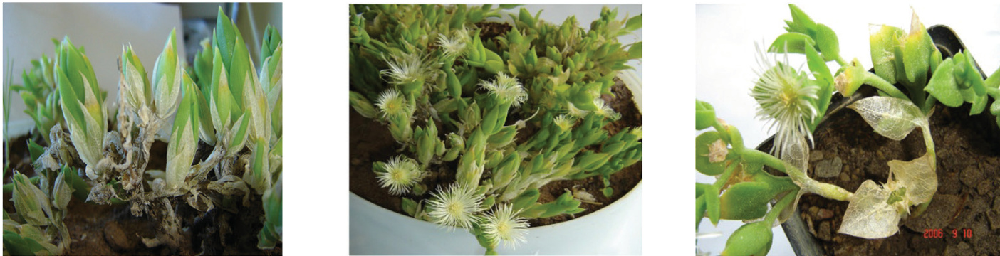
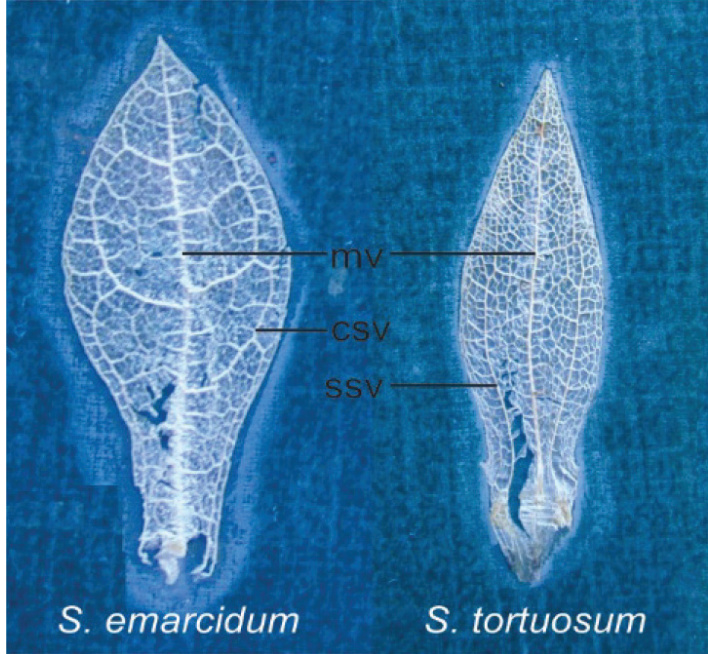
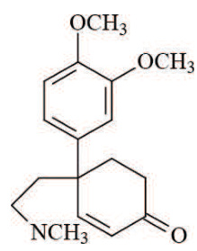
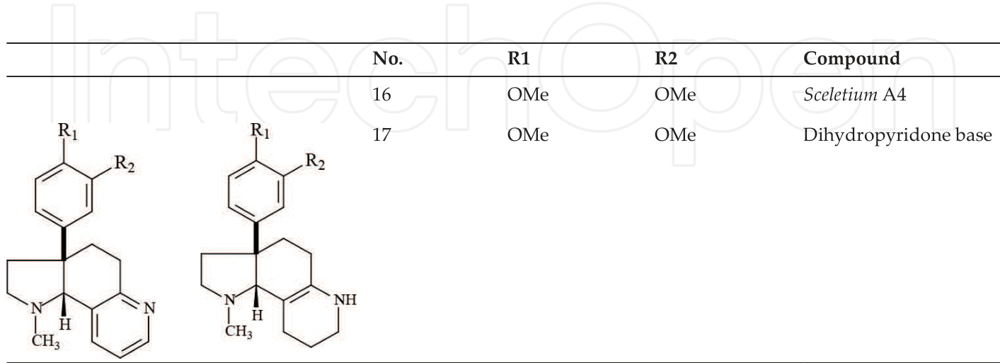
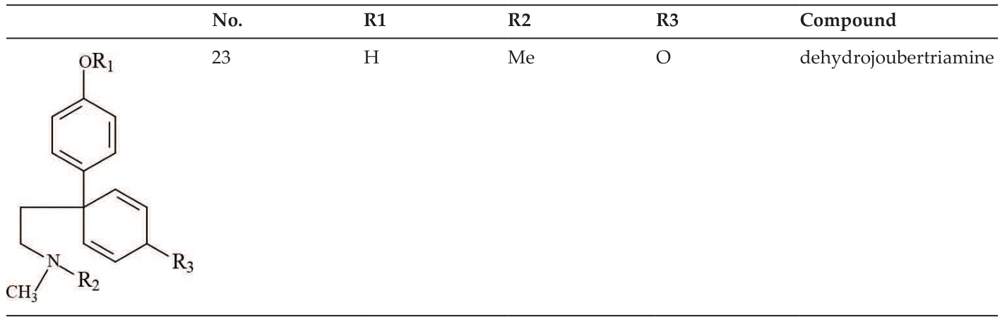
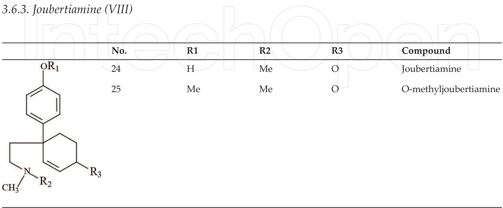
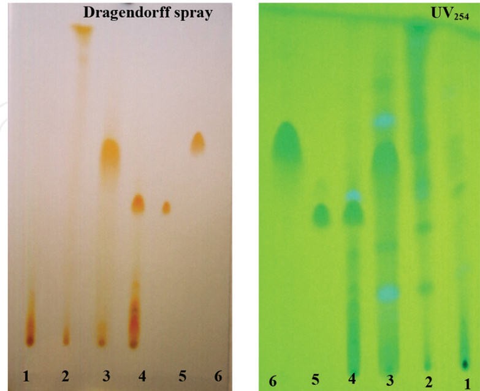
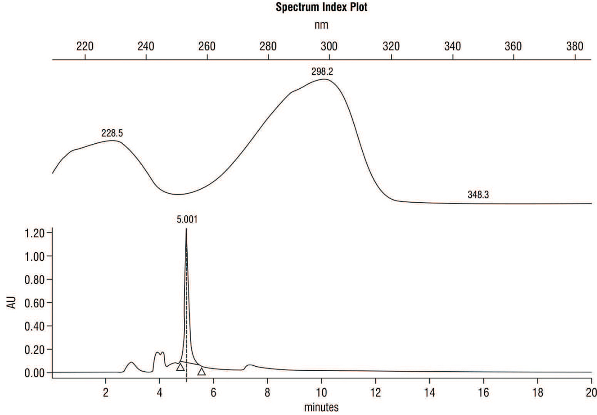
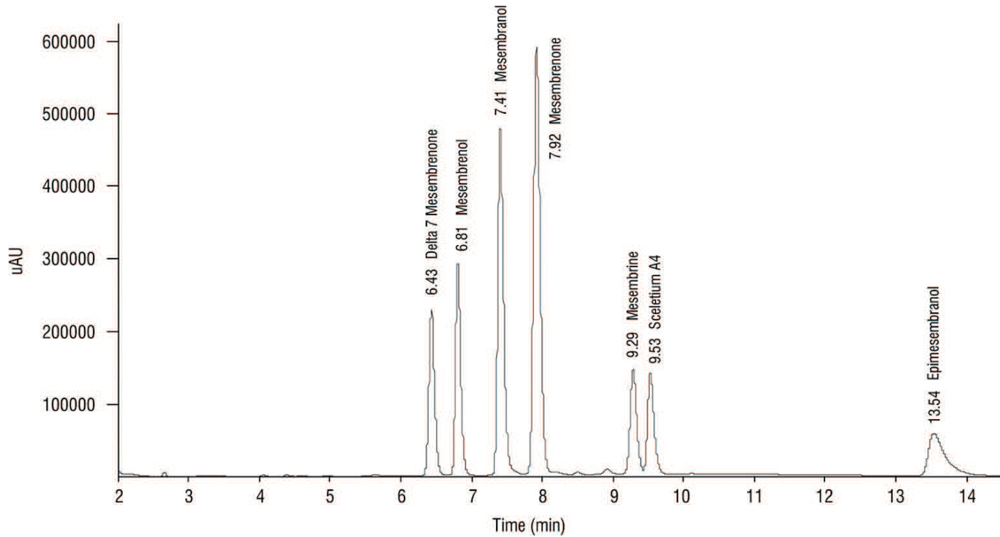

We are IntechOpen, the world’s leading publisher of Open Access books Built by scientists, for scientists

6,500 Open access books available

176,000 International  authors and editors

190M Downloads

154 Countries delivered to

Our authors are among the TOP 1% most cited scientists

12.2% Contributors from top 500 universities

WEBOFSCIENCETM

Selection of our books indexed in the Book Citation Index in Web of Science™ Core Collection (BKCI)

Interested in publishing with us? Contact book.department@intechopen.com

Numbers displayed above are based on latest data collected. For more information visit www.intechopen.com

n4

# Sceletium Plant Species: Alkaloidal Components, Chemistry and Ethnopharmacology

Srinivas Patnala and Isadore Kanfer

Additional information is available at the end of the chapter

http://dx.doi.org/10.5772/66482

## Abstract

The genus Sceletium, classified under the Aizoaceae family, is indigenous to the Western, Eastern and Northern Cape province of South Africa. There are currently eight reported species divided into two main “types” with five species in the tortuosum and three in the emarcidum type. It has been observed that, in general, mesembrine‐type alkaloids such as mesembrenol, $\Delta ^ { 7 }$ mesembrenone, mesembranol, mesembrenone, mesembrine and epime‐ sembranol as well as some non‐mesembrine type such as Sceletium A4, tortuosamine and joubertiamine occur in the tortuosum type; the emarcidum type is devoid of alkaloids. Morphological identification of species type presents a formidable challenge, where subtle differences are found in the secondary veins that branch off from the middle vein toward the leaf margin. In view of the fact that the plant contains a complex mixture of closely related compounds, in particular alkaloidal components, separation techniques and their application to evaluate specific chemical components are an important aspect which permits accurate characterization and quantification. In addition, the develop‐ ment of appropriate analytical methods for chemotaxonomic studies has provided valu‐ able information to confirm specific plant identity. Importantly, these methods are also required for the quality control of plant material used to manufacture complementary and traditional medicines containing Sceletium.

Keywords: Sceletium tortuosum, Sceletium emarcidum, alkaloids, mesembrine, chemotaxonomy, HPLC‐MS

### 1. Introduction and background

Sceletium alkaloids have been studied over a century when their presence was first reported in1896 and later by Zwicky in 1914. In a detailed study by Zwicky on about 40 species of the genus Mesembryanthemum, more than $5 0 \%$ of the plants tested positive for alkaloids. Due to this large number of species, the genus Mesembryanthemum was abandoned and some of the species were reassigned to genus Sceletium, family Aizoaceae [1].

These alkaloids, originating from Sceletium plants species, were widely found in the Western and Karoo regions of South Africa. The name Sceletium is derived from the Latin word Sceletus meaning skeleton. The derivation of the name is due to the prominent lignified leaf vein structure that is observed in dried leaves of this genus which give a skeletal appearance. Anecdotal evidence suggests that this plant is highly revered and held in great esteem by the tribes who collected and bartered it frequently in exchange for cattle and other commodities. Subsequently, the early Dutch colonists further showed commercial interest in this plant, and many plants of this family were also introduced to European cultivation [2].

The Sceletium plants can readily be identified by its persistent dry “skeletonized” leaves which enclose the young leaves during the dry season (Figure 1a), to protect them from adverse environmental conditions [3]. The specimens of two main types of Sceletium plants: Sceletium tortuosum and Sceletium emarcidum are depicted in Figure 1b and c, respectively.

  
Figure 1. (a) Skeletonized leaves of S. tortuosum. (b) Sceletium tortuosum. (c) Sceletium emarcidum (with skeletonized leaves).

#### 2. Sceletium species

Sceletium species occurs in the Eastern, Northern, Western Cape provinces of South Africa and the genus Sceletium, belongs to the family, Aizoaceae [1].

#### 2.1. Identification of Sceletium plant species

The specimens were studied and identified using the identification key of Gerbaulet [1]. Based on the identification key, the venation pattern which differs between species is one of the important taxonomic identification features.

There are currently eight reported species [3] of this genus, divided into two “types” with five species in the tortuosum type and three in emarcidum type as follows:

Tortuosum type: Sceletium tortuosum; Sceletium crassicaule; Sceletium strictum; Sceletium expan‐ sum and Sceletium varians.

Emarcidum type: Sceletium emarcidum; Sceletium exalatum and Sceletium rigidum.

The main differences are found in the secondary veins that branch off from the middle vein toward the leaf margin. Based on the venation type, the species is mainly classified as either emarcidum or tortuosum types (Figure 2). In the emarcidum type, the leaf is more flat and the dried leaf venation pattern shows a central main vein with the curved secondary vein which branches off the main vein, reaching the leaf margins.

In plants of the tortuosum type (Figure 2), the dry leaves are more concave and usually show about three to five or sometimes up to seven major parallel veins. The secondary veins run straight up to the apex on both sides of the middle vein.

  
Figure 2. Venation pattern of skeletonized leaves in Sceletium species. mv $\ c =$ middle vein, csv $\ c =$ curved secondary vein, ssv $\ c =$ straight secondary vein.

#### 3. Chemistry of Sceletium alkaloids

Preliminary studies on Sceletium were done by Meiring in 1896, suggesting that the presence of alkaloids and this was confirmed by Zwicky in 1914. Further studies on S. expansum and S. tortuosum reported by Zwicky in 1914, yielded a noncrystalline alkaloid which was named “mesembrin” with the reported molecular formula, $\mathrm { C _ { 1 6 } H _ { 1 9 } N O _ { 4 } }$ [4]. Rimington and Roets [5] reinvestigated this plant in 1937, and attempts to crystallize the alkaloid as a free base or hydrochloride salt were unsuccessful. In their experiments, they managed to obtain a crystal‐ line picrate and platinichloride from the methylated free base and the molecular formula was deduced based on combustion analysis. The molecular formula for “mesembrin” was reas‐ signed as ${ \mathrm { C } } _ { 1 7 } { \mathrm { H } } _ { 2 3 } { \mathrm { N O } } _ { 3 }$ and is presently known as mesembrine, suggesting that the molecule belonged to the tropane ester alkaloid group.

Bodendorf and Krieger [6], in their work in 1957, revisited the molecule and successfully crystallized the mesembrine base to its hydrochloride salt, along with isolation of two more bases, namely “mesembrinine,” presently known as mesembrenone, which has two hydro‐ gen atoms less, and the structure is closely related to mesembrine. The other base was called “channaine,” which was described as a phenolic base, and it was also reported that all these three compounds were purported to be optically inactive.

Popelak and Lettenbauer [7] in 1967 reported the incidence of Sceletium alkaloids in the plants they studied as 1 to $1 . 5 \%$ , which consisted of approximately $0 . 7 \%$ mesembrine and $0 . 2 \%$ “mesembrinine.” The structure of mesembrine, deduced from their study, was reported as $N \mathrm { . }$ ‐methyl $\cdot 3 \mathrm { a }$ ‐ $^ { 3 ^ { \prime } , 4 ^ { \prime } }$ ‐dimethoxyphenyl)‐6‐oxo‐cisoctahydroindole, which provided the founda‐ tion for continued studies on this group of alkaloids [4].

Jeffs et al in 1974 [8] worked further on S. namaquense and S. strictum and reported five new alkaloids, namely Sceletium alkaloid A4, N‐formyltortuosamine, $4 ^ { \prime }$ ‐O‐demethylmesembre‐ none, $\Delta ^ { 7 }$ mesembrenone and sceletenone. It was also reported that in a concurrent study by Wiechers et al on S. tortuosum, another base, tortuosamine, was isolated and had a close struc‐ tural relation to Sceletium alkaloid A4.

Arndt and Kruger in 1970 [9] reported three new alkaloids, joubertiamine, dihydrojouber‐ tiamine and dehydrojoubertiamine from S. joubertii, where their basic skeletons were bioge‐ netically closely related to mesembrane (Figure 3) and not related to the mesembrine—like of alkaloids. The above alkaloids were also isolated and reported in another Sceletium species, S. subvelutinum, by Herbert and Kattah 1990 [10].

Whereas the phytochemical content of Sceletium species has been studied since 1896 [4], the reported alkaloidal content has been constrained to tortuosum‐type species only, and related information on the emarcidum species has been conspicuously absent from the literature. However in 2013, Patnala and Kanfer reported the complete absence of mesembrine as well as other alkaloids usually found in the tortuosum type in their investigations involving three emarcidum species: S. emarcidum, S. exalatum and S. rigidum [11].

The alkaloids which have been isolated from Sceletium species are broadly classified into four structural classes. The major subgroup being the 3a‐aryl‐cis‐octahydroindole skeleton which is referred to as the mesembrine group (Table 1) which includes $\Delta ^ { 4 }$ series and $\Delta ^ { 7 }$ series based on the double bond at position 4–5 (Table 2) and 7–7a (Table 3), respectively. Sceletium alkaloid A4 (Table 4) constitutes the lone member of the second subgroup. The third subgroup is closely related to the second, which is the alkaloid, tortuosamine type (Table 5), and the fourth group is the joubertiamine type (Table 6), which is closely related to the mesembrine series [10].

Of the above subgroups, the mesembrine type is the largest, consisting of about 15 alkaloids. The class derives its name from mesembrine, which was the first structurally characterized alkaloid molecule [4].

  
Figure 3. Mesembrane.

The major alkaloid in mesembrine type is $( - )$ ‐mesembrine, reported to be present in up to $1 \%$ in S. namaquence and occurs as a partial racemate in S. strictum and S. tortuosum in smaller amounts [8]. The reported alkaloids in this subgroup are listed in Tables 1–3 [12].

#### 3.1. Mesembrine‐type (I)

Table 1. Mesembrine‐type (I) Sceletium alkaloids.   

<html><body><table><tr><td></td><td>No.</td><td></td><td></td><td>R3, R4 R3</td><td>R4</td><td>Compound</td></tr><tr><td>1</td><td>OMe</td><td>OMe</td><td>0</td><td></td><td></td><td>Mesembrine</td></tr><tr><td>2</td><td>OMe</td><td>OMe</td><td></td><td>OH</td><td>H</td><td>Mesembranol</td></tr><tr><td>3</td><td>OMe</td><td>OMe</td><td></td><td>H</td><td>OH</td><td>Epimesembranol</td></tr><tr><td>4</td><td>OMe</td><td>OMe</td><td></td><td>OAc</td><td>H</td><td>Mesembranol acetate</td></tr><tr><td>5</td><td>OH</td><td>OMe</td><td></td><td>OH</td><td>H</td><td>4'Demethyl mesembranol</td></tr><tr><td>6</td><td>OMe</td><td>OMe</td><td></td><td>OMe</td><td>H</td><td>Mesembranol methyl ether</td></tr><tr><td>7</td><td>OMe</td><td>OMe</td><td>H</td><td></td><td></td><td></td></tr></table></body></html>

#### 3.2. $\Delta ^ { 4 }$ Mesembrine‐type (II)

<html><body><table><tr><td>No.</td><td>R1</td><td>R2</td><td>R3,R4</td><td>R3</td><td>R4</td><td>Compound</td></tr><tr><td>8</td><td>OMe</td><td>OMe</td><td>0</td><td>1</td><td>1</td><td>Mesembrenone</td></tr><tr><td>9</td><td>OMe</td><td>OMe</td><td>1</td><td>OH</td><td>H</td><td>Mesembrenol</td></tr><tr><td>10</td><td>OMe</td><td>OMe</td><td>一</td><td>H</td><td>OH</td><td>6-Epimesembrenol</td></tr><tr><td>11</td><td>OMe</td><td>OMe</td><td>一</td><td>OAc</td><td>H</td><td>Mesembrenol acetate</td></tr><tr><td>12</td><td>OH</td><td>OMe</td><td>1</td><td>OMe</td><td>H</td><td>1</td></tr><tr><td>13</td><td>OMe</td><td>H</td><td>0</td><td>一</td><td></td><td>4'-O-methyl sceletenone</td></tr><tr><td>14</td><td>OH</td><td>H</td><td>0</td><td>一</td><td>一</td><td>Sceletenone</td></tr></table></body></html>

Table 2. Δ4Mesembrine‐type (II) Sceletium alkaloids.

#### 3.3. Δ⁷ Mesembrine‐type (III)

Table 3. $\Delta ^ { 7 }$ Mesembrine‐type (III) Sceletium alkaloid.   

<html><body><table><tr><td></td><td>No.</td><td>R1</td><td>R2</td><td>R3,R4</td><td>R3</td><td>R4</td><td>Compound</td></tr><tr><td>4' R1 R2</td><td>15</td><td>OMe</td><td>OMe</td><td>0</td><td>1</td><td>1</td><td>△Mesembrenone</td></tr></table></body></html>

#### 3.4. Sceletium A4 types (IV)

Table 4 depicts Sceletium A4 alkaloid (16) and is reported to occur in S. namaquense as an optically active crystalline base. The other reported alkaloid [8] which is closely related to this structure is a noncrystalline optically active compound mentioned as dihydropyridone base (17).

  
Table 4. Sceletium A4 type (IV) alkaloids.   
Table 5. Tortuosamine‐type (V) Sceletium alkaloids.

#### 3.5. Tortuosamine type (V)

The reported alkaloids (Table 5) in this subclass are tortuosamine (18), N‐formyltortuosamine (19) and N‐acetyltortuosamine (20). Tortuosamine, a noncrystalline optically active base, was isolated from S. tortuosum [8].

No. R1 R2 R3 Compound R1 18 OMe OMe H Tortuosamine 19 OMe OMe CHO N‐formyltortuosamine CH3 R3

#### 3.6. Joubertiamine types

These alkaloids are reported to occur principally in S. joubertii and have also been reported to occur in S. subvelutinum. These alkaloids are further classified as depicted in Tables 6–8 [8].

#### 3.6.1. Dihydrojoubertiamine (VI)

No. R1 R2 R3 Compound OR1 21 H Me O dihydrojoubertiamine 22 H Me Me O‐methyldihydrojoubertiamine R R2 CH

#### 3.6.2. Dehydrojoubertiamine (VII)

  
Table 6. Dihydrojoubertiamine‐type (VI) Sceletium alkaloids.

  
Table 7. Dehydrojoubertiamine‐type (VII) Sceletium alkaloid.   
Table 8. Joubertiamine‐type (VIII) Sceletium alkaloids.

<html><body><table><tr><td>Structure[21]</td><td>OCH3 OCH3</td><td></td><td></td><td>CH3 OCH3</td><td>OCH3</td><td>OCH OCH3</td><td>QCH DCH3</td><td></td><td>OCH3</td></tr><tr><td>Alkaloid</td><td></td><td>HCl</td><td></td><td></td><td>(-)-Mesembrine (-)-Mesembrine Mesembrenone △Mesembrenone Mesembrenol</td><td></td><td>(-)-Mesembranol Epimesembranol (-)-N-</td><td></td><td></td></tr><tr><td>MW</td><td>289.36</td><td>325.80</td><td>287.36</td><td></td><td>287.36</td><td></td><td>291.39</td><td>291.39</td><td>Demethylmesembranol</td></tr><tr><td>MF</td><td>C1H23NO3</td><td>C17H2NO3.HC1</td><td>C1HNO3</td><td></td><td>C1HNO3</td><td>C,H NO3</td><td>C17H25NO3</td><td>C2H25NO3</td><td>275.15 C1H23NO3</td></tr><tr><td>Description</td><td>Pale yellow viscous liquid</td><td>crystals</td><td>Needle-shaped Pale yellow</td><td>viscous liquid</td><td>Low melting solid Pale brown</td><td>crystalline</td><td>Cubic crystals</td><td>Pale brown oil</td><td></td></tr><tr><td>OR[a]20</td><td>-55.4° (MeOH)</td><td>-8.4° (MeOH)</td><td>racemic</td><td></td><td></td><td>powder</td><td>-32°(CHCl3),-30°-3.2° (C2HOH)+ -13° (C2H5OH)+</td><td></td><td></td></tr><tr><td>BP</td><td>*186-190℃</td><td></td><td></td><td></td><td></td><td></td><td></td><td></td><td></td></tr><tr><td>MP</td><td></td><td>205-206℃</td><td>+88-89℃</td><td>[4]</td><td></td><td>144-145℃</td><td></td><td></td><td>178-185℃</td></tr><tr><td>Reference</td><td>[4] *[13]</td><td>[4]</td><td>[4],*[7]</td><td></td><td></td><td>[4],*[7]</td><td>[4], *[7]</td><td></td><td>[4]</td></tr></table></body></html>

MW,Molecular weight;MF,molecularformula;OR,optical rotation;BP,boiling point;MPmelting point;MeOH,ethaol.   
Table9.Physicochemical characteristics of mesembrine-type Sceletium alkaloids.

Table 10. Physicochemical characteristics of some typical non‐mesembrine‐type Sceletium alkaloids.   

<html><body><table><tr><td>Structure OCH OH OCH CH</td><td>OCH 3 CH CH CH</td></tr><tr><td>Alkaloid Tortuosamine</td><td>Joubertiamine SceletiumA4 325.80 324.18</td></tr><tr><td>MW 326 MF C2H2NO2</td><td>C17H25NO3 C20H4N2O2</td></tr><tr><td>Description</td><td>Pale white semi-solid</td></tr><tr><td>OR[α]²</td><td>-32°(CHCl3)*, -30° (C2H5OH) + *+131°</td></tr><tr><td>BP</td><td>+153-154℃</td></tr><tr><td>MP References</td><td>*[4], +[7] *[4], +[8]</td></tr><tr><td colspan="2">[4] MW,Molecular weight; MF,molecular formula; OR,optical rotation; BP,boiling point; MP,melting point; MeOH,</td></tr></table></body></html>

The physicochemical characteristics of various Sceletium alkaloids—mesembrine‐type and non‐mesembrine‐type alkaloids are compiled in Tables 9 and 10.

#### 4. Extraction, isolation, synthesis and characterization of Sceletium alkaloids

Natural products are known to contain complex chemical components. Hence, it is essential that active components in such products are identified and analyzed by validated methods to ensure product quality. The development and validation of the requisite analytical method and procedures for QC can only be achieved by testing the product using qualified reference substances.

Several methods have been reported for the extraction and isolation of these alkaloids from Sceletium species. In 1937, Rimington and Roets [14] described their extraction procedure of Sceletium alkaloids, and subsequently in 1957, Bodendorf and Krieger [6] published a dif‐ ferent extraction procedures. Popelak and Lettenbauer, in 1967 [7], reported the isolation of some alkaloid bases along with mesembrine and mesembrinine and prepared their hydro‐ chloride salts. Arndt and Kruger [9] reported an extraction procedure of the aerial parts of Sceletium joubertii to obtain those relevant alkaloids.

Herbert and Kattah [10] in their biosynthesis study of alkaloids in Sceletium subvelutinum reported the isolation and purification of joubertiamine and related alkaloids. Jeffs et al. [8] reported the extraction of alkaloids from Sceletium namaquense which yielded mesembrine, mesembrenone, Sceletium A4, N‐formyltortuosamine, $\Delta ^ { 7 }$ mesembrenone, tortuosamine and some unidentified alkaloids. Smith et al. [15] extracted mesembrenol (Table 2, No. 9) {incor‐ rectly designated as $4 ^ { \prime }$ ‐O‐demethylmesembrenol and labeled (1) in their paper}, mesembrine and mesembrenone from Sceletium plant material. Gericke et al. [16] in their US patent appli‐ cation described the extraction of mesembrine‐type alkaloids with a yield of between 15 and $3 5 \mathrm { m g }$ per gram of “dry leaves.”

Subsequently, Patnala [17] developed a relatively simple and inexpensive extraction and iso‐ lation procedure for Sceletium alkaloids. In general, Sceletium plant powder was extracted using ethanol by soxhlet extraction followed by alcohol removal and acidification. Hexane was used to wash the acidic solution and the organic phase discarded. Subsequently, ammo‐ nia solution was used to neutralize and result in alkaline solution, and the latter was further extracted with dichloromethane (DCM). The DCM fractions were collected into a round‐ bottomed flask and evaporated under vacuum to yield a brown viscous liquid containing alkaloids. Following the separation of components by column chromatography, collected elu‐ ents were spotted on a TLC plate (Figure 4). The TLC plate was first observed under $\mathrm { U V } _ { 2 5 4 }$ which showed extensive related substances (acetone‐Track 3 and acetonitrile‐Track 4) and fur‐ ther sprayed with Dragendorff's reagent (Figure 4). The acetone fraction and the acetonitrile (ACN) fractions were found to contain alkaloids.

The ACN fraction was tested for its UV spectrum which showed a maximum at $2 9 8 . 2 \mathrm { n m }$ was found to be $\Delta ^ { 7 }$ mesembrenone (Figure 5), and this fraction was further purified by preparative TLC.

In view of the fact that Sceletium species contain complex mixtures of closely related alkaloi‐ dal components, appropriate analytical methods for their separation and identification are

  
Figure 4. TLC plate of the column fractions by developed TLC method observed under $\mathrm { U V } _ { 2 5 4 }$ and subsequently sprayed with Dragendorff's reagent for positive identification of alkaloids.

1.DCMfraction   
2.Acetone-1fraction   
3.Acetone-2fraction   
4.ACNfraction   
5.ACNfractionpurified   
6.Acetone-2purified

  
Figure 5. HPLC‐PDA of ACN fraction‐spectrum index plot (top) and chromatogram (bottom).

essential prerequisites for chemotaxonomic profiling of these species. Furthermore, the avail‐ ability of relevant alkaloid reference standards is also necessary including the use of an ana‐ lytical method with required specificity for fingerprinting. These foregoing considerations are essential to facilitate the proper identification of Sceletium species based on a chemotaxonomic approach [11].

#### 5. Development of analytical methodologies for identification and quality control (QC) of Sceletium plant material and associated products

#### 5.1. High‐performance liquid chromatography (HPLC)

Chromatographic fingerprinting has been widely accepted and recommended by various regulatory authorities such as WHO [18], US‐FDA [19] and EMEA [20] to assess the consis‐ tency of batch to batch dosage forms containing phytochemical components of the harvested plants. In the current international regulatory scenario, qualitative and quantitative analytical methods are considered mandatory.

Validated analytical methods to assay Sceletium plant material and dosage forms for relevant alkaloidal content were reported for the first time where a simple, accurate, precise, rapid and reproducible HPLC method was developed for the identification and quantitative analysis of five relevant Sceletium alkaloids, $\Delta ^ { 7 }$ mesembrenone, mesembranol, mesembrenone, mesem‐ brine and epimesembranol. This method has also been successfully used to study chemo‐ taxonomy of some Sceletium species and has provided impetus for the future development of quality monographs for plant and dosage forms containing Sceletium [21]. Subsequently, this method has been applied for the identification [22] and quantization of two additional alkaloids: Sceletium A4 and mesembrenol. Figure 6 illustrates the chromatographic profile of the above‐mentioned alkaloids.

  
Figure 6. HPLC chromatogram of relevant standard Sceletium alkaloids.

#### 5.2. LC‐MS/MS

Since a number of variables including species differences, harvesting time, growing condi‐ tions, storage and processing contribute to the variation in phytochemical components in plants, it is therefore necessary to use appropriate and specific analytical methods to ensure quality which may affect the safety and efficacy of products prepared from plant material [23]. In particular, with respect to the Sceletium plant species which contain closely related mesem‐ brine‐type compounds of which some are epimers and have isobaric chemistries [17], specific methods are necessary. Since HPLC using UV detection cannot discriminate between such compounds, detection by MS enhances the accuracy and specificity of the analytical method, thereby reducing the risk of using an inappropriate Sceletium species for the indications on the product label [22]. In addition, this method proved valuable to monitor the fermentation process of Sceletium plant material [24]. Hence, the current qualitative LCMS method, and concurrent application of the previously reported quantitative assay method [22], provides valuable analytical procedures for the identification and QC of Sceletium plant material and its dosage forms. The application of the LC‐ESI‐MS tandem mass spectroscopy provides unique fragmentation patterns which facilitates the identity of specific alkaloid in complex matrices and thus provides valuable confirmatory data for chemotaxonomic studies [11].

#### 5.3. Capillary zone electrophoresis (CZE)

Since alkaloids are relatively strong bases in general [25], they are good candidates for CE analysis. A CZE method was developed and validated and applied to fingerprint the presence of alkaloids in a marketed tablet product containing Sceletium plant material [26].

#### 6. Ethnopharmacology

The use of specific herbal medicines varies depending on specific regions and ethnopharma‐ cological experiences, which makes this form of treatment inconsistent. Safety and efficacy are major concerns due to poor documentation and a dearth of scientific research on this sub‐ ject. The World Health Organization (WHO) notes that of 119 plant‐derived pharmaceutical medicines, about $7 4 \%$ are used in modern medicine in ways that correlate directly with their traditional use as herbal medicines [27].

The traditional preparation of Sceletium known as “Kougoed” or “Channa” is a fermented prep‐ aration used by the native Bushmen of Namaqualand. Traditionally, its main use for its psy‐ choactive properties involved a prior fermentation by the Khoisan tribe of southern Africa, who purported that the psychoactive effect of this plant is greatly enhanced [2, 3]. Based on this perception, Sceletium plants and their products are marketed with claimed improve‐ ments in mood and reduction of anxiety, when the fermented plant material is used either by chewing or smoking. In general, the fermentation process involves crushing the whole plant material or aerial parts which are then placed in sealed containers for several days and dried under natural sunlight. Patnala [17, 24] subsequently confirmed that the fermentation process transforms mesembrine to $\Delta ^ { 7 }$ mesembrenone and requires an aqueous environment together with the presence of light to facilitate such a transformation.

#### 7. Biological activities and medicinal properties of Sceletium alkaloids

The study of the phytochemical composition of Sceletium was provoked as a result of anec‐ dotal information describing the use of these plants by early inhabitants of Southern Africa [28]. Typical examples of medicinal use have been described in the Ethnopharmacology sec‐ tion above. It can be gleaned from current scientific literature that several scientific groups working on various aspects of Sceletium plants have focused on the biological activity of these alkaloids [29]. It should be noted that antidepressant activity of mesembrine‐type alkaloids has been demonstrated in animal models, of which, where mesembrine has been the principal alkaloid. The antidepressant activity is reportedly based on selective inhibition of serotonin reuptake, and mesembrine has a weak narcotic effect [30]. A recent study indicates that high‐ mesembrine Sceletium extract is a monoamine releasing agent, rather than only a selective serotonin reuptake inhibitor [31]. Zembrin $\textsuperscript { \textregistered }$ a marketed product containing a standardized extract of Sceletium tortuosum has been studied using human volunteers for its acute effects in the brain, and its pharmacological activity and potential therapeutic effect are reported to be based on the inhibiting reuptake of 5‐HT and PDE4. It is suggested that a $2 5 \mathrm { m g }$ dose of Zembrin $\textcircled{8}$ has the potential of reducing anxiety in humans [32].

#### 8. Conclusions

Although eight Sceletium plant species have been formally classified in accordance with usual botanic taxonomy, we have observed the existence of various subspecies related to the tor‐ tuosum‐type plants. Furthermore, the identified alkaloidal constituents vary between each of these plant species. In the tortuosum‐type plants, mesembrenone (Table 2, No. 8), where the double bond occurs between C4‐5; Δ7mesembrenone (Table 3, No. 15), where the double bond occurs between C7‐7a; and the epimers, mesembranol and epimesembranol, clearly have closely related chemical structures. Hence, accurate identification and characterization is nec‐ essary to confirm the true identity of each species [22] in view of the close similarity between such chemical structures. such relevant information provides invaluable data to confirm the true identity of each species. These “tortuosum”‐type Sceletium species contain mesembrine as the major alkaloid along with other minor alkaloids, $\Delta ^ { 7 }$ mesembrenone, mesembrenone and mesembranol and clearly differ from the other species. However, a subspecies of tortuo‐ sum type, S. strictum contains mesembrenone as the major alkaloidal component alongside mesembrine [11]. The above‐mentioned information can be gleaned from published studies on Sceletium plants [17, 22, 24].

The advent and availability of modern instrumental techniques have provided valuable tools to identify differences between species based on phytochemical composition. Such approaches for taxonomical classification of plants and their species facilitate a superior and more accu‐ rate method which supersedes the classical techniques based on morphological aspects.

Although plants have been used for their medicinal properties for centuries relating back to biblical times, the interest and development of medicinal products containing plant material have grown exponentially where such products, often referred to a complementary medicines currently constitute and industry with sales of billions of dollars annually. However, there is growing concern relating to quality, safety and efficacy of such products where regulatory requirements relating to the provision of such necessary evidence currently leaves a lot to be desired and in instances have demonstrated undesirable risks to vulnerable users. Proper quality control requires the application of appropriate analytical techniques to assess the identity and quality of complementary medicines containing plant material. Quality control methods require access and availability to reference standards for each product which is mar‐ keted for medicinal use. As far as Sceletium‐based products are concerned, the information relating to isolation, identification, quantification and purification of individual alkaloidal compounds found in Sceletium species provides valuable data for use in the quality con‐ trol of medicines containing Sceletium plant material. While quality control is an essential component to ensure the quality of medicines, evidence of the safety and efficacy is further essential components, and it is important that such data are generated through clinical trials in humans. Furthermore, the absorption, distribution, metabolism and elimination (ADME) of administered products and associated kinetics should be studied. Such studies require the development and validation of appropriate analytical techniques to monitor the active ingredient(s) and the resulting metabolite(s) where applicable.

Modern instrumental methods such HPLC, LC‐MS, CZE and associated analytical technolo‐ gies have been invaluable in developing profiles for fingerprinting, identification and charac‐ terization of the relevant alkaloids and their specific plant associations as well as serving as an important tool for QC purposes of plant material and herbal medicines containing Sceletium. In addition, such techniques are also necessary to study the safety, efficacy, ADME and kinet‐ ics of medicinal products containing plant material.

Author details

Srinivas Patnala1 and Isadore Kanfer2, 3\*

\*Address all correspondence to: izzy.kanfer@gmail.com 1 Basic Sciences Research Centre, KLE University, Belgaum, India 2 Faculty of Pharmacy, Rhodes University, Grahamstown, South Africa 3 Leslie Dan Faculty of Pharmacy, University of Toronto, Toronto, ON, Canada

References

[1] Gerbaulet M. Revision of the genus Sceletium N.E.Br (Aizoaceae). Botanishce Jarhbücher 1996;118(1):9‐24.   
[2] Smith MT, Crouch NR, Gericke N, Hirst M. Phychoactive constituents of the genus Scele‐ tium N.E.Br. and other Mesembryanthemaceae: a review. Journal of Ethanopharmacology 1996;50:119‐130.   
[3] Smith GF, Chesselet P, van Jaarsveld EJ, Hartmann H, Hammer S, Van Wyk B‐E. Sceletium. Mesembs of the World. Pretoria: Briza Publications; 1998, p. 52.   
[4] Jeffs PW. Sceletium Alkaloids. In: Manske RHF, Rodrigo RGA (editors). The Alkaloids. New York: Academic Press, Inc; 1981, p. 1‐80.   
[5] Rimington C, Roets GCS. Notes upon the isolation of the alkaloidal constituent of the drug “Channa” or “Kougoed” (Mesebryanthemum anatomicum and M. tortuosum). Ondersteproot Journal of Veternary Science and Animal Industry 1937;9:187‐191.   
[6] Bodendorf K, Krieger W. On the alkaloids of  Mesembryanthemum tortuosum L. Archives Pharmacy 1957:290/62(10):441‐448.   
[7] Popelak A, Lattenbauer G. The Mesembrine Alkaloids. In: Manske RHF (editor). The Alkaloids. New York: Academic Press; 1967, p. 467‐481.   
[8] Jeffs PW, Capps T, Johnson DB, Karle JM, Martin NH, Rauckman B. Sceletium alkaloids. VI. Minor alkaloids of S. namaquense and S. strictum. Journal of Organic Chemistry 1974;39(18):2703‐2710.   
[9] Arndt RR, Kruger PEJ. Alkaloids from Sceletium joubertii.bol. The structure of jouber‐ tiamine and dehydrojoubertiamine. Tetrahedron Letters 1970;37:3237‐3240.   
[10] Herbert RB, Kattah AE. The biosynthesis of Sceletium alkaloids in Sceletium subveluti‐ num L. Bolus. Tetrahedron Letters 1990;46(20):7105‐7118.   
[11] Patnala S, Kanfer I. Chemotaxonomic studies of mesembrine‐type alkaloids in Sceletium plant species. South African Journal of Science 2013;109(3/4):882‐886.   
[12] Martin NH, Rosenthal D, Jeffs PW. Mass spectra of Sceltium alkaloids. Organic Mass Spectrometry 1976;11:1‐19.   
[13] Mesembrine. Merck Index. 13th edn. New Jersey: Merck Research Laboratories; 2001.   
[14] Rimington C, Roets GCS. Notes upon the isolation of the alkaloidal constituent of the drug “Channa” or “Kougoed” (Mesebryanthemum anatomicum and M. tortuosum). Ondersteproot Journal of Veterinary Science and Animal Industry 1937;9:187‐191.   
[15] Smith MT, Field CR, Crouch NR, Hirst M. The distribution of mesembrine alkaloids in selected TAXA of the mesembryanthemaceae and their modification in the sceletium derived ‘Kougoed’. Pharmaceutical Biology 1998;36(3):173‐179.   
[16] Gericke NP, Van Wyk B‐E. Pharmaceutical Compositions Containing Mesembrine and Related Compounds. In US Patent: Gericke NP and Van Wyk B‐E. 09/194,836 [US6,288,104B1]. 9‐11‐2006. South Africa; 1997.   
[17] Patnala S. Pharmaceutical Analysis and Quality of Complementary Medicines: Sceletium and Associated Products (Thesis). Grahamstown: Rhodes University; 2007.   
[18] General Guidelines for Methodologies on Research and Evaluation of Traditional Medicine. WHO/EDM/TRM/2000.1, Geneva: WHO; 2006; Annex1:21‐26. Available from: http://apps.who.int/iris/bitstream/10665/66783/1/WHO_EDM_TRM_2000.1.pdf [Accessed: 2016‐11‐05].   
[19] Guidelines for Dietary Supplements and Botanicals AOAC Official Methods of Analysis (2013) Appendix K, p. 2. Available from: http://www.eoma.aoac.org/app_k.pdf [Accessed: 2016‐08‐29].   
[20] Guideline on Specifications: Test Procedures and Acceptance Criteria for Herbal Substances, Herbal Preparations and Herbal Medicinal Products/Traditional Herbal Medicinal Products. 2006: EMEA/CVMP/815/00 Rev 1. European Medicines Agency (EMEA). Available from: http://www.ema.europa.eu/docs/en_GB/document_library/ Scientific_guideline/2009/09/WC500003393.pdf [Accessed: 2016‐08‐29].   
[21] Patnala S, Kanfer I. HPLC analysis of Mesembrine‐type alkaloids in Sceletium plant material used as an African traditional medicine. Journal of Pharmacy & Pharmaceutical Sciences 2010;13(4):558‐570.   
[22] Patnala S, Kanfer I. Medicinal use of Sceletium: Characterization of phytochemical compo‐ nents of Sceletium plant species using HPLC with UV and electrospray ionization—tandem mass spectroscopy. Journal of Pharmacy & Pharmaceutical Sciences 2015;18(4):414‐423.   
[23] Mauri P, Pietta P. Electrospray characterization of selected medicinal plant extracts. Journal of Pharmaceutical and Biomedical Analysis 2000;23(1):61‐68.   
[24] Patnala S, Kanfer I. Investigation of phytochemical content of Sceletium tortuosum following the preparation of “Kougoed” by fermentation of plant material. Journal of Ethnopharmacology 2009;121:86‐91.   
[25] Unger M. Capillary zone electrophoresis of alkaloids Influence of structure on electro‐ phoretic mobility. Journal of Chromatography A 1998;807:81‐87.   
[26] Patnala S, Kanfer I. A capillary zone electrophoresis method for the assay and quality control of mesembrine in Sceletium tablets. Journal of Pharmaceutical and Biomedical Analysis 2008;48:440‐446.   
[27] Cunningham AB. An Africa‐Wide Overview of Medicinal Plant Harvesting, Conservation and Health Care. In: Bodeker G, Bhat KKS, Burley J, Vantomme P (editors). Medicinal Plants for Forest Conservation and Health Care. Food and Agriculture Organization of the United Nations. p. 123. Available from http://www.fao.org/3/a‐w7261e.pdf [Accessed 2016‐10‐14].   
[28] Pappe L. An Enumeration of South African Indigenous Plants Used as Remedies by the Colonists of the Cape of Good Hope. In: Florae Capensis Medicae Prodromus. 3rd edn. Cape Town, South Africa: W Brittain; 1868. http://kanna‐info.com/history‐of‐kanna Accessed [2016‐12‐05]   
[29] Carpenter JM, Jourdan MK, Fountain EM, Ali Z, Abe N, Khan IA, Sufka KJ. The effects of Sceletium tortuosum (L.) N.E.Br. extract fraction in the chick anxiety‐depression model. Journal of Ethnopharmacology 2016;193:329‐332.   
[30] Smith C. The effects of Sceletium tortuosum in an in vivo model of psychological stress. Journal of Ethnopharmacology 2011;133:31‐36.   
[31] Coetzee DD, Lopez V, Smith C. High‐mesembrine Sceletium extract (Trimesemine™) is a monoamine releasing agent, rather than only a selective serotonin reuptake inhibitor. Journal of Ethnopharmacology 2016;177:111‐116.   
[32] Terburg DD, Syal S, Rosenberger LA, Heany S, Phillips N, Gericke N, Stein DJ, Honk JV. Acute effects of Sceletium tortuosum (Zembrin $\textsuperscript { \textregistered }$ ), a dual 5‐HT reuptake and PDE4 inhi‐ bitor, in the human Amygdala and its connection to the hypothalamus. Neuropsychpharma‐ cology 2013;38:2708‐2716.