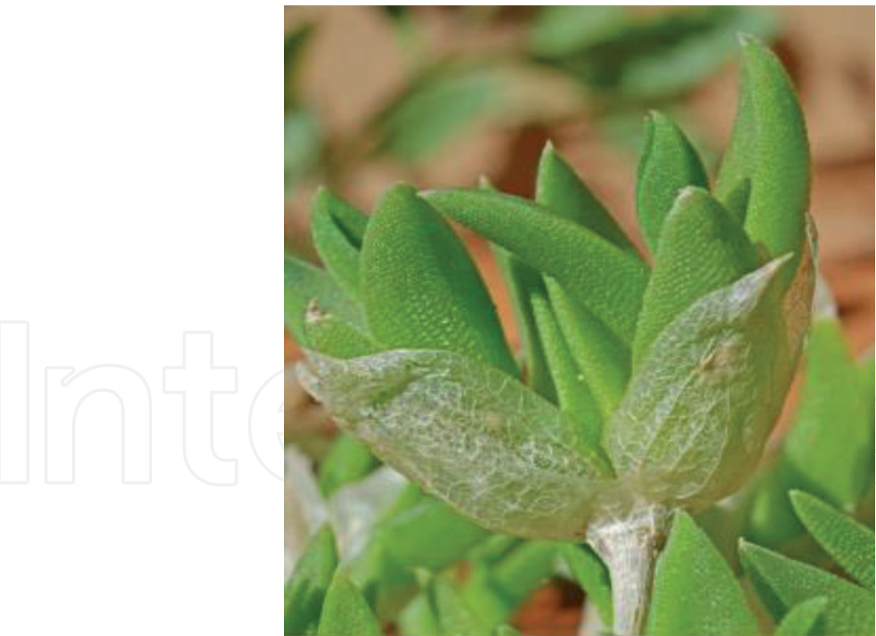
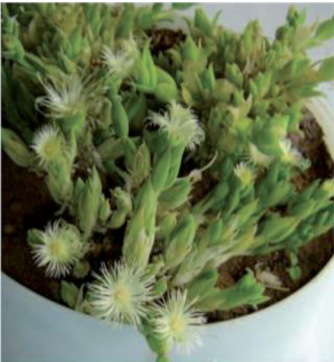
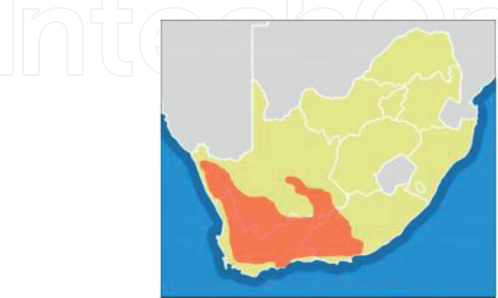
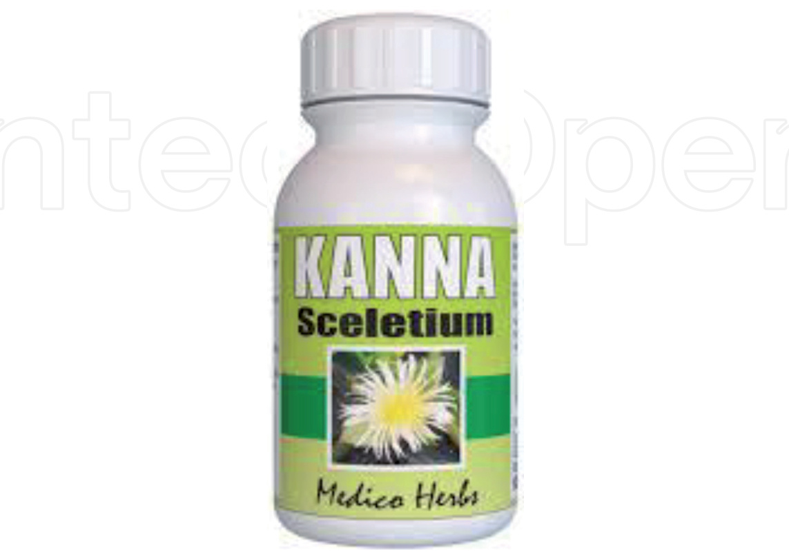

We are IntechOpen, the world’s leading publisher of Open Access books Built by scientists, for scientists

6,500 Open access books available

176,000 International  authors and editors

190M Downloads

154 Countries delivered to

Our authors are among the TOP 1% most cited scientists

12.2% Contributors from top 500 universities

WEB OF SCIENCETM

Selection of our books indexed in the Book Citation Index in Web of Science™ Core Collection (BKCI)

Interested in publishing with us? Contact book.department@intechopen.com

Numbers displayed above are based on latest data collected. For more information visit www.intechopen.com

n4

Chapter

# The Importance of Sceletium tortuosum (L.) N.E. Brown and Its Viability as a Traditional African Medicinal Plant

Richard James Faber, Charles Petrus Laubscher and Muhali Olaide Jimoh

## Abstract

Sceletium tortuosum is a succulent plant that belongs to the family Mesembryanthemaceae (Aizoaceae). It is indigenous to South Africa, where it is well known by the indigenous people, especially in Namaqualand where the plant is utilized regularly for its medicinal and psycho-active properties. The main alkaloids responsible for these properties are mesembrine, mesembrenine (mesembrenone), and mesembrenol. The potential of the plant to be an alternative supplement in the promotion of health and treating a variety of psychological and psychiatric disorders such as depression and anxiety has stimulated interest in its pharmacological property and possibility of its commercialization. The economic value of indigenous medicinal plants in South Africa is approximately $\mathrm { U S } \$ 60000000$ or $\mathtt { R 4 0 0 0 }$ 000 000 annually. Thus, interest in the knowledge and use of Traditional African Medicinal Plants (TAMP) as well as meeting pharmacological and economic needs of ever-increasing human population has led to the commercialization of traditional African medicines at a fast rate. It was found that S. tortuosum has clear pharmaceutical and economical importance and is one of the only known plants to contain the alkaloids mesembrenone and mesembrine which can be utilized for the promotion of health and/or treating a variety of psychological disorders such as anxiety and depression.

Keywords: African medicine, Aizoaceae, alkaloids, hydroponics, mesembrine, mesembrenine, mesembrenol, mesembryanthemaceae

### 1. Introduction

Sceletium tortuosum (L.) N.E. Br. and Sceletium expansum L. Bolus (formerly known as Mesembryanthemum tortuosum L. and Mesembryanthemum expansum L.) forms part of the succulent group of plants within the Mesembryanthemaceae family (Figure 1). The common names given to Sceletium are kanna and kougoed. However, some may argue that the name kougoed refers to the finished traditional preparation made by drying and fermenting the harvested plant material, which increases its stimulating effect. The plant is native to South Africa, where it is well known by the indigenous people, especially in Namaqualand, where the plant is utilized regularly for its medicinal and anti-depressant properties [2].

  
Figure 1. Sceletium plant and its “skeletonised appearance” of the dried leaves [1].

According to Schultes [3] and Harvey et al. [4] the main substances responsible for these properties are the alkaloids mesembrine, mesembrenine (mesembrenone), and mesembrenol. Interest in S. tortuosum has been growing for its potential to be an alternative supplement in the promotion of health and treating a variety of psychological and psychiatric disorders such as depression and anxiety [5]. Studies on the chemistry and biological activity on Traditional African Medicinal Plants (TAMP) have only recently (1997–2008) been published, despite TAMP having been reported as one of the oldest medicinal systems in various ethnobotanical reports [6, 7].

Soilless culture systems (SCS’s) in controlled greenhouse environments have proven to be the most effective strategy for agricultural production by providing flexibility as well as control. Crops can be produced in and out of season, while water and soilless media can easily be monitored for its total nutrient status. For these reasons SCS’s within a greenhouse environment provide for high quality products and high yields, even in places where environmental conditions would not usually permit [8].

Relevant natural compounds, mainly secondary metabolite concentration and composition, determine the quality of medicinal plants. However, water availability, light intensity and temperature are examples of various environmental conditions which affect the quality and quantity of such secondary metabolites [9]. Hence, investigating the effect of different soilless growing media and fertigation regimes on the vegetative growth and alkaloid concentration of S. tortuosum will contribute to developing optimal growing protocols for cultivating high quality medicinal plants in hydroponics for the ethno-pharmaceutical industry. The aim of this chapter was therefore, to highlight pharmaceutical and economic viability of S. tortuosum and relate the medicinal value of the plant with respect to the bioactive compound found in it and suggest ways of cultivating the plant in a soilless systems.

The Importance of Sceletium tortuosum (L.) N.E. Brown and Its Viability as a Traditional… DOI: http://dx.doi.org/10.5772/intechopen.96473

#### 2. Mesembryanthemaceae FENZL: a sub family of Aizoaceae

Within the family Aizoaceae Martinov. there are currently four sub-families, namely Sesuvioideae, Aizooideae, Ruschioideae, and Mesembryanthemoideae [10, 11]. Succulent plants within the Aizoaceae family are popularly termed “Mesembs”, and sometimes placed in their own family, the Mesembryanthemaceae [2]. Common terms used to describe this group of succulent plants are vygies, fig-marigolds, flowering-stones, ice plants and, midday flowers, among others. These plants fascinate many plant enthusiasts and have become popular collector’s items due to their remarkable variation in leaf architecture, flower color and form, and fruit structure (Figure 2). Different genera within the family grow in various habitats, and examples can thus be found growing in rocky crevices, silty flats and in saline wastelands. Mesembs occur mainly in south-western Africa, including Angola, South Africa, Zimbabwe, Botswana and Namibia [2, 12] (Figure 3).

  
Figure 2. Sceletium tortuosum plant surrounded by its white flowers [13].   
Figure 3. Geographical map indicating the distribution of Sceletium in South Africa (redrawn by Gerike & Viljoen [1]).

This family has received a large amount of attention in the present century both in herbaria collections and in the field. There are several reasons why the family is important in the ecosystems where they occur: they stabilize soil, which prevents erosion; various insects are catered for year-round by their blossoms, while some leaves serve as fodder for livestock. Apart from its ecological importance, this group of plants also has ethnobotanical value, and is used in making soap, poultices, preserves and also in some cases can serve as a type of psycho-active stimulant [2] (Figure 2).

#### 3. The genus Sceletium (L.) N.E. BR.

S. tortuosum (L.) N.E. Br. and S. expansum L. Bolus (formerly known as Mesembryanthemum tortuosum L. and Mesembryanthemum expansum L.) forms part of the succulent group of plants within the Mesembryanthemaceae family. The name Sceletium is derived from the Latin word sceletus, or skeleton in English, due to the noticeable leaf veins resembling skeleton-like structures within dried leaves of the plants. Sceletium spp. are easily identified by this skeletonised structure of the leaves [2, 10]. The common names given to Sceletium are kanna and kougoed. However some may argue that the name kougoed refers to the finished traditional preparation made by drying and fermenting the harvested plant material, which increases its psychoactive effect [2, 14] (Figure 4).

Strong evidence suggest that the indigenous people of southern Africa used one or both Sceletium species as a vision-inducing narcotic. However, the hallucinogenic effect of kanna/kougoed could have been confused with other intoxicating plants such as Cannabis spp. or Sclerocarya spp. as the narcotic use of the plant was never observed directly. Despite this, alkaloids possessing sedative, cocaine-like effects have been found within both of these species of Sceletium [3]. Other known species of Sceletium include the following: S. crassicaule L. Bolus, S. exalatum Gerbaulet, S. expansum L. Bolus, S. rigidum L. Bolus, S. strictum L. Bolus, and S. varians (Haw.) Gerbaulet [2, 10].

  
Figure 4. A commercial product by medico herbs containing dried S. tortuosum in capsules (https://medicoherbs.com/ products/kanna-capsules-60).

The Importance of Sceletium tortuosum (L.) N.E. Brown and Its Viability as a Traditional… DOI: http://dx.doi.org/10.5772/intechopen.96473

PhyieFore155SCELETIUMoAuahnitKrWTia

Figure 5. A commercial product by Phyto force containing tinctured S. tortuousm (https://www.phyto-force.co.za/produ ct/Sceletium/).

S. tortuosum is now considered a medicinal crop plant and is classified as mind-altering, sedative, euphoric, and not hallucinogenic [14, 15]. The alkaloids responsible for these psychoactive properties are mesembrine and mesembrenone. However, the concentration of alkaloids within individual plants may vary depending on their chemotype. Uses of the plant include the treatment of anxiety, stress, nervous tension, alcohol addiction, colic in infants and for suppressing hunger and thirst (Figure 5). With clear ethno-pharmaceutical value it is also worthy to mention that the use of S. tortuosum develops no physical or psychological dependency [15].

#### 4. Relevance of traditional African medicinal plants

Interest in the knowledge and use of Traditional African Medicinal Plants (TAMP) as well as an ever-increasing human population has led to the commercialization of traditional African medicines at a fast rate [16]. As stated in Keirungi and Fabricius [17], the economic value of indigenous medicinal plants in South Africa is approximately $\mathrm { U S } \$ 60000000$ or R4 000 000 000 annually. The number of people in South Africa that depend on TAMP to aid their medical needs is estimated at 27 million [18]. The majority of plants used for traditional medicine are harvested from the wild except for some which are selected and cultivated by traditional healers [19].

In 1998 it was estimated that 20 000 tonnes of plant material were being traded in South African markets [20]. Seven hundred thousand tonnes of plant material have been extracted from the wild for this market which mostly consist of people with disadvantaged socio-economic situations or backgrounds [21]. As stated in Makunga et al. [21], $\mathrm { U S } \$ 50 – 100$ million in the form of approximately 1000 plant species are being exchanged in this informal sector.

#### 5. Secondary metabolites and alkaloids

Plant secondary metabolites are divided into three categories, namely terpenoids, flavonoids, and alkaloids. Consisting of multiple chemical structures and biological activities, secondary metabolites are an extremely wealthy source of compounds and are utilized in pharmaceutical, nutraceutical, cosmetic and fine chemical industries. Examples of familiar natural plant products that are used as drugs and/or dietary supplements are: artemisinin, paclitaxel, ginsenoside, lycopene, and resveratrol [22]. Secondary metabolites play a major role in plants’ adaptation to their environment and are thought to be responsible for antimicrobial and anti-viral activities exhibited by plants [23, 24]. Apart from protecting plants against leaf damage instigated by the incident light intensity via ultra-violet trapping mechanisms, they cause allelopathy, antipathogens and antifeeding mechanisms in plants [25–27].

Alkaloids are potent secondary metabolites that consist of one or several nitrogen (N) atoms in their molecular structure. There are approximately 20 000 alkaloid structures that have been described and are classified according to their molecular ring (heterocyclic) structure. There are different types of mesembrine alkaloids in Sceletium species. Among these are; (3aS,7aS)-3a-(3,4- dimethoxyphenyl)-1-methylhexahydro-1H-indol-6(2H)-one; (3aR,7aS)-3a-(3,4- dimethoxyphenyl)-1-methyl-3,3a,7,7a-tetrahydro-1H-indol-6(2H)-one; (3aS,6 R,7aS) − 3a-(3,4-dimethoxyphenyl) − 1-methyloctahydro-1H-indol-6-ol; and (3aR,6S,7aS)-3a-(3,4-dimethoxyphenyl)-1-methyl-2,3,3a,6,7,7a-hexahydro-1Hindol-6-ol [28, 29]. These groups are indole, isoquinoline, quinolone, tropane, pyrrolizidine and quinolizidine alkaloids. Some alkaloids are neurotoxins and/or mind-altering substances. Most have pharmacological or toxicological relevance, and many isolated alkaloids serve as therapeutic agents in medicine [16]. Alkaloids confer several biological effects on plants such as stimulants (caffeine and ephedrine), antitussive (codeine), pain killer (morphine), anti-malarial (quinine), aphrodisiac (yohimbine), phosphodiesterase inhibitor (papaverine), antiarrhythmic (ajmaline), anti-gouty arthritis (colchicines), anti-rheumatic pains (capsaicin), antiglaucoma (pilocarpine) and anti-psoriasis berberine [30–32].

Like section Ganymedes (Narcissus pallidulus and Narcissus triandrus) within Amaryllidaceae family, Sceletium is one of the few plant genera containing mesembrine alkaloids [33, 34]. According to Krstenansky [29], not all Sceletium species have been reported to contain mesembrine alkaloids. While species like S. tortuosum, S. anatomicum, S. crassicaule, S. expansum, S. namaquense and S. strictum have been reported to contain mesembrinated, the status of S. archeri, S. emarcidum, S. exalatum, S. joubertii, S. rigidum, S. varians and S. subvelutinum in terms of mesembrine alkaloids is not yet confirmed [29, 35].

#### 6. Soilless culture

Soilless culture, also known as hydroponics and/or hydroculture is the term that is used when methods of growing plants without soil is utilized. Artificial or soilless substrate may or may not be used to provide structural support for the plants depending on the grower and method used [36].

Ecological imbalances such as extreme temperatures, chemical toxicity and oxidative stress are threatening conventional agricultural practices. With an annual rise in population and consumers becoming more aware of the quality, quantity and nutritious value of products consumed, challenges within agricultural systems to keep up with demands and standards are becoming more complex. The need for more efficient and controlled cultivation methods have risen dramatically. Soilless

The Importance of Sceletium tortuosum (L.) N.E. Brown and Its Viability as a Traditional… DOI: http://dx.doi.org/10.5772/intechopen.96473

culture  systems have been proved to be one of the most efficient and effective cultivation method in the agriculture industry of today [8].

#### 7. Electrical conductivity and nutrients

Serving as indicators for soil fertility, nutrient concentrations within soil have been of interest for decades. Nutrients can be organic or inorganic. Availability, utilization, translocation and absorption of nutrients by crop plants for growth and development are referred to as mineral nutrition. Plants require a variety of nutrients in order to successfully grow and develop to their full potential. The most important mineral nutrients are the macro nutrients, namely nitrogen, phosphorous and potassium, although plants also require micro-nutrients in smaller amounts which can be argued to be equally important [37].

Plants require nitrogen (N) in the largest quantities compared to other elements N serves as a constituent for many plant cell components such as, amino acids, proteins and nucleic acids. When there is a lack of N availability to a plant, the plants growth will be inhibited rapidly, followed by the common characteristic symptom, chlorosis in older leaves [38, 39]. Phosphorous (P) serves as an integral component of valuable compounds found in plant cells. These include phospholipids as well as sugar-phosphate intermediates of respiration and photosynthesis. Necrotic spots, dark-green colouration of leaves, which could also become malformed, as well as rapid malfunctioning of photosynthetic apparatus and stunted growth are common characteristic symptoms of P deficiency [39, 40].

Furthermore, various enzymes that are important in respiration and photosynthesis are activated by potassium (K). The osmotic potential of plant cells are also partly regulated by K. Marginal chlorosis of leaves, which further develops into necrosis of leaf tips or margins and in between veins is the most common symptom of K deficiency in plants [39, 41]. Likewise, cell wall synthesis and mitotic cell division depend on the availability of calcium (Ca) ions. Normal functioning of plant membranes and various plant responses to environmental and hormonal signals require Ca. Necrosis of young meristematic regions where cell division and cell wall formation is most prominent is a characteristic symptom of Ca deficiency [39, 42]. Also, cystine, cysteine, and methionine are amino acids in which sulfur (S) is found. Sulfur is also a constituent of a number of co-enzymes and vitamins, namely coenzyme A, S-adenosylmethionine, biotin, Vitamin B1 and pantothenic acid, which are all essential for optimal metabolism in plant cells [39, 43].

Electrical conductivity (EC) is the measurement used to indicate the total concentration of nutrients within an aqueous solution. High EC indicates a high concentration of nutrients within the solution, while a low EC indicates a low concentration of nutrients [44]. When plants are supplied with a high EC nutrient solution, the nutrient concentration within the leaves will not necessarily be higher than in plants supplied with a low EC nutrient solution [45], suggesting that the nutrient uptake in plants is not necessarily based on the amount of nutrients available.

#### 8. Water amounts

Production of plants in the modern sense requires advancements in technology that will allow the optimization of cultivating high quality plant material while minimizing the use of natural resources, such as water [46]. This is also true for the growing of medicinal and aromatic plants, as well as plant production in general [47].

South African agriculture faces increasing pressure to use water more efficiently, as the industry must oblige to demonstrate efficient and effective water use due to limited valuable natural resources [48]. The role of irrigated farming in the livelihood of a nation cannot be underscored. In South Africa in particular, agricultural sector uses the highest volume of water compared to other sectors. To increase the amount of water needed in other critical sector of the economy, there is the need to improve on water use efficiency during irrigation through reduced water consumption without compromising yield. Regrettably, the concept of irrigation efficiency is often misinterpreted leading to the general belief that water just evaporates with minimal irrigation efficiencies and re-emerges with significant progress in agricultural productivity [49]. This necessitated the emergence of the South African water management framework which oversees holistically, the water source, the irrigation farm, bulk conveyance system and the irrigation scheme to ensure water balance across all sectors [49].

It has been observed that a considerably higher concentration of secondary metabolites are produced in medicinal or spice plants grown under water deficient conditions, compared to identical plants of the same species grown with ample amounts of water [50]. Although changes in the synthesis of desired natural compounds is clear when drought stress is applied to plants, the overall effect of applying drought stress for optimizing specific secondary metabolites in plants remains complex. The amount of water also influences other relevant factors such as plant biomass yield and rate of growth. Depending on the plant and the growers’ desired outcome with regards to quality, quantity, and rate of growth, the amount of water applied should be carefully considered as there is no prevalent recommendation that can be made for all plants. By deliberately applying drought-stress without first thoroughly investigating how different plants react to different amounts of water and the method of applying it could yield undesirable results [51].

#### 9. Conclusion

Sceletium tortuosum is indigenous to South Africa. It is one of the very few plants known to contain highly sought after mesembrine alkaloids. Its potential as an alternative supplement in the promotion of health and treating a variety of psychological and psychiatric disorders such as depression and anxiety has stimulated interest in its pharmacological property and possibility of its commercialization. Therefore, meeting pharmacological and economic needs of ever-increasing human population necessitates the use of efficient systems such as hydroponics which require minimum use of land and environmental factors can be maximally controlled to cultivate the plant for optimal yield.

#### Author details

Richard James Faber, Charles Petrus Laubscher\* and Muhali Olaide Jimoh Department of Horticultural Sciences, Faculty of Applied Sciences, Cape Peninsula University of Technology, City of Cape Town, South Africa

\*Address all correspondence to: laubscherc@cput.ac.za

#### lntechOpen

$\textcircled{1}$ 2021 The Author(s). Licensee IntechOpen. This chapter is distributed under the terms of the Creative Commons Attribution License (http://creativecommons.org/licenses/ by/3.0), which permits unrestricted use, distribution, and reproduction in any medium, provided the original work is properly cited.

The Importance of Sceletium tortuosum (L.) N.E. Brown and Its Viability as a Traditional… DOI: http://dx.doi.org/10.5772/intechopen.96473

#### References

[1] Gericke, N. and Viljoen, A.M., 2008. Sceletium—a review update. Journal of Ethnopharmacology, 119(3), pp.653-663.

[2] Smith, G.F., Chesselet, P., van Jaarsveld, E.J., Hartmann, H., Hammer, S., van Wyk, B.-E., Burgoyne, P., Klak, C., Kurzweil, H., 1998. Mesembs of the World, 1st ed. Briza Publications, Pretoria, South Africa.

[3] Schultes, R.E., 1976. Hallucinogenic Plants. Golden Press, New York.

[4] Harvey, A.L., Young, L.C., Viljoen, A.M., Gericke, N.P., 2011. Pharmacological actions of the South African medicinal and functional food plant Sceletium tortuosum and its principal alkaloids. J. Ethnopharmacol. https://doi.org/10.1016/j.jep.2011.07.035 [5] Gericke, O., Gericke, N., Stein, D.J., 2017. Sceletium tortuosum, in: Complementary and Integrative Treatments. pp. 195-199.

[6] Lombard, N., van Wyk, B.E., Marianne le Roux, M., 2020. A review of the ethnobotany, contemporary uses, chemistry and pharmacology of the genus Thesium (Santalaceae). J. Ethnopharmacol. 256, 112745. https:// doi.org/10.1016/j.jep.2020.112745

[7] van Wyk, B.E., Oudtshoorn, B. van, Gericke, N., 1997. Medicinal plants of South Africa., Medicinal plants of South Africa. Briza.

[8] Agung Putra, P., Yuliando, H., 2015. Soilless Culture System to Support Water Use Efficiency and Product Quality : a Review. Agric. Agric. Sci. Procedia 3, 283-288. https://doi. org/10.1016/j.aaspro.2015.01.054

[9] Kleinwächter, M., Paulsen, J., Bloem, E., Schnug, E., Selmar, D., 2014. Moderate drought and signal transducer induced biosynthesis of relevant secondary metabolites in thyme (Thymus vulgaris), greater celandine (Chelidonium majus) and parsley (Petroselinum crispum). Ind. Crop. Prod. 64, 158-166. https://doi. org/10.1016/j.indcrop.2014.10.062

[10] Klak, C., Bruyns, P. V, Hedderson, T. a J., 2007. A phylogeny and new classification for Mesembryanthemoideae (Aizoaceae). Taxon 56, 737-756. https://doi. org/10.2307/25065858

[11] Klak, C., Hanáček, P., Bruyns, P. V., 2017. Out of southern Africa: Origin, biogeography and age of the Aizooideae (Aizoaceae). Mol. Phylogenet. Evol. 109, 203-216. https://doi.org/10.1016/j. ympev.2016.12.016

[12] Hartmann, H.E.K., 2001. Illustrated Handbook of Succulent Plants: Aizoaceae A-E; Aizoaceae F-Z. Springer, Berlin.

[13] Patnala, S. and Kanfer, I., 2017. Sceletium plant species: alkaloidal components, chemistry and ethnopharmacology. Alkaloids: alternatives in synthesis, modification and application. London: Intech Ltd, pp.85-101.

[14] Van Wyk, B., Wink, M., 2012.   
Medicinal Plants of The World, 5th ed.   
Briza, Pretoria.

[15] van Wyk, B.-E., Wink, M., 2015. Phytomedicines, Herbal Drugs, and Plant Poisons, 1st ed. Briza Publications, Pretoria.

[16] Wink, M., van Wyk, B.-E., 2008. Mind-altering & Poisonous Plants of the World, 1st ed. Briza Publications, Pretoria, South Africa.

[17] Keirungi, J., Fabricius, C., 2005. Selecting medicinal plants for cultivation at Nqabara on the Eastern Cape Wild Coast, South Africa. S. Afr. J. Sci. 101, 497-501.

[18] Fennell, C.W., Light, M.E., Sparg, S.G., Stafford, G.I., Van Staden, J., 2004 Assessing African medicinal plants for efficacy and safety: Agricultural and storage practices. J. Ethnopharmacol. 95, 113-121. https://doi.org/10.1016/j. jep.2004.05.025

[19] van Andel, T., Havinga, R., 2008. Sustainability aspects of commercial medicinal plant harvesting in Suriname. For. Ecol. Manage. 256, 1540-1545. https://doi.org/10.1016/j. foreco.2008.06.031

[20] Mander, M., 1998. Marketing of indigenous medicinal plants in South Africa: a case study in KwaZulu-Natal.

[21] Makunga, N.P., Philander, L.E., Smith, M., 2008. Current perspectives on an emerging formal natural products sector in South Africa. J. Ethnopharmacol. 119, 365-375. https:// doi.org/10.1016/j.jep.2008.07.020

[22] Song, M.C., Kim, E.J., Kim, E., Rathwell, K., Nam, S., Yoon, Y.J., 2014. Microbial biosynthesis of medicinally important plant secondary metabolites. Nat. Prod. Rep. 00, 1-13. https://doi. org/10.1039/C4NP00057A

[23] Jimoh, M.O., Afolayan, A.J., Lewu, F.B., 2020. Toxicity and Antimicrobial Activities of Amaranthus caudatus L. (Amaranthaceae) Harvested From Formulated Soils at Different Growth Stages. J. Evidence-Based Integr. Med. 25, 1-11. https://doi. org/10.1177/2515690X20971578

[24] Kapewangolo, P., Tawha, T., Nawinda, T., Knott, M., Hans, R., 2016. Sceletium tortuosum demonstrates in vitro anti-HIV and free radical scavenging activity. South African J. Bot. 106, 140-143. https://doi.org/10.1016/j. sajb.2016.06.009

[25] Bourgaud, F., Gravot, A., Milesi, S., Gontier, E., 2001. Production of plant secondary metabolites: A historical perspective. Plant Sci. 161, 839-851. https://doi.org/10.1016/ S0168-9452(01)00490-3

[26] Faber, R.J., Laubscher, C.P., Rautenbach, F., Jimoh, M.O., 2020. Variabilities in alkaloid concentration of Sceletium tortuosum ( L .) N . E . Br in response to different soilless growing media and fertigation regimes in hydroponics. Heliyon 6, e05479. https:// doi.org/10.1016/j.heliyon.2020.e05479 [27] Xie, C.-F., Lou, H.-X., 2009. Secondary Metabolites in Bryophytes: An Ecological Aspect. Chem. Biodivers. 6, 303-312. https://doi.org/10.1002/ chin.200921266

[28] Jeffs, P.W., Ahmann, G., Campbell, H.F., Farrier, D.S., Ganguli, G., Hawks, R.L., 1970. Alkaloids of Sceletium Species.1 III.2 the Structures of Four New Alkaloids from S. Strictum. J. Org. Chem. 35, 3512-3518. https://doi. org/10.1021/jo00835a071

[29] Krstenansky, J.L., 2017. Mesembrine alkaloids: Review of their occurrence, chemistry, and pharmacology. J. Ethnopharmacol. https://doi. org/10.1016/j.jep.2016.12.004

[30] Jimoh, M.O., Afolayan, A.J., Lewu, F.B., 2019. Antioxidant and phytochemical activities of Amaranthus caudatus L . harvested from different soils at various growth stages. Sci. Rep. 9, 12965. https://doi.org/10.1038/ s41598-019-49276-w

[31] Olatunji, T.L., Afolayan, A.J., 2019. Comparison of nutritional, antioxidant vitamins and capsaicin contents in Capsicum annuum and C. frutescens. Int. J. Veg. Sci. 18, 1-18. https://doi.org/1 0.1080/19315260.2019.1629519

[32] Wink, M., Alfermann, A.W., Franke, R., B, W., Distl, M., Windhovel, J., Krohn, O., Fuss, E., Garden, H

The Importance of Sceletium tortuosum (L.) N.E. Brown and Its Viability as a Traditional… DOI: http://dx.doi.org/10.5772/intechopen.96473

Mohagheghzaden, A., Wildi, E., Ripplinger, P., 2005. Sustainable bioproduction of phytochemicals by plant in vitro cultures: anticancer agents. Plant Genet. Resour. 3, 90-100.

[33] Berkov, S., Osorio, E., Viladomat, F., Bastida, J., 2020. Chemodiversity, chemotaxonomy and chemoecology of Amaryllidaceae alkaloids, in: Alkaloids: Chemistry and Biology. Academic Press Inc., pp. 113-185. https://doi. org/10.1016/bs.alkal.2019.10.002

[34] Pigni, N.B., Ríos-Ruiz, S., Luque, F.J., Viladomat, F., Codina, C., Bastida, J., 2013. Wild daffodils of the section Ganymedes from the Iberian Peninsula as a source of mesembrane alkaloids. Phytochemistry 95, 384-393. https://doi. org/10.1016/j.phytochem.2013.07.010 [35] Patnala, S., Kanfer, I., 2013. Chemotaxonomic studies of mesembrine-type alkaloids in Sceletium plant species. S. Afr. J. Sci. 109, 1-5. https://doi.org/10.1590/sajs.2013/882

[36] Venter, G., 2010. Successful hydroponics: 21st century technology for commercial and home applications: a comprehensive practical guide to scientifically based hydroponic crop …. Xlibris Corporation, Bloomington, Indiana, United States.

[37] Fageria, N.K., 2009. The use of nutrients in crop plants, 1st ed. CRC Press, Boca Raton.

[38] Frink, C.R., Waggoner, P.E., Ausubel, J.H., 1999. Nitrogen fertilizer: Retrospect and prospect. Proc. Natl. Acad. Sci. U. S. A. 96, 1175-1180. https:// doi.org/10.1073/pnas.96.4.1175

[39] Taiz, L., Zeiger, E., 2010. Plant Physiology, 5th ed. Sinauer Associates, Sunderland, MA USA.

[40] Maathuis, F.J., 2009. Physiological functions of mineral macronutrients. Curr. Opin. Plant Biol. 12,

250-258. https://doi.org/10.1016/j. pbi.2009.04.003

[41] Nemadodzi, L.E., Araya, H., Nkomo, M., Ngezimana, W., Mudau, N.F., 2017. Nitrogen, phosphorus, and potassium effects on the physiology and biomass yield of baby spinach (Spinacia oleracea L.). J. Plant Nutr. 40, 2033- 2044. https://doi.org/10.1080/01904167. 2017.1346121

[42] White, P.J. and Broadley, M.R., 2003. Calcium in plants. Annals of botany, 92(4), pp.487-511.

[43] Scherer, H.W., 2001. Sulphur in crop production - Invited paper. Eur. J. Agron. 14, 81-111. https://doi. org/10.1016/S1161-0301(00)00082-4 [44] Liopa-Tsakalidi, a., Barouchas, P., Salahas, G., 2015. Response of Zucchini to the Electrical Conductivity of the Nutrient Solution in Hydroponic Cultivation. Agric. Agric. Sci. Procedia 4, 459-462. https://doi.org/10.1016/j. aaspro.2015.03.053

[45] Suzuki, M., Umeda, H., Matsuo, S., Kawasaki, Y., Ahn, D., Hamamoto, H., Iwasaki, Y., 2015. Effects of relative humidity and nutrient supply on growth and nutrient uptake in greenhouse tomato production. Sci. Hortic. (Amsterdam). 187, 44-49. https://doi. org/10.1016/j.scienta.2015.02.035

[46] Schnitzler, W.H., Trüggelmann, L., Toth, A., Woitke, M., Tüzel, Y., Tüzel, H., Hanafi, A., Jaquet, F., Le Grusse, P., Junge, H., Giuffrida, F., Leonardi, C., Wadid Awad, M.M., El-Behairy, Fort, F., Codron, J.M., Qaryouti, M.M., 2003. Efficient Water Use for High Quality Vegetables Through the Environmentally Sound Hydroponic Production “Ecoponics.” Acta Hortic. 493-495. https://doi.org/10.17660/ ActaHortic.2003.609.76

[47] Manukyan, A., 2011. Effect of growing factors on productivity and quality of lemon catmint, lemon balm and sage under soilless greenhouse production: I. drought stress. Med Aromat Plant Sci Biotechnol 5, 119-125.

[48] Olivier, F.C., Singels, A., 2015. Increasing water use efficiency of irrigated sugarcane production in South Africa through better agronomic practices. F. Crop. Res. 176, 87-98. https://doi.org/10.1016/j.fcr.2015.02.010 [49] Reinders, F.B., van der Stoep, I., Backeberg, G.R., 2013. Improved efficiency of irrigation water use: A south african framework. Irrig. Drain. 62, 262-272. https://doi.org/10.1002/ ird.1742

[50] Selmar, D., Kleinwächter, M., 2013. Stress enhances the synthesis of secondary plant products: The impact of stress-related over-reduction on the accumulation of natural products. Plant Cell Physiol. 54, 817-826. https://doi. org/10.1093/pcp/pct054

[51] Kleinwächter, M., Selmar, D., 2014. Influencing the product quality by deliberately applying drought stress during the cultivation of medicinal plants. Ind. Crop. Prod. 42, 558-566. https://doi. org/10.1007/978-1-4614-8591-9_3