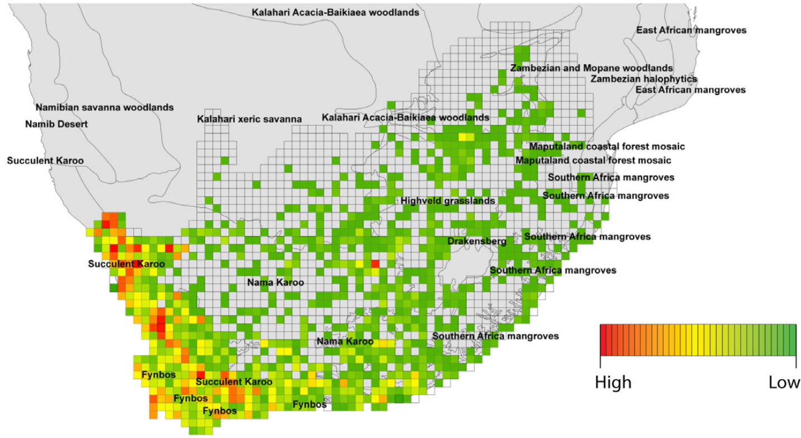
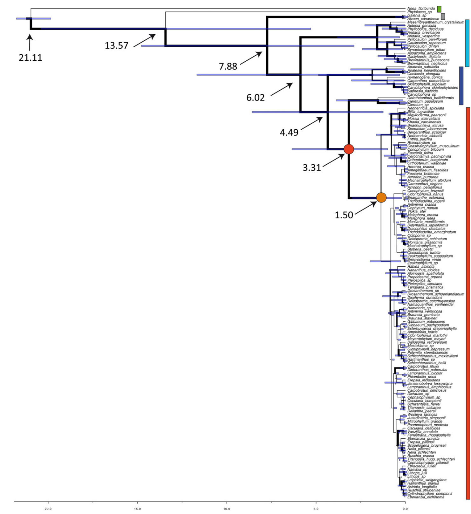
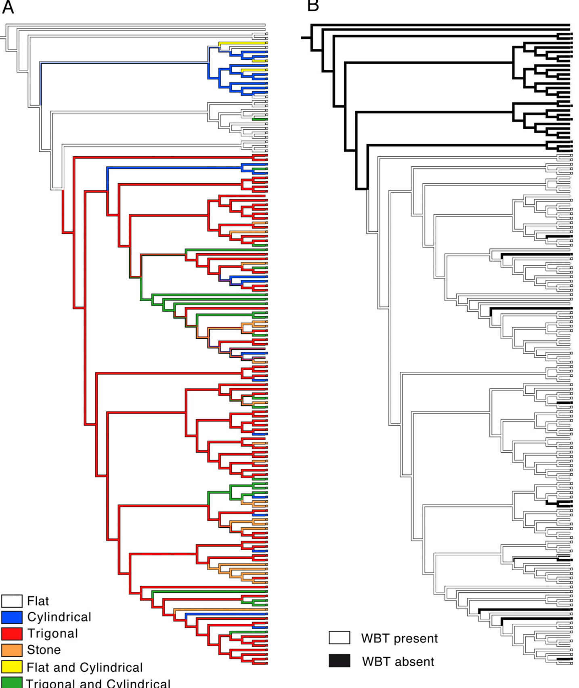
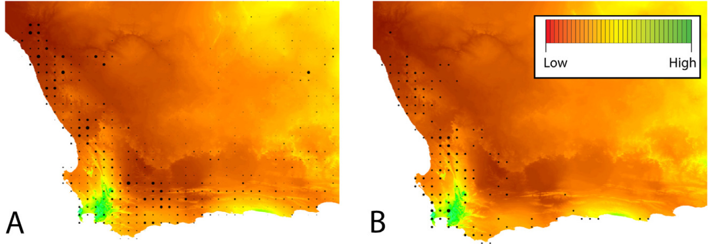

# Correlates of hyperdiversity in southern African ice plants (Aizoaceae)

LUIS M. VALENTE1†, ADAM W. BRITTON1†, MARTYN P. POWELL1, ALEXANDER S. T. PAPADOPULOS $^ 1$ , PRISCILLA M. BURGOYNE2 and VINCENT SAVOLAINEN1,3\*

1Imperial College London, Silwood Park Campus, Buckhurst Road, Ascot, Berkshire SL5 7PY, UK   
2South African National Biodiversity Institute, Private Bag X101, Pretoria 0001, South Africa   
3Jodrell Laboratory, Royal Botanic Gardens, Kew, Richmond, Surrey TW9 3DS, UK

Received 20 September 2012; revised 27 May 2013; accepted for publication 24 August 2013

The exceptionally high plant diversity of the Greater Cape Floristic Region (GCFR) comprises a combination of ancient lineages and young radiations. A previous phylogenetic study of Aizoaceae subfamily Ruschioideae dated the radiation of this clade of $> 1 5 0 0$ species in the GCFR to 3.8–8.7 Mya, establishing it as a flagship example of a diversification event triggered by the onset of a summer-arid climate in the region. However, a more recent analysis found an older age for the Ruschioideae lineage (17 Mya), suggesting that the group may in fact have originated much before the aridification of the region 10–15 Mya. Here, we reassess the tempo of radiation of ice plants by using the most complete generic-level phylogenetic tree for Aizoaceae to date, a revised calibration age and a new dating method. Our estimates of the age of the clade are even younger than initially thought (stem age 1.13–6.49 Mya), supporting the hypothesis that the radiation post-dates the establishment of an arid environment in the GCFR and firmly placing the radiation among the fastest in angiosperms (diversification rate of 4.4 species per million years). We also statistically examine environmental and morphological correlates of richness in ice plants and find that diversity is strongly linked with precipitation, temperature, topographic complexity and the evolution of highly succulent leaves and wide-band tracheids. $\circledcirc$ 2013 The Authors. Botanical Journal of the Linnean Society published by John Wiley & Sons Ltd on behalf of The Linnean Society of London, Botanical Journal of the Linnean Society, 2014, 174, 110–129.

ADDITIONAL KEYWORDS: aridification – diversification rates – Greater Cape Floristic Region Ruschioideae – Succulent Karoo.

## INTRODUCTION

The Greater Cape Floristic Region (GCFR) of southern Africa is the most biodiverse temperate region of the globe in terms of plant species (Born, Linder & Desmet, 2007; Kreft & Jetz, 2007). Considerable research has been conducted with the aim of disentangling the major forces that have driven diversification in the region (Linder, 2003; Verboom et al., 2009; Schnitzler et al., 2011). The current consensus is that high diversity in the GCFR is due to a combination of the gradual accumulation of species from old plant lineages (Linder, 2008; Verboom et al., 2009; Valente et al., 2010a, 2011), and of recent and rapid radiations that are thought to have been triggered by the establishment of a summer-dry climate in the south-western tip of southern Africa in the Miocene (Richardson et al., 2001; Linder, 2003; Verboom et al., 2003; Klak, Reeves & Hedderson, 2004).

The most charismatic and perhaps most spectacular of the recent ‘explosive’ radiations in the GCFR is that of subfamily Ruschioideae of Aizoaceae (ice plant family). Represented by 1585 species in 112 genera, Ruschioideae are one of the most species-rich and diverse clades of angiosperms in southern Africa (Smith, 1998; Goldblatt & Manning, 2002). With subfamily Mesembryanthemoideae, species of Ruschioideae are commonly referred to as the ‘mesembs’. Using phylogenetic methods, Klak et al. (2004) dated the radiation of a subclade of the ruschioids (core Ruschioideae) at 3.8–8.7 Mya, with a diversification rate of $0 . 7 7 \mathrm { - } 1 . 7 5$ species $\mathbf { M } \mathbf { y } \mathbf { r } ^ { - 1 }$ . This recent and fast radiation is considered one of the most rapid recorded in angiosperms (Valente, Savolainen & Vargas, 2010b) and rivals some of the fastest radiations in the world, such as that of cichlid fish (Verheyen et al., 2003).

Nearly a decade since the publication of the ice plant dating analysis of Klak et al. (2004), little progress has been made with regard to understanding the precise tempo and causes of the radiation of core Ruschioideae. A key question remains whether the radiation pre-dates or post-dates the establishment of a summer-arid climate in the south-western tip of southern Africa in the mid-Miocene (10–15 Mya, Cowling, Proches¸ & Partridge, 2009). Aridification of the region was associated with the establishment of the Benguela upwelling system and is thought to have led to the extinction of moist-adapted lineages and the opening of new niches (Zachos et al., 2001; Dupont et al., 2011), which may have triggered the radiation of mesembs. However, a study by Arakaki et al. (2011) suggested that the radiation of Ruschioideae may in fact be much older than previously thought (approximately 17 Mya), challenging the view of Klak et al. (2004) that the radiation post-dates the establishment of the semi-arid regime in the GCFR. In their dating analysis, Klak et al. (2004) used a limited sampling of the clade $( < 5 0 \%$ of the genera), derived their calibration point from an angiosperm-wide chronogram (Wikström, Savolainen & Chase, 2001) that has been often criticized owing to its estimates often being much older than the fossil record (Anderson, Bremer & Friis, 2005) and did not have access to the recent advances in relaxed molecular-clock Bayesian dating methods (Drummond et al., 2006). Therefore, the question remains as to whether the hypothesis of Klak et al. that the ice plant radiation was triggered by climate change in the GCFR is valid, or whether a more ancient origin, as proposed by Arakaki et al. (2011), is preferred. An older age could also imply that rates of diversification of mesembs are not as spectacular as previously thought (Valente et al., 2010b).

Another pending question is whether morphological innovations may have aided the radiation of the core ruschioids. Klak et al. (2004) proposed that two key characters (leaf shape and tracheid cell type) have been linked with evolutionary success of mesembs. First, core ruschioids show great leaf shape diversity, often with succulent trigonous shapes or stones that allow increased storage of water and prevent excess water loss, in contrast to earlier diverging species of Aizoaceae, which tend to have flat, non-succulent leaves (Smith, 1998). Secondly, several ice plant species possess wide-band tracheids (WBTs) that have larger secondary cell walls than normal tracheids and which are thought to be an adaptation to aridity by better withstanding water stress (Mauseth et al., 1995; Landrum, 2001, 2006, 2008). However, to date, the evolution of these traits has never been examined using phylogenetic ancestral state reconstruction methods and therefore little is known regarding their evolutionary history and whether they may have indeed been linked to diversification, as proposed by Klak et al. (2004).

A final question that remains unresolved is what were the drivers of diversification of ruschioids in southern Africa. Studies in southern African Aizoaceae have suggested a positive link between mesemb diversity and environmental factors associated with aridity (Ihlenfeldt, 1994; Ellis, Weis & Brandon, 2006). Mesembs form a major component of the most arid region of the GCFR (Fig. 1), the Succulent Karoo (SK) eco-region, comprising nearly $20 \%$ of its species (Goldblatt & Manning, 2002; Born et al., 2007). This suggests that there may be a link between the arid climatic conditions of the SK and mesemb species richness, but this has never formally been tested. We also know little about the relationship between mesemb evolutionary success and other key environmental factors that have commonly been thought to have triggered diversification of plant clades in the GCFR, namely topography and soil type (Linder, 2003; Schnitzler et al., 2011). Both topographic complexity and edaphic diversity have been hypothesized to have played a role in the radiation of mesembs, through the generation of increased opportunities for, respectively, allopatry and ecological divergence (Ellis et al., 2006).

Here, we reconstruct the largest generic-level phylogenetic tree for Aizoaceae in order to re-examine the evolutionary history of mesembs using the most representative and complete sampling of the clade to date (nearly $90 \%$ of the genera), in combination with a revised calibration age and the latest Bayesian relaxed-clock dating methods. Our main aim is to test whether the radiation of core Ruschioideae does indeed post-date the establishment of the summerarid climate in southern Africa 10–15 Mya as widely accepted and proposed by Klak et al. (2004), or whether a more ancient origin as proposed by Arakaki et al. (2011) is favoured. We also examine whether diversification rates in the clade, as derived from our new dating analysis, still rate among the highest recorded in angiosperms. Secondly, we take advantage of our new phylogenetic tree for Aizoaceae to reconstruct the evolution of leaf shape and tracheid type, two morphological traits proposed by Klak et al. (2004) to have been linked with the evolutionary success of the core ruschioids. Finally, we use detailed information on geographical patterns of mesemb genus richness to test formally the importance of key environmental factors such as rainfall and temperature in determining ice plant diversity in the SK and the GCFR as a whole.

  
Figure 1. Map of southern African eco-regions and mesemb genus richness per quarter degree square (QDS)

Table 1. Genera and species numbers for the three ‘mesemb’ groups (data modified from Klak et al., 2003b, 2007)   

<html><body><table><tr><td>Group</td><td>No. of genera</td><td>No.of species</td></tr><tr><td>Mesembryanthemoids</td><td>11</td><td>100</td></tr><tr><td>Early-diverging ruschioids</td><td>10</td><td>22</td></tr><tr><td>Core ruschioids</td><td>102</td><td>1563</td></tr><tr><td>Total</td><td>123</td><td>1685</td></tr></table></body></html>

## MATERIAL AND METHODS

### TAXON SAMPLING

Aizoaceae are composed of four subfamilies with 135 genera and 1830 species (Smith, 1998; Klak et al., 2003b; Klak, Bruyns & Hedderson, 2007). Two of these subfamilies, Aizooideae and Sesuvioideae, are slightly succulent shrubs with a worldwide distribution of 145 species in 12 genera (Smith, 1998; Klak et al., 2003b). The remaining 1685 species and 123 genera are in two subfamilies, Mesembryanthemoideae and Ruschioideae, and are commonly referred to as the ‘mesembs’ (the succulent members of Aizoaceae; Smith, 1998). Mesembryanthemoideae, the weedy mesembs, are a relatively small group with around 100 species in 11 genera. In contrast, Ruschioideae contains about 1585 species in 112 genera, with the early diverging group consisting of ten genera and 22 species, and the species-rich core group consisting of 1563 species in 102 genera (Klak et al., 2003b; Table 1).

Representatives of 106 out of the 123 currently recognized mesemb genera were sampled in this study; the majority were collected in South Africa during 2008 and 2009, and stored in silica gel. To provide as complete a sampling as possible, accessions were taken from GenBank for genera for which we did not have silica-dried material, in addition to outgroup species (Appendix 1).

### DNA SEQUENCING

Total cellular DNA isolation was performed using a modified CTAB procedure (Doyle & Doyle, 1987; Savolainen et al., 2006). $2 \times$ CTAB lysis buffer $( 5 0 0 ~ \mu \mathrm { L } )$ was added to $5 0 { - } 1 0 0 ~ \mathrm { m g }$ of ground plant material. An equal volume of an active protein denaturant (SEVAG; 24 parts chloroform to one part isoamyl alcohol) was added to allow the DNA phase to be isolated. The pellet was precipitated and washed in ethanol, then resuspended in $5 0 ~ \mu \mathrm { L }$ TE buffer for freezer storage. Two non-coding plastid gene regions, trnL- $F$ and psbA-trnH, were amplified to expand upon the previous phylogenetic tree produced by Klak et al. (2003b, 2004). The trnL intron and trnL- $F$ intergenic spacer were amplified, using primers c, d, e and f (Taberlet, Gielly & Bouvet, 1991), in two separate reactions. The psbA–trnH intergenic spacer, which has been recommended as a putative DNA barcode due to it being one of the most variable non-coding regions of the plastid genome (Kress et al., 2005; Shaw et al., 2007), was amplified using primers $p s b A F$ and trnHR (Sang, Crawford & Stuessy, 1997). For each $1 \mu \mathrm { L }$ of DNA template, $2 2 . 5 \mu \mathrm { L }$ of ReddyMix master mix (ABgene), $4 \mu \mathrm { L }$ $\mathrm { { M g C l } _ { 2 } }$ $( 2 . 5 \mathrm { m M } ,$ ), $0 . 5 \mu \mathrm { L }$ bvine serum albumin $( 0 . 4 \% )$ , and $0 . 5 \mu \mathrm { L }$ forward and $0 . 5 \mu \mathrm { L }$ reverse primer $( 1 0 \mu \mathrm { M } )$ were added, to make a $2 9 \mathrm { - \mu L }$ reaction. For all three regions the following PCR conditions were used: an initial denaturation at $9 4 ~ ^ { \circ } \mathrm { C }$ for $3 \mathrm { m i n }$ to melt the double strands of DNA, followed by 28 cycles of $1 \mathrm { m i n }$ denaturation at $9 4 ~ ^ { \circ } \mathrm { C }$ , $1 \mathrm { m i n }$ annealing at $4 8 ~ ^ { \circ } \mathrm { C }$ and an extension of $7 2 ^ { \circ } \mathrm { C }$ for $1 \mathrm { m i n }$ , with a final additional extension at $7 2 ^ { \circ } \mathrm { C }$ for $1 0 \mathrm { m i n }$ . Success of PCR was verified by $1 \%$ agarose gel electrophoresis and successful reactants were purified either with the QIAquick PCR Purification Kit (Qiagen), the products being eluted in EB elution buffer (Qiagen), or with ExoSAP-IT [Exonuclease I and Shrimp Alkaline Phosphatase Recombinant (rSAP); USB]. Cycle sequencing reactions were carried out in $_ { \mathrm { 1 0 - \mu L } }$ reactions consisting of: $4 0 \mathrm { n g }$ cleaned amplification product, $0 . 5 \mu \mathrm { L }$ BigDye Terminator Cycle Sequencing Ready Reaction kit $\mathrm { \ v { 3 . 1 } }$ (Applied Biosystems), $0 . 7 5 \mu \mathrm { L }$ primer $( 0 . 1 \ \mathrm { n g \mu L ^ { - 1 } }$ ; PCR primers used as sequencing primers), $3 . 0 \mu \mathrm { L }$ sequencing buffer prepared according to the manufacturer’s instructions, and sterile distilled water to make up a final volume of $1 0 \mu \mathrm { L }$ . The cycle sequencing thermal profile consisted of 26 cycles of 10 s denaturation at $9 6 ~ ^ { \circ } \mathrm { C }$ , 5 s annealing at $5 0 ~ ^ { \circ } \mathrm { C }$ and $4 \mathrm { m i n }$ at $6 0 ~ ^ { \circ } \mathrm { C }$ . Complementary strands were sequenced on an ABI $3 1 3 0 x l$ automated DNA sequencer (Applied Biosystems), following the manufacturer’s protocols.

missing genera obtained from GenBank added to the matrix (Appendix 1). Both regions were plastid and non-coding and were expected to produce congruent results, and were therefore combined for further analyses. Bayesian analysis was performed in BEAST v1.7.4 (Drummond & Rambaut, 2007). ModelTest (Posada & Crandall, 1998) was used to select the most appropriate model of sequence evolution, based on the lowest Akaike information criterion (AIC) score. Two independent BEAST analyses were run for 20 million generations, sampled every 2000. Tracer v1.5 was used to check the progress of the Bayesian analysis, and TreeAnnotator v1.7.4 obtained the consensus tree excluding the first three million generations (‘burn in’ phase). Posterior probabilities (PPs) were assigned in FigTree v1.3.1.

Due to the absence of fossil data, molecular dating was conducted using the previously estimated divergence time between Aizoaceae/Phytolaccaceae and Nyctaginaceae of 21 Mya (Wikström et al., 2001; Forest & Chase, 2009). This age was estimated from an angiosperm-wide tree using non-parametric rate smoothing (NPRS) applied to branch lengths obtained using accelerated transformation optimization in maximum parsimony (ACCTRAN). Klak et al. (2004) used a calibration age for the same node of 26 Mya, opting for the age obtained based on maximumlikelihood branch lengths from the Wikström et al. (2001) tree. However, the analysis of Wikström et al. (2001) has often been criticized for disagreeing with the fossil record and overestimating node ages (Anderson et al., 2005; Forest & Chase, 2009), and we therefore opted for the youngest estimate from their study, which was that based on the ACCTRAN optimization. The prior for the stem age of Aizoaceae/ Phytolaccaceae was set using a normal distribution (mean $= 2 1$ , $\mathrm { S D } = 1$ ). We repeated the analysis using the same calibration age as Klak et al. (2004), who used an age of 26 Mya for this split (normal distributed prior, mean $= 2 6$ , $\mathrm { S D } = 1$ ).

We estimated net rates of diversification for Aizoaceae and the core Ruschioideae clade using the whole-clade estimator of Magallón & Sanderson (2001). Rates were calculated assuming no extinction $( E = 0 )$ ) or a high rate of extinction relative to speciation $( E = 0 . 9 )$ for both crown and stem groups using the $\mathrm { ~ \bf ~ R ~ }$ package Geiger (Harmon et al., 2007). We repeated analyses for the ages obtained using the two alternative calibration ages.

#### PHYLOGENETIC INFERENCE, DIVERGENCE TIME ESTIMATION AND DIVERSIFICATION RATES

#### ANCESTRAL TRAIT RECONSTRUCTION OF MORPHOLOGICAL TRAITS

Complementary strands were edited and assembled in Sequencher $\mathbf { v } 4 . 5$ (Genes Codes Corp.). Sequences were aligned by eye in Geneious Pro v5.6.3, with

We conducted character optimization analyses to reconstruct the evolution of two traits that have been hypothesized to have played a role in diversification of mesembs: leaf shape and tracheid type (Klak et al., 2004). Leaf shape was scored as: cylindrical, flat, trigonal and stone. WBTs were scored as present or absent. Data on leaf shape and tracheid type were extracted from Smith (1998) and Landrum (2001, 2008). In addition, leaf shape data were supplemented with personal communications from P. Burgoyne, based on field observations. Character states are mostly conserved within genera (Smith, 1998), and when that is not the case the characters were scored as polymorphic. The trait data are given in Appendix 2.

The Bayesian maximum clade credibility tree was used in Mesquite v2.7.2 (Maddison & Maddison, 2009) for unordered parsimony ancestral state reconstruction. To account for uncertainty in tree topology and branch lengths, character optimizations were repeated for each of 1000 trees from the BEAST output.

#### ENVIRONMENTAL ANALYSIS

We tested whether four environmental factors (precipitation, temperature, topographic complexity and soil type diversity) are associated with mesemb genus richness. Genus diversity may be decoupled from species diversity if species richness is unevenly distributed among genera. However, genus richness has been shown to provide an excellent proxy for species richness in hyperdiverse plant clades and biodiversity hotspots that are not yet amenable to species-level analyses due to their exceptionally high numbers of species (Villaseñor et al., 2005; Mazaris et al., 2010), as is the case of mesembs $( > 1 5 0 0$ species).

South African quarter degree squared (QDS) generic distribution data were obtained from the PRECIS database at SANBI Pretoria. The mesembspecific data were extracted in R v2.12.1 (http:// www.r-project.org), and ArcGIS $\mathbf { v 9 . 2 }$ (Esri) was used to map genus richness per QDS. ArcGIS was also used to map ecological data using the statistics function to quantify values per QDS. Data on the mean annual precipitation (mm, 2.5-min resolution), mean temperature of the driest quarter ${ \mathrm { { } ^ { \circ } C } } \times 1 0$ , $2 . 5 \mathrm { - m i n }$ resolution), and topographical complexity (measured as altitudinal standard deviation; m, $2 . 5 \mathrm { - m i n }$ resolution) were gathered from Bioclim (http:// www.worldclim.org/bioclim). Soil type diversity (number of soil types per QDS) was obtained from Schnitzler et al. (2011) and based on the SOTERbased soil parameter estimates for southern Africa (version 1.a; Batjes, 2004). To test for environmental predictors of generic richness (of mesembs overall and of the main clades separately: Mesembryanthemoideae, the early diverging ruschioids and the core ruschioids), linear regressions of generic richness per QDS and environmental variables were performed in R.

#### RESULTS

#### PHYLOGENETIC INFERENCE, DIVERGENCE TIME ESTIMATION AND DIVERSIFICATION RATES

The total number of species included in the combined dataset was 143, representing 108 genera of Aizoaceae, plus two outgroup taxa; this included 80 species generated for trnL-F and 100 species for psbA–trnH. Sequences for the remaining species were taken from GenBank, resulting in a total of 106 mesemb genera, 89 of which were from the core ruschioid group (Appendix 1). Topology of the strict consensus tree was inferred with Bayesian methods, using a general time-reversible model with gamma distributed rate variation, and topological results were congruent with previous studies (Klak et al., 2003b; Fig. 2). The analysis shows strong support at subfamily level for Aizooideae, Mesembryanthemoideae and Ruschioideae $\mathrm { ( P P s = 1 ) }$ ); resolution is also strongly supported between the early diverging and core groups of Ruschioideae $\mathrm { \mathop { P P } = 1 } ,$ . Core Ruschioideae are recovered as a monophyletic group $( \mathrm { P P } = 1 )$ , although the lack of resolution within the clade is apparent, and hence the relationships among those genera remain largely unresolved. However, some subclades of core Ruschioideae are strongly supported: for example, Hallianthus H.E.K.Hartmann and Leipoldtia L.Bolus $( \mathrm { P P } = 0 . 9 7 )$ ), and Bijlia N.E.Br. and Argyroderma N.E.Br. $\mathrm { { \cdot P P = 0 . 8 8 } }$ ). In some cases for which multiple accessions were analysed per genus, the genera were recovered as monophyletic, such as Malephora N.E.Br. $\mathrm { { P P = 0 . 9 7 } }$ ), Orthopterum L.Bolus $( \mathrm { P P } = 1 )$ , Lithops N.E.Br. $\mathrm { ( P P = 0 } . 8 8 \mathrm { ) }$ ) and Drosanthemum Schwantes $\mathrm { T P } = 0 . 6 2 ,$ . However, in the majority of cases where multiple accessions were sequenced, accessions Acrodon N.E.Br., Delosperma N.E.Br., Faucaria Schwantes, Lampranthus N.E.Br., Oscularia Schwantes and Ruschia Schwantes were distributed across core Ruschioideae, highlighting the lack of resolution or, alternatively, providing evidence for non-monophyly of these genera.

The dating analysis (Fig. 2, Table 2) using the new calibration age estimated the split between Aizooideae and the mesembs to have occurred 7.88 Mya (3.01–14.93; $9 5 \%$ highest posterior density interval), with Mesembryanthemoideae splitting from Ruschiodeae 6.02 Mya (2.18–11.82). The radiation of the core ruschioids has a stem age of 3.31 Mya (1.13–6.49; split with early diverging Dorotheantheae clade) and a crown age of 1.50 Mya (0.35–3.14; Fig. 2). The analysis using the calibration age of Klak et al. (2004) produced slightly older estimates (Table 2). However, both analyses in this study produced younger ages for all nodes when compared with the study of Klak et al. (2004), which dated the age of core ruschioids at 3.8–8.7 Mya.

  
Figure 2. Maximum-clade credibility tree of all 143 taxa based on analysis of the trnL- $F$ and psbA–trnH matrix. Dark branches indicate nodes with support greater than $\mathrm { P P } = 0 . 8$ . Bars to right shows species of: green, outgroup; grey, Aizooideae; light blue, Mesembryanthemoids; dark blue, early-diverging Ruschioideae; red, core Ruschioideae. Mean ages (Mya) obtained for key nodes in the phylogenetic tree are indicated with arrows. The $9 5 \%$ highest posterior density intervals for the node ages are shown in blue horizontal bars at each node. The stem node of the core ruschioid radiation is indicated with a red circle and the crown node with an orange circle. Time scale bar shown at the bottom (Mya).

Table 2. Clade ages (Mya) and net diversification rates $\dot { \boldsymbol { r } } ;$ species $\mathbf { M y r ^ { - 1 } } .$ for selected clades   

<html><body><table><tr><td></td><td></td><td>Aizoaceae</td><td>Core ruschioids</td></tr><tr><td></td><td>No. of species</td><td>1860</td><td>1563</td></tr><tr><td>Calibration age of 21 Mya</td><td>Crown age</td><td>7.88 (3.01-14.93)</td><td>1.50 (0.35-3.14)</td></tr><tr><td>E=0</td><td>Stem age r (crown)</td><td>13.75 (5.43-20.56)</td><td>3.31 (1.13-6.49)</td></tr><tr><td></td><td>r (stem)</td><td>0.86 (0.45-2.27)</td><td>4.44 (2.12-19.03) 2.22 (1.13-6.51)</td></tr><tr><td>E=0.9</td><td>r (crown)</td><td>0.55 (0.37-1.39)</td><td>3.34 (1.59-14.30)</td></tr><tr><td></td><td></td><td>0.66 (0.35-1.72)</td><td></td></tr><tr><td>Calibration age of 26 Mya</td><td>r (stem)</td><td>0.38 (0.25-0.96)</td><td>1.53 (0.78-4.48)</td></tr><tr><td></td><td>Crown age</td><td>9.48 (3.31-15.80)</td><td>2.02 (0.56-3.76)</td></tr><tr><td>E=0</td><td>Stem age</td><td>15.45 (7.09-24.92)</td><td>3.94 (1.15-6.56)</td></tr><tr><td></td><td>r (crown)</td><td>0.72 (0.43-2.07)</td><td>3.30 (1.77-11.90)</td></tr><tr><td></td><td>r (stem)</td><td>0.49 (0.30-1.06)</td><td>1.87 (1.16-6.40)</td></tr><tr><td>E= 0.9</td><td>r (crown)</td><td>0.55 (0.33-1.56)</td><td>2.48 (1.81-8.94)</td></tr><tr><td></td><td>r (stem)</td><td>0.34 (0.21-0.74)</td><td>1.28 (0.80-4.40)</td></tr></table></body></html>

Ages were obtained from the maximum-clade credibility trees of the Bayesian divergence dating analyses using the calibration age of 21 Mya (Wikström et al., 2001; Forest & Chase, 2009) or, alternatively, 26 Mya, the same calibration age used by Klak et al. (2004). Diversification rates were estimated using the whole-clade method of Magallón & Sanderson (2001), assuming no extinction $( E = 0 )$ or high rate of extinction relative to speciation $( E = 0 . 9 \$ .

We obtained a net diversification rate for the crown group of core ruschioids of 4.44 (2.12–19.03) sp Myr−1 using the younger calibration age, or 3.30 (1.77– 11.90) sp $\mathbf { M } \mathbf { y } \mathbf { r } ^ { - 1 }$ using the older calibration age; the net rate for the core ruschioids has been at least four times faster than the background rate for the family (Table 2).

#### ANCESTRAL STATE RECONSTRUCTION: ROLE OF KEY INNOVATIONS IN RUSCHIOID DIVERSIFICATION

Morphological ancestral state reconstruction reveals that flat leaves are the most likely ancestral leaf state (Fig. 3A) for Aizoaceae $100 \%$ of the 1000 trees analysed had flat leaf as the state optimized to the root of Aizoaceae). The two species of Aizooideae sampled, Aizoon canariense L. and an unidentified species of Galenia L., have flat leaves, as do all the earlydiverging ruschioids, with the exception of Conicosia N.E.Br., which has cylindrical leaves. Just under half of the genera of Mesembryanthemoideae sampled have flat leaves, with the remainder having cylindrical or a combination of flat and cylindrical leaves within a genus. The character optimization analyses support a major shift in succulence of leaf type at the origin of the core ruschioids, with $8 2 . 1 \%$ of the trees sampled presenting a shift from flat leaves to highly succulent leaves at the most recent common ancestor of core Ruschioideae, whereas $1 7 . 8 \%$ of the trees presented an equivocal reconstruction of leaf shape at that node, meaning that character state could not be confidently identified in those trees. The majority of ruschioid genera sampled have trigonous leaves. Across the 1000 posterior trees, cylindrical leaves have evolved an average of ten times (minimum eight, maximum 17) in core Ruschioideae, whereas stone leaves have evolved an average of 13 times (minimum nine, maximum 17) in core Ruschioideae. Reversal to non-succulence has never occurred in the radiation.

The ancestral tracheid cell type was recovered as unmodified in $100 \%$ of the trees, with no members of Aizooideae, Mesembryanthemoideae or earlydiverging Ruschioideae having WBTs, whereas the vast majority (61 out of 68 sampled) of core ruschioids have them (Fig. 3B). The most recent common ancestor of the core ruschioids was optimized to have WBTs in $100 \%$ of the trees. According to the posterior distribution of trees, WBTs have been lost an average of eight times in the core ruschioids and are absent in Carpobrotus N.E.Br., Chasmatophyllum Dinter & Schwantes, Conicosia, Conophytum N.E.Br., Erepsia N.E.Br., Gibbaeum Haw., Glottiphyllum Haw. and Rabiea N.E.Br.

#### ENVIRONMENTAL ANALYSIS

The analysis of environmental and genus richness data shows that core ruschioid genus diversity is higher in areas of low precipitation, such as the Little Karoo and Richtersveld Mountains (Fig. 4A, Table 3). The opposite is true of genera of early-diverging ruschioids, which are present in highest numbers in areas of higher precipitation, such as coastal fynbos habitats in the South Western Cape (Fig. 4B). The linear models (Table 3) demonstrate that precipitation, temperature and topographical complexity all have a significant effect $( P < 0 . 0 0 0 1 )$ ) on overall mesemb genus richness, whereas soil type does not. Increasing precipitation has a negative effect on genus richness, whereas topographic heterogeneity and increasing temperature both have positive effects. These explanatory variables have a similar effect on core ruschioid genus richness (Table 3), but there are no significant correlates with generic richness of the species-poor early-diverging ruschioids. Precipitation and temperature have significant effects on mesembryanthemoid genus richness but topographical complexity does not.

  
Figure 3. Character state optimization of (A) leaf shape and (B) tracheid type (WBT, wide-band tracheid). Characters mapped onto the maximum clade credibility tree from the Bayesian analysis.

  
Figure 4. Map and correlation graphs of mean annual precipitation (mm) against core (A) and early-diverging (B) ruschioid genus richness (per QDS), showing a map of genus richness (size of dots indicates genus richness) against a background of mean annual precipitation.

Table 3. Results of linear models with generic richness as a response variable and environmental parameters as predictor variables for the different groups   

<html><body><table><tr><td></td><td>Effect size</td><td>Standard error</td><td>t</td><td>P value</td></tr><tr><td>All mesembs</td><td></td><td></td><td></td><td></td></tr><tr><td>Topographic complexity</td><td>0.009</td><td>0.001</td><td>6.364</td><td><0.0001</td></tr><tr><td>Precipitation</td><td>-0.005</td><td>0.0006</td><td>-8.120</td><td>< 0.0001</td></tr><tr><td>Dry-season temperature</td><td>0.0370</td><td>0.003</td><td>14.413</td><td>< 0.0001</td></tr><tr><td>Soil type diversity</td><td>-0.060</td><td>0.101</td><td>-0.594</td><td>0.5530</td></tr><tr><td>Mesembryanthemoids</td><td></td><td></td><td></td><td></td></tr><tr><td>Topographic complexity</td><td>0.001</td><td>0.0009</td><td>1.478</td><td>0.1401</td></tr><tr><td>Precipitation</td><td>-0.002</td><td>0.0003</td><td>-6.204</td><td>< 0.0001</td></tr><tr><td>Dry-season temperature</td><td>0.004</td><td>0.001</td><td>2.738</td><td>0.0065</td></tr><tr><td>Soil type diversity</td><td>0.052</td><td>0.057</td><td>0.945</td><td>0.3453</td></tr><tr><td>Early diverging ruschioids</td><td></td><td></td><td></td><td></td></tr><tr><td>Topographic complexity</td><td>0.001</td><td>0.0009</td><td>1.393</td><td>0.1670</td></tr><tr><td>Precipitation</td><td>0.0007</td><td>0.0004</td><td>1.543</td><td>0.1260</td></tr><tr><td>Dry-season temperature</td><td>0.007</td><td>0.004</td><td>1.593</td><td>0.1140</td></tr><tr><td>Soil type diversity</td><td>0.019</td><td>0.0669</td><td>0.284</td><td>0.7770</td></tr><tr><td>Core ruschioids</td><td></td><td></td><td></td><td></td></tr><tr><td>Topographic complexity</td><td>0.006</td><td>0.001</td><td>6.093</td><td>< 0.0001</td></tr><tr><td>Precipitation</td><td>-0.003</td><td>0.0004</td><td>-7.718</td><td>< 0.0001</td></tr><tr><td>Dry-season temperature</td><td>0.023</td><td>0.0019</td><td>12.545</td><td>< 0.0001</td></tr><tr><td>Soil type diversity</td><td>-0.054</td><td>0.0735</td><td>-0.746</td><td>0.4561</td></tr></table></body></html>

Significant $P$ values are given in bold.

#### DISCUSSION

#### EVOLUTIONARY RELATIONSHIPS

This is the largest generic-level phylogenetic tree of Aizoaceae reconstructed to date, including $87 \%$ of mesemb genera. It upholds previous molecular studies with regard to good subfamilial-level support (Klak et al., 2003b, 2004); however, within the core ruschioids, there is a lack of sequence divergence that is a common occurrence when attempting to reconstruct phylogenies of young radiations (Valente et al., 2010b). Young, closely related taxa often exhibit little variation in their sequences, and this has been found to be the case in many phylogenetic studies of southern African plant groups (e.g. Richardson et al., 2001; Schnitzler et al., 2011; Valente et al., 2012). In Aizoaceae, previous work has shown that the trnL- $F$ and psbA–trnH regions have proved efficient at resolving subfamily-level relationships, but the difficulty of resolving closely related sister taxa remains (Klak et al., 2003b). Recent studies have used amplified fragment length polymorphism (AFLP) loci and microsatellite markers to explain the evolutionary relationships between and within rapidly radiated GCFR clades (e.g. Buys et al., 2008; Prunier & Holsinger, 2010; Rymer et al., 2010; Valente et al., 2010a). In mesembs, an AFLP study of Argyroderma by Ellis et al. (2006) found low support for the monophyly of individuals of the same species in many cases, again suggesting that the young age of the radiation hampers the ability to identify evolutionary units in core Ruschioideae, even when more sensitive markers are used.

younger calibration $- 4 . 4 4 \ \mathrm { s p \ M y r ^ { - 1 } }$ ; older calibration 3.30 sp Myr−1) are even higher than formerly postulated (0.77–1.75 sp $\mathbf { M } \mathbf { y } \mathbf { r } ^ { - 1 }$ ; Klak et al., 2004). These findings uphold the view that this represents one of the most recent and rapid radiations known in angiosperms (Valente et al., 2010b). In fact, the confidence intervals of our estimates for diversification rate of core Ruschioideae surpass those for any other plant group, including Dianthus L. (Caryophyllaceae), the most rapid plant radiation document to date (Valente et al., 2010b), although we acknowledge that limited sequence divergence may bias the dating calculations to a degree.

There are several reasons why our dating estimates are younger than those of Klak et al. (2004). First, we chose to use a younger calibration age for the same node that was used by Klak et al. (2004) because the study from which their age was derived (Wikström et al., 2001) has been criticized for producing ages that disagree with the fossil record by overestimating the ages of nodes (Anderson et al., 2005). By choosing the minimum estimate from that study (21 versus 26 Mya), as proposed by Forest & Chase (2009), we aimed to reduce the reported bias towards older estimates. However, even when the same calibration age of 26 Mya was used, our estimate for the age of the core ruschioids was also younger than that obtained by Klak et al. (2004; mean crown age 2.02 Mya; mean stem age 3.94 Mya). In this case, the younger age obtained is therefore potentially due the use of Bayesian divergence dating, which is known to produce younger ages than those estimated by NPRS (Linder, Hardy & Rutschmann, 2005), the dating method used by Klak and colleagues. The Bayesian relaxed-clock divergence dating method implemented in BEAST (Drummond & Rambaut, 2007) is generally thought to produce more accurate ages than NPRS (Sanderson, 1997), because it models molecular rate among lineages as varying in an autocorrelated manner and incorporates phylogenetic uncertainty into the dating process. It therefore does not require as much prior information about rate variation within different clades in the tree (Drummond et al., 2006). The use of much denser genus sampling, as is the case in our phylogenetic tree, can also affect dating estimates, although it usually does so by increasing rather than decreasing node ages (Linder et al., 2005).

#### TIMING OF THE RADIATION

Our divergence time estimates for the core ruschioids (Fig. 2, mean crown age 1.50 Mya; mean stem age 3.31 Mya) are younger than those estimated by Klak et al. (3.8–8.7 Mya; Klak et al., 2004) and considerably younger than those obtained by Arakaki et al. (17 Mya; Arakaki et al., 2011). The new dates are clearly consistent with the hypothesis that the radiation of the core ruschioids post-dates the onset of a summer-arid climate in south-western southern Africa 10–15 Mya. Our new dating analysis for Aizoaceae therefore rejects the alternative hypothesis that the radiation is ancient as recently proposed by Arakaki et al. (2011). A young age for ice plants in the GCFR, as favoured by our dating analysis, is also consistent with a recent palynological study that found that Aizoaceae pollen records were absent before 8 Mya (Dupont et al., 2011).

Coupled with the younger divergence time estimated for the core ruschioids, we find that the diversification rates we estimate for this group (Table 2,

Our dating analysis lacks a direct fossil calibration, and we did not include large error estimates around the calibration age (other than the standard deviation of the node age normal prior). Therefore, our results must be viewed with caution. The study that found an ancient age of Ruschioideae (Arakaki et al., 2011) did use fossils to calibrate a wider tree of worldwide succulent clades that included core Ruschioideae, but the fossils were distantly related to Aizoaceae, and the authors used a much sparser sampling of mesembs. Therefore, it is difficult at this stage to assess whether our young estimates are more accurate, as both approaches present drawbacks.

#### MORPHOLOGY

The majority of posterior trees used in our analyses of character optimization presented a shift from nonWBT to WBT and from flat leaves to highly succulent leaves at the stem node of core Ruschioideae, suggesting that WBTs and high leaf succulence evolved around the same time in the most recent common ancestor of the radiation (Fig. 3). Ancestral trait reconstruction of leaf shape revealed that all core ruschioids sampled in this study evolved from the ancestral state of slightly succulent flat leaves to highly succulent leaves (Fig. 3A). These highly succulent leaves vary from cylindrical (e.g. Trichodiadema Schwantes) and trigonal (e.g. Erepsia and Faucaria) to compact stones (e.g. Lithops, Conophytum and Argyroderma; in ten out of 11 species; Ellis et al., 2006). All have a decreased surface area that can account for much lower water loss than flat-leaved ice plants (van Jaarsveld, 1987) and they also act as water storage organs, allowing the core ruschioids to survive in areas of much lower rainfall (Smith, 1998). The most extreme level of succulence seen, namely the miniature succulents with reduced stone-shaped leaves, appears to have independently evolved multiple times and is evident in 15 genera, suggesting convergent evolution of a character state that may be beneficial in semi-arid conditions. Most miniature succulent genera are either monospecific or contain only a few species, with the exceptions of Conophytum (88 species), Lithops (37), Gibbaeum (16) and Argyroderma (11), indicating that this trait may not have been a universal driver of diversification in the core ruschioids (to test this hypothesis an analysis of the effect of the trait on speciation/extinction rates would be required; see below). Species in the early-diverging ruschioid group all have the ancestral state of flat leaves, with the exception of Conocosia, which has cylindrical leaves. Approximately half of the genera in Mesembryanthemoideae have flattened mesomorphic leaves, with the other half having cylindrical leaves (Klak et al., 2007).

The presence of WBTs with wider secondary walls that prevent collapse under water stress development is purely a core ruschioid adaptation, and it evolved in mesembs at the most recent common ancestor of the core ruschioids (Fig. 3B). It is likely that WBTs could have evolved in tandem with leaf succulence to improve water storage ability. A few core ruschioid genera appear to have lost WBTs but, as suggested by Landrum (2001), this may be because these structures were not yet developed in the examined specimens. WBTs require high light levels and low water availability to be initiated, and therefore the possibility exists that they are present in these genera, but were not detected. If the evolution of WBTs is tied to diversification, then it could be expected that those genera lacking them (Carpobrotus, Chasmatophyllum, Conicosia, Conophytum, Erepsia, Gibbaeum, Glottiphyllum and Rabiea) would have, on average, fewer species than those with WBTs. Species delimitation is problematic in the core ruschioids due to their recent radiation (Klak, Hedderson & Linder, 2003a; Ellis et al., 2006), but the current taxonomic status of these seven genera indicates that Conophytum is one of the most diverse genera in Aizoaceae, with 88 species, whereas five of the remaining six genera have $< 2 0$ species (Erepsia has 27 species) and thus are not considered species-rich (Smith, 1998). The remainder of the genera in the core ruschioids have WBTs, including some of the most species-rich genera [e.g. Delosperma (c. 163 species), Drosanthemum (120), Lampranthus $( > 2 2 0 )$ and Ruschia (220); Smith, 1998; Klak et al., 2003a]. Importantly, and contrary to what would be expected, the loss of WBTs is not associated with emigration out of the arid zone, as several genera of core Ruschioideae that lack them are present in the SK.

We were not able to conduct formal tests of a link between traits and diversification rates in mesembs for two main reasons. First, the lack of resolution in our genus-level tree, with low PPs for most nodes within the radiation, leads to many of the genera not being retrieved as monophyletic, thus preventing the use of diversification methods that allow the assignment of unsampled species richness to well-defined tree terminals (e.g. Medusa; Alfaro et al., 2009). Second, although we sampled the majority of mesemb genera, our species-level sampling was still low $( < 1 0 \% )$ , and we were therefore not able to use diversification analyses that allow the identification of key innovations by estimating the effect of a character on speciation and extinction rates, such as in the Bisse framework (Maddison, Midford & Otto, 2007). Such methods require high levels of sampling $( > 8 0 \%$ of species), the use of characters for which no state occurs in $< 1 0 \%$ of species (which does not apply to any of the characters in our study, all of which are rare, e.g. absence of WBTs and flat/ cylindrical leaves) and trees with $> 3 0 0$ terminals (Davis, Midford & Maddison, 2013). Nevertheless, such diversification analyses would be the ideal new direction to explore in further studies that aim to detect a link between high rates of diversification and morphological adaptations to an arid environment in ice plants.

#### ENVIRONMENT

Lack of rainfall is the main defining character of an arid environment (Hopkins & Jones, 1983), but high temperatures are also important, notably in the GCFR. Both these features are significant predictors of both mesembryanthemoid and core ruschioid richness (Table 3), highlighting the link between mesemb success and aridity. The core ruschioids differ from the early-diverging ruschioids in terms of areas of occurrence, with the core group typically occurring in drier regions of southern Africa, particularly in the SK. The significant negative relationship $( P < 0 . 0 0 0 1 )$ ） between core ruschioid genus richness and precipitation suggests their morphological adaptations to arid environments (e.g. WBTs and highly succulent leaves) have allowed them to take advantage of niches other plants cannot occupy. Higher genus richness is evident in the arid SK, particularly in the dry Little Karoo and Richtersveld Mountain areas where they have radiated in high numbers (Fig. 4A). On the other hand, we found no relationship between genus richness of the early-diverging ruschioid group and precipitation (Table 3). Early-diverging ruschioids possess flat leaves and unmodified tracheid cells and display habitat preference for the fynbos biome of the south-western Cape (Fig. 4B). They are therefore less well adapted to arid conditions, and may show higher rates of extinction in the more arid SK, which may explain the lack of a relationship with precipitation. The distribution of Mesembryanthemoideae has more in common with that of the core ruschioids, with respect to higher genus richness in areas of lower precipitation (Table 3). This could be a result of the development of more succulent, cylindrical leaves, the conspicuous bladder cells on their leaves or their weedy generalist habit (Smith, 1998; Klak et al., 2007).

We found a significant relationship between core ruschioid genus richness and increasing topographical complexity but no relationship with edaphic diversity. The high topographical complexity of areas where core ruschioid richness is high, such as the Richtersveld Mountains, could have provided ecological opportunities that are known to drive diversification in the absence of novel traits (Hughes & Eastwood, 2006). The rugged mountainous quartz fields found in the SK harbour many endemic plant species, with fine-scale discrimination of species between patches (Ellis & Weis, 2006; Ellis et al., 2006). The topographical complexity of the quartz habitat seems to have selected for habitat-specific, short-lived drought-resistant flowering stones (Cowling et al., 1998; Schmiedel & Jürgens, 1999; Ellis et al., 2006), and hence core ruschioid species occur there in high abundance. However, topography alone cannot explain why core ruschioid richness is higher, given that the south-western Cape, where the early-diverging ruschioids are most diverse, is also topographically complex. It appears that topography may only be positively associated with genus-richness when interacting with other factors, as was previously found in other groups [e.g. Lupinus L. (Fabaceae), Hughes & Eastwood, 2006]. We hypothesize that the reflective ability of quartz in the mountainous quartz fields of the SK could increase levels of UV radiation, which has been known to increase mutation rates. The combination of high opportunities for allopatry associated with topographical complexity and the potentially higher rates of mutation in the quartz habitat could have driven high speciation rates (Rozema et al., 1997; Rothschild, 1999), an area which warrants further study.

#### CONCLUSIONS

Our new dating analysis of Aizoaceae using denser sampling, a revised calibration age and more powerful dating methods corroborates the long-held hypothesis that the radiation post-dates the establishment of the contemporary summer-arid climate in the GCFR, and therefore rejects the more recent hypothesis that core Ruschioideae are an ancient clade that was already present before the significant aridification process of the GCFR. The new dating analysis also clearly places the radiation of mesembs among the most rapid angiosperm diversification events documented to date. In addition, this study provides strong new evidence suggesting a link between mesemb evolutionary success and arid conditions. We showed that two morphological adaptations to aridity evolved at the origin of the core ruschioid clade, and our results corroborate the hypothesis that high ice plant diversity is associated with arid conditions such as low precipitation and high temperatures. In addition, we also found a significant link between topographical complexity and mesemb diversity, suggesting a role of allopatry in promoting reproductive isolation in this rapidly radiating clade. The morphological innovations that have evolved in members of core Ruschioideae were likely to be crucial for their survival in an arid environment while other lineages became extinct. Whether these adaptations drove speciation as key innovations, at the same time resulting in low extinction rates, cannot be confirmed with the current data, but they are certainly linked to extant patterns of generic richness.

#### ACKNOWLEDGEMENTS

We thank Jan Schnitzler, Greg Carey, Juliet Blum and Lynsey McInnes for their assistance throughout the study. This work was funded by the Royal Society (UK), South African NRF, European Commission, Marie Curie IEF ‘BIRDISLAND’, NERC and Leverhulme Trust.

#### REFERENCES

Alfaro ME, Santini F, Brock C, Alamillo H, Dornburg A, Rabosky DL, Carnevale G, Harmon LJ. 2009. Nine exceptional radiations plus high turnover explain species diversity in jawed vertebrates. Proceedings of the National Academy of Sciences of the United States of America 106: 13410–13414.   
Anderson CL, Bremer K, Friis EM. 2005. Dating phylogenetically basal eudicots using rbcL sequences and multiple fossil reference points. American Journal of Botany 92: 1737–1748.   
Arakaki M, Christin P-A, Nyffeler R, Lendel A, Eggli U, Ogburn RM, Spriggs E, Moore MJ, Edwards EJ. 2011. Contemporaneous and recent radiations of the world’s major succulent plant lineages. Proceedings of the National Academy of Sciences of the United States of America 108: 8379–8384.   
Batjes NH. 2004. SOTER-based soil parameter estimates for Southern Africa. ISRIC – World Soil Information. Report 2004/04 ed.   
Born J, Linder HP, Desmet P. 2007. The Greater Cape Floristic Region. Journal of Biogeography 34: 147– 162.   
Buys M, Janse van Rensburg L, Mienie C, Barker N, Burgoyne P, Mills L, Van Rensburg L, Hartmann H. 2008. Applying AFLPs in Aizoaceae: the Delosperma herbeum complex as a case study. Biochemical Systematics and Ecology 36: 92–100.   
Cowling RM, Proche¸s S¸ , Partridge TC. 2009. Explaining the uniqueness of the Cape flora: incorporating geomorphic evolution as a factor for explaining its diversification. Molecular Phylogenetics and Evolution 51: 64–74.   
Cowling RM, Rundel PW, Desmet PG, Esler KJ. 1998. Extraordinary high regional-scale plant diversity in southern African arid lands: subcontinental and global comparisons. Diversity and Distributions 4: 27–36.   
Davis MP, Midford PE, Maddison W. 2013. Exploring power and parameter estimation of the BiSSE method for analyzing species diversification. BMC Evolutionary Biology 13: 38.   
Doyle JJ, Doyle JL. 1987. A rapid DNA isolation procedure for small quantities of fresh leaf tissue. Phytochemichal Bulletin, Botanical Society of America 19: 11–15.   
Drummond AJ, Ho SYW, Phillips MJ, Rambaut A. 2006. Relaxed phylogenetics and dating with confidence. PLoS Biology 4: e88.   
Drummond AJ, Rambaut A. 2007. BEAST: Bayesian evolutionary analysis by sampling trees. BMC Evolutionary Biology 7: 214.   
Dupont LM, Linder HP, Rommerskirchen F, Schefuß E. 2011. Climate-driven rampant speciation of the Cape flora. Journal of Biogeography 38: 1059–1068.   
Ellis AG, Weis AE, Brandon SG. 2006. Evolutionary radiation of ‘stone plants’ in the genus Argyroderma (Aizoaceae): unraveling the effects of landscape, habitat, and flowering time. Evolution 60: 39–55.   
Ellis AG, Weis AE. 2006. Coexistence and differentiation of ‘flowering stones’: the role of local adaptation to soil microenvironment. Journal of Ecology 94: 322–335.   
Forest F, Chase M. 2009. Eudicots. In: Hedges S, Kumar S, eds. Timetree of life. Oxford: Oxford University Press, 169– 176.   
Goldblatt P, Manning JC. 2002. Plant diversity of the cape region of southern Africa. Annals of the Missouri Botanical Garden 89: 281–302.   
Harmon LJ, Weir JT, Brock C, Glor RE, Challenger W. 2007. GEIGER: investigating evolutionary radiations. Bioinformatics 24: 129–131.   
Hopkins S, Jones D. 1983. Research guide to the arid lands of the World. Phoenix: Orux Press.   
Hughes C, Eastwood R. 2006. Island radiation on a continental scale: exceptional rates of plant diversification after uplift of the Andes. Proceedings of the National Academy of Sciences of the United States of America 103: 10334– 10339.   
Ihlenfeldt HD. 1994. Diversification in an arid world: the Mesembryanthemaceae. Annual Review of Ecology and Systematics 25: 521–546.   
van Jaarsveld E. 1987. The succulent riches of South Africa and Namibia. Aloe 24: 45–92.   
Klak C, Bruyns PV, Hedderson TAJ. 2007. A phylogeny and new classification for Mesembryanthemoideae (Aizoaceae). Taxon 56: 737–756.   
Klak C, Hedderson TA, Linder HP. 2003a. A molecular systematic study of the Lampranthus group (Aizoaceae) based on the chloroplast trnL-trnF and nuclear ITS and 5S NTS sequence data. Systematic Botany 28: 70–85.   
Klak C, Khunou A, Reeves G, Hedderson T. 2003b. A phylogenetic hypothesis for the Aizoaceae (Caryophyllales) based on four plastid DNA regions. American Journal of Botany 90: 1433–1445.   
Klak C, Reeves G, Hedderson T. 2004. Unmatched tempo of evolution in Southern African semi-desert ice plants. Nature 427: 63–65.   
Kreft H, Jetz W. 2007. Global patterns and determinants of vascular plant diversity. Proceedings of the National Academy of Sciences of the United States of America 104: 5925–5930.   
Kress WJ, Wurdack KJ, Zimmer EA, Weigt LA, Janzen DH. 2005. Use of DNA barcodes to identify flowering plants. Proceedings of the National Academy of Sciences of the United States of America 102: 8369–8374.   
Landrum J. 2006. Wide-band tracheids in genera of Portulacaceae: novel, non-xylary tracheids possibly evolved as an adaptation to water stress. Journal of Plant Research 119: 497–504.   
Landrum JV. 2001. Wide-band tracheids in leaves of genera in Aizoaceae: the systematic occurrence of a novel cell type and its implications for the monophyly of the subfamily Ruschioideae. Plant Systematics and Evolution 227: 49–61. African succulent and their responses to varying light intensities: a pre-adaptation for future water stress? International Journal of Botany 4: 99–103.   
Linder H. 2008. Plant species radiations: where, when, why? Philosophical Transactions of the Royal Society B: Biological Sciences 363: 3097–3105.   
Linder HP. 2003. The radiation of the Cape flora, southern Africa. Biological Reviews 78: 597–638.   
Linder HP, Hardy CR, Rutschmann F. 2005. Taxon sampling effects in molecular clock dating: an example from the African Restionaceae. Molecular Phylogenetics and Evolution 35: 569–582.   
Maddison WP, Maddison DR. 2009. Mesquite: a modular system for evolutionary analysis, version 2.72.   
Maddison WP, Midford PE, Otto SP. 2007. Estimating a binary character’s effect on speciation and extinction. Systematic Biology 56: 701–710.   
Magallón S, Sanderson MJ. 2001. Absolute diversification rates in angiosperm clades. Evolution 55: 1762–1780.   
Mauseth J, Uozumi Y, Plemons B, Landrum J. 1995. Structural and systematic study of an unusual tracheid type in cacti. Journal of Plant Research 108: 517–526.   
Mazaris AD, Kallimanis AS, Tzanopoulos J, Sgardelis SP, Pantis JD. 2010. Can we predict the number of plant species from the richness of a few common genera, families or orders? Journal of Applied Ecology 47: 662–670.   
Posada D, Crandall KA. 1998. Modeltest: testing the model of DNA substitution. Bioinformatics 14: 817–818.   
Prunier R, Holsinger K. 2010. Was it an explosion? Using population genetics to explore the dynamics of a recent radiation within Protea (Proteaceae L.). Molecular Ecology 19: 3968–3980.   
Richardson JE, Weitz FM, Fay F, Cronck QCB, Linder HP, Reeves G, Chase MW. 2001. Rapid and recent origin of species richness in the Cape flora of South Africa. Nature 412: 181–183.   
Rothschild LJ. 1999. The influence of UV radiation on protistan evolution. Journal of Eukaryotic Microbiology 46: 548–555.   
Rozema J, van de Staaij J, Björn LO, Caldwell M. 1997. UV-B as an environmental factor in plant life: stress and regulation. Trends in Ecology & Evolution 12: 22–28.   
Rymer PD, Manning JC, Goldblatt P, Powell MP, Savolainen V. 2010. Evidence of recent and continuous speciation in a biodiversity hotspot: a population genetic approach in southern African gladioli (Gladiolus; Iridaceae). Molecular Ecology 19: 4765–4782.   
Sanderson MJ. 1997. A nonparametric approach to estimating divergence times in the absence of rate constancy. Molecular Biology and Evolution 14: 1218–1231.   
Sang T, Crawford DJ, Stuessy TF. 1997. Chloroplast DNA phylogeny, reticulate evolution, and biogeography of Paeonia (Paeoniaceae). American Journal of Botany 84: 1120–1136.   
Savolainen V, Powell M, Davis K, Reeves G, Corthals A. 2006. DNA and tissue banking for biodiversity and conservation: theory, practice and uses. London: Royal Botanic Gardens.   
Schmiedel U, Jürgens N. 1999. Community structure on unusual habitat islands: quartz-fields in the Succulent Karoo, South Africa. Plant Ecology 142: 57–69.   
Schnitzler J, Barraclough TG, Boatwright JS, Goldblatt P, Manning JC, Powell MP, Rebelo T, Savolainen V. 2011. Causes of plant diversification in the Cape biodiversity hotspot of South Africa. Systematic Biology 60: 343–357.   
Shaw J, Lickey EB, Schilling EE, Small RL. 2007. Comparison of whole chloroplast genome sequences to choose noncoding regions for phylogenetic studies in angiosperms: the tortoise and the hare III. American Journal of Botany 94: 275–288.   
Smith G. 1998. Mesembs of the world. Pretoria: Briza Publications.   
Taberlet P, Gielly LGP, Bouvet J. 1991. Universal primers for amplification of three non-coding regions of chloroplast DNA. Plant Molecular Biology 17: 1105–1109.   
Valente LM, Manning JC, Goldblatt P, Vargas P. 2012. Did pollination shifts drive diversification in Southern African Gladiolus? Evaluating the model of pollinatordriven speciation. The American Naturalist 180: 83–98.   
Valente LM, Reeves G, Schnitzler J, Mason IP, Fay MF, Rebelo TG, Chase MW, Barraclough TG. 2010a. Diversification of the African genus Protea (Proteaceae) in the Cape biodiversity hotspot and beyond: equal rates in different biomes. Evolution 64: 745–760.   
Valente LM, Savolainen V, Manning JC, Goldblatt P, Vargas P. 2011. Explaining disparities in species richness between Mediterranean floristic regions: a case study in Gladiolus (Iridaceae). Global Ecology and Biogeography 20: 881–892.   
Valente LM, Savolainen V, Vargas P. 2010b. Unparalleled rates of species diversification in Europe. Proceedings of the Royal Society B: Biological Sciences 277: 1489–1496.   
Verboom GA, Archibald JK, Bakker FT, Bellstedt DU, Conrad F, Dreyer LL, Forest F, Galley C, Goldblatt P, Henning JF, Mummenhoff K, Linder HP, Muasya AM, Oberlander KC, Savolainen V, Snijman DA, van de Niet T, Nowell TL. 2009. Origin and diversification of the Greater Cape flora: ancient species repository, hot-bed of recent radiation, or both? Molecular Phylogenetics and Evolution 51: 44–53.   
Verboom GA, Linder HP, Stock WD, Baum D. 2003. Phylogenetics of the grass genus Ehrharta: evidence for radiation in the summer-arid zone of the South African cape. Evolution 57: 1008–1021.   
Verheyen E, Salzburger W, Snoeks J, Meyer A. 2003. Origin of the superflock of cichlid fishes from lake Victoria, east Africa. Science 300: 325–329.   
Villaseñor JL, Ibarra-Manriquez G, Meave JA, Ortiz E. 2005. Higher taxa as surrogates of plant biodiversity in a megadiverse country. Conservation Biology 19: 232–238.   
Wikström N, Savolainen V, Chase MW. 2001. Evolution of the angiosperms: calibrating the family tree. Proceedings of the Royal Society of London 268: 1–10.   
Zachos J, Pagani M, Sloan L, Thomas E, Billups K. 2001. Trends, rhythms, and aberrations in global climate 65 Ma to present. Science 292: 686.

APPENDIX 1 Table of all samples used in the phylogenetic reconstruction. All PMB (Priscilla M. Burgoyne) vouchers are stored at PRE. Herbarium acronyms: PRE, National herbarium, Pretoria, South Africa; MO, Missouri Botanical Garden, USA; BOL, Bolus, University of Cape Town, South Africa.   

<html><body><table><tr><td colspan="3"></td><td colspan="2">GenBank accession numbers</td></tr><tr><td>Species</td><td>Voucher</td><td>Source</td><td>trnL-F</td><td>psbA-trnH</td></tr><tr><td>Aloinopsis spathulata</td><td>PMB10422</td><td>This study</td><td>KC834485</td><td>KC834404</td></tr><tr><td>Acrodon bellidiflorus</td><td></td><td>This study</td><td></td><td>AM230592.1</td></tr><tr><td>Acrodon purpurea</td><td>PMB9850</td><td>This study</td><td></td><td>KC834403</td></tr><tr><td>Aizoon canariense</td><td>Goldblatt & Manning 11 708(MO)</td><td>GenBank</td><td>AJ558042.1</td><td></td></tr><tr><td>Amphibolia laevis</td><td>PMB10389</td><td>This study</td><td>KC834486</td><td>KC834405</td></tr><tr><td>Antegibbaeum fissoides</td><td>PMB10721</td><td>This study</td><td>KC834487</td><td>KC834406</td></tr><tr><td>Antimima crassifolia</td><td>PMB10361b</td><td>This study</td><td>KC834488</td><td>KC834407</td></tr><tr><td>Antimima ventricosa</td><td></td><td>GenBank</td><td>AJ439015.1</td><td>AJ532896.1</td></tr><tr><td>Apatesia helianthoides</td><td>Klak 800 (BOL)</td><td>GenBank</td><td>AJ558064.1</td><td></td></tr><tr><td>Apatesia sabulosa</td><td>PMB12063</td><td>This study</td><td>KC834489</td><td>KC834408</td></tr><tr><td>Aptenia geniculiflora</td><td>PMB8859</td><td>This study</td><td>KC834490</td><td>KC834409</td></tr><tr><td>Argyroderma pearsonii</td><td>PMB10387</td><td>This study</td><td>KC834491</td><td>KC834410</td></tr><tr><td>Aridaria brevicarpa</td><td>Bruyns 9469 (BOL)</td><td>GenBank</td><td>AM161375.1</td><td></td></tr><tr><td>Aridaria vespertina</td><td>PMB10359</td><td>This study</td><td>KC834492</td><td>KC834411</td></tr><tr><td>Aspazoma amplectens</td><td>PMB10338</td><td>This study</td><td>KC834493</td><td>KC834412</td></tr><tr><td>Astridia longifolia</td><td>PMB33</td><td>This study</td><td>KC834494</td><td>KC834413</td></tr><tr><td>Bergeranthus scapiger</td><td>PMB9123</td><td>This study</td><td>KC834495</td><td>KC834414</td></tr><tr><td>Bijlia tugwelliae</td><td>Bruyns 2762 (BOL)</td><td>GenBank</td><td>AJ558093.1</td><td>AJ532874.1</td></tr><tr><td>Braunsia geminata</td><td></td><td>GenBank</td><td>AJ439018.1</td><td>AJ532884.1</td></tr><tr><td>Braunsia stayneri</td><td>PMB10439</td><td>This study</td><td></td><td>KC834415</td></tr><tr><td>Brianhuntleya intrusa</td><td>PMB1333</td><td>This study</td><td>KC834496</td><td>KC834416</td></tr><tr><td>Brownanthus neglectus</td><td></td><td>GenBank</td><td>AY993973.1</td><td>AY996734.1</td></tr><tr><td>Brownanthus pubescens</td><td></td><td>GenBank</td><td>AJ438998.1</td><td>AY996737.1</td></tr><tr><td>Carpanthea pomeridiana</td><td>Klak 801 (BOL)</td><td>GenBank</td><td>AJ558065.1</td><td></td></tr><tr><td>Carpobrotusdeliciosus</td><td>PMB9139</td><td>This study</td><td>KC834497</td><td>KC834417</td></tr><tr><td>Carpobrotus muirii</td><td></td><td>GenBank</td><td>AJ439021.1</td><td>AJ532885.1</td></tr><tr><td>Carruanthus ringens</td><td>Bruyns 8173a (BOL)</td><td>GenBank</td><td>AJ558094.1</td><td>AJ532872.1</td></tr><tr><td>Caryotophora skiatophytoides</td><td>Klak 805 (BOL)</td><td>GenBank</td><td>AJ558066.1</td><td></td></tr><tr><td>Caryotophora sp.</td><td>none</td><td>This study</td><td>KC834498</td><td></td></tr><tr><td>Caulipsolon rapaceum</td><td>Klak 750 (BOL)</td><td>GenBank</td><td>AJ558053.1</td><td></td></tr><tr><td>Cephalophyllumpillansii</td><td>Klak 785 (BOL)</td><td>GenBank</td><td>AJ558100.1</td><td>AJ532895.1</td></tr><tr><td>Cephalophyllum sp.</td><td>PMB11815</td><td>This study</td><td>KC834499</td><td></td></tr><tr><td>Cerochlamys pachyphylla</td><td>PMB19455</td><td>This study</td><td>KC834500</td><td>KC834418</td></tr><tr><td>Chasmatophyllum musculinum</td><td>PMB11398</td><td>This study</td><td>KC834501</td><td>KC834419</td></tr><tr><td>Cheiridopsis turbita</td><td>PMB10325</td><td>This study</td><td>KC834502</td><td>KC834420</td></tr><tr><td>Cleretum papulosum</td><td>Bruyns 8825a (BOL)</td><td>GenBank</td><td>AJ558070.1</td><td></td></tr><tr><td>Cleretum sp.</td><td>PMB11728</td><td>This study</td><td>KC834503</td><td>KC834421</td></tr><tr><td>Conicosia elongata</td><td>PMB11723</td><td>This study</td><td>KC834504</td><td>KC834422</td></tr><tr><td>Conophytum bilobum</td><td>PMB10357</td><td>This study</td><td>KC834505</td><td>KC834423</td></tr><tr><td>Conophytum bruynsii</td><td>Bruyns 6784 (BOL)</td><td>GenBank</td><td>AJ558090.1</td><td>AJ532869.1</td></tr><tr><td>Cylindrophyllum comptonii</td><td>PMB10429</td><td>This study</td><td></td><td>KC834424</td></tr><tr><td>Dactylopsis digitata</td><td></td><td>This study</td><td></td><td>AY996740.1</td></tr><tr><td>Deilanthe peersii</td><td>PMB9234</td><td>This study</td><td>KC834506</td><td>KC834425</td></tr><tr><td>Delosperma echinatum</td><td></td><td>GenBank</td><td>AJ439001.1</td><td>AJ532848.1</td></tr><tr><td>Delosperma esterhuyensiae</td><td></td><td>GenBank</td><td>AJ439002.1</td><td>AJ532849.1</td></tr><tr><td>Dicrocaulon sp.</td><td>PMB11983</td><td>This study</td><td>KC834507</td><td>KC834426</td></tr><tr><td>Didymaotus lapidiformis</td><td>PMB11507</td><td>This study</td><td>KC834508</td><td>KC834427</td></tr><tr><td>Dinteranthus puberulus</td><td>PMB7227</td><td>This study</td><td>KC834509</td><td>KC834428</td></tr><tr><td>Diplosoma retroversum</td><td>Klak 835 (BOL)</td><td>GenBank</td><td>AJ558071.1</td><td>AJ532845.1</td></tr></table></body></html>

APPENDIX 1 Continued   

<html><body><table><tr><td></td><td></td><td></td><td colspan="2">GenBank accession numbers</td></tr><tr><td>Species</td><td>Voucher</td><td>Source</td><td>trnL-F</td><td>psbA-trnH</td></tr><tr><td>Disphyma dunsdonii</td><td>Klak 808 (BOL)</td><td>GenBank</td><td>AJ558072.1</td><td>AJ532846.1</td></tr><tr><td>Dorotheanthus bellidiformis</td><td></td><td>GenBank</td><td>AJ439000.1</td><td>AJ532843.1</td></tr><tr><td>Dracophilus dealbatus</td><td>PMB20</td><td>This study</td><td></td><td>KC834429</td></tr><tr><td>Drosanthemum schoenlandianum</td><td></td><td>GenBank</td><td>AJ439003.1</td><td>AJ532852.1</td></tr><tr><td>Drosanthemum sp.</td><td>PMB11917</td><td>This study</td><td>KC834510</td><td>KC834430</td></tr><tr><td>Eberlanzia dichotoma</td><td></td><td>GenBank</td><td>AJ439014.1</td><td>AJ532889.1</td></tr><tr><td>Eberlanzia gravida</td><td>PMB10325</td><td>This study</td><td>KC834511</td><td>KC834431</td></tr><tr><td>Ebracteola fulleri</td><td>PMB11572</td><td>This study</td><td>KC834512</td><td>KC834432</td></tr><tr><td>Enarganthe octonaria</td><td>PMB10358</td><td>This study</td><td>KC834513</td><td>KC834433</td></tr><tr><td>Erepsia inclaudens</td><td>PMB10399b</td><td>This_study</td><td>KC834514</td><td>KC834434</td></tr><tr><td>Erepsia pillansii</td><td></td><td>GenBank</td><td>AJ439027.1</td><td></td></tr><tr><td>Esterhuysenia drepanophylla</td><td></td><td>GenBank</td><td>AJ439028.1</td><td></td></tr><tr><td>Faucaria britteniae</td><td>PMB8935</td><td>This study</td><td>KC834515</td><td>KC834435</td></tr><tr><td>Faucaria felina</td><td>Klak 338 (BOL)</td><td>GenBank</td><td>AJ558085.1</td><td>AJ532864.1</td></tr><tr><td>Fenestraria rhopalophylla</td><td>PMB7371</td><td>This study</td><td>KC834516</td><td>KC834436</td></tr><tr><td>Frithia pulchra</td><td>PMB1</td><td>This study</td><td>KC834517</td><td></td></tr><tr><td>Galenia sp.</td><td>PMB8898</td><td>This study</td><td></td><td>KC834437</td></tr><tr><td>Gibbaeum pachypodium</td><td>Klak 380 (BOL)</td><td>GenBank</td><td>AJ558082.1</td><td>AJ532859.1</td></tr><tr><td>Gibbaeum pubescens</td><td>PMB10452</td><td>This study</td><td>KC834518</td><td>KC834438</td></tr><tr><td>Glottiphyllum depressum</td><td>PMB10435</td><td>This study</td><td>KC834519</td><td>KC834439</td></tr><tr><td>Hallianthus planus</td><td>PMB7375</td><td>This study</td><td>KC834520</td><td>KC834440</td></tr><tr><td>Hammeria sp.</td><td>PMB11527</td><td>This study</td><td>KC834521</td><td>KC834441</td></tr><tr><td>Hartmanthus sp.</td><td>PMB16</td><td>This study</td><td>KC834522</td><td>KC834442</td></tr><tr><td>Hereroa crassa</td><td>PMB10400</td><td>This study</td><td></td><td>KC834443</td></tr><tr><td>Hymenogene conica</td><td>Klak 802 (BOL)</td><td>GenBank</td><td>AJ558068.1</td><td></td></tr><tr><td>Jacobsenia sp.</td><td>PMB11963</td><td>This study</td><td>KC834523</td><td></td></tr><tr><td>Jensenobotrya lossowiana</td><td>PMB215</td><td>This study</td><td>KC834524</td><td>KC834444</td></tr><tr><td>Juttadinteria simpsonii</td><td></td><td>GenBank</td><td>AJ439009.1</td><td>KC834445</td></tr><tr><td>Khadia carolinensis</td><td>PMB4542</td><td>This study</td><td>KC834525</td><td>KC834446</td></tr><tr><td>Lampranthus amphibolius</td><td></td><td>GenBank</td><td>AJ439045.1</td><td>AJ532878.1</td></tr><tr><td>Lampranthus bicolor</td><td></td><td>GenBank</td><td>AJ439042.1</td><td>AJ532876.1</td></tr><tr><td>Leipoldtia weigangiana</td><td>PMB10350</td><td>This study</td><td>KC834526</td><td>KC834447</td></tr><tr><td>Lithops julii</td><td></td><td>GenBank</td><td>AJ439007.1</td><td>AJ532866.1</td></tr><tr><td>Lithops sp.</td><td>PMB11542</td><td>This study</td><td>KC834527</td><td>KC834448</td></tr><tr><td>Machairophyllum albidum</td><td>Klak 182 (BOL)</td><td>GenBank</td><td>AJ558096.1</td><td>AJ532875.1</td></tr><tr><td>Machairophyllum sp.</td><td>PMB8485</td><td>This study</td><td>KC834528</td><td>KC834449</td></tr><tr><td>Malephora crassa</td><td>PMB11525</td><td>This study</td><td></td><td>KC834450</td></tr><tr><td>Malephora lutea</td><td>Klak 664 (BOL)</td><td>GenBank</td><td>AJ558083.1</td><td>AJ532860.1</td></tr><tr><td>Mesembryanthemum crystallinum</td><td>PMB11964</td><td>This study</td><td>KC834529</td><td>KC834451</td></tr><tr><td>Mestoklema sp.</td><td>PMB11863</td><td>This study</td><td>KC834530</td><td>KC834452</td></tr><tr><td>Meyerophytum meyeri</td><td>PMB10332</td><td>This study</td><td>KC834531</td><td>KC834453</td></tr><tr><td>Mitrophyllum grande</td><td>PMB10344</td><td>This study</td><td></td><td>KC834454</td></tr><tr><td>Monilaria moniliformis</td><td>Klak787 (BOL)</td><td>GenBank</td><td>AJ558074.1</td><td>AJ532844.1</td></tr><tr><td>Monilaria pissiformis</td><td>PMB10386</td><td>This study</td><td>KC834532</td><td>KC834455</td></tr><tr><td>Mossia intervallaris</td><td>PMB8890</td><td>This study</td><td></td><td>KC834456</td></tr><tr><td>Namaquanthus vanheerdei</td><td></td><td>GenBank</td><td>AJ439049.1</td><td>AJ532879.1</td></tr><tr><td>Namibia sp.</td><td>PMB8480b</td><td>This study</td><td>KC834533</td><td>KC834457</td></tr><tr><td>Nananthus aloides</td><td>PMB10494</td><td>This study</td><td>KC834534</td><td>KC834458</td></tr><tr><td>Neea floribunda</td><td></td><td>GenBank</td><td>FJ039169.1</td><td>FJ039025.2</td></tr><tr><td>Nelia pillansii</td><td>Klak777(BOL)</td><td>GenBank</td><td>AJ558092.1</td><td>AJ532871.1</td></tr><tr><td>Nelia schlechteri</td><td>PMB10340</td><td>This study</td><td>KC834535</td><td>KC834459</td></tr><tr><td>Neohenricia sibbettii</td><td>PMB11358</td><td>This study</td><td>KC834536</td><td>KC834460</td></tr></table></body></html>

APPENDIX 1 Continued   

<html><body><table><tr><td colspan="3"></td><td colspan="2">GenBank accession numbers</td></tr><tr><td>Species</td><td>Voucher</td><td>Source</td><td>trnL-F</td><td>psbA-trnH</td></tr><tr><td>Neohenricia spiculata</td><td>Bruyns 7289 (BOL)</td><td>GenBank</td><td>AJ558087.1</td><td>AJ532862.1</td></tr><tr><td>Octopoma sp.</td><td>PMB11795</td><td>This study</td><td>KC834537</td><td>KC834461</td></tr><tr><td>Odontophorus marlothii</td><td>Klak862 (BOL)</td><td>GenBank</td><td>AJ558101.1</td><td>AJ532898.1</td></tr><tr><td>Odontophorus nanus</td><td>PMB10315b</td><td>This study</td><td>KC834538</td><td>KC834462</td></tr><tr><td>Oophytum nanum</td><td>PMB10387b</td><td>This study</td><td></td><td>KC834463</td></tr><tr><td>Orthopterum coeganum</td><td>Klak350 (BOL)</td><td>GenBank</td><td>AJ558088.1</td><td>AJ532865.1</td></tr><tr><td>Orthopterum waltoniae</td><td>PMB8936</td><td>This study</td><td>KC834539</td><td>KC834464</td></tr><tr><td>Oscularia comptonii</td><td>PMB1139</td><td>This study</td><td>KC834540</td><td>KC834465</td></tr><tr><td>Oscularia deltoides</td><td></td><td>GenBank</td><td>AJ439004.1</td><td>AJ532861.1</td></tr><tr><td>Phiambolia unca</td><td>PMB7850</td><td>This study</td><td>KC834541</td><td>KC834466</td></tr><tr><td>Phyllobolus deciduus</td><td>PMB11804</td><td>This study</td><td>KC834542</td><td>KC834467</td></tr><tr><td>Phytolacca sp.</td><td></td><td>GenBank</td><td>AJ558037.1</td><td>DQ006209.1</td></tr><tr><td>Pleiospilos simulans</td><td>Klak4988 (BOL)</td><td>GenBank</td><td>AJ558102.1</td><td>AJ532897.1</td></tr><tr><td>Pleiospilos sp.</td><td>PMB3736</td><td>This study</td><td>KC834543</td><td>KC834468</td></tr><tr><td>Polymita steenbokensis</td><td>Bruyns 8267 (BOL)</td><td>GenBank</td><td>AJ558097.1</td><td>AJ532893.1</td></tr><tr><td>Prepodesma orpenii</td><td>PMB10254</td><td>This study</td><td>KC834544</td><td>KC834469</td></tr><tr><td>Psammophora modesta</td><td>PMB8244</td><td>This study</td><td>KC834545</td><td>KC834470</td></tr><tr><td>Psilocaulon dinteri</td><td>Bruyns 9511 (BOL)</td><td>GenBank</td><td>AM161435.1</td><td></td></tr><tr><td>Psilocaulon parviflorum</td><td>Klak699 (BOL)</td><td>GenBank</td><td>AJ558062.1</td><td>AYg996741.1</td></tr><tr><td>Rabiea albinota</td><td>PMB8553</td><td>This study</td><td>KC834546</td><td>KC834471</td></tr><tr><td>Rhinephyllum sp.</td><td>PMB11485</td><td>This study</td><td>KC834547</td><td>KC834472</td></tr><tr><td>Ruschia crassa</td><td>PMB8208</td><td>This study</td><td>KC834548</td><td>KC834473</td></tr><tr><td>Ruschia strubeniae</td><td>Klak318 (BOL)</td><td>GenBank</td><td>AJ558099.1</td><td>AJ532892.1</td></tr><tr><td>Saphesia flaccida</td><td>Klak799 (BOL)</td><td>GenBank</td><td>AJ558069.1</td><td></td></tr><tr><td>Schlechteranthus hallii</td><td></td><td>This study</td><td></td><td>AM230589.1</td></tr><tr><td>Schlechteranthusmaximilliani</td><td>PMB10364</td><td>This study</td><td>KC834549</td><td>KC834474</td></tr><tr><td>Schwantesia herrei</td><td>PMB10297</td><td>This study</td><td>KC834550</td><td>KC834475</td></tr><tr><td>Scopelogena bruynseii</td><td></td><td>GenBank</td><td>AJ439050.1</td><td>AJ532882.1</td></tr><tr><td>Sesuvium sesuvioides</td><td>Bruyns8876(BOL)</td><td>GenBank</td><td>AJ558038.1</td><td></td></tr><tr><td>Skiatophytum tripolium</td><td>Klak 1030 (BOL)</td><td>GenBank</td><td>AM161451.1</td><td></td></tr><tr><td>Smicrostigma viride</td><td></td><td>GenBank</td><td>AJ439051.1</td><td>AJ532881.1</td></tr><tr><td>Stoeberia beetzii</td><td>PMB11906</td><td>This study</td><td>KC834551</td><td>KC834476</td></tr><tr><td>Stomatium alboroseum</td><td>PMB10409</td><td>This study</td><td>KC834552</td><td>KC834477</td></tr><tr><td>Synaptophyllum juttae</td><td>PMB8481</td><td>This study</td><td>KC834553</td><td>KC834478</td></tr><tr><td>Tanquana prismatica</td><td>PMB10401</td><td>This study</td><td></td><td>KC834479</td></tr><tr><td>Titanopsis calcarea</td><td>none</td><td>This study</td><td>KC834554</td><td>KC834480</td></tr><tr><td>Titanopsis hugo schlechteri</td><td></td><td>GenBank</td><td>AJ439008.1</td><td>AJ532867.1</td></tr><tr><td>Trichodiademaemarginatum</td><td>Klak817 (BOL)</td><td>GenBank</td><td>AJ558084.1</td><td>AJ532851.1</td></tr><tr><td>Trichodiadema rogerii</td><td>PMB10434</td><td>This study</td><td>KC834554</td><td>KC834481</td></tr><tr><td>Vanzijlia annulata</td><td>PMB1390</td><td>This study</td><td>KC834556</td><td>KC834482</td></tr><tr><td>Vlokia ater</td><td></td><td>GenBank</td><td>AJ439052.1</td><td></td></tr><tr><td>Wooleya farinosa</td><td>PMB11919</td><td>This study</td><td>KC834557</td><td>KC834483</td></tr><tr><td>Zeuktophyllum sp.</td><td>PMB6151</td><td>This study</td><td>KC834558</td><td>KC834484</td></tr><tr><td>Zeuktophyllum suppositum</td><td></td><td>GenBank</td><td>AJ439054.1</td><td></td></tr></table></body></html>

APPENDIX 2   

<html><body><table><tr><td></td><td> papulosum</td><td></td><td>vespertina sabulosa ventricosa</td></tr><tr><td></td><td>echinatum</td><td></td><td></td></tr><tr><td></td><td></td><td></td><td>C</td></tr><tr><td></td><td></td><td></td><td></td></tr><tr><td></td><td></td><td></td><td></td></tr><tr><td></td><td></td><td></td><td></td></tr><tr><td></td><td></td><td></td><td></td></tr><tr><td></td><td></td><td></td><td></td></tr><tr><td></td><td></td><td></td><td></td></tr><tr><td></td><td></td><td></td><td>0 7 7 9 0</td></tr><tr><td>709εε</td><td>7 7</td><td></td><td></td></tr><tr><td></td><td></td><td></td><td></td></tr><tr><td></td><td></td><td></td><td></td></tr><tr><td></td><td></td><td></td><td>6 = trigonous/cylindrical</td></tr><tr><td></td><td></td><td></td><td></td></tr><tr><td></td><td></td><td></td><td></td></tr><tr><td></td><td></td><td></td><td></td></tr><tr><td></td><td></td><td></td><td></td></tr><tr><td></td><td></td><td></td><td></td></tr><tr><td></td><td></td><td></td><td></td></tr><tr><td></td><td></td><td></td><td></td></tr><tr><td></td><td></td><td></td><td></td></tr><tr><td></td><td></td><td></td><td></td></tr><tr><td></td><td></td><td></td><td></td></tr><tr><td></td><td></td><td></td><td></td></tr><tr><td></td><td></td><td></td><td></td></tr><tr><td></td><td></td><td></td><td></td></tr><tr><td></td><td></td><td></td><td></td></tr><tr><td></td><td></td><td></td><td></td></tr><tr><td></td><td></td><td></td><td></td></tr><tr><td></td><td></td><td></td><td></td></tr><tr><td></td><td></td><td></td><td></td></tr><tr><td></td><td></td><td></td><td></td></tr><tr><td></td><td></td><td></td><td></td></tr><tr><td></td><td></td><td></td><td></td></tr><tr><td></td><td></td><td></td><td></td></tr><tr><td></td><td></td><td></td><td></td></tr><tr><td></td><td></td><td></td><td></td></tr><tr><td></td><td></td><td></td><td></td></tr><tr><td></td><td></td><td></td><td></td></tr><tr><td></td><td></td><td></td><td></td></tr><tr><td></td><td></td><td></td><td></td></tr><tr><td></td><td></td><td></td><td></td></tr><tr><td></td><td></td><td></td><td></td></tr><tr><td></td><td></td><td></td><td></td></tr><tr><td></td><td></td><td></td><td></td></tr></table></body></html>

<html><body><table><tr><td></td><td>0 0 0 0 0 0 0 0 L ００ 0 0 0 0 0 C C</td><td>7 8 8 7 9 C 7 7</td><td></td><td>Species 0 0 0 0 0 Widebrt()</td></tr></table></body></html>

<html><body><table><tr><td colspan="3">APPENDIX 2 Continued</td></tr><tr><td>Species</td><td>Wide-band tracheids: present (O); absent (1); or unknown (?)</td><td>Leaf shape: O= flat; 1= cylindrical; 2 = trigonous;3= stone; 4= flat/cylindrical 5 = trigonous/cylindrical</td></tr><tr><td>Odontophorus nanus</td><td>0</td><td></td></tr><tr><td>Oophytum nanum</td><td>？</td><td>2 3</td></tr><tr><td>Orthopterum coeganum</td><td></td><td></td></tr><tr><td></td><td>0</td><td>2</td></tr><tr><td>Orthopterum waltoniae</td><td>0</td><td>2</td></tr><tr><td>Oscularia comptonii</td><td>0</td><td>2</td></tr><tr><td>Osculariadeltoides Phiambolia unca</td><td>0</td><td>2</td></tr><tr><td>Phyllobolus deciduus</td><td>？ ？</td><td>？</td></tr><tr><td>Phytolacca sp.</td><td>？</td><td>4 ？</td></tr><tr><td>Pleiospilos simulans</td><td>0</td><td></td></tr><tr><td>Pleiospilos sp.</td><td>0</td><td>3 3</td></tr><tr><td>Polymita steenbokensis</td><td>？</td><td>2</td></tr><tr><td>Prepodesma orpenii</td><td>0</td><td>2</td></tr><tr><td>Psammophora modesta</td><td>0</td><td>5</td></tr><tr><td>Psilocaulon dinteri</td><td>？</td><td>1</td></tr><tr><td>Psilocaulon parviflorum</td><td>？</td><td>1</td></tr><tr><td>Rabiea albinota</td><td>1</td><td>2</td></tr><tr><td>Rhinephyllum sp.</td><td>0</td><td>5</td></tr><tr><td>Ruschia crassa</td><td>0</td><td>2</td></tr><tr><td>Ruschia strubeniae</td><td>0</td><td>2</td></tr><tr><td>Saphesia flaccida</td><td>？</td><td>0</td></tr><tr><td>Schlechteranthus hallii</td><td>？</td><td>2</td></tr><tr><td>Schlechteranthusmaximilliani</td><td>？</td><td>2</td></tr><tr><td>Schwantesia herrei</td><td>0</td><td>2</td></tr><tr><td>Scopelogena bruynseii</td><td>？</td><td>5</td></tr><tr><td>Skiatophytum tripolium</td><td>？</td><td>0</td></tr><tr><td>Smicrostigma viride</td><td>0</td><td>2</td></tr><tr><td>Stoberia beetzi</td><td>0</td><td>2</td></tr><tr><td>Stomatium alboroseum</td><td>0</td><td>2</td></tr><tr><td>Synaptophyllum juttae</td><td>？</td><td>0</td></tr><tr><td>Tanquana prismatica</td><td>0</td><td>3</td></tr><tr><td>Titanopsis calcarea</td><td>0</td><td>2</td></tr><tr><td>Titanopsis hugo-schlechteri</td><td>0</td><td>2</td></tr><tr><td>Trichodiadema emarginatum</td><td>0</td><td>1</td></tr><tr><td>Trichodiadema rogerii</td><td>0</td><td>1</td></tr><tr><td>Vanzijlia annulata</td><td>0</td><td>5</td></tr><tr><td>Vlokia ater</td><td>？</td><td>3</td></tr><tr><td>Wooleya farinosa</td><td>？</td><td></td></tr><tr><td>Zeuktophyllum sp.</td><td>？</td><td>5 2</td></tr><tr><td>Zeuktophyllum suppositum</td><td>？</td><td>2</td></tr><tr><td></td><td></td><td></td></tr></table></body></html>