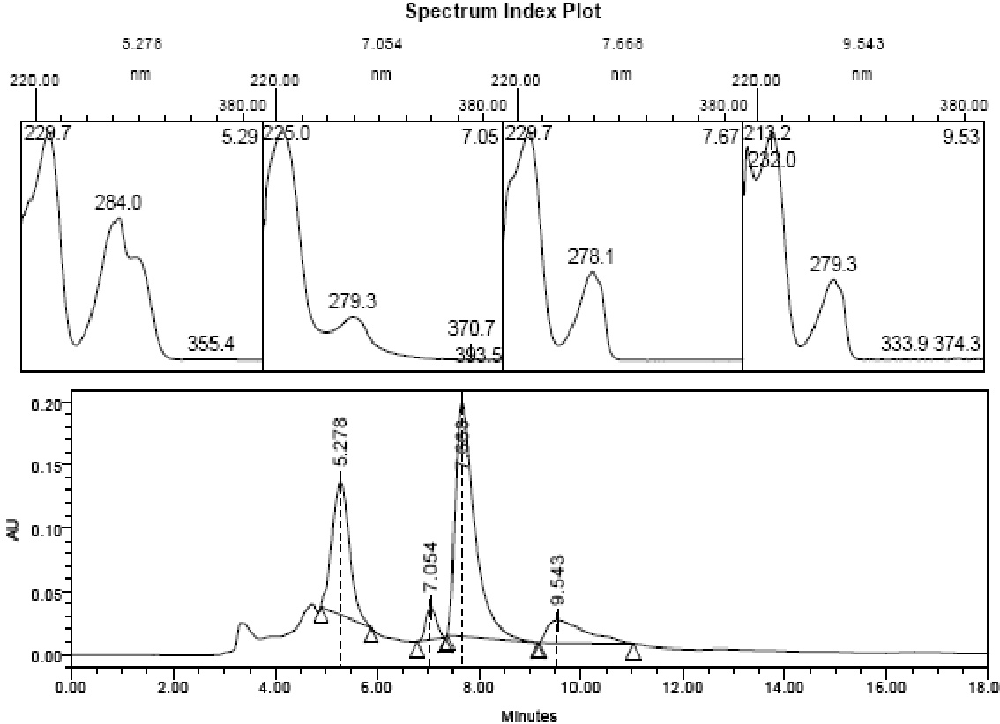
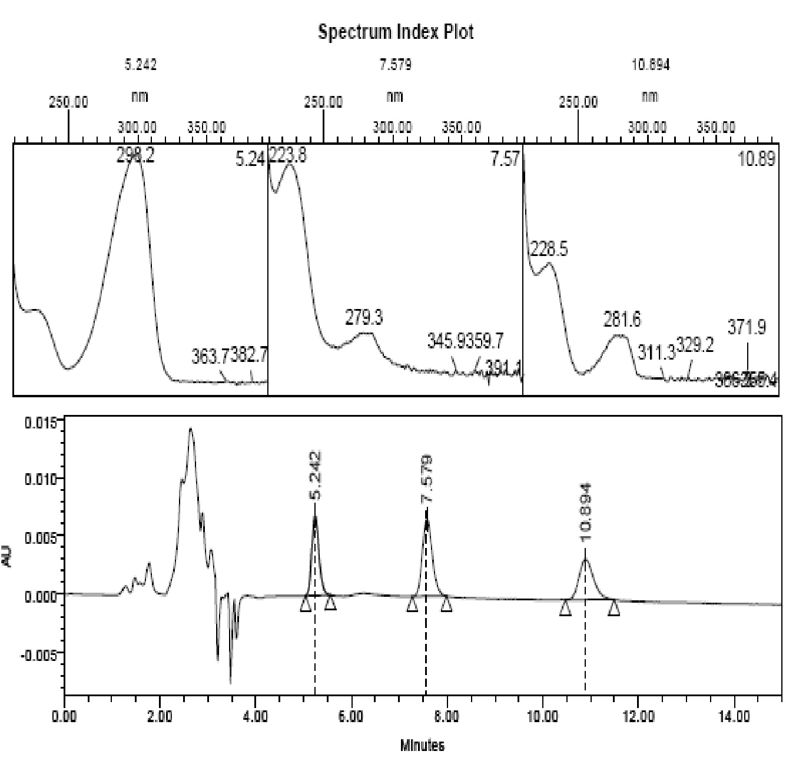
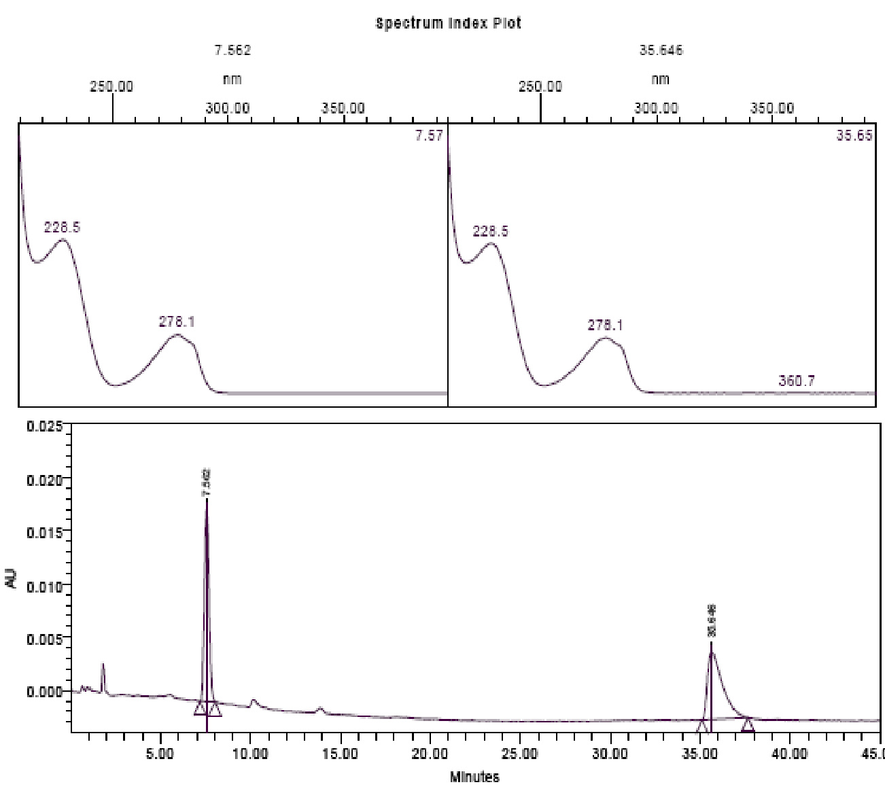
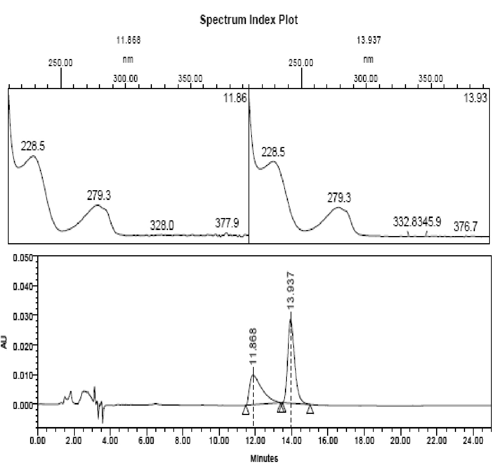
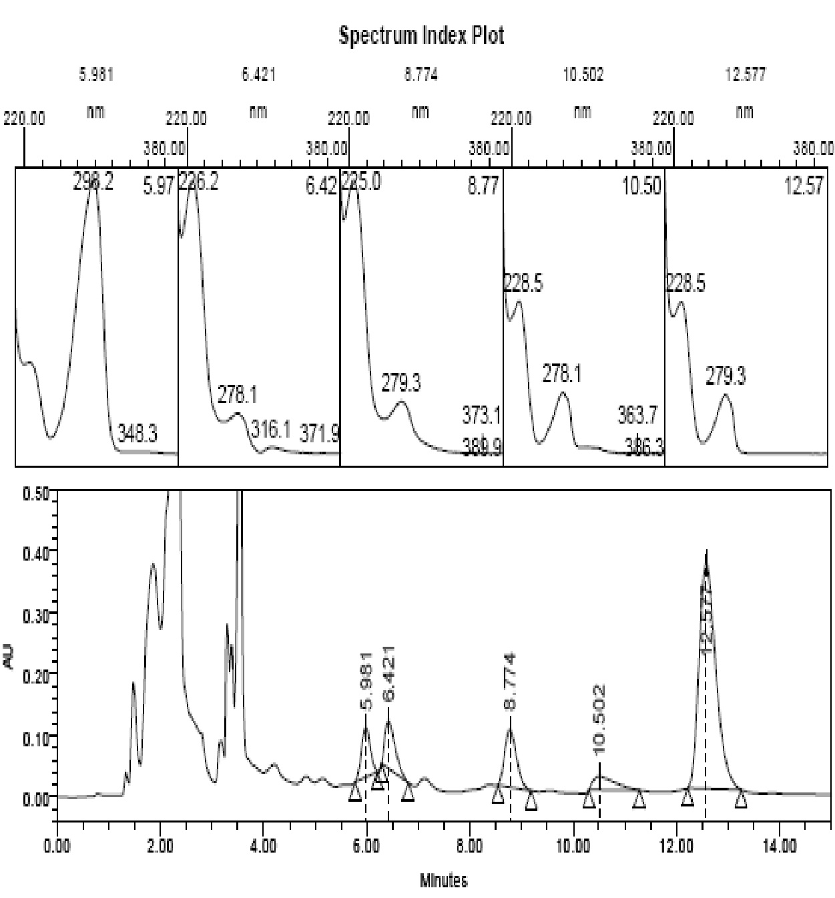
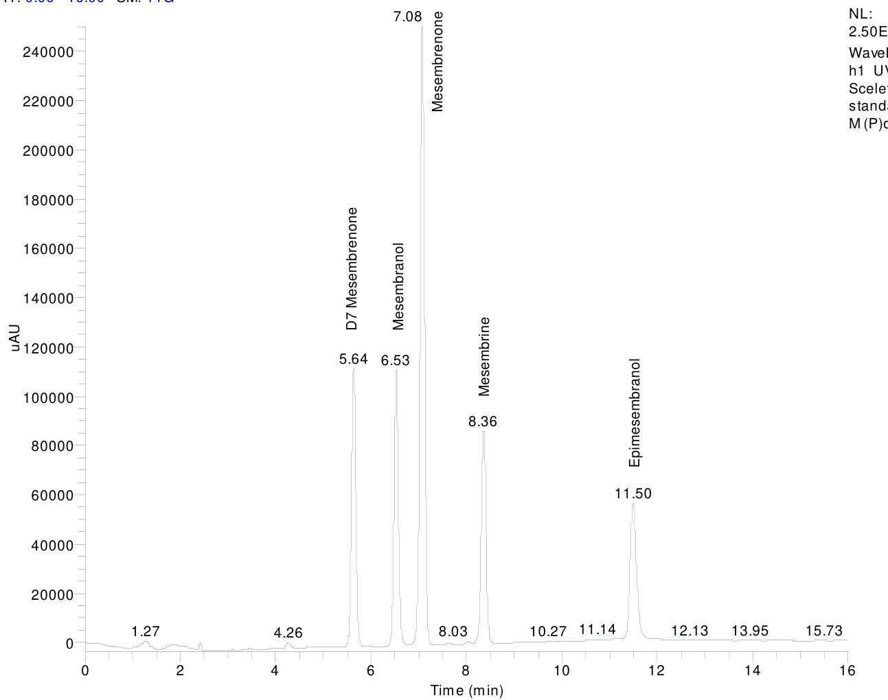
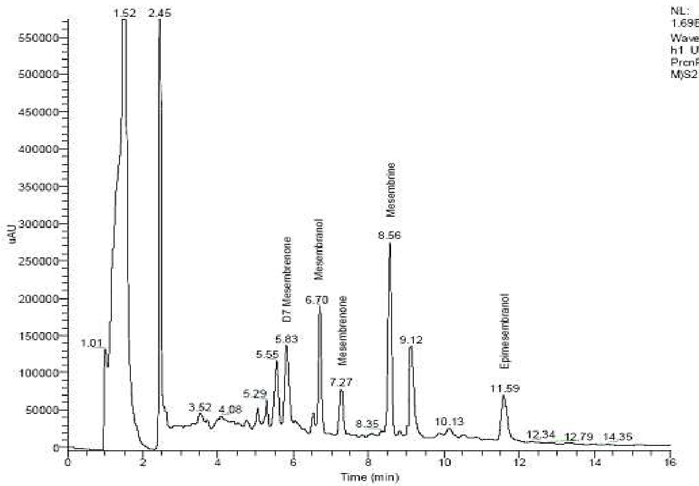

# HPLC Analysis of Mesembrine-Type Alkaloids in Sceletium Plant Material Used as An African Traditional Medicine

Srinivas Patnala, Isadore Kanfer

Division of Pharmaceutics, Faculty of Pharmacy, Rhodes University, Grahamstown, South Africa.

Received, November 3, 2010; Revised, November 8, 2010; Accepted, November 9, 2010; Published, November 9, 2010.

Abstract – Purpose. Sceletium plant species have been reported to contain psychoactive alkaloids, specifically belonging to mesembrine-type alkaloids. Sceletium is presently marketed through health shops and on the internet as dried plant powder and as pharmaceutical dosage forms and purported to be useful in the treatment of psychological disorders. However, there are no validated analytical methods and reference standards of the relevant alkaloids are not commercially available for use in the analysis and quality control of Sceletium products and dosage forms. Hence, the objective of this research was to isolate and characterize appropriate analytical markers for use in the assay and as well as markers for fingerprinting by high performance liquid chromatography (HPLC). Methods. The separation of the relevant alkaloids was carried out on a C18 column and detected at a UV wavelength of $2 2 8 \mathrm { n m }$ . The method was validated and used to assay the mesembrine-type alkaloids namely $\Delta ^ { 7 }$ mesembrenone, mesembranol, mesembrenone, mesembrine and epimesembranol. Results. The calibration curves were found to be linear over the entire concentration range of $4 0 0 – 6 0 , 0 0 0 ~ \mathrm { n g / m l }$ with correlation coefficients ${ > } 0 . 9 9$ . The accuracies of the relevant alkaloids were found to be between 94.8 and $1 0 3 . 6 \%$ with an inter-day relative standard deviation (RSD) of less than $2 . 8 \%$ . The precision studies showed inter-day RSD’s of less than $3 \%$ . The recoveries were all within the range of 95 and $10 5 \%$ $( \mathrm { R S D } { < } 4 . 5 \%$ ) and the limits of quantitation (LOQ) and detection (LOD) were found to be 100 and $2 0 0 ~ \mathrm { { n g / m l } }$ respectively using the respective S/N ratios of 3 and 10. Conclusions. An HPLC method for the quantitative analysis of $\Delta ^ { 7 }$ mesembrenone, mesembranol, mesembrenone, mesembrine and epimesembranol in Sceletium plant material has been developed and validated. This assay method can be applied for the quality control of Sceletium plant material which is used as an African Traditional Medicine for the treatment of psychological disorders.

## INTRODUCTION

Evaluation of natural products for their chemical components is challenging due to the inherent diversity of their chemical composition. Separation techniques and their application to evaluate specific chemical components of natural products is an important aspect which permits accurate characterization and quantification. It has been reported that almost $80 \%$ of known natural substances are non-volatile and thermolabile, which makes high performance liquid chromatography (HPLC) with ultra violet (UV) detection the most commonly used analytical technique for natural products (1). Photo diode array (PDA) detectors enhance the versatility of the analysis by allowing multi-wavelength detection of compounds based on their distinct chromophore active regions. PDA is thus particularly useful for multi-component sample analysis since one sample can usually provide sufficient data to assess the purity of the individual components (2). There are many reports on the use of HPLC for qualitative analysis of herbal medicines, more importantly for the fingerprinting of South African traditional medicines (3). In addition, chromatographic fingerprinting has been widely accepted and recommended by various regulatory authorities such as WHO (4), US-FDA (5), EMEA (6) and MHRA (7) to assess the consistency of batch to batch dosage forms containing phytochemical components of the harvested plants.

In the current international regulatory scenario, qualitative and quantitative analytical methods are considered mandatory. Even though Sceletium plants have been relatively wellresearched for their chemical constituents, validated methods for quantitative analysis of the various alkaloid components found in Sceletium species have not yet been reported in the published literature.

Corresponding Author: Isadore Kanfer, Division of Pharmaceutics, Faculty of Pharmacy, Rhodes University, Grahamstown, South Africa. Email: I.Kanfer@ru.ac.za

Smith et al. (8) reported a qualitative method using gas chromatography-mass spectrometry (GC-MS) attached to a nitrogen-phosphorus detector (NPD). The GC-MS analysis was carried out on a DB-5 capillary column of $0 . 2 5 ~ \mathrm { \ m m }$ internal diameter (i.d), which was temperature programmed from $2 3 0 ^ { \circ } \mathrm { C }$ to $2 6 0 ^ { \circ } \mathrm { C }$ at $1 ^ { \circ } \mathrm { C }$ per minute. The detector was maintained at $3 5 0 ^ { \circ } \mathrm { C }$ . The method described the separation of $4 ^ { \prime }$ -Odemethylmesembrenol, mesembrine and mesembrenone.

Gericke et al. (9), in their patent application, reported three methods using GC and one using a HPLC method. In all three methods, the samples were prepared by dissolving the extracts in a minimum quantity of methanol. The first method is mentioned as a “fast system” for “large number of samples”. The method uses a DB-1 fused silica capillary column $3 0 \mathrm { m } \mathrm { x } 0 . 2 5 \mathrm { m m }$ i.d, with helium as carrier gas. The column temperature was maintained isothermally at $2 0 0 ^ { \circ } \mathrm { C }$ for 15 minutes and then programmed at $1 0 0 ^ { \circ } \mathrm { C / m i n }$ to $3 0 0 ^ { \circ } \mathrm { C }$ The injector and the flame ionization detector were maintained at $2 3 0 ^ { \circ } \mathrm { C }$ and $3 0 0 ^ { \circ } \mathrm { C }$ respectively (9). A second method is mentioned as “high resolution analyses” for “selected samples”. The method also uses a DB-1 column and helium as carrier gas, similar to the first method. The column temperature was isothermally maintained at $1 5 0 ^ { \circ } \mathrm { C }$ for 15 minutes and then programmed at $6 0 ^ { \circ } \mathrm { C } /$ min to $3 2 0 ^ { \circ } \mathrm { C }$ . The injector and the NPD were maintained at $2 3 0 ^ { \circ } \mathrm { C }$ and $3 0 0 ^ { \circ } \mathrm { C }$ respectively (9).  A third method mentioned is for GC-MS analysis, with the column, carrier gas and the temperatures maintained similar to the second method. The MS conditions were not described (9). The patent also includes an HPLC method using a reversed phase system ( $\mathrm { \tilde { C } } _ { 1 8 }$ column). The mobile phase comprised $30 \%$ trimethylamine solution ( $1 \%$ in water) and $70 \%$ acetonitrile solution $60 \%$ in water) at a flow rate of $1 ~ \mathrm { m l }$ per minute. The PDA detector was set for two channels, one at $2 8 0 { \pm } 3 0 ~ \mathrm { n m }$ (Channel A) and the other at $2 9 2 { \pm } 1 0 \ \mathrm { \ n m }$ (Channel B). The method suggests that “for concentrations below $0 . 0 5 ~ \mathrm { m g }$ per ml, channel A is more accurate” (9).

The South African National Biodiversity Institute (SANBI), South African Medical Research Council (MRC) and the University of Western Cape (UWC) published a collaborative paper describing another HPLC method on the internet as a part of a monograph project for herbal plants. It was suggested that the method could be applied to perform fingerprinting analysis of medicinal plant extracts. The HPLC method which was obtained by personal communication from the authors, uses methanol and $1 \%$ acetic acid in water mixed over a 25 minute gradient program, passing through a $\mathrm { C } _ { 1 8 }$ column and dual channel detection at 280 and $3 2 5 \mathrm { n m }$ . A typical HPLC chromatogram of a methanol extract and the retention times of the major compounds purported to elute at 2.38, 3.15, 4.89 and 7.84 was displayed on the chromatogram (10).

No validation data were reported in any of the analytical methods described for Sceletium. Furthermore, the use of UV wavelengths in the range of $2 8 0 \mathrm { n m }$ and $3 2 5 \mathrm { n m }$ for detection are not optimum for most of the Sceletium alkaloids where, except for $\Delta ^ { 7 }$ mesembrenone $\langle \lambda _ { \mathrm { m a x } }$ ${ \tt = } 2 9 0 \mathrm { n m } )$ , their $\lambda _ { \operatorname* { m a x } }$ is at $2 2 8 \mathrm { n m }$ .

Hence the main objective was to develop a simple, rapid, accurate, precise and reproducible HPLC method that can be applied for the qualitative and quantitative analysis for the quality control of Sceletium plant material and associated products containing such alkaloids.

## METHODS

## Reagents and Materials

HPLC grade methanol, acetonitrile (ACN) (Romil Ltd. Cambridge, Great Britain) and lab grade ammonium hydroxide $2 5 \%$ solution (Associated Chemical Enterprises (Pty) Ltd. Southdale, South Africa) was used. Water was purified in a Milli$\mathbf { Q } \boldsymbol { \ @ }$ system and Millex $\mathrm { H V } ^ { \mathfrak { B } }$ hydrophilic PVDF $0 . 4 5 ~ { \mu \mathrm { m } }$ membrane filters (Millipore, Bedford, USA) were used for filtration. Sceletium reference compounds mesembrine, mesembrenone, $\Delta ^ { 7 }$ mesembrenone were isolated from plant material and the compounds mesembranol and epimesembranol were prepared by hydrogenation of mesembrine. Mesembrine hydrochloride was prepared from mesembrine base. All compounds were qualified by $\mathrm { ^ { 1 } H }$ , $^ { 1 3 } \mathrm { C }$ and 2D NMR and mass spectroscopy. Sceletium plant samples were obtained as gift samples from cultivators.

## Instrumentation

Method validation was performed on a HPLC SpectraSYSTEM P2000 pump connected to an AS1000 auto sampler and UV1000 variablewavelength UV detector (Thermo Separation Products, Riviera Beach, FL, USA) was used to monitor the compounds at $2 2 8 \mathrm { n m }$ . The output was interfaced to LCQ software (Finnigan). NMR analysis was performed on a Bruker Advance DRX 400 MHz NMR Spectrophotometer (Rheinstetten, Germany). The method development was carried out on an Alliance 2690 HPLC connected to a PDA detector 2996 (Waters Corporation, Milford, MA, USA). The alkaloids were separated on two different  HPLC columns, Luna $\textsuperscript { \textregistered }$ $\mathrm { C } _ { 1 8 }$ (2), $5 ~ { \mu \mathrm { m } }$ , $1 5 0 \ \mathrm { m m } \times 4 . 6 \ \mathrm { m m }$ i.d. and Hypersil® $1 5 0 \textrm { ~ x ~ } 4 . 6 \textrm { ~ m m }$ i.d $\mathrm { C } _ { 1 8 }$ column (Phenomenex®, Torrence, CA, USA). Analytical balances, Type AG 135 and a Micro Balance MX5 (Mettler Toledo, Switzerland) were used for weighing standards and samples. An electronic pipette model 71050XET (Biohit PLC, Helsenki, Finland) was used to transfer standard and sample solutions for dilutions.

### Method development

Initially, the method described in the patent literature (9) was used to observe the profiles of Sceletium plant extract. The resulting chromatographic profile detected with a PDA detector in the range of 400 to $2 0 0 ~ \mathrm { n m }$ indicated many unresolved peaks which eluted with in 5 minutes and could not be identified since reference standards for each individual alkaloid were not available. Since the alkaloids are basic molecules, a mobile phase comprising of $1 0 0 ~ \mathrm { { m M } }$ solution of ammonium acetate in water and ACN 70:30 (v:v) was initially used  to separate the alkaloid constituents. The methanol extract showed distinct peaks at RT 5.278, 7.054, 7.668 and 9.543 with UV spectra showing maxima at $2 2 9 { \pm } 5 \ \mathrm { n m }$ , $2 7 8 { \pm } 2 \ \mathrm { n m }$ and $2 8 4 \mathrm { n m }$ (Figure 1).

Whereas, using a mobile phase consisting of relatively high salt concentration $1 0 0 \mathrm { m M }$ ammonium acetate solution facilitated identification of the relevant alkaloid components, the resulting peaks eluted with relatively poor peak shape.  Hence, attempts were made to exclude the use of buffer salts and develop a mobile phase using a higher $\mathfrak { p H }$ to resolve the various Sceletium alkaloids and which would be beneficial for use with LC-MS.

The alkaloids, mesembrine, mesembrenone and $\Delta ^ { 7 }$ mesembrenone were isolated and their structures confirmed by NMR. The HPLC peaks were identified based on the retention times of the prepared reference compounds.

Subsequently, the optimum conditions involved the use of a mobile phase comprising of water:ACN:ammonium hydroxide solution $( 2 5 \% )$ mixed in a ratio of 70:30:0.01 (v:v:v) and was tested under isocratic conditions using a Hypersil® $\mathrm { C } _ { 1 8 }$ column. The three alkaloids were well resolved with $\Delta ^ { 7 }$ mesembrenone at RT 5.242, mesembrenone at RT 7.579 and mesembrine at RT 10.894 minutes (Figure 2).

  
Figure 1. HPLC-PDA chromatogram of Sceletium extract using a mobile phase comprising of $1 0 0 ~ \mathrm { m M }$ solution of ammonium acetate in water and ACN  70:30 (v:v). UV spectra for each relevant peak obtained on-line using a PDA detector are depicted above the chromatogram.

  
Figure 2. HPLC-PDA chromatogram of Sceletium standards, $\Delta ^ { 7 }$ mesembrenone, mesembrenone and mesembrine using a mobile phase comprising of water:ACN:ammonium hydroxide solution mixed in a ratio of 70:30:0.01 (v:v:v). UV spectra for each peak obtained on-line using a PDA detector are depicted above the chromatogram.

The isocratic conditions when applied to the analysis of mesembranol and epimesembranol, posed two problems. Firstly, the epimesembranol peak was retained on the column for an extended period of over 35 minutes (Figure 3) and secondly, separation between mesembranol and mesembrine could only be achieved with an increase of water content to 72 parts. Even though separation was achieved, the resolution and the peak shape were not ideal due to peak tailing (Figure 4).

Sceletium plant powder was analyzed using the above mentioned isocratic conditions which separated $\Delta ^ { 7 }$ mesembrenone ( $\mathrm { R T ~ 5 . 9 8 1 ~ \ m i n } )$ , an unknown compound (RT 6.421 min), mesembrenone (RT $8 . 7 7 4 ~ \mathrm { \ m i n } \mathrm { ~ , ~ }$ , mesembranol (RT $1 0 . 5 0 2 \ \mathrm { m i n } )$ ) and mesembrine $( 1 2 . 5 7 7 ~ \mathrm { m i n } )$ (Figure 5).

Even though the developed isocratic system resolved the alkaloidal components, the RTs and the peak shape prompted changes to be made to the mobile phase which involved the use of gradient system. In this manner the RTs of the identified alkaloids could be manipulated to optimize peak shapes and also to reduce the RT of epimesembranol.

  
Figure 3. HPLC-PDA chromatogram of mesembranol and epimesembranol using a mobile phase comprising of water:ACN:ammonium hydroxide solution mixed in a ratio of 70:30:0.01 (v:v:v). UV spectra for each peak obtained on-line using a PDA detector are depicted above the chromatogram.

A binary gradient elution system made up of $0 . 1 \%$ ammonium hydroxide solution in water mixed with ACN was developed with an initial $80 \%$ aqueous phase changing to $50 \%$ over a period of 15 minutes on a Luna® $\dot { \mathbf { C } } _ { 1 8 } ( 2 )$ HPLC column. The analysis resulted in satisfactory resolution and retention times for all the reference standards (Figure 6) and related components in Sceletium raw material with a total run time of 16 minutes (Figure 7).

#### METHOD VALIDATION Linearity

Standard stock solutions $( 1 \mathrm { m g / m l } )$ of $\Delta ^ { 7 }$ mesembrenone, mesembranol, mesembrenone, mesembrine hydrochloride and epimesembranol were prepared in methanol. A working stock solution was mixed and diluted appropriately to obtain a concentration of $1 0 0 ~ \mathrm { \mu g / m l }$ of each alkaloid. Standard solutions comprising a set of eleven calibrators in a concentration range of 400- $6 0 , 0 0 0 ~ \mathrm { n g / m l }$ were prepared.

#### Accuracy

Accuracy studies were performed by separately preparing standard solutions and appropriate dilutions to obtain final concentrations of 4000, 8000 and $1 0 , 0 0 0 \mathrm { n g / m l }$ for use as QC standards.

  
Figure 4. HPLC-PDA chromatogram of mesembranol and mesembrine using a mobile phase comprising of water:ACN:ammonium hydroxide solution mixed in a ratio of 72:28:0.01 (v:v:v). UV spectra for each peak obtained on-line using a PDA detector are depicted above the chromatogram.

The selected Sceletium plant powder was prepared in methanol containing $7 . 5 ~ \mathrm { m g }$ , $1 5 ~ \mathrm { m g }$ and $2 5 \mathrm { \ m g / m l }$ in triplicate to provide the low, medium and high samples by sonication for 20 minutes and filtered through $0 . 4 5 ~ { \mu \mathrm { m } }$ PVDF membrane filter.

#### Recovery

Recovery studies were carried out by preparing in triplicate, three individual concentrations of 10 $\mathrm { m g / m l }$ of plant material. Standard stock solutions of each of the five alkaloids were added to each of the triplicate sample solutions to result in concentrations of $2 0 0 0 ~ \mathrm { n g }$ , $4 0 0 0 ~ \mathrm { n g }$ and 10,000 $\mathrm { n g / m l }$ of each of the alkaloids/sample.

#### Limit of Detection and Limit of Quantitation

Standard stock solutions were diluted appropriately to obtain concentrations for the estimation of the limit of detection (LoD) and limit of quantitation (LoQ) according to a signal to noise (S/N) ratio of 3:1 and 10:1, respectively.

  
Figure 5. HPLC-PDA chromatogram of Sceletium plant extract using a mobile phase comprising of water:ACN:ammonium hydroxide solution mixed in a ratio of 72:28:0.01 (v:v:v). UV spectra for each relevant peak obtained on-line using a PDA detector are depicted above the chromatogram.

#### RESULTS

#### Confirmation of peak identity

The identity of each relevant alkaloidal peak in the standard chromatogram (Figure 6) was confirmed by the respective spectral data ( 1H, 13C and 2D NMR and mass spectroscopy as well as xray crystallography for the crystalline compounds, mesembrine hydrochloride and mesembranol, the others being semi-solid/liquids)  obtained for each of the mesembrine–alkaloids used as reference standards.

#### Linearity

Calibration curves were constructed by plotting the peak area of each alkaloid versus the concentration corresponding to that alkaloid on each of three days. The curves obtained were found to be linear with determination coefficients better than 0.99 and in one instance, 0.9858 (Table 1).

Wavelengt Sceletium standards M (P)day2

  
RT: 0.00 - 16.00 SM: 11G   
Figure 6. HPLC chromatogram of standard Sceletium alkaloids.

#### Accuracy

The studies were performed using QC samples that were prepared separately on each day of analysis. The accuracy of the method was found to be between $9 6 . 9 \% 1 0 3 \%$ for all five compounds. The inter-day relative standard deviation (RSD) values obtained were less than $3 \%$ (Tables 2a and 2b).

#### Precision

Studies were carried out on Sceletium plant material by preparing three sets of low, medium and high sample concentrations on each day of analysis.  The RSD’s for all the precision data were found to be less than $6 \%$ (Table 3).

#### Recovery

The values obtained for this experiment which involved spiking plant material with the relevant alkaloids, are shown in Tables 4a and 4b where the recoveries of all five identified alkaloids were seen to be in the range of $9 5 \% - 1 0 5 \%$ for each of the added compounds with inter-day RSDs of less than $5 \%$ .

Limit of Detection and Limit of Quantitation The LoD and LoQ of each of the 5 alkaloids were found to be 100 and $2 0 0 ~ \mathrm { { n g / m l } }$ respectively using the respective $\mathrm { S / N }$ ratios of 3 and 10.

#### DISCUSSION

The Sceletium plant is currently receiving great deal of attention in view of its purported potential as natural medicine for use in common mental health and wellness conditions including anxiety, depression and stress. A website has recently been launched whereby the South African company HGH Pharmaceuticals Pty Limited has been granted the country’s first ever integrated export and bioprospecting permit to produce Zembrin $\textsuperscript { \textregistered }$ , which is patented standardized Sceletium extract.

Wa emgt \~r,:nAili l'.:,;,j M}S2 d'a.y2

  
Figure 7.  HPLC chromatogram of Sceletium plant material.

<html><body><table><tr><td colspan="4">Table1.Linearranges and coefficients ofdetermination</td></tr><tr><td>Name of the compound</td><td>Day</td><td>y=mx+c linear model</td><td>Determination coefficient (R²)</td></tr><tr><td rowspan="4">△Mesembrenone</td><td></td><td></td><td></td></tr><tr><td>Day 2</td><td>y= 49.425x+ 23244</td><td>R²= 0.9947</td></tr><tr><td></td><td></td><td></td></tr><tr><td>Day 3</td><td>y=47.453x+25688</td><td>R²= 0.9960</td></tr><tr><td rowspan="4">Mesembranol</td><td>Day 1</td><td>y= 39.347x + 12817</td><td>R² = 0.9944</td></tr><tr><td>Day 2</td><td>y= 39.748x+9961.1</td><td>R² = 0.9960</td></tr><tr><td>Day 3</td><td></td><td></td></tr><tr><td></td><td>y=39.120x+13789</td><td>R² = 0.9973</td></tr><tr><td rowspan="4">Mesembrenone</td><td>Day 1</td><td>y = 94.156x+ 54025</td><td>R² = 0.9926</td></tr><tr><td>Day 2</td><td>y= 93.704x + 50233</td><td>R²= 0.9974</td></tr><tr><td>Day 3</td><td>y = 91.179x+41683</td><td>R² = 0.9977</td></tr><tr><td></td><td></td><td></td></tr><tr><td rowspan="4">Mesembrine HCl</td><td></td><td></td><td></td></tr><tr><td>Day 1</td><td>y=34.676x+24050</td><td>R² = 0.9858</td></tr><tr><td>Day 2 Day 3</td><td>y= 33.674x +23121</td><td>R² = 0.9956</td></tr><tr><td></td><td>y=33.070x+23720</td><td>R² = 0.9945</td></tr><tr><td rowspan="4">Epimesembranol</td><td></td><td></td><td></td></tr><tr><td>Day 1</td><td>y= 32.126x+11333</td><td>R² = 0.9925</td></tr><tr><td>Day 2</td><td>y = 29.952x + 15173</td><td>R² = 0.9921</td></tr><tr><td>Day 3</td><td>y= 32.581x + 13702</td><td>R² = 0.9964</td></tr></table></body></html>

<html><body><table><tr><td colspan="10">Table2a.Accuracy studies</td></tr><tr><td></td><td colspan="3">△ Mesembrenone</td><td colspan="3"></td><td colspan="2">Mesembranol</td><td colspan="3">Mesembrenone</td><td rowspan="2">RSD</td></tr><tr><td colspan="2"></td><td>Agm</td><td>Observed</td><td>Aceracy</td><td>RSD</td><td>Ag/m</td><td>Obgerved</td><td>Acccy RSD</td><td>Ag/m</td><td>Oogrned</td><td>Aceracy</td></tr><tr><td rowspan="3">Low spike</td><td>1</td><td>3520.00</td><td>3432.40</td><td>97.50</td><td></td><td>4240.00</td><td>4239.11</td><td>101.25</td><td>4320.00</td><td>4293.20</td><td>99.40</td><td></td></tr><tr><td>2</td><td>3360.00</td><td>3296.85</td><td>98.12</td><td>1.71</td><td>4160.00</td><td>4196.00</td><td>100.86 0.99</td><td>4160.00</td><td>4150.55</td><td>99.77</td><td>1.64</td></tr><tr><td>3</td><td>3840.00</td><td>3866.44</td><td>100.68</td><td>4320.00</td><td></td><td>4292.60</td><td>99.37</td><td>4400.00</td><td>4385.91</td><td>99.68</td><td></td></tr><tr><td rowspan="4"> Medium Spike</td><td>1</td><td>7040.00</td><td>6847.90</td><td>97.23</td><td></td><td>8480.00</td><td>8038.42</td><td>94.79</td><td>8640.00</td><td>8408.45</td><td>97.32</td><td></td></tr><tr><td>2</td><td>6720.00</td><td>6569.00</td><td>97.75</td><td>0.30 8320.00</td><td>8036.60</td><td>96.59</td><td>1.10</td><td>8320.00</td><td>8213.10</td><td>98.71</td><td>1.57</td></tr><tr><td>3</td><td>7680.00</td><td>7511.50</td><td>97.81</td><td></td><td>8640.00</td><td>8365.60</td><td>96.80</td><td>8800.00</td><td>8417.23</td><td>95.65</td><td></td></tr><tr><td>1</td><td>8800.00</td><td>8802.40</td><td>100.03</td><td>10600.00</td><td>10711.20</td><td>101.05</td><td></td><td>10800.00</td><td>10860.40</td><td>100.6</td><td></td></tr><tr><td rowspan="2">High spike</td><td>2</td><td>8400.00</td><td>8546.85</td><td>101.75</td><td>2.17</td><td>10400.00</td><td>10395.51</td><td>99.96 1.02</td><td>10400.00</td><td>10473.80</td><td>100.71</td><td>2.30</td></tr><tr><td>3</td><td>9600.00</td><td>9352.00</td><td>97.45</td><td>10800.00</td><td>10689.50</td><td>99.00</td><td></td><td>11000.00</td><td>10633.00</td><td>96.70</td><td></td></tr></table></body></html>

<html><body><table><tr><td colspan="10">Table2b Accuracy studies (continued)</td></tr><tr><td rowspan="2"></td><td rowspan="2"></td><td colspan="3">Mesembrine</td><td rowspan="2">RSD</td><td colspan="3">Epimesembranol</td><td rowspan="2">RSD</td></tr><tr><td>Day Actm</td><td>Observed</td><td>Accuracy</td><td>Agm</td><td>Observed</td><td>%ceuracy</td></tr><tr><td rowspan="4">Low spike</td><td>1</td><td>4240.00</td><td>4192.53</td><td>98.9</td><td></td><td>4160.00</td><td>4109.82</td><td>98.79</td><td></td></tr><tr><td>2</td><td>4080.00</td><td>4068.10</td><td>99.71</td><td>1.60</td><td>3680.00</td><td>3777.44</td><td>102.64</td><td>2.09</td></tr><tr><td>3</td><td>3840.00</td><td>3710.60</td><td>96.6</td><td></td><td>4160.00</td><td>4129.68</td><td>99.27</td><td></td></tr><tr><td>1</td><td>8480.00</td><td>8229.90</td><td>97.05</td><td></td><td>8320.00</td><td>8382.05</td><td>100.75</td><td></td></tr><tr><td>Medium Spike</td><td>2</td><td>8160.00</td><td>8264.74</td><td>101.28</td><td>2.30</td><td>7360.00</td><td>7545.04</td><td>102.51</td><td>2.05</td></tr><tr><td rowspan="3">High spike</td><td>3</td><td>7680.00</td><td>7723.68</td><td>100.57</td><td></td><td>8320.00</td><td>8185.72</td><td>98.39</td><td></td></tr><tr><td>1</td><td>10600.00</td><td>10303.93</td><td>97.21</td><td></td><td>10400.00</td><td>10715.70</td><td>103.04</td><td></td></tr><tr><td>2</td><td>10200.00</td><td>10459.70</td><td>102.55</td><td>2.80</td><td>9200.00</td><td>9535.00</td><td>103.64</td><td>2.60</td></tr><tr><td></td><td>3</td><td>9600.00</td><td>9455.46</td><td>98.49</td><td></td><td>10400.00</td><td>10264.00</td><td>98.70</td><td></td></tr></table></body></html>

<html><body><table><tr><td colspan="5">Table3 Precisionstudies</td></tr><tr><td colspan="5">Content in μg/1oomg of plant material</td></tr><tr><td>Compound</td><td>Day1</td><td>Day2</td><td>Day3</td><td>Inter-day % RSD (n=3)</td></tr><tr><td>△Mesembrenone</td><td></td><td></td><td></td><td></td></tr><tr><td>Low</td><td>20.00 (±1.00)</td><td>20.33 (±0.58)</td><td>21.33 (±0.58)</td><td>3.37</td></tr><tr><td>Medium</td><td>23.67 (±0.58)</td><td>23.00 (±1.00)</td><td>24.33 (±1.15)</td><td>2.81</td></tr><tr><td>High</td><td>23.00 (±1.73)</td><td>23.67 (±1.53)</td><td>23.00 (±2.00)</td><td>1.67</td></tr><tr><td>Mesembranol</td><td></td><td></td><td></td><td></td></tr><tr><td>Low</td><td>91.33 (±7.50)</td><td>94.67 (±9.30)</td><td>97.30 (±2.52)</td><td>3.17</td></tr><tr><td>Medium</td><td>97.67 (±3.22)</td><td>96.33 (±5.70)</td><td>91.30 (±5.03)</td><td>3.53</td></tr><tr><td>High</td><td>88.67 (±1.12)</td><td>93.00 (±2.65)</td><td>88.67 (±5.13)</td><td>2.77</td></tr><tr><td>Mesembrenone</td><td></td><td></td><td></td><td></td></tr><tr><td>Low</td><td>12.10 (±1.87)</td><td>12.87 (±0.84)</td><td>12.67 (±1.40)</td><td>3.20</td></tr><tr><td>Medium</td><td>12.87 (±0.38)</td><td>13.20 (±0.38)</td><td>13.03 (±1.72)</td><td>1.27</td></tr><tr><td>High</td><td>13.37 (±0.71)</td><td>13.43 (±0.64)</td><td>13.83 (±0.47)</td><td>1.85</td></tr><tr><td>Mesembrine</td><td></td><td></td><td></td><td></td></tr><tr><td>Low</td><td>144.50 (±0.12)</td><td>147.90 (±1.10)</td><td>149.40 (±2.51)</td><td>1.70</td></tr><tr><td>Medium</td><td>165.40(±1.63)</td><td>166.03(±5.65)</td><td>163.30 (±4.54)</td><td>0.87</td></tr><tr><td>High</td><td>165.30 (±3.15)</td><td>167.24 (±10.16)</td><td>162.50 (±5.91)</td><td>1.44</td></tr><tr><td>Epimesembranol</td><td></td><td></td><td></td><td></td></tr><tr><td>Low</td><td>55.00 (±2.56)</td><td>60.56 (±7.51)</td><td>56.03 (±3.47)</td><td>5.17</td></tr><tr><td>Medium</td><td>61.13(±3.75)</td><td>64.80 (±5.60)</td><td>64.00(±3.80)</td><td>3.05</td></tr><tr><td>High</td><td>62.25 (±2.74)</td><td>68.43 (±2.92)</td><td>62.14 (±0.86)</td><td>5.60</td></tr><tr><td></td><td></td><td></td><td></td><td></td></tr></table></body></html>

$( \pm \mathrm { S D } ) =$ Standard deviation Low = 7.5 mg/ml $\scriptstyle ( 1 = 3 )$ ), Medium = 15 mg/ml $\mathrm { ( n } { = } 3 \mathrm { ) }$ ), High = 25 mg/ml $( \mathrm { n } { = } 3 )$ ); Total samples $\scriptstyle \mathrm { n = 9 }$ each day

The pharmacological actions of Zembrin $\textsuperscript { \textregistered }$ are described in granted international patents and new patent applications. Validated analytical methods to assay Sceletium plant material and dosage forms for relevant alkaloidal content have not hitherto been reported in the published scientific literature. Published analytical procedures have focused only on qualitative determinations.

Since the identified markers have closely related structures, of which two alkaloids, mesembranol and epimesembranol are epimers, the main objective of this investigation was to develop an efficient HPLC method for the separation and quantitative analysis of the relevant alkaloid components in Sceletium, and also to reduce, in particular the RT of epimesembranol, which was too long $( > 3 0 ~ \mathrm { m i n } )$ under isocratic conditions. Use of a PDA detector was extremely valuable for peak identification and homogeneity testing during the initial method development.

A simple, accurate, precise, rapid and reproducible HPLC method was developed for the identification and quantitative analysis of 5 relevant Sceletium alkaloids which has been successfully applied for the assay and QC of Sceletium plant material. Furthermore, this method was found to efficiently separate the alkaloidal markers from complex components present in plant material using a simple methanol sample extraction procedure.  This method has also been successfully used to study chemotaxonomy of some Sceletium species and has provided impetus for the future development of quality monographs for plant and dosage forms containing Sceletium.

ACKNOWLEDGEMENT

Funding from the South African Medical Research Council (MRC) and Rhodes University is gratefully acknowledged.

<html><body><table><tr><td>Day-1</td><td colspan="10">Table 4a. Recovery studies</td><td></td><td></td><td></td></tr><tr><td></td><td></td><td></td><td></td><td></td><td></td><td>Day-2</td><td></td><td></td><td></td><td>Day-3</td><td></td><td></td><td> Inter-day</td></tr><tr><td></td><td></td><td>ro</td><td>Recovery</td><td>R</td><td></td><td></td><td>Recovery</td><td></td><td></td><td></td><td>Recovery</td><td>RSD</td><td>RR</td></tr><tr><td>*Content</td><td>2.2</td><td></td><td></td><td></td><td>2.2</td><td></td><td></td><td></td><td></td><td></td><td></td><td></td><td></td></tr><tr><td>Low</td><td>(+1.76) 3.96²</td><td>3.89 (±0.05)</td><td>96.20</td><td>2.96</td><td>(+1.84) 4.04</td><td>4.00 (±0.07)</td><td>99.00</td><td>1.75</td><td>2.3 (+1.92) 4.22</td><td>4.31 (±0.05)</td><td></td><td>1.22</td><td>3.00</td></tr><tr><td>Medium</td><td></td><td></td><td></td><td></td><td></td><td></td><td></td><td></td><td></td><td></td><td>102.13</td><td></td><td></td></tr><tr><td></td><td>(+3.52) 5.72</td><td>5.83 (±0.10)</td><td>101.90</td><td>2.85</td><td>(+3.68) 5.88</td><td>5.72 (±0.10)</td><td>97.30</td><td>1.83</td><td>(+3.84) 6.14</td><td>6.17 (±0.11)</td><td>100.50</td><td>1.82</td><td>2.36</td></tr><tr><td>High</td><td>(+8.80) 11.00</td><td>10.73 (±0.13)</td><td>97.50</td><td>1.50</td><td>(+9.20) 11.40</td><td>10.92 (±0.24)</td><td>95.80</td><td>2.20</td><td>(+9.60) 11.90</td><td>11.69 (±0.12)</td><td>98.70</td><td>1.10</td><td>1.50</td></tr><tr><td></td><td></td><td>Day-1</td><td></td><td></td><td></td><td>Day-2</td><td></td><td></td><td></td><td>Day-3</td><td></td><td></td><td>Inter-day</td></tr><tr><td></td><td></td><td></td><td>Reovery</td><td></td><td></td><td></td><td>Recovery</td><td></td><td></td><td></td><td> Recovery</td><td></td><td>RRS</td></tr><tr><td></td><td></td><td></td><td></td><td>RD</td><td></td><td></td><td></td><td></td><td></td><td></td><td></td><td>RD</td><td></td></tr><tr><td>*Content</td><td>9.2</td><td></td><td></td><td></td><td>9.5</td><td></td><td></td><td></td><td>9.2</td><td></td><td></td><td></td><td></td></tr><tr><td>Low</td><td>(+2.12) 11.32</td><td>11.25 (±0.04)</td><td>99.38</td><td>2.05</td><td>(+2.08) 11.58</td><td>11.58 (±0.06)</td><td>100.00</td><td>0.51</td><td>(+2.08) 11.28</td><td>11.38 (±0.05)</td><td>100.90</td><td>0.50</td><td>0.76</td></tr><tr><td>Medium</td><td>(+4.24) 13.44</td><td></td><td>97.16</td><td>3.63</td><td></td><td></td><td></td><td></td><td></td><td></td><td></td><td></td><td>1.9</td></tr><tr><td>High</td><td></td><td>13.14 (±0.16)</td><td></td><td></td><td>(+4.16) 13.66</td><td>13.65 (±0.15)</td><td>99.90</td><td>1.10</td><td>(+4.16) 13.36</td><td>13.46 (±0.08)</td><td>100.70</td><td>0.60</td><td></td></tr><tr><td></td><td>(+10.60) 19.80</td><td>19.87 (±0.50)</td><td>100.40</td><td>4.50</td><td>(+10.40) 19.90</td><td>19.81 (±0.34)</td><td>99.50</td><td>1.72</td><td>(+10.40) 19.60</td><td>19.95 (±0.30)</td><td>101.80</td><td>1.47</td><td>1.15</td></tr><tr><td></td><td></td><td>Day-1</td><td></td><td></td><td></td><td>Day-2</td><td></td><td></td><td></td><td>Day-3</td><td></td><td></td><td>Inter-day</td></tr><tr><td></td><td> Mesemt (regml)</td><td></td><td>Recovery</td><td></td><td> Mesemt (rgml)</td><td></td><td></td><td></td><td> Montent (rerml)</td><td></td><td></td><td>SD</td><td></td></tr><tr><td></td><td></td><td></td><td></td><td>RSD</td><td></td><td></td><td>Recovery</td><td>RSD</td><td></td><td></td><td>Recovery</td><td></td><td></td></tr><tr><td>*Content</td><td>1.30</td><td></td><td></td><td></td><td>1.30</td><td></td><td></td><td></td><td>1.30</td><td></td><td></td><td></td><td></td></tr><tr><td>Low</td><td>(+2.16) 3.46</td><td>3.33 (±0.90)</td><td>95.40</td><td>4.25</td><td>(+2.08) 3.38</td><td>3.32 (±0.07)</td><td>98.20</td><td>2.10</td><td>(+2.2) 3.50</td><td>3.32 (±0.05)</td><td>95.00</td><td>1.44</td><td>1.80</td></tr><tr><td>Medium</td><td>(+4.32) 5.62</td><td></td><td>95.60</td><td>1.53</td><td></td><td></td><td></td><td></td><td></td><td></td><td></td><td></td><td></td></tr><tr><td></td><td></td><td>5.37 (± 0.60)</td><td></td><td></td><td>(+4.16) 5.46</td><td>5.31 (±0.09)</td><td>97.30</td><td>1.60</td><td>(+4.4) 5.70</td><td>5.45 (±0.04)</td><td>95.60</td><td>0.73</td><td>1.02</td></tr><tr><td></td><td></td><td></td><td></td><td></td><td></td><td></td><td></td><td></td><td></td><td></td><td></td><td></td><td></td></tr><tr><td>High</td><td></td><td></td><td></td><td></td><td></td><td></td><td></td><td></td><td></td><td></td><td></td><td></td><td></td></tr><tr><td></td><td></td><td></td><td>100.16</td><td></td><td></td><td></td><td></td><td></td><td></td><td></td><td></td><td></td><td></td></tr><tr><td></td><td></td><td></td><td></td><td></td><td></td><td></td><td></td><td></td><td></td><td></td><td></td><td></td><td></td></tr><tr><td></td><td></td><td></td><td></td><td></td><td></td><td></td><td></td><td></td><td></td><td></td><td></td><td></td><td></td></tr><tr><td></td><td></td><td></td><td></td><td></td><td></td><td></td><td></td><td></td><td></td><td></td><td></td><td></td><td></td></tr><tr><td></td><td></td><td></td><td></td><td></td><td></td><td></td><td></td><td></td><td></td><td></td><td></td><td></td><td></td></tr><tr><td></td><td></td><td></td><td></td><td>1.70</td><td></td><td></td><td></td><td></td><td>(+11.00) 12.30</td><td>11.70 (±0.22)</td><td>95.10</td><td>1.87</td><td>2.60</td></tr><tr><td></td><td>(+10.80) 12.10</td><td>12.12 (±0.18)</td><td></td><td></td><td>(+10.40) 11.70</td><td>11.44 (±0.42)</td><td>97.80</td><td>3.71</td></table></body></html>

\*Actual content; 1spiked amount; 2represents the total content, i.e. spiked plus original content (follows through the table), $( \pm \mathrm { S D } )$ 1

<html><body><table><tr><td colspan="10">Table 4b. Recovery studies (continued)</td></tr><tr><td></td><td colspan="3">Day-1</td><td rowspan="2"></td><td rowspan="2">Day-2</td><td rowspan="2"></td><td rowspan="2"></td><td rowspan="2">RSD</td><td rowspan="2"></td><td colspan="3">Day-3</td><td rowspan="2"> Inter-day</td></tr><tr><td></td><td></td><td>% Recovery</td><td>% Recovery</td><td></td><td> Recovery</td></tr><tr><td rowspan="3">*Content Low Medium</td><td></td><td></td><td></td><td></td><td></td><td></td><td></td><td></td><td>Mc</td><td></td><td></td><td>RD</td><td></td></tr><tr><td>15.82</td><td></td><td></td><td></td><td>16.00</td><td></td><td></td><td></td><td>15.80</td><td></td><td></td><td></td><td></td></tr><tr><td>(+1.88) 17.7²</td><td>17.64 (±0.09) 19.58 (±0.09)</td><td>99.65</td><td>4.65</td><td>(+1.81) 17.81</td><td>17.88 (±0.30)</td><td>100.40 100.60</td><td>1.62</td><td>(+1.85) 17.65</td><td>18.23 (±0.08)</td><td>103.30</td><td>0.42</td><td>1.91</td></tr><tr><td>High</td><td>(+3.77) 19.52 (+9.42) 25.24</td><td>25.21 (±0.17)</td><td>100.30 99.90</td><td>2.33 1.78</td><td>(+3.63) 19.63 (+9.07) 25.07</td><td>19.75 (±0.12) 25.45 (±0.18)</td><td>101.50</td><td>0.63 0.72</td><td>(+3.70) 19.50 (+9.24) 25.04</td><td>20.12 (±0.11) 25.62 (±0.14)</td><td>103.10 102.30</td><td>0.53 0.55</td><td>1.51 1.21</td></tr><tr><td rowspan="3"></td><td></td><td>Day-1</td><td></td><td></td><td></td><td>Day-2</td><td></td><td></td><td></td><td>Day-3</td><td></td><td></td><td></td></tr><tr><td></td><td></td><td></td><td></td><td></td><td></td><td></td><td></td><td></td><td></td><td></td><td></td><td>Inter-day</td></tr><tr><td></td><td></td><td>Recovery</td><td></td><td></td><td></td><td>Recovery</td><td></td><td></td><td></td><td></td><td></td><td></td></tr><tr><td></td><td>Epi gmr</td><td></td><td></td><td>%RSD</td><td>Epicgaao</td><td></td><td></td><td>RSD</td><td></td><td></td><td>Recovery</td><td>R</td><td>RRSD</td></tr><tr><td>*Content</td><td>5.90</td><td></td><td></td><td></td><td>6.20</td><td></td><td></td><td></td><td>6.10</td><td></td><td></td><td></td><td></td></tr><tr><td>Low</td><td>(+2.08) 7.98</td><td>8.04 (±0.06)</td><td>100.80</td><td>3.04</td><td>(+1.84) 8.04</td><td>7.75 (±0.08)</td><td>96.40</td><td>1.00</td><td>(+2.08) 8.18</td><td>8.14 (±0.04)</td><td>99.50</td><td>3.50</td><td>2.30</td></tr><tr><td>Medium</td><td>(+4.16) 10.06</td><td>10.26 (±0.06)</td><td>102.00</td><td>1.31</td><td>(+3.68) 9.88</td><td>9.54 (±0.08)</td><td>96.50</td><td>0.86</td><td>(+4.16) 10.26</td><td>10.30 (±0.03)</td><td>100.40</td><td>0.30</td><td>2.80</td></tr><tr><td>High</td><td>(+10.40) 16.30</td><td>17.01(±0.48)</td><td>104.40</td><td>4.30</td><td>(+9.2)15.40</td><td>15.13 (±0.21)</td><td>98.20</td><td>1.36</td><td>(+10.40)16.50</td><td>16.53 (±0.26)</td><td>100.60</td><td>1.58</td><td>0.45</td></tr></table></body></html>

\*Actual content; 1spiked amount; 2represents the total content, i.e. spiked plus original content (follows through the table), (±SD)

REFERENCES

1. M.A. Strege. High-performance liquid chromatographic-electrospray ionization mass spectrometric analyses for the integration of natural products with modern high-throughput screening. J Chromatogr B, 725:67-78, 1999.   
2. H.R. Keller, D.L. Massart, Y.Z Liang, O.M Kvalheim. A Comparison of heuristic evolving latent projections and evolving factor analysis methods for peak purity control in liquid chromatography with photodiode array detection. Anal Chim Acta. 267:63-71, 1992.   
3. E.P Springfield, P.K.F Eagles, G. Scott. Quality assessment of South African herbal medicines by means of HPLC fingerprinting. J Ethnopharmacol 101:75- 83, 2005.   
4. WHO,  Geneva . General guidelines for methodologies on research and evaluation of traditional medicine. WHO/EDM/TRM/2000.1: 1-74, 2006. [cited 2006 November 18] http://apps.who.int/medicinedocs/pdf/h2977e/h2977e.pdf   
5. FDA, CDER. Guidance for Industry. Botanical drug products. June 2004. Available from: http://www.fda.gov/cder/guidance/4592fnl.pdf [cited 2006 November 18]   
6. European Medicines Agency. Concept Paper on CTD for Traditional Herbal Medicinal Products. EMEA/HMPC/261344/2005, 2006 March 9 [cited 2006 November 02]. Available from: http://www.emea.europa.eu/pdfs/human/hmpc/26134405en.pdf   
7. Medicines and Healthcare products Regulatory Agency. Traditional Herbal Medicinal Products. Registration Dossier Requirements November 2004. [cited 2006 November 17] Available from: http://www.mhra.gov.uk/home/idcplg?IdcService $\vDash$ SS_GET_PAGE&nodeId $\scriptstyle 1 = 5 9 3$   
8. M.T. Smith, C.R. Field, N.R. Crouch, M. Hirst. The distribution of mesembrine alkaloids in selected TAXA of the mesembryanthemaceae and their modification in the Sceletium derived 'Kougoed' Pharmaceut Biol 36(3) (1998) 173-9.   
9. N.P Gericke, B-E Van Wyk. US Patent Application number 09/194,836. Patent no US 6,288,104B1.   
10. Scott G. and Springfield EP. Sceletium tortuosum herba. Pharmaceutical monographs for 60 South African plant species used as traditional medicines. South African National Biodiversity Institute. [cited 2006 November 26] Available from: http://www.plantzafrica.com/medmonographs/scelettort.pdf.