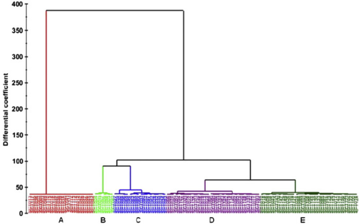
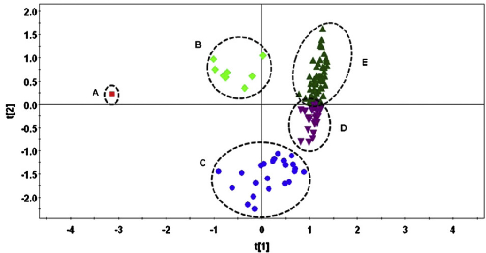
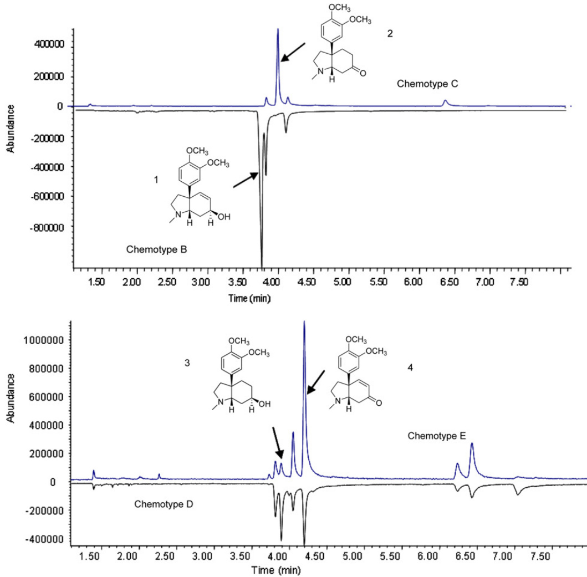
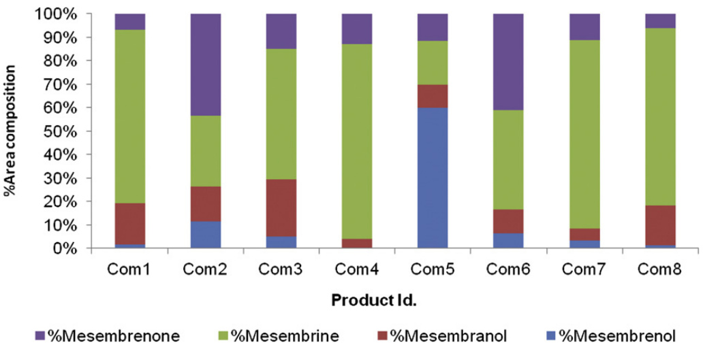

The chemotypic variation of Sceletium tortuosum alkaloids and commercial product formulations

Emmanuel Amukohe Shikanga a, Alvaro M. Viljoen b,\*, Sandra Combrinck a, Andrew Marston c Nigel Gericke d

a Department of Chemistry, Tshwane University of Technology, Private Bag X680, Pretoria 0001, South Africa b Department of Pharmaceutical Sciences, Tshwane University of Technology, Private Bag X680, Pretoria 0001, South Africa c Department of Chemistry, University of the Free State, P.O. Box 339, Bloemfontein 9300, South Africa d P.O. Box 937, Sun Valley 7985, South Africa

a r t i c l e i n f o

a b s t r a c t

Article history: Received 5 May 2012 Accepted 4 June 2012 Available online 7 July 2012

Keywords:   
Central nervous system   
Chemotype   
Mesembrine-type   
Phytochemical variation   
Sceletium tortuosum

Commercial production and trade in Sceletium tortuosum and its products is on the rise due to an increase in consumer demand. Mesembrine-type alkaloids are the main active compounds responsible for the therapeutic properties of the plant. In this investigation, GC–MS was used to evaluate the variability in the mesembrine-type alkaloid content of 151 specimens of S. tortuosum growing wild in 31 localities in the south-western region of South Africa. In addition, the variability of the mesembrine-type alkaloid content of eight commercial products was determined. The total alkaloid content of wild plant material was found to vary between 0.11 and $1 . 9 9 \%$ of dry weight. Hierarchical cluster analysis and principal component analysis grouped the plants growing in the wild into five main chemotypes (A, B, C, D and E). Chemotype A is represented by samples devoid of mesembrine-type alkaloids, while chemotypes B, C and E are characterised by high levels of mesembrenol $( 6 4 . 9 6 - 9 5 . 5 5 \% )$ , mesembrine $( 5 1 . 2 5 \mathrm { - } 9 2 . 5 0 \% )$ and mesembrenone (50.86– $7 2 . 5 1 \%$ ), respectively. Chemotype D is an intermediate cluster representing specimens containing all four alkaloids in moderate amounts. Qualitative differences in the alkaloid profiles were observed between and within different populations of S. tortuosum, as well as among the investigated products. Mesembrine was identified as the main alkaloid constituent in most of the commercial products analysed. Mesembrenol, mesembrine and mesembrenone can be used as marker compounds for quality monitoring of S. tortuosum raw materials and products.

$\circledcirc$ 2012 Elsevier Ltd. All rights reserved.

# 1. Introduction

Sceletium tortuosum (L.) N.E.Br (Mesembryanthemaceae), a succulent sub-shrub endemic to South Africa, is highly valued for its traditional uses as a masticatory and medicine. The species is used in the treatment of psychiatric conditions and neurodegenerative diseases (Gomes et al., 2009). It is mainly distributed in the Karroid areas of the Cape region of South Africa (Gerbaulet, 1996) and is locally referred to as “kanna” or “canna” (Khoi) and “kougoed” (Afrikaans) (Gericke and van Wyk, 1999). The use of Sceletium in South Africa was documented as early as 1685 (Smith et al., 1996) and trade in this plant as a commodity took place in the Little Karoo, in the mid-nineteenth century (Digby, 2005). This area was previously known as “Cannaland” and is still referred to as “Kannaland”, the name derived from the Sceletium growing there.

The first commercial cultivation of S. tortuosum was initiated by Grassroots Natural Products in 1996, under contract to the phytomedicines programme of the South African pharmaceutical company known as Pharmacare Ltd. Commercial cultivation of S. tortuosum has expanded in recent years and is carried out in the Eastern Cape, Western Cape and Northern Cape provinces of South Africa, as well as in Namibia (www.Sceletium.org/cultivation.htm). Although South Africa is the main producer of Sceletium raw material and products, many companies (mainly internet-based), trading in Sceletium raw materials and manufactured products, have been established in various parts of the world including the USA, Canada, United Kingdom, Germany and China. In 2009, the South African company HG&H Pharmaceuticals Pty Ltd. was granted the country’s first integrated export and bioprospecting permit, allowing it to export the first standardised extract of S. tortuosum under the trade mark Zembrin $\mathbf { \mathfrak { B } }$ (Patnala and Kanfer, 2009).

Traditionally, S. tortuosum was used as a masticatory drug for the relief of thirst and hunger, as a traditional medicine, and for spiritual purposes by San and Khoikhoi people inhabiting the Cape region of South Africa (Smith et al., 1996; Gericke and Viljoen, 2008). Dried plant material (aerial parts; leaves and twigs) is typically chewed and the resulting saliva and plant juices swallowed; it is also consumed in the form of teas, decoctions and tinctures and is sometimes smoked and used as snuff. In recent years, Sceletium has received a great deal of commercial interest due to its potential as an adaptogen for relieving stress in healthy people, and for treating a broad range of psychological, psychiatric and inflammatory conditions (Gericke, 2001). The number of websites advertising Sceletium raw materials and products in various formulations, including tablets, extracts, sprays, capsules and tinctures, is increasing rapidly (Patnala and Kanfer, 2009).

Quality control (QC) has been a great challenge in the development of herbal medicines due to the diversity and complexity of their secondary metabolites (Hu et al., 2006). Biomarkers or pharmacologically active compounds are generally used as standards in the quality control of traditional medicines (Li et al., 2007). Various techniques, including chemical profiling of secondary metabolites and metabolomics have been useful tools for the evaluation and QC of herbal materials and derived products. Chromatographic (HPLC, GC and HPTLC), spectrometric (MS and NMR) and vibrational spectroscopic techniques (MIR, NIR and Raman spectroscopy), have been applied in the quality assessment of phytomedicines and their raw materials (Hu et al., 2006; Li et al., 2007). The complexity of data (multivariate data) collected from analytical techniques makes classical statistical methods of data analysis challenging (Van der Kooy et al., 2008). Chemometric techniques such as principle component analysis (PCA) and partial least squares (PLS) analysis, have thus become important scientific tools for faster analysis of multivariate data. Multivariate data are complex experimental data arising from multiple variables measured for multiple numbers of observations (samples) and require multivariate projection methods, such as PCA and PLS, to simplify the complex data.

Mesembrine-type alkaloids (mesembrine, mesembrenone, mesembranol and mesembrenol) have been reported to be responsible for the psychoactive properties of S. tortuosum (Harvey et al., 2011). This has been attributed to their ability to act as selective serotonin re-uptake and phosphodiesterase-4 (PDE4) inhibitors (Gericke and Viljoen, 2008). The indigenous cultural relevance, potential health applications of S. tortuosum and the psychoactive alkaloids, as well as the increasing commercial interest in the species, prompted this investigation of the phytochemical variation of mesembrine-type alkaloids in wild populations of S. tortuosum plants and in manufactured products, to establish the range of chemotypes present in this species, and their provenances.

## 2. Materials and methods

### 2.1. Standards and solvents

Four alkaloid standards (mesembrine, mesembrenol, mesembranol and mesembrenone), were previously isolated from S. tortuosum using high-speed countercurrent chromatography (Shikanga et al., 2011). The identities and purities of the alkaloids were determined using a combination of TLC, HPLC, GC–MS and $^ 1 \mathrm { H }$ and $^ { 1 3 } { \mathsf { C } }$ (1 and 2D) NMR, as well as by comparing their spectral data with literature data. All the solvents used, including methanol (MeOH), dichloromethane (DCM), ammonia $\mathrm { \Delta N H _ { 3 } }$ ; $2 5 \%$ w/w solution) and sulfuric acid ( $\mathrm { \cdot H _ { 2 } S O _ { 4 } }$ ; $9 8 . 0 8 \%$ w/w), were AR grade and were purchased from Merck (Germany).

### 2.2. Sampling

Aerial parts of wild S. tortuosum plants were collected from various localities in the south-western region of South Africa in August and November, 2009, at altitudes ranging from 232 to $8 0 3 { \mathrm { ~ m } }$ above sea level. Voucher specimens of all collections were deposited at the Department of Pharmaceutical Sciences, Tshwane University of Technology and are listed in Table 1. Commercial products containing S. tortuosum (Com1-8) were purchased from local health shops and directly from manufacturers.

### 2.3. Sample preparation

The plant materials were dried in an oven (Labotec LTD; Johannesburg, South Africa) at $3 0 ~ ^ { \circ } \mathsf { C }$ for two weeks prior to extraction. Dry plant material (leaves) was pulverised to fine powder using a Retsch $\textsuperscript { \textregistered }$ MM 400 ball mill (Monitoring and

Table 1 Alkaloid yield, percentage composition and voucher specimen numbers of Sceletium tortuosum specimens from different localities.   

<html><body><table><tr><td>Area/Locality</td><td>Locality id</td><td>Voucher specimen no.</td><td>Chemotype</td><td>a% Alkaloid yield</td><td>% Mesembrenol</td><td>% Mesembranol</td><td>%Mesembrine</td><td>%Mesem</td></tr><tr><td rowspan="4">Lemoenshoek</td><td rowspan="4">L1</td><td>SCT001</td><td></td><td></td><td>nd</td><td>nd</td><td>nd</td><td></td></tr><tr><td>SCT002</td><td>A A</td><td>0.28 0.11</td><td>nd nd</td><td>nd</td><td>nd</td><td>nd</td></tr><tr><td>SCT003</td><td>A</td><td>0.80</td><td>nd</td><td>nd</td><td>nd</td><td>nd</td></tr><tr><td>SCT004</td><td>B</td><td>1.09</td><td>80.02</td><td>1.51</td><td>3.99</td><td>14.48</td></tr><tr><td rowspan="6">Zoar</td><td rowspan="6"></td><td>SCT005</td><td></td><td>0.97</td><td>92.71</td><td>2.96</td><td>0.21</td><td>4.12</td></tr><tr><td>SCT006</td><td>B</td><td>1.44</td><td>93.05</td><td>2.34</td><td>nd</td><td>4.61</td></tr><tr><td></td><td>B</td><td>1.46</td><td>68.00</td><td></td><td>1.01</td><td></td></tr><tr><td>SCT007</td><td>B</td><td></td><td>13.22</td><td>3.68</td><td>14.63</td><td>27.31</td></tr><tr><td>SCT008</td><td>E</td><td>0.60 0.58</td><td>27.93</td><td>7.12 7.06</td><td>14.01</td><td>65.03 51.00</td></tr><tr><td>SCT009</td><td>E E</td><td>1.49</td><td>10.92</td><td>12.94</td><td></td><td>72.51</td></tr><tr><td rowspan="6">Oudtshoorn hill (N side)</td><td rowspan="6">L4</td><td>SCT010 SCT011</td><td></td><td>0.42</td><td>91.03</td><td>3.90</td><td>3.63 1.06</td><td>4.01</td></tr><tr><td>SCT012</td><td>B</td><td>0.82</td><td>nd</td><td>nd</td><td>nd</td><td>nd</td></tr><tr><td></td><td>A</td><td>0.54</td><td></td><td>nd</td><td>nd</td><td>nd</td></tr><tr><td>SCT013 SCT014</td><td>A</td><td>0.42</td><td>nd nd</td><td>nd</td><td>nd</td><td>nd</td></tr><tr><td>SCT015</td><td>A A</td><td>0.34</td><td>nd</td><td>nd</td><td>nd</td><td>nd</td></tr><tr><td>SCT016</td><td>D</td><td>0.75</td><td>6.97</td><td>14.18</td><td>33.91</td><td>44.95</td></tr><tr><td rowspan="8">Oudtsthoorn (Beleza restaurant)</td><td rowspan="8">L5</td><td>SCT017</td><td>D</td><td>0.49</td><td>8.48</td><td>15.93</td><td>21.53</td><td>54.06</td></tr><tr><td>SCT018</td><td>E</td><td>0.38</td><td>7.04</td><td>7.70</td><td>14.09</td><td>71.17</td></tr><tr><td>SCT019</td><td>D</td><td>0.72</td><td>27.85</td><td>18.20</td><td>22.26</td><td>31.69</td></tr><tr><td>SCT020</td><td>D</td><td>0.52</td><td>36.81</td><td>15.34</td><td>13.57</td><td>34.28</td></tr><tr><td>SCT021</td><td>D</td><td>0.82</td><td>5.93</td><td>16.91</td><td>40.47</td><td>36.69</td></tr><tr><td>SCT022</td><td>D</td><td>0.36</td><td>6.83</td><td>24.14</td><td>29.39</td><td>39.64</td></tr><tr><td>SCT023</td><td>D</td><td>0.38</td><td>9.31</td><td>24.37</td><td>34.76</td><td>31.57</td></tr><tr><td>SCT024</td><td>D</td><td>1.22</td><td>8.23</td><td>36.85</td><td>8.95</td><td>45.97</td></tr><tr><td rowspan="8">Calitzdorp</td><td rowspan="4">SCT025</td><td></td><td></td><td>0.70</td><td>3.97</td><td>13.56</td><td>13.78</td><td>68.69</td></tr><tr><td>SCT026</td><td>E E</td><td>0.55</td><td>9.30</td><td>13.05</td><td>19.89</td><td>57.77</td></tr><tr><td>SCT027</td><td>C</td><td>0.48</td><td>0.30</td><td>5.56</td><td>92.50</td><td>1.64</td></tr><tr><td>SCT028</td><td>C</td><td>0.65</td><td>1.81</td><td>11.14</td><td>80.01</td><td>7.04</td></tr><tr><td></td><td>SCT029</td><td>0.66</td><td>0.64</td><td>14.44</td><td>70.11</td><td></td><td>14.81</td></tr><tr><td rowspan="4">Calitzdorp</td><td>SCT030</td><td>C C</td><td>0.77</td><td>nd</td><td>8.54</td><td>87.64</td><td>3.82</td></tr><tr><td>SCT031</td><td>C</td><td>1.36</td><td>2.08</td><td>21.77</td><td>61.13</td><td>15.02</td></tr><tr><td>SCT032</td><td>C</td><td>0.84</td><td>1.42</td><td>8.51</td><td>85.64</td><td>4.43</td></tr><tr><td>SCT033</td><td>C</td><td>1.66</td><td>1.02</td><td>8.32</td><td>86.14</td><td>4.52</td></tr><tr><td rowspan="8">Calitzdorp</td><td rowspan="4">L9</td><td>SCT034</td><td>C</td><td>0.33</td><td>1.41</td><td>12.13</td><td>72.54</td><td>13.92</td></tr><tr><td>SCT035</td><td>A</td><td>0.36</td><td>nd</td><td>nd</td><td>nd</td><td>nd</td></tr><tr><td>SCT036</td><td>A</td><td>0.64</td><td>nd</td><td>nd</td><td>nd</td><td>nd</td></tr><tr><td>SCT037</td><td>A</td><td>0.36 0.28</td><td>nd</td><td>nd</td><td>nd</td><td>nd</td></tr><tr><td></td><td>SCT038</td><td></td><td>nd</td><td></td><td></td><td></td><td>nd</td></tr><tr><td rowspan="4">Calitzdorp</td><td rowspan="4">L10</td><td>SCT039</td><td>0.37</td><td>nd</td><td>nd nd</td><td>nd nd</td><td>nd</td></tr><tr><td>SCT040</td><td>0.34</td><td>nd nd</td><td>nd nd</td><td>nd nd</td><td>nd nd</td></tr><tr><td>SCT041</td><td>A A</td><td>0.36</td><td></td><td></td><td></td></tr><tr><td>SCT042</td><td>1.56</td><td>nd nd</td><td>nd nd</td><td>nd nd</td><td>nd</td></tr><tr><td rowspan="4">Uniondale</td><td rowspan="4">L11</td><td>SCT043</td><td></td><td>0.44</td><td></td><td></td><td></td><td>nd</td></tr><tr><td>SCT044</td><td>A A</td><td>1.99</td><td>nd</td><td>nd</td><td>nd</td><td>nd</td></tr><tr><td>SCT045</td><td>A</td><td>0.83</td><td>nd</td><td>nd</td><td>nd</td><td>nd</td></tr><tr><td>SCT046 SCT047</td><td>A A</td><td>0.41 1.05</td><td>nd nd</td><td>nd nd</td><td>nd nd</td><td>nd nd</td></tr><tr><td rowspan="8">Ockertskraal</td><td rowspan="4"</table></body></html>

Table 1 (continued )   

<html><body><table><tr><td rowspan="2">Area/Locanty</td><td rowspan="2">Locanty id no.</td><td rowspan="2">voucher specimen</td><td rowspan="2">Chenmotype /</td><td rowspan="2">Alkaloid</td><td colspan="4"></td></tr><tr><td>yield</td><td></td><td></td><td></td><td></td></tr><tr><td rowspan="6">Steildrift</td><td rowspan="6">L16</td><td>SCT068 SCT069</td><td>C D</td><td>0.87 0.51</td><td>nd 7.29</td><td>25.70 28.43</td><td>74.30 31.08</td><td>nd 33.20</td></tr><tr><td></td><td></td><td>0.48</td><td>8.39</td><td></td><td>43.82</td><td>27.87</td></tr><tr><td>SCT070</td><td>D</td><td></td><td></td><td>19.92</td><td></td><td></td></tr><tr><td>SCT071</td><td>D</td><td>0.31</td><td>3.23</td><td>32.54</td><td>27.10</td><td>37.13</td></tr><tr><td>SCT072</td><td>D</td><td>0.34</td><td>38.88</td><td>19.95</td><td>14.30</td><td>26.88</td></tr><tr><td>SCT073</td><td>D</td><td>0.31</td><td>7.02</td><td>27.10</td><td>36.12</td><td>29.76</td></tr><tr><td rowspan="6">Steildrift</td><td rowspan="6">L17</td><td>SCT074</td><td>E</td><td>0.32</td><td>4.78</td><td>10.05</td><td>21.28</td><td>63.90</td></tr><tr><td>SCT075</td><td>D</td><td>0.52</td><td>35.21</td><td>17.71</td><td>15.00</td><td>32.08</td></tr><tr><td>SCT076</td><td>D</td><td>0.51</td><td>5.64</td><td>16.92</td><td>45.22</td><td>32.22</td></tr><tr><td>SCT077</td><td>D</td><td>0.94</td><td>37.88</td><td>22.82</td><td>11.32</td><td>27.98</td></tr><tr><td>SCT078</td><td>D</td><td>0.48</td><td>4.27</td><td>26.28</td><td>29.63</td><td>39.82</td></tr><tr><td>SCT079</td><td>D</td><td>0.48</td><td>5.50</td><td>30.66</td><td>28.45</td><td>35.39</td></tr><tr><td rowspan="7">Van Wyksdorp</td><td rowspan="7">L18</td><td>SCT080</td><td>D</td><td>0.29</td><td>8.39</td><td>29.92</td><td>33.82</td><td>27.87</td></tr><tr><td>SCT081</td><td>D</td><td>0.51</td><td>33.23</td><td>17.92</td><td>21.97</td><td>26.89</td></tr><tr><td>SCT082</td><td>D</td><td>1.20</td><td>23.24</td><td>31.41</td><td>15.65</td><td>29.70</td></tr><tr><td>SCT083</td><td>D</td><td>0.91</td><td>15.96</td><td>27.17</td><td>30.99</td><td>25.88</td></tr><tr><td>SCT084</td><td>E</td><td>1.34</td><td>3.85</td><td>13.79</td><td>25.08</td><td>57.28</td></tr><tr><td>SCT085</td><td>E</td><td>1.00</td><td>3.99</td><td>14.79</td><td>26.18</td><td>55.04</td></tr><tr><td>SCT086</td><td>E</td><td>1.03</td><td>16.66</td><td>12.25</td><td>17.29</td><td>53.80</td></tr><tr><td rowspan="6">Van Wyksdorp</td><td rowspan="6">SCT088</td><td>SCT087</td><td>E</td><td>0.84</td><td>5.61</td><td>10.89</td><td>32.65</td><td>50.86</td></tr><tr><td></td><td>D</td><td>0.83</td><td>14.32</td><td>14.45</td><td>26.83</td><td>44.41</td></tr><tr><td></td><td>D</td><td>0.48</td><td>23.22</td><td>8.48</td><td>30.92</td><td>37.38</td></tr><tr><td>SCT089 SCT090</td><td>D</td><td>0.68</td><td>23.30</td><td>9.69</td><td>37.25</td><td>29.76</td></tr><tr><td></td><td>D</td><td>0.36</td><td>30.21</td><td>11.41</td><td>30.62</td><td>27.77</td></tr><tr><td>SCT091 SCT092</td><td>D</td><td>0.54</td><td>31.90</td><td>8.70</td><td>29.97</td><td>29.44</td></tr><tr><td rowspan="6">Plathuis</td><td rowspan="6">L20 SCT094</td><td>SCT093</td><td>D</td><td>0.62</td><td>35.80</td><td>5.89</td><td>29.42</td><td>28.88</td></tr><tr><td></td><td>C</td><td>1.00</td><td>nd</td><td>31.85</td><td>68.16</td><td>nd</td></tr><tr><td>SCT095</td><td>C</td><td>0.78</td><td>nd</td><td>22.22</td><td>64.82</td><td>12.96</td></tr><tr><td>SCT096</td><td>C</td><td>1.03</td><td>nd</td><td>27.27</td><td>67.24</td><td>5.49</td></tr><tr><td>SCT097</td><td>D</td><td>1.06</td><td>6.18</td><td>26.61</td><td>44.13</td><td>27.08</td></tr><tr><td>SCT098</td><td>D</td><td>0.48</td><td>19.12</td><td>15.07</td><td>34.56</td><td>31.25</td></tr><tr><td rowspan="8">Steildrift</td><td rowspan="8">SCT101</td><td>SCT099</td><td></td><td>0.38</td><td>7.01</td><td>32.62</td><td>35.46</td><td>34.91 45.11</td></tr><tr><td>SCT100</td><td>D</td><td>0.35</td><td>8.27</td><td>11.37</td><td>35.25</td><td></td></tr><tr><td></td><td>D</td><td>0.80</td><td>23.99</td><td>13.65</td><td>16.14</td><td>46.22</td></tr><tr><td>SCT102</td><td>D</td><td>0.43</td><td>6.45</td><td>18.77</td><td>35.71</td><td>39.07</td></tr><tr><td>SCT103</td><td>D</td><td>0.42</td><td>30.64</td><td>29.89</td><td>18.43</td><td>21.04</td></tr><tr><td>SCT104</td><td>E</td><td>0.71</td><td>13.35</td><td>7.01</td><td>15.43</td><td>64.21</td></tr><tr><td>SCT105</td><td>E</td><td>0.68</td><td>5.46</td><td>20.54</td><td>19.67</td><td>54.34</td></tr><tr><td>SCT106</td><td>E</td><td>0.38</td><td>5.76 8.79</td><td>24.64</td><td>17.39 25.20</td><td>52.21</td></tr><tr><td rowspan="8">Ladismith</td><td rowspan="8">L23</td><td>SCT107</td><td>0.78</td><td></td><td></td><td>27.56</td><td></td><td>38.45</td></tr><tr><td>SCT108</td><td>E</td><td>0.38</td><td>25.48</td><td>12.72</td><td>7.58</td><td>53.22</td></tr><tr><td>SCT109</td><td>E</td><td>0.53</td><td>14.70</td><td>14.07</td><td>12.92</td><td>58.31</td></tr><tr><td>SCT110</td><td>A</td><td>0.75</td><td>nd</td><td>nd</td><td>nd</td><td>nd</td></tr><tr><td>SCT111</td><td>A</td><td>0.63</td><td>nd</td><td>nd</td><td>nd</td><td>nd</td></tr><tr><td>SCT112</td><td>A</td><td>0.95</td><td>nd</td><td>nd</td><td>nd</td><td>nd nd</td></tr><tr><td>SCT113 SCT114</td><td>A A</td><td>0.90 0.83</td><td>nd nd</td><td>nd nd</td><td>nd nd</td></table></body></html>

Table 1 (continued )   

<html><body><table><tr><td>Area/Locality</td><td>Locality id</td><td>Voucher specimen no.</td><td>Chemotype</td><td>a% Alkaloid yield</td><td>% Mesembrenol</td><td>%Mesembranol</td><td>%Mesembrine</td><td>%Mesembrenone</td></tr><tr><td rowspan="9">Volmoed</td><td rowspan="9"></td><td>SCT136</td><td>D</td><td>0.92</td><td>40.68</td><td>19.09</td><td>10.36</td><td>29.87</td></tr><tr><td>SCT137</td><td>D</td><td>0.41</td><td>7.14</td><td>14.21</td><td>24.79</td><td>53.86</td></tr><tr><td>SCT138</td><td>D</td><td>0.38</td><td>9.17</td><td>21.13</td><td>28.98</td><td>40.72</td></tr><tr><td>SCT139</td><td>D</td><td>0.93</td><td>2.70</td><td>23.25</td><td>38.04</td><td>36.01</td></tr><tr><td>SCT140</td><td>D</td><td>0.73</td><td>28.32</td><td>17.90</td><td>25.10</td><td>28.69</td></tr><tr><td>SCT141</td><td>E</td><td>0.83</td><td>4.05</td><td>7.00</td><td>26.59</td><td>62.36</td></tr><tr><td>SCT142</td><td>E</td><td>1.05</td><td>10.53</td><td>13.88</td><td>20.80</td><td>54.79</td></tr><tr><td>SCT143</td><td>D</td><td>1.10</td><td>10.12</td><td>15.28</td><td>24.18</td><td>50.43</td></tr><tr><td>SCT144</td><td>D</td><td>0.90</td><td>35.58</td><td>18.05</td><td>18.68</td><td>27.69</td></tr><tr><td rowspan="6"></td><td rowspan="6"></td><td>SCT145</td><td>D</td><td>0.80</td><td>16.77</td><td>7.82</td><td>23.29</td><td>52.12</td></tr><tr><td>SCT146</td><td>E</td><td>1.27</td><td>16.77</td><td>9.09</td><td>11.67</td><td>62.46</td></tr><tr><td>SCT147</td><td>E</td><td>0.70</td><td>13.67</td><td>15.09</td><td>11.68</td><td>59.57</td></tr><tr><td>SCT148</td><td>D</td><td>0.86</td><td>7.90</td><td>14.87</td><td>31.11</td><td>46.12</td></tr><tr><td>SCT149</td><td>E</td><td>0.89</td><td>8.92</td><td>13.49</td><td>16.44</td><td>61.15</td></tr><tr><td>SCT150</td><td>D</td><td>0.92</td><td>12.72</td><td>14.09</td><td>20.03</td><td>53.17</td></tr><tr><td></td><td></td><td>SCT151</td><td>D</td><td>0.71</td><td>29.17</td><td>31.69</td><td>14.69</td><td>24.44</td></tr></table></body></html>

nd (not detected). a Alkaloid yield has been expressed as $\%$ mass of extract/dry weight of sample.

Control (Pty) Ltd; Haans, Germany) at a frequency of $3 0 ~ \mathrm { H z }$ for $2 ~ \mathrm { m i n }$ . The powder was subsequently sieved using $5 0 0 ~ { \mu \mathrm { m } }$ mesh (Endcotts Filters LTD; London, UK). Alkaloids were extracted using acid-base extraction as described by Alali et al. (2008), with slight modifications. Sulfuric acid (0.5 M; $2 4 . 0 ~ \mathrm { m l } ^ { \cdot }$ ) was added to $2 . 0 ~ \mathrm { g }$ of each sample in a $2 5 ~ \mathrm { m l }$ centrifuge tube. After vortexing for $1 5 s$ (Vortex Gene vortex, Scientific Industries; Florida, USA), the tubes were centrifuged (Juan BR4i; DJB Lab Care $\textsuperscript { \textregistered }$ ; Buckinghamshire, UK) at $5 0 0 0 \ \mathrm { r p m }$ for $1 5 \mathrm { m i n }$ , whereafter the supernatant from each tube was filtered into a matching set of new $2 5 ~ \mathrm { m l }$ tubes. The resulting filtrates were each neutralised with $6 . 0 \mathrm { m l }$ of $2 0 \% \mathrm { N H } _ { 3 }$ .

A volume of $1 4 . 0 \mathrm { m l }$ of DCM was added to the contents of each tube, which was vortexed for $1 5 s$ and then centrifuged for $1 5 \mathrm { m i n }$ at $3 0 0 0 \mathrm { r p m }$ . The organic phase was filtered into clean $2 5 ~ \mathrm { m l }$ glass vials. Extraction with DCM was repeated and the two resulting filtrates were pooled and dried in a vacuum oven (Vismara Srl Scientific; Milan, Italy) at $4 0 ^ { \circ } \mathsf C$ and 0.2 bar. The yield of each extract was expressed as a percentage of dry sample weight. Powdered material from capsules of each product was weighed $( 2 . 0 \ \mathrm { g } )$ and extracted in the same way as described for the wild samples.

#### 2.4. GC–MS analysis

The dried alkaloid extracts were re-suspended in methanol at a concentration of $1 0 . 0 \mathrm { m g / m l }$ and analysed using GC–MS. The chromatographic system was an Agilent 6890N gas chromatograph coupled to a model 5973 mass spectrometer. Splitless injection $( 2 ~ \mu \mathrm { l } )$ was applied with an auto-injector and an auto-sampler at 24.0 psi and an inlet temperature of $2 5 0 ^ { \circ } \mathsf C .$ . The initial oven temperature of $2 5 9 ^ { \circ } \mathsf C$ was held for $2 \ : \mathrm { m i n }$ , then increased to $2 6 2 ^ { \circ } C$ at a rate of $2 0 \ ^ { \circ } \mathsf { C } / \operatorname* { m i n }$ and held constant for 6 min. An HP-5MS $5 \%$ phenyl methyl siloxane column ( $3 0 \mathrm { m } \times 2 5 0 \mu \mathrm { m }$ i.d. $\times 0 . 2 5 \mu \mathrm { m }$ film thickness) was used to achieve the desired separation. The flow of helium (carrier gas) was maintained at $1 . 4 ~ \mathrm { m l / m i n }$ Spectra were recorded after electron impact ionisation at $7 0 \ \mathrm { e V }$ $( 3 5 - 5 5 0 ~ m / z )$ . A transfer line temperature of $2 8 0 ~ ^ { \circ } C$ was maintained. Four psychoactive alkaloids namely mesembrenol, mesembranol, mesembrine, and mesembrenone, were identified in the extracts within an 8 min run. Retention times were used as the primary criterion for peak identification in the extracts and the mixtures were also spiked with the reference standards. However, comparison of the mass spectra of the peaks in the extracts with those of authentic standards and data from the $\mathsf { N I S T } @ \mathsf { \Gamma }$ Library (Version 2004) proved to be useful for further confirmation. The percentage of each alkaloid in an extract was expressed as a percentage of the total composition of the four alkaloids in an extract.

#### 2.5. Multivariate data analysis

Cluster and classification analysis were performed by chemometric computations using SIMCA- $\cdot \mathbf { P } + \circledast$ version 12.0 software (Umetrics AB., Malmo, Sweden). Unsupervised principal component analysis (PCA) was performed to provide an overview of the clustering patterns of the samples (observations). Hierarchical cluster analysis was done through construction of a dendrogram and scatter scores plot to evaluate grouping and trends.

#### 3. Results and discussion

3.1. Variation of the total alkaloid yields of the extracts of wild S. tortuosum samples and commercial products

This study indicates substantial variation in the total alkaloid yield and composition of S. tortuosum samples collected from different localities. The total yield of the extracts and the relative percentage of each alkaloid in the extracts are presented in

Table 1. Total yields of the samples were highly variable, ranging from 0.11 to $1 . 9 9 \%$ of dry plant weight (dw). None of the target alkaloids were observed in samples obtained from Lemoenshoek (L1), the northern side of Oudtshoorn Hill (L4), Calitzdorp (L9, L10), Uniondale (L11) and Ockertskraal (L12). However, samples collected from the majority of the localities (25 populations) contained some or all of the targeted alkaloids. Samples from Calitzdorp (L8; $0 . 8 3 \substack { - 1 . 6 6 \% }$ dw) exhibited the highest alkaloid yields, while those collected from Steildrift (L12; $0 . 2 0 \mathrm { - } 0 . 4 4 \% )$ and Lemoenshoek (L1 $; 0 . 1 1 { - } 0 . 3 9 \% )$ yielded the least. The yields of the extracts obtained from the commercial products were also variable $( 0 . 1 0 \mathrm { - } 0 . 3 5 \% )$ . Alkaloid yields of wild samples were higher than those of commercial products because excipients were added to the products, and this affected the amount of plant material in $2 . 0 { \mathrm { g } }$ of the sample. Results on variation of the total alkaloid yield are congruent with a published report (Gericke and van Wyk, 1999) indicating that the yield of alkaloids in S. tortuosum is highly variable, ranging from 0.05 to $2 . 3 0 \%$ dw.

#### 3.2. Variation of mesembrine-type alkaloids in wild S. tortuosum samples

Mesembrine and mesembrenol were found to display the highest variability (nd– $- 9 2 . 5 0 \%$ and nd– $- 9 6 . 5 5 \%$ respectively) in comparison to mesembrenone $( \mathrm { n d } - 7 2 . 5 1 \% )$ and mesembranol $( \mathrm { n d } \mathrm { - } 4 1 . 8 \% )$ . Variations in the profiles of the target alkaloids were observed between plants obtained from the same population and between different populations. For instance, samples collected on the south side of Oudtshoorn Hill (L3), were found to produce all four alkaloids, while those growing on the northern side of the hill (L4) were devoid of the compounds. This could imply that variations in weather patterns, such as precipitation, could influence the alkaloid profiles of the plants, since the northern side of the hill is the leeward side, while the southern side is the windward side. A similar trend was also observed for samples obtained from the various localities in Volmoed area (L24–L31), which lie to the south of the Oudtshoorn Hills. All the samples from this region contained the four alkaloids, although in variable ratios. Of the specimens collected from four localities in Calitzdorp (L7–L10), the alkaloids were only detected in those collected from L7 and L8. In these samples, mesembrine was the main constituent $( 6 1 . 0 1 - 9 2 . 5 0 \% )$ . Samples collected from two localities in Toorwater L14 and L15, showed intra-population variability of the alkaloid profiles. In most samples from both localities, mesembrine was the major alkaloid, while mesembrenol was the main constituent of the remainder.

#### 3.3. Chemotypes of S. tortuosum samples harvested from the wild

The results listed in Table 1 are indicative of the existence of large numerical ranges in the relative amounts of the alkaloid $( 0 . 1 0 \mathrm { - } 9 6 . 5 5 \% )$ in the data set. Subsequently, the data were log transformed in order to produce normalised data to prevent over-expression of large variance variables at the expense of small variance variables (Eriksson et al., 2006). A three component PCA model was constructed for the GC–MS data, which explained $9 8 . 3 \%$ of the total variation in the X matrix $( R ^ { 2 } { \tt X } ( { \tt c u m } ) = 0 . 9 8 3 ) \$ . The goodness of prediction of the model was $8 7 . 5 \%$ $( Q ^ { 2 } ( \mathrm { c u m } ) = 0 . 8 7 5 \$ $N = 1 5 1$ , $K = 4$ ), where $N$ represents the number of observations (samples), while $K$ represents the number of variables (alkaloids) in the data set. According to Eriksson et al. (2006), a good model is characterised by $R ^ { 2 }$ and $Q ^ { 2 }$ values above 0.5, with the difference between the two values less than 0.2. This model is thus appropriate for the discriminate analysis, since the $R ^ { 2 }$ and $Q ^ { 2 }$ values of the model were close to 1 and the difference between them was only 0.108.

The hierarchical cluster analysis (dendrogram) of S. tortuosum samples, based on the four identified alkaloids, using two principle components (PCs) is illustrated in Fig. 1. Five chemotypes (A, B, C, D and E) could be identified from the data set. The dendrogram was further expressed as a two PCA scores plot (Fig. 2.) in order to visualise the clustering pattern of the samples. Table 2, shows the range of the percentage composition of each alkaloid in the different chemotypes. None of the target alkaloids were detected in samples constituting Chemotype A, which were obtained from Lemoenshoek (L1), the northern side of Oudtshoorn Hill (L4), Calitzdorp (L9 and L10), Uniondale (L11) and Ockertskraal (L12). Mesembrenol, ranging from 64.94 to $9 6 . 5 5 \%$ was the major constituent of specimens constituting Chemotype B. The mesembranol $( \leq 6 . 9 5 \% )$ and mesembrine $( \leq 3 . 9 9 \% )$ content of the samples in this cluster were relatively very low, although a few samples contained as much as $2 7 . 3 4 \%$ of mesembrenone. Specimens comprising Chemotype C were observed to have high levels of mesembrine $( \geq 5 1 . 2 5 \% )$ . In the majority of these samples, the relative amounts of mesembrenol and mesembrenone were either low or undetected. Chemotype D is placed specifically as an intermediate cluster, since the specimens contained all four alkaloids in moderate amounts. Samples in Chemotype D were observed to contain up to $4 2 . 6 4 \%$ mesembrenol, $3 7 . 0 3 \%$ mesembranol, $4 8 . 1 3 \%$ mesembrine and $5 4 . 0 6 \%$ mesembrenone. In addition to having relatively low amounts of mesembrenol, mesembranol and mesembrine, mesembrenone was the main constituent of specimens in Chemotype E $( \ge 5 0 . 8 6 \% )$ . Chemotypes D and E displayed some overlap, resulting from specimens containing all four alkaloids in variable amounts, but with high mesembrenone levels $( \geq 5 0 . 8 6 \% )$ . Samples SCT118 and SCT121 (L24), SCT123 (L25), SCT126 (L26), SCT137 (L28), SCT143 (L29) and SCT150 (L31) from Volmoed area constituted the samples that occurred in the overlapping region.

  
Fig. 1. Hierarchical cluster analysis (dendrogram) based on GC–MS data of the alkaloid extracts of Sceletium tortuosum specimens $N = 1 5 1$ ) from 31 populations.

  
Fig. 2. Principal component analysis scores plot showing differentiation between the chemotypes of Sceletium tortuosum samples, based on mesembrine-type alkaloid content $\langle N = 1 5 1$ ).

Representative total ion chromatograms of Chemotypes B, C, D and E, and the chemical structures of the four alkaloids are depicted in Fig. 3. It is important to note that the observed chemotypes were not distinguished by their geographical locations. The different chemotypes were distinguished based on three mesembrine-type alkaloids (mesembrenol, mesembrine and mesembrenone). These alkaloids therefore, have great potential for use as marker compounds in the quality control of S. tortuosum raw material and products.

#### 3.4. Variation of mesembrine-type alkaloids in S. tortuosum products

Extracts of all the commercial products contained the four alkaloids. However, as was observed for the wild samples, differences in the yields and alkaloid profiles of the products were also evident. The relative percentage composition of each compound in the extracts of the selected products is illustrated in Fig. 4. Mesembrenol $( 0 . 2 0 - 5 9 . 9 1 \% )$ was found to display the highest variability in the products, while mesembrine $( 4 2 . 2 6 - 8 2 . 9 4 \% )$ was the main constituent of most of the products (Com1, 3, 4, 6, 7 and 8). High levels of mesembrenone were observed in products Com2 $( 4 3 . 3 2 \% )$ and 6 $( 4 1 . 1 4 \% )$ , while mesembrenol was the major constituent in product Com5 $( 5 9 . 9 1 \% )$ . Higher percentages of mesembrine were also observed in products Com2 $( 3 0 . 4 0 \% )$ and 6 $( 4 2 . 2 5 \% )$ . Initial reports by Van Wyk and Gericke (2003) indicated that mesembrine is the major active constituent of S. tortuosum. Many commercial producers of this plant may therefore have selected plants with high mesembrine content for propagation and processing. However, in vitro investigation has shown that both mesembrenol and mesembrenone exhibit psychoactive properties (Harvey et al., 2011).

Table 2 Range in the percentage composition of mesembrine-type alkaloids in the different chemotypes.   

<html><body><table><tr><td>Chemotype</td><td>% Alkaloid yield</td><td>%Mesembrenol</td><td>% Mesembranol</td><td>% Mesembrine</td><td>% Mesembrenone</td></tr><tr><td>A</td><td>0.11-0.80</td><td>nd</td><td>nd</td><td>nd</td><td>nd</td></tr><tr><td>B</td><td>0.42-1.46</td><td>64.94-96.55</td><td>1.51-6.95</td><td>nd-3.99</td><td>nd-27.34</td></tr><tr><td>C</td><td>0.42-1.03</td><td>nd-12.89</td><td>2.51-35.50</td><td>51.25-92.50</td><td>nd-33.40</td></tr><tr><td>D</td><td>0.31-1.22</td><td>2.23-42.64</td><td>7.84-37.03</td><td>8.95-48.13</td><td>24.44-54.06</td></tr><tr><td>E</td><td>0.32-1.49</td><td>3.85-27.93</td><td>7.00-24.64</td><td>3.63-32.65</td><td>50.86-72.51</td></tr></table></body></html>

nd (not detected).

  
Fig. 3. Total ion chromatograms of Sceletium tortuosum extracts representing each of the different chemotypes and the chemical structures of the four alkaloids (1) mesembrenol; (2) mesembrine; (3) mesembranol and (4) mesembrenone.

The psychoactive properties of these alkaloids in the treatment of CNS ailments have been attributed to their ability to act as selective serotonin re-uptake and phosphodiesterase (PDE4) inhibitors (Gericke and Viljoen, 2008). Both selective serotonin re-uptake inhibitors and PDE4 inhibitors are commonly used as antidepressants (Kanes et al., 2007). In vitro studies on the aqueous ethanol extract $( 7 0 \% )$ of S. tortuosum and three mesembrine-alkaloids (mesembrine, mesembrenone and mesembrenol) indicated that the extract (high mesembrenone and mesembrenol content) was a potent blocker in 5-HT transporter-binding assays and had powerful inhibitory effects on PDE4 (Harvey et al., 2011). In addition, both mesembrine and mesembrenol were observed to be active against the 5-HT transporter, although the activity of mesembrine was higher than that of mesembrenol. Mesembrenone was nevertheless observed to be active against both 5-HT transporter and PDE4 enzymes.

  
Fig. 4. Phytochemical variation of mesembrine-type alkaloids in commercial products of Sceletium tortuosum as determined by GC–MS.

In vivo experimental evidence has also suggested that PDE4 inhibitors can reverse depression, improve cognition and alleviate anxiety (O’Donnell and Zhang, 2004). S. tortuosum plants with relatively high mesembrenone content, and isolated mesembrenone, can thus act as dual serotonin re-uptake inhibitors and PDE4 inhibitors, while plant material with relatively high amounts of mesembrine, as well as pure mesembrine, can act as selective serotonin re-uptake inhibitors. The therapeutic advantages of dual inhibition of serotonin re-uptake and PDE4 inhibition include the possibility of using a lower dose of plant material containing both mesembrenone and mesembrine (Chemotypes D and E) to achieve the desired effect (Cashman et al., 2009). For propagation, it is necessary to select the plant belonging to the appropriate chemotype to ensure consistency in the alkaloid content and maximum effect at lower doses.

These results are consistent with a previous report indicating variability in the distribution of alkaloids in Sceletium plants cultivated in different places (Herre, 1971). Although the author reported that alkaloids were not produced by S. tortuosum plants cultivated in Germany, they were produced by those cultivated in the USA. Due to the variability of alkaloids in this species, harvesting of Sceletium samples from the wild for propagation purposes could be challenging, since inconsistencies in the alkaloid profiles are evident, even for plants growing within the same locality. Factors such as geography, soil-type, altitude, precipitation, genetics, growth season, time of harvesting, storage conditions and method of processing are known to affect the yield and composition of secondary metabolites produced by a plant (Laasonen et al., 2002). These factors may cause inconsistencies in the chemical profiles of specimens of the same species growing in different localities. The chemical profiles of S. tortuosum samples collected from different localities could also be influenced by the prevailing environmental conditions. However, variations observed between plants growing in the same locality indicate that the differences may be attributed to genetic variability and may not necessarily depend on geographical and environmental factors alone.

# 4. Conclusions

Intra-specific variations of the profiles of the four alkaloids within and between different populations of S. tortuosum were observed. Chemotypic variation in the phytochemical profiles, based on mesembrine-type alkaloid composition, of S. tortuosum resulted in the identification of five chemotypes. Individual chemotypes identified were not restricted to particular geographical areas. The relative contributions of mesembrenol, mesembrine and mesembrenone, are useful for quality assurance of S. tortuosum raw materials and products, and for assigning the source raw plant material to one of the five identified chemotypes.

# Acknowledgements

The authors wish to thank the National Research Foundation (NRF) of South Africa for financial support.

# References

Alali, F.Q., Tahboub, Y.R., Ibrahim, E.S., Qandil, A.M., Tawaha, K., Burgess, J.P., Sy, A., Nakanishi, Y., Kroll, D.J., Oberlies, N.H., 2008. Pyrrolizidine alkaloids from Echium glomeratum (Boraginaceae). Phytochemistry 69, 2334–2346.   
Cashman, J.R., Voelker, T., Johnson, R., Janowsky, A., 2009. Stereoselective inhibition of serotonin re-uptake and phosphodiesterase by dual inhibitors as potential agents for depression. Bioorg. Med. Chem. 17, 337–343.   
Digby, A., 2005. Self-medication and the trade in medicine within a multi-ethnic context: a case study of South Africa from the mid-nineteenth to midtwentieth centuries. Soc. Hist. Med. 18, 439–457.   
Eriksson, L., Johansson, E., Kettaaneh-Wold, N., Trygg, J., Wikstrom, C., Wold, S., 2006. Multi- and Megavariate Data Analysis. Part 1: Basic Principles and Applications. Second revised and enlarged edition. Umetrics AB, Umea.   
Gerbaulet, M., 1996. Revision of the genus Sceletium N.E.Br.. (Aizoaceae). Bot. Jahrb. 118, 9–24.   
Gericke, N., 2001. Clinical application of selected South African medicinal plants. Australas. J. Med. Herbal 13, 3–17.   
Gericke, N., van Wyk, B.-E., 1999. Pharmaceutical compositions containing mesembrine and related compounds. US Patent Application number 09/194836. Patent no US 6288104B1.   
Gericke, N., Viljoen, A.M., 2008. Sceletium-a review update. J. Ethnopharmacol. 119, 653–663.   
Gomes, N.G.M., Campos, M.G., Orfao, J.M.C., Riberio, C.A.F., 2009. Plants with neurobiological activity as potential targets for drug discovery. Prog. Neuropsychopharmacol. Biol. Psychiatry 33, 1372–1389.   
Harvey, A.L., Young, L.C., Viljoen, A.M., Gericke, N.P., 2011. Pharmacological actions of South African medicinal and functional food plant Sceletium tortuosum and its principle alkaloids. J. Ethnopharmacol. 137, 1124–1129.   
Herre, H., 1971. The Genera of the Mesembryanthemaceae. Tafelberg-Uitgewers, Cape Town.   
Hu, L.F., Li, S.P., Cao, H., Liu, J.J., Gao, J.L., Yang, F.Q., Wang, Y.T., 2006. GC–MS fingerprint of Pogostemon cablin in China. J. Pharm. Biomed. Anal. 42, 200–206.   
Kanes, S.J., Tokarczyk, J., Siegel, S.J., Bilker, W., Abel, T., Kelly, M.P., 2007. Rolipram: a specific phosphodiesterase 4 inhibitor with potential antipsychotic activity. Neuroscience 144, 239–246.   
Laasonen, M., Harmia-Pulkkinen, T., Simard, C.L., Michiels, E., Rasanen, M., Vuorela, H., 2002. Fast identification of Echinacea purpurea dried roots using nearinfrared spectroscopy. Anal. Chem. 74, 2493–2499.   
Li, Y., Hu, Z., He, L., 2007. An approach to the development of binary chromatographic fingerprints of the total alkaloids from Caulophyllum robustum by high performance liquid chromatography/diode array detector and gas chromatography/mass spectrometry. J. Pharm. Biomed. Anal. 43, 1667–1672.   
O’Donnell, J.M., Zhang, H.T., 2004. Antidepressant effects of inhibitors of cAMP phosphodiesterase (PDE4). Trends Pharmacol. Sci. 25, 158–163.   
Patnala, S., Kanfer, I., 2009. Investigation of the phytochemical content of Sceletium tortuosum following preparation of “Kougoed” by fermentation. J. Ethnopharmacol. 121, 86–91.   
Shikanga, E.A., Viljoen, A., Combrinck, S., Marston, A., 2011. Isolation of Sceletium alkaloids by high-speed countercurrent chromatography. Phytochem. Lett. 4, 190–193.   
Smith, M.T., Crouch, N.R., Gericke, N., Hirst, M., 1996. Psychoactive constituents of the genus Sceletium N.E.Br.. and other Mesembryanthemaceae: a review. J. Ethnopharmacol. 50, 119–130.   
Van der Kooy, F., Verpoorte, R., Meyer, M.J.J., 2008. Metabolomic quality control of claimed anti-malarial Artemisia afra herbal remedy and A. afra and A. annua plant extracts. S. Afr. J. Bot. 74 (2), 186–189.   
Van Wyk, B.-E., Gericke, N., 2003. People’s Plants (accessed 25.03.12.). Briza Publications, Pretoria (accessed 02.06.11.). www.Oudtshoorninfo.co.za. www. Sceletium.org/cultivation.html.