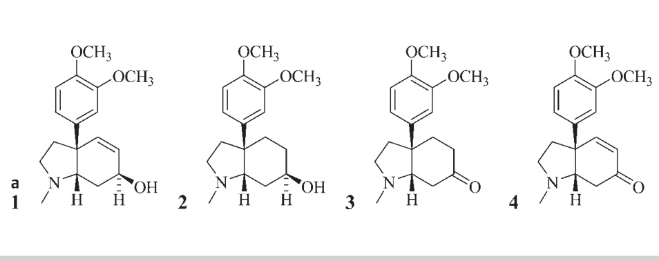
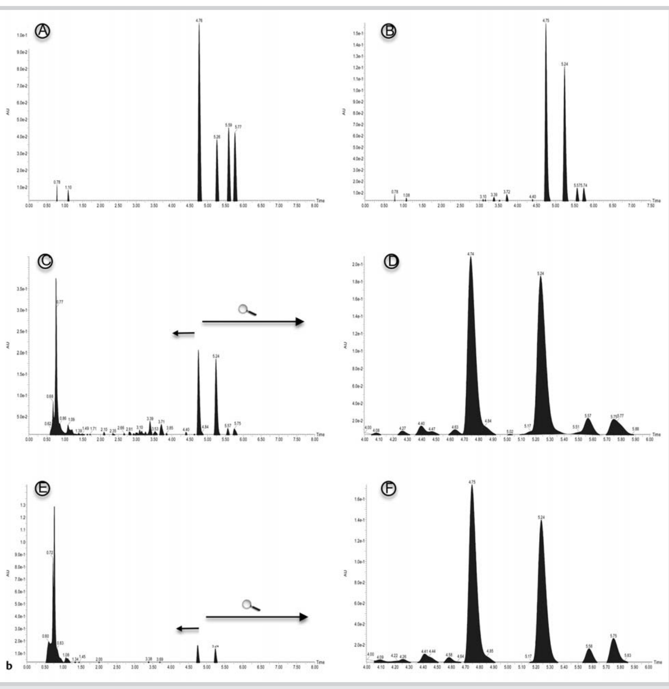
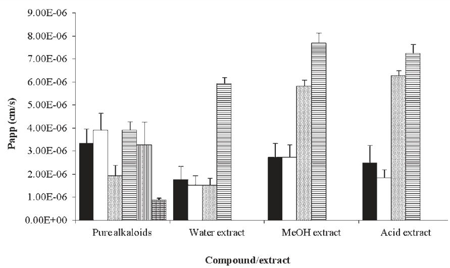
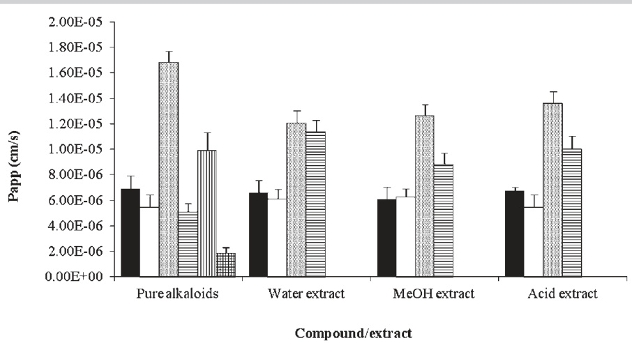
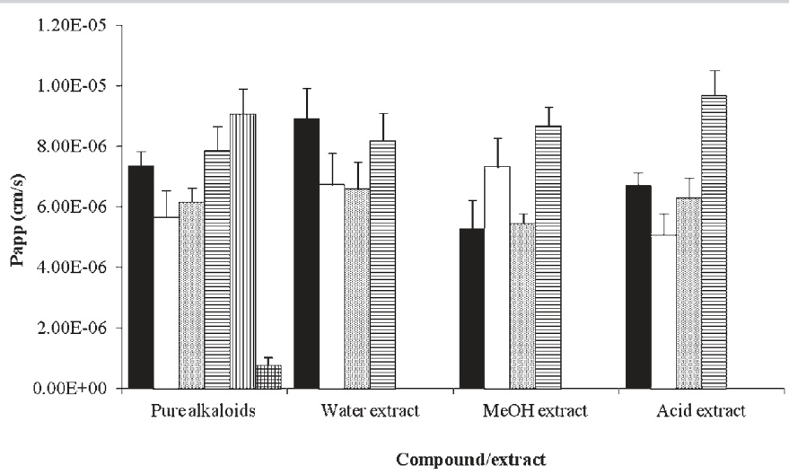
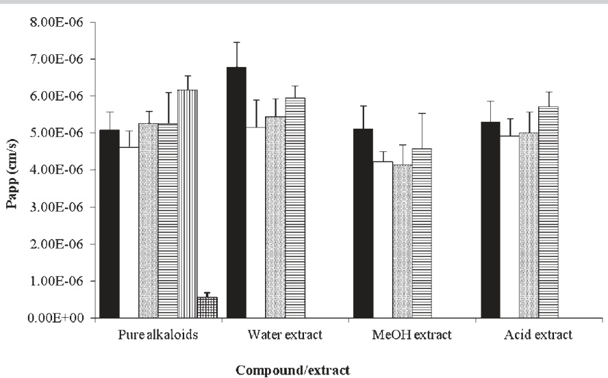

# In Vitro Permeation of Mesembrine Alkaloids from Sceletium tortuosum across Porcine Buccal, Sublingual, and Intestinal Mucosa

Authors Affiliations

Emmanuel A. Shikanga1, Josias H. Hamman2,3, Weiyang Chen2, Sandra Combrinck1, Nigel Gericke4, Alvaro M. Viljoen2

1 Department of Chemistry, Tshwane University of Technology, Pretoria, South Africa   
2 Department of Pharmaceutical Sciences, Tshwane University of Technology, Pretoria, South Africa   
3 Unit for Drug Research and Development, North-West University, Potchefstroom, South Africa   
4 Medical & Scientific Affairs, HG & H Pharmaceuticals (Pty) Ltd., Bryanston, South Africa

Key words   
$\circ$ apparent permeability coefficient   
$0$ in vitro transport   
$0$ mesembrine alkaloids   
$\circ$ Sceletium tortuosum   
$\circ$ Mesembryanthemaceae   
$\circ$ Sweetana‑Grass diffusion

# Abstract

#

Sceletium tortuosum is an indigenous South African plant that has traditionally been used for its mood-enhancing properties. Recently, products containing S. tortuosum have become increasingly popular and are commonly administered as tablets, capsules, teas, decoctions, or tinctures, while traditionally the dried plant material has been masticated. This study evaluated the in vitro permeability of the four major S. tortuosum alkaloids (i.e., mesembrine, mesembrenone, mesembrenol, and mesembranol) across porcine intestinal, sublingual, and buccal tissues in their pure form and in the form of three different crude plant extracts, namely water, methanol, and an acid-base alkaloid-enriched extract. The permeability of mesembrine across intestinal tissue was higher than that of the highly permeable reference compound caffeine (which served as a positive control for membrane permeability) both in its pure form, as well as in the form of crude extracts. The intestinal permeability of mesembranol was similar to that of caffeine, while those of mesembrenol and mesembrenone were lower than that of caffeine, but much higher than that of the poorly permeable reference compound atenolol (which served as a negative control for membrane permeability). In general, the permeabilities of the alkaloids were lower across the sublingual and the buccal tissues than across the intestinal tissue. However, comparing the transport of the alkaloids with that of the reference compounds, there are indications that transport across the membranes of the oral cavity may contribute considerably to the overall bioavailability of the alkaloids, depending on presystemic metabolism, when the plant material is chewed and kept in the mouth for prolonged periods. The results from this study confirmed the ability of the alkaloids of S. tortuosum in purified or crude extract form to permeate across intestinal, buccal, and sublingual mucosal tissues.

received June 30, 2011   
revised October 17, 2011   
accepted October 25, 2011

Bibliography   
DOI http://dx.doi.org/   
10.1055/s-0031-1280367   
Published online November 21,   
2011   
Planta Med 2012; 78: 260–268   
$\circleddash$ Georg Thieme Verlag KG   
Stuttgart $\cdot \cdot$ New York ·   
ISSN 0032‑0943   
Correspondence   
Prof. Alvaro M. Viljoen (PhD)   
Department of Pharmaceutical   
Sciences   
Tshwane University of   
Technology   
Private Bag $\times 6 8 0$   
Pretoria 0001   
South Africa   
Phone: + 27123826360   
Fax: + 27123826243   
viljoenam@tut.ac.za

# Introduction !

Sceletium tortuosum (L.) N. E. Br (Mesembryanthemaceae) is a succulent plant indigenous to South Africa that has traditionally been used as a masticatory and as a remedy to treat ailments affecting the central nervous system [1, 2]. The psychoactive properties are ascribed to the four major alkaloids: mesembrine, mesembrenone, mesembrenol, and mesembranol, collectively referred to as the mesembrine alkaloids [3]. The plant and its products have been prescribed for the management of psychiatric and psychological conditions including depression, anxiety [4], drug dependence, bulimia, and obsessive-compulsive disorder [3]. The potential for mesembrine alkaloids to treat central nervous system disorders has been attributed to their capacity to act as serotonin reuptake inhibitors, thereby contributing to regulating the balance of neurochemicals in the brain [5, 6]. Phosphodiesterase (PDE4) inhibition has been reported for an extract of S. tortuosum [7], and of the mesembrine alkaloids tested for PDE4 inhibitory activity, mesembrenone was found to be the most potent [8], while mesembrine-HCl was found to be a relatively weak inhibitor of the enzyme [5]. There is strong in vivo experimental evidence that PDE4 inhibitors can reverse depression, improve cognition and alleviate anxiety [9,10]. Sceletium tortuosum plants and extracts with relatively high mesembrenone content, and isolated mesembrenone, can thus act as dual serotonin reuptake inhibitors and PDE4 inhibitors, while plant material relatively high in mesembrine and isolated mesembrine can act as highly selective serotonin reuptake inhibitors. The therapeutic advantages of dual inhibition of serotonin reuptake and PDE4 inhibition include the possibility of using a lower dose to achieve enhanced efficacy, with a reduced side effect profile [11].

Sceletium tortuosum has also been found to improve relaxation and social interaction [1], in addition to the treatment of insomnia and digestive problems in both children and adults [1, 12]. Although clinical in vivo studies [4, 13] and in vitro experiments [5] confirmed the pharmacological effects of S. tortuosum and its alkaloid constituents, reports on bioavailability studies of these compounds are lacking, and no information is available on the permeability of mesembrine alkaloids across intestinal, buccal, and sublingual mucosal tissues.

Traditionally, the aerial parts of S. tortuosum were consumed as a masticatory, and in the form of decoctions, teas, and tinctures [1, 4], but the dry plant material has also been smoked and powdered plant material inhaled as a snuff [14]. Currently, S. tortuosum products are commercially available as tablets, capsules, teas, sprays, extracts, and tinctures [15]. The increase in the demand for and the consumption of S. tortuosum products are evident by the rapid rise in the establishment of commercial plantations and companies processing the plant material [6, 15].

Any biologically active compound must be absorbed sufficiently in order to reach an appropriate concentration at the site of action to elicit its pharmacological effect. The in vivo drug absorption process is a complex series of events, including permeation across epithelial cell membranes and presystemic metabolism. Numerous efforts have been made to identify screening models that are predictive of this process [16]. Several artificial membranes, cell culture techniques, and isolated mucosal tissues have been used to assess the transport of compounds across biological barriers [17]. Isolated tissues from several animals, such as rabbits, monkeys, dogs, hamsters, and pigs, have been employed as models for evaluation of drug permeability [18]. However, excised porcine tissues including buccal, sublingual, and intestinal mucosa have been frequently utilised in drug transport studies, due to their similarity to human tissues in terms of drug transport [19, 20].

In this study, the in vitro permeabilities of four key S. tortuosum alkaloids, namely mesembrine, mesembrenone, mesembrenol, and mesembranol in their pure isolated form, as well as in crude extract form, were determined across excised porcine sublingual, buccal, and intestinal mucosal tissues in a Sweetana-Grass diffusion chamber.

# Materials and Methods

#

# Materials

All solvents (dichloromethane, sulfuric acid, ammonia, methanol for extraction) were AR grade (Sigma Aldrich), while methanol (MeOH) for analysis (SMM Instruments) and triethanolamine (Protea Laboratory Services Ltd.) were HPLC grade. Caffeine (purity: $9 9 . 0 \%$ ) was obtained from Italian Chemical Industries Ltd., and atenolol (purity: $9 9 . 0 \%$ ) was a gift from Sandoz. Mesembrenone (purity: $9 8 . 2 \%$ ), mesembrenol (purity: $9 8 . 4 \%$ , mesembrine (purity: $9 8 . 5 \%$ ), and mesambranol (purity: $9 5 . 4 \%$ were isolated in a previous study from S. tortuosum using high-speed countercurrent chromatography and subsequently characterised using one and two dimensional $\mathrm { ^ 1 H }$ and $^ { 1 3 } { \mathsf { C } }$ nuclear magnetic resonance (NMR) and gas chromatography mass spectrometry [21]. Sceletium tortuosum plant material was obtained from the Western Cape (South Africa), identified by Prof. A. M. Viljoen, and a voucher specimen (SC-562) was deposited in the Department of

Pharmaceutical Sciences (Tshwane University of Technology, Pretoria, South Africa). Krebs Ringer bicarbonate buffer was purchased from Sigma Aldrich. Medical oxygen was obtained from Afrox Ltd.

# Preparation of extracts

Three crude extracts of S. tortuosum (aerial parts) were prepared by utilising different solvents. For the MeOH extract, $2 0 { \mathrm { g } }$ of dry plant powder $\cdot \leq 0 . 5 \mathrm { m m }$ particle size, Endecotts test sieve from Protea Holdings Ltd.; 600 W Salton Elite blender) was extracted thrice with $6 0 \mathrm { m L }$ of MeOH. The plant-MeOH mixture was shaken for $1 0 \mathrm { m i n }$ at 200 rpm using a Labcon platform shaking incubator (Laboratory Marketing Services CC). The resulting filtered extracts (Whatman no. 4 filter paper; Macherey-Nagel) were combined and concentrated under reduced pressure (Buchi rotavapor R-200); whereafter they were dried in a vacuum oven (Vismara srl Scientific Equipment-Technical service, Model Vo 65) at $4 0 ^ { \circ } C$ under 0.2 bar pressure.

The water extract was prepared by adding $6 0 \mathrm { m L }$ of water to $2 0 { \mathrm { g } }$ of dry plant powder, shaking for $1 0 \mathrm { m i n }$ at $2 0 0 \mathrm { r p m }$ , followed by filtering. This process was repeated twice and the resulting extracts were combined and lyophilised using a Benchtop K freeze-drier (Telstar Industries Ltd.) for $2 4 \mathrm { h }$ .

For the crude sulfuric acid extract preparation, the dry plant powder was extracted thrice with $6 0 \mathrm { m L }$ of $0 . 2 5 \mathrm { M }$ aqueous ${ \mathrm { H } } _ { 2 } { \mathrm { S O } } _ { 4 }$ for $1 0 \mathrm { m i n }$ . After filtration, the combined acidic extract ( $1 5 0 \mathrm { m L } ,$ was basified using $2 5 \%$ aqueous ammonia $( 7 5 \mathrm { m L } )$ . The basic aqueous phase was partitioned three times using ${ 9 0 } \mathrm { m L }$ of dichloromethane. The organic fractions were pooled and concentrated under a vacuum and further dried in a vacuum oven at $4 0 ^ { \circ } C$ under 0.2 bar pressure.

# Preparation of test solutions

All the crude extract test solutions for the transport studies were prepared in Krebs Ringer bicarbonate buffer at a mesembrine concentration of $4 0 \mu \mathrm { g / m L }$ . The amount of each extract added was based on the mesembrine content as determined by means of high-performance liquid chromatography (HPLC) analysis. The pure alkaloid test solutions were prepared at concentrations based on their levels in the crude extracts (viz. mesembrenone: ${ 9 0 \mu \mathrm { g } } / \mathrm { m L } ,$ mesembrenol: $8 0 \mu \mathrm { g / m L }$ , mesembrine: $4 0 \mu \mathrm { g / m L }$ and mesembranol: $4 0 \mu \mathrm { g / m L } )$ in Krebs Ringer bicarbonate buffer. Caffeine (highly permeable reference compound) served as a positive control and atenolol (poorly permeable compound) served as a negative control for the permeation in the in vitro models and were prepared as $4 0 \mu \mathrm { g / m L }$ solutions in Krebs Ringer bicarbonate buffer.

# In vitro transport studies

Tissue preparation: Mucosal specimens comprising of intestinal, buccal, and sublingual tissues were removed from slaughtered pigs (R & R abattoir, Pretoria, SA), whereafter the tissues were washed with and transported in ice-cold Krebs Ringer bicarbonate buffer. Transport experiments across any of the mucosal tissues commenced within one hour following collection.

For the intestinal transport studies, a section of approximately $1 5 \mathrm { c m }$ in length was cut from the small intestine of the pigʼs gastrointestinal tract, about $5 0 \mathrm { c m }$ away from the stomach. The intestinal tube was pulled over a glass tube, and the overlaying serosal layer was stripped off by blunt dissection. The intestinal tube was then cut along the mesenteric border with the aid of dissection scissors and washed from the glass tube using Krebs

Ringer bicarbonate buffer. It was then cut into smaller sections, which were mounted onto Sweetana-Grass diffusion chamber clamps.

For the buccal and sublingual transport studies, mucosal tissues from the pigʼs cheek and mouth floor, respectively, were removed. The excessive connective and adipose tissues were trimmed away from the buccal and sublingual mucosa until $1 . 0 { \pm } 0 . 4 \mathrm { m m }$ and $0 . 7 \pm 0 . 3 \mathrm { m m }$ thick sections were obtained, respectively. The segments were then mounted onto SweetanaGrass diffusion chamber clamps in the same way as for the intestinal mucosal tissue sections.

Transport across intestinal mucosal tissue: Clamps with the mounted porcine intestinal tissue sheets were fitted between two Sweetana-Grass diffusion chamber half cells, with a transport surface area of $1 . 1 3 \mathrm { c m } ^ { 2 }$ and linked to the heating block (Easy Mount Diffusion Chamber; Physiologic Instruments). The complete diffusion apparatus comprised six diffusion chambers. Warm $( 3 7 ^ { \circ } \mathsf { C } )$ Krebs Ringer bicarbonate buffer $( 7 \mathrm { m L } )$ was added to each compartment of the diffusion chambers to equilibrate the tissues for $3 0 \mathrm { m i n }$ before commencement of the transport study. The solutions in the chambers were oxygenated by continuously bubbling medical grade oxygen through each compartment. Transport of the test and reference compounds was investigated in two directions across the pig intestinal mucosal tissue. For transport in the apical-to-basolateral (A–B) direction across the intestinal tissue, buffer in the apical compartment was replaced with $7 \mathrm { m L }$ of test solution. For transport in the basolateral-to-apical (B‑A) direction across the intestinal tissue, buffer in the basolateral compartment was replaced with the test solution. Aliquots of $2 0 0 \mu \mathrm { L }$ were sampled from each receiver compartment at 30-min intervals for $\mathtt { 4 h }$ and analysed using HPLC. The samples withdrawn were replaced with equal volumes of fresh buffer $( 3 7 ^ { \circ } \mathsf { C } )$ . Tissue integrity was evaluated by taking transepithelial electrical resistance (TEER) measurements, both at the beginning and at the end of the experiment, using a Millicell-ERS meter (Millipore) [22]. All the intestinal transport experiments were conducted in triplicate.

Transport across buccal and sublingual mucosal tissue: Porcine buccal and sublingual mucosal tissue segments were mounted on the diffusion chamber in the same way as described for the intestinal tissue sheets. Transport of the test and reference compounds was determined in the A–B direction only across the porcine buccal and sublingual mucosal tissues. All the buccal and sublingual transport experiments were conducted in triplicate in the same way as described for the transport across intestinal tissue.

# Ultra performance liquid chromatography analysis

Chromatographic fingerprints of the three S. tortuosum extracts and the mixture of the alkaloid standards were obtained by ultra performance liquid chromatography (UPLC). The dried alkaloidenriched extract, resulting from acid-base extraction, was resuspended in methanol at a concentration of $1 0 . 0 \mathrm { m g / m L }$ , the MeOH and water extracts were resuspended in methanol at a concentration of $5 0 \mathrm { m g / m L } ,$ while the pure alkaloid standards were dissolved at a concentration of $1 \mathrm { m g / m L }$ , prior to analysis. The UPLC system comprised of a Waters Acquity Ultra performance liquid chromatography sample manager (Waters™), an UPLC binary solvent manager, and an UPLC diode array detector (210– $4 0 0 \mathrm { n m }$ ). Separation was achieved on a Waters Acquity UPLC BEH C18 $2 . 1 \times 5 0 \mathrm { m m }$ , $1 . 7 \mu \mathrm { m }$ ) reversed-phase column equipped with an UPLC BEH C18 ( $2 . 1 \times 5 \mathrm { m m }$ , $1 . 7 \mu \mathrm { m }$ ) Van Guard pre-column (Waters™). An injection volume of $1 \mu \mathrm { L }$ was applied and the sample and column temperatures were 25 and $3 0 ^ { \circ } \mathsf C ,$ respectively. The mobile phase (flow rate of $0 . 3 \mathrm { m L } / \mathrm { m i n }$ consisted of (A) $0 . 1 \%$ aqueous ammonia and (B) MeOH. Gradient elution was employed starting with $80 \%$ A and $20 \%$ B, changing to $40 \%$ B in $2 \mathrm { m i n }$ , then changing further to $50 \%$ B in $2 \mathrm { m i n }$ (held constant for $3 \mathrm { m i n }$ ). A wavelength of $2 8 0 \mathrm { n m }$ was selected as the most appropriate (resolution $1 . 2 \mathrm { n m }$ ).

# High-performance liquid chromatography analysis

Although GC‑MS and UPLC were used for fingerprinting of the S. tortuosum extracts, HPLC was used for analysis of the aqueous transport samples. The HPLC system consisted of a Waters 2690 separation module and a Waters 996 photodiode array detector (Waters). After injection $2 0 \mu \mathrm { L }$ loop) of the sample, separation of the compounds was achieved at $2 5 ^ { \circ } \mathsf { C }$ on a Phenomenex C18 column $2 5 0 \mathrm { m m } \times 4 . 6 \mathrm { m m }$ ; $5 \mu \mathrm { m }$ ), equipped with a C18 guard column (Phenomenex). Chromatographic data was collected and analysed using Empower software. The mobile phase (flow rate of $1 . 0 \mathrm { m L / m i n } \cdot$ consisted of (A) $1 \%$ aqueous triethanolamine and (B) MeOH. Gradient elution was employed ( $60 \%$ A: $4 0 \% \mathrm { B }$ ; changing to $5 0 \% \mathrm { B }$ in $5 \mathrm { { m i n } }$ and held constant for $8 \mathrm { m i n }$ before changing within $1 \mathrm { m i n }$ to $60 \%$ A: $40 \%$ B and held constant for $4 \mathrm { { m i n } }$ ). Analytes were detected at a wavelength of $2 8 0 \mathrm { n m }$ .

For analysis of caffeine, the mobile phase consisted of (A) MilliQ® water and (B) HPLC grade MeOH. The initial mobile phase (flow rate $1 \mathrm { m L } / \mathrm { m i n } )$ was $10 \%$ water and $90 \%$ MeOH. Thereafter, a linear gradient was applied to reach $40 \%$ aqueous MeOH after $3 0 \mathrm { m i n }$ . The column was then washed by increasing the MeOH concentration to $100 \%$ . Both caffeine and atenolol were detected at $2 7 3 \mathrm { n m }$ . The mobile phase for atenolol analysis consisted of (A) $0 . 1 \mathrm { { M } }$ aqueous acetic acid; (B) MeOH at a flow rate of $1 . 0 \mathrm { m L / m i n }$ initially using $8 5 \% A$ : $1 5 \% \mathrm { B }$ before changing to $3 0 \% \mathrm { ~ B ~ }$ in $1 0 \mathrm { m i n }$ . Calibration standards for caffeine, atenolol, mesembrenone, mesembrenol, mesembrine, and mesambranol were prepared (5, 10, 25, 50, 75, $1 0 0 \mu \mathrm { g / m L } )$ in MeOH. The peak areas were plotted as a function of concentration and a linear regression analysis was performed to determine the correlation coefficient (R2) values. The limits of detection (LOD) and quantification (LOQ) were also determined for each of the four alkaloids [23].

# Data analysis

The percentage of each test and reference compound transported across the various mucosal tissues was plotted as a function of time. Thereafter, the apparent permeability coefficient $( \mathrm { P _ { a p p } } )$ values, which represent transport normalised for membrane surface area and drug concentration added to the donor compartment, were calculated. Corresponding $\mathrm { P _ { a p p } }$ values for each of the compounds were calculated according to the following equation [24]:

\[
\mathrm { P _ { a p p } } = \frac { \mathrm { d Q } } { \mathrm { d t } } \left( \frac { 1 } { \mathrm { A } \cdot \mathrm { C } _ { 0 } \cdot 6 0 } \right)
\]

where $\mathsf { d Q / d t }$ is the permeability rate $( \% / \operatorname* { m i n } )$ ; A is the surface area of the membrane $( \mathrm { c m } ^ { 2 } )$ ; and ${ \sf C } _ { 0 }$ is the initial concentration in the donor chamber $( \% )$ . Excel software was used for statistical analysis.

A one-way analysis of variance (ANOVA, single factor without replication) and least significant difference (LSD) tests were applied to the data, and those results with $\mathfrak { p } \le 0 . 0 5$ were considered to be significantly different.

  
Fig. 1 a Chemical structures of the Sceletium tortuosum alkaloids: 1) mesembrenol, 2) mesembranol, 3) mesembrine, 4) mesembrenone.

  
Fig. 1 b Ultra performance liquid chromatogram of a mixture of four Sceletium alkaloid standards (A) and fingerprints of the acid-base (B), methanol (C), and water (E) extracts. Chromatograms D and F represent enlarged sec  
tions of the methanol and water extracts, respectively, containing the four alkaloids. 1) mesembrenone (RT: $4 . 7 6 \mathrm { { m i n } }$ ), 2) mesembrenol (RT: 5.26 min), 3) mesembrine (RT: $5 . 5 9 \mathrm { { m i n } }$ ), 4) mesembranol (RT: 5.77 min).

Table 1 Regression analysis of calibration curves for mesembrenone, mesembrenol, mesembrine, and mesembranol, caffeine and atenolol.   

<html><body><table><tr><td> Analyte</td><td>MW*</td><td>RT$ (min)</td><td> Slope (M)</td><td> Intercept (C)</td><td>R²</td><td>LOD* (μg/mL)</td><td>LOQ* (ug/mL)</td></tr><tr><td>Mesembrenone</td><td>287.15</td><td>10.72</td><td>12726 ± 95</td><td>22 817 ± 259</td><td>0.9934 ± 0.0002</td><td>0.600 ± 0.005</td><td>2.002 ± 0.013</td></tr><tr><td>Mesembrenol</td><td>289.15</td><td>12.53</td><td>9617± 21</td><td>14229 ± 198</td><td>0.9971 ± 0.0001</td><td>0.434± 0.009</td><td>1.445 ± 0.024</td></tr><tr><td>Mesembrine</td><td>289.17</td><td>13.72</td><td>10702 ±9</td><td>17 825 ± 177</td><td>0.9941± 0.0002</td><td>0.208 ± 0.012</td><td>0.693 ± 0.025</td></tr><tr><td>Mesembranol</td><td>291.18</td><td>14.48</td><td>10800±8</td><td>15305±216</td><td>0.9975± 0.0001</td><td>0.203 ± 0.010</td><td>0.676 ± 0.023</td></tr><tr><td>Caffeine</td><td>194.19</td><td>8.26</td><td>46688 ± 58</td><td>15812±220</td><td>0.9997 ± 0.0000</td><td>0.125 ± 0.004</td><td>0.377 ± 0.010</td></tr><tr><td>Atenolol</td><td>266.30</td><td>8.12</td><td>7027 ± 34</td><td>959 ± 76</td><td>0.9993±0.0000</td><td>0.202 ± 0.008</td><td>0.521 ± 0.015</td></tr></table></body></html>

Table 2 Yields and concentrations of alkaloids in the extracts prepared from Sceletium tortuosum.   

<html><body><table><tr><td>Extract</td><td>Yield (%dw*)</td><td colspan="4">Concentration (mg/g dw*)</td></tr><tr><td></td><td></td><td>Mesembrenone</td><td>Mesembrenol</td><td>Mesembrine</td><td>Mesembranol</td></tr><tr><td>Water</td><td>6.41 ± 0.06</td><td>0.529 ± 0.002</td><td>0.460 ± 0.003</td><td>0.234± 0.001</td><td>0.214± 0.002</td></tr><tr><td>MeOH</td><td>8.70 ± 0.10</td><td>0.245± 0.003</td><td>0.229 ± 0.001</td><td>0.101±0.001</td><td>0.098 ± 0.004</td></tr><tr><td> Acid-base</td><td>0.44 ± 0.01</td><td>0.952 ± 0.001</td><td>0.829 ± 0.004</td><td>0.398 ± 0.003</td><td>0.321± 0.001</td></tr></table></body></html>

\* Values are represented by mean $\pm \mathsf { S D }$ $\left( \mathsf { n } = 3 \right)$ . $*$ MW $\mathbf { \Sigma } = \mathbf { \Sigma }$ molecular weight, LOD $\mathbf { \Sigma } = \mathbf { \Sigma }$ limit of detection, $\mathsf { L O Q } =$ limit of quantification. \$ RT $\mathbf { \Sigma } = \mathbf { \Sigma }$ retention times from HPLC analysis   
\* dw $\mathbf { \Sigma } = \mathbf { \Sigma }$ dry weight of plant material. \* Values are represented by mean $\pm$ SD $\left( \mathsf { n } = 3 \right)$

# Results and Discussion !

Liquid chromatography is a conventional technique for the fingerprinting of raw materials and their associated commercial products. The chemical structures of the four alkaloid standards and ultra performance liquid chromatography (UPLC) chromatograms of the three extracts (methanol, water, and acid-base) are presented in $0$ Fig. 1 a and b, respectively. Isolated alkaloids were characterised using one- and two-dimensional $^ { 1 3 } { \mathsf { C } }$ and $\mathrm { ^ 1 H }$ NMR, in combination with GC‑MS data and by comparison with published data [25].

Analyses of the alkaloids in the extracts revealed good separation within $2 0 \mathrm { m i n }$ for HPLC and within only $8 \mathrm { m i n }$ for UPLC. Specific alkaloids were identified by comparing their retention times with those of the pure compounds and also by coelution following standard addition. The concentrations of the analytes in the extracts $\mathrm { ( \mu \mathrm { g / m L } ) }$ and the quantity of each analyte transported across the membrane were determined using the regression equations obtained from the calibration curves of the pure compounds as summarised in l" Table 1. A summary of the yield of each extract and the concentration of each compound in the corresponding extract is provided in $0$ Table 2. The concentrations of the alkaloids in each extract are expressed in $\mathrm { m g / g }$ of dry plant material. Of the three extracts, the crude MeOH extract displayed the highest yield, while the crude acid-base extract gave the lowest yield with respect to the mass of the dry plant material. However, as expected, the concentrations of the alkaloids were the highest in the alkaloid-rich acid-base extract.

The cumulative percentage transport values of the pure alkaloids, as well as for the alkaloids in the three crude extracts, in the A–B direction across porcine intestinal mucosal tissue are presented in $0$ Table 3. The corresponding $\mathrm { P _ { a p p } }$ values calculated for the A– B transport across the intestinal mucosal tissue are depicted in $\circ$ Fig. 2. The percentage transport results (l" Table 3) clearly indicate a lag phase before the alkaloids were transported across the pig intestinal mucosal tissue. This can possibly be explained by the time needed for these hydrophilic compounds to diffuse through the unstirred water and mucous layer at the membrane surface before transport across the epithelial cell membrane could occur. The four alkaloids were transported at different rates and extents across the porcine intestinal tissue in the A–B direction, both as pure compounds and as crude extracts. Mesembrine consistently exhibited the highest permeability, which was statistically significantly higher, based on the $\mathrm { P _ { a p p } }$ value $( \mathtt { p } \le 0 . 0 5 )$ in the A–B direction across the porcine intestinal tissue in all the experimental groups, despite its lower concentration in the crude extracts compared to the other alkaloids. This better transport of mesembrine can possibly be explained by active uptake transport, in addition to passive diffusion, but this must be confirmed by further investigations. One important implication of the higher permeability recorded for mesembrine compared to the other alkaloids is that when mesembrine, plant material, or extract high in mesembrine content, is taken orally, it is likely to be more rapidly transported across mucosal membranes and will possibly exhibit a more pronounced central nervous system effect. In this regard, it is important to note that mesembrine is transported statistically significantly better (based on $\mathrm { P _ { a p p } }$ values, $\mathtt { p } \le 0 . 0 5$ ) than the reference compound caffeine, a highly permeable molecule that served as a positive control for membrane permeability. This in vitro transport result therefore indicates very good permeability for mesembrine across the intestinal epithelium.

Depending on presystemic metabolism, this may indicate good bioavailability after oral administration. It is not yet known if decomposition of the molecule takes place in the gastrointestinal tract prior to absorption. There have been some reports of transient euphoria or intoxication following ingestion of Sceletium plant material [5], and the rapid transport of mesembrine in mesembrine-rich plant material may account for this phenomenon.

Table 3Cumulative percentage transport of mesembrine-alkaloids across porcine intestinal mucosal tissue in the apical-to-basolateral direction.   
\* 1 = mesembrenol, 2 = mesembranol, 3 = mesembrine, 4 = mesembrenone, 5 = caffeine, 6 = atenolol. \* Values are represented by mean ± SD (n = 3)   

<html><body><table><tr><td rowspan="2"> min.</td><td colspan="5">Pure alkaloids/compounds</td><td colspan="4"> H2O extract</td><td colspan="4">MeOH extract</td><td colspan="5">Acid-base extract</td></tr><tr><td>1</td><td>2</td><td>3</td><td>4</td><td>5</td><td>6</td><td>1</td><td>2</td><td>3</td><td>4</td><td>1</td><td>2</td><td>3</td><td>4</td><td>1 2</td><td></td><td>3</td><td>4</td></tr><tr><td>0</td><td>0.0</td><td>0.0</td><td>0.0</td><td>0.0</td><td>0.0</td><td>0.0</td><td>0.0</td><td>0.0</td><td>0.0</td><td>0.0</td><td>0.0</td><td>0.0</td><td>0.0</td><td>0.0</td><td>0.0</td><td>0.0</td><td>0.0</td><td>0.0</td></tr><tr><td>30</td><td>0.0</td><td>0.0</td><td>0.0</td><td>0.0</td><td>0.0</td><td>0.0</td><td>0.0</td><td>0.0</td><td>0.0</td><td>0.0</td><td>0.0</td><td>0.0</td><td>0.0</td><td>0.0</td><td>0.0</td><td>0.0</td><td>0.0</td><td>0.0</td></tr><tr><td>60</td><td>0.0</td><td>0.0</td><td>0.0</td><td>2.6 ± 0.1</td><td>4.2 ± 0.5 0.0</td><td></td><td>0.0</td><td>0.0</td><td>0.0</td><td>0.0</td><td>0.0</td><td>0.0</td><td>0.0</td><td>0.0</td><td>0.0</td><td>0.0</td><td>0.0</td><td>0.0</td></tr><tr><td>90</td><td>0.0</td><td>0.0</td><td>0.0</td><td>3.8 ± 0.4</td><td></td><td>5.2 ± 1.1 0.9 ±0.02</td><td>2.3 ± 0.2</td><td>0.0</td><td>0.0</td><td>2.6 ± 0.1</td><td>4.4 ± 0.2</td><td>8.1 ± 0.3</td><td>13.7 ± 0.6</td><td>4.3 ± 0.2</td><td>8.1 ± 0.3</td><td>9.7 ± 0.6</td><td>10.8 ± 0.7</td><td>4.4 ± 0.1</td></tr><tr><td>120</td><td>0.0</td><td>0.0</td><td>0.0</td><td>5.6 ± 0.1</td><td>7.5 ± 0.9</td><td>1.2 ± 0.25</td><td>3.4 ± 0.2</td><td>0.0</td><td>0.0</td><td>4.0 ± 0.3 5.5± 0.3</td><td></td><td>9.4 ± 0.4</td><td>14.7 ± 0.7</td><td>5.2 ± 0.1</td><td>9.4± 0.4</td><td>10.8 ± 1.7</td><td>12.4 ± 1.4</td><td>5.8 ± 0.2</td></tr><tr><td>150</td><td>5.2 ± 0.4</td><td>0.0</td><td>18.5 ± 0.8</td><td>7.3 ± 0.2</td><td>9.9 ± 0.8</td><td>1.5 ± 0.21</td><td>5.2 ± 0.5</td><td>0.0</td><td>13.5 ± 1.3</td><td>6.2 ± 0.5</td><td>6.8 ± 0.4</td><td>10.5 ± 0.4</td><td>15.6 ± 0.8</td><td>6.4± 0.2</td><td>10.5 ± 0.4</td><td>11.8 ± 1.7</td><td>15.4± 0.6</td><td>7.2 ± 0.2</td></tr><tr><td>180</td><td>6.7 ± 0.5</td><td>5.7 ± 0.5</td><td>19.1 ± 1.0</td><td>8.8 ± 0.3</td><td>10.6 ± 1.4</td><td>2.1 ± 0.22</td><td>6.7 ± 0.5</td><td>10.9 ± 0.7</td><td>15.5 ± 1.1</td><td>7.6 ± 0.6</td><td>8.1 ± 0.4</td><td>11.5 ± 0.3</td><td>16.4 ± 1.1</td><td>7.7 ± 0.2</td><td>11.5 ± 0.4</td><td>13.2 ± 1.7</td><td>17.3 ± 1.0</td><td>8.5 ± 0.3</td></tr><tr><td>210</td><td>6.8 ± 0.6</td><td>6.8 ± 0.3</td><td>20.5 ± 2.0</td><td>9.7 ± 0.5</td><td></td><td>11.7 ± 1.8 2.4±0.05</td><td>8.0 ± 0.5</td><td>14.8 ± 2.0</td><td>16.6 ± 0.7</td><td>8.6±1.2 8.2 ± 0.4</td><td></td><td>11.7 ± 0.2</td><td>16.9 ± 1.3</td><td>8.0 ± 1.9</td><td>11.7 ± 0.2</td><td>13.5 ± 0.9</td><td>18.1 ± 1.2</td><td>8.9 ± 0.3</td></tr><tr><td>240</td><td>7.0±0.6</td><td>7.6± 0.1</td><td>22.0± 3.8</td><td>9.9± 0.3</td><td>12.2 ± 2.0</td><td>3.0± 0.21</td><td>8.2± 0.5</td><td>18.1 ± 1.9</td><td>18.8± 2.0</td><td>9.1 ± 1.7</td><td>8.2 ± 0.2</td><td>11.9 ± 0.3</td><td>17.3 ± 1.0</td><td>8.2 ± 0.6</td><td>11.9 ± 0.3</td><td>13.4 ± 1.1</td><td>18.3 ± 1.3</td><td>9.0± 0.5</td></tr></table></body></html>

Mesembrine in its pure isolated form was transported more extensively than mesembrine in the crude extracts, even though they were applied at the same concentrations. This indicates that the other phytochemicals in the crude extracts may have played a role in reducing the transport of mesembrine. In contrast, mesembranol was transported to a larger extent when applied in the form of an extract compared to the pure compound, which indicates potential enhancing effects of other phytochemicals in the crude extract on mesembranol transport. Transport enhancing effects by phytochemicals may include changes in the membrane fluidity, while transport reduction effects may occur by competitive inhibition of active transporters. Mesembrenol and mesembrenone exhibited very similar intestinal membrane permeabilities when applied in the form of pure isolated compounds and crude extracts, but these were poorer than that of caffeine, although better than that of the weakly permeable reference compound, atenolol.

The $\mathrm { P _ { a p p } }$ values calculated for transport in the B‑A direction across porcine intestinal mucosal tissue of the pure alkaloids and three different crude extracts of S. tortuosum are depicted in $\circ$ Fig. 3. In general, the transport of the pure alkaloids and crude extracts was poorer in the B‑A direction compared to the transport in the A–B direction, which is indicative of the absence of active efflux transport. These results therefore indicate that none of the four mesembrine-alkaloids of S. tortuosum are substrates for efflux transporters such as P-glycoprotein and multidrug resistance protein 2 (MRP2). This also indicates that the mesembrine alkaloids will potentially avoid the P‑gp efflux of the blood-brain barrier, which explains the CNS effects of these compounds. In accordance with the A–B transport results, the transport of mesembranol was higher in the B‑A direction when applied in the form of crude extracts compared to the pure isolated alkaloid. This confirms that certain phytochemicals present in the crude extracts enhance the membrane permeability of mesembranol, but this observation is not related to efflux inhibition.

Since S. tortuosum dry plant material is traditionally chewed and therefore kept in the mouth for prolonged periods [1], it was the aim of this investigation to determine if the mesembrine alkaloids have the ability to permeate across buccal and sublingual membranes, thereby contributing to their overall bioavailability, depending on presystemic metabolism. The $\mathrm { \Delta P _ { a p p } }$ values calculated for the A–B transport of the pure alkaloids and for the three crude extracts across sublingual mucosal tissue are depicted in $0$ Fig. 4. It is noteworthy that the permeability of mesembrine was the best of the four alkaloids across the intestinal mucosa, as indicated by the $\mathrm { P _ { a p p } }$ values, although the permeability of mesembranol was the best across the sublingual mucosa. This may be explained by the differences in the barrier properties of the intestinal mucosa and the sublingual mucosa.

In most cases, alkaloid permeability across the sublingual mucosal tissue was poorer than that of caffeine (the highly permeable reference compound that served as a positive control for membrane permeability). However, mesembrenone in the water extract and mesembranol in the acid-base extract displayed similar $\mathrm { P _ { a p p } }$ values as caffeine. The better permeabilities of mesembrenone and mesembranol from the crude extracts, compared to the pure compounds, can possibly be explained by the higher concentrations of these alkaloids in the extracts compared to that of mesembrine. In some experimental groups, the alkaloids were transported to a lesser extent across the sublingual mucosal tissue than across the intestinal mucosal tissue. However, the transport was still considered to be relatively good, because it was better ■Mesembrenone \~Mesembrenol Mesembrine 目Mesembranol ⅢCaffeine 曲Atenolol than that of the poorly permeable reference compound, atenolol, that served as a negative control for membrane permability. The results therefore indicate that the alkaloids of S. tortuosum are relatively permeable across the sublingual mucosal tissue, which indicates a potential contribution to their overall bioavailability via this route, depending on presystemic metabolism. The negligible difference between the transepithelial electrical resistance (TEER) values at the beginning and end of the experiments (data not shown) indicates that acceptable integrity of the tissues was maintained over the period of the transport study.

  
■Mesembrenone □Mesembrenol Mesembrine 目Mesembranol ⅢCaffeine 曲Atenolol   
Fig. 3 Apparent permeability coefficient $( \mathsf { P _ { a p p } } )$ values for Sceletium tortuosum alkaloids across porcine intestinal mucosa (basolateral-to-apical direction). Each bar represents the mean of three replicates.

  
Fig. 2 Apparent permeability coefficient $( \mathsf { P } _ { \mathsf { a p p } } )$ values for Sceletium tortuosum pure alkaloids and crude extracts across porcine intestinal mucosa (apical-to-basolateral direction). Each bar represents the mean of three replicates.

  
■Mesembrenone □Mesembrenol Mesembrine 目Mesembranol ⅢCaffeine 曲Atenolol   
Fig. 4 Apparent permeability coefficient $( \mathsf { P _ { a p p } } )$ values for Sceletium tortuosum alkaloids across porcine sublingual mucosa (apical-to-basolateral direction). Each bar represents the mean of three replicates.

  
Fig. 5 Apparent permeability coefficient $( \mathsf { P _ { a p p } } )$ values for Sceletium tortuosum alkaloids across porcine buccal mucosa (apical-to-basolateral direction). Each bar represents the mean of three replicates.   
■Mesembrenone □Mesembrenol Mesembrine 目Mesembranol ⅢCaffeine 曲Atenolol

The apparent $\mathrm { P _ { a p p } }$ values calculated for the A–B transport of the pure alkaloids and for the three crude extracts across buccal mucosal tissue are depicted in l" Fig. 5. In general, the transport of the alkaloids was poorer across the buccal tissue compared to the sublingual and intestinal tissues. Mesembrenone in the water extract exhibited the best permeability based on the $\mathrm { P _ { a p p } }$ values which were better than those of caffeine. The permeabilities of all the other alkaloids were better than that of atenolol, which suggests that the mesembrine alkaloids of S. tortuosum will be transported across the buccal mucosa to a relatively large extent while chewing the plant material.

Based on the in vitro transport results across the porcine intestinal tissue, it can be concluded that mesembrine be classified as a highly permeable compound since it consistently exhibited $\mathrm { P _ { a p p } }$ values higher than those of caffeine (a highly permeable reference compound) in all the experimental groups. The other three S. tortuosum alkaloids also exhibited relatively good permeation across the intestinal tissue when compared to the reference compounds. Alkaloids were less permeable across the sublingual and buccal tissues than across the intestinal tissue and were less permeable than caffeine. However, the alkaloids were more permeable than atenolol, suggesting that transport across the mucosal membranes of the mouth cavity may contribute to their overall bioavailability, depending on presystemic metabolism, when the plant material is chewed or held in the mouth. The in vitro transport results indicated relatively good permeability for the S. tortuosum alkaloids across the intestinal, buccal, and sublingual mucosal membranes when interpreted in relation to the reference compounds (caffeine and atenolol).

# Acknowledgements

#

The authors would like to thank the R&R abattoir (Pretoria, South Africa) for providing fresh porcine tissue and the National Research Foundation (South Africa) for providing financial support for the study.

# Conflict of Interest

The authors state that there is no conflict of interest.

# References

1 Smith MT, Crouch NR, Gericke N, Hirst M. Psychoactive constituents of the genus Sceletium N.E.Br. and other Mesembryanthemaceae: a review. J Ethnopharmacol 1996; 50: 119–130   
2 Gomes NGM, Campos MG, Orfao JMC, Riberio CAF. Plants with neurobiological activity as potential targets for drug discovery. Prog Neuropsychopharmacol Biol Psychiatry 2009; 33: 1372–1389   
3 Gericke N, Van Wyk B-E. Pharmaceutical compositions containing mesembrine and related compounds. US Patent PCT/GB97/01493, 1997   
4 Gericke N. Clinical application of selected South African medicinal plants. Aust J Med Herb 2002; 13: 3–17   
5 Gericke N, Viljoen AM. Sceletium – a review update. J Ethnopharmacol 2008; 119: 653–663   
6 Patnala S, Kanfer I. Investigation of the phytochemical content of Sceletium tortuosum following preparation of “Kougoed” by fermentation. J Ethnopharmacol 2009; 121: 86–91   
7 Gericke N, Harvey A, Viljoen A, Hofmeyr D. Sceletium extract and uses thereof. International Patent Application Number PCT/IB2010/ 051133, 2010   
8 Harvey A, Gericke N, Viljoen A. Use of pharmaceutical compositions containing mesembrenone. International Patent Application Number PCT/IB2010/051132, 2010   
9 OʼDonnell JM, Zhang HT. Antidepressant effects of inhibitors of cAMP phosphodiesterase (PDE4). Trends Pharmacol Sci 2004; 25: 158–163   
0 Rutten K, Prickaerts J, Blokland A. Rolipram reverses scopolamineinduced and time-dependent memory deficits in object recognition by different mechanisms of action. Neurobiol Learn Mem 2006; 85: 132–138   
1 Cashman JR, Voelker T, Johnson R, Janowsky A. Stereoselective inhibition of serotonin re-uptake and phosphodiesterase by dual inhibitors as potential agents for depression. Bioorg Med Chem 2000; 17: 337–343   
2 Watt JM, Breyer-Brandwijk MG. The medicinal and poisonous plants of southern and eastern Africa, 2nd edition. London: Livingstone; 1962: 12   
13 Lubbe A, Khati A, Yuliana ND, Jinap S, Verpoorte R. Cannabinoid CB1 receptor binding and acetylcholinesterase inhibitory activity of Sceletium tortuosum L. Int Food Res J 2010; 17: 349–355   
14 Van Wyk B-E, Gericke N. Peopleʼs plants. Pretoria: Briza publications; 2003: 172   
15 Sceletium – Kougoed – A natural mood elevator. Available at www. Sceletium.org. Accessed Jan 20, 2011   
16 Fearn AR, Hirst BH. Predicting oral drug absorption and hepatobiliary clearance: human intestinal and hepatic in vitro cell models. Environ Toxicol Pharmacol 2006; 21: 168–178   
17 He X, Sugawara M, Kobayashi M, Takekum, Y, Miyakazi K. An in vitro system for prediction of oral absorption of relatively water-soluble drugs and ester prodrugs. Int J Pharm 2003; 263: 35–44   
18 Van Eyk AD, van der Bijl P. Comparative permeability of various chemical markers through human vaginal and buccal mucosa as well as porcine buccal and mouth floor mucosa. Arch Oral Biol 2004; 49: 387–392   
19 Shojaei AH. Buccal mucosa as a route for systematic drug delivery. J Pharm Sci 1998; 1: 15–30   
20 Obradovic T, Hidalango IJ. In vitro models for investigations of buccal drug permeation and metabolism. In: Ehrhardt C, Kim K‑J, editors. Drug absorption studies: In situ, in vitro and in silico models. New York: Springer; 2008: 167–181   
21 Shikanga EA, Viljoen A, Combrinck S, Marston A. Isolation of Sceletium alkaloids by high-speed countercurrent chromatography. Phytochem Lett 2011; 4: 190–193   
22 Hamman JH. Oral drug delivery: Biopharmaceutical principles, evaluation and optimization, 2nd edition. Pretoria: Tshwane University of Technology; 2007: 21   
23 Miller JN, Miller JC. Statistics and chemometrics for analytical chemistry, 4th edition. New York: Prentice Hall; 2000: 65   
24 Artursson P. Epithelial transport of drugs in cell culture. I: A model for studying the passive diffusion of drugs over intestinal absorptive (Caco-2) cells. J Pharm Sci 1990; 79: 476–482   
25 Jeffs PW, Hawks RL, Farrier DS. Structures of the mesembranols and the absolute configuration of mesembrine and related alkaloids. J Am Chem Soc 1970; 91: 3831–3839

Copyright of Planta Medica is the property of Georg Thieme Verlag Stuttgart and its content may not be copied or emailed to multiple sites or posted to a listserv without the copyright holder's express written permission. However, users may print, download, or email articles for individual use.