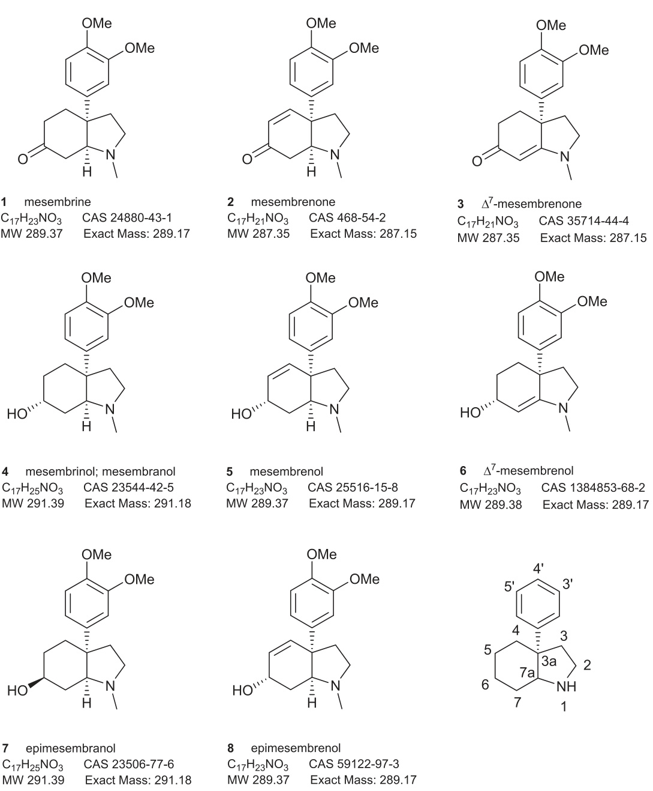
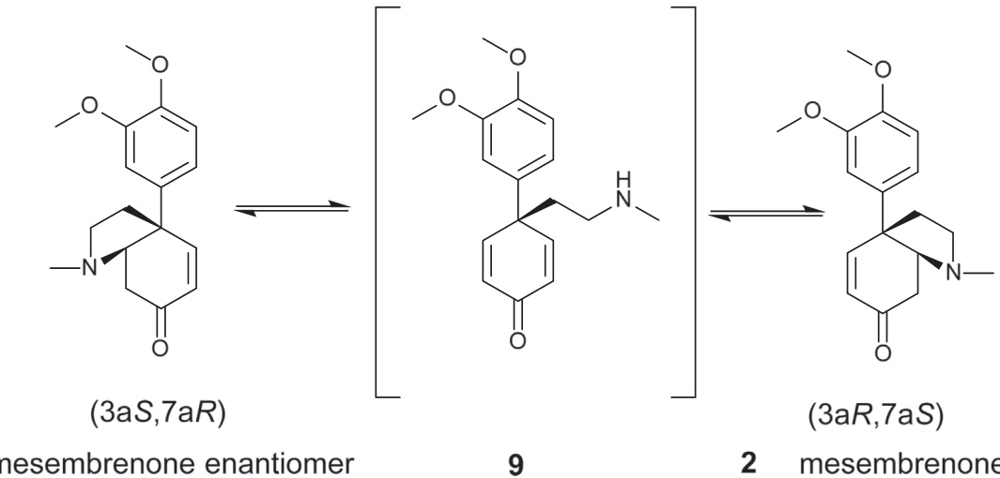
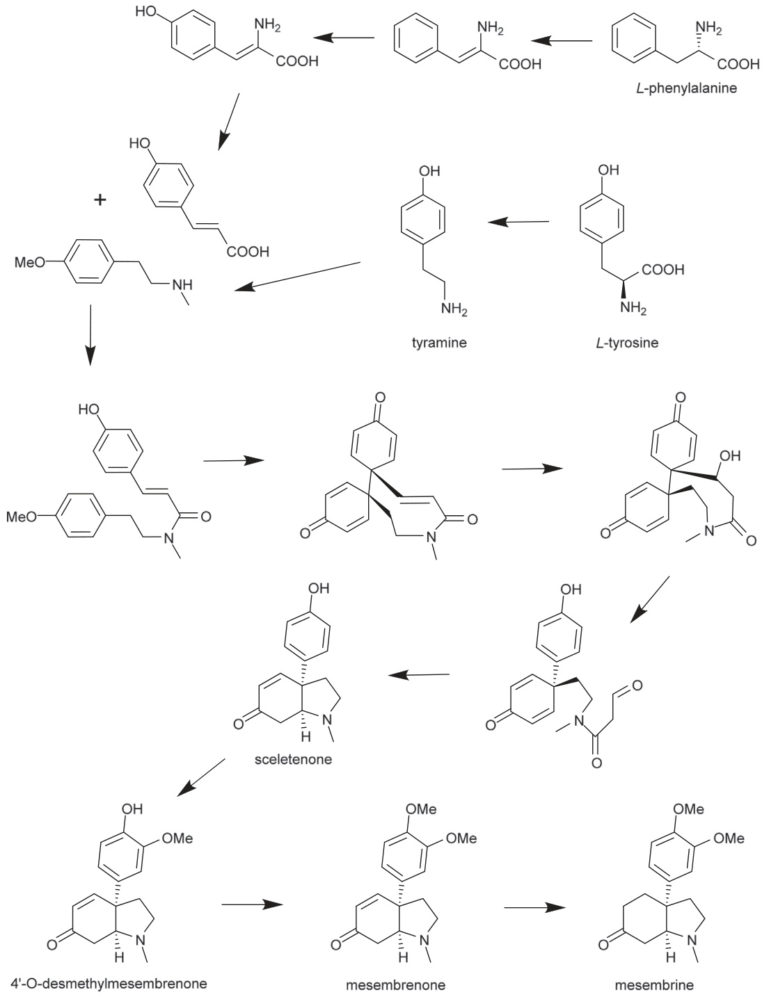

# Review

# Mesembrine alkaloids: Review of their occurrence, chemistry, and pharmacology

John L. Krstenansky

KGI School of Pharmacy, 535 Watson Dr., Claremont, CA 91711, USA

# A R T I C L E I N F O

Chemical compounds studied in this article: Mesembrine (PubChem CID 394162) Mesembrenone (Pubchem CID 216272) Mesembrinol (PubChem CID 442112) Sceletenone (PubChem CID 102239734)

Keywords:   
Sceletium tortuosum   
Alkaloid   
Mesembrine   
Mesembrenone   
Pharmacology   
Ethnopharmacology

# A B S T R A C T

Ethnopharmacological relevance: Mesembrine alkaloids are considered to be the primary active constituents of the South African medicinal plant Sceletium tortuosum (L.) N.E.Br. (Aizoaceae), and it is used as the dried or fermented aerial material from the plant, which is known as kanna (aka, channa, kougoed). Traditional regional use ranged from relieving thirst, mild analgesia, and alteration of mood. Current interest has focused primarily on the antidepressant action of preparations based on the plant and commercialization is expanding the recognition and availability of these preparations.

Materials and methods: Searches for the keywords “Sceletium or mesembrine” were performed in “PubMedNCBI”, “Chemical Abstracts SciFinder” and “Thomson Reuters Web of Science” databases in addition to the inclusion of references cited within prior reviews and scientific reports. Additionally the “SciFinder” database was searched using 3a-phenyl-cis-octahydroindole in the SciFinder Substructure Module (SSM). Plant taxonomy was validated by the database “The Plant List”.

Results: This review focuses on the chemistry, analysis, and pharmacology of the mesembrine alkaloids. Despite a long history of medicinal used and research investigation, there has been a renewed interest in the pharmacological properties of the mesembrine alkaloids and much of the pharmacology has only recently been published. The two major active alkaloids mesembrine and mesembrenone are still in the process of being more fully characterized pharmacologically. They are serotonin reuptake inhibitors, which provides a rationale for the plant's traditional use as an antidepressant, but other actions are beginning to appear in the literature. Additionally, mesembrenone has reasonably potent PDE4 inhibitory activity. This review intends to provide an overview of the available literature, summarize the current findings, and put them in perspective with earlier studies and reviews.

# 1. Introduction

Kanna (aka, channa, kougoed) is the dried or fermented aerial material from the plant, Sceletium tortuosum (L.) N.E.Br (Aizoaceae). This succulent species is a long-recognized, medicinal plant whose history and ethnopharmacology has been well reviewed (Gericke and Viljoen, 2008; Smith et al., 1996). The primary recognized active constituents are a group of mesembrine alkaloids; particularly mesembrine (1) and mesembrenone (2) (see Fig. 1). Popular interest in the cognitive and antidepressant actions of kanna (Chiu et al., 2014) and products based on kanna (Terburg et al., 2013) have been growing in recent years. Its abuse in combination with cannabis or other psychoactive agents has attracted the attention of the US Drug Enforcement Administration (Dye, 2013) and a seizure of the material was reported as an intelligence alert the DEA's Microgram Bulletin (DEA, 2008). Interestingly, the retail marketplace, amazon.com, bans kanna sales and includes it in their list of “Drugs & Drug

Paraphernalia” as “Products that simulate the effects of any illegal drug” (Amazon.com, 2016). Additionally, due to growing interest in the use of this plant, it is now mostly grown commercially in greenhouses and a 2013 study seeking to survey species in the genus for alkaloid content was unable to source material from the wild and relied on cultivators for their material (Patnala and Kanfer, 2013). In view of the renewed attention on this plant and the mesembrine alkaloids, the purpose of this review is to update the prior reviews of these area (Gericke and Viljoen, 2008; Smith et al., 1996) with a focus on recent analytical and pharmacological reports, and provide a comprehensive listing of the available literature with some commentary on key studies.

Some particularly valuable early reviews of the mesembrine alkaloids themselves occur within a couple of extensive chemistry-focused reviews of Sceletium alkaloids (Jeffs, 1981; Popelak and Lettenbauer, 1967). Mesembrine alkaloids are a subgroup within the Sceletium alkaloids. Additionally, an ongoing series of reviews covering literature reports of Amaryllidaceae and Sceletium alkaloids in one to several year segments has been published in Natural Product Reports (Jin, 2003, 2005, 2007, 2009, 2011, 2013; Jin et al., 2002; Lewis, 1990, 1992, 1993, 1994, 1995, 1996, 1997, 1998, 1999, 2000, 2001, 2002).

  
Fig. 1. Structures and identifying information for the main mesembrine alkaloids of current commercial and pharmacological interest. The numbering system is shown for the 3aphenyl-cis-octahydroindole core that is characteristic of the mesembrine subgroup of Sceletium alkaloids. The average (MW) and monoisotopic (Exact Mass) molecular weights are given along with the molecular formula and Chemical Abstracts Service (CAS) number for each compound.

# 2. Occurrence of mesembrine alkaloids

Sceletium is currently the only known genus having species with relatively high levels of mesembrine. Other related plants or other genera, such as Narcissus, contain significantly smaller amounts of the alkaloid, if at all (Berkov et al., 2014; Pigni et al., 2013; Smith et al., 1998). Early work used the basonym Mesembryanthemum, but the genus was abandoned. Earlier publications list species of plant that contain mesembrine or other Sceletium alkaloids; however, some of these species listed may be currently classified under different names (Jeffs, 1981; Smith et al., 1996). For example, a 1967 review mentions this genus reclassification and gives four species names as being accepted at the time (Popelak and Lettenbauer, 1967). As of 2016 “The Plant List” for the Sceletium genus currently lists 23 species with 19 species accepted (The Plant List, 2013). Of these, Sceletium namaquense, a reported mesembrine containing species (Popelak and Lettenbauer, 1967), is one of the four considered unresolved and “in review” by the World Checklist of Selected Plant Families (WCSP) (The Plant List, 2013). Many, but not all of Sceletium species obtained from commercial sources, contain mesembrine (Patnala and Kanfer, 2013). This fairly recent publication equates Sceletium tortuosum with S. joubertii and S. namaquense, which is consistent with Gerbaulet, 1996 despite “The Plant List” considering the former as an accepted separate species and the latter as unresolved (Gerbaulet, 1996; The Plant List, 2013). Therefore, this review focuses on the key alkaloids of current pharmacological interest as much as possible without regard to their source. When alkaloid isolation is discussed, some of the differences in individual alkaloid levels will be noted and the species identification is cited from the paper where available. This review focuses on the mesembrine subgroup of the Sceletium alkaloids, characterized by the 3a-phenyl-cis-octahydroindole ring system, because they are the subject of the majority of recent commercial and scientific interest. For these reasons, other related Sceletium alkaloids belonging to different subgroups and having different core structures than those listed in Fig. 1, such as Sceletium A4 or tortuosamine, have not been included in this review.

Because of the commercial importance of preparations containing mesembrine alkaloids, there have been efforts to distinguish Sceletium species by imaging techniques (Shikanga et al., 2013) and to quantify the alkaloid components within samples from commercial preparations of Sceletium tortuosum (Shikanga et al., 2012a, 2012b, 2012c).

Table 1 Current Sceletium species and status (The Plant List, 2013). For status, ${ } ^ { \mathfrak { s } } \mathbf { A } ^ { \mathfrak { s } } =$ accepted, moderate confidence level (source: Missouri Botanical Garden, Tropicos); “U” $\mathbf { \sigma } = \mathbf { \sigma }$ unresolved, low confidence level (WCSP (in review). Mesembrine presence as reported in the literature with reference given or reference where it was not detected. If multiple references cite its presence, then a $" + "$ is added after the citation.   

<html><body><table><tr><td>Name</td><td>Status</td><td>Mesembrine</td><td>Reference</td><td></td></tr><tr><td>Sceletium albanense L. Bolus</td><td>A</td><td>Yes - possible</td><td>Footnote 1</td><td></td></tr><tr><td>Sceletium anatomicum L. Bolus</td><td>A</td><td>Yes - confirmed</td><td>Rimington and Roets,1937</td><td>+</td></tr><tr><td>Sceletium archeri L. Bolus</td><td>A</td><td>No- possible</td><td>Footnote 2</td><td></td></tr><tr><td>Sceletium boreale L.Bolus</td><td>A</td><td>Yes- possible</td><td>Footnote 3</td><td></td></tr><tr><td>Sceletium compactum L.Bolus</td><td>A</td><td>Yes - possible</td><td>Footnote 3</td><td></td></tr><tr><td>Sceletium concavum Schwantes</td><td>A</td><td>Yes - possible</td><td>Footnote 3</td><td></td></tr><tr><td>Sceletium crassicaule L. Bolus</td><td>A</td><td>Yes-confirmed</td><td>Shikanga et al., 2013</td><td></td></tr><tr><td>Sceletium dejagerae L.Bolus</td><td>A</td><td>No- possible</td><td>Footnote 4</td><td></td></tr><tr><td>Sceletium emarcidum L.Bolus</td><td>A</td><td>No - confirmed</td><td>Patnala and Kanfer, 2013</td><td></td></tr><tr><td>Sceletium exalatum Gerbaulet</td><td>U</td><td>No - confirmed</td><td>Patnala and Kanfer, 2013</td><td></td></tr><tr><td>Sceletium expansum L. Bolus</td><td>A</td><td>Yes - confirmed</td><td>Hartwich and Zwicky, 1914</td><td>+</td></tr><tr><td>Sceletium framesiiL.Bolus</td><td>A</td><td>Yes -possible</td><td>Footnote 3</td><td></td></tr><tr><td>Sceletium gracile L.Bolus</td><td>A</td><td>Yes - possible</td><td>Footnote 3</td><td></td></tr><tr><td>Sceletium joubertiiL.Bolus</td><td>A</td><td>No - confirmed</td><td>Arndt and Kruger, 1970</td><td></td></tr><tr><td>Sceletium namaquense L.Bolus</td><td>U</td><td>Yes - confirmed</td><td>Popelak and Lettenbauer,1967</td><td>+</td></tr><tr><td>Sceletium ovatum L.Bolus</td><td>A</td><td>Yes-possible</td><td>Footnote 3</td><td></td></tr><tr><td>Sceletium regium L. Bolus</td><td>A</td><td>Yes - possible</td><td>Footnote 5</td><td></td></tr><tr><td>Sceletium rigidum L. Bolus</td><td>A</td><td>No - confirmed</td><td>Patnala and Kanfer, 2013</td><td></td></tr><tr><td>Sceletium strictum L. Bolus</td><td>A</td><td>Yes - confirmed</td><td>Jeffs et al., 1971</td><td>+</td></tr><tr><td>Sceletium subvelutinumL.Bolus</td><td>U</td><td>No - confirmed</td><td>Herbert and Kattah,1990</td><td></td></tr><tr><td>Sceletium tortuosum (L.) N.E. Br.</td><td>A</td><td>Yes - confirmed</td><td>Hartwich and Zwicky, 1914</td><td>+</td></tr><tr><td>Sceletium tugwelliae L. Bolus</td><td>A</td><td>Yes - possible</td><td>Footnote 3</td><td></td></tr><tr><td>Sceletium varians L.Bolus</td><td>A</td><td>No -possible</td><td>Footnote 6</td><td></td></tr></table></body></html>

Table 1 Footnotes: $1 \colon \equiv S .$ . crassicaule (Haw.) L.Bolus (Gerbaulet, 1996) indicating the possible presence of mesembrine; $2 \colon \equiv S .$ rigidum L.Bolus (Gerbaulet, 1996) indicating a possible lack of mesembrine; $3 \colon \equiv S .$ . tortuosum (L.) N.E.Br. (Gerbaulet, 1996) indicating the possible presence of mesembrine; $4 \colon \equiv S$ emarcidum (Thunb.) L.Bolus ex H.J.Jacobsen (Gerbaulet, 1996) indicating a possible lack of mesembrine; ${ 5 \mathord { : } } \equiv S$ . expasum (L.) L.Bolus (Gerbaulet, 1996) indicating the possible presence of mesembrine; 6: Sceletium varians (Haw.) Gerbaulet comb.nov. $\equiv$ Sceletium subvelutinum (L.) Bolus forma subvelutinum (Gerbaulet, 1996) indicating a possible lack of mesembrine.

Table 1 lists the current 23 species from “The Plant List” indicating the current status of their classification. The earliest reference for the identification of mesembrine in a particular species is given. If a species had been evaluated, but mesembrine had not been detected in significant amounts, then this is indicated as “No – confirmed”. Nevertheless, in these cases, other mesembrine alkaloids were typically present (Patnala and Kanfer, 2013). Species lacking a reference have not been evaluated in the literature reviewed so the presence of mesembrine is uncertain. Footnotes in the table point to species equivalencies based on Gerbaulet, 1996, which may indicate the liklihood of the presence of mesembrine for species not otherwise cited in the literature as having been examined for the presence of mesembrine and mesembrine alkaloids (Gerbaulet, 1996). The basis for drawing these tentative conclusions stems from the alkaloid patters observed for the species subsets within Sceletium (Patnala and Kanfer, 2013). Thus, it can be seen that mesembrine is present in many, but not all species of the Sceletium genus. From a commercial standpoint, studies directed at the variability of mesembrine alkaloid composition with regard to species, strain, time of harvest, and growing conditions would be of great importance.

# 3. Chemistry

# 3.1. Structure and properties

The absolute stereochemistry for the mesembrine alkaloids as shown in Fig. 1 was established by x-ray crystallography of 6- epimesembranol methiodide and later that of (-)-mesembrine HCl (Capps et al., 1977; Coggon et al., 1970). It was in agreement with the assignment of stereochemistry of mesembrine based on CD and NMR studies (Jeffs et al., 1969). It should be noted that a number of papers and internet sources depict incorrect stereochemistry for some of the alkaloids, so it is important to carefully note and establish the correct stereochemistry within any source. The structures depicted in this review reflect the stereochemistry as established by Jeffs’ studies noted above.

# 3.1.1. Mesembrine $( { \pmb I } )$ : (3aS,7aS)- $. 3 a$ -(3,4-dimethoxyphenyl)-1- methylhexahydro-1H-indol-6(2H)-one

This alkaloid is the most studied of the mesembrine alkaloids due to its relative abundance in Sceletium tortuosum and biological activity. Mesembrine was initially partially isolated, characterized, and named by Zwicky (Hartwich and Zwicky, 1914; Zwicky, 1915). Following on that report, mesembrine was purified and crystallized as the picrate $\mathrm { ( m p 1 9 3 - 1 9 4 ^ { \circ } C ) }$ and the platinichloride $\mathrm { \tilde { \ m p } 1 8 1 ^ { \circ } C } )$ (Rimington and Roets, 1937). They also reported some color tests performed on the non-crystalline hydrochloride salt.

In 1957, mesembrine was isolated and crystallized as the hydrochloride salt from isopropanol-ethanol $\mathrm { ( m p 1 9 9 - 2 0 1 ^ { \circ } C ) }$ and reported the IR spectrum (Bodendorf and Krieger, 1957). They correctly identified that the material contained two methoxy groups and an Nmethyl group, correcting earlier reports claiming mesembrine to be a phenolic base, which it is not.

In 1960, Popelak, et al. correctly reported the structure of mesembrine, physical data, and characterized a variety of derivatives through chemical modification of the isolated alkaloid (Popelak et al., 1960a, 1960b). It should be noted that mesembrine HCl can be recrystallized from 2-propanol; however, attempts at crystallizing this salt from ethanol produces an ethyl enol ether from the keto group that can be converted back to mesembrine HCl by treatment with $0 . 1 \mathrm { { N } }$ aq. HCl. Enol formation does not occur with the free base in ethanol (Popelak and Lettenbauer, 1967).

# $2 0 6 ^ { \circ } \mathrm { C }$

Lit. (Taber and He, 2005) mesembrine, colorless $\mathrm { [ \alpha ] _ { D } ^ { 2 0 } = - 5 5 . 4 ^ { \circ } ( c \ 0 . 5 4 , M e O H ) ; }$ oil   
IR (neat, $\mathrm { c m } ^ { - 1 }$ ): 2944 (m), 1716 (s), 1520 (s), 1454 (m), 1253 (s), 1148 (m), 1027 $\mathrm { ( m ) }$ ; $^ 1 \mathrm { H }$ NMR ${ \bf \zeta } _ { 4 0 0 } \bf { M H z }$ , $\mathrm { C D C l } _ { 3 }$ ) δ: 6.93 (dd, $J = 8 . 4$ , 2.4 Hz, 1 H), 6.90 (d, $J = 2 . 0 ~ \mathrm { H z } , 1 ~ \mathrm { H } ,$ ), 6.84 (d, $, J = 8 . 4 \ : \mathrm { H z , 1 \ : H }$ , 3.90 (s, 3 H), 3.88 (s, 3 H), 3.13–3.17 $\mathrm { ( m , 1 H ) }$ ), 2.96 (t, $J = 3 . 6 ~ \mathrm { H z } , 1 ~ \mathrm { H } ,$ ), 2.61 (m, 2 H), 2.35–2.46 (m, 2 H), 2.33 (s, $3 \mathrm { H } \mathbf { \overrightarrow { A } } .$ , 2.04–2.26 (m, 5 H); $^ { 1 3 } \mathrm { C }$ NMR $\mathrm { ( C D C l _ { 3 } }$ , 90 MHz) $\delta { \bf { u } }$ : 211.5, 149.3, 147.8, 140.4, 55.1, 47.8, 40.8, 39.1, 36.4, 35.5; d: 118.2, 111.3, 110.3, 70.6, 56.2, 56.1, 40.3

Racemic mesembrine, which is the product of several total synthesis routes (Chavan et al., 2004; Gelas-Mialhe et al., 1992; Gramain and Remuson, 1985; Hackett and Livinghouse, 1986; Honda et al., 2012; Hoshino et al., 1978, 1987; Jeffs et al., 1983; Kochhar and Pinnick, 1983; Kulkarni et al., 2002; Martin et al., 1979; Michael et al., 1992; Ohishi and Kugita, 1968, 1970; Parkinson and Pinhey, 1991; Rajagopalan, 1997; Rigby and Dong, 2000; Roe et al., 2008; Shamma and Rodriguez, 1965, 1968; Shono et al., 1989; Spittler et al., 2016; Stevens et al., 1975; Takano et al., 1981a; Zhao et al., 2009), can be resolved to the natural l-isomer through fractional crystallization using $\mathbf { a }$ -bromo-D-camphor- $\mathbf { \sigma } \cdot \pi$ -sulfonic acid (Popelak and Lettenbauer, 1962).

# 3.1.2. Mesembrenone (2): (3aR,7aS)- $. 3 a$ -(3,4-dimethoxyphenyl)-1- methyl- ${ } _ { \cdot 3 , 3 a , 7 , 7 a }$ -tetrahydro-1H-indol-6(2H)-one

The material readily racemizes (e.g., ethanolic solution for $1 7 \mathrm { h }$ at $2 5 ^ { \circ } \mathrm { C }$ or $5 \mathrm { m i n }$ at $5 0 ~ ^ { \circ } \mathrm { C }$ ) via acid or base catalyzed reversible $\beta \mathrm { . }$ - elimination to 9 (Fig. 2) (Jeffs et al., 1970).

<html><body><table><tr><td colspan="2">Lit. (Jeffs et al., 1970)</td></tr><tr><td>Mesembrenone,</td><td>CD [0]3950°,[0]334 -4060°,[0]310 0°（c</td></tr><tr><td>an oil Mesembrenone</td><td>1.072 mg/mL,ethanol)</td></tr><tr><td></td><td>mp 204-207℃</td></tr><tr><td>HCl</td><td></td></tr></table></body></html>

3.1.3. mesembrinol; mesembranol (4): (3aS,6 R,7aS)−3a-(3,4- dimethoxyphenyl)−1-methyloctahydro-1H-indol-6-ol

Much of the historical literature uses the mesembranol name. This alkaloid differs from epimesembranol (7) only in the stereochemistry at the 6 position alcohol. It can be separated from its epi-counterpart by crystallization, since the epi-form does not crystallize, or by chromatography (Popelak and Lettenbauer, 1967).

<html><body><table><tr><td>Lit. (Popelak and Lettenbauer, 1967)</td><td></td></tr><tr><td>Mesembrinol [α]= -32°(CHCl3);</td><td>mp 144-145℃</td></tr><tr><td>Lit. (Chida et al., 1994)</td><td></td></tr><tr><td>Mesembrinol</td><td>[a] = -28°(c 0.2,CHCl3); mp 146-147 ℃</td></tr></table></body></html>

# 3.1.4. mesembrenol (5): (3aR,6 S,7aS)-3a-(3,4-dimethoxyphenyl)-1- methyl-2,3,3a,6,7,7a-hexahydro-1H-indol-6-ol

Jeffs, et al. first isolated, crystallized, and identified this alkaloid in 1970 as the major alkaloid component of Sceletium strictum (L.) Bolus (Aizoaceae) (Jeffs et al., 1970). The material used in this study had been grown from seed in a greenhouse for three years and was identified by L. Bolus, Bolus Herbarium, University of Cape Town, South Africa.

<html><body><table><tr><td>Lit. (Jeffs et al., 1970) Mesembrenol [a]=+91°(c 0.0176, CHCl3)</td><td>mp 140℃ (recrys.from EtOAc) mp 122-124.5oC (recrys. from acetone)</td></tr><tr><td colspan="2">1H NMR (100 MHz) δ: 6.84 (m, 3 H, ArH), 5.70 (q of t, J4,5 = 10.5 Hz,J4,6=1.8 Hz,J5,6= J5,7a = J4,7a =1.5Hz,2H,-CH=CH- ）， 4.30 (m,1H,C6H),3.76 (s,3H,-OCH3),3.80 (s,3H,-OCH3), 2.30 (s,3 H, NCH).</td></tr></table></body></html>

# 3.2. Biosynthesis

The biosynthetic pathway depicted in Fig. 3, suggested by the work involving radiolabeled precursor materials, proposes that the aromatic group of mesembrine comes from phenylalanine and the perhydroindole portion comes from tyrosine (Jeffs et al., 1971). From phenylalanine, cinnamic acid intermediates are produced, but the $3 ^ { \prime }$ -aryl oxygen substituent is introduced late in the pathway as evidenced by the late steps involving sceletenone (CAS 51934-31-7), $4 ^ { \prime } 0$ -demethylmesembrenone, and mesembrenone (Jeffs et al., 1978).

# 3.3. Isolation

Many alkaloid isolations using varied techniques and different species of plant have been reported (Arndt and Kruger, 1970; Bastida et al., 1989; Doepke et al., 1981; Jeffs et al., 1970, 1982; Jeffs and Capps, 1979; Nieuwenhuis et al., 1981; Rimington and Roets, 1937;

  
Fig. 2. Racemization of mesembrenone via reversible $\beta$ -elimination (Jeffs et al., 1970).

  
Fig. 3. Proposed biosynthetic pathway (Jeffs, 1981). Some arrows represent more than one step in the pathway.

Shikanga et al., 2011). A couple of examples are presented below with the isolated yield from each. Note that the isolated yield is not only dependent on the efficiently of the method, but also on the abundance of the alkaloids in the starting plant material used.

# 3.3.1. Alcohol extraction with neutral alumina column

Fresh 3 year old plants of Sceletium strictum were homogenized with $9 5 \%$ ethanol, heated and filtered (Jeffs et al., 1971). The material used in this study had been grown from seed in a greenhouse for three years and was identified by L. Bolus, Bolus Herbarium, University of Cape Town, South Africa. The solid was further Soxhlet extracted with methanol. The combined extracts were concentrated, treated with sodium carbonate and extracted with chloroform. Evaporation of the chloroform left the crude alkaloid $( 2 . 5 \% \ \mathrm { w / w } )$ . The crude alkaloid fraction was eluted on neutral alumina column using a linear gradient of benzene against ethyl acetate followed by ethyl acetate/methanol and finally methanol. Fractions were analysed by GC-FID. The following materials were obtained from the fractions in the following amounts: mesembrine (1) $0 . 0 6 7 \%$ ; mesembrenone (2) $0 . 0 2 5 \%$ ; mesembranol (4) $0 . 0 5 8 \%$ ; mesembrenol (5) $0 . 7 1 \%$ ; (See Fig. 1 for structures). Note that the major alkaloid from this plant species was mesembrenol.

# 3.3.2. High performance countercurrent chromatography (HPCCC)

An isolation process that started with an acid extraction of the dried Sceletium tortuosum material giving $1 . 9 \%$ by weight of crude alkaloid extract has been reported (Shikanga et al., 2011). This plant material used in the study was collected in April 2009 from the Western Cape South Africa with a voucher specimen kept at the Dept. of Pharmaceutical Sciences, Tshwane University of Technology. This was fractionated on a silica gel column to give one fraction containing alkaloids 1 and 2 and another fraction containing 4 and 5. Using a high-performance countercurrent chromatography instrument on the two fractions, they obtained each of the four alkaloids in $> 9 5 \%$ purity.

The overall isolated amounts from dried plant material were $1 0 . 2 1 \%$ ;   
$2 0 . 2 4 \%$ ; 4 $0 . 0 2 5 \%$ ; 5 $0 . 1 6 \%$ .

# 3.4. Analysis

Both preclinical, clinical, and forensic study of mesembrine alkaloid-containing products requires sensitive validated assays for the qualitative and quantitative analysis of those alkaloids or the metabolites. The recent literature provides a variety of such methods, which greatly enable a broad range future studies.

# 3.4.1. High performance thin layer chromatography (HPTLC)- densitometry

HPTLC is a robust method for the analysis and characterization of botanical products (Toniolo et al., 2014). Using Silica gel 60 F254 HPTLC plates eluted with dichloromethane–methanol– $10 \%$ ammonia (90:10:0.1, v/v) (Shikanga et al., 2012b). Densitometric quantification was based on absorbance at $2 8 0 \mathrm { n m }$ . Limit of Detection (LOD) was in the range of 18–31 ng per band and limit of quantitation (LOQ) was 44–95 ng per band for the four main mesembrine alkaloids. The validated method was reported useful for raw plant material and commercial products containing Sceletium tortuosum alkaloids.

# 3.4.2. Capillary electrophoresis methods $( C E )$

A nonaqueous capillary electrophoresis-mass spectrometry (NACEMS) method for forensic analysis of Sceletium-containing products and to analyze products the fermentation process of Sceletium tortuosum has been reported (Roscher et al., 2012). The species-identified plant materials used in this study were obtained from two commercial sources. The method, originally developed for the analysis of kratom alkaloids, has a mean dynamic range is $0 . 1 { - } 5 0 0 ~ \mu \mathrm { M }$ , based on Harmala alkaloid standards.

A capillary zone electrophoresis method for the analysis of mesembrine in Sceletium tortuosum products has been reported with an LOQ and LOD of 2.5 and $1 . 5 ~ { \mu \mathrm { g } } / \mathrm { m L } ,$ respectively (Patnala and Kanfer, 2008).

# 3.4.3. Gas chromatography-mass spectrometry (GC-MS)

GC-MS combined with other methods have been used to provide a detailed metabolic analysis of the mesembrine alkaloids from rat urine (Meyer et al., 2015), and GC-MS alone has been used to develop a method that has a LOD of $1 2 { - } 2 3 \ \mu \mathrm { g / m L }$ and LOQ of $3 5 { - } 6 8 ~ \mu \mathrm { g / m L }$ for the four main mesembrine alkaloids.

# 3.4.4. High performance liquid chromatography (HPLC)

Along with the GC-MS method, a more sensitive reverse phase-ultra high performance liquid chromatography-photodiode array (RPUHPLC-PDA) method was developed with a LOD of $0 . 9 { - } 1 . 2 \mu \mathrm { g / m L }$ and LOQ of $2 . 7 \mathrm { - } 3 . 7 \mu \mathrm { g } / \mathrm { m L }$ (Shikanga et al., 2012a). A sensitive HPLC method has been published that is linear in the concentration range of $0 . 4 { - } 6 0 \ \mathrm { m g / m L }$ with a LOD of $\mathrm { 1 0 0 \ n g / m L }$ and a LOQ of $2 0 0 ~ \mathrm { { n g / m L } }$ (Patnala and Kanfer, 2010). Finally, liquid chromatography-linear ion trap high resolution mass spectrometry (LC-HR-MSn) was used as a component of metabolism studies discussed in more detail below (Meyer et al., 2015).

# 3.4.5. Direct analysis in real time ionization coupled with high resolution time-of-flight mass spectrometry (DARTHRTOFMS)

Forensic analysis of kanna from a variety of suppliers using DARTHRTOFMS was performed in order to assess the presence of the plant materials as well as adulterants (Lesiak et al., 2016). Using five different samples, the major alkaloids were identified, providing evidence for the presence of the advertised plant material, and in one case, adulteration with a banned chemical was identified, establishing this method as useful in identifying misrepresented and potentially unsafe products.

# 3.5. Total synthesis

As early as 1962, a synthetic route for mesembrine and mesembrine analogs was patented (Popelak and Lettenbauer, 1962). Since then, numerous total syntheses of both the racemic (Chavan et al., 2004; Gelas-Mialhe et al., 1992; Gramain and Remuson, 1985; Hackett and Livinghouse, 1986; Honda et al., 2012; Hoshino et al., 1978, 1987; Jeffs et al., 1983; Kochhar and Pinnick, 1983; Kulkarni et al., 2002; Martin et al., 1979; Michael et al., 1992; Ohishi and Kugita, 1968, 1970; Parkinson and Pinhey, 1991; Rajagopalan, 1997; Rigby and Dong, 2000; Roe et al., 2008; Shamma and Rodriguez, 1965, 1968; Shono et al., 1989; Spittler et al., 2016; Stevens et al., 1975; Takano et al., 1981a; Zhao et al., 2009) and both individual stereoisomers (Arns et al., 2007; Dalko et al., 1998; Denmark and Marcin, 1997; Geoghegan and Evans, 2013; Ilardi et al., 2009; Kosugi et al., 1993; Meyers et al., 1985; Mori et al., 1997a, 1997b; Nemoto et al., 1994, 1995; Nunokawa et al., 2015; Otani and Yamada, 1973; Ozaki and Kobayashi, 2015; Paul et al., 2006; Taber and Neubert, 2001; Taber and He, 2005; Takano et al., 1981b, 1990; Yamada and Otani, 1971; Yokomatsu et al., 1992; Yoshimitsu and Ogasawara, 1996; Zhang et al., 2012) have been reported and much of this work has been presented in a Japanese review covering 31 published routes (Zhao et al., 2010). While the paper is in Japanese, which presents a barrier for those who cannot translate the article, the many synthetic schemes are in English and having them together in one reference is valuable. Despite these extensive synthetic efforts and the availability of commercially grown Sceletium tortuosum there is currently no commercially available source for the mesembrine alkaloids in pure form. Commercial availability of pure materials at a reasonable price would be of considerable value enabling pharmacologists worldwide to expand our understanding of these materials.

The total synthesis of analogs based on a mesembrine core structure reported modest analgesic activity in a mouse hot plate test for one of the analogs, 3-((3aS,7aS)-1-methyloctahydro-3aH-indol-3ayl)phenol (Langlois et al., 1971, 1972).

Biovitrum submitted a patent application covering substituted mesembrine analogs as melanin concentrating hormone receptor (MCH1R) antagonists for the modulation of appetite (Browning et al., 2005). They present a total synthesis of a large number of analogs. Example 70 in the application is a 6-substituted mesembrine analog with a $\mathbf { p }$ -trifluoromethoxyphenylurea group having a $\mathrm { \ K _ { i } }$ of $5 2 { \mathrm { n M } }$ at the MCH1R.

# 4. Biology

# 4.1. Metabolism

The metabolism of isolated and purified mesembrine and mesembrenone in vivo in the rat, and in vitro using a human liver preparation has been reported (Meyer et al., 2015). O- and N-demethylations were observed for both alkaloids. Reduction (dihydro metabolite) was observed and hydroxylation was observed at different positions. The resulting phenolic metabolites were partly excreted as glucuronides or sulfates. For mesembrine the most abundant metabolites were the acetylated demethyl-dihydro and hydroxy metabolites in rat urine. For mesembrenone the demethyl-dihydro were the most abundant metabolites in the rat urine.

# 4.2. Pharmacology

Despite the long history of the medicinal actions of kanna and the depth of the literature on isolation and total synthesis of mesembrine and related alkaloids, there has been surprisingly little published on the pharmacology of the individual alkaloids, which is likely partly due to the lack of commercially available pure alkaloids. Nonetheless, as more is learned about the pharmacology of these materials the number of patents and applications for the use of mesembrine alkaloid preparations has been gaining pace (Davies, 2016; Gericke et al., 2015, 2016; Gericke and Van Wyk, 2001; Harvey et al., 2010; Holford, 2002). A report of three clinical cases using Sceletium tortuosum tablets has previously been reviewed pointing to potential therapeutic utility of such a preparation (Gericke and Viljoen, 2008). Controlled human trials mentioned below are beginning to appear and are the first step in providing evidence for wide acceptance and use of these materials.

# 4.2.1. Receptor screening

In 2011, an attempt at a comprehensive pharmacological screen, began with a commercial material, Zembrin®, which is a standardized extract of Sceletium tortuosum (Harvey et al., 2011). The preparation consists of $0 . 3 5 { - } 0 . 4 5 \%$ total alkaloids, with mesembrenone and mesembrenol comprising $2 6 0 \%$ , and mesembrine contributing $\angle \cdot \angle$ $20 \%$ (Murbach et al., 2014). This mixture was screened in 77 radioligand binding assays at $0 . 7 5 \mathrm { \ m g / m L }$ and a panel of phosopodiesterases. The extract gave $> 8 0 \%$ inhibition at GABA receptors (nonselective), serotonin (5-HT) transporter, $\delta _ { 2 } .$ - and $\mu$ -opioid receptors, the cholecystokinin-1 receptor, and PDEs 3 and 4 (Harvey et al., 2011). Following up on these results, the potency of the isolated alkaloids at the 5-HT transporter and with PDE4 were reported, as described separately in the following Sections 4.2.2 and 4.2.3.

# 4.2.2. Serotonin reuptake inhibition

Individual alkaloids isolated from Sceletium tortuosum extract were tested against the 5-HT transporter (SERT) and the ${ \mathrm { K } } _ { \mathrm { i } } { \mathrm { s } }$ for mesembrine, mesembrenone, and mesembrenol were 1.4, 27, and $6 3 { \mathrm { ~ n M } }$ , respectively (Harvey et al., 2011). These values are comparable to the marketed SSRI, fluoxetine (Tavoulari et al., 2009) and significantly more potent than values seen for related Amaryllidaceae alkaloids, such as buphanidrine or distichamine with SERT $\mathrm { \ K _ { i } s }$ of 312 and $8 6 8 \mu \mathrm { M }$ , respectively, which derive from another traditional anxiety treating plant Boophone disticha (L.f.) Herb (Amaryllidaceae) (Sandager et al., 2005).

# 4.2.3. PDE4 inhibition

The isolated alkaloids mesembrine, mesembrenone, and mesembrenol inhibited PDE4B with $\mathrm { I C } _ { 5 0 } \mathrm { s }$ of 7.8, 0.47, and $1 6 \mu \mathrm { M }$ , respectively (Harvey et al., 2011). The protypical PDE4 inhibitor rolipram is at least 3-times more potent with an $\mathrm { I C } _ { 5 0 }$ for PDE4B of $0 . 1 3 \mu \mathrm { M }$ (MacKenzie and Houslay, 2000). Related to this mechanism of action, one in vivo study correlated the responses seen by Zembrin® extract and rolipram as interpreted as an electopharmacogram, which is a frequency analysis of the field potentials recorded from the frontal cortex, hippocampus, striatum and reticular formation in the presence of drugs in freely moving rats (Dimpfel et al., 2016b).

Since the identification of PDE inhibition for these alkaloids, a number of patents, where a PDE inhibitor would have utility alone or in combination with other substances, have included the mesembrine alkaloids among a list of other PDE inhibitors (Collins et al., 2014; Hammock et al., 2011; Kielian, 2014; Lefebvre and DeMaeyer, 2013).

# 4.2.4. Increased VAMT-2 expression

The effects of a high mesembrine-content standardized extract, Trimesemine™, $3 \%$ mesembrine $\left( \mathbf { w } / \mathbf { w } \right) )$ on human astrocytes and mouse hippocampal cells in comparison to the effect elicited by the racemic mixture SSRI, citalopram (Coetzee et al., 2016). The mesembrine extract caused less down-regulation of expression of SERT than citalopram and a greater upregulation of expression of the vesicular monoaminetransporter-2 (VAMT-2) than citalopram. These results were interpreted by the authors as meaning that the primary mechanism of action of this extract is through monoamine release and that serotonin reuptake inhibition is secondary to this release effect.

# 4.2.5. CB1 receptor binding

Mesembrine has been shown to bind to cloned human cannabinoid CB1 receptors in vitro with about $1 \%$ the potency of the $\Delta ^ { 9 }$ -tetrahydrocannabinol (THC) standard (Lubbe et al., 2010). Due to the low potency, a binding constant was not determined. This result was in agreement with a later receptor screening study (Harvey et al., 2011).

# 4.2.6. Inhibition of forskolin-induced steroidogenesis

An in vitro study examining the ability of high mesembrine-content standardized extract, Trimesemine™, to affect steroidogenesis using the human adrenocortical carcinoma cell line H295R was reported (Swart and Smith, 2016). The Trimesemine™ preparation is a lyophilized extract prepared from a proprietary hybrid (DV17) of S. tortuosum (L.) N.E. Br. and S. expansum (L.) L. Bolus (Aizoaceae) using a proprietary method, consists primarily of mesembrine (1), $\Delta ^ { 7 }$ -mesembrenone (3), and mesembrenone (2), as demonstrated by UPLC-MS (see Fig. 1 for structures). The results demonstrate that Trimesemine™ affects steroid hormone production, possibly through modulation of the catalytic activity of steroidogenic enzymes.

# 4.2.7. Mouse forced swim test

In 2014 Schell reported a study comparing a partially purified alkaloid extract containing the main mesembrine alkaloids to paroxetine in a mouse forced swim test, a rodent model for depression (Schell, 2014). The relative composition of the alkaloid mixture used was mesembrine $9 . 2 \%$ , mesembrenone $8 . 0 \%$ , mesembrinol $6 7 . 0 \%$ , and mesembrenol $1 5 . 8 \%$ as determined by GC/MS. At 10 and $8 0 \mathrm { m g / k g }$ i.p. dose of the alkaloid mixture was compared with a $\mathrm { 1 \ m g / k g }$ i.p. dose of paroxetine, which was calculated to give a comparable level of serotonin reuptake inhibition based on the literature $\mathrm { I C } _ { 5 0 } \mathrm { s }$ for mesembrine vs paroxetine. Both the alkaloid mixture and paroxetine had comparable activity in this depression model, while neither demonstrated any locomotor effects at the same dose levels.

# 4.2.8. Human trials

Since 2009, the aforementioned preparation Zembrin® has been studied for safety and cognitive effects in a number of human trials.

The first report was a double-blind, placebo-controlled study performed in 2009 that examined the safety and tolerability at doses of $8 ~ \mathrm { m g }$ and $2 5 ~ \mathrm { m g }$ once daily over a three month period (Nell et al., 2013). A dozen healthy adults were used in each arm of the study and compared to thirteen subjects receiving placebo (18–55 years of age). Both doses were well tolerated and adverse effects were the same as or less frequent than was seen for the placebo group.

Another double-blind, placebo-controlled cross-over design study in sixteen healthy undergraduate students (18–21 years) used functional magnetic resonance imaging (fMRI) $2 \mathrm { h }$ after a single $2 5 \mathrm { m g }$ dose of Zembrin® or placebo focusing on amygdala activity in response to an anxiety-related activity and amygdala-hypothalamus coupling in an emotion matching task (Terburg et al., 2013). There results were interpreted as demonstrating anxiolytic potential consistent with the previously proposed serotonin reuptake inhibition (SRI) and PDE4 inhibitory activity (Harvey et al., 2011); however, there were no positive controls to assess the relative effects versus established control SRIs or PDE4 inhibitors.

A randomized double-blind, placebo-controlled, cross-over design clinical trial using $2 5 \mathrm { m g }$ capsules of Zembrin® in 21 cognitively healthy subjects was reported (Chiu et al., 2014). The dosing was once daily for 3 weeks. Zembrin® was well tolerated and demonstrated improved executive function along with positive changes in mood and sleep.

Recently, a larger double-blind, randomized, placebo-controlled study in 60 healthy adults (40–75 years) was conducted using 25 or $5 0 \mathrm { m g }$ doses of GMP-manufactured Zembrin® versus placebo using quantitative 17-channel EEG and eye-tracking, two hours after dosing, while being challenged cognitively and emotionally (Dimpfel et al., 2016a). Psychometric performance improvement suggest a small improvement versus placebo, but the results were not statistically significant. Most significant was the documentation of consistent, doserelated changes in brain activity that could serve as a baseline for future studies.

In summary, these studies appear to give good evidence to safety and tolerability in healthy subjects at the doses tested and over the period of time of the studies; however, the modest size of the studies, lack of positive controls limit the conclusions that can be drawn about the therapeutic utility of the agents.

# 4.3. Toxicology

A toxicological study of Zembrin® in male and female rats was reported (Murbach et al., 2014). No mortality or treatment-related adverse effects in the 14- or 90-day studies at doses ranging from 100 to $5 0 0 0 \mathrm { m g / k g }$ bw/day.

# 5. Conclusions

While the pharmacology and mechanism(s) of action for the behavioral effects of the individual mesembrine alkaloids and preparations containing mixtures of these alkaloids is not entirely clear, it is evident from in vitro, in vivo, and clinical studies that the main mesembrine alkaloids are bioavailable CNS-active materials worthy of further study. One current limitation is the lack of commercially available pure substance and reference materials. Despite the broad screening of an mesembrine alkaloid mixture followed by testing of the individual alkaloids against the positive hits from the mixture (Harvey et al., 2011), it would still be of value to broadly screen (affinity and functionality) the individual alkaloids to better understand their functional activity and selectivity in addition to their potency. Seldom are CNS drugs completely selective for one target. From the standpoint of developing these materials or their analogs into therapeutic agents, considerably more study is needed concerning the ultimate safety of these alkaloids and alkaloid mixtures. Additionally a competitive threat exists from non-mesembrine compounds that select for the same or multiple CNS targets, such as the dual serotonin reuptake inhibitors having PDE4 inhibitory activity that have been reported (Cashman and Ghirmai, 2009; Cashman et al., 2009a, 2009b).

However, from an herbal product perspective, where the safe and effective threshold of a pharmaceutical product does not need to be met, the trials using standardized commercial preparations are quite helpful in addressing the issues of safety and tolerability needed for an herbal product. As with all natural product preparations, QA/QC for the delivery of a consistent product with predictable biological effects is a considerable challenge. Another issue for the non-prescription use of these particular preparations is the significant potency as a serotonin reuptake inhibitor. Inappropriate use of the product or use in combination with other antidepressants or herbal products might lead to serious interactions or serotonin syndrome. If these products ever see more widespread marketing, then it would be a priority to address these real possibilities.

# Acknowledgements

The author wishes to thank the KGI School of Pharmacy for the time and resources to complete this review. This research did not receive any specific grant from funding agencies in the public, commercial, or not-for-profit sectors. The author has no conflicts of interest nor does he have any financial interest in the materials or studies discussed in this review.

# References

Amazon.com, 2016. Selling at Amazon.com: Drugs & Drug Paraphernalia: Examples of Prohibited Listings.〈http://www.amazon.com/gp/help/customer/display.html/? NodeId=200277220〉 (accessed 16.11.02).   
Arndt, R.R., Kruger, P.E.J., 1970. Alkaloids from Sceletium joubertii. Structure of joubertiamine, dihydrojoubertiamine, and dehydrojoubertiamine. Tetrahedron Lett. 37, 3237–3240.   
Arns, S., Lebrun, M.-E., Grise, C.M., Denissova, I., Barriault, L., 2007. Diastereoselective construction of quaternary carbons directed via macrocyclic ring conformation: formal synthesis of (-)-mesembrine. J. Org. Chem. 72 (24), 9314–9322.   
Bastida, J., Viladomat, F., Llabres, J.M., Ramirez, G., Codina, C., Rubiralta, M., 1989. Narcissus alkaloids. VIII. Mesembrenone: an unexpected alkaloid from Narcissus pallidulus. J. Nat. Prod. 52 (3), 478–480.   
Berkov, S., Martinez-Frances, V., Bastida, J., Codina, C., Rios, S., 2014. Evolution of alkaloid biosynthesis in the genus NarcissusPhytochemistry 99. Elsevier, 95–106.   
Bodendorf, L.K., Krieger, W., 1957. Alkaloids of Mesembryanthemum tortuosum. Archiv der. Pharm. und Ber. der Dtsch. Pharm. Ges. 290, 441–448.   
Browning, A., Nilsson, J., Scobie, M., Angbrant, J., Ringom, R., 2005. New Compounds. Biovitrum, US Patent Application 2005/0239841.   
Capps, T.M., Hargrave, K.D., Jeffs, P.W., McPhail, A.T., 1977. Sceletium alkaloids. Part 7. Structure and absolute stereochemistry of (-)-mesembrane and 3′-methoxy-4′-Omethyljoubertiamine, two minor bases from S. namaquense L. Bolus: x-ray analysis of (-)-mesembrane hydrochloride monohydrate. J. Chem. Soc., Perkin Trans. 2: Phys. Org. Chem. 1972–1999 (8), 1098–1104.   
Cashman, J.R., Ghirmai, S., 2009. Inhibition of serotonin and norepinephrine reuptake and inhibition of phosphodiesterase by multi-target inhibitors as potential agents for depression. Bioorg. Med. Chem. 17 (19), 6890–6897.   
Cashman, J.R., Voelker, T., Johnson, R., Janowsky, A., 2009a. Stereoselective inhibition of serotonin re-uptake and phosphodiesterase by dual inhibitors as potential agents for depression. Bioorg. Med. Chem. 17 (1), 337–343.   
Cashman, J.R., Voelker, T., Zhang, H.T., O'Donnell, J.M., 2009b. Dual inhibitors of phosphodiesterase-4 and serotonin reuptake. J. Med. Chem. 52 (6), 1530–1539.   
Chavan, S.P., Khobragade, D.A., Pathak, A.B., Kalkote, U.R., 2004. A simple and efficient synthesis of $( \pm )$ -mesembrine. Tetrahedron Lett. 45 (27), 5263–5265.   
Chida, N., Sugihara, K., Ogawa, S., 1994. Chiral synthesis of (-)-mesembranol starting from D-glucose. J. Chem. Soc., Chem. Commun. 7, 901–902.   
Chiu, S., Cernovsky, Z., Gericke, N., Farina-Woodbury, M., Antongiorgi, J., Badmaev, V., Raheb, H., Terpstra, K., Bureau, Y., Hou, J., Sanchez, V., Williams, M., Goble, L., Copen, J., Husni, M., 2014. Proof-of-concept randomized controlled study of cognition effects of the proprietary extract Sceletium tortuosum (Zembrin®) targeting phosphodiesterase-4 in cognitively healthy subjects: implications for Alzheimer's dementia. Evid.-Based Complement. Altern. Med.: eCAM 2014, 682014.   
Coetzee, D.D., Lopez, V., Smith, C., 2016. High-mesembrine Sceletium extract (Trimesemine™) is a monoamine releasing agent, rather than only a selective serotonin reuptake inhibitor. J. Ethnopharmacol. 177, 111–116.   
Coggon, P., Farrier, D.S., Jeffs, P.W., McPhail, A.T., 1970. Absolute configuration of mesembrine and related alkaloids: x-ray analysis of 6-epimesembranol methiodide. J. Chem. Soc. [Sect.] B: Phys. Org. 7, 1267–1271.   
Collins, J.J., Belenky, P.A., Camacho, D.M., 2014. Compositions and methods for treating fungal infections. Trustees of Boston University, (PCT Application WO2014130922).   
Dalko, P.I., Brun, V., Langlois, Y., 1998. A concise synthesis of (-)-mesembrine. Tetrahedron Lett. 39 (49), 8979–8982.   
Davies, R.P., 2016. Stabilized mesembrine compositions. Botanical Resource Holdings Proprietary Ltd., US Patent Application 20160038551.   
DEA, 2008. Intelligence Alert: Sceletium tortuosum in Jamesport. Mo. Microgram Bull. 41 (12), 106.   
Denmark, S.E., Marcin, L.R., 1997. Asymmetric construction of a quaternary carbon center by tandem [4+2]/[3+2] cycloadditions of nitroalkenes. The total synthesis of (-)-mesembrine. J. Org. Chem. 62 (6), 1675–1686.   
Dimpfel, W., Gericke, N., Suliman, S., Dipah, G.N.C., 2016a. Psychophysiological effects of Zembrin® using quantitative EEG source density in combination with eye-tracking in 60 healthy subjects. A double-blind, randomized, placebo-controlled, 3-armed study with parallel design. Neurosci. Med. 7, 114–132.   
Dimpfel, W., Schombert, L., Gericke, N., 2016b. Electropharmacogram of Sceletium tortuosum extract based on spectral local field power in conscious freely moving rats. J. Ethnopharmacol. 177, 140–147.   
Doepke, W., Sewerin, E., Trimino, Z., Julierrez, C., 1981. Isolation, structure and stereochemistry of a new alkaloid from Crinum oliganthum. Z. fuer Chem. 21 (10), 358.   
Dye, E., 2013. Novel Hallucinogenic and Plant-Derived Highs.〈http://www.nist.gov/ oles/upload/NIST-Novel-Hallucinogens-and-Plant-Derived-Highs-Final.pdf〉 (accessed 16.11.03).   
Gelas-Mialhe, Y., Gramain, J.C., Hajouji, H., Remuson, R., 1992. Intramolecular cyclization of allylsilyl substituted N-acyliminium ions. Access to 1- and 2- azabicyclo[x.y.0]alkanes. Total synthesis of $( \pm )$ -mesembrine. Heterocycles 34 (1), 37–49.   
Geoghegan, K., Evans, P., 2013. Double reduction of cyclic aromatic sulfonamides: synthesis of $( + )$ -mesembrine and $( + )$ -mesembranol. J. Org. Chem. 78 (7), 3410–3415.   
Gerbaulet, M., 1996. Revision of the genus Sceletium N.E.Br. (Aizoaceae). Bot. Jahrb. fur Syst., Pflanzengesch. und Planzengeographie 118 (1), 9–24.   
Gericke, N., Viljoen, A.M., 2008. Sceletium – a review update. J. Ethnopharmacol. 119 (3), 653–663.   
Gericke, N. Peter, Van Wyk, B.-E., 2001. Pharmaceutical compositions containing mesembrine and related compounds. African Natural Health CC, US Patent 6,288,104.   
Gericke, N., Harvey, A., Viljoen, A., Hofmeyr, D., 2015. Sceletium extract and uses thereof. H.L. Hall & Sons Ltd., US Patent 8,980,338.   
Gericke, N., Harvey, A., Viljoen, A., Hofmeyr, D., 2016. Sceletium extract and uses thereof. H.L. Hall & Sons Ltd., US Patent 9,81,220.   
Gramain, J.C., Remuson, R., 1985. Cyclization of allyl silanes. Form. Total Synth. ( $\pm \mathrm { \partial }$ )-mesembrine. Tetrahedron Lett. 26 (34), 4083–4086.   
Hackett, S., Livinghouse, T., 1986. An efficient formal synthesis of d,l-mesembrine via a β-(methoxy(phenylthio)methylidene) enolate Robinson annulation sequence. J. Org. Chem. 51 (9), 1629–1631.   
Hammock, B.D., Inceoglu, A.B., Jinks, S.L., 2011. Alleviationg disorders with combining agents that increase epoxgenated fatty acids and agents that increase cAMP. The Regents of the University of California Office of Technology, US Patent Application20110230504.   
Hartwich, C., Zwicky, E., 1914. Channa (Mesembrianthemum expansum and M. tortuosum L.). Apoth. Ztg. 29, 925–926, (937-929,949-950,961-922).   
Harvey, A., Gericke, N., Viljoen, A., 2010. Use of pharmaceutical compositions containing mesembrenone. PCT Application WO2010106494.   
Harvey, A.L., Young, L.C., Viljoen, A.M., Gericke, N.P., 2011. Pharmacological actions of the South African medicinal and functional food plant Sceletium tortuosum and its principal alkaloids. J. Ethnopharmacol. 137 (3), 1124–1129.   
Herbert, R.B., Kattah, A.E., 1990. The biosynthesis of Sceletium alkaloids in Sceletium subvelutinum L. Bolus. Tetrahedron 46 (20), 7105–7118.   
Holford, P., 2002. Oral Supplement. Holford & Associates Ltd., PCT Application WO2002092112.   
Honda, T., Arai, H., Yamamoto, N., Takahashi, K., 2012. Formal synthesis of Sceletium alkaloids, ( ± )-mesembrine and ( ± )-mesembranol. Heterocycles 84 (1), 327–331.   
Hoshino, O., Sawaki, S., Shimamura, N., Onodera, A., Umezawa, B., 1978. Synthesis of ( ± )-mesembrine. Heterocycles 10, 61–66.   
Hoshino, O., Sawaki, S., Shimamura, N., Onodera, A., Umezawa, B., 1987. Synthesis of Sceletium and Amaryllidaceae alkaloids, ( ± )-mesembrine and ( $\pm$ )-dihydromaritidine, ( ± )-epidihydromaritidine, $( \pm )$ -elwesine, and ( ± )-epielwesine. Chem. Pharm. Bull. 35 (7), 2734–2743.   
Ilardi, E.A., Isaacman, M.J., Qin, Y.-C., Shelly, S.A., Zakarian, A., 2009. Consecutive sigmatropic rearrangements in the enantioselective total synthesis of (-)-joubertinamine and (-)-mesembrine. Tetrahedron 65 (16), 3261–3269.   
Jeffs, P.W., 1981. Sceletium alkaloids. Alkaloids 19. Academic Press, 1–80.   
Jeffs, P.W., Capps, T.M., 1979. Isolation and structure of a new Sceletium alkaloid containing a dihydropyridone ring. Tetrahedron Lett. 2, 131–132.   
Jeffs, P.W., Hawks, R.L., Farrier, D.S., 1969. Structure of the mesembranols and the absolute configuration of mesembrine and related alkaloids. J. Am. Chem. Soc. 91 (14), 3831–3839.   
Jeffs, P.W., Ahmann, G., Campbell, H.F., Farrier, D.S., Ganguli, G., Hawks, R.L., 1970. Alkaloids of Sceletium species. III. Structures of four new alkaloids from S. strictum. J. Org. Chem. 35 (10), 3512–3518.   
Jeffs, P.W., Archie, W.C., Hawks, R.L., Farrier, D.S., 1971. Sceletium alkaloids. IV. Biosynthesis of mesembrine and related alkaloids. Amino acid precursors. J. Am. Chem. Soc. 93 (15), 3752–3758.   
Jeffs, P.W., Karle, J.M., Martin, N.H., 1978. Sceletium alkaloids. Part 8. Cinnamic acid intermediates as precursors to mesembrine and some observations on the late stages in the biosynthesis of the mesembrine alkaloids. Phytochemistry 17 (4), 719–728.   
Jeffs, P.W., Capps, T.M., Redfearn, R., 1982. Sceletium alkaloids. Structures of five new bases from Sceletium namaquense. J. Org. Chem. 47 (19), 3611–3617.   
Jeffs, P.W., Redfearn, R., Wolfram, J., 1983. Total syntheses of ( ± )-mesembrine, ( ± )-joubertinamine, and $( \pm )$ -N-demethylmesembrenone. J. Org. Chem. 48 (21), 3861–3863.   
Jin, Z., 2003. Amaryllidaceae and Sceletium alkaloids. Nat. Prod. Rep. 20 (6), 606–614.   
Jin, Z., 2005. Amaryllidaceae and Sceletium alkaloids. Nat. Prod. Rep. 22 (1), 111–126.   
Jin, Z., 2007. Amaryllidaceae and Sceletium alkaloids. Nat. Prod. Rep. 24 (4), 886–905.   
Jin, Z., 2009. Amaryllidaceae and Sceletium alkaloids. Nat. Prod. Rep. 26 (3), 363–381.   
Jin, Z., 2011. Amaryllidaceae and Sceletium alkaloids. Nat. Prod. Rep. 28 (6), 1126–1142.   
Jin, Z., 2013. Amaryllidaceae and Sceletium alkaloids. Nat. Prod. Rep. 30 (6), 849–868.   
Jin, Z., Li, Z., Huang, R., 2002. Muscarine, imidazole, oxazole, thiazole, Amaryllidaceae and Sceletium alkaloids. Nat. Prod. Rep. 19 (4), 454–476.   
Kielian, T., 2014. Compositions and methods for the treatment of juvenile neuronal ceroid lipofuscinosis and related disorders. Board of Regents of the University of Nebraska, US Patant Application20140121166.   
Kochhar, K.S., Pinnick, H.W., 1983. A short synthesis of $( \pm )$ -mesembrine. Tetrahedron Lett. 24 (44), 4785–4788.   
Kosugi, H., Miura, Y., Kanna, H., Uda, H., 1993. A new route to enantiomerically pure 4,4-disubstituted cyclohex-2-en-1-ones: asymmetric synthesis of $( + )$ -mesembrine. Tetrahedron.: Asymmetry 4 (7), 1409–1412.   
Kulkarni, M.G., Rasne, R.M., Davawala, S.I., Doke, A.K., 2002. Allyl vinyl ethers via Wittig olefination: a short and efficient synthesis of $( \pm )$ -mesembrine. Tetrahedron Lett. 43 (12), 2297–2298.   
Langlois, M., Guillonneau, C., Meingan, J., Maillard, J., 1971. 3-Arylpyrrolidines. II. Synth. mesembrine crinine Analogs Tetrahedron 27 (22), 5641–5652.   
Langlois, M., Delaunay, P., Garcia, G., Roussillon, J.-L.R., Maillard, J., Morin, R.M., Chantal, M., 1972. Research in10 series of 3-aryl pyrrolidines III. Preparation of derivatives of benzo (e) indole and indano (1, 2b) pyrroleChimie therapeutique 7, 450–458.   
Lefebvre, R.A., DeMaeyer, J.H., 2013. Combination therapy. Shire AG, US Patent Application 20130045988.   
Lesiak, A.D., Cody, R.B., Ubukata, M., Musah, R.A., 2016. Direct analysis in real time high resolution mass spectrometry as a tool for rapid characterization of mindaltering plant materials and revelation of supplement adulteration – The case of Kanna. Forensic Sci. Int. 260, 66–73.   
Lewis, J.R., 1990. Amaryllidaceae alkaloids. Nat. Prod. Rep. 7 (6), 549–556.   
Lewis, J.R., 1992. Amaryllidaceae and Sceletium alkaloids. Nat. Prod. Rep. 9 (2), 183–191.   
Lewis, J.R., 1993. Amaryllidaceae and Sceletium alkaloids. Nat. Prod. Rep. 10 (3), 291–299.   
Lewis, J.R., 1994. Amaryllidaceae and Sceletium alkaloids. Nat. Prod. Rep. 11 (3), 329–332.   
Lewis, J.R., 1995. Amaryllidaceae and Sceletium alkaloids. Nat. Prod. Rep. 12 (3), 339–345.   
Lewis, J.R., 1996. Amaryllidaceae and Sceletium Alkaloids. Nat. Prod. Rep. 13 (2), 171–176.   
Lewis, J.R., 1997. Amaryllidaceae alkaloids. Nat. Prod. Rep. 14 (3), 303–308.   
Lewis, J.R., 1998. Amaryllidaceae and Sceletium alkaloids. Nat. Prod. Rep. 15 (1), 107–110.   
Lewis, J.R., 1999. Miscellaneous alkaloids: amaryllidaceae, Sceletium, muscarine, imidazole, oxazole, peptide and other miscellaneous alkaloids. Nat. Prod. Rep. 16 (3), 389–416.   
Lewis, J.R., 2000. Amaryllidaceae, muscarine, imidazole, oxazole, thiazole and peptide alkaloids, other miscellaneous alkaloids. Nat. Prod. Rep. 17 (1), 57–84.   
Lewis, J.R., 2001. Amaryllidaceae, Sceletium, imidazole, oxazole, thiazole, peptide and miscellaneous alkaloids (July 1998 to June 1999). Nat. Prod. Rep. 18 (1), 95–128.   
Lewis, J.R., 2002. Amaryllidaceae, Sceletium, imidazole, oxazole, thiazole, peptide and miscellaneous alkaloids. Nat. Prod. Rep. 19 (2), 223–258.   
Lubbe, A., Khatib, A., Yuliana, N.D., Jinap, S., Verpoorte, R., 2010. Cannabinoid CB1 receptor binding and acetylcholinesterase inhibitory activity of Sceletium tortuosum L. International. Food Res. J. 17 (2), 349–355.   
MacKenzie, S.J., Houslay, M.D., 2000. Action of rolipram on specific PDE4 cAMP phosphodiesterase isoforms and on the phosphorylation of cAMP-response-elementbinding protein (CREB) and p38 mitogen-activated protein (MAP) kinase in U937 monocytic cells. Biochem J. 347 (Pt 2), 571–578.   
Martin, S.F., Puckette, T.A., Colapret, J.A., 1979. New methods for alkaloid synthesis. Facile total syntheses of $( \pm )$ -O-methyljoubertiamine and $( \pm )$ -mesembrine. J. Org. Chem. 44 (19), 3391–3396.   
Meyer, G.M.J., Wink, C.S.D., Zapp, J., Maurer, H.H., 2015. GC-MS, LC-MSn, LC-high resolution-MSn, and NMR studies on the metabolism and toxicological detection of mesembrine and mesembrenone, the main alkaloids of the legal high "Kanna" isolated from Sceletium tortuosum. Anal. Bioanal. Chem. 407 (3), 761–778.   
Meyers, A.I., Hanreich, R., Wanner, K.T., 1985. An efficient asymmetric synthesis of (+)-mesembrine and related chiral 4,4-disubstituted cyclohexenones. J. Am. Chem. Soc. 107 (25), 7776–7778.   
Michael, J.P., Howard, A.S., Katz, R.B., Zwane, M.I., 1992. Formal synthesis of ( $\pm$ )-mesembrine and $( \pm )$ -dihydromaritidine. Tetrahedron Lett. 33 (40), 6023–6024.   
Mori, M., Kuroda, S., Zhang, C.S., Sato, Y., 1997a. Total syntheses of $( - )$ -mesembrane and (-)-mesembrine via palladium-catalyzed enantioselective allylic substitution and zirconium-promoted cyclization. J. Org. Chem. 62 (10), 3263–3270.   
Mori, M., Kuroda, S., Zhang, C.S., Sato, Y., Nishimata, T., 1997b. Synthesis of (-)-mesembrine using transition metal-promoted C-C bond forming reaction. Tennen Yuki Kagobutsu Toronkai Koen Yoshishu 39th, 19-24.   
Murbach, T.S., Hirka, G., Szakonyine, I.P., Gericke, N., Endres, J.R., 2014. A toxicological safety assessment of a standardized extract of Sceletium tortuosum (Zembrin®) in rats. Food Chem. Toxicol. 74, 190–199.   
Nell, H., Siebert, M., Chellan, P., Gericke, N., 2013. A randomized, double-blind, parallelgroup, placebo-controlled trial of extract Sceletium tortuosum (Zembrin®) in healthy adults. J. Altern. Complement. Med. (New Y., N. Y. ) 19 (11), 898–904.   
Nemoto, H., Tanabe, T., Fukumoto, K., 1994. An asymmetric synthesis of benzylic quaternary carbon centers. A formal total synthesis of (-)-mesembrine. Tetrahedron Lett. 35 (35), 6499–6502.   
Nemoto, H., Tanabe, T., Fukumoto, K., 1995. A highly enantiocontrolled strategy for the synthesis of benzylic quaternary carbon centers. A formal total synthesis of (-)-mesembrine. J. Org. Chem. 60 (21), 6785–6790.   
Nieuwenhuis, J.J., Strelow, F., Strauss, H.F., Wiechers, A., 1981. 4R)-(-)-Omethyljoubertiamine and O-methyldihydrojoubertiamine, two minor alkaloids from Sceletium subvelutium L. Bolus. J. Chem. Soc. Perkin Trans. 1: Org. Bio-Org. Chem. 1, 284–286.   
Nunokawa, S., Minamisawa, M., Nakano, K., Ichikawa, Y., Kotsuki, H., 2015. Asymmetric michael addition reaction of α-aryl-substituted lactams catalyzed by chiral quaternary ammonium salts derived from cinchona alkaloids: a new short synthesis of (+)-mesembrine. Synlett 26 (16), 2301–2305.   
Ohishi, T., Kugita, H., 1968. Synthesis of dl-mesembrine and its trans isomer. Tetrahedron Lett. 52, 5445–5448.   
Ohishi, T., Kugita, H., 1970. Synthesis of dl-mesembrine and its trans isomer. Chem. Pharm. Bull. 18 (2), 299–303.   
Otani, G., Yamada, S., 1973. Stereochemical studies. XXVII. Total synthesis of (+)-mesembrine with asymmetric synthesis using proline derivative. Chem. Pharm. Bull. 21 (10), 2130–2135.   
Ozaki, T., Kobayashi, Y., 2015. Synthesis of (-)-mesembrine using the quaternary carbonconstructing allylic substitution. Org. Chem. Front. 2 (4), 328–335.   
Parkinson, C.J., Pinhey, J.T., 1991. Use of the electrophilic arylation reaction of aryllead triacetates in syntheses of ( ± )-O-methyljoubertiamine and $( \pm )$ -mesembrine. J. Chem. Soc., Perkin Trans. 1: Org. Bio-Org. Chem. 5, 1053–1057.   
Patnala, S., Kanfer, I., 2008. A capillary zone electrophoresis method for the assay and quality control of mesembrine in Sceletium tablets. J. Pharm. Biomed. Anal. 48 (2), 440–446.   
Patnala, S., Kanfer, I., 2010. HPLC analysis of mesembrine-type alkaloids in Sceletium plant material used as an African traditional. Med. J. Pharm. Pharm. Sci. 13 (4), 558–570.   
Patnala, S., Kanfer, I., 2013. Chemotaxonomic studies of mesembrine-type alkaloids in Sceletium plant species. South Afr. J. Sci. 109 (3/4), 1–5.   
Paul, T., Malachowski, W.P., Lee, J., 2006. The enantioselective birch-cope sequence for the synthesis of carbocyclic quaternary stereocenters. Application to the synthesis of $( + )$ -mesembrine. Org. Lett. 8 (18), 4007–4010.   
Pigni, N.B., Rios-Ruiz, S., Luque, F.J., Viladomat, F., Codina, C., Bastida, J., 2013. Wild daffodils of the section Ganymedes from the Iberian Peninsula as a source of mesembrane alkaloids. Phytochem. 95, 384–393.   
Popelak, A., Lettenbauer, G., 1962. 9-phenyl octahydroindole compounds and process of making same. Boehringer Soehne Gmbh, (US Patent 3,028,394).   
Popelak, A., Lettenbauer, G., 1967. Chapter 11 Mesembrine alkaloids. In: Manske, R.H.F. (Ed.), The Alkaloids: Chemistry and Physiology 9. Academic Press, New York, 467–482.   
Popelak, A., Haack, E., Lettenbauer, G., Spingler, H., 1960a. Constitution of mesembrine. Naturwissenschaften 47, 156.   
Popelak, A., Lettenbauer, G., Haack, E., Spingler, H., 1960b. Structure of mesembrine and mesembrenine. Naturwissenschaften 47, 231–232.   
Rajagopalan, P., 1997. A new synthesis of ${ \bf \Xi } ( \pm { \bf \Lambda } )$ -mesembrine involving the intramolecular nucleophilic attack of an allyl anion on a carbonyl function of an imide. Tetrahedron Lett. 38 (11), 1893–1894.   
Rigby, J.H., Dong, W., 2000. [4+1] Cycloaddition of Bis(alkylthio)carbenes with vinyl Isocyanates. Total synthesis of ${ \bf \Xi } ( \pm { \bf \Lambda } )$ -mesembrine. Org. Lett. 2 (12), 1673–1675.   
Rimington, C., Roets, G.C.S., 1937. The isolation of the alkaloidal constituent of the drug "channa" or "kougoed" (Mesembryanthemum anatomicum and M. tortuosum). Onderstepoort J. Vet. Res. 9, 187–191.   
Roe, C., Sandoe, E.J., Stephenson, G.R., Anson, C.E., 2008. Stereoselectivity in the organoiron-mediated synthesis of $( \pm )$ -mesembrine. Tetrahedron Lett. 49 (4), 650–653.   
Roscher, J., Posch, T.N., Puetz, M., Huhn, C., 2012. Forensic analysis of mesembrine alkaloids in Sceletium tortuosum by nonaqueous capillary electrophoresis mass spectrometry. Electrophoresis 33 (11), 1567–1570.   
Sandager, M., Nielsen, N.D., Stafford, G.I., van Staden, J., Jager, A.K., 2005. Alkaloids from Boophone disticha with affinity to the serotonin transporter in rat brain. J. Ethnopharmacol. 98 (3), 367–370.   
Schell, R., 2014. Sceletium tortuosum and mesembrine: a potential alternative treatment for depression. Scripps Senior Theses, Paper 375.   
Shamma, M., Rodriguez, H.R., 1965. Total synthesis of ${ \bf \Xi } ( \pm { \bf \Lambda } )$ -mesembrine. Tetrahedron Lett. 52, 4847–4851.   
Shamma, M., Rodriguez, H.R., 1968. Synthesis of $( + - )$ -mesembrine. Tetrahedron 24 (22), 6583–6589.   
Shikanga, E.A., Viljoen, A., Combrinck, S., Marston, A., 2011. Isolation of Sceletium alkaloids by high-speed countercurrent chromatography. Phytochem. Lett. 4 (2), 190–193.   
Shikanga, E.A., Kamatou, G.P.P., Chen, W., Combrinck, S., Viljoen, A.M., 2012a. Validated RP-UHPLC PDA and GC-MS methods for the analysis of psychoactive alkaloids in Sceletium tortuosum. South Afr. J. Bot. 82, 99–107.   
Shikanga, E.A., Vermaak, I., Viljoen, A.M., 2012b. An HPTLC-densitometry method for the quantification of pharmacologically active alkaloids in Sceletium tortuosum raw material and products. J. Planar Chromatogr. Mod. TLC 25 (4), 283–289.   
Shikanga, E.A., Viljoen, A.M., Combrinck, S., Marston, A., Gericke, N., 2012c. The chemotypic variation of Sceletium tortuosum alkaloids and commercial product formulations. Biochem. Syst. Ecol. 44, 364–373.   
Shikanga, E.A., Viljoen, A.M., Vermaak, I., Combrinck, S., 2013. A novel approach in herbal quality control using hyperspectral imaging: discriminating between Sceletium tortuosum and Sceletium crassicaule. Phytochem. Anal. 24 (6), 550–555.   
Shono, T., Terauchi, J., Matsumura, Y., 1989. Electoorganic chemistry. 122. A new facile method for construction of $\beta$ -arylpyrrolidine rings and its application to the synthesis of $( \pm )$ -mesembrine. Chem. Lett. 11, 1963–1966.   
Smith, M.T., Crouch, N.R., Gericke, N., Hirst, M., 1996. Psychoactive constituents of the genus Sceletium N.E.Br. and other mesembryan the maceae: a review. J. Ethnopharmacol. 50 (3), 119–130.   
Smith, M.T., Field, C.R., Crouch, N.R., Hirst, M., 1998. The distribution of mesembrine alkaloids in selected taxa of the Mesembryanthemaceae and their modification in the Sceletium derived "kougoed". Pharm. Biol. 36 (3), 173–179.   
Spittler, M., Lutsenko, K., Czekelius, C., 2016. Total synthesis of (+)-mesembrine applying asymmetric gold catalysis. J. Org. Chem. 81 (14), 6100–6105.   
Stevens, R.V., Lesko, P.M., Lapalme, R., 1975. General methods of alkaloid synthesis. XI. Total synthesis of the Sceletium alkaloid A-4 and an improved synthesis of $( + - )$ -mesembrine. J. Org. Chem. 40 (24), 3495–3498.   
Swart, A.C., Smith, C., 2016. Modulation of glucocorticoid, mineralocorticoid and androgen production in H295 cells by Trimesemine™, a mesembrine-rich Sceletium extract. J. Ethnopharmacol. 177, 35–45.   
Taber, D.F., Neubert, T.D., 2001. Enantioselective construction of cyclic quaternary centers: (-)-mesembrine. J. Org. Chem. 66 (1), 143–147.   
Taber, D.F., He, Y., 2005. Opening of aryl-substituted epoxides to form quaternary stereogenic centers: synthesis of (-)-mesembrine. J. Org. Chem. 70 (19), 7711–7714.   
Takano, S., Imamura, Y., Ogasawara, K., 1981a. Another synthesis of $( \pm )$ -mesembrine using a symmetric starting material. Chem. Lett. 10, 1385–1386.   
Takano, S., Imamura, Y., Ogasawara, K., 1981b. Enantioselective synthesis of natural mesembrine using (D)-mannitol as a chiral template, a model study for the enantioselective synthesis of the Amaryllidaceae alkaloids. Tetrahedron Lett. 22 (45), 4479–4482.   
Takano, S., Samizu, K., Ogasawara, K., 1990. Enantiospecific construction of quaternary carbon center via intramolecular 1,3-dipolar cycloaddition. A new route to natural (-)-mesembrine from (S)-O-benzylglycidol. Chem. Lett. 7, 1239–1242.   
Tavoulari, S., Forrest, L.R., Rudnick, G., 2009. Fluoxetine (Prozac®) binding to serotonin transporter is modulated by chloride and conformational changes. J. Neurosci. 29 (30), 9635–9643.   
Terburg, D., Syal, S., Rosenberger, L.A., Heany, S., Phillips, N., Gericke, N., Stein, D.J., van Honk, J., 2013. Acute effects of Sceletium tortuosum (Zembrin $\cdot ^ { \circledast }$ ), a dual 5-HT reuptake and PDE4 inhibitor, in the human amygdala and its connection to the hypothalamus. Neuropsychopharmacology 38 (13), 2708–2716.   
The Plant List, 2013. Version 1.1 〈http://www.theplantlist.org/〉 (accessed 16.11.04).   
Toniolo, C., Nicoletti, M., Maggi, F., Venditti, A., 2014. HPTLC determination of chemical composition variability in raw materials used in botanicals. Nat. Prod. Res. 28 (2), 119–126.   
Yamada, S., Otani, G., 1971. Total synthesis of (+)-mesembrine by asymmetric synthesis with amino acid. Tetrahedron Lett. 16, 1133–1136.   
Yokomatsu, T., Iwasawa, H., Shibuya, S., 1992. Highly enantioselective creation of quaternary carbons in a halolactonization of bis-γ,δ-unsaturated carboxylic imides derived from a camphor sultam: enantioselective synthesis of (+)-mesembrine. Tetrahedron Lett. 33 (46), 6999–7002.   
Yoshimitsu, T., Ogasawara, K., 1996. A new synthesis of (-)-mesembrine employing Sharpless AD reaction and new radical-initiated reaction. Heterocycles 42 (1), 135–139.   
Zhang, Q., Xie, J., Yang, X., Xie, J., Zhou, Q., 2012. Iridium-catalyzed asymmetric hydrogenation of α-substituted α,β-unsaturated acyclic ketones: enantioselective total synthesis of $\left( - \right)$ -mesembrine. Org. Lett. 14 (24), 6158–6161.   
Zhao, Y., Zhao, D., Zhou, Y., Zhang, H., 2009. Formal synthesis of $( \pm )$ -Mesembrine. Yunnan Daxue Xuebao, Ziran Kexueban 31 (4), 396–399.   
Zhao, Y., Zhou, Y., Du, F., Liang, L., Zhang, H., 2010. Review of total synthesis of mesembrine. Youji Huaxue 30 (1), 47–59.   
Zwicky, E., 1915. Channa, a root used by the Hottentots. Vierteljahrsschr. Nat. Ges. Zur. 58, 372–429, (also in Zentr Biochem Biophys 318, 470).