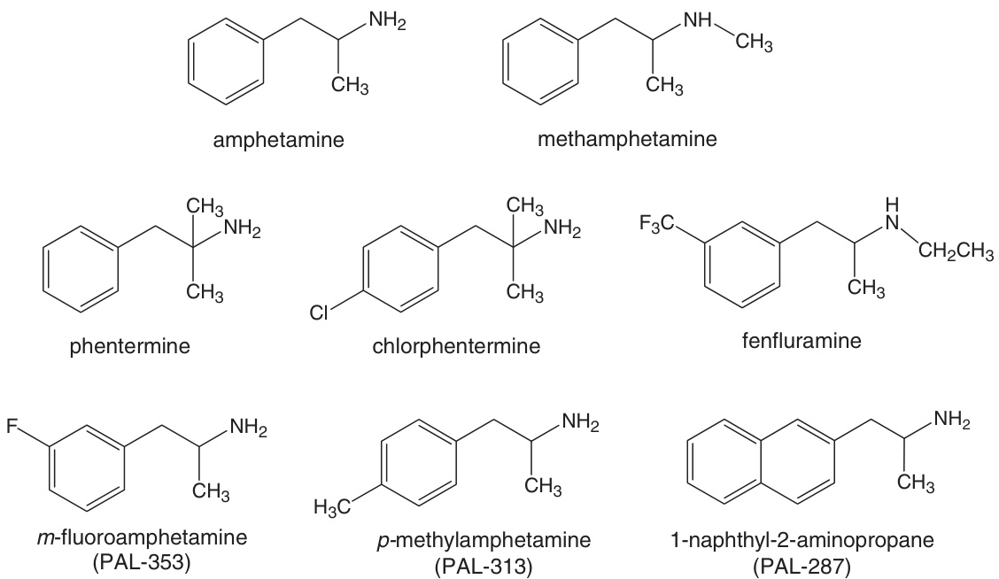
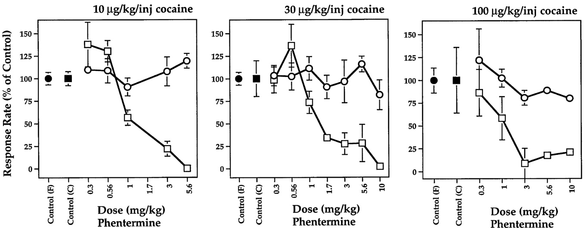
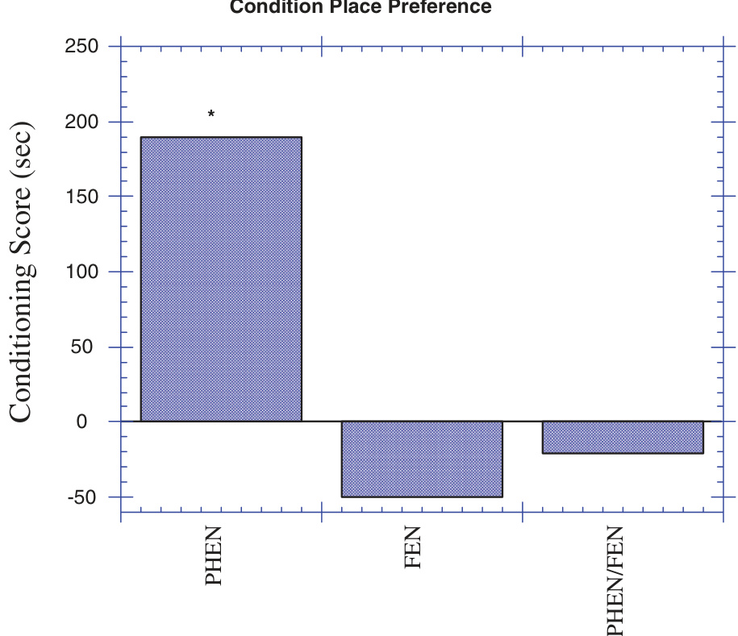
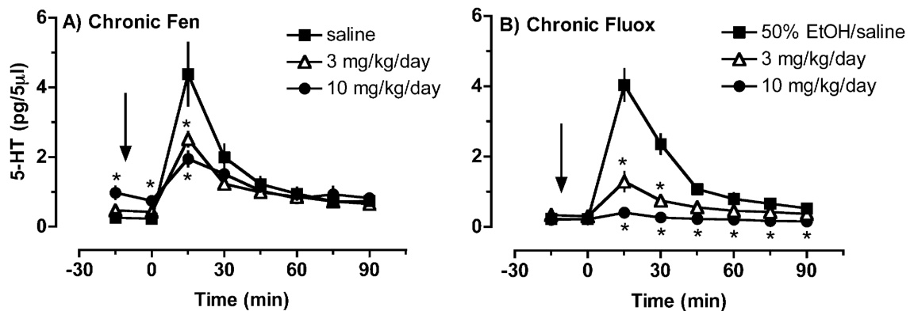
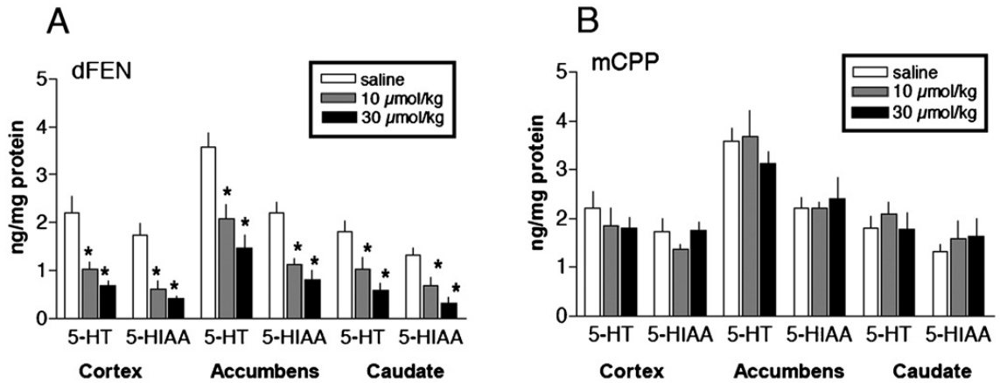
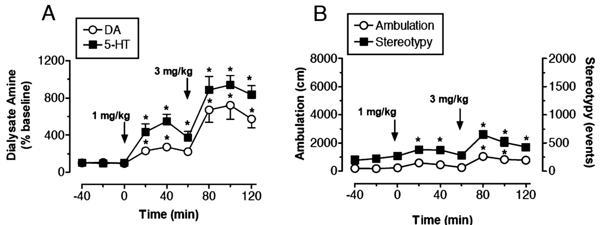
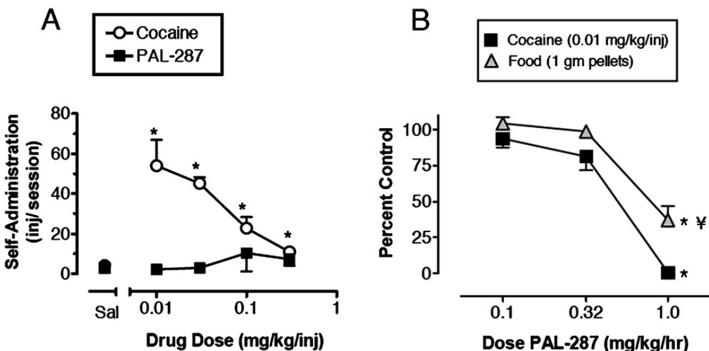

CHAPTER 19

# Dopamine/serotonin releasers as medications for stimulant addictions

Richard B. Rothman1,, Bruce E. Blough2 and Michael H. Baumann1

1Clinical Psychopharmacology Section, Intramural Research Program, National Institute on Drug Abuse, National Institutes of Health, DHHS, Baltimore, MD, USA 2Chemistry and Life Sciences Group, Research Triangle Institute International, Research Triangle Park, NC, USA

Abstract: The use of ‘agonist therapy’ for cocaine and methamphetamine addiction involves administration of stimulant-like medications (e.g. monoamine releasers) to reduce withdrawal symptoms and prevent relapse. A significant problem with this strategy is that many candidate medications possess abuse liability due to activation of mesolimbic dopamine (DA) neurons in the brain. One way to reduce DA-mediated abuse liability of candidate drugs might be to add in serotonin (5-HT)-releasing properties, since substantial evidence shows that 5-HT neurons provide an inhibitory influence over mesolimbic DA neurons. This chapter addresses several key issues related to the development of dual DA/5-HT releasers for the treatment of substance use disorders. First, we briefly summarize the evidence supporting a dual deficit in DA and 5-HT function during withdrawal from chronic cocaine or alcohol abuse. Second, we discuss data demonstrating that 5-HT release can dampen DA-mediated stimulant effects, and the ‘antistimulant’ role of 5-HT2C receptors is considered. Next, the mechanisms underlying potential adverse effects of 5-HT releasers are described. Finally, we discuss recently published data with PAL-287, a novel non-amphetamine DA/5-HT-releasing agent that suppresses cocaine self-administration but lacks positive reinforcing properties. It is concluded that DA/5-HT releasers could be useful therapeutic adjuncts for the treatment of cocaine and alcohol addictions as well as for obesity, attention deficit disorder and depression.

Keywords: alcohol; amphetamine; cocaine; dopamine; serotonin; treatment; transporter

# Introduction

A main goal of this chapter is to review data from our laboratory pertaining to the development of dual dopamine (DA)/serotonin (5-HT) releasers as medications for stimulant addiction and possibly alcohol addiction (Rea et al., 1998; Wojnicki et al., 1999; Baumann et al., 2000, 2001; Rothman and

Baumann, 2003; Rothman et al., 2005; Wee et al., 2005). A secondary goal is to integrate our findings with the existing literature to provide a conceptual framework for the design of new medications for addiction disorders. Within the context of this chapter, the term ‘stimulant’ refers to drugs such as cocaine and amphetamines that produce a spectrum of effects in humans, including cardiovascular stimulation, mood elevation and a decreased need for sleep. At high doses, or after longer periods of use, stimulants can cause a range of adverse effects, such as disordered thoughts and psychotic episodes. In laboratory animals, stimulants increase locomotor activity and are readily self-administered due to their powerful reinforcing properties. Figure 1 depicts the chemical structures of drugs mentioned in this chapter. Many of these drugs are useful medications with long histories of efficacy and safety while others are highly addictive substances associated with considerable morbidity and mortality (Musto, 1992; Das, 1993; Anonymous, 1995; Gonzalez Castro et al., 2000). In some cases, as with amphetamine itself, the same drug can be a therapeutic entity or an abused substance, depending upon the context in which the drug is administered (Arnsten, 2006; Greenhill, 2006).

Most stimulant drugs interact with monoamine neurons in the central nervous system (CNS). Neurons that synthesize, store and release monoamine transmitters — norepinephrine (NE), dopamine (DA) and serotonin (5-HT) — are widely distributed in the mammalian CNS. These neurons express specialized plasma membrane proteins that function to transport previously released transmitter molecules from the extracellular space back into the cytoplasm (Amara and Kuhar, 1993; Masson et al., 1999). It is well established that distinct transporter proteins are expressed by each type of monoamine neuron: NE transporters (NET), DA transporters (DAT) and 5-HT transporters (SERT) are associated with NE, DA and 5-HT neurons, respectively. These proteins belong to a superfamily of Na+/Cl-dependent transporters that share genetic, morphological and functional homologies (Uhl and Johnson, 1994; Torres and Amara, 2007). Under normal circumstances, the transporter-mediated uptake of monoamine transmitters is the principal mechanism for inactivation of monoamine signalling in the brain. Consequently, drugs that interact with monoamine transporters have profound effects on CNS function, and these effects can be beneficial or detrimental depending upon the dose, route and formulation of the drug administered (Amara and Sonders, 1998; Iversen, 2006).

Drugs that target transporter proteins can be divided into two classes based on their precise mechanism of action:reuptake inhibitors and substrate-type releasers (Rothman and Baumann, 2003). Reuptake inhibitors bind to transporter proteins but are not transported. These drugs elevate extracellular transmitter concentrations by blocking transporter-mediated recapture of transmitter molecules from the synapse. Substratetype releasers bind to transporter proteins and are subsequently transported into the cytoplasm of nerve terminals. Thus, transmitter ‘releasers’ are often referred to as transporter ‘substrates’. Releasers elevate extracellular transmitter concentrations by a two-pronged mechanism: (1) they promote efflux of transmitter by a process of transporter-mediated exchange and (2) they increase cytoplasmic levels of transmitter by disrupting storage of transmitters in vesicles via interactions with the vesicular monoamine transporter 2 (VMAT2) (Rudnick, 1997; Fleckenstein et al., 2007). The molecular mechanisms underlying transporter-mediated transmitter release are not completely understood, but ionic currents, oligomerization and reversal of normal transport function appear to be involved (Sitte and Freissmuth, 2003; Blakely et al., 2005; Sulzer et al., 2005). Because substrate-type releasing agents must be transported into nerve terminals to promote transmitter release, reuptake inhibitors can block the effects of releasers.

  
Fig. 1. Chemical structures of stimulants discussed in this chapter.

# A dual deficit model of stimulant addiction

The use of stimulants such as cocaine and methamphetamine produces a ‘high’ or ‘rush’ that is likely mediated by elevations in extracellular DA levels in mesolimbic circuits (Volkow et al., 2002; Di Chiara et al., 2004), although some evidence indicates that elevations in extracellular NE may also contribute (Rothman et al., 2001; Alexander et al., 2005). Similarly, alcohol-induced increases in extracellular DA are thought to underlie the positive reinforcing effects of this commonly abused substance (Koob et al., 1998; Koob, 2003). Repeated misuse of stimulants, especially when they are self-administered via the smoked or intravenous routes, can lead to serious addiction in susceptible individuals. The chronic abuse of stimulants and alcohol, despite negative consequences, causes long-term changes in neurochemistry and brain circuitry via processes of synaptic plasticity (Volkow and Li, 2004; Hyman, 2005; Kalivas and O’Brien, 2008).

Preclinical and human research findings demonstrate that withdrawal from stimulant and alcohol abuse is associated with deficits in DA and 5-HT function. For example, rats withdrawn from chronic cocaine or alcohol administration display decreased levels of extracellular DA and 5-HT in the nucleus accumbens (Parsons et al., 1991, 1995; Rossetti et al., 1992; Weiss et al., 1996). Human brain imaging studies show that cocaine addicts have reductions in evoked DA release and a loss of DA D receptors in the striatum (Volkow et al., 1997, 2002, Martinez et al., 2007). Neuroendocrine responsiveness to 5-HT releasers is diminished in rats withdrawn from repeated cocaine injections (Levy et al., 1994; Baumann et al., 1995a), and similar findings have been reported in abstinent human cocaine addicts (Haney et al., 2001; Ghitza et al., 2007). Taken together, these data suggest that a cardinal feature of withdrawal from chronic cocaine, and possibly alcohol, is decreased synaptic levels of DA and 5-HT in critical brain circuits.

Additional clinical support for the existence of 5-HT deficits in cocaine addicts is the occurrence of symptoms resembling major depression during abstinence (Dackis and Gold, 1985; Gawin and Kleber, 1986), coupled with an increased prevalence of suicidal ideation and suicide attempts (Garlow et al., 2003). The well-accepted importance of 5-HT dysfunction in mediating depression and suicide (for review, see Mann, 2003) suggests a parallel role for decreased synaptic 5-HT in cocaine and alcohol withdrawal states (Lesch, 2005). Indeed, the spectrum of symptoms often reported by patients withdrawing from stimulant or alcohol use — depressed mood, suicidal ideations, obsessive thoughts, intense craving, anhedonia, increased impulsivity and susceptibility to drug-related cues — presumably reflects longterm changes in brain function and structure. We speculate that deficits in monoamine systems underlie at least some of the symptoms experienced during withdrawal (for review, see Baumann and Rothman, 1998b).

In particular, we have proposed a dual deficit model of stimulant addiction in which druginduced DA and 5-HT dysfunction contributes to withdrawal symptoms, drug craving and relapse (Baumann and Rothman, 1998a, b; Rothman et al., 1998; Baumann et al., 2000). Depicted diagrammatically in Fig. 2, the dual deficit model postulates that decreased synaptic DA during stimulant withdrawal underlies anhedonia and psychomotor retardation, whereas decreased synaptic 5-HT gives rise to depressed mood, obsessive thoughts and lack of impulse control. Consistent with this model, rats receiving repeated injections of abused stimulants exhibit neurobiological changes similar to those observed in human patients with major depression (Markou and Koob, 1991; Baumann et al., 1995a; Baumann and Rothman, 1998a; Lin et al., 1999). If abstinent stimulant addicts exhibit DA and 5-HT deficits, medications capable of correcting abnormalities in DA and 5-HT function might be effective in treating stimulant and alcohol dependence.

In agreement with the dual deficit hypothesis, drugs that release DA (phentermine, amphetamine) or 5-HT (fenfluramine) display properties consistent with the effective treatment of substance use disorders (Rothman et al., 1994, 1998; Yu et al.,

1997; Halladay et al., 1999). For instance, acute or chronic administration of low doses of DA releasers, such as D-amphetamine, decreases cocaine self-administration behaviour in rhesus monkeys (Glowa et al., 1995; Negus and Mello, 2003a, b). The data in Fig. 3 demonstrate that the DA-releasing agent phentermine suppresses responding for cocaine injections without affecting food-reinforced behaviour, and this effect is maintained by daily administration of phentermine (Wojnicki et al., 1999). Such preclinical results provide a rationale for using DA releasers as medications for treating cocaine addiction (Rothman et al., 2002; Grabowski et al., 2004b; Lile, 2006).

Under certain conditions, the 5-HT releaser fenfluramine decreases responding for cocaine in rhesus monkeys as well (Negus et al., 2007). Combined administration of phentermine plus fenfluramine produces a 75% decrease in cocaine self-administration in monkeys (Glowa et al., 1997). The mixture of phentermine and

DOPAMINE SEROTONIN DEFICIT DEFICIT Parkinson-like OCD-like Symptoms Symptoms -slow reaction time -obsessive thoughts -anergia Depression -compulsive behaviors & Anhedonia Craving Impulsivity -“pleasure center” -suicide/aggression dysfunction -susceptibility to “cue triggers”   
-decreased synaptic DA -decreased synaptic 5-HT   
-altered DA transporter function -decreased 5-HT cell activity   
-postsynaptic receptor changes -postsynaptic receptor changes

  
Fig. 3. Acute effects of phentermine on rates of responding maintained under a fixed ratio (FR) 30 schedule of food (J) or cocaine (&) reinforcement. Different unit doses of intravenous cocaine, 10–100 mg/kg/injection, are indicated. Phentermine was administered intravenously. Effects on responding are mean7SEM, expressed as percentage of the individual control rates of responding for N ¼ 3–4 monkeys. Control variability (filled symbols) is expressed as the average of individual coefficients of variation. Data taken with permission from Wojnicki et al. (1999).

D-fenfluramine reduces cocaine self-administration by 80% in rats, yet this mixture is not selfadministered (Glatz et al., 2002). Importantly, 5-HT-releasing agents suppress cue-elicited cocaine-seeking behaviour in rats (Burmeister et al., 2003) and decrease cocaine craving in cocaine-dependent human patients (BuydensBranchey et al., 1998). The collective findings suggest that combined treatment with DA and 5-HT releasers may have a greater therapeutic value than treatment with either drug alone, in terms of decreasing stimulant self-administration and reducing cue-induced relapse. Moreover, a growing body of evidence shows that DA/5-HTreleasing agents may provide similar therapeutic benefits for alcohol dependence (Yu et al., 1997; Halladay et al., 1999, 2006).

# 5-HT release counteracts stimulant effects of DA release

The use of stimulant-like medications to treat stimulant addictions is an approach known as ‘agonist’ therapy. This strategy involves administering medications that are less potent and less addictive than cocaine or methamphetamine, but that decrease stimulant abuse because of shared neurochemical properties with the abused drugs (Gorelick, 1998). Accordingly, we have described agonist therapy as neurochemical ‘normalization’ therapy — that is, the stimulant medication serves to normalize neurochemical deficits caused by chronic exposure to the abused stimulant (Rothman et al., 2002; Rothman and Baumann, 2003). Neurochemical normalization therapy has generated effective treatments for nicotine dependence (Henningfield, 1995; Rollema et al., 2007) and opioid dependence (Ling et al., 1994; White and Lopatko, 2007). This approach has been explored for the treatment of cocaine dependence as well (Alim et al., 1995; Grabowski et al., 1997; Kampman et al., 2000; Walsh et al., 2000), and a number of placebo-controlled trials have shown promising results (Grabowski et al., 2001, 2004a; Shearer et al., 2003). A significant limitation of this strategy, however, is that candidate medications often exhibit inherent abuse liability due to activation of mesolimbic DA neurons in the brain (for review, see Grabowski et al., 2004b).

One feasible means to decrease the abuse liability of candidate medications is to add 5-HTreleasing properties to these drugs. Several lines of evidence support the hypothesis that elevations in synaptic 5-HT counteract the stimulant and reinforcing effects mediated by elevations in synaptic DA (Czoty et al., 2002; Daw et al., 2002; Higgins and Fletcher, 2003; Burmeister et al., 2004). Administration of the 5-HT precursor L-tryptophan, which increases 5-HT synthesis and release in the CNS, decreases self-administration of cocaine and amphetamine in rats (Smith et al., 1986; McGregor et al., 1993). Likewise, pretreatment with 5-HT reuptake inhibitors can reduce intravenous cocaine self-administration in rats and squirrel monkeys (Carroll et al., 1990; Howell and Byrd, 1995). Cocaine analogues that have potent affinity at SERT support less self-administration behaviour than analogues with weak affinity for SERT (Roberts et al., 1999; Howell et al., 2007). Consistent with these findings, agents that broadly activate brain 5-HT systems can reduce selfadministration of stimulants and other drugs of abuse (Higgins and Fletcher, 2003). The ‘antistimulant’ effects of increasing extracellular 5-HT are readily observed after combined administration of 5-HT and DA releasers, or after administration of single agents that release both neurotransmitters.

As summarized in Table 1, drugs that release [3H]DA more potently than [3H]5-HT in vitro (e.g. amphetamine and phentermine) increase endogenous extracellular DA more than extracellular

5-HT in vivo. Such indirect DA agonists are strong locomotor stimulants and support self-administration behaviour. Drugs that release [3H]5-HT more potently than [3H]DA in vitro (e.g. fenfluramine and chlorphentermine) increase endogenous extracellular 5-HT more than extracellular DA. Such indirect 5-HT agonists produce minimal motor activity and do not support self-administration behaviour. The anti-stimulant effect of 5-HT releasers is also seen in the conditioned place preference (CPP) assay as shown in Fig. 4, where a low dose of fenfluramine greatly reduces the positive CPP induced by phentermine.

The precise mechanisms responsible for antistimulant effects of 5-HT releasers have not been characterized, but increases in extracellular 5-HT would be expected to activate multiple 5-HT receptor subtypes known to modulate DA function (Muller and Huston, 2006; Alex and Pehek, 2007). As mentioned already, stimulant and reinforcing properties of drugs such as cocaine and methamphetamine are mediated via the activation of mesolimbic DA neurons. Cell bodies of mesolimbic DA neurons reside in the midbrain ventral tegmental area (VTA) and send axonal projections to many regions of the forebrain, most notably the nucleus accumbens (Ungerstedt, 1971; Moore and Bloom, 1978). The nucleus accumbens is a critical limbic–motor interface receiving afferent inputs from the prefrontal cortex, hippocampus and amygdala, while sending efferent outputs to the ventral pallidum and other regions known to modulate locomotor centres in the brainstem (Mogenson et al., 1980; Pennartz et al., 1994). 5-HT neurons in the midbrain raphe nuclei send axonal projections that densely innervate the mesolimbic system at the level of the VTA and the nucleus accumbens (Steinbusch, 1981; Molliver, 1987). Furthermore, 5-HT neurons innervate various regions providing excitatory afferents to the accumbens (e.g. prefrontal cortex). In this manner, 5-HT nerve terminals are uniquely positioned to influence the activity of mesolimbic DA neurons at multiple levels.

Table 1. Summary of serotonergic and dopaminergic effects of selected releasing agents   

<html><body><table><tr><td>Drug</td><td>[H]5-HT release EC50 (nM)</td><td>['H]DA release EC50 (nM)</td><td>Peak % increase in dialysate 5-HT (dose, mg/kg)</td><td>Peak % increase in dialysate DA (dose, mg/kg)</td><td>Self- admini- stered</td><td>Locomotor activation</td></tr><tr><td>Amphetaminea</td><td>1756</td><td>8.0</td><td>45 (0.3 mg/kg i.p.)</td><td>224 (0.3 mg/kg i.p.)</td><td>Yes</td><td>Strong</td></tr><tr><td>Phenterminea</td><td>3511</td><td>262</td><td>32 (1.0mg/kg i.p.)</td><td>156 (1.0 mg/kg i.p.)</td><td>Yes</td><td>Strong</td></tr><tr><td>PAL-353℃</td><td>1937</td><td>24.2</td><td>170 (1.0 mg/kg i.v.)</td><td>432 (1.0 mg/kg i.v.)</td><td>Yes</td><td>Strong</td></tr><tr><td>Fenfluraminea</td><td>79.3</td><td>>10,000</td><td>215 (1.0mg/kg i.p.)</td><td>20 (1.0 mg/kg i.p.)</td><td>No</td><td>None</td></tr><tr><td>Chlorphenterminea</td><td>30.9</td><td>2650</td><td>228 (1.0mg/kg i.p.)</td><td>86 (1.0 mg/kg i.p.)</td><td>No</td><td>None</td></tr><tr><td>Phentermine + fenfluraminea</td><td>N/A</td><td>N/A</td><td>222 (1.0+1.0mg/kg i.p.)</td><td>144 (1.0+1.0mg/kg</td><td>No</td><td>Weak</td></tr><tr><td>PAL-313℃</td><td>53.4</td><td>44.1</td><td>544 (1.0mg/kg i.v.)</td><td>i.p.) 130 (1.0 mg/kg i.v.)</td><td>Weak</td><td>Weak</td></tr><tr><td>PAL-287b</td><td>3.4</td><td>12.6</td><td>464 (1.0 mg/kg i.v.)</td><td>133 (1.0 mg/kg i.v.)</td><td>No</td><td>Weak</td></tr></table></body></html>

A summary of data illustrating the tendency for increasing extracellular 5-HT to reduce reinforcing and locomotor effects mediated by increases in extracellular DA. Microdialysis data unpublished. This table originally appeared in Rothman et al. (2007). aFrom Baumann et al. (2000) and Rothman et al. (2001). bFrom Rothman et al. (2005). cFrom Wee et al. (2005).

  
Fen (0.3 mg/kg) Eliminates PHEN (3 mg/kg)-Induced   
Fig. 4. Effects of phentermine (3 mg/kg) and fenfluramine (0.3 mg/kg), given alone or in combination, on conditioned place preference. Conditioning score represents the mean difference between time (s) spent in the drug vs. vehicle-paired side of the test chamber. All drugs were administered i.p. Each column represents the mean of N 9–10 rats.   Significant place preference (Wilcoxon test, Po0.05). Data taken with permission from Rea et al. (1998).

The serotonergic modulation of DA function is inherently complex due to the presence of at least 14 different 5-HT receptor subtypes in the CNS (Barnes and Sharp, 1999; Hoyer et al., 2002).

While most 5-HT receptor subtypes enhance DA transmission (Muller and Huston, 2006; Alex and Pehek, 2007), 5-HT2C receptors provide a strong inhibitory influence on mesolimbic DA neurons (Di Matteo et al., 2001; Bubar and Cunningham, 2006). For instance, systemic administration of the 5-HT2C agonist Ro 60-0175 markedly inhibits DA cell firing in the VTA and decreases extracellular levels of DA in forebrain projection areas (Di Matteo et al., 1999, 2000; Gobert et al., 2000). Pretreatment with Ro 60-0175 reduces locomotor activity and self-administration behaviour produced by cocaine, whereas pretreatment with the 5-HT2C antagonist SB 242084 has the opposite effect (Grottick et al., 2000; Fletcher et al., 2002). In fact, SB 242084 when given alone increases burst firing of DA cells in the VTA, suggesting that 5-HT2C receptors provide tonic inhibition of mesolimbic DA activity. Collectively, these findings indicate a potential role for 5-HT2C receptors in mediating the anti-stimulant effects of 5-HT releasers (Higgins and Fletcher, 2003).

Recent data show that anti-stimulant effects of 5-HT2C receptor activation involve at least two separate mechanisms — one mechanism in the VTA and another in the prefrontal cortex. Microinjection of Ro 60-0175 into the VTA blocks behavioural effects of cocaine (Fletcher et al., 2004), perhaps reflecting inhibition of DA cell firing and release as noted above (Di Matteo et al., 2001). Microinjection of Ro 60-0175 into the prefrontal cortex also markedly reduces cocaine-induced locomotor activity (Filip and Cunningham, 2003), and this action may involve suppression of excitatory glutamate outputs to the nucleus accumbens (Liu et al., 2007). Neuroanatomical evidence suggests that the effects of 5-HT2C receptor activation in the VTA and cortex are mediated by the stimulation of gamma-aminobutyric acid (GABA) interneurons (Bubar and Cunningham, 2006, 2007; Liu et al., 2007); more research is needed to validate this proposal. Further investigation is warranted to fully elucidate the role of 5-HT2C receptors in mediating anti-stimulant effects of 5-HT releasers. Additionally, the potential of 5-HT2C agonists as medications for substance use disorders deserves to be examined (Higgins and Fletcher, 2003; Bubar and Cunningham, 2006).

# Potential adverse effects of 5-HT releasers

The clinical use of 5-HT-releasing agents as medications has been associated with a number of adverse effects (Rothman et al., 1999; Rothman and Baumann, 2002; Zolkowska et al., 2006). Based primarily on experience with D,L-fenfluramine and its more potent isomer D-fenfluramine, three potentially serious side effects need to be considered when 5-HT releasers are developed as treatment agents: valvular heart disease (VHD), idiopathic pulmonary arterial hypertension (IPAH) and neurotoxicity. Fenfluramines were commonly prescribed anorectics until their removal from the market in 1997 due to the occurrence of VHD in some patients (Connolly et al., 1997; Connolly and McGoon, 1999).

Fenfluramine-associated VHD is characterized by thickening of valve leaflets and increased regurgitation of blood, most often detected by echocardiography. While initial findings suggested that fenfluramines induce VHD in a high percentage of patients, more recent evidence shows a much smaller risk. For example, a meta-analysis of available clinical data demonstrates that the incidence of clinically significant valvular regurgitation was 12% in fenfluramine-treated patients vs. 6% in untreated controls (Sachdev et al., 2002).

Because fenfluramines are potent 5-HT releasers (Baumann et al., 2000; Rothman et al., 2003a) and 5-HT has established mitogenic effects (Nemecek et al., 1986; Seuwen et al., 1988), investigators initially speculated that serotonergic mechanisms might contribute to VHD (Connolly et al., 1997; Connolly and McGoon, 1999). To this end, we carried out an investigation to determine whether stereoisomers of fenfluramine, or the N-dealkylated metabolite norfenfluramine, might activate mitogenic 5-HT receptors (Rothman et al., 2000a). A number of other test drugs were included in these experiments as positive and negative controls. ‘Positive controls’ were ergot alkaloids known to increase the risk of VHD, such as methysergide, its active metabolite methylergonovine and ergotamine (Bana et al., 1974; Bredberg et al., 1986; Hendrikx et al., 1996). ‘Negative controls’ were drugs that interacted with monoamine transporters but did not cause VHD, and these drugs included phentermine, fluoxetine and its metabolite norfluoxetine. We also tested the antidepressant trazodone and its active metabolite m-chlorophenylpiperazine (mCPP) as negative controls (Ishida et al., 1995; Otani et al., 1997). mCPP has agonist activity at a wide range of 5-HT receptor subtypes (Hoyer et al., 1994, 2002) and is capable of releasing neuronal 5-HT via a transporter-mediated mechanism similar to that of fenfluramines (Baumann et al., 1993, 2001).

Our working hypothesis was that fenfluramines, norfenfluramines and positive control drugs would share the ability to activate a mitogenic 5-HT receptor subtype expressed in heart valves, while the negative control drugs would not. An initial receptorome screen led to a detailed evaluation of the binding of these drugs to the 5-HT family of receptors (Rothman et al., 2000a). Table 2 reports binding data, and Table 3 reports the functional effects of these compounds at cloned human 5-HT2A, 5-HT2B and 5-HT2C receptors.

Interestingly, fenfluramines have low affinity for all 5-HT2 receptor subtypes. By contrast, we found that norfenfluramines displayed high affinity and efficacy at the 5-HT2B receptor subtype (KI 10–50 nM), consistent with the findings of others (Porter et al., 1999; Fitzgerald et al., 2000).

Table 2. KI values of test drugs at 5-HT2 receptors   

<html><body><table><tr><td>Drug</td><td colspan="3">Human</td></tr><tr><td></td><td>5-HT2A</td><td>5-HT2B</td><td>5-HT2C</td></tr><tr><td>(±)-Fenfluramine</td><td>5216±423</td><td>4134±1281</td><td>3183±637</td></tr><tr><td>(+)-Fenfluramine</td><td>11,107±2303</td><td>5099±1173</td><td>6245±874</td></tr><tr><td>(-)-Fenfluramine</td><td>5463 ±600</td><td>5713±2285</td><td>3415±922</td></tr><tr><td>(±)-Norfenfluramine</td><td>2316±278</td><td>52.1±21</td><td>557±61</td></tr><tr><td>(+)-Norfenfluramine</td><td>1516±150</td><td>11.2±7.3</td><td>324±12</td></tr><tr><td>(-)-Norfenfluramine</td><td>3841±614</td><td>47.8±30.6</td><td>814±98</td></tr><tr><td>Ergotamine</td><td>9.0±1.0</td><td>3.0±0.4</td><td>12±1.5</td></tr><tr><td>Methysergide</td><td>15.0±4.0</td><td>9.1±4.9</td><td>1.8±0.2</td></tr><tr><td>Methylergonovine</td><td>12.6±1.0</td><td>0.49±0.16</td><td>12.4±1.0</td></tr><tr><td>Fluoxetine</td><td>299±53</td><td>5030±1960</td><td>50±10</td></tr><tr><td>Norfluoxetine</td><td>638±108</td><td>5063 ±1974</td><td>286±60</td></tr><tr><td>Trazodone</td><td>19.8±2.4</td><td>73.6±36</td><td>402±44</td></tr><tr><td>mCPP</td><td>391±47</td><td>3.2±1.0</td><td>59±11</td></tr><tr><td>5-HT</td><td>614±74</td><td>4.0±1.9</td><td>12.2±1.3</td></tr><tr><td>Phentermine</td><td>>10,000</td><td>>10,000</td><td>>10,000</td></tr></table></body></html>

Values are mean7SD for n 3 experiments. Data taken with permission from Rothman et al. (2000a).

Table 3. Functional activity of test drugs at 5-HT2 receptors   

<html><body><table><tr><td>Drug</td><td colspan="2">Human 5-HT2A</td><td colspan="2">Human 5-HT2B</td><td colspan="2">Human 5-HT2C</td></tr><tr><td></td><td>Kact (nM±SD)</td><td>Vmax (percent of 5-HT±SD)</td><td>(nM±SD) Kact</td><td>(percent of 5-HT±SD) Vmax</td><td>Kact (nM±SD)</td><td>Vmax (percent of 5-HT±SD)</td></tr><tr><td>(±)-Fenfluramine</td><td>4131±2448</td><td>15±4</td><td>ND</td><td>ND</td><td>ND</td><td>ND</td></tr><tr><td>(+)-Fenfluramine</td><td>>10,000</td><td>ND</td><td>379±120</td><td>38±14</td><td>362±109</td><td>80±10</td></tr><tr><td>(-)-Fenfluramine</td><td>5279±998</td><td>43±7.2</td><td>1248±430</td><td>47±5</td><td>360±155</td><td>84±15</td></tr><tr><td>(+)-Norfenfluramine</td><td>630±240</td><td>88±9</td><td>18.4±9</td><td>73±6</td><td>13±4</td><td>100±11</td></tr><tr><td>(-)-Norfenfluramine</td><td>1565±323</td><td>93±9</td><td>357±180</td><td>71±15</td><td>18±9</td><td>80±17</td></tr><tr><td>Ergotamine</td><td>16±4</td><td>75±3</td><td>9.8±3</td><td>56±3</td><td>5±3</td><td>75±15</td></tr><tr><td>Methysergide</td><td>3.5±1.7</td><td>24±3</td><td>150±43</td><td>18±4</td><td>2.9±1.5</td><td>33±3.5</td></tr><tr><td>Methylergonovine</td><td>1.3±0.4</td><td>70±7</td><td>0.8±0.5</td><td>40±3</td><td>2.5±1.2</td><td>103±7</td></tr><tr><td>Fluoxetine</td><td>ND</td><td>ND</td><td>ND</td><td>ND</td><td>Antagonist</td><td>K = 616±172</td></tr><tr><td>Norfluoxetine</td><td>ND</td><td>ND</td><td>ND</td><td>ND</td><td>Antagonist</td><td>K=43±17</td></tr><tr><td>Trazodone</td><td colspan="2">Antagonist</td><td colspan="2">Antagonist</td><td colspan="2">Antagonist</td></tr><tr><td>mCPP</td><td>65±17</td><td>55±11</td><td>64±27</td><td>43±14</td><td>0.64±0.3</td><td>79±15</td></tr><tr><td>5-HT</td><td>66±26</td><td>100</td><td>2.4± 1.5</td><td>100</td><td>0.6±0.18</td><td>100</td></tr><tr><td>Phentermine</td><td colspan="2">ND</td><td colspan="2">ND</td><td>1394±450</td><td>66±10</td></tr></table></body></html>

Values are mean7SD for n 3 experiments. Data taken with permission from Rothman et al. (2000a).

Methysergide acts as a partial agonist at the 5-HT2B receptor, while the metabolite methylergonovine has even greater affinity and efficacy. Ergotamine is a potent partial agonist at the 5-HT2B receptor. Among the negative control drugs tested, only mCPP exhibits agonist activity at the 5-HT2B site. It is noteworthy that trazodone binds to the 5-HT2B receptor with moderate affinity but functions as an antagonist. Thus, when trazodone is metabolized to mCPP in vivo (Ishida et al., 1995; Otani et al., 1997), the 5-HT2B actions of mCPP are probably blocked by antagonist actions of the parent compound.

Our results with the various positive control drugs strongly implicate the 5-HT2B receptor as a major culprit in the development of drug-induced VHD, and accumulating data support this hypothesis (Porter et al., 1999; Fitzgerald et al., 2000; Setola and Roth, 2005; Roth, 2007). 5-HT2B receptors are abundantly expressed on aortic and mitral valves (Fitzgerald et al., 2000), and these receptors are known to stimulate mitogenesis (Lopez-Ilasaca, 1998; Hafizi et al., 2000). Further evidence for the role of 5-HT2B receptors in druginduced VHD is based on the effects of ergot medications such as cabergoline and pergolide. Both of these medications increase the risk of VHD in human patients and are also potent 5-HT2B receptor agonists (for review, see Roth, 2007). Setola et al. (2003) showed that the illicit amphetamine analogue 3,4-methylenedioxymethamphetamine (MDMA) and its N-demethylated metabolite, 3,4-methylenedioxyamphetamine (MDA), are 5-HT2B receptor agonists. These drugs stimulate prolonged mitogenic responses in human valvular interstitial cells via activation of 5-HT2B receptors (Setola et al., 2003). As predicted by this study, a recent clinical report found that heavy MDMA users display a significantly higher incidence of valvular regurgitation compared to control subjects (Droogmans et al., 2007). More clinical investigations are needed to clearly establish the link between illicit MDMA use and the risk of developing VHD.

Epidemiological evidence indicates that fenfluramines increase the risk of developing IPAH, a debilitating and incurable disease (Abenhaim et al., 1996; Fishman, 1999). IPAH is characterized by pulmonary arterial vasoconstriction and hyperplasia that leads to severe hypertension. The pathogenesis of IPAH is complex and difficult to study, especially given the rarity of the disorder. Nonetheless, evidence from our laboratory and others implicates the involvement of 5-HT and SERT proteins in the pathogenesis of IPAH (Rothman et al., 1999; MacLean et al., 2000; Eddahibi et al., 2006). We demonstrated that the SERT substrate activity was a common feature of drugs associated with IPAH, but not all substrates increased the risk of the disease (Rothman et al., 1999). It is well established that blood platelets express SERT proteins identical to those expressed on neurons, and platelet SERT accumulates nearly 99% of circulating 5-HT into platelet storage (Ni and Watts, 2006). One hypothesis — the socalled ‘5-HT hypothesis’ — has been invoked as a potential mechanism underlying fenfluramineinduced IPAH (Fishman, 1999; MacLean et al., 2000). This hypothesis postulates that fenfluramines increase the risk of IPAH by stimulating SERT-mediated release of 5-HT from platelets, thereby elevating plasma levels of 5-HT. Persistent elevations in plasma 5-HT would then cause pulmonary dysfunction. It is noteworthy that an analogous 5-HT hypothesis has been invoked to explain VHD, but as discussed already, druginduced activation of 5-HT2B receptors seems to be the predominant mechanism involved in this disease.

A key prediction of the 5-HT hypothesis is that fenfluramine increases plasma 5-HT to concentrations sufficient to produce vasoconstriction and mitogenesis, which then leads to serious side effects. Despite the widespread acceptance of the 5-HT hypothesis as an explanation for fenfluramine-associated IPAH, the effects of fenfluramine and related agents on plasma 5-HT have received little attention. Studies conducted in the 1990s do not support the 5-HT hypothesis, since they show that acute fenfluramine does not increase plasma 5-HT in rats and chronic fenfluramine treatment lowers blood 5-HT in humans (Martin and Artigas, 1992; Rothman et al., 2000b). Given the uncertainties regarding validity of the 5-HT hypothesis, we assessed the acute effects of fenfluramine and other amphetamines on plasma levels of 5-HT in rats (Zolkowska et al., 2006). Specifically, we developed a novel microdialysis method to measure plasma levels of 5-HT in whole blood samples obtained from conscious catheterized rats. Using this method, baseline plasma 5-HT levels in rats were found to be 0.22 nM, or about 1 nM when corrected for dialysis probe recovery, which is similar to plasma 5-HT concentrations measured in human subjects (Herve et al., 1995). Importantly, systemic administration of fenfluramine, MDMA and other amphetamines evokes transient dose-dependent increases in plasma 5-HT ranging from 4 to 20 nM. The ability of drugs to increase plasma 5-HT is directly correlated with their ability to increase SERT-mediated 5-HT release in neurons, suggesting the involvement of platelet SERT proteins. These data show that fenfluramine and other 5-HT releasers are able to acutely increase plasma 5-HT, but the absolute levels of 5-HT are well below the concentrations required to contract pulmonary arteries or stimulate mitogenesis (Cortijo et al., 1997; Eddahibi et al., 1999).

From a medication development standpoint, a more relevant issue is whether chronic administration of 5-HT releasers can persistently increase plasma 5-HT. To address this question, we used microdialysis methods to examine the effects of 2-week minipump infusions of fenfluramine (3 and

10 mg/kg/day) or the 5-HT uptake blocker fluoxetine (3 and 10 mg/kg/day) on plasma levels of 5-HT in rats (Zolkowska et al., 2008). In this study, chronic administration of fenfluramine, but not fluoxetine, caused two- to fourfold increases in baseline dialysate 5-HT levels in blood. Given baseline plasma 5-HT concentrations of about 1 nM, fenfluramine-induced increases in plasma 5-HT are less than 5 nM. The data in Fig. 5 show that chronic exposure to fenfluramine or fluoxetine markedly reduces the ability of acute fenfluramine to evoke increases in plasma 5-HT. Thus, chronic exposure to fenfluramine minimizes the surges in plasma 5-HT caused by acute administration of the drug. Chronic minipump infusions of fenfluramine and fluoxetine in rats give rise to steadystate blood levels of drugs and their bioactive metabolites that are similar to those measured in human patients taking prescribed doses of these medications (Rothman et al., 2000b; Lundmark et al., 2001). Thus, our rat model system is relevant to human patients taking fenfluramine or fluoxetine.

It has been shown that 5-HT provokes contraction of human pulmonary arteries at concentrations ranging from 100 nM to 10 mM (Cortijo et al., 1997). The threshold concentration of 5-HT required to stimulate mitogenic responses in cultured human pulmonary artery smooth muscle cells is about 10 nM (Eddahibi et al., 2001; Marcos et al., 2003), while much higher 5-HT concentrations are needed to stimulate mitogenic responses in rat pulmonary artery smooth muscle cells (Pitt et al., 1994; Eddahibi et al., 1999). Because we found that chronic fenfluramine elevates baseline plasma 5-HT to less than 5 nM in rats, it appears that fenfluramine-induced increases in plasma 5-HT are below the concentrations known to cause pulmonary side effects. Fenfluramineinduced elevations of plasma 5-HT are also much lower than those required to produce VHD in rats exposed to exogenous 5-HT (580–974 nM) (Gustafsson et al., 2005). Viewed collectively, these findings demonstrate that the 5-HT hypothesis cannot explain the mechanism of fenfluramineassociated IPAH or VHD. Of course, it is possible that two- to fourfold increases in plasma 5-HT could be enough to stimulate mitogenic responses in susceptible individuals and increase the risk of developing IPAH. However, this scenario seems unlikely, since treatment with lithium or MAO inhibitors produces two- to fourfold increases in plasma 5-HT without increasing the risk of IPAH (Artigas et al., 1989; Celada et al., 1992).

  
Fig. 5. Effects of acute fenfluramine administration on dialysate 5-HT levels measured in blood from conscious rats previously treated with chronic administration of fenfluramine (Panel A) or fluoxetine (Panel B). For chronic treatments, drugs were dissolved in sterile saline (fenfluramine) or 50% ethanol/saline (fluoxetine) and administered s.c. via osmotic minipumps for 2 weeks. On the day of test, fenfluramine was dissolved in saline and administered i.v. at 0 min. Serial blood samples were withdrawn at 15-min intervals and immediately dialyzed. 5-HT levels are mean7SEM for N 9 rats/group. =Po0.05, compared to saline controls at corresponding time points (Duncan’s post hoc test). Data taken with permission from Zolkowska et al. (2008).

At present, the mechanisms underlying fenfluramine-associated IPAH remain enigmatic. One significant problem is that most animal models of IPAH require the induction of hypoxia, which is not a major factor in humans. Furthermore, the aetiology of fenfluramine-associated IPAH may differ substantially from that of non-drug-related IPAH. Despite these caveats, recent findings have provided novel hypotheses to explain how fenfluramine might cause IPAH. For example, Launay and colleagues (Launay et al., 2002) have provided evidence that activation of 5-HT2B receptors in the lung is critical to the development of IPAH in a hypoxic mouse model. Since the stereoisomers of norfenfluramine are potent and selective 5-HT2B agonists (Rothman et al., 2000a), a role for 5-HT2B receptors seems feasible. On the other hand, a number of medications that produce VHD and activate 5-HT2B receptors do not increase the risk of IPAH; these medications include methysergide, ergotamine, pergolide and cabergoline.

Additional evidence from our laboratory disputes a role for 5-HT2B sites in fenfluramineassociated IPAH (Rothman and Baumann, 2006). Aminorex is a SERT substrate that caused an epidemic of IPAH in the 1960s (Gurtner, 1985; Fishman, 1999), and case reports implicate the related designer drug 4-methylaminorex as a cause of the disease (Gaine et al., 2000). If 5-HT2B receptors are involved in the pathogenesis of drugassociated IPAH, then one would suspect aminorex to target 5-HT2B sites. While aminorex does interact with cloned human 5-HT2B receptors, the half-maximum effective concentration (EC50) of the drug for 5-HT2B receptor activation (870 nM) is 30-fold higher than its EC50 for NE release (26.4 nM). Moreover, the activity of aminorex at 5-HT2B sites is nearly 50-fold less than that of D-norfenfluramine. It seems plausible that metabolites of aminorex may act more potently at 5-HT2B receptors, and this possibility deserves to be examined. However, the available data argue against an important role for 5-HT2B receptors in the pathogenesis of anorectic-associated IPAH.

Recent studies by Eddahibi et al. (2006) focus on 5-HT produced locally in the lung as a critical player in pathogenesis of IPAH. These investigators reported that endothelial cells in the pulmonary microvasculature synthesize 5-HT, which is then released as a growth factor. It has been proposed that dysregulation of 5-HT production in endothelial cells, along with over-expression of SERT by the pulmonary artery smooth muscle cells, contributes to hyperplasia observed in IPAH. Immunohistochemical studies show that the pulmonary microvascular endothelium does not express SERT (Eddahibi et al., 2006), indicating that fenfluramine cannot release 5-HT from these cells. Based on the findings of Eddahibi et al., administration of the 5-HT precursor L-5-hydroxytryptophan (5-HTP) would be predicted to increase 5-HT synthesis in pulmonary endothelial cells, since this compound bypasses the rate-limiting enzyme tryptophan hydroxylase. 5-HTP is a commonly used dietary supplement with a well-established history of safety (Das et al., 2004), and its use is not known to increase the risk of IPAH. Although speculative, this observation suggests that an increase in 5-HT synthesis in the pulmonary microvascular endothelial cells may be necessary, but is not sufficient, to increase the risk of IPAH.

Experiments in laboratory animals show that high-dose administration of fenfluramine or D-fenfluramine can cause long-term depletion of 5-HT and loss of SERT binding sites in the brain (Zaczek et al., 1990; McCann et al., 1997). The persistent nature of fenfluramine-induced 5-HT deficits in the CNS has been interpreted as evidence for neurotoxicity, although this hypothesis and its clinical relevance are still a matter of debate (Rose et al., 1996; Rothman et al., 2003b). The mechanisms underlying fenfluramine-induced 5-HT depletions are not well understood, but acute 5-HT release has been implicated because 5-HT uptake blockers and synthesis inhibitors can prevent long-term 5-HT depletions (Steranka and Sanders-Bush, 1979; Halladay et al., 2001). An important observation is that not all SERT substrates deplete 5-HT (Nichols et al., 1990; Cozzi et al., 1998; Baumann et al., 2001). As noted previously, mCPP interacts with SERT to release 5-HT from neurons, and mCPP is equipotent with D-fenfluramine in this regard (Baumann et al., 1995b, 2001; Eriksson et al., 1999). The data in Fig. 6 demonstrate that repeated high-dose administration of mCPP fails to affect postmortem tissue levels of 5-HT in rat brain whereas fenfluramine causes profound loss of 5-HT. These data indicate that SERT-mediated 5-HT release is separable from long-term 5-HT depletion.

Elucidating the mechanisms responsible for the adverse effects of 5-HT releasers will have important implications for the future development of SERT substrates as pharmacotherapies. The findings reviewed here provide clues for designing dual DA/5-HT releasers devoid of fenfluramine-like adverse effects. In particular, any lead drug molecule must lack 5-HT2B agonist activity to prevent the risk of VHD. Additionally, candidate drugs should be chemically distinct from the phenylethylamine structure shared by amphetamine-like agents, as non-amphetamine 5-HT releasers have a reduced capacity for causing neurotoxic effects and possibly IPAH.

# PAL-287, a non-amphetamine DA/5-HT releaser

Partially based on the above rationale, we sought to identify and characterize a non-amphetamine transporter substrate that would release DA and 5-HT, without affecting release of NE. After an extensive evaluation of over 350 compounds, we found it impossible to dissociate NE- and DA-releasing properties, perhaps due to the phylogenetic similarities between NET and DAT. The first lead compound from our search was PAL287 (1-napthyl-2-aminopropane, see structure in Fig. 1), a novel non-amphetamine monoamine releaser (Rothman et al., 2005). The in vitro potency of PAL-287 at releasing radiolabeled transmitters from DAT, NET and SERT is 12.67 0.4 nM, 11.170.9 nM and 3.470.2 nM, respectively (see Table 2). Figure 7 shows that administration of PAL-287 to rats increases extracellular 5-HT and DA in a dose-dependent manner, with larger effects on 5-HT compared to DA. Functional studies with cloned human 5-HT2 receptors reveal that PAL-287 is a full agonist at 5-HT2B receptors (EC50 40 nM) and 5-HT2A receptors (EC50 466 nM). The drug is a potent partial agonist at 5-HT2C receptor sites (EC50 2.3 nM, EMAX 20%), an effect that suggests possible anorectic actions of PAL-287 (Vickers et al., 1999; Nilsson, 2006). 5-HT2C agonist activity may also contribute to the minimal reinforcing properties of PAL-287 despite potent DA-releasing actions of the drug (see Czoty et al., 2002; Higgins and Fletcher, 2003). The weaker potency of PAL-287 at 5-HT2A and 5-HT2B receptors, as compared to its activity at SERT, suggests that the drug may not activate 5-HT2A and 5-HT2B receptors in vivo.

  
Fig. 6. Effects of high-dose administration of D-fenfluramine (D-FEN) or mCPP on postmortem tissue levels of 5-HT and its metabolite 5-hydroxyindoleacetic acid (5-HIAA) in rat brain. D-FEN or mCPP was administered i.p. at doses of 10 or 30 mmol/kg, every 2 h, for four doses. Rats were killed 2 weeks after the dosing regimen. Postmortem tissue levels of 5-HT and 5-HIAA in the prefrontal cortex, nucleus accumbens and caudate nucleus were determined by high-performance liquid chromatography with electrochemical detection (HPLC-ECD). These doses of D-FEN and mCPP produce equivalent increases in extracellular 5-HT. Data are mean7SEM, expressed as ng/mg protein for N 4–6 rats/group. Po0.05, compared to saline-treated group (Duncan’s post hoc test). Data taken with permission from Baumann et al. (2001).

  
Fig. 7. Effects of PAL-287 on neurochemical and locomotor parameters in rats undergoing in vivo microdialysis in the prefrontal cortex. Rats received i.v. injections of 1 mg/kg PAL-287 at time zero, followed by 3 mg/kg 60 min later. Panel A: Concentrations of DA and 5-HT in dialysate samples are mean7SEM for N 7 rats/group, expressed as percentage of the baseline. Baseline levels of DA and 5-HT were 0.4370.07 and 0.2770.06 pg/5 ml, respectively. Panel B: Locomotor parameters are mean7SEM for N ¼ 7 rats/group, expressed as distance traveled in cm (ambulation) and number of repetitive movements (stereotypy). Po0.05, compared to preinjection control (Duncan’s post hoc test). Data taken with permission from Rothman et al. (2005).

PAL-287 produces minimal locomotor activation despite substantial elevations in extracellular DA (Fig. 7). In particular, the amount of ambulation produced by 3 mg/kg PAL-287 is one-third the amount produced by 1 mg/kg D-amphetamine, even though both drug treatments cause equivalent DA release. These data suggest that 5-HT-releasing properties of PAL-287 limit the stimulant effects of concurrent DA release. Repeated high-dose administration of PAL-287 to rats (18 mg/kg i.p., every 2 h, for three doses) fails to affect brain tissue 5-HT levels when assessed 2 weeks after injections, unlike D-methamphetamine (6.0 mg/kg i.p., every 2 h, for three doses) and MDMA (7.5 mg/kg i.p., every 2 h, for three doses), which cause significant 5-HT depletions. The data in Fig. 8 show that PAL-287 does not support self-administration behaviour, and chronic administration of the drug decreases cocaine self-administration in rhesus monkeys. A dose of 1.0 mg/kg/h PAL-287 significantly reduces both cocaine- and food-maintained responding, but the suppression of cocaine selfadministration is somewhat greater than the reduction in food-maintained responding.

Our results with PAL-287 confirm the hypothesis that a non-amphetamine substrate at DAT and SERT will release DA and 5-HT from neurons in vivo, be minimally reinforcing and also suppress ongoing cocaine self-administration. PAL-287 displays a number of desirable qualities for a candidate treatment medication, including minimal locomotor activation, lack of long-term 5-HT neurotoxicity and low abuse potential. Further studies will be necessary to determine the potential of PAL-287 for increasing the risk of VHD and IPAH, especially given the 5-HT2B agonist effects of the drug. The present data with PAL-287 support the use of monoamine releasers as agonist medications for the treatment of stimulant addictions. A dose of 1.0 mg/kg/h PAL-287 virtually eliminated cocaine selfadministration in rhesus monkeys by the end of the 7-day treatment, although this effect was not entirely selective for cocaine vs. food. We also note that the role of NE in the actions of PAL-287 is an important issue awaiting additional study (Rothman et al., 2001).

  
Fig. 8. Effects of PAL-287 in the monkey self-administration assay. Panel A: Self-administration of cocaine and PAL-287 by rhesus monkeys. Drugs were available under a fixed ratio (FR) 25 schedule of reinforcement for 2 h/day. Each point is the mean of two sessions of access to each dose of the drugs. Data are mean7SEM for N 4 monkeys. Symbols without bars have variability smaller than the points. Po0.05, compared to saline-injected control (Newman–Keuls post hoc test). Panel B: Effects of chronic 7-day treatment with PAL-287 on cocaine- and food-maintained responding. Control levels of responding were defined as levels of cocaineor food-maintained responding observed during 7 days of saline treatment. Each point shows mean7SEM for three monkeys, with data collected during the last 3 days of each 7-day treatment. =Po0.05, compared to control for a given reinforcer (Newman–Keuls post hoc test). f=Po0.05, compared to cocaine-maintained responding at that dose of PAL-287 (Newman–Keuls post hoc test). Data taken with permission from Rothman et al. (2005).

# Conclusions

Our findings with PAL-287 in monkeys are similar to the suppression of cocaine self-administration produced by D-amphetamine, although D-amphetamine displays greater selectivity in reducing cocaine self-administration as opposed to foodmaintained responding (Negus and Mello, 2003a). Grabowski et al. (2001, 2004b) showed that a slowrelease formulation of D-amphetamine is effective in maintaining cocaine addicts in treatment and reducing illicit cocaine use. We predict that agents such as PAL-287, which have mixed DA/5-HTreleasing activity, will possess the therapeutic effects of amphetamine-type monoamine releasers, while minimizing the adverse effects associated with the phenethylamine structure. Based on observations that dual DA/5-HT releasers suppress alcohol ingestion (Yu et al., 1997; Halladay et al., 1999, 2006), it seems that PAL-287 or similar agents should be tested as potential treatments for alcohol addiction. Additionally, combined treatment with DA and 5-HT releasers blocks alcohol withdrawal seizures (Yu et al., 1997). Although further work remains to refine PAL-287, in particular to reduce its potency at 5-HT2B receptors, we believe that PAL-287 represents the prototype for a new generation of drugs that enhance monoamine release by acting as substrates at multiple transporters.

While compounds such as PAL-287 move slowly from the preclinical arena towards clinical development, it is possible to test the concept of administering dual DA/5-HT releasers in humans by implementing clinically available compounds. For example, the utility of DA/5-HT releasers as treatments for addictive disorders can be tested by administration of the DA releaser D-amphetamine along with the 5-HT precursor 5-HTP. It is noteworthy that 5-HTP must be co-administered with the peripheral decarboxylase inhibitor carbidopa to selectively increase extracellular 5-HT in the CNS (see Halladay et al., 2006). Moreover, the utility of DA/5-HT releasers could also be tested using phentermine and 5-HTP/carbidopa, a drug combination with predicted efficacy as an appetite suppressant (Rothman and Baumann, 2008). In summary, we suggest that drugs with a mode of action similar to that of PAL-287 will provide neurochemical normalization therapy for stimulant addictions and might also be useful for treating depression, obsessive compulsive disorder, attention deficit hyperactivity disorder and obesity.

# Abbreviations

CNS central nervous system CPP conditioned place preference DA dopamine DAT dopamine transporter EC50 half-maximal effective concentration EMAX maximal efficacy GABA gamma-aminobutyric acid 5-HT 5-hydroxytryptamine or serotonin 5-HTP L-5-hydroxytryptophan

IPAH mCPP MDA MDMA

NE   
NET   
PAL-287   
PAL-313   
PAL-353   
Ro 60-0175   
idiopathic pulmonary arterial   
hypertension   
m-chlorophenylpiperazine   
3,4-methylenedioxyamphetamine   
3,4-methylenedioxymethampheta  
mine   
norepinephrine   
norepinephrine transporter   
1-naphthyl-2-aminopropane   
p-methylamphetamine   
m-fluoroamphetamine   
(S)-2-(6-chloro-5-fluoroindol-1-yl)-   
1-methylethylamine   
6-chloro-5-methyl-1-[[2-[(2-methyl  
3-pyridyl)oxy]-5-pyridyl]carbamoyl]-   
indoline   
serotonin transporter   
valvular heart disease   
vesicular monoamine transporter   
type 2   
ventral tegmental area

SB 242084

SERT VHD VMAT2

# VTA

# Acknowledgements

This research was supported in part by the Intramural Research Program of the NIH, NIDA and NIDA R01 DA12970 to Bruce Blough.

# References

Abenhaim, L., Moride, Y., Brenot, F., Rich, S., Benichou, J., Kurz, X., Higenbottam, T., Oakley, C., Wouters, E., Aubier, M., Simonneau, G. and Begaud, B. (1996) Appetitesuppressant drugs and the risk of primary pulmonary hypertension. International Primary Pulmonary Hypertension Study Group. N. Engl. J. Med., 335(9): 609–616.   
Alex, K.D. and Pehek, E.A. (2007) Pharmacologic mechanisms of serotonergic regulation of dopamine neurotransmission. Pharmacol. Ther., 113(2): 296–320.   
Alexander, M., Rothman, R.B., Baumann, M.H., Endres, C.J., Brasic, J.R. and Wong, D.F. (2005) Noradrenergic and dopaminergic effects of (+)-amphetamine-like stimulants in the baboon Papio anubis. Synapse, 56(2): 94–99.   
Alim, T.N., Rosse, R.B., Vocci, F.J., Jr., Lindquist, T. and Deutsch, S.I. (1995) Diethylpropion pharmacotherapeutic adjuvant therapy for inpatient treatment of cocaine dependence: a test of the cocaine-agonist hypothesis. Clin. Neuropharmacol., 18(2): 183–195.   
Amara, S.G. and Kuhar, M.J. (1993) Neurotransmitter transporters: recent progress. Annu. Rev. Neurosci., 16: 73–93.   
Amara, S.G. and Sonders, M.S. (1998) Neurotransmitter transporters as molecular targets for addictive drugs. Drug Alcohol Depend., 51(1–2): 87–96.   
Anonymous. (1995) Increasing morbidity and mortality associated with abuse of methamphetamine — United States, 1991–1994. Morb. Mortal. Wkly. Rep., 44(47): 882–886.   
Arnsten, A.F. (2006) Stimulants: therapeutic actions in ADHD. Neuropsychopharmacology, 31(11): 2376–2383.   
Artigas, F., Sarrias, M.J., Martinez, E., Gelpi, E., Alvarez, E. and Udina, C. (1989) Increased plasma free serotonin but unchanged platelet serotonin in bipolar patients treated chronically with lithium. Psychopharmacology (Berl.), 99(3): 328–332.   
Bana, D.S., Macneal, P.S., Lecompte, P.M., Shah, Y. and Graham, J.R. (1974) Cardiac murmurs and endocardial fibrosis associated with methysergide therapy. Am. Heart J., 88(5): 640–655.   
Barnes, N.M. and Sharp, T. (1999) A review of central 5-HT receptors and their function. Neuropharmacology, 38(8): 1083–1152.   
Baumann, M.H., Ayestas, M.A., Dersch, C.M., Brockington, A., Rice, K.C. and Rothman, R.B. (2000) Effects of phentermine and fenfluramine on extracellular dopamine and serotonin in rat nucleus accumbens: therapeutic implications. Synapse, 36(2): 102–113.   
Baumann, M.H., Ayestas, M.A., Dersch, C.M. and Rothman, R.B. (2001) 1-(m-Chlorophenyl)piperazine (mCPP) dissociates in vivo serotonin release from long-term serotonin depletion in rat brain. Neuropsychopharmacology, 24(5): 492–501.   
Baumann, M.H., Becketts, K.M. and Rothman, R.B. (1995a) Evidence for alterations in presynaptic serotonergic function during withdrawal from chronic cocaine in rats. Eur. J. Pharmacol., 282(1–3): 87–93.   
Baumann, M.H., Mash, D.C. and Staley, J.K. (1995b) The serotonin agonist m-chlorophenylpiperazine (mCPP) binds to serotonin transporter sites in human brain. Neuroreport, 6(16): 2150–2152.   
Baumann, M.H. and Rothman, R.B. (1998a) Alterations in serotonergic responsiveness during cocaine withdrawal in rats: similarities to major depression in humans. Biol. Psychiatry, 44(7): 578–591.   
Baumann, M.H. and Rothman, R.B. (1998b) Serotonergic dysfunction during cocaine withdrawal: implications for cocaine-induced depression. In: Karch S.B. (Ed.), Drug Abuse Handbook. CRC Press, Boca Raton, pp. 463–484.   
Baumann, M.H., Rutter, J.J. and Auerbach, S.B. (1993) Intravenous administration of the serotonin agonist mchlorophenylpiperazine (mCPP) increases extracellular serotonin in the diencephalon of awake rats. Neuropharmacology, 32(12): 1381–1386.   
Blakely, R.D., Defelice, L.J. and Galli, A. (2005) Biogenic amine neurotransmitter transporters: just when you thought you knew them. Physiology (Bethesda), 20(4): 225–231.   
Bredberg, U., Eyjolfsdottir, G.S., Paalzow, L., Tfelt-Hansen, P. and Tfelt-Hansen, V. (1986) Pharmacokinetics of methysergide and its metabolite methylergometrine in man. Eur. J. Clin. Pharmacol., 30(1): 75–77.   
Bubar, M.J. and Cunningham, K.A. (2006) Serotonin 5-HT2A and 5-HT2C receptors as potential targets for modulation of psychostimulant use and dependence. Curr. Top. Med. Chem., 6(18): 1971–1985.   
Bubar, M.J. and Cunningham, K.A. (2007) Distribution of serotonin 5-HT2C receptors in the ventral tegmental area. Neuroscience, 146(1): 286–297.   
Burmeister, J.J., Lungren, E.M., Kirschner, K.F. and Neisewander, J.L. (2004) Differential roles of 5-HT receptor subtypes in cue and cocaine reinstatement of cocaine-seeking behavior in rats. Neuropsychopharmacology, 29(4): 660– 668.   
Burmeister, J.J., Lungren, E.M. and Neisewander, J.L. (2003) Effects of fluoxetine and D-fenfluramine on cocaine-seeking behavior in rats. Psychopharmacology, 168(1–2): 146–154.   
Buydens-Branchey, L., Branchey, M., Hudson, J., Rothman, M., Fergeson, P. and Mckernin, C. (1998) Effect of fenfluramine challenge on cocaine craving in addicted male users. Am. J. Addict., 7(2): 142–155.   
Carroll, M.E., Lac, S.T., Asencio, M. and Kragh, R. (1990) Fluoxetine reduces intravenous cocaine self-administration in rats. Pharmacol. Biochem. Behav., 35(1): 237–244.   
Celada, P., Dolera, M., Alvarez, E. and Artigas, F. (1992) Effects of acute and chronic treatment with fluvoxamine on extracellular and platelet serotonin in the blood of major depressive patients. Relationship to clinical improvement. J. Affect. Disord., 25(4): 243–249.   
Connolly, H.M., Crary, J.L., McGoon, M.D., Hensrud, D.D., Edwards, B.S. and Schaff, H.V. (1997) Valvular heart disease associated with fenfluramine-phentermine. N. Engl. J. Med., 337(9): 581–588.   
Connolly, H.M. and McGoon, M.D. (1999) Obesity drugs and the heart. Curr. Probl. Cardiol., 24(12): 745–792.   
Cortijo, J., Marti-Cabrera, M., Bernabeu, E., Domenech, T., Bou, J., Fernandez, A.G., Beleta, J., Palacios, J.M. and Morcillo, E.J. (1997) Characterization of 5-HT receptors on human pulmonary artery and vein: functional and binding studies. Br. J. Pharmacol., 122(7): 1455–1463.   
Cozzi, N.V., Frescas, S., Marona-Lewicka, D., Huang, X. and Nichols, D.E. (1998) Indan analogs of fenfluramine and norfenfluramine have reduced neurotoxic potential. Pharmacol. Biochem. Behav., 59(3): 709–715.   
Czoty, P.W., Ginsburg, B.C. and Howell, L.L. (2002) Serotonergic attenuation of the reinforcing and neurochemical effects of cocaine in squirrel monkeys. J. Pharmacol. Exp. Ther., 300(3): 831–837.   
Dackis, C.A. and Gold, M.S. (1985) New concepts in cocaine addiction: the dopamine depletion hypothesis. Neurosci. Biobehav. Rev., 9(3): 469–477.   
Das, G. (1993) Cocaine abuse in North America: a milestone in history. J. Clin. Pharmacol., 33(4): 296–310.   
Das, Y.T., Bagchi, M., Bagchi, D. and Preuss, H.G. (2004) Safety of 5-hydroxy-L-tryptophan. Toxicol. Lett., 150(1): 111–122.   
Daw, N.D., Kakade, S. and Dayan, P. (2002) Opponent interactions between serotonin and dopamine. Neural Netw., 15(4–6): 603–616.   
Di Chiara, G., Bassareo, V., Fenu, S., De Luca, M.A., Spina, L., Cadoni, C., Acquas, E., Carboni, E., Valentini, V. and Lecca, D. (2004) Dopamine and drug addiction: the nucleus accumbens shell connection. Neuropharmacology, 47(Suppl. 1): 227–241.   
Di Matteo, V., De Blasi, A., Di Giulio, C. and Esposito, E. (2001) Role of 5-HT(2C) receptors in the control of central dopamine function. Trends Pharmacol. Sci., 22(5): 229–232.   
Di Matteo, V., Di Giovanni, G., Di Mascio, M. and Esposito, E. (1999) SB 242084, a selective serotonin2C receptor antagonist, increases dopaminergic transmission in the mesolimbic system. Neuropharmacology, 38(8): 1195–1205.   
Di Matteo, V., Di Giovanni, G., Di Mascio, M. and Esposito, E. (2000) Biochemical and electrophysiological evidence that RO 60-0175 inhibits mesolimbic dopaminergic function through serotonin(2C) receptors. Brain Res., 865(1): 85–90.   
Droogmans, S., Cosyns, B., D’haenen, H., Creeten, E., Weytjens, C., Franken, P.R., Scott, B., Schoors, D., Kemdem, A., Close, L., Vandenbossche, J.-L., Bechet, S. and Van Camp, G. (2007) Possible association between 3,4- methylenedioxymethamphetamine abuse and valvular heart disease. Am. J. Cardiol., 100(9): 1442–1445.   
Eddahibi, S., Fabre, V., Boni, C., Martres, M.P., Raffestin, B., Hamon, M. and Adnot, S. (1999) Induction of serotonin transporter by hypoxia in pulmonary vascular smooth muscle cells. Relationship with the mitogenic action of serotonin. Circ. Res., 84(3): 329–336.   
Eddahibi, S., Guignabert, C., Barlier-Mur, A.M., Dewachter, L., Fadel, E., Dartevelle, P., Humbert, M., Simonneau, G., Hanoun, N., Saurini, F., Hamon, M. and Adnot, S. (2006) Cross talk between endothelial and smooth muscle cells in pulmonary hypertension: critical role for serotonin-induced smooth muscle hyperplasia. Circulation, 113(15): 1857–1864.   
Eddahibi, S., Humbert, M., Fadel, E., Raffestin, B., Darmon, M., Capron, F., Simonneau, G., Dartevelle, P., Hamon, M. and Adnot, S. (2001) Serotonin transporter overexpression is responsible for pulmonary artery smooth muscle hyperplasia in primary pulmonary hypertension. J. Clin. Invest., 108(8): 1141–1150.   
Eriksson, E., Engberg, G., Bing, O. and Nissbrandt, H. (1999) Effects of mCPP on the extracellular concentrations of serotonin and dopamine in rat brain. Neuropsychopharmacology, 20(3): 287–296.   
Filip, M. and Cunningham, K.A. (2003) Hyperlocomotive and discriminative stimulus effects of cocaine are under the control of serotonin(2C) (5-HT(2C)) receptors in rat prefrontal cortex. J. Pharmacol. Exp. Ther., 306(2): 734–743.   
Fishman, A.P. (1999) Aminorex to fen/phen: an epidemic foretold. Circulation, 99(1): 156–161.   
Fitzgerald, L.W., Burn, T.C., Brown, B.S., Patterson, J.P., Corjay, M.H., Valentine, P.A., Sun, J.H., Link, J.R., Abbaszade, I., Hollis, J.M., Largent, B.L., Hartig, P.R., Hollis, G.F., Meunier, P.C., Robichaud, A.J. and Robertson, D.W. (2000) Possible role of valvular serotonin 5-HT2B receptors in the cardiopathy associated with fenfluramine. Mol. Pharmacol., 57(1): 75–81.   
Fleckenstein, A.E. Volz, ., Riddle, E.L., Gibb, J.W. and Hanson, G.R. (2007) New insights into the mechanism of action of amphetamines. Annu. Rev. Pharmacol. Toxicol., 47: 681–698.   
Fletcher, P.J., Chintoh, A.F., Sinyard, J. and Higgins, G.A. (2004) Injection of the 5-HT2C receptor agonist Ro60-0175 into the ventral tegmental area reduces cocaine-induced locomotor activity and cocaine self-administration. Neuropsychopharmacology, 29(2): 308–318.   
Fletcher, P.J., Grottick, A.J. and Higgins, G.A. (2002) Differential effects of the 5-HT(2A) receptor antagonist M100907 and the 5-HT(2C) receptor antagonist SB242084 on cocaine-induced locomotor activity, cocaine self-administration and cocaine-induced reinstatement of responding. Neuropsychopharmacology, 27(4): 576–586.   
Gaine, S.P., Rubin, L.J., Kmetzo, J.J., Palevsky, H.I. and Traill, T.A. (2000) Recreational use of aminorex and pulmonary hypertension. Chest, 118(5): 1496–1497.   
Garlow, S.J., Purselle, D. and D’orio, B. (2003) Cocaine use disorders and suicidal ideation. Drug Alcohol Depend., 70(1): 101–104.   
Gawin, F.H. and Kleber, H.D. (1986) Abstinence symptomatology and psychiatric diagnosis in cocaine abusers. Arch. Gen. Psychiatry, 43(2): 107–113.   
Ghitza, U.E., Rothman, R.B., Gorelick, D.A., Henningfield, J.E. and Baumann, M.H. (2007) Serotonergic responsiveness in human cocaine users. Drug Alcohol Depend., 86(2–3): 207–213.   
Glatz, A.C., Ehrlich, M., Bae, R.S., Clarke, M.J., Quinlan, P.A., Brown, E.C., Rada, P. and Hoebel, B.G. (2002) Inhibition of cocaine self-administration by fluoxetine or D-fenfluramine combined with phentermine. Pharmacol. Biochem. Behav., 71(1–2): 197–204.   
Glowa, J.R., Rice, K.C., Matecka, D. and Rothman, R.B. (1997) Phentermine/fenfluramine decreases cocaine self-administration in rhesus monkeys. Neuroreport, 8(6): 1347–1351.   
Glowa, J.R., Wojnicki, F.H.E., Matecka, D., Rice, K.C. and Rothman, R.B. (1995) Effects of dopamine reuptake inhibitors on food- and cocaine-maintained responding: II: comparisons with other drugs and repeated administrations. Exp. Clin. Psychopharmacol., 3(4): 232–239.   
Gobert, A., Rivet, J.M., Lejeune, F., Newman-Tancredi, A., Adhumeau-Auclair, A., Nicolas, J.P., Cistarelli, L., Melon, C. and Millan, M.J. (2000) Serotonin(2C) receptors tonically suppress the activity of mesocortical dopaminergic and adrenergic, but not serotonergic, pathways: a combined dialysis and electrophysiological analysis in the rat. Synapse, 36(3): 205–221.   
Gonzalez Castro, F., Barrington, E.H., Walton, M.A. and Rawson, R.A. (2000) Cocaine and methamphetamine: differential addiction rates. Psychol. Addict. Behav., 14(4): 390–396.   
Gorelick, D.A. (1998) The rate hypothesis and agonist substitution approaches to cocaine abuse treatment. Adv. Pharmacol., 42: 995–997.   
Grabowski, J., Roache, J.D., Schmitz, J.M., Rhoades, H., Creson, D. and Korszun, A. (1997) Replacement medication for cocaine dependence: methylphenidate. J. Clin. Psychopharmacol., 17(6): 485–488.   
Grabowski, J., Rhoades, H., Schmitz, J., Stotts, A., Daruzska, L.A., Creson, D. and Moeller, F.G. (2001) Dextroamphetamine for cocaine-dependence treatment: a double-blind randomized clinical trial. J. Clin. Psychopharmacol., 21(5): 522–526.   
Grabowski, J., Rhoades, H., Stotts, A., Cowan, K., Kopecky, C., Dougherty, A., Moeller, F.G., Hassan, S. and Schmitz, J. (2004a) Agonist-like or antagonist-like treatment for cocaine dependence with methadone for heroin dependence: two double-blind randomized clinical trials. Neuropsychopharmacology, 29(5): 969–981.   
Grabowski, J., Shearer, J., Merrill, J. and Negus, S.S. (2004b) Agonist-like, replacement pharmacotherapy for stimulant abuse and dependence. Addict. Behav., 29(7): 1439–1464.   
Greenhill, L.L. (2006) The science of stimulant abuse. Pediatr. Ann., 35(8): 552–556.   
Grottick, A.J., Fletcher, P.J. and Higgins, G.A. (2000) Studies to investigate the role of 5-HT(2C) receptors on cocaine- and food-maintained behavior. J. Pharmacol. Exp. Ther., 295(3): 1183–1191.   
Gurtner, H.P. (1985) Aminorex and pulmonary hypertension. Cor Vasa, 27(2–3): 160–171.   
Gustafsson, B.I., Tommeras, K., Nordrum, I., Loennechen, J.P., Brunsvik, A., Solligard, E., Fossmark, R., Bakke, I., Syversen, U. and Waldum, H. (2005) Long-term serotonin administration induces heart valve disease in rats. Circulation, 111(12): 1517–1522.   
Hafizi, S., Taylor, P.M., Chester, A.H., Allen, S.P. and Yacoub, M.H. (2000) Mitogenic and secretory responses of human valve interstitial cells to vasoactive agents. J. Heart Valve Dis., 9(3): 454–458.   
Halladay, A.K., Kirschner, E., Hesse, K., Fisher, H. and Wagner, G.C. (2001) Role of monoamine oxidase inhibition and monoamine depletion in fenfluramine-induced neurotoxicity and serotonin release. Pharmacol. Toxicol., 89(5): 237–248.   
Halladay, A.K., Wagner, G.C., Hsu, T., Sekowski, A. and Fisher, H. (1999) Differential effects of monoaminergic agonists on alcohol intake in rats fed a tryptophan-enhanced diet. Alcohol, 18(1): 55–64.   
Halladay, A.K., Wagner, G.C., Sekowski, A., Rothman, R.B., Baumann, M.H. and Fisher, H. (2006) Alterations in alcohol consumption, withdrawal seizures, and monoamine transmission in rats treated with phentermine and 5-hydroxy-Ltryptophan. Synapse, 59(5): 277–289.   
Haney, M., Ward, A.S., Gerra, G. and Foltin, R.W. (2001) Neuroendocrine effects of D-fenfluramine and bromocriptine following repeated smoked cocaine in humans. Drug Alcohol Depend., 64(1): 63–73.   
Hendrikx, M., Van Dorpe, J., Flameng, W. and Daenen, W. (1996) Aortic and mitral valve disease induced by ergotamine therapy for migraine: a case report and review of the literature. J. Heart Valve Dis., 5(2): 235–237.   
Henningfield, J.E. (1995) Nicotine medications for smoking cessation. N. Engl. J. Med., 333(18): 1196–1203.   
Herve, P., Launay, J.-M., Scrobohaci, M.-L., Brenot, F., Simonneau, G., Petitpretz, P., Poubeau, P., Cerrina, J., Duroux, P. and Drouet, L. (1995) Increased plasma serotonin in primary pulmonary hypertension. Am. J. Med., 99(3): 249–254.   
Higgins, G.A. and Fletcher, P.J. (2003) Serotonin and drug reward: focus on 5-HT2C receptors. Eur. J. Pharmacol., 480(1–3): 151–162.   
Howell, L.L. and Byrd, L.D. (1995) Serotonergic modulation of the behavioral effects of cocaine in the squirrel monkey. J. Pharmacol. Exp. Ther., 275(3): 1551–1559.   
Howell, L.L., Carroll, F.I., Votaw, J.R., Goodman, M.M. and Kimmel, H.L. (2007) Effects of combined dopamine and serotonin transporter inhibitors on cocaine self-administration in rhesus monkeys. J. Pharmacol. Exp. Ther., 320(2): 757–765.   
Hoyer, D., Clarke, D.E., Fozard, J.R., Hartig, P.R., Martin, G.R., Mylecharane, E.J., Saxena, P.R. and Humphrey, P.P. (1994) International Union of Pharmacology classification of receptors for 5-hydroxytryptamine (serotonin). Pharmacol. Rev., 46(2): 157–203.   
Hoyer, D., Hannon, J.P. and Martin, G.R. (2002) Molecular, pharmacological and functional diversity of 5-HT receptors. Pharmacol. Biochem. Behav., 71(4): 533–554.   
Hyman, S.E. (2005) Addiction: a disease of learning and memory. Am. J. Psychiatry, 162(8): 1414–1422.   
Ishida, M., Otani, K., Kaneko, S., Ohkubo, T., Osanai, T., Yasui, N., Mihara, K., Higuchi, H. and Sugawara, K. (1995) Effects of various factors on steady state plasma concentrations of trazodone and its active metabolite m-chlorophenylpiperazine. Int. Clin. Psychopharmacol., 10(3): 143–146.   
Iversen, L. (2006) Neurotransmitter transporters and their impact on the development of psychopharmacology. Br. J. Pharmacol., 147(S1): S82–S88.   
Kalivas, P.W. and O’Brien, C. (2008) Drug addiction as a pathology of staged neuroplasticity. Neuropsychopharmacology, 33(1): 166–180.   
Kampman, K.M., Rukstalis, M., Pettinati, H., Muller, E., Acosta, T., Gariti, P., Ehrman, R. and O’Brien, C.P. (2000) The combination of phentermine and fenfluramine reduced cocaine withdrawal symptoms in an open trial. J. Subst. Abuse Treat., 19(1): 77–79.   
Koob, G.F. (2003) Alcoholism: allostasis and beyond. Alcohol. Clin. Exp. Res., 27(2): 232–243.   
Koob, G.F., Roberts, A.J., Schulteis, G., Parsons, L.H., Heyser, C.J., Hyytia, P., Merlo-Pich, E. and Weiss, F. (1998) Neurocircuitry targets in ethanol reward and dependence. Alcohol. Clin. Exp. Res., 22(1): 3–9.   
Launay, J.M., Herve, P., Peoc’h, K., Tournois, C., Callebert, J., Nebigil, C.G., Etienne, N., Drouet, L., Humbert, M., Simonneau, G. and Maroteaux, L. (2002) Function of the serotonin 5-hydroxytryptamine 2B receptor in pulmonary hypertension. Nat. Med., 8(10): 1129–1135.   
Lesch, K.P. (2005) Alcohol dependence and gene x environment interaction in emotion regulation: is serotonin the link?. Eur. J. Pharmacol., 526(1–3): 113–124.   
Levy, A.D., Li, Q. and Van De Kar, L.D. (1994) Repeated cocaine exposure inhibits the adrenocorticotropic hormone response to the serotonin releaser D-fenfluramine and the 5-HT1A agonist, 8-OH-DPAT. Neuropharmacology, 33(3–4): 335–342.   
Lile, J.A. (2006) Pharmacological determinants of the reinforcing effects of psychostimulants: relation to agonist substitution treatment. Exp. Clin. Psychopharmacol., 14(1): 20–33.   
Lin, D., Koob, G.F. and Markou, A. (1999) Differential effects of withdrawal from chronic amphetamine or fluoxetine administration on brain stimulation reward in the rat interactions between the two drugs. Psychopharmacology, 145(3): 283–294.   
Ling, W., Rawson, R.A. and Compton, M.A. (1994) Substitution pharmacotherapies for opioid addiction: from methadone to LAAM and buprenorphine. J. Psychoactive Drugs, 26(2): 119–128.   
Liu, S., Bubar, M.J., Lanfranco, M.F., Hillman, G.R. and Cunningham, K.A. (2007) Serotonin2C receptor localization in GABA neurons of the rat medial prefrontal cortex: implications for understanding the neurobiology of addiction. Neuroscience, 146(4): 1677–1688.   
Lopez-Ilasaca, M. (1998) Signaling from G-protein-coupled receptors to mitogen-activated protein (MAP)-kinase cascades. Biochem. Pharmacol., 56(3): 269–277.   
Lundmark, J., Reis, M. and Bengtsson, F. (2001) Serum concentrations of fluoxetine in the clinical treatment setting. Ther. Drug Monit., 23(2): 139–147.   
Maclean, M.R., Herve, P., Eddahibi, S. and Adnot, S. (2000) 5-hydroxytryptamine and the pulmonary circulation: receptors, transporters and relevance to pulmonary arterial hypertension. Br. J. Pharmacol., 131(2): 161–168.   
Mann, J.J. (2003) Neurobiology of suicidal behaviour. Nat. Rev. Neurosci., 4(10): 819–828.   
Marcos, E., Adnot, S., Pham, M.H., Nosjean, A., Raffestin, B., Hamon, M. and Eddahibi, S. (2003) Serotonin transporter inhibitors protect against hypoxic pulmonary hypertension. Am. J. Respir. Crit. Care Med., 168(4): 487–493.   
Markou, A. and Koob, G.F. (1991) Postcocaine anhedonia. An animal model of cocaine withdrawal. Neuropsychopharmacology, 4(1): 17–26.   
Martin, F. and Artigas, F. (1992) Simultaneous effects of p-chloroamphetamine, D-fenfluramine, and reserpine on free and stored 5-hydroxytryptamine in brain and blood. J. Neurochem., 59(3): 1138–1144.   
Martinez, D., Narendran, R., Foltin, R.W., Slifstein, M., Hwang, D.R., Broft, A., Huang, Y., Cooper, T.B., Fischman, M.W., Kleber, H.D. and Laruelle, M. (2007) Amphetamineinduced dopamine release: markedly blunted in cocaine dependence and predictive of the choice to self-administer cocaine. Am. J. Psychiatry, 164(4): 622–629.   
Masson, J., Sagne, C., Hamon, M. and El Mestikawy, S. (1999) Neurotransmitter transporters in the central nervous system. Pharmacol. Rev., 51(3): 439–464.   
McCann, U.D., Seiden, L.S., Rubin, L.J. and Ricaurte, G.A. (1997) Brain serotonin neurotoxicity and primary pulmonary hypertension from fenfluramine and dexfenfluramine. A systematic review of the evidence. J. Am. Med. Assoc., 278(8): 666–672.   
McGregor, A. Lacosta, S. and Roberts, D.C. (1993) L-tryptophan decreases the breaking point under a progressive ratio schedule of intravenous cocaine reinforcement in the rat. Pharmacol. Biochem. Behav., 44(3): 651–655.   
Mogenson, G.J., Jones, D.L. and Yim, C.Y. (1980) From motivation to action: functional interface between the limbic system and the motor system. Prog. Neurobiol., 14(2–3): 69–97.   
Molliver, M.E. (1987) Serotonergic neuronal systems: what their anatomic organization tells us about function. J. Clin. Psychopharmacol., 7(6 Suppl): 3S–23S.   
Moore, R.Y. and Bloom, F.E. (1978) Central catecholamine neuron systems: anatomy and physiology of the dopamine systems. Annu. Rev. Neurosci., 1: 129–169.   
Muller, C.P. and Huston, J.P. (2006) Determining the regionspecific contributions of 5-HT receptors to the psychostimulant effects of cocaine. Trends Pharmacol. Sci., 27(2): 105–112.   
Musto, D.F. (1992) Cocaine’s history, especially the American experience. Ciba Found. Symp., 166: 7–14.   
Negus, S.S. and Mello, N.K. (2003a) Effects of chronic D-amphetamine treatment on cocaine- and food-maintained responding under a progressive-ratio schedule in rhesus monkeys. Psychopharmacology, 167(3): 324–332.   
Negus, S.S. and Mello, N.K. (2003b) Effects of chronic D-amphetamine treatment on cocaine- and food-maintained responding under a second-order schedule in rhesus monkeys. Drug Alcohol Depend., 70(1): 39–52.   
Negus, S.S., Mello, N.K., Blough, B.E., Baumann, M.H. and Rothman, R.B. (2007) Monoamine releasers with varying selectivity for dopamine/norepinephrine versus serotonin release as candidate ‘‘agonist’’ medications for cocaine dependence: studies in assays of cocaine discrimination and cocaine self-administration in rhesus monkeys. J. Pharmacol. Exp. Ther., 320(2): 627–636.   
Nemecek, G.M., Coughlin, S.R., Handley, D.A. and Moskowitz, M.A. (1986) Stimulation of aortic smooth muscle cell mitogenesis by serotonin. Proc. Natl. Acad. Sci. U.S.A., 83(3): 674–678.   
Ni, W. and Watts, S.W. (2006) 5-hydroxytryptamine in the cardiovascular system: focus on the serotonin transporter (SERT). Clin. Exp. Pharmacol. Physiol., 33(7): 575–583.   
Nichols, D.E., Brewster, W.K., Johnson, M.P., Oberlender, R. and Riggs, R.M. (1990) Nonneurotoxic tetralin and indan analogues of 3,4-(methylenedioxy)amphetamine (MDA). J. Med. Chem., 33(2): 703–710.   
Nilsson, B.M. (2006) 5-Hydroxytryptamine 2C (5-HT2C) receptor agonists as potential antiobesity agents. J. Med. Chem., 49(14): 4023–4034.   
Otani, K., Mihara, K., Yasui, N., Ishida, M., Kondo, T., Tokinaga, N., Ohkubo, T., Osanai, T., Sugawara, K. and Kaneko, S. (1997) Plasma concentrations of trazodone and m-chlorophenylpiperazine at steady state can be predicted from those after an initial dose of trazodone. Prog. Neuropsychopharmacol. Biol. Psychiatry, 21(1): 239–244.   
Parsons, L.H., Koob, G.F. and Weiss, F. (1995) Serotonin dysfunction in the nucleus accumbens of rats during J. Pharmacol. Exp. Ther., 274(3): 1182–1191.   
Parsons, L.H., Smith, A.D. and Justice, J.B., Jr. (1991) Basal extracellular dopamine is decreased in the rat nucleus accumbens during abstinence from chronic cocaine. Synapse, 9(1): 60–65.   
Pennartz, C.M., Groenewegen, H.J. and Lopes Da Silva, F.H. (1994) The nucleus accumbens as a complex of functionally distinct neuronal ensembles: an integration of behavioural, electrophysiological and anatomical data. Prog. Neurobiol., 42(6): 719–761.   
Pitt, B.R., Weng, W., Steve, A.R., Blakely, R.D., Reynolds, I. and Davies, P. (1994) Serotonin increases DNA synthesis in rat proximal and distal pulmonary vascular smooth muscle cells in culture. Am. J. Physiol., 266(2): L178–L186.   
Porter, R.H., Benwell, K.R., Lamb, H., Malcolm, C.S., Allen, N.H., Revell, D.F., Adams, D.R. and Sheardown, M.J. (1999) Functional characterization of agonists at recombinant human 5-HT2A, 5-HT2B and 5-HT2C receptors in CHOK1 cells. Br. J. Pharmacol., 128(1): 13–20.   
Rea, W.P., Rothman, R.B. and Shippenberg, T.S. (1998) Evaluation of the conditioned reinforcing effects of phentermine and fenfluramine in the rat: concordance with clinical studies. Synapse, 30(1): 107–111.   
Roberts, D.C., Phelan, R., Hodges, L.M., Hodges, M.M., Bennett, B., Childers, S. and Davies, H. (1999) Selfadministration of cocaine analogs by rats. Psychopharmacology, 144(4): 389–397.   
Rollema, H., Coe, J.W., Chambers, L.K., Hurst, R.S., Stahl, S.M. and Williams, K.E. (2007) Rationale, pharmacology and clinical efficacy of partial agonists of alpha4beta2 nACh receptors for smoking cessation. Trends Pharmacol. Sci., 28(7): 316–325.   
Rose, S., Hunt, S., Collins, P., Hindmarsh, J.G. and Jenner, P. (1996) Repeated administration of escalating high doses of dexfenfluramine does not produce morphological evidence for neurotoxicity in the cortex of rats. Neurodegeneration, 5(2): 145–152.   
Rossetti, Z.L., Hmaidan, Y. and Gessa, G.L. (1992) Marked inhibition of mesolimbic dopamine release: a common feature of ethanol, morphine, cocaine and amphetamine abstinence in rats. Eur. J. Pharmacol., 221(2–3): 227–234.   
Roth, B.L. (2007) Drugs and valvular heart disease. N. Engl. J. Med., 356(1): 6–9.   
Rothman, R.B. and Baumann, M.H. (2008) Appetite suppressants, cardiac value disease and combination pharmacotherapy. Am. J. Ther., in press.   
Rothman, R.B., Ayestas, M.A., Dersch, C.M. and Baumann, M.H. (1999) Aminorex, fenfluramine, and chlorphentermine are serotonin transporter substrates: implications for primary pulmonary hypertension. Circulation, 100(8): 869–875.   
Rothman, R.B. and Baumann, M.H. (2002) Therapeutic and adverse actions of serotonin transporter substrates. Pharmacol. Ther., 95(1): 73–88.   
Rothman, R.B. and Baumann, M.H. (2003) Monoamine transporters and psychostimulant drugs. Eur. J. Pharmacol., 479(1–3): 23–40.   
Rothman, R.B. and Baumann, M.H. (2006) Therapeutic potential of monoamine transporter substrates. Curr. Top. Med. Chem., 6(17): 1845–1859.   
Rothman, R.B., Baumann, M.H., Dersch, C.M., Romero, D.V., Rice, K.C., Carroll, F.I. and Partilla, J.S. (2001) Amphetamine-type central nervous system stimulants release norepinephrine more potently than they release dopamine and serotonin. Synapse, 39(1): 32–41.   
Rothman, R.B., Baumann, M.H., Savage, J.E., Rauser, L., Mcbride, A., Hufisein, S. and Roth, B.L. (2000a) Evidence for possible involvement of 5-HT2B receptors in the cardiac valvulopathy associated with fenfluramine and other serotonergic medications. Circulation, 102(23): 2836–2841.   
Rothman, R.B., Redmon, J.B., Raatz, S.K., Kwong, C.A., Swanson, J.E. and Bantle, J.P. (2000b) Chronic treatment with phentermine combined with fenfluramine lowers plasma serotonin. Am. J. Cardiol., 85(7): 913–915.   
Rothman, R.B., Blough, B.E. and Baumann, M.H. (2002) Appetite suppressants as agonist substitution therapies for stimulant dependence. Ann. N. Y. Acad. Sci., 965: 109–126.   
Rothman, R.B., Blough, B.E. and Baumann, M.H. (2007) Dual dopamine/serotonin releasers as potential medications for stimulant and alcohol addictions. AAPS J., 9(1): E1–E10.   
Rothman, R.B., Blough, B.E., Woolverton, W.L., Anderson, K.G., Negus, S.S., Mello, N.K., Roth, B.L. and Baumann, M.H. (2005) Development of a rationally designed, low abuse potential, biogenic amine releaser that suppresses cocaine selfadministration. J. Pharmacol. Exp. Ther., 313(3): 1361–1369.   
Rothman, R.B., Clark, R.D., Partilla, J.S. and Baumann, M.H. (2003a) (+)-Fenfluramine and its major metabolite, (+)-norfenfluramine, are potent substrates for norepinephrine transporters. J. Pharmacol. Exp. Ther., 305(3): 1191–1199.   
Rothman, R.B., Jayanthi, S., Wang, X., Dersch, C.M., Cadet, J.L., Prisinzano, T., Rice, K.C. and Baumann, M.H. (2003b) High-dose fenfluramine administration decreases serotonin transporter binding, but not serotonin transporter protein levels, in rat forebrain. Synapse, 50(3): 233–239.   
Rothman, R.B., Elmer, G.I., Shippenberg, T.S., Rea, W. and Baumann, M.H. (1998) Phentermine and fenfluramine: preclinical studies in animal models of cocaine addiction. Ann. N. Y. Acad. Sci., 844: 59–74.   
Rothman, R.B., Gendron, T.M. and Hitzig, P. (1994) Combined use of fenfluramine and phentermine in the treatment of cocaine addiction: a pilot case series. J. Subst. Abuse Treat., 11(3): 273–275.   
Rudnick, G. (1997) Mechanisms of biogenic amine transporters. In: Reith M.E.A. (Ed.), Neurotransmitter Transporters: Structure, Function and Regulation. Humana Press, Totowa NJ, pp. 73–100.   
Sachdev, M., Miller, W.C., Ryan, T. and Jollis, J.G. (2002) Effect of fenfluramine-derivative diet pills on cardiac valves: a meta-analysis of observational studies. Am. Heart J., 144(6): 1065–1073.   
Setola, V., Hufeisen, S.J., Grande-Allen, K.J., Vesely, I., Glennon, R.A., Blough, B., Rothman, R.B. and Roth, B.L. (2003) 3,4-Methylenedioxymethamphetamine (MDMA, ‘‘Ecstasy’’) induces fenfluramine-like proliferative actions on human cardiac valvular interstitial cells in vitro. Mol. Pharmacol., 63(6): 1223–1229.   
Setola, V. and Roth, B.L. (2005) Screening the receptorome reveals molecular targets responsible for drug-induced side effects: focus on ‘fen-phen’. Expert Opin. Drug Metab. Toxicol., 1(3): 377–387.   
Seuwen, K., Magnaldo, I. and Pouyssegur, J. (1988) Serotonin stimulates DNA synthesis in fibroblasts acting through 5-HT1B receptors coupled to a Gi-protein. Nature, 335(Sept. 15): 254–256.   
Shearer, J., Wodak, A., Van Beek, I., Mattick, R.P. and Lewis, J. (2003) Pilot randomized double blind placebo-controlled study of dexamphetamine for cocaine dependence. Addiction, 98(8): 1137–1141.   
Sitte, H.H. and Freissmuth, M. (2003) Oligomer formation by Na+-Cl-coupled neurotransmitter transporters. Eur. J. Pharmacol., 479(1–3): 229–236.   
Smith, F.L., Yu, D.S., Smith, D.G., Leccese, A.P. and Lyness, W.H. (1986) Dietary tryptophan supplements attenuate amphetamine self-administration in the rat. Pharmacol. Biochem. Behav., 25(4): 849–855.   
Steinbusch, H.W. (1981) Distribution of serotonin-immunoreactivity in the central nervous system of the rat-cell bodies and terminals. Neuroscience, 6(4): 557–618.   
Steranka, L.R. and Sanders-Bush, E. (1979) Long-term effects of fenfluramine on central serotonergic mechanisms. Neuropharmacology, 18(11): 895–903.   
Sulzer, D., Sonders, M.S., Poulsen, N.W. and Galli, A. (2005) Mechanisms of neurotransmitter release by amphetamines: a review. Prog. Neurobiol., 75(6): 406–433.   
Torres, G.E. and Amara, S.G. (2007) Glutamate and monoamine transporters: new visions of form and function. Curr. Opin. Neurobiol., 17(3): 304–312.   
Uhl, G.R. and Johnson, P.S. (1994) Neurotransmitter transporters: three important gene families for neuronal function. J. Exp. Biol., 196(1): 229–236.   
Ungerstedt, U. (1971) Stereotaxic mapping of the monoamine pathways in the rat brain. Acta Physiol. Scand. Suppl., 367: 1–48.   
Vickers, S.P., Clifton, P.G., Dourish, C.T. and Tecott, L.H. (1999) Reduced satiating effect of D-fenfluramine in serotonin 5-HT(2C) receptor mutant mice. Psychopharmacology, 143(3): 309–314.   
Volkow, N.D., Fowler, J.S. and Wang, G.J. (2002) Role of dopamine in drug reinforcement and addiction in humans: results from imaging studies. Behav. Pharmacol., 13(5–6): 355–366.   
Volkow, N.D. and Li, T.K. (2004) Drug addiction: the neurobiology of behaviour gone awry. Nat. Rev. Neurosci., 5(12): 963–970.   
Volkow, N.D., Wang, G.J., Fowler, J.S., Logan, J., Gatley, S.J., Hitzemann, R., Chen, A.D., Dewey, S.L. and Pappas, N. (1997) Decreased striatal dopaminergic responsiveness in detoxified cocaine-dependent subjects. Nature, 386(Apr. 24): 830–833.   
Walsh, S.L., Haberny, K.A. and Bigelow, G.E. (2000) Modulation of intravenous cocaine effects by chronic oral cocaine in humans. Psychopharmacology, 150(4): 361–373.   
Wee, S., Anderson, K.G., Baumann, M.H., Rothman, R.B., Blough, B.E. and Woolverton, W.L. (2005) Relationship between the serotonergic activity and reinforcing effects of a series of amphetamine analogs. J. Pharmacol. Exp. Ther., 313(2): 848–854.   
Weiss, F., Parsons, L.H., Schulteis, G., Hyytia, P., Lorang, M.T., Bloom, F.E. and Koob, G.F. (1996) Ethanol selfadministration restores withdrawal-associated deficiencies in accumbal dopamine and 5-hydroxytryptamine release in dependent rats. J. Neurosci., 16(10): 3474–3485.   
White, J.M. and Lopatko, O.V. (2007) Opioid maintenance: a comparative review of pharmacological strategies. Expert Opin. Pharmacother., 8(1): 1–11.   
Wojnicki, F.H.E., Rothman, R.B., Rice, K.C. and Glowa, J.R. (1999) Effects of phentermine on responding maintained under multiple fixed-ratio schedules of food-presentation and cocaine-delivery in the rhesus monkey. J. Pharmacol. Exp. Ther., 288(2): 550–560.   
Yu, Y.L., Fisher, H., Sekowski, A. and Wagner, G.C. (1997) Amphetamine and fenfluramine suppress ethanol intake in ethanol-dependent rats. Alcohol, 14(1): 45–48.   
Zaczek, R., Battaglia, G., Culp, S., Appel, N.M., Contrera, J.F. and De Souza, E.B. (1990) Effects of repeated fenfluramine administration on indices of monoamine function in rat brain: pharmacokinetic, dose response, regional specificity and time course data. J. Pharmacol. Exp. Ther., 253(1): 104–112.   
Zolkowska, D., Baumann, M.H. and Rothman, R.B. (2008) Chronic fenfluramine administration increases plasma serotonin (5-HT) to non-toxic levels. J. Pharmacol. Exp. Ther., 324(2): 791–797.   
Zolkowska, D., Rothman, R.B. and Baumann, M.H. (2006) Amphetamine analogs increase plasma serotonin: implications for cardiac and pulmonary disease. J. Pharmacol. Exp. Ther., 318(2): 604–610.