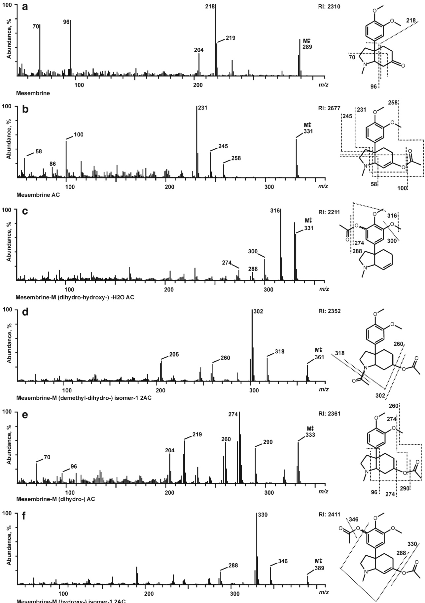
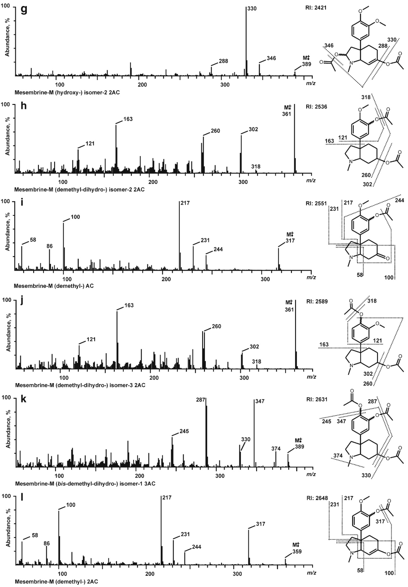
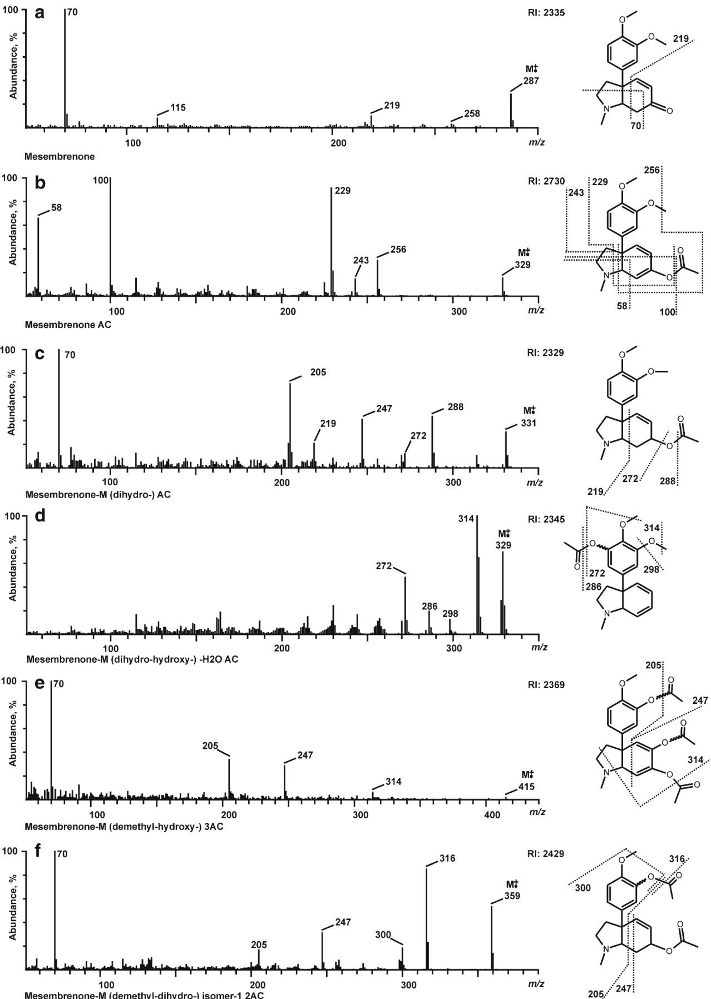
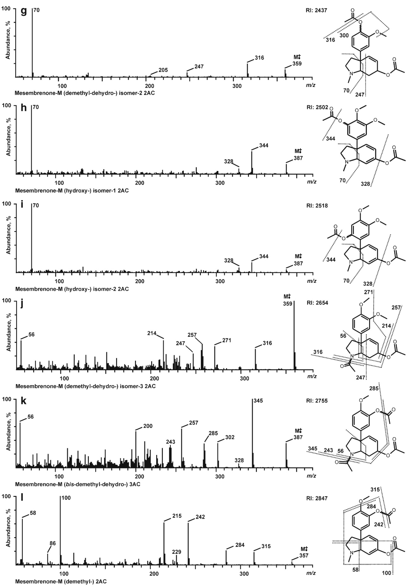

# GC-MS, LC-MSn, LC-high resolution-MSn, and NMR studies on the metabolism and toxicological detection of mesembrine and mesembrenone, the main alkaloids of the legal high “Kanna” isolated from Sceletium tortuosum

Golo M. J. Meyer & Carina S. D. Wink & Josef Zapp & Hans H. Maurer

Received: 27 June 2014 /Revised: 12 August 2014 /Accepted: 12 August 2014   
# Springer-Verlag Berlin Heidelberg 2014

Abstract Mesembrine and mesembrenone are the main alkaloids of Sceletium tortuosum, a plant species that was used for sedation and analgesia by the KhoiSan, previously known as Hottentots, a tribe in South Africa. After fermentation, the obtained preparation called “Kanna” or “Kougoed” was used by chewing, smoking, or sniffing. Today, Kanna gains popularity by drug users as legal high. For monitoring such consumption, metabolism studies are mandatory because the metabolites are mostly the analytical targets, especially in urine. Therefore, the metabolism of both alkaloids was investigated in rat urine and pooled human liver preparations after several sample work-up procedures. As both alkaloids were not commercially available, they were isolated from plant material by Soxhlet extraction, and their identity confirmed by NMR. The metabolites were identified using gas chromatography–mass spectrometry (GC-MS) and liquid chromatography coupled to linear ion trap high resolution mass spectrometry (LC-HRMSn). Both alkaloids were O- and N-demethylated, dihydrated, and/or hydroxylated at different positions. The phenolic metabolites were partly excreted as glucuronides and/or sulfates. Most of the phase I metabolites identified in rat urine could be detected also in the human liver preparations. After a common user’s low dose application of mesembrine, mainly the O- and N demethyl-dihydro, hydroxy, and bis-demethyl-dihydro metabolites, and in case of mesembrenone only the N-demethyl and the N-demethyldihydro metabolite could be detected in rat urine using the authors’ standard urine screening approaches (SUSA) by GCMS or LC-MSn. Thus, it should be possible to monitor a consumption of mesembrine and/or mesembrenone assuming similar pharmacokinetics in humans.

Keywords Mesembrine . Mesembrenone . Kanna . Metabolism . GC-MS . LC-(HR)-MSn

# Introduction

Mesembrine [(3aR,7aR)-3a-(3,4-dimethoxyphenyl)-1- methyloctahydro-6H-indol-6-one] and mesembrenone [(3aR,7aS)-3a-(3,4-dimethoxyphenyl)-1-methyl-1,2,3,3a,7,7ahexahydro-6H-indol-6-one] are the main alkaloids of Sceletium tortuosum and other Mesembryanthemaceae species [1, 2]. The plant family of Aizoaceae is mainly distributed in South Africa [2]. Besides the main alkaloids, several structurally similar compounds were described in literature, for example Δ7- mesembrenone, mesembranol, mesembrenol, tortuosamine, sceletium alkaloid A4, etc. [1–3]. Geographic and/or growing conditions, age of the plants, as well as the process of fermentation influence the alkaloid content and/or composition [4]. The total alkaloid content in the Mesembryanthemaceae species is very low (1 %–1.5 %), but Sceletium tortuosum showed the highest levels [5].

The plant species were used after fermentation by the KhoiSan, previously known as Hottentots, a tribe in South

Africa. Different preparations, such as herbs, powders, capsules, and extracts were called “Kanna” or “Kougoed” and administered by chewing, smoking, or sniffing for sedation and analgesia [5]. The alkaloids were tested by Harvey et al. in receptor and enzyme binding studies as well as in cell assays [6]. An ethanolic extract showed strong inhibition of the 5-HT transporter (IC50, 4.3 μg/mL) and of the phosphodiesterase 4 (PDE-4; IC50, 8.5 μg/mL). These values were given in μg/mL as the extract contained a mixture of alkaloids. Further experiments elucidated that mesembrine had the lowest Ki value (1.4 nM) for the 5-HT transporter, whereas mesembrenone showed the strongest inhibition effects against PDE-4 (IC50, <1 μM). Further clinical trials and experiments in humans confirmed these finding with antidepressive and anxiolytic effects of the extract [7, 8]. Besides the medical use, Kanna preparations (e.g., herb, powder, capsules, extracts), available in so-called smart shops, are misused as legal highs [7, 8]. During the last decade, such legal highs gained popularity in the drug scene, and their detection in screening approaches represent a major challenge in clinical and forensic toxicology [9]. Urine screening is the most comprehensive approach, covering a broad range of (also low dosed) drugs with a longer detection window than blood, but mostly the metabolites are the analytical targets. Thus, the metabolism and the detectability of new drugs in urine have to be studied.

Such data are missing for mesembrine and mesembrenone and, therefore, the aim of the presented study was the identification of the phase I and II metabolites in rat urine and human liver preparations using gas chromatography mass spectrometry (GC-MS) and liquid chromatography linear ion trap high resolution mass spectrometry (LC-HR-MSn). The reference standards were commercially not available and had to be isolated first from the plant material. In addition, the detectability of mesembrine, mesembrenone, and/or its metabolites should be assessed using the authors’ standard urine screening approaches (SUSA) by GC-MS [10–12] and LCMSn [13, 14].

# Experimental

Chemicals and reagents

Sceletium tortuosum was obtained from an internet shop (www.greenafricana.com), Isolute Confirm HCX (130 mg, 3 mL) and Isolute Confirm C18 (500 mg, 3 mL) solid-phase extraction (SPE) cartridges from Biotage (Grenzach-Wyhlen, Germany), chloroform (LC-MS grade), hydrochloric acid in diethyl ether (2 M), the solvents for NMR (CDCl3, 99.8 atom % D; D2O, 99.9 atom % D), and the certified internal standard for quantitative 1H NMR measurements (calcium formate, 99.

92 % purity) were obtained from Sigma Aldrich (Steinfurt, Germany), basic aluminum oxide (activity stage І, 0.063-0. 2 m m ) , t e t r a m e t h y l s i l a n e i n C D C l 3 , a n d 3 - (trimethylsilylpropyl)propionic acid-d4 sodium salt in D2O, and the internal standards for calibrating H and C chemical shifts were from Merck (Darmstadt, Germany), acetonitrile (LC-MS grade), ammonium formate (analytical grade), ethanol (LC-MS grade), formic acid (for mass spectrometry), methanol (LC-MS grade), and all other chemicals and biochemicals from VWR (Darmstadt, Germany). Ready-to-use pH 10 buffer for the conversion of the hydrochlorides to the free amines was delivered from Roth (Karlsruhe, Germany). The following enzyme sources were from Gentest and delivered by NatuTec (Frankfurt/Main, Germany): baculovirusinfected insect cell microsomes (Supersomes), containing 1 nmol/mL of the human cDNA-expressed cytochrome P450 (CYP) CYP1A2, CYP2A6, CYP2B6, CYP2C8, CYP2C9, CYP2C19, CYP2D6, and 2 nmol/mL CYP2E1, CYP3A4, or CYP3A5, human liver microsomes [HLM, pooled of 25 donors, 20 mg microsomal protein/mL, 330 pmol total cytochrome P450 (CYP)/mg protein], and human liver cytosol (HLC, pooled of ten donors, 20 mg protein/mL). After delivery, the microsomes, HLM and HLC were thawed at 37 °C, aliquoted, snap-frozen in liquid nitrogen, and stored at −80 °C until use.

# Isolation of mesembrine and mesembrenone

The plant material was pulverized and 50 g portions were extracted in a Soxhlet apparatus with 500 mL of a mixture of n-pentane:n-hexane (1:1 v/v) for 1 h. After drying the plant material, additional stepwise extraction with a total volume of 500 mL dichloromethane was performed for 6 h. Combined dichloromethane extracts were evaporated to dryness under vacuum at 40 °C and the residue was treated with 0.5 M HCl and stirred for 1 h on an ice bath. After filtration, the acidic solution was basified with 0.5 M NaOH to pH 8–9 and extraction was performed with chloroform (4×300 mL). Combined extracts were dried over sodium sulfate and evaporated to dryness under vacuum at 40 °C. The extract was separated by column chromatography with basic aluminum oxide (activity stage III) as stationary phase and gradient elution with chloroform and methanol:ammonia mixture (99:1, v/v), from 99.9 to 90 %. To improve the flow rate, the column was set under slight pressure (N2). Both alkaloids were obtained in the form of brown oils. They were solved in diethyl ether and precipitate by dropwise addition of 2 M HCl (in diethyl ether) in the form of their hydrochlorides. After centrifugation, the solid products were washed with diethyl ether and dried under vacuum at 30 °C to give white to slightly yellow crystalline powders.

NMR analysis of mesembrine, mesembrenone, and their hydrochlorides

The NMR spectra were recorded in CDCl3 or D2O with a Bruker (Rheinstetten, Germany) DRX 500 NMR spectrometer at 298 K. The chemical shifts were relative to tetrametylsilane (CDCl3) or 3-(trimethylsilylpropyl)propionic acid-d4 sodium salt (D2O) using the standard δ notation in parts per million. The 1D NMR (1H and 13C NMR, DEPT135) and the 2D NMR spectra (gs-HH-COSY, gs-NOESY, gsHSQCED, and gs-HMBC) were recorded using the Bruker pulse program library. All assignments based on extensive NMR spectral evidence.

The purity of the hydrochlorides was analyzed via quantitative NMR (qNMR). Therefore, a standard solution was established containing 32.50 mg Ca(HCOO)2 in 5 mL D2O.

Five hundred μL of the standard solution together with 200 μL of pure D2O was added to 10–12 mg of the synthesized metabolites. The qNMR measurements were performed in an analogous manner as described by Malz [15].

For the conversion of the hydrochlorides to the free amines, about 10 mg of the hydrochloride was dissolved in 2 mL of pH 10 buffer and extracted with CHCl3 three times. The organic layer was dried over anhydrous sodium sulfate, separated from the inorganic salt, and evaporated to dryness.

# Mesembrine hydrochloride

Purity (qNMR): 98.7 %. 1H NMR (500 MHz, CDCl3, 298 K) δ , 6.82 (d, J=8.5 Hz, H-5′), 6.69 (d, J=2.2 Hz, H-2′), 6.62 (dd, J=8.5 and 2.2 Hz; H-6′), 3.90 (m, 2H, H-21 and H-7a), 3.89 (s, 3H , 3′-OCH3), 3.88 (s, 3H, 4′-OCH3), 3.60 (dd, J= 16.0 and 7.5 Hz, H-71), 3.09 (ddd, J=14.5, 13.3 and 5.0, H-41), 2.97 (dd, J=16.0 and 7.0, H-72), 2.94 (d, J=4.8 Hz, 3H, NCH3), 2.90 (m, H- H-22), 2.70 (ddd, J=13.5, 10.2 and 7.8, H-31), 2.60 (ddd, J=13.5, 8.3 and 3.2, H-32), 2.39 (ddd, J=19.0, 5.5 and 2.2, H-51), 2.14 (brdd, J=14.5, and 5.5, H-42),1.81 (m, (ddd, J=19.0, 13.3 and 5.8, H-52),. 13C NMR (125 MHz, CDCl3, 298 K) δ 206.14 (CO, C-6), 149.78 (C, C-3′), 148.62 (C, C-4′), 134.94 (C, C-1′), 117.90 (CH, C-6′), 111.09 (CH, C-5′), 109.52 (CH, C-2′), 69.50 (CH, C-7a), 56.21 (CH3, 3′-OCH3); 55.95 (CH3, 4′-OCH3), 54.04 (CH2, C-2), 48.25 (C, C-3a), 39.61 (CH3, NCH3), 39.03 (CH2, C-7), 38.67 (CH2, C-3), 34.84 (CH2, C-5), 33.89 (CH2, C-4).

# Mesembrine

1H NMR (500 MHz, CDCl3, 298 K) δ 6.93 (dd, J=8.5 and 2.2 Hz, H-6′), 6.90 (d, J=2.2 Hz, H-2′), 6.85 (d, J=8.5 Hz, H-5′), 3.90 (s, 3H , 3′-OCH3), 3.88 (s, 3H, 4′-OCH3), 3.14 (ddd, J=9.5, 8.0 and 3.0 Hz, H-21), 2.95 (dd, J=2×3.0 Hz, H-7a), 2.62 (dd, J=16.0 and 3.5 Hz, H-71), 2.58 (dd, J=16.0 and 3.0, H-72), 2.33 (m, H- H-22), 2.43 (m, H-51), 2.32 (s,

3H, NCH3), 2.32 (m, H-41) 2.21 (m, H-52), 2.19 (m, H-42), 2.13 (m, H-31), 2.08 (m, H-32). 13C NMR (125 MHz, CDCl3, 298 K) δ 211.54 (CO, C-6), 149.04 (C, C-3′), 147.54 (C, C-4′), 140.20 (C, C-1′), 117.94 (CH, C-6′), 111.06 (CH, C-5′), 110.03 (CH, C-2′), 70.39 (CH, C-7a), 56.03 (CH3, 3′- OCH3); 55.91 (CH3, 4′-OCH3), 54.69 (CH2, C-2), 47.52 (C, C-3a), 40.57 (CH2, C-7), 39.95 (CH3, NCH3), 38.80 (CH2, C-3), 35.97 (CH2, C-5), 34.98 (CH2, C-4).

# Mesembrenone hydrochloride

Purity (qNMR): 96.9 %. 1H NMR (500 MHz, D2O, 298 K) δ 7.17 (dd, J=10.3 and 2.0 Hz, H-4), 7.03 (d, J=8.5 Hz, H-6′), 7.02 (d, J=2.0 Hz, H-2′), 7.00 (dd, J=8.5 and 2.0 Hz, H-5′), 6.41 (d, J=10.3 Hz, H-5), 4.08 (brs, H-7a), 3.84 (s, 3H, 3′- OCH3), 3.83 (s, 3H, 4′-OCH3), 3.76 (m, H-21), 3.51 (m, H-22), 2.99 (s, 3H, NCH3), 2.93 (m, H-31), 2.51 (ddd, J= 13.5, 8.0 and 5.0 Hz, H-32). Signals for H-71 and H-72 could not be found. 13C NMR (125 MHz, D2O, 298 K) δ 199.09 (CO, C-6), 155.95 (CH, C-4), 151.39 (C, C-3′), 150.97 (C, C-4′), 133.28 (C, C-1′), 132.24 (CH, C-5), 122.49 (CH, C-6′), 114.81 (CH, C-5′), 112.83 (CH, C-2′), 75.13 (CH, C-7a), 58.65 (CH3, 3′-OCH3); 58.52 (CH3, 4′-OCH3), 57.33 (CH2, C-2), 52.80 (C, C-3a), 43.17 (CH3, NCH3), 38.90 (CH2, C-3), 35.43 br m (CD2, C-7).

# Mesembrenone

1H NMR (500 MHz, CDCl3, 298 K) δ 6.89 (dd, J=8.0 and 2.0 Hz; H-6′), 6.86 (d, J=2.0 Hz, H-2′), 6.85 (d, J=8.0 Hz, H-5′), 6.73 (dd, J=10.0 and 2.0 Hz, H-4), 6.11 (dd, J=10.0 and 1.2 Hz, H-5), 3.89 (s, 3H, 3′-OCH3), 3.88 (s, 3H, 4′- OCH3), 3.32 (ddd, J=9.0, 9.0 and 2.5 Hz, H-21), 2.66 (m, H-7a), 2.58 (ddd, J=17.0, 2.8 and 1.0 Hz, H-71), 2.53 (dd, J= 2×9.0 Hz, H-22), 2.56 (m, H-72), 2.51 (dd, J=17.0 and 3.8 Hz, H-72), 2.45 (ddd, J=13.5, 9.0 and 2.5 Hz, H-31), 2.32 (s, 3H, NCH3), 2.27 (ddd, J=13.5 and 2×8.5 Hz, H-32). 13C NMR (125 MHz, CDCl3, 298 K) δ 197.51 (CO, C-6), 153.79 (CH, C-4), 149.14 (C, C-3′), 148.18 (C, C-4′), 135.65 (C, C-1′), 126.45 (CH, C-5), 119.07 (CH, C-6′), 111.21 (CH, C-5′), 110.16 (CH, C-2′), 73.75 (CH, C-7a), 56.08 (CH2, C-2), 56.05 (CH3, 3′-OCH3), 55.95 (CH3, 4′-OCH3), 50.91 (C, C-3a), 40.07 (CH3, NCH3), 38.60 (CH2, C-3), 36.24 (CH2, C-7).

Urine samples

Metabolism studies were performed using male Wistar rats (Charles River, Sulzfeld, Germany). They were administered a single 1 or 20 mg/kg body weight (BW) dose in aqueous solution by gastric intubation of mesembrine HCl or mesembrenone HCl for toxicological diagnostic reasons according to the corresponding German law (http://www.

gesetze-im-internet.de/tierschg/). Urine was collected separately from the feces over a 24 h period. Blank urine samples were collected before drug administration to check whether the samples were free of interfering compounds. All urines were directly analyzed or stored at −20 °C until further analysis.

Sample preparation of urine samples for metabolism studies using GC-MS

For identification of phase I metabolites by GC-MS, 1 mL urine (rat urine after 20 mg/kg BW drug administration) was processed by enzymatic cleavage of conjugates and SPE (HCX) according to Reference [16]. Briefly, the enzymatic cleaved urine was loaded on an Isolute Confirm HCX cartridges previously conditioned with methanol and water. After passage of sample, cartridge was washed with 0.1 M hydrochloric acid and purified water. Elution was performed with a mixture of methanol and ammonia (98:2 v/v). The evaporated extracts were acetylated after addition of 100 μL of an acetic anhydride:pyridine mixture (3:2 v/v) and incubation for 5 min under microwave irradiation at about 400 W. After evaporation of the derivatization mixture (60 °C, reduced pressure), the residue was dissolved in 100 μL methanol.

Sample preparation of urine samples for metabolism studies using LC-HR-MS

For identification of phase I metabolites, 1 mL urine was enzymatically hydrolyzed and extracted as described for GC-MS. However, the evaporated underivatized extract was reconstituted in 50 μL mobile phase (A/B, 1:1 v/v).

For identification of phase II metabolites, 1 mL urine (rat urine 20 mg/kg BW drug administration) was processed by SPE (C18) according to References [17] and [10]. Briefly, urine was diluted with 2 mL purified water before loading the sample on a previously conditioned (1 mL methanol, 1 mL water) Isolute Confirm C18 cartridge. After passage of the sample, the cartridge was washed with 2 mL purified water. Elution was performed using 1.5 mL of methanol and 0.2 mL acetone. The extracts were gently evaporated to dryness and reconstituted in 50 μL mobile phase (A/B, 1:1 v/v).

For protein precipitation (PP), 100 μL urine were precipitated by 500 μL acetonitrile according to Reference [13]. After shaking and centrifugation, the supernatant was gently evaporated to dryness and reconstituted in 50 μL mobile phase (A/B, 1:1 v/v).

GC-MS apparatus for identification of the phase I metabolites

The settings were the same as already described [17]. Briefly, a Hewlett Packard (HP; Agilent, Waldbronn, Germany) 5890 Series II gas chromatograph combined with an HP 5972 MSD mass spectrometer and HP MS ChemStation (DOS series, version C.03.00) was used. The GC was programmed from 95 to 200 °C at 20 °C/min, initial time 2 min, from 200 to 250 °C at 15 °C/min hold for 2 min, ramp than up to 310 °C at 30 °C/min, and hold for 10 min. The MS was run in the electron ionization (EI) full-scan mode, m/z 50–550.

LC-HR-MSn apparatus for identification of the phase I and II metabolites

The settings were the same as described previously by Meyer et al. [10, 18], briefly, a Thermo Fisher Scientific (TF, Dreieich, Germany) Dionex LC system coupled to the TF LTQ Orbitrap (OT) equipped with a HESI II source. Separation was performed by a TF Hypersil Gold (15×2.1 mm, 1.9 μm) and gradient elution. The MS was operated in ESI positive mode. CID-MS/MS experiments were performed using information-dependent acquisition (IDA): MS1 was performed in the full-scan mode (m/z 150–800) with a resolution of 15,000. MS2, and MS3 were performed in the IDA mode: four IDA MS2 experiments were chosen to provide MS2 on the four most intense signals from MS1 and additionally, eight MS3 were chosen to record MS3 on the most intense and second most intense signals from the MS2. MS2 spectra were collected with a higher priority than MS3 spectra. Normalized wideband collision energies were 35 % for MS2 and 40 % for MS3. Further product ion scans (MS2 experiments) were performed for identification of phase I metabolites, using the following precursors: m/z 260, 262, 264, 274, 276, 278, 288, 290, 292, 304, 306, 308, 322, and 324. For confirmation of phase II metabolites, the following precursors were selected: m/z 340, 342, 344, 354, 356, 384, 436, 438, 440, 450, 452, 454, 466, 480, and 488. For each experiment, four precursors were grouped together in combination with a full-scan. For identification of phase II metabolites, the MS3 experiments were recorded in IDA mode (see above). Other settings were as follows for MS2: minimum signal threshold, 100 counts; isolation width, 1.5 u; for MS3: minimum signal threshold, 50 counts; isolation width, 2.0 u; for both stages: activation Q, 0.25; activation time, 30 ms; dynamic exclusion mode: repeat counts, 2; repeat duration, 15 s; exclusion list, 50; exclusion duration, 15 s; average full-scan to full-scan cycle time, 4 s. In order to obtain more structure information, samples were also measured without wideband activation additionally. TF Xcalibur version 2.2 was used for data acquisition.

Incubation of human liver preparations

Incubations were performed for 30 min at 37 °C with a concentration of 25 μM mesembrine and mesembrenone each. The initial CYP activity screenings were conducted in duplicate with 50 pmol/mL of each isoform: CYP1A2, CYP2A6, CYP2B6, CYP2C8, CYP2C9, CYP2C19,

CYP2D6, CYP2E1, CYP3A4, or CYP3A5; HLM or HLC incubations with 0.2 mg/mL. Respective blank samples (without active protein) were incubated to monitor CYPindependent transformation of the drugs. Besides enzymes and substrate, incubation mixtures (final volume, 50 μL) consisted of 90 mM phosphate buffer (pH 7.4), 5 mM Mg2+, 5 mM isocitrate, 1.2 mM NADP+, 0.5 U/mL isocitrate dehydrogenase, and 200 U/mL superoxide dismutase. For incubations with CYP2A6 or CYP2C9, phosphate buffer was replaced with 90 mM Tris buffer, respectively, according to the Gentest manual. Reactions were started by addition of the icecold microsomes and stopped with 50 μL of an ice-cold mixture of acetonitrile. The solutions were stored at −20 °C for 20 min, thawed, and then centrifuged for 5 min at 14,000g, and finally 50 μL of the supernatant was transferred to an autosampler vial.

# GC-MS standard urine screening protocol

The rat urine samples (after low dose of 1 mg/kg BW) were worked-up according to published procedures [10, 12]. Briefly, the samples (5 mL) were divided into two aliquots, and one part was submitted to acid hydrolysis. Thereafter, the sample was adjusted to pH 8–9 and the other aliquot of untreated urine was added. This mixture was extracted with a dichloromethane-isopropanol-ethyl acetate mixture (1:1:3 v/ v/v) and the organic layer was evaporated to dryness. The residue was acetylated with an acetic anhydride-pyridine mixture using microwave irradiation (400 W, 5 min). Following evaporation, the residue was dissolved in 100 μL methanol and 2 μL were injected onto the same GC-MS and as described above.

For toxicologic detection of both alkaloids and their metabolites, mass chromatography was used with the extracted ions for mesembrine at m/z 231, 316, 330, 361, 347, 389, and for mesembrenone at m/z 70, 299, 314, 316, 359, and 387. Generation of the mass chromatograms was performed with user defined macros [12]. The identity of the peaks in the mass chromatograms was confirmed by comparison of the mass spectra underlying the peaks (after background subtraction) with reference spectra recorded during this study. In addition, the full scan data files acquired by GC-MS were evaluated by the automated mass spectral deconvolution and identification system (AMDIS) (http://chemdata.nist.gov/ mass-spc/amdis/) in simple mode. The deconvolution parameter settings were as follows [19]: width 32; adjacent peak subtraction two; resolution high; sensitivity very high; and shape requirements low. The minimum match factor was set to 50. The target library was a reduced version of the Maurer/Pfleger/Weber MPW_2015 library in preparation.

LC-MSn standard urine screening protocol

The rat urine samples (100 μL each) were precipitated by acetonitrile as already described above for metabolism studies. The worked-up samples were separated and analyzed using a TF LXQ linear ion trap MS equipped with a HESI II source and coupled to a TF Accela LC system consisting of a degasser, a quaternary pump, and an autosampler. The used column was a TF Hypersil Gold (10×2.1 mm, 1.9 μm) and applied gradient and MS settings are described elsewhere [13]. TF Xcalibur version 2.2 was used for data acquisition, NIST MS Search 2.0 (National Institute of Standards and Technology, Gaithersburg, MD) for library generation, TF ToxID 2.1.1 for automatic target screening in the MS2 screening mode. The settings were as follows: retention time (RT) window, 20 min; RT, 0.1 min; signal threshold, 100 counts; search index, 600; reverse search index, 700. SmileMS version 1.1 (GeneBio, Geneva, Switzerland) was used for automatic target screening using the precursor tolerance option and for automatic untargeted screening without precursor tolerance option and RT locking. Further settings were as follows: score threshold, 0.1; minimum number peak matches, 0. ToxID and SmileMS were run automatically after file acquisition using an Xcalibur processing method starting both software tools.

# Results and discussion

Isolation of mesembrine and mesembrenone

The two step extraction procedure by Soxhlet apparatus allowed elimination of lipids by using the nonpolar npentane:n-hexane mixture before the extraction was performed with dichloromethane. An elimination of these lipids was important, because lipids, especially fatty acids, may interfere with the following isolation procedure because of their emulsifying properties, for example by phase separation in liquid–liquid extraction. Further gummy material from the plant was eliminated by the following liquid–liquid back extraction under acidic or alkaline pH conditions. Unfortunately, only the rather toxic chloroform allowed sufficient extraction [10]. However, these purification procedures resulted in a lower alkaloid yield, as well as better separation conditions by the following column chromatography. The advantage of the basic aluminum oxide compared with silica [20] was the absence of strong tailing effects of mesembrine and mesembrenone and acceptable separation conditions by column length of 30 cm. Subsequent conversion of the isolated oily bases in their hydrochlorides improved purity, handling of substances, and their solubility important for further experiments. The minor alkaloids, such as mesembranol, mesembrenol, or sceletium alkaloid A4 could not be completely isolated under these conditions.

# NMR analysis of mesembrine and mesembrenone hydrochloride

The 1H and 13C NMR spectra data of mesembrine hydrochloride in CDCl3 showed resonances for a N-methyl octahydroindol-6-one and a 3,4-dimethyloxyphenyl moiety. The chemical shifts were close to those of mesembrine, but the resonances for the pyrrolidine ring protons appeared remarkably shifted downfield. These were good arguments for the existence of protonated mesembrine, and the 2D NMR analysis supported this structure. Unfortunately, a comparison with literature data was not possible. Therefore, as a final proof, the hydrochloride was converted to the free base. Its NMR data were in good accordance with those of mesembrine [21]. It is noteworthy, that the NMR spectra of mesembrine hydrochloride recorded in D2O showed not a single set of signals for the structure but resonances for two conformers in a 1:1 ratio. This observation coincided with results from literature, in which Jeffs [22] reported a normal carbonyl and a carbonyl hydrate conformer for mesembrine hydrochloride in aequos solution.

In contrast to mesembrine hydrochloride, the NMR spectra of mesembrenone hydrochloride in D2O lack two methylenes but revealed additional resonances for a disubstituted double bond between C-4 and C-5 in conjugation to the carbonyl C-6. But much to our suprise in the 1H NMR no protons for methylene C-7 could be detected and in the 13C NMR the resonance for C-7 appeared as a broad multiplet. It was obvious that under these conditions, both H-7 were undergoing a deuterium exchange. This could be explained as a consequence of a keto-enol tautomerism. The carbonyl C-6 is in rapid equilibrium with the enol tautomer C-6/C-7, which contains a pair of doubly bonded carbon atoms adjacent to a hydroxyl group. In D2O solution, a deuteron will be exchanged in the hydroxyl group. The interconversion of the keto-enol forms involves the movement of the deuterium atom to C-7. Our data recorded in D2O were similar to those in CDCl3 reported from literature [23]. But it must be mentioned that our mesembrenone hydrochloride recorded in CDCl3 showed not only one but resonances of two conformeric forms. Basification of our mesembrenone hydrochloride led to the free alkaloid mesembrenone. Its NMR data matched the data from literature [24].

Identification of mesembrine phase I metabolites by GC-MS

All GC-MS spectra of mesembrine and its metabolites are depicted in Fig. 1. If the position of the metabolic change in the molecule could not be determined, the resulting bond is indicated by a tilde. In case of the Sceletium alkaloids, Martin et al. elucidated the structures in detail by MS, HR-MS, labeling experiments, and analysis of metastable transitions [3]. These data were used for further structure elucidation of the resulting metabolites and derivatized structures. The mass spectrum of underivatized mesembrine (Fig. 1a) is characterized by the base peak at m/z 218 resulting of formation of an aryl conjugated pyrrolidinium ion (m/z 219) after loss of a hydrogen, by the allyl iminium ion at m/z 70, and the pyrrolidinium ion at m/z 96. Besides these main fragment ions (FI), further fragmentations were observed from the molecular ion (MI) and/or the FI: radical loss of methyl group and/or loss of hydrogen to give several less abundant FI. Due to keto-enol tautomerism, acetylation of the enol function could be observed (Fig. 1b) and led to the shifted MI at m/z 331. In contrast to the underivatized mesembrine (Fig. 1a) and mesembrenone (Fig. 2a) with strongly different mass spectra, the acetylated compounds (Figs. 1b and 2b) showed similar fragmentation with identical FI at m/z 58, 86, and 100 and FI at m/z 229, 231, 243, 245, 256, and 258 with two mass units (−2H) less caused by the additional double bond in mesembrenone. The fragmentation was strongly dependent on the degree of saturation of the six member ring. In case of the dihydro metabolite of mesembrine (mesembranol), without any carbon double bond in the indole moiety, the mass spectrum was different (Fig. 1e) and showed, besides the loss of the acetyl group from MI to FI at m/z 290, a following radical loss of a methyl group and loss of hydrogen to FI at m/z 274. Further explanation for FI at m/z 274 could be the loss of acetic acid from MI. Due to reduction of the keto group, FI at m/z 258 (Fig. 1b) was shifted by two mass units to FI at m/z 260. In contrast to the unsaturated compounds, FI at m/z 70, 96, and 219, observed in the underivatized mesembrine spectrum, could also be detected in the dihydro metabolite spectrum. Radical loss of a methyl group from FI at m/z 219 led to FI at m/z 204. These results were consistent with the observations by Martin et al. [3]. The demethyl metabolite (Fig. 1,i) showed analogue fragmentation behavior: identical FI at m/z 58, 86, and 100 as well as FI at m/z 217, 231, 244 (−14 u in comparison to mesembrine). Besides the demethyl metabolite, three demethyl-dihydro metabolites with MI at m/z 361 could be detected (Fig. 1d, h, j). Due to the saturated indole moiety, the fragmentation differed from the demethyl metabolite and correlated with the dihydro metabolite: loss of an acetyl group followed by hydrogen loss to FI at m/z 318 and a loss of acetic acid to FI at m/z 302 could be monitored. Further loss of the second acetyl group from FI at m/z 302 led to FI at m/z 260. For these compounds, fragmentations took place with minor abundance differences. For differentiation of the possible O- and N-demethyl compounds, FI at m/z 163 and 121 (Fig. 1h, j) indicated the O-demethylation. Analogue fragmentation could be monitored for the bisdemethylated compounds (Fig. 1k, m, n): loss of acetyl group from MI at m/z 389 led to FI at m/z 347, further loss of acetic acid to FI at m/z 287 and 245 (additional loss of hydrogen m/z 244). Elimination of acetic acid led to FI at m/z 330 or radical loss of a methyl group to FI at m/z 374. A differentiation between O,O-bis- or O,N-bis-demethyl compounds were not possible because all compounds contained FI at m/z 163. In addition, two other compounds with MI at m/z 389, but with different fragmentation, were observed (Fig. 1f, g). Due to their fragmentation, hydroxy metabolites could be postulated: loss of an acetyl group led to FI at m/z 346 and loss of acetic acid to FI at m/z 330. Combined loss of an acetyl group and acetic acid was represented by FI at m/z 288. A dihydrohydroxy metabolite was detected after loss of water (Fig. 1c). In comparison to acetylated mesembrine or mesembrenone (Figs. 1b and 2b), FI at m/z 70, 96, and 100 were missing and different fragmentation behavior was observed: radical loss of the methyl group from MI at m/z 331 led to the base peak at m/z 316 and radical loss of methoxy group to FI at m/z 300. Cleavage of the acetyl group followed by loss of H radical (−1 u) was observed from MI to FI at m/z 289 to FI at m/z 288 or from FI at m/z 316 to FI at m/z 274.

Identification of mesembrenone phase I metabolites by GC-MS

All GC-MS spectra of mesembrenone and its metabolites are depicted in Fig. 2. The mass spectrum of mesembrenone (Fig. 2a) is characterized by MI at m/z 287, base peak at m/z 70, and the minor abundant aryl conjugated pyrrolidinium ion at m/z 219 as described by Martin et al. [3]. As already discussed above, the acetylated spectrum (Fig. 2b) of mesembrenone showed nearly the same fragmentation as acetylated mesembrine (Fig. 1b). The spectrum of the dihydro-metabolite (mesembrenol, Fig. 2c) is characterized by the base peak at m/z 70 and FI at m/z 288 and 272 resulting from cleavage of acetyl group or acetic acid, respectively. The demethyl metabolite (Fig. 2l) showed analogue fragmentation behavior as mesembrenone: same FI at m/z 58, 86, 100, and FI at m/z 215, 229, 242, and 315 (−14 in comparison to mesembrenone). FI at m/z 284 resulted from radical loss of a methoxy group from FI at m/z 315. Besides the O-demethyl metabolite, three demethyl-dihydro metabolites with MI at m/z 359 could be detected (Fig. 2f, g, j). They were characterized by the loss of an acetyl group to FI at m/z 316. Loss of acetic acid to FI at m/z 300 could only be monitored for one isomer (Fig. 2f). In the spectra of two demethylated isomers (Fig. 2f, g), FI at m/z 70 occurred and indicated Odemethylated compounds, whereas FI at m/z 56 (70–14 u) was unique for the N-demethylated metabolite (Fig. 2j). The characteristic FI at m/z 219 was shifted by −14 u in the monodemethylated compounds to FI at m/z 205 [3] and after acetylation to FI at m/z 247. These two FI appeared also in the demethyl-hydroxy metabolite (Fig. 2e) with MI at m/z 415 and FI at m/z 70, indicating that the hydroxylation took place in the six-membered ring of the indole moiety. The mono-hydroxy metabolites (Fig. 2h, i) were characterized by intense base peaks at m/z 70 and only minor FI at m/z 344 and 328, resulting from cleavage of an acetyl group or elimination of acetic acid, respectively. In case of the bis-demethyl-dihydro metabolite (Fig. 2k), elimination of the acetyl group to FI at m/z 345 or of acetic acid to FI at m/z 328 was observed. Combination of both fragmentations led to further FI at m/z 302 and 285. Absence of FI at m/z 70, the presence of FI at m/z 56 and 257, and FI at m/z 200 (214 –14, in Fig. 2j) might be a hint of an O,N-bis-demethyl metabolite. The dihydro-hydroxy metabolite was detected after loss of water (Fig. 2d). As observed for the mesembrine metabolite (Fig. 1c), the same fragmentation could be detected: radical loss of a methyl group from MI at m/z 229 led to the base peak at m/z 314, radical loss of a methoxy group to FI at m/z 298. Elimination of the acetyl group was observed from MI to FI at m/z 286 or from FI at m/z 314 to FI at m/z 272.

# Identification of mesembrine phase I metabolites by LC-HR-MSn

All MS2 spectra of phase I metabolites detected by LC-HRMSn, their proposed chemical structures, with accurate masses, calculated elemental formula, and mass error values in parts per million (ppm) rounded to one decimal, were depicted in Fig. 3. MS spectrum of mesembrine (Fig. 3,1) contained besides the protonated molecule ion (PMI) at m/z 290.1750 several characteristic FI at m/z 121.0647, 134.0963, and 152.1069 resulting from different cleavages of the octatetrahydroindole moiety. Due to keto-enol tautomerism, a cleavage of water (−18.0110 u) to FI at m/z 272.1638 was observed. Elimination of H2O or NH3 could be detected in higher abundance without wideband (WB) activation. The elimination of the amine moiety (−31.0422 u) to FI at m/z 259.1326 or in combination with neutral loss of water to FI at m/z 241.1222 was typical for mesembrine and its metabolites. The base peak at FI m/z 232.1331 (−58.0417 u) resulted from an additional cleavage of the six members ring of the indole moiety from PMI. After radical loss of a methoxy group (−31.0184 u), FI at m/z 201.1148 could be observed. The structure of FI at m/z 219.1251 could also confirm the observation of Martin et al. for the GC-MS EI spectra of mesembrine [3]. These FI as well as the PMI were changed according to the corresponding molecule modifications caused by the metabolizing enzymes (CYPs, alcohol dehydrogenases, glucuronyltransferases, sulfotransferases, etc.). The proposed N-oxide of mesembrine with the PMI at m/z 306.1699 (290.1750+15.9949 u) eluted after mesembrine and therefore differed from possible hydroxy metabolites, which normally elutes earlier than the unchanged parent compound. It showed nearly the same mass spectrum (Fig. 3,2) as the parent compound with mostly identical FI but in with different abundances. Dihydro mesembrine (Fig. 3, 3) with a PMI at m/z 292.1907 could be proposed. According to the addition of two hydrogen atoms, several FI were shifted, for example ion at m/z 272.1638, 241.1222, 134.0964 to 274.1798, 243.1378, and 136.1120. Differentiation between FI at m/z 259.1569 and 259.1326 observed for mesembrine highlighted the advantage of the HR device. Three demethyl metabolites (−14.0156) could be detected (Fig. 3, 4–6) and the FI at m/z 227.1066

  
Fig. 1 GC-MS spectra of mesembrine and its phase I metabolites with chemical structure, retention index (RI), and proposed fragmentation (unclea hydroxy positions indicated by tildes)

  
Fig. 1 (continued)

  
Fig. 2 GC-MS spectra of mesembrenone and its phase I metabolites with chemical structure, retention index (RI), and proposed fragmentation (unclea hydroxy positions indicated by tildes)

  
Fig. 2 (continued)

香名 202 2 都 8 人 2 2410 全 27612N03 新 3 H 名 i 4 美 丫 8 出 21712410 2 Mesembrine nbrine-M (N-oxide) Mesembrine-M(dihydro-) 京点点乐 5 名 上 广 6 B8 02 20 2602 245172 2H20N02 20 万吊西 9.101 J 出 27220 276124 16H22NC 76.6600 Mesembrine-M (O-demethyl-) isomer-1 点 常 京 O2 2 2 Grnf Y Y Y 224803 22140 2 Mesembrine-M(C emethyl-) m emethyl-) isomer-1 m Mesembrine-M(O,N-bis-demethyl-)isomer-2 m 10 堂 名宝点 11 吊 常常 12 S 营 B B 8 1 022 2 2418HH0 20 22 2 02 2 1 T i 丫 110.0964 2716H240 278H240 2A Mesembrine-M(O-demethyl-dihydro-)isom yl-dihydro- Mesembrine-M (N-demethyl-dihydro-) m 13 T 吊 20 02O 1 OH > 09217 C554H62N0 241540 Mesembrine-(O,N-bis-demethyldydro-) m Mesembrine-M (O,O-bis-demethyl-dihydro-) m

and 241.1222 allowed differentiation between O- and Ndemethyl compounds. The exact position of O-demethylation (Fig. 3, 4 and 5) could not be determined due to similar mass spectra. The observed FI at m/z 205 (219.1251–14.0156 u), also observed by GC-MS, could be confirmed as well. A combination of demethylation and dihydration led to three demethyl-dihydro metabolites (Fig. 3, 10–12). In comparison, two O-demethyl-dihydro metabolites (Fig. 3, 10 and 11) were characterized by two mass units shifted FI at m/z 227.1066, 205.1097, 134.0964 to 229.1223, 203.1067, and 136.1120. As mentioned before, the HR data of FI at m/z 245.1170 versus 245.1480 helped to understand the fragmentation.

For the three bis-demethyl metabolites (Fig. 3, 7–9), with a PMI at m/z 262.1437 (290.1594 -14.0156 -14.0156) FI at m/z 204.1019 dominated the mass spectra but did not offer the differentiation between O,O-bis- or O,N-bis-demethyl metabolites. The O,O-bis-demethyl metabolite (Fig. 3, 7) could be identified by FI at m/z 213.0909 or 231.1014. Reduction of the keto group and bis-demethylation (290.1750 -14.0156 - 14.0156+2.0157), led to bis-demethyl-dihydro metabolites (PMI at m/z at 264.1594), of which two isomers could be detected (Fig. 3, 13 and 14). After neutral loss of water (−18.0110 u) and ammonia (−17.0262 u), FI at m/z 229.1222 characterized the O,N-bis-demethyl-dihydro metabolite (Fig. 3, 13). Structures proposed for FI at m/z 197.0960 were observed in further studies of other compounds containing a hydroxy group next to a methoxy group [10] resulting from methanol elimination. The spectrum of the proposed O,O-bis-demethyldihydro metabolite (Fig. 3, 14) showed FI, shifted by two mass units, comparable to the O,O-bis-demethyl metabolite (Fig. 3, 7) at m/z 215.1066 (213.0909), 189.0909 (191.0939), and 136.1120 (134.0963). In contrast to FI at m/z 231.1015 in Fig. 3, 7, FI at m/z 231.1253 still contained the nitrogen and resulted from elimination of CH5O (−33.0341 u).

Identification of mesembrenone phase I metabolites by LC-HR-MSn

All MS2 spectra of phase I metabolites detected by LC-HRMSn, their proposed chemical structures, with accurate masses, calculated elemental formula, and mass error values in ppm rounded to one decimal are depicted in Fig. 4. MS2 spectrum of mesembrenone (Fig. 4, 1) contained besides the PMI at m/z 288.1591, characteristic FI at m/z 270.1485 and 257.1170 resulting from elimination of water (−18.0106 u) or methylamine (−31.0422 u). The base peak at m/z 230.1175 correlated to the FI at m/z 232.1331 in the spectrum of mesembrine (Fig. 3, 1) shifted by two mass units (−2H). FI at m/z 124.0756 characterized the amine function and was important to differentiate between O- and N-demethylation. As mentioned above, radical loss of the methoxy group, for example FI at m/z 199.0991 or 226.0988, could also be detected. Two hydroxy metabolites could be detected and are depicted in Fig. 4, 2 and 3. The following FI at m/z 273.1121, 246.1123, 167.0701, and 207.0661 were shifted by +15.9949 u, indicating hydroxylation at the phenolic ring system due to presence of unchanged FI at m/z 124.0756. In case of the demethylated metabolites (Fig. 4, 4 and 5) with a PMI at m/z 274.1437, the FI at m/z 216.1019 and 243.1015 were shifted by −14.0157 u, and unchanged FI at m/z 124.0756 indicated an O-demethylation. In case of N-demethylation, FI at m/z 124.0756 was shifted by −14.0157 u to FI at m/z 110.0600. The presence of FI at m/z 245.1172, 191.0701, and 151.0753 proved the metabolically unchanged methoxy groups. For the three bis-demethyl metabolites (Fig. 4, 7–9) with a PMI at m/z 260.1281 (288.1594 –14.0156 –14.0156 u), FI at m/z 202.0862 (230.1173 –14.0156 –14.0156 u) indicated bis-demethylated compounds. For differentiation between O,O-bis or O,N-bis-demethyl metabolites, FI at m/z 124.0756 or 110.0599 were used, respectively. In case of the demethylated metabolites (Fig. 4, 4–9), a further reduction of the keto group was observed and led to the demethyl-dihydro and bis-demethyl-dihydro metabolites (Fig. 4, 10–15). Both isomers of the O-demethyl-dihydro metabolites showed in comparison to the demethyl metabolites (Fig. 4, 4 and 5) FI at m/z 245.1170 (243.1015) and 218.1174 (216.1016) shifted by two mass units. FI at m/z 227.1064 appeared after neutral loss of water (−18. 0106 u) and methylamine (−31.0422 u). The N-demethyl-dihydro metabolite (Fig. 4, 12) was characterized by the base peak at m/z 241.1222 and the unchanged FI at m/z 151.0753. The less abundant FI at m/z 210.1039 resulted from radical loss of the methoxy group. Reduction of the keto group and bis-demethylation (288.1594+2.0157 – 14.0156 –14.0156 u) led to bis-demethyl-dihydro metabolites (PMI at m/z at 262.1437), of which three isomers could be detected (Fig. 4, 13–15). After neutral loss of water (−18.0110 u) and ammonia (−17.0262 u), FI at m/z 227.1066 characterized the O,N-bis-demethyl-dihydro metabolites (Fig. 4, 14 and 15). Additional elimination of methanol (−32.0262 u) led to FI at m/z 195.0804. The spectrum of the proposed O,O-bis-demethyl-dihydro metabolite (Fig. 4, 13) showed in comparison to the O,O-bis-demethyl metabolite (Fig. 4, 7) the following by two mass units shifted FI at m/z 204.10117 (202.0862), 213.0910 (211.0753), and 231.1015 (229.0859).

Identification of mesembrine phase II metabolites by LC-HR-MSn

The phase II metabolites were isolated using C18 SPE because the mixed-mode HCX SPE could not retain sufficiently the acidic glucuronides. They were identified by comparison of the MS3 spectra of conjugated metabolites with the MS2 spectra of corresponding phase I metabolites. Two glucuronides and two sulfates of each O-demethyl-isomer (Fig. 3, 4 and 5) with PMI at m/z 452.1915 and 356.1162 could be detected. For the both O-demethyl-dihydro-isomers (Fig. 3, 10 and 11), again two glucuronides and two sulfates could be detected with PMI at m/z 454.2071 and 358.1318. The O,Obis-demethyl and O,O-bis-demethyl-dihydro metabolites (Fig. 3, 7 and 14) were conjugated with glucuronic acid: two

常常 A 人 Y 门 2 广 Y Y 中 》 6.0649 9.092, 27140 204,15242 4.086° 73,1276, 304.167 04 Me48mtl men a 文 丫 2 146 146 1 点 品 C4H20NO3 24H Mesembrenone-M(O-demethyl-) isomer-1 Mesembrer yl-)isomer-2 Mesembrenone-N nethyl-) 文 品 1 i 点 点 2 Mesembrenone-M(OO-bis-demethyl-) m Mesembrenone-M (O,N-bis-demethyl-) isomer-1 m Mesembrenone-M(O.N-bis-c nethyl-) isomer-2 m 1010 12 8 1 02 1 京 总 H 27 Mesembrenone-M (O-der ethyl-dihydro-) isomer- Mesembrenone-M (O-demethyl-dihydro-)isomer13 14 1 02 20 202 2 22 点 1 总 京 15H20F 2621437 m e m Mesembre none-M(O,O-bis hyl-dihydro- Mesembrenone-M (O,N-bis-demethyl-dihydro-) somer-1 Mesembrenone-M(O,N-bis-demethyl-dihydro-) isomer-2 1 1 CT7T4 m/z Mesembrenone-M (dihydro-)

ƒFig. 4 LC-HR-MS2 spectra of mesembrenone and its phase I metabolites. Partial structures, measured accurate masses with error values, and calculated elemental compositions are given if relevant for interpretation (unclear hydroxy positions indicated by tildes)

isomers of each phase I metabolite could be detected with PMI at m/z 438.1758 and 440.1950, respectively. Both phase I metabolites were excreted as sulfates, but only one isomer for each compound could be detected with PMI at m/z 342.1005 and 344.1162, respectively. The O,N-bis-demethyl and O,N-bis-demethyl-dihydro metabolites (Fig. 3, 8, 9, 13), were excreted as glucuronides with PMI at m/z 438.1758 and 440.1915 or as sulfates with PMI at m/z 342.1005 and 344.1162. For the dihydro metabolite (Fig. 3, 3) neither glucuronides nor sulfates could be detected.

# Identification of mesembrenone phase II metabolites by LC-HR-MSn

Two glucuronides and two sulfates of each O-demethyl-isomer (Fig. 3, 4 and 5) with PMI at m/z 450.1758 and 354.1005 could be detected. For both O-demethyl-dihydro-isomers (Fig. 4, 10 and 11), again two glucuronides and two sulfates could be detected with PMI at m/z 452.1915 and 356.1162. The O,O-bis-demethyl and O,O-bis-demethyl-dihydro metabolites (Fig. 4, 7 and 13) were conjugated with glucuronic acid: two isomers for each phase I metabolite could be detected with PMI at m/z 436.1602 and 438.1758, respectively. Only the O,O-bis-demethyl metabolite (Fig. 4, 7) with PMI at m/z 340.0849 was excreted as sulfate. The O,N-bis-demethyl and O,N-bis-demethyl-dihydro metabolites (Fig. 4, 8, 9, 14) were excreted as glucuronides with PMI at m/z 436.1602 and 438.1758 or in case of O,N-bis-demethyl as a sulfate with PMI at m/z 340.0849. For the hydroxy metabolites (Fig. 4, 2 and 3), two glucuronides and one sulfate could be detected with PMI at m/z 480.1864 and 384.1111, respectively.

# Incubations of human liver preparations

For confirmation of the detected phase I metabolites in rat urine with human in vitro assays, both alkaloids were incubated with

金金Y  
五鑫聚

HLM and HLC because dihydrogenation was catalyzed via soluble keto reductases [25]. In addition, the involved CYP isoenzymes were determined by incubations of single CYP isoenzymes. The three mono-demethyl metabolites could be confirmed in HLM, while in HLC, the dihydro- and the demethyl-dihydro metabolites for both alkaloids were also detectable. The other metabolites identified in rat urine could not be detected because their formation rates were too low. The O-demethylation of mesembrine was catalyzed by CYP1A2, CYP2B6, CYP2C19, and CYP2D6, and the N-demethylation by CYP1A2, CYP2B6, CYP2C19, CYP2D6, CYP3A4, and CYP3A5. The O-demethylation of mesembrenone was catalyzed by CYP2C9, CYP2C19, and CYP2D6, and the N-demethylation by CYP2C19, CYP2D6, and CYP3A4.

Metabolic pathways in rat and HLM for mesembrine and mesembrenone

Based on these metabolite data, the following metabolic pathways could be proposed for both alkaloids (Figs. 5 and 6): Ndemethylation, mono- or bis-O-demethylation, hydroxylation, N-oxidation (only mesembrine), reduction of the keto group, and combinations of them. The O-demethyl metabolites were excreted as glucuronides or sulfates.

# Toxicological Detection by GC-MS and LC-MSn

Using the authors’ GC-MS SUSA, an intake of mesembrine or mesembrenone could be detected in rat urine at least after a 1 mg/kg BW dose. This dose should correspond to a higher user’s dose extrapolating the described plant dosage and average alkaloid content (http://www.drugs-forum.com/forum/showwiki.php?title= Kanna). A similar dosage was given in a controlled study with a standardized plant extract [7]. In case of mesembrine, toxicologic detection should be focused on the acetylated demethyl-dihydro and hydroxy metabolite; for mesembrenone the demethyl-dihydro being the most abundant metabolites in the rat urine. Using the authors’ LC-MSn SUSA, administration of a 1 mg/kg BW dose could also be monitored. The main targets in rat urine for mesembrine were also the O- and N-demethyldihydro, additional the bis-demethyl-dihydro metabolites, for mesembrenone only the N-demethyl- and the N-demethyl-dihydro metabolite and in addition their glucuronides. The main fragment ions of the corresponding reference spectra are listed in the Electronic Supplementary Material, Tables S1 and S2.

# Conclusions

The presented study has shown that mesembrine and mesembrenone were extensively metabolized by hydroxylation, dealkylation, dihydration, N-oxidation, and combinations of them. This helped in studying the detectability of a mesembrine or mesembrenone administration because the metabolites were the main targets in urine. Thus, it should be possible to monitor an application of mesembrine and/or mesembrenone assuming similar pharmacokinetics in humans.

Acknowledgments The authors thank Jochen Beyer, Roland Hausmann, Tina Nikolaus, Markus R. Meyer, Julian Michely, Gabriele Ulrich, Carsten Schröder, and Armin A. Weber for their help and/or critical discussion.

# References

1. Roscher J, Posch TN, Putz M, Huhn C (2012) Forensic analysis of mesembrine alkaloids in Sceletium tortuosum by nonaqueous capillary electrophoresis mass spectrometry. Electrophoresis 33:1567– 1570   
2. Smith MT, Field CR, Crounch NR, Hirst M (1998) The distribution of mesembrine alkaloids in selected taxa of Kanna and their modification in the sceletium-derived Kougoed. Pharmacol Biol 36:173– 179   
3. Martin NH, Rosenthal D, Jeffs PW (1976) Mass spectra of Sceletium alkaloids. Org Mass Spectrom 11:1–19   
4. Patnala S, Kanfer I (2009) Investigations of the phytochemical content of Sceletium tortuosum following the preparation of Kougoed by fermentation of plant material. J Ethnopharmacol 121:86–91   
5. Smith MT, Crouch NR, Gericke N, Hirst M (1996) Psychoactive constituents of the genus Sceletium N.E.Br. and other Mesembryanthemaceae: a review. J Ethnopharmacol 50:119–130   
6. Harvey AL, Young LC, Viljoen AM, Gericke NP (2011) Pharmacological actions of the South African medicinal and functional food plant Sceletium tortuosum and its principal alkaloids. J Ethnopharmacol 137:1124–1129   
7. Nell H, Siebert M, Chellan P, Gericke N (2013) A randomized, double-blind, parallel-group, placebo-controlled trial of extract Sceletium tortuosum (Zembrin) in healthy adults. J Altern Complement Med 19:898–904   
8. Terburg D, Syal S, Rosenberger LA, Heany S, Phillips N, Gericke N, Stein DJ, van Honk J (2013) Acute effects of Sceletium tortuosum (Zembrin), a dual 5-HT reuptake and PDE4 inhibitor, in the human amygdala and its connection to the hypothalamus. Neuropsychopharmacology 38:2708–2716   
9. Gibbons S (2012) “Legal highs”—novel and emerging psychoactive drugs: a chemical overview for the toxicologist. Clin Toxicol (Phila) 50:15–24   
10. Meyer GMJ, Meyer MR, Wissenbach DK, Maurer HH (2013) Studies on the metabolism and toxicological detection of glaucine, an isoquinoline alkaloid from Glaucium flavum (Papaveraceae), in rat urine using GC-MS, LC-MSn, and LC-high-resolution MSn. J Mass Spectrom 48:24–41   
11. Wink CSD, Meyer GMJ, Wissenbach DK, Jacobsen-Bauer A, Meyer MR, Maurer HH (2014) Lefetamine-derived designer drugs N-ethyl1,2-diphenylethylamine (NEDPA) and N-iso-propyl-1,2- diphenylethylamine (NPDPA): metabolism and detectability in rat urine using GC-MS, LC-MSn and LC-high resolution (HR)-MS/MS. Drug Test Anal. doi:10.1002/dta.1621   
12. Maurer HH, Pfleger K, Weber AA (2011) Mass spectral and GC data of drugs, poisons, pesticides, pollutants, and their metabolites. WileyVCH, Weinheim   
13. Wissenbach DK, Meyer MR, Remane D, Philipp AA, Weber AA, Maurer HH (2011) Drugs of abuse screening in urine as part of a metabolite-based LC-MS(n) screening concept. Anal Bioanal Chem 400:3481–3489   
14. Maurer HH, Wissenbach DK, Weber AA (2014) Maurer/ Wissenbach/Weber MWW LC-MSn Library of Drugs, Poisons, and their Metabolites. Wiley-VCH, Weinheim   
15. Malz F (2003) Quantitative NMR-[Specktroskopie als Referenzverfahren in der alaytischen Chemie (PhD thesis)], Humboldt-Universität Berlin, Germany   
16. Meyer MR, Vollmar C, Schwaninger AE, Maurer HH (2012) New cathinone-derived designer drugs 3-bromomethcathinone and 3-fluoromethcathinone: studies on their metabolism in rat urine and human liver microsomes using GC-MS and LC-highresolution MS and their detectability in urine. J Mass Spectrom 47:253–262   
17. Welter J, Meyer MR, Wolf E, Weinmann W, Kavanagh P, Maurer HH (2013) 2-Methiopropamine, a thiophene analogue of methamphetamine: studies on its metabolism and detectability in the rat and human using GC-MS and LC-(HR)-MS techniques. Anal Bioanal Chem 405:3125–3135   
18. Meyer GMJ, Maurer HH (2013) Qualitative metabolism assessment and toxicological detection of xylazine, a veterinary tranquilizer and drug of abuse, in rat and human urine using GC-MS, LC-MSn, and LC-HR-MSn. Anal Bioanal Chem 405:9779–9789   
19. Meyer MR, Peters FT, Maurer HH (2010) Automated mass spectral deconvolution and identification system for GC-MS screening for drugs, poisons, and metabolites in urine. Clin Chem 56:575–584   
20. Shikanga EA, Viljoen A, Combrinck S, Marston A (2011) Isolation of Sceletium alkaloids by high-speed countercurrent chromatography. Phytochem Lett 4:190–193   
21. Chavan SP, Khobragade DA, Pathak AB, Kalkote UR (2004) A simple and efficient synthesis of (±)-mesembrine. Tetrahedron Lett 45:5263–5265   
22. Jeffs PW (1981) Sceletium Alkaloids. In: Manske RHF, Rodrigo RGA (eds) The Alkalods. Academic Press, London, pp 1–80   
23. Batista J, Viladomat F, Liabres JM, Ramirez G, Codina C, Rubiralta M (1989) Narcissus alkaloids. VIII. Mesembrenone: an unexpected alkaloid from Narcissus pallidulus. J Nat Prod 52:478–480   
24. Jeffs PW, Capps T, Johnson DB, Karle JM, Martin NH, Rauckman B (1974) Sceletium alkaloids. VI. Minor alkaloids of S. namaquense and S. strictum. J Org Chem 39:2703–2710   
25. Jin Y, Penning TM (2007) Aldo-keto reductases and bioactivation/ detoxication. Annu Rev Pharmacol Toxicol 47:263–292

  
Golo M. J. Meyer is a PhD student at the Department of Experimental and Clinical Toxicology, Saarland University. His research interests focus on the in vivo and in vitro metabolism of new legal highs using GC-MS and LC(HR)-MSn techniques.

Josef Zapp is the technical and scientific supervisor of the NMR spectrometers of Faculty 8, Saarland University. His scientific interests concern the structural elucidation and biogenesis of natural compounds. He has published more than 70 articles in this field.

Carina S.D. Wink is a PhD student at the Department of Experimental and Clinical Toxicology, Saarland University. Her research interests focus on the in vivo and in vitro metabolism of novel psychotropic substances using GC-MS and LC-(HR)-MSn techniques.

Hans H. Maurer is full professor of Pharmacology and Toxicology at the Faculty of Medicine and of Pharmacy, Saarland University, since 1992. He is head of the Department of Experimental and Clinical Toxicology in Homburg, Germany. He has published over 260 original papers and invited reviews on his two main areas of research, analytical toxicology (GC-MS, LC-(HR)-MS) and toxicokinetics and metabolism of xenobiotics. He is editorial board member of various international journals and member of executive

boards of scientific societies in his field. He received several international scientific awards, among which is the title of Doctor Honoris Causa (honorary doctorate) in 2007 by the University of Ghent, Belgium.