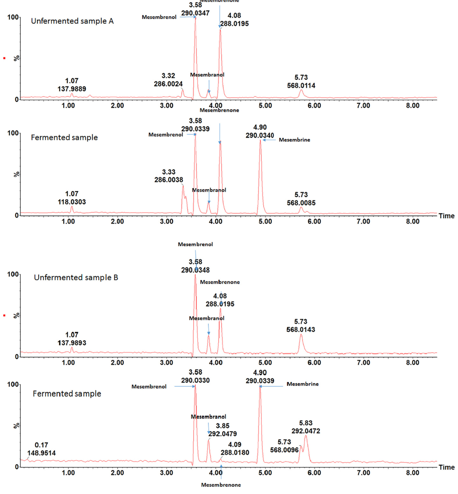
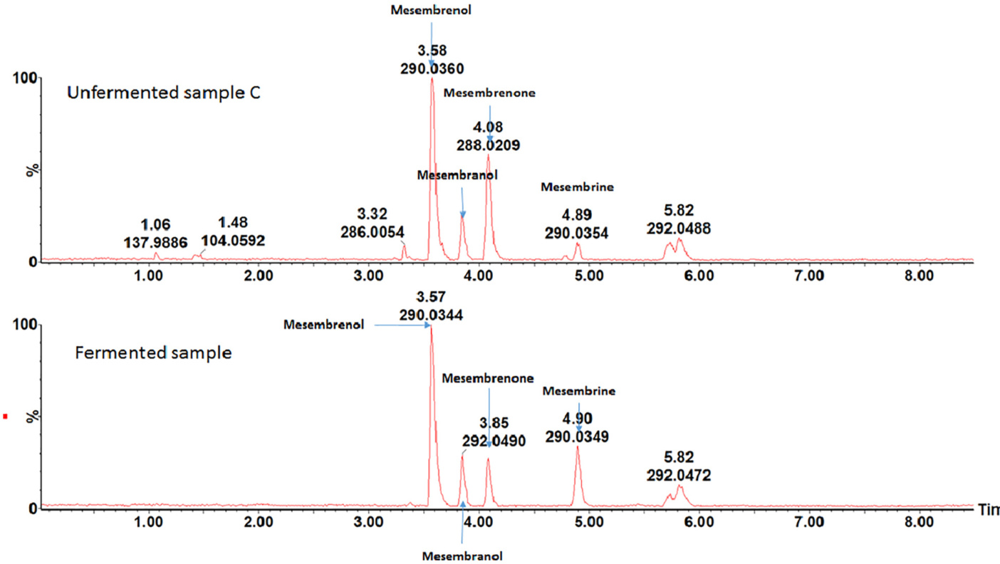

# To ferment or not to ferment Sceletium tortuosum – Do our ancestors hold the answer?

W. Chen a, A.M. Viljoen a,b,⁎

a Department of Pharmaceutical Sciences, Tshwane University of Technology, Private Bag X680, Pretoria 0001, South Africa b SAMRC Herbal Drugs Research Unit, Tshwane University of Technology, Private Bag X680, Pretoria 0001, South Africa

# a r t i c l e i n f o

# a b s t r a c t

Article history:   
Received 24 April 2018   
Received in revised form 26 August 2018   
Accepted 3 October 2018   
Available online 23 October 2018

Edited by B-E Van Wyk

Keywords:   
Sceletium tortuosum   
UPLC–MS   
Fermentation   
Mesembrine alkaloids

The KhoiSan of southern Africa have used fermented Sceletium tortuosum preparations to induce psychoactive effects for centuries. It is claimed that the fermentation process changes the alkaloid composition, thereby increasing the potency of the psychoactive response. In this study, a validated ultra performance liquid chromatography–mass spectrometry method was used to quantify the content of alkaloids prior to, and after the controlled fermentation of samples of S. tortuosum. The results revealed that, despite only a slight change in the mesembrenol and mesembranol content during fermentation, the mesembrine content increased significantly from not detected – 1.6 μg/mL to 7.40–20.8 μg/mL. A corresponding decrease was found in the initial mesembrenone content of 8.00–33.0 μg/mL to 1.30–32.7 μg/mL after fermentation. The total alkaloid content also increased as a result of fermentation.

© 2018 SAAB. Published by Elsevier B.V. All rights reserved.

# 1. Introduction

Sceletium tortuosum (L.) N.E.Brown, belonging to the family Mesembryanthemaceae, is an indigenous South African succulent (Van Wyk and Gericke, 2003). The KhoiSan people of southern Africa use the dried or fermented aerial plant parts, known locally as ‘Kanna’ (also ‘aka’, ‘channa’, ‘kougoed’) to elicit psychoactive effects (Smith et al., 1996; Gericke and Viljoen, 2008). Traditionally, Sceletiumderived kougoed was prepared by crushing fresh whole plant material between stones and storing it in canvas or skin bags for several days to allow the material to ferment. Currently, plastic bags are used instead (Smith et al., 1996; Van Wyk and Gericke, 2003). The fermentation process is thought to increase the potency of the psychoactive response by removing oxalates and retaining alkaloids (Smith et al., 1996). The psychoactive effects of S. tortuosum are associated with the presence of four mesembrine alkaloids (mesembrine, mesembranol, measembrenone, and mesembrenol), of which mesembrine has specifically shown high selectivity for the 5-HT transporter (Gericke and Viljoen, 2008; Harvey et al., 2011). Smith et al. (1998) investigated changes in the chemical composition of ‘Kanna’ after fermentation using the contemporary plastic bag method, followed by analysis using gas chromatography–mass spectrometry (GC–MS). They reported that the mesembrine alkaloid composition of the fermented material was similar to that of crushed and oven-dried (80 °C) material. However, the fermentation process was found to cause a marked decline in the levels of 4’-O-demethylmesembrenol and mesembrine, whilst the mesembrenone concentration increased significantly, when compared to the original unfermented sample. In a later study, Patnala and Kanfer (2009) compared, using high performance liquid chromatography–mass spectrometry (HPLC–MS) analysis, the initial concentrations of mesembrine and Δ7-mesembrenone to those present on the tenth day of a fermentation study. It was found that mesembrine was transformed to Δ7-mesembrenone, with the concentration of the former decreasing from 1.33 to 0.05% (w/w), whilst the latter increased from below the limit of quantitation to 0.11% (w/w). Roscher et al. (2012) applied non-aqueous capillary electrophoresis coupled to mass spectrometry (NACE–MS) to investigate qualitative changes in alkaloidal content following fermentation of plant samples. They reported that the alkaloid profile remained unchanged with regard to the specific alkaloids present, but that differences in the relative concentrations were evident following fermentation. All three research groups (Smith et al., 1998; Patnala and Kanfer, 2009; Roscher et al., 2012) concluded that the mesembrine levels declined or remained constant following fermentation. These findings cast doubt on claims that the traditional method of preparing ‘kanna’ through fermentation increases the potency of the material.

The aim of this study was to use a validated UPLC–MS method to determine qualitative and quantitative changes in the mesembrinetype alkaloid concentrations in S. tortuosum, before and after controlled fermentation, in an attempt to clarify the issue regarding the effect of fermentation on the psychoactive properties of the plant material.

  
Fig. 1. Chromatograms obtained from UPLC–MS analysis of extracts of three unfermented and fermented S. tortuosum plants.

# 2. Materials and methods

# 2.1. Sample preparation

Three fresh whole plants of Sceletium tortuosum were obtained from a commercial supplier and voucher specimens have been retained in the Department of Pharmaceutical Sciences (TUT). Each plant was divided into two equal parts by mass. One part was oven-dried at 40 °C, while the other was placed in a 250 mL beaker and bruised with a pestle. The beaker was sealed with aluminium foil before incubation at 37 °C (Scientific Series 2000, South Africa). After 10 days, 25.00 mL of ultra gradient methanol was added to the contents of the beaker and it was sonicated (ScienTech, South Africa) for 15 min. The mixture was subsequently filtered (Whatman No 1) into a roundball flask. The extraction was repeated and the resulting two filtrates were combined and concentrated on a rotary evaporator (Büchi, Switzerland) at 40 °C. The concentrated extracts resulting from the three samples were transferred to weighed 20 mL glass vials and dried in a Genevac centrifugal evaporator (SP Scientific, UK). The dried extracts were re-dissolved in methanol (1.00 mg/mL) and filtered through 0.2 μm syringe filters prior to UPLC–MS analysis. The unfermented sample was kept at ambient temperature (22 °C) and prepared using the same procedure on the same day.

  
Fig. 1 (continued).

# 2.2. UPLC–MS analysis

Fermented and unfermented samples were analysed using a Waters Acquity Ultra Performance Liquid Chromatographic system (Waters, Milford, MA, USA). The photodiode array detector (PDA) detector was used for quantitative determination of the four mesembrine alkaloids in the plant extracts, while the qToF-MS was used for confirmation of identification. The sample was introduced by a 1.0 μL full-loop injection. Separation of the sample constituents was achieved on an Acquity UPLC BEH C18 column (150 mm × 2.1 mm, i.d., 1.7 μm particle size, Waters) maintained at 30 °C. The mobile phase consisted of 0.1% ammonium hydroxide in water (Solvent A) and 90% acetonitrile (Solvent B) (Romil, USA) at a flow rate of 0.3 mL/min. Gradient elution was applied as follow: 80% A: 20% B to 60% A: 40% B in 2 min, changed to 50% A: 50% B in 4.5 min, and back to the initial ratio in 0.2 min. The equilibrium time was 1.8 min and the total run time was 8.5 min. Data were collected and processed by Masslynx 4.1 chromatographic software. The same column, elution gradient and flow rate were used for the UPLC– MS analysis. Mass spectrometry was carried out in the positive ion electrospray mode. Nitrogen was used as the desolvation gas at a flow rate of 500 L/h, while maintaining a desolvation temperature of 350 °C. The source temperature was 100 °C and the capillary and cone voltages were set to 3000 and 38 V, respectively. Data, collected over the range m/z 100 to 1000, were centroided during acquisition using independent reference lock-mass ions via the LockSprayTM interface to ensure mass accuracy and reproducibility.

Reference standards (mesembrenol, mesembranol, mesembrenone and mesembrine) were previously isolated from S. tortuosum using a combination of column chromatography and high speed countercurrent chromatography. Their purities were reaffirmed as described by Shikanga et al. (2011). The UPLC–MS method was validated as described in Shikanga et al. (2012a) for the quantitative determination of the four alkaloids in S. tortuosum raw materials by establishing the linearity, recovery and repeatability of the method in accordance with the ICH Guidelines (ICH Q2(R1), 2005)

# 3. Results and discussion

In this study, each plant was divided into two parts to determine the effect of fermentation on the concentrations of the mesembrine alkaloids. This was done to rule out any differences in the alkaloid profiles of individual plants. Plants with the same genetic traits were also used as replicates. In the study of Smith et al. (1998), three Sceletium plants were fermented, while a separate set of three Sceletium plants were used as the control. Owing to the variability of the mesembrine-type alkaloid content of individual Sceletium plants (Shikanga et al., 2012b), it may be more accurate to use a single plant to investigate the changes in alkaloids content between the fermented and unfermented samples.

Table 1 Four alkaloids expressed in μg/mL (n = 2).   

<html><body><table><tr><td>Sample ID</td><td>Mesembrenol</td><td>Mesembranol</td><td>Mesembrenone</td><td>Mesembrine</td><td>Total</td></tr><tr><td>A</td><td>35.2</td><td>nd</td><td>33.0</td><td>0.60</td><td>68.8</td></tr><tr><td>A (fermented)</td><td>33.4</td><td>1.20</td><td>32.7</td><td>20.8</td><td>88.1</td></tr><tr><td>B</td><td>13.9</td><td>1.40</td><td>8.00</td><td>nd</td><td>23.3</td></tr><tr><td>B (fermented)</td><td>11.6</td><td>1.70</td><td>1.30</td><td>7.40</td><td>22.0</td></tr><tr><td>C</td><td>43.5</td><td>4.50</td><td>22.8</td><td>1.60</td><td>72.4</td></tr><tr><td>C (fermented)</td><td>59.1</td><td>5.60</td><td>15.9</td><td>10.8</td><td>91.4</td></tr></table></body></html>

nd = not detected.

Table 2 A summary of method used and results obtained in this study and previous research (↑ = increase, ↓ = decrease).   

<html><body><table><tr><td>Reference</td><td>Material sourced</td><td>Study design</td><td>Material extracted</td><td>Fermentation procedure</td><td>Analytical method</td><td>Conclusion</td></tr><tr><td>Smith et al., 1998</td><td>University of Natal</td><td>Three plants were fermented,and compared to three unfermented plants.</td><td>Classical acid-base extraction.</td><td>Plants crused with soil, placed in a plastic bag and sealed to render it</td><td>GC-MS</td><td>↓ 4'-O-demethylmesembrenol {mesembrine</td></tr><tr><td>Patnala and Kanfer, 2009</td><td>Robertson (greenhouse)</td><td>HPLC analyses performed on day 1 immediately after crushing and the remaining material was analysed during a ten day fermentation period.</td><td>Extraction with methanol</td><td>air-tight. The arial parts crushed and transferred into a polythene bag and placed in sun light for 10</td><td>A validated HPLC-MS method.</td><td>↑mesembrenone ↓Mesembrine ↑△7- mesembrenone</td></tr><tr><td>Roscher et al., 2012</td><td>Kakteen Haage,Erfurt and Ruhlemann's Kräuter und Duftpflanzen, Hoerstedt, Germany</td><td>The whole plant harvested,crushed,and homogenised. An aliquot was stored in an airtight plastic container in the sun for 8 days,another aliquot was dried directly.</td><td>Extraction with methanol</td><td>days. Material stored in an airtight transparent plastic container in the sun for 8 days.</td><td>Non-aqueous capillary electrophoresis coupled to mass spectrometry</td><td>The general alkaloid profile remained unchanged, no quantitative data reported.</td></tr><tr><td>This study</td><td>Commercial supplier (Sou th Africa)</td><td>Each single plant was divided in two parts to rule out chemotypic variation (N= 3).</td><td>Material extracted with methanol</td><td>The arial parts were gently bruised, covered and placed in an incubator (40C) for7 days.</td><td>(NACE-MS). A validated UPLC-MS method.</td><td>↑ Mesenbrine ↓Mesembrenone</td></tr></table></body></html>

The UPLC–MS chromatograms obtained from analysis of three S. tortuosum plants, before and after fermentation, are presented in Fig. 1. Minor differences in the chemistry of the three plants are evident, in spite of genetically related material being used. For the same plant, the chemical profile of the fermented sample is similar to that of the unfermented sample when only considering the type of alkaloids present, but differences in their relative peak intensities can be observed. Using data from the reference standards and literature data, the large peak was identified as mesembrenol, while the other three major peaks were verified as mesembranol, mesembrenone and mesembrine. The intensities of mesembrenol and mesembranol remained almost constant, while the intensity of mesembrenone was significantly decreased (except for Plant A), while the intensity of mesembrine obviously increased upon fermentation. These results do not agree with the findings of Patnala and Kanfer (2009) who reported a decrease in the concentration of mesembrine, and a corresponding increase in that of Δ7-mesembrenone following fermentation.

We also investigated the quantitative changes in the alkaloid composition following fermentation, using a UPLC-PDA method that was validated. The linearity of the calibration curves over the concentration range (0.500–100 μg/mL) was confirmed by the high r2 values obtained (≥0.995). The limits of detection (LODs) for the four alkaloids were similar and ranged from 0.101 μg/mL (mesembranol) to 0.166 μg/mL (mesembrenone). With the exception of mesembranol (84.9%), the recoveries of the alkaloids were acceptable (96.7–103% recovery). These results indicate that the method is appropriate for the analysis of the S. tortuosum samples to determine the concentrations of the four alkaloids in the plant material. The concentrations of the four alkaloids present in the unfermented and fermented samples are presented in Table 1. Comparing the results of unfermented samples with fermented samples, it is evident that the concentrations of mesembrenol and mesembranol had changed to a small degree. However, the mesembrine content increased from not detected – 1.60 to 7.40–20.8 μg/mL, while the concentration of mesembrenone decreased from 8.00–33.0 to 1.30–32.7 μg/mL. The total alkaloid content also increased upon fermentation from 23.3–72.4 to 22.0–91.4 μg/mL.

Table 2 summarises the methods used and the results obtained from this and previous studies on the preparation of “kougoed”. As expected, different methods yielded different results (Table 2). It needs to be noted, that in this study, individual plants were divided in to two parts to rule out possible chomtypic variation in the experimental design. Furthermore, a validated analytical method was used to quantify the alkaloids pre- and post-fermentation. Admittedly, the samples size (n = 3)

in this preliminary investigation is small and more samples need to be included in future studies to allow for robust statistical relevant data.

The transformation of mesembrine to a non-specified mesembrenone was reported by Smith et al. (1998). This may explain the changes in alkaloid ratio and content. The results of this study confirmed the observation of Smith (1996) that the fermented method results in an increased content of mesembrine that is purported to cause the claimed biological activity/pharmacological effect. The findings of this study support the traditional application of fermentation by the KhoiSan to increase the psychoactive effects of S. tortuosum plant material.

# Acknowledgments

Authors are grateful to the National Research Foundation of South Africa (NRF/DST Research Chair programme), the South African Medical Research Council (SAMRC) and the Tshwane University of Technology for financial support.

# References

Van Wyk, B.-E., Gericke, N., 2003. People's Plants. Briza Publications, Pretoria.   
Gericke, N.P., Viljoen, A.M., 2008. Sceletium—a review update. Journal of Ethnopharmacology 119, 653–663.   
Harvey, A.L., Young, L.C., Viljoen, A.M., Gericke, N.P., 2011. Pharmacological actions of the South African medicinal and functional food plant Sceletium tortuosum and its principal alkaloids. Journal of Ethnopharmacolology 137, 1124–1129.   
International Conference of Harmonisation, 2005. ICH Harmonised Tripartite Guideline: Validation of Analytical Procedures: Text and Methodology Q2(R1). Geneva.   
Patnala, S., Kanfer, I., 2009. Investigations of the phytochemical content of Sceletium tortuosum following the preparation of “Kougoed” by fermentation of plant material. Journal of Ethnopharmacology 121, 86–91.   
Roscher, J., Posch, T.N., Pütz, M., Huhn, C., 2012. Forensic analysis of mesembrine alkaloids in Sceletium tortuosum by nonaqueous capillary electrophoresis mass spectrometry. Electrophoresis 33, 1567–1570.   
Shikanga, E.A., Viljoen, A., Combrinck, S., Marston, A., 2011. Isolation of Sceletium alkaloids by high-speed countercurrent chromatography. Phytochemistry Letters 4, 190–193.   
Shikanga, E.A., Kamatou, G.P.P., Chen, W., Combrinck, S., Viljoen, A.M., 2012a. Validated RP-UHPLC PDA and GC–MS methods for the analysis of psychoactive alkaloids in Sceletium tortuosum. South African Journal of Botany 82, 99–107.   
Shikanga, E.A., Viljoen, A.M., Combrinck, S., Marston, A., Gerick, N., 2012b. The chemotypic variation of Sceletium tortuosum alkaloids and commercial product formulations. Biochemical Systematics and Ecology 44, 364–373.   
Smith, M.T., Crouch, N.R., Gericke, N., Hirst, M., 1996. Psychoactive constituents of the genus Sceletium N.E.Br. and other Mesembryanthemaceae: a review. Journal of Ethnopharmacology 50, 119–130.   
Smith, M.T., Crouch, N.R., Hirst, M., 1998. The distribution of mesembrine alkaloids in selected taxa of the mesembryanthemaceae and their modification in the Sceletium derived Kougoed. Pharmaceutical Biology 36, 173–179.