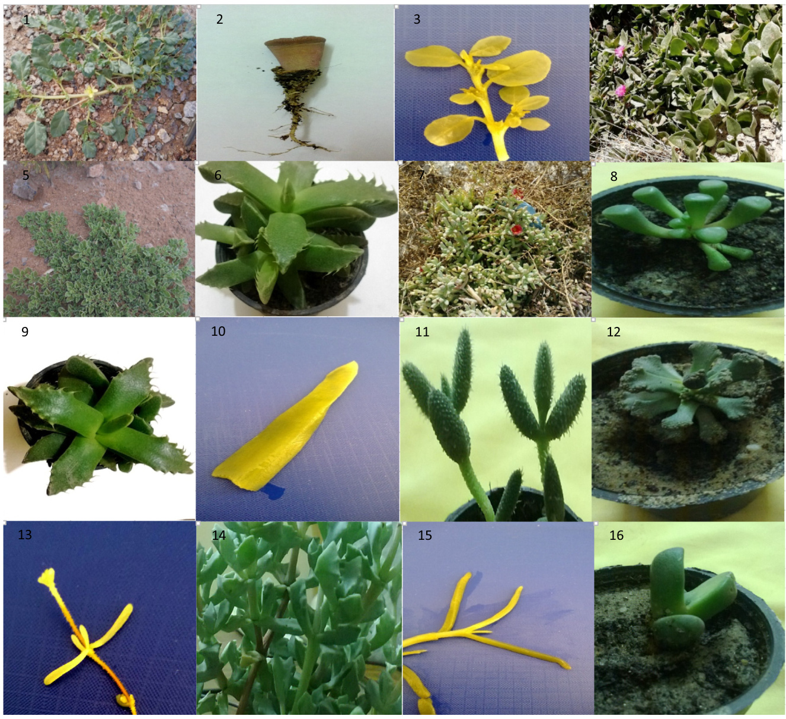
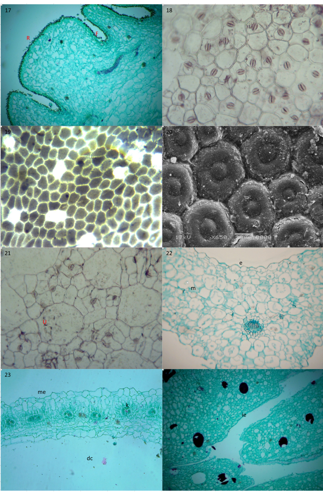
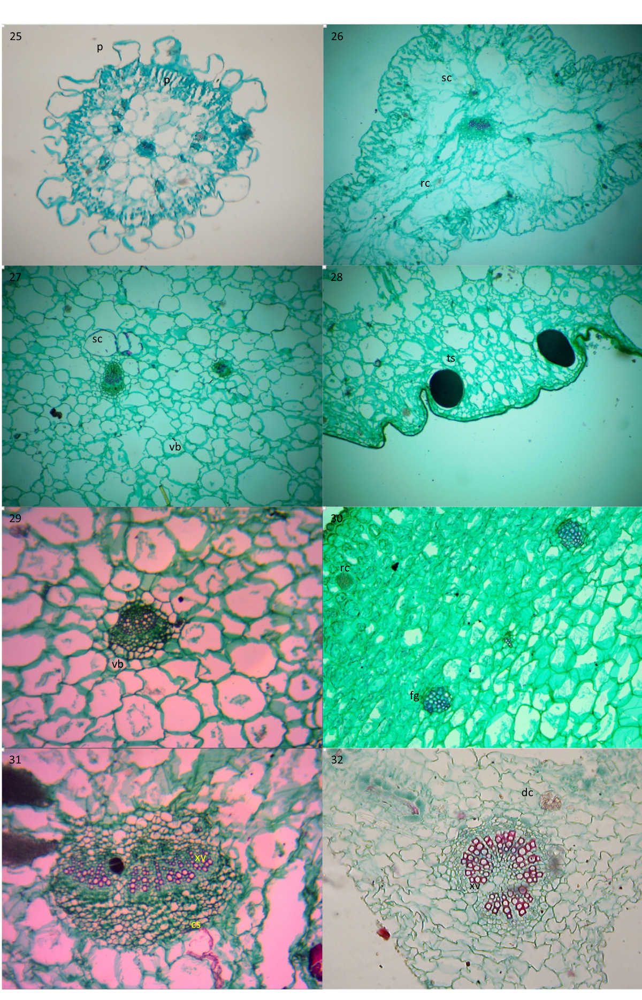
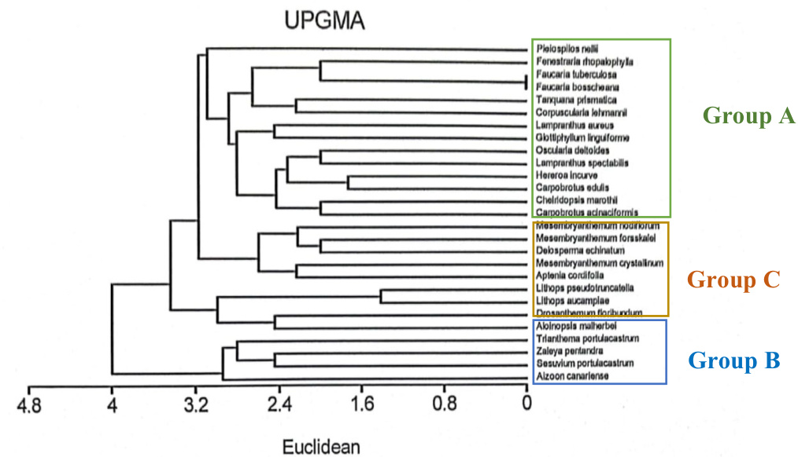

Original article

# Taxonomic significance of leaves in family Aizoaceae

Hany S. Abd El-Raouf a,b

a Biology Department, University College, Taif University, Turaba, Saudi Arabia b Agricultural Botany Department, Faculty of Agriculture, Al-Azhar University, Cairo, Egypt

# a r t i c l e i n f o

Article history:   
Received 8 September 2020   
Revised 11 October 2020   
Accepted 19 October 2020   
Available online 28 October 2020

Keywords:   
Aizoaceae   
Plant taxonomy   
Leaf morphology   
Leaf anatomy   
Numerical analyses

# a b s t r a c t

Aizoaceae is one of the most important and widespread succulent plant families in both tropical/subtropical regions and arid zones. In this study, 27 species were collected from various floristic regions in Egypt, Kingdom of Saudi Arabia and cactus farms (Kalupia – Egypt). The morphological characteristics of every taxon were recorded. The important morphological features included: the number of leaves per plant; leaf types; leaf position (cauline or radical; the latter indicates leaves arising from, or near, the roots); leaf arrangement; petiolate or sessile leaves; leaf sheath present or absent; leaf shape; leaf margin; leaf tip; presence of leaf ‘window area’; leaf texture; and presence of white or dark miniscule dots (white miniscule dots from calcium carbonate and dark miniscule dots from tannin sacs). The investigated anatomical features were as follows: shape of the transverse section; the type of epidermal cells; the presence of large epidermal cells (bladder cells); presence of papilla and simple hairs; presence of tannin sacs; shapes of calcium oxalate crystals; shape of the xylem vessels; and the presence of Kranz unit (the unit that constitutes the vascular bundle/s, parenchyma sheath, and surrounding mesophyll) or collenchyma sheath. All data were recorded in a data matrix (as either text or numerical data), which was used to construct the identification key and phylogeny tree using a multi-variate statistical package. The results of our analysis may open the possibility of using the morphological and anatomical features of leaves to distinguish between the subfamilies, genera, and species of Aizoaceae.

020 The Author(s). Published by Elsevier B.V. on behalf of King Saud University. This is an open access article under the CC BY-NC-ND license (http://creativecommons.org/licenses/by-nc-nd/4.0/).

# 1. Introduction

Aizoaceae Rudolphi is a family of flowering plants that comprises 143 genera and approximately 2300 species across the tropical and subtropical regions, primarily in the coastal or arid habitats. This family belongs to Centrospermae (Order: Caryophyllales) (Eckardt, 1976; Ehrendorfer, 1976). Aizoaceae sensu lato includes five groups: Aizoon group, Mesembryanthemum group, Tetragonia group, Sesuvium group, and Mollogo group (De Jussieu, 1789; De Candolle, 1828; Solereder, 1899; Müller, 1909; Bessey, 1915; Engler, 1924; Rendle, 1925; Lawrence, 1963; Thorne, 1968). Aizoaceae sensu stricto includes four of these groups, except for the Mollugo group (Horaninow, 1834;

Schwantes, 1960; Hutchinson, 1973; Takhtajan, 1980; Cronquist, 1981; Dahlgren, 1983; Hartmann, 2001). Aizoaceae sensu stricto can be divided into five subfamilies, Mesembryanthemoideae, Tetragonioideae, Sesuvioideae, Aizooideae, and Ruschioideae, which include 85% of their genera. Separation of the Mollugo group from the rest was previously investigated and recently supported by the Angiosperm Phylogeny Group (APG, 1998). The family Aizoaceae has synonymous names based on the regional occurrence of the genera and the delimitation of the groups or subfamilies (Bentham and Hooker, 1867; Sprengel, 1818; Wilson, 1932; Harvey and Sonder, 1826; Pax, 1889; Mabry, 1977). Most taxonomists have divided Aizoaceae depending on their reproductive organ characteristics (e.g., stamens and petals with stamineal origin, united or free; leafy bracts of inflorescences or not; nectar gland shape; placentation, and ovary position) (Bittrich and Hartmann, 1988). Morphological characteristics are features of external form or appearance, which are currently most used for practical plant identification, whereas some morphological characteristics are used for hypothesizing phylogenetic relationships. Morphological characteristics are easily observed and used in taxonomic keys and descriptions. Anatomical plant characteristics have been used for taxonomic purposes for over 150 years, and they are useful in both the practical identification and determination of phylogenetic relationships (Judd et al., 2016). The leaves of Aizoaceae species are opposite, rarely alternate, simple, free, or completely united into a single conical or spherical body, often sheathing to its stem. The leaves of individual species may be similar or different (homophyllous or heterophyllous). Some species show a peculiar vegetative form when their leaves reduce to a single annual pair of leaves, or they may be partly subterranean with only one clear window at each leaf tip exposed above the ground (Watson and Dallwitz, 1992) see Plate 1.

The anatomical features of Aizoaceae leaves were observed by Metcalfe and Chalk (1957), who described the types of their epidermis, stomata, hairs, mesophyll, and the shape of their crystals. In addition, Aizoaceae leaves were found to be characterized by thickenings and modified for water storage (Bhambie et al., 1977; Dioni, 2004). In some Aizoaceae species that exhibit the Crassulacean acid metabolism (CAM), mesophyll cells are not usually differentiated into palisade and spongy parenchyma (Kluge and Ting, 1978); there tends to be less free air space between the mesophyll cells of C3 and C4 plants than between the mesophyll cells of CAM plants (Luttge and Ball, 1977). Aizoaceae members include numerous ornamental species, such as Lampranthus, Dorotheanthus, Mesembryanthemum, Ruscia, and Carpobrotus. Some members, such as Tetragonia, are used as vegetables. This study aimed to use the morphological and anatomical characteristics of leaves as taxonomical evidence to clear describe the leaf characteristics of Aizoaceae species to attempt to divide the subfamilies and discrimination between genera and species depending on morphological and anatomical features of leaves.

# 2. Materials and methods

# 2.1. Plant materials

Fresh specimens used in this study were obtained from floristic regions in Egypt and the Kingdom of Saudi Arabia (KSA – Taif region). Cultivated species were collected from the international cactus farm (Egypt – Kaleuopia Governorate). In this study 27 species belonging to 21 genera of Aizoaceae, as shown in Table 1 investigated. The species Carpobrotus acinaciformis, collected from Marsa Matruh, El-Gharam Cleopatra Road (312201100N and 271302100E), has not been recorded to date in the Egyptian flora (Boulos, 1999; Ahmed, 2010); Abd El-Ghani et al., 2017), which observed for three consecutive years at different locations.

# 2.2. Plants identification

Identification of the collected plants was carried out by comparing their morphological, floral, and fruit characteristics with the characteristics of the previously identified plants as described in Täckholm (1974), Brian (1981), Boulos (1999), and Hartmann (2001).

# 2.3. Plants treatment

# 2.3.1. Treatment of fresh materials

The plants were fixed in (FAA solution) formalin-acetic acidalcohol (ethyl alcohol) for a minimum period of 48 h, after which their leaves were analyzed.

# 2.3.2. Morphological analysis

Morphological characteristics were observed according to the description by Hartmann (2001) and Harris and Harris (2001). The morphological characteristics of the whole plant were recorded directly from living specimens, then listed in the data matrix (the encoded information was either text or numerical data), and photographed.

# 2.3.3. Anatomical analysis

Leaf samples were prepared using the method described by Sass (1958), examined with a light microscope (Olympus CH2), and photographed using an eye piece digital camera (Premiere MA88). To determine the epidermis type, the epidermal peels of mature foliage leaves were bleaching in warm lactic acid and examined microscopically. Some samples were difficult to investigate using a light microscope, and in such cases, a scanning electron microscope (SEM) was used. In these cases, part of the leaf was coated using a gold squatter coater (Sp1-Module) and examined using a SEM (Jeol JSM-5500LV, JEOL Ltd., Japan) and a low vacuum mode at a magnification of 240–1000 , at the Regional Center of Mycology and Biotechnology, Cairo, Egypt. The analyzed anatomical characteristics are listed in the data matrix (Table 3) and their photographs are shown in Plates 2 and 3.

Table 1 The studied taxa, there region, habit, and subfamilies,i = International cactus farm Kaleuopia – Egypt, m = Marsa matruh – Egypt, t = Taif region Kingdom of Saudi Arabia (KSA).   

<html><body><table><tr><td>species</td><td>Subfamily</td><td>Habit</td><td>No.</td><td>Region</td></tr><tr><td>Aizoon canariense L.</td><td>Aizooideae</td><td>Wild</td><td>1</td><td>t</td></tr><tr><td>Aloinopsis malherbei (L.Bolus)</td><td>Ruschioideae</td><td>Ornamental</td><td>23</td><td>i</td></tr><tr><td>Aptenia cordifolia (L.F.) Schwantes</td><td>Mesembryanthemoideae</td><td>Ornamental</td><td></td><td>i</td></tr><tr><td>Carpobrotus acinaciformis (L.) L. Bolus</td><td>Ruschioideae</td><td>Wild</td><td>4</td><td>m</td></tr><tr><td>Carpobrotus edulis (L.) L. Bolus</td><td>Ruschioideae</td><td>Ornamental</td><td>5</td><td>i</td></tr><tr><td>Cheiridopsis marothii (NE Br.) R.F.Powell</td><td>Ruschioideae</td><td>Ornamental</td><td>6</td><td>i</td></tr><tr><td>Corpuscularia lehmannii(Ecklon and Zegher) Schwantes</td><td>Ruschioideae</td><td>Ornamental</td><td>7</td><td>i</td></tr><tr><td>Delosperma echinatum (Lamarck) Schwantes</td><td>Ruschioideae</td><td>Ornamental</td><td>8</td><td>i</td></tr><tr><td>Drosanthemum floribundum (Haw.) Schwantes</td><td>Ruschioideae</td><td>Ornamental</td><td>9</td><td>i</td></tr><tr><td>Faucaria bosscheana (A.Berger) Schwantes</td><td>Ruschioideae</td><td>Ornamental</td><td>10</td><td>i</td></tr><tr><td>Faucaria tuberculosa (Rolfe) Schwantes</td><td>Ruschioideae</td><td>Ornamental</td><td>11</td><td>i</td></tr><tr><td>Fenestraria rhopalophylla (Schlechte rand Diels) NE Br.</td><td>Ruschioideae</td><td>Ornamental</td><td>12</td><td>i</td></tr><tr><td>Glottiphyllum linguiforme (L.) NE Br.</td><td>Ruschioideae</td><td>Ornamental</td><td>13</td><td>i</td></tr><tr><td>Hereroa incurve L.Bolus</td><td>Ruschioideae</td><td>Ornamental</td><td>14</td><td>i</td></tr><tr><td>Lampranthus aureus (L.) NE Br.</td><td>Ruschioideae</td><td>Ornamental</td><td>15</td><td>i</td></tr><tr><td>Lampranthus spectabilis (Haw.) NE Br.</td><td>Ruschioideae</td><td>Ornamental</td><td>16</td><td>i</td></tr><tr><td>Lithops aucampiae L.Bolus</td><td>Ruschioideae</td><td>Ornamental</td><td>17</td><td>i</td></tr><tr><td>Lithops pseudotruncatella (A. Berger) NE Br.</td><td>Ruschioideae</td><td>Ornamental</td><td>18</td><td>i</td></tr><tr><td>Mesembryanthemum crystallinum L.</td><td>Mesembryanthemoideae</td><td>Wild</td><td>19</td><td>m</td></tr><tr><td>Mesembryanthemum forsskalei Hochst.</td><td>Mesembryanthemoideae</td><td>Wild</td><td>20</td><td>m</td></tr><tr><td>Mesembryanthemum nodiflorum L.</td><td>Mesembryanthemoideae</td><td>Wild</td><td>21</td><td>m</td></tr><tr><td>Oscularia deltoides (L.) Schwantes</td><td>Ruschioideae</td><td>Ornamental</td><td>22</td><td></td></tr><tr><td>Pleiospilos nellii Schwantes Sesuvium portulacastrum (L.) L. Etym</td><td>Ruschioideae</td><td>Ornamental</td><td>23</td><td>i</td></tr><tr><td></td><td>Sesuvioideae Ruschioideae</td><td>Ornamental</td><td>24</td><td>t</td></tr><tr><td>Tanquana prismatica (Schwantes) H.E.K.Hartmann and Liede</td><td></td><td>Ornamental</td><td>25 26</td><td>i</td></tr><tr><td>Trianthema portulacastrum L.</td><td>Sesuvioideae</td><td>Wild</td><td></td><td>t</td></tr><tr><td>Zaleya pentandra (L.) C. Jeffrey</td><td>Sesuvioideae</td><td>Wild</td><td>27</td><td>t</td></tr></table></body></html>

# 2.3.4. Data analysis

All recorded data are listed in the data matrix (Tables 2 and 3). The data from the matrix were analyzed using a multi-variate statistical package (MVSP), which is a technique used in numerical classification (Sneath and Sokal 1973). Similarity matrices were used for the construction of phylogeny tree using the unweighted pair-group method on arithmetic averages (UPGMA) (Nei, 1972). An indented key was constructed to distinguish between the Aizoaceae subfamilies and species (Subrahmanyam, 1995).

# 3. Results

# 3.1. Morphological investigation

The data in Table 2 and Fig. 1–16 show that, all examined taxa were with succulent leaves except Aizoon canariense, Trianthema portulacastrum, and Zaleya pentandra (Fig. 1). The genus Lithops differed from the others by species with one pair of leaves (Fig. 2). Moreover, a few taxa showed heterophyllous characteristics, e.g., Trianthema portulacastrum (Fig. 3). Most taxa, e.g., Trianthema portulacastrum, had cauline leaves (Fig. 3); however, a few taxa had radical leaves (leaves arising from, or near, the root), e.g., Lithops (Fig. 2). Regarding leaf arrangement, there were two forms: opposite in many taxa, such as Aptenia cordifolia (Fig. 4), or alternate in some taxa, e.g., Aizoon canariense (Fig. 5). In most examined taxa, the leaves were sessile e.g., Faucaria bosscheana, (Fig. 6), whereas a few taxa, e.g., Zaleya pentandra, had petiolate leaves (Fig. 1). The leaf base was connate in some taxa, e.g., Carpobrotus acinaciformis (Fig. 7), and it was not connate in others, such as Zaleya pentandra (Fig. 1). Two taxa, Aizoon canariense and Trianthema portulacastrum, had distinguished leaf sheaths (Fig. 3). Leaf shape showed wide differences among species, and 12 shapes were recorded: (1) clavate, e.g., Fenestraria rhopalophylla (Fig. 8); (2) conical, e.g., genus Lithops (Fig. 2); (3) cordate, e.g., Aptenia cordifolia (Fig. 4); (4) elliptic, e.g., Zaleya pentandra (Fig. 1); (5) keel, e.g., Faucaria tuberculosa (Fig. 9); (6) linear, e.g., Glottiphyllum linguiforme (Fig. 10); (7) obovate, e.g., Trianthema portulacastrum (Fig. 3); (8) ovate, e.g., Delosperma echinatum (Fig. 11); (9) semi globose, e.g., Pleiospilos nellii (Table 2); (10) spathulate, e.g., Aloinopsis malherbei (Fig. 12); (11) terete, e.g., Drosanthemum floribundum (Fig. 13); and (12) triangular, e.g., Carpobrotus acinaciformis (Fig. 7). Three types of leaf margins were recorded: entire in most taxa, e.g., Aptenia cordifolia (Fig. 4), dentate in several taxa, e.g., Oscularia deltoids (Fig. 14), and spiny (prickles) in two Faucaria species, (Fig. 6 and 9). The leaf tip was acute in many taxa, such as Aizoon canariense (Fig. 5), and obtuse or truncate in others, such as Trianthema portulacastrum (Fig. 3) and Lithops (Fig. 2), respectively. Some Aizoaceae members were distinguished from others by ‘window areas’, which contained transparent parenchyma cells that allowed light to pass into the chlorenchyma cells.

  
Plate 1. included figures 1–16, which showing some important morphological features: 1- Zaleya pentandra, 2- Lithops aucampiae, 3- Trianthema portulacastrum, 4- ptenia cordifolia, 5- Aizoon canariense, 6- Faucaria bosscheana, 7- Carpobrotus acinaciformis, 8- Fenestraria rhopalophylla, 9- Faucaria tuberculosa, 10- Glottiphyllum linguiforme 1- Delosperma echinatum, 12-Aloinopsis malherbei, 13- Drosanthemum floribundum, 14- Oscularia deltoids, 15- Lampranthus aureus and 16- Tanquana prismatica.

This characteristic was recorded in only three taxa, Fenestraria rhopalophylla, Lithops aucampiae, and Lithops pseudotruncatella (Fig. 2). The leaf texture could be divided into five categories: echinate, only in Delosperma echinatum (Fig. 11); farinose, only in Aloinopsis malherbei (Fig. 12); gloucous, in some of the examined taxa, such as Carpobrotus acinaciformis (Fig. 7); papillate, in a few taxa, such as Drosanthemum floribundum (Fig. 13); and smooth, in most taxa, such as Lampranthus aureus (Fig. 15). Miniscule white dots were clearly observed in Aloinopsis malherbei (Table 2), whereas miniscule dark dots were observed in Pleiospilos nellii (Table 2). Some of the examined taxa were distinguished from the others by triquetrous leaves, such as in the case of Tanquana prismatica (Fig. 16).

3.1.1. List of morphological recorded characters 1- leaf, succulent + / not so – 2- leaves number, one pair + / more than one pair 3- heterophyllus, present +/ absent – 4- leaf, cauline + / radical – 5- leaf arrangement, opposite + / alternate - / if inapplicable \* 6- leaf, petiolate + / sessile – 7- leaf base, connate + / not so – 8- leaf sheath, present + / absent – 9- leaf shape, clavate 1; conical 2; cordate 3; elliptic 4; keel like

10- leaf margin, dentate 1; entire 2; and spiny 3. 11- leaf tip, acute 1; obtuse 2; and truncate 3. 12-windows area, present + / absent – 13- leaf texture, echinate 1; farinose 2; glaucouse 3; papillate 4;   
and smooth 5. 14- white tiny dots (pustules) (from calcium carbonate), pre  
sent + / absent 15- dark tiny dots (from tannin sacs), present + / absent – 16- leaf, triquetrous + / not so –

# 3.2. Anatomical investigation

The analyzed anatomical characteristics are summarized in Table 3 and illustrated in Plates 2 and 3.

# 3.2.1. Outline leaf shape

The transverse sections of 27 Aizoaceae taxa showed a high variability in the outline leaf shapes. There were five categories: triangle, as observed in most taxa, e.g., Cheiridopsis marothii; dorsiventral, which was present in some taxa, e.g., Trianthema portulacastrum; semi-circular (half circle), present in some taxa, e.g., Lithops aucampiae; centric, present in a few taxa, e.g., Drosanthemum floribundum; and three-armed, observed only in Carpobrotus edulis.

# 3.2.2. Epidermis

three taxa, Carpobrotus acinaciformis, Pleiospilos nellii, and Lithops pseudotruncatella, were distinguished from others by furrows on their epidermal surface (Fig. 17). The recorded epidermis types were: normal type (isodiametric epidermal cells, polygonal, outer wall at most slightly sinuous), which was observed in most of the examined taxa, e.g., Sesuvium portulacastrum (Fig. 18); conophytum type (epidermal cells externally covered by a very thick, flat, continuous layer of cuticle extending over the entire surface except the stomata), which was recorded in few taxa, e.g., Aloinopsis malherbei (Fig. 19); lithops type (epidermal cells externally protected by a thick layer of cuticle-forming, rounded, blunt papillae over individual epidermal cells), which was only observed in Lithops species (Fig. 20); and the last type of epidermis in which a proportion of epidermal cells was united in groups that were collectively much larger than the remaining epidermal cells (this type was only noticed in Aptenia cordifolia) (Fig. 21). Large epidermal cells (bladder cells) included water storage cells, such as Aptenia cordifolia (Fig. 22). Most examined taxa had a simple epidermis, except for two taxa that had a multiplicative epidermis, Zaleya pentandra and Trianthema portulacastrum (Fig. 23). Rare taxa with large mesophylls e.g., Lithops pseudotruncatella, were distinguished from others by the presence of internal epidermal cells in short layers (Fig. 24). Two forms of trichomes were noticed: papillae, e.g., in Mesembryanthemum nodiflorum (Fig. 25), and simple hairs, e.g., in Delosperma echinatum (Table 3).

Table 2 Data matrix for 27 taxa and there 16 recorded morphological characters.   

<html><body><table><tr><td rowspan="2">Taxa</td><td colspan="10">characters</td><td colspan="7"></td></tr><tr><td></td><td>2</td><td>3</td><td>4</td><td>5</td><td>6</td><td>7</td><td>8</td><td>9</td><td></td><td>10</td><td>11</td><td>12</td><td>13</td><td>14</td><td>15</td><td>16</td></tr><tr><td>Aizoon canariense</td><td>1</td><td></td><td>1</td><td>+</td><td>1</td><td>+</td><td>1</td><td>+</td><td>10 10</td><td></td><td>2 2</td><td></td><td></td><td></td><td></td><td></td><td>1</td></tr><tr><td>Aloinopsis malherbei</td><td>+</td><td>1 1</td><td>1</td><td>1</td><td>+</td><td>1</td><td>1</td><td>1</td><td></td><td></td><td></td><td></td><td>1 1</td><td>5 2</td><td>1 +</td><td>1 1</td><td>1</td></tr><tr><td>Aptenia cordifolia</td><td>+</td><td>1</td><td>1</td><td>+</td><td>+</td><td>+</td><td>1</td><td>1</td><td>3</td><td></td><td></td><td></td><td>1</td><td>5</td><td>1</td><td>1</td><td>1</td></tr><tr><td>Carpobrotus acinaciformis</td><td>+</td><td>1</td><td>1</td><td>+</td><td>+</td><td>1</td><td>+</td><td>1</td><td>12</td><td></td><td></td><td></td><td>1</td><td>3</td><td>1</td><td>1</td><td>+</td></tr><tr><td>Carpobrotus edulis</td><td>+</td><td>1</td><td>1</td><td>+</td><td>+</td><td>1</td><td>+</td><td>1</td><td>12</td><td></td><td></td><td></td><td></td><td>5</td><td>1</td><td>1</td><td>+</td></tr><tr><td>Cheiridopsis marothii</td><td>+</td><td>1</td><td>1</td><td>+</td><td>+</td><td>1</td><td>+</td><td>1</td><td></td><td></td><td></td><td></td><td>1 1</td><td>3</td><td>1</td><td>+</td><td>+</td></tr><tr><td>Corpuscularia lehmannii</td><td>+</td><td>一</td><td>1</td><td>+</td><td>+</td><td>1</td><td>+</td><td>1</td><td>12</td><td></td><td></td><td></td><td>1</td><td>5</td><td>+</td><td>1</td><td>+</td></tr><tr><td>Delosperma echinatum</td><td>+</td><td>1</td><td>1</td><td>+</td><td>+</td><td>1</td><td>1</td><td>1</td><td>5 8</td><td></td><td></td><td></td><td></td><td>1</td><td>1</td><td>1</td><td>1</td></tr><tr><td>Drosanthemum floribundum</td><td>+</td><td>1</td><td>1</td><td>+</td><td>+</td><td>1</td><td>1</td><td>1</td><td>11</td><td></td><td></td><td></td><td></td><td>4</td><td>1</td><td>1</td><td>1</td></tr><tr><td>Faucaria bosscheana</td><td>+</td><td>1</td><td>1</td><td>+</td><td>+</td><td>1</td><td>1</td><td>1</td><td>5</td><td></td><td></td><td></td><td></td><td>5</td><td>+</td><td>1</td><td>+</td></tr><tr><td>Faucaria tuberculosa</td><td>+</td><td>1</td><td>1</td><td>+</td><td>+</td><td>1</td><td>1</td><td>1</td><td>5</td><td></td><td></td><td></td><td></td><td>5</td><td>1</td><td>+</td><td>+</td></tr><tr><td>Fenestrariarhopalophylla</td><td>+</td><td>1</td><td>1</td><td>+</td><td>+</td><td>1</td><td>1</td><td>1</td><td>1</td><td></td><td></td><td></td><td></td><td>5</td><td>1</td><td>1</td><td>1</td></tr><tr><td>Glottiphyllum linguiforme</td><td>+</td><td>1</td><td>1</td><td>+</td><td>+</td><td>1</td><td>+</td><td>一</td><td>6</td><td></td><td></td><td></td><td></td><td>5</td><td>1</td><td>1</td><td>1</td></tr><tr><td>Hereroa incurve</td><td>+</td><td>1</td><td>1</td><td>+</td><td>+</td><td>1</td><td>1</td><td>一</td><td>12</td><td></td><td></td><td></td><td></td><td>5</td><td></td><td>+</td><td>+</td></tr><tr><td>Lampranthus aureus</td><td>+</td><td>1</td><td>1</td><td>+</td><td>+</td><td>1</td><td>+</td><td>1</td><td>12</td><td></td><td></td><td></td><td></td><td>5</td><td>1 1</td><td>1</td><td>+</td></tr><tr><td>Lampranthus spectabilis</td><td>+</td><td>1</td><td>1</td><td>+</td><td>+</td><td>1</td><td>+</td><td>1</td><td>12</td><td></td><td></td><td></td><td></td><td>5</td><td>+</td><td>1</td><td>+</td></tr><tr><td>Lithops aucampiae</td><td>+</td><td>+</td><td>1</td><td>1</td><td>*</td><td>1</td><td>+</td><td>一</td><td>2</td><td></td><td></td><td></td><td></td><td>3</td><td>1</td><td>1</td><td>1</td></tr><tr><td>Lithopspseudotruncatella</td><td>+</td><td>+</td><td>1</td><td>1</td><td>*</td><td>1</td><td>+</td><td>1</td><td>2</td><td></td><td></td><td></td><td></td><td>3</td><td>1</td><td>1</td><td>1</td></tr><tr><td>Mesembryanthemumcrystallinum</td><td>+</td><td>1</td><td>+</td><td>+</td><td>+</td><td>+</td><td>1</td><td>1</td><td>7-10</td><td></td><td></td><td>1-2</td><td></td><td>4</td><td>1</td><td>1</td><td>1</td></tr><tr><td>Mesembryanthemum forsskalei</td><td>+</td><td>1</td><td>+</td><td>+</td><td>+</td><td>1</td><td>1</td><td>1</td><td>2-11</td><td></td><td></td><td></td><td></td><td>4</td><td>1</td><td>1</td><td>1</td></tr><tr><td>Mesembryanthemum nodiflorum</td><td>+</td><td>1</td><td>+</td><td>+</td><td>+</td><td>1</td><td>1</td><td>1</td><td>6-11</td><td></td><td></td><td></td><td></td><td>3</td><td>1</td><td>1</td><td>+</td></tr><tr><td>Oscularia deltoides</td><td>+</td><td>1</td><td>1</td><td>+</td><td>+</td><td>1</td><td>1</td><td>1</td><td>5</td><td></td><td></td><td></td><td></td><td>3</td><td>1</td><td>1</td><td>+</td></tr><tr><td>Pleiospilos nellii</td><td>+</td><td>1</td><td>1</td><td>1 +</td><td>* +*</td><td>1 +</td><td>+ +</td><td>1 1</td><td>9 4</td><td></td><td></td><td></td><td></td><td>5 5</td><td>1 1</td><td>+</td><td>+</td></tr><tr><td>Sesuvium portulacastrum</td><td>+</td><td>1</td><td>1 1</td></table></body></html>

5; linear 6; obovate 7; ovate 8; semi globose 9; spathulate 10; terete 11; and triangular 12.

  
Plate 2. included Figures 17–24, which showing some important anatomical features: 17- Lithops pseudotruncatella(40X), 18- Sesuvium portulacastrum(100X),19- Aloinopsis malherbei(100X), 20- Lithops aucampiae(650X), 21- Aptenia cordifolia(Epidermal peel-100X), 22– Aptenia cordifolia (transvers section100X), 23– Trianthema portulacastrum(100X), 24- Lithops pseudotruncatella(40X). Abbreviations: R = ridge, F = furrow, u = united cells, e = epidermis, m = mesophyll, me = multiplicative epidermis, k = kranz unite, dc = druses crystals, ie = internal epidermis.

  
Plate 3. included Figures 25–32, which showing some important anatomical features:25- Mesembryanthemum nodiflorum(40X), 26- Lampranthus aureus(100X), 27- Faucaria tuberculosa(100X), 28- Carpobrotus edulis(100X), 29- Tanquana prismatica(100X), 30- Lithops pseudotruncatella(100X), 31- Carpobrotus edulis(100X), 32– Trianthem portulacastrum(100X). Abbreviations: p = papilla, sc = storage cells, rc = raphides crystals, vb = vascular bundles, ts = tannin sacs, xv = xylem vessels, cs = collenchyma sheath

# 3.2.3. Mesophyll

The mesophyll tissue was homogenous in most of the examined taxa, e.g., Aptenia cordifolia (Fig. 22), whereas it was heterogenous in a few taxa, e.g., Lampranthus aureus (Fig. 26). The mesophyll was connective in most taxa, e.g., in Aptenia cordifolia and Lampranthus aureus (Fig. 22 and 26). Storage cells were present in most taxa, e.g., Faucaria tuberculosa (Fig. 27), whereas they were absent in several taxa, e.g., Trianthema portulacastrum (Fig. 23). Tannin sacs were observed in several taxa, e.g., Carpobrotus edulis (Fig. 28), whereas they were absent in most taxa, such as Tanquana prismatica (Fig. 29). Two shapes of calcium oxalate crystals were recorded: raphides, which were present in most taxa, e.g., Lampranthus aureus (Fig. 26), and druses, which were not common and were noticed in only four taxa, e.g., Trianthema portulacastrum (Fig. 23). Fiber groups had supportive tissue in nine taxa, e.g., Lithops pseudotruncatella (Fig. 30).

# 3.2.4. Vascular tissue

Vascular tissues characterized by a poorly developed phloem were observed in all the studied taxa. Vascular bundles were single in most of the examined taxa, such as Tanquana prismatica (Fig. 29), whereas they were grouped in some taxa, e.g., Faucaria tuberculosa (Fig. 27). The Kranz unit (the unit constituted by the vascular bundle/s, parenchyma sheath, and surrounding mesophyll) was recognized in C4 plants and recorded in three of the examined taxa, i.e., Zaleya pentandra, Sesuvium portulacastrum, and Trianthema portulacastrum (Fig. 23). Collenchyma sheaths were recorded in several taxa, e.g., Carpobrotus edulis (Fig. 31). Xylem vessels were arranged in clusters in all the examined taxa except Trianthema portulacastrum (Fig. 32), whose xylem vessels were circular in shape.

# 3.2.5. List of the recorded anatomical characters

1- outline shape, centric 1; dorsiventral 2; semi-circular 3; triangle 4; and three armed 5.

2- furrows, present + / absent –

3- type of epidermal cells, conophytum type 1; lithops type 2; normal type 3; and Aptenia type 4 4- large epidermal cells, present + / absent – 5- epidermis, simple + / multiplicative – 6- internal epidermis, present + / absent – 7- papilla, present + / absent – 8- simple hairs, present + / absent – 9- mesophyll, homogeneous +/ heterogeneous – 10- mesophyll, connective + / not so – 11- storage cells, present + / absent – 12- tannin sacs, present + / absent – 13- raphides crystals, present + / absent – 14- druses crystals, present + / absent – 15- fiber groups, present + / absent – 16- collenchyma in mesophyll, present + / absent - 17- vascular bundles, single + / groups – 18- kranz unite, present + / absent – 19- collenchyma sheath, present + / absent – 20- xylem vessels, in clusters + / not so –

# 4. Discussions

# 4.1. Morphological features

This study is in accordance with that of Boulos (1999), who reported that Aizoaceae leaves usually have the following characteristics: succulent, opposite, or alternate shapes; heterophyllous, such as in the case of the genus Mesembryanthemum; spathulate leaves such as in Aizoon canariense; sheathing membranes, e.g., connate in Trianthema portulacastrum; and rounded tips. He also indicated that Zaleya pentandra leaves may be elliptic or oblanceolate with obtuse to rounded tips. Moreover, Groen and Van der (1999), described the leaves belonging to the genus Faucaria as succulent leaves with flat upper sides, smooth or rough lower parts, keeled leaves, bristle-tipped teeth, and whitish dots. These observations are in accordance with those of Hartmann (2001), who reported that some Aizoaceae plants with a single pair of leaves were sometimes sunken into the ground. The results of the present study were also in accordance with those of Clak et al. (2015), who reported that the leaves of Cheiridopsis albaoculata were succulent and trigonous, with ‘window areas’ and connate sheath, keel shape, and dentate margins. Judd et al. (2016) reported the general features of Aizoaceae leaves as simple, opposite, entire, and succulent leaves.

Table 3 Data matrix for 27 taxa and there 20 recorded anatomical characters.   

<html><body><table><tr><td rowspan="2">taxa</td><td colspan="10">characters</td><td colspan="10"></td></tr><tr><td></td><td>2</td><td>3</td><td>4</td><td>5</td><td>6</td><td>7</td><td>8</td><td>9</td><td>10</td><td>11</td><td>12</td><td>13</td><td>14</td><td>15</td><td></td><td>16</td><td>17</td><td>18</td><td>20</td></tr><tr><td>Aizoon canariense</td><td>2</td><td>1</td><td>3</td><td>+</td><td>+</td><td>1</td><td></td><td></td><td></td><td></td><td></td><td></td><td></td><td></td><td></td><td>1</td><td>+</td><td>1</td><td>+</td><td>+</td></tr><tr><td>Aloinopsis malherbei</td><td>3</td><td>1</td><td>1</td><td>1</td><td>+</td><td>1</td><td>1 1</td><td>1 1</td><td>1 +</td><td>+ +</td><td>1 +</td><td>1 +</td><td>1 +</td><td>+ 1</td><td>1 +</td><td>1</td><td></td><td>1</td><td></td><td>+</td></tr><tr><td>Aptenia cordifolia</td><td>2</td><td>1</td><td>4</td><td>+</td><td>+</td><td>1</td><td>1</td><td>1</td><td>+</td><td>+</td><td>+</td><td>1</td><td>+</td><td>1</td><td>1</td><td>1</td><td>1 +</td><td>1</td><td>1 +</td><td>+</td></tr><tr><td>Carpobrotus acinaciformis</td><td>4</td><td>+</td><td>3</td><td>1</td><td>+</td><td>1</td><td>1</td><td>1</td><td>+</td><td>+</td><td></td><td>1</td><td>+</td><td>1</td><td></td><td></td><td>+</td><td></td><td>+</td><td>+</td></tr><tr><td>Carpobrotus edulis</td><td>5</td><td>1</td><td>1</td><td>1</td><td>+</td><td>1</td><td>1</td><td>1</td><td>+</td><td>+</td><td></td><td>+</td><td>+</td><td>1</td><td>__</td><td>--</td><td>+</td><td>--</td><td>+</td><td>+</td></tr><tr><td>Cheiridopsis marothii</td><td>4</td><td>1</td><td>3</td><td>1</td><td>+</td><td>1</td><td>1</td><td>1</td><td>+</td><td>+</td><td>+ +</td><td>+</td><td>+</td><td>1</td><td>1</td><td>1</td><td>+</td><td>1</td><td>+</td><td>+</td></tr><tr><td>Corpuscularia lehmannii</td><td>4</td><td>1</td><td>3</td><td>1</td><td>+</td><td></td><td>1</td><td>1</td><td>+</td><td>+</td><td></td><td></td><td>+</td><td>1</td><td>+</td><td>1</td><td>1</td><td>1</td><td>1</td><td>+</td></tr><tr><td>Delosperma echinatum</td><td>1</td><td>1</td><td>3</td><td>+</td><td>+</td><td>1</td><td></td><td>+</td><td>+</td><td>+</td><td></td><td></td><td></td><td></td><td>1</td><td>1</td><td>+</td><td>1</td><td>1</td><td>+</td></tr><tr><td>Drosanthemum floribundum</td><td>1</td><td>1</td><td></td><td>+</td><td>+</td><td>1</td><td></td><td>1</td><td>+</td><td></td><td></td><td></td><td></td><td></td><td>1</td><td>1</td><td>1</td><td>1</td><td>1</td><td>+</td></tr><tr><td>Faucaria bosscheana</td><td>4</td><td>1</td><td>1</td><td>1</td><td>+</td><td>1</td><td>+</td><td></td><td>+</td><td></td><td></td><td></td><td></td><td></td><td></td><td>1</td><td></td><td>1</td><td></td><td>+</td></tr><tr><td>Faucaria tuberculosa</td><td>4</td><td>1</td><td>1</td><td>1</td><td>+</td><td>1 1</td><td>1 1</td><td>1 1</td><td>+</td><td>+ +</td><td></td><td></td><td></td><td></td><td>+ +</td><td>1</td><td>1 1</td><td>1</td><td>1 1</td><td>+</td></tr><tr><td>Fenestrariarhopalophylla</td><td>4</td><td>1</td><td>1</td><td>1</td><td>+</td><td>1</td><td>1</td><td>1</td><td>+</td><td>+</td><td></td><td></td><td></td><td></td><td>+</td><td>1</td><td>1</td><td>1</td><td>1</td><td>+</td></tr><tr><td>Glottiphyllum linguiforme</td><td>2</td><td>1</td><td>3</td><td>1</td><td>+</td><td></td><td></td><td></td><td></td><td></td><td></td><td></td><td></td><td></td><td></td><td>1</td><td>+</td><td>1</td><td>1</td><td>+</td></tr><tr><td>Hereroa incurve</td><td>4</td><td>1</td><td>1</td><td>1</td><td>+</td><td>1</td><td></td><td>1</td><td>1 +</td><td>+</td><td></td><td></td><td></td><td></td><td>1</td><td>+</td><td>+</td><td>1</td><td>+</td><td>+</td></tr><tr><td>Lampranthus aureus</td><td>4</td><td>1</td><td>3</td><td>1</td><td>+</td><td>1</td><td>1 1</td><td>1 一</td><td>1</td><td>+ +</td><td></td><td></td><td>+ +</td><td>1</td><td>+ 1</td><td>1</td><td>+</td><td>1</td><td>1</td><td>+</td></tr><tr><td>Lampranthus spectabilis</td><td>4</td><td>1</td><td>1</td><td>1</td><td>+</td><td>1</td><td>1</td><td>一</td><td>+</td><td>+</td><td></td><td></td><td>+</td><td>1</td><td>1</td><td>1</td><td>+</td><td>1</td><td>1</td><td>+</td></tr><tr><td>Lithops aucampiae</td><td>3</td><td>1</td><td>2</td><td>1</td><td>+</td><td>一</td><td>+</td><td>一</td><td>+</td><td>+</td><td></td><td></td><td>+</td><td></td><td>+</td><td>1</td><td>1</td><td>1</td><td>1</td><td>+</td></tr><tr><td>Lithopspseudotruncatella</td><td>3</td><td>+</td><td>2</td><td>1</td><td>+</td><td>+</td><td>+</td><td>一</td><td>+</td><td>+</td><td></td><td></td><td>+</td><td>1</td><td>+</td><td>1</td><td>1</td><td>1</td><td>1</td><td>+</td></tr><tr><td>Mesembryanthemumcrystallinum</td><td>2</td><td>1</td><td>3</td><td>+</td><td>+</td><td>1</td><td>+</td><td>一</td><td>-</td><td>+</td><td>+ +</td><td>1 1</td><td>+</td><td>1 1</td><td>1</td><td>1</td><td>+</td><td>1</td><td>+</td><td>+</td></tr><tr><td>Mesembryanthemum forsskalei</td><td>3 1</td><td>1</td><td>3</td><td>1</td><td>+</td><td>1</td><td>+</td><td>一</td><td>+</td><td>+</td><td></td><td></td><td>+</td><td>1</td><td>1</td><td>1</td><td>+</td><td>1</td><td>1</td><td>+ +</td></tr><tr><td>Mesembryanthemumnodiflorum Oscularia deltoides</td></table></body></html>

# 4.3. Based on the observed morphological and anatomical features, indented key has been constructed to allow distinguishing the subfamilies and species

# 4.2. Anatomical features

This study complements with the observations of Metcalfe and Chalk (1957), who reported that the leaves of the Aizoaceae species were centric or dorsiventral, present of aqueous tissue in the epidermis at the leaf apex of Lithops, also presence of palisade tissue, tannin sacs, water storage tissue and raphides crystals. They also recorded presence of chlorenchymatous bundle sheath (Kranz unite) in different Aizoaceae species. Opel (2005), observed calcium oxalate, tannin sacs and windows area in Conophytum. Muhaidat and Mc Kown (2013), reported the presence of large epidermal cells in Aizoaceae leaves, also they observed individual vascular bundles in Trianthema and Zaleya. Bohley et al. (2015 & 2019), demonstrated the presence of chlorenchymatous bundle sheath in different species. Bohley et al. (2019), described a water storage tissue in Sesuvium sesuvioides.

# 4.3.1. Identification key to subfamilies

# 4.3.2. Identification key to subfamily: Ruschioideae

# 3.3.2.Identification key to subfamily:Ruschioideae

A- plant with one pair of leaf only,epidermal cells with lithops type a- furrows and internal epidermis absent Lithops aucampiae aa- furrows and internal epidermis present .Lithopspseudotruncatella   
B- plant with more than one pair of leaves b- leaf texture smooth bb- leaf base connate bb1- leaf not triquetrous 1- leaf clavate with windows area, tannin sacs present, vascular bundles single . Fenestrariarhopalophylla 2-leaf linear, windows area absent, tannin sac absent vascular bundles in groups . Glottiphyllum linguiforme bb2a- leaf triquetrous, triangular. 1- dark tiny dots present, epidermal cells conophytum type, tannin sacs present Lampranthus spectabilis 2- white tiny dots present, epidermal cells normal type,tannin sacs absent. .Lampranthusaureus 3- both dark and white tiny dots are absent Carpobrotus edulis

bbb- leaf base not connate bbb1- fiber groups and collenchyma sheath present . Hereroa incurve

bb2b- leaf triquetrous,keel like bb2b1- leaf margin spiny 1- dark tiny dots present Faucaria tuberculosa 2-dark tiny dots absent . Faucariabosscheana bb2b2- leaf margin entire 1-leaf, semi centric,dark tiny dots,tannin sacs, druses crystals present .Tanquanaprismatica 2-leaf triangle,dark tiny dots,tannin sacs druses crystals,absent Corpuscularialehmannii bb2c- leaf semi globose,entire,dark tiny dots present, epidermal cells normal type,druses crystals and fiber groups absent .Pleiospilos nelli

c1- leaf base connate,leaf triangular,entire,epidermal cells normal type 1- dark tiny dots and tannin sacs present Cheiridopsis marothii 2- dark tiny and tannin sacs absent Carpobrotus acinaciformis c2-leaf basenotconnate,leafkeel like,dentate,epidermalcelsconophytumtye.. .Oscularia deltoides   
d- leaf texture farinose,leaf spathulate,tannin sacs present ..Aloinopsis malherbei   
e- leaf texture echinate,leaf ovate,tannin sacs absent. Delosperma echinatum   
f- leaf texture papillate,leaf terete, tannin sacs absent.. .Drosanthemum floribundum

# 4.3.3. Identification key to subfamily: Mesembryanthemoideae

3.3.3.Identification key to subfamily:Mesembryanthemoideae

A- leaves heterophyllus, papillate,epidermal cells normal type a-leaves sessile,collenchyma sheath present al-leaves semi centric,large epidermal cells absent ..Mesembryanthemumforsskalei a2- leaves centric,large epidermal cells present ..M. nodiflorum b- leaves petiolate,dorsiventral ..M.crystallinum   
B-leaves homophyllous,cordate,acute,entire,smooth,papilla absent,epidermal cells aptenia type Aptenia cordifolia

4.3.4. Identification key to subfamily: Sesuvioideae

3.3.4.Identification key to subfamily: Sesuvioideae

A- leaves not succulent, mesophyll heterogenous not connected, storage cells absent a-leaves heterophyllus,alternate,leaves with sheath,druses crystals present xylem vessels in circulated shape . Trianthemaportulacastrum b-leaves homophyllous,opposite,leaf sheath absent, druses crystals absent xylem vessels in clusters Zaleya pentandra   
B-leaves succulent, opposite,mesophyll homogenous,connected,storage cells present Sesuvium portulacastrum

  
ig. 33. Phylogeny tree for 27 taxa of Aizoaceae depending on 16 morphological features and 20 anatomical feature

# 4.4. Numerical analysis

The morphological and anatomical characteristics shown in Tables 2 and 3 were used in the phenetic analysis. The phylogeny tree (Fig. 33) showed the clustering of the studied taxa based on their morphological and anatomical characteristics. The constructed phylogeny tree showed the following relationships:

Group A included ten genera belonging to the subfamily Ruschioideae. When distinguishing between two Faucaria species, the clusters in the phylogeny tree showed similarity between two species belonging to the genus. A clear difference was observed between the genera Lampranthus and Carpobrotus (Fig. 33 and identification key).

Group B included four taxa: the genus Aizoon, which represented the subfamily Aizooideae, and three genera that represented the subfamily Sesuvioideae (i.e., Sesuvium, Trianthema, and Zaleya). Studies have shown a clear similarity between the morphological features, i.e., leaf petiolate, leaf base, leaf margin, and leaf texture, of these two subfamilies (Table 2). Moreover, we also observed similarities in their anatomical features, such as dorsiventral leaves, types of epidermal cells, absent papilla, and the presence of druses (Table 3).

Group C contained all genera in the subfamily Mesembryanthemoideae and some genera belonging to the subfamily Ruschioideae (i.e., Delosperma, Lithops, Drosanthemum, and Aloinopsis). They showed morphological (e.g., succulent leaves and papilla) and anatomical similarities (e.g., tannin sacs, raphide crystals, and storage cells) (Tables 1 and 2).

The investigated taxa and characteristics indicated a possible similarity between the subfamilies Aizooideae and Sesuvioideae. There were also similarities between the subfamilies Ruschioideae and Mesembryanthemoideae. Similar results have been previously discussed by Bittrich and Hartmann (1988).

# 5. Conclusions

The present study confirmed the usefulness of certain leaf morphological and anatomical characteristics of some members of Aizoaceae for this classification. In total, 16 morphological characteristics and 20 anatomical characteristics were included in the data matrix that was used to construct the identification key and dendrogram. There was a potential of dependence on leaves. The present study covered 27 species belonging to four subfamilies:

Aizooideae (one species), Sesuviodeae (three species), Mesembryanthemoideae (four species), and Ruschioideae (19 species). Although this study found a morphological and anatomical similarity between Sesuvioideae and Aizooideae, more precise studies on the vegetative organs of Aizoaceae are still needed. This would establish clear borders between its subfamilies, especially after the inclusion of ornamental species.

# Declaration of Competing Interest

The authors declare that they have no known competing financial interests or personal relationships that could have appeared to influence the work reported in this paper.

# References

Abd El-Ghani, M., Salama, F., Salem, B., Al-Hadidy, A., Abdel-Aleem, M., 2017. Phytogeography of the Eastern desert flora of Egypt. Wulfenia 24, 79–120.   
Ahmed, A.D., 2010. Current situation of the flora and vegetation of the western Mediterranean desert of Egypt Ph.D. thesis Faculty of science. Tanta university, Egypt.   
APG (Angiosperm phylogeny group). 1998. An ordinal classification for the Families of flowering plants. Ann. Missouri Botan. Garden 85, 531–553.   
Bentham, G., Hooker, J.D., 1867. Genera Plantarum, I: 851–859. Reeve & Co, London.   
Bessey, C., 1915. The phylogenetic taxonomy of flowering plants. Annals of the Missouri Botanical Garden 2, 109–164.   
Bhambie, S., Joshi, M.C., Gupta, M.L., 1977. Anatomical studies on Certain members of Aizoaceae proceedings of the Indian Acad. Sci., 85B, 399–406.   
Bittrich, V., Hartmann, H.E.K., 1988. The Aizoaceae – a new approach. Botan. J. Linnean Soc. 97, 239–254.   
Bohley K., Olga J., Heidrun H., Rowan S., Sigrid L., and Gudrun, K., 2015. Phylogeny of Sesuvioideae (Aizoaceae). Biogeography, leaf anatomy and the evolution of C4 Photosynthesis. Perspect. Plant Ecol., Evol. Systemat., 17, 2, 116–130.   
Bohley, K., Till, S., Jürgen, K., Martha, L., and Gudrun, K., 2019. C4-like photosynthesis and the effects of leaf senescence on C4-like physiology in Sesuvium sesuvioides (Aizoaceae). J. Exper. Bot. 70, 5, 1553–1565.   
Brian, F., 1981. Lithops. Published by the National Cactus & Succulent society, Oxford.   
Boulos, L., 1999. Flora of Egypt, vol 1, Al Hadara publishing Cairo. Egypt. Pp, 44–49.   
Clak, C., Helma, N.A., Bruyns, P.V., 2015. Cheiridopsis alba-oculata (Aizoaceae: Ruschioideae, Ruschieae) A new quartz- endemic from Southern Namaqualand, South Africa. South African J. Bot. 96, 1–5.   
Cronquist, A., 1981. An Integrated System of Classification of Flowering Plants. Columbia University Press, New York.   
Dahlgren, R., 1983. General aspects of Angiosperm evolution and Macro systematics. Nordic J. Bot. 3, 119–149.   
DE Candolle, A.P., 1828. Prodromus Systematis Naturalis Regni Vegetabilis, Paris: ’l‘reuttel &Wiirtz.3 41 5-455.   
DE Jussieu, A.L., 1789. Genera plantarum, Paris 15, 312–317.   
Dioni, W., 2004. Aptenia cordifolia a short-illustrated monograph. WWW. microscopy-uk.org.uk/mag/artaug04/wdaptenia.html.   
Eckardt, T., 1976. Classical Morphological features of centrospermous families. Plant Systemat. Evol. 126, 5–25.   
Ehrendorfer, F., 1976. Closing remarks: systematics and evolution of centrospermous families. Plant Systemat. Evol. 126, 99–105.   
Engler, H.G.A., 1924. Syllabus der Pjanzenfamilien, 9th & 10th editions. Gebriider Borntraeger, Berlin.   
Groen, L.E. and Van, Der Maesen, L.J.G., 1999. Revision of the genus Faucaria (Ruschioideae: Aizoaceae) in South Africa. Bothalia 29, 1, 35–58.   
Harris, J.G., Harris, M.W., 2001. Plant identification Terminology. An illustrated glossary. Spring lake publishing, Spring lake, Utah.   
Hartmann, H.E.K., 2001. Illustrated handbook of succulent plants, Aizoaceae A-E. Aizoaceae F-Z, Springer, Berlin.   
Harvey, W.H., Sonder, O.W., 1862. Flora Capensis, 2, 386–479. Dublin: Hodges, Smith, and Co.   
Horaninow, P.F., 1834. Prima Lineae Systemis Naturae. St. Petersburg. Cited after Bogle 1970, 1.   
Hutchinson, J., 1973. The families of flowering plants,3rd ed. The Clarendon press, Oxford.   
Judd, W.S., Christopher, S., Campbell, E.A., Kellogg, P.F., Michael, J.D., 2016. Plant Systematics Phylogenetic Approach. Sinauer associates, Inc. publishers Sunder land, Massachusetts, USA.   
Kluge, M., Ting, I.P., 1978. Crassulacean Acid Metabolism. Analysis of an Ecological Adaptation, vol. 30. Springer-Verlag, Berlin-Heidelberg, pp. 70–74.   
Lawrence, G.H.M., 1963. Taxonomy of Vascular Plants. The MacMillan Company, New York.   
Luttge, U., Ball, E., 1977. Water Relations parameters of the CAM.plants Kalanchoe daigremontiana in relation to diurnal malate oscillation. Oecologia 31, 85–94.   
Mabry, T.J., 1977. The order Centrospermae. Ann. Missouri Botan. Garden 64, 210– 220.   
Metcalfe, C.R., Chalk, L., 1957. Anatomy of the dicotyledons. Clarendon press, Oxford UK, pp. 706–712.   
Muhaidat, R., Mc Kown, A., 2013. Significant involvement of PEP-CK in carbon assimilation of C4 eudicots. Ann. Bot. 111, 577–589.   
Müller, K., 1909. Beiträge Zur Systematik der Aizoaceae. Botansche Jahrbücher für Systematik,42. Beiblatt 97, Heft 3, 54–94.   
Nei, M., 1972. Genetic distance between population. Amer. Natur. 106 (949), 283.   
Opel, M.R., 2005. Leaf anatomy of Conophytum N. E. Br. (Aizoaceae). Haseltonia 11, 27–52.   
Pax, F., 1889. Aizoaceae. In A. Engler & K. Prantl (Eds), Die naturlichen Pjanzenfamilien, part 3 (I.b.): 33-51. Leipzig: W. Engelmann.   
Rendle, A.B., 1925. The classification of flowering plants. University Press, Cambridge.   
Sass, J.E., 1958. Botanical micro technique. The Iowa State univ. pressIowa.   
Schwantes, G., 1960. The Classification of the Mesembryanthemum in Jacobson, A handbook of succulent plants. Bland Ford PressLondon 3, 951–955.   
Solereder, H., 1899. Ficoideae. Systematische Analomie der Dicopledonen: Stuttgart: Ferdinand Enke, 468–473.   
Sprengel, K.P.J., 1818. Anleitung cur Xenntniss der Gewachse. Halle 2 (2), 842–845.   
Sneath, P.H., Sokal, R.R., 1973. Numerical Taxonomy: The Principles and Practice of Numerical Classificationes. W.H. Freeman Co., San Francisco.   
Subrahmanyam, N.S., 1995. Modern Plant Taxonomy. Sangam Books Ltd., 110007 Delhi, India, p. 187.   
Täckholm, V., 1974. Students flora of Egypt. . Cairo univ. book shop Cairo pp69–75.   
Takhtajan, A.L., 1980. Outline of the classification of flowering plants (Magnoliophyta). Botanical Review 46, 225–359.   
Thorne, R.F., 1968. Synopsis of a putatively phylogenetic classification of the flowering plants. Aliso 6, 57–66.   
Watson, L., and Dallwitz, M.J., 1992. The families of flowering plants, descriptions, illustrations, identification, and information retrieval. www.delta-intkey.com.   
Wilson, p., 1932. Tetragoniaceae. North American flora, 21 (4): 267-277 New York Botanical.