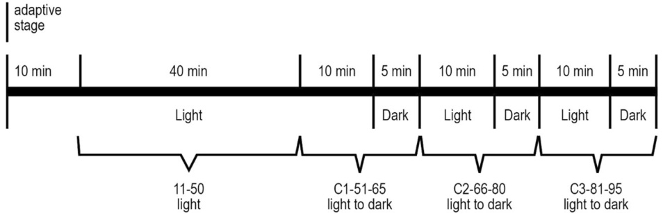
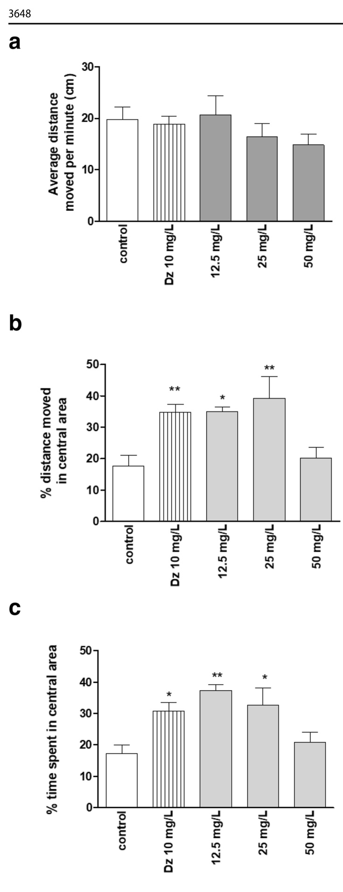
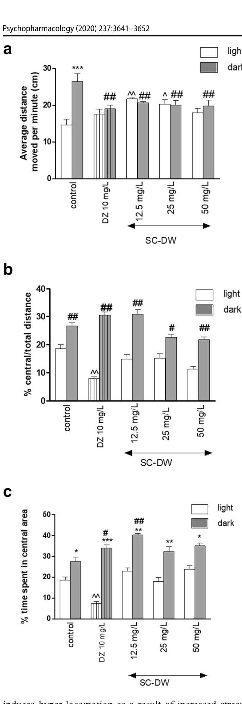

# Screening selected medicinal plants for potential anxiolytic activity using an in vivo zebrafish model

Veronica B. Maphanga1 & Krystyna Skalicka-Woźniak2 & Barbara Budzynska3 & Gill M. Enslin1 & Alvaro M. Viljoen1,4

Received: 12 July 2019 /Accepted: 13 August 2020 / Published online: 25 August 2020   
# Springer-Verlag GmbH Germany, part of Springer Nature 2020

# Abstract

Rationale Medicinal plants are used extensively in many countries to treat conditions related to the central nervous system (CNS), and there is renewed interest to explore natural products, which may exhibit CNS activity.

Objective In this study, seven plants were selected based on literature reports of their ethnopharmacological use in treating anxiety-related conditions and assayed in a zebrafish model.

Methods Crude extracts were prepared with solvents of different polarities, and the maximum tolerated concentration (MTC) of these crude extracts was established. The anxiolytic activity of the crude extracts was determined using 5-day post-fertilization (dpf) zebrafish larvae. General locomotor activity and reverse-thigmotaxis behavior (indicative of anxiolytic activity) were analyzed under continuous illumination and alternating light-dark challenges, which induced anxiety in the zebrafish larvae.

Results Of the 28 extracts tested, 13 were toxic according to the MTC values obtained. Larvae were subsequently treated with the 15 non-toxic extracts, at a dose determined in the MTC assay or with 1% DMSO as control. The anxiolytic activity (reversethigmotaxis) was demonstrated by an increase in the percentage time spent by the larvae in the central arena of the well. Of the 15 non-toxic extracts tested, the Sceletium tortuosum water extract exhibited the most promising anxiolytic activity.

Conclusions The zebrafish model was effective in studying anxiety-related behavior. Thus, the study confirmed that S. tortuosum mitigates anxiety in zebrafish larvae, a step towards the full in vivo validation of the traditional use of the plant.

Keywords Anxiety . Zebrafish model . Anxiolytic activity . Light-dark transitions

# Introduction

Anxiety is an intense or overwhelming feeling which threatens psychological and physical well-being (Sousa et al. 2015). When the feeling of anxiety continues far beyond the presence of the stimulus and disrupts normal functioning it is defined as an anxiety disorder. The intensity and duration may differ from one person to the other and reach a point where it affects normal daily functioning (Koda-Kimble et al. 2012). According to Romana and co-workers (Romana et al. 2017), the neurobiology of anxiety disorder is unknown. However, anxiety, like other psychiatric disorders including depression and mood disorders, is linked to neurotransmitter imbalances within the central nervous system (CNS). Four neurotransmitters play a major role in mood regulation; serotonin, dopamine, gamma-aminobutyric acid (GABA), and norepinephrine. The most widespread neurotransmitter is glutamate, which is assisted by three catecholamines, dopamine, epinephrine, and norepinephrine. Inhibitory neurotransmitters include GABA, glycine, and serotonin. GABA is a major inhibitory neurotransmitter, which assists neurons to recover after impulse transmission and in so doing reducing stress and anxiety, particularly after excessive stimulation.. Epinephrine and norepinephrine are also regulated by GABA in decreasing the excitability in the neural transmission chain (Romana et al. 2017). Anxiolytic drugs encompass a number of drug classes; the barbiturates are no longer used due to their narrow therapeutic index and potential for toxicity; benzodiazepines and their derivatives are commonly used to treat anxiety but also have undesirable effects such as sedation and their propensity to produce dependence; a third major class is the selective serotonin reuptake inhibitor (SSRI) drugs, but often initially worsen anxiety and have a delayed onset of action (Benneh et al. 2017).

Benzodiazepines, including alprazolam, lorazepam, and diazepam, remain a first line pharmacological anxiolytic treatment (Koda-Kimble et al. 2012). The target receptors for benzodiazepines are the γ-aminobutyric acid (GABAA) receptors present in the neuronal membranes in the CNS. At low doses benzodiazepines selectively enhance GABAergic transmission in the GABAA receptor, thereby inhibiting neuronal circuits in the limbic system of the brain (Finkel et al. 2009).

The SSRI drugs inhibit the serotonin transporter protein (5- HTT), the regulator of serotonergic neurotransmission, which is, as such, the main molecular target for these commonly used antidepressant drugs (Lesch et al. 1993). Inhibition of 5-HTT increases the serotonergic tone in the brain to regulate emotions (Thakker et al. 2005).

Available anxiety treatment is expensive, is very often not ideal due to side effects, and has to be individualized for every patient (Bandelow et al. 2008). There are an increasing number of individuals who prefer using complementary and alternative medicines in the treatment of physical and psychiatric symptoms (Van der Watt et al. 2008). Most patients believe that complementary medicines cause fewer side effects than allopathic medicines and complementary alternatives are often less expensive (Bandelow et al. 2008). Furthermore, traditional medicines are still an integral part of culture and customs in many countries, especially in the majority of African communities (Fennell et al. 2004). According to the World Health Organization (WHO) 2000, 70–95% of the population in developing countries still use traditional medicines. The knowledge of using traditional medicine has been passed on from one generation to the next based on cognitive features, ecological factors, and cultural history (Leonti 2011). These indigenous knowledge systems emphasize the advantages of ethnopharmacologically guided bioprospecting to conserve both the medicinal plant resources as well as the healerexpert cultural wisdom and to facilitate culturally relevant health promotion (Pesek et al. 2009).

A number of medicinal plants have been studied based on their putative anxiolytic activity and use in traditional medicine systems. Sceletium tortuosum (L.) N.E. Br. (Mesembryanthemaceae) enhances well-being and relieves anxiety, stress, or depression (Gericke and Viljoen 2008). Naringenin, a flavonoid isolated from Mondia whitei (Hook.f.) Skeels (Apocynaceae), displayed affinity for the GABAA- receptor, the same site at which benzodiazepines act (Stafford et al. 2008). The roots of Xysmalobium undulatum (L.) W.T. Aiton (Asclepiadaceae) are used by the Xhosa people to treat exaggerated or uncontrollable emotions (Nielsen et al. 2004; Stafford et al. 2008) and has been reported to have anti-depressant activity (Hutchings and Van Staden 1994).

Stress and anxiety can now be studied in the zebrafish model, which has been validated as a neurobehavioral science model (Kalueff et al. 2014). The zebrafish has been used for decades as an animal model for biomedical research, especially in developmental and genetic studies (Zon and Peterson 2005). The zebrafish, which has shares a highly homologous genome with vertebrate species (rodents and humans), as well as brain modeling, structure, and function, provides the added advantages of high fecundity, small size and allows rapid high-volume cost-effective screening. Furthermore, zebrafish have numerous neural and physiological systems (stress regulating system) in common with vertebrates (Burne et al. 2011; Guo 2004, 2009; Lieschke and Currie 2007) and share with them some key receptors that play an important role in the etiology of neurological disorders (Guo 2004). The model is ideally suited for large-scale analysis as hundreds of fertilized eggs can be harvested daily, 4 to 5-dpf larvae demonstrate a broad range of behaviors, and their small size allows for easy handling (Schnörr et al. 2012).

The light-dark emergence task is one of the tests commonly used to determine anxiety-like behavior in rodents (Arrant et al. 2013; Crawley 1985; Peng et al. 2016). The animal’s choice between the dark or bright side of a chamber demonstrates changes in anxiety level. This test, together with the open field exploration test, was adapted to the zebrafish model (Belzung and Grieble 2001; Ramcharitar and Ibrahim 2013). Locomotion and thigmotaxis are two important parameters in the zebrafish model that are indicative of anxiety levels. Additionally, light-dark transitions also elevate anxiety levels in the fish (Blaser et al. 2010; Maximino et al. 2010). Thigmotaxis (a preference for peripheral areas of the tank or well) is a behavioral endpoint commonly used to measure anxiety. Rodents were commonly used before this behavior was successfully adapted to a number of models, including 5- dpf zebrafish larvae. The zebrafish larvae demonstrate thigmotaxis by avoiding the central arena and moving to the peripheral areas of a novel environment (Schnörr et al. 2012; Sharma et al. 2009; Treit and Fundytus 1988). The assessment of thigmotaxis behavior is dependent on adequate physical exploration of all spatial zones (centre and periphery) of a novel environment (Bouwknecht and Paylor 2008; Schnörr et al. 2012).

T h e r e i s a n e e d f o r t h e v a l i d a t i o n o f t h e ethnopharmacological use and development of safe, pharmacologically effective, and cost-efficient medicines to treat mental health disorders, such as anxiety. In the current study crude extracts of medicinal plants reported in literature for their use in traditional medicine to alleviate anxiety and other CNS conditions, namely, Melia azedarach L. (Meliaceae), Mondia whitei (Hook.f.) Skeels (Apocynaceae), Piper methysticum G.Forst. (Piperaceae), Sceletium tortuosum (L.) N.E. Br. (Mesembryanthemaceae), Sutherlandia frutescens (L.) R.Br. (Fabaceae), Withania somnifera (L.) Dunal (Solanaceae), and Xysmalobium undulatum (L.) W.T. Aiton (Asclepiadaceae), were screened for potential anxiolytic activity using an effective in vivo zebrafish assay.

It was hypothesized that medicinal plants used traditionally in the treatment of anxiety-related conditions would exhibit potential anxiolytic activity in the in vivo zebrafish model. This would cement the value of a simple, efficient, and reliable assay in evidence-based ethnopharmacological research, while simultaneously identifying those plants with potential toxicity.

# Methods

# Plant preparation

Plants that have been reported to have CNS effect were identified based on their ethnopharmacological use (Tables 1 and 2). No endangered (Red List) species were included in the study. Voucher specimens and retention samples are stored in the Department of Pharmaceutical Sciences, Tshwane University of Technology, Arcadia, Pretoria, South Africa.

# Extraction of plant material

Plant materials were dried at 30 °C and ground into a powder. Four different extracts were prepared (distilled water, dichloromethane, ethyl acetate and methanol). A sonicator was used to accelerate the extraction process, and the extract was filtered using Whatmann filter paper (No: 1). The extraction process was repeated twice on the residue using 40 mL and 20 mL of fresh solvent for second and third extractions, respectively, to maximize the yield. A rotary evaporator was used to concentrate the extract. The crude extracts were further dried in a fume hood, transferred to Eppendorf micro tubes, tightly sealed, and stored in a refrigerator at 4–8 °C until required for analysis when they were dissolved in the required solvent immediately prior to use.

# Zebrafish husbandry and egg collection

Husbandry and maintenance of the wild type zebrafish (AB) strain were carried out according to standard protocol (Westerfield 2000). The zebrafish were maintained in a controlled environment at a temperature of 26–28.5 °C, conductivity of 550–700, and pH ranging between 6.9 and 7.5 on a 14-h light and 10-h dark cycle. Zebrafish male and female adult fish (3 months and older) were used for mating; each pair was used once every 2 weeks to maximize egg production. Mating tanks were prepared a day before reproduction by natural spawning. Females were kept separated from males in mating tanks overnight (dark cycle). As soon as the lights were turned on, the separator in the tank was removed and fish were left for an hour to reproduce. Embryos were collected and placed in a petri dish. System water was used to remove debris from the embryos, and thereafter, the medium (containing nutrients important for normal development of embryo) was added to the petri dish. The embryos were observed under a microscope (ZEISS, Germany) to distinguish between fertilized and none fertilized embryos. Cleaning and sorting were done daily until 5-dpf; afterwards larvae were used in experiments. All behavioral tests were performed in a room with an ambient temperature of 28.5 °C.

# Determination of the maximum tolerated concentration

Stock solutions of 500 mg/L of each extract were prepared in dimethyl sulfoxide (DMSO), sonicated for complete dissolution and stored at − 20 °C. Concentrations required for MTC determinations were prepared each day from stock solutions ranging from 12.5 to 500 mg/L. Larvae at 5-dpf were gently transferred into a 48-well plate using a plastic Pasteur pipette. Five larvae were transferred into each well. The medium was removed from each well, and immediately 600 μL of each test sample was added to duplicate wells. The initial plate for MTC determinations was set up with four concentrations of each test sample (in duplicate) ranging from maximum to minimum dissolvable concentration. The second plate was set up to verify the MTC results obtained in the first plate. The third plate was prepared in lower concentrations depending on the MTC results obtained in the first and second plates in accordance with the method of Berghmans et al. (2007). The control group of larvae was exposed to 600 μL of 1% DMSO. The MTC plates were placed in an incubator for 18 h at 28.5 °C overnight and observed under a microscope (ZEISS, Germany) the following morning to detect the concentration at which sedation occurred and signs of acute locomotor impairment were observed, including hypo-activity, absence of touch response, decreased touch response, loss of posture, body deformations, slow heartbeat, edema, precipitation, and death.

# Anxiolytic activity assay

The anxiolytic activity assay was performed at 5-dpf with one larva in each well of a 24-well plate. Stock solutions of each crude extract were prepared at 50 mg/L, and working solutions were prepared each day immediately prior to the assay, in accordance with the results obtained from MTC determinations. Larvae were transferred from a petri dish into a 24-well plate gently using a plastic Pasteur pipette (one larva per well). The medium was removed, and 1 mL of each test extract was immediately added to each well. The negative control group was treated with 1 mL of 1% DMSO. A 100-mM stock solution of diazepam was prepared to make a working solution of 10 μM diazepam, the positive control, using the zebrafish system water prior the experiment.

Table 1 Ethnopharmacological use of plants investigated for anxiolytic activity   

<html><body><table><tr><td>Family Species Common name</td><td>Origin</td><td>Plant part used</td><td>Traditional use</td><td>Pharmacological activity reported from several studies</td><td>References</td></tr><tr><td>Meliaceae Melia azedarach L. Chinaberry</td><td>Asia,Africa, America and Australia</td><td>Flowers, leaves and</td><td>Ayurveda medicine in India</td><td>Calmative properties,anxiolytic Hurst 1942; Jain et al. activity,anti-diuretic, anti-rheumatic,anti-fungal and anti-oxidant activity</td><td>2006; Grundmann et al. 2009</td></tr><tr><td>Apocynaceae Mondiawhitei (Hoof.F) Skeels White ginger</td><td>Most African countries expect the northern parts</td><td>Roots</td><td>Stimulates appetite,aphrodisiac,stressAnti-depressant activity and tension relief</td><td></td><td>Pedersen et al. 2008</td></tr><tr><td>Piperaceae Piper methysticum G.Forst Kava</td><td>Western Pacific (Fiji, Samoa, Tonga, Vanuata)</td><td>Rhizomes and roots</td><td>Traditionally kava drink is prepared from the roots which have anesthetic,sedative, anti-convulsive,muscle relaxant properties</td><td>Aqueous kava preparation produced significant anxiolytic and antidepressant activity</td><td>Van Wyk and Wink 2004; Sarris et al. 2009; Gomes et al. 2009</td></tr><tr><td>Sceletium tortuosum (L.) N.E. Br. Kougoed (chewing</td><td>Mesembryanthemaceae South Africa</td><td>Whole plant</td><td>Relieves hunger and thirst, used as therapy for alcoholics,treating mood swings</td><td>Mesembrine acts as a serotonin re-uptake inhibitor. Has anti-depressant and anxiolyt- ic effects</td><td>GerickeandVanWyk 2001; Van Wyk and Wink 2004</td></tr><tr><td>substance) Fabaceae Sutherlandia frutescens (L.) R.Br. Cancer bush</td><td>Southerm Africa</td><td>leaves</td><td>Twigs and Extracts are used in treatment of burns, wounds and inflammatory skin conditions</td><td>Stress reducing properties, anti-cancer, anti-viral, anti-diabetic activity</td><td>Van Wyk and Wink 2004; Smith and Myburgh 2004</td></tr><tr><td>Solanaeceae Withania somnifera (L.) Dunal Winter cherry</td><td>Africa, southern Europe and Asia</td><td>leaves</td><td>Roots and Infusions,decoctions and tinctures are Plant enhances memory and taken as adaptogenic tonics, sedatives and hyptonics</td><td>learming acquisition, anxiolytic and antidepressant activity</td><td>Van Wyk and Gericke 2000; Howes et al. 2003; Van Wyk and Wink 2004</td></tr><tr><td>Asclepiadaceae Xysmalobium undulatum (L.) W.T. Aiton Ishongwe/Uzara</td><td>Southern Africa</td><td>Roots and leaves</td><td>Administered by Xhosa people to treat Leaf extract demonstrates hysteria</td><td>antidepressant activity</td><td>Nielsen et al. 2004; Van Wyk and Wink 2004</td></tr></table></body></html>

The plate was incubated for 30 min prior the experiment and initiation of video tracking. Zebrabox (Viewpoint, Lyon, France) with ZebraLab software was used for video tracking. The plate was held in a multi-well plate holder located in the automated video recording bench station (Viewpoint) connected to a temperature control unit maintaining the temperature between 27 and 29 °C (Schnörr et al. 2012).

# Thigmotaxis and locomotor activity

This experiment was conducted over a period of 95 min with 10 min of acclimatization, 40 min of continuous lighting to study spontaneous activity, immediately followed by three light-dark transitions, to induce anxiety-like behavior in the zebrafish larvae (15 min each, i.e., 10-min illumination and 5 min of darkness) as shown in Fig. 1 (Peng et al. 2016). Due to the length of time it took to conduct experiments and to reduce the risk of unwanted variation, all doses of a single extract were subjected to the assay on day one and the same experiment repeated on the following day, day two.

This protocol was adopted after Schnörr et al. (2012). The response of the zebrafish larvae to various doses of the test extracts and dark-light transitions (i.e., the independent variables) in terms of thigmotaxis (wall-hugging behavior) and increased locomotor activity (i.e., the dependent variables) was measured in a series of experiments on each extract. The inner zone of the well, an inner circular area 4 mm from the wall of the well, the central arena, was marked to study anxiolytic activity (reverse-thigmotaxis), and a threshold was established to detect larval movement.

Table 2 Plant extracts tested for maximum tolerated concentration (MTC) and anxiolytic activity   

<html><body><table><tr><td>Plant</td><td>Source</td><td>Voucher specimen</td><td>Code</td><td>Solvent used</td><td>Yield (mg)</td></tr><tr><td>Melia azedarach L.</td><td>Parceval</td><td></td><td>Ma(DW)</td><td>Distilled water</td><td>646.4</td></tr><tr><td rowspan="6">Mondia whitei (Hoof.F)</td><td rowspan="6"></td><td rowspan="6"></td><td>Ma(DCM)</td><td>Dichloromethane</td><td>210.5</td></tr><tr><td>Ma(EA)</td><td>Ethyl acetate</td><td>75.3</td></tr><tr><td>Ma(MEOH)</td><td>Methanol</td><td>351.8</td></tr><tr><td>Mw(DW)</td><td>Distilled water</td><td>245.6</td></tr><tr><td>Mw(DCM)</td><td>Dichloromethane</td><td>322.5</td></tr><tr><td>Mw(EA)</td><td>Ethyl acetate</td><td>225.3</td></tr><tr><td rowspan="5">PipermethysticumG.Forst</td><td rowspan="5">Hawaii</td><td rowspan="5">KVLHa-20</td><td>Mw(MEOH)</td><td>Methanol</td><td>351.8</td></tr><tr><td>Pm(DW)</td><td>Distilled water</td><td>75.4</td></tr><tr><td>Pm(DCM)</td><td>Dichloromethane</td><td>153.7</td></tr><tr><td>Pm(EA)</td><td>Ethyl acetate</td><td>218.4</td></tr><tr><td>Pm(MeOH)</td><td>Methanol</td><td>221.1</td></tr><tr><td rowspan="5">Sceletium tortuosum (L.) N.E. Br.</td><td rowspan="5">Afrigetics Botanicals</td><td rowspan="5"></td><td>Sc(DW)</td><td>Distilled water</td><td>192.9</td></tr><tr><td>Sc(DCM) Sc(EA)</td><td>Dichloromethane Ethyl acetate</td><td>36.2</td></tr><tr><td>Sc(MeOH)</td><td>Methanol</td><td>28.3 156.5</td></tr><tr><td>Sf(DW)</td><td>Distilled water</td><td>66.1</td></tr><tr><td>Sf(DCM)</td><td>Dichloromethane</td><td>58.5</td></tr><tr><td rowspan="5">Withania somnifera (L.)</td><td rowspan="5"></td><td rowspan="5"></td><td>Sf(EA)</td><td>Ethyl acetate</td><td>51.6</td></tr><tr><td>Sf(MeOH)</td><td>Methanol</td><td>244.2</td></tr><tr><td>Ws(DW)</td><td>Distilled water</td><td>48.7</td></tr><tr><td>Ws(DCM)</td><td>Dichloromethane</td><td>13.1</td></tr><tr><td>Ws(EA)</td><td>Ethyl acetate</td><td>16.8</td></tr><tr><td rowspan="5">Xysmalobiumundulatum (L.)W.T.Aiton</td><td rowspan="5">Thaba Chweu</td><td rowspan="5">L8</td><td>Ws(MeOH)</td><td>methanol</td><td>80.3</td></tr><tr><td>U(DW)</td><td>Distilled water</td><td>98.1</td></tr><tr><td>U(DCM)</td><td>Dichloromethane</td><td>58.3</td></tr><tr><td>U(EA)</td><td>Ethyl acetate</td><td>46.4</td></tr><tr><td>U(MeOH)</td><td>Methanol</td><td>461.9</td></tr></table></body></html>

The threshold for inactivity and small movements was set at 0.2 cm/s, while threshold for large movements was set at 0.8 cm/s. The anxiolytic activity was defined as reversethigmotaxis and was indicated by an increase in the time spent in the central arena. Measurement of the distance moved and the time spent in the central arena were acquired for the analysis. The percentage distance moved by zebrafish larvae and percentage time spent in the central arena was calculated as shown below:

The locomotor activity was calculated using the tracking mode of ZebraLab software with recorded videos. The videos of zebrafish larvae were taken at the rate of 25 frames per second (fps) and were pooled into 1-min time bins. The detection threshold was set at 25, an arbitrary level that allowed the software to accurately detect the movement of the larvae.

# Statistical analysis

To determine the statistical differences between various drugs and dilutions, the Prism software (GraphPad Software, San Diego, CA) was used. Data were presented as mean ± SEM. Data were analyzed using one-way or two-way analysis of variance (ANOVA) to compare the pretreatment and treatment effects. One-way ANOVA was followed by the Tukey’s post hoc test. Two-way ANOVA was followed by the Bonferroni’s post hoc test. Dose-dependent influence on spontaneous locomotor activity or thigmotaxis behavior was evaluated when one-way ANOVA statistical analysis was performed. Light-dark response, dose-dependent response (treatment), or interaction between light-dark condition and dose was calculated when two-way ANOVA was performed. According to GraphPad and Statistica software Tuckey post hoc is dedicated to one-way, whereas Bonferoni test is dedicated to two-way ANOVA. The confidence limit of p < 0.05 was considered statistically significant.

  
Fig. 1 The lighting conditions and light-dark transitions of the locomotor activity and thigmotaxis experiment (Peng et al. 2016)

# Results

According to the MTC values obtained, 13 out of 28 extracts were toxic. Thus, 15 extracts were tested in an initial screening study. In the first step of the experiment, spontaneous locomotor activity was measured, as total distance moved by the larvae in the whole well area, within each 1-min time bin during the 40 min of continuous illumination (Table 3). Locomotor activity data were summarized for each individual larvae replicate and analyzed. The next step was to evaluate the level of thigmotaxis, as a validated index of anxiety (Table 4). Only the Sceletium tortuosum water extract exhibited significant (p < 0.001) anxiolytic activity (reversethigmotaxis) compared with control group during light-dark transitions. This extract was therefore subjected to further analysis for more detailed behavioral tests.

# The effect of SC-DW on the spontaneous locomotor activity and thigmotaxis behavior of the zebrafish larvae

One-way ANOVA revealed that the diazepam and tested extract at all concentrations (12.5, 25, 50 mg/L) did not influence the locomotor activity of the zebrafish larvae at 5-dpf (F (4,160) = 0.8933, p = 0.4726) (Fig. 2a).

One-way ANOVA showed statistically significant differences between groups when the distance moved during 40 min under continuous light was considered (F(4,160) = 6.801, p = 0.002). Indeed, post hoc Tukey’s test confirmed that diazepam (p < 0.01) and SC-DW at the concentration of 12.5 and 25 mg/L increased the distance moved in the central arena (p < 0.05, p < 0.01, respectively) in comparison with

DMSO-treated groups (Fig. 2b). When the time spent in the central arena was considered, one-way ANOVA showed statistically significant effect (F(3,106) = 6.062, p = 0.0007). Post hoc Tukey’s test confirmed that diazepam (p < 0.05) and SC-DW at the concentration of 12.5 and 25 mg/L increased the percentage of time spent in the central arena (p < 0.01, p < 0.05, respectively) in comparison with DMSOtreated groups (Fig. 2c). This result indicated a decrease of thigmotaxis behaviors in response to diazepam and SC-DW incubation.

# The effects of SC-DW on thigmotaxis behaviors of the zebrafish larvae during the light-dark challenge

In order to characterize the effects of SC-DW treatment on the locomotor activity of the zebrafish larvae in response to lightdark challenge, the average distance traveled per minute in all three light-dark cycle was determined as shown in Fig. 3a. Two-way ANOVA showed statistically significant changes in light-dark condition response (F(1,320) = 2.95, p = 0.0129), as well as interaction (F(4,320) = 5.99, p < 0.0001) without treatment effect (F(4,320) = 1.78, p = 0.1835) (Fig. 3a). The post hoc Bonferroni’s analysis showed increase of locomotor activities during the dark challenge phase after DMSO treatment (p < 0.01) in comparison with DMSOtreated group in light phase (Fig. 3). Also, during the dark challenge phase significant decreases in locomotor activities were observed when the 5-dpf larvae were treated with diazepam 10 μM (p < 0.01) and SC-DW in all concentrations (p < 0.01) compared with DMSO-treated group in dark phase. During the light challenge phase significant increases in locomotor activities were observed when the 5-dpf larvae were treated with SC-DW (12.5 mg/L) (p < 0.01) and SC-DW (25 mg/L) (p < 0.05) compared with DMSO-treated group in light phase (Fig. 3a).

The light-dark transitions were also studied for thigmotaxis behavior on the zebrafish larvae. Figure 3b represents the percentage of distance traveled by zebrafish larvae in the centre arena in each minute. For the zebrafish larvae at 5-dpf, diazepam and SC-DW treatment in the dark challenge influenced on thigmotaxis behaviors of the larvae, when the traveling distances were considered (two-way ANOVA light-dark condition (F(1,320) = 102.85, p < 0.0001), treatment (F(4,320) = 40.99, p = <0.0001), and interaction (F(4,320) = 9.32, p < 0.0001)). Post hoc Bonferroni’s test showed an increase in the percentage of the distance traveled by larvae in the centre arena after DMOS (p < 0.001), diazepam (p < 0.01), and SC-DW at the concentrations 12.5 mg/L (p < 0.01), 25 mg/L(p < 0.05), and 50 mg/L (p < 0.01) in the dark phase as compared with the light phase. As compared with the DMSO-treated group, the SC-DW-treated larvae demonstrated no changes in locomotor activity during the dark phase. As compared with the DMSO-treated group, the diazepamtreated larvae demonstrated decrease in locomotor activity during the light phase (p < 0.01) (Fig. 3b).

Table 3The effects of the selected plant extracts on distance moved (in cm) by zebrafish larvae under continuous illumination. Average distance moved by zebrafish larvae during the 40 min is reported.Data are presented as mean ± SEM, n = 18; \*p < 0.05 vs control group (post-hoc Tukey’s test)   

<html><body><table><tr><td colspan="2"></td><td colspan="10">DOSE (mg/L)</td><td rowspan="2"></td><td colspan="2"></td></tr><tr><td>DMSO (control)</td><td></td><td>500</td><td>250</td><td>200</td><td>150</td><td>100</td><td>75</td><td>50</td><td>25</td><td>12.5</td><td>6</td><td>F</td><td>P</td></tr><tr><td></td><td>Ma-DW</td><td>19.44 ± 1.736</td><td>18.45 ± 2.158</td><td>19.99 ± 2.521</td><td>8.37±0.743</td><td>10.24 ± 1.299</td><td></td><td>15.86 ± 2.760</td><td>15.74 ± 2.063</td><td>9.85 ± 0.625</td><td></td><td></td><td></td><td></td></tr><tr><td>0.12 ± 1129 4.67 ± 0.869</td><td>Mon-DW</td><td></td><td>18.27 ± 1.208</td><td>16.33 ±1.307</td><td>17.82 ± 1.640</td><td>14.87± 1.582</td><td>13.78 ± 1.874</td><td>10.37± 1.023</td><td></td><td>14.04 ± 1.419</td><td>11.14 ± 1.169</td><td></td><td>(9180)=0.1116 (8.162)= 3.563</td><td>0.1645 0.0011</td></tr><tr><td>4.92 ± 1.724</td><td>Pm-EA</td><td>12.21 ± 1.380</td><td>11.27± 2.275</td><td>15.36±0.656</td><td></td><td>18.57 ± 2.395</td><td>16.53 ± 2.102</td><td>17.63 ± 1.726</td><td></td><td>11.88 ± 1.600</td><td>15.66 ± 1.435</td><td></td><td>(8.162)= 1.971</td><td>0.0578</td></tr><tr><td>0.65 ± 1.485</td><td>Sc-DW</td><td>12.48 ± 2.086</td><td>14.61 ± 2.323</td><td>17.30 ± 2.736</td><td>12.68 ± 2.058</td><td>12.04 ± 1.731</td><td>12.16± 1.393</td><td>5.84± 0.649</td><td></td><td>9.77 ± 1.217</td><td>11.58 ± 1.557</td><td>15.16 ± 1.547</td><td>(10.198)= 2.096</td><td>0.0296</td></tr><tr><td>5.21± 0.754</td><td>Sc-DCM</td><td></td><td>14.89 ± 1.465</td><td>15.84 ± 1.302</td><td>18.60 ± 1.425</td><td>18.66± 1.846</td><td>19.25 ± 1.608</td><td>19.78 ± 1.999</td><td></td><td>18.65 ± 1.654</td><td>18.42 ± 2.892</td><td></td><td>(8162)= 1.1696</td><td>0.1078</td></tr><tr><td>6.04 ± 0.749</td><td>Sc-EA</td><td>1</td><td>14.89 ± 1.465</td><td>15.84 ± 1.302</td><td>18.60± 1.425</td><td>20.33± 2.006</td><td>20.91± 2.038</td><td>19.78 ± 1.999</td><td></td><td>18.65 ± 1.654</td><td>21.75 ± 3.446</td><td>18.42 ± 1.949</td><td></td><td>0.0710</td></tr><tr><td>4.44 ± 1.241</td><td>Sc-MEOH</td><td></td><td>4.50 ± 1.635 *</td><td>5.41±0.9807 *</td><td>5.69±2.162 *</td><td>7.507 ± 0.851</td><td>13.27 ± 4.623</td><td>20.89 ± 1.805</td><td></td><td>13.76± 1.649</td><td>15.08 ± 1.890</td><td></td><td>(8162)= 0.1874</td><td><0.0001</td></tr><tr><td>5.69 ± 0.792</td><td>Sf-DW</td><td>17.69 ± 0.791</td><td>15.60 ± 2.296</td><td></td><td>16.03 ± 1.897</td><td>13.73 ± 1.616</td><td>15.22 ± 1.009</td><td>15.30± 1.080</td><td></td><td></td><td>16.95 ± 1.152</td><td></td><td>(7.144)=6.817</td><td></td></tr><tr><td>7.39 ± 0.907</td><td>Sf-DCM</td><td></td><td></td><td></td><td></td><td></td><td></td><td></td><td></td><td>18.44 ± 1.282 19.54 ± 0.938</td><td>21.73 ± 1.133 *</td><td>20.69 ± 1.903</td><td>(8.162)= 1.021</td><td>0.4252</td></tr><tr><td>9.97 ± 4.464</td><td>Sf-EA</td><td>1</td><td></td><td></td><td>-</td><td>-</td><td></td><td></td><td></td><td>17.92 ± 1.019</td><td>21.26 ± 1.814</td><td></td><td>(3.72)=2.889</td><td>0.0418</td></tr><tr><td>1.05 ± 1.138</td><td>Sf-MEOH</td><td></td><td></td><td></td><td></td><td></td><td>23.63 ±2.494</td><td>20.36 ± 1.450</td><td></td><td>21.07 ± 2.112</td><td>19.23 ± 1.255</td><td>16.91 ± 1.485</td><td>(2.162)= 0.7561</td><td>0.4825 0.3421</td></tr><tr><td>7.5 ± 1.592</td><td>Ws-DW</td><td>23.29 ± 1.686</td><td>22.5± 1.719</td><td>23.26± 1.328</td><td>19.37 ± 1.715</td><td>20.37± 1.837</td><td>20.95±2.000</td><td>18.43 ± 1.494</td><td></td><td>16.83 ± 1.555</td><td>16.61± 2.305</td><td>-</td><td>(5.162)= 1.146 (9.180)= 1.834</td><td>0.0642</td></tr><tr><td>5.16 ± 0.527</td><td>Ws-DCM</td><td></td><td></td><td></td><td></td><td>11.78 ± 1.006</td><td>13.82 ± 1.225</td><td>18.63 ± 1.379</td><td></td><td>12.43 ± 1.134</td><td>12.59 ± 1.89</td><td></td><td>(5.162)= 5.269</td><td>0.004</td></tr><tr><td>6.76 ± 1.485</td><td>Ws-EA</td><td></td><td></td><td></td><td></td><td>17.29 ± 2.021</td><td>15.00 ± 0.9627</td><td>17.76 ± 1.455</td><td></td><td>23.67 ± 1.969</td><td>22.33 ± 1.790</td><td></td><td>(5.162)= 4.349</td><td>0.018</td></tr><tr><td>4.62 ± 1.483</td><td>Ws-MEOH</td><td></td><td>25.30± 1.275</td><td>27.14 ± 1.33</td><td>29.23 ± 1.240</td><td>26.09 ± 1.522</td><td>25.53 ± 1.822</td><td>23.78± 1.375</td><td></td><td>23.16± 1.634</td><td>25.30± 1.275</td><td></td><td>(8.162)=0.1899</td><td>0.0614</td></tr></table></body></html>

The evaluation of reverse-thigmotaxis behavior represented by the percentage time (minutes) spent in the central arena during light-dark cycle transitions under the influence of different   
  
The percentage time spent by a zebrafish larva in the central arena under light-dark is shown. Data are presented as mean ± SEM. n = 18. \*p < 0.05. vs the DMSO-control group (post-hoc Tukey’s test)   
  

<html><body><table><tr><td colspan="2"></td><td colspan="10">DOSE (mg/L)</td><td colspan="3"></td></tr><tr><td>MSO (control)</td><td>Extract</td><td>500</td><td>250</td><td>200</td><td>150</td><td>100</td><td>75</td><td>50</td><td>25</td><td>12.5</td><td>6</td><td>F</td><td>P</td></tr><tr><td>79 ± 1.875</td><td>Ma-DW</td><td>16.40 ± 1.889</td><td>18.74 ± 1.848</td><td>19.22 ± 2.356</td><td>21.36± 2.480</td><td>20.10 ± 1.964</td><td></td><td>16.36 ± 1.445</td><td>12.51 ± 1.595</td><td>12.41 ± 0.818</td><td></td><td>(9180)= 1.871</td><td>0.0</td></tr><tr><td>34 ± 1.289</td><td>Mon-DW</td><td></td><td>14.77 ± 2.028</td><td>18.41 ± 0.968</td><td>15.5 ± 2.131</td><td>17.45 ± 2.323</td><td>22.05 ±3.252</td><td>20.61 ± 2.442</td><td>14.48 ± 2.254</td><td>21.78± 3.685</td><td></td><td>(8162)= 1.543</td><td>0.1</td></tr><tr><td>12 ± 1.086</td><td>Pm-EA</td><td>10.31 ± 1.450</td><td>10.91± 4.489</td><td>13.85 ± 1.091</td><td>17.89 ± 2.378</td><td>14.60 ± 1.453</td><td>14.36 ± 1.663</td><td>16.98 ± 1.786</td><td>18.92 ± 1.813</td><td>15.95 ± 3.040</td><td></td><td>(8162)= 1.923</td><td>0.00</td></tr><tr><td>03 ± 1.829</td><td>Sc-DW</td><td>14.26 ± 1.501</td><td>18.73 ± 3.587</td><td>14.85 ± 2.037</td><td>16.49 ± 1.091</td><td>17.05 ± 1.322</td><td>21.46 ± 2.692</td><td>23.13 ± 1.813</td><td>24.56 ± 2.813</td><td>25.52 ±2.164 *</td><td>16.43 ± 2.021</td><td>(10.198)= 4.575</td><td><0.00</td></tr><tr><td>90 ± 1.955</td><td>Sc-DCM</td><td></td><td>11.59 ± 1.741</td><td>11.45 ± 1.382</td><td>18.24± 3.561</td><td>22.06 ± 8.622</td><td>24.30±6.029</td><td>15.12 ± 2.807</td><td>13.95 ± 2.106</td><td>19.41 ± 5.045</td><td></td><td>(8162)= 1.195</td><td>0.3</td></tr><tr><td>11 ± 1.173</td><td>Sc-EA</td><td>1</td><td>12.51 ± 3.125</td><td>19.82 ± 3.589</td><td>11.11 ± 1.918</td><td>17.91 ± 3.483</td><td>14.21 ± 1.917</td><td>19.95 ±4.995</td><td>17.83 ± 4.184</td><td>17.74 ± 4.516</td><td>19.15 ± 3.863</td><td>(8162)=0.4309</td><td>0.90</td></tr><tr><td>17 ± 1.332</td><td>Sc-MEOH</td><td></td><td>13.40± 6.322</td><td>5.21± 1.107</td><td>15.42 ± 8.635</td><td>11.37 ± 2.293</td><td>10.15 ±2.989</td><td>12.18 ± 1.884</td><td>13.45 ± 1.366</td><td>13.92 ± 2.782</td><td></td><td>(7144)= 0.8444</td><td>0.5</td></tr><tr><td>22 ± 1.888</td><td>Sf-DW</td><td>20.77 ± 3.085</td><td>22.26 ± 1.467</td><td></td><td>21.77 ± 1.970</td><td>20.61 ± 1.802</td><td>23.09 ±2.062</td><td>19.67 ± 2.082</td><td>14.47 ± 1.556</td><td>15.57 ±0.788</td><td></td><td>(8162)= 1.979</td><td>0.0</td></tr><tr><td>48 ± 1.984</td><td>Sf-DCM</td><td></td><td></td><td>-</td><td></td><td></td><td></td><td></td><td>12.15 ± 2.183</td><td>15.71 ± 3.666</td><td></td><td>(3.72)= 1.573</td><td>0.20</td></tr><tr><td>94 ± 2.193</td><td>Sf-EA</td><td>-</td><td>，</td><td>，</td><td>-</td><td></td><td></td><td></td><td>23.43 ± 1.819</td><td>19.04± 2.085</td><td></td><td>(2.54)= 1.747</td><td>0.19</td></tr><tr><td>18 ± 1.479</td><td>Sf-MEOH</td><td></td><td></td><td></td><td></td><td></td><td>16.43 ±2.043</td><td>16.07 ± 1.696</td><td>15.07 ± 1.347</td><td>18.70± 2.019</td><td>23.07 ± 5.872</td><td>(5108)= 2.175</td><td>0.0</td></tr><tr><td>02 ± 1.250</td><td>Ws-DW</td><td>16.18 ± 1.495</td><td>17.08 ± 1.515</td><td>15.55± 1.700</td><td>18.23 ± 1.854</td><td>17.16 ± 1.653</td><td>16.00 ± 1.658</td><td>17.86 ± 1.300</td><td>20.74± 2.046</td><td>19.10± 3.138</td><td></td><td>(9180)=0.7999</td><td>0.6</td></tr><tr><td>53 ± 2.159</td><td>Ws-DCM</td><td></td><td></td><td></td><td></td><td>15.47± 2.811</td><td>16.36 ± 2.069</td><td>16.01 ± 1.434</td><td>16.17 ± 1.653</td><td>17.90 ± 0.838</td><td></td><td>(5108)=0.6188</td><td>0.68</td></tr><tr><td>10 ± 1.763 23 ± 1.263</td><td>Ws-EA Ws-MEOH</td><td></td><td>16.70±0.939</td><td>17.68 ± 1.837</td><td>16.35 ± 1.648</td><td>13.42 ± 2.050 17.07± 2.138</td><td>14.56 ± 1.698 15.51 ± 1.826</td><td>17.81 ± 1.965 16.6± 1.920</td><td>14.28 ± 1.829 15.83 ± 1.840</td><td>13.70± 1.744 15.49 ± 1.675</td><td></td><td>(5108)= 1.734 (8.62)=0.1787</td><td>0.13 0.99</td></tr></table></body></html>

  
ƒFig. 2 a The effects of diazepam (DZ 10 mg/L) and SC-DW (12.5, 25, 50 mg/L) on distance moved by zebrafish larvae (in cm) under continuous illumination. Average distance moved by zebrafish larvae within each 1- min time bin was plotted. b The thigmotaxis behavior was observed as the percentage of the distance moved in the central arena in different concentrations of SC-DW (12.5, 25, 50 mg/L) under continuous lighting. Data are presented as mean ± SEM, n = 32. c The thigmotaxis behavior under continuous lighting was evaluated by the percentage of the time spent in the centre arena under the influence of SC-DW (12.5, 25, 50 mg/L) in different concentrations Data are presented as mean ± SEM, n = 32. \*p < 0.05, \*\*p < 0.01, vs control group (post-hoc Tukey’s test)

Figure 3 c shows the effect of different concentration of diazepam and SC-DW on thigmotaxis behaviors of the larvae, when the durations of the activities in the centre arena were measured (two-way ANOVA light-dark condition (F(1,320) = 63.75, p < 0.0001), treatment effect (F(4,320) = 11.96, p < 0.0001), and interaction (F(4,320) = 14.76, p = <0.0001). Post hoc Bonferroni’s analysis showed that diazepam (p < 0.05) and SC-DW at the concentration 12.5 mg/L increased percentage of time spent in the centre arena during dark phase in comparison with control group (p < 0.01).

Also, in the dark phase, significant increases in the durations of centre activities were observed when larvae were incubated in DMSO (p < 0.05) and diazepam (p < 0.001) as well as when the SC-DW concentrations reached 12.5 (p < 0.01), 25 (p < 0.01), and 50 mg/L (p < 0.05) as compared with the light phase within each concentration group. As compared with the DMSO-treated group, the diazepam-treated larvae demonstrated decrease in time spent in centre arena the light phase (p < 0.01) (Fig. 3c).

# Discussion

Zebrafish larvae are able to respond to light-dark conditions as early as 5-dpf (Ji et al. 2017) and can detect the difference in light intensities as their visual system is well developed at this stage (Richendrfer et al. 2012; Shaw et al. 2009). Anxiety in humans is characterized by restlessness and increased motor activity (Sousa et al. 2015). Neurobehavioral animal models such as zebrafish larvae are well suited to study anxiety as they have well-developed systems for locomotor activity (Ji et al. 2017). It has been proven that light-dark transitions (stressful situations) affect the locomotor activity of the zebrafish larvae and the transition from light to darkness induces hyper-locomotion as a result of increased stress/ anxiety level (Peng et al. 2016).

  
Fig. 3 a The effects of diazepam (10 mg/L) and SC-DW treatment (12.5, 25, 50 mg/L) on locomotor activity during all three light-dark challenge phase. Average distance moved by zebrafish larvae within each 1-min time bin under either light (open bars) or dark (filled bars) was plotted. Data are presented as mean ± SEM, n = 32. b The thigmotaxis behavior was assessed by determining the percentage of the distance moved in the centre arena under the influence of different concentrations of SC-DW during the light-dark transitions. The total distance moved by zebrafish larvae in the centre arena under either light (open bars) or dark (filled bars) was plotted. Data are presented as mean ± SEM, n = 32. c The evaluation of thigmotaxis behavior represented by the percentage time spent in the centre arena during the first light-dark cycle under the influence of different concentrations of SC-DW. The percentage of time spent by a zebrafish larva in the centre arena under either light (open bars) or dark (filled bars) was plotted. Data are presented as mean ± SEM, n = 32. \*p < 0.05, \*\*p < 0.01, \*\*\*p < 0.001 vs the light conditions within the same SC-DW concentration group; #p < 0.05, ##p < 0.01 vs control group under dark condition; ^p < 0.05, ^^p < 0.01 vs control group under light condition (post-hoc Bonferroni’s test)

Plant extracts are well known to be complex mixtures of unknown composition. Torres-Hernandez and colleagues (Torres-Hernández et al. 2016) demonstrated the robustness and sensitivity of zebrafish larvae to plant extracts in order to verify their psychoactive efficacy. In the current study, extracts which were shown to exhibit no toxic effects on zebrafish larvae were screened for anxiolytic activity. As outlined from literature, all plants listed in Tables 1 and 2 were reported as having anxiolytic activity. However, in this study Sceletium tortuosum demonstrated the highest anxiolytic activity as compared with other extracts. Different concentrations of Sceletium tortuosum demonstrated anxiolytic activity (reverse-thigmotaxis) on the zebrafish larvae when spontaneous locomotor activity and light-dark transitions were considered. The water extract of Sceletium tortuosum had a significant anxiolytic effect on the zebrafish larvae at the 12.5 and 25 mg/L concentrations during the 40 min of continuous illumination as compared with the control group. Over the years Sceletium tortuosum has been recognized as a plant of interest due to its anti-stress effects in healthy individuals as well as alleviating a wide-ranging of psychological and psychiatric disorders (Gericke and Van Wyk 2001; Gericke and Viljoen 2008; Shikanga et al. 2013). The results obtained were compared with other studies where either rodents or other mammals were used to study the anti-anxiety/stress effects of Sceletium tortuosum. An example of one such study is that conducted by Smith (2011). One of the most interesting observations in this study was that Sceletium tortuosum reduced the production of interleukin-2 (IL-2) in rats. Normally IL-2 increases in response to stress, thereby activating the hypothalamic-pituitary adrenal axis (HPA-axis), which in turn produces hormones, which are responsible for reducing stress. Furthermore, IL-2 levels were higher in low-dose Sceletium tortuosum treated rats but lower in higher-dose–treated rats. This suggested that this extract might have had a similar effect on the zebrafish larvae; hence, higher anxiolytic activity was observed in low-dose extract–treated groups. The zebrafish has both the brain sympathetic-chromaffin cell axis and hypothalamic–pituitary–interrenal (HPI) axis, which functions in a similar manner to the sympathetic–adrenal and hypothalamic– pituitary adrenal (HPA) axis found in higher vertebrates like humans. The anatomy, connectivity, and molecular elements of the HPA (higher vertebrates) and HPI (fish) share a homologous functional organization and physiology in terms of stress response (Bonga 1997; Alsop and Vijayan 2008, 2009). As compared with human beings, zebrafish react towards stressful situations via increased levels of cortisol (Bonga 1997; Ramsay et al. 2009; Verbeek et al. 2008). Furthermore, neurotransmitters such as serotonin play a major role in anxiety. Serotonin is one of the most widespread neurotransmitters and has numerous behavioral functions (Lowry and Hale 2010; Maximino et al. 2012, 2013; Robbins and Crockett 2010). Moreover, the synthesizing enzyme tryptophan hydroxylase, serotonin 1A receptor (5-HT1A), and serotonin transporter were found to be similar in zebrafish to higher vertebrates (Bellipanni et al. 2002; Maximino et al. 2013; Norton et al. 2008; Wang et al. 2006). Certain regions homologous to the amygdala, in zebrafish such as the dorsomedial, pre- and post-commissural ventral telencephali, and the periventricular gray zone of the tectum (Maximino et al. 2013; Norton et al. 2008) are triggered following exposure of zebrafish to the light/dark transitions and are linked with fear and anxiety behavior (Lau et al. 2011). However, there are differences between the serotonergic system of zebrafish and mammals. Nonetheless, the therapeutic effects of drugs on targeted proteins are closely related between these vertebrates (Maximino et al. 2013). Sceletium tortuosum produces mesembrine-type alkaloids (mesembranol, mesembrenol, mesembrine, and mesembrenone) as secondary metabolites; these alkaloids are responsible for the anxiolytic activity (Shikanga et al. 2013; Smith et al. 1996). Additionally, these alkaloids inhibit serotonin-reuptake and phosphodiester-4 (PDE-4) enzyme, thus treating a variety of central nervous system–related disorders (Gericke and Viljoen 2008; Harvey et al. 2011). The results of this study justify further research into the anxiolytic activity of these alkaloids using an in vivo zebrafish model.

provide future leads in order to develop standardized products and consistently provide reliable medication for patients.

Funding information The Tshwane University of Technology, The DSTNRF (South Africa), through the Research Chairs initiative and the South African Medical Research Council provide financial support.

# Compliance with ethical standards

Conflict of interest A Viljoen has acted as a consultant to HG&H Pharmaceuticals on the phytochemistry of Sceletium tortuosum from which a commercial product Zembrin® has been developed. HG&H Pharmaceuticals however is not involved as a collaborator and has not provided any funding for the presented research.

# References

Alsop D, Vijayan MM (2008) Development of the corticosteroid stress axis and receptor expression in zebrafish. Am J Physiol Regul Integr Comp Physiol 294(3):711–719. https://doi.org/10.1152/ajpregu. 00671.2007   
Alsop D, Vijayan M (2009) The zebrafish stress axis: molecular fallout from the teleost-specific genome duplication event. Gen Comp Endocrinol 161(1):62–66. https://doi.org/10.1016/j.ygcen.2008.09. 011   
Arrant AE, Schramm-sapyta NL, Kuhn CM (2013) Use of the light/dark test for anxiety in adult and adolescent male rats. Behav Brain Res 256:119–127. https://doi.org/10.1016/j.bbr.2013.05.035   
Bandelow B, Zohar J, Hollander E, Kasper S, Möller HJ, WFSBP task force on treatment guidelines for anxiety obsessive-compulsive post-traumatic stress disorders (2008) World Federation of Societies of Biological Psychiatry (WFSBP) guidelines for the pharmacological treatment of anxiety obsessive-compulsive and posttraumatic stress disorders–first revision. World J Psychiatr 9(4): 248–312. https://doi.org/10.1080/15622970802465807   
Bellipanni G, Rink E, Bally-Cuif L (2002) Cloning of two tryptophanhydroxylase genes expressed in the diencephalon of the developing zebrafish brain. Gene Expr Patterns 2:251–256. https:// doi.org/10.1016/S1567-133X(02)00056-X   
Belzung C, Grieble G (2001) Measuring normal and pathological anxiety-like behavior in mice: a review. Behav Brain Res 125(1): 141–149. https://doi.org/10.1016/S0166-4328(01)00291-1   
Benneh CK, Biney RP, Mante PK, Tandoh A, Adongo DW, Woode E (2017) Maerua angolensis stem bark extract reverses anxiety and related behaviors in zebrafish—involvement of GABAergic and 5- HT systems. J Ethnopharmacol 207:129–145. https://doi.org/10. 1016/j.jep.2017.06.012   
Berghmans S, Hunt J, Roach A, Goldsmith P (2007) Zebrafish offer the potential for a primary screen to identify a wide variety of potential anticonvulsants. Epilepsy Res 75(1):18–28. https://doi.org/10.1016/ j.eplepsyres.2007.03.015   
Blaser RE, Chadwick L, McGinnis GC (2010) Behavioral measures of anxiety in zebrafish (Danio rerio). Behav Brain Res 208(1):56–62. https://doi.org/10.1016/j.bbr.2009.11.009   
Bonga SW (1997) The stress response in fish. Physiol Rev 77(3):591– 625. https://doi.org/10.1152/physrev.1997.77.3.591   
Bouwknecht JA, Paylor R (2008) Pitfalls in the interpretation of genetic and pharmacological effects on anxiety-like behavior in rodents. Behav Pharmacol 19(5–6):385–402. https://doi.org/10.1097/FBP. 0b013e32830c3658   
Burne T, Scott E, Van Swinderen B, Hilliard M, Reinhard J, Claudianos C, McGrath J (2011) Big ideas for small brains: what can psychiatry

# Conclusion

As previously mentioned in several studies, the zebrafish model is effective in studying anxiety related behaviors. In this study, Sceletium tortuosum greatly attenuated thigmotaxis behavior on 5-dpf zebrafish larvae. Moreover, to gain a better understanding of this important ethnomedicinal plant and its pharmacological activity compounds responsible for anxiolytic activity on 5-dpf zebrafish larvae should be isolated to

learn from worms flies bees and fish? Mol Psychiatry 16(1):7–16. https://doi.org/10.1038/mp.2010.35   
Crawley JN (1985) Exploratory behavior models of anxiety in mice. Neurosci Biobehav Rev 9(1):37–44. https://doi.org/10.1016/0149- 7634(85)90030-2   
Fennell CW, Lindsey KL, Mcgaw LJ, Sparg SG, Stafford GI, Elgorashi EE, Van Staden J (2004) Assessing African medicinal plants for efficacy and safety: pharmacological screening and toxicology. J Ethnopharmacol 94(2):205–217. https://doi.org/10.1016/j.jep. 2004.05.012   
Finkel R, Clark MA, Cubeddu LX (2009) Pharmacology. Lippincott Williams & Wilkins, Philadelphia   
Gericke NP, Van Wyk BE (2001) Pharmaceutical compositions containing mesembrine and related compounds. Patent and Trademark Office, Washington DC   
Gericke N, Viljoen AM (2008) Sceletium—a review update. J Ethnopharmacol 119(3):653–663. https://doi.org/10.1016/j.jep. 2008.07.043   
Gomes NG, Campos MG, Órfão JM, Ribeiro CA (2009) Plants with neurobiological activity as potential targets for drug discovery. Prog Neuro-Psychopharmacol Biol Psychiatr 33(8):1372–1389. https://doi.org/10.1016/j.pnpbp.2009.07.033   
Grundmann O, Nakajima JI, Kamata K, Seo S, Butterweck V (2009) Kaempferol from the leaves of Apocynum venetum possesses anxiolytic activities in the elevated plus maze test in mice. Phytomedicine 16(4):295–302. https://doi.org/10.1016/j.phymed. 2008.12.020   
Guo S (2004) Linking genes to brain behavior and neurological diseases: what can we learn from zebrafish? Genes Brain Behav 3(2):63–74. https://doi.org/10.1046/j.1601-183X.2003.00053.x   
Guo S (2009) Using zebrafish to assess the impact of drugs on neural development and function. Expert Opin Drug Discov 4(7):715–726. https://doi.org/10.1517/17460440902988464   
Harvey AL, Young LC, Viljoen AM, Gericke NP (2011) Pharmacological actions of the south African medicinal and functional food plant Sceletium tortuosum and its principal alkaloids. J Ethnopharmacol 137(3):1124–1129. https://doi.org/10.1016/j.jep. 2011.07.035   
Howes MJR, Perry NS, Houghton PJ (2003) Plants with traditional uses and activities relevant to the management of Alzheimer's disease and other cognitive disorders. Phytother Res 17(1):1–18. https://doi.org/ 10.1002/ptr.1280   
Hurst E (1942) The poison plants of New South Wales. Snelling Printing Works, Sydney   
Hutchings A, Van Staden J (1994) Plants used for stress-related ailments in traditional Zulu Xhosa and Sotho medicine part 1: plants used for headaches. J Ethnopharmacol 43(2):89–124. https://doi.org/10. 1016/0378-8741(94)90008-6   
Jain JB, Kumane SC, Bhattacharya S (2006) Medicinal flora of Madhya Pradesh and Chattisgarh. A review CSIR-NISCAIR 5(2):237–242. http://nopr.niscair.res.in/handle/123456789/6845   
Ji Y, Lin J, Peng X, Liu X, Li F, Zhang Y, Li Q (2017) Behavioral responses of zebrafish larvae to acute ethosuximide exposure. Behav Pharmacol 28(6):428–440. https://doi.org/10.1097/FBP. 0000000000000312   
Kalueff AV, Stewart AM, Gerlai R (2014) Zebrafish as an emerging model for studying complex brain disorders. Trends Pharmacol Sci 35(2):63–75. https://doi.org/10.1016/j.tips.2013.12.002   
Koda-Kimble MA, Alldredge BK, Corelli RL, Ernst ME (2012) KodaKimble and Young's applied therapeutics: the clinical use of drugs. Lippincott Williams & Wilkins, Philadelphia   
Lau JY, Britton JC, Nelson EE, Angold A, Ernst M, Goldwin M, Shiffrin N (2011) Distinct neural signatures of threat learning in adolescents and adults. Proc Natl Acad Sci 108(11):4500–4505. https://doi.org/ 10.1073/pnas.1005494108   
Leonti M (2011) The future is written: impact of scripts on the cognition selection knowledge and transmission of medicinal plant use and its implications for ethnobotany and ethnopharmacology. J Ethnopharmacol 134(3):542–555. https://doi.org/10.1016/j.jep. 2011.01.017   
Lesch KP, Aulakh CS, Murphy DL (1993) Brain serotonin subsystem complexity and receptor heterogeneity: therapeutic potential of selective serotonin agonists and antagonists. Clin Pharmacol Psychiatry 10:52–69. https://doi.org/10.1007/978-3-642-78010-3_6   
Lieschke GJ, Currie PD (2007) Animal models of human disease: zebrafish swim into view. Nat Rev Genet 8(5):353–367. https:// doi.org/10.1038/nrg2091   
Lowry CA, Hale MW (2010) Serotonin and the neurobiology of anxious states. Behav Neurosci 21:379–397. https://doi.org/10.1016/S1569- 7339(10)70091-6   
Maximino C, De Brito TM, De Mattos Dias CAG, Gouveia A, Morato S (2010) Scototaxis as anxiety-like behavior in fish. Nat Protoc 5(2): 209–216. https://doi.org/10.1038/nprot.2009.225   
Maximino C, Benzecry R, Oliveira KRM, Batista EDJO, Herculano AM, Rosemberg DB, Blaser R (2012) A comparison of the light/dark and novel tank tests in zebrafish. Behavior 149(10-12):1099–1123. https://doi.org/10.1163/1568539X-00003029   
Maximino C, Puty B, Benzecry R, Araújo J, Lima MG, Batista EDJO, Herculano AM (2013) Role of serotonin in zebrafish (Danio rerio) anxiety: relationship with serotonin levels and effect of buspirone WAY 100635 SB 224289 fluoxetine and para-chlorophenylalanine (pCPA) in two behavioral models. Neuropharmacology 71:83–97. https://doi.org/10.1016/j.neuropharm.2013.03.006   
Nielsen ND, Sandager M, Stafford GI, Van Staden J, Jäger AK (2004) Screening of indigenous plants from South Africa for affinity to the serotonin reuptake transport protein. J Ethnopharmacol 94(1):159– 163. https://doi.org/10.1016/j.jep.2004.05.013   
Norton WH, Folchert A, Bally-Cuif L (2008) Comparative analysis of serotonin receptor (HTR1A/HTR1B families) and transporter (slc6a4a/b) gene expression in the zebrafish brain. J Comp Neurol 511(4):521–542. https://doi.org/10.1002/cne.21831   
Pedersen ME, Szewczyk B, Stachowicz K, Wieronska J, Andersen J, Stafford GI, Jäger AK (2008) Effects of South African traditional medicine in animal models for depression. J Ethnopharmacol 119(3):542–548. https://doi.org/10.1016/j.jep.2008.08.030   
Peng X, Lin J, Zhu Y, Liu X, Zhang Y, Ji Y, Li Q (2016) Anxiety-related behavioral responses of pentylenetetrazole-treated zebrafish larvae to light-dark transitions. Pharmacol Biochem Behav 145:55–65. https://doi.org/10.1016/j.pbb.2016.03.010   
Pesek T, Abramiuk M, Garagic D, Fini N, Meerman J, Cal V (2009) Sustaining plants and people: traditional Q'eqchi' Maya botanical knowledge and interactive spatial modeling in prioritizing conservation of medicinal plants for culturally relative holistic health promotion. Ecohealth 6(1):79–90. https://doi.org/10.1007/s10393-009- 0224-2   
Ramcharitar J, Ibrahim RM (2013) Ethanol modifies zebrafish responses to abrupt changes in light intensity. J Clin Neurosci 20(3):476–477. https://doi.org/10.1016/j.jocn.2012.09.010   
Ramsay JM, Watral V, Schreck CB, Kent ML (2009) Husbandry stress exacerbates mycobacterial infections in adult zebrafish Danio rerio (Hamilton). J Fish Dis 32(11):931–941. https://doi.org/10.1111/j. 1365-2761.2009.01074.x   
Richendrfer H, Pelkowski SD, Colwill RM, Créton R (2012) Developmental sub-chronic exposure to chlorpyrifos reduces anxiety-related behavior in zebrafish larvae. Neurotoxicol Teratol 34(4):458–465. https://doi.org/10.1016/j.ntt.2012.04.010   
Robbins TW, Crockett MJ (2010) Role of central serotonin in impulsivity and compulsivity: comparative studies in experimental animals and humans. Behav Neurosci 21:415–427. https://doi.org/10.1016/ S1569-7339(10)70093-X Romana RK, Sharma A, Gupta V, Kaur R, Kumar S, Bansal P (2017) Was Hawan designed to fight anxiety-scientific evidences? J Relig Health:1–17. https://doi.org/10.1007/s10943-016-0345-1 Sarris J, Kavanagh DJ, Byrne G, Bone KM, Adams J, Deed G (2009) The Kava Anxiety Depression Spectrum Study (KADSS): a randomized placebo-controlled crossover trial using an aqueous extract of Piper methysticum. Psychopharmacology 205(3):399–407. https://doi. org/10.1007/s00213-009-1549-9 Schnörr SJ, Steenbergen PJ, Richardson MK, Champagne DL (2012) Measuring thigmotaxis in larval zebrafish. Behav Brain Res   
228(2):367–374. https://doi.org/10.1016/j.bbr.2011.12.016 Sharma S, Coombs S, Patton P, de Perera TB (2009) The function of wall-following behaviors in the Mexican blind cavefish and a sighted relative the Mexican tetra (Astyanax). J Comp Physiol 195(3):   
225–240. https://doi.org/10.1007/s00359-008-0400-9 Shaw FZ, Chuang SH, Shieh KR, Wang YJ (2009) Depression-and anxiety-like behaviors of a rat model with absence epileptic discharges. Neuroscience 160(2):382–393. https://doi.org/10.1016/j. neuroscience.2009.02.053 Shikanga EA, Viljoen AM, Vermaak I, Combrinck S (2013) A novel approach in herbal quality control using hyperspectral imaging: discriminating between Sceletium tortuosum and Sceletium crassicaule. Phytochem Anal 24(6):550–555. https://doi.org/10.   
1002/pca.2431 Smith C (2011) The effects of Sceletium tortuosum in an in vivo model of psychological stress. J Ethnopharmacol 133:31–36. https://doi.org/   
10.1016/j.jep.2010.08.058 Smith C, Myburgh KH (2004) Treatment with Sutherlandia frutescens ssp microphylla alters the corticosterone response to chronic intermittent immobilization stress in rats: research letter South African. J Sci 100(3–4):229–232 https://hdl.handle.net/10520/EJC96228 Smith MJ, Crouch NR, Gericke N, Hirst M (1996) Psychoactive constitu e n t s o f t h e g e n u s S c e l e t i u m N E B r a n d o t h e r mesembryanthemaceae. A review. J Ethnopharmacol 50:119–130. https://doi.org/10.1016/0378-8741(95)01342-3 Sousa TV, Viveiros V, Chai MV, Vicente FL, Jesus G, Carnot MJ, Ferreira PL (2015) Reliability and validity of the Portuguese version of the Generalized Anxiety Disorder (GAD-7) scale. Health Qual Life Outcomes 13(1):50. https://doi.org/10.1186/s12955-015-0244-   
2 Stafford GI, Pedersen ME, Van Staden J, Jäger AK (2008) Review on plants with CNS-effects used in traditional South African medicine against mental diseases. J Ethnopharmacol 119(3):513–537. https:// doi.org/10.1016/j.jep.2008.08.010   
Thakker DR, Natt F, Huesken D, Van Der Putten H, Maier R, Hoyer D, Cryan JF (2005) siRNA-mediated knockdown of the serotonin transporter in the adult mouse brain. Mol Psychiatry 10(8):782– 789. https://doi.org/10.1038/sj.mp.4001687   
Torres-Hernández BA, Colón LR, Rosa-Falero C, Torrado A, Miscalichi N, Ortíz JG, Behra M (2016) Reversal of pentylenetetrazole-altered swimming and neural activity-regulated gene expression in zebrafish larvae by valproic acid and valerian extract. Psychopharmacology 233(13):2533–2547. https://doi.org/10.1007/ s00213-016-4304-z   
Treit D, Fundytus M (1988) Thigmotaxis as a test for anxiolytic activity in rats. Pharmacol Biochem Behav 31(4):959–962. https://doi.org/ 10.1016/0091-3057(88)90413-3   
Van Der Watt G, Laugharne J, Janca A (2008) Complementary and alternative medicine in the treatment of anxiety and depression. Curr Opin Psychiatry 21(1):37–42. https://doi.org/10.1097/YCO. 0b013e3282f2d814   
Van Wyk BE, Gericke N (2000) People's plants: a guide to useful plants of southern Africa. Briza Publications, South Africa   
Van Wyk BE, Wink M (2004) Medicinal plants of the world. Briza, South Africa   
Verbeek P, Iwamoto T, Murakami N (2008) Variable stressresponsiveness in wild type and domesticated fighting fish. Physiol Behav 93(1):83–88. https://doi.org/10.1016/j.physbeh. 2007.08.008   
Wang Y, Takai R, Yoshioka H, Shirabe K (2006) Characterization and expression of serotonin transporter genes in zebrafish The Tohoku. J Exp Med 208(3):267–274. https://doi.org/10.1620/tjem.208.267   
Westerfield M (2000) The zebrafish book: a guide for the laboratory use of zebrafish. http://zfin.org/zf_info/zfbook/zfbk.html. Accessed: 23/ 08/17   
World Health Organization (2000) General guidelines for methodologies on research and evaluation of traditional medicine http://apps.who. int/medicinedocs/en/d/Jwhozip42e/. Accessed: 05/04/17   
Zon LI, Peterson RT (2005) In vivo drug discovery in the zebrafish. Nat Rev Drug Discov 4(1):35–44. https://doi.org/10.1038/nrd1606

Publisher’s note Springer Nature remains neutral with regard to jurisdictional claims in published maps and institutional affiliations.

Psychopharmacology is a copyright of Springer, 2020. All Rights Reserved.