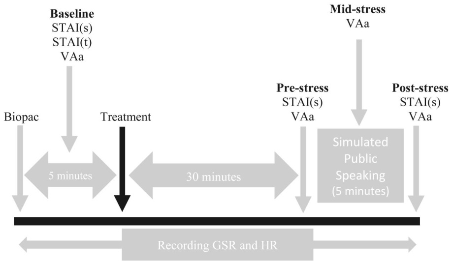
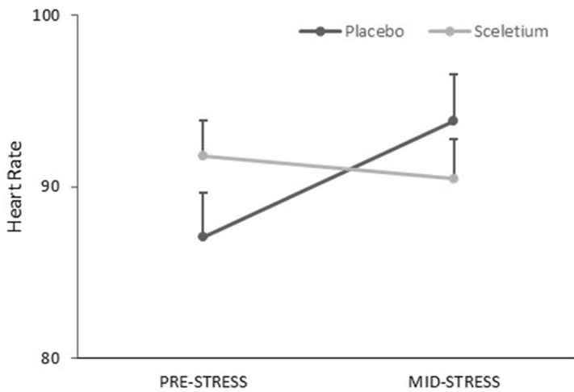

# Sceletium tortuosum (Zembrin®) ameliorates experimentally induced anxiety in healthy volunteers

Jonathon Reay1 | Mark A. Wetherell2 | Emma Morton2 | James Lillis1   
Vladimir Badmaev3

1Department of Psychology, School of Social Sciences, Humanities & Law, Teesside University, Middlesbrough, UK

2Department of Psychology, Stress Research Group, Northumbria University, Newcastle‐ upon‐Tyne, UK

3American Medical Holdings Inc., New York, New York, USA

# Correspondence

Jonathon Reay, Department of Psychology, School of Social Sciences, Humanities & Law, Teesside University, Middlesbrough TS13BX, UK.   
Email: j.reay@tees.ac.uk

# Abstract

Objective: To investigate the anxiolytic properties of a standardized extract of Sceletium tortuosum (trademarked―Zembrin®).

Methods: Two studies utilized a placebo‐controlled, double‐blind, between‐subject experimental design to investigate the effects of a single dose of Sceletium tortuosum (25 mg, Zembrin®) on laboratory stress/anxiety responding in 20 young healthy volunteers. To elicit feelings of stress/anxiety, participants completed 20 min of the multitasking framework in study 1 and a 5‐min simulated public speaking task in study 2. Study 1 measured subjective experiences of mood at baseline, prestress induction, and poststress induction. Study 2 measured subjective experiences of anxiety and physiological indicators of stress (heart rate [HR] and galvanic skin response) at baseline, prestress induction, during stress induction, and poststress induction.

Results: A series of analysis of covariances (baseline entered as the covariate) revealed no treatment effect in study 1; however, study 2 revealed subjective anxiety levels to be significantly lower in the Zembrin® group at the prestress induction point and a significant interaction between treatment and time on HR. Taken together, results indicate that a single dose of Zembrin® can ameliorate laboratory stress/anxiety responding in healthy volunteers.

Conclusion: We provide the first tentative behavioral evidence to support the anxiolytic properties of Sceletium tortuosum (25 mg Zembrin®).

K E Y W O R D S anxiety, anxiolytic, Sceletium tortuosum, stress, zembrin

# 1 INTRODUCTION

Sceletium tortuosum (L.) N.E.Br. (Mesembryanthemaceae) is used by some tribal people of South Africa to reduce feelings of pain and hunger, ameliorate stress, and enhance mental and physical performance (see review by Gericke & Viljoen, 2008). In western cultures, the purported therapeutic properties of Sceletium tortuosum have received limited scientific scrutiny; however, early research is promising. For example, Smith (2011) reported evidence of the anxiolytic properties of a low dose (5 mg/kg/day) but not a higher dose (20 mg/kg/day) of

Sceletium tortuosum on restraint‐induced anxiety in rats.1 Similarly, Hirabayashi, Ichikawa, Yoshi, Uchino, and Shimada (2004) demonstrated reduced stress and anxiety in cats administered 10 mg/kg/day. More recently, a standardized extract of Sceletium tortuosum (trademarked as Zembrin®2) has accumulated a small body of evidence to support its safety, cognitive enhancing, anxiolytic properties, and identified potential biological mechanisms of action. With regards to safety, Nell, Siebert, Chellan, and Gericke (2013) demonstrated that both a low (8 mg) and a higher (25 mg) daily dose of Zembrin® ingested for 3 months were well tolerated in healthy participants. With regards to cognitive functioning, Dimpfel, Schombert, and Gericke (2016) demonstrated a dose‐dependent attenuation of spectral power following three acute doses of Zembrin® (2.5, 5.0, and 10.0 mg/kg) to adult Fischer rats, and Chiu et al. (2014) demonstrated, in older human adults, improved cognitive set flexibility and executive function following 3 weeks of daily consumption (25 mg Zembrin® per day). With regard to the anxiolytic effect of Zembrin®, two studies have identified potential biological mechanisms of action, the first demonstrated Zembrin® to be a dual serotonin (5‐HT) transporter blocker and selective inhibitor of phosphodiesterase‐4 (Harvey, Young, Viljoen, & Gericke, 2011) and the second demonstrated a single 25 mg dose of Zembrin® could reduce anxiety‐related amygdala reactivity and attenuated amygdala–hypothalamus coupling in healthy young volunteers 2 h postdose (Terburg et al., 2013). To the authors' knowledge, the anxiolytic effects of Zembrin® are yet to be investigated in a behavioral study; therefore, we report for the first time the results of two behavioral studies that directly tested the anxiolytic properties of Zembrin®. The first study also investigated two additional purported properties―the effects on feelings of hunger and memory performance. We predict that Zembrin® will ameliorate stress/anxiety responding to acute laboratory stressors in healthy volunteers.

# 2 | METHODS

# 2.1 | Design

Both studies utilized a placebo‐controlled, double‐blind, between‐ subject experimental design to investigate the anxiolytic effects of a single dose of Zembrin® (25 mg) in healthy volunteers. Study 1 measured at baseline, prestress, and poststress induction. Study 2 measured at baseline, prestress, during stress, and poststress induction.

# 2.2 | Participants

Study 1: Twenty (six male) healthy volunteers (mean age 19.6 years; SD 1.09; body mass index 20.87). Study 2: Twenty (11 male) healthy volunteers (mean age 21.3 years; SD 1.38).

# 2.3 | Stress induction

# 2.3.1 | Study 1: Multitasking framework

The multi‐tasking framework (MTF; Purple Research Solutions) is a computerized stressor that reliably elicits cognitive demand, negative affect, stress, and anxiety (Scholey et al., 2009; Wetherell & Carter, 2014). The MTF requires participants to attend to four tasks simultaneously that vary in terms of time pressure and/or difficulty; tasks are performance‐driven and demand is manipulated through instructing participants to achieve as high a score as they can. The current version consisted of four tasks (visual warning, mail alert, telephone entry, and maths), which required visual monitoring, accurate data entry, and mental arithmetic (for a detailed description of tasks, see Wetherell & Carter, 2014).

# 2.3.2 | Study 2: Simulated public speaking task

On the day of testing, participants were informed that they would be completing a 5‐min public speech to outline why they would be the most suitable applicant for a job of their choosing. Following a 2‐min preparation period, participants stood in front of the researcher and performed their speech, the researcher gave no feedback, and participants were required to continue speaking for the duration of the task. Participants were also informed that their speech would be recorded and their performance considered by a panel of experts.

# 2.4 | Outcome variables

# 2.4.1 | Study 1

Perceived Stress Scale (PSS; Cohen & Williamson, 1988): The PSS was used to measure perceptions of stress during the previous month. A higher score represents higher feelings of stress.

Bond–Lader Visual Analogue Scales (Bond & Lader, 1974): A 16‐item scale provides three mood dimensions as follows: (1) alert, (2) calm, and (3) content. The Bond–Lader was utilized to confirm stress induction and to assess any impact of treatment (scale utilized in study 2 too).

Visual Analogue Hunger Scale: A 100‐mm line anchored by “not hungry” to “very hungry.” Participants crossed the line at the point that best described their current feeling. A score of 0 (not hungry) to a score of 100 (very hungry). If results reveal a treatment effect on hunger, hunger will be included as a covariate.

Immediate word recall: Two sets of 20 concrete nouns were created giving an A–B or B–A order. Each list was presented for 60 s, and participants were given 60 s for recall.

The National Aeronautics and Space Administration task load index (NASA‐TLX; Hart & Staveland, 1988): The NASA‐TLX measures six workload domains. Three of which reflect the respondents perceived demands of the task (mental demand, physical demand, and temporal demand), and three reflect the interaction between the task and the respondent (effort, perceived performance, and frustration).

  
Study 1   
F I G U R E 1 Study protocol for study 1 and study 2. Dosage 25 mg Sceletium tortuosum (trademarked Zembrin®) or placebo. BL, Bond–Lader Visual Analogue Mood Scale; IWR, immediate word recall; PSS, Perceived Stress Scale; STAI(s), State–Trait Anxiety Inventory (state score); STAI (t), State–Trait Anxiety Inventory (trait score); TLX, the National Aeronautics and Space Administration task load index; VAa, Visual Analogue Anxiety Scale; VAh, Visual Analogue Hunger Scale

  
Study 2

# 2.4.2 | Study 2

State–Trait Anxiety Inventory (STAI; Spielberger, 2010): A 40‐item inventory split into two 20‐item sections. The first focuses on state anxiety whereas the second focuses upon trait anxiety.

Visual Analogue Anxiety (VAa) Mood Scale (Wetherell, Craw, Smith, & Smith, 2017): A 10‐point scale anchored by “not at all” to “very anxious.” Participants marked the point that best describes their current feeling. A score of 0 (not at all feeling anxious) to a score of 10 (feeling very anxious).

Biopac (Biopac Systems, Inc, Unit MP35): Heart rate (HR) and galvanic skin response (GSR) were utilized as physiological indicators of anxiety.

# 2.5 | Procedure

All participants provided written informed consent and attended between 8:30 a.m. and 10 a.m. Participants confirmed they had not consumed food or drink (water being an exception) since 8 p.m. and were randomly allocated placebo or Zembrin® treatment condition. Ethical approval was granted from the Department of Psychology at Northumbria University for study 1 and from the School of Social Science, Business and Law at Teesside University for study 2. Participants completed task order as detailed in Figure 1.

# 2.6 | Statistical analysis

To confirm the absence of any group difference in “background” levels of stress/anxiety, baseline scores from the PSS (study 1) and STAI (study 2) were analyzed by one‐way between group analysis of variance (ANOVA).

# 2.6.1 Study 1

Placebo data for the Bond–Lader was analyzed by one‐way repeated measures ANOVA to confirm stress induction. To explore treatment effects, each outcome measure was subject to an analysis of covariance (ANCOVA; baseline score was entered as the covariate). One‐way ANOVA was utilized for each domain of the NASA‐TLX (see Table 1 for means and SE).

T A B L E 1 Study 1: Means and SE for each outcome measure at baseline and each measurement point postdose   

<html><body><table><tr><td></td><td></td><td colspan="2">Baseline</td><td colspan="2">Prestress</td><td colspan="2">Poststress</td></tr><tr><td></td><td></td><td> Mean</td><td>SE</td><td>Mean</td><td>SE</td><td>Mean</td><td>SE</td></tr><tr><td>Perceived stress</td><td>Zembrin?</td><td>22.2</td><td>2.8</td><td></td><td></td><td></td><td></td></tr><tr><td></td><td>Placebo</td><td>23.3</td><td>2.8</td><td></td><td></td><td>1</td><td></td></tr><tr><td>Mental demand</td><td>Zembrin?</td><td></td><td></td><td></td><td></td><td>64.1</td><td>4.65</td></tr><tr><td></td><td>Placebo</td><td></td><td></td><td></td><td></td><td>63.7</td><td>4.65</td></tr><tr><td>Physical demand</td><td>Zembrin?</td><td></td><td></td><td></td><td></td><td>26.8</td><td>6.64</td></tr><tr><td></td><td>Placebo</td><td></td><td></td><td></td><td></td><td>22.3</td><td>6.64</td></tr><tr><td>Temporal demand</td><td>Zembrin?</td><td></td><td></td><td></td><td></td><td>62.7</td><td>5.65</td></tr><tr><td></td><td>Placebo</td><td></td><td></td><td></td><td></td><td>49.6</td><td>5.65</td></tr><tr><td>Effort</td><td>Zembrin?</td><td></td><td></td><td></td><td></td><td>61.5</td><td>4.40</td></tr><tr><td></td><td>Placebo</td><td></td><td></td><td></td><td></td><td>64.8</td><td>4.40</td></tr><tr><td>Performance</td><td>Zembrin?</td><td></td><td></td><td></td><td></td><td>64.4</td><td>5.08</td></tr><tr><td>Frustration</td><td>Placebo</td><td></td><td></td><td></td><td></td><td>63.3</td><td>5.08</td></tr><tr><td></td><td>Zembrin@</td><td></td><td></td><td></td><td></td><td>38.2</td><td>6.83</td></tr><tr><td></td><td>Placebo</td><td></td><td>=</td><td></td><td></td><td>31.3</td><td>6.83</td></tr><tr><td>Hunger scale</td><td> Zembrin?</td><td>43.5</td><td>7.44</td><td></td><td></td><td>58.95</td><td>2.48</td></tr><tr><td>Word recall (number correct)</td><td>Placebo</td><td>69.5</td><td>2.72</td><td></td><td>-</td><td>59.04</td><td>2.30</td></tr><tr><td></td><td>Zembrin?</td><td>8.4</td><td>0.41</td><td>8.56</td><td>0.86</td><td></td><td></td></tr><tr><td>Word recall (number error)</td><td>Placebo</td><td>9.9</td><td>0.53</td><td>9.91</td><td>0.81</td><td></td><td></td></tr><tr><td></td><td> Zembrin?</td><td>0.2</td><td>0.15</td><td>0.41</td><td>0.18</td><td></td><td></td></tr><tr><td>Alert</td><td>Placebo</td><td>0.5</td><td>0.22</td><td>0.33</td><td>0.17</td><td></td><td></td></tr><tr><td></td><td>Zembrin?</td><td>53.18</td><td>4.40</td><td>61.67</td><td>2.97</td><td>66.88</td><td>3.29</td></tr><tr><td>Calm</td><td>Placebo</td><td>53.84</td><td>4.12</td><td>61.42</td><td>2.97</td><td>62.84</td><td>3.29</td></tr><tr><td></td><td>Zembrin?</td><td>67.35</td><td>4.93</td><td>61.6</td><td>4.02</td><td>47.04</td><td>4.95</td></tr><tr><td></td><td>Placebo</td><td>66.4</td><td>4.47</td><td>61.3</td><td>4.01</td><td>45.50</td><td>4.95</td></tr><tr><td>Content</td><td>Zembrin?</td><td>58.5</td><td>2.83</td><td>60.99</td><td>1.23</td><td>59.44</td><td>1.75</td></tr><tr><td></td><td>Placebo</td><td>58.6</td><td>2.91</td><td>58.58</td><td>1.23</td><td>56.07</td><td>1.75</td></tr></table></body></html>

Abbreviation: SE, standard error.

# 2.6.2 | Study 2

Placebo data for the STAI(s), VAa scale, HR, and GSR were analyzed by one‐way repeated measures ANOVA to confirm stress induction. To explore treatment effects, each outcome was subject to ANCOVA (baseline score was entered as the covariate) (See Table 2 for means and SE).

# 3 RESULTS

# 3.1 | Study 1

# 3.1.1 | Background stress

PSS: No significant difference between placebo and Zembrin® group (F(1,18) 0.76, p 0.785).

# 3.1.2 | Stress induction

A main effect of time on feelings of alertness (F(1,18) 5.74, p 0.012) and calmness (F(1,18) 9.87, p 0.001) confirm stress induction.

# 3.1.3 | Effect of treatment

No treatment effects observed on any outcome measure.

# 3.2 | Study 2

# 3.2.1 | Background anxiety

STAI (trait): No difference between placebo and Zembrin® group (F(1,18) 0.105, p 0.750).

T A B L E 2 Study 2: Means and SE for each outcome measure at baseline and each measurement point postdose   

<html><body><table><tr><td colspan="2"></td><td colspan="2">Baseline</td><td colspan="2">Prestress</td><td colspan="2">Midstress</td><td colspan="2">Poststress</td></tr><tr><td colspan="2"></td><td>Mean</td><td>SE</td><td>Mean</td><td>SE</td><td>Mean</td><td>SE</td><td>Mean</td><td>Se</td></tr><tr><td rowspan="2">STAI (trait)</td><td>Zembrin?</td><td>39</td><td>2.75</td><td>1</td><td></td><td>1</td><td></td><td></td><td></td></tr><tr><td>Placebo</td><td>40.25</td><td>2.25</td><td></td><td></td><td></td><td></td><td></td><td></td></tr><tr><td rowspan="2">STAI (state)</td><td>Zembrin?</td><td>30.58</td><td>2.06</td><td>33.96</td><td>2.81</td><td></td><td>-</td><td>37.82</td><td>2.22</td></tr><tr><td>Placebo</td><td>35.38</td><td>2.20</td><td>44.43</td><td>3.48</td><td>，</td><td>，</td><td>35.88</td><td>2.75</td></tr><tr><td rowspan="2">Anxiety scale</td><td>Zembrin?</td><td>2.25</td><td>0.39</td><td>3.25</td><td>0.48</td><td>4.42</td><td>0.59</td><td>4.25</td><td>0.46</td></tr><tr><td>Placebo</td><td>3.63</td><td>0.885</td><td>4.61</td><td>0.6</td><td>4.99</td><td>0.74</td><td>3.49</td><td>0.57</td></tr><tr><td rowspan="2">HR (bpm)</td><td>Zembrin?</td><td>87.1</td><td>5.19</td><td>91.8</td><td>2.09</td><td>90.5</td><td>2.27</td><td></td><td></td></tr><tr><td>Placebo</td><td>87.52</td><td>5.63</td><td>87.09</td><td>2.57</td><td>93.85</td><td>2.78</td><td>-</td><td>-</td></tr><tr><td rowspan="2">GSR</td><td>Zembrin?</td><td>0.74</td><td>0.007</td><td>0.73</td><td>0.002</td><td>0.71</td><td>0.002</td><td>1</td><td></td></tr><tr><td>Placebo</td><td>0.71</td><td>0.88</td><td>0.75</td><td>0.002</td><td>0.74</td><td>0.002</td><td></td><td></td></tr></table></body></html>

Note: HR and GSR is average data at baseline (5 min), prestress (30 min), and midstress (5 min). Abbreviations: GSR, galvanic skin response; HR, heart rate; SE, standard error; STAI, State–Trait Anxiety Inventory.

# 3.2.2 | Stress induction

A trend toward a main effect of time on STAI(s) (F(2,14) 3.49, p 0.059) and HR (F(2,14) 3.325, p 0.06) coupled with a main effect of time on VA(a) (F(3,21) 3.23, p 0.043) confirmed stress induction.

# 3.2.3 | Effects of treatment

STAI (state): ANCOVA revealed a treatment time interaction (F(1,17) 8.05, p 0.011). Post hoc analysis revealed a difference at prestress (p ¼ 0.009, d ¼ 1.01) with anxiety level significantly lower in the Zembrin® group (Figure 2).

VAa scale: ANCOVA revealed a treatment time interaction (F(2,34) 3.28, p 0.05). Post hoc analysis revealed a difference at prestress (p ¼ 0.024, d ¼ 1.11) with anxiety level being significantly lower in the Zembrin® group (Figure 2).

HR: ANCOVA revealed a treatment time interaction (F(1,17) 6.08, p 0.025). The pattern of results demonstrates a physiological response to the stressor (increased HR) in placebo but not Zembrin® group (Figure 3).

# 4 DISCUSSION

Results of the current studies provide the first tentative behavioral evidence to support the anxiolytic properties of Sceletium tortuosum (25 mg Zembrin®) but fail to replicate the previously reported enhancement of cognitive function. In the current studies, stress induction was confirmed in study 1 as participants reported increased subjective experience of alertness and decreased feelings of calmness following completion of the MTF (see Wetherell &

Carter, 2014) and in study 2 by participants reporting elevated feelings of anxiety/stress and increased HR following completion of the simulated public speech task. With regard to the therapeutic properties of Sceletium tortuosum (Zembrin®), study 1 failed to show any effect of treatment on feelings stress or memory performance; however, study 2 demonstrated that Sceletium tortuosum (Zembrin®) ameliorated the anticipatory increase in subjective feelings of anxiety associated with the anticipated onset of a stressor and ameliorated increases in HR during a stressor.

The lack of an anxiolytic effect in study 1 and on subjective measures at the mid and poststress testing points in study 2 could most parsimoniously be explained by our protocol. For example, despite both protocols inducting elevated feelings of stress, it could be that the stressor was too “mild” to allow a treatment effect to be observed in those subjective self‐report measures. For example, it is clear that our participants did not rate their reported anxiety greater than the half‐way point on the anxiety scale nor score more than half on the STAI(s). However, it should be noted that an effect was observed in the physiological measure. With regard to a lack of effect on cognitive function, we could interpret this result as the first evidence to suggest that Sceletium tortuosum (Zembrin®) has no impact on nonexecutive memory processing in healthy volunteers; however, we would advise some caution with this, as our primary aim was to investigate the anxiolytic properties and our research design was tailored toward this question and it is possible that again our lack of effect here can also be due to differences between our study and previous studies. For example, Terburg et al. (2013) utilized a longer treatment regime, tested a different population (older adults), and assessed different cognitive functioning (i.e., executive functioning). We recommend that future studies consider using protocols that elicit stronger stress responses, for example, adding critical social evaluation to the MTF (e.g., Wetherell et al., 2017), or running a longer, and more challenging social evaluation paradigm to further our understanding of the anxiolytic effects of Sceletium tortuosum (Zembrin®). Future studies should also use more comprehensive cognitive assessment to investigate whether Sceletium tortuosum (Zembrin®) has any task/cognitive domain specificity of effect.

  
F I G U R E 2 Means and standard error (error bars) of self‐reported anxiety on the STAI(s) and VAa at prestress, midstress, and poststress. Stress in this context was a simulated public speaking task. STAI(s), State–Trait Anxiety Inventory (state score); VAa, Visual Analogue Anxiety Scale. Asterisks indicate significant group difference at that time point

  
F I G U R E 3 Means and standard error (error bars) of heart rate (HR) at prestress and midstress. Stress in this context was a simulated public speaking task. Prestress is the average HR during the 30‐min absorption period; during‐test is the average HR during the 5‐min simulated public speaking task

We conclude that a single 25 mg dose of Sceletium tortuosum (Zembrin®) can ameliorate subjective and physiological indicators of stress/anxiety during a controlled laboratory stress protocol in young healthy volunteers.

# CONFLICT OF INTEREST

The authors have declared no conflict of interest.

# ORCID

Jonathon Reay https://orcid.org/0000-0002-8252-1218

# REFERENCES

Bond, A., & Lader, M. (1974). The use of analogue scales in rating subjective feelings. British Journal of Medical Psychology, 47, 211–218. https://doi.org/10.1111/j.2044-8341.1974.tb02285.x   
Chiu, S., Gericke, N., Farina‐Woodbury, M., Badmaev, V., Raheb, H., Terpstra, K., … Goble, L. (2014). Proof‐of‐concept randomized controlled study of cognition effects of the proprietary extract Sceletium tortuosum (Zembrin) targeting phosphodiesterase‐4 in cognitively healthy subjects: Implications for Alzheimer's dementia. Evidence‐Based Complementary and Alternative Medicine, 2014, 1–9. https://doi.org/10.1155/2014/682014   
Cohen, S., & Williamson, G. (1988). Perceived stress in a probability sample of the United States. In S. Spacapan & S. Oskamp (Eds.), The social psychology of health (pp. 31–68). Newbury Park, CA: Sage.   
Dimpfel, W., Schombert, L., & Gericke, N. (2016). Electropharmacogram of Sceletium tortuosum extract based on spectral local field power in conscious freely moving rats. Journal of Ethnopharmacology, 177(11), 140–147. https://doi.org/10.1016/j.jep.2015.11.036   
Gericke, N., & Viljoen, A. M. (2008). Sceletium—A review update. Journal of Ethnopharmacology, 119(3), 653–663.   
Hart, S. G., & Staveland, L. E. (1988). Development of NASA‐TLX (task load index): Results of empirical and theoretical research. Advances in Psychology, 52, 139–183.   
Harvey, A. L., Young, L. C., Viljoen, A. M., & Gericke, N. P. (2011). Pharmacological actions of the South African medicinal and functional food plant Sceletium tortuosum and its principal alkaloids. Journal of Ethnopharmacology, 137(3), 1124–1129.   
Hirabayashi, M., Ichikawa, K., Yoshi, A., Uchino, T., & Shimada, K. (2004). Clinical effects of South African tea for cat. Japanese Journal of Small Animal Practice, 23, 85–89.   
Nell, H., Siebert, M., Chellan, P., & Gericke, N. (2013). A randomized, double‐blind, parallel‐group, placebo‐controlled trial of extract Sceletium tortuosum (Zembrin) in healthy adults. Journal of Alternative & Complementary Medicine, 19(11), 898–904.   
Scholey, A. B., Haskell, C., Robertson, B., Milne, A., Kennedy, D., & Wetherell, M. A. (2009). Chewing gum alleviates negative mood and reduces cortisol during acute laboratory psychological stress. Physiology & Behavior, 97(3–4), 304–312.   
Smith, C. (2011). The effects of Sceletium tortuosum in an in vivo model of psychological stress. Journal of Ethnopharmacology, 133, 31–36.   
Spielberger, C. D. (2010). State‐trait anxiety inventory. In I. B. Weiner & W. E. Craighead (Eds.), The corsini encyclopedia of psychology. https:// doi.org/10.1002/9780470479216.corpsy0943   
Terburg, D., Syal, S., Rosenberger, L. A., Heany, S., Phillips, N., Gericke, N., … van Honk, J. (2013). Acute effects of Sceletium tortuosum (Zembrin), a dual 5‐HT reuptake and PDE4 inhibitor in the human amygdala and its connection to the hypothalamus. Neuropsychopharmacology, 38, 2708–2716.   
Wetherell, M. A., & Carter, K. (2014). The multitasking framework: The effects of increasing workload on acute psychobiological stress reactivity. Stress and Health, 30, 103–109.   
Wetherell, M. A., Craw, O., Smith, K., & Smith, M. A. (2017). Psychobiological responses to critically evaluated multitasking. Neurobiology of Stress, 7, 68–73.

How to cite this article: Reay J, Wetherell MA, Morton E, Lillis J, Badmaev V. Sceletium tortuosum (Zembrin®) ameliorates experimentally induced anxiety in healthy volunteers. Hum Psychopharmacol Clin Exp. 2020;35:e2753. https://doi.org/10.1002/hup.2753