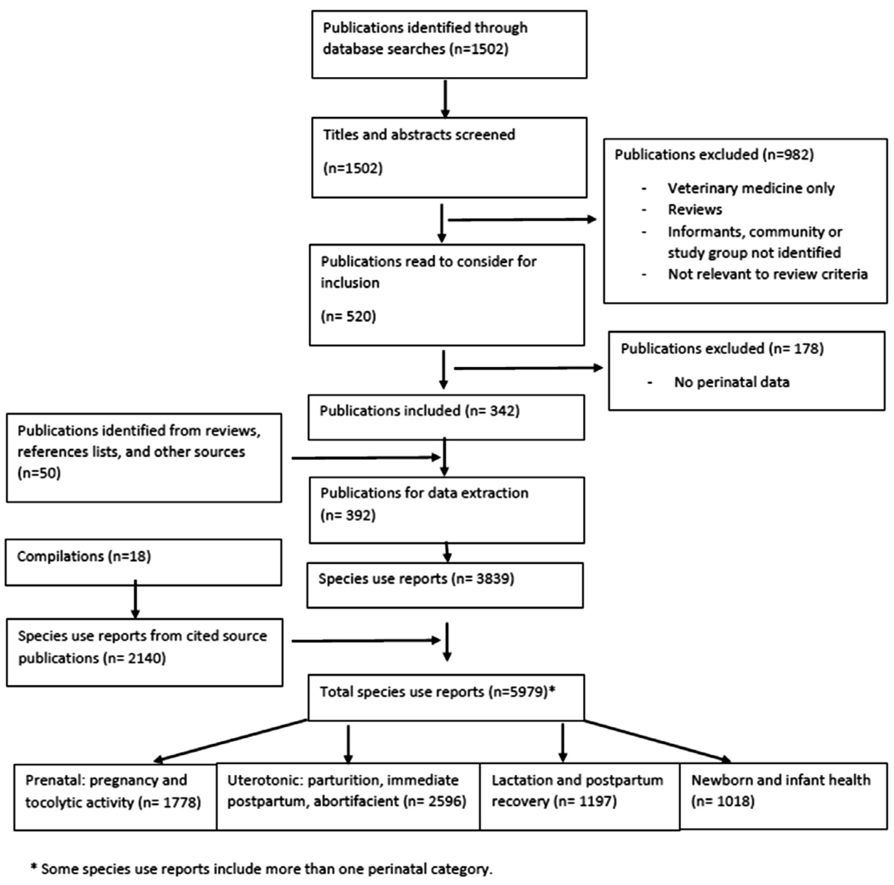
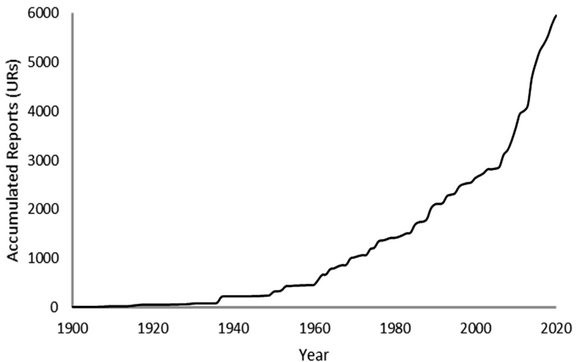

# Traditional perinatal plant knowledge in Sub-Saharan Africa: Comprehensive compilation and secondary analysis

Lindiwe Sibekoa,\*, Timothy Johnsb, Bi-sek Hsiaoa

a Department of Nutrition, School of Public Health and Health Sciences, University of Massachusetts Amherst, Amherst, MA 01003 United States b School of Human Nutrition, McGill University, Ste. Anne de Bellevue, QC H9X3V9 Canada

# A R T I C L E I N F O

# A B S T R A C T

Article History:   
Received 5 September 2022   
Revised 29 November 2022   
Accepted 4 January 2023   
Available online 18 January 2023

Edited by: Dr. L. McGaw

Keywords:   
Ethnobotany   
Lactation   
Pregnancy   
Postpartum   
Tocolytic   
Traditional medicine   
Uterotonic

Sub-Saharan Africa has rich ethnobotanical heritage of public health relevance within pluralistic systems of perinatal care. Compiling of reported medicinal plant use during pregnancy and postpartum from historical and contemporary sources allowed for analyses directed at i) identification of the most important taxa in relation to key functional purposes, ii) establishing patterns of use, and iii) testing the hypothesis that perinatal plant use is non-random.

Data from 410 publications generated 5979 use reports related to 2122 species from 181 plant families, with 53% of reports published from 2005 to 2020. New species continue to be added at a constant rate. With 86% (67/78) of perinatal-focused papers published since 2005, purposeful research contributes to an increase in overall data availability. For analysis, reports were categorized as i) uterotonic (n = 2596), ii) prenatal (n = 1778, 555 specifically for preventing miscarriage or delaying the onset of labor), iii) lactation and postpartum recovery (n = 1194, 812 as galactagogues), or iv) newborn and infant health (n = 1018). Most frequently reported species per category are discussed in relation to published pharmacological data. Based on congruence among linear regression, negative binomial regression, Bayesian, and Imprecise Dirichlet Model statistics, non-random use includes preference for i) latex-producing families during lactation and postpartum, ii) families differentiating tocolytic and general pregnancy application, and iii) Crassulaceae species for infant umbilicus healing. Significant underuse of the Rubiaceae throughout the perinatal, and for the Apocynaceae and Euphorbiaceae during pregnancy and parturition specifically, suggests avoidance.

Traditional plant knowledge remains relevant to the health and social well-being of Sub-Saharan African populations. Within pluralistic systems, documentation of traditional practices can contribute to complementary approaches and the mediation of potential conflicts with conventional healthcare. Refinement of quantitative and qualitative methodologies for documenting perinatal knowledge, beliefs, and practices can further understanding of the congruence among sociocultural, ecological, molecular, behavioral, and health aspects of women’s perinatal use of medicinal plants.

© 2023 SAAB. Published by Elsevier B.V. All rights reserved.

# 1. Introduction

# 1.1. Traditional knowledge and perinatal plant use

Knowledge on the traditional use of plants during pregnancy, childbirth, and postpartum is defined by the biological and cultural importance of this distinct time in the lifecycle, and by gender. The knowledge of medicinal plants used during the perinatal period represents past and present selection, presumably guided by physiological properties related to well-defined functional outcomes necessary for reproductive success, as well as by cognitive, ecological, and cultural determinants (Weckerle et al., 2011).

In ethnobotanical inventories, perinatal indications of particular taxa are usually diffused among many other medicinal uses, although a growing number of reviews and primary studies focus on reproductive health more specifically (Ahmed et al., 2018; de Boer and Cotingting, 2014; Motti et al., 2019; James et al., 2018; Yazbek et al., 2016; Towns and Van Andel, 2016). The latter are more likely to highlight knowledge of women, including its transmission and application. Growth in published data over the past two decades provides opportunities to better appreciate the richness of women’s knowledge (Sibeko and Johns, 2021; Sibeko et al., 2021), as well as undertake analysis directed at practical and theoretical questions related to the perinatal period.

The current analysis undertakes to assemble an extensive database of published reports of Sub-Saharan African (SSA) perinatal plant knowledge from historical and contemporary sources. Compilations of ethnomedicinal information at the end of the 20th century (Ayensu, 1978; Bingel and Farnsworth, 1994; Burkill, 1985-2000; Kokwaro, 1976; Neuwinger, 1996, 2000; Watt and Breyer-Brandwijk, 1962) drew on knowledge recorded in the colonial and immediate post-colonial periods, primarily by non-Africans. The subsequent explosion of ethnobotanical investigations (Ahmed et al., 2018; Van Wyk, 2015) led by scientists with direct links to the societies and communities they study has expanded and enriched the knowledge base.

# 1.2. Perinatal medicinal plant use in traditional and contemporary health

Traditional use of plants and the expertise of Traditional Birth Attendants (TBA) remain essential for primary health of underserviced populations in rural and other areas of SSA (Garces et al., 2019). Although urbanization paralleled by increasing access to modern facilities and skilled professionals profoundly changes perinatal healthcare, across the region some 40% of births occur outside of health facilities (UNICEF, 2021), with many women integrating medicinal plants with modern perinatal care (Nega et al., 2019; Beyene and Beza, 2018). Similarly, contemporary prevalence of medicinal plant use during pregnancy across different African subregions lies minimally within the range of 30 45% (Ahmed et al., 2018). Recent reviews identify contemporary research on medicinal plant use during pregnancy as well as key species (Ahmed et al., 2018; El Hajj and Holst, 2020). Traditional plants used during lactation and the postnatal period have been compiled and reviewed globally including from Africa (Sibeko and Johns, 2021; Sibeko et al., 2021). Population surveys that focus on prevalence of overall use of medicinal plants, primarily in conjunction with healthcare services and/or including urban and middle-class new mothers, do not fully represent the depth and breadth of traditional African medicinal knowledge or practice.

The manner in which women traditionally use plants corresponds with medically recognized stages of pregnancy, labor, and recovery, and with pharmacological mechanisms associated with agents known to mediate these stages (de Boer and Cotingting, 2014). Functional categories that define the field and our analysis include: uterotonic (abortifacient, parturition facilitation, hemorrhage cessation, placenta expulsion); tocolytic (anti-miscarriage, labor onset delay); general health during pregnancy; pain relief; lactation and postpartum recovery (galactagogues, physical and mental health); and newborn care and health of breastfeeding infants. Within pluralistic health systems, consideration of pharmacological and toxicological activities of medicinal plants in a sociocultural context can guide complementary application, as well as appropriate intervention where traditional practices are potentially harmful.

# 1.3. Non-random selection of plants used perinatally

We use secondary data analysis to address the question whether plant use during the perinatal period reflects specific choice, either by an individual or as embedded in shared cultural knowledge. The non-random theory of medicinal plant selection (Robles Arias et al., 2020) draws on the assumption that physiological and pharmacological activities are attributable to phytochemicals, presumably associated with common taxonomy and phylogenetic relationships. Cognitive, ecological, and cultural historical factors may be at least as important in influencing selection decisions (Weckerle et al., 2011; Savo et al., 2015). Tests of the non-random hypothesis typically compare the number of species per plant family used medicinally within a sample with the number of total species for each of the families in the flora from which the data are obtained. In investigations from different global regions (Van Wyk, 2020; Moerman et al., 1999) and local-scale surveys (Robles Arias et al., 2020; Muleba et al., 2021) families are identified that are utilized more or less than expected on a random basis. The linear regression approach introduced by Moerman (Moerman et al., 1999) has been refined using contingency table/binomial analysis (Bennett and Husby, 2008), negative binomial (Robles Arias et al., 2020), Bayesian (Weckerle et al., 2011), and imprecise probability calculation (using the Imprecise Dirichlet Model (IDM)) (Weckerle et al., 2012) methods. Although methodological strengths and limitations have been debated (Savo et al., 2015; Leonti et al., 2012), such studies can generate explanatory insights and hypotheses. Mapping onto molecular phylogenies can further discern the basis for plant selection for medicinal use (Gras et al., 2021; Pedrosa et al., 2021).

Directly applicable to the SSA scale of the current paper is a recent floristic analysis by Van Wyk (2020) which used linear regression, Bayesian, and IDM methods to identify medicinally over- and underused plant families. We compare our data to that used by van Wyk and extend the analysis to i) include negative binomial regression and ii) consider relative importance for families, genera, and species based on frequency of published reports across perinatal categories. Among the limitations of non-random approaches are the floristic reality that species within a family are not evenly distributed or available within an environment (Robles Arias et al., 2020; Pedrosa et al., 2021); as well existing flora may be only relatively representative (Savo et al., 2015). Frequency of reported use, as it corresponds to both preference for attributes of particular taxa but also to accessibility, provides a measure of the degree to which taxa are relied on in actual practice. On the other hand, failure to utilize taxa that are accessible and/or used medicinally in other contexts suggests selective avoidance during the perinatal.

# 1.4. Objectives summary

The primary objective of this paper involves compilation of a thorough bibliography and inventory on perinatal plant use in SSA. Analysis of these data seeks to identify the most important taxa in relation to different functional purposes, establish patterns of use, and test the hypothesis that perinatal plant use is non-random. Where available, the functional basis of selection decisions is supported through review of pharmacological investigations. Concurrently, we provide a case study of historical trends and status of ethnomedicinal data collection in SSA.

# 2. Methods

# 2.1. Comprehensive review and secondary data analysis

We undertook a review (Fig. 1) of plants used during the perinatal period in relation to health of mothers and infants. The period of interest extends from the onset of pregnancy until approximately six months after parturition (period of postpartum recovery and preweaning lactation). Data were obtained from primary ethnobotanical studies plus compilations and reviews that cite reference sources. Available compilations (Ayensu, 1978; Bingel and Farnsworth, 1994; Kokwaro, 1976; Burkill, 1985-2000; Neuwinger, 1996, 2000; Watt and Breyer-Brandwijk, 1962) cover information published before 2000, including resources not included in electronic databases (primarily before 1974) and generally unavailable electronically. We searched CAB Abstracts (OVID), Medline (OVID), Scopus, and Web of Science databases for primary ethnobotanical studies, surveys, and reviews published from the beginning of databases to 2020. Data included in our tabulation comprise relevant ethnomedicinal uses traceable to source (informants, or in the case of older data to first known publication) and are recorded as species use reports (UR: a published record of a plant species with one or more uses during the perinatal period). Data from compilations and primary sources were cross-referenced, with recognizable duplicates of reports eliminated.

  
Fig. 1. Flowchart of literature review, data compilation and species report categorization.

Ethnobotanical studies typically report general medicinal plant use data collected from informant interviews associated with an identified population or group of informants. In order to avoid bias towards particular plants or aspects of perinatal health we excluded studies focused on 1) specific plant families, genera, or species, and 2) diseases or health conditions other than relevant to the perinatal period. Additionally, we excluded 3) infertility treatments, and 4) treatment of only animals, although some relevant human studies overlap with veterinary medicine.

Primary database search terms were ‘medicinal plants’ OR ‘ethnobotany’ cross-referenced with ‘Sub-Saharan Africa’ OR names of each of the countries in SSA, with NOT terms used to exclude specific disease conditions. Titles and abstracts were screened to generate a list of references (Fig. 1) which were read to identify studies meeting inclusion and exclusion criteria. Additional primary studies were identified from bibliographies of review papers that met inclusion and exclusion criteria. Publications that lacked perinatal data were further excluded.

# 2.2. Data tabulation and pharmacological review

Each plant cited was entered into a database (Appendix A) with one entry for each species per publication (except compilations: each plant cited entered separately). All plant scientific names and family recognition were verified and updated using World Flora Online (2022). Entries were standardized to remove synonyms and obvious errors in spelling. Data recorded included taxonomic information, plant part used, nature of publication, year of publication, geographical location (usually country), and medicinal purpose. Data were further categorized by perinatal period and mechanistic function. Data were tabulated as number of URs and ranked in relation to 4 categories: i) prenatal (pregnancy support, miscarriage prevention), ii) uterotonic (parturition, immediate postpartum, abortifacient), iii) lactation and postpartum recovery, and iv) health of newborns and breastfeeding infants. Pharmacological research for the top ranked species was reviewed based on a search of the previously listed databases.

  
Fig. 2. Accumulation curve of Sub-Saharan reports (URs) of perinatal plant use until 2020.

# 2.3. Non-random selection

Four analytical methods were employed to cross-examine patterns of perinatal plant medicine selection: 1) simple linear regression, 2) negative binomial regression, 3) Bayesian, and 4) Imprecise Dirichlet Modeling (IDM). Firstly, we explored the relationship between number of species in SSA plant families (Van Wyk, 2020) with the number of species per family used for perinatal medicine, running separate analyses for the subcategories: i) prenatal, ii) uterotonic, iii) lactation and postpartum recovery, iv) infant health. Secondly, we examined the relationship between number of recorded medicinal species in SSA plant families (Van Wyk, 2020) with the number of species per family used for perinatal medicine, again separated for usage subcategories. STATA 17.0 (StataCorp, 2021) was used for linear and binomial regression, and Excel was used for Bayesian and IDM analyses.

Regression analyses modeled i) the total number of SSA plant species per family as the independent variable, and ii) the second series modeled the total number of SSA medicinal plant species per family as the independent variable, with number of species per family used for perinatal medicine (different for each usage subcategory) the dependent variable for each model. Families with studentized residuals falling above the 95th and 97.5th percentile of the t-distribution were considered overused and most overused, respectively, and families with studentized residuals falling below the 5th and 2.5th percentile were considered underused and most underused, respectively. Studentized residuals follow Student’s t-distribution and are more appropriate than raw residuals for identifying outliers (Robles Arias et al., 2020; Savo et al., 2015).

The Bayesian approach followed methods described by Weckerle et al. (2011); we assumed a Uniform (0,1) prior distribution, and used Excel’s Inverse beta function and formulas defined by Weckerle et al. to calculate the 95% posterior credible interval of the overall proportion of perinatal plant species used in each of the perinatal usage subcategories, which we compared to the corresponding credible interval for each family. Families were considered underused or overused if their credible interval fell below or above the overall credible interval, respectively. The IDM methods and formulas as described by Weckerle et al. (2012) are similar to the Bayesian approach, but instead of a specific prior distribution applied the parameter value of s = 4 which allowed for a wide possibility of priors.

# 3. Results

# 3.1. Review and data compilation

Data were collected from 410 publications (Appendix B) (392 primary sources, 18 compilations) and, after cross-referencing sources among compilations, were consolidated to 5979 URs (Appendix A). Compilations accounted for 35.8% (n = 2140) of URs, with 64.2% (n = 3839) from primary ethnobotanical studies and population level surveys. 52.6% of the URs were published in the previous 15 years (20052020) representing a strong acceleration in population-level studies since 2005 (Fig. 2). While family and genera are leveling off towards stable asymptotes (Williams et al., 2007), accumulation curves (not shown) demonstrate that new species continue to be reported at a constant rate.

Of the 392 primary studies from which data were obtained, 78 focusing specifically on the perinatal period accounted for 1858 URs (mean= 23.8). The remaining 336 primary studies with 1980 URs averaged only 5.9 per publication. Furthermore, 178 ethnobotanical publications were excluded because they contained no perinatal data. Overall, then, the perinatal represents a small portion of data recorded in broad-spectrum ethnomedicinal studies. On the other hand, with 85.9% (67/78) of perinatal-focused papers published since 2005, purposeful research in this area accounts for much of the increase in overall data availability.

Most URs (Appendix A) are identified to country. Regional delineation for Western and Central Africa corresponded to UN Subregions (UNSD, 2021) while Southern Africa was expanded to include Malawi, Mozambique, Zambia, and Zimbabwe. Eastern Africa comprised Burundi, Djibouti, Eritrea, Ethiopia, Kenya, Rwanda, Somalia, South Sudan, Sudan, Tanzania, and Uganda. Although the highest portion of the reports are from Western Africa, URs correspond broadly with current populations (UN Population Division, 2019) for Western (34.5% URs, 39% population), Eastern (30.2, 32), Central (20.1, 17) and Southern (14.4, 11) regions, respectively.

# 3.2. Pharmacological categorization

In total our data tabulated 2122 species from 181 plant families. The most reported species in each of the four perinatal categories (Appendix A) are summarized in Table 1. For convenience categories are arbitrarily limited to §20, with cutoffs including all species of the lowest frequency.

Table 1   

<html><body><table><tr><td colspan="7">inatal species most reported from Sub-Saharan Africa.</td></tr><tr><td>Senus species Authority</td><td>Family</td><td>Indication reports #Parts</td><td></td><td>Main indications</td><td>Locations (ranked)</td></tr><tr><td colspan="6">1. Prenatal (pregnancy support, miscarriage prevention)</td></tr><tr><td>Piper umbellatum L.</td><td>Piperaceae</td><td>14</td><td>leaf</td><td>support pregnancy,prevent miscarriage</td><td>Central,Western</td></tr><tr><td>Zingiber officinale Roscoe</td><td>Zingiberaceae</td><td>14</td><td>rhizome</td><td>support pregnancy</td><td>Eastern (Ethiopia),Western</td></tr><tr><td>Ageratum conyzoides (L.) L.</td><td>Asteraceae</td><td>12</td><td>leaf</td><td>support pregnancy,prevent miscarriage</td><td>Eastern,Western</td></tr><tr><td>Allium sativum L.</td><td>Amaryllidaceae</td><td>12</td><td>clove</td><td>support pregnancy</td><td>Eastern (Ethiopia), Western</td></tr><tr><td>Annona senegalensis Pers.</td><td>Annonaceae</td><td>10</td><td>root, bark,leaf</td><td>support pregnancy,prevent miscarriage</td><td>Western,Eastern,South Afric</td></tr><tr><td>Cissampelos mucronata A.Rich.</td><td> Menispermaceae</td><td>9</td><td>root,leaf</td><td>support pregnancy,prevent miscarriage</td><td>Eastern,Western,Southern</td></tr><tr><td>Ficus exasperata Vahl</td><td>Moraceae</td><td>9</td><td>leaf, bark</td><td>support pregnancy</td><td>Western, Central</td></tr><tr><td>Flueggea virosa (Roxb.ex Willd.)</td><td>Phyllanthaceae</td><td>9</td><td>root</td><td>support pregnancy,prevent miscarriage</td><td>Western,Eastern,Southern</td></tr><tr><td colspan="6">Royle</td></tr><tr><td>Manihot esculenta Crantz.</td><td>Euphorbiaceae</td><td>9</td><td>root tuber, leaf</td><td>support pregnancy</td><td>Central, Western</td></tr><tr><td>Ruta chalepensis L.</td><td>Rutaceae</td><td>9</td><td>plant</td><td>support pregnancy</td><td>Ethiopia</td></tr><tr><td>Ocimum gratissimum L.</td><td>Lamiaceae</td><td>9</td><td>leaf</td><td>support pregnancy,prevent miscarriage</td><td>Western, Central</td></tr><tr><td>Hoslundia opposita Vahl</td><td>Lamiaceae</td><td>8</td><td>leaf</td><td>support pregnancy,prevent miscarriage</td><td>Eastern,Western</td></tr><tr><td>Ocimum lamiifolium Hochst. ex</td><td>Lamiaceae</td><td>8</td><td>plant</td><td>support pregnancy</td><td>Ethiopia</td></tr><tr><td>Benth. Sida acuta Burm.f.</td><td></td><td></td><td></td><td></td><td></td></tr><tr><td>Abelmoschus esculentus (L.)</td><td>Malvaceae Malvaceae</td><td>８7</td><td>leaf, root fruit, leaf</td><td>support pregnancy support pregnancy</td><td>Western, Central,Southern Western,Central,te</td></tr><tr><td colspan="6">Moench</td></tr><tr><td>Alchornea cordifolia (Schumach.&</td><td>Euphorbiaceae</td><td>7</td><td>root, leaf, bark</td><td>prevent miscarriage,support pregnancy</td><td>Western, Central,Eastern</td></tr><tr><td>Thonn.)Mull.Arg. Carica papaya L.</td><td></td><td>7</td><td></td><td></td><td></td></tr><tr><td>Elaeis guineensis Jacq.</td><td>Caricaceae</td><td>7</td><td>leaf, root fruit,oil</td><td>support pregnancy support pregnancy,prevent miscarriage</td><td>Western, Central, Eastern Western, Central</td></tr><tr><td>Hymenocardia acida Tul.</td><td>Arecaceae Phyllanthaceae</td><td>7</td><td>root,leaf</td><td>support pregnancy, prevent miscarriage</td><td>All regions</td></tr><tr><td>Mangifera indica L.</td><td>Anacardiaceae</td><td>7</td><td>bark, leaf</td><td>support pregnancy,prevent miscarriage</td><td>All regions</td></tr><tr><td>Sarcocephalus latifolius (Sm.) E.A.</td><td>Rubiaceae</td><td>7</td><td>root, bark, leaf</td><td>support pregnancy</td><td>Western</td></tr><tr><td>Bruce</td><td></td><td></td><td></td><td></td><td></td></tr><tr><td>Sclerocarya birrea (A. Rich) Hochst.</td><td>Anacardiaceae Asteraceae</td><td>7 7</td><td>bark leaf, root</td><td>support pregnancy,prevent miscarriage support pregnancy</td><td>South Africa, Western Western,Eastern, Central</td></tr><tr><td colspan="6">Vernonia amygdalina Delile</td></tr><tr><td>3. Uterotonic (parturition, immediate postpartum,abortifacient)</td><td></td><td></td><td></td><td></td><td></td></tr><tr><td>Phytolacca dodecandra L'Hér. Carica papaya L.</td><td>Phytolaccaceae</td><td>30</td><td>leaf, root root, leaf, fruit</td><td>abortifacient abortifacient,promote labor</td><td>Ethiopia,Eastern, Central</td></tr><tr><td>Ricinus communis L.</td><td>Caricaceae Euphorbiaceae</td><td>21 21</td><td>root,leaf, seed oil</td><td>promote labor,expel placenta,</td><td>Western, all regions Eastern, all regions</td></tr><tr><td></td><td></td><td></td><td></td><td>abortifacient</td><td></td></tr><tr><td>Bidens pilosa L.</td><td>Asteraceae</td><td>16</td><td> leaf, plant</td><td>promote labor,other</td><td>Eastern, Central</td></tr><tr><td>Sida acuta Burm.f.</td><td>Malvaceae</td><td>16</td><td>leaf,root</td><td>facilitate childbirth</td><td>Western, Central</td></tr><tr><td>Cleome gynandra L. Spondias mombin L.</td><td>Cleomaceae Anacardiaceae</td><td>15 14</td><td>root,leaf leaf, bark</td><td>promote labor facilitate childbirth, postpartum</td><td>Eastern Western</td></tr><tr><td></td><td></td><td></td><td></td><td>hemorrhage</td><td></td></tr><tr><td>Vernonia amygdalina Delile</td><td>Asteraceae</td><td>14</td><td>leaf, root</td><td>induce labor,abortifacient, expel placenta</td><td>All regions</td></tr><tr><td>Jatropha curcas L.</td><td>Euphorbiaceae</td><td>13</td><td>seed,leaf,root</td><td>abortifacient,facilitate childbirth, expel placenta</td><td>Western, all regions</td></tr><tr><td>Musa x paradisiaca L.</td><td>Musaceae</td><td>13</td><td>leaf, root, fruit, sap</td><td>promote labor</td><td>Western,Eastern</td></tr><tr><td>Ocimum gratissimum L. Momordica charantia L.</td><td>Lamiaceae</td><td>13</td><td>leaf</td><td>promote labor,abortifacient</td><td>Eastern,Western,Central</td></tr><tr><td>Abelmoschus esculentus (L.)</td><td>Cucurbitaceae</td><td>12 11</td><td>seed,fruit, leaf leaf, fruit</td><td>abortifacient,facilitate childbirth facilitate childbirth</td><td>Western, Central Western, Central, Southern</td></tr><tr><td>Moench</td><td>Malvaceae</td><td></td><td></td><td></td><td></td></tr><tr><td>Ageratum conyzoides (L.) L.</td><td>Asteraceae</td><td>11</td><td>leaf</td><td>facilitate childbirth</td><td>Central, Western</td></tr><tr><td>Basella alba L.</td><td>Basellaceae</td><td>11</td><td>leaf</td><td>induce and quicken labor</td><td>Eastern, Central</td></tr><tr><td>Asparagus africanus Lam.</td><td>Asparagaceae</td><td>10</td><td>root</td><td>facilitate childbirth,expel placenta</td><td>Southern, Eastern</td></tr><tr><td>Cissampelos mucronata A.Rich.</td><td>Menispermaceae</td><td>10</td><td>root,leaf</td><td>facilitate childbirth, postpartum</td><td>All regions</td></tr><tr><td>Euphorbia hirta L.</td><td></td><td>9</td><td>leaf, plant</td><td>hemorrhage facilitate childbirth</td><td>Central, Western, Eastern</td></tr><tr><td>Musanga cecropioides R.Br.ex</td><td>Euphorbiaceae Urticaceae</td><td>9</td><td>leaf, shoot</td><td>facilitate childbirth</td><td>Central, Western</td></tr><tr><td>Tedlie Securidaca longipedunculata</td><td>Polygalaceae</td><td>9</td><td>root, leaf</td><td>facilitate childbirth,abortifacient</td><td>All regions</td></tr><tr><td>Fresen. Zehneria scabra Sond.</td><td>Cucurbitaceae</td><td>9</td><td>leaf</td><td>facilitate childbirth,abortifacient, expel</td><td>Eastern</td></tr><tr><td colspan="6"></td></tr><tr><td>.Lactation and Postpartum Recovery</td><td></td><td></td><td></td><td>placenta</td><td></td></tr><tr><td>Euphorbia hirta L.</td><td>Euphorbiaceae</td><td>28</td><td>plant</td><td>galactagogue</td><td> All regions</td></tr><tr><td>Ficus sur Forssk.</td><td>Moraceae</td><td>19</td><td>bark, fruit, seed</td><td>galactagogue</td><td>All regions</td></tr><tr><td>Carica papaya L.</td><td>Caricaceae</td><td>15</td><td>leaf, fruit,latex</td><td>galactagogue</td><td>Western, Central</td></tr><tr><td>Milicia excelsa(Welw.)C.C.Berg</td><td>Moraceae</td><td>13</td><td>bark, leaf, latex</td><td>galactagogue</td><td>Central, Western,Eastern</td></tr><tr><td>Kigelia africana (Lam.) Benth.</td><td>Bignoniaceae</td><td>12</td><td>fruit, bark, leaf</td><td>galactagogue,postpartum recovery</td><td>Western,Southern, Central</td></tr><tr><td>Musanga cecropioides R.Br. ex</td><td>Urticaceae</td><td>11</td><td>sap</td><td>galactagogue</td><td>Central,Western</td></tr><tr><td>Tedlie</td><td></td><td></td><td></td><td></td><td></td></tr><tr><td>Xylopia aethiopica (Dunal) A.Rich. Arachis hypogaea L.</td><td>Annonaceae Fabaceae</td><td>10 9</td><td>fruit, seed, leaf seed</td><td>postpartum recovery, galactagogue galactagogue</td><td>Western Western,Central,South</td></tr><tr><td>Cynanchum viminale (L.) L.</td><td>Apocynaceae</td><td>9</td><td>plant</td><td>galactagogue</td><td>Southern</td></tr><tr><td></td><td></td><td></td><td></td><td></td><td>Western, Central</td></tr><tr><td>Elaeis guineensis Jacq. Manihot esculenta Crantz</td><td>Arecaceae Euphorbiaceae</td><td>9 9</td><td>seed,oil root tuber, leaf</td><td>galactagogue, postpartum recovery galactagogue</td></table></body></html>

Table 1 (Continued)   

<html><body><table><tr><td>Genus species Authority</td><td>Family</td><td>Indication reports #</td><td>Parts</td><td>Main indications</td><td>Locations (ranked)</td></tr><tr><td>Ozoroa insignis Delile</td><td>Anacardiaceae</td><td>9</td><td>root, bark, leaf</td><td>galactagogue</td><td>Tanzania,Western, Central</td></tr><tr><td>Tetrapleura tetraptera (Schum.& Thonn.) Taub.</td><td>Fabaceae</td><td>8</td><td>fruit</td><td>postpartum infection,galactagogue</td><td>Western, Central</td></tr><tr><td>Aframomum melegueta K.Schum.</td><td>Zingiberaceae</td><td>7</td><td>seed</td><td>galactagogue,pain</td><td>Western, Central</td></tr><tr><td>Brenandendron donianum (DC.) H. Rob.</td><td>Asteraceae</td><td>7</td><td>bark, shoot</td><td>galactagogue</td><td>Central, Western</td></tr><tr><td>Guiera senegalensis J.F.Gmel.</td><td>Combretaceae</td><td>77</td><td>leaf</td><td>galactagogue</td><td>Western, Central</td></tr><tr><td>Pterocarpus angolensis DC.</td><td>Fabaceae</td><td></td><td>bark</td><td>galactagogue,postpartum recovery</td><td>Southern, Tanzania, Central</td></tr><tr><td>Ricinus communis L.</td><td>Euphorbiaceae</td><td>7</td><td>leaf</td><td>galactagogue</td><td>All regions</td></tr><tr><td>Secamone afzeli (Roem.& Schult.) K.Schum.</td><td>Apocynaceae</td><td>7</td><td>leaf, plant</td><td>galactagogue</td><td>Western</td></tr><tr><td>Vernonia amygdalina Delile</td><td>Asteraceae</td><td>7</td><td>leaf</td><td>galactagogue</td><td>Western,Eastern,Central</td></tr><tr><td>D. Infant health Bryophyllum pinnatum (Lam.) Oken</td><td></td><td></td><td></td><td>healing of navel</td><td></td></tr><tr><td>Kalanchoe crenata (Andrews) Haw.</td><td>Crassulaceae Crassulaceae</td><td>13 9</td><td>leaf leaf</td><td>healing of navel, infant care</td><td>Western, Central,Eastern Western, Central, Eastern</td></tr><tr><td>Aframomum melegueta K.Schum.</td><td>Zingiberaceae</td><td>7</td><td>fruit,seed,leaf</td><td>close fontanelle,infectious conditions</td><td>Central, Western</td></tr><tr><td>Ocimum gratissimum L.</td><td>Lamiaceae</td><td>7</td><td>leaf</td><td>infant care</td><td>Western, Central, Eastern</td></tr><tr><td>Piper umbellatum L.</td><td>Piperaceae</td><td>7</td><td>leaf</td><td>infant care</td><td>Central</td></tr><tr><td>Annona senegalensis Pers.</td><td>Annonaceae</td><td>6</td><td>root, bark</td><td>infant care,close fontanelle</td><td>South Africa, Western</td></tr><tr><td>Ficus sur Forssk.</td><td>Moraceae</td><td>6</td><td>bark, leaf, root</td><td>infant care</td><td>Western, Southern</td></tr><tr><td>Xylopia aethiopica (Dunal) A.Rich.</td><td>Annonaceae</td><td>6</td><td>seed, fruit</td><td>gastrointestinal,infant care</td><td>Western</td></tr><tr><td>Bauhinia reticulata DC.</td><td>Fabaceae</td><td>5</td><td>leaf</td><td>nutritional tonic for newborn</td><td>Western</td></tr><tr><td>Bidens pilosa L.</td><td>Asteraceae</td><td>5</td><td>leaf</td><td>infant care</td><td>South Africa,Western,Eastern</td></tr><tr><td>Calotropis procera (Aiton) Dryand.</td><td>Apocynaceae</td><td>5</td><td>leaf, latex</td><td>umbilical cord, infant care</td><td>Western</td></tr><tr><td>Clausena anisata (Willd.) Hook.f. ex</td><td>Rutaceae</td><td>5</td><td>leaf</td><td>newborn tonic</td><td>South Africa, Western,Eastern</td></tr><tr><td>Benth. Harungana madagascariensis Lam.</td><td>Hypericaceae</td><td>5</td><td>bark,leaf</td><td>infant care</td><td>Western, Eastern,Southern</td></tr><tr><td>ex Poir. Momordica charantia L.</td><td></td><td></td><td></td><td></td><td></td></tr><tr><td>Sarcocephalus latifolius (Sm.) E.A. Bruce</td><td>Cucurbitaceae Rubiaceae</td><td>55</td><td>leaf bark,root</td><td>infant care infant care</td><td>Western, Central Western</td></tr></table></body></html>

The greatest number of URs correspond to the Uterotonic category (n = 2596). Of these, 1426 related specifically to parturition (inducing or facilitating labor), followed by abortifacient (n = 688), expulsion of placenta (n = 374), and immediate postpartum (hemorrhage, pain, expulsion of lochia) (n = 290), respectively. The Prenatal category (n = 1778) combines URs for general (support of a successful pregnancy from the first month until childbirth) (n = 1331) use with those specifically for preventing miscarriage or delaying the onset of labor (n = 555). Many plants in the category are reported simply as “pregnancy” which, while perhaps supporting health through nutrition, alleviation of nausea, or other symptoms, could also mean preventing premature adverse outcomes. “Pregnancy” and prevention of miscarriage could each correspond to tocolytic activity, but also potentially embrace a range of mechanisms including alleviation of infection (Brown et al., 2013). Anti-abortive or preventing miscarriage activity was specifically attributed to 422 species, while 790 species were identified with other contributions to successful pregnancy or were ambiguous. Likewise, Lactation and Postpartum Recovery are confounded by the manner in which ethnobotanical data are translated and/or recorded in abbreviated terms (Sibeko and Johns, 2021). Of the 1194 URs in this category, 812 are specifically identified as galactagogues or directly related to lactation, with 402 attributed other (specific or general) use in the postpartum period. The Newborn and Infant Health category (n = 1018) included a wide range of uses ranging from specific functions such as the healing of the navel and closing of fontanelles to multiple health issues coincident with the preweaning period.

# 3.3. Non-random selection

Summaries of families for which the number of species used significantly over- or under-represents that expected based on random selection are tabulated in Table 2. Data for individual statistical tests are provided in Appendices C-E. Consistent with previous studies (Van Wyk, 2020), families identified by linear regression, Bayesian and IDM approaches overlap broadly, with differences attributable to the recognized bias of linear regression to large families and greater sensitivity of the other methods to small family designation. While the negative binomial regression was generally consistent with linear regression and other methods, the largest families (with concomitant large residuals) were often non-significant, or rather than being over-represented were under-represented. Such ambiguous families are placed at the end of the lists in Table 2.

Our data collection method only indirectly tabulates species, with families (usually large) with multiple reports being of primary importance in relation to population health. Reports totals do vary in relation to species number (linear regression, r2 = 0.97), although notable families containing one or more widely-reported species (Table 1) predicably deviate from this relationship in having the largest residuals (cf. Euphorbiaceae, Moraceae, Malvaceae, Anacardiaceae, Cucurbitaceae, Caricaceae). We ask the questions as to which of the most widely-used families in perinatal care are being selected beyond i) simply their floristic presence or ii) their recognized contributions as medicinal plants in general. For each perinatal category (and the perinatal total), Table 2 lists the families significant by regression (studentized residuals fall above 97.5th percentile or below 2.5th percentile of Student’s t-distribution) plus additional families from Bayesian and IDM approaches (95% posterior credible interval for the family falls above or below the overall credible interval) for which report number at least equals the minimum reports corresponding to regression significance. Families are presented in rank order of reports. Smaller families over-utilized by Bayesian and IDM analyses, but contributing relatively few reports, while less important in health practice can be targets for pharmacological or other research. These are identifiable in Appendix E.

The significant families do vary among categories, suggesting medicinal plant use during the perinatal period is non-random. Specific examples are discussed further below. The Solanaceae stands out as being widely over-used across categories and in the perinatal total, with the Amaranthaceae, Cucurbitaceace and Phyllanthaceae also showing cross-category perinatal use. With the exception of

Table 2 or <2.5),‘ Bayesian,d IDM.\*Additional underused families by Bayesian analysis (Appendix E).   

<html><body><table><tr><td>Family</td><td>Family</td><td></td><td>Family</td><td></td><td>Family</td><td></td><td>Family</td><td>Family</td><td></td><td></td></tr><tr><td>Prenatal</td><td></td><td>African medicinal species</td><td></td><td></td><td></td><td></td><td>Uterotonic African species</td><td></td><td>African medicinal species</td><td></td></tr><tr><td colspan="9">African species</td></tr><tr><td></td><td></td><td></td><td>Tocolytic</td><td></td><td>General Pregnancy</td><td></td><td></td><td>Report#</td><td></td><td></td></tr><tr><td>OVER-USED</td><td>Report#</td><td></td><td>Report#</td><td>Phyllanthaceaeabcd</td><td>Report# 17 Lamiaceaea</td><td></td><td>Report# Malvaceaeacd</td><td>186</td><td>Cucurbitaceaeac</td><td>Report# 75</td></tr><tr><td>Lamiaceaeacd</td><td>84 76</td><td>Lamiaceaea Amaranthaceaeabcd</td><td>84 40</td><td>Anacardiaceaeabcd</td><td>17</td><td>Amaranthaceaeabcd</td><td></td><td>Euphorbiaceaea</td><td>Solanaceaeacd</td><td>58</td></tr><tr><td>Malvaceaeacd Anacardiaceaebed</td><td>43</td><td>Rutaceaeb</td><td>35</td><td>PiperaceaeC</td><td>14 Solanaceaeac</td><td></td><td>Lamiaceaeacd</td><td>133 95</td><td>Urticaceaeb</td><td>32</td></tr><tr><td> Amaranthaceaebcd</td><td>40</td><td>Solanaceaeabe</td><td>33</td><td>Combretaceaea</td><td>13</td><td>Cucurbitaceaeac</td><td></td><td>75 Cucurbitaceaeabcd</td><td>Bignoniaceaeabcd</td><td>29</td></tr><tr><td>Phyllanthaceaecd</td><td>40</td><td>Menispermaceaeb</td><td>28</td><td> Amaranthaceaeabc</td><td>11</td><td>Menispermaceaebcd</td><td>Solanaceaeabcd</td><td>58</td><td>Pedaliaceaebc</td><td>26</td></tr><tr><td>Annonaceaecd</td><td>39</td><td>Zingiberaceaeb</td><td>28</td><td>Capparaceaeb</td><td></td><td>Bignoniaceaebc</td><td>Anacardiaceaebcd</td><td>52</td><td>Sapindaceaebc</td><td>25</td></tr><tr><td>Combretaceaeabcd</td><td>38</td><td>Bignoniaceaeb</td><td>23</td><td>Musaceaec</td><td>PiperaceaeC</td><td></td><td>Amaranthaceaecd</td><td>49</td><td>Xanthorrhoeaceaeb</td><td>22</td></tr><tr><td>Solanaceaeabed</td><td>33</td><td>PiperaceaeC</td><td>187</td><td>Rutaceaeb</td><td>Pedaliaceaebc</td><td></td><td>Moraceaebcd</td><td>46</td><td>Zingiberaceaebd</td><td>19</td></tr><tr><td>Moraceaecd</td><td>31</td><td>Rosaceaeb</td><td></td><td>Zingiberaceaeb</td><td>RanunculaceaeC</td><td></td><td>Vitaceaecd</td><td>38</td><td></td><td></td></tr><tr><td>Vitaceaecd</td><td>29</td><td></td><td></td><td>Fabaceaea</td><td>Chrysobalanaceaebc</td><td></td><td>Annonaceaecd</td><td>33</td><td>Fabaceaea</td><td>333</td></tr><tr><td>Zingiberaceaecd</td><td>29</td><td>Fabaceaea</td><td>211 148</td><td>Asteraceaea</td><td>Rosaceaebc</td><td></td><td>Phyllanthaceaed</td><td>32</td><td>Asteraceaea</td><td>193</td></tr><tr><td>Cucurbitaceaeabcd</td><td>28</td><td>Asteraceaea</td><td></td><td></td><td></td><td></td><td>Urticaceaecd</td><td>32 31</td><td>Malvaceaeacd</td><td>186</td></tr><tr><td>Menispermaceaebcd</td><td>28</td><td>Malvaceaea</td><td></td><td></td><td>Asteraceaea</td><td></td><td>Phytolaccaceaec Bignoniaceaebcd</td><td>29</td><td></td><td></td></tr><tr><td></td><td></td><td></td><td></td><td></td><td>Malvaceaea</td><td></td><td>Combretaceaebed</td><td></td><td></td><td></td></tr><tr><td>Fabaceaeacd</td><td>211</td><td></td><td></td><td></td><td></td><td></td><td></td><td></td><td></td><td></td></tr><tr><td></td><td></td><td></td><td></td><td></td><td></td><td></td><td>Meliaceaecd</td><td>27 27</td><td></td><td></td></tr><tr><td></td><td></td><td></td><td></td><td></td><td></td><td></td><td></td><td></td><td></td><td></td></tr><tr><td></td><td></td><td></td><td></td><td></td><td></td><td></td><td>Fabaceaeacd</td><td>333</td><td></td><td></td></tr><tr><td>UNDER-USED</td><td>Species#</td><td></td><td>Species#</td><td>Rubiaceaeabed</td><td>Species#</td><td></td><td>Species#</td><td>Species#</td><td>Rubiaceaeabcd</td><td>Species#</td></tr><tr><td>Asteraceaeb</td><td>4250</td><td>Rubiaceaeabcd</td><td>318 180</td><td>Malvaceaeb</td><td>318 202</td><td>Fabaceaeb Rubiaceaeabc</td><td>Asteraceaeb</td><td>4250 2754</td><td>Euphorbiaceaeb</td><td>318 180</td></tr><tr><td>Rubiaceaeb</td><td></td><td>Euphorbiaceaeb</td><td>167</td><td>Euphorbiaceaeb</td><td>180</td><td>Euphorbiaceaeab</td><td>Rubiaceaebc</td><td>2031</td><td>Apocynaceaeab</td><td>167</td></tr><tr><td>Poaceaeacd</td><td>2031 1897</td><td>Apocynaceaeb Asparagaceaea</td><td>90</td><td>Apocynaceaea</td><td>167</td><td>Acanthaceaea</td><td>Poaceaeacd Orchidaceaeabcd</td><td>1897</td><td>Sapotaceaeac</td><td>44</td></tr><tr><td>Orchidaceaeabcd</td><td>1688</td><td>Poaceaea</td><td>85</td><td>Asparagaceaea</td><td>90</td><td>Asparagaceaea</td><td>Aizoaceaeabcd</td><td>1688</td><td>Celastraceaeac</td><td>40</td></tr><tr><td>Aizoaceaeabcd</td><td>1381</td><td>Sapotaceaea</td><td>44</td><td>Sapotaceaea</td><td>44</td><td>Meliaceaeabc</td><td>Iridaceaeabcd</td><td>1381</td><td>Scrophulariaceaea</td><td>38</td></tr><tr><td>Iridaceaeabcd</td><td>1335</td><td>Verbenaceaeac</td><td>39</td><td>Scrophulariaceaeab</td><td>38</td><td>Scrophulariaceaeac</td><td>Cyperaceaeacd</td><td>1335</td><td>Orchidaceaeacd</td><td>34</td></tr><tr><td>Cyperaceaeacd</td><td>1045</td><td>Scrophulariaceaeac</td><td>38</td><td>Boraginaceae</td><td>33</td><td>Geraniaceaec</td><td>Scrophulariaceaecd</td><td>1045</td><td></td><td></td></tr><tr><td>Scrophulariaceaeacd</td><td>1021</td><td>Thymelaeaceaec</td><td>26</td><td></td><td></td><td></td><td>Ericaceaeacd</td><td>1021</td><td>Fabaceaeb</td><td>576</td></tr><tr><td>Ericaceaecd</td><td>617</td><td>Geraniaceaec</td><td>20</td><td>Fabaceaeb</td><td>576</td><td>Asteraceaeb</td><td></td><td>617</td><td>Asteraceaeb</td><td>314</td></tr><tr><td>Campanulaceaecd</td><td>531</td><td></td><td></td><td>Asteraceaeb</td><td>314</td><td>Malvaceaeb</td><td>Campanulaceaeed</td><td>443</td><td>Malvaceaeb</td><td></td></tr><tr><td>Crassulaceae</td><td>443</td><td>Fabaceaeb</td><td></td><td></td><td></td><td></td><td>RestionaceaeC Proteaceaebcd</td><td>354</td><td></td><td>202</td></tr><tr><td>Proteaceaec</td><td>374</td><td>Asteraceaeb</td><td>576</td><td></td><td></td><td></td><td>Gesneriaceaee</td><td>155</td><td></td><td></td></tr><tr><td>Geraniaceaebc</td><td>354</td><td>Malvaceaeb</td><td>314 202</td><td></td><td></td><td></td><td></td><td></td><td></td><td></td></tr><tr><td>Restionaceaec</td><td></td><td></td><td></td><td></td><td></td><td></td><td></td><td></td><td></td><td></td></tr><tr><td>Orobanchaceaec</td><td>307</td><td></td><td></td><td></td><td></td><td></td><td>Fabaceaeb</td><td>5220</td><td></td><td></td></tr><tr><td></td><td>307</td><td></td><td></td><td></td><td></td><td></td><td></td><td></td><td></td></table></body></html>

(continued on next page)

Table 2(Continued)   
  

<html><body><table><tr><td>Family</td><td></td><td>Family</td><td></td><td>Family</td><td>Family</td><td></td><td>Family</td><td></td><td>Family</td><td></td><td></td></tr><tr><td>Postpartum</td><td></td><td></td><td></td><td>Infant</td><td></td><td></td><td></td><td>Perinatal Total</td><td></td><td></td><td></td></tr><tr><td>African species</td><td></td><td>African medicinal species</td><td></td><td>African species</td><td></td><td>African medicinal species</td><td></td><td>African species</td><td></td><td>African medicinal species</td><td></td></tr><tr><td>OVER-USED</td><td>Report#</td><td></td><td>Report#</td><td></td><td>Report#</td><td></td><td>Report#</td><td></td><td>Report#</td><td></td><td>Report#</td></tr><tr><td>Euphorbiaceaeacd</td><td>89</td><td>Apocynaceaeacd</td><td>87</td><td>Malvaceaeacd</td><td>44</td><td>Solanaceaea</td><td>31</td><td>Malvaceaeacd</td><td>329</td><td>Solanaceaeac</td><td>132</td></tr><tr><td>Apocynaceaeacd</td><td>87</td><td>Moraceaeabcd</td><td>62</td><td>Solanaceaeabcd</td><td>31</td><td>Crassulaceaeb</td><td>26</td><td>Euphorbiaceaeacd</td><td>301</td><td>Amaranthaceaeacd</td><td>120</td></tr><tr><td>Moraceaeabcd</td><td>62</td><td>Sapotaceaeabecd</td><td>30</td><td>Annonaceaebcd</td><td>25</td><td>Amaranthaceaeabc</td><td>24</td><td>Lamiaceaeacd</td><td>213</td><td>Bignoniaceaebc</td><td>71</td></tr><tr><td>Malvaceaeacd</td><td>50</td><td>Anacardiaceaea</td><td>27</td><td> Amaranthaceaeabcd</td><td>24</td><td>Asparagaceaea</td><td>23</td><td>Moraceaebd</td><td>138</td><td>Urticaceaebc</td><td>67</td></tr><tr><td>Sapotaceaebccd</td><td>30</td><td>Solanaceaeacd</td><td>23</td><td>Combretaceaebcd</td><td>20</td><td>Phyllanthaceaeabc</td><td>17</td><td>Solanaceaeabcd</td><td>132</td><td>Amaryllidaceaeb</td><td>64</td></tr><tr><td>Anacardiaceaebcd</td><td>27</td><td>Arecaceaebc</td><td>19</td><td>Moraceaec</td><td>18</td><td>Amaryllidaceaeabc</td><td>16</td><td>Cucurbitaceaebcd</td><td>127</td><td>Xanthorrhoeaceaeabcd</td><td>43</td></tr><tr><td>Rutaceaec</td><td>25</td><td>Zingiberaceaec</td><td>13</td><td>Phyllanthaceaeabcd</td><td>17</td><td>Xanthorrhoeaceaeb</td><td>10</td><td>Anacardiaceaebcd</td><td>122</td><td>Arecaceae</td><td>42</td></tr><tr><td>Solanaceaeabcd</td><td>23</td><td>Piperaceaebd</td><td>11</td><td>Cucurbitaceaeabcd</td><td>15</td><td>Piperaceaec</td><td>9</td><td>Amaranthaceaecd</td><td>120</td><td>Araceaeb</td><td>31</td></tr><tr><td>Bignoniaceaecd</td><td>22</td><td>Amaryllidaceaebc</td><td>11</td><td></td><td></td><td>Urticaceaeb</td><td>8</td><td>Annonaceaecd</td><td>102</td><td>Brassicaceaec</td><td>18</td></tr><tr><td>Cucurbitaceaecd</td><td>21</td><td>Araceaeb</td><td>10</td><td>Fabaceaeacd</td><td>135</td><td></td><td></td><td>Phyllanthaceaecd</td><td>98</td><td>Rosaceae</td><td>17</td></tr><tr><td>Arecaceaecd</td><td>19</td><td>Musaceaec</td><td>10</td><td></td><td></td><td>Fabaceaea</td><td>135</td><td>Combretaceaeabcd</td><td>94</td><td>Araliaceaebd</td><td>16</td></tr><tr><td>Amaranthaceaecd</td><td>18</td><td></td><td></td><td></td><td></td><td></td><td></td><td>Vitaceaecd</td><td>81</td><td></td><td></td></tr><tr><td>Phyllanthaceaebed</td><td>18</td><td>Euphorbiaceaea</td><td>89</td><td></td><td></td><td></td><td></td><td>Bignoniaceaecd</td><td>71</td><td>Fabaceaea</td><td>733</td></tr><tr><td>Urticaceaecd</td><td>18</td><td></td><td></td><td></td><td></td><td></td><td></td><td>Urticaceaecd</td><td>67</td><td>Asteraceaea</td><td>423</td></tr><tr><td>Combretaceaebcd</td><td>17</td><td></td><td></td><td></td><td></td><td></td><td></td><td>Zingiberaceaecd</td><td>61 56</td><td>Malvaceaea</td><td>329</td></tr><tr><td></td><td></td><td></td><td></td><td></td><td></td><td></td><td></td><td>Meliaceaebcd</td><td></td><td></td><td></td></tr><tr><td>Fabaceaea</td><td>119</td><td></td><td></td><td></td><td></td><td></td><td></td><td>Menispermaceaecd</td><td>56</td><td></td><td></td></tr><tr><td></td><td></td><td></td><td></td><td></td><td></td><td></td><td></td><td>Sapindaceaecd</td><td>56</td><td></td><td></td></tr><tr><td></td><td></td><td></td><td></td><td></td><td></td><td></td><td></td><td>Fabaceaeacd</td><td>733</td><td></td><td></td></tr><tr><td>UNDER-USED</td><td>Species#</td><td></td><td>Species#</td><td></td><td>Species#</td><td></td><td>Species#</td><td></td><td>Species#</td><td></td><td>Species#</td></tr><tr><td>Asteraceaeb</td><td>4250</td><td>Fabaceaeb</td><td>576</td><td>Asteraceaeb</td><td>4250</td><td>Rubiaceaeabc</td><td>318</td><td>Asteraceaeb</td><td>4250</td><td>Rubiaceaeacd</td><td>318</td></tr><tr><td>RubiaceaeC</td><td>2754</td><td>Rubiaceaeabcd</td><td>318</td><td>Orchidaceaeabcd</td><td>1897</td><td>Asteraceaeb</td><td>314</td><td>Orchidaceaeabcd</td><td>1897</td><td>Annonaceaea</td><td>72</td></tr><tr><td>Poaceaeacd</td><td>2031</td><td>Asteraceaeb</td><td>314</td><td>Aizoaceaeacd</td><td>1688</td><td>Euphorbiaceaeb</td><td>180</td><td>Rubiaceaecd</td><td>2754</td><td>Euphorbiaceaeb</td><td>180</td></tr><tr><td>Orchidaceaeabecd</td><td>1897</td><td>Malvaceaeb</td><td>202</td><td>Iridaceaeabcd</td><td>1381</td><td>Malvaceaeb</td><td>73</td><td>Poaceaeacd</td><td>2031</td><td>Apocynaceaeb</td><td>167</td></tr><tr><td>Aizoaceaeabecd</td><td>1688</td><td>Acanthaceaea</td><td>103</td><td>Cyperaceaeacd</td><td>1335</td><td>Vitaceaea</td><td>56</td><td>Aizoaceaeabed</td><td>1688 1587</td><td>Scrophulariaceaeacd</td><td>38</td></tr><tr><td>Acanthaceaec</td><td>1587</td><td>Annonaceaea</td><td>72</td><td>Scrophulariaceaeacd</td><td>1045</td><td>Sapotaceaeac</td><td>44 38</td><td>Acanthaceaecd</td><td>1381</td><td>Melastomataceaeac</td><td>35</td></tr><tr><td>Iridaceaeabcd</td><td>1381</td><td>Scrophulariaceaeabc</td><td>38</td><td>Ericaceaeabd</td><td>1021</td><td>Scrophulariaceaea</td><td></td><td>Iridaceaeabcd</td><td>1335</td><td>Orchidaceaeac</td><td>34</td></tr><tr><td>Cyperaceaeacd</td><td>1335</td><td>Thymelaeaceaeac</td><td>26</td><td>Campanulaceaebc</td><td>617</td><td>Melastomataceaea</td><td>35</td><td>Cyperaceaecd</td><td>1045</td><td>Thymelaeaceaeac</td><td>26</td></tr><tr><td>Scrophulariaceaeabcd</td><td>1045</td><td>Salicaceaea</td><td>23</td><td>Proteaceaec</td><td>443</td><td>Orchidaceaea</td><td>34</td><td>Scrophulariaceaeacd</td><td></td><td>Clusiaceae</td><td>20</td></tr><tr><td>Ericaceaecd</td><td>1021</td><td></td><td></td><td>Geraniaceaee</td><td>374</td><td>Geraniaceaeb</td><td>20</td><td>Ericaceaeabcd</td><td>1021</td><td>Iridaceaec</td><td>16</td></tr><tr><td>Campanulaceaec</td><td>617</td><td>Euphorbiaceaeb</td><td>180</td><td>Restionaceaec</td><td>354</td><td></td><td>576</td><td>Campanulaceaecd Proteaceaecd</td><td>617 443</td><td>Malpighiaceaec Caryophyllaceaee</td><td>12 10</td></tr><tr><td>Proteaceaec Restionaceaec</td><td>443 354</td><td></td><td></td><td>Fabaceaeb</td><td>5220</td><td>Fabaceaeb</td></table></body></html>

Amaranthaceae, all are among the most recognized SSA medicinal families (Van Wyk, 2020).

Under-used families (Table 2) are of interest as indicators of exclusion, with large ones such as Orchidaceae and Poaceae well-recognized as having relatively few medicinal species (Van Wyk, 2020). Here we ask the questions: i) which families are selected less than expected in relation to i) their floristic size or, but perhaps more interestingly, ii) their recognized medicinal contribution beyond perinatal application. We rank underused families identified among the tests according to i) their number of Africa species or ii) their number of reported African medicinal species. Exceptional in our data is the underuse of the Rubiaceae; that this is a family specifically overused for general medicinal application in SSA (Van Wyk, 2020) suggests active perinatal avoidance.

# 4. Discussion

A growing number of ethnobotanical studies originating in SSA over the past 15 years (Fig. 1, Appendix B), and the resulting accumulation of ethnomedicinal knowledge, provide new opportunities for secondary data analysis. In addition to documenting this heritage, knowledge compilations support theoretical and practical insights. Understanding patterns of perinatal plant use has immediate application for healthcare within the pluralistic systems that remain widespread across SSA, for prioritizing plants for ancillary research, and for understanding the physiological, ecological, cultural, and behavioral determinants of human health and disease, both past and present.

# 4.1. Overview of SSA perinatal medicinal plant knowledge

We tabulated reports of 2122 species, 978 genera, and 181 families with perinatal application in SSA (Appendix A). These numbers greatly exceed the 274 species (only 20 from more than one article) and 87 families previously reported from all of Africa (Ahmed et al., 2018). Differences can be attributed to the narrower focus of Ahmed et al. on studies documenting prevalence coincident with actual use and engagement with healthcare facilities, as well as a limit on publications from 1987 to 2017. In addition to drawing on publications from over 120 years, the current study focused broadly on knowledge reports, whether or not this coincided with documented use. Additionally, we include postpartum use of plants in our review.

While the large number of taxa recorded (Appendix A) suggest that much of perinatal medicinal plant use is random, patterns identifying taxa for specific purposes (often across widespread geographical areas) support the argument that traditional knowledge is both shared and purposeful. Reproduction is defined by unambiguous outcomes and pragmatic knowledge of essential relevance to all communities. Tabulation of the data we assembled into categories that are widely recognized in traditional and scientific medicine quantitatively supports that overall use of plants during the perinatal period across SSA is non-random.

# 4.2. Perinatal categories: Patterns and mechanisms of plant use

# 4.2.1 Prenatal

Support for health and well-being of the mother and for development of the fetus over nine months draws on a variety of potential medicinal plant activities. While several plant taxa have widespread use during this period, patterns are harder to discern. Citations may mention specific health purpose, but many others relate to just “pregnancy”. Saying something “supports a healthy pregnancy” does not differentiate general health of the mother or fetus from prevention of miscarriage.

Pregnancy represents a vulnerable state for mothers, and metabolic and pathological conditions such as preeclampsia, gestational diabetes, and malnutrition lead to poor pregnancy outcomes (Brown et al., 2013). Pregnancy also suppresses maternal immune system, with infection an important risk factor for miscarriage in all stages of pregnancy. Because infectious diseases present exceptional risk in SSA (Naghavi et al., 2017), antimalarial, antimicrobial and related activities of medicinal plants potentially contribute to reproductive success. Other plants may offer symptom relief in relation to nausea, vomiting, hemorrhage, pain, or fever.

Among the species in Table 1A, experimental investigations have reported tocolytic or activity mediating uterine contractions for Cissampelos mucronatata (Maroyi, 2020), Ficus exasperata, and Zingiber officinale (Bafor and Kupittayanant, 2020). Several plants show a broad spectrum of effects relevant to the prenatal period, specifically antimicrobial, antimalarial, antidiabetic, antihypertensive, and immunomodulatory activities (Table 3). Meta-analyses of clinical studies support use of Zingiber officinale for alleviating nausea of early pregnancy (Khorasani et al., 2020). The food plants Abelmoschus esculentus, Carica papaya, Mangifera indica, and Manihot esculenta offer nutritional benefits, while oil of Elaeis guineensis, as well as being a source of fatty acids, is often a vehicle for other medicinal plants (cf. Towns and Van Andel, 2016).

Among the most widely reported families for prenatal use, the Rutaceae stands out as significant in relation to number of species in other perinatal categories (Table 2) or to medicinal species in general use across SSA (Van Wyk, 2020). Also noteworthy is the over-use of the Menispermaceae in comparison to other perinatal categories. With the objective of distinguishing families that might be selected for preventing miscarriage from those with more general pregnancy purpose, we undertook the same statistical analyses with stratified data. Here (Table 2), the Rutaceae as well as the Anacardiaceae, Capparaceae, Combretaceae, Musaceae, Phyllanthaceae, and Zingiberaceae were significant only in relation to tocolytic purposes, while the Menisiperaceae, as well as the Bignoniaceae, Cucurbitaceae, Rosaceae, and Solanaceae, were specifically significant in relation to general pregnancy use.

The Apocynaceae and Euphorbiaceae are under-used in the prenatal period and overall in perinatal totals (with exceptions during the postpartum (see Section 4.2.3)). While both are important medicinal families in SSA (Van Wyk, 2020), the fact they have notable toxicity (Alonso-Castro et al., 2017) may explain their relative avoidance during pregnancy and parturition.

# 4.2.2. Uterotonic

In addition to representing the largest portion of the URs (n = 2596), uterotonic activity relates to functional outcomes specific to pregnancy and childbirth that have oxytocic and other physiological mechanisms. Several species stand out as being widely used across multiple regions (Table 1B), primarily for facilitating childbirth through labor induction, acceleration, or for prolonged labor. Abortion induction, cessation of postpartum hemorrhage, and expulsion of the placenta further point to plants that may act through oxytocic mechanisms. Plants for which known oxytocic activity supports uterotonic use include Bidens pilosa (Frida et al., 2008; Nikolajsen et al., 2011), Carica papaya (Alara et al., 2020), Cissampelos mucronata (Lampiao et al., 2018), Musanga cecropioides (Larsen et al., 2016), Ocimum gratissimum (Attah et al., 2012), Ricinus communis (Kaingu et al., 2012), and Vernonia amygdalina (Attah et al., 2012). Spondias mombin has been reported to induce labor through other mechanisms (Barfor and Kupittayanant, 2020). Phytolacca dodecandra is an effective abortifacient in rats (Namulindwa et al., 2015). Evidence of anti-implementation effects may explain use of Momordica charantia seed (Grover and Yadav, 2004; Amah and Yama, 2012) and Ocimum gratissimum (Sripriya et al., 2011) in early abortion. For all of the above species, experimental data are of a preliminary nature and limited to in vitro and rodent studies.

Table 3 Pregnancy supporting activities of plants most reported for prenatal use in Sub-Saharan Africa.   

<html><body><table><tr><td>Plant</td><td>Tocolytic</td><td>Anti-microbial activity/Infectious diseases</td><td>Antidiabetic</td><td>Antihypertensive</td><td>Other</td></tr><tr><td>Abelmoschus esculentus</td><td></td><td></td><td>Elkhalifa et al., 2021</td><td></td><td></td></tr><tr><td>Malvaceae Ageratum conyzoides Asteraceae</td><td></td><td>antimalarial,other antiprotozoal (Yadav et al.,2019; Nour et al.,</td><td></td><td></td><td></td></tr><tr><td>Alchornea cordifolia</td><td></td><td>2010) antimicrobial,antimalarial (Boniface</td><td>Boniface et al., 2016</td><td></td><td></td></tr><tr><td>Euphorbiaceae Allium sativum</td><td></td><td>et al., 2016) antimicrobial (Batiha et al.,2020)</td><td>Batiha et al., 2020</td><td>Batiha et al., 2020</td><td></td></tr><tr><td>Amaryllidaceae Annona senegalensis</td><td></td><td>antimicrobial,antimalarial,other</td><td></td><td></td><td></td></tr><tr><td>Annonaceae Carica papaya</td><td></td><td>antiprotozoal (Quilez et al., 2018) antimicrobial,antimalarial (Alara et</td><td>Alara et al., 2020</td><td></td><td></td></tr><tr><td>Caricaceae Cissampelos mucronata</td><td>Maroyi, 2020</td><td>al., 2020) antimicrobial,antimalarial,antipro-</td><td></td><td></td><td></td></tr><tr><td>Menispermaceae Ficus exasperata</td><td> Barfor and Kupittayanant,</td><td>tozoal (Maroyi, 2020) antimicrobial (Tekwu et al.,2012)</td><td>Ahmed et al., 2012</td><td></td><td></td></tr><tr><td>Moraceae Flueggea virosa</td><td>2020</td><td>antimicrobial (Ajaib et al., 2020),</td><td></td><td>Oboh et al., 2014</td><td></td></tr><tr><td>Phyllanthaceae Hoslundia opposita</td><td></td><td>antimalarial (Singh et al., 2017)</td><td></td><td></td><td></td></tr><tr><td>Lamiaceae</td><td></td><td>antimalarial (Koffi et al., 2020)</td><td>Akolade et al., 2014</td><td></td><td></td></tr><tr><td>Hymenocardia acida Phyllanthaceae</td><td></td><td>antimicrobial (Starks et al., 2014), antimalarial (Tuenter et al., 2016)</td><td>Mohammed et al., 2014</td><td>Manga et al., 2013</td><td></td></tr><tr><td></td><td></td><td></td><td></td><td></td><td></td></tr><tr><td>Mangifera indica Anacardiaceae</td><td></td><td>antimicrobial,antimalarial (Kumar etKumar et al.,2021;</td><td></td><td></td><td>immunomodulatory (Kumar</td></tr><tr><td></td><td></td><td>al., 2021; Batool et al.,2018)</td><td>Batool et al., 2018</td><td></td><td>et al., 2021; Batool et al,</td></tr><tr><td>Ocimum gratissimum</td><td></td><td>antimalarial (Abiodun et al.,2011,</td><td>Antora and Salleh, 2017</td><td>Shaw et al., 2017</td><td>2018)</td></tr><tr><td>Lamiaceae</td><td></td><td>antimicrobial (Melo et al.,2019)</td><td></td><td></td><td></td></tr><tr><td>Ocimum lamifolium</td><td></td><td>antimalarial (Kefe et al., 2016)</td><td></td><td></td><td></td></tr><tr><td>Lamiaceae</td><td></td><td></td><td></td><td></td><td></td></tr><tr><td>Piper umbellatum</td><td></td><td>antifungal,antimicrobial,antimalar-</td><td></td><td></td><td>antioxidant (Roersch,2010)</td></tr><tr><td>Piperaceae</td><td></td><td>ial (Roersch,2010)</td><td></td><td></td><td></td></tr><tr><td>Ruta chalepensis</td><td></td><td>antimicrobial (Coimbra et al.,2020)</td><td>Coimbra et al., 2020</td><td></td><td></td></tr><tr><td>Rutaceae</td><td></td><td></td><td></td><td></td><td></td></tr><tr><td>Sclerocarya birrea</td><td></td><td>antimicrobial, antimalarial (Ojewole</td><td>Ojewole et al. 2010</td><td></td><td></td></tr><tr><td>Anacardiaceae</td><td></td><td>et al., 2010)</td><td></td><td></td><td></td></tr><tr><td></td><td></td><td></td><td></td><td></td><td></td></tr><tr><td>Sida acuta</td><td></td><td>antimicrobial,antimalarial (Dinda et</td><td>Dinda et al., 2015</td><td></td><td></td></tr><tr><td>Malvaceae</td><td></td><td> al.,2015; Rodrigues and de Oli-</td><td></td><td></td><td></td></tr><tr><td></td><td></td><td>veira,2020)</td><td></td><td></td><td></td></tr><tr><td>Vernonia amygdalina</td><td></td><td>antimicrobial, antimalarial (Toyang</td><td>Toyang and Verpoorte,</td><td></td><td></td></tr><tr><td>Asteraceae</td><td></td><td></td><td></td><td></td><td>immunomodulatory (Toyang</td></tr><tr><td></td><td></td><td>and Verpoorte,2013; Danladi et</td><td>2013; Danladi et al., 2018</td><td></td><td>and Verpoorte, 2013)</td></tr><tr><td></td><td></td><td>al., 2018)</td><td></td><td></td><td></td></tr><tr><td></td><td></td><td></td><td></td><td></td><td></td></tr><tr><td></td><td></td><td></td><td></td><td></td><td></td></tr><tr><td></td><td></td><td></td><td></td><td></td><td></td></tr><tr><td></td><td></td><td></td><td></td><td></td><td></td></tr><tr><td></td><td></td><td></td><td></td><td></td><td></td></tr><tr><td>Zingiber officinale</td><td></td><td></td><td></td><td></td><td></td></tr><tr><td></td><td></td><td></td><td></td><td></td><td>anti-nausea (Khorasani et al.,</td></tr><tr><td></td><td></td><td></td><td></td><td></td><td></td></tr><tr><td></td><td></td><td></td><td></td><td></td><td></td></tr><tr><td>Zingiberaceae</td><td>Barfor and Kupittayanant,</td><td></td><td></td><td></td><td>2020)</td></tr><tr><td></td><td></td><td></td><td></td><td></td><td></td></tr><tr><td></td><td></td><td></td><td></td><td></td><td></td></tr><tr><td></td><td></td><td></td><td></td><td></td><td></td></tr><tr><td></td><td></td><td></td><td></td><td></td><td></td></tr><tr><td></td><td>2020</td><td></td><td></td><td></td><td></td></tr><tr><td></td><td></td><td></td><td></td><td></td><td></td></tr><tr><td></td><td></td><td></td><td></td><td></td><td></td></tr><tr><td></td><td></td><td></td><td></td><td></td><td></td></tr><tr><td></td><td></td><td></td><td></td><td></td><td></td></tr><tr><td></td><td></td><td></td><td></td><td></td><td></td></tr><tr><td></td><td></td><td></td><td></td><td></td><td></td></tr><tr><td></td><td></td><td></td><td></td><td></td><td></td></tr><tr><td></td><td></td><td></td><td></td><td></td><td></td></tr><tr><td></td><td></td><td></td><td></td><td></td><td></td></tr><tr><td></td><td></td><td></td><td></td><td></td><td></td></tr><tr><td></td><td></td><td></td><td></td><td></td><td></td></tr><tr><td></td><td></td><td></td><td></td><td></td><td></td></tr><tr><td></td><td></td><td></td><td></td><td></td><td></td></tr><tr><td></td></table></body></html>

Analgesic activity within in vivo nocioception models has been reported for Abelmoschus esculentus (Romdhane et al., 2020), Ageratum conyzoides (Yadav et al., 2019), Asparagus africanus (Hassan et al., 2008), Basella alba (Abioye et al., 2019), Bidens pilosa (Fotso et al., 2014), Carica papaya L. (Ahmed et al., 2018), Cleome gynandra (Ghogare et al., 2009), Euphorbia hirta (Olatoyan-Layonu et al., 2020), Jatropha curcas (Cavalcante et al., 2020), Momordica charantia (Patel et al., 2010), Musa x paradisiaca (Rao et al., 2014), Musanga cecropioides (Cordiero et al., 2020), Ocimum gratissimum (Uritu et al., 2018), Ricunus communis (Abdul et al., 2018), Sida acuta (Prasad et al., 2020), and Vernonia amygdalina (Asante et al., 2019).

A number of genera are widely used across all 4 regions (cf. Section 4.4 and Table 1). On the other hand, Phytolacca dodecandra is mainly used in Ethiopia. At the family level the Cucurbitaceae, Solanaceae, Urticaceae, Bignoniaceae, Pedaliaceae, and Sapindaceae stand out as reported more than expected in comparison to both total and medicinal species in the African flora. In relation to the overall flora, Malvaceae, Lamiaceae, and several less-reported families were significant in multiple tests. Euphorbiaceae, another family with large number of species and reports, was significant in comparison to total species only in linear regression. The Phytolaccaceae was significant only in the Bayesian comparison to African species, reflecting the significant use of this smaller family, particularly of the genus Phytolacca. This is congruent with experimental evidence supporting P. dodecandra, specifically, as an abortifacient. Pharmacological explanations are not readily apparent in explaining selection of other uterotonic families. The Malvaceae is mucilage producing, which as associated with a lubricant function in easing birth passage may represent doctrine of signatures; similarly, the Cucurbitaceae is characterized both by abundant phloem sap as well as bitterness. As previously noted, these families are widely used perinatally rather than specifically as uterotonics.

# 4.2.3. Lactation and postpartum recovery

The majority of plants utilized in relation to lactation and postpartum recovery are specifically identified as galactagogues. In Table 1C, 10 of the 20 most widely reported species are latex-producing and/or in families characterized by latex (Apocynaceae, Caricaceae, Euphorbiaceae, Moraceae), a pattern in SSA linked to doctrine of signatures (Cordeiro et al., 2020; Sibeko and Johns, 2021). Among over-used families, those most widely reported include latex-producing Apocynaceae, Moraceae, Sapotaceae, and Euphorbiaceae (linear regression). Both the Apocynaceae and Sapotaceae are under-used among African medicinal plants as uterotonics and in the prenatal category, with the Euphorbiaceae also under-used prenatally (Section 4.2.1), suggesting their selection for postpartum and lactation application is highly specific. Conversely, among the under-used families in the postpartum category are two of the most important African medicinal families (Van Wyk, 2020), Annonaceae and Rubiaceae, suggesting active avoidance.

Other forms of doctrine of signatures are evident in the association by shape of fruits of Kigelia africana or Carica papaya with female breasts, while immature seeds of Arachis hypogoea have a milky endosperm. Just because a plant is associated with doctrine of signatures does not mean it cannot have pharmacological properties with functional significance. Indeed, doctrine of signatures can be a mnemonic device for communicating important information about medicinal plants (Bennett, 2007; Leonti et al., 2002). In a region with historically high prevalence of infectious disease, the actuality that many plants used postpartum in SSA have anti-infectious and related activities supports their potential contributions to immediate and long-term health (Cordeiro et al., 2020). Many phytochemicals pass into breastmilk with sensory implications suggesting that in utero and postnatal exposure to bitter constituents offers an important learning pathway for child acceptance of various forms of medicinal plants, of lifelong significance in SSA (Sibeko et al., 2021).

Maternal ingestion of phytochemicals during the postpartum period has importance for immunological and other aspects of infant development as well as for maternal health and well-being (Sibeko et al., 2021). Table 4 summarizes the anti-infectious, anti-inflammatory, immunological, nervous system, galactagogue, and toxicological activities relevant to the postpartum period.

These species lack convincing demonstration of galactagogue activity (Cordeiro et al., 2020), but their anti-infectious, analgesic, and sedative activities offer immediate potential benefit to the mother. Although anti-inflammatory, antioxidant, immunological, and antimicrobial phytochemicals from African medicinal plants potentially mediate infant health and development, investigation of their presence in breastmilk and infant lumen and blood, as well as activity on infant microbiome, development, and behavior is required (Sibeko et al., 2021).

Contributions of maternally-ingested phytochemicals to development of the breastfeeding infant coincides with an apparent overlooked traditional comprehension of galactagogues in relation to milk quality - opposed to quantity as per how the concept is classically defined (Sibeko and Johns, 2021; Sibeko et al., 2021). Jendras et al. (2020) advance this notion in a survey among the BaKongo in Northern Angola that identified 33 species for “cleansing” mothers’ milk. Functional contribution of antimicrobial properties is central to their interpretation of this pattern. The (only) 21 additional URs we encountered (Appendix A) that identify plants used to “purify” or otherwise improve milk quality suggest, on one hand, that similar concepts are part of traditional perinatal knowledge in Central, Eastern and Western Africa, but perhaps more significantly that the recording and tabulation of this aspect of women’s knowledge has in the past lacked the nuance that becomes possible when research focuses specifically on breastfeeding or the perinatal period.

# 4.2.4. Newborn and infant health

Newborn and infant health covers a range of health conditions and medicinal plants. As summarized in Table 5, the largest portion of URs correspond to conditions of the gastrointestinal tract (colic, diarrhea, constipation, et cetera) (18.2%). Although information is typically recorded in a sparse manner, we assume infectious agents are relevant for a majority of this category. Together with respiratory disease (2.0%) and an array of specific infectious conditions (Other (12.2%)), infectious categories represent 32.4% of the URs. Additionally, many dermatological reports (4.6%) reinforce the assumption that infectious agents are the target of at least a third of the medicinal plant applications related to newborn and infant health (also cf. fontanelles and umbilical healing). 17.7% of reports are explicitly related to fontanelles, either for facilitating closure of cranial sutures or for treating sunken or bulging fontanelles, conditions symptomatic of underlying dehydration or fever (possibly of infectious etiology (Kiesler and Ricer, 2003). Application of plants to facilitate healing of the navel or detachment of the umbilical cord was recorded at 8%. 19.5% of URs fall into the strengthening category. A large portion of these are specifically identified as tonics or described in general terms (16.9%), with a small number specifically designated as nutritional or promoting growth (2.5%). Cleaning the newborn or infant (typically bathing) and nervous and behavior concerns (e.g., convulsions, crying) (3.9%), plus a number of miscellaneous conditions (9.2%), complete the categories.

As evidenced by Table 1D and Appendix A, individual plants generally lack specific association with any one of the above indications, with the most frequently reported plants summarized broadly for “infant care”. An exception is the use of plants to support healing of the umbilicus, with the family Crassulaceae standing out in Western, Eastern, and Central regions. For the most frequently reported species, Bryophyllum pinnatum, extensive in vitro and in vivo investigations support wound-healing and related antibacterial, analgesic, and anti-inflammatory activities (Fernandes et al., 2019). A smaller body of research reports similar activities for Kalanchoe crenata (Akinsulire et al., 2007; Dimo et al., 2006; Nguelefack et al., 2006).

Anti-infectious and/or anti-inflammatory activity has also been reported for all other plants in Table 1D: Aframomum melegueta (Table 5), Annona senegalensis (Quilez et al., 2018), Bauhinia reticulata (N’guessan et al., 2015), Bidens pilosa (Jayasundera et al., 2021), Calotropis procera (Parihar and Balekar, 2016), Clausena anisata (Appiah et al., 2017; Tankeo et al., 2015), Ficus sur (Cordeiro et al., 2020), Harungana madagascariensis (Happi et al., 2020), Momordica charantia (Jia et al., 2017), Ocimum gratissimum (Abiodun et al., 2011; Melo et al., 2019), Piper umbellatum (Arunachalam et al., 2020; Roersch, 2010), Sarcocephalus latifolius (Haudecoeur et al., 2018), and Xylopia aethiopica (Table 5).

Among the plants in Table 1D, experimental evidence supports immunomodulatory activity for Bidens pilosa (Jayasundera et al., 2021), Calotropis procera (Parihar and Balekar, 2016), and Momordica charantia (Jia et al., 2017), as well as analgesic and/or sedative activity for Calotropis procera (Parihar and Balekar, 2016), Clausena anisata (Appiah et al., 2017), Ficus sur (Cordeiro et al., 2020), and Sarcocephalus latifolius (Haudecoeur et al., 2018).

Among over-used taxa, Asteraceae and Crassulaceae stand out for infant use in contrast to being generally under-used in African medicinal families (Van Wyk, 2020).

# 4.3. Toxicity

Toxicity data related to Lactation and Postpartum Recovery (Table 4) provide an overall pattern suggesting most plants presented in Table 1C are probably safe as used (Cordeiro et al., 2020; Sibeko and Johns, 2021). Although potential benefit during the postnatal period appears to exceed risk, adequate studies generally are lacking. Cases that raise specific concerns and calls for further investigation include: Aframomum melegueta, Cynanchum viminale, Ozoroa insignis, Tetrapleura tetraptera, and Xylopia aethiopica.

Such deficiency of data is more problematic related to plant use during pregnancy, particularly the 1st trimester, or when administered directly to infants. Of prenatal plants (Table 1A), specific

able 4 nti-infective, immuno-inflammatory, anti-oxidant, antidepressant, galactagogic and safety-related activities for plants most-used postpartum in Sub-Saharan Africa.

<html><body><table><tr><td>Plant</td><td>Anti-microbial activity / Infectious diseases</td><td>Immuno-inflammatory and antioxidant effects</td><td>Other</td><td> Safety</td></tr><tr><td>Aframomum melegueta Grains of paradise,alligator pepper</td><td>Extracts with variable antibacte- rial activity (Amadi et al., 2016; Sokamte et al., 2018)</td><td>Anti-inflammatory activity of ethanolic extracts in rat paw edema model attributed to COX-2 and pro-inflammatory genes inhibition by [6]-para- dol and shogaol.Strong anti- oxidant activity in vitro and in</td><td>Extracts show analgesic activity in rats (Biobaku et al., 2021), anxiolytic and antidepressant activity in mouse model (Ojo et al.,2018). Prolactin reduc- tion in rats suggests antilacto-</td><td>Extended use shows hematolog- ical and histopathological evi- dence of potential toxicity (Biobaku et al., 2021).</td></tr><tr><td>Arachis hypogoea Groundnut, peanut (Cordeiro et al., 2020)</td><td>Significantactivity against bacte-Pro-inflammatory cytokines ria and viruses of seed skins and seeds attributed to flavo- noids,stilbenes and phenolic acids.Prenylated stilbenoids significantly active against gastroenteritis-causing rotoa- virus. Ethanolic extracts of</td><td>TNF-α,IL-6 and IL-1β and PGE2 reduced with iNOS,COX- 2,MAPK and NF-kB inhibition in LPS-induced macrophage and other cellular models by seed skin and sprout attrib- uted to stilbenes and proanth- cyanidins.Strong antioxidant</td><td>leaves show sedative and anxiolytic activity in mice.</td><td>Potential allergen or source of mycotoxin contamination.</td></tr><tr><td>Brenandendron donianum (syn.Vernonia conferta)</td><td>Root showed inhibitory activity against filarial worm (loa-loa) and relatively low cytotoxicity (Toyang and Verpoorte,2013). Leaves with antiplasmodial activity in vivo Orabueze et al.,</td><td></td><td></td><td></td></tr><tr><td>Papaya (Cordeiro et al.,2020)</td><td>active against bacteria and Candida albicans.Leaf has anti- viral activity with anti-dengue potential. Antimalarial activity of leaf extracts in mice attrib- uted to alkaloids.Leaf inactive against typhoid. Athelminitic activity of seeds and latex attributed to alkaloids and</td><td>reduced.Th1,Th2 and T-reg modulation,reduced NF-kB, and iNOS and other immune effects.Antioxidantactivity higher in seeds and fruits than leaves; reduction of intracellu- lar reactive oxygen species in cellular models.</td><td></td><td></td></tr><tr><td>Cynanchum viminale (syn. Sarcostemma viminale)</td><td>cysteine proteinases, respectively.</td><td>Ethanolic extract induced TNF=α and other pro-inflammatory markers in murine macro- phage model (Brestovac et al., 2015).</td><td></td><td>Leaf extracts overall safe at high- est dose in rats but with uncertain subchronic kidney effects (Yahaya et al.,2015).</td></tr><tr><td>Elaeis guineensis Oil palm</td><td>Methanolic leaf extracts show broad spectrum antimicrobial activity;mannanoligosacchar- ides from kernel cake selec- tively promoted probiotic growth; ethanolic leaf extract active against Plasmodium fal- ciparum (Agostini-Costa, 2018;</td><td>Leaf extract and tocotrienol-rich fractions from crude oil anti- inflammatory via immunomo- dulation; antioxidant activity of fruits and leaves attributed to phenolics and carotenes (Agostini-Costa,2018).</td><td></td><td>miceathighestdosesSyahmi et al.,2010); oil isolates non- toxic (Agostini-Costa, 2018).</td></tr><tr><td>Euphorbia hirta Asthma plant (Cordeiro et al.,2020)</td><td>Variable antimicrobial activity against bacterial and fungal species. Antimalarial activity of leaf and plant extracts in</td><td>Pro-inflammatory cytokines reduced,reduction in Th1 and increase in Th2 cytokines. NO production and iNOS expres- vitro.Anthelmintic activity in</td><td>gastrointestinal motility (rats) and castor oil-induced diar- rhea (mice) decrease attrib- uted to flavonoids.sedative, anxiolytic and anti-pyretic</td><td>nontoxic in rats. possible cns depressionand genotoxicity</td></tr></table></body></html>

Manihot esculenta Cassava (Cordeiro et al., 2020)

Milicia excelsa Iroko, African teak (Cordeiro et al., 2020)

Table 4 (Continued)   

<html><body><table><tr><td colspan="4"></td></tr><tr><td>Anti-microbial ativity / Infectious diseases</td><td>Immuno-inflammatory and antioxidant effects</td><td>Other</td><td>Safety nontoxic in rodents at highest</td></tr><tr><td>antitrypanosamal activity in vitro and in vivo (Dirar and Devkota,2021). Variable activity against bacteria and fungi in vitro attributed to</td><td>phenolics (Dirar et al.,2019; Sombie et al., 2011). Efficacy of stem bark and leaf extracts in carrageenan-</td><td>Sedative and analgesic activity in mice (Dirar and Devkota, 2021; Jigam et al., 2011). Leaf and root extracts show anti- diarrheal activity in animal</td><td>doses,but some intramuscular toxicity (Dirar and Devkota, 2021). Systematic safety data lacking. Extracts well-tolerated intra- peritoneally and orally at</td></tr><tr><td>iridoids and naphthoquinones. Weak antiviral activity. Anti- malarial activity of stem and root barks in vitro attributed to iridoids and naphthoquinones.</td><td>induced rat paw edema assay and COX-1 and COX-2 inhibi- tion attributed to verbascocide and verminoside;inhibition of iNOS and NO release in LPS- stimulated macrophage (ver- minoside) and NF-kB activa- tion and TNF-α (verbascoside). Antioxidant activity in vitro of leaves,fruit, bark and roots attributed to flavonoids,ver- bascoside and other phenolics.</td><td>models. Analgesic activity of fruit,stem bark and flower extracts in mouse model. Lapachol and related naphtho- quinones show anxiolytic and antidepressant activities in mouse models</td><td>lower doses with acute toxic- ity observed in highest doses.</td></tr><tr><td>Leaf extracts show moderate broad spectrum antibacterial activity. Scopoletin from root skin antifungal. Anthelmintic activity of methanolic leaf extracts in vitro against Tri- chostrongylus colubriformis and other nematodes. Bark contains sesquiterpenes</td><td>Anti-inflammatory activity of aqueous and ethanolic leaf extracts in carrageenan,and histamine-induced rat paw and xylene-induced ear edema tests.Phenolics in leaves and roots (less)responsible for antioxidant activity.</td><td>Antidiarrheal activity of etha- nolic leaf extract in rat model. Yeast-induced pyrexia in rats inhibited by ethanolic leaf extract. Analgesic activity in rat models.</td><td>Leaf extracts nontoxic in acute and sub-chronic rat models. Stress-elevated cyanogenic glycosides in roots and leaves as staple foods responsible for konzo disease outbreaks.</td></tr><tr><td>and monoterpenes with known antibacterial and anti- fungal activity.Wood stilbenes with antiamoebic and variable antibacterial activity.</td><td>Acute,chronic,and topical anti- inflammatory activity in rodent models for methanolic bark extracts; LPS-induced NO inhibition in BV-2 microglial cells by moracin M. Limited antioxidant investigation: bark contains known antioxi-</td><td>Antidiarrheal activity in rat model attributed to flavonoids and tannins. Stem bark extracts show sedative activity in mouse sleep models.</td><td>Stem, leaf and root extracts and fractions nontoxic at 5 g/kg in mice.</td></tr><tr><td>Stem bark and leaf extracts mod- Anti-inflammatory activity of erately antibacterial. Antipro- tozoan activity(stem bark) against Trypanosma brucei and Leishmania infantum; Stem bark and leaf active against</td><td>dant monoterpene linalool. ethanolic leaf extracts in car- rageenan,serotonin and hista- mine-induced rat paw and xylene-induced ear edema tests.</td><td>Antidiarrheal activity of stem bark in mouse model. Leaf extracts with analgesic activity in mouse model.</td><td>Stem bark and leaf extracts frac- tions nontoxic at 3 g/kg in rats and mice, respectively.</td></tr><tr><td>tuberculosis in vitro. Stem bark extracts with moder- ate activity against broad range of bacteria.Leaf and plant extracts with little anti- bacterial activity;inactive against Candida albica and in viral assays.Root bark and leaf extracts strongly active in vitro against tapeworm and Schisto- soma mansoni. Antitrypanoso- mal activity of aerial parts in</td><td>Variable results from in vitro antioxidant assays of aerial parts (stems and leaves).</td><td></td><td>Ethanolic plants extracts toxic to mice above 1 g/kg.</td></tr><tr><td>vitro. Bark extracts with variable anti- microbial activity(Chipinga et al.,2018),and antiplasmodial in vitro (Zininga et al., 2017). Extensive antimicrobial (Ribeiro</td><td>Antioxidant activity in vitro attributed to phenolics (Anok- wuru et al.,2017; Santos et al., 2020).</td><td></td><td>Root,leaves and seeds with anal- Leaves and roots nontoxic in</td></tr><tr><td>et al.,2016; Santos et al.,2018) activities.</td><td>Anti-inflammatory in animal (Ilavarasan et al., 2006; Lomash et al.,2010; Singh et al.,2013)] and cellular (Nem- udzivhadi and Masoko, 2014) models. Antioxidant activity (Nemudzivhadi and Masoko, 2014; Ribeiro et al.,2016).</td><td>gesic,sedative and antinoci- ceptive activity in rodent models (Abdul et al.,2018; Esfandyari etal.,2018) linked with sesquiterpenes (Farooq et al., 2018).</td><td>mice and rats (Ilavarasan et al., 2011; Sadashiv,2011).</td></tr><tr><td>Methanolic extracts with vari- able antibacterial activity Adu et al.,2019; Hoekou et al., 2015);weak antiplasmodial activity (Weniger et al.,2004).</td><td>Methanolic leaf extract with anti-inflammatory activity in carrageenan-induced chick paw edema; in vitro antioxi- dant activity correlates with phenolic content (Mensah et al.,2014).</td><td>Galactagogue study in rats: study design lacks validity (Adepo et al.,2017).</td><td>Methanolic extracts cytotoxic in brine shrimp assay (Lagnika et al., 2011).</td></tr></table></body></html>

Musanga cecrepioides Corkwood, umbrella tree (Cordeiro et al., 2020)

Ozoroa insignis Tropical resin tree (Cordeiro et al., 2020)

Pterocarpus angolensis African teak

Ricinus communis Castor plant

Secamone afzelii

Table 4 (Continued)   

<html><body><table><tr><td>Plant</td><td>Anti-microbial activity / Infectious diseases</td><td>Immuno-inflammatory and antioxidant effects</td><td>Other</td><td>Safety</td></tr><tr><td>Tetrapleura tetraptera</td><td>Fruit extracts with significant antibacterial activity; extracts of fruit and barks show anti- malarial activity in vitro and in vivo (Adesina etal.,2016).</td><td>Proinflammatory cytokines,IL-8 and IL-6,reduced through inhibition of NF-kB transcrip- tion; inhibition of COX-2 gene expression (Nwakiban et al., 2020). Aqueous fruit extracts reduced acute albumin- induced inflammation in rat hind paw edema model;</td><td>Analgesic,anxiolytic and seda- tive activity in mice attributed to saponin aridanin (Adesina et al., 2016).</td><td>Aqueous stem bark extracts show no acute toxicity in mice, but evidence of sub-acute (29 days) liver toxicity in rats (Dongmo et al.,2019).</td></tr><tr><td>Vernonia amygdalina Bitter leaf</td><td>Variable antimicrobial activity in vitro;antimalarial and anti- leishmanial activity in vitro and in vivo (Toyang and Ver- poorte,2013).</td><td>(Adesina et al., 2016). Leaf extracts reduced LPS- induced expression in macro- phages of COX-II, iNOS, pro- inflammatory factors,includ- ing NO,TNF-α,IL-1β,and IL-10, and inhibited MAPK and NF- kB expression (Wang et al., 2020). Immunomodulatory effects in rats include increase in CD4+,white blood cell, and total lymphocyte counts (Ezeonu et al., 2016).Variable antioxidant activity in vitro</td><td>Leaf extracts show antinocicep- tiveactivity inrodentmodels (Asante et al., 2019). Aqueous leaf extracts have galacta- gogue and oxytocic activity in guinea pigs (Ijeh et al.,2011).</td><td>Extracts nontoxic in rat studies; acute intraperitoneal toxicity in rabbit model reported as LD50 of 1122 mg/k (Toyang and Verpoorte, 2013).</td></tr><tr><td>Xylopia aethiopica African pepper, Ethiopian pepper</td><td>and in vivo (Toyang and Ver- Extracts and essential oil show variable antimicrobial activity; xylopic acid and stem bark essential oil antimalarial in vitro and in vivo (Fetse et al., 2016).</td><td>poorte, 2013). Variable activity in reducing pro- inflammatory cytokines (Mac- edo et al., 2020; Nwakiban et al.,2020) modulation of inflammation in mice paw edema models attributed to xylopic acid (Osafo et al., 2018). Fruit and bark extracts antioxidant in vitro and in vivo (Fetse et al., 2016; Mohammed and Islam, 2017).</td><td>Analgesic,antidepressant and sedative activities of fruit extracts in rodent models attributed to xylopic acid (Biney et al., 2016; Woode et al., 2016).</td><td>Toxicity studies of extracts and essential oil inconclusive but further study needed (Fetse et al.,2016; Imo et al.,2021; Ekeanyanwu et al., 2020).</td></tr></table></body></html>

cautions arise for use during pregnancy for Ageratum conyzoides (Diallo et al., 2015), Alchornea cordifolia (Boniface et al., 2016), Cissampelos mucrontata (Lampiao et al., 2018), Ocimum gratissimum (Sripriya et al., 2011), Ruta chalepensis (Coimbra et al., 2020), and Sarcocephalus latifolius (Haudecoeur et al., 2018). For plants related to newborns and infants, cautionary data have been reported for Aframomum melegueta (Table 4), Calotropis procera (Kinda et al., 2019), Harungana madagascariensis (Happi et al., 2020), Momordica charantia (Omokhua-Uyi and Van Staden, 2020), and Sarcocephalus latifolius (Haudecoeur et al., 2018). Most data come from in vitro and/or acute, subacute, and sub-chronic studies with rodents. More extensive investigations are called for and, for plants that otherwise appear safe, need extension to gestational and neonatal models, as well as to humans. One case report documented toxicity in a 9-year old boy, apparently after Alchornea cordifolia therapy (Bunga et al., 2018).

Table 5 Newborn and infant health: frequency of use reports and percentage of total (n = 1141).   

<html><body><table><tr><td>Indication</td><td>UR subtotal (%)</td><td>Total URs (%)</td></tr><tr><td>Infection related</td><td></td><td>370 (32.4)</td></tr><tr><td>Gastrointestinal</td><td>208 (18.2)</td><td></td></tr><tr><td>Respiratory</td><td>23 (2.0)</td><td></td></tr><tr><td>Other</td><td>139 (12.2)</td><td></td></tr><tr><td>Strengthening</td><td></td><td>222 (19.5)</td></tr><tr><td>Tonic</td><td>193 (16.9)</td><td></td></tr><tr><td>Nutrition /growth</td><td>29 (2.5)</td><td></td></tr><tr><td>Fontanelles</td><td></td><td>202 (17.7)</td></tr><tr><td>Umbilical healing</td><td></td><td>80 (7.0)</td></tr><tr><td>Clean newborn or infant</td><td></td><td>66 (5.8)</td></tr><tr><td>Dermatological</td><td></td><td>52 (4.6)</td></tr><tr><td>Nervous system and behavior</td><td></td><td>44 (3.9)</td></tr><tr><td>Miscellaneous</td><td></td><td>105 (9.2)</td></tr></table></body></html>

Of the plants in the uterotonic category, specific cautions arise for Jatropha curcas (Cavalcante et al., 2020; Insanu et al., 2013), Momordica charantia (Omokhua-Uyi and Van Staden, 2020), and Securidaca longipedunculata (Moroole et al., 2019). Absence of acute toxicity suggests that many of the uterotonic plants are safe as used. However, the lack of fetal and infant data call for targeted research using neonatal and parturition models, and investigation of the plants in this category more generally.

# 4.4. Documentation of SSA medicinal plant knowledge

Increased recording of perinatal and other medicinal plant uses since 2005 reflects prioritization of traditional investigation coincident with expanding African scholarship and electronic publishing options. Although based on over a century of research grounded in the colonial era, records of new specific uses draw from community level studies from all subregions of SSA. New records of new genera and families are reported more slowly.

While a few iconic species have widespread utilization during the perinatal period (Table 1), in many instances selection appears to be at the level of genus and family. Generic-level selection in the perinatal period is consistent with observations that traditional pharmacopoeias tend to draw from widespread and species-rich taxa (Leonti et al., 2013).

In the case of Lactation and Postpartum, widely reported (across 34 subregions) species (Euphorbia hirta, Ficus sur, Carica papaya, Milicia excelsa, Kigelia africana, Arachis hypogaea, Ozoroa reticulata) do stand out more than genera. With the other categories, selection at the level of genus is common across subregions. In the Prenatal category, although 18 of the 21 most reported species (Table 1B) are widespread, genera with multiple species similarly employed are associated with the Amaranthaceae (Amaranthus), Asteraceae (eg. Baccaroides, Solanecio), Combretaceae (Combretum), Fabaceae (eg. Albizia, Desmodium, Indigofera), Moraceae (Ficus), Phyllanthaceae (Phyllanthus) and Vitaceae (Cyphostemma, Rhoicissus). Among uterotonics, four genera in the Fabaceae (Albizia, Indigofera, Senna, Vachellia (Acacia sensu lato)) and three Malvaceae (Sida, Grewia, Triumfetta) are each represented by multiple species, while individually Bidens pilosa, Cleome gynandra, Musa X paradisiaca, Ricinus communis and Vernonia amygdalina are also widely reported. For Newborn and Infant Health the place of Bryophyllum pinnatum and Kalanchoe crenata together at the top of the species list supports selection at the family level (Crassulaceae) (Table 2) for umbilical healing. Bidens pilosa, Clausena anisata, Harungana madagascariensis, and Ocimum gratissimum are widely used infant species (Table 1D), with genera selected across regions including Aloe, Cymbopogon, Oxalis, Pterocarpus, Senna, Solanum, Syzygium, and Terminalia.

# 4.5. Non-random selection

Non-random association at the level of family or genus indicates selection based on shared genetic traits. However, this does not differentiate a physiological or pharmacological rationale from culturally and cognitively mediated mechanisms such as doctrine of signatures, nor from ecological or historical factors (Savo et al., 2015; Weckerle et al., 2011). That use related to perinatal health extends over many families tends to reinforce the reality that many phytochemical pathways are widespread, or that different classes of phytochemicals can exhibit similar functional activities. Molecular phylogenic methods offer potential for deeper examination of SSA perinatal selection patterns, either by discerning functional domains within a family or generic level phylogenic tree of a predefined flora (Gras et al., 2021; Yessoufou et al., 2015), or mapping categories defined by ethnobotanical use against phylogenic trees constructed from taxa found in the dataset (Pedrosa et al., 2021). Promising trends involving medicinal plants have been demonstrated in several contexts. Phylogenic signals are often weak (Pedrosa et al., 2021) but demonstrate the importance of further methodological development and exploration of ethnobotanicallyapplicable best practices (Saslis-Lagoudakis, 2011, 2012). An exploration of the flora of Mt. Kilimanjaro found clusters of medicinal species within multiple domains scattered over the phylogenetic tree that the authors speculated could be “disease-specific” (Molina-Venegas et al., 2020). In a phylogenetic analysis at the genus level of the Cape flora of South Africa, commonly used medicinal plants categorized by indication (Yessoufou et al., 2015) were not clustered, although in one metric a significant effect was seen for facilitation of childbirth (but not abortion). In a study in Catalanspeaking territories, pregnancy, birth and puerperal disorders was one of three (of 15) medicinal groups producing a robust hot node (Gras et al., 2021).

# 4.6. Gender specific knowledge

Greater attention globally to the gender specific nature of traditional knowledge and to women’s particular expertise in relation to reproduction and children’s health is reflected in SSA by unprecedented publication of perinatal-focused publications during this time period. Although these are only 10% (67/639) of the total of sources for our data (primary studies reviewed (n = 392) and sources identified in compilations (n = 247)), alone they account for more than 30% of the URs we tabulated. Novel data and insights afforded by this focus on women’s knowledge in the perinatal period (cf. Jendras et al., 2020) supports the need for comparative research guided by hypothesis-guided assessment of knowledge gaps and attention to methodological best practices (Sibeko et al., 2021).

While some investigations are definitive in identifying women as conveyors of the information reported, much of the information tabulated (Appendix A) is only circumstantially attributable to women. This is particularly true of older reports or compiled data. Contemporary ethnobotanical studies usually characterize the population of informants in terms of age (range, mean) and gender, but often state number or relative portions of women and men, rather than disaggregating use reports specifically contributed by women. Comparative exploration of knowledge patterns of women and men (including spouses), or among women of different parity status and age directed at questions concerning knowledge transfer and behavioral determinants of child-rearing success (Cordeiro et al., 2020; Scelza and Hinde, 2019), are not possible with these data. Knowledge and roles of grandmothers and women elders (Dlisani and Bhat, 1999; Jendras et al., 2020) including TBAs, their participation during the perinatal period, and patterns and mode of inter-generational and community knowledge transfer, are issues raised sometimes in the literature we reviewed. Systematic investigations of these questions are called for.

# 4.7. Secular trends

Qualitative observation points to several notable species that only appear in the published record (Appendix A) recently. This could reflect either changes in the nature of research conducted or in actual patterns of use across the region. In the case of Linum usitatissimum and Ruta chalepensis, first appearing in 2003 and 2009 respectively, the fact all reports are Ethiopian likely relates to the upsurge of ethnobotanical research in a culturally and ecologically unique country that had been previously under-represented. More widespread species recently introduced to the perinatal record include Allium sativum (garlic) (2007), Azadirachta indica (2008), and Mangifera indica (2010). All records of Cocos nucifera as a galactagogue appear after 2009. With the exception of two early (1936, 1964) references on Zingiber officinale (ginger) as a galactagogue from Tanzania, all other references are from 2007 or later. That four of these species (A. sativum, A. indica, R. chalepensis, Z. officinale) overlap with the most widely reported species in Ahmed et al. (2018) reinforces secular trends, but may also reflect bias in current medicinal plant research towards studies coincident with access to healthcare facilities.

Adoption of well-known species across the region coincides with demographic and economic trends that reflect globalization of medicinal plant use, and presumably concomitant erosion of African traditional knowledge. The fact that garlic and ginger (the top 2 species recorded by Ahmed et al.) are the only plants in Table 1 for which clinical data is available to support safety during pregnancy, reflects a pattern where culturally mediated behaviors are mediated by global socioeconomic influences and access to scientific expertise.

# 4.8. Limitations

Although data analyses leading to Tables 1 and 2 weighs all URs tabulated in Appendix A equally, the extended time frame from which we tabulated perinatal knowledge diminishes data comparability in several regards. In the first instance are differences between compilations and primary studies. Methodological details provided in the latter usually allows for adequate understanding of the nature of data recorded. Newer studies more likely adhere to current best practices in providing fulsome details on informants (age, gender, ethnicity) and communities, as well as methods of data collection, although format and details of presentation is variable in quality and often open to interpretation. Taxonomic presentation, including collection of herbarium specimens, expertise of those responsible for identification, and/or taxonomic authority of the names given is many times deficient. We have not applied criteria ascertaining quality that could screen out data of lesser validity.

For older data, methods of collection, source community, and informant characteristics are often non-specific and non-verifiable. Seldom is it possible to validate herbarium specimens and species identification. Older publications and compilations may be citing the same sources which presents a challenge for dereplicating data. On the other hand, older references may consolidate data from more than one source, meaning that they do not fully represent the richness of knowledge across multiple communities or informants, or across time. Moreover, compilations are sometimes selective and not thorough in presenting all of the original reports they draw from. In other instances, they can be mutually contradictory or mispresent the original sources.

# 5. Conclusion

High prevalence of maternal health care outside of formal facilities and concurrent use of medicinal plants underlines the public health relevance of research in this area. Publication explosion of SSA medicinal plant use demonstrates that traditional plant knowledge remains extant and relevant to the physical and cultural well-being of African populations.

Ethnobotanical research in SSA is in an unprecedented phase of data accumulation related to traditional medicinal knowledge. Systematic review and secondary data-analysis offers insights into SSA perinatal plant use and helps identify directions for research targeted towards questions of broader import. In the first instance frequency tabulations and statistical patterns support the assessment that selection of medicinal plants is non-random. Rather, across SSA purposeful plant use that aligns with positive health outcomes is shared within a cultural context. A growing body of pharmacological data provides circumstantial evidence for the functional importance of traditional medicinal plant knowledge in achieving reproductive success. Within pluralistic African systems, documentation of traditional practices can contribute to complementary approaches and the mediation of potential conflicts with conventional healthcare.

Highlighting of key plant taxa can direct analytical investigations related to perinatal health with potential for applied use or to better understanding of present and past determinants of health and wellbeing. Secondary data analysis can offer new insights in conjunction with refinement and development of phylogenetic and other quantitative methodologies attuned to the unique characteristics of ethnobotanical data. The manner in which studies with perinatalspecific objectives have both expanded the field and provided novel insights (Jendras et al., 2020; Towns and van Andel, 2014, 2016) calls for expansion of approaches that generate comparative data. Refinement of quantitative and qualitative methodologies for eliciting detailed and in-depth knowledge concerning perinatal knowledge, beliefs, and practices are key for an integrative understanding of the congruence among sociocultural, ecological, evolutionary, molecular, behavioral, and health aspects of women’s perinatal use of medicinal plants.

# Funding

This research did not receive any specific grant from funding agencies in the public, commercial, or not-for-profit sectors.

Appendix A. Publication reports for plants used in Sub-Saharan Africa during the perinatal period - available as a Supplementary file.

Appendix B. Bibliography of plants used in Sub-Saharan Africa during the perinatal period - available as a Supplementary file.

Appendix C. Results of linear regression analysis, with the total number of African species and African medicinal species for each family. Families are ranked by studentized residual values - available as a Supplementary file.

Appendix D. Results of negative binomial analysis, with the total number of African species and African medicinal species for each family. Families are ranked by studentized deviance residual values - available as a Supplementary file.

Appendix E. Overused and Underused plant families from Bayesian and IDM analyses for each of the perinatal categories - available as a Supplementary file.

# Declaration of Competing Interest

The authors declare that they have no known competing financial interests or personal relationships that could have appeared to influence the work reported in this paper.

# Acknowledgement

We are grateful to Dr Lorraine Cordeiro for her work in the area of medicinal plant use in SSA.

# Supplementary materials

Supplementary material associated with this article can be found in the online version at doi:10.1016/j.sajb.2023.01.007.

# References

Abdul, W.M., Hajrah, N.H., Sabir, J.S.M., Al-Garni, S.M., Sabir, M.J., Kabli, S.A., Saini, K.S., Bora, R.S., 2018. Therapeutic role of Ricinus communis L. and its bioactive compounds in disease prevention and treatment. Asian Pac. J. Trop. Med. 11, 177–185. https://doi.org/10.4103/1995-7645.228431.   
Abiodun, O., Gbotosho, G., Ajaiyeoba, E., Happi, T., Falade, M., Wittlin, S., Sowunmi, A., Brun, R., Oduola, A., 2011. In vitro antiplasmodial activity and toxicity assessment of some plants from Nigerian ethnomedicine. Pharm. Biol. 49, 9–14. https://doi. org/10.3109/13880209.2010.490224.   
Abioye, A.V., Mohammed, Z., Ahmed, A., Ayeni, A.E., 2019. Evaluation of the analgesic potential of Basella alba (L.) leaves (Basellaceae). Trop. J. Nat. Prod. Res. 3, 22–25. https://doi.org/10.26538/tjnpr/v3i1.5.   
Adepo, Y.P., Bolou, G.E.K., Akoa, E.E.F., 2017. Effet sur le developpement mammaire et analyse phytochimique de deux plantes lactogenes de la pharmacopee traditionnelle ivoirienne: euphorbia hirta L. et Secamone afzelii (Roem. &Schult.). Int. J. Biol. Chem. Sci. 11, 1872–1877. https://doi.org/10.4314/ijbcs.v11i4.35.   
Adesina, S.K., Iwalewa, E.O., Johnny, I.I., 2016. Tetrapleura tetraptera Taub-ethnopharmacology, chemistry, medicinal and nutritional values-a review. J. Pharmaceutical Res. Int. 1–22. https://doi.org/10.9734/BJPR/2016/26554.   
Adu, F., Yaw, D.B., Agyare, C., Sam, G.H., Etsiapa, V., 2019. Antibacterial resistance modulatory properties of selected medicinal plants from Ghana. Afr. J. Pharm. Pharmacol. 13, 57–69. https://doi.org/10.5897/AJPP2019.4989.   
Agostini-Costa, T.D., 2018. Bioactive compounds and health benefits of some palm species traditionally used in Africa and the Americas a review. J. Ethnopharmacol. 224, 202–229. https://doi.org/10.1016/j.jep.2018.05.035.   
Ahmed, F., Ahmed, K.M., Abedin, M., Karim, A., 2012. Traditional uses and pharmacological potential of Ficus exasperata Vahl. Syst. Rev. Pharm. 3, 15. https://doi.org/ 10.4103/0975-8453.107131.   
Ahmed, S.M., Nordeng, H., Sundby, J., Aragaw, Y.A., de Boer, H.J., 2018. The use of medicinal plants by pregnant women in Africa: a systematic review. J. Ethnopharmacol. 224, 297–313. https://doi.org/10.1016/j.jep.2018.05.032.   
Ajaib, M., Wahla, S.Q., Shafi, F., Zahid, M.T., Siddiqui, M.F., Abbas, T., 2020. Antimicrobial and antioxidant screening of Flueggea virosa. Biosci. Res. 17, 2791–2798.   
Ajayi, O.E., Awala, S.I., Ogunleye, A.G., Okogbue, F.N., 2016. Antimicrobial screening and phytochemical analysis of Elaeis guineensis (Ewe Igi Ope) against Salmonella strains. Br. J. Pharm. Res. 10,. https://doi.org/10.9734/bjpr/2016/23659 Article 23659.   
Akinsulire, O.R., Aibinu, I.E., Adenipekun, T., Adelowotan, T., Odugbemi, T., 2007. In vitro antimicrobial activity of crude extracts from plants Bryophyllum pinnatum and Kalanchoe crenata. Afr. J. Tradit., Complementary Altern. Med. 4, 338–344.   
Akolade, J.O., Usman, L.A., Okereke, O.E., Muhammad, N.O., 2014. Antidiabetic potentials of essential oil extracted from the leaves of Hoslundia opposita Vahl. J. Med. Food 17, 1122–1128. https://doi.org/10.1089/jmf.2013.0118.   
Alara, O.R., Abdurahman, N.H., Alara, J.A., 2020. Carica papaya: comprehensive overview of the nutritional values, phytochemicals and pharmacological activities. Adv. Trad. Med.. https://doi.org/10.1007/s13596-020-00481-3.   
Alonso-Castro, A.J., Domínguez, Ruiz-Padilla, A.J., Campos-Xolalpa, N., Zapata-Morales, J.R., Carranza-Alvarez, C., Maldonado-Miranda, J.J., 2017. Medicinal plants from North and Central America and the Caribbean considered toxic for humans: the other side of the coin. Evid.-Based Complement. Altern. Med. 2017, 1–28. https://doi.org/10.1155/2017/9439868 Article 9439868.   
Amadi, S.W., Zhang, Y., Wu, G.Z., 2016. Research progress in phytochemistry and biology of Aframomum species. Pharm. Biol. 54, 2761–2770. https://doi.org/10.3109/ 13880209.2016.1173068.   
Amah, C.I., Yama, O.E., Noronha, C.C., 2012. Infecund evaluation of cycling female SpragueDawley rats: an aftermath treatment with Momordica charantia seed extract. Middle East Fertil Soc. J. 17, 37–41. https://doi.org/10.1016/j.mefs.2011.08.003.   
Anokwuru, C.P., Sigidi, M.T., Zininga, T., Tshisikhawe, M.P., Shonhai, A., Ramaite, I.D.I., Traore, A.N., Potgieter, N., 2017. Phenolic contents, antioxidant activity and spectroscopic characteristics of Pterocarpus angolensis DC. stem bark fractions. Indian J. Trad. Knowl. 16, 400–406.   
Antora, R.A., Salleh, R.M., 2017. Antihyperglycemic effect of Ocimum plants: a short review. Asian Pac. J. Trop. Biomed. 7, 755–759. https://doi.org/10.1016/j. apjtb.2017.07.010.   
Appiah, A.A., Edoh, D.A., Kumatia, E.K., Dickson, R.A., Mensah, A.Y., Amponsah, I.K., Annan, K., Tung, N.H., Habtemariam, S., 2017. Antiinflammatory and analgesic effects in rodent models of ethanol extract of Clausena anisata roots and their chemical constituents. Nat. Prod. Commun. 12, 67–72.   
Arunachalam, K., Damazo, A.S., Macho, A., Lima, J.C.D., Pavan, E., Figueiredo, F.D., Oliveira, D.M., Cechinel, V., Wagner, T.M., Martins, D.T.D., 2020. Piper umbellatum L. (Piperaceae): phytochemical profiles of the hydroethanolic leaf extract and intestinal anti-inflammatory mechanisms on 2,4,6 trinitrobenzene sulfonic acid induced ulcerative colitis in rats. J. Ethnopharmacol. 254,. https://doi.org/10.1016/j. jep.2020.112707 Article 112707.   
Asante, D.-.B., Henneh, I.T., Acheampong, D.O., Kyei, F., Adokoh, C.K., Ofori, E.G., Domey, N.K., Adakudugu, E., Tangella, L.P., Ameyaw, E.O., 2019. Anti-inflammatory, anti-nociceptive and antipyretic activity of young and old leaves of Vernonia amygdalina. Biomed. Pharmacother. 111, 1187–1203. https://doi.org/10.1016/j.biopha.2018.12.147.   
Attah, A.F., O’brien, M., Koehbach, J., Sonibare, M.A., Moody, J.O., Smith, T.J., Gruber, C.W., 2012. Uterine contractility of plants used to facilitate childbirth in Nigerian ethnomedicine. J. Ethnopharmacol. 143, 377–382. https://doi.org/ 10.1016/j.jep.2012.06.042.   
Ayensu, E.S., 1978. Medicinal Plants of West Africa. Reference Publications, Inc., Algonac, Michigan.   
Bafor, E.E., Kupittayanant, S., 2020. Medicinal plants and their agents that affect uterine contractility. Curr. Opin. Physiol. 13, 20–26. https://doi.org/10.1016/j. cophys.2019.09.004.   
Batiha, G.E.S., Beshbishy, A.M., Wasef, L.G., Elewa, Y.H.A., Al-Sagan, A.A., Abd El-Hack, M.E., Taha, A.E., Abd-Elhakim, Y.M., Devkota, H.P., 2020. Chemical constituents and pharmacological activities of garlic (Allium sativum L.): a review. Nutrients 12,. https://doi.org/10.3390/nu12030872 Article 872.   
Batool, N., Ilyas, N., Shabir, S., Saeed, M., Mazhar, R., Amjid, M.W., 2018. A mini-review of therapeutic potential of Mangifera indica L. Pak. J. Pharm. Sci. 31, 1441–1448.   
Bennett, B.C., 2007. Doctrine of signatures: an explanation of medicinal plant discovery or dissemination of knowledge? Econ. Bot. 61, 246–255. https://doi.org/10.1663/ 0013-0001200761[246:dosaeo]2.0.co;2.   
Bennett, B.C., Husby, C.E., 2008. Patterns of medicinal plant use: an examination of the Ecuadorian Shuar medicinal flora using contingency table and binomial analyses. J. Ethnopharmacol. 116, 422–430. https://doi.org/10.1016/j.jep.2007.12.006.   
Beyene, K.G.M., Beza, S.W., 2018. Self-medication practice and associated factors among pregnant women in Addis Ababa, Ethiopia. Trop. Med. Health 46, 1–14. https://doi.org/10.1186/s41182-018-0091-z.   
Biney, R.P., Benneh, C.K., Ameyaw, E.O., Boakye-Gyasi, E., Woode, E., 2016. Xylopia aethiopica fruit extract exhibits antidepressant-like effect via interaction with serotonergic neurotransmission in mice. J. Ethnopharmacol. 184, 49–57. https://doi. org/10.1016/j.jep.2016.02.023.   
Bingel, A., Farnsworth, N., 1994. Higher plants as potential sources of galactagogues. Econ. Med. Plant Res. 6, 1–54.   
Biobaku, K.T., Azeez, O.M., Amid, S.A., Asogwa, T.N., Abdullahi, A.A., Raji, O.L., Abdulhamid, J.A., 2021. Thirty days oral Aframomum melegueta extract elicited analgesic effect but influenced cytochrome p4501BI, cardiac troponin T, testicular alfa-fetoprotein and other biomarkers in rats. J. Ethnopharmacol. 267,. https://doi. org/10.1016/j.jep.2020.113493 Article 113493.   
Boniface, P.K., Ferreira, S.B., Kaiser, C.R., 2016. Recent trends in phytochemistry, ethnobotany and pharmacological significance of Alchornea cordifolia (Schumach. Thonn.) Muell. Arg. J. Ethnopharmacol. 191, 216244. https://doi.org/10.1016/j. jep.2016.06.021   
Brestovac, B., Coghlan, O., Jackaman, C., Nelson, D., Townsend, D., 2015. Sarcostemma viminale activates macrophages to a pro-inflammatory phenotype. Comp. Clin. Path. 24, 817–826. https://doi.org/10.1007/s00580-014-1988-5.   
Brown, E.A., Ruvolo, M., Sabeti, P.C., 2013. Many ways to die, one way to arrive: how selection acts through pregnancy. Trends Genet. 29, 585–592. https://doi.org/ 10.1016/j.tig.2013.03.001.   
Bunga, P.M., Nzita, J.B., Mubungu, G., Mangaza, S.N., Aloni, M.N., Seudjip, N.J., 2018. Clinical side effects after oral administration of palm oil and Alchornea cordifolia decoction in a child. Pediatr. Med. Chir. 40, 32–33. https://doi.org/10.4081/ pmc.2018.152.   
Burkill, H.M., 1985-2000. Useful Plants of West Tropical Africa. Royal Botanic Gardens, Kew.   
Cavalcante, N.B., Guedes da Silva Almeida, J.R., Diego da Conceicao Santos, A., 2020. The genus Jatropha (Euphorbiaceae): a review on secondary chemical metabolites and biological aspects. Chem. Biol. Interact. 318, 108976. https://doi.org/10.1016/j. cbi.2020.108976.   
Chipinga, J.V., Kamanula, J.F., Ben Moyo, P.B., 2018. Efficacy of Pterocarpus angolensis crude extracts against Candida krusei, Staphylococcus aureus, Streptococcus agalactiae and Escherichia coli. Malawi Med. J. 30, 219–224. https://doi.org/10.4314/mmj. v30i4.2.   
Coimbra, A.T., Ferreira, S., Duarte, A.P., 2020. Genus Ruta: a natural source of high value products with biological and pharmacological properties. J. Ethnopharmacol. 260,. https://doi.org/10.1016/j.jep.2020.113076 Article 113076.   
Cordeiro, L.S., Johns, T., Nelson-Peterman, J., Sibeko, L., 2020. Anti-infective plants used for lactation and postpartum recovery: exploration of a Sub-Saharan North African dichotomy. H. Juliani, H., Simon, J.E., Ho C.T. African Natural Plant Products, Volume III: Discoveries and Innovations in Chemistry, Bioactivity, and Applications. ACS Publications, Washington, pp. 179–218. https://doi.org/10.1021/bk2020-1361.pr001.   
Danladi, S., Hassan, M.A., Masa’ud, I.A., Ibrahim, U.I., 2018. Vernonia amygdalina Del: a mini review. Res. J. Pharm. Technol. 11, 4187–4190. https://doi.org/10.5958/0974- 360X.2018.00768.0.   
de Boer, H.J., Cotingting, C., 2014. Medicinal plants for women’s healthcare in southeast Asia: a meta-analysis of their traditional use, chemical constituents, and pharmacology. Ethnopharmacol. 151, 747–767. https://doi.org/10.1016/j. jep.2013.11.030.   
Diallo, A., Batomayena, B., Gbeassor, M., Povi, L.-.E., Eklu-Gadegbeku, K., Aklikokou, K., Creppy, E., 2015. Fetal toxicity of hydroalcoholic extract of Ageratum conyzoides L. leaves (Asteraceae) in rats. Int. J. Pharm. 7, 264–266.   
Dimo, T., Fotio, A., Kamtchouing, P., Nguelefack, T., Asongalem, E., 2006. Antiinflammatory activity of leaf extracts of Kalanchoe crenata Andr. Indian J. Pharmacol. 38, 115–119. https://doi.org/10.4103/0253-7613.24617.   
Dinda, B., Das, N., Dinda, S., Dinda, M., SilSarma, I., 2015. The genus Sida L. - a traditional medicine: its ethnopharmacological, phytochemical and pharmacological data for commercial exploitation in herbal drugs industry. J. Ethnopharmacol. 176, 135– 176. https://doi.org/10.1016/j.jep.2015.10.027.   
Dirar, A.I., Adhikari-Devkota, A., Hassan, M.M., Wada, M., Watanabe, T., Devkota, H.P., 2019. Phenolic compounds as potent free radical scavenging and enzyme inhibitory components from the leaves of Guiera senegalensis. Nat. Prod. Commun. 14. https://doi.org/10.1177/1934578£19857364.   
Dirar, A.I., Devkota, H.P., 2021. Ethnopharmacological uses, phytochemistry and pharmacological activities of Guiera senegalensis JF Gmel. (Combretaceae). J. Ethnopharmacol. 267,. https://doi.org/10.1016/j.jep.2020.113433 Article 113433.   
Dlisani, P., Bhat, R., 1999. Traditional health practices in Transkei with special emphasis on maternal and child health. Pharm. Biol. 37, 32–36.   
Dongmo, O.L.M., Epoh, N.J., Tadjoua, H.T., Yousuf, S., Telefo, P.B., Tapondjou, L.A., Choudhary, M.I., 2019. Acute and sub-acute toxicity of the aqueous extract from the stem bark of Tetrapleura tetrapteura Taub. (Fabaceae) in mice and rats. J. Ethnopharmacol. 236, 42–49. https://doi.org/10.1016/j.jep.2019.02.026.   
Ekeanyanwu, R.C., Mgbedo, N.E., Njoku, A.T., 2020. Safety assessment of essential oils from Xylopia aethiopica (Dunal) fruit from Nigeria. Biomed. Res. Therapy 7, 3865– 3876. https://doi.org/10.15419/bmrat.v7i7.616.   
El Hajj, M., Holst, L., 2020. Herbal medicine use during pregnancy: a review of the literature with a special focus on Sub-Saharan Africa. Front. Pharmacol. 11, 866. https://doi.org/10.3389/fphar.2020.00866.   
Elkhalifa, A.O., Alshammari, E., Adnan, M., Alcantara, J.C., Awadelkareem, A.M., Eltoum, N.E., Mehmood, K., Panda, B.P., Ashraf, S.A., 2021. Okra (Abelmoschus esculentus) as a potential dietary medicine with nutraceutical importance for sustainable health applications. Molecules 26,. https://doi.org/10.3390/ molecules26030696 Article 696.   
Esfandyari, Z., Mirazi, N., Sarihi, A., Rafieian-Kopaei, M., 2018. Antinociceptive activity of Ricinus communis seed’s hydroethanolic extract on male Balb/C mice. Ciencia Rural 48,. https://doi.org/10.1590/0103-8478cr20170384 Article e20170384..   
Ezeonu, I., Asuquo, A., Ukwah, B., Ukoha, P., 2016. Immuno-modulatory properties of prebiotics extracted from Vernonia amygdalina. Afr. J. Tradit., Complementary Altern. Med. 13, 11–17. https://doi.org/10.21010/ajtcam.v13i6.3.   
Farooq, U., Khan, A., Naz, S., Rauf, A., Khan, H., Khan, A., Ullah, I., Bukhari, S.M., 2018. Sedative and antinociceptive activities of two new sesquiterpenes isolated from Ricinus communis. Chin. J. Nat. Med. 16, 225–230. https://doi.org/10.1016/S1875- 5364(18)30051-7.   
Fernandes, J.M., Cunha, L.M., Azevedo, E.P., Lourenco, E.M.G., Fernandes-Pedrosa, M.F., Zucolotto, S.M., 2019. Kalanchoe laciniata and Bryophyllum pinnatum: an updated review about ethnopharmacology, phytochemistry, pharmacology and toxicology. Rev. Bras. Farmacogn 29, 529–558. https://doi.org/10.1016/j.bjp.2019.01.012.   
Fetse, J.P., Kofie, W., Adosraku, R.K., 2016. Ethnopharmacological importance of Xylopia aethiopica (Dunal) A. Rich (Annonaceae) - a review. Br. J. Pharm. Res. 11,. https:// doi.org/10.9734/bjpr/2016/24746 Article 24746.   
Fotso, A., Longo, F., Djomeni, P.D.D., Kouam, S.F., Spiteller, M., Dongmo, A.B., Savineau, J.P., 2014. Analgesic and antiinflammatory activities of the ethyl acetate fraction of Bidens pilosa (Asteraceae). Inflammopharmacology 22, 105–114. https://doi.org/10.1007/s10787-013-0196-2.   
Frida, L., Rakotonirina, S., Rakotonirina, A., Savineau, J.P., 2008. In vivo and in vitro effects of Bidens pilosa L. (Asteraceae) leaf aqueous and ethanol extracts on primed-oestrogenized rat uterine muscle. Afr. J. Tradit., Complementary Altern. Med. 5, 79–91.   
Garces, A., McClure, E.M., Espinoza, L., Saleem, S., Figueroa, L., Bucher, S., Goldenberg, R.L., 2019. Traditional birth attendants and birth outcomes in lowmiddle income countries: a review. Semin. Perinatol. 43, 247–251. https://doi.org/ 10.1053/j.semperi.2019.03.013.   
Ghogare, U.R., Nirmal, S.A., Patil, R.Y., Kharya, M.D., 2009. Antinociceptive activity of Gynandropsis gynandra leaves. Nat. Prod. Res. 23, 327–333. https://doi.org/ 10.1080/14786410802047862.   
Gras, A., Hidalgo, O., D’Ambrosio, U., Parada, M., Garnatje, T., Valles, J., 2021. The role of botanical families in medicinal ethnobotany: a phylogenetic perspective. Plants 10, 163. https://doi.org/10.3390/plants10010163.   
Grover, J.K., Yadav, S.P., 2004. Pharmacological actions and potential uses of Momordica charantia: a review. J. Ethnopharmacol. 93, 123–132. https://doi.org/10.1016/j. jep.2004.03.035.   
Happi, G.M., Tiani, G.L.M., Gbetnkom, B.Y.M., Hussain, H., Green, I.R., Ngadjui, B.T., Kouam, S.F., 2020. Phytochemistry and pharmacology of Harungana madagascariensis: mini review. Phytochem. Lett. 35, 103–112. https://doi.org/10.1016/j.phytol.2019.11.015.   
Hassan, H.S., Ahmadu, A.A., Hassan, A.S., 2008. Analgesic and anti-inflammatory activities of Asparagus africanus root extract. Afr. J. Tradit., Complementary Altern. Med. 5, 27–31.   
Haudecoeur, R., Peuchmaur, M., Peres, B., Rome, M., Taiwe, G.S., Boumendjel, A., Boucherle, B., 2018. Traditional uses, phytochemistry and pharmacological properties of African Nauclea species: a review. J. Ethnopharmacol. 212, 106–136. https:// doi.org/10.1016/j.jep.2017.10.011.   
Hoekou, P.Y., Tchacondo, T., Gbogbo, K.A., Tchelougou, D., Pissang, P., Karou, S.D., Ameyapoh, Y.A., Batawila, K., 2015. Antibacterial activities of three latex plants of Asclepiadaceae family used in traditional medicine in south Togo. Int. J. Curr. Microbiol. Appl. Sci. 4, 882–891.   
Ibekwe, H., 2019. Effect of methanolic crude extract of Aframomum melegueta seeds on selected lactogenic hormones of albino rats. Int. J. Biochem. Mol. Biol. 10, 9–16.   
Ijeh, I.I., Igwe, K.K., Ejike, C., 2011. Effect of leaf aqueous extracts of Vernonia amygdalina Del on contraction of mammary gland and uterus of guinea pig dams. Am. J. Trop. Med. Public Health 1, 107–116.   
Ilavarasan, R., Mallika, M., Venkataraman, S., 2006. Anti-inflammatory and free radical scavenging activity of Ricinus communis root extract. J. Ethnopharmacol. 103, 478– 480. https://doi.org/10.1016/j.jep.2005.07.029.   
Ilavarasan, R., Mallika, M., Venkataraman, S., 2011. Toxicological assessment of Ricinus communis Linn root extracts. Toxicol. Mech. Methods 21, 246–250. https://doi.org/ 10.3109/15376516.2010.538752.   
Imo, C., Arowora, K.A., Ezeonu, C.S., Ikwebe, J., Yakubu, O.E., Imo, N.G., Danlami, G.C., 2021. Biochemical and histological effects of ethanolic extracts of fruits of Xylopia aethiopica and seeds and leaves of Piper guineense on liver and kidney function in male albino rats. Fut. J. Pharma. Sci. 7,. https://doi.org/10.1186/s43094-021-00187- 6 Article 35.   
Insanu, M., Dimaki, C., Wilkins, R., Brooker, J., Van Der Linde, P., Kayser, O., 2013. Rational use of Jatropha curcas L. in food and medicine: from toxicity problems to safe applications. Phytochem. Rev. 12, 107–119. https://doi.org/10.1007/s11101-012- 9258-0.   
James, P.B., Bah, A.J., Tommy, M.S., Wardle, J., Steel, A., 2018. Herbal medicines use during pregnancy in Sierra Leone: an exploratory cross-sectional study. Women Birth 31, e302–e309. https://doi.org/10.1016/j.wombi.2017.12.006.   
Jayasundera, M., Florentine, S., Tennakoon, K.U., Chauhan, B.S., 2021. Medicinal value of three agricultural weed species of the Asteraceae family: a review. Pharmacogn. J. 13, 264–277. https://doi.org/10.5530/pj.2021.13.36.   
Jendras, G., Monizi, M., Neinhuis, C., Lautenschl€ager, T., 2020. Plants, food and treatments used by BaKongo tribes in Uíge (northern Angola) to affect the quality and quantity of human breast milk. Int. Breastfeed J. 15, 88. https://doi.org/10.1186/ s13006-020-00329-1   
Jia, S., Shen, M., Zhang, F., Xie, J., 2017. Recent advances in Momordica charantia: functional components and biological activities. Int. J. Mol. Sci. 18, 2555. https://doi. org/10.3390/ijms18122555.   
Jigam, A.A., Akanya, H.O., Dauda, B.E., Ogbadoyi, E.O., 2011. Antiplasmodial, analgesic and anti-inflammatory effects of crude Guiera senegalensis Gmel (Combretaceae) leaf extracts in mice infected with Plasmodium berghei. J. Pharmacogn. Phytother. 3, 150–154. https://doi.org/10.5897/JPP11.033.   
Kaingu, C.K., Oduma, J.A., Kanui, T., 2012. Preliminary investigation of contractile activity of Ricinus communis and Euclea divinorum extracts on isolated rabbit uterine strips. J. Ethnopharmacol. 142, 496–502. https://doi.org/10.1016/j.jep.2012.05.026.   
Kefe, A., Giday, M., Mamo, H., Erko, B., 2016. Antimalarial properties of crude extracts of seeds of Brucea antidysenterica and leaves of Ocimum lamiifolium. BMC Complement. Altern. Med. 16,. https://doi.org/10.1186/s12906-016-1098-9 Article 118.   
Khorasani, F., Aryan, H., Sobhi, A., Aryan, R., Abavi-Sani, A., Ghazanfarpour, M., Saeid, M., Dizavandi, F.R., 2020. A systematic review of the efficacy of alternative medicine in the treatment of nausea and vomiting of pregnancy. J. Obstet. Gynaecol. (Lahore) 40, 10–19. https://doi.org/10.1080/01443615.2019.1587392.   
Kiesler, J., Ricer, R., 2003. The abnormal fontanel. Am. Fam. Physician 67, 2547–2552.   
Kinda, P.T., Guenne, S., Compaore, M., Bayala, B., Ciobica, A., Belemtougri, R., Kiendrebeogo, M., 2019. Toxicological characterization and central nervous system effects of Calotropis procera Ait. aqueous extracts in mice. Asian Pac. J. Trop. Med. 12, 329–336. https://doi.org/10.4103/1995-7645.262077.   
Koffi, J.A., Silue, K.D., Tano, D.K., Dable, T.M., Yavo, W., 2020. Evaluation of antiplasmodial activity of extracts from endemic medicinal plants used to treat malaria in Cote d’Ivoire. Bioimpacts 10, 151–157. https://doi.org/10.34172/bi.2020.19.   
Kokwaro, J.O., 1976. Medicinal Plants of East Africa. East African Literature Bureau, Kampala.   
Kumar, M., Saurabh, V., Tomar, M., Hasan, M., Changan, S., Sasi, M., Maheshwari, C., Prajapati, U., Singh, S., Prajapat, R.K., Dhumal, S., Punia, S., Amarowicz, R., Mekhemar, M., 2021. Mango (Mangifera indica L.) leaves: nutritional composition, phytochemical profile, and health-promoting bioactivities. Antioxidants 10,. https://doi.org/10.3390/antiox10020299 Article 299.   
Lagnika, L., Anago, E., Sanni, A., 2011. Screening for antibacterial, antioxidant activity and toxicity of some medicinal plants used in Benin folkloric medicine. J. Med. Plant Res. 5, 773–777.   
Lampiao, F., Maliwichi-Nyirenda, C., Mponda, J., Tembo, L., Clements, C., 2018. A preliminary investigation of the effects of labour inducing plant, Cissampelos mucronata, on the outcomes of pregnancy using rat models. Malawi Med. J. 30, 159–160. https://doi.org/10.4314/mmj.v30i3.5.   
Larsen, B.H.V., Soelberg, J., Kristiansen, U., Jager, A.K., 2016. Uterine contraction induced by Ghanaian plants used to induce abortion. S. Afr. J. Bot. 106, 137–139. https://doi. org/10.1016/j.sajb.2016.06.008.   
Leonti, M., Cabras, S., Castellanos, M.E., Challenger, A., Gertsch, J., Casu, L., 2013. Bioprospecting: evolutionary implications from a post-Olmec pharmacopoeia and the relevance of widespread taxa. J. Ethnopharmacol. 147, 92–107. https://doi.org/ 10.1016/j.jep.2013.02.012.   
Leonti, M., Cabras, S., Castellanos, M.E., Weckerle, C.S., 2012. Reply to the commentary: “Regression residual vs. Bayesian analysis of medicinal floras. J. Ethnopharmacol. 139, 695–697. https://doi.org/10.1016/j.jep.2011.09.023.   
Leonti, M., Sticher, O., Heinrich, M., 2002. Medicinal plants of the Popoluca, Mexico: organoleptic properties as indigenous selection criteria. J. Ethnopharmacol. 81, 307–315. https://doi.org/10.1016/S0378-8741(02)00078-8.   
Lomash, V., Parihar, S.K., Jain, N.K., Katiyar, A.K., 2010. Effect of Solanum nigrum and Ricinus communis extracts on histamine and carrageenan-induced inflammation in the chicken skin. Cellular Mol. Biol. 56, OL1239–OL1251 Suppl.   
Macedo, T., Ribeiro, V., Oliveira, A.P., Pereira, D.M., Fernandes, F., Gomes, N.G.M., Araujo, L., Valentao, P., Andrade, P.B., 2020. Anti-inflammatory properties of Xylopia aethiopica leaves: interference with pro-inflammatory cytokines in THP-1- derived macrophages and flavonoid profiling. J. Ethnopharmacol. 248,. https://doi. org/10.1016/j.jep.2019.112312 Article 112312.   
Manga, F.N., El Khattabi, C., Fontaine, J., Berkenboom, G., Duez, P., Noyon, C., Van Antwerpen, P., Nzunzu, J.L., Pochet, S., 2013. Vasorelaxant and antihypertensive effects of methanolic extracts from Hymenocardia acida Tul. J. Ethnopharmacol. 146, 623–631. https://doi.org/10.1016/j.jep.2013.02.002.   
Maroyi, A., 2020. A synthesis and review of medicinal uses, phytochemistry and pharmacological properties of Cissampelos mucronata A. Rich.(Menispermaceae). J. Pharm. Nutr. Sci. 10, 213–222.   
Melo, R.S., Azevedo, A.M.A., Pereira, A.M.G., Rocha, R.R., Cavalcante, R.M.B., Matos, M.N.C., Lopes, P.H.R., Gomes, G.A., Rodrigues, T.H.S., dos Santos, H.S., Ponte, I.L., Costa, R.A., Brito, G.S., Catunda, F.E.A., Carneiro, V.A., 2019. Chemical composition and antimicrobial effectiveness of Ocimum gratissimum L. essential oil against multidrug-resistant isolates of Staphylococcus aureus and Escherichia coli. Molecules 24,. https://doi.org/10.3390/molecules24213864 Article 3864.   
Mensah, A.Y., Mireku, E.A., Okwuonu, V., 2014. Anti-inflammatory and anti-oxidant activities of Secamone afzelii (Rhoem) Asclepiadaceae. J. Med. Biomed. Sci. 3, 23–30 . https://doi.org/10.4314/jmbs.v3i1.4.   
Moerman, D.E., Pemberton, R.W., Kiefer, D., Berlin, B., 1999. A comparative analysis of five medicinal floras. J. Ethnobiol. 19, 46–67.   
Mohammed, A., Ibrahim, M.A., Islam, M.S., 2014. African medicinal plants with antidiabetic potentials: a review. Planta Med. 80, 354–377. https://doi.org/10.1055/s0033-1360335.   
Mohammed, A., Islam, M.S., 2017. Antioxidant potential of Xylopia aethiopica fruit acetone fraction in a type 2 diabetes model of rats. Biomed. Pharmacother. 96, 30–36. https://doi.org/10.1016/j.biopha.2017.09.116.   
Molina-Venegas, R., Fischer, M., Mollel, N.P., Hemp, A., 2020. Connecting plant evolutionary history and human well-being at Mt. Kilimanjaro, Tanzania. Bot. J. Linn. Soc. 194, 397–409.   
Moroole, M.A., Materechera, S.A., Aremu, A.O., Mbeng, W.O., 2019. Medicinal plants used for contraception in South Africa: a review. J. Ethnopharmacol. 235, 19–27. https://doi.org/10.1016/j.jep.2019.02.002.   
Motti, R., Bonanomi, G., Emrick, S., Lanzotti, V., 2019. Traditional herbal remedies used in women’s health care in Italy: a review. Hum. Ecol. 47, 941–972. https://doi.org/ 10.1007/s10745-019-00125-4.   
Muleba, I., Yessoufou, K., Rampedi, I.T., 2021. Testing the non-random hypothesis of medicinal plant selection using the woody flora of the Mpumalanga Province. Environ. Dev. Sustain. 23, 4162–4173. https://doi.org/10.1007/s10668-020-00763-   
Naghavi, M., Abajobir, A.A., Abbafati, C., Abbas, K.M., Abd-Allah, F., Abera, S.F., Aboyans, V., Adetokunboh, O., Afshin, A., Agrawal, A., 2017. Global, regional, and national age-sex specific mortality for 264 causes of death, 19802016: a systematic analysis for the Global Burden of Disease Study 2016. Lancet North Am. Ed. 390, 1151–1210. https://doi.org/10.1016/S0140-6736(17)32152-9.   
Namulindwa, A., Nkwangu, D., Oloro, J., 2015. Determination of the abortifacient activity of the aqueous extract of Phytolacca dodecandra (L’Her) leaf in Wistar rats. Afr. J.   
Nega, S.S., Bekele, H.M., Meles, G.G., Nordeng, H., 2019. Medicinal plants and concomitant use with pharmaceutical drugs among pregnant women. J. Altern. Complem. Med. 25, 427–434. https://doi.org/10.1089/acm.2018.0062.   
Nemudzivhadi, V., Masoko, P., In Vitro assessment of cytotoxicity, antioxidant, and antiinflammatory activities of Ricinus communis (Euphorbiaceae) leaf extracts. Evidence-Based Complementary & Alternative Medicine 2014, 625961. https://doi. org/10.1155/2014/625961   
Neuwinger, H.D., 1996. African Ethnobotany: Poisons and Drugs. Chapman & Hall, London.   
Neuwinger, H.D., 2000. African Traditional Medicine: A Dictionary of Plant Use and Applications. Medpharm Scientific Publishers, Stuttgart.   
Nguelefack, T.B., Nana, P., Atsamo, A.D., Dimo, T., Watcho, P., Dongmo, A.B., Tapondjou, L.A., Njamen, D., Wansi, S.L., Kamanyi, A., 2006. Analgesic and anticonvulsant effects of extracts from the leaves of Kalanchoe crenata (Andrews) Haworth (Crassulaceae). J. Ethnopharmacol. 106, 70–75. https://doi.org/10.1016/j. jep.2005.12.003.   
N’Guessan, B.B., Dosso, K., Amoateng, P., Asiedu-Gyekye, I.J., Gnangoran, B.N., Yapo, A.P., 2015. Antibacterial and antispasmodic activities of a dichloromethane fraction of an ethanol extract of stem bark of Piliostigma reticulatum. J. Pharmacy Bioallied Sci. 7, 128–135. https://doi.org/10.4103/0975- 7406.154439.   
Nikolajsen, T., Nielsen, F., Rasch, V., Sørensen, P.H., Ismail, F., Kristiansen, U., J€ager, A.K., 2011. Uterine contraction induced by Tanzanian plants used to induce abortion. J. Ethnopharmacol. 137, 921–925. https://doi.org/10.1016/j.jep.2011.05.026.   
Nour, A.M.M., Khalid, S.A., Kaiser, M., Brun, R., Abdalla, W.E., Schmidt, T.J., 2010. The antiprotozoal activity of methylated flavonoids from Ageratum conyzoides L. J. Ethnopharmacol. 129, 127–130. https://doi.org/10.1016/j.jep.2010.02.015.   
Nwakiban, A.P.A., Fumagalli, M., Piazza, S., Magnavacca, A., Martinelli, G., Beretta, G., Magni, P., Tchamgoue, A.D., Agbor, G.A., Kuiate, J.R., Dell’Agli, M., Sangiovanni, E., 2020. Dietary Cameroonian plants exhibit anti-inflammatory activity in human gastric epithelial cells. Nutrients 12,. https://doi.org/10.3390/nu12123787 Article 3787.   
Oboh, G., Akinyemi, A.J., Osanyinlusi, F.R., Aderniluyi, A.O., Boligon, A.A., Athayde, M.L., 2014. Phenolic compounds from sandpaper (Ficus exasperata) leaf inhibits angiotensin 1 converting enzyme in high cholesterol diet fed rats. J. Ethnopharmacol. 157, 119–125. https://doi.org/10.1016/j.jep.2014.09.029.   
Ojewole, J.A.O., Mawoza, T., Chiwororo, W.D.H., Owira, P.M.O., 2010. Sclerocarya birrea (A. Rich) Hochst. ’Marula (Anacardiaceae): a review of its phytochemistry, pharmacology and toxicology and its ethnomedicinal uses. Phytother. Res. 24, 633–639. https://doi.org/10.1002/ptr.3080.   
Ojo, E.T., Aluko, O.M., Umukoro, S., 2018. Psychopharmacological evaluation of antidepressant-like activity of ethanol seed extract of grains of paradise (Aframomum melegueta K. Schum.) in mice. J. Food Biochem. 42,. https://doi.org/10.1111/ jfbc.12528 Article e12528..   
Olatoyan-Layonu, T.J., Wakeel, O.K., Abe, A.I., Ojurongbe, O., Adeyeba, O.A., 2020. Antinociceptive effect of Euphorbia hirta leaf extract: involvement of adenosine, cholinergic, and opioid receptors. Cent. Nerv. Syst. Agents Med. Chem. 20, 194–205. https://doi.org/10.2174/1871524920666200705221956.   
Omokhua-Uyi, A.G., Van Staden, J., 2020. Phytomedicinal relevance of South African Cucurbitaceae species and their safety assessment: a review. J. Ethnopharmacol. 259, 112967. https://doi.org/10.1016/j.jep.2020.112967.   
Orabueze, I.C., Adesegun, S.A., Ota, D.A., Coker, H.A., 2018. In vivo antiplasmodial activities of four Nigerian plants used singly and in polyherbal combination against Plasmodium berghei infection. Indian J. Trad. Knowl. 17, 716–723.   
Osafo, N., Obiri, D.D., Antwi, A.O., Yeboah, O.K., 2018. The acute anti-inflammatory action of xylopic acid isolated from Xylopia aethiopica. J. Basic Clin. Physiol. Pharmacol. 29, 659–669. https://doi.org/10.1515/jbcpp-2018-0019.   
Parihar, G., Balekar, N., 2016. Calotropis procera: a phytochemical and pharmacological review. Thai J. Pharm. Sci. 40, 115–131.   
Patel, R., Mahobia, N., Upwar, N., Waseem, N., Talaviya, H., Patel, Z., 2010. Analgesic and antipyretic activities of Momordica charantia Linn. fruits. J. Adv. Pharm. Technol. Res. 1, 415–418. https://doi.org/10.4103/0110-5558.76441   
Pedrosa, K.M., de Almeida, H.A., Ramos, M.B., de Faria Lopes, S., 2021. Plants with similar characteristics drive their use by local populations in the semi-arid region of Brazil. Environment. Dev. Sustain. 2021, 1–14. https://doi.org/10.1007/s10668- 021-01355-7.   
Prasad, K.D., Pushpa, P.T., Harika, P.V., Rajani, S., Mohan, K., Rao, K.D., 2020. Evaluation of analgesic activity of methanolic extract of Sida acuta on rats using by eddy’s hot plate method. J. Global Trends Pharm. Sci. 11, 8430–8435.   
Quilez, A.M., Fernandez-Arche, M.A., Garcia-Gimenez, M.D., De la Puerta, R., 2018. Potential therapeutic applications of the genus Annona: local and traditional uses and pharmacology. J. Ethnopharmacol. 225, 244–270. https://doi.org/10.1016/j. jep.2018.06.014.   
Rao, U.S.M., Muhammad, A., Ahmad, B.A., Mohamad, M., Ali, R.M., Mohd, K.S., 2014. Taxonomical, phytochemical and pharmacological reviews of Musa sapientum var. paradisiaca. Res. J. Pharm. Technol. 7, 1356–1361.   
Ribeiro, P.R., de Castro, R.D., Fernandez, L.G., 2016. Chemical constituents of the oilseed crop Ricinus communis and their pharmacological activities: a review. Ind. Crops Prod. 91, 358–376. https://doi.org/10.1016/j.indcrop.2016.07.010.   
Robles Arias, D.M., Cevallos, D., Gaoue, O.G., Fadiman, M.G., Hindle, T., 2020. Nonrandom medicinal plants selection in the Kichwa community of the Ecuadorian Amazon. J. Ethnopharmacol. 246, 112220. https://doi.org/10.1016/j. jep.2019.112220.   
Rodrigues, F.C., de Oliveira, A.F.M., 2020. The genus Sida L. (Malvaceae): an update of its ethnomedicinal use, pharmacology and phytochemistry. S. Afr. J. Bot. 132, 432–462 . https://doi.org/10.1016/j.sajb.2020.04.030.   
Roersch, C.M.F.B., 2010. Piper umbellatum L.: a comparative cross-cultural analysis of its medicinal uses and an ethnopharmacological evaluation. J. Ethnopharmacol. 131, 522–537. https://doi.org/10.1016/j.jep.2010.07.045.   
Romdhane, M.H., Chahdoura, H., Barros, L., Dias, M.I., Correa, R.C.G., Morales, P., Ciudad-Mulero, M., Flamini, G., Majdoub, H., Ferreira, I., 2020. Chemical composition, nutritional value, and biological evaluation of Tunisian okra pods (Abelmoschus esculentus Moench). Molecules 25,. https://doi.org/10.3390/ molecules25204739 Article 4739.   
Sadashiv, P.S., 2011. Acute toxicity study for Ricinus communis. Pharm. Lett. 3, 132–137.   
Santos, E.S., Luis, A., Goncalves, J., Rosado, T., Pereira, L., Gallardo, E., Duarte, A.P., 2020. Julbernardia paniculata and Pterocarpus angolensis: from ethnobotanical surveys to phytochemical characterization and bioactivities evaluation. Molecules 25,. https://doi.org/10.3390/molecules25081828 Article 1828.   
Santos, P.M., Batista, D.L.J., Ribeiro, L.A.F., Boffo, E.F., de Cerqueira, M.D., Martins, D., de Castro, R.D., de Souza-Neta, L.C., Pinto, E., Zambotti-Villela, L., Colepicolo, P., Fernandez, L.G., Canuto, G.A.B., Ribeiro, P.R., 2018. Identification of antioxidant and antimicrobial compounds from the oilseed crop Ricinus communis using a multiplatform metabolite profiling approach. Ind. Crops Prod. 124, 834–844. https://doi. org/10.1016/j.indcrop.2018.08.061   
Saslis-Lagoudakis, C.H., Klitgaard, B.B., Forest, F., Francis, L., Savolainen, V., Williamson, E.M., Hawkins, J.A., 2011. The use of phylogeny to interpret cross-cultural patterns in plant use and guide medicinal plant discovery: an example from Pterocarpus (Leguminosae). PLoS One 6, e22275. https://doi.org/10.1371/journal. pone.0022275.   
Saslis-Lagoudakis, C.H., Savolainen, V., Williamson, E.M., Forest, F., Wagstaff, S.J., Baral, S.R., Watson, M.F., Pendry, C.A., Hawkins, J.A., 2012. Phylogenies reveal predictive power of traditional medicine in bioprospecting. Proc. Natl. Acad. Sci. 109, 15835–15840. https://doi.org/10.1073/pnas.1202242109.   
Savo, V., Joy, R., Caneva, G., McClatchey, W.C., 2015. Plant selection for ethnobotanical uses on the Amalfi Coast (Southern Italy). J. Ethnobiol. Ethnomed. 11,. https://doi. org/10.1186/s13002-015-0038-y Article 58.   
Scelza, B.A., Hinde, K., 2019. Crucial contributions: a biocultural study of grandmothering during the perinatal period. Human Nature 30, 371–397. https://doi.org/ 10.1007/s12110-019-09356-2.   
Shaw, H.M., Wu, J.L., Wang, M.S., 2017. Antihypertensive effects of Ocimum gratissimum extract: angiotensin-converting enzyme inhibitor in vitro and in vivo investigation. J. Funct. Foods 35, 68–73. https://doi.org/10.1016/j.jff.2017.05.033.   
Sibeko, L., Johns, T., 2021. Global survey of medicinal plants during lactation and postpartum recovery: evolutionary perspectives and contemporary health implications. J. Ethnopharmacol. 270, 113812. https://doi.org/10.1016/j.jep.2021.113812.   
Sibeko, L., Johns, T., Cordeiro, L.S., 2021. Traditional plant use during lactation and postpartum recovery: infant development and maternal health roles. J. Ethnopharmacol. 279, 114377. https://doi.org/10.1016/j.jep.2021.114377.   
Singh, S.V., Manhas, A., Kumar, Y., Mishra, S., Shanker, K., Khan, F., Srivastava, K., Pal, A., 2017. Antimalarial activity and safety assessment of Flueggea virosa leaves and its major constituent with special emphasis on their mode of action. Biomed. Pharmacother. 89, 761–771. https://doi.org/10.1016/j.biopha.2017.02.056.   
Singh, V., Sharma, S., Dhar, K.L., Kalia, A.N., 2013. Activity guided isolation of antiinflammatory compound/fraction from root of Ricinus communis Linn. Int. J. Pharm. 5, 1142–1149.   
Sokamte, T.A., Mbougueng, P.D., Ntsamo, B.T.M., Noumo, N.T., Tatsadjieu, N.L., 2018. Antioxidant and antimicrobial activities of two edibles spices from Cameroon and quantification of their major phenolic compounds. Int. Food Res. J. 25, 2352–2361.   
Sombie, P.A.E.D., Hilou, A., Mounier, C., Coulibaly, A.Y., Kiendrebeogo, M., Millogo, J.F., Nacoulma, O.G., 2011. Antioxidant and anti-inflammatory activities from galls of Guiera senegalensis JF Gmel (Combretaceae). World Res. J. Med. Aromat. Plants 5, 448–461.   
Sripriya, S., Madhan Kumar, V., Deecaraman, M., Yuvaraj, G., Nema, R.K., 2011. Evaluation of antifertility activity from stem part of Ocimum gratissimum in acetone extracts. Int. J. Pharmaceutical Clin. Res. 3, 41–44.   
Starks, C.M., Williams, R.B., Norman, V.L., Rice, S.M., O’Neil-Johnson, M., Lawrence, J.A., Eldridge, G.R., 2014. Antibacterial chromene and chromane stilbenoids from Hymenocardia acida. Phytochemistry 98, 216–222. https://doi.org/10.1016/j.phytochem.2013.11.012.   
StataCorp, 2021. Stata Statistical Software: Release 17. StataCorp LLC, College Station, TX.   
Syahmi, A.R.M., Vijayarathna, S., Sasidharan, S., Latha, L.Y., Kwan, Y.P., Lau, Y.L., Shin, L.N., Chen, Y., 2010. Acute oral toxicity and brine shrimp lethality of Elaeis guineensis Jacq., (oil palm leaf) methanol extract. Molecules 15, 8111–8121. https://doi.org/10.3390/molecules15118111.   
Tankeo, S.B., Kuete, V., Tane, P., 2015. In vitro antibacterial and antibiotic-potentiation activities of the methanol extracts from Beilschmiedia acuta, Clausena anisata, Newbouldia laevis and Polyscias fulva against multidrug-resistant gram-negative bacteria. BMC Complement. Altern. Med. 15, 412. https://doi.org/10.1186/s12906-015- 0944-5.   
Tekwu, E.M., Pieme, A.C., Beng, V.P., 2012. Investigations of antimicrobial activity of some Cameroonian medicinal plant extracts against bacteria and yeast with gastrointestinal relevance. J. Ethnopharmacol. 142, 265–273. https://doi.org/10.1016/ j.jep.2012.05.005.   
Towns, A.M., van Andel, T., 2014. Comparing local perspectives on women’s health with statistics on maternal mortality: an ethnobotanical study in Benin and Gabon. BMC Complement. Altern. Med. 14,. https://doi.org/10.1186/1472-6882-14-113 Article 113.   
Towns, A.M., Van Andel, T., 2016. Wild plants, pregnancy, and the food-medicine continuum in the southern regions of Ghana and Benin. J. Ethnopharmacol. 179, 375– 382. https://doi.org/10.1016/j.jep.2016.01.005.   
Toyang, N.J., Verpoorte, R., 2013. A review of the medicinal potentials of plants of the genus Vernonia (Asteraceae). J. Ethnopharmacol. 146, 681–723. https://doi.org/ 10.1016/j.jep.2013.01.040.   
Tuenter, E., Exarchou, V., Balde, A., Cos, P., Maes, L., Apers, S., Pieters, L., 2016. Cyclopeptide alkaloids from Hymenocardia acida. J. Nat. Prod. 79, 1746–1751. https://doi.org/10.1021/acs.jnatprod.6b00131.   
UN Population Division, 2019. File POP/1-1: Total population (both sexes combined) By region, Subregion and country, Annually For 1950-2100. https://population.un.org/ wpp/Download/Standard/Population/. (Accessed 27 June 2022).   
UNICEF, 2021. Joint UNICEF/WHO Database 2021 of Skilled Health personnel, Based On Population Based National Household Survey Data and Routine Health Systems. UNICEF. https://data.unicef.org/topic/maternal-health/ delivery-care/.   
UNSD, 2021. Standard Country Or Area Codes For Statisitcal Use (M49): Geographic Regions. https://unstats.un.org/unsd/methodology/m49/. (Accessed 27 June 2022).   
Uritu, C.M., Mihai, C.T., Stanciu, G.-.D., Dodi, G., Alexa-Stratulat, T., Luca, A., Leon-Constantin, M.-.M., Stefanescu, R., Bild, V., Tamba, B.I., Melnic, S., 2018. Medicinal plants of the family Lamiaceae in pain therapy: a review. Prog. Pain Res. Manage. 7801543,. https://doi.org/10.1155/2018/7801543 2018.   
Van Wyk, B.-.E., 2015. A review of commercially important African medicinal plants. J. Ethnopharmacol. 176, 118–134. https://doi.org/10.1016/j.jep.2015.10.031.   
Van Wyk, B.-.E., 2020. A family-level floristic inventory and analysis of medicinal plants used in Traditional African Medicine. J. Ethnopharmacol. 249, 112351. https://doi. org/10.1016/j.jep.2019.112351.   
Wang, W.-.T., Liao, S.-.F., Wu, Z.-.L., Chang, C.-.W., Wu, J.-.Y., 2020. Simultaneous study of antioxidant activity, DNA protection and anti-inflammatory effect of Vernonia amygdalina leaves extracts. PLoS One 15, e0235717. https://doi.org/10.1371/journal.pone.0235717.   
Watt, J.M., Breyer-Brandwijk, M.G., 1962. The Medicinal and Poisonous Plants of Southern and Eastern Africa. Livingstone, Edinburgh & London. second ed.   
Weckerle, C.S., Cabras, S., Castellanos, M.E., Leonti, M., 2011. Quantitative methods in ethnobotany and ethnopharmacology: considering the overall flora-Hypothesis testing for over- and underused plant families with the Bayesian approach. J. Ethnopharmacol. 137, 837–843. https://doi.org/10.1016/j.jep.2011.07.002.   
Weckerle, C.S., Cabras, S., Castellanos, M.E., Leonti, M., 2012. An imprecise probability approach for the detection of over and underused taxonomic groups with the Campania (Italy) and the Sierra Popoluca (Mexico) medicinal flora. J. Ethnopharmacol. 142, 259–264. https://doi.org/10.1016/j.jep.2012.05.002.   
Weniger, B., Lagnika, L., Vonthron-Senecheau, C., Adjobimey, T., Gbenou, J., Moudachirou, M., Brun, R., Anton, R., Sanni, A., 2004. Evaluation of ethnobotanically selected Benin medicinal plants for their in vitro antiplasmodial activity. J. Ethnopharmacol. 90, 279–284. https://doi.org/10.1016/j.jep.2003.10.002.   
Williams, V.L., Witkowski, E.T., Balkwill, K., 2007. The use of incidence-based species richness estimators, species accumulation curves and similarity measures to appraise ethnobotanical inventories from South Africa. Biodivers. Conserv. 16, 2495–2513. https://doi.org/10.1007/s10531-006-9026-9.   
Woode, E., Ameyaw, E.O., Boakye-Gyasi, E., Abotsi, W.K.M., Kyekyeku, J.O., Adosraku, R., Biney, R.P., 2016. Effects of an ethanol extract and the diterpene, xylopic acid, of Xylopia aethiopica fruits in murine models of musculoskeletal pain. Pharm. Biol. 54, 2978–2986. https://doi.org/10.1080/13880209.2016.1199040.   
World Flora Online, World Flora Online, 2022. http://www.worldfloraonline.org/ (Accessed 26 June 2022).   
Yadav, N., Ganie, S.A., Singh, B., Chhillar, A.K., Yadav, S.S., 2019. Phytochemical constituents and ethnopharmacological properties of Ageratum conyzoides L. Phytother. Res. 33, 2163–2178. https://doi.org/10.1002/ptr.6405.   
Yahaya, M., Ukwuani, A.N., Francis, C., 2015. Toxicological studies of ethanolic leaves extract of Sarcostemma viminale. World J. Pharm. Res. 4, 311–319.   
Yazbek, P., Tezoto, J., Cassas, F., Rodrigues, E., 2016. Plants used during maternity, menstrual cycle and other women’s health conditions among Brazilian cultures. J. Ethnopharmacol. 179, 310–331. https://doi.org/10.1016/j.jep.2015.12.054.   
Yessoufou, K., Daru, B.H., Muasya, A.M., 2015. Phylogenetic exploration of commonly used medicinal plants in South Africa. Mol. Ecol. Resour. 15, 405–413. https://doi. org/10.1016/j.jep.2015.12.054.   
Zininga, T., Anokwuru, C.P., Sigidi, M.T., Tshisikhawe, M.P., Ramaite, I.I.D., Traore, A.N., Hoppe, H., Shonhai, A., Potgieter, N., 2017. Extracts obtained from Pterocarpus angolensis DC and Ziziphus mucronata exhibit antiplasmodial activity and inhibit heat shock protein 70 (Hsp70) function. Molecules 22,. https://doi.org/10.3390/ molecules22071224 Article 1224.