# The genetic prehistory of southern Africa

Joseph K. Pickrell1\*, Nick Patterson2, Chiara Barbieri3,14, Falko Berthold3,15, Linda Gerlach3,15,   
Tom Güldemann4, Blesswell Kure5, Sununguko Wata Mpoloka6, Hirosi Nakagawa7, Christfried Naumann4, Mark Lipson8, Po-Ru Loh8, Joseph Lachance9, Joanna Mountain10, Carlos Bustamante11, Bonnie Berger8, Sarah Tishkoff9, Brenna Henn11, Mark Stoneking12, David Reich1,2\*, Brigitte Pakendorf3,13\*   
1Department of Genetics, Harvard Medical School, Boston   
2Broad Institute of MIT and Harvard, Cambridge   
3Max Planck Research Group on Comparative Population Linguistics, MPI for Evolutionary   
Anthropology, Leipzig   
4Seminar für Afrikawissenschaften, Humboldt University, Berlin and Department of Linguistics,   
MPI for Evolutionary Anthropology, Leipzig   
5Department of Aesthetics and Communication, Aarhus University, Aarhus   
6Department of Biological Sciences, University of Botswana   
7Institute of Global Studies, Tokyo University of Foreign Studies, Tokyo   
8Department of Mathematics and Computer Science and Artificial Intelligence Laboratory, MIT,   
Cambridge   
9Departments of Biology and Genetics, University of Pennsylvania, Philadelphia   
1023andMe, Mountain View   
11Department of Genetics, Stanford University   
12 Department of Evolutionary Genetics, MPI for Evolutionary Anthropology, Leipzig   
13Current affiliation: Laboratoire Dynamique du Langage, UMR5596, CNRS and Université Lyon   
Lumière 2   
14Current affiliation: Department of Evolutionary Genetics, MPI for Evolutionary Anthropology,   
Leipzig   
15Current affiliation: Department of Linguistics, MPI for Evolutionary Anthropology, Leipzig and   
Seminar für Afrikawissenschaften, Humboldt University, Berlin

\*To whom correspondence should be addressed: joseph_pickrell@hms.harvard.edu (JKP) reich@genetics.med.harvard.edu (DR), Brigitte.Pakendorf@ish-lyon.cnrs.fr (BP),

17 September, 2012

# To appear in Nature Communications

# Abstract

Southern and eastern African populations that speak non-Bantu languages with click consonants are known to harbour some of the most ancient genetic lineages in humans, but their relationships are poorly understood. Here, we report data from 23 populations analyzed at over half a million single nucleotide polymorphisms, using a genome-wide array designed for studying human history. The southern African Khoisan fall into two genetic groups, loosely corresponding to the northwestern and southeastern Kalahari, which we show separated within the last 30,000 years. We find that all individuals derive at least a few percent of their genomes from admixture with non-Khoisan populations that began approximately 1,200 years ago. In addition, the east African Hadza and Sandawe derive a fraction of their ancestry from admixture with a population related to the Khoisan, supporting the hypothesis of an ancient link between southern and eastern Africa.

# Introduction

The prehistory of the populations of southern Africa that speak non-Bantu languages with click consonants (here called Khoisan without implying linguistic unity) is poorly understood. A major open question concerns the relationships among these populations, who harbour extensive linguistic diversity (there are three Khoisan language families1–4) as well as variable modes of subsistence (while most Khoisan groups are hunter-gatherers, some are pastoralists). A second major question is the historical relationship of the southern African populations to two populations in eastern Africa that are or previously were hunter-gatherers and that also speak languages with click consonants (the Hadza and Sandawe). It has been hypothesized that the eastern Africans descend in part from a Khoisan-related hunter-gatherer population that once occupied a region ranging over much of southern and eastern Africa5. However, the anthropological and archaeological evidence for this hypothesis is contested6,7. Apart from shared use of click consonants, there is no linguistic evidence that the non-Bantu languages in southern Africa and Hadza stem from a common ancestor8–10, although a potential ancestral link between Sandawe and the Khoe-Kwadi family has been suggested4,11.

Genomic studies have the potential to shed new light on the history of the Khoisan. Previous genetic studies based largely on single loci (mitochondrial DNA and the Y chromosome) have documented that the Khoisan carry some of the most ancient lineages in humans12,13 and have suggested deep genetic links between the Khoisan and the Sandawe and Hadza13. However, single locus studies have limited resolution. While some genome-wide studies have included southern Africans, they have largely focused on a single Khoisan group, making it impossible to elucidate relationships among these populations14–16. The few studies of more than one Khoisan group have not included enough populations to form a clear picture of the pattern of substructure and population relationships within southern Africa17,18.

Here we present a high-resolution study of the genomic relationships of southern and eastern African populations that speak languages characterized by heavy use of click consonants. Our study capitalizes on three novel resources: (1) a unique collection of southern African DNA samples encompassing most of the linguistic and cultural diversity of Khoisan groups; (2) a single nucleotide polymorphism (SNP) array that is the first to include polymorphisms discovered in Khoisan; and (3) new methods of statistical analysis, some of which we introduce here for the first time, that allow us to make inferences about historical relationships even in the presence of admixture.

# Results

# Data set

We genotyped 565,259 SNPs in 187 individuals from 22 African populations (16 Khoisan populations and 5 neighboring populations speaking Bantu languages shown in Figure 1A, plus the Hadza) using the Affymetrix Human Origins array19. This array is specifically designed for studies of population history: it contains panels of SNPs discovered by sequencing a single individual of known ancestry (including a Khoisan individual), providing precise control of the SNP ascertainment scheme and making it possible to answer questions that are more difficult to address using data from SNP arrays designed for medical genetics. We genotyped populations speaking languages from all three Khoisan language families (Tuu, Kxʼa, and Khoe-Kwadi1–4,8) (Supplementary Table S1, Supplementary Figure S1). We then merged the data with wholegenome sequencing data from five Sandawe individuals and five Hadza individuals20. Finally, we supplemented this with previously collected Affymetrix Human Origins array data on Dinka, Mbuti, Biaka, Yoruba, and other African and non-African populations19,21.

# The Khoisan genetically cluster into two major groups

We performed a qualitative exploration of southern African population relationships using principal component analysis (PCA)22 (Supplementary Figures S2-S5). We capitalized on the design of the Human Origins array by performing the analysis using three different panels of SNPs, each of which reveals different aspects of population structure (Supplementary Figure S4). The Yoruba SNPs highlight structure within non-Khoisan Africans, while the French SNPs highlight European ancestry in the Nama (consistent with historic documentation23) and hint at European or east African ancestry in some Khoe groups  (Supplementary Figures S4, S6). The SNPs ascertained in a Ju|ʼhoan individual (HGDP “San”) reveal structure invisible to the other panels (Figure 1B). The PCA based on these SNPs divides Africans into three broad clusters: a predominantly non-Khoisan cluster and two Khoisan clusters. The Khoisan clusters do not correspond to linguistic affiliation; while one is comprised of Ju|ʼhoan_North and Ju|ʼhoan_South, who speak closely related languages/dialects, the other includes populations speaking languages belonging to all three language families (Supplementary Figure S1). The Khoisan clusters instead reflect geography, corresponding roughly to the northwestern and southeastern Kalahari (Figure 1A). On a fine scale, the PCA plot also identifies substructure within individual populations (Supplementary Methods), as well as cases of discordance between linguistic and genetic affiliation that suggest language shift with little accompanying gene flow. A particularly striking example is the Damara, who cluster with non-Khoisan populations despite speaking a Khoe language. This suggests that the Damara were a nonKhoisan population who acquired their language from their Khoisan neighbours (the Nama24) with little Khoisan gene flow25.

# Admixture in southern Africa is primarily related to the Bantu Expansion

A number of populations occupy intermediate positions between the three major clusters (nonKhoisan, northwestern Kalahari, and southeastern Kalahari) in Figure 1B. This suggests historical gene flow; however, PCA does not constitute a formal test of admixture. We next created a filtered dataset, excluding individuals who were outliers with respect to others from the same self-identified ethno-linguistic group (Supplementary Table S2, Supplementary Figure S7).

Formal tests for a history of mixture (“three population tests”26) confirmed many examples of population mixture (Supplementary Table S3). Most populations are admixed between a nonKhoisan population and a population from either the northwestern Kalahari or the southeastern Kalahari cluster (Supplementary Table S3). The one exception is the Naro, who are genetically admixed between northwestern and southeastern Kalahari populations, just as they are intermediate geographically (Figure 1A).

Several Khoisan populations that are at the extremes of Figure 1B—the Ju|'hoan_North, Ju|ʼhoan_South, ǂHoan, Taa_North, and Taa_East—do not show evidence of admixture by formal three-population tests; some of these also show no evidence of admixture in STRUCTURE-like analyses (Supplementary Figure S8). This is intriguing because if these populations were indeed unadmixed, they could be used as representatives of the ancestral northwestern and southeastern Kalahari populations. However, the three-population tests have limited power, and STRUCTURE-like methods may not be able to detect admixture if there is no unadmixed relative in the dataset (Supplementary Figure S9). We therefore developed a novel test for admixture that takes advantage of the fact that if and only if population mixture occurred, we expect to detect linkage disequilibrium (LD)—non-random association of SNP genotypes— that is correlated to the allele frequency differences between the two ancestral populations27,28 (Supplementary Figure S10). In all five populations, we observe LD that decays exponentially with genetic distance. This is evidence that all Khoisan populations in our study, even the most isolated, are admixed with non-Khoisan populations (Figure 2A; Supplementary Figures S11, S12).

To estimate the proportion of admixture in the different Khoisan populations and to estimate when it occurred, we performed a quantitative analysis of the LD decay. Using population genetic theory presented in the Supplementary Methods, we show how the proportion of admixture can be derived from the amplitude of the exponential curve, that is, the point from which LD begins to decay. It has previously been shown that the time since admixture can be derived from the rate of LD decay27,29,30, and we also use this information below. The amplitude provides evidence of approximately 6% non-Khoisan ancestry in the Ju|'hoan_North (Figure 2A, Supplementary Methods). We then inferred the admixture proportions in the other southern Africans using a modified f4 ratio estimate19 that accounts for the admixture in the reference population (Figure 2B, Supplementary Table 4, Supplementary Methods). The estimated proportion of non-Khoisan ancestry in non-Bantu speakers ranges from 6% (Ju|'hoan_North) to around 90% (Damara) (Figure 2B).

We next estimated the time of admixture based on the extent of the LD. Ideally we would like to infer a distribution of times to learn when the gene flow began and when it reached its peak31, but with current methods it is not possible to make robust statements about mixture events that are older than a dozen generations (due to errors in inference of local ancestry30). Instead, we estimate a single date for the gene flow, which can be thought of as the weighted average of the admixture times27. We estimated this separately in each southern African population (Figure 2C;

Supplementary Table S4, Supplementary Figure S13). The earliest dates are around 40 generations (approximately 1,200 years) in the past, and the most recent dates are within the past few hundred years (though many of the populations with recent dates show evidence of additional gene flow before this; Supplementary Figure S14). These dates are consistent with archeological evidence for the arrival of both east African pastoralists as well as agriculturalists (probably Bantu speakers) in southern Africa 2,000-1,200 years ago 32–35. PCA shows that the majority of admixture in the Khoisan is more closely related to the Yoruba (from west Africa, linguistically related to Bantu speakers) than to the Dinka (from northeastern Africa) (Supplementary Figure S5), though our data are consistent with additional east African ancestry in some Khoe-speakers (Supplementary Methods).

# NW and SE Kalahari Khoisan split within the last 30,000 years

To infer the date of population separation between the northwestern and southeastern Kalahari Khoisan, we developed a new methodology enabled by the design of the Human Origins array. The method is based on the rate at which Ju|'hoan-ascertained SNPs are observed to be monomorphic in the other populations. The excess of monomorphic SNPs beyond that expected due to genetic drift alone reflects new mutations that have arisen in the Ju|ʼhoan_North since the two populations split, and thus provides a measure of the time since the split (Supplementary Methods, Supplementary Figure S15). We verified that this approach can provide accurate estimates of population split dates by simulation (Supplementary Figures S16, S17), and estimated that the split of the northwestern and southeastern Kalahari Khoisan occurred in the last 30,000 years (Supplementary Figures S18, S19). However, this date is likely overestimated due to Bantu-related gene flow in these populations, and so should be treated as an upper bound (Supplementary Figure S17).

# A genetic link between southern and eastern African populations

We examined two eastern African populations that speak languages with click consonants (Hadza and Sandawe) along with representative southern African populations using TreeMix36. This method fits a population graph—a generalization of a phylogenetic tree that incorporates the possibility of population mixture—to the allele frequency correlation patterns among a set of sampled populations. TreeMix infers that the Hadza are admixed between a Khoisan population (equally related to both the northwestern and southeastern Kalahari groups) and a population most closely related to the Dinka, with about 23 ± 2% Khoisan-related ancestry (Supplementary Figure S20). The Sandawe show a similar signal, though weaker; TreeMix estimates that the Sandawe trace about 18 ± 2% of their ancestry to admixture with a population related to the Khoisan (Supplementary Figure S21).

TreeMix fits a single model to a large number of populations, and in principle the finding of deep connections between southern and eastern Africans could be an artifact of modeling a complex history with a single admixture event. To explore the robustness of this finding, we used a fourpopulation test26 to determine whether the tree [Chimp, Ju|'hoan_North,[Hadza,Dinka]] is a good fit to the genome-wide allele frequencies. This tree fails with a Z-score of -4.8 (p = 8 x 10-7), indicating an excess of correlation in allele frequencies between the Ju|'hoan_North and Hadza. A consistent signal is seen in the Sandawe, although it is weaker (Z-score of -2.1; p = 0.018). Both the Hadza and the Sandawe show evidence of western Eurasian ancestry (perhaps reflecting gene flow from previously-admixed neighboring populations16); the weaker signal of relatedness between the Khoisan and the Sandawe may be due to a higher proportion of west Eurasian ancestry in the Sandawe (Supplementary Figure S22). These findings are consistent with the hypothesis that the Hadza and Sandawe harbor a proportion of their ancestry from a population related to southern Africans. Alternatively, more gene flow from an (as yet undiscovered) archaic human population into the ancestors of the Dinka than the Hadza (or Sandawe) could produce this signal. It has been suggested that the Mbuti and Biaka populations in central Africa may also be related to the Khoisan16,17; while our analyses show that these populations do carry deep human lineages, they do not share the signal of relatedness to the Khoisan that we are focusing on here (Supplementary Figure S23). In sum, these results strongly suggest a genetic link between populations in southern and eastern Africa that speak non-Bantu languages with heavy use of click consonants.

# A unified model for the relationship of southern and eastern Africans

We used TreeMix to build a unified model for the ancestral relationships between the Khoisan and eastern African populations, taking into account the confounding factor that all the populations harbor recent admixture. To do this, we extended TreeMix to subtract out the effect of gene flow from non-Khoisan populations (Supplementary Methods). This analysis provides strong evidence for a shared origin for the Khoisan-related genetic material in the Hadza and Sandawe. The Khoisan-related ancestry in the Hadza and Sandawe forms one clade, while the southern African Khoisan form a second clade consisting of the northwestern and southeastern Kalahari groups (Figure 3).

# Discussion

Our analysis of diverse southern and eastern African populations has documented deep structure in southern Africa that was previously unknown: a division between NW and SE Kalahari groups that arose within the past 30,000 years. We have also detected admixture in all Khoisan reflecting gene flow from Bantu-speaking agriculturalists and/or eastern African pastoralists within the past 1,200 years. Finally, we demonstrate an ancient link between the Khoisan and the Hadza and Sandawe in eastern Africa. This has implications for the geographic origin of modern humans, for which both eastern and southern Africa have been proposed17,37,38. Present-day populations in southern and eastern Africa are located on both sides of the deepest split of the tree (Figure 3), and thus from the perspective of phylogeography, our results are equally consistent with both of these locations as the origin of modern humans.

# Methods

# Data

The southern African samples included in this study were collected in various locations in Botswana and Namibia as part of a multidisciplinary project, after ethical clearance by the Review Board of the University of Leipzig and with prior permission of the Ministry of Youth, Sport and Culture of Botswana and the Ministry of Health and Social Services of Namibia. Approximately 2ml of saliva were collected in tubes containing 2ml of stabilizing buffer. Each sample was genotyped on the Affymetrix Human Origins array19 and merged with additional samples19–21 (Supplementary Methods).

The SNPs on the Human Origins array are organized into panels of SNPs discovered in different individuals. Except where otherwise noted, we restrict ourselves to using the 150,425 autosomal SNPs discovered in a single Ju|ʼhoan_North (HGDP “San”) individual. The exceptions to this are all ROLLOFF analyses (e.g., Figures 2A and 2C), where we used all 565,259 autosomal SNPs on the array. For analyses including the Hadza and Sandawe, some SNPs were removed due to genotyping or sequencing errors (Supplementary Methods); the corresponding number of Ju|ʼhoan-ascertained SNPs used when analyzing these populations was 146,843.

# Analysis of population structure and mixture

PCA was performed using smartpca22 v9003. We tested for admixture using three- and fourpopulation tests19. To estimate admixture dates, we used ROLLOFF v62527.

To estimate the admixture proportion of the Ju|ʼhoan_North, we binned SNPs according to the genetic distance between them (with a bin size of 0.01 cM), and for each pair of SNPs we calculated the linkage disequilibrium between them as well as the product of the allele frequency differences between the Ju|ʼhoan_North and the Yoruba. In each bin, we regressed the amount of LD against the product of allele frequency differences, and fit an exponential curve to the resulting regression coefficients. The intercept of the fitted exponential curve is expected to be f/(1-f), where f is the mixture fraction (see Supplementary Methods for details).

# Estimating population divergence times

To date the split between the NW and SE Kalahari groups, we developed a new method based on the fact that after the split of two populations, a given lineage from one of the populations accumulates mutations (that are not observed in the other population) at a clock-like rate that is proportional to years. Our method enables us to count these mutations, and convert this count to absolute time (see Supplementary Methods for details).

# Building population trees

To build population trees in the presence of admixture, we modified the TreeMix model36. We first constructed a tree using unadmixed populations (Chimpanzee, Yoruba, Dinka, Europeans, and East Asians) and then added admixed Khoisan populations to this tree using their estimated admixture proportions (see Supplementary Methods for details).

# Figure Legends

Figure 1: Population structure in southern Africa. A. Approximate locations of sampled populations. Populations are colored according to linguistic affiliation, as displayed in the legend and Figure S1. The speckled region is the Kalahari semi-desert. B. PCA on SNPs ascertained in a Ju|'hoan individual. Shown are the positions of each individual along the first and second axes of genetic variation, with symbols denoting the individualʼs population and linguistic affiliation using the same color coding as in panel A.

Figure 2: All Khoisan populations are admixed. A. Admixture LD in the Ju|'hoan_North. For each pair of SNPs in the Ju|'hoan_North (black) or the Yoruba (grey) we estimate the linkage disequilibrium as well as the product of the differences in allele frequency between the Ju|'hoan_North and the Yoruba. (We use the Yoruba as a proxy for the non-Khoisan, presumably Bantu-speaking ancestral population because there has been very little change in allele frequencies between Niger-Congo-speaking groups). We then binned pairs of SNPs by the genetic distance between them. For each bin, we plot the regression coefficient (over SNP pairs in the bin) from regressing the level of LD on the product of the allele frequency differences. The rate at which this curve decays is informative about the date of admixture, while the amplitude of the curve is informative about the proportion of admixture (Supplementary Methods). In black is the curve if we assume the Ju|ʼhoan_North are admixed; in grey if we assume the Yoruba are admixed (which serves as a negative control). The red line is the exponential curve fitted to the black points. B. Estimates of mixture proportions. We used the modified f4 ratio19 (Supplementary Methods) to estimate the fraction of non-Khoisan ancestry in each southern African population. C. Estimates of mixture dates. We used the rate at which admixture LD decays to estimate dates of admixture for all southern African populations (Supplementary Methods). We plot the means, with ranges representing one standard error. Not shown are the Wambo, who have no detectable curve, and hence may be unadmixed. The estimates of the mixture proportions and dates are also presented in Supplementary Table S4.

Figure 3: Relationships among Khoisan and eastern Africans after removing non-Khoisan admixture. We extended TreeMix to build trees after subtracting out the effect of known admixture (Supplementary Methods) and then applied it to the Khoisan (excluding the Damara, who are genetically close to non-Khoisan). Populations are coloured according to their linguistic affiliation (Khoisan) or geographic location (dark grey = non-Khoisan African, light grey = Eurasian), and the chimpanzee was used as an outgroup. The bar chart next to each population shows the estimated ancestry proportions for each population: blue is the proportion of Khoisan ancestry, and red is the proportion of non-Khoisan ancestry. Note that the actual source of these two ancestries may vary among populations. The proportions are not identical to those presented in Figure 2B because of small differences in how they are estimated. The black dots show splits supported by more than 95% of bootstrap replicates, and the grey dots those supported by more than 80% of bootstrap replicates.

# Author Contributions

The southern African samples were collected by CB, FB, LG, TG, BK, SM, HN, CN, MS, and BP. Hadza and Sandawe samples and genotypes were provided by ST, JL, BH, JM, and CB. Analysis was performed primarily by JP and NP, with regular input and guidance from DR, MS, and BP. BB, PR, and ML contributed to the method for estimating admixture levels from LD. The study was designed by TG, DR, NP, MS and BP. The manuscript was written by JP, NP, MS, DR, and BP, with input from all authors.

# Acknowledgements

This study focuses on the prehistory of populations as reflected in their genetic variation. It does not intend to evaluate the self-identification or cultural identity of any group, which consist of much more than just genetic ancestry. We sincerely thank all the sample donors for their participation in this study, the governments of Botswana and Namibia for supporting our research, Berendt Nakwe and Justin Magabe for assistance with sample collection, Serena Tucci, Vera Lede, Roland Schröder and Anne Butthof for assistance with sample preparation, and Marike Schreiber for drawing Figure 1A and Supplementary Figure 1. We thank Graham Coop, Jonathan Pritchard, Alan Barnard, and Gertrud Boden for comments on an earlier version of this manuscript. S.W.M. thanks the University of Botswana for research leave. This work, as part of the European Science Foundation EUROCORES Programme EuroBABEL, was supported by grants from the Deutsche Forschungsgemeinschaft (to BP and TG), by a Grant-inAid for Scientific Research (B), Ref. 19401019, Japan Society for the Promotion of Science (to HN), as well as by funds from the Max Planck Society (to BP and MS). ST was funded by NSF grant BCS-0827436 and NIH grants GM076637 and ES022577.  JL was funded by NIH NRSA postdoctoral fellowship HG006648. JP, NP and DR were funded by NIH grant GM100233 and NSF HOMINID grant #1032255.

# References

1. Heine, B. & Honken, H. The Kx’a Family: A New Khoisan Genealogy. Journal of Asian an African Studies 79, 5–36 (2010).   
2. Güldemann, T. Studies in Tuu (Southern Khoisan). (Institut für Afrikanistik, Universität Leipzig: Leipzig, 2005).   
3. Guldemann, T. Reconstruction through de-construction: The marking of person, gender, and number in the Khoe family and Kwadi. Diachronica 21, 251–306 (2004).   
4. Güldemann, Tom & Elderkin, Edward D. On external genealogical relationships of the Kho family. Khoisan languages and linguistics: proceedings of the 1st International Symposium January 4-8, 2003, Riezlern/Kleinwalsertal (2010).   
5. Tobias, P. V. Bushman hunter-gatherers: a study in human ecology. Ecological studies in southern Africa 69–86 (1964).   
6. Morris, A. G. The myth of the East African’Bushmen’. The South African Archaeological Bulletin 85–90 (2003).   
7. Schepartz, L. A. Who were the later Pleistocene eastern Africans? African archaeological review 6, 57–72 (1988).   
8. Sands, B. E. Eastern and southern African Khoisan: evaluating claims of distant linguistic relationships. (R. Köppe: Cologne, 1998).   
9. Güldemann, T. & Vossen, R. Khoisan. African languages: an introduction 99–122 (2000).   
10. Güldemann, T. Greenberg’s ‘case’ for Khoisan: the morphological evidence. Problems of linguistic-historical reconstruction in Africa. 19, 123–153 (2008).   
11. Elderkin, E. D. Diachronic inferences from basic sentence and noun structure in Central Khoisan and Sandawe. Tagungsberichte des Internationalen Symposions ‘Afrikanische Wildbeuter’, Sankt Augustin, Januar 3-5, 1985 7, 131–156 (1986).   
12. Knight, A. et al. African Y chromosome and mtDNA divergence provides insight into the history of click languages. Curr Biol 13, 464–73 (2003).   
13. Tishkoff, S. A. et al. History of click-speaking populations of Africa inferred from mtDNA and Y chromosome genetic variation. Mol. Biol. Evol. 24, 2180–2195 (2007).   
14. Li, J. Z. et al. Worldwide human relationships inferred from genome-wide patterns of variation. Science 319, 1100–1104 (2008).   
15. Rosenberg, N. A. et al. Genetic structure of human populations. Science 298, 2381–2385 (2002).   
16. Tishkoff, S. A. et al. The genetic structure and history of Africans and African Americans. Science 324, 1035–1044 (2009).   
17. Henn, B. M. et al. Hunter-gatherer genomic diversity suggests a southern African origin for modern humans. Proc. Natl. Acad. Sci. U.S.A. 108, 5154–5162 (2011).   
18. Schuster, S. C. et al. Complete Khoisan and Bantu genomes from southern Africa. Nature 463, 943–947 (2010).   
19. Patterson, N. J. et al. Ancient Admixture in Human History. Genetics (2012).doi:10.1534/genetics.112.145037   
20. Lachance, J. et al. Evolutionary History and Adaptation from High-Coverage WholeGenome Sequences of Diverse African Hunter-Gatherers. Cell (2012).   
21. Meyer, M. et al. A High-Coverage Genome Sequence from an Archaic Denisovan Individual. Science (2012).doi:10.1126/science.1224344   
22. Patterson, N., Price, A. L. & Reich, D. Population structure and eigenanalysis. PLoS Genet 2, e190 (2006).   
23. Wallace, M. A History of Namibia: From the Beginning to 1990. (Columbia University Press: 2011).   
24. Barnard, A. Hunters and herders of southern Africa: a comparative ethnography of the Khoisan peoples. 85, (Cambridge University Press: Cambridge, 1992).   
25. Nurse, G. T., Lane, A. & Jenkins, T. Sero-genetic studies on the Dama of South West Africa. Annals of Human Biology 3, 33–50 (1976).   
26. Reich, D., Thangaraj, K., Patterson, N., Price, A. L. & Singh, L. Reconstructing Indian population history. Nature 461, 489–94 (2009).   
27. Moorjani, P. et al. The history of African gene flow into Southern Europeans, Levantines, and Jews. PLoS Genet 7, e1001373 (2011).   
28. Machado, C. A., Kliman, R. M., Markert, J. A. & Hey, J. Inferring the history of speciation from multilocus DNA sequence data: the case of Drosophila pseudoobscura and close relatives. Mol. Biol. Evol. 19, 472–488 (2002).   
29. Gravel, S. Population genetics models of local ancestry. Genetics 191, 607–619 (2012).   
30. Price, A. L. et al. Sensitive detection of chromosomal segments of distinct ancestry in admixed populations. PLoS Genet 5, e1000519 (2009).   
31. Pool, J. E. & Nielsen, R. Inference of historical changes in migration rate from the lengths of migrant tracts. Genetics 181, 711–9 (2009).   
32. Phillipson, D. W. African archaeology. (Cambridge University Press: Cambridge, 2005).   
33. Kinahan, J. From the Beginning: The Archaeological Evidence. A History of Namibia. From the Beginning to 1990 15–43 (2011).   
34. Segobye, A. Early Farming Communities. Ditswa Mmung: The Archaeology of Botswana 101–114 (1998).   
35. Reid, A., Sadr, K. & Hanson-James, N. Herding Traditions. Ditswa Mmung: The Archaeology of Botswana 81–100 (1998).   
36. Pickrell, J. K. & Pritchard, J. K. Inference of population splits and mixtures from genomewide allele frequency data. ArXiv e-prints (2012).at <http://arxiv.org/abs/1206.2332>   
37. Ramachandran, S. et al. Support from the relationship of genetic and geographic distance in human populations for a serial founder effect originating in Africa. Proceedings of the National Academy of Sciences of the United States of America 102, 15942 (2005).   
38. Gonder, M. K., Mortensen, H. M., Reed, F. A., De Sousa, A. & Tishkoff, S. A. WholemtDNA genome sequence analysis of ancient African lineages. Molecular biology and evolution 24, 757–768 (2007).

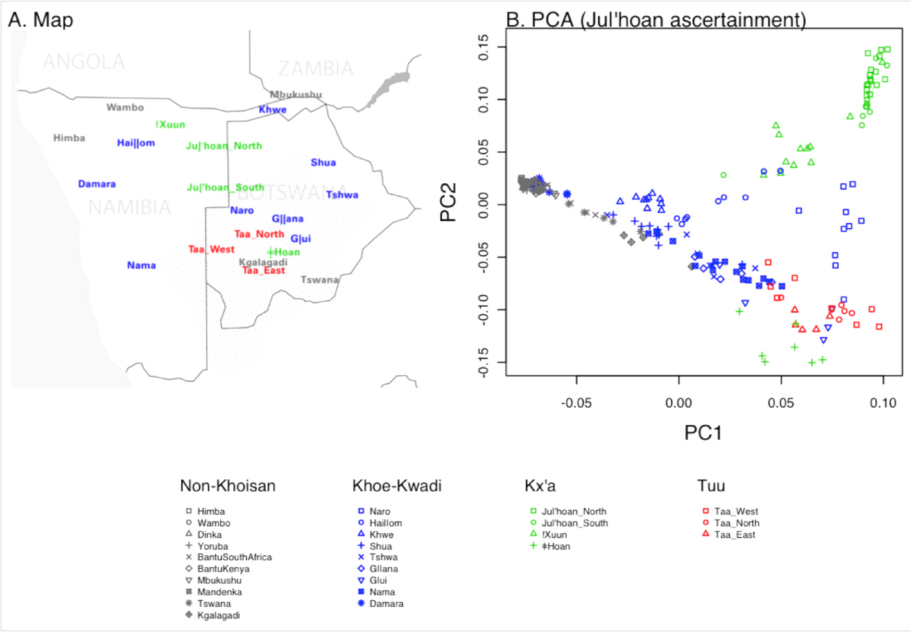  
Figure 1

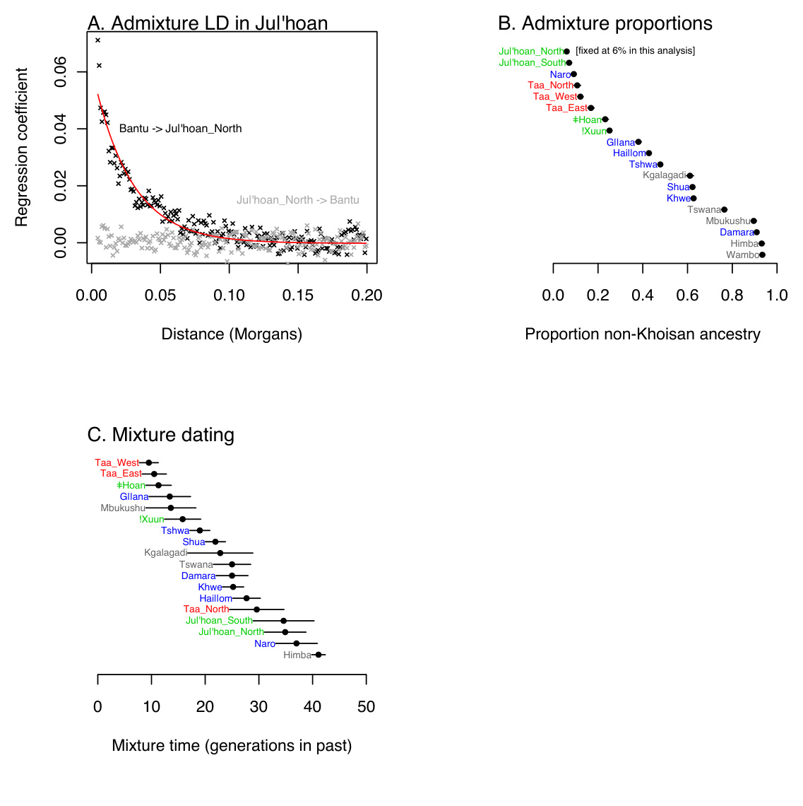  
Figure 2

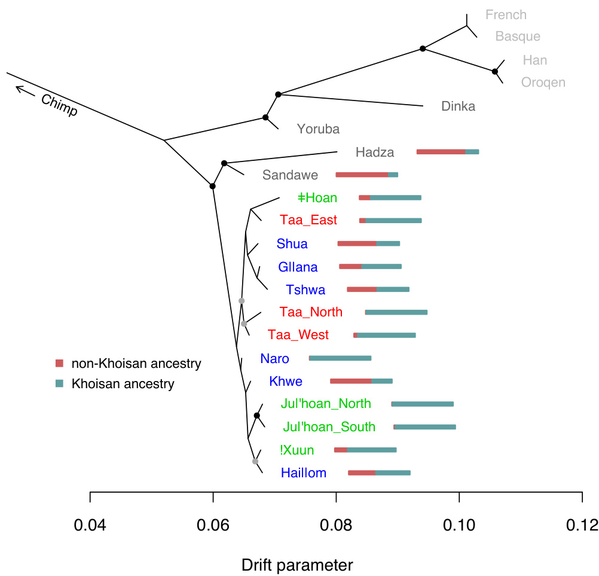  
Figure 3

# Supplementary Information for: The genetic prehistory of southern Africa

Joseph K. Pickrell1,⋆, Nick Patterson2, Chiara Barbieri3,14, Falko Berthold3,15, Linda Gerlach3,15, Tom G¨uldemann4, Blesswell Kure5, Sununguko Wata Mpoloka6, Hirosi Nakagawa7, Christfried Naumann4, Mark Lipson8, Po-Ru Loh8, Joseph Lachance9, Joanna L. Mountain10, Carlos D. Bustamante11, Bonnie Berger8, Sarah Tishkoff9, Brenna M. Henn11, Mark Stoneking12, David Reich1,2,⋆, Brigitte Pakendorf3,13,⋆

1 Department of Genetics, Harvard Medical School, Boston   
2 Broad Institute of MIT and Harvard, Cambridge   
3 Max Planck Research Group on Comparative Population Linguistics,   
MPI for Evolutionary Anthropology, Leipzig   
4 Seminar fu¨r Afrikawissenschaften, Humboldt University, Berlin and   
Department of Linguistics, MPI for Evolutionary Anthropology, Leipzig   
5 Department of Aesthetics and Communication, Aarhus University, Aarhus   
6 Department of Biological Sciences, University of Botswana   
7 Institute of Global Studies, Tokyo University of Foreign Studies, Tokyo   
8 Department of Mathematics and Computer Science and Artificial Intelligence Laboratory, MIT, Cambridge   
9 Departments of Biology and Genetics, University of Pennsylvania, Philadelphia   
10 23andMe, Inc., Mountain View   
11 Department of Genetics, Stanford University, Palo Alto   
12 Department of Evolutionary Genetics, MPI for Evolutionary Anthropology, Leipzig   
13 Current affiliation: Laboratoire Dynamique du Langage, UMR5596, CNRS and Universite´ Lyon Lumi\`ere 2   
14 Current affiliation: Department of Evolutionary Genetics, MPI for Evolutionary Anthropology, Leipzig   
15 Current affiliation: Department of Linguistics, MPI for Evolutionary Anthropology, Leipzig   
and Seminar fu¨r Afrikawissenschaften, Humboldt University, Berlin   
⋆ To whom correspondence should be addressed: Brigitte.Pakendorf@ish-lyon.cnrs.fr (BP)   
reich@genetics.med.harvard.edu (DR), joseph pickrell@hms.harvard.edu (JP)

November 27, 2024

# Contents

# 1 Supplementary Figures 2

Supplementary Tables 25   
3 Supplementary Methods 29   
3.1 Data 29   
3.1.1 Sampling 29   
3.1.2 Genotyping 29   
3.1.3 Merging data from Lachance et al. [20] 30   
3.1.4 Filtering “outlier” individuals 30   
3.2 Clustering analyses . 30   
3.2.1 PCA . 31   
3.2.2 ADMIXTURE analyses 31   
3.2.3 European ancestry in the Nama . 32   
3.3 Three- and four-population tests 32   
3.4 Using the decay of linkage disequilibrium to test for historical admixture 33   
3.4.1 Motivation 33   
3.4.2 Methods . 33   
3.4.3 Simulations 34   
3.4.4 Application to the Khoisan 35   
3.4.5 The f4 ratio test in the presence of admixed ancestral populations 35   
3.5 Estimating mixture dates with ROLLOFF 36   
3.6 Estimating population split times . 36   
3.6.1 Motivation 36   
3.6.2 Methods . 37   
3.6.3 Estimation of τ 38   
3.6.4 Calibration 39   
3.6.5 Simulations 40   
3.6.6 Application to the Khoisan 40   
3.7 TreeMix analyses . 41   
3.7.1 Analysis of the Hadza 41   
3.7.2 Analysis of the Sandawe 42   
3.7.3 West Eurasian ancestry in the Sandawe and Hadza. 42   
3.7.4 Modification of TreeMix to include known admixture . 43   
3.7.5 Analysis of the Mbuti and Biaka 43

# 1 Supplementary Figures

D D G 1 复豆 00 g 18 GG 8 K L G 1 K 3S 1 P 1 国 国 过

Supplementary Figure S1: Relationships between African languages spoken by populations in this study. In bold are populations included in this study; the Hadza and Sandawe are not shown because they are linguistic isolates.

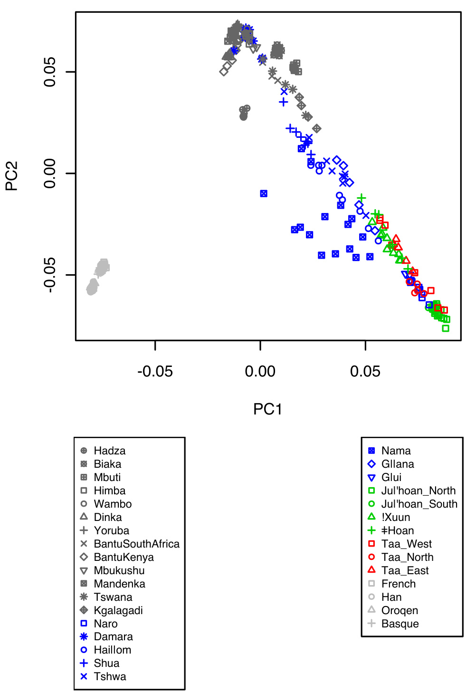

Supplementary Figure S2: PCA including non-African populations. We performed principal component analysis on the genotype matrix of individuals using smartpca [22] using the SNPs ascertained in a Ju|’hoan North individual. Plotted are the positions of each individual along principal component axes one and two. The colors and symbols for each population are depicted in the legend. 3

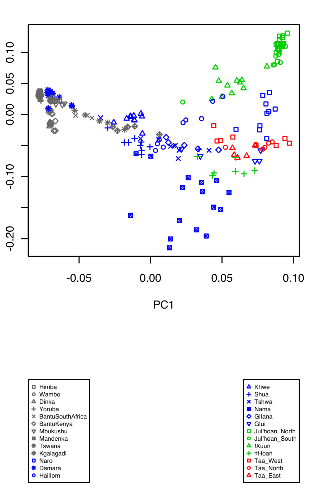

Supplementary Figure S3: PCA of African populations using all the SNPs on the chip. Each individual is represented by a point, and the color and style of the point is displayed in the caption.

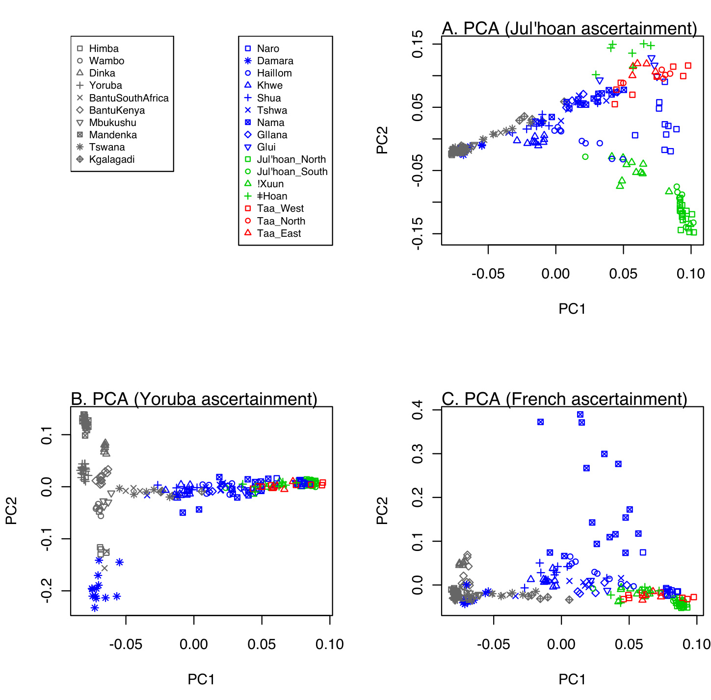  
Supplementary Figure S4: PCA on SNPs from different ascertainment panels. In each panel, each point represents an individual. The color and style of each point corresponds to the population of the individual as displayed in the legend. A. Ju|’hoan North ascertainment. This is same data presented in Figure 1B in the main text, but is included for comparison. B. Yoruba ascertainment. C. French ascertainment

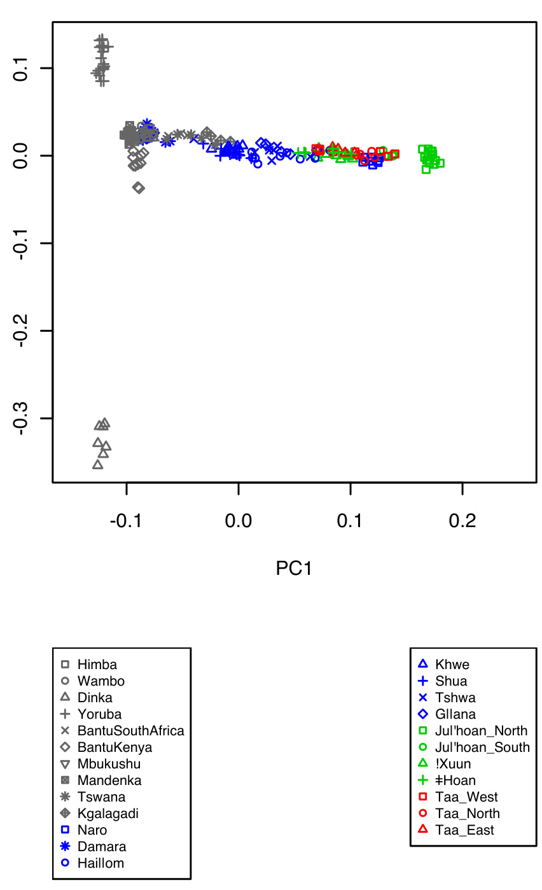

Supplementary Figure S5: PCA projection using Ju ’hoan North, Yoruba, and Dinka. We identified principal components using only the Ju|’hoan North, Yoruba, and Dinka, then projected the other samples (excluding outliers) onto these axes. All Khoisan populations fall on a cline between the Ju|’hoan North and the neighboring Bantu-speaking populations. This is consistent with the variation in non-Khoisan admixture in these populations being due to variation in admixture with neighboring agriculturist populations.

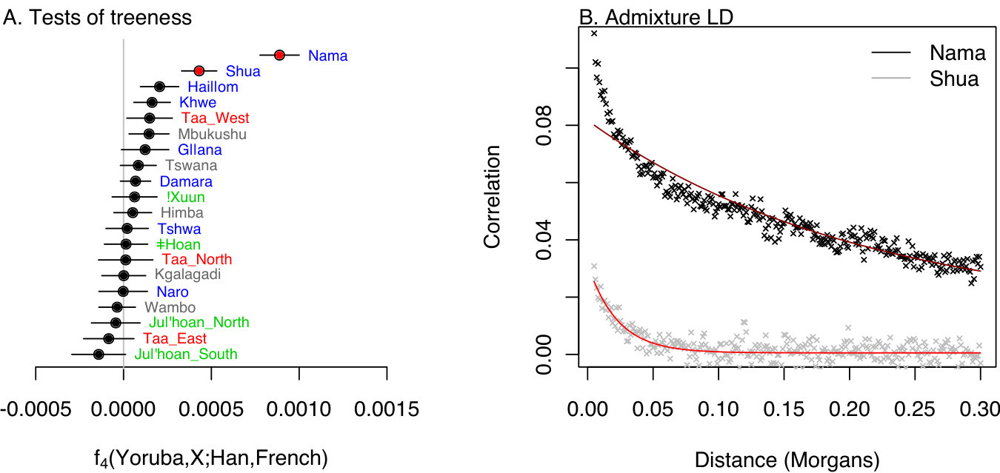  
Supplementary Figure S6: The Nama have recent non-African ancestry. A. Four-population tests. We performed four-population tests on the tree topology [[Yoruba,X],[Han,French]], where X represents any southern African population. Plotted is the value of the f4 statistic when each southern African population is used. Error bars show a single standard error, and points in red have a Z-score greater than 3. B. Admixture LD. We ran ROLLOFF on the Nama and the Shua using the Ju|’hoan North and the French as the mixing populations. There is a clear decay in the Nama (the shift away from the x-axis is indicative of variable ancestry across individuals, which is visually apparent in Supplementary Figure S2) and a less obvious decay in the Shua. The red lines show the fitted exponential curves.

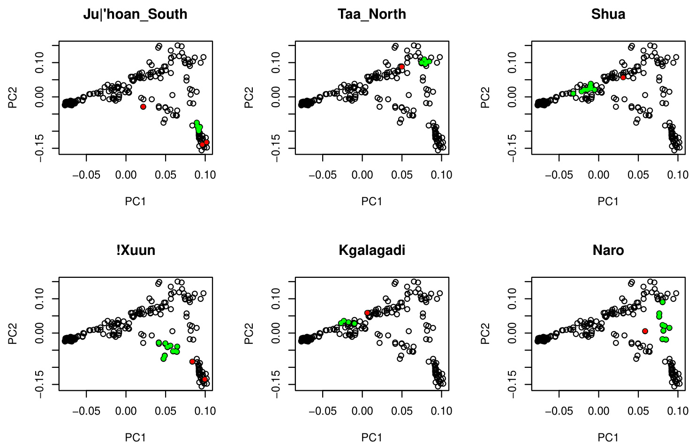

Supplementary Figure S7: Individuals excluded from populations. Shown are the PCA plot in Figure 1 in the main text, with different populations highlighted. In red are the individuals we excluded, and in green those that were kept. See Supplementary Table S1 for total sample sizes in each population.

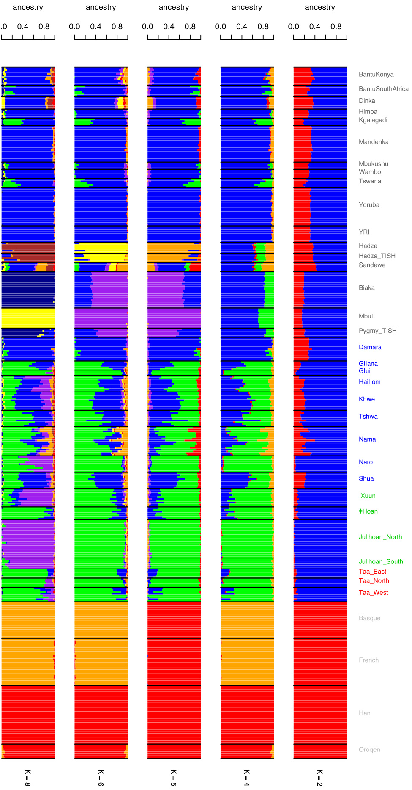  
Supplementary Figure S8: Clustering analyses of the merged sequenced and genotyped samples. We ran ADMIXTURE on all African individuals using different settings of K; shown are the resulting clusters. The populations merge9d from Lachance et al. [20] are YRI (compare to Yoruba), Hadza TISH (compare to Hadza), Pygmy TISH, and Sandawe.

A. Simulated demography

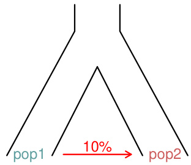

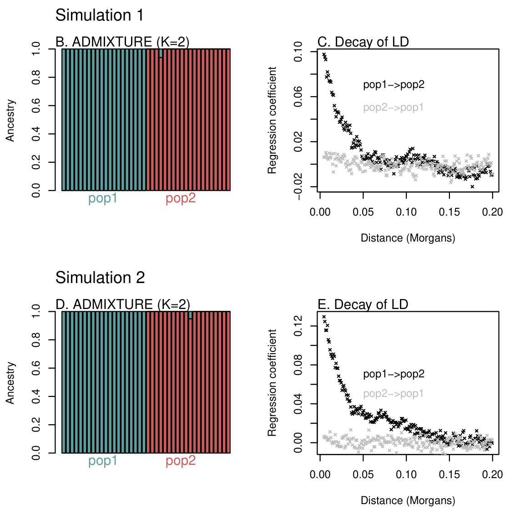  
Supplementary Figure S9: LD information identifies previously undetectable admixture events. We performed simulations of two populations, one of which admixed with the other 40 generations in the past (see Section 3.4 for details). Shown are results from two simulations. A. The simulated demography. B,D. Results from running ADMIXTURE on the simulated data. C,E. Results from the measure of LD decay described in Section 3.4.

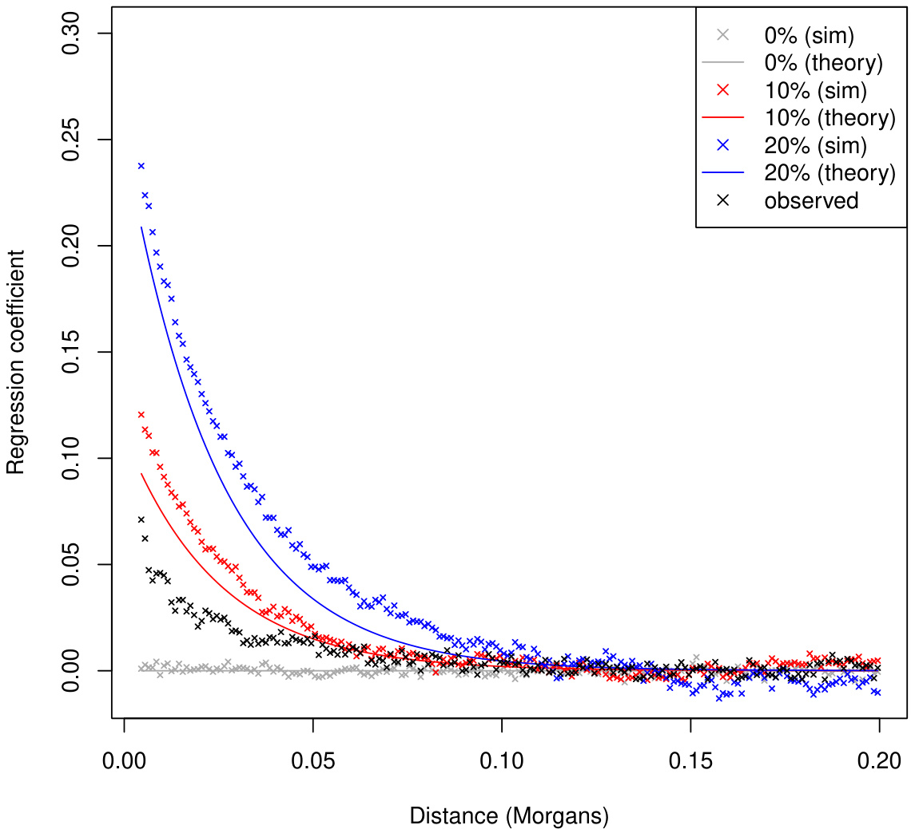  
Supplementary Figure S10: Estimating mixture proportions from LD. We simulated genetic data under different demographies including admixture (Supplementary Information), and then estimated admixture proportions using the method described in the text. The colored and grey points represent the decay curve obtained in simulations (each curve is the average of five simulations of 100 Mb), and the lines are the theoretical curves. In black is the data from the Ju ’hoan North and Yoruba, treating the Ju ’hoan North as admixed.

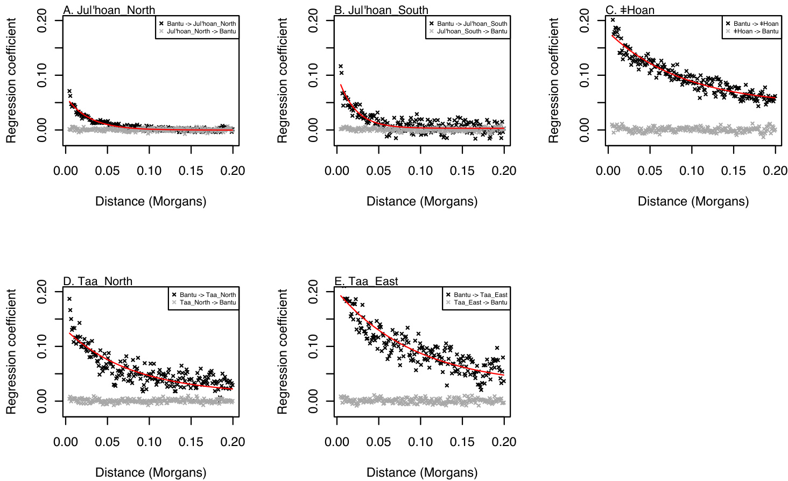  
Supplementary Figure S11: Admixture LD in populations that pass the threepopulation test. We measured the decay of admixture LD on the five Khoisan populations that show no evidence of admixture in three-population tests. The method is described in Section 3.4. Each panel shows an individual population; panel A. is a version of Figure 2A from the main text with the y-axis modified to be the same as the other panels. In all cases, the non-Khoisan population used in the analysis is the Yoruba. In red is the fitted exponential curve.

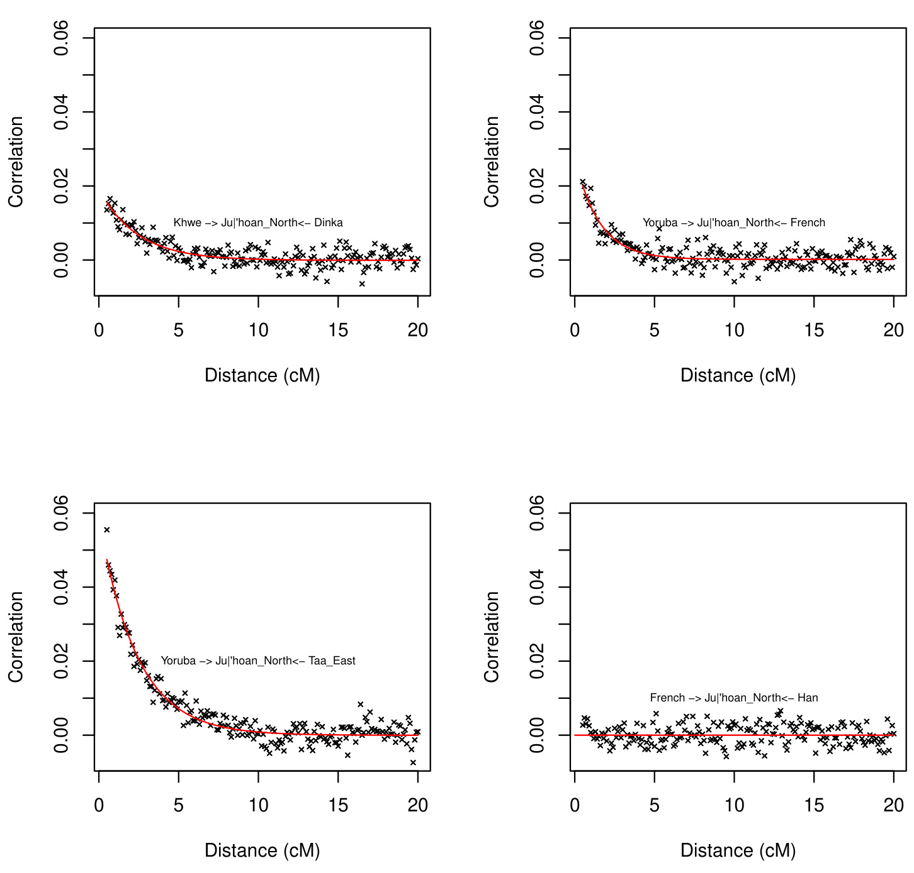  
Supplementary Figure S12: ROLLOFF analysis of the Ju ’hoan North. We explored the correlation between the decay of LD in the Ju ’hoan North and the divergence between other pairs of populations using ROLLOFF. At each pair of SNPs, we estimate the amount of LD in the Ju ’hoan North (as measured by a correlation in genotypes [27] ) and the product of the differences in allele frequency between two reference populations. The reference populations in each panel are listed to either side of the Ju ’hoan North. We then calculate the correlation between these two values, binning pairs of SNPs by the genetic distance between them. Each point is the value of this correlation (the y-axis) plotted against the genetic distance bin (the x-axis). A detectable curve suggests that the target population (in this case the Ju ’hoan) is admixed. Note a curve can be present even if the reference populations are quite distant from the true mixing populations. In this case, a curve is seen except when using two non-African populations as references. In red is the fitted exponential curve.

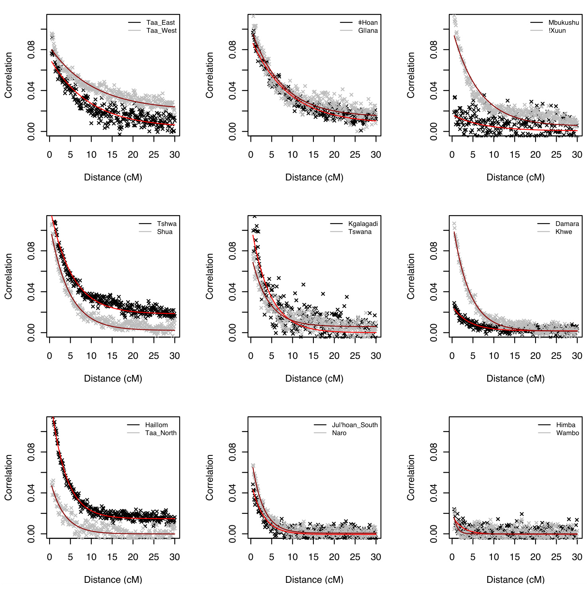  
Supplementary Figure S13: ROLLOFF analysis of all southern African populations. For each southern African population, we ran ROLLOFF [27] using the Ju ’hoan North and Yoruba as the mixing populations. The method is as described in Supplementary Figure S12 and the Supplementary Material. Shown are the resulting curves for each population; in red are the fitted exponential curves.

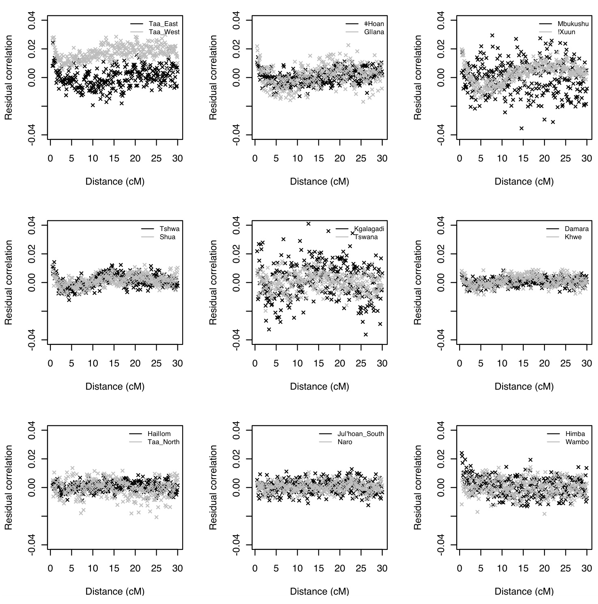  
Supplementary Figure S14: Residuals from ROLLOFF analysis of all southern African populations. Plotted are the residuals from the fit of the exponential curves for each population from Supplementary Figure S13. Residual correlation may indicate multiple waves of mixture in some populations.

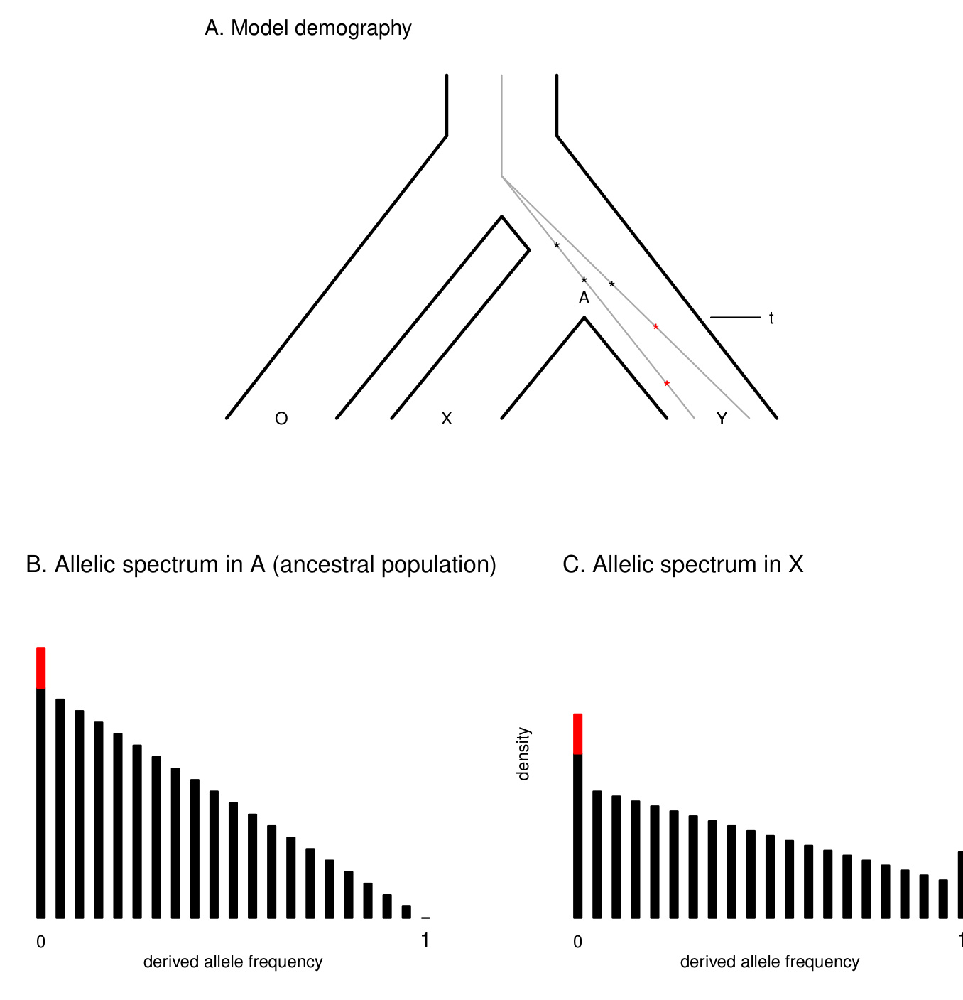

Supplementary Figure S15: Scheme for dating population splits. A. Demographic model. Plotted is the demographic model used in our method for dating population split times. Populations are labeled in black, and the split time is denoted t. In grey is the history of the two chromosomes used for SNP ascertainment. Stars represent mutations, and are colored according to whether they arose before (black) or after (red) the population split. B. A hypothetical allelic spectrum in population A. The red peak at zero corresponds to the mutations that happened on the lineage to Y . C. The hypothetical allelic spectrum in X. Though alleles change frequency from A to X, the size of the red component of the peak at zero stays constant.

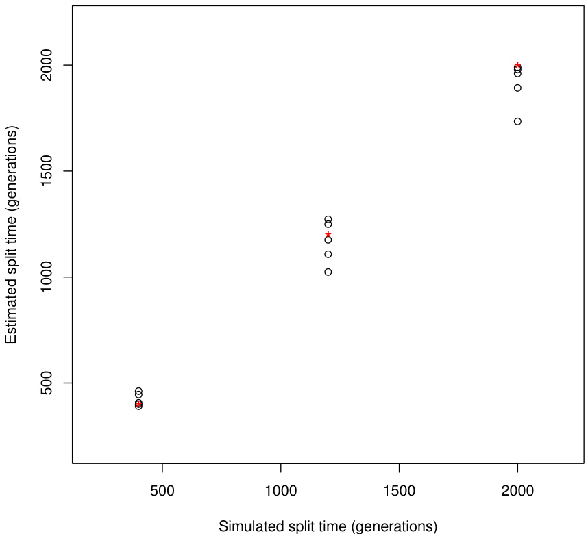  
Supplementary Figure S16: Estimating split times in simulations without migration. Shown are the simulated and inferred split times in simulations without migration. The red stars show the true simulated values, and the black points the estimates.

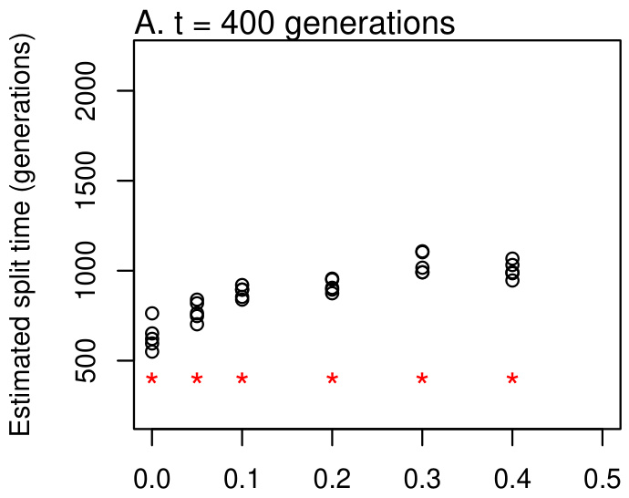  
admixture proportion in X

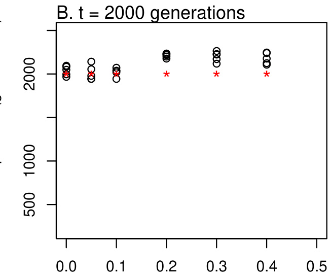  
Estimated split time (generations)   
admixture proportion in X

Supplementary Figure S17: Estimating split times in simulations with migration. Shown are estimated split times between X and Y when both have experienced some level of admixture with an outgroup. The black points show estimated split times in the presence of admixture. The red stars show the true simulated values. In all simulations, population Y has 5% admixture from the outgroup that occurred 40 generations in the past, while population X has variable levels of admixture (plotted on the x-axis).

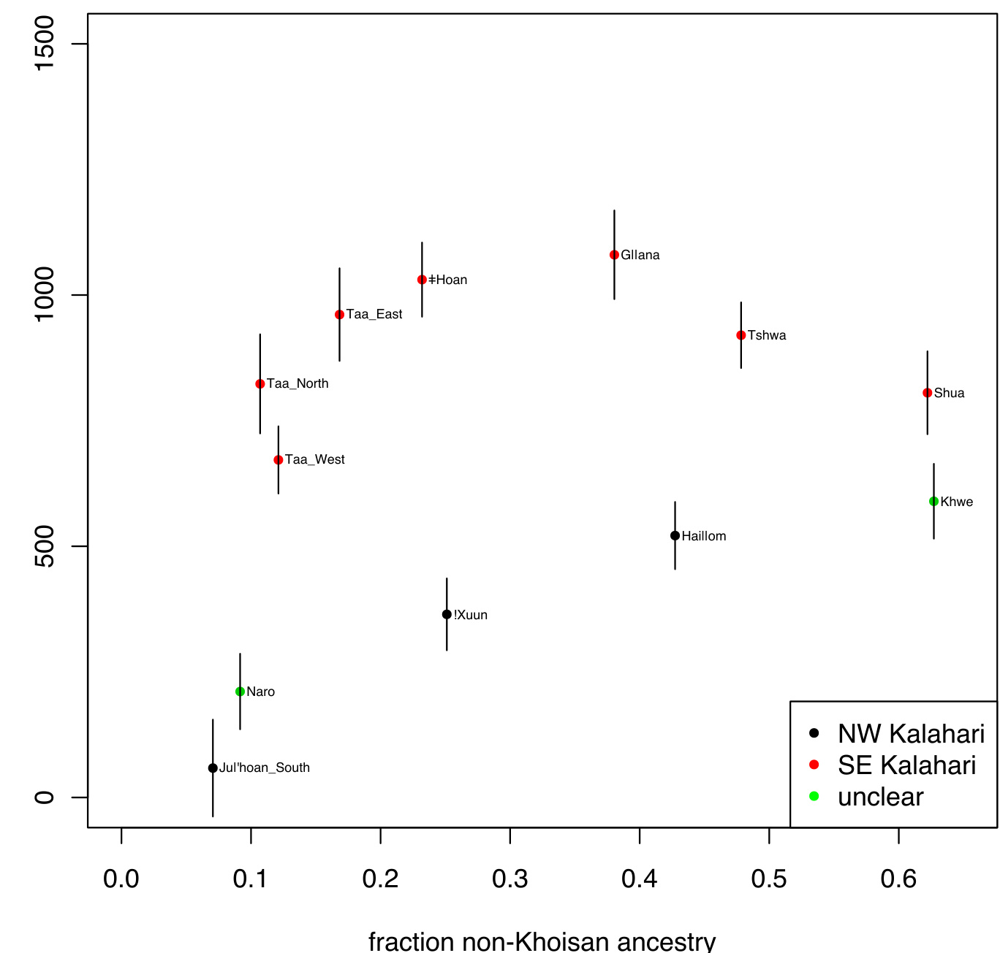

Supplementary Figure S18: Dating the split time of the Khoisan populations. We plot the estimated times since each Khoisan population split from the Ju|’hoan North, as a function of their level of non-Khoisan-admixture. The populations included are all the southern African groups in Figure 3 in the main text. The errors bars are one standard error (not including the error in the estimate of τ ). Khoisan populations are colored according to whether they have strong evidence (from Figure 3 in the main text) as coming from the northwestern Kalahari cluster or the southeastern Kalahari cluster. Populations that have no clear grouping are colored in green. All split times are likely overestimated due to non-Khoisan admixture (see Supplementary Figure S17)

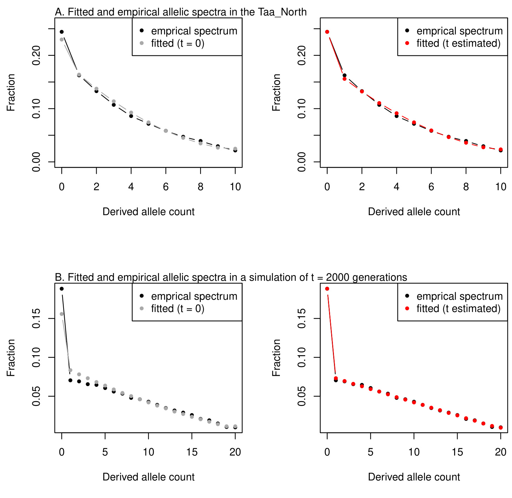

Supplementary Figure S19: Dating the split time of Taa North. A. We plot the empirical allele frequency spectrum in the Taa North at SNPs ascertained in a single Ju ’hoan North individual (in black). For comparison we plot the fitted allelic spectra if we assume the split time between Taa North and the Ju|’hoan North is zero (in grey in the left panel) or if we allow the model to estimate the split time (in red in the right panel). Note that the empirical spectrum is non-linear, implying that the ancestral population was not of constant size. B. We plot the analogous spectra for a single simulation of a split time of 2,000 generations with no migration.

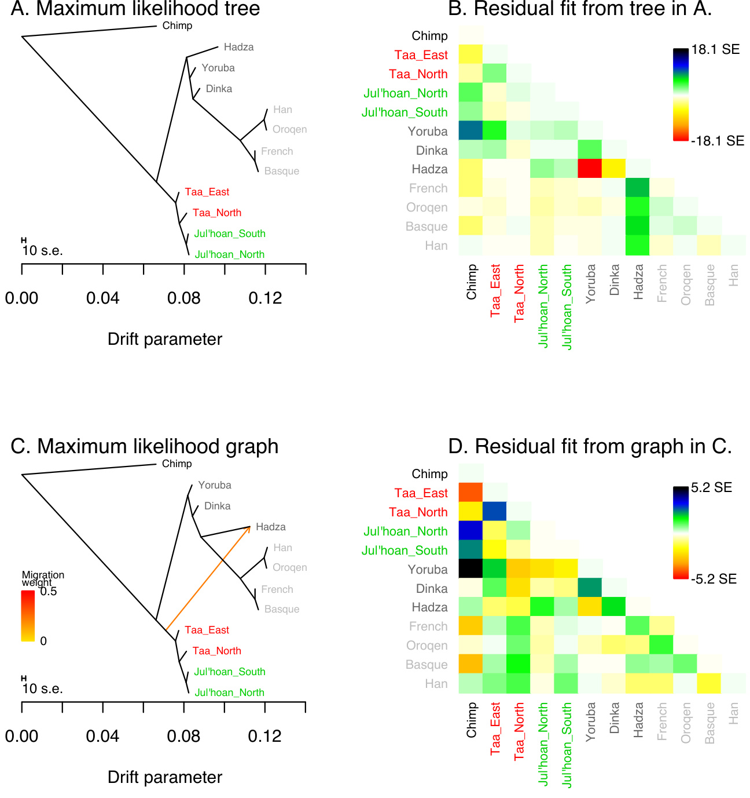  
Supplementary Figure S20: TreeMix analysis of the Hadza. Shown is the maximum likelihood tree of populations including the Hadza (A.), the residual fit from this tree (B.), the inferred graph allowing for a single migration edge (C.), and the residual fit from this graph (D.). See Supplementary text for discussion. Note that the choice of which edge to the Hadza is called the “migration” edge is arbitrary [36] ; for Figure 3 in the main text we force the non-Khoisan ancestry in the Hadza to be the “migration” edge.

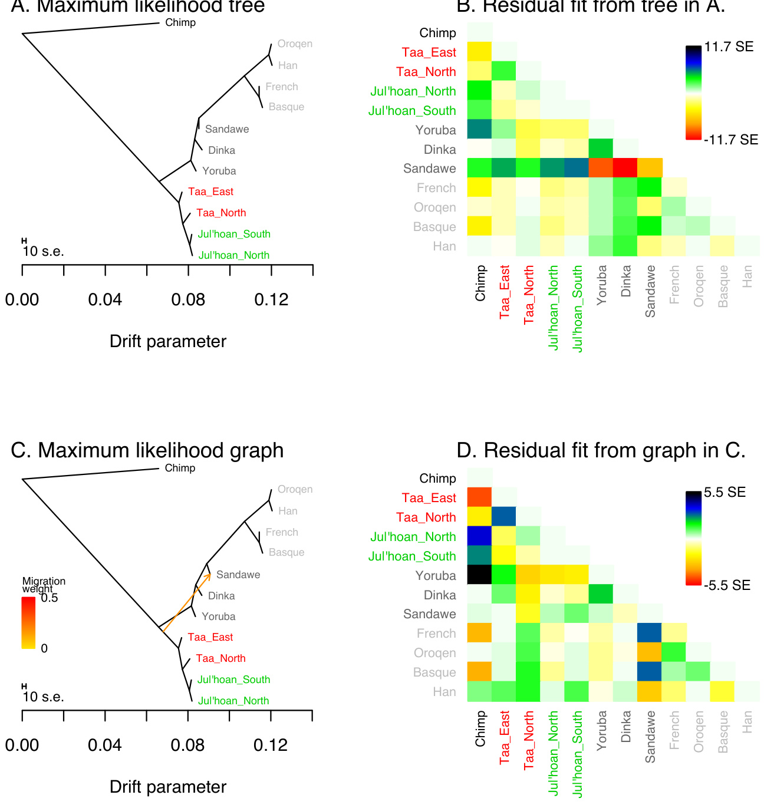  
Supplementary Figure S21: TreeMix analysis of the Sandawe. Shown is the maximum likelihood tree of populations including the Sandawe individuals. (A.), the residual fit from this tree (B.), the inferred graph allowing for a single migration edge (C.), and the residual fit from this graph (D.). See Supplementary text for discussion. Note that the choice of which edge to the Sandawe is called the “migration” edge is arbitrary [36] ; for Figure 3 in the main text we force the non-Khoisan ancestry in the Sandawe to be the “migration” edge.

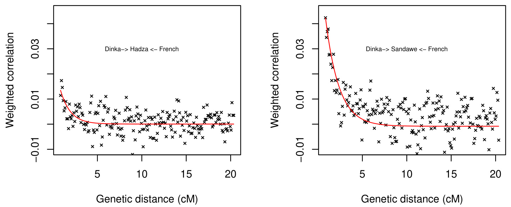

Supplementary Figure S22: Admixture linkage disequilibrium in the Hadza and Sandawe. We ran ROLLOFF [27] on the Hadza and Sandawe, using the Dinka and French as reference populations. Shown are the resulting curves for the Hadza and Sandawe. There is a striking curve of admixture LD in the Sandawe, which is weaker in the Hadza.

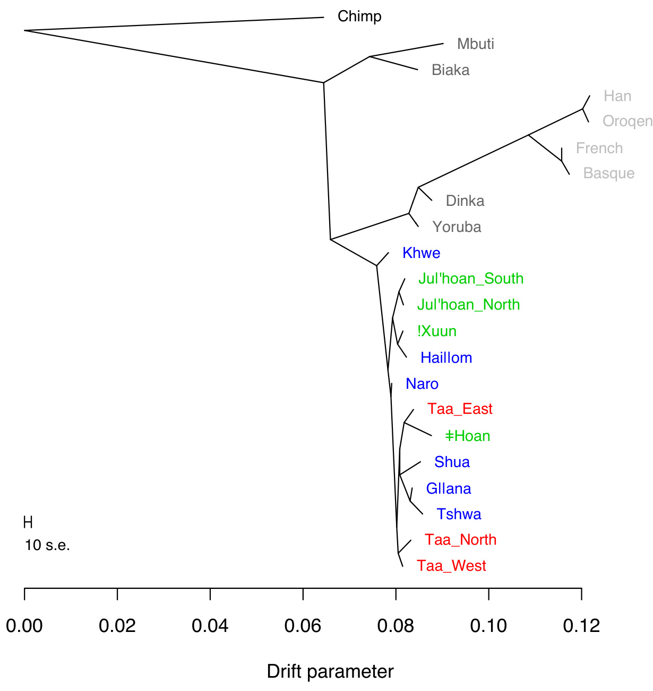  
Supplementary Figure S23: TreeMix analysis including the Mbuti and Biaka. We used a modified TreeMix approach to build a tree of populations after subtracting out Bantu or Dinka-like ancestry. Shown is the resulting tree; see the Supplementary text for details and discussion.

<html><body><table><tr><td>Population</td><td>Language family</td><td>Linguistic subgroup</td><td># of samples</td></tr><tr><td>Taa_East</td><td>Tuu</td><td>Taa-Lower Nossob</td><td>6</td></tr><tr><td>Taa_North</td><td>Tuu</td><td>Taa-Lower Nossob</td><td>6</td></tr><tr><td>Taa_West</td><td>Tuu</td><td>Taa-Lower Nossob</td><td>8</td></tr><tr><td>!Xuun</td><td>Kx'a</td><td>Northwest Ju</td><td>13</td></tr><tr><td>Jul'hoan_North</td><td>Kx'a</td><td>Southeast Ju</td><td>16</td></tr><tr><td>Jul'hoan_South</td><td>Kx'a</td><td>Southeast Ju</td><td>9</td></tr><tr><td>+Hoan</td><td>Kx'a Khoe-Kwadi</td><td>‡Hoan</td><td>7</td></tr><tr><td>Shua</td><td></td><td>East Kalahari Khoe East Kalahari Khoe</td><td>10</td></tr><tr><td>Tshwa</td><td>Khoe-Kwadi</td><td></td><td>10</td></tr><tr><td>Khwe</td><td>Khoe-Kwadi</td><td>West Kalahari Khoe, Kxoe branch</td><td>10</td></tr><tr><td>Naro</td><td>Khoe-Kwadi</td><td>West Kalahari Khoe, Naro branch</td><td>10</td></tr><tr><td>G|ui</td><td>Khoe-Kwadi</td><td>West Kalahari Khoe,G|lana branch</td><td>5</td></tr><tr><td>G|lana</td><td>Khoe-Kwadi</td><td>West Kalahari Khoe, G|lana branch</td><td>5</td></tr><tr><td>Haillom</td><td>Khoe-Kwadi</td><td>KhoeKhoe</td><td>10</td></tr><tr><td>Nama</td><td>Khoe-Kwadi</td><td>KhoeKhoe</td><td>16</td></tr><tr><td>Damara</td><td>Khoe-Kwadi</td><td>KhoeKhoe</td><td>15</td></tr><tr><td>Kgalagadi</td><td>Niger-Congo</td><td>Bantu</td><td>5</td></tr><tr><td>Wambo</td><td>Niger-Congo</td><td>Bantu</td><td>5</td></tr><tr><td>Mbukushu</td><td>Niger-Congo</td><td>Bantu</td><td>4</td></tr><tr><td>Tswana</td><td>Niger-Congo</td><td>Bantu</td><td>5</td></tr><tr><td>Himba</td><td>Niger-Congo</td><td>Bantu</td><td>5</td></tr><tr><td>Hadza</td><td>isolate</td><td>Hadza</td><td>7</td></tr></table></body></html>

Supplementary Table S1: Summary of samples genotyped in this study.

<html><body><table><tr><td>Sample</td><td>Population</td></tr><tr><td>BOT6.090 NAM066 NAM051</td><td>Jul'hoan_South Jul'hoan_South Jul'hoan_South</td></tr><tr><td>BOT6.025</td><td>Taa_North</td></tr><tr><td>BOT6.255</td><td>Shua</td></tr><tr><td>NAM189 NAM195</td><td>!Xuun !Xuun</td></tr><tr><td></td><td></td></tr><tr><td>BOT6.004</td><td>Kgalagadi</td></tr><tr><td>DR000071</td><td>Hadza</td></tr><tr><td>BOT6.058</td><td>Naro</td></tr></table></body></html>

Supplementary Table S2: Individuals removed from analysis.

<html><body><table><tr><td>Target Population</td><td>"Mixing” populations</td><td>Minimum f3</td><td>Z-score</td></tr><tr><td>Khwe</td><td>Ju'hoan_North,Yoruba</td><td>-0.005</td><td>-38.7</td></tr><tr><td>Haillom</td><td>Jul'hoan_North,Yoruba</td><td>-0.005</td><td>-33.9</td></tr><tr><td>Tshwa</td><td>Jul'hoan_North,Yoruba</td><td>-0.005</td><td>-29.9</td></tr><tr><td>Shua</td><td>Jul'hoan_North,Yoruba</td><td>-0.004</td><td>-28.8</td></tr><tr><td>Tswana</td><td>Yoruba, Taa_West</td><td>-0.004</td><td>-23.8</td></tr><tr><td>!Xuun</td><td>Jul'hoan_North,Yoruba</td><td>-0.004</td><td>-20.3</td></tr><tr><td>G|lana</td><td>Jul'hoan_North,Yoruba</td><td>-0.005</td><td>-21.3</td></tr><tr><td>Kgalagadi</td><td>Jul'hoan_North,Yoruba</td><td>-0.002</td><td>-8.4</td></tr><tr><td>Naro</td><td>Jul'hoan_North,Taa_North</td><td>-0.0006</td><td>-4.4</td></tr><tr><td>Mbukushu</td><td>Jul'hoan_North,Yoruba</td><td>-0.0008</td><td>-3.9</td></tr><tr><td>Taa_West</td><td>Taa_North,Kgalagadi</td><td>-0.0008</td><td>-3.6</td></tr><tr><td>Wambo</td><td>Jul'hoan_North,Yoruba</td><td>-0.0003</td><td>-1.6</td></tr></table></body></html>

Supplementary Table S3: Three-population tests for treeness. We performed threepopulation tests on all possible combinations of populations. Shown are all populations with at least one negative f3 statistic, the names of the putative mixing populations that give rise to the minimum f3 statistic, the value of the statistic, and the Z-score. A Z-score of less than -3 corresponds to a p-value of less than 0.001. The populations labeled as “mixing” populations are those that give the minimum f3 statistic, and are not necessarily the populations that actually mixed historically.

<html><body><table><tr><td>Population</td><td>Proportion non-Khoisan ancestry</td><td>Date of mixture (gen.)</td></tr><tr><td>Jul'hoan_North</td><td>0.06</td><td>35</td></tr><tr><td>Jul'hoan_South</td><td>0.07</td><td>35</td></tr><tr><td>Naro</td><td>0.09</td><td>37</td></tr><tr><td>Taa_North</td><td>0.11</td><td>30</td></tr><tr><td>Taa_West</td><td>0.12</td><td>10</td></tr><tr><td>Taa_East</td><td>0.17</td><td>11</td></tr><tr><td>?Hoan</td><td>0.23</td><td>11</td></tr><tr><td>!Xuun</td><td>0.25</td><td>16</td></tr><tr><td>G|lana</td><td>0.38</td><td>13</td></tr><tr><td>Haillom</td><td>0.43</td><td>28</td></tr><tr><td>Tshwa</td><td>0.48</td><td>19</td></tr><tr><td>Kgalagadi</td><td>0.61</td><td>23</td></tr><tr><td>Shua</td><td>0.62</td><td>22</td></tr><tr><td>Khwe</td><td>0.63</td><td>25</td></tr><tr><td>Tswana</td><td>0.76</td><td>25</td></tr><tr><td>Mbukushu</td><td>0.90</td><td>14</td></tr><tr><td>Damara</td><td>0.90</td><td>25</td></tr><tr><td>Himba</td><td>0.93</td><td>41</td></tr><tr><td>Wambo</td><td>0.93</td><td>NA</td></tr></table></body></html>

Supplementary Table S4: Admixture parameters in southern Africa. We report the admixture proportions and times for each southern African population displayed in Figure 2 in the main text.

# 3 Supplementary Methods

# 3.1 Data

# 3.1.1 Sampling

The southern African samples included in this study were collected in various locations in Botswana and Namibia as part of a multidisciplinary project, after ethical clearance by the Review Board of the University of Leipzig and with prior permission of the Ministry of Youth, Sport and Culture of Botswana and the Ministry of Health and Social Services of Namibia. Informed consent was obtained from all donors by carefully explaining the aims of the study and answering any arising questions with the help of translators fluent in English/Afrikaans and the local lingua franca; when necessary, a second translation from the local lingua franca into the native language of a potential donor was provided by individuals within each sampling location. Approximately 2ml of saliva were collected in tubes containing 2ml of stabilizing buffer; DNA was extracted from the saliva with a modified salting-out method [39].

For the purposes of this study, a minimum of 10 unrelated individuals from each linguistic branch of the three Khoisan language families as given by Gu¨ldemann [40] were selected from the total number of samples collected in the field, as shown in Supplementary Table S1 and Supplementary Figure S1; only the }Hoan branch is represented by fewer than 10 individuals due to the small number of samples available. It should be noted that the “linguistic subgroup” given in the table does not represent the same level of linguistic relationship for all the populations. The group here called Ju|’hoan North largely corresponds to what is known as Ju ’hoan, often simply referred to as San in the literature. The Ju ’hoan South are also known as }Kx’au ’en. Since the dialectal boundaries are as yet uncertain and since both groups partly self-identified as Ju|’hoan, we here chose geographically defined labels. The HGDP “San” samples were included with the Ju|hoan North sample, since they clearly stem from this population [18] and empirically we cannot detect any genetic differentiation between them using the data from this study. For the Khwe, five samples each of the ||Xokhoe and ||Anikhoe subgroups were combined, while Damara and Nama individuals were chosen to represent the greatest diversity of traditional subgroups. Since not enough samples were available from all the different Taa dialects, the subgroups of Taa investigated here were chosen based on both linguistic and geographic criteria; they do not correspond to any single linguistic unit. The Taa West group includes speakers of the West !Xoon and !Ama dialects, Taa North comprises speakers of the East !Xoon dialect, and Taa East includes speakers of the Tshaasi and }Huan dialects. In addition, five samples each from different Bantu-speaking groups from southwestern Zambia (Mbukushu), Namibia (Himba and Wambo), and Botswana (Kgalagadi and Tswana) were included.

The Hadza samples are a subset of those from Henn et al. [17] . Genotypes from other populations were available from other sources, as described below.

# 3.1.2 Genotyping

Samples were sent to Affymetrix to be genotyped on the Human Origins array. Full details about this array are in Patterson et al. [19] , but briefly, SNPs were ascertained by identifying heterozygous SNPs in lowcoverage sequencing of single individuals of known ancestry. The SNPs on the array can thus be split into panels of SNPs discovered in different individuals. In all analyses, we consider only autosomal SNPs. Except where otherwise noted, we restrict ourselves to using the 150,425 SNPs discovered in a single Ju ’hoan North (HGDP “San”) individual. The exception to this are all ROLLOFF analyses (e.g., Figures 2A and 2C in the main text), where we used all 565,259 SNPs on the array.

The Dinka genotypes were taken from Meyer et al. [21] . Genotypes from other populations were described in Patterson et al. [19] .

# 3.1.3 Merging data from Lachance et al. [20]

Full genome sequences for five Sandawe, five Hadza, and five Baka/Bakola individuals were obtained via Complete Genomics by Lachance et al. [20] and merged with publicly available Complete Genomics data from a number of other individuals. For our purposes, the most important of these samples are 1) the five Sandawe samples, 2) the five Hadza samples, for comparison to the Hadza we have genotyped, and 3) the HapMap “YRI” samples, since we have genotyped some of these exact samples on the Affymetrix Human Origins array (and thus can get estimates of genotype error rate). We extracted the genotypes at each SNP on the Human Origins array from the Complete Genomics sequences.

To detect SNPs where genotyping (on either the array or via sequencing) performed poorly, we used a set of eight Yoruba (HapMap YRI) samples that were both sequenced by Complete Genomics and genotyped on the Human Origins array. We removed all SNPs where there were any discordant genotypes between these 8 samples. There were 10,888 such SNPs. We then merged the sequenced Hadza and Sandawe samples into the southern African dataset, again considering only autosomal SNPs. For all analyses involving the Hadza and Sandawe, we included these Hadza and Sandawe individuals. We used the sequenced YRI samples only for quality control.

Quality control. Since the Hadza population is quite small, we first used plink [41] to test whether the two sets of Hadza samples (those genotyped on the array and those genotyped by sequencing) contained any relatives. We removed one individual that appeared to be the exact same individual in the two samples (πˆ = 0.98 when using the --genome option in plink)

We then wanted to ensure that there were no systematic differences between samples directly genotyped on the array and those genotyped by sequencing. To look for systematic effects, we used the clustering algorithm ADMIXTURE [42]. Two populations, the Hadza and the Yoruba/YRI, include some samples genotyped on the array and some genotyped via sequencing. For both of these populations, there do not appear to be any substantial differences between samples typed using the two methods (Section 3.2.2, Supplementary Figure S8)

# 3.1.4 Filtering “outlier” individuals

As described in the main text, for analyses where we grouped individuals into populations, we removed genetic outliers. To identify individuals that were genetic outliers with respect to their population, we performed PCA on the genotype matrix using the SNPs ascertained in a single Ju|’hoan North individual (see Section 3.2). We examined each population in turn, and removed individuals that appear as outliers in their population (Supplementary Figure S7). A list of all the individuals removed from subsequent analyses is in Supplementary Table S2. We furthermore excluded the G|ui population, for whom we could not identify a clear genetic cluster of individuals, since three samples clustered with the southeast Kalahari groups, and two with the Nama and G ana.

# 3.2 Clustering analyses

We performed clustering analysis of the genotype matrix using both PCA [22] and ADMIXTURE [42]. The latter is a fast implementation of the admixture model of STRUCTURE [43] appropriate for genome-wide

data.

# 3.2.1 PCA

We first performed PCA [22] using the SNPs ascertained in the Ju ’hoan North individual and including some non-African populations (Supplementary Figure S2). Nearly all of the Khoisan fall along a cline between the least admixed Khoisan populations and the rest of the African populations. The one major exception is the Nama, who are scattered in the PCA plot, indicating differential relatedness to non-African populations. We examine this further in Section 3.2.3.

We then considered only the African populations (excluding the Hadza and Sandawe, as we analyze them separately in Sections 3.7.1 and 3.7.2). As described in the main text, we performed PCA using SNPs ascertained in either a Ju|’hoan North (HGDP “San” individual) (Supplementary Figure S4A), a Yoruba (Supplementary Figure S4B), or a French (Supplementary Figure S4C).

Substructure within Khoisan populations. The PCA (Figure 1B in main text, or Supplementary Figure S4A) indicates that the Taa West and the Hai||om are genetically substructured populations: Half of the Taa West individuals fall into the southeast Kalahari cluster, while the other half cluster with Nama and G||ana. This genetic substructure correlates with a major linguistic boundary: the individuals falling into the southeast Kalahari cluster speak the West !Xoon dialect of Taa, while three of the other individuals speak the !Ama dialect. In the case of the Hai||om, four individuals cluster close to the Tshwa and Khwe, while the other five cluster with the !Xuun. This genetic substructure in the Hai||om reflects geographic variation: the five individuals that show affnities with the !Xuun come from close to the Angolan border in northern Namibia, where the two groups are settled in close proximity, while the remaining Hai||om come from the Etosha area further to the southwest. Conversely, for some groups the known ethnolinguistic subdivisions do not correspond to genetic distinctions. Thus, the Damara sample included four individuals from Sesfontein, and the Nama sample included five Topnaar from the Kuiseb Valley; these groups are linguistically distinct [44], but appear genetically indistinguishable from other Damara and Nama, respectively. Similarly, the two Khwe subgroups cannot be distinguished from each other in the analyses.

PCA projection. In Supplementary Figure S4C, there is a shift of some Khoe-speaking populations on the y-axis. For the Nama, we show in Section 3.2.3 that this is due to recent European ancestry. For the other populations, we speculate that this may be due to eastern African ancestry. We performed a PCA projection where we first ran the analysis using only the Ju ’hoan North, Yoruba, and Dinka, and then projected the remaining Khoisan populations on the identified PCs. In this analysis, the Yoruba represent western African populations and the Dinka represent eastern African populations. This analysis was performed on the French-ascertained SNPs, as these are the SNPs where a potential eastern African signal in some of the southern Africans is seen in Supplementary Figure S4C. The results are shown in Supplementary Figure S5. The projected samples fall on a line between their Bantu-speaking neighbors and the Ju ’hoan North. This suggests that the majority of the variation in admixture in these populations is due to variable levels of admixture with their neighbors. However, we cannot rule out some level of admixture with non-Bantu-speaking populations.

# 3.2.2 ADMIXTURE analyses

We ran ADMIXTURE [42] on all of the individuals in the African populations (including the French, Basque, Han and Oroqen as reference non-African populations). To prepare the data for analysis, we thinned SNPs in

LD using plink [41], as suggested by the authors [42]. The precise command was --indep-pairwise 50 10 0.1. Results for different numbers of clusters are shown in Supplementary Figure S8 (this is for the combined set of southern and eastern African populations). We recapitulate previous results showing that clustering analyses find correlations in allele frequencies between southern African populations and the Mbuti, Biaka, Hadza, and Sandawe [16] (see K = 4). We additionally recapitulate (at K = 8) the PCA result showing detectable structure between northwestern and southeastern Kalahari populations.

# 3.2.3 European ancestry in the Nama

The positions of the Nama individuals in Supplementary Figure S2 are suggestive of post-colonial European admixture, in accordance with historic documentation of European ancestry in some Nama groups [23] . To test this, we used four-population tests [26] of the form [[Yoruba, X],[Han, French]], where X is any southern African population. A positive f4 statistic indicates gene flow between X and a population related to the French (or alternatively gene flow between populations related to the Yoruba and Han). The most strongly positive f4 statistic in the southern African populations is for the Nama (Supplementary Figure S6A), as expected if they have experienced European admixture. To confirm the direction of this gene flow, we used ROLLOFF [27] to test if there is detectable admixture LD in the Nama. If we use the Ju|’hoan North and the French as the putative mixing populations, there is clear admixture LD (Supplementary Figure S6B), we date this mixture to approximately five generations (≈150 years) ago. The single exponential curve does not perfectly fit the curve in the Nama at shorter genetic distances (Supplementary Figure S6B), indicating that they were likely admixed with some non-Khoisan group at the time of the European admixture. This means that the extremely recent inferred date of admixture in the Nama (five generations) may still be a slight overestimate.

Interestingly, a few of the Khoe-speaking populations have slightly positive f4 statistics in this comparison, and in the Shua the f4 statistic is significantly greater than zero. We speculate that some of the Khoe-speaking populations have a low level of east African ancestry, and that the relevant east African population was itself admixed with a western Eurasian population. The Shua also show a detectable signal of admixture LD, though we estimate the admixture date as much older (44 generations). This potential signal of potential east African ancestry specifically in Khoe-speaking populations is of particular interest in the light of the hypothesis that the Khoe-Kwadi languages were brought to southern Africa by a pre-Bantu pastoralist immigration from eastern Africa [40].

Given that the Nama are the only pastoralist Khoisan group included in our dataset, their relationship to the other Khoisan populations is of particular interest. Unfortunately, the recent European admixture they have undergone prevents us from including them in further analyses. However, as shown by the PCA based on Ju|hoan SNPs (Fig. 1B in main text), the Nama do not stand out among the other Khoisan populations, notwithstanding their distinct life-style. Rather, they cluster closely with Tshwa and G ana foragers, who also speak languages belonging to the Khoe-Kwadi family, on a cline leading to the southeastern Kalahari cluster. To what extent this genetic proximity of the Nama to foraging groups is due to extensive admixture between immigrating pastoralists and resident foragers [40] or rather to a cultural diffusion of pastoralism to indigenous hunter-gatherers [33] cannot be addressed at this point.

# 3.3 Three- and four-population tests

Three- and four-population tests for admixture are described most thoroughly in Reich et al. [26] and Patterson et al. [19] . We used the implementation of f3 and f4 statistics available as part of the TreeMix package [36] . In all cases standard errors for f statistics were calculated in blocks of 500 SNPs (i.e. -K 500).

A significantly negative f3 statistic is evidence for admixture in the tested population. We performed all possible three-population tests on the southern African dataset after removing outliers; all populations with negative f3 statistics are shown in Supplementary Table S3. Note that genetic drift since admixture reduces the power of this test [26] .

In various places, we use four-population tests. In these tests, of the form f4(A, B; C, D) (where A, B, C, and D are populations) a significantly positive statistic indicates gene flow between populations related to either A and C or B and D, and a significantly negative statistic indicates gene flow between populations related to A and D or B and C.

# 3.4 Using the decay of linkage disequilibrium to test for historical admixture 3.4.1 Motivation

A common approach to looking for historical admixture in a population is to use clustering analyses like those implemented in STRUCTURE [43] and PCA [22] . These are useful approaches to summarizing the major components of variation in genetic data. More formally, these approaches attempt to model the genotypes of each sampled individual as a linear combination of unobserved allele frequency vectors. These vectors (and the best linear combination of them for approximating the genotypes of each individual) are then inferred by some algorithm. PCA and STRUCTURE-like approaches differ only in how the approximation is chosen [45]. In applications to population history, the inferred allele frequency vectors are often interpreted as “ancestral” frequencies from some set of populations (in the STRUCTURE-like framework), and the linear combination leading to an individual’s genotype as “admixture” levels from each of these populations. However, the inferred populations need never have existed in reality. Consider two historical scenarios: 1) an individual with 50% ancestry from a population with an allele frequency of 1 and 50% ancestry from a population with an allele frequency of 0; and 2) an individual with 100% ancestry from a population with an allele frequency of 0.5. From the point of view of a clustering algorithm, these two scenarios are identical.

The above hypothetical situation provides some intuition for situations where clustering approaches might mislead. Consider the situation depicted in Supplementary Figure S9A. Here, there are two populations that split apart 3,200 generations in the past. Then, 40 generations in the past, 10% of one of the populations was replaced by the other (the simulation command is given in Section 3.4.3). We now sample 20 individuals from each population in the present day and run ADMIXTURE [42]. With the above intuition, it is not surprising that the algorithm does not pick up the simulated admixture event (Supplementary Figure S9B,D).

Our goal here is to find a method that does detect admixture in this simple situation, and to estimate the admixture proportions. To do this, we will use the decay of linkage disequilibrium (LD) rather than the allele frequencies alone. Some aspects here are motivated by clustering approaches that use LD information [46, 47], and a related approach is taken by Myers et al. [48].

# 3.4.2 Methods

Consider a population C, which has ancestry from two populations (A and B) with admixture proportions α and 1 − α. Now consider two loci separated by a genetic distance of x cM, and let the allele frequencies at these loci in population A be f 1 and f 2A, respectively. Define f 1B, f 2B, f 1C, and f 2 analogously. In a given population (say A), define the standard measure of linkage disequilibrium D1A2 = f 1A2 − f 1Af 2A, where f 1A2 is the frequency of the haplotype carrying both alleles 1 and 2 in population A. Suppose populations A and B are in linkage equilibrium, so that D1A2 = D1B2 = 0. Now let C result from admixture between populations A and B, and for the moment assume infinite population sizes. At time t generations after admixture, then [49]:

Since f 1 = αf 1A + (1 α)f 1B, we can now write f 1 = f 1C−αf 1A . We thus have:

Now assume we have genotyped m SNPs in nA haplotypes from population A and nC haplotypes from population C. We need to estimate both allele frequencies and linkage disequilibrium in C; we do this by splitting the population in half. Let Dˆij be the estimated amount of linkage disequilibrium between SNPs i and j in population C (using one half of the population), ˆ C be the estimated allele frequency of SNP i in population C (from the other half of the population), ˆ iA be the estimated allele frequency of SNP i in population A (in practice a population closely related to A rather than A itself), and δˆi be ˆ A fˆ C. We now split pairs of SNPs into bins based on the genetic distance between them. We use a bin size of 0.01 cM. In each bin, we calculate the regression coefficient βˆx from a regression of Dˆ on δˆiδˆj . If we let s be the set of all pairs {i, j} of SNPs in bin x, then

This is a downwardly-biased estimate of βx due to finite sample sizes, since E[δˆ2] = δ2. To correct for this, note that δi is simply an f2 statistic [26] , and δˆi is the biased version of the f2 statistic. Now call ˆ2 the biased estimate of the f2 distance between A and C and ˆ 2⋆ the unbiased estimate of this distance (from Reich et al. [26] ). We can calculate a corrected version of the regression coefficient, which we call βˆx⋆:

Now, returning to the population genetic parameters, recall that (from Equation S2):

We thus fit an exponential curve to the decay of the regression coefficient with genetic distance using the nls() function in R [50]. To remove the effects of LD in the ancestral populations, we ignore distance bins less than 0.5 cM. The amplitude of this curve is an estimate of 1 αα , and the decay rate is an estimate of t. The interpretation of the amplitude in terms of the admixture proportion relies heavily on the assumption that population A has experienced little genetic drift since the admixture event, and so may not be applicable in all situations (we show below via simulations that this approximation performs well in a situation like that of the Khoisan).

# 3.4.3 Simulations

The above theory is valid in the absence of drift and in the presence of phased haplotypes. To test how well this works in more realistic situations, we performed coalescent simulations using macs [51]. We simulated two populations that diverged 3,200 generations ago, each of which has an effective population size of 10,000. One population then mixes into the other 40 generations ago with some admixture fraction α. The parameters were chosen to be reasonable for the Yoruba and Ju|’hoan North. We simulated α of 0, 0.1, and 0.2. The macs parameters were (for e.g., α = 0.1):

macs 80 100000000 -t 0.0004 -r 0.0004 -I 2 40 40 -em 0.001 2 1 4000 -em 0.001025 2 1 0 -ej 0.08 2 1

To mimic the effects of uncertain phasing, we randomly combined the simulated chromosomes into diploids, and re-phased them using fastPHASE [52]. We then used the above model to estimate the admixture proportions. We simulated five replicates of each α, and averaged the resulting curves (Supplementary Figure S10). We see that the curves are approximately those predicted by theory, though they slightly overestimate the true mixture proportions. At higher mixture proportions (30% or 40%), phasing errors become a major problem and α is severely underestimated (not shown). Two representative simulations of α = 0.1 are shown in Supplementary Figures 9C,E for comparison to the results from ADMIXTURE.

# 3.4.4 Application to the Khoisan

We then applied this procedure to the five Khoisan populations that do not show significant evidence for admixture from three-population tests (Supplementary Table S3). These are the Ju|’hoan North, Ju|’hoan South, }Hoan, Taa North, and Taa East. We phased the merged dataset using fastPHASE, combining all populations (using 20 states in the HMM; i.e. K = 20). Genetic distances between SNPs were taken from the HapMap [53] (all genetic maps are highly correlated at the scale we are considering). We used the Yoruba as a reference non-Khoisan population, and use the admixed population itself as the other reference (as described in the theory presented above). All LD decay curves for these populations are shown in Supplementary Figure S11. All five Khoisan populations show a clear curve; we estimate that the Ju ’hoan North are the least admixed population, with approximately 6% non-Khoisan ancestry.

A potential concern is that demographic events other than admixture (like population bottlenecks) may also lead to substantial LD in some populations. This concern arises because we use the Khoisan population twice in Equation S2 (population C)–both to calculate allele frequencies and to calculate linkage disequilibrium. Though we have used different individuals for these two calculations, there could be unmodeled relationships between the individuals in the two sets. To test the robustness of the curves, we used ROLLOFF [27] . In ROLLOFF, the target population is used only to calculate LD, and two other populations are used as representatives of the putative mixing populations; see Moorjani et al. [27] for details. While demographic effects in the target population may influence LD, under the null model that the target population is unadmixed, the influence on LD will not be correlated to differences in allele frequencies between two unrelated populations. Results for using the Ju|’hoan North as the target population and various other pairs of populations as the mixing populations are shown in Supplementary Figure S12. There is a clear exponential decay of LD in nearly all cases. For example, the level of LD between two distant SNPs in the Ju ’hoan North is correlated with the divergence of those SNPs between the Yoruba and the French (Supplementary Figure S12); this is not expected if the Ju ’hoan North are unadmixed.

# 3.4.5 The f4 ratio test in the presence of admixed ancestral populations

The f4 ratio test was introduced in Reich et al. [26] as a method to estimate mixture proportions in an admixed group. In our case, imagine we had samples from Chimpanzee (C), Dinka (D), Yoruba (Y), an unadmixed Khoisan population (S), and an admixed Khoisan population (X). In this setup, the chimpanzee is an outgroup, the Yoruba and population “S” represent populations related to the admixing populations, and the Dinka are a population that split from the Yoruba before the admixture. Following the derivation in Reich et al. [26] , if we let α be the amount of Yoruba-like ancestry in population X:

However, we do not have samples from S; instead, we only have samples from admixed Khoisan populations. Now let α1 be the fraction of Yoruba-like ancestry in population X, and α2 be the fraction of Yoruba-like ancestry in population S. If we assume the Yoruba-like mixture into X and S occurred from the same population, then:

so

Of course, using this approach requires an independent method for calculating α2. We use the Ju ’hoan North as population S, and estimate α2 from the linkage disequilibrium patterns as described in the previous section.

# 3.5 Estimating mixture dates with ROLLOFF

We used ROLLOFF [27] to estimate admixture dates for all southern African populations. To do this we set the Ju|’hoan North and Yoruba as the two mixing populations (note that the date estimates in ROLLOFF are robust to improper specification of the mixing populations [27] ), and ran ROLLOFF on each population separately (Supplementary Figure S13). We generated standard errors on the date estimates by performing a jackknife where we drop each chromosome in turn, as in Moorjani et al. [27] . In this analysis, we used all the SNPs on the genotyping chip, and genetic distances from the HapMap [53] (all genetic maps are highly correlated at the scale we are considering). For the Ju ’hoan North, we used half the sample to estimate allele frequencies and half to estimate LD, as in Section 3.4.

ROLLOFF estimates a single date of admixture, while in reality there may be multiple waves (or continuous) admixture in the history of a population. In these scenarios, the rate at which admixture LD decays is no longer an exponential curve, but instead a mixture of multiple exponential curves with different decay rates. We thus examined the residual fit from fitting a single exponential curve to the LD decay in each population (Supplementary Figure S14). For a few populations, a single exponential curve does not completely describe the data, especially at shorter genetic distances. This implies that for some populations, most notably the !Xuun, G ana, Taa East and Taa West, there was likely some admixture before the date estimated by ROLLOFF.

# 3.6 Estimating population split times

# 3.6.1 Motivation

Consider two populations, X and Y . These populations split at time t generations in the past, and our goal is to estimate t from genetic data (in our case, SNPs). There are two main approaches that have been applied to this problem in the past. The first approach is based on the observation that it is often impossible to write down the probability of seeing genetic data under a given demographic model, but it is quite easy to simulate data under essentially any demographic model. It is thus possible to identify demographic parameters which generate simulated data approximately similar to those observed. This is what is now called approximate Bayesian computation (see Pritchard et al. [43] and Beaumont et al. [54] for a more formal description), and this approach has been applied to estimating split times between populations in a number of applications (e.g. [55–57]).

The other approach to this problem does not rely on simulations, but uses an explicit expression for the joint allele frequency spectrum in two populations under a given demographic history [58]. The joint allele frequency spectrum is influenced by a number of demographic parameters, including the effective population sizes of the populations, the time at which they split, and other considerations; Gutenkunst et al. [58] estimate all of these parameters.

In both approaches, the demographic history of the populations modeled is assumed to be simple–a constant population size, exponential growth, or bottleneck models (or some combination thereof) are popular due to mathematical convenience. However, true population history is almost certainly more complex than can be modeled. For estimates of population split times, however, the population demography is a nuisance parameter, and we do not wish to estimate it. We will attempt to estimate split times with an approach that, in principle, is valid in situations of arbitrary demographic complexity (with some caveats to come later). The approach we will take is most similar in spirit to Gutenkunst et al. [58], but tailored specifically to our data. The main idea is roughly as follows: after the split of two populations, a given chromosome from one of the populations accumulates mutations at a clock-like rate. We wish to count those mutations, and convert this count to absolute time.

# 3.6.2 Methods

The demographic setting for the model is presented in Supplementary Figure S15A. We have an outgroup population O, and two populations whose split time t we wish to estimate, X and Y . The population ancestral to X and Y is called A. An important modeling assumption is that after populations split, there is no migration between then. Now imagine we have identified a number of sites that are heterozygous in a single individual from Y (in applications later on, this will be the Ju ’hoan North; recall that this is the exact ascertainment scheme used on the Human Origins array). Looking backwards in time, these are simply all the sites where a mutation has occurred on either of the two chromosomes before they coalesce, and can be split into two groups–the mutations that arose on the lineage to Y (these are the red stars in Supplementary Figure S15A) and those that did not (and thus were polymorphic in A; these are the black stars in Supplementary Figure S15A, and the allelic spectrum in A is shown in Supplementary Figure S15B)). Now consider the allele frequencies in X. The new mutations that arose on the lineage to Y are of course not polymorphic in X, which leads to a peak of alleles with frequency zero in both the ancestral population and in X (Supplementary Figure S15B,C). More formally, let f(x) be the allelic spectrum in A conditional on ascertainment in a single individual from Y . This spectrum can be split into two parts:

where λ is the fraction of SNPs that were non-polymorphic in A (i.e., that arose on the lineage to Y ), and g(x) is the polymorphic frequency spectrum. The key parameter for our purposes is λ. If population sizes are constant, g(x) is linear, but in more complex situations can take other forms [59]. We assume g(x) is a quadratic of the form ax2 + bx + c. This form is motivated by the fact that the observed allelic spectra are not linear (and thus inconsistent with a constant population size), so we took the next most complicated model, which seems approximately appropriate in practice (see e.g. Supplementary Figure S19A).

Now we need to write down the (conditional) allelic spectrum in X. To do this, we use the diffusion approximation to genetic drift. Let τ be the drift length (on the diffusion timescale) between A and X (we show later on how this can be estimated). Now we can write down the allelic spectrum in X, h(x):

where κ⋆(x; y, τ ) is the probability that an allele at frequency y in A is now at frequency x in X, given τ . This is closely related to the Kimura transition probability [60], which we call κ(x; y, τ ). However, the Kimura transition probability is the polymorphic transition probability, while we want the probabilities of fixation as well:

Now we can write down a likelihood for observed data. Let n be the number of SNPs, let mi be the number of sampled alleles in X at SNP i, and let c be the number of counts of the derived allele at SNP i. Let cD (with no subscript) be the vector of counts of derived alleles.The likelihood for the data is then:

where Bin(ciD; m, p) is the binomial sampling probability. This likelihood can be calculated using numerical integration. We now have three parameters to estimate: two parameters of the polymorphic spectrum in the ancestral population (a, and b; c is just a scaling factor, which we fix as 1; we normalize the spectrum so that it is a true probability distribution), and λ. We start with a linear ancestral spectrum and optimize each parameter in turn until convergence. To calculate standard errors of the estimates of these parameters, we perform a block jackknife [26] in blocks of 500 SNPs.

# 3.6.3 Estimation of τ

An important parameter in this model is τ , the amount of genetic drift (in diffusion units) that has occurred on the branch from A to X. All the complexity of the changes in population size on this branch are absorbed into this parameter. Formally:

where N(s) is the effective population size at time s in X. To estimate this, we rely on SNPs ascertained by virtue of being heterozygous in a single individual in an outgroup population (in applications later on this will be the Yoruba). At a given such SNP, let the derived allele frequency be a in A, x in X, and y in Y . Now consider the following quantities:

and

Now consider the expectations of these quantities. For N, this is simply the expected heterozygosity; for a coalescent derivation see Wakeley [61]:

and for D, since x and y are conditionally independent given a:

We now need unbiased estimators of N and D. Let there be n SNPs in the panel used for calculating τ , let xˆi be the estimated frequency of the derived allele at SNP i in population X, and let yˆi be the estimated frequency of the derived allele at SNP i in population Y . An estimator of N (which we call Nˆ ) is:

where Bx is a correction to make this an unbiased estimator (the calculation for Bx is Equation 4 from the Supplementary Material in Pickrell and Pritchard [36] ). The estimator of D is the trivial one:

We thus have an estimate of τ :

# 3.6.4 Calibration

Once we’ve estimated λ, we would like to convert this to t. λ is the proportion of all SNPs ascertained using two chromosomes in population Y that arose on the lineage specific to Y (Figure 15A), and can thus be written in terms of the total number of all mutations specific to these chromosomes (both the red and black mutations in Figure 15A) and the number of these that arose since t (the red mutations in Figure 15A). The former is simply the heterozygosity in population Y (call this h), and the latter is 2tµ, where µ is the mutation rate. This assumes that the two chromosomes do not coalesce before t, which is a fair assumption in our case where the estimated drift on the Ju|’hoan North lineage is small. We can thus write:

and so:

In practice the ratio of the heterozygosity to the mutation rate must be taken from outside estimates; see Section 3.6.6 for the specific numbers used in our applications in the Khoisan.

# 3.6.5 Simulations

In this section, we validate the above method using simulations and test its robustness to violations of the model. In particular, in our case there is gene flow from a non-Khoisan group into the Khoisan, so the behavior of this method in such situations is quite important. First, using ms [62], we simulated samples from populations with split times at different depths. All simulations used a demography like that in Figure 15, with samples from an outgroup that split off 3,200 generations in the past, and two populations whose split time we wish to estimate. The exact ms command used, for a split time of 400 generations in the past, was:

For each simulation, we then generated two sets of SNPs: one ascertained by virtue of being heterozygous in a single sample from population O (the outgroup), and one ascertained by virtue of being heterozygous in a single sample from population Y . The procedure for estimating the split time is then as follows:

1. Estimate τ (the drift from A to X) using the SNPs ascertained in O and the method in Section 3.6.3 2. With τ fixed, estimate λ using the SNPs ascertained in Y and the the method from Section 3.6.2 3. Convert the estimated λ to generations using the calibration (the mutation rate has been set for the simulation and thus is known, and the heterozygosity is estimated in each simulation)

We performed five simulations each at population split times of 400, 1,200, and 2,000 generations. In all cases, the population split time is well-estimated (Supplementary Figure S16). We then performed simulations where populations X and Y have experienced some admixture from the “outgroup”. In all cases, we simulated 5% admixture from O into Y , and variable levels of admixture from O into X. All admixture occurred 40 generations before present. These numbers were chosen to be appropriate for the Khoisan application. The precise ms command (for 5% admixture in X) is:

ms 60 3000 -t 40 -r 40 50000 -I 3 20 20 20 -em 0.002 2 1 2000 -em 0.00205 2 1 0 -em 0.002 3   
1 2000 -em 0.00205 3 1 0 -ej 0.01 3 2 -ej 0.08 2 1

We then performed the exact same estimation procedure to get the split times (Supplementary Figure S17). In all cases, the admixture leads to overestimation of the split time. This is true even when there is no admixture into X (but only into Y ).

# 3.6.6 Application to the Khoisan

We then applied this method to date the split of the northwestern and southeastern Kalahari populations (the time of the first split in the southern Africans in Figure 3 in the main text). Some caveats of interpretation here are warranted. First, all the Khoisan populations have some level of admixture with non-Khoisan populations. There is thus no single “split time” in their history, and any method (like the one used here) that estimates a single such time will actually be estimating a composite of several signals. Second, we have made the modeling assumption that history involves populations splitting in two with no gene flow after the split. More complex demographies are quite plausible, but render the interpretation of a split time nearly meaningless (if populations continue to exchange migrants after “splitting”, they arguably have not split at all). We thus consider strong interpretations of split times estimated from genetic data to be impossible, but we nonetheless find the estimates to be useful in constraining the set of historical hypotheses that are consistent with the data.

For all applications to the Khoisan, the population Y is the Ju ’hoan North, and O (the outgroup) is the Yoruba. All split times are thus split times between the Ju|’hoan North and another population. We estimated τ for each population using the set of SNPs ascertained in the Yoruba, and then estimated λ using the set of SNPs ascertained in the Ju ’hoan North. To convert from λ to t, we need an estimate of the ratio of the heterozygosity in the Ju|’hoan North to the mutation rate. We took the estimate of this ratio for the Yoruba from Sun et al. [63] and then used the fact that the heterozygosity in the Yoruba is 95% of that in the Ju|’hoan [21] . Specifically, we averaged this ratio across six Yoruba individuals (from Supplementary Table 8 in Sun et al. [63]) and multiplied by 1.04 (to account for the estimated factor by which the heterozygosity in the Ju|’hoan North is greater than that in the Yoruba) to get an estimate of hµ . To get from generations to years, we use a generation time of 30 years [64].

The resulting split times are shown in Supplementary Figure S18. We plot these as a function of nonKhoisan ancestry, as the latter tends to inflate estimates of the split time (Supplementary Figure S17). As expected, regardless of the level of admixture, the northwestern Kalahari groups have more recent split times (from the Ju|’hoan North, who are a northwestern Kalahari group) than the southeastern Kalahari groups. The split time of interest is that with the southeastern Kalahari groups (the red points in Supplementary Figure S18). The population with the least non-Khoisan ancestry is the Taa North; we show the empirical and fitted allele frequency spectra for this population in Supplementary Figure S19A, and the simulated allele frequency spectrum from a simulation with an older date of 2,000 generations in Supplementary Figure S19B. In the Taa North we get a point estimate of 823 ± 99 generations (≈ 25, 000 ± 3, 000 years). However, the simulations in Supplementary Figure S17 indicate that this is likely an overestimate, and perhaps a considerable overestimate. We thus conclude that the split between the northwest and southeast Kalahari groups occurred within the last 30,000 years, and perhaps much more recently than that.

# 3.7 TreeMix analyses

# 3.7.1 Analysis of the Hadza

We sought to understand the relationships of the Hadza to the southern African populations. To do this, we selected populations with little admixture to represent the southern African groups (the Taa East, Taa North, Ju ’hoan South, and Ju ’hoan North; see the next section for an analysis of all the Khoisan populations excluding the Damara), African non-Khoisan groups, and non-African groups. We included the chimpanzee sequence as an outgroup. We then built a tree of these populations using TreeMix [36] , which fits a tree to the observed variance-covariance matrix of allele frequencies (Supplementary Figure S20A). The Hadza do not group with the southern African populations in this analysis; however, they are poorly modeled by a tree, as seen in the residual fit from the tree (this is the observed covariance matrix subtracted by the covariance matrix corresponding to the tree model; Supplementary Figure S20B).

We then allowed TreeMix to build the best graph, allowing for a single admixture event (Supplementary Figure S20C). The algorithm infers that the Hadza are admixed between a population related to the southern African Khoisan groups and a population that is most closely related to the Dinka, a northeastern African population. The fraction of Khoisan ancestry in the Hadza is estimated at 23 ± 2% (from a block jackknife in blocks of 500 SNPs). The residual fit from this graph is shown in Supplementary Figure S20D. The residual covariance of the Hadza with all populations except the Yoruba are less than three standard errors away from the fitted model; for the fit of the covariance between the Yoruba and the Hadza, the fit is 3.5 standard errors away. Indeed, the Yoruba are particularly poorly fitted in this graph, and the worst fit in this graph is for the fit between the Yoruba and the Chimpanzee (Supplementary Figure S20D). This poor fit for the Yoruba may indicate archaic admixture (indeed, if we allow TreeMix to estimate a second migration edge, it estimates admixture from an archaic population into the Yoruba [not shown]). However, other explanations are possible, and we leave this for future study.

We compared the TreeMix estimate of this Hadza admixture fraction to that obtained by f4 ancestry estimation. We thus calculated f4(Cfh4i(mCph,iYmorp,uYb ao;rJub|a′;hHoandzNa,oDritnh,kDa)inka) , which is an approximation of the fraction of Ju|’hoan-like ancestry in the Hadza (though necessarily a slight overestimate due to the non-Khoisan ancestry in the Ju ’hoan North). This estimate is 27 1.7%, which is consistent with the TreeMix estimate. To ensure that this estimate is reasonable, we replaced the Hadza by the Bantu-speakers from Kenya from the HGDP (who are an eastern African population not expected to have any Khoisan ancestry) and performed the same analysis. We get an estimate of 3 ± 1.2% Khoisan ancestry, confirming the reliability of the estimate.

As discussed in the main text, the major caveat to the interpretation of the Hadza result is that a plausible alternative interpretation for the failure of the tree [Chimp, Ju ’hoan North, [Dinka, Hadza]] is more archaic gene flow into the ancestors of the Dinka than into the ancestors of the Hadza. There is no signal of Neandertal or Denisova ancestry in the Dinka [21] , so the source of archaic gene flow would have to be an undiscovered population. We thus prefer the interpretation that the Hadza share ancestry with the Khoisan, though we acknowledge the possibility that future work will challenge this interpretation.

# 3.7.2 Analysis of the Sandawe

To begin our analysis of the Sandawe, we performed the same analyses as done with the Hadza. We began by building the maximum likelihood tree of populations including the Sandawe using TreeMix (Supplementary Figure S21A). Like the Hadza, the Sandawe are poorly fitted by a tree (Supplementary Figure S21B), so we allowed a single migration edge. The inferred migration event is from a population related to the Khoisan, like we previously saw in the Hadza (Supplementary Figure S21C). The TreeMix estimate is that the Sandawe trace about 18% of their ancestry to a population related to the Khoisan.

# 3.7.3 West Eurasian ancestry in the Sandawe and Hadza.

We noted that the fit of the Sandawe in the TreeMix graph is imperfect (Supplementary Figure S21D). In particular, the relationship between the Sandawe and the European populations in these data is a poor fit. On inspection, the Hadza also show a similar signal, but to a lesser extent (Supplementary Figure S20D). We thus examined the Sandawe and Hadza for evidence of west Eurasian ancestry. We used f4 statistics of the form [Chimp, X,[French, Han]], where X is either the Sandawe or the Hadza. In both cases, this tree fails. For the Hadza, this tree fails with a Z-score of -4.2 (p = 1.3 × 10−5), and for the Sandawe, this tree fails with a Z-score of -7.2 (p = 3 × 10−13). Both of these are consistent with west Eurasian (either European or, more likely, Arabian), gene flow into these populations. To further examine this, we turned to ROLLOFF. We used Dinka and French as representatives of the mixing populations (since date estimates are robust to improperly specified reference populations). The results are shown in Supplementary Figure S22. Both populations show a detectable curve, though the signal is much stronger in the Sandawe than in the Hadza. The implied dates are 89 generations (≈2500 years) ago for the Hadza and 66 generations (≈2000 years) ago for the Sandawe. These are qualitatively similar signals to those seen by Pagani et al. [65] in Ethiopian populations. There are two possible historical scenarios that could lead to these signals: either the Hadza and Sandawe both directly admixed with a western Eurasian population about 2,000 years ago, or

they admixed with an east African population that was itself admixed with a western Eurasian population.   
The latter possibility would be consistent with known east African admixture into the Sandawe [16] .

# 3.7.4 Modification of TreeMix to include known admixture

Since all of the southern African Khoisan populations are admixed with non-Khoisan populations, any attempt to build a tree relating these populations is complicated by admixture. We wanted to examine the historical relationships of these populations before the admixture. To do this, we used the composite likelihood approach of Pickrell and Pritchard [36] , as implemented in the software TreeMix. Briefly, the approach is to build a graph of populations (which allows for both population splits and mixtures) that best fits the sample covariance matrix of allele frequencies [36] . In all analyses, we calculate the standard errors on the entries in the covariance matrix in blocks of 500 SNPs.

In the original TreeMix algorithm, one first builds the best-fitting tree of populations. However, this approach is not ideal if there are many admixed populations (as in our application here, where all of the Khoisan populations are admixed). To get around this, we allow for known admixture events to be incorporated into this tree-building step. Imagine that there are several populations that we think a priori might be unadmixed (in our applications, these are the Chimpanzee, Yoruba, Dinka, Europeans, and East Asians). We first build the best tree of these unadmixed populations using the standard TreeMix algorithm. Now assume we have an independent estimate of the admixture level of each Khoisan population, and imagine we know the source population for the mixture.

To add a Khoisan population to the tree, for each existing branch in the tree, we put in a branch leading to the new population. We then force the known admixture event into the graph with a fixed weight, update the branch lengths, and store the likelihood of the graph. After testing all possible branches, we keep the maximum likelihood graph. We then try all possible nearest-neighbor interchanges to the topology of the graph (as in the original TreeMix algorithm), keeping the change only if it increases the likelihood. We do this for all populations. Finally, after adding all the populations with fixed admixture weights, we optimize the admixture weights, and attempt changes to the graph structure where the source populations for the admixture events are changed.

To initialize the migration weights for each Khoisan population, we used the corrected f4 ratio estimates from Figure 2B in the main text. To initialize the source population for the mixture events, we chose the Yoruba for all populations except the Hadza and Sandawe, which we initialized as mixing with the Dinka. We additionally initialized the Hadza and Sandawe as having 5% and 10% ancestry, respectively, related to the French, for the reasons described in Section 3.7.3 (these proportions were chosen based on rough examination of the ADMIXTURE plot (Supplementary Figure S8), but are only used for intialization; the algorithm then updates these proportions to fit the data. The final estimated proportions are 13% and 17%, respectively.

To obtain a measure of confidence in the resulting tree, if there are K blocks of 500 SNPs, we performed a bootstrap analysis where we randomly sample K blocks from the genome (with replacement) and re-estimate the tree. We ran this bootstrap analysis 100 times, then counted the fraction of replicates supporting each split in the tree.

# 3.7.5 Analysis of the Mbuti and Biaka

It has been proposed that the Mbuti and Biaka hunter-gatherers from central Africa were once part of an Africa-wide hunter-gatherer population [16] . We thus tested whether these populations share the same signal of relatedness to the Khoisan as we see in the eastern Africans. We started by looking at f4 statistics of the form [Chimp, Ju|’hoan North, [X, Dinka]], where X is either the Mbuti or the Biaka. Recall that in the main text we show that, if X is the Hadza or Sandawe, this tree fails in a way that implies admixture between southern and eastern Africa. Here, these trees also fail (for Biaka, Z = 6.4, p = 7.7 × 10−11; for Mbuti, Z = 3.1, p = 0.001). However, these failures are in the opposite direction to those seen for the eastern Africans. Instead, these f4 statistic imply either archaic ancestry in the Mbuti and Biaka, or gene flow between the Khoisan and the Dinka. We examined whether this signal is robust to the choice of ascertainment panel, instead using the SNPs ascertained in a single Yoruba individual. In this panel, we see the same signals (for Biaka, Z = 9.6, p < 1 × 10−12 ; for Mbuti, Z = 6.8, p = 5 ×10−12). The signal of relatedness of the central Africans to the Khoisan is thus qualitatively and quantitatively different than that seen for the eastern Africans.

We used the approach in the previous section to build a tree relating the Mbuti and Biaka to the Khoisan, like that done in Figure 3 in the main text. As before, we initialized the Khoisan population as having a fraction of their ancestry related to the Yoruba. We initialized the Mbuti and Biaka as having 37% and 53%, respectively, of their ancestry related to the Yoruba (these fractions are only used for initialization, but are then updated in the algorithm). The resulting tree is shown in Supplementary Figure S23. As expected based on the f4 statistics, the Mbuti and Biaka do not fall on the same branch as the Khoisan, but instead appear to descend from a population that is an outgroup to everyone else.

# References

[39] Quinque, D., Kittler, R., Kayser, M., Stoneking, M. & Nasidze, I. Evaluation of saliva as a source of human DNA for population and association studies. Analytical biochemistry 353, 272–277 (2006).   
[40] Gu¨ldemann, T. A linguist’s view: Khoe-Kwadi speakers as the earliest food-producers of southern Africa. Southern African Humanities 20, 93–132 (2008).   
[41] Purcell, S. et al. PLINK: a tool set for whole-genome association and population-based linkage analyses. Am J Hum Genet 81, 559–75 (2007).   
[42] Alexander, D. H., Novembre, J. & Lange, K. Fast model-based estimation of ancestry in unrelated individuals. Genome Res 19, 1655–64 (2009).   
[43] Pritchard, J. K., Stephens, M. & Donnelly, P. Inference of population structure using multilocus genotype data. Genetics 155, 945–59 (2000).   
[44] Haacke, W. Linguistic hypotheses on the origin of Namibian Khoekhoe speakers. Southern African Humanities 20, 163–77 (2008).   
[45] Engelhardt, B. E. & Stephens, M. Analysis of population structure: a unifying framework and novel methods based on sparse factor analysis. PLoS Genet 6 (2010).   
[46] Falush, D., Stephens, M. & Pritchard, J. K. Inference of population structure using multilocus genotype data: linked loci and correlated allele frequencies. Genetics 164, 1567–87 (2003).   
[47] Lawson, D. J., Hellenthal, G., Myers, S. & Falush, D. Inference of population structure using dense haplotype data. PLoS Genet 8, e1002453 (2012).   
[48] Myers, S. et al. LD patterns in dense variation data reveal information about the history of human populations worldwide. Presented at the 61st Annutal Meeting of The American Society of Human Genetics (2011).   
[49] Chakraborty, R. & Weiss, K. M. Admixture as a tool for finding linked genes and detecting that difference from allelic association between loci. Proc Natl Acad Sci U S A 85, 9119–23 (1988).   
[50] R Development Core Team. R: A Language and Environment for Statistical Computing. R Foundation for Statistical Computing, Vienna, Austria (2011). URL http://www.R-project.org. ISBN 3-900051- 07-0.   
[51] Chen, G. K., Marjoram, P. & Wall, J. D. Fast and flexible simulation of DNA sequence data. Genome Res 19, 136–42 (2009).   
[52] Scheet, P. & Stephens, M. A fast and flexible statistical model for large-scale population genotype data: applications to inferring missing genotypes and haplotypic phase. Am J Hum Genet 78, 629–44 (2006).   
[53] Myers, S., Bottolo, L., Freeman, C., McVean, G. & Donnelly, P. A fine-scale map of recombination rates and hotspots across the human genome. Science 310, 321–324 (2005).   
[54] Beaumont, M. A., Zhang, W. & Balding, D. J. Approximate Bayesian computation in population genetics. Genetics 162, 2025–35 (2002).   
[55] Wollstein, A. et al. Demographic history of Oceania inferred from genome-wide data. Curr Biol 20, 1983–92 (2010).   
[56] Patin, E. et al. Inferring the demographic history of African farmers and pygmy hunter-gatherers using a multilocus resequencing data set. PLoS Genet 5, e1000448 (2009).   
[57] Lohmueller, K. E., Bustamante, C. D. & Clark, A. G. Methods for human demographic inference using haplotype patterns from genomewide single-nucleotide polymorphism data. Genetics 182, 217– 31 (2009).   
[58] Gutenkunst, R. N., Hernandez, R. D., Williamson, S. H. & Bustamante, C. D. Inferring the joint demographic history of multiple populations from multidimensional SNP frequency data. PLoS Genet 5, e1000695 (2009).   
[59] Keinan, A., Mullikin, J. C., Patterson, N. & Reich, D. Measurement of the human allele frequency spectrum demonstrates greater genetic drift in East Asians than in Europeans. Nat Genet 39, 1251–5 (2007).   
[60] Kimura, M. Solution of a process of random genetic drift with a continuous model. Proceedings of the National Academy of Sciences of the United States of America 41, 144 (1955).   
[61] Wakeley, J. Coalescent Theory: An Introduction (Roberts & Company Publishers, 2009). URL http: //books.google.com/books?id=x30RAgAACAAJ.   
[62] Hudson, R. R. Generating samples under a Wright-Fisher neutral model of genetic variation. Bioinformatics 18, 337–8 (2002).   
[63] Sun, J. X. et al. A direct characterization of human mutation based on microsatellites. Nat Genet (2012).   
[64] Fenner, J. Cross-cultural estimation of the human generation interval for use in genetics-based population divergence studies. American journal of physical anthropology 128, 415–423 (2005).   
[65] Pagani, L. et al. Ethiopian genetic diversity reveals linguistic stratification and complex influences on the Ethiopian gene pool. Am J Hum Genet 91, 83–96 (2012).