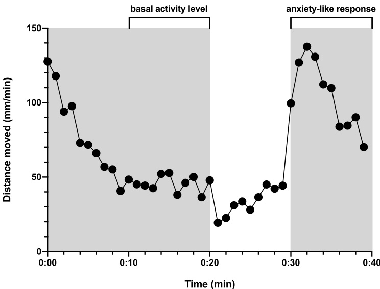
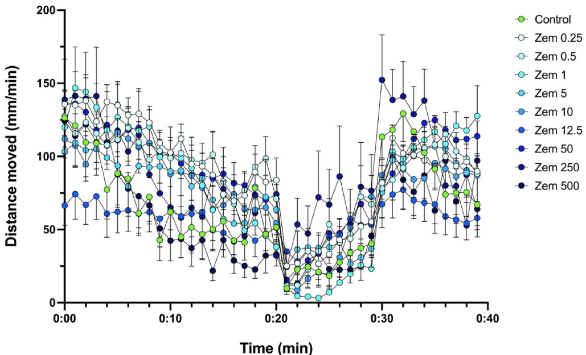
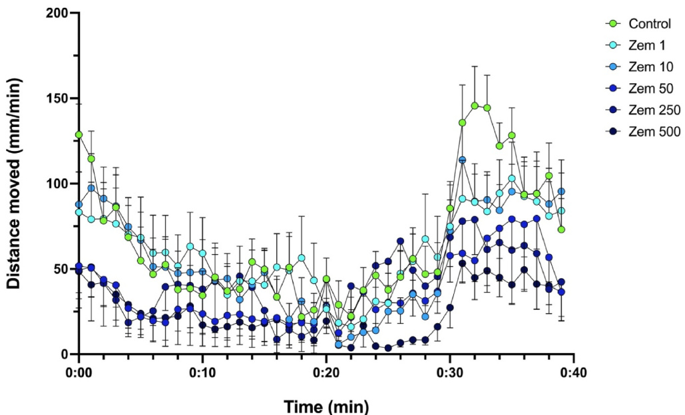
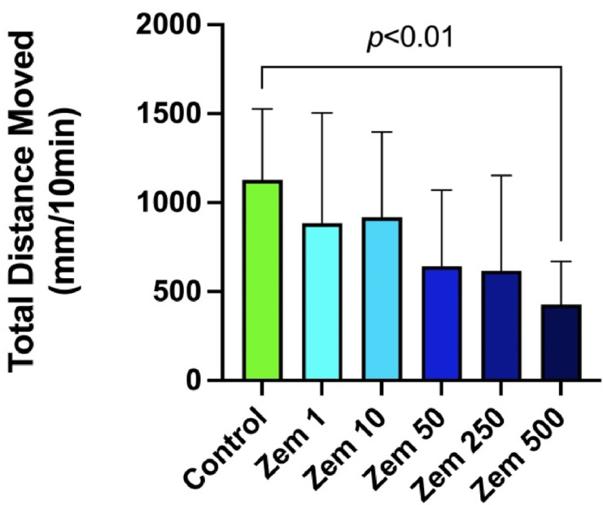
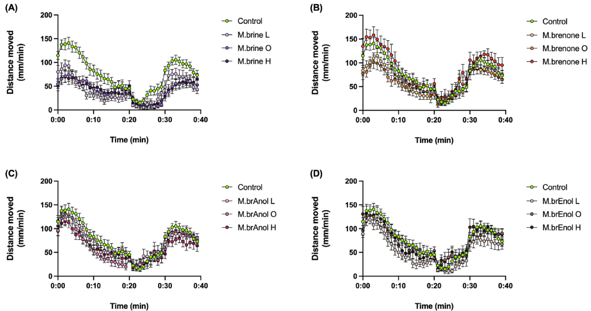
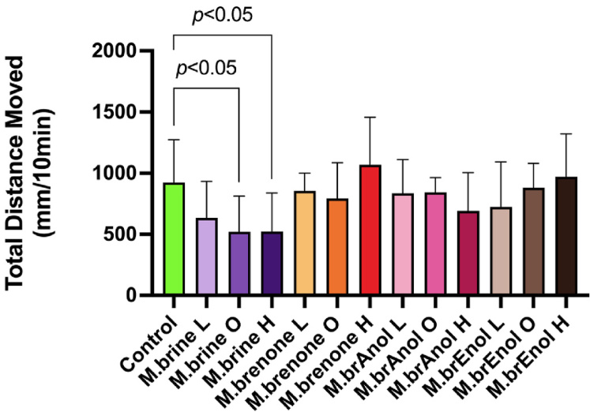
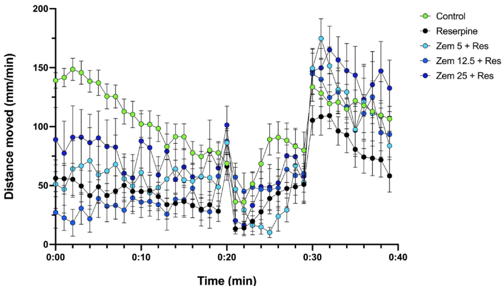
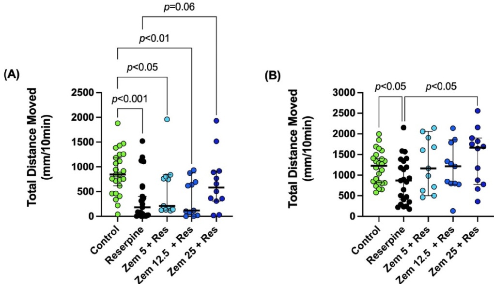
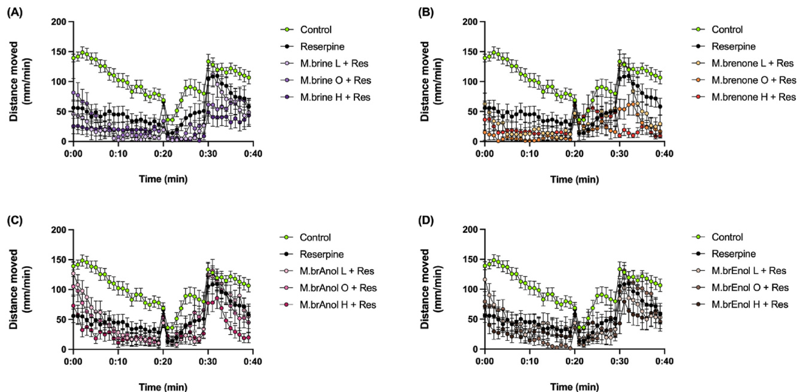
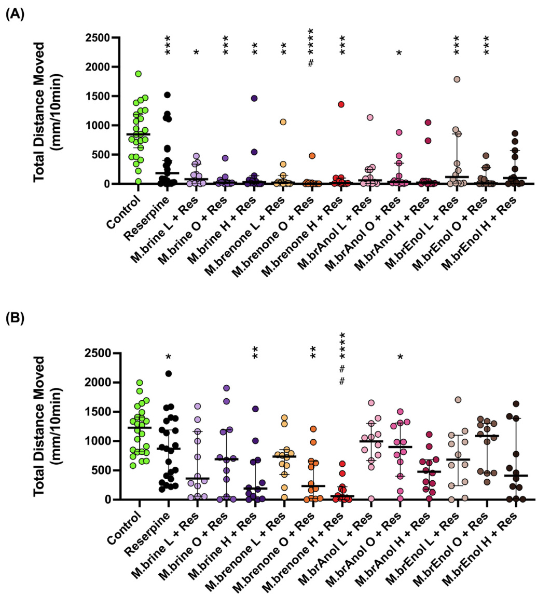

# Sceletium tortuosum-derived mesembrine significantly contributes to the anxiolytic effect of Zembrin®, but its anti-depressant effect may require synergy of multiple plant constituents

Johane´ Gericke a, Brian H. Harvey a,c,d, Lesha Pretorius b, Tracey Ollewagen b, Rohan M. Benecke e, Carine Smith b,\*

a Centre of Excellence for Pharmaceutical Sciences, Faculty of Health Sciences, North-West University, Potchefstroom, South Africa b Experimental Medicine Research Group, Dept of Medicine, Faculty of Medicine and Health Sciences, Stellenbosch University, Stellenbosch, South Africa c South African Medical Research Council Unit on Risk and Resilience in Mental Disorders, Department of Psychiatry and Neuroscience Institute, University of Cape Town, Cape Town, South Africa d The Institute for Mental and Physical Health and Clinical Translation, School of Medicine, Deakin University, Geelong, Australia e Division Clinical Pharmacology, Dept of Medicine, Faculty of Medicine and Health Sciences, Stellenbosch University, Stellenbosch, South Africa

# A R T I C L E  I N F O

# A B S T R A C T

Handling Editor: Dr. Thomas Efferth

Ethnopharmacology relevance: Sceletium tortuosum (L.) N.E.Br. (ST) is an alkaloid-rich succulent plant with various mechanisms of action that infer psychotropic effects. These actions correlate with clinical evidence suggesting efficacy in the treatment of depression and anxiety, in line with its use by indigenous populations. Its low side effect profile suggests potential of ST to improve the overall wellbeing and compliance of millions of patients that experience severe side effects and/or do not respond to current prescription medication. However, to elucidate specific physiological effects of ST extracts, it is necessary to first understand which of its constituents are the major contributors to beneficial effects demonstrated for ST in this context.

Aim of the study: To determine an anxiolytic- and antidepressant-like effective concentration of a ST extract by means of a dose response in zebrafish (ZF) larvae, and to assess relative contributions of equivalent concentrations of isolated alkaloids contained in the effective concentration(s).

Materials and methods: A dose response study employing a light-dark transition test (LDTT) was done in ZF larvae (<5 days post fertilization) to track locomotor activity in terms of anxiety-like (hyperlocomotion) and depression-like (hypolocomotion) behaviour. Larvae were treated for 1 h directly before the LDTT with escalating concentrations of a ST extract commercially known as Zembrin® (Zem) ranging from 0.25 to 500 μg/mL and compared to an untreated control group (n = 12 per treatment concentration). LDTT was repeated after 24 h to evaluate long-term exposure toxicity. The concentration that best attenuated hyperlocomotion during the dark phase following light-dark transition was identified as the anxiolytic-like concentration. This concentration, plus one higher and one lower concentration, were used for subsequent tests. The percentage content of each alkaloid (mesembrine, mesembrenone, mesembrenol, and mesembranol) in these concentrations were calculated and applied to additional larvae to identify the most effective anxiolytic-like alkaloid in the LDTT. To identify antidepressant-like therapeutic concentration and equivalent alkaloid concentration, the same treatment concentrations were tested in larvae (n = 12 per treatment concentration) pre-exposed to reserpine for 24 h. Depending on normality of data distribution, Brown-Forsythe and Welch, or Kruskal-Wallis ANOVA were used, with Dunnett or Dunn’s multiple comparisons tests.

Results: Only the extreme concentration of Zem (500 μg/mL) elicited toxicity after treatment for 24 h. Zem 12.5 μg/mL was the most effective anxiolytic-like concentration as it significantly decreased locomotor activity (P = 0.05) in the LDTT. Low (5 μg/mL), optimal (12.5 μg/mL) and high (25 μg/mL) Zem concentrations, as well as treatment solutions of single alkaloids (mesembrine, mesembrenone, mesembranol and mesembrenol), prepared to contain equivalent concentrations of each major alkaloid contained within these three concentrations of Zem, were tested further. Only mesembrine concentrations equal to that contained within the optimal and high dose of

Zem (12.5 and 25 μg/mL) showed significant anxiolytic-like effects (P < 0.05). Only the highest Zem concentration (25 μg/mL) reversed the effects of reserpine - indicating antidepressant-like properties (P < 0.05) - while isolated alkaloids failed to induce such effects when administered in isolation.

Conclusions: Current data provide evidence of both anxiolytic- and antidepressant-like effect of whole extract of Zem, with relatively higher concentrations required to achieve antidepressant-like effect. Of all alkaloids assessed, only mesembrine contributed significantly to the anxiolytic-like effects of Zem. No alkaloid alone could be pinpointed as a contributor to the antidepressant-like activity observed for higher concentration Zem. This may be due to synergistic effects of the alkaloids or may be due to other components not tested here. Current data warrants further investigation into mechanisms of action, as well as potential synergy, of ST alkaloids in suitable mammalian in vivo models.

<html><body><table><tr><td colspan="2">List of abbreviations</td></tr><tr><td>AChE ANOVA</td><td>Acetylcholinesterase Analysis of variance</td></tr><tr><td>CI</td><td>Confidence interval</td></tr><tr><td>dpf ESC</td><td>days post fertilization Escitalopram</td></tr><tr><td>GABA</td><td>Gamma-aminobutyric acid (GABA)</td></tr><tr><td>LDTT MAO</td><td>light-dark transition test monoamine oxidase</td></tr></table></body></html>

# 1. Introduction

Neuropsychiatric disorders like depression and anxiety are often comorbid and share many pathophysiological mechanisms and symptoms (Coplan et al., 2015). These disorders are difficult to treat, likely due to the complex interplay between biological systems involved in their pathology (Willner et al., 2013; Dean and Keshavan, 2017; Jesulola et al., 2018). Current prescription antidepressants and anxiolytics mainly target one or two of these pathophysiological systems (usually monoamine imbalance). However, recent evidence highlights the broad neurobiological basis of depression (Brand et al., 2015). Therefore, simply targeting monoamine dysfunction no doubt underlies treatment failure in about two-thirds of the estimated 280 million depressed patients globally (Willner et al., 2013; Akil et al., 2018; World Health Organization, 2018a), and about half of the 374 million patients suffering from anxiety (Sartori and Singewald, 2019; Forbes Health, 2023). Treatment strategies that target various mechanisms would thus prove beneficial in such cases.

Sceletium tortuosum (ST), a succulent plant native to Southern Africa (Gericke and Viljoen, 2008), has been used by the indigenous Khoisan people for many ailments and purposes, including appetite and thirst suppression, mood elevation, sedation, analgesia, and euphoric effects (Gericke and Viljoen, 2008; Gericke et al., 2018). Due to its local popularity, unchecked wild harvesting of ST for local trade initially led to a scarcity in habitat (Gericke et al., 2018). However, development of the Khoisan indigenous knowledge contributed to the more sustainable commercial cultivation of ST and its increased availability to a broader user base. Currently, ST is being scientifically assessed for use in many different disorders, including psychiatric disorders like depression and anxiety (Olatunji et al., 2022).

It has been noted that the true benefit of this plant lies in its ability to target multiple mechanisms involved in psychiatric disorders (Olatunji et al., 2022). For depression and anxiety, this may involve phosphodiesterase 4 (PDE-4) inhibition (Heckman et al., 2015; Olatunji et al., 2022; Maphanga et al., 2022) and inhibition of the serotonin transporter (SERT) – the same mechanism involved in the first-line treatment of depression and anxiety such as fluoxetine and escitalopram. Moreover, up-regulation of vesicular monoamine transporter 2 (VMAT-2) expression (Coetzee et al., 2016; Olatunji et al., 2022), as well as mild inhibition of acetylcholinesterase (AChE) and monoamine oxidase (MAO) (Coetzee et al., 2016) may similarly impart mood and cognitive benefits.

ST extract consists of many different alkaloid components, including mesembrine, mesembrenone, mesembranol, and mesembrenol (Krstenansky, 2017), each with distinct mechanisms of action. These actions arguably contribute to how these alkaloids may contribute individually or in synergy to exert psychotropic effects (see Olatunji et al., 2022 for review). Only two in vivo studies in animal models are relevant in this context, describing acute concentration-dependent antidepressant-like effects for mesembrine (Schell, 2014) and a proprietary ST extract, Zembrin® (Gericke et al., 2021), respectively. Currently, literature elucidating the relative importance of specific ST alkaloids are sparse. Mesembrine, mesembrenone and mesembrenol have been reported to show inhibitory effects on SERT and PDE-4 in vitro (Harvey et al., 2011; Coetzee et al., 2016; Krstenansky, 2017) and in vivo (Carpenter et al., 2016), although studies did not include data for mesembranol. Carpenter et al. (2016) also found anxiolytic activity with a mesembrine enriched fraction in a chick anxiety model. As most of these studies tested ST alkaloids in vitro models, there is a need for more studies in vivo models to gain deeper insight into the efficacy, safety, and physiologically relevant, concentration-related mechanisms of action of these alkaloids in a complex biological system.

The larval zebrafish (ZF) model is a cost-effective and time-efficient model that provides high-throughput screening of compounds due to high fecundity and rapid development of larvae. Due to its high genetic homology to humans, it is often used in conjunction with more complex preclinical and clinical models to reduce both cost and the number of sentient animals used in research (Ahmad et al., 2012; Basnet et al., 2019; Vorhees et al., 2021). A major benefit of this model over in vitro models in the current context, is that larval zebrafish models allow for parallel assessment of mechanisms of action and therapeutic behavioural outcome, ensuring physiological relevance of data generated. This model has gained wide-spread use as a screening platform for psychotropic activity, especially antidepressant and anxiolytic activity. The light-dark transition test (LDTT) in particular is often used in the ethnopharmacology and drug discovery context (Hacke et al., 2020; L´opez et al., 2022). In this model, treatment with reserpine - which depletes monoamine stores to induce depressive-like behaviour (decreased locomotor activity) (Wang et al., 2019) - may be superimposed to allow for comparative assessment of both anxiolytic and antidepressant-like effects of an experimental treatment using the same stimulus protocol. Such an approach may provide information on the efficacy of a single formulation and concentration, on both anxiety and depression. In the context of ethnomedicines, this model may provide valuable information on the relative risk:benefit profile of individual plant components relative to that of a complete plant formulation.

Using Zem and its four main alkaloids (mesembrine, mesembrenone, mesembrenol, and mesembranol), the current study aimed to confirm the known anxiolytic and anti-depressant effects of Zem in zebrafish larvae, but to also expand on current knowledge by identifying the major alkaloid(s) responsible for this benefit. We hypothesised that Zem will show concentration-dependent antidepressant- and anxiolytic-like effects in the ZF larvae, demonstrating the suitability of this model for elucidation of active ingredients in anxiolytic and anti-depressant ethnomedicines.

# 2. Methods and materials

# 2.1. Characterisation of compounds used

Zembrin® (HG&H Pharmaceuticals, Johannesburg, South Africa) is a standardized dry hydroalcoholic extract of the aerial parts of Sceletium (local names: kanna, channa, kougoed), also known as Sceletium tortuosum (L.) N.E. Br. (Syn. Mesembryanthemum tortuosum L. (http://www. worldfloraonline.org., accessed April 2023). It presents with a drug-toextract ratio of 2:1 (w/w), with extraction solvents being water and alcohol, standardized to 0.40% total alkaloids. Both the alkaloid profile of raw plant material and the extraction process employed to prepare Zem has been comprehensively described elsewhere (Terburg et al., 2013). Table 1 summarises manufacturer detail on Zem and purity of isolated alkaloids employed in the study. While the exact proportions of alkaloids contained within Zem is proprietary, the manufacturer (HG&H) is prepared to disclose more specific details for research purposes, subject to non-disclosure agreement (Dr Ralph Tettey-Amlalo, HG&H Pharma, personal communication).

# 2.2. Zebrafish larval culture maintenance and ethical considerations

All experimental protocols were ethically cleared by the Stellenbosch University Animal Research Ethics Committee (reference # ACU-2021- 21995) and the NWU-AnimCareREC animal research ethics committee (reference # NWU-00449-21-A5). An n = 12 larvae was employed for all experimental groups, unless otherwise stated.

Wild-type zebrafish (Danio rerio) embryos, spawned following standard husbandry procedures, were obtained from the Zebrafish Husbandry Unit (Division of Clinical Pharmacology, Department Medicine, Stellenbosch University). ZF embryos and larvae were maintained in embryo medium (E3; 5 mM NaCl, 0.17 mM KCl, 0.33 mM CaCl2•2H2O, 0.33 mM MgSO4•7 H2O, 1.3x10-5% w/v methylene blue, prepared in RO water) at 28.5◦C and 40–60% ambient humidity, with a 14:10 light: dark cycle, and refreshed daily for the duration of the protocol. At the experimental endpoint (<5dpf in all instances), larvae were killed by MS-222 overdose (250 μg/mL) and subsequent freezing.

# 2.3. Zembrin® experimental concentration determination

To our knowledge, concentration conversion guidelines between human and zebrafish larval models do not exist. Therefore, to determine a potentially effective experimental concentration range for Zem, effective concentrations of Zem previously reported was converted to mass/extracellular fluid volume, given that zebrafish exposed to treatments via immersion readily absorb treatments via their gills and skin (Dubin´ska-Magiera et al., 2016). Given the small size of zebrafish larvae, the assumption was made that treatment concentration in culture medium and extracellular fluid compartments would be near equal (i.e achieving 100% bioavailability of treatment). Taking this approach, a proven anxiolytic acute concentration in humans (25 mg) (Reay et al., 2020) translated to 1.7 μg/mL extracellular body fluid (extracellular body fluid compartment is approximately 14 L, or a third of the 42-L total body fluid volume (Mathew et al., 2018). However, a much higher acute concentration (50 mg/kg body mass) was required to achieve an anti-depressant effect in rodents (Gericke et al., 2021). Considering an extracellular fluid volume of 30 mL/100g rat body mass (Bianchi et al., 1981), this translated to a concentration of 555–670 μg/mL in rats with body mass of 250–300g, which when adjusted for the faster metabolic rate of rats (Bianchi et al., 1981), translated to a human equivalent concentration range of approximately 90–110 μg/mL. Although larval zebrafish metabolic rate is known to be significantly increased during larval development (Makky et al., 2008), the units of measure employed in larval assessments are not reconcilable with those of human or rodent metabolic rate assessments, and so it was not possible to mathematically correct for species differences in metabolic rate.

Table 1 Lot numbers and percentage purity (where applicable) of compounds used.   

<html><body><table><tr><td>Constituent</td><td>% Purity</td><td>Lot numbers</td></tr><tr><td>Zembrin</td><td></td><td>SCE0420-2003</td></tr><tr><td>Mesembrine</td><td>98</td><td>ROM0921BRINE</td></tr><tr><td>Mesembrenone</td><td>98</td><td>ROM0921ONE</td></tr><tr><td>Mesembranol</td><td>97.5</td><td>ROM280920ANOL</td></tr><tr><td>Mesembrenol</td><td>99</td><td>ROM0921ENOL</td></tr></table></body></html>

# 2.4. Evaluation of contribution of Zembrin® vs individual constituent alkaloids to therapeutic outcome in the light-dark transition test

Assessment of potential anxiolytic-like effect of Zem: Given the significant limitations in terms of concentration determination, a broad Zem concentration range (0.25–500 μg/mL) was employed in the initial experiment, to identify the dosage required to achieve the optimal anxiolytic-like outcome in ZF larvae, using the light-dark transition test (LDTT).

Briefly, at 96 h post fertilisation (hpf), ZF larvae were individually plated into 96-well plates before exposure to different concentrations of Zem (or E3 only for controls) via immersion. A LDTT protocol was applied after 1 h exposure and repeated after 20 h of exposure to Zem. The LDTT protocol entailed a 20-min acclimation period in the dark to exclude changes in activity elicited by pipetting or other experimental procedures, followed by a 10-min exposure to bright light (100% of onboard bulb capacity) and lastly, a 10-min dark period (Fig. 1). Activity of larvae were tracked for the full 40 min, using an automated activity tracking system (Daniovision, Noldus, Germany) and on-board image analysis software (Ethovision, Noldus, Germany). Activity tracking images were acquired at a frame rate of 25 frames per second and activity graphs binned into 1-min bins, for presentation. A smoothing factor of 0.2 mm was applied. Anxiety behaviour was quantified as total distance moved for the duration of the final dark cycle (the light-dark transition elicits an anxiety-like hyperlocomotion response in the dark period). In addition, basal activity levels were quantified between minutes 10–20 (Fig. 1).

Assessment of individual alkaloid contribution to outcome in the LDTT: Based on the optimal anxiolytic-like concentration demonstrated for Zem in the first assay, a range of 3 treatment concentrations (low, optimal and high) of Zem was selected for subsequent experiments. To determine the relative contribution of each of the four major alkaloids contained in Zem individually, treatment concentrations for each alkaloid were calculated, relative to the percentage of total alkaloids it comprised in the Zem (refer to Table 1), to correspond to the absolute amount of alkaloid that would be present in the extract at the low, optimal and high concentrations. Following an identical protocol as described above, the LDTT was employed to assess modulation of anxiety behaviour in zebrafish larvae (96 hpf) after 1hr of exposure to each of the 4 major constituent alkaloids in Zem. Due to the toxicity seen after 20hr continuous exposure to Zem, the 20hr time point was not assessed

  
Fig. 1. Protocol employed for the light-dark transition test. The white panel indicates exposure to bright light and the grey panel indicates the absence of light-exposure. The track illustrates total movement over time (binned into 1- min bins), of zebrafish larvae during acclimatization (minute 0–20), the freeze response during bright light exposure (minute 20–30) and anxiety-like hyperlocomotion following a light-dark transition (minute 30–40). Minute 10–20 typically reflects basal level of locomotion, while minute 30–40 is quantified to reflect anxiety-like hyperlocomotion.

again.

Evaluation of potential anti-depressant-like activity of Zembrin® and/or individual alkaloids: To assess potential effects of the same treatment concentrations as identified above in the context of depression, the LDTT protocol in larvae pre-treated with Zem or isolated alkaloids for 1hr was repeated, but this time after 24hr exposure to reserpine (two concentrations of 2 μg/mL of reserpine were administered, at 24hr and 2hr prior to the LDTT). Reserpine depletes the vesicular monoamine transporter (VMAT), resulting in decreased monoamine transmission, simulating depression-like behaviour. This includes lower basal activity levels and responsiveness (Wang et al., 2019).

Use of standard treatments for assay validation and comparative efficacy assessment: In terms of control treatments for comparison, unfortunately no suitable treatments are available. Although diazepam is a potential control in anxiolytic evaluations using the LDTT (Cueto-Escobedo et al., 2022), it induces significant sedation, making it less ideal in the current context. More broadly, any control treatment would only be relevant in the LDTT – which is highly time-dependent – if the cellular uptake and clearance of the control and test drug match one another. Therefore, it is not the norm to use a pharmaceutical control in the LDTT, and especially not in the ethnopharmacological drug discovery niche where mechanism of action is often not yet known (Hacke et al., 2020). Still, to provide a measure of validation for the anxiolytic assays, we included a diazepam treated group (Fig. S1, Supplementary Material), but this was excluded from the statistical analysis.

For the depression-related assays, escitalopram was included as control treatment. The response to escitalopram seen in the current study (Fig. S2, Supplementary Material) was similar to that reported previously in larval models (Pohl, 2019), namely a significant reduction in basal activity levels. As this effect is similar to the depressive-like decreased activity expected in reserpine-exposed larvae, it was again excluded from statistical comparisons between groups, as it did not have comparative value to indicate anti-depressant outcome. However, the escitalopram effect observed validates our model against similar larval models.

# 2.5. Statistical analyses

An n = 12 larvae per treatment concentration was employed. For the 96-well based assays, each plate included a control for internal validation of assay procedures, resulting in somewhat larger n in these groups only. Qualitative data (activity levels presented over 40 min, binned into 1-min bins) are presented as means and standard errors of the mean (SEM) for clarity. Quantitative data (total distance travelled in a 10-min period, for both basal activity and light-dark transition-induced hyperlocomotion) are presented as means and standard deviations (SD), after having identified and removed outliers using the ROUT method (Q = 1%). (Minimal outliers were identified, and never more than one per experimental group.) An exception was reduction of the data generated in the protocol simulating depression. Here, observation of a unique variability of data in response to the reserpine treatment led to the decision to not exclude outliers, rather expressing the data as median with 95% confidence intervals (CI). In this case, all individual data points are shown to present the data in a most information-dense and transparent manner.

Data analysis was performed using GraphPad Prism Version 9.5.1 (www.graphpad.com, San Diego, CA). Data was assessed for normality using the Shapiro-Wilk and Kolmogorov-Smirnov tests. For analysis of effects of Zem and its alkaloids, Brown-Forsythe (skewed data) and Welch (data with Gaussian distribution) ANOVA with the Dunnett test for multiple comparisons was employed for normally distributed data. For non-normally distributed data in the reserpine model, a KruskalWallis test with Dunn’s test for multiple comparisons was employed. For validation of the reserpine protocol, a Mann-Whitney test was employed to compare control vs reserpine groups.

# 3. Results

# 3.1. Zembrin® facilitates an anxiolytic-like outcome in the LDTT

Activity levels over time in the LDTT of zebrafish larvae after 1 h exposure to a large concentration-range of Zem is demonstrated in Fig. 2. Control larvae exhibited a normal brief hyperlocomotion to the experimental protocol followed by a “settling” to basal activity levels over the first 20 min as expected. This was followed by a freezing response to bright light from which they gradually recovered (min 20- 30) and finally, the anxiety-like hyperlocomotion when bright light was removed (min 30-40). Larvae treated with Zem seemed to exhibit variable anxiety-like response relative to control larvae, depending on concentration.

Quantification of the hyperlocomotion response to bright light exposure (minute 30–40 in Fig. 2) using a Brown-Forsythe and Welch ANOVA, did not indicate a main effect of treatment across all concentrations. However, the inclusion of a large concentration range allowed for observation of both the optimal anxiolytic-like treatment concentration (12.5 μg/mL) – which resulted in locomotion levels significantly lower (≈40%) than control (Dunnett multiple comparisons, P = 0.05; Fig. 3) – as well as a picture of potential toxicity at the highest concentration assessed (500 μg/mL), although this hypolocomotion result did not reach statistical significance at the acute (1hr exposure) time point.

To further elucidate the response to 500 μg/mL Zem, the LDTT was repeated after 20hr exposure of larvae to a somewhat simplified concentration range. Qualitative data (Fig. 4) illustrates that the anxiolyticlike effect seen for lower concentrations of Zem was no longer evident after extended exposure. In addition, data clearly indicates a lower basal activity in larvae exposed to higher concentrations of Zem even before bright light exposure, with a relative absence of the freezing and hyperlocomotion response. Statistical analysis of quantified data (Fig. 5) indeed confirms a concentration-dependent decrease in locomotion (Brown-Forsythe and Welch ANOVA, main effect of concentration, P < 0.05) after 20hr exposure to treatments. In addition, the Dunnett

  
Fig. 2. Activity levels (distance moved) over the light-dark transition test after 1hr Zem (0.25–500 μg/mL) exposure. The activity tracks are binned in 1-min intervals and data are presented as mean ± SEM.   
Fig. 3. Hyperlocomotion response (30-to-40-min dark period) after 1hr Zem (0.25–500 μg/mL) exposure. Data are presented as mean ± SD. Statistical analysis: Brown-Forsythe and Welch ANOVA and Dunnett’s multiple comparisons test. (For interpretation of the references to colour in this figure legend, the reader is referred to the Web version of this article.)

2000- p=0.05   
E 7 5 2 50 心 5 ， namo.en 1em em em 1em 1em 1em 1em 1em

multiple comparison post hoc test indicated that 500 μg/mL Zem induced a significant decrease (≈62%) in total distance moved versus control (p < 0.01; Fig. 5). The extent of hypolocomotion in this group, which reflected activity levels even lower than those seen in diazepamsedation (Fig. S2, Supplementary Material), may suggests that this concentration was toxic to the larvae after extended exposure.

# 3.2. Sceletium-derived alkaloid mesembrine significantly contributes to anxiolytic-like effect of Zembrin®

Based on the significant anxiolytic-like effect observed in larvae after 1hr exposure to 12.5 μg/mL Zem - and the absence of a decrease in basal activity levels, which argues against an overall sedative/toxic effect – we selected this concentration as optimal treatment concentration. In order to facilitate evaluation of concentration-dependent outcomes and the potential requirement for a higher treatment concentration in the reserpine depression model, an additional low (5 μg/mL) and high (25 μg/mL) Zem concentration was employed - together with the optimal 12.5 μg/mL concentration - for further experimentation. As mentioned in the methods, equivalent concentrations of isolated alkaloids contained in 5 (low), 12.5 (optimal anxiolytic-like) and 25 (high) μg/mL Zem was calculated for mesembrine, mesembrenone, mesembranol and mesembrenol and prepared as isolated alkaloid treatments. The details regarding the [percentage of the above four alkaloids in Zem and the precise doses used are withheld for propriety reasons (Dr Ralph TetteyAmlalo, HG&H Pharma, personal communication). These treatment concentrations were employed to determine relative contributions of specific alkaloids, to therapeutic outcomes observed for Zem.

Due to the profile suggestive of toxicity after 20hr continuous Zem exposure and the fact that the anxiolytic-like effect of Zem was no longer evident, only the 1hr exposure time point was studied for the evaluation of potential anxiolytic-like effects of the isolated Zem alkaloids. Equivalent concentrations of ST alkaloids contained in the low, optimal and high concentrations of Zem were evaluated using the same LDTT protocol, to determine their relative contributions to the effect observed for Zem.

Qualitatively, all concentrations of mesembrine employed appeared to elicit a general decrease in activity levels over the entire protocol when compared to controls (Fig. 6A). In contrast, no significant contribution by mesembrenone, mesembranol or mesembrenol was evident (Fig. 6B–D).

Statistical analysis of the hyperlocomotion responses (Fig. 7) revealed a significant main effect of treatment across the groups (BrownForsythe and Welch ANOVA; P < 0.005), while a significant anxiolyticlike outcome relative to control larvae was observed at optimal and high Zem concentration equivalents of mesembrine (≈44 and 43% lower than control respectively), Dunnett’s multiple comparison post hoc test, both p < 0.05) only. None of the other alkaloids were effective in as far as anxiolytic-like activity is concerned.

# 3.3. Higher concentration Zembrin®, but not isolated alkaloids, exhibited antidepressant-like activity in the reserpine model

To evaluate potential antidepressant-like activity, the same concentration range of Zem (5, 12.5 and 25 μg/mL) was evaluated in the LDTT, but in the presence of added reserpine to simulate relatively limited monoamine neurotransmission.

Firstly, the model is validated by the fact that reserpine pretreatment significantly decreased basal (p < 0.001) and stimulated (p < 0.05) locomotion in ZF larvae (Figs. 8 and 9). A Brown Forsythe and Welch ANOVA returned a significant main effect of treatment (P < 0.01) across all groups for basal activity, but not for anxiety response. Dunnett multiple comparison tests confirmed that only the highest concentration of Zem (25 μg/mL) assessed, exhibited the capacity to normalise activity both basally (p = 0.06, Fig. 9A) and significantly during the hyperlocomotion response (p < 0.05; Fig. 9B).

  
Fig. 4. Activity levels (distance moved) over the light-dark transition test after 20hr Zem (1–500 μg/mL) exposure. The activity tracks are binned in 1-min intervals and data are presented as mean ± SEM.

  
Fig. 5. Hyperlocomotion response (30-to-40-min dark period) after 20hr Zem exposure. Data are represented as means ± SD. Statistical analysis: BrownForsythe and Welch ANOVA and Dunnett’s multiple comparisons test. (For interpretation of the references to colour in this figure legend, the reader is referred to the Web version of this article.)

In terms of potential antidepressant-like effect of isolated alkaloids, the qualitative data suggest that no one alkaloid was able to normalise the reserpine-induced hypolocomotion (Fig. 10) at the doses tested. This was confirmed by the quantitative data on both basal (Fig. 11A) and anxiety response (Fig. 11B) activity. Here, the significant hypolocomotion induced by reserpine was again confirmed by the KruskalWallis non-parametric ANOVA, which indicated a significant effect of treatment across the groups (P < 0.001), as well as by Mann Whitney comparison of control and reserpine treated groups (i.e., in absence of alkaloid exposure) (P < 0.001 and P < 0.05 for basal and anxiety-like activity respectively, Fig. 11A and B). Dunn’s multiple comparisons test additionally confirmed that none of the alkaloids was a major contributor to the anti-depressant-like outcome observed for 25 μg/mL Zem. In general, the alkaloids assessed seemed to further depress activity levels in reserpine-treated larvae. It is perhaps noteworthy to point out that - although we have demonstrated escitalopram to not be a suitable control treatment in the reserpine protocol employed here – the significantly decreased activity patterns of alkaloid-treated larvae do in fact resemble that observed for escitalopram-treated larvae (Fig. S2, Supplementary material).

# 4. Discussion

The most important findings of this study are that we were able to observe concentration-dependent bioactivity of Zem and its alkaloid constituents in zebrafish larvae in the context of anxiety- and depression-like behaviour, using a light dark transition test. We were also able to demonstrate that the alkaloid constituent mesembrine significantly contributed to the anxiolytic-like activity achieved with 12.5 μg/mL Zem. Furthermore, we were able induce depressive-like behaviour (decreased locomotor activity) with a reserpine exposure model - in this model, a higher concentration of Zem (25 μg/mL) normalised this behaviour, suggesting that a higher concentration of Zem is required for treatment of depression than for anxiety. No individual alkaloids were able to reverse the effects of reserpine in a manner similar to Zem.

When first considering the anxiolytic-like effect demonstrated for Zem and its alkaloids, current data is in line with a recent report by Maphanga et al. (2022), who used a similar zebrafish larval model. However, while Maphanga and colleagues reported anxiolytic-like effects for all alkaloids assessed (using identical concentration ranges of approximately 3, 5, 9, and 15 μg/mL for all alkaloids), the current study - using concentration ranges of alkaloids equivalent to the concentration present in therapeutic concentrations of Zem, in the LDTT - demonstrated only mesembrine to contribute significantly to anxiolytic-like outcome. The concentration range of Zem for the current study was based on human equivalent concentrations (Terburg et al., 2013; Dimpfel et al., 2016), which is physiologically relevant and contributes to its translatability to humans and other in vivo models. Current results highlight the importance of this approach, as the concentrations of (at least) mesembrine and mesembranol employed by Maphanga and colleagues were considerably higher than what is used clinically and may thus have overestimated the potential of these individual alkaloids.

  
Fig. 6. Activity levels (distance moved) over the light-dark transition test after 1hr exposure to (A) mesembrine, (B) mesembrenone, (C) mesembranol and (D) mesembrenol, at concentrations equivalent to content of each in low (L), optimal anxiolytic-like (O) and high (H) dose Zem. The activity tracks are binned in 1-min intervals and data are presented as mean ± SEM.

  
Fig. 7. Hyperlocomotion response (30-to-40-min dark period) after 1hr exposure to ST alkaloids mesembrine, mesembrenone, mesembranol and mesembrenol, at concentrations equivalent to content of each in low (L), optimal anxiolytic-like (O) and high (H) dose Zem. Data are presented as the mean total distance travelled in 10 min ± SD. Statistical analysis: Brown-Forsythe and Welch ANOVA and Dunnett’s multiple comparisons test. (For interpretation of the references to colour in this figure legend, the reader is referred to the Web version of this article.)

Interestingly, their dose response assessment indicated that the relatively high concentration of 10 μM diazepam produced the best anxiolytic-like effects compared to lower concentrations used in this study (4 μM) and other studies (Schno¨rr et al., 2012; Chen et al., 2015; Zahid et al., 2018). Discrepancies in the effectivity of the remaining concentrations of the alkaloids and diazepam are unclear, although their use of the much higher concentrations of alkaloids and diazepam may indicate that the zebrafish strain they used was possibly relatively less sensitive to treatment compared to larvae used in literature and in our facility. This is supported by studies showing significant differences in behaviour across different ZF strains (Loucks and Carvan, 2004; Audira et al., 2020). Inclusion of a wider concentration of treatment, spanning both therapeutic and toxic concentrations as is reported in the current study, will facilitate contextualisation of data across research groups.

In the current study, the dose response assessment of Zem included concentrations equivalent to those most frequently used in humans and other animal models, ranging from 5 to 100 mg/kg (as reviewed by Olatunji et al. (2022)). These concentrations were calculated based on the methodology described earlier where, for instance, 12.5 μg/mL corresponds to a human concentration of 2.5 mg/kg, which is equivalent to a rat concentration of 15.4 mg/kg (Nair and Jacob, 2016). Thereafter, the concentrations of the alkaloids were calculated based on the percentage content of each found in the optimal anxiolytic-like concentration of Zem (found as 12.5 μg/mL), along with one lower (5 μg/mL) and one higher (25 μg/mL) concentration that allows for evaluation of dose sensitivity. While mesembrenone, mesembranol, and mesembrenol displayed no significant anxiolytic-like effects, mesembrine showed significant anxiolytic-like effects at concentrations corresponding to its concentration in 12.5 and 25 μg/mL of Zem. Thus, mesembrine seems to be the most potent and biologically active anxiolytic alkaloid present in Zem. These findings are corroborated by previous in vitro studies in the context of anxiety, which also attributed the greatest bioactivity in Sceletium tortuosum to mesembrine (Coetzee et al., 2016; Krstenansky, 2017).

Mechanistically, current results may be attributed to a number of known anxiolytic mechanisms of action that are linked to this alkaloidincluding SERT and MAO-A inhibition, upregulation of VMAT-2 and even antioxidant/anti-inflammatory effect (Coetzee et al., 2016; Krstenansky, 2017; Bennett et al., 2018). Another possible cause of the hypolocomotion observed by Maphanga et al. (2022) with higher concentrations of ST could be serotonin syndrome rather than anxiolytic activity. Studies have shown that ZF adults and larvae are very sensitive to serotonergic compounds (Stewart et al., 2013). Coetzee et al. (2016) also suggested that ST is a serotonin releasing agent. Thus, long-term immersion in high concentrations may increase serotonin to dangerous levels that can cause excitotoxicity and serotonin syndrome which presents as increased activity and rotation (seizure-like behaviour), followed by hypolocomotion or fatigue (Bachour et al., 2020; Banono et al., 2021; Suryanto et al., 2021). This corresponds with our findings using the highest concentration of Zem, as well as the highest concentrations of the alkaloids used by Maphanga and colleagues. We identified therapeutic activity at much lower concentrations, with adverse effects and toxicity presenting as initial hyperlocomotion and eventual hypolocomotion from 50 μg/mL and higher. The sustained basal and LDTT hypolocomotion after 20 h treatment with 500 μg/mL Zem indicates toxicity, while 12.5 μg/mL Zem fully wore off after 20 h, and the reversibility of the effects indicates that this concentration was not toxic. This pattern may also be seen with the high concentrations used by Maphanga et al. (2022), although this may be hard to pinpoint due to their relatively narrow concentration range as mentioned earlier.

  
Fig. 8. Activity levels (distance moved) over the light-dark transition test of reserpine-treated larvae after 1hr Zem (5, 12.5 and 25 μg/mL) exposure. The activity tracks are binned in 1-min intervals and data are represented as mean ± SEM.

  
Fig. 9. (A) Basal activity (10-to-20-min period) and (B) activity during the dark period following bright light exposure (minute 30–40) of reserpine-treated larvae after 1hr Zem (5, 12.5 and 25 μg/mL) exposure. The data are represented as the median total distance travelled in 10 min with 95% CI. Statistical analysis: KruskalWallis and Dunn’s multiple comparisons test. Mann-Whitney test was used to compare control and reserpine groups only.

The current study also expands on existing literature by inclusion of a reserpine depression model, which significantly reduced locomotor activity in ZF larvae, indicative of depressive-like behaviour. Earlier studies in adult ZF treated with reserpine have shown that this depressive-like behaviour, including reduced locomotor activity, is reversed by known SSRI antidepressants including fluoxetine and sertraline (Zhang et al., 2018; de Melo Martins et al., 2022). This suggest that the normalisation of locomotion in reserpine-treated larvae with the

Zem 25 μg/mL concentration, may be interpreted as an antidepressant-like property. The fact that the ESC control group also exhibited significant reduction in basal activity levels when compared to the control group, does not invalidate this result, as others have also shown ESC to suppress locomotion (Nielsen et al., 2018), suggesting that ESC is not a suitable positive control in the reserpine model.

In terms of mechanisms, known mechanisms of action of Zem and most of its alkaloids include inhibition of SERT and/or upregulation of VMAT-2 (Olatunji et al., 2022). In fact, the reserpine data support a putative involvement of monoaminergic signalling in the actions of 25 μg/mL Zem, which concurs with the monoamine depletion hypothesis of depression (Brand et al., 2015). This interpretation is supported by an in vitro study by Coetzee et al. (2016), which demonstrated upregulation of VMAT-2 by ST. However, although the latter study evaluated an extract with high mesembrine content (80% of a 3% total alkaloid content), none of the alkaloids assessed in the current study – including mesembrine, which did show anxiolytic-like effect – seemed to contribute significantly to the antidepressant-like outcome evident with

  
Fig. 10. Activity levels (distance moved) over the light-dark transition test of reserpine-treated larvae after 1hr exposure to (A) mesembrine, (B) mesembrenone, (C) mesembranol and (D) mesembrenol at con rations equivalent to their content in 5 (L), 12.5 (O) and 25 (H) μg/mL Zem. The activity track is binned in 1-min intervals and data are represented as mean ± SEM.

  
Fig. 11. (A) Basal activity (10-to-20-min period) and (B) hyperlocomotion response (30-to-40-min dark period) of reserpine-treated larvae after 1hr exposure to ST alkaloids mesembrine, mesembrenone, mesembranol and mesembrenol exposure at concentrations equivalent to their content in 5 (L), 12.5 (O) and 25 (H) μg/mL Zem. The data are represented as the median total distance travelled in 10 min with 95% CI. Statistical analysis: Kruskal-Wallis and Dunn’s multiple comparisons test. Mann-Whitney test was used to compare control and reserpine groups only. #, ##; different from reserpine control (P < 0.05, P0.01), \*,\*\*,\*\*\*,\*\*\*; different from control (P < 0.05, P < 0.01, P < 0.001 and P < 0.0001 respectively).

# Zem.

This lack of response could be explained jointly by the mechanism of action of reserpine and the experimental design. Firstly, reserpine depletes VMAT-2 stores which drastically decreases monoamine availability in the synapses and neurons in the brain (Cheung and Parmar, 2022). Furthermore, monoamine reuptake via transporters like SERT is necessary for sustained release of monoamines from VMAT-2, as the vesicles reabsorb and store the monoamines following reuptake (Coetzee et al., 2016). One can thus conclude that if there are no synaptic monoamines left due to lack of storage and release thereof by transport vesicles, the effect of SERT inhibitors (like escitalopram as well as Zem, mesembrenone, mesembrine) or VMAT-2 upregulators (like Zem and mesembrine) would be negligible – explaining the apparent lack of antidepressant-like effects of the alkaloids. It may also explain why some alkaloids - like mesembrenone, that also inhibit SERT (Krstenansky, 2017) - significantly attenuated locomotor activity. Secondly, we cannot exclude the possibility that the duration of the treatment with the test substances were too short, keeping in mind that it was only administered for an hour, compared to the 24-h treatment with the reserpine (acute treatment with reserpine is insufficient to induce the depressive-like behaviour in the larvae). Treating before or during reserpine exposure may have produced different results, although long-term immersion in the test substances may complicate interpretation of results due to potential toxicity, as discussed above. This limitation with the ZF larval model may thus warrant alternative investigations using other models, e.g. rodent models, to elucidate these mechanisms using a more translatable dosing regimen instead of long-term drug immersion.

Interestingly, the concentration of 25 μg/mL Zem which exerted significant antidepressant-like outcome in reserpine-treated larvae, is congruent with our previous work (Gericke et al., 2021), where antidepressant-like effects were observed in Flinders sensitive line rats with 25 and 50 mg/kg Zem. In fact, when converted, our larval dose of 25 μg/mL translates to about 26.4 mg/kg in an adult rat - this similar dose range suggests translatability between rodents and ZF larvae.

The lack of contribution by the individual alkaloids in the reserpine model may suggest that another plant constituent not tested here may be responsible for the observed normalised locomotor activity. Alternatively, it is possible that pairwise or triplet combinations of the isolated alkaloids may act in synergism. This interpretation seems feasible, as possible synergistic effects between the alkaloids in the extract (Harvey et al., 2011; Coetzee et al., 2016), and possibly even other constituents like polyphenols (Bennett et al., 2018), have been named as modulating factors in this context. For example, the anti-inflammatory and antioxidant effects of polyphenols is well-established (Petersen and Smith, 2016; Smith, 2018), as is the fact that anti-inflammatory treatment also alleviates anxiety (Fusar-Poli et al., 2020; Li et al., 2022) and depression (Morgese et al., 2018). Moreover, multimodal compounds, such as Zem, are attracting interest as psychotropics by targeting the heterogeneous aetiology of anxiety and mood disorders (Brand et al., 2015). Future studies exploring these biological mechanisms in ST may prove valuable.

In terms of limitation and recommendations, given the specific aim of the study to identify specific anxiolytic-like and anti-depressant-like components of Zem, specific mechanisms were not elucidated. Thus, future studies could expand on current data by including neurochemical analyses. This would further strengthen and assist in the interpretation of the behavioural results, as well as elucidating mechanisms of action of each constituent that contributes to the effectivity of the extract.

Furthermore, although ZF larvae were demonstrated to be an accurate and sensitive screening tool in the current study, the information gained here should ideally be translated into mammalian in vivo models such as rodents, which would allow for more accurate treatment duration protocols, to evaluate elucidation of more nuanced effects of Zem and its constituents in a more complex system.

Finally, a distinct strength of this study is the accurate calculation of human equivalent doses for use in zebrafish. Importantly, our calculated doses had similar outcomes as those reported for Zem in humans. This method and the possibility of determining an equivalent human dosage from therapeutic concentrations first illustrated in zebrafish larvae has great promise and should be investigated in other treatment contexts, perhaps in combination with mathematical modelling once large enough data sets have been generated.

# 5. Conclusion

Zebrafish larvae can be used as an effective tool to screen wide concentration ranges of ethnopharmacological substances like ST (e.g. Zem) and its alkaloid constituents, in order to identify therapeutic and toxic ranges. Current data highlighted the benefit of using human equivalent concentrations to ensure physiological relevance of dose and treatment response data generated. Current data identified a physiologically relevant concentration – and a concentration equivalent to a human concentration within the prescribed range for Zembrin® - to exert an anxiolytic-like effect. Furthermore, the mesembrine content of this optimal treatment concentration was identified as major contributor to this effect. In addition, reserpine-induced depressive-like hypolocomotion was effectively normalised by a Zem concentration higher than the anxiolytic-like concentration, but with no evident individual contribution of any of the alkaloids assessed. This may possibly indicate a requirement for synergy between the alkaloids and/or other constituents in the extract.

# Conflict of interest and funding

Prof. BH Harvey has acted as a scientific advisor to HG&H. HG&H (manufacturers of Zembrin®) provided Zembrin® as well as the four constituent alkaloids used in this study. HG&H also part-funded the study but had no other role in the study. All authors declare no conflict of interest.

# CRediT authorship contribution statement

Johane Gericke: data curation, writing - original draft. Brian Harvey: writing - review & editing, supervision. Lesha Pretorius: data curation, writing - review & editing. Tracey Ollewagen: data curation, writing - review & editing. Rohan Benecke: formal analysis. Carine Smith: supervision, funding, writing - first draft, review & editing.

# Declaration of competing interest

The authors declare that they have no known competing financial interests or personal relationships that could have appeared to influence the work reported in this paper.

# Data availability

Data will be made available on request.

# Acknowledgements

Dr Makhotso Lekhooa provided partial funding for this study, although was not immediately involved with this aspect of the work. This work is based on the research supported by the National Research Foundation (NRF) of South Africa (Grant number: TTK-129870 awarded to ML) and the South African Medical Research Council (SA MRC).

# Appendix A. Supplementary data

Supplementary data to this article can be found online at https://doi. org/10.1016/j.jep.2023.117113.

# References

Ahmad, F., Noldus, L.P.J.J., Tegelenbosch, R.A.J., Richardson, M.K., 2012. Zebrafish embryos and larvae in behavioural assays. Beyond Behav. 149, 1241–1281. https:// doi.org/10.1163/1568539X-00003020.   
Akil, H., Gordon, J., Hen, R., Javitch, J., Mayberg, H., Mcewen, B., Meaney, M.J., Nestler, E., 2018. Treatment resistant depression: a multi-scale, systems biology approach. J.Neurosci & Biobehav Rev. 84, 272–288. https://doi.org/10.1016/J. Neubiorev.2017.08.019.   
Audira, G., Siregar, P., Strungaru, S.-A., Huang, J.-C., Hsiao, C.-D., 2020. Which zebrafish strains are more suitable to perform behavioral studies? A comprehensive comparison by phenomic approach. Biology 9, 200. https://doi.org/10.3390/ biology9080200.   
Bachour, R.-L., Golovko, O., Kellner, M., Pohl, J., 2020. Behavioral effects of citalopram, tramadol, and binary mixture in zebrafish (Danio rerio) larvae. Chemosphere 238, 124587. https://doi.org/10.1016/j.chemosphere.2019.124587.   
Banono, N.S., Gawel, K., De Witte, L., Esguerra, C.V., 2021. Zebrafish larvae carrying a splice variant mutation in cacna1d: a new model for schizophrenia-like behaviours? Mol. Neurobiol. 58, 877–894. https://doi.org/10.1007/s12035-020-02160-5.   
Basnet, R.M., Zizioli, D., Taweedet, S., Finazzi, D., Memo, M., 2019. Zebrafish larvae as a behavioral model in neuropharmacology. Biomedicine 7, 23. https://doi.org/ 10.3390/biomedicines7010023.   
Bennett, A., Van Camp, A., Lopez, V., Smith, C., 2018. Sceletium tortuosum may delay chronic disease progression via alkaloid-dependent antioxidant or anti-inflammatory action. J. Physiol. Biochem. 74, 539–547. https://doi.org/10.1007/s13105-018- 0620-6.   
Bianchi, M., Bellini, G., Hessan, H., Kim, K., Swartz, C., Fernandes, M., 1981. Body fluid volumes in the spontaneously hypertensive rat. Clin. Sci. 61, 685–691. https://doi. org/10.1042/cs0610685 (London, England: 1979).   
Brand, S., Moller, M., Harvey, B., 2015. A review of biomarkers in mood and psychotic disorders: a dissection of clinical vs. preclinical correlates. Current neuropharm 13, 324–368.   
Carpenter, J.M., Jourdan, M.K., Fountain, E.M., Ali, Z., Abe, N., Khan, I.A., Sufka, K., 2016. The effects of Sceletium tortuosum (L.) NE Br. extract fraction in the chick anxiety-depression model. J. Ethnopharmacol. 193, 329–332. https://doi.org/ 10.1016/j.jep.2016.08.019.   
Chen, F., Chen, S., Liu, S., Zhang, C., Peng, G., 2015. Effects of lorazepam and WAY200070 in larval zebrafish light/dark choice test. Neuropharmacology 95, 226–233. https://doi.org/10.1016/j.neuropharm.2015.03.022.   
Cheung, M., Parmar, M., 2022. Reserpine. StatPearls Publishing, Treasure Island (FL).   
Coetzee, D.D., L´opez, V., Smith, C., 2016. High-mesembrine Sceletium extract (Trimesemine™) is a monoamine releasing agent, rather than only a selective serotonin reuptake inhibitor. J. Ethnopharmacol. 177, 111–116. https://doi.org/ 10.1016/j.jep.2015.11.034.   
Coplan, J.D., Aaronson, C.J., Panthangi, V., Kim, Y., 2015. Treating comorbid anxiety and depression: psychosoc. Pharmacol. Appr. 5, 366. https://doi.org/10.5498/wjp. v5.i4.366.   
Cueto-Escobedo, J., German-Ponciano, L.J., Guill´en-Ruiz, G., Soria-Fregozo, C., HerreraHuerta, E.V., 2022. Zebrafish as a useful tool in the research of natural products with potential anxiolytic effects. Front. Behav. Neurosci. 15, 356. https://doi.org/ 10.3389/fnbeh.2021.795285.   
De Melo Martins, G.M., Petersen, B.D., Rübensam, G., Da Silva, J.M.K., Gaspary, K.V., Wiprich, M.T., Altenhofen, S., Bonan, C.D., 2022. Physical exercise prevents behavioral alterations in a reserpine-treated zebrafish: a putative depression model. Pharmacol. Biochem. Behav. 220, 173455 https://doi.org/10.1016/j. pbb.2022.173455.   
Dean, J., Keshavan, M., 2017. The neurobiology of depression: an integrated view. Asian J. Psych.. 27, 101–111. https://doi.org/10.1016/j.ajp.2017.01.025.   
Dimpfel, W., Schombert, L., Gericke, N., 2016. Electropharmacogram of Sceletium tortuosum extract based on spectral local field power in conscious freely moving rats. J. Ethnopharmacol. 177, 140–147. https://doi.org/10.1016/j.jep.2015.11.036.   
Dubin´ska-Magiera, M., Daczewska, M., Lewicka, A., Migocka-Patrzałek, M., NiedbalskaTarnowska, J., Jagla, K., 2016. Zebrafish: a model for the study of toxicants affecting muscle development and function. Int. J. Mol. Sci. 17, 1941. https://doi.org/ 10.3390/ijms17111941   
Forbes Health, 2023. Mental Health Statistics. https://www.forbes.com/health /mind/mental-health-statistics/#:\~:text=Depressive%20symptoms%20grew% 20from%20a,is%20about%20a%2025%25%20increase. (Accessed 24 April 2023).   
Fusar-Poli, L., Vozza, L., Gabbiadini, A., Vanella, A., Concas, I., Tinacci, S., Petralia, A., Signorelli, M.S., Aguglia, E., 2020. Curcumin for depression: a meta-analysis. Crit. Rev. Food Sci. Nutr. 60, 2643–2653. https://doi.org/10.1080/ 10408398.2019.1653260.   
Gericke, J., Lekhooa, M., Steyn, S.F., Viljoen, A.M., Harvey, B.H., 2021. An acute doseranging evaluation of the antidepressant properties of Sceletium tortuosum (Zembrin®) versus escitalopram in the Flinders Sensitive Line rat. J. Ethnopharmacol. 284, 114550 https://doi.org/10.1016/j.jep.2021.114550.   
Gericke, N., Viljoen, A., 2008. Sceletium—a review update. J. Ethnopharmacol. 119, 653–663. https://doi.org/10.1016/j.jep.2008.07.043.   
Gericke, N.J., H, G., H Pharmaceuticals, L.B., South Africa, 2018. Kabbo’s! Kwain´: the Past, Present and Possible Future of Kanna. The Ethnopharmacological Search for Psychoactive Drugs, pp. 122–150.   
Hacke, A.C.M., Miyoshi, E., Marques, J.A., Pereira, R.P.J., 2020. Anxiolytic properties of Cymbopogon citratus (DC.) stapf extract, essential oil and its constituents in zebrafish (Danio rerio). J. Ethnopharmacol. 260, 113036 https://doi.org/10.1016/j. jep.2020.113036.   
Harvey, A.L., Young, L.C., Viljoen, A.M., Gericke, N.P., 2011. Pharmacological actions of the South African medicinal and functional food plant Sceletium tortuosum and its principal alkaloids. J. Ethnopharmacol. 137, 1124–1129. https://doi.org/10.1016/j. jep.2011.07.035.   
Heckman, P., Blokland, A., Ramaekers, J., Prickaerts, J.J., 2015. PDE and cognitive processing: beyond the memory domain. Neurobiol. Learn. Mem. 119, 108–122. https://doi.org/10.1016/j.nlm.2014.10.011.   
Jesulola, E., Micalos, P., Baguley, I.J., 2018. Understanding the pathophysiology of depression: from monoamines to the neurogenesis hypothesis model - are we there yet? Behav. Brain Res. 341, 79–90. https://doi.org/10.1016/j.bbr.2017.12.025.   
Krstenansky, J.L., 2017. Mesembrine alkaloids: review of their occurrence, chemistry, and pharmacology. J. Ethnopharmacol. 195, 10–19. https://doi.org/10.1016/j. jep.2016.12.004.   
Li, X., Chen, M., Yao, Z., Zhang, T., Li, Z., 2022. Dietary inflammatory potential and the incidence of depression and anxiety: a meta-analysis. J. Health Popul. Nutr. 41, 1–13. https://doi.org/10.1186/s41043-022-00303-z   
L´opez, V., C´asedas, G., Petersen-Ross, K., Powrie, Y., Smith, C., 2022. Neuroprotective and anxiolytic potential of green rooibos (Aspalathus linearis) polyphenolic extract. Food Funct. 13, 91–101. https://doi.org/10.1039/D1FO03178C.   
Loucks, E., Carvan, M.J., 2004. Strain-dependent effects of developmental ethanol exposure in zebrafish. Neurotoxicol. Teratol. 26, 745–755. https://doi.org/10.1016/ j.ntt.2004.06.017.   
Makky, K., Duvnjak, P., Pramanik, K., Ramchandran, R., Mayer, A.N., 2008. A wholeanimal microplate assay for metabolic rate using zebrafish. J. Biomol. Screen 13, 960–967. https://doi.org/10.1177/1087057108326080.   
Maphanga, V.B., Skalicka-Wozniak, K., Budzynska, B., Skiba, A., Chen, W., Agoni, C., Enslin, G.M., Viljoen, A.M., 2022. Mesembryanthemum tortuosum L. alkaloids modify anxiety-like behaviour in a zebrafish model. J. Ethnopharmacol. 290, 115068 https://doi.org/10.1016/j.jep.2022.115068.   
Mathew, J., Sankar, P., Varacallo, M., 2018. Physiology, Blood Plasma.   
Morgese, M.G., Schiavone, S., Bove, M., Mhillaj, E., Tucci, P., Trabace, L., 2018. Subchronic celecoxib prevents soluble beta amyloid-induced depressive-like behaviour in rats. J. Affect. Disord. 238, 118–121. https://doi.org/10.1016/j.jad.2018.05.030.   
Nair, A.B., Jacob, S.J., 2016. A simple practice guide for dose conversion between animals and human. J. Basic Clin. Pharm. 7, 27. https://doi.org/10.4103/0976- 0105.177703.   
Nielsen, S.V., Kellner, M., Henriksen, P.G., Ols´en, H., Hansen, S.H., Baatrup, E., 2018. The psychoactive drug Escitalopram affects swimming behaviour and increases boldness in zebrafish (Danio rerio). Ecotoxicology 27, 485–497. https://doi.org/ 10.1007/s10646-018-1920-x   
Olatunji, T., Siebert, F., Adetunji, A., Harvey, B., Gericke, J., Hamman, J., Van Der Kooy, F.J., 2022. Sceletium tortuosum: a review on its phytochemistry, pharmacokinetics, biological and clinical activities. J. Ethnopharmacol. 280, 114476 https://doi.org/10.1016/j.jep.2021.114476.   
Petersen, K., Smith, C., 2016. Ageing-associated oxidative stress and inflammation are alleviated by products from grapes. Oxid. Med. Cell. Longev. 2016 https://doi.org/ 10.1155/2016/6236309.   
Pohl, J.J., 2019. Zebrafish (Danio rerio) embryo-larvae locomotor activity data analysis: evaluating anxiolytic effects of the antidepressant compound citalopram. Data Brief 27, 104812. https://doi.org/10.1016/j.dib.2019.104812.   
Reay, J., Wetherell, M.A., Morton, E., Lillis, J., Badmaev, V.J., 2020. Sceletium tortuosum (Zembrin®) ameliorates experimentally induced anxiety in healthy volunteers. Hum. Psychopharmacol. Clin. Exp. 5, 1–7. https://doi.org/10.1002/ hup.2753.   
Sartori, S.B., Singewald, N., 2019. Novel pharmacological targets in drug development for the treatment of anxiety and anxiety-related disorders. Pharmacol. Ther. 204, 107402 https://doi.org/10.1016/j.pharmthera.2019.107402.   
Schell, R., 2014. Sceletium Tortuosum and Mesembrine: A Potential Alternative Treatment for Depression. Senior thesis. Scripps College, Claremont.   
Schno¨rr, S.J., Steenbergen, P.J., Richardson, M.K., Champagne, D.L., 2012. Measuring thigmotaxis in larval zebrafish. Behav. Brain Res. 228, 367–374. https://doi.org/ 10.1016/j.bbr.2011.12.016.   
Smith, C., 2018. Natural antioxidants in prevention of accelerated ageing: a departure from conventional paradigms required. J. Physiol. Biochem. 74, 549–558. https:// doi.org/10.1007/s13105-018-0621-5.   
Stewart, A.M., Cachat, J., Gaikwad, S., Robinson, K.S.L., Gebhardt, M., Kalueff, A.V., 2013. Perspectives on experimental models of serotonin syndrome in zebrafish. Neurochem. Int. 62, 893–902. https://doi.org/10.1016/j.neuint.2013.02.018.   
Suryanto, M.E., Audira, G., Uapipatanakul, B., Hussain, A., Saputra, F., Siregar, P., Chen, K.H.-C., Hsiao, C.-D., 2021. Antidepressant screening demonstrated nonmonotonic responses to amitriptyline, amoxapine and sertraline in locomotor activity assay in larval zebrafish. Cells 10, 738. https://doi.org/10.3390/ cells10040738.   
Terburg, D., Syal, S., Rosenberger, L.A., Heany, S., Phillips, N., Gericke, N., Stein, D.J., Van Honk, J., 2013. Acute effects of Sceletium tortuosum (Zembrin), a dual 5-HT reuptake and PDE4 inhibitor, in the human amygdala and its connection to the hypothalamus. Neuropsychopharmacology 38, 2708–2716. https://doi.org/ 10.1038/npp.2013.183.   
Vorhees, C.V., Williams, M.T., Hawkey, A.B., Levin, E.D., 2021. Translating neurobehavioral toxicity across species from zebrafish to rats to humans: implications for risk assessment. Front. Toxicol. 3, 629229 https://doi.org/10.3389/ ftox.2021.629229.   
Wang, S., Duan, M., Guan, K., Zhou, X., Zheng, M., Shi, X., Ye, M., Guan, W., Kuver, A., Huang, M.J., 2019. Developmental neurotoxicity of reserpine exposure in zebrafish larvae (Danio rerio). Comp. Biochem. Physiol. C Toxicol. Pharmacol. 223, 115–123. https://doi.org/10.1016/j.cbpc.2019.05.008.   
Willner, P., Scheel-Krüger, J., Belzung, C., 2013. The neurobiology of depression and antidepressant action. Neurosci. Biobehav. Rev. 37, 2331–2371. https://doi.org/ 10.1016/j.neubiorev.2012.12.007.   
World Health Organization, 2018a. Depression. https://www.who.int/news-room/fact -sheets/detail/depression. (Accessed 22 April 2023).   
Zahid, H., Tsang, B., Ahmed, H., Lee, R.C.Y., Tran, S., Gerlai, R., 2018. Diazepam fails to alter anxiety-like responses but affects motor function in a white-black test paradigm

in larval zebrafish (Danio rerio). Prog. Neuro-Psychopharmacol. Biol. Psychiatry 83, 127–136. https://doi.org/10.1016/j.pnpbp.2018.01.012. Zhang, S., Liu, X., Sun, M., Zhang, Q., Li, T., Li, X., Xu, J., Zhao, X., Chen, D., Feng, X.J., 2018. Reversal of reserpine-induced depression and cognitive disorder in zebrafish by sertraline and Traditional Chinese Medicine (TCM). Behav. Brain Funct. 14, 1–14. https://doi.org/10.1186/s12993-018-0145-8.