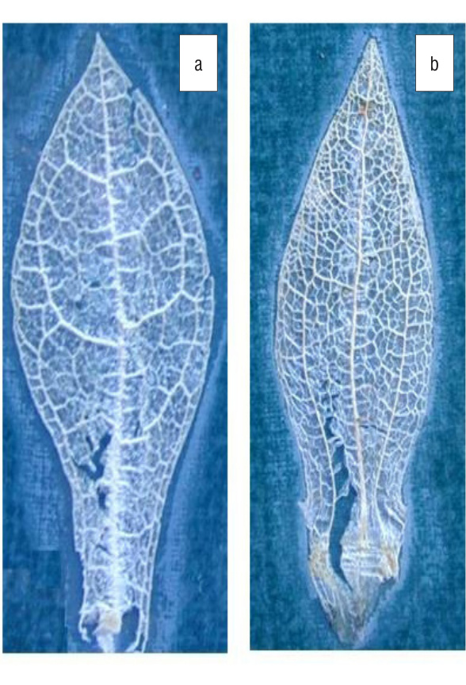
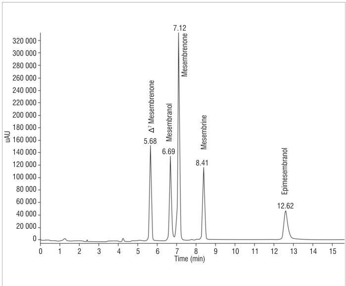
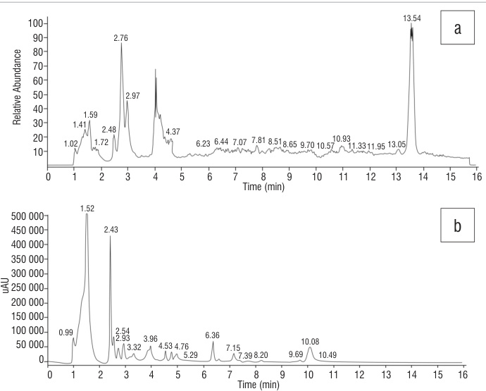
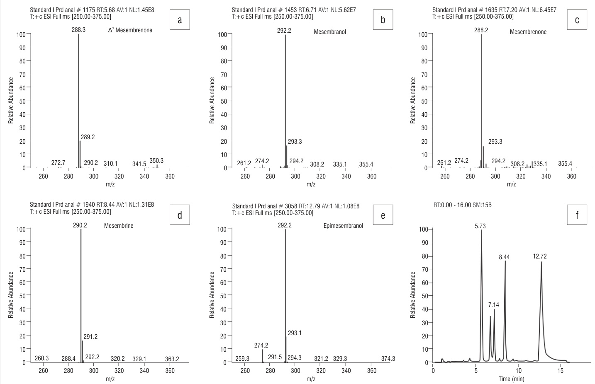
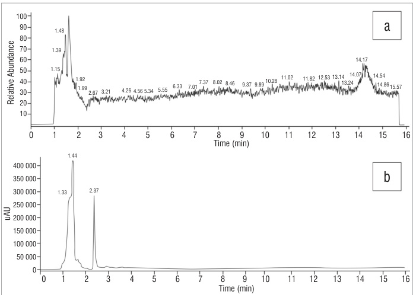
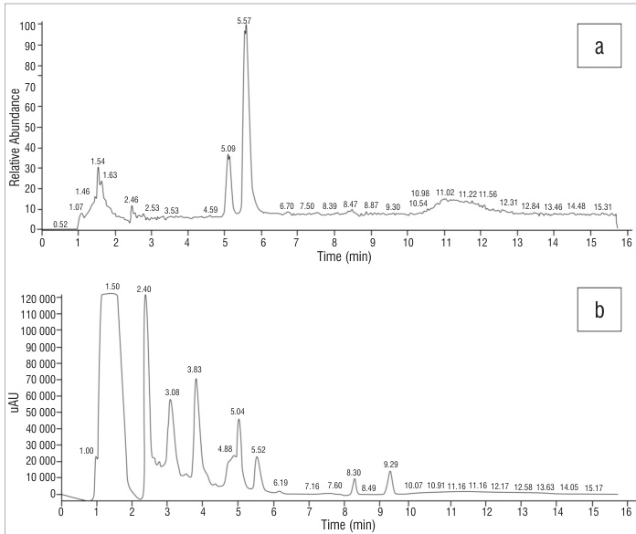
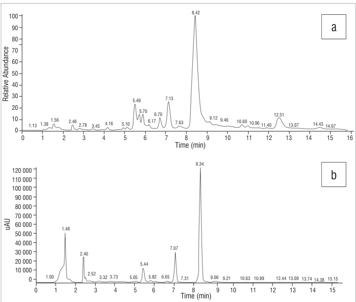
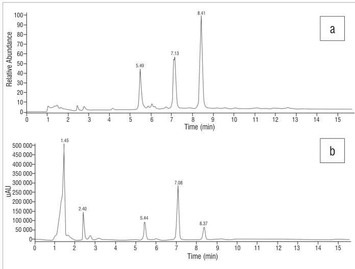

AUTHORS: Srinivas Patnala1\* Isadore Kanfer1

AFFILIATION:   
1Division of Pharmaceutics,   
Faculty of Pharmacy, Rhodes   
University, Grahamstown,   
South Africa   
\*Current address: Basic   
Sciences Research Centre, KLE   
University, Belgaum, India

CORRESPONDENCE TO: Isadore Kanfer

EMAIL: izzy.kanfer@gmail.com

POSTAL ADDRESS: Department of Pharmaceutics, Faculty of Pharmacy, Rhodes University, Grahamstown 6140, South Africa

# Chemotaxonomic studies of mesembrine-type alkaloids in Sceletium plant species

DATES: Received: 11 Aug. 2011 Revised: 11 July 2012 Accepted: 10 Sep. 2012

KEYWORDS:   
Sceletium; mesembrine;   
chemotaxonomy; tortuosum; emarcidum

HOW TO CITE: Patnala S, Kanfer I. Chemotaxonomic studies of mesembrine-type alkaloids in Sceletium plant species. S Afr J Sci. 2013;109(3/4), Art. #882, 5 pages. http://dx.doi. org/10.1590/sajs.2013/882

Complementary medicines containing the succulent herb Sceletium are being sold without information regarding their phytochemical contents, which is essential for the quality control of medicines. Furthermore, several different Sceletium species exist and little has been reported on the alkaloidal identities and contents of the various species. We therefore conducted phytochemical investigations on six selected Sceletium specimens, identified on the basis of their venation pattern as either ‘emarcidum’ or ‘tortuosum’ type. The tortuosum type consisted of S. tortuosum, S. expansum and S. strictum, whereas the emarcidum type consisted of S. emarcidum, S. exalatum and S. rigidum. Analysis was conducted by high-performance liquid chromatography with UV and alkaloids were identified by online mass spectroscopy. S. tortuosum and S. expansum samples contained mesembrine together with mesembrenone, mesembranol and epimesembranol, although the latter two alkaloids were present in low concentrations in S. expansum. S. strictum contained mesembrenone, mesembrine and either 4’-O-demethylmesembrenone or 4’-O-demethylmesembrenol. The emarcidum type specimens showed a complete absence of the major alkaloid mesembrine, as well as the other alkaloids usually associated with these species. In only one of the species of the emarcidum type – S. exalatum – two peaks corresponded to either 4’-O-demethylmesembrenone or O-methyljoubertiamine and either 4’-O-demethylmesembrenol or N-demethylmesembrenol, respectively. This study clearly indicates that not all Sceletium species contain the mesembrine-type alkaloids usually associated with Sceletium. It is thus important to identify the correct Sceletium species to ensure correct alkaloidal content for the manufacture and quality control of products containing this plant material.

# Introduction

The quality of medicines containing plant extracts or material is a major concern worldwide. The market for herbal products is lucrative as a result of increased consumer interest in phyto-pharmaceutical therapies. As a consequence, commercial interest in herbal plant medicines and the production of their dosage forms is undergoing great expansion. Such expansion, however, is associated with increased concerns relating to the quality of such products. A standardised or constant composition of the relevant components in herbal preparations is an important requirement, both from a regulatory point of view as well as for the consumer.1 However, because of the multiplicity of endogenous compounds usually present in most plants, standardisation, identification and quality control of the contents of pharmacologically active components present in the plant are generally not achieved. The factors that affect the content of active constituents in herbal plants include the age of the plant, temperature, daylight exposure, atmosphere, sampling method, the presence of toxic residues in soil, rainfall, altitude, soil composition and microbial contamination.2

Different growth, harvest, drying and storage conditions also result in variation in quality of the raw plant materials.3 It is also important to note that wild harvesting of medicinal plants is considered to be a problem as it causes loss of biodiversity, results in variation in the quality of the plant’s medicinal constituents and contributes to improper plant identification.4 Proper identification of medicinal plant species based on phytochemical content and associated therapeutic value is of primary importance for their commercial value and many of these plants are now cultivated in large numbers to keep up with the demands of the consumer. Proper identification is thus necessary in order to cultivate the correct species of the medicinal plant which will yield the requisite compound or constituents which are pharmacologically active.

Historically, Sceletium was used by the Khoisan of southern Africa and records of its use as a commercial material have been discussed and reported by Smith et al.5 The use of Sceletium has been on the rise as a result of pharmacological claims that it has anti-anxiety and mood elevating properties. The fact that the use of Sceletium for the treatment of psychiatric disorders has been patented,6 provides sufficient evidence of its importance as a commercially important medicinal plant.

Apart from the Sceletium species S. expansum, S. strictum, S. tortuosum (=S. joubertii=S. namaquence) and S. varians (=S. subvelutinum), which belong to the ‘tortuosum’ type and which have been reported to contain alkaloids, the alkaloidal content in ‘emarcidum’-type Sceletium species, such as S. emarcidum, S. exalatum and S. rigidum, is currently unknown.

Sceletium (family: Aizoaceae) occurs in the Western, Eastern and Northern Cape Provinces of South Africa, most prominently in the Karoo regions. Sceletium also reportedly grows in the Namaqualand, Knersvlakte, Ceres Karoo and some parts of the Western Cape.7 There are eight reported species of this genus8: Sceletium crassicaule (Haw.) L. Bolus, Sceletium emarcidum (Thunb.) L. Bolus ex H.J. Jaccobson, Sceletium exalatum Gerbaulet, Sceletium expansum (L.) L. Bolus [nt], Sceletium rigidum L. Bolus, Sceletium strictum L. Bolus, Sceletium tortuosum (L.) N.E.Br. [nt] and Sceletium varians (Haw.) Gerbaulet.

Attempts have been made to analyse Sceletium tortuosum and a monograph entitled Monograph of Sceletium tortuosum© describes the pharmacognostic features of the plant and also the thin-layer chromatography and high-performance liquid chromatography (HPLC) profiles.9 It is interesting to note that even though the presence of alkaloids in Sceletium has previously been well documented, the thin-layer chromatography profile of the Sceletium extract in the above monograph is matched with an unrelated reference compound – cineole. The HPLC profile was carried out on a methanolic extract of Sceletium tortuosum and indicates that the observed retention times (RTs) of 2.38 min, 3.15 min, 4.89 min and 7.84 min are major peaks, but no mention is made as to the identities of the substances resulting in those peaks. The monograph also mentions that the purity tests by assay are not yet available. Such reports have not contributed much in terms of accurately assessing alkaloidal profiles or estimating their content.

In view of the absence of comprehensive data describing the alkaloidal identity, content and composition found in the various Sceletium species, the present study was undertaken to investigate selected Sceletium plant specimens. We analysed them using HPLC with UV methods,10 which were specifically developed to fingerprint the mesembrine-type alkaloid profiles and to quantitatively determine alkaloidal content using qualified reference substances. The online detection of the mesembrine‑type alkaloids by electrospray ionisation mass spectroscopy (ESI-MS)11 enabled the identification of specific alkaloids based on their m/z values, i.e. in accordance with their respective molecular weights (MWs).

It is important to note that two detection systems were used simultaneously – UV and MS – because the peaks detected by UV are not necessarily detected by MS and vice versa, as a result of differences in the specific conditions necessary for detection. In view of the mass specificity of MS detection, confirmation of the exact identity of an eluting compound is possible without the use of a reference standard, whereas a reference standard is necessary in UV detection. Some peaks detected by UV are hence labelled ‘unidentified’ because a corresponding reference standard was not available.

# Methodology

# Collection of Sceletium

Sceletium is found mainly in the northwestern Cape regions of southern Africa. Initial effor ts to source the plant from its natural habitat in this region were unsuccessful because the plants are grown mostly in greenhouses. Hence, the availability of the plants depended on cultivators. Most of the samples were gratefully supplied as gifts by the Sceletium cultivators in their efforts to identify and ascertain the quality of their cultivated plant material. Plant specimens provided were not always flowering, so samples were cultivated and, upon flowering, were pressed to provide herbarium specimens for future reference. The specimens were deposited at the Selmar Schonland Herbarium in Grahamstown, South Africa (numbers SP01–SP06 for each of the plant species, respectively).

# Reagents and materials

HPLC-grade methanol and acetonitrile (Romil Ltd., Cambridge, Great Britain) were used for sample preparation and for the mobile phase. Water was purified in a Milli-Q® system and Millex HV® hydrophilic PVDF 0.45-μm membrane filters (Millipore, Bedford, USA) were used during sample preparation. The reference substances – mesembrine, mesembrenone and Δ7mesembrenone – were extracted and isolated from Sceletium plant material. Mesembranol and epimesembranol were synthesised from mesembrine. These substances were qualified as reference substances by nuclear magnetic resonance (NMR) analysis (1H, 13C and 2-D). Crystalline forms of mesembranol and mesembrine hydrochloride were further characterised by X-ray crystallography.11

# Instrumentation

A Cole-Parmer ultrasonic bath (model 8845-30, Cole-Parmer Instrument Company, Chicago, IL, USA) was used for sonication for solvent extraction of samples. A Finnigan MAT LCQ ion trap mass spectrometer (Finnigan, San Jose, CA, USA) coupled to a SpectraSYSTEM P2000 pump connected to an AS1000 autosampler and UV1000 variablewavelength UV detector (Thermo Separation Products, Riviera Beach, FL, USA) were used for both qualitative and quantitative analyses. Separation of alkaloids was carried out on a Luna® C (2) column (5 μm, 150 mm x 4.6 mm i.d., Phenomenex®, Torrence, CA, USA). An analytical balance (Type AG 135, Mettler Toledo, Switzerland) was used for weighing standards and samples. An electronic pipette (model 71050XET, Biohit PLC, Helsinki, Finland) was used to transfer standards and samples for dilutions. NMR analysis was performed on a Bruker Advance DRX 400 MHz NMR spectrometer (Rheinstetten, Germany).

# Identification of Sceletium

The specimens were identified using the identification key of Gerbaulet.7 The important taxonomic identification key is the leaf venation pattern which differs between Sceletium types. Based on the venation type (Figure 1), the species were classified as either ‘emarcidum’ or ‘tortuosum’ type.7 Of the seven plant specimens examined, six were received as gifts, of which three were of the emarcidum type and the other three were of the tortuosum type. The emarcidum-type leaf was observed in the specimens S. emarcidum, S. rigidum and S. exalatum. The tortuosum-type leaf was observed in the specimens S. tortuosum, S. expansum and S. strictum. A validated HPLC method10 was used for the quantitative determination of the relevant alkaloids and ESI-MS was carried out in conjunction with online UV detection.11

  
Figure 1:	 Sceletium dried leaves showing the venation pattern of (a) emarcidum-type leaves and (b) tortuosum-type leaves.

# Preparation of standards and samples

Standard methanolic stock solutions (1 mg/mL) of ∆7mesembrenone, mesembranol, mesembrenone, mesembrine hydrochloride and epimesembranol were prepared. A working stock solution was prepared and diluted to obtain a concentration of 100 μg/mL of each alkaloid. Standard solutions comprising a set of nine calibrators in the concentration range of 400–30  000  ng/mL were used for calibration. The HPLC-UV chromatogram of the reference standard alkaloids is shown in Figure 2.

  
Figure 2:	 A chromatogram derived from high-performance liquid chroma­ tography with UV of standard alkaloids found in Sceletium.

The MS ionisation formed [M+H]+ ions with m/z values of 288 (∆7mesembrenone), 292 (mesembranol), 288 (mesembrenone), 290 (mesembrine) and 292 (epimesembranol) (Figure 3).

The Sceletium samples were obtained from cuttings of cultivated plants and dried at 80  °C prior to processing for analysis. Samples were extracted with methanol under sonication to obtain a final concentration of \~150  mg/mL plant material. The solutions were filtered through 0.45‑μm PVDF membrane filters prior to chromatography.

# Results

# Emarcidum-type Sceletium species

The HPLC-UV profile of the S. emarcidum specimen showed three peaks eluting at RTs of 6.36 min, 7.15 min and 10.08 min, which were close but not identical to the RTs of the reference standards (Figure 4). The MS profile showed one major peak at 13.54 min (Figure 4) which had an m/z of 360 which did not correspond to the m/z ratios of any of the Sceletium alkaloid reference standards.

  
Figure 4:	 Chromatograms of Sceletium emarcidum derived from (a) electrospray ionisation mass spectroscopy and (b) highperformance liquid chromatography with UV.

  
Figure 3:	 The [M+H]+ ions of (a) Δ7mesembrenone, (b) mesembranol, (c) mesembrenone, (d) mesembrine and (e) epimesembranol. (f) A mass spectrometry chromatogram of standard reference alkaloids: Δ7mesembrenone (5.73 min), mesembranol (6.71 min), mesembrenone (7.14 min), mesembrine (8.44 min) and epimesembranol (12.72 min).

Interestingly, the S. rigidum sample was devoid of any peaks, regardless of detection method (Figure 5).

  
Figure 5:	 Chromatograms of Sceletium rigidum derived from (a) electro­ spray ionisation mass spectroscopy and (b) high-performance liquid chromatography with UV.

The HPLC-UV profile of the S. exalatum sample was complex, with peaks observed at RTs of 5.04 min, 5.52 min, 8.30 min and 9.29 min. These peaks did not correspond to any of the previously identified alkaloids with respect to the RTs of the alkaloid reference standard peaks (Figure 6). The MS profile of the sample showed two prominent ionised [M+H]+ peaks at 5.09 min and 5.57 min (Figure 6) with m/z values of 274 and 276. Whereas these peaks and the related m/z values did not correspond to any of the available Sceletium reference standard alkaloids used in this study, the m/z values did correspond with the molecular ions of 4’-O-demethyl-mesmbrenone or O-methyljoubertiamine (MWs=273) and 4’-O-demethyl-mesembrenol or N-demethyl-mesembrenol (MWs=275).12

  
Figure 6:	 Chromatograms of Sceletium exalatum derived from (a) electro­ spray ionisation mass spectroscopy and (b) high-performance liquid chromatography with UV.

# Tortuosum-type Sceletium species

The HPLC-UV profile of the Sceletium tortuosum sample (Figure 7) showed peaks at RTs of 5.48  min (unidentified), 6.05  min (unidentified), 6.64  min (mesembranol), 7.12  min (mesembrenone), 8.39  min (mesembrine), 11.82  min (unidentified) and 12.09  min (epimesembranol). The assays (% w/w) of these alkaloids showed them to be present at 0.18%, 0.16%, 2.20% and 0.41%, respectively. The MS profile based on the m/z values of these alkaloids (Figure 7)

showed peaks eluting at 5.75  min (∆7mesembrenone), 6.69  min (mesembrenone), 7.16  min (mesembranol), 8.45  min (mesembrine) and 12.16 min (epimesembranol). An unidentified peak at a m/z of 334 eluted at a RT of 11.88 min.

  
Figure 7:	 Chromatograms of Sceletium tortuosum derived from (a) electrospray ionisation mass spectroscopy and (b) highperformance liquid chromatography with UV.

The HPLC-UV profile of the S. expansum sample (Figure 8) showed three peaks at RTs of 5.44 min (unidentified), 7.07 min (mesembrenone) and 8.34 min (mesembrine). The alkaloids mesembrenone and mesembrine were assayed by HPLC-UV and found to be present at 0.03% and 0.30%, respectively. Mesembranol and epimesembranol were below their limits of detection using HPLC-UV; however, the presence of these alkaloids was confirmed by MS detection. The LC-MS profile showed peaks at 5.49 min, 6.70 min, 7.13 min, 8.42 min and 12.51 min (Figure 8) which corresponded to m/z values of 274, 292 (mesembranol), 288 (mesembrenone), 290 (mesembrine) and 292 (epimesembranol). The ionised peak at 5.49 min was also found in S. strictum, which had a m/z of 274, corresponding to 4’-O-demethyl-mesmbrenone or O-methyljoubertiamine (MWs=273).

  
Figure 8:	 Chromatograms of Sceletium expansum derived from (a) electrospray ionisation mass spectroscopy and (b) highperformance liquid chromatography with UV.

The HPLC-UV profile of S. strictum (Figure 9) showed three peaks at RTs of 5.44 min (unidentified), 7.08 min (mesembrenone) and 8.37 min (mesembrine). The alkaloids mesembrenone and mesembrine assayed by HPLC-UV detection were found to be present in the sample at 0.76% and 0.68%, respectively. The LC-MS profile (Figure 9) showed peaks eluting at 5.49  min, 7.13  min (mesembrenone) and 8.41  min (mesembrine), which corresponded to m/z values of 274, 288 and 290, respectively. The ionised peak with m/z of 274 corresponded to 4’-O-demethyl-mesmbrenone or O-methyl-joubertiamine (MWs=273). Neither mesembranol nor epimesembranol were detected by UV or MS methods. The peak at a RT of 5.49 min with a m/z of 274 corresponded to 4’-O-demethyl-mesmbrenone or O-methyl-joubertiamine (MWs=273), as for that observed in S. expansum.

  
Figure 9:	 Chromatograms of Sceletium strictum derived from (a) electrospray ionisation mass spectroscopy and (b) highperformance liquid chromatography with UV.

# Conclusions

Sceletium plant constituents are complex in nature and the alkaloids present are structurally closely related. Some of the closely related alkaloidal structures, such as mesembrenone or ∆7mesembrenone and the epimers mesembranol or epimesembranol have the same molecular weights but differ slightly in their chemical structure, such as the position of a double bond (mesembrenone or ∆7mesembrenone) or configuration (mesembranol or epimesembranol). We have shown the identity, alkaloidal content and composition of various Sceletium plant species. The ‘tortuosum’-type Sceletium species contained specific alkaloids which differed in content and composition between species. S. tortuosum contained mesembrine as the major alkaloid along with other minor alkaloids, ∆7mesembrenone, mesembrenone and mesembranol. Interestingly, the ‘emarcidum’-type specimens showed a complete absence of mesembrine as well as other alkaloids usually found in the tortuosum-type species. In only one of the species of the emarcidum type (S. exalatum), two peaks eluted at RTs of 5.09 min and 5.57 min whose m/z ratios corresponded to either 4’-O-demethyl-mesmbrenone or O-methyl-joubertiamine (MWs=273) and 4’-O-demethylmesembrenol or N-demethyl-mesembrenol (MWs=275), respectively. Species of the tortuosum type, S. expansum and S. strictum also showed peaks corresponding to a m/z of 274, but eluting at a RT of 5.49  min, which corresponded to 4’-O-demethyl-mesmbrenone or O-methyl-joubertiamine (MWs=273). The peak eluting at a RT of 5.49  min seems to be associated only with tortuosum-type species, whereas the peak eluting at a RT of 5.09 min seems to be associated with emarcidum-type species. Furthermore, it appears that both of the individual compounds in each pair are present in one or other of the particular species. The tortuosum-type species S. tortuosum and S. expansum revealed the presence of mesembrine together with mesembrenone, mesembranol and epimesembranol, although the latter two were present in concentrations below their limits of quantification in S. expansum. S. strictum, on the other hand, was found to contain measurable concentrations of mesembrenone and mesembrine and either 4’-O-demethyl-mesembrenone or 4’-O-demethyl-mesembrenol, based on the m/z and RTs measured.

The development of an appropriate analytical method for chemotaxonomic studies of Sceletium presents a formidable challenge in view of the fact that the plant contains a complex mixture of closely related compounds. Hence, a prerequisite for the appropriate chemotaxonomic profiling of species used as medicinal plants is the availability of relevant reference compounds. An appropriate analytical method that has the required specificity for fingerprinting, as well as the ability to assay plant material for constituents with the required accuracy and precision, are also necessary. The data presented here will facilitate proper identification of Sceletium species based on a chemotaxonomic approach.

# Acknowledgements

We gratefully acknowledge the National Research Foundation (South Africa) for funding to S.P. and Mr V. Miros, Mr R. Grobellar, Mr P. De Villiers, Mrs M. Schwagmann, Mr L. Rabbets and Mr A. Sonnenberg for the plant specimens.

# Authors’ contributions

S.P. performed the laboratory work; I.K. supervised the research; and both authors contributed to the writing of the manuscript.

# References

1.	 Bauer R. Quality criteria and standardization of phytopharmaceuticals: Can acceptable standards be achieved? Drug Inf J. 1998;32:101–110. http:// dx.doi.org/10.1177/009286159803200114   
2.	 O’Malley P, Trimble N, Browning M. Are herbal therapies worth the risks? Nurs Pract. 2004;29(10):71–75. http://dx.doi.org/10.1097/00006205- 200410000-00010   
3.	 Marrone CM. Safety issues with herbal products. Ann Pharmacother. 1999;33:1359–1361. http://dx.doi.org/10.1345/aph.19097   
4. Briskin DP. Medicinal plant and phytomedicines – Linking plant biochemistry and physiology to human health. Plant Physiol. 2000;124:507–514. http:// dx.doi.org/10.1104/pp.124.2.507   
5.	 Smith MT, Crouch NR, Gericke N, Hirst M. Psychoactive constituents of the genus Sceletium N.E.Br. and other Mesembryanthemaceae: A review. J Ethnopharmacol.1996;50:119–130. http://dx.doi.org/10.1016/0378- 8741(95)01342-3   
6. Gericke NP, Van Wyk B-E. Pharmaceutical compositions containing mesembrine and related compounds. US Patent 6,288,104 B1, 2001.   
7.	 Gerbaulet M. Revision of the genus Sceletium N.E.Br (Aizoaceae). Bot Jarhbücher. 1996;118(1):9–24.   
8. Smith MT, Field CR, Crouch NR, Hirst M. The distribution of mesembrine alkaloids in selected taxa of the Mesembryanthemaceae and their modification in the Sceletium derived ‘Kougoed’. Pharm Biol. 1998;36(3):173–179. http:// dx.doi.org/10.1076/phbi.36.3.173.6350   
9.	 Scott G, Springfield EP. Pharmaceutical compositions for 60 South African plant species used as traditional medicines [homepage on the Internet]. c2004 [cited 2008 Aug 18]. Available from: http://www.plantzafrica.com/ medmonographs/scelettort.pdf.   
10.	 Patnala S, Kanfer I. HPLC analysis of mesembrine-type alkaloids in Sceletium plant material. J Pharm Pharmaceut Sci. 2010;13(4):558–570.   
11.	 Patnala S. Pharmaceutical analysis and quality control of complementary medicines: Sceletium and associated products [thesis]. Grahamstown: Rhodes University; 2007.   
12.	 Martin NH, Rosenthal D, Jeffs PW. Mass spectra of Sceletium alkaloids. Org Mass Spec. 1976;Vol II:1–19.