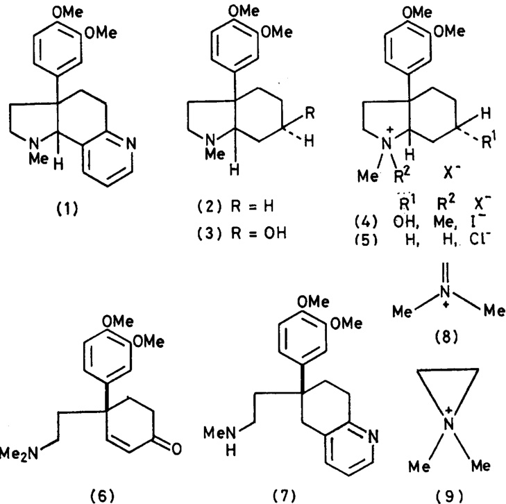
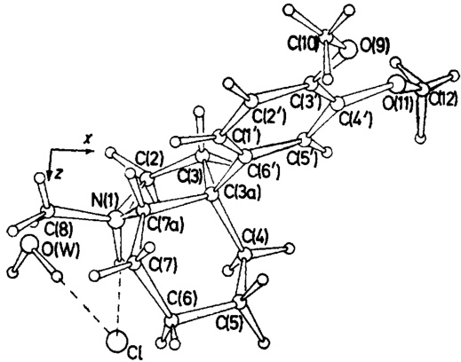
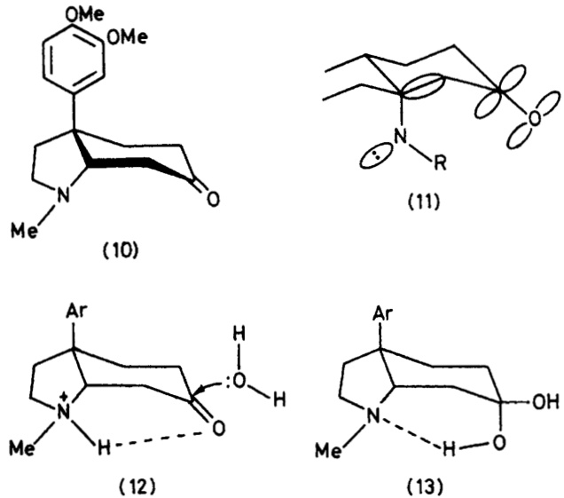
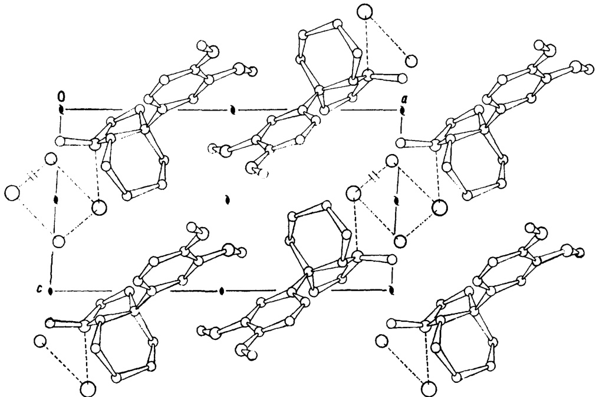
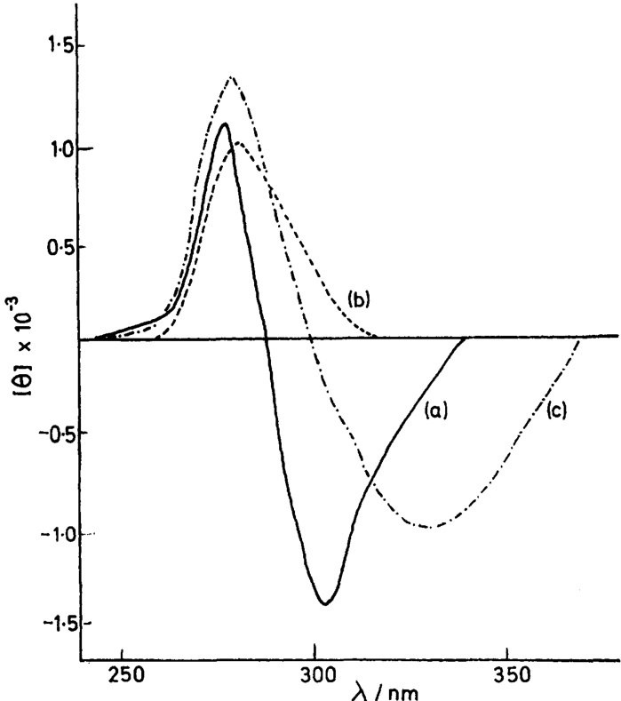

# Sceletium Alkaloids. Part 7.1 Structure and Absolute Stereochemistry of (—)-Mesembrane and 3'-Methoxy-4'-O-methyljoubertiamine, Two Minor Bases from S. Namaquense L. Bolus: X-Ray Analysis of (—)- Mesembrane Hydrochloride Monohydrate

By Thomas M. Capps, Karl D. Hargrave, Peter W. Jeffs,"and Andrew T. McPhail,\* Paul M. Gross Chemical Laboratory, Duke University, Durham, North Carolina 27706, U.S.A.

From S. namaquense L. Bolus, we have isolated the known base tortuosamine (7) and two new alkaloids. 3'- methoxy-4'-O-methyljoubertiamine (6) and()-mesembrane (2) the structures of which have been established by spectroscopic and X-ray methods. Previous suggestions concerning the absolute configuration of alkaloids of the 3a-ary-cis-octahydroindole ring system are confirmed by an X-ray analysis of (-)-mesembrane hydrochloride monhydrate whichcrystaizesin the monoclinic system,spacegroup21,witha=14.50(1).b=8.02(1). c = 7.57(1) A. β = 93.4(1).Z=2. The crystal structure was solved by direct methods and refined by leastsquares calculations to R 0.055 over 1 158 reflections from diffractometer measurements. The absolute configuration was established by the anomalous dispersion efect. The c.d. spectrum of (-)-mesembrine, considered as an axial β-aminoketone, is shown to exhibit normal octant behaviour.

PREvious investigations of the alkaloids of Sceletium namaquense L. Bolus have resulted in the isolation of bases belonging to the mesembrine group and the pyridino-octahydroindole class exemplified by the base sceletium alkaloid A4 (l).2 Further studies of the nonphenolic alkaloids from S. namaquense which are described herein have led to the isolation of two new alkaloids, (—)-mesembrane (2) and 3'-methoxy-4'-0- methyljoubertiamine (6), and the known base tortuosamine (7).3

Column chromatographic fractions derived from separation of the non-phenolic alkaloids over alumina followed by methanol (3 l) were collected and combined into six major fractions [(I)(VI)] based upon the results of analysis by g.l.c. and t.l.c. The alkaloid tortuosamine

1 Part 6, P. W. Jeffs, T. Capps, D. B. Johnson, N. H. Martin, and B. Rauckman, J. Org. Chem., 1974, 39, 2703. 2 P. W. Jeffs, P. A. Luhan, A. T. McPhai, and N. H. Martin, Chem. Comm., 1971, 1466; P. A. Luhan and A. T. McPhail, J.C.S. Perkin II, 1972, 2006.

(7), previously described by Wiechers and co-workers,³ was isolated from polar fraction (VI). Identification of this compound followed from its characteristic lH n.m.r. spectral properties and confirmation was obtained by direct spectral and chromatographic comparisons made with an authentic sample obtained by hydrolysis of N-formyltortuosamine (see Experimental section).

Fraction (III) (2.3 g), comprising mesembrenone and sceletium alkaloid A4 as major components, also contained an unidentified component on g.l.c. Extensive preparative chromatography of this fraction on both silica gel and alumina afforded ca. l00 mg of a non-crystalline base. The presence of a ·CH:CH·CO chromophore in this compound was indicated by the 1H n.m.r. spectrum which contained a pair of doublets at 8 6.12 and 7.09 (J 10 Hz) and by the presence of a carbonyl band at 1 680 cm-1 in the i.r. spectrum. An unresolved multiplet at 8 6.80 (3 H) and a singlet at 8 3.83 (6 H) in the 1H n.m.r. spectrum were in keeping with the presence of a 3,4-dimethoxyphenyl group characteristic of the mesembrine class of alkaloids. However, a 6 H singlet at 8 2.25 suggestive of a dimethylamino-function was not compatible with an alkaloid belonging to the mesembrine series. Furthermore, the mass spectrum contained a molecular ion at m|e 303 corresponding to C1gH22NOg and also, more importantly, exhibited a base peak at m|e 58 and an abundant ion at mle 72. The latter ions, which may be represented by structures (8) and (9), respectively, are characteristic of sceletium alkaloids of the joubertiamine class and originate from cleavage of the dimethylamino-side-chain.4 Spectral data indicated that this new base is 3'-methoxy-4'-O-methyljoubertiamine (6). In conformity with the suggested structure, the new base was identical with the product obtained by treating (—)-mesembrine methiodide with aqueous sodium carbonate. The constitution of this new alkaloid is of interest in that it is the first reported example in the joubertiamine series containing a dioxygenated aromatic ring. Biogenetically, it is reasonable to assume that it is

3 F. O. Snyckers, F. Strelow, and A. Weichers, Chem. Comm., 1971, 1467. 4 N. H. Martin, D. Rosenthal, and P. W. Jeffs, Org. Mass Spectrometry, 1976, 11, 1.

derived from (—)-mesembrine by reactions which parallel the aforementioned chemical conversion.\* The c.d. spectra of the Hofmann product of (—)-mesembrine and the new base were identical thereby leading to the absolute stereochemistry expressed in structure (6) for the latter. The negative c.d. maximum at 340 nm, attributed to the n-→π\* transition of the enone chromophore, indicates that the conformation of the cyclohexenone ring in (6) has right-hand chirality.5

Isolation of (—)-mesembrane (2) from the non-polar components of Fraction (I) was accomplished by repeated preparative-layer separations. The iH n.m.r. spectrum of this new base resembled that of mesembrine, and the high-resolution mass spectrum, in addition to giving the molecular formula as CiHgsNO2, showed an abundant ion at m/e 2l9 indicative of the fact that the alkaloid was a member of the dimethoxyphenyl-3a-octahydroindole class.4 Since the small amount of alkaloid available

# TABLE 1

Fractional atomic co-ordinates (× 104) for the non-hydrogen atoms, with estimated standard deviations in parentheses   

<html><body><table><tr><td>Atom</td><td>x</td><td>y</td><td>2</td></tr><tr><td>N(1)</td><td>1073(3)</td><td>-854(6)</td><td>1918(5)</td></tr><tr><td>C(2)</td><td>1492(4)</td><td>-2109(8) -1217(8)</td><td>687(8)</td></tr><tr><td>C(3)</td><td>2 318(4)</td><td></td><td>-11(7)</td></tr><tr><td>C(3a)</td><td>2496(3)</td><td>347(7)</td><td>1094(6)</td></tr><tr><td>C(4)</td><td>3088(4)</td><td>-38(9)</td><td>2 790(7)</td></tr><tr><td>C(5)</td><td>3072(5)</td><td>1352(12)</td><td>4117(8)</td></tr><tr><td>C( )</td><td>2 083(6)</td><td>1610(10)</td><td>4 716(8)</td></tr><tr><td>C(7)</td><td>1440(4)</td><td>1993(9)</td><td>3120(8)</td></tr><tr><td>C(7a)</td><td>1 503(3)</td><td>823(7)</td><td>1579(7)</td></tr><tr><td>C(8)</td><td>40(4)</td><td>-818(8)</td><td>1742(7)</td></tr><tr><td>0(9)</td><td>4 346(3)</td><td>4 999(6)</td><td>-3193(5)</td></tr><tr><td>C(10)</td><td>3 984(6)</td><td>6616(9)</td><td>-3528(9)</td></tr><tr><td>O(11)</td><td>5 132(3)</td><td>2221(7)</td><td>-2275(6)</td></tr><tr><td>C(12)</td><td>5524(4)</td><td>653(10)</td><td>-2122(10)</td></tr><tr><td>c(1)</td><td>2 537(3)</td><td>3163(7)</td><td>-570(7)</td></tr><tr><td>C(2}$</td><td>2966(4)</td><td>4298(8)</td><td>-1616(7)</td></tr><tr><td></td><td></td><td>3 988(7)</td><td></td></tr><tr><td>C(  </td><td>3 848(4)</td><td>2482(8)</td><td>-2178(7)</td></tr><tr><td>C(4)$</td><td>4269(4)</td><td>1374(8)</td><td>-1642(7)</td></tr><tr><td></td><td>3 831(4)</td><td>1692(7)</td><td>-597(7)</td></tr><tr><td>C(6</td><td>2948(3)</td><td></td><td>-22(6)</td></tr><tr><td>O(W)</td><td>1274(1) -197(4)</td><td>-2900(—) -4913(8)</td><td>5392(2) 2 696(6)</td></tr></table></body></html>

precluded a chemical investigation, a single-crystal X-ray analysis was undertaken on a sample of the hydrochloride salt which crystallized from a solution of the free base in deuteriochloroform.† The crystal structure was solved by direct methods and refined by full-matrix leastsquares calculations to R 0.055 over 1 158 statistically significant reflections. The absolute configuration was established by the anomalous dispersion method. Final atomic co-ordinates are in Tables l and 2; interatomic distances, valency and torsion angles are in Tables 3 and 4. The atom numbering scheme and solid-state conformation in the crystalline monohydrate are shown in Figure

\* A referee has suggested that, since quaternary bases are elaborated by plants, this compound may be an artefact produced as a result of the basic isolation conditions.

† At the time, we did not suspect that this was a hydrochloride salt since it could be crystallized from benzene-ethyl acetate, and the mass spectrum was indistinguishable from that of the noncrystalline sample obtained by preparative-layer chromatography.

1. The packing of these units in the crystal is illustrated in Figure 2.

The variable conformations of the non-aromatic ring

# TABLE 2

<html><body><table><tr><td>dydrogen</td><td colspan="2">atom tractional</td><td>co-uluiiiates</td><td></td><td>10 anc</td></tr><tr><td></td><td>distances to their bonded atoms, with estimatec standard deviations in parentheses</td><td></td><td></td><td></td><td></td></tr><tr><td>Atom</td><td>x</td><td>y</td><td></td><td></td><td>d|A</td></tr><tr><td>H(1)</td><td>117(5)</td><td>-110(11)</td><td>2 322(9)</td><td></td><td></td></tr><tr><td>H(2α)</td><td>170(5)</td><td>-291(12)</td><td>133(9)</td><td></td><td>1.01(7) 0.85(9)</td></tr><tr><td></td><td></td><td>-246(10)</td><td></td><td></td><td></td></tr><tr><td>H(2β)</td><td>92(5)</td><td></td><td></td><td>6(9)</td><td>0.97(7)</td></tr><tr><td>H(3α)</td><td>288(5)</td><td>-209(11)</td><td></td><td>32(9)</td><td>1.07(8)</td></tr><tr><td>H(3β)</td><td>204(5)</td><td>-75(11)</td><td>-116(9)</td><td></td><td>1.01(7)</td></tr><tr><td>H(4α)</td><td>285(5)</td><td>-116(11)</td><td>327(9)</td><td></td><td>1.04(9)</td></tr><tr><td>H(4β)</td><td>375(5)</td><td>-34(11)</td><td>260(9)</td><td></td><td>1.00(7)</td></tr><tr><td>H(5α)</td><td>339(5)</td><td>113(11)</td><td>535(9)</td><td></td><td>1.04(7)</td></tr><tr><td>H(5β)</td><td>340(5)</td><td>248(11)</td><td>359(9)</td><td></td><td>1.11(8)</td></tr><tr><td>H(6α)</td><td>198(6)</td><td>53(11)</td><td>530(10)</td><td></td><td>0.99(9)</td></tr><tr><td>H(6β)</td><td>213(5)</td><td>241(11)</td><td>541(9)</td><td></td><td>0.83(8)</td></tr><tr><td>H(7α)</td><td>88(5)</td><td>213(12)</td><td>345(8)</td><td></td><td>0.87(7)</td></tr><tr><td>H(7β)</td><td>165(5)</td><td>297(11)</td><td>252(9)</td><td></td><td>0.96(8)</td></tr><tr><td>H(7A)</td><td>116(5)</td><td>124(11)</td><td></td><td>72(9)</td><td>0.86(7)</td></tr><tr><td>H(8A)</td><td>-20(5)</td><td>11(10)</td><td>268(8)</td><td></td><td>1.10(7)</td></tr><tr><td>H(8B)</td><td>-13(5)</td><td>−216(10)</td><td>194(9)</td><td></td><td>1.11(8)</td></tr><tr><td>H(8C)</td><td>-5(5)</td><td>-59(10)</td><td></td><td>64(8)</td><td>0.85(6)</td></tr><tr><td>H(10A)</td><td>470(5)</td><td>723(12)</td><td>-435(8)</td><td></td><td>1.34(7)</td></tr><tr><td>H(10B)</td><td>403(5)</td><td>715(13)</td><td>-244(9)</td><td></td><td>0.93(8)</td></tr><tr><td>H(10C)</td><td>413(5)</td><td>721(12)</td><td>-438(9)</td><td></td><td>0.84(8)</td></tr><tr><td>H(12A)</td><td>594(5)</td><td>34(12)</td><td>318(9)</td><td></td><td>1.06(7)</td></tr><tr><td>H(12B)</td><td>514(5)</td><td>-29(11)</td><td>-274(9)</td><td></td><td>1.03(8)</td></tr><tr><td>H(12C)</td><td>634(5)</td><td>48(11)</td><td>-194(10)</td><td></td><td>1.19(7)</td></tr><tr><td>H(1)</td><td>192(5)</td><td>345(11)</td><td>-14(9)</td><td></td><td>0.99(8)</td></tr><tr><td>H(2)</td><td>259(5)</td><td>541(11)</td><td>-206(10)</td><td></td><td>1.09(8)</td></tr><tr><td>$H(5)</td><td>418(5)</td><td>36(11)</td><td></td><td>−10(10)</td><td>1.02(8)</td></tr><tr><td>H(WA)</td><td>22(5)</td><td>-456(11)</td><td></td><td>365(9)</td><td>0.96(7)</td></tr><tr><td>H(WB)</td><td>-61(5)</td><td>-588(11)</td><td></td><td>352(9)</td><td>1.18(8)</td></tr></table></body></html>

\* For all hydrogen atoms an isotropic temperature factor B 3.5 A² was used.

systems in the mesembrine alkaloids (1) ² and (3),6 and salts (4) 7 and (5) is apparent from the comparison of their endocyclic torsion angles presented in Table 5.

  
FiGuRE I Molecular conformation and atom numbering scheme in the asymmetric crystal unit; small circles represent hydrogen atoms and broken lines hydrogen bonds

The f attened chair conformation of the cyclohexane ring in (5) is, not surprisingly, very similar to that in (3) but differs significantly from the half-chair cyclohexene ring form in (I) and the distorted boat form adopted in (4) in

5 W. B. Whalley, Chem. and Ind., 1962, 1024; G. Snatzke, Tetrahedron, 1965, 21, 413, 421, 439. 8 P. A. Luhan and A. T. McPhail, J.C.S. Perkin II, 1973, 51. 7 P. Coggon, D. S. Farrier, P. W. Jeffs, and A. T. McPhail, J. Chem. Soc. (B), 1970, 1267.

order to relieve severe non-bonded intramolecular interactions between the hydroxy-substituent and an Nmethyl group. A consequence of the different cis-fused six-membered ring conformations and also crystal packing forces, especially hydrogen bonding, are the variety of forms adopted by the five-membered rings.

TABLE 3 Interatomic distances (A) and angles (), with estimated standard deviations in parentheses \*   

<html><body><table><tr><td colspan="4">(a) Intramolecular distances</td></tr><tr><td>N(1)-C(2)</td><td>1.523(7)</td><td>C(7)-C(7a)</td><td>1.505(8) 1.378(8)</td></tr><tr><td>N(1)-C(7a) N(1)-C(8) C(2)-C(3)</td><td>1.510(7) 1.495(6) 1.516(8)</td><td>C(1^)-C(2) c(1}-c(6} C(2}-C(3}</td><td>1.374(8) 1.393(8) 1.402(8) 1.355(7) 1.370(8)</td></tr><tr><td>C(3)-C(3a) C(3a)-C(4) C(3a)-C(7a)</td><td>1.521(8) 1.534(7) 1.554(7)</td><td>C(3}−C(4) C(3)-O(9)</td><td></td></tr><tr><td>C(3a)-C(6)</td><td>1.540(7)</td><td>C(4)-C(5) C(4)−0(11)</td><td>1.382(7)</td></tr><tr><td>C(4)-C(5)</td><td>1.502(10)</td><td>C(5)−C(6′)</td><td>1.400(7)</td></tr><tr><td>C(5)-C(6)</td><td>1.543(11)</td><td>O(9)-C(10)</td><td>1.416(9)</td></tr><tr><td>C(6)—C(7)</td><td>1.514(9)</td><td>O(11)-C(12)</td><td>1.382(9)</td></tr><tr><td>H(I')·∴.H(7A)</td><td>2.21(12)</td><td>H(5')..H(3β)</td><td>3.29(11)</td></tr><tr><td>H(1} · H(7β)</td><td>2.12(10)</td><td>H(5')...H(4β)</td><td>2.24(10)</td></tr><tr><td>H(5) · H(3α)</td><td>2.73(12)</td><td></td><td></td></tr><tr><td>(b) Valency angles</td><td></td><td></td><td></td></tr><tr><td>C(2)-N(1)-C(7a)</td><td>107.4(4)</td><td>N(1)—C(7a)-C(7)</td><td>112.2(4)</td></tr><tr><td>C(2)-N(1)-C(8)</td><td>113.1(4)</td><td>C(3a)-C(7a)-C(7)</td><td>115.9(4)</td></tr><tr><td>C(7a)-N(1)-C(8)</td><td>112.9(4)</td><td>C(2)-C(1)-C(6)</td><td>122.5(5)</td></tr><tr><td>N(1)-C(2)—C(3)</td><td>104.8(5)</td><td>C(1)-C(2)−C(3)</td><td>120.8(5)</td></tr><tr><td>C(②)—C(3)-C(3a)</td><td>108.0(4)</td><td>C(2)-C(3)-C(4)</td><td>117.1(5)</td></tr><tr><td>C(3)-C(3a)-C(4)</td><td>111.3(5)</td><td>C(2}-C(3}-0(9)</td><td>126.7(5)</td></tr><tr><td>C(3)-C(3a)-C(7a)</td><td>101.7(4)</td><td>C(4)-C(3)-0(9)</td><td>116.2(5)</td></tr><tr><td>C(3)-C(3a)-C(6)</td><td>109.8(4)</td><td>C(3)-C(4)-C(5)</td><td>121.1(5)</td></tr><tr><td>C(4)-C(3a)-C(7a)</td><td>109.4(4)</td><td>C(3')-C(4}-0(11)</td><td>114.6(5)</td></tr><tr><td>C(4)-C(3a)-C(6)</td><td>111.4(4)</td><td>C(5)-C(4)-O(11)</td><td>124.2(5)</td></tr><tr><td>C(7a)-C(3a)—C(6)</td><td>112.9(4)</td><td>C(4)-C(5)-C(6)</td><td>121.7(5)</td></tr><tr><td>C(3a)-C(4)-C(5)</td><td>112.4(5)</td><td>C(3a)—C(6)-C(1)</td><td>125.1(4)</td></tr><tr><td>C(4)-C(5)-C(6)</td><td>110.4(6)</td><td>C(3a)—C(6})-C(5)</td><td>118.1(5)</td></tr><tr><td>C(5)-C(6)-C(7)</td><td>109.3(5)</td><td>C(1)−C(6)-C(5)</td><td>116.7(5)</td></tr><tr><td>C(6)-C(7)-C(7a)</td><td>115.5(6)</td><td>C(3')-O(9)-C(10)</td><td>116.4(5)</td></tr><tr><td>N(1)-C(7a)-C(3a)</td><td>102.7(4)</td><td>C(4'})-0(11)-C(12)</td><td>119.0(5)</td></tr><tr><td>(c) Intermolecular distances <3.6 A</td><td></td><td></td><td></td></tr><tr><td>C1. .·N(1)</td><td>3.10</td><td>O(11)· ..C(41)</td><td>3.43</td></tr><tr><td></td><td></td><td></td><td></td></tr><tr><td>Cl ···O(W))</td><td>3.25</td><td>C(8) : . ·O(W)</td><td>3.46</td></tr><tr><td>Cl . . .O(w)</td><td>3.29</td><td>C(2) . ·O(WI)</td><td>3.55</td></tr><tr><td></td><td></td><td></td><td></td></tr><tr><td>C(8) ·· .O(W)</td><td>3.38</td><td>C(3')·..C(121)</td><td>3.59</td></tr></table></body></html>

Roman numeral superscripts refer to the following transformations of the co-ordinates of Table l:

\* Bonded distances involving hydrogen atoms are in Table 2

To assess the best description of these rings their endocyclic torsion angles were analysed in terms of their deviations from ideal half-chair (C2) and envelope (Cs) symmetry-constrained values and the results (Table 5) show that different half-chair forms occur in (l), (4), and (5), whereas in (3) an envelope form is preferred. An alternative description of these five-membered ring conformations is to express them in terms of a phase angle of pseudorotation, ∆, and a maximum angle of torsion, ωm, analogous to those accorded to steroid D rings; 8 the computed values of these parameters are included in Table 5. In (3), (4), and (5), the N-methyl group and the 3a-aryl substituent are consistently syn-oriented with respect to the octahydroindole skeleton from which we conclude that this probably represents the energetically preferred form for the free bases of (4) and (5) since an anti-orientation would introduce very severe non-bonded interactions between the N-methyl group and the cisfused six-membered ring.

The O(9), O(11), and C(3a) phenyl ring substituents with displacements of —0.016, 0.033, and 0.045 A, all lie close to the phenyl ring least-squares plane (root-meansquare deviation 0.003 A) and the methoxy-methyl groups are rotated co-operatively about the C(Ph)-O bonds to give orientations where the C(2')-C(3')-O(9)-C(10) and

# TABLE 4

<html><body><table><tr><td colspan="2">Torsion angles (°); σ 0.4—0.7°</td></tr><tr><td>C(7a)-N(1)-C(2)-C(3) C(8)-N(i)-C(2)-C(3) C(2)-N(1)-C(7a)-C(3a) C(2)-N(i)-C(7a)-C(7) C(8)-N(1)-C(7a)-C(3a) C(8)-N(1)-C(7a)-C(7)</td><td>13.3 138.6 -32.8 -157.9 -158.2 76.7 12.2</td></tr><tr><td>N(1)-C(2)-C(3)-C(3a) C(2)-C(3)-C(3a)-C(4) C(2)-C(3)-C(3a)-C(7a) C(2)-C(3)-C(3a)-C(6) C(3)-C(3a)-C(4)-C(5)</td><td>84.6 -31.8 -151.6 -165.1 -53.5</td></tr><tr><td>C(7a)-C(3a)—C(4)-C(5) C(6')-C(3a)-C(4)-C(5) C(3)—C(3a)—C(6}-C(1′) C(3)-C(3a)-C(6')-C(5) C(4)—C(3a)-C(6')-C(1) C(4)-C(3a)—C(6')-C(5)</td><td>72.0 112.2 -64.9 -124.1 58.9</td></tr><tr><td>C(7a)-C(3a)—C(6)-C(1) C(7a)—C(3a)-C(6)-C(5) C(3a)—C(4)-C(5)-C(6) C(4)-C(5)-C(6)-C(7) C(5)-C(6)-C(7)-C(7a)</td><td>-0.6 -177.6 62.7 -58.2</td></tr><tr><td>C(6)-C(7)-C(7a)-N(1) C(6)-C(7)—C(7a)—C(3a) N(1)-C(7a)-C(3a)-C(3) N(1)-C(7a)-C(3a)-C(4)</td><td>49.4 73.4 -44.1</td></tr><tr><td>N(1)-C(7a)-C(3a)-C(θ) C(7)-C(7a)-C(3a)—C(3)</td><td>38.9 -78.8</td></tr><tr><td></td><td>156.5 161.6</td></tr><tr><td></td><td></td></tr><tr><td></td><td></td></tr><tr><td>C(7)-C(7a)-C(3a)-C(4)</td><td></td></tr><tr><td>C(7)-C(7a)-C(3a)-C(6) C(10)-O(9)-C(3)-C(2) C(10)-O(9)-C(3)-C(4)</td><td>43.9 --80.8 8.5</td></tr><tr><td></td><td></td></tr><tr><td></td><td></td></tr><tr><td></td><td></td></tr><tr><td>C(12)-O(11)-C(4)-C(3) C(12)-0(11)-C(4}-C(5}</td><td>-171.3 -167.3</td></tr><tr><td></td><td>11.6</td></tr><tr><td></td><td></td></tr><tr><td>C(6)-C(i)-C(2)-C(3)</td><td></td></tr><tr><td>C(1})-C(2)-C(3)-0(9)</td><td>0.4 -179.5</td></tr><tr><td>C(1)-C(2)-C(3)-C(4)</td><td></td></tr><tr><td></td><td></td></tr><tr><td>O(9)-C(3)-C(4)-O(11)</td><td>0.3</td></tr><tr><td>O(9)-C(3)-C(4)-C(5)</td><td>-1.8</td></tr><tr><td>C(2)-C(3)-C(4)-O(11)</td><td>179.3</td></tr><tr><td></td><td></td></tr><tr><td>C(2}-C(3)-C(4)-C(5)</td><td>178.4</td></tr><tr><td>O(1i)−C(4)—C(5')−C(6')</td><td>-0.5</td></tr><tr><td></td><td>-178.7</td></tr><tr><td>C(3)-C(4)-C(5)-C(6)</td><td></td></tr><tr><td>C(4)-C(5}-C(6}-C(3a)</td><td>0.0</td></tr><tr><td></td><td>177.9</td></tr><tr><td>C(4)-C(5)-C(6}-C(1)</td><td></td></tr><tr><td></td><td>0.6</td></tr><tr><td></td><td></td></tr><tr><td>C(3a)-C(6^)-C(1)-C(2)</td><td>-177.9</td></tr><tr><td></td><td></td></tr><tr><td>C(5)-C(6)-C(1)-C(2)</td><td>-0.8</td></tr></table></body></html>

The sign convention used is that the angle A-B-C-D is defined as positive if, when viewed along the B-C bond, atom A must be rotated clockwise to eclipse atom D.

C(5')-C(4')–O(11)–C(12) torsion angles are 8.5 and 11.6°, respectively, thereby resulting in C(10) and C(ll) displacements of 0.214 and 0.307 A to opposite sides of the phenyl ring plane; similar co-operative rotations of adjacent methoxy-groups have been noted in our other studies. The inequalities of the exocyclic valency angles subtended at the methoxy-groups also conform to the usual pattern where the C(Ph)···O vectors bend towards each other in order to reduce Me··· H nonbonded interactions.

In accord with the phenyl ring conformations found in our previous studies of (1), (3), and (4), the negligibly small C(7a)-C(3a)-C(6')-C(1') torsion angle, —0.6°, indicates that the C(l')-C(6') phenyl ring bond effectively eclipses the C(3a)-C(7a) bond, a conformation which results in approximately equal H(5')···H(4β) and H(l')··· H(7β) distances in (5), and any rotation about the C(3a)-C(6') bond will only reduce one or other of these to a less-favourable separation. A Dreiding molecular model reveals that such a conformation has an extremely unfavourable short H(7a)··. H(1') distance of ca. 1.6 A relief from which is gained in (5) through valency-angle deformation at C(6') [125.1(4) and 118.1- (5)°] and by a small increase of the C(3a)-C(7a) and C(3a)-C(6') bonds over normal values. As already stated, C(3a) lies only 0.045 A from the phenyI ring plane so that out-of-plane bending of the C(3a)-C(6') bond is not a significant factor here. Similar small bond-length extensions and valency-angle deformations, as well as more significant amounts of out-of-plane bending of the

TABLE 5 Endocyclic torsion angles in the octahydroindole ring system of mesembrine alkaloids and their salts   

<html><body><table><tr><td></td><td>1 (1)“ (3)$</td><td>7</td><td></td><td></td></tr><tr><td>(a) Six-membered rings</td><td></td><td></td><td></td><td></td></tr><tr><td>08a-4 ω4-5</td><td>-63.1</td><td>-52.7 61.8</td><td>-48.2</td><td>-53.5</td></tr><tr><td>ω6-6</td><td>47.5 -14.0</td><td>-60.4</td><td>57.9 -4.3</td><td>62.7 -58.2</td></tr><tr><td>06-7</td><td>-2.7</td><td>52.4</td><td>-51.8</td><td>49.4</td></tr><tr><td>ω7-78</td><td>-14.7</td><td>-46.2</td><td>62.9</td><td>-44.1</td></tr><tr><td>ω7a-8a</td><td>45.7</td><td>44.7</td><td>−13.0</td><td>43.9</td></tr><tr><td>Approx.symmetry</td><td>$C₂$</td><td>C,</td><td>C.</td><td>C:</td></tr><tr><td>Axis atom(s) Conformation</td><td>C(3a)</td><td>C(5), C(7a) Half-chair Flattened</td><td>C(4),C(7) Distorted</td><td>C(5), C(3a) Flattened</td></tr><tr><td>(b) Five-membered rings</td><td></td><td>chair</td><td>boat</td><td>chair</td></tr><tr><td></td><td></td><td></td><td></td><td></td></tr><tr><td>ω1-2</td><td>39.4</td><td>24.7</td><td>-41.8</td><td>13.3</td></tr><tr><td>ω2-3</td><td>-15.1</td><td>-0.9</td><td>32.6</td><td>12.2</td></tr><tr><td>ωg-38</td><td>-13.4</td><td>-22.0</td><td>-11.3</td><td>-31.8</td></tr><tr><td>038-7a</td><td>37.1</td><td>36.7</td><td>-14.5</td><td>38.9</td></tr><tr><td>ω7a-1</td><td>-47.6</td><td>-38.7</td><td>34.4</td><td>-32.8</td></tr><tr><td>∆(C2) </td><td>4.0</td><td>33.1</td><td></td><td>2.1</td></tr><tr><td>∆(C):</td><td>43.6</td><td>5.6</td><td>5.0 36.8</td><td>36.6</td></tr><tr><td></td><td></td><td></td><td></td><td></td></tr><tr><td>Approx. symmetry Axis atom</td><td>$C</td><td>C_</td><td>$C_2$</td><td>$C$</td></tr><tr><td>Conformation</td><td>C(3) Half-chair</td><td>C(3a) Envelope</td><td>C(3a) Half-chair Haif-chair</td><td>(C2)</td></tr><tr><td></td><td>75.7</td><td>41.1</td><td>139.2</td><td>2.0</td></tr><tr><td>ωm 1</td><td>47.0</td><td>39.1</td><td></td><td></td></tr><tr><td></td><td></td><td></td><td>41.6</td><td>38.9</td></tr><tr><td></td><td>a Ref. 2. b Ref. 6. Ref. 7. d Present work. eFor the</td><td></td><td></td><td></td></tr><tr><td>ideal half-chair form with C(2) as axis atom, △(C2) = |ω1-2</td><td></td><td></td><td></td><td></td></tr><tr><td>ω2-sl + |ωa-1 − ωs-sal, and for the ideal envelope form with C(2)</td><td></td><td></td><td></td><td></td></tr><tr><td></td><td></td><td></td><td></td><td></td></tr><tr><td>as axis atom，△(C)=|ω1-2+z-3l+|ω7a-1 + ω3-3a|+</td><td></td><td></td><td></td><td></td></tr><tr><td></td><td></td><td></td><td></td><td></td></tr><tr><td>ωs-al, with similar expressions for the forms with other axis</td><td></td><td></td><td></td><td></td></tr><tr><td></td><td></td><td></td><td></td><td></td></tr><tr><td>atoms. f By analogy with ref. 8, here ∆ = 0 corresponds to</td><td></td><td></td><td></td><td></td></tr><tr><td></td><td></td><td></td><td></td><td></td></tr><tr><td>the half-chair form with C(2) as axis atom, and ωsa-a</td><td></td><td></td><td></td><td></td></tr><tr><td></td><td></td><td></td><td></td><td></td></tr><tr><td></td><td></td><td></td><td></td><td></td></tr><tr><td></td><td></td><td></td><td></td><td></td></tr><tr><td>ωmcos(∆/2), tan(∆/2) = [(ω1-2 + ω₃-3a) -(ω7a-1 + ω2-3)])</td><td></td><td></td><td></td><td></td></tr><tr><td></td><td></td><td></td><td></td><td></td></tr><tr><td></td><td></td><td></td><td></td><td></td></tr><tr><td></td><td></td><td></td><td></td><td></td></tr><tr><td></td><td></td><td></td><td></td><td></td></tr><tr><td></td><td></td><td></td><td></td><td></td></tr><tr><td></td><td></td><td></td><td></td><td></td></tr><tr><td></td><td></td><td></td><td></td><td></td></tr><tr><td></td><td></td><td></td><td></td><td></td></tr><tr><td></td><td></td><td></td><td></td><td></td></tr><tr><td></td><td></td><td></td><td></td><td></td></tr><tr><td></td><td></td><td></td><td></td><td></td></tr><tr><td></td><td></td><td></td><td></td><td></td></tr><tr><td></td><td></td><td></td><td></td><td></td></tr><tr><td></td><td></td><td></td><td></td><td></td></tr><tr><td></td><td></td><td></td><td></td><td></td></tr><tr><td></td><td></td><td></td><td></td><td></td></tr><tr><td></td><td></td><td></td><td></td><td></td></tr><tr><td></td><td></td><td></td><td></td><td></td></tr><tr><td></td><td></td><td></td><td></td><td></td></tr><tr><td></td><td></td><td></td><td></td><td></td></tr><tr><td></td><td></td><td></td><td></td><td></td></tr><tr><td></td><td></td><td></td><td></td><td></td></tr><tr><td></td><td></td><td></td><td></td><td></td></tr><tr><td></td><td></td><td></td><td></td><td></td></tr><tr><td></td><td></td><td></td><td></td><td></td></tr><tr><td></td><td></td><td></td><td></td><td></td></tr><tr><td></td><td></td><td></td><td></td><td></td></tr><tr><td></td><td></td><td></td><td></td><td></td></tr><tr><td></td><td></td><td></td><td></td><td></td></tr><tr><td></td><td></td><td></td><td></td><td></td></tr><tr><td></td><td></td><td></td><td></td><td></td></tr><tr><td>3.08w3a-7a.</td><td></td><td></td><td></td><td></td></tr><tr></table></body></html>

: P. Coggon, A. T. McPhail, and S. C. Wallwork, J. Chem. Soc. (B), 1970, 884, and refs. therein.

C(3a)-C(6') bond, have been encountered in our other studies the results of which indicate that the latter two modes of deformation are coupled. Thus, in (4), where C(3a) lies only 0.03 A from the phenyl-ring plane, the exocyclic valency angles at C(6') [116.8(13) and 125.2- (12)°) are very similar to those in (5). In contrast to this situation are the larger C(3a) displacements of 0.118 and 0.148 A in (1) and (3), and their associated more equal valency angles of 120.6(5) and 122.0(5)° in (1) and 119.4(4) and 122.4(4)° in (3).

In the crystal the cation and anion are linked by N-H · ·· Cl hydrogen bonds in which the chlorine atom lies close to the local Cz axis at N(l) and H(l) ··· Cl is 2.19 A. The water molecules bridge chloride ions related by the 21 screw axis through weak hydrogen bonds, H(WA)·.· Cl 2.37 and H(WB) ··· Cl 2.08 Å. Other short interionic separations correspond to normal van der Waals-type interactions.

The occurrence of (—)-mesembrane in nature is somewhat unexpected in view of the biogenetic origin of these alkaloids. All previous examples of alkaloids in the mesembrine series have an oxygen function at C(6) in keeping with the biosynthetic experiments 10 which have shown that the octahydroindole skeleton is derived from the intact incorporation of tyrosine. Presumably the biological course of removal of the C(6) oxygen occurs through the sequence (10)(3)>mesembrene (2) (with 5,6- or 7,8-double bond)→(2).

The absolute configuration of (—)-mesembrane is in accord with the absolute stereochemistry derived previously for other alkaloids of this family from the X-ray analysis of (4) and by interpretation of the Cotton effect in (—)-mesembrine based upon the octant rule. The chiroptical results and the conformational features deduced by the 1H n.m.r. have provided in conjunction with the X-ray analyses a consistent structural picture in which the ful stereochemistry of these alkaloids belonging to a single antipodal series is correctly represented by structure (10) for (—)-mesembrine.

10 P. W. Jeffs, D. B. Johnson, N. H. Martin, and B. S. Rauckman, J.C.S. Chem. Comm., 1976, 82, and refs. therein.

The correlation of the absolute configuration of (—)- mesembrine, derived from application of the octant rule, with the X-ray structure determinations of (—)-6- epimesembranol methiodide and (-)-mesembrane hydrochloride is of particular interest with regard to the chiroptical properties of β-aminoketones. Hudec 11 has concluded that β-aminoketones with an axial C-N bond should exhibit antioctant behaviour whereas those with an equatorial C-N bond have been predicted to exhibit octant behaviour. These latter systems possess the required parallel arrangement of the orbitals necessary for o-conjugation 15 may be achieved by the appropriate rotamer of a simple axial β-aminocyclohexanone having the conformation illustrated in structure (11). Contrary to Hudec's suggestion it would appear that σ conjugation in this class of compounds should not be excluded a priori from consideration. In (—)-mesembrine the bicyclic cis-fused ring system, with an axial aryl substituent, places certain constraints on the geometry around nitrogen and it necessary parallel orientation of the nitrogen lone-pair, the αβ o-bond, and the p orbitals of the carbonyl group, as required to permit interaction of the nitrogen lonepair and the carbonyl group through o conjugation. Supporting evidence for such interactions in these latter systems has been provided by a variety of experimental measurements including electronic absorption spectroscopy,12 photoelectron spectroscopy,13 and circular dichroism.14 In the c.d. studies it was found that removal of the lone-pair-carbonyl interaction by protonation of the equatorial nitrogen substituent resulted in a change of sign of the n>π\* transition of the carbonyl group corresponding to antioctant behaviour.11

  
FiGURE 2 Crystal structure, viewed in projection along the b axis; hydrogen bonds are denoted by broken lines

The previous lack of available chiral axial β-aminoketones has precluded examination of their Cotton effects associated with the n→π\* transition of the carbonyl group in these systems. Before discussing the c.d. spectrum of (—)-mesembrine some further points need to be made regarding o-conjugation of the nitrogen lone-pair and a carbonyl group in β-aminoketones. Inspection of Dreiding molecular models reveals that the

11 J. Hudec, Chem. Comm., 1970, 829. 12 A. M. Halpern and A. I. Lyons, J. Amer. Chem. Soc., 1976, 98, 3243, and refs. therein. i3 T. Sasaki, S. Eguchi, T. Kiriyama, and Y. Sukito, J.C.S. Chem. Comm., 1974, 725; C. Worrel, J. Verhoeven, and W. N. Speckamp, Tetrahedron, 1974, 30, 3525.

would appear to be impossible for the nitrogen lone-pair to assume a position collinear with the orbitals of the C(7)-C(7a) σ bond. On this basis, it was expected that (—)-mesembrine should exhibit antioctant behaviour. However, when the negative Cotton effect of this alkaloid is considered in conjunction with the considerable wealth of information on the conformational and confi gurational properties of this series of alkaloids,2,6,16 normal octant behaviour is clearly established. To test the unlikely event that o-conjugation of the nitrogen lone-pair and the carbonyl group was responsible for the chiroptical properties of (—)-mesembrine, we examined the c.d. spectra of (—)-mesembrine hydrochloride and (—)-mesembrine methiodide; results are shown in Figure 3. Most surprisingly, the spectrum of the hydrochloride shows the absence of the n→π\* band of a carbonyl group. While the known propensity of β-aminoketones to undergo elimination under acidic conditions had led us to consider that this possibility might create a complication in the interpretation of the c.d. spectrum, this is ruled 14 W. A. Ayer, B. Altenkirk, R. H. Burnell, and M. Moinas, Canad. J. Chem., 1969, 47, 449.   
15 R. Hoffmann, A. Imamura, and W. J. Hehre, J. Amer. Chem. Soc., 1968, 90, 1499.   
18 P. W. Jeffs, R. L. Hawks, and D. S. Farrier, J. Amer. Chem. Soc., 1969, 91, 3831; P. W. Jeffs, G. Ahmann, H. F. Campbell, D. S. Farrier, G. Ganguli, and R. L. Hawks, J. Org. Chem., 1970, 35, 3512.

out by the absence of a maximum in the region of 340 nm, normally associated with the n→π\* transition of an αβ-unsaturated ketone. We feel that the best explanation for the absence of a carbonyl band is provided by postulating that hydration of the carbonyl group has occurred to give the diol (13).\* This hydration reaction would appear to be facilitated by intramolecular catalysis through hydrogen bonding of the carbonyl group to the hydrogen atom on the neighbouring ammonium ion in salt (12). Additional factors which may act as driving forces for the hydration are dipole effects which are known to favour the hydrated form of carbonyl groups which are gauche to ammonium or phosphonium ions in cyclic systems.17

  
FiGuRE 3 Circular dichroism spectra of (a) (—)-mesembrine, (b) (—)-mesembrine hydrochloride, and (c) methiodide derivatives, recorded in dioxan : water (3 : 1)

Since the c.d. spectrum of the hydrochloride failed to provide the required information, the corresponding spectrum of (—)-mesembrine methiodide was examined. It showed a broad negative maximum at 330 nm, which is not characteristic for a cyclohexenone. From this observation it would appear that the methiodide is in equilibrium with enone (6), since the c.d. spectrum is consistent with the composite absorptions of two overlapping n-→π\* bands of the two chromophores.

The foregoing results establish that (—)-mesembrine, despite being an axial β-aminoketone, exhibits normal oetant behaviour.

\* Note added in proof: This structure is supported by the 13C n.m.r. spectrum of (—)-mesembrine hydrochloride in DO. The spectrum lacks a signal attributable to a carbonyl carbon; details will be presented in a future paper dealing with the 1sc n.m.r. spectra of mesembrine alkaloids.

# EXPERIMENTAL

I.r. spectra were obtained for solutions in CHClg on Perkin-Elmer models 137, 237, and 621 spectrometers; u.v. spectra were measured for 95% ethanol solutions on a Beckman DBG spectrophotometer. 1H n.m.r. spectra were recorded at 100 MHz on a JEOL MH 100 spectrometer, with tetramethylsilane as internal reference in deuteriochloroform unless otherwise noted. Low-resolution mass spectra were determined on a DuPont 21 490 instrument, high-resolution spectra on an A.E.I. MS902 spectrometer. G.l.c. was carried out on a Hewlett-Packard 402 with 8 ft × 0.125 in glass columns packed with OV 17 (3%) or SE 30 (3%) on Gas-Chrom Q (100—120 mesh). C.d. and o.r.d. spectra were obtained on a JASCO spectropolarimeter.

Extraction of Alkaloids from S. namaquense, I. Bolus.— Dried plant material of S. namaquense L. Bolus (4 kg) was macerated in a Waring blender with 95% ethanol (l0 1). The flter cake was continuously extracted (Soxhlet) with 95% ethanol (I5 l), the combined extracts concentrated (2 l) and acidified with tartaric acid (5%). The acidic aqueous solution was extracted with diethyl ether (4 I) and the ethereal extract discarded. After basification of the aqueous phase with sodium carbonate, the solution was extracted with chloroform (5 1) followed by chloroform - methanol (4 : 1;1 l). The chloroform extract was concentrated (1 l), extracted with 1n-sodium hydroxide (1 X 400 ml), and washed with water. Evaporation of solvent yielded non-phenolic alkaloids (150 g). Phenolic alkaloids (35 g) were recovered from the alkaline solution by adjusting to pH 9 (with CO2) and extracting into chloroform (1 × 500 ml).

Isolation of Non-phenolic Alkaloids.-The non-phenolic alkaloid fraction (150 g) was extracted with boiling diethyl ether (2 1) to remove 80 g of those soluble. A portion of the ether-insoluble residue (l0 g) was chromatographed over neutral alumina (800 g; activity 2) contained in a 4 ft × 3 in column. The column was eluted with 9 1 of solvent, with a linear solvent-gradient of ethyl acetate-methanol (6 1) followed by methanol (3 l), and 15 ml fractions were collected: fractions (1)—(75) contained mesembrane, unidentifed alkaloids, and non-alkaloidal material (1.9 g); (76)—(150), mesembrine and mesembrenone (1.1 g); (151)(295), mesembrenone, sceletium A4, and 3'-methoxy4'-O-methyljoubertiamine (2.3 g);(296)—(505), sceletium A4 and unidentifed alkaloids (4.2 g); (526)—(600), tortuosamine and unidentified alkaloids (1.3 g).

Tortuosamine (7).——Fractions (526)—(600) (2.75 g) were chromatographed over neutral alumina (activity IV, 200 g), the column eluted with chloroform-methanol (9: I), and 10 fractions (of 25 ml) collected; a further 20 fractions of 25 ml were collected with solvent ratio 3: 1. Of these fractions (20)—(26) contained a new component as evidenced by g.l.c. They (400 mg) were subjected to successive preparative t.l.c. on silica gel in chloroform-methanol (9 : 1), alumina in chloroform, and finally on silica gel in chloroformmethanol (19 : 1) to give tortuosamine (7) as an oil, homogeneous by g.l.c. and t.l.c., i.r. 1 600, 1 578, 1 520, and 1 455 cm1 confrming a benzene and a pyridine ring; u.v. max. 230, 252, 258.5, 265, 272, and 279 nm confirming an isolated 2,3-disubstituted pyridine and veratryl chromophores; 100 MHz n.m.r., 8 2.32 (s, 3 H, NCHg), 3.77 and 3.81 (two s,

17 J. J. Breen, S. O. Lee, and L. D. Quin, J. Org. Chem., 1975, 40, 2245; A. J. Jones and M. M. A. Hassan, ibid., 1972, 37, 2332; M. M. A. Hassan and A. F. Casy, Org. Magnetic Resonance, 1969, 1,389.

6 H, OMe), 6.7——6.8 (m, 3H aromatic), 8.3 (dd, J 5 and 2Hz, HA of isolated AMX system), 7.44 (dd, J 7.5 and 2 Hz, Hm), and 7.02 (dd, J 7.5 and 5 Hz, Hx); mass spectrum m/e (rel. intensity) 326 (31, M+), 269 (100, M −CgHqN), 268 (66, M —C₃HN), 254 (8, M —C4H10N), 132 (13, CH10N), 57 (13, CgHyN), 55 (12, CgHgN), and 44 (34, C2HθN). Spectral and chromatographic data for the naturally occurring tortuo samine were identical with those of an authentic sample prepared by hydrolysis of N-formyltortuosamine.

(—)-3'-Methoxy-4'-methyljoubertiamine (6).Fractions (151)—(295) (2.3 g) were subjected to successive preparative t.l.c. on silica gel in chloroform, alumina in chloroformbenzene (1 : 1), silica gel in chloroform, and finally silica gel in chloroform-benzene (1 : 1) to give (—)-3'-methoxy-4 methyljoubertiamine (6) purifed by g.l.c. and t.l.c. as an oil; i.r. 1 680 cm−1 (C=O αβ unsaturated); u.v. max. 346, 280, 230 nm (e 600, 2 000, 14 100); 100 MHz n.m.r. 8 2.16 (s, 6 H, 2N-CH₃), 3.83 (s, 6 H, 2 O-CH₃), 6.12 (d, 1 H, J 10.0 Hz, H-5), 7.09 (d, 1 H, J 10.0 Hz, H-4), and 6.8 (m, 3 H, aromatic); mass spectrum m/e (rel. intensity) 303 (22, M+), 232 (9, M — C4H4N), 72 (14, C4H10N), and 58 (100, C3HgN); c.d. (abs. MeOH) θ34o — 6 420. The chromatographic and spectral data were identical with those for an authentic sample prepared by Hofmann degradation of mesembrine. (—)-Mesembrane (2).Fractions (1)—(75) were subjected to successive preparative t.l.c. on silica gel in chloroformbenzene (4 : 1), alumina in chloroform-benzene (9 : 1), and finally on alumina in chloroform to yield mesembrane (2), homogeneous by t.l.c. and g.l.c., as an oil, 100 MHz n.m.r. 8 2.39 (s, 3 H, N-CHg), 3.84 and 3.89 (two s, 6 H, OMe), and 6.8—6.9 (m, 3 H, aromatic); mass spectrum (rel. intensity) 275(76,M+), 274 (100,M −1),260(32,M −CH₃),232 (24, M − C2H₃N), 219 (24, M − C3HN), and 218 (44, M − CgH,N); u.v. max. 230 and 278. The chromatographic and spectral data were identical with those of an authentic sample prepared by Wolff-Kishner reduction of mesembrine.

Crystal Data for Mesembrane Hydrochloride Monohydrate. —C1,H₂C1NO2, H2O, M = 329.9. Monoclinic, a = 14.50(1), b=8.02(1)，c=7.57(1)A，β=93.4(1)°，U=878.8 A3, Dm(fotation) = 1.24, Z = 2, Dc= 1.247 g cm−3, F(000) = 356, Cu-Kα radiation, λ =1.541 8 A; u(Cu-Ka) = 20.2 cm−1. Space group P21 (C2) from systematic absences 0k0 when h ≠ 2n, and mesembrane is a chiral molecule.

Crystallographic Measurements.A lath-shaped crystal of dimensions ca. 0.04 × 0.90 × 0.36 mm was oriented on a glass fibre to rotate about the b axis. Preliminary unit-cell dimensions and space-group data were obtained from oscillation and Weissenberg photographs (Cu-Ka radiation) and precession photographs (Mo-Ka radiation, λ = 0.710 7 A). The crystal was transferred to an Enraf-Nonius CAD 3 automated diffractometer (Ni-fi ltered Cu-Ka radiation, 3° take-off angle) and more accurate unit-cell dimensions derived by least-squares treatment of the θ, x, and φ angles for 40 high-order reflections widely separated in reciprocal space. Intensity data to 0 67° were recorded by the 0—20 scanning procedure with scanwidths (1.20 + 0.60tan0)°; background measurements were taken at each end of the scan range for half the duration of the scan. There was no significant variation in the intensity of a strong reference reffection measured after each batch of 99 reflections. Of 1 752 measured values, 1 158 reflections with I > 2o(I) [where σ²(I) = scan count + total background count] were corrected for Lorentz and polarization effects. Absorption corrections, established from the φ-dependence of the intensity of the 040 reflection, were also applied to these data.

Structure Analysis.—The structure was solved by direct phase-determining methods using MULTAN 18 with the highest 236 E values and allowing the program to select seven reflections for the starting set. An E map computed by use of that set of phases which produced the highest figure of merit and lowest residual yielded positions for the chlorine and I5 other non-hydrogen atoms. The remaining non-hydrogen atoms, save the N-methyl carbon atom, were located in two subsequent Fourier syntheses. Refinement of atomic positional and isotropic thermal parameters by full-matrix least-squares calculations reduced R from 0.21 to 0.14 at which point the position of the fi nal carbon atom was established from a difference-Fourier synthesis. Continuation of the least-squares refinement decreased R to 0.090. When anomalous scattering corrections for chlorine were introduced into the structure-factor calculations R for the co-ordinates corresponding to the absolute configuration depicted by (5) was 0.089 3 whereas for the mirror image it was 0.094 2. This highly significant 18 difference indicates that (5) correctly represents the absolute stereochemistry. Hydrogen atoms were then located in a difference-Fourier synthesis, and their positional parameters were included as variables in subsequent least-squares iterations which converged at R 0.055. A parallel refinement on the enantiomer of (5) converged at R 0.059, a result which supported the earlier conclusion that (5) correctly represents the absolute stereochemistry. Final atomic positional parameters are in Tables I and 2. Anisotropic temperature factors for the non-hydrogen atoms are included with a Table of observed and calculated structure amplitudes in Supplementary Publication No. SUP 21984 (9 pp., 1 microfiche).\*

For all structure-factor calculations, scattering factors for chlorine, carbon, nitrogen, and oxygen were taken from ref. 20 and for hydrogen from ref. 2l; that for chlorine was corrected for the effects of anomalous dispersion." In the least-squares calculations the function minimized was ΣwΔ², with weights w being assigned according to the scheme √w =1 for Fo ≤7.5 and √w = 7.5/Fol for Fo > 7.5. During the least-squares iterations the y coordinate of the chlorine atom was held constant to define the space-group origin.

We thank the General Medical Sciences Institute of the National Institutes of Health for a grant (to P. W. J.). Crystallographic calculations were performed on an IBM 370/165 computer located at the Triangle Universities Computation Centre, North Carolina, and supported by a grant of computer time from Duke University. We thank the U. S. National Science Foundation for providing funds towards the purchase of the diffractometer.

[6/1556 Received, 9th August, 1976]

20 D. T. Cromer and J. T. Waber, Acta Cryst., 1965, 18, 104. 21 R. F. Stewart, E. R. Davidson, and W. T. Simpson, J. Chem. Phys., 1965, 42, 3175. 22 'International Tables for X-Ray Crystallography,'vol. III, Kynoch Press, Birmingham, 1962.