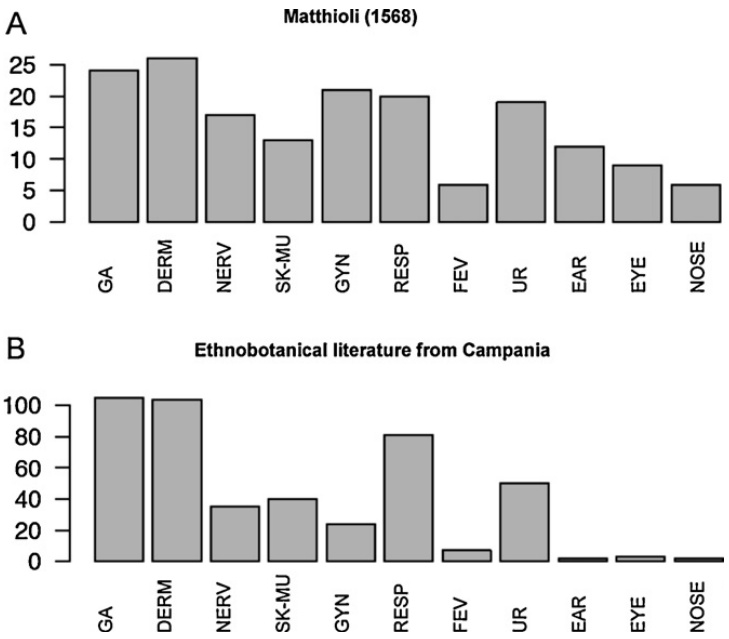
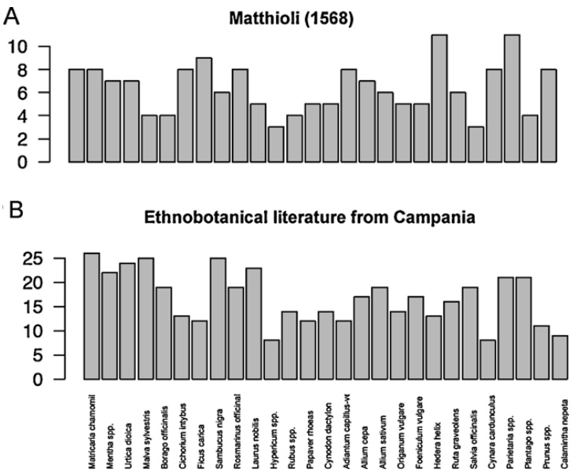
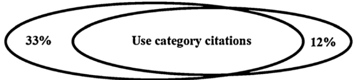
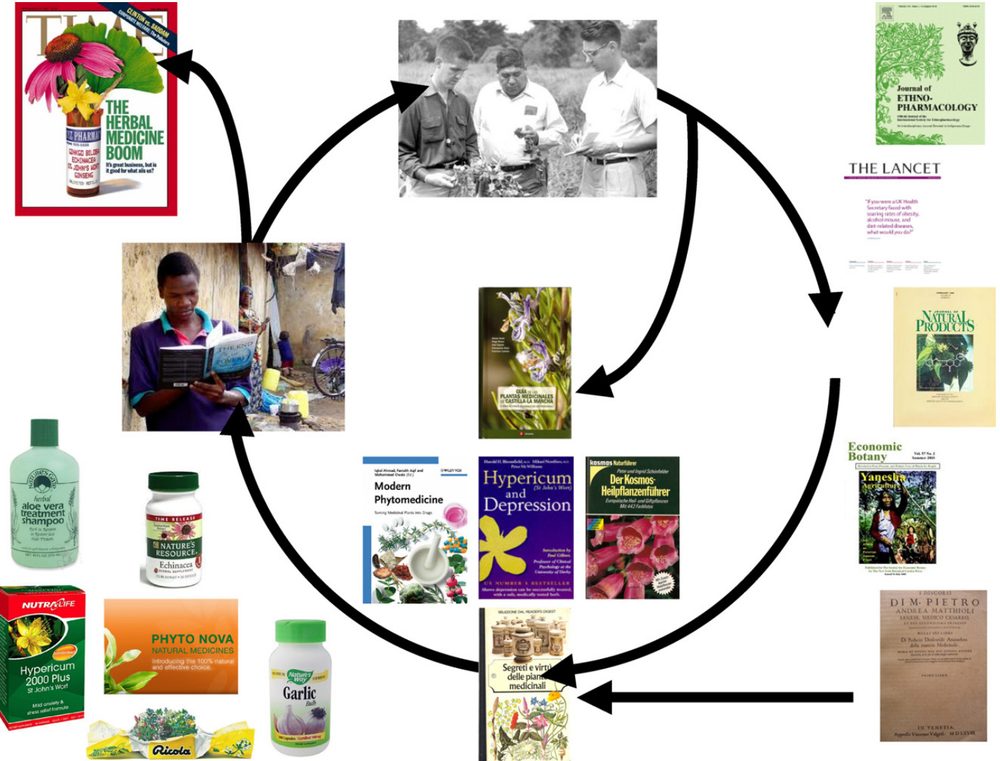

Review

# The future is written: Impact of scripts on the cognition, selection, knowledge and transmission of medicinal plant use and its implications for ethnobotany and ethnopharmacology

Marco Leonti ∗

Dipartimento Farmaco Chimico Tecnologico, Università di Cagliari, Facoltà di Farmacia, Via Ospedale 72, 09124 Cagliari (CA), Italy

# a r t i c l e i n f o

# a b s t r a c t

Article history:   
Received 24 November 2010   
Received in revised form 9 January 2011   
Accepted 9 January 2011   
Available online 19 January 2011

Keywords:   
Methods in historical analysis   
Medical anthropology   
Oblique transmission   
Herbal medicine   
Pharmacopoeia   
Ethnomedicine   
Hypericum   
Capsella   
Aristolochia   
Fever/malaria

Aim of the study: Apart from empirically learned medicinal and pharmacological properties, the selection of medicinal plants is dependent on cognitive features, ecological factors and cultural history. In literate societies the transmission of medicinal plant knowledge through texts and, more recently, other media containing local as well as non-local knowledge has a more immediate and a more prolonged effect than oral transmission. Therefore, I try to visualize how field based studies in ethnobiology and especially medical ethnobotany and ethnopharmacology run the risk of repeating information and knowledge and illustrate the importance of differentiating and acknowledging the origin, transmission and rationale of plant use made by humans.

Materials and methods: Reviewing literature dealing with the traditional parameters (e.g. hot/cold dichotomy, organoleptic properties, doctrine of signatures) influencing the selection and transmission of plant use in a juxtaposition to our recent finding of causal influence of text on local plant use. Discussing the passing down of knowledge by text as a special case of oblique/one-to-many knowledge transmission. Results: Historical texts on materia medica, popular books on plant use, clinical studies, and informants of ethnobotanical field studies generate a circle of information and knowledge, which progressively conditions the results of ethnobotanical field studies. While text reporting on phytotherapeutical trends may cause innovation through the introduction of “new” applications to local customs, persistently repeating well established folk remedies leads to the consolidation of such uses adding a conservative dimension to a local pharmacopoeia, which might not actually be there to that extent.

Conclusions: Such a “shaping” of what might appear to be the results of a field investigation is clearly outside the ordinary principles of scientific enquiry. The traditional pillars of ethnobotanical field studies – that is, “input to drug discovery” and “conservation of cultural heritage” – are also incompatible with this process. Ethnobotancial field studies aimed at a contribution to natural products research and/or the conservation of cultural heritage, as well as those aimed at an assessment and validation of local pharmacopoeias should differentiate between local plant use and widespread as well as modern knowledge reported in popular textbooks and scientific literature.

© 2011 Elsevier Ireland Ltd. All rights reserved.

# Contents

Introduction . 543

1.1. Ethnobotany, ethnopharmacology & hypothesis testing . 543   
1.2. Conspiracy, dogma & nationalism. . 543   
1.3. Plants, ideology & myths . . 544   
2. Research question . 544   
3. A journey from oral to written traditions in the transmission of plant knowledge 545   
3.1. Overview: article structure and definition of term 545   
3.2. Total versus medicinal flora – over and underrepresented plant families . 545   
3.3. Ethnomedicine, meaning & religion. . 545   
3.4. The humoral system, doctrine of signatures & organoleptic properties. 546   
3.5. Perception, cognition & causal correlation . 546   
3.6. The prototypical medicinal plant . 547   
3.7. Causal correlation of text on local plant knowledge and methodological considerations . 547   
3.8. Search for new bioactive molecules, documenting knowledge or understanding indigenous pharmacopoeias?. 548   
3.9. Cross-cultural knowledge exchange and dynamics in the importance of use categories . 549   
3.10. Text used for the dissemination of medicinal plant knowledge . 549   
3.11. Text as a type of oblique/one-to-many knowledge transmission . 550   
3.12. The feedback loop . 551   
Conclusions . 552   
Acknowledgements . 552   
Appendix A. Supplementary data. 552   
References 552

# 1. Introduction

# 1.1. Ethnobotany, ethnopharmacology & hypothesis testing

The documentation of knowledge is an essential step in ethnobiology as it provides data for further studies that may be driven by either philosophical or mostly utilitarian questions (Berlin, 1992). According to Balick and Cox (1996, p. 7) can only an interdisciplinary approach, including anthropology, archaeology, botany, chemistry, ecology, pharmacology and psychology lead us to understand the relationship between plants and human societies. Ethnopharmacology has generally followed an utilitarian approach and aims at the experimental investigation and biological validation of medicinal plants and natural product drugs (Balick and Cox, 1996). The broad perspective of ethnopharmacology contextualizes ecology and addresses the perception of plants, plant use, pharmacology and physiology in human communities (Etkin, 1988; Etkin and Elisabetsky, 2005). Cultural anthropology emphasizes cultural behaviour conditioned by thought and feeling and with respect to ethnobotany aims at a better understanding of the rationale of plant use as well as the classification of the natural world (Berlin, 1992; Endicott and Welsch, 2003). Ethnopharmacology can be specifically relevant with respect to further developing and evaluating indigenous pharmacopoeias (e.g. Robineau and Soejarto, 1996; Frei et al., 1998a; Leonti et al., 2001). In any case can the clarity of research objectives by “ethnopharmacologists of all backgrounds” be enhanced “by projecting pharmacologic data against a backdrop of medical ethnography and by enriching cultural interpretations of medical actions by exploring the physiologic potentials of plants” (Etkin, 2001).

It has been argued that both utilitarian and philosophical approaches should contain a research question, i.e. a reasonable hypothesis that can be proven right or wrong with the application of a sound method (e.g. Phillips and Gentry, 1993; Salick et al., 2003; Albuquerque and Hanazaki, 2009; Heinrich et al., 2009a; Gertsch et al., in press). Phillips and Gentry (1993) explained how the willingness to define falsifiable hypothesis in ethnobotany would help to improve the quality of insight into the question of why and how people use plants. Already Robbins et al. (1916) stated that ethnobotanical studies should go beyond collecting plants, handing them over for identification, recording their local names and producing a list of scientific plant names accompanied with some notes on their traditional usage. They argued that ethnobotany should “strike deeper into the thoughts and life of the people studied” and predicted that “ethnobotany will become a more important subject when its study has progressed to a point where results can be studied comparatively”. Straightforward ethnobotanical lists of species intended as a guide to the flora of a certain region, however, can be particularly helpful in this respect (e.g. Poncet et al., 2009).

# 1.2. Conspiracy, dogma & nationalism

Already Columella born in Cadiz [1st century AD] criticizes in his first book on agriculture the opinion of “leading men of the state” who condemn the “unfruitfulness of the soil” and the “inclemency of the climate” as the causative factors responsible for the decreasing agricultural production in the Republic of Rome (Ash, 1948, p. 3). Instead, Columella identifies social traits as the causative factors such as the “unrestrained passion for ownership beyond the sufficiency of inheritance” of certain citizens, resulting in untilled and abandoned lands (p. 51).

Notwithstanding the humanistic ideas, technological innovations and discoveries during the 15th century the conspiracy of the witches’ persecution increasingly haunted Europe (Ginzburg, 1990). The Malleus Maleficarum (Hexenhammer) by Heinrich Kramer [Institoris] printed in Speyer in the printing press of Peter Drach [ 1504] early 1487 became the main tool as well as the theoretical and practical background for the Inquisition (Kramer, 2003). Kramer identified the “witching obstetricians” as particularly malicious because pregnancy and parturition can be prevented also without the help of demons, with natural means such as herbs and other agents (p. 286).

In the preface to his book about the history and folklore of the German medicinal plants Marzell [1885–1970] (Marzell, 1938, p. 5) exults: “Even now, while after the national-socialist imposition the largest part of the German nation finally understood the importance of the intellectual heritage of our ancestors, and while now recordings of ancient folk-patrimony are not perceived anymore as antiquarianism, an immaculate collection of the folkloristic matter about our medicinal plants is still lacking”. What follows is an accurate description of the most common European medicinal plants and uses repeatedly reported in the literature since the Classic Greek period (cf. Marzell, 1938). Ethnobotany as a patriotic endeavour was also followed by other German scholars (Kenny, 2002). A particularly dark episode involving ethnobotany, homeopathic theory and radical cultural concepts occurred in interwar German medicine and politics (Kenny, 2002). Madaus [1890–1942] who succeeded in sterilizing mice using the extract of Dieffenbachia seguine (Jacq.) Schott (Araceae) was approached by the exponents of the Third Reich ideology and asked for collaboration (Arditti and Rodriguez, 1982; Kenny, 2002). Madaus was also involved in the attempt of establishing Hahnemann’s [1755–1843] doctrine of homeopathy as a holistic and romantic German alternative to the orthodox biomedicine, at that time leaded by many Jewish physicians (Kenny, 2002; Grill and Hackenbroch, 2010, pp. 58–67). The theory of homeopathy is based on the principle of similia similibus curantur (like curing like) and uses infinite dilutions of materia medica (Kenny, 2002; Singh and Edzard, 2009). The attempt of scientific validation of homeopathy through experiments conducted by the Nazis with concentration camp inmates failed miserably and ended in a disaster (Grill and Hackenbroch, 2010, pp. 58–67). However, the outbreak of the 2nd World War delayed the drafting of the final report about the research results (written only in 1966 by Fritz Donner [1896–1979]; Grill and Hackenbroch, 2010, pp. 58–67). The “Donner-Report” (http://www.gwup.org/infos/themen-nach-gebiet/986-derdonner-report-das-desaster-der-homoeopathie-im-dritten-reich) concludes that homeopathy is just a larvate form of psychotherapy, that is, the only therapeutic effect is that of the “meaning response” or “placebo effect” (cf. Moerman, 2002). In 1995, when the Donner-Report was finally published, homeopathy had already advanced towards an established therapeutic commodity as well as a multi million-euro market in Europe (Kenny, 2002; Grill and Hackenbroch, 2010, pp. 58–67). A similar scenario is found with apparently immunostimulating plants, which have gained an ethno-validated status despite of the lack of unambiguous scientific and cultural evidence (Gertsch et al., in press).

# 1.3. Plants, ideology & myths

With the focus on contemporary world problems concerning renewable resources and how to share them, from the 1990s onwards ethnobiologists added a political aspect to their research agenda (Clément, 1998). Paralleled by publications of books such as “The Healing Forest” (Schultes and Raffauf, 1990) and “Plants People and Culture – The Science of Ethnobotany” (Balick and Cox, 1996) during that time the work of ethnobotanists gained considerable media coverage in the attempt to illustrate the importance of biodiversity and its conservation (Balick, 1996). The conflict of interests that resulted from this development is not yet surmounted. The politicization of ethnobiology distracted from a sober scientific goal and led to the creation of myths (cf. Voeks, 2004: “Medicine and Myth from the Humid Tropics”) and bizarre blossoms: Moerman (2008) outlined in a funny essay the sense, or rather nonsense, of keeping ethnobotanical data secret in order to secure a group’s intellectual property rights. The denunciation of bioprospecting by [a part of] the ethnobotany community was driven by unwarranted expectations in the pharmaceutical potential of local knowledge disregarding the fact that sharing knowledge is the foundation of culture and science (McClatchey, 2005a). The majority of the plant uses surveyed in any ethnobiological field study, has already been documented several times before and there is no such thing as pure endemic knowledge (Moerman, 2008). Bennett and Prance (2000) note that the exchange of food, ornamental and medicinal plants between South America and Europe occurred in both directions and consider that rural populations may be affected the most by a worldwide restriction of germplasm exchange. Also, the causal dependence of bio-cultural diversity on biodiversity has never unambiguously been shown because “a greater degree of species richness does not necessarily indicate higher ethnobotanical diversity” (Bye et al., 1995). Brown (1985) concluded, that small-scale farmers create local biological diversity through subsistence farming and possess larger inventories of labelled biological classes than hunter-gatherers. It is now agreed upon that cultural diversity fosters biodiversity (e.g. Bye, 1993; Bye et al., 1995; Voeks, 2004; Maffi, 2004, pp. 9–35; Vogl-Lukasser et al., 2010). Another myth, occasionally brought forward (cf. ReyesGarcia, 2010) is that the poor health status indigenous peoples suffer from is a consequence [causal correlation] of the selfish global north that fails to bring back ethnopharmacological expertise and findings derived from these very regions. The industrialized civilizations may sure have their socio-political responsibilities but above all can problems like under nourishment, unreliable water supply, diabetes, tuberculosis, AIDS and drug abuse hardly be tackled with some medicinal plants or “ethnopharmacological”

knowledge. Such misleading simplifications of complex and intricate realities can lead to dangerous situations (cf. Smith, 2010). The conjunction of local knowledge and intellectual property rights with the perceived needs of our society at large described by Posey (2002) as “commodification of the sacred” can today be extended to the double moral standards in the field; academic journals call for contributions on local knowledge from less developed regions of the world and thereby boost career portfolios of scholars from the developed world.

# 2. Research question

Humans have the capacity to transmit knowledge to other individuals remote in space and time by means of writing and telecommunication. With respect to the other living species humans are not dependent on solely face-to-face observation and direct imitation for cultural transmission (Cavalli-Sforza and Feldman, 1981, p. 4). Europe, India and China each have a large historical and modern written corpora on the use of natural products (Srivastava, 1954; Unschuld, 1977; Stannard, 1999). One could literally fill entire libraries with texts written during the past 2000 years dedicated to the relationships between humans, plants and drugs. According to Totelin (2009, p. 17) writing makes an impact on pharmacological knowledge but oral and written knowledge should not be dichotomised.

We have shown that the Popoluca of southern Veracruz and the Mixe from the isthmus of Tehuantepec (Oaxaca) who have split from common post-Olmec ancestors over 2000 years ago share a significantly higher number of plant uses than expected from an independent random approach to plant selection. Neither ethnic group has used text for the greater part of their cultural history. The fact that cognate plant names could be detected for both pharmacopoeias let us conclude that at least a part of the plant uses from the Mixe and the Popoluca were part of the orally transmitted pharmacopoeia of a proto-Mixe/Zoque culture (Leonti et al., 2003b).

While plant use can be traced back 2000 years in illiterate societies with the application of statistical methods, in cultures and regions with a rich writing tradition like Europe, India and China the possibility of tracking back plant uses is more straightforward. The interrelatedness and mutual influence of historical written texts on medicinal plant use can be traced readily (e.g. Arber, 1938; Mann, 1984; Riddle, 1985; Lev, 2002; Lardos, 2006; Weckerle et al., 2009; De Vos, 2010). Literature on materia medica and folk medicine has been popular ever since the invention of printing and many works had considerable print runs. The Swiss brochure “Chrut und Unchrut” (herb and weed) by pastor Künzli, first published in 1911 had an overall print run of 860.000 by 1942. Apart from medicinal plants many popular books on plant use are dedicated to wild gathered vegetables and their culinary preparations (e.g. for Italy: Corsi and Pagni, 1979; Crett, 1987; Vannelli, 1998). However, for the largest part of written history only a minor portion of the population was literate, contributed to the written corpora, and had access to codices and books. Even though the filtering down model from an elite-scientific to a popular level is a generally accepted principle for culture at large (Foster, 1994, p. 153) it was of particular interest to me to see if standard books on materia medica have had an influential effect on local medicinal plant use (Leonti et al., 2009, 2010). While the possibility for diachronic studies is almost entirely restricted to “modern” cultures (Cavalli-Sforza and Feldman, 1981, p. 340) the direct causal influence of written knowledge on local, and contemporary plant use had never been addressed before. We estimated the average increment of the probability of finding a plant mentioned for a certain use category in the region of Campania (Italy) indicated before by Matthioli (1568) to be around 20%.

This increment describes the mean value, which is bordered by a 95% credible interval ranging from 14% to 25%. In other words, one in five plant uses found in contemporary ethnobotanical literature of Campania stems directly from Matthioli (for details see Leonti et al., 2010). Apart from that it has also become clear “that recognition of the curative properties of medicinal plants is not simply unsubstantiated folklore” (Berlin and Berlin, 1996, p. 3).

However, a paradox arises from the common arguments used to justify ethnobotanical research: “conservation of cultural heritage and traditional knowledge” and its “potential for drug development”. I argue that studies on medicinal plant use in general (in Europe or elsewhere) report the status quo, that is, a momentary picture of folk medicinal knowledge and practices, which is inevitably a mixture of local knowledge as well as both, modern biomedical knowledge and mainstream phytotherapy.

Furthermore, in a globalized world, the mechanisms of selection and transmission of knowledge with respect to specific plant use will progressively be influenced by text and media, while anthropological rationales discussed in Sections 3.2–3.6 will eventually be transmitted unconsciously as “sleeping cues” by these means. If we agree that the doctrine of signatures serves as a mnemonic aid in plant selection and transmission (see Section 3.4) – then what significance can be ascribed to texts as mnemonic devices?

# 3. A journey from oral to written traditions in the transmission of plant knowledge

# 3.1. Overview: article structure and definition of terms

The first part (Sections 3.2–3.6) of the subsequent review and discussion deals with the interrelation between pharmacological properties, human cognition, ecology, and adaptive evolution providing a range of explanatory models for the selection and transmission of plant use. In juxtaposition, the other part (Sections 3.7–3.10) addresses the impact and role of text in the transmission of plant use and particularly our recent finding of causal influence of text on local plant use.

In Sections 3.11 and 3.12, I will discuss the transmission of knowledge through text as a special case of oblique/one-to-many knowledge transmission and analyze the consequences resulting for medical ethnobotany and ethnopharmacology. Finally, in Section 4 I make some recommendations and give some guidelines on how to improve the situation.

The connotations of “traditional plant knowledge” or “traditional medicine” imply that there is a conservative aspect intrinsically bound to this knowledge generally understood to be transmitted orally. However, since all human cultures are constantly evolving it has been argued that the term “traditional” is too vague and may be misleading in this context (see McClatchey, 2005b). Therefore, I use here the terms “local” and “non-local” knowledge and practices of plant use. Consequently, I do not use the terms “traditional ethnobotanical knowledge” or “traditional ethnopharmacological knowledge” when addressing local plant knowledge and associated curative, inebriating or toxic properties. Instead, I “speak” of “medicinal plant knowledge” since also the suffix “ethno-” has become increasingly perspective-dependent and vague.

# 3.2. Total versus medicinal flora – over and underrepresented plant families

When Moerman (1979) tested the hypothesis that plants used medicinally would reflect a random representation of what is available in nature he found that the results obtained indicated a selectivity in the medicinal use for certain taxonomic groups by native Americans. By comparing the results of the regression analysis from five different floras Moerman et al. (1999) showed that holarctic peoples rely on similar plant families for their health care. Inspired by Moerman’s approach other studies adopted the regression analysis for the testing of under and over-represented plant families in local pharmacopoeias (e.g. Kapur et al., 1992; Leonti et al., 2003a; Shepard, 2004; Hernández et al., 2005; Amiguet et al., 2006; Lira et al., 2009; Douwes et al., 2008). A different binomial method permitting inferential statistics suggested by Bennett and Husby (2008) has been used by Thomas et al. (2009) and Leonti et al. (2009). The different studies, utilizing either regression analysis or with the binomial method, concluded that plant families belonging to the Euasterids (e.g. Asteraceae, Apiaceae, Lamiaceae, Solanaceae) are generally overused while families belonging to the Poales (e.g. Poaceae, Cyperaceae) as well as the family of the Orchidaceae are underrepresented in medicinal floras. Why are Euasterids so popular in local medicines, herbals like De Materia Medica and mainstream phytotherapy alike? Euasterids include many conspicuous species endowed with prominent organoleptic properties (colour, appearance, smell, taste, texture) and a rich and diverse spectrum of bioactive secondary metabolites. Such plants have been said to have high levels of apparency; they are easily detected. Such apparency is characteristically an adaptation to facilitate pollination by bees, butterflies or hummingbirds; but such adaptations are often visible to humans as well (Moerman, 1994). Characteristic secondary metabolites of the Euasterids are iridoids, idole and pyrrolizidine alkaloids, essential oils, flavones, higher inulins, polyphenole carboxylic acids and sesquiterpenes (Stevens, 2010). Such secondary metabolites are often a consequence of the apparency noted earlier; attracting butterflies may facilitate pollination, but such attraction might also attract browsers to eat the plant to the ground; hence, the broad array of toxic or noxious substances to deter such browsing. But these biologically active substances are precisely the ones co-opted by humans for medicines (Moerman, 1994). A great part of the medicinal Euasterids are weedy species growing in or near human habitations and are therefore easy accessible. Weedy species encompass many cultivated and uncultivated vegetables, fruits and spices and on their turn make up a considerable part of medicinal floras (Stepp and Moerman, 2001). Medicinal species need to be abundant and easily accessible and therefore rare species are usually not contained in pharmacopoeias because they would easily become extinct or at best hard to find (e.g. Silphium; cf. Hort, 1977, II, pp. 15–21) or brought under cultivation (e.g. Banisteriopsis caapi (Spruce ex Griseb.) C. V. Morton (Paz Y Mi˜no et al., 1995), or Panax ginseng L.; Stepp and Moerman, 2001). The complex relationships between these ecological, pharmacological and cognitive factors and their importance for plant selection have been part of the discussion of several studies (e.g. Etkin, 1988; Johns, 1990, pp. 251–291; Bye, 1993; Logan and Dixon, 1994; Etkin and Ross, 1994; Moerman, 1996; Stepp and Moerman, 2001; Stepp, 2004; Voeks, 2004; Leonti et al., 2006).

# 3.3. Ethnomedicine, meaning & religion

Different systems of medicine show convergent and analogous tendencies regarding explanations for the cause of diseases and illnesses as well as rationales for treatment (cf. Foster and Anderson, 1978). Generally, medicine is understood to be meaningful and important (Moerman, 2002, p. 153). Since medicine is meant to heal the transfer of medicine from one person to another implies the transfer of healing powers as well (Miles, 1998). The doctrine of disease that attributes disease and illness of the body and mind to the malevolence of gods, demons, spirits, shamans, witches and magic is inherent to all cultures (Winternitz, 1898; Ortiz de Montellano, 1975; Foster and Anderson, 1978; Kramer [Institoris], 2003; Shelenz, 2005). These supernatural explanations have been subsumed as “personalistic” causes and opposed to “naturalistic” medical systems of illnesses, which include equilibrium models and the visible and more evident reasons (Foster and Anderson, 1978, p. 53). Mann (1984, p. 2) argues that magical practices have long played an important role in human medicine and supposes that early medicinal rituals had their conceptual origin in primitive religion. Medicinal plant use has evolved within a religious and mythical context, which together with the plant’s physical appearance may explain its efficacy (Moerman, 2002, p. 153). Still today, in rural areas of developed countries, medicinal plants, symbolic devices and charms are used in magical practices and religiously shaded healing rituals (e.g. for Italy: Cossu, 1996; Quave and Pieroni, 2005; Napoli, 2008). These magico-religious practices were widespread components in European and NorthAmerican folk medicine until two centuries ago and have gradually been displaced by modern biomedicine (Gordon-Cumming, 1887). Gordon-Cumming (1887) portrayed how foreign customs and scientific studies in medicine were influencing Japanese medicine at the end of the 19th century and how local customs were abandoned. However, still today we instinctively lay on our hand where it hurts, and, similarly, parents do the same with their children. The laying on of hands as a method of curing and averting disease has already been mentioned in the Rig-veda (Winternitz, 1898). In good faith Winternitz (1898) writes: “Nothing is more powerful to the primitive mind than the human word”, which is also funny or rather self-reflecting since in this very respect we all are “primitive”. Indeed, no one can defy the effect of the meaning response since one cannot avoid meaning while engaging humans (Moerman and Jonas, 2002). If prayer should be considered a modality of complementary and alternative medicine is in fact the matter of an ongoing discussion (Tippens et al., 2009).

# 3.4. The humoral system, doctrine of signatures & organoleptic properties

Galen [ca. 131–201 AD] based pathology on the doctrine of the bodily humors refining and solidifying the Hippocratic humoral pathology with its four temperaments in classical medicine (Mann, 1984, p. 128; Foster, 1994, pp. 4–7). Consequently, his descriptions of drugs in De simplicium medicamentorum facultatibus, libri XI contain the humoral properties of the drugs, which at the same time should be understood as an explanation and the reason for the their efficacy (cf. Galen, 1561). If the humoral system of Latin America, with its hot/cold spectrum of illness classification is of Old World or New World origin and to what extent it has been influenced by classical Hippocratic-Galenic-Arab medicine has caused an intricate debate (Browner, 1985; Foster, 1994; Bye et al., 1995). Similar to Hippocratic pathology, in Latin America the humoral system is of relevance to the selection of medicinal plants since remedies must have the opposite virtue with respect to the perceived illness (Browner, 1985; Browner and Ortiz de Montellano, 1986; Foster, 1988). Excess of “heat” or “coldness” provoke disorders and illnesses but the classification can differ significantly between ethnic groups (Browner and Ortiz de Montellano, 1986). These hot/cold equilibrium models are the most frequently reported ethnomedical theories of health and illness worldwide and the imbalance of body fluids and energy is regarded as the origin of disease also in India (Ayurveda) and in Chinese medicine (Browner, 1985; Foster and Anderson, 1978; Foster, 1994; Williamson, 2002; Borchardt, 2003). The conceptual similarities between the “Sushruta Samhita” and the Corpus Hippocraticum are so intriguing that it led to the hypotheses that the two works might be related (Tschirch, 1910, p. 503; Foster, 1994, p. 9). The hot/cold concept has, however, been criticized as being too narrow in order to understand therapeutics and the reasons for plant use (Browner, 1985; Brett and Heinrich, 1998).

Also the doctrine of signatures and the principle that similia similibus curantur is found in medicinal systems all over the world and prevails throughout the whole range of folk medicine (Winternitz, 1898; Etkin, 1988; Dafni and Lev, 2002; Bennett, 2007). Likewise, organoleptic properties intrinsically tied to the doctrine of signatures play an important role in the selection of materia medica in different cultures (e.g. Berlin and Berlin, 1996; Brett, 1998; Heinrich, 1998; Frei et al., 1998b; Ankli et al., 1999; Casagrande, 2000; Leonti et al., 2002; Shepard, 2004; Gollin, 2004; Waldstein, 2006; Pieroni et al., 2007; Thomas et al., 2008; Molares and Ladio, 2009a). Colour and taste properties of drugs are important classification clues in Chinese medicine where they are related with different organs of the human body (Tschirch, 1910, p. 515). Also the Maya of Yucatan and the Popoluca of southern Veracruz correlate smell and taste properties of medicinal plants with specific symptom categories and with respect to non-medicinal plants, medicinal plants are perceived as having significantly more pronounced taste and smell properties (Ankli et al., 1999; Leonti et al., 2002). Correlations between polyphenol rich, astringent drugs and their application against diarrhoea and skin diseases has been found in different cultural contexts and is an established principle of phytopharmacy and phytotherapy (Hänsel et al., 1999, pp. 870–890; Ankli et al., 1999; Leonti et al., 2002; Heinrich, 2003; Gollin, 2004; Locher and Currie, 2010). But while the Isthmus Sierra Zapotec seem to correlate the “bitter” sensation with a cold humoral state do the Sierra Popoluca perceive bitterness as a “hot” virtue (Frei et al., 1998b; Leonti et al., 2002). The doctrine of signatures is occasionally referred to consciously by healers who acknowledge that a plant cures only through the belief in its form (cf. Leonti et al., 2002). Etkin (1988) suggested that the mnemotechnical character of signatures might at varying degrees be related to empirical experience with medicinal plants. We have brought forward the theory, that the doctrine of signature serves as a mnemonic aid, facilitating the remembering of plant uses and medicinal traditions (Leonti et al., 2002). Similarly Casagrande (2000) and Shepard (2004) noted a clear mnemonic association between organoleptic properties and respective indications. Bennett (2007) supports this theory remarking that there were also other authors who proposed a mnemonic role for the doctrine of signatures. The most interesting aspect about Shepard’s (2004) work is the finding how similar sensory perceptions by two ethnic groups living in the same environment are culturally moulded into different selection criteria.

# 3.5. Perception, cognition & causal correlation

History, linguistic and ethnographic studies provide evidence that cultural groups living in similar environments and possessing similar technologies may have completely different religious systems and social structures (Henrich and Boyd, 1998). “Evolutionary considerations suggest that our cognitive abilities consist of learning rules that preferentially select and evaluate sensory data from prescribed subsets of externally produced information” (Henrich and Boyd, 1998). It has been shown that it is rewarding trying to understand emic selection criteria of plant use as well as the cultural mechanisms of how such knowledge is transmitted through space and time. Probably all of these studies reviewed in Sections 3.2–3.4 were partially inspired by Brent Berlin et al.’s works on folk classification and its implication for plant use (e.g. Berlin et al., 1973; Berlin, 1992). Berlin and colleagues evidenced common patterns in folk biological classification and the universality of basic human cognition uncovering an innate and unconscious hierarchical classification system. Also organoleptic properties are used by human cultures in the examination, classification, and selection of the biome. The conscious perception of cognitive signals together with the individual cultural history and human physiology of different ethnic groups asserts that these signals may be connected and interpreted in culture-specific ways. For example, the nagging question of “why” a specific illness struck a specific person, at a specific time, in a specific place, gives rise to disease theory systems (Foster and Anderson, 1978, p. 43). Hence, in their attempt of connecting their cosmology and ideology with the environment (and vice versa; cf. Posey, 2002) and giving sense and meaning to their culture humans tend to perceive “causal connections” also in cases where causality is not existent.

# 3.6. The prototypical medicinal plant

Based on the above discussion (Sections 3.2–3.5) a hypothetical “prototypical medicinal plant” would thus be an abundant Euastrid weedy species, possibly utilizable as food, routinely attracting pollinators, rich in pharmacologically active and bio available metabolites, endowed with pronounced organoleptic properties and ideally, with a bit of fantasy, the signature of the organoleptic virtues could be matched with the plant’s medicinal indication, which thereby would facilitate its transmission and through the belief in its semiotic appearance at the same time enhance the meaning response of its medical application.

# 3.7. Causal correlation of text on local plant knowledge and methodological considerations

In a continuation of our investigation on the influence of De Materia Medica by Dioscorides [1st century AD], on local knowledge and practices we compared the medicinal plants reported in eight recent field-based studies from the region of Campania (Italy) with Matthioli’s translation and commentary on Dioscorides from 1568, which was the pharmaceutical text of reference until the 18th century in Italy (Cosmacini, 1997). The uses and taxa were pooled in a database and quantitatively arranged into eleven symptom- and organ-defined use categories based on Preuss (1911, pp. 300–341) and Matthioli (1568). A specific species indicated for a specific category of use in a single study was counted like a single citation and handled like a use report even if the study reported frequency of citations (Leonti et al., 2009, 2010). Arranging medicinal plant uses into emic use categories or ailment categories is a prerequisite that allows for statistical analysis of the data set and is a standard approach in medical ethnobotany (e.g. Trotter and Logan, 1986; Berlin and Berlin, 1996, 2005; Heinrich et al., 1998; Frei et al., 1998a; Leonti et al., 2001).

The 11 use categories established were: gastrointestinal disorders (including liver and spleen), urological problems, respiratory complaints (including angina, sore throat, pleurisy), dermatologic problems (including oral cavity and haemorrhoids), skeletomuscular disorders (including haematoma and gout), application in women’s medicine and fever (including malaria). The sensory organs of the head, that are “eye”, “ear”, and nose (epistaxis and polyps) were treated as separate use categories while toothache was included together with neuropathies in one category comprising the peripheral as well as the central nervous system (including headache, toothache, analgesic uses, epilepsy, insomnia). For the species mentioned in at least six of the eight field-based studies (27 taxa), the use categories were compared with the use categories described in Matthioli (1568) including his commentaries (Figs. 1 and 2).

The 27 taxa account for 453 use category citations for the data set from Campania (with a possible maximum of: 8 (studies) 11 (categories) × 27 (taxa) = 2376 use category citations). In Matthioli the 27 taxa account for 170 use category citations (with a possible maximum of: 1 (study) × 11 (categories) × 27 (taxa) = 297 use category citations). From the 453 use category citations of the Campanian data set 53 do not correspond with Matthioli while 88% overlap with Matthioli. From the 170 use category citations from Matthioli 55 do not correspond with the data from Campania while 67% are congruent with the Campanian data set (Fig. 3). In the data set from Campania a taxon is indicated for an average of 5.3 use categories while in Matthioli (1568) a taxon comes up with an average of 6.3 use categories. This means that the information in Matthioli (1568) for these 27 taxa is more diverse and comprehensive than the eight studies from Campania taken together. Especially the less frequent use categories “nose”, “eye”, “ear” as well as “fever” receive proportionally more importance in Matthioli (1568) with respect to the data set from Campania (Fig. 1). Thus, based on the analyzed data, notwithstanding the almost 90% overlap of the Campanian data with Matthioli (1568) the direct influence of Matthioli on local plant use in Campania could be estimated with the Bayesian statistical model for causal inference, to around 20% (for details see Leonti et al., 2010).

  
Fig. 1. Importance of use categories based on the 27 most frequently documented taxa. (A) Species citations per use category in Matthioli (1568) and (B) species citations per use category in the eight studies from Campania (for an explanation of the abbreviations see Section 3.7).

  
Fig. 2. Number of use citations of the 27 most often documented taxa. (A) Number of use citations per species in Matthioli (1568) and (B) number of use citations per species in the surveyed literature from Campania.

  
Fig. 3. Congruency of use category citations between Matthioli (1568) and data from Campania with respect to the 27 analyzed taxa. From the 453 use category citations of the Campanian data set 53 do not correspond with Matthioli while 88% overlap with Matthioli. From the 170 use category citations from Matthioli 55 do not correspond with the data from Campania while 67% are congruent with the Campanian data set.

Of the 120 taxa used as medicine in Sardinia, Sicily as well as in Campania 116 can be traced back to Dioscorides through Matthioli (1568). We published the plant list as supplementary online material as a step towards a repository for ethnobotanical and ethnopharmacological survey data (for details see Verpoorte, 2008). These 120 taxa receiving consensus from Sardinia, Sicliy and Campania are also the most important with respect to the usecitations in the analyzed literature from Campania (Leonti et al., 2010). Of these 120 taxa 50 are Euasterids, about 40 are used as food, and many are either cultivated or weeds. This means that there is a positive relationship between widespread species and cultural significance, which coincides with Turner (1988): “A plant of high importance is more likely to be known to people over a wide region” or with Benz et al. (1994): “Plants that have significantly more reports of use are species with naturally widespread distributions or species that thrive in disturbed habitats” as well as with Stepp and Moerman (2001; see Section 3.2). However, the consideration of the overall flora of an area definitely renders generalizing statements more meaningful (Moerman, 2005).

Apparently our contribution about methodological approaches used in historical studies entitled “Ethnobotany and ethnopharmacology – interdisciplinary links with the historical sciences” (Heinrich et al., 2006) has largely been misunderstood. If one intends to show historic developments, tendencies, correlations or even causal correlations in plant use it is not allowed to choose suitable data from the sheer endless bulk of literature on plant use that fits the proposed theory or hypothesis and ignore the other part. If the wealth of data is too big to practically deal with, a reasonable sampling method may be applied. Also, whenever diachronic data offer the possibility, a quantitative approach should be followed. Intercultural and inter-group comparisons make only sense if the historical factors that influenced local plant use, such as classical texts, are considered and incorporated into the comparative analysis.

The increasing practice of publishing a subset of uses (use category or organ defined ailment category) from a pharmacopoeia separately may be a response to the publication pressure of the researcher but does not come up with the complexity of a pharmacopoeia. There are taxa that are used against the whole range of diseases and symptoms and therefore their application is not specific (e.g. Ruta spp. and Plantago spp.). Pharmacopoeias evolved as a unity and the whole quantified spectrum of a taxa’s uses holds information on pharmacological mechanisms, phytopharmaceutic potentials and anthropologic rationales (for details see Berlin and Berlin, 1996). Publishing ethnobotanical studies in tranches corresponding to ailment groups makes it impossible to comprehend and appreciate such aspects.

Notwithstanding invocations for more rigorous applications of sound methods and the implementation of research questions there are still many studies being published that draw conclusions without addressing any research question or without showing significant data (for a thorough discussion see: Young et al., 2008; Smith, 2010). Also, new and parallel theories must be justified by an extra explanatory effort, while “private terminology” (new terms) is only admissible for real innovations (Gernert, 2008).

# 3.8. Search for new bioactive molecules, documenting knowledge or understanding indigenous pharmacopoeias?

The contribution to drug discovery made by pharmacologists in collaboration with botanists, chemists and anthropologists in their attempt of trying to understand the pharmacological bases of culturally important plants has a rich history (Lewin, 1973; Bruneton, 1995; Heinrich et al., 2004; McClatchey et al., 2009; Gertsch, 2009). It is generally argued that in the last 20–30 years no new drugs were developed from ethnobotanical leads (McClatchey, 2005a) and that important findings are hardly to be expected because the “low-hanging fruits have already been picked” (Gertsch, 2009 and reference therein). This is, however, not entirely true since the alkaloid galanthamin, first isolated from Galanthus spp. (Amaryllidaceae) was launched as an Alzheimer Disease treatment in 1996 under the name Nivalin® (Heinrich and Teoh, 2004). Apparently, in the 1960s it was observed that in the Caucasian mountains a decoction of the bulbs of Galanthus woroncwii Los (Caucasian snowdrop) was given to children suffering from poliomyelitis. The subsequent phytochemical and pharmacological studies were conducted in Bulgaria and the UdSSR during the Cold War period (Heinrich and Teoh, 2004).

It is, however, true, that the research goal of ethnopharmacologists and some ethnobotanists, is to understand the molecular bases as well as the validation of ethnopharmacopoeias and plant species for their medicinal and toxicological properties (Rivier and Bruhn, 1979; Heinrich, 2003; Gertsch, 2009). Notwithstanding this and maybe with the golden days of ethnopharmacology in mind, ethnobotanists from Europe and elsewhere often indiscriminately and overoptimistically (see Section 1.3) keep alive the romantic tale alluding to the relevance for drug discovery of the medicinal species reported (some recent examples from the Mediterranean: Parada et al., 2009; Neves et al., 2009; Cakilcioglu and Turkoglu, 2010). This is not only anachronistic but also repetitive since the large part of the species and uses listed in such surveys, especially from Europe and the Mediterranean, have been reported several hundred times since the age of Dioscorides already. A reason for this persistence might be that the funding of research projects is frequently correlated with claims of possible practical applications. Balick and Cox (1996, p. 23) acknowledge, that the search for new drugs among “traditional” medicines has received the most public attention. In contrast to this public awareness, however, has pharmaceutical chemistry related to natural products moved its focus from plants to biological resources from marine ecosystems quite a while ago (Cox, 2000). Chemical entities deriving from marine species have pronounced biological activities and with respect to secondary metabolites isolated from plants are more complex and offer more diverse scaffolds (Verdine, 1996; Proksch et al., 2003; Blunt et al., 2010). Also, political issues like intellectual property rights and the convention on biological diversity (CBD) deter entities from bio prospecting and screening of terrestrial sources. It has, however, been suggested, that the evaluation of drugs and diets described in ancient texts with modern biomedical methods and targets could be a promising approach for the discovery of new drugs and biochemical tools (Holland, 1994; Rollinger et al., 2004; Ichikawa et al., 2007; Appendino et al., 2009; Adams et al., 2011).

The importance for the documentation and conservation of “traditional knowledge”, achieved with such survey studies is used as another pillar to justify this kind of inventory (Heinrich et al., 2009a). It is frequently argued that documenting plant-uses helps to conserve cultural heritage, which otherwise would be bound to become extinct due to the abandonment of “traditional” life styles related to globalization and the modernization of rural areas. This is certainly true for the last remaining illiterate hunter-gatherer societies and isolated rural communities, which with respect to the fast cultural changes in modern urban societies, are characterized by conservatism (Cavalli-Sforza and Feldman, 1981).

# 3.9. Cross-cultural knowledge exchange and dynamics in the importance of use categories

Individual medical choices, even those made by inhabitants in the remotest areas are today progressively influenced by global commercialism (Miles, 1998; Giovannini and Heinrich, 2009). Also has the “outside world” always influenced local communities and introduced “new” plant species and related knowledge (Bennett and Prance, 2000; McClatchey, 2005a; cf. Lozada et al., 2006). Molares and Ladio (2009b) have shown that the Mapuche medicinal flora is related to locally generated as well as non-locally generated knowledge. The assumption that the Mapuche have inherited the indications for the introduced Mediterranean medicinal species from the European pharmacopoeia is plausible and remains to be analyzed (Molares and Ladio, 2009a). In general, cultural interaction may alter the diversity and the importance of medicinal plants, which is detectable as “continuity” and “disjunction” or “discontinuity” and “synchronism” (Bye et al., 1995).

Apart from the importance of medicinal plants, the importance of use categories may also change. A possible explanation for the relative low importance of the use categories “nose”, “eye”, “ear” as well as “fever” observed in the data set from Campania with respect to Matthioli (1568) might be that rarer, less frequent plant uses in folk therapy have a higher chance of being forgotten or transformed with respect to uses connected with more common ailments (Fig. 1). This parallels evolutionary dynamics of language as it has been shown that frequently used words evolve at slower rates than words used relatively rarely (Pagel et al., 2007; Lieberman et al., 2007). Another possible reason for the fluctuation of the importance of use categories might be the prevalence and virulence of diseases. Dioscorides mentioned 17 identifiable plant taxa (including the worms in Dipsacus fullonum L. (Dipsacaceae)) against malaria and intermittent fever (cf. Matthioli, 1568; Berendes, 1902; see supplementary data). All of these taxa and drugs are indicated against malaria in the German herbals with the exception of the oil of Anethum graveolens L. (Apiaceae) and Portulaca oleracea L. (Portulacaceae; cf. Adams et al., 2011; see supplementary data). While Portulaca oleracea, is indicated against malaria in the translation of Matthioli (1568, Book II, Chapter 113), in the translation of Berendes (1902, p. 219) the taxa is indicated against all kind of fevers and likewise Portulaca oleracea is indicated against fever and fervid afflictions in Fuchs (1543, Chapter 39) and Lonicerus (1679, p. 174). Of the 37 taxa indicated against fever by Dioscorides at large only Anethum graveolens, Bupleurum sp., Opopanax chironium W.D.J. Koch (all Apiaceae), Phoenix dactylifera L. (Arecaceae), Aristolochia spp. (Aristolochiaceae), Cucurbita pepo L. (Cucurbitaceae) and Portulaca oleracea have not found to be indicated against malaria in the German herbals (cf. Adams et al., 2011; see supplementary data). Apparently indications against fever for 15 taxa made by Dioscorides were specified for the treatment of malaria in the German Renaissance herbals (see supplementary data). However, Adams et al. (2011) used Matthioli’s German “Käuterbuch” from 1590 in their analysis, which differs from “I Discorsi” based first of all on Dioscorides’ text, originally published in 1544 and used here.

Occasionally it is difficult to distinguish local practices from external influences. Different native Aristolochia species (snakeroot) are used by the Popoluca to treat snake-bites, and stomach-ache of which Aristolochia asclepiadifolia Brandegee, and Aristolochia ovalifolia Duch. are the most frequently used (Leonti et al., 2001). The organoleptic properties of Aristolochia spp. are perceived as bitter and therefore “hot” (Leonti et al., 2002). Dioscorides recommends three Aristolochia spp. for pregnant women and menstrual problems. He also recommends them against all kind of venoms and particularly the “long” [Matthioli] or “big” [Berendes] species against snakes. Dioscorides further indicates Aristolochia spp. against respiratory problems and hiccup, the chill that seizes before fevers, the spleen, spasms, and against cutaneous ulcers (cf. Matthioli, 1568, Book III, Chapter 4; Berendes, 1902, Book III, Chapter 4). Galen (1561, p. 382) additionally mentions the “hot” properties of Aristolochia spp. but does not mention uses against venoms of any kind. Aristolochia spp. are of worldwide importance in herbal medicine and mainly used for indications related to gastrointestinal problems and snakebites (Heinrich et al., 2009b). The wood of Aristolochia cf. consimilis Mast. is the most frequently medicinal plant product offered for sale in Paramaribo City (Suriname) and indicated against menstrual pain and as a bitter tonic (Andel et al., 2007). To what extent the similar uses in South American and European herbalism are analogous developments conditioned by the doctrine of signature and/or specific pharmacologic properties or result form an information exchange after the Conquest is impossible to assess. Most importantly, however, the Aristolochia genus is well known for the presence of nephrotoxic aristolochic acids, which cause long-term effects and therefore in most cases their toxicity remains undetected (Zhou et al., 2007; Heinrich et al., 2009b). Consequently, Leonti et al. (2001) and Heinrich et al. (2009b) stressed the need for training and outreach programmes, which could highlight the potential risks of using Aristolochia species in herbal medicine. Thus, this is in fact a proposal, and one that has been made by many colleagues, to use the written word in order to influence local medicine.

# 3.10. Text used for the dissemination of medicinal plant knowledge

In more general terms, Miles (1998) notes that medical technologies and commercial products cross geographic and cultural frontiers and thereby transform medical knowledge and patient options (cf. Giovannini and Heinrich, 2009). Also the influence of written documents and media on the selection of material medica is not restricted to Europe, the Mediterranean and the Arab-speaking world, China and India. Today, ethnobotanical field projects guided by academic institutions and governmental health projects alike leave permanent feedbacks with the local communities disseminating the surveyed knowledge with the help of books, booklets and brochures. In these prints that are also intended as a guide to house remedies local knowledge is often presented together with modern phytotherpeutical and biomedical information and knowledge (e.g. Linares et al., 1990; Aguilar and Alor, 1995; Werner, 1996; Vandebroek et al., 2003; Thomas and Vandebroek, 2006). Also “Ediciones Abya-Yala” from Quito have edited a series of booklets on herbal medicine in Ecuador (e.g. Burgos, 1992 “Medicina campesina en transición” (Rural medicine in transition), Acero and Dalle (1992) “Medicina Indígena” (Indigenous medicine). The village health care handbook “Where there is no doctor” by Werner (1996) has sold millions of copies in over 75 (!) different languages. In the Latin American edition (“Donde no hay doctor”) the medicinal properties and the application of Brugmansia arborea (L.) Steud. (Solanaceae), Zea mays L. (Poaceae), Allium sativum L. (Alliaceae), Pachycereus pecten-aboriginum (Engelm. ex S. Watson) Britton & Rose (Cactaceae) Aloe sp. (Xanthorrhoeaceae), Carica papaya L. (Caricaceae), Lysiloma watsonii Rose (Fabaceae), Salix sp. (Salicaceae) and Ricinus communis L. (Euphorbiaceae) are explained as well as the “meaning response” (La buena sugestión – Creencias que curan”; Werner, 1996, pp. 2–16).

Moreover, printing also allows a more detailed and accurate transmission of information and knowledge and at the same time is more persuasive (Diamond, 2005, p. 216). Capsella bursa-pastoris (L.) Medik. (shepherd’s purse) for instance, was not mentioned by Dioscorides or Galen but has been included by Matthioli (1568) in the chapter on Thlaspi (Book II, Chapter 145). Shepherd’s purse is mentioned by Fuchs (1543) for a very specific indication that is nosebleed (Chapter 233). Later works by Lonicerus (1679, pp. 311–312), Kuenzle (1930, p. 10), Marzell (1938, pp. 96–98), and Font Quer (1999, pp. 260–262) mention the same specific indication. Similarly, Laguna (1570, Book II, Chapter 145) and Matthioli (1568) mention Capsella bursa-pastoris against blood fluxes of all kinds and later works by Culpeper (1814, p. 171), Buser et al. (1952, p. 73), and Verde et al. (2008, p. 225; to name a few) report the same indications, while Chevallier (2000, pp. 182–183) mentions both, the specific indication against nosebleed as well as the general indication against bleeding of all kinds. Czygan (2004) describes how in post War Germany school kids (including Mr. Czygan) were sent out to collect medicinal plants including Capsella bursa-pastoris, which was recommended by their teacher against nosebleed. Today shepherd’s purse is considered a folkloristic element and is an obsolete medicinal herb because the claimed properties could never be validated (Czygan, 2004). Taking the cardiovascular uses of garlic as an example we have shown how biomedical knowledge intermingles with so called “traditional knowledge” (Leonti et al., 2010). Another example is the anti-depressive indication of Hypericum spp. (St. Johns wort). Melancholy as an indication for Hypericum spp. in literature seems to first appear in 18th and 19th century Germany in the works of V. Haller and Hecker (see Madaus, 1938, p. 1589). Müller (1873, p. 292) mentions Hypericum perforatum L. against depressive moods in the masculine gender. The classical authors Galen (1561, pp. 377 and 542) and Dioscorides (Matthioli, 1568, Book 3, Chapters 165–168; Berendes, 1902, Book 3, Chapters 161–164) do not mention uses related to neurological disorders for Hypericum spp. and neither so does Fuchs (1543, Chapters 24, 25, 323). Matthioli (1568, p. 990) mentions in his commentaries (erroneously labelled as Galen’s comments) epilepsy as an indication and so does Lonicerus (1679, pp. 292–293). During the 16th century Hypericum spp. gained importance as an apotropaic (Czygan, 2003) but antidepressant uses of Hypericum spp. is a chapter of modern phytotherapy fostered by clinical studies (see also Adams et al., 2011 and reference therein). These started with the study by Hoffmann and Kuehl (1979) on the treatment of depressive states with hypericin and by Müldner and Zöller (1984) on the antidepressive effect of a standardized Hypericum extract. Notwithstanding, ethnobotanical studies write about “ancient uses of medicinal plants” when surveying depression related uses of Hypericum spp. (e.g. Neves et al., 2009).

# 3.11. Text as a type of oblique/one-to-many knowledge transmission

Cavalli-Sforza and Feldman (1981, p. 340) argue that since the Neolithic time the rate of cultural change is continuously increasing. They also consider that due to increasing social stratification and specialization oblique and horizontal transmission have gained importance in the coordination of communities (p. 55). It is generally assumed that illiterate societies do transmit cultural knowledge orally and predominantly “vertically”, that is, from parent to child (e.g. Hewlett and Cavalli-Sforza, 1986; Lozada et al., 2006; McDade et al., 2007). Also in literate societies vertical transmission has been found to be important with traits such as religion and beliefs as well as with customs and habits and is thought to have been the main mode of cultural transmission for much of human evolution (Cavalli-Sforza and Feldman, 1981, p. 55; Cavalli-Sforza et al., 1982). While allowing individual variation, vertical transmission is responsible for slow evolution (Hewlett and Cavalli-Sforza, 1986). The mode of knowledge transmission termed “oblique” describes the transmission of knowledge by members of one generation to the members of the next generation but excludes transmission along direct genealogical lines (Cavalli-Sforza and Feldman, 1981, p. 54).

In a recent study Reyes-García et al. (2009) gathered evidence that the Bolivian Tsimane’ having limited levels of literacy, rely more heavily on oblique transmission with respect to vertical transmission when handing down knowledge on plant use. A reason for this “preference” might be the social organization of the Tsimane’ who permit ample interaction across age groups (Reyes-García et al., 2009). This is, however, intriguing considering their previous finding that correlated maternal plant knowledge with indices of child health (McDade et al., 2007). Vertical and oblique modes of transmission (inclusive many-to-one and one-to-many) are of course not mutually exclusive during the passing down of a certain cultural trait (Cavalli-Sforza et al., 1982; Hewlett and Cavalli-Sforza, 1986; Reyes-García et al., 2009). In fact I am quite certain to have “inherited” the passion and interest towards plants from my parents (vertical transmission). However, the plants I use and cultivate are distinct and have different properties with respect to those known, cultivated and used by my parents. Consequently, the great part of the knowledge I have about plants does not stem from my parents but was acquired through information interchange with age peers (horizontal transmission) and through books (oblique transmission). Moreover, does repeated learning not result in “perfect transmission of knowledge across generations” because apart form the data being passed down, the outcome depends on the propensity of the receiver (Kalish et al., 2007).

The oblique many-towards-one transmission permits few changes in the frequency of traits over time and leads to uniformity within a group (Hewlett and Cavalli-Sforza, 1986). An important variation of oblique transmission includes teacher–pupil relationships, where information centralized into one or few individuals is directed to many recipients (Cavalli-Sforza and Feldman, 1981, pp. 54–57 and 130 ff.). The Hindu medical lore, for example, has notwithstanding the existence of historical texts on Indian medicine, mainly been passed on by the individual training of pupils by skilled practitioners and masters of their craft (Foster and Anderson, 1978, p. 62). However, with respect to the mode of oblique transmission where the paths go from many-to-one, the type of oblique transmission that goes from one-to-many such as in the case of teachers of Hindu medical lore, not only leads to increased homogeneity within a population but also favours rapid cultural change (Cavalli-Sforza et al., 1982).

I argue that the observed causal effect on local plant use by a text about materia medica (see Section 3.7) constitutes a variant of oblique one-to-many transmission through a teacher (cf. Cavalli-Sforza and Feldman, 1981, pp. 55–59). There is, however, a qualitative and quantitative difference between a text that has been used in different editions as a guide and reference for almost 2000 years and a simple teacher–pupil relationship. While classical teacher–pupil relationships may favour rapid change, a text that has been used and copied continuously over time evidently exercises a conservative effect. Also, the identification of a core group of medicinal taxa, reflected in Matthioli (1568) and with high interregional consensus (cf. Leonti et al., 2009, 2010) points towards the homogenizing and conservative effect of this special case of one-to-many oblique transmission. The intermingling of biomedical knowledge with local knowledge shown with the examples of garlic and St. Johns wort underscores on the other hand the rapid changes and innovations assured by one-to-many oblique and horizontal knowledge transmission. Recent developments in our cultural evolution assert that the generation of knowledge and information as well as its interchange is becoming increasingly fast.

  
Fig. 4. A circle of information has been generated, which progressively conditions itself generating a feedback loop. Such a “shaping” of results is not in agreement with the principles of science unless it is acknowledged and its consequences and parameters understood.

Articles like the one that you are reading at this very moment, manifests even another variation of oblique transmission since the paths go from many-to-one-to-many. “For traits under this sort of influence evolution. . .becomes [theoretically] extremely fast” (Cavalli-Sforza and Feldman, 1981, p. 354).

# 3.12. The feedback loop

Medicinal knowledge documented in ethnobotanical studies is dependent on progressive factors such as trends in mainstream phytotherapy as well as on conservative parameters since plant use is deeply rooted in cultural history. Not only do biomedicine and folk medicine exist alongside one another (Miles, 1998) but they also influence each other. Information from published field research, pharmacological and clinical studies, trivial books on mainstream phytotherapy and phytotherpeutical practices get assimilated by the public audience. In rural areas around the world health care programmes and outreach clinics disseminate knowledge on medicinal plants that may include local as well as non-local information and practices. The assimilated information will eventually be transmitted more or less (culturally) modified, to a researcher in the field. If plant uses with a recent biomedical history can infiltrate local knowledge through text and media then locally established uses, equally recommended by text and media get consolidated. We write scientific articles and popular books because we want to transmit information and knowledge and make an impact. Therefore, in the broad field of ethnobiology and especially in medical ethnobotany a circle of information has been generated, which progressively conditions itself generating a feedback loop (Fig. 4). It is doubtful that this will provide an innovative input to natural product research or even lead to new drug discoveries and it is also questionable whether this development serves for the conservation of local knowledge. The indiscriminate repetition of data does neither help to assess and develop indigenous pharmacopoeias (Fig. 5).

The current situation might be grounded in the scanty willingness and preparation for truly interdisciplinary studies and lack of innovation in the field (see also Etkin and Elisabetsky, 2005). Moreover, are social cues important to humans and individuals align their behaviour to that of the moral majority because it provides social and evolutionary advantage (Henrich and Boyd, 1998). The lack in paying attention to causal historical connections and data might in fact be attributed to behaviour adjustment leading to conformist transmission. Ioannidis (2005) concludes that “for many current scientific fields, claimed research findings may often be simply accurate measures of the prevailing bias”. A related effect to that described by Henrich and Boyd (1998) where the action of a few prominent individuals (teachers/scholars) instead of the cumulative input of many independent studies drives people’s valuations has been termed “herding” (Young et al., 2008). Also, as exemplified with the case of homeopathy, which was refuted by hypothesis testing by the Nazis themselves (see Section 1.2) “the actions upon people herd may not necessarily be correct and herding may long continue upon a completely wrong path” (see Young et al., 2008 and reference therein). Kenny (2002) puts it like that: “. . .though the past may be no guide to the future, at least it is better than none”.

  
Fig. 5. For witches of a certain age ©Roz Chast/The New Yorker Collection/www.cartoonbank.com.

For those who do not sympathize with what is written here – take it easy – maybe everything is wrong (cf. Ioannidis, 2005 “Why most published research findings are false”).

# 4. Conclusions

The use of medicinal plants and natural product drugs is embedded in a continuum between belief (religion) and rationale inquiry (science). While trying to differentiate these two extremes ethnopharmacology considers both aspects. Apart from empirically learned medicinal and pharmacological properties, the selection of medicinal plants is dependent on cognitive features, ecological factors and cultural history. Oblique transmission of plant knowledge by text will eventually pass on anthropological rationales for plant use, selection and transmission unconsciously. While oblique transmission by classical teacher–pupil relationships may favour rapid change, a text that has been used and copied continuously over time evidently exercises a conservative effect. Especially since the invention of printing and mass media the audience of a single speaker has been greatly increased eliminating the complex steps of cultural transmission otherwise essential in stratified societies (Cavalli-Sforza and Feldman, 1981, p. 59). The uncritical use of the materia medica in Dioscorides’ work is evidence of the success of belief, while its empirical quality gave this work a timeless position in medical history (Mann, 1984, p. 115; Riddle, 1985, p. xix). The causal influence of Matthioli (1568) on local medicinal plant use does not exclude the possibility that the analyzed taxa exert pharmacological activities beyond the placebo effect and suggests instead that 2000 years ago the Mediterranean herbal pharmacopoeia was conditioned by more than just the “meaning response”.

However, culture is not static and traditions are constantly evolving. The fact that local and non-local knowledge of medicinal plants and health care intermingle and that local customs are being abandoned and superseded by new and modern practices and knowledge is no tragedy and nothing to be afraid of (cf. McClatchey, 2005b) as long as the health of the population improves and does not suffer from this development. Medicinal plants are a cheap alternative in daily health care and selfmedication, which especially in less wealthy rural areas or times of economic crises are relied upon as home remedies against minor and chronic health problems. Also, those that fear the loss of cultural identity and try to exploit plant use for cultural demarcation can take a breather since Henrich and Boyd (1998) have found evidence that conformist transmission together with other factors may contribute to the conservation of inter-group differences.

With the circle of information and knowledge that is being created between informants, field researchers and the various media we progressively condition our own results. Such a “shaping” of results is not in agreement with the principles of science unless it is acknowledged and its consequences and parameters understood. Ethnobotanical studies that seek to provide input to the field of natural products research and to the development of indigenous pharmacopoeias should differentiate between local knowledge and widespread as well as newly generated knowledge reported and introduced through popular and scientific literature and media. Detailed critical descriptions of particular, interesting and salient applications reported together with the anthropologic rationale of plant and drug use are certainly of relevance to ethnopharmacology and may help to improve local pharmacopoeias. Ethnopharmacology and medicinal plant use connects people, peoples and cultures and is long since influenced by politics and politicians. Therefore, we should try to keep a critical and analytical scientific approach otherwise we run the risk of getting entangled in myths.

# Acknowledgements

I would like to thank the committee of the 11th ISE Congress in Albacete (September 21–24th, 2010) for the excellent congress organisation and for having provided the platform for the exposition of this paper as a plenary lecture. I thank Dan Moerman, Caroline Weckerle, Barbara Frei, Stefano Cabras, Jürg Gertsch, Laura Casu and Michael Heinrich for the valuable comments and the discussion on a draft version of this paper and the anonymous reviewers for the accurate comments.

# Appendix A. Supplementary data

Supplementary data associated with this article can be found, in the online version, at doi:10.1016/j.jep.2011.01.017.

# References

Adams, M., Althera, W., Kessler, M., Kluge, M., Hamburger, M., 2011. Malaria in the renaissance: Remedies from European herbals from the 16th and 17th century. Journal of Ethnopharmacology 133, 278–288.   
Acero, C.G., Dalle, R.M., 1992. Medicina Indígena. Cacha-Chimborazo (Cachamanta Runapaj Jambi). Abya-Yala/UPS Publicaciones, Quito, Ecuador.   
Aguilar, S.A.M., Alor, C.A.P., 1995. Manual de medicina tradicional. Consejo Nacional para la cultura y las artes. Dirección general de culturas populares. Unidad regional Acayucan de culturas populares. Acayucan, Veracruz, MX.   
Albuquerque, U.P., Hanazaki, N., 2009. Five problems in current ethnobotanical research – and some suggestions for strengthening them. Human Ecology 37, 653–661.   
Amiguet, V.T., Arnason, J.T., Maquin, P., Cal, V., Sánchez-Vindas, P., Alvarez, L.P., 2006. A regression analysis of Q’eqchi’ Maya Medicinal Plants from Southern Belize. Economic Botany 60, 24–38.   
Andel, T.R., Behari-Ramdas, J., Havinga, R., Groenendijk, S., 2007. The medicinal plant trade in Suriname. Ethnobotany Research & Applications 5, 351–372.   
Ankli, A., Sticher, O., Heinrich, M., 1999. Yucatec mayan medicinal plants versus nonmedicinal plants: selection and indigenous characterization. Human Ecology 27, 557–580.   
Appendino, G., Pollastro, F., Verotta, L., Ballero, M., Romano, A., Wyrembek, P., Szczuraszek, K., Mozrzymas, J.W., Taglialatela-Scafati, O., 2009. Polyacetylenes from sardinian Oenanthe fistulosa: a molecular clue to risus sardonicus. Journal of Natural Products 72, 962–965.   
Arber, A., 1938. Herbals, Their Origin and Evolution. A Chapter in the History of Botany 1470–1670. Cambridge University Press, Cambridge, Reprinted in 1953.   
Arditti, J., Rodriguez, E., 1982. Dieffenbachia: uses, abuses and toxic constituents: a review. Journal of Ethnopharmacology 5, 293–302.   
Ash, H.B., 1948. De Re Rustica I-IV. Lucius Junius Moderatus Columella on Agriculture. William Heinemann Ltd/Harvard University Press, London/Cambridge, MA.   
Balick, M.J., 1996. Transforming ethnobotany for the new millennium. Annals of the Missouri Botanical Garden 83, 58–66.   
Balick, M.J., Cox, P.A., 1996. Plants, People, and Culture: The Science of Ethnobotany. Scientific American Library, New York.   
Bennett, B.C., Prance, G.T., 2000. Introduced plants in the indigenous Pharmacopoeia of Northern South America. Economic Botany 54, 90–102.   
Bennett, B.C., 2007. Doctrine of signatures: an explanation of medicinal plant discovery or dissemination of knowledge? Economic Botany 61, 246–255.   
Bennett, B.C., Husby, C.E., 2008. Patterns of medicinal plant use: an examination of the Ecuadorian Shuar medicinal flora using contingency table and binomial analysis. Journal of Ethnopharmacology 116, 422–430.   
Benz, B.F., Santana, F.M., Pineda, R.L., Cevallos, J.E., Robles, L.H., De Niz, D.L., 1994. Characterization of mestizo plant use in the Sierra De Manantlan, Jalisco-Colima, Mexico. Journal of Ethnobiology 14, 23–41.   
Berendes, J., 1902. Des Pedanios Dioskurides aus Anazarbos Arzneimittellehre in fünf Büchern. F. Enke, Stuttgart.   
Berlin, B., Breedlove, D.E., Raven, P.H., 1973. General principles of classification and nomenclature in Folk biology. American Anthropologist 75, 214–242.   
Berlin, B., 1992. On the making of a comparative ethnobiology. In: Berlin, B. (Ed.), Ethnobiological Classification: Principles of Categorization of Plants and Animals in Traditional Societies. Princeton University Press, Princeton, NJ, pp. 3–51.   
Berlin, E.A., Berlin, B., 1996. Medical Ethnobiology of the Highland Maya of Chiapas, Mexico. The Gastrointestinal Diseases. Princeton University Press, Princeton, NJ.   
Berlin, E.A., Berlin, B., 2005. Some field methods in medical ethnobiology. Field Methods 17, 235–268.   
Blunt, J.W., Copp, B.R., Munro, M.H., Northcote, P.T., Prinsep, M.R., 2010. Marine natural products. Natural Products Report 27, 165–237.   
Borchardt, J.K., 2003. Traditional Chinese drug therapy. Drug News Perspectives 16, 698–702.   
Brett, J.A., 1998. Medicinal plant selection criteria: the cultural interpretation of chemical senses. Angewandte-Botanik 72, 70–74.   
Brett, J.A., Heinrich, M., 1998. Culture, perception and the environment: the role of chemosesory perception. Angewandte Botanik 72, 67–69.   
Brown, C.H., 1985. Mode of subsistence and folk biological taxonomy. Current Anthropology 26, 43–64.   
Browner, C.H., 1985. Criteria for selecting herbal remedies. Ethnology 24, 13–32.   
Browner, C.H., Ortiz de Montellano, B.R., 1986. Herbal emmenagogues used by women in Colombia and Mexico. In: Etkin (Ed.), Plants in Indigenous Medicine and Diet. Behavioural Approaches. Redgrave Publishing Company, Bedford Hills, NY, pp. 32–47.   
Bruneton, J., 1995. Pharmacognosy, Phytochemistry, Medicinal Plants. Intercept Limited, Andover, England, UK.   
Burgos, G.H., 1992. Medicina campesina en transición. Abya-Yala/UPS Publicaciones, Quito, Ecuador.   
Buser, H., Fauser, C.H., Feuchtinger, A., Früh, H., Hauri, R., 1952. Kräuter Heilkunde. Volksgesundheit Verlag, Zürich.   
Bye, R., 1993. The role of humans in the diversification of plants in Mexico. In: Ramamoorthy, T.P., Bye, R., Lot, A., Fa, J. (Eds.), Biological Diversity of Mexico. Oxford University Press, New York, pp. 707–731.   
Bye, R., Linares, E., Estrada, E., 1995. Biological diversity of medicinal plants in Mexico. In: Arnason, et al. (Eds.), Phytochemistry of Medicinal Plants. Plenium Press, New York, pp. 65–82.   
Cakilcioglu, U., Turkoglu, I., 2010. An ethnobotanical survey of medicinal plants in Sivrice (Elazı˘g-Turkey). Journal of Ethnopharmacology 132, 165–175.   
Casagrande, D.G., 2000. Human taste and cognition in Tzeltal Maya medicinal plant use. Journal of Ecological Anthropology 4, 57–69.   
Cavalli-Sforza, L.L., Feldman, M.W., 1981. Cultural transmission and evolution: A Quantitative Approach. Monographs in Population Biology 16. Princeton University Press, New Jersey.   
Cavalli-Sforza, L.L., Feldman, M.W., Chen, K.H., Dornbusch, S.M., 1982. Theory and observation in cultural transmission. Science 218, 19–27.   
Chevallier, A., 2000. Encyclopedia of Herbal Medicine. The Definitive Reference to 550 Herbs and Remedies for Common Ailments. DK Publishing, New York.   
Clément, D., 1998. Ethnobiology. Anthropologica 40, 19–34.   
Corsi, G., Pagni, A.M., 1979. Piante Selvatiche di uso alimentare in Toscana, 2nd edition 2008 Pacini Editore, Pisa.   
Cosmacini, G., 1997. L’arte Lunga. Storia della medicina dall’antichità a Oggi. Editori Laterza 6th edition 2009, Roma.   
Cossu, N., 1996. Medicina popolare in Sardegna. Dinamiche, operatori, pratiche empiriche e terapie magiche. Carlo Delfino editore, Sassari.   
Cox, P.A., 2000. Will tribal knowledge survive the millennium? Science 287, 44–45.   
Crett, G., 1987. Erbe e Malerbe in Cucina. Ricetti Popolari ed Elaborazioni Professionali di Chef della Federazione Italiana Cuochi. Edizioni Sipiel, Milano. of one hundred additional herbs, with a display of their medicinal and occult qualities; Physically applied to the cure of all disorders incident to mankind. To which are now first annexed his English physician enlarged, and key to physic, to which is also added upwards of fifty choice receipts, selected from the author’s last legacy to his wife. Richard Evans, No. 8, White’s Row, Spitalfields, London.   
Czygan, F.C., 2003. Kulturgeschichte und Mystik des Johanniskrauts. Vom 2500 Jahre alten Apotropaikum zum aktuellen Antidepressivum. Pharmazie in unserer Zeit 32, 184–190.   
Czygan, F.C., 2004. Hirtentäschel – Capsella bursa-pastoris (L.) Medik. Zeitschrift für Phytotherapie 25, 259–262.   
Dafni, A., Lev, E., 2002. The doctrine of signatures in present-day Israel. Economic Botany 56, 328–334.   
De Vos, P., 2010. European materia medica in historical texts: Longevity of a tradition and implications for future use. Journal of Ethnopharmacology 132, 28–47.   
Diamond, J., 2005. Guns, Germs, and Steel. The Fates of Human Societies. W.W. Norton and Company, New York/London.   
Donner, F., 1966. Bemerkungen zu der Überprüfung der Homöopathie durch das Reichsgesundheitsamt 1936 bis 1939. http://www.kwakzalverij.nl/ 699/Der Donner Bericht.   
Douwes, E., Crouch, N.R., Edwards, T.J., Mulholland, D.A., 2008. Regression analyses of southern African ethnomedicinal plants: informing the targeted selection of bioprospecting and pharmacological screening subjects. Journal of Ethnopharmacology 119, 356–364.   
Endicott, K.M., Welsch, R.L., 2003. Taking Sides. Clashing Views on Controversial Issues in Anthropology, 2nd edition McGraw-Hill/Dushkin, USA.   
Etkin, N., 1988. Ethnopharmacology: biobehavioral approaches in the anthropological study of indigenous medicines. Annual Reviews in Anthropology 17, 23–42.   
Etkin, N.L., Ross, P.J., 1994. Pharmacologic implications of “wild” plants in Hausa diet. In: Etkin, N.L. (Ed.), Eating on the Wild Side: The Pharmacologic, Ecologic, and Social Implications of Using Noncultigens. The University of Arizona Press, Tucson, Arizona, pp. 85–101.   
Etkin, N.L., 2001. Perspectives in ethnopharmacology: forging a closer link between bioscience and traditional empirical knowledge. Journal of Ethnopharmacology 76, 177–182.   
Etkin, N.L., Elisabetsky, E., 2005. Seeking a transdisciplinary and culturally germane science: the future of ethnopharmacology. Journal of Ethnopharmacology 100, 23–26.   
Font Quer, P., 1999. Plantas medicinales. El Dioscorides renovado. Ediciones Peninsula, 9th edition 2008, Barcelona.   
Foster, G.M., Anderson, B.G., 1978. Medical Anthropology. Alfred A. Knopf, New York.   
Foster, G.M., 1988. The Validating role of Humoral Theory in Traditional SpanishAmerican Therapeutics. American Ethnologist 15, 120–135.   
Foster, G.M., 1994. Hippocrates’ Latin American Legacy. Humoral Medicine in the New World. Gordon and Breach, USA.   
Frei, B., Baltisberger, M., Sticher, O., Heinrich, M., 1998a. Medical ethnobotany of the Zapotecs of the Isthmus-Sierra (Oaxaca, Mexico): documentation and assessment of indigenous uses. Journal of Ethnopharmacology 62, 149–165.   
Frei, B., Sticher, O., Viesca, C.T., Heinrich, M., 1998b. Medicinal and Food Plants: Isthmus Sierra Zapotec Criteria for Selection. Angewandte Botanik 72, 82–86.   
Fuchs, 1543. New Kreüterbuch. http://www.waimann.de/capitel/inhalt.html.   
Galen, C., 1561. Claudii Galeni De simplicium medicamentorum facultatibus libri XI. Theodorico Gerardo Gaudano interprete. Apud Gulielmum Rouillium, Venice. http://www.google.com/books?id=Z4aGl1yavZMC&hl=it.   
Gernert, D., 2008. How to reject any scientific manuscript. Journal of Scientific Exploration 22, 233–243.   
Gertsch, J., 2009. How scientific is the science in ethnopharmacology? Historical perspectives and epistemological problems. Journal of Ethnopharmacology 122, 177–183.   
Gertsch, J., Viveros-Paredes, J. M., Taylor, P. Plant immunostimulants – scientific paradigm or myth? Journal of Ethnopharmacology, in press, doi:10.1016/j.jep.2010.06.044.   
Ginzburg, C., 1990. Hexensabbat – Etzifferung einer naechtlichen Geschichte. (Original Title: Storia notturna. Una decifrazione del sabba. Giulio Einaudi editore S.p.A. Torino, 1989). Verlag Klaus Wagenbach, Berlin.   
Giovannini, P., Heinrich, M., 2009. Xki yoma’ (our medicine) and xki tienda (patent medicine) – interface between traditional and modern medicine among the Mazatecs of Oaxaca, Mexico. Journal of Ethnopharmacology 121, 383–399.   
Gollin, L.X., 2004. Subtle and profound sensory attributes of medicinal plants among the Kenyah Leppo’ Ke of East Kalimantan, Borneo. Journal of Ethnobiology 24, 173–201.   
Gordon-Cumming, C.F., 1887. Strange Medicines. The history of cures through the ages for various illnesses. Extracted from “The Nineteenth Century”, pp. 901–918. Octavo, UK.   
Grill, M., Hackenbroch, V., 2010. Der grosse Schüttelfrust, pp. 58-67. In: Der Spiegel “Homöopathie – Die grosse Illusion” Nr. 28, 12.07.2010.   
Hänsel, R., Sticher, O., Steinegger, E., 1999. Pharmakognosie–Phytopharmazie. Springer Verlag, Berlin.   
Heinrich, M., 1998. Indigenous Concepts of medicinal Plants in Oaxaca, Mexico: Lowland Mixe Plant Classification Based on Organoleptic Characteristics. Angewandte Botanik 72, 75–81.   
Heinrich, M., Ankli, A., Frei, B., Weimann, C., Sticher, O., 1998. Medicinal plants in Mexico: healers’ consensus and cultural importance. Social Science and Medicine 47, 1863–1875.   
Heinrich, M., 2003. Ethnobotany and natural products: the search for new molecules, new treatments of old diseases or a better understanding of indigenous cultures? Current Topics in Medicinal Chemistry 3, 141– 154.   
Heinrich, M., Teoh, H.L., 2004. Galanthamine from snowdrop: the development of a modern drug against Alzheimer’s disease from local Caucasian knowledge. Journal of Ethnopharmacology 92, 147–162.   
Heinrich, M., Barnes, J., Gibbons, S., Williamson, E. M., 2004. Fundamentals of Pharmacognosy and Phytotherapy. Churchill Livingstone, London.   
Heinrich, M., Kufer, J., Leonti, M., Pardo-de-Santayana, M., 2006. Ethnobotany and ethnopharmacology: interdisciplinary links with the historical sciences. Journal of Ethnopharmacology 107, 157–160.   
Heinrich, M., Edwards, S., Moerman, D.E., Leonti, M., 2009a. Ethnopharmacological and ethnopharmaceutical field studies: a critical assessment of their conceptual basis and methods. Journal of Ethnopharmacology 124, 1–17.   
Heinrich, M., Chan, J., Wanke, S., Neinhuis, C., Simmonds, M.S., 2009b. Local uses of Aristolochia species and content of nephrotoxic aristolochic acid 1 and 2–a global assessment based on bibliographic sources. Journal of Ethnopharmacology 125, 108–144.   
Henrich, J., Boyd, R., 1998. The Evolution of conformist transmission and the emergence of between-group differences. Evolution and Human Behavior 19, 215–241.   
Hernández, T., Canales, M., Caballero, J., Duran, A., Lira, R., 2005. Analisis quantitativo del conocimiento tradicional sobre plantas utilizadas para el tratamiento de enfermedades gastrointestianles en Zapotitlan de las Salinas, Puebla, Mexico. Interciencia 30, 529–535.   
Hewlett, B.S., Cavalli-Sforza, L.L., 1986. Cultural Transmission Among Aka Pygmies. American Anthropologist 88, 922–934.   
Hoffmann, J., Kuehl, E.-D., 1979. Hypericin treatment of depressive states. Zeitschrift für Allgemeinmedizin 55, 776–782.   
Holland, B.K., 1994. Prospecting for drugs in ancient texts. Nature 369, 702.   
Hort, A., 1977. Theophrastus Enquiry into Plants- and Minor Works on Odours and Weather Signs. In two Volumes II. Harvard University Press, Cambridge, MA.   
Ichikawa, H., Nakamura, Y., Kashiwada, Y., Aggarwal, B.B., 2007. Anticancer drugs designed by mother nature: ancient drugs but modern targets. Current Pharmaceutical Design 13, 3400–3416.   
Ioannidis, J.P., 2005. Why most published research findings are false. PLoS Medicine 8, e124.   
Johns, T., 1990. With Bitter Herbs They Shall Eat It: Chemical Ecology and The Origins of Human Diet and Medicine. The University of Arizona Press, Tucson, AZ.   
Kalish, M.L., Griffith, T.L., Lewandowsky, S., 2007. Iterated learning: intergenerational knowledge transmission reveals inductive biases. Psychonomic Bulletin & Review 14, 288–294.   
Kapur, S.K., Shahi, A.K., Sarin, Y.K., Moerman, D.E., 1992. The medicinal flora of Majouri-Kirchi forests (Jammu and Kashmir State), India. Journal of Ethnopharmacology 36, 87–90.   
Kenny, M.G., 2002. A dark shade of green: medical botany, homeopathy, and cultural politics in interwar Germany. The Society for the Social History of Medicine 15, 481–504.   
Kramer, H., 2003. [Institoris] 2003 (1486). Der Hexenhammer. Malleus Maleficarum. Kommentierte Neuübersetzung. Deutscher Taschenbuch Verlag, München.   
Kuenzle, J., 1930. Kräuteratlas zu Pfarrer Künzle’s Heilkräuterbüchlein–Chrut und Unchrut. Otto Walter AG, Olten (Schweiz), Freiburg i. Br.(Baden).   
Laguna, A., 1570. Pedacio Dioscorides Anazarbeo, Acerca de la materia medicinal y de los venenos mortiferos. Mathias Gast. http://books. google.com/books?id=xzxnLxvzvHUC&oe=UTF-8.   
Lardos, A., 2006. The botanical materia medica of the Iatrosophikon: a collection of prescriptions from a monastery in Cyprus. Journal of Ethnopharmacology 104, 387–406.   
Leonti, M., Vibrans, H., Sticher, O., Heinrich, M., 2001. Ethnopharmacology of the Popoluca, México: an evaluation. Journal of Pharmacy and Pharmacology 53, 1653–1669.   
Leonti, M., Sticher, O., Heinrich, M., 2002. Medicinal Plants of the Popoluca, México: Organoleptic Properties as Indigenous Selection Criteria. Journal of Ethnopharmacology 81, 307–315.   
Leonti, M., Ramirez, R., Sticher, F., Heinrich, O.M., 2003a. Medicinal Flora of the Popoluca, México: A botanico-systematical perspective. Economic Botany 57, 218–230.   
Leonti, M., Sticher, O., Heinrich, M., 2003b. Antiquity of Medicinal Plant Usage in two Macro-Mayan Ethnic Groups (México). Journal of Ethnopharmacology 88, 119–124.   
Leonti, M., Nebel, S., Rivera, D., Heinrich, M., 2006. Wild Gathered Food Plants in the European Mediterranean: a comparative analysis. Economic Botany 60, 130–142.   
Leonti, M., Casu, L., Sanna, F., Bonsignore, L., 2009. A comparison of medicinal plant use in Sardinia and Sicily–De Materia Medica revisited? Journal of Ethnopharmacology 121, 255–267.   
Leonti, M., Cabras, S., Weckerle, C.S., Solinas, M.N., Casu, L., 2010. The causal dependence of present plant knowledge on herbals: Contemporary medicinal plant use in Campania (Italy) compared to Matthioli (1568). Journal of Ethnopharmacology 130, 379–391.   
Lewin, L., 1973. Phantastica. Die Betäubenden und erregenden Genussmittel. Für Ärzte und Nichtärzte. (Reproduction of the edition by Georg Stilke, Berlin 1927). Gerstenberg, Hildesheim.   
Lev, E., 2002. Reconstructed materia medica of the Medieval and Ottoman al-Sham. Journal of Ethnopharmacology 80, 167–179.   
Lieberman, E., Michel, J.B., Jackson, J., Tang, T., Nowak, M.A., 2007. Quantifying the evolutionary dynamics of language. Nature 449, 713–716.   
Linares, E., Bye, R., Flores, B., 1990. Tés Curativos de México. México. UNAM, D.F. Mexico.   
Lira, R., Casas, A., Rosas-López, R., Paredes-Flores, M., Pérez-Negrón, E., RangelLanda, S., Solís, L., Torres, I., Dávila, P., 2009. Traditional Knowledge and Useful Plant Richness in the Tehuacán–Cuicatlán Valley, Mexico. Economic Botany 63, 271–287.   
Locher, C., Currie, L., 2010. Revisiting kinos: an Australian perspective. Journal of Ethnopharmacology 128, 259–267.   
Logan, M.H., Dixon, A.R., 1994. Agriculture and the acquisition of medicinal plant knowledge, pp. 25-45. In: Etkin, N.L. (Ed.), Eating on the Wild Side. University of Arizona Press, Tucson.   
Lonicerus, A., 1962 (1679). Kreüterbuch, Künstliche Conterfeytunge der Bäume/Stauden/Hecken/Kräuter/Getreyd/Gewürtze/u. Mit eigentlicher Beschreibung derselben Nahmen, in sechserley Sprachen, Nemlich Teutsch, Griechisch, Lateinisch, Französisch, Italiänisch, und Hispanisch, und derselben Gestalt, natürlicher Krafft und Wirckung. Matthäus Wagner, Ulm. Reprinted 1962 by Verlag Konrad Kölbl, München.   
Lozada, M., Ladio, A., Weigandt, M., 2006. Cultural transmission of ethnobotanical knowledge in a rural community of Northwestern Patagonia, Argentina. Economic Botany 60, 374–385.   
Madaus, G., 1987 (1938). Lehrbuch der biologischen Heilmittel. Band 1. Reprint of the Leipzig edition by Georg Thieme from 1938. Mediamed Verlag, Ravensburg.   
Maffi, L., 2004. Maintaining and restoring biocultural diversity: the evolution of a role for ethnobiology, pp. 9-35. In: Carlson, T.J.S., Maffi, L. (Eds.), Ethnobotany and Conservation of Biocultural Diversity. Advances in Economic Botany, vol. 15. The New York Botanical Garden Press, New York.   
Mann, R.D., 1984. Modern drug use: An Enquiry on Historical Principles. MTP Press Limited, Lancaster.   
Marzell, H., 2002 (1938). Geschichte und Volksunde der deutschen Heilpflanzen. Reprint of the edition by Hippokrates Verlag from 1938. Reichl Verlag, Der Leuchter, St Goar.   
Matthioli, A., 1590. Kräuterbuch. http://imgbase-scd-ulp.u-strasbg.fr/ displayimage.php?album=28&pos=0.   
Matthioli, A., 1967, MDLXVIII, 1568. I Discorsi di M. Pietro Andrea Matthioli. Sanese, Medico Cesareo, et del Serenissimo Principe Ferdinando Archiduca d’Austria & c.Nelli Sei Libri Di Pedacio Dioscoride Anazarbeo della Materia Medicale. Vincenzo Valgrisi, Venezia. Anastatic reproduction in 6 volumes, Roma.   
McClatchey, W.C., 2005a. Medicinal bioprospecting and ethnobotany research. Ethnobotany Research and Applications 3, 189–190.   
McClatchey, W.C., 2005b. Exorcizing misleading terms from ethnobotany. Ethnobotany Research and Application 3, 1–4.   
McClatchey, W.C., Mahady, G.B., Bennett, B.C., Shiels, L., Savo, V., 2009. Ethnobotany as a pharmacological research tool and recent developments in CNS-active natural products from ethnobotanical sources. Pharmacology & Therapeutics 123, 239–254.   
McDade, T.W., Reyes-García, V., Blackinton, P., Tanner, S., Huanca, T., Leonard, W.R., 2007. Ethnobotanical knowledge is associated with indices of child health in the Bolivian Amazon. Proceedings of the National Academy of Sciences of the United States of America 104, 6134–6139.   
Miles, A., 1998. Science nature, and tradition: the mass-marketing of natural medicines in urban ecuador. Medical Anthropology Quarterly 12, 206–225.   
Moerman, D.E., 1979. Symbols and selectivity: a statistical analysis of native American medical ethnobotany. Journal of Ethnopharmacology 1, 111–119.   
Moerman, D.E., 1994. Native American food and drug plants, pp. 166–184. In: Etkin, N.L. (Ed.), Eating on the Wild Side: The Pharmacologic, Ecologic, and Social Implications of Using Noncultigens. The University of Arizona Press, Tucson, Arizona.   
Moerman, D.E., 1996. An analysis of the food plants and drug plants of native North America. Journal of Ethnopharmacology 52, 1–22.   
Moerman, D.E., Pemberton, R.W., Kiefer, D., Berlin, B., 1999. A comparative analysis of five medicinal floras. Journal of Ethnobiology 19, 49–67.   
Moerman, D.E., Jonas, W.B., 2002. Deconstructing the placebo effect and finding the meaning response. Annals of Internal Medicine 136, 471–476.   
Moerman, D.E., 2002. Meaning Medicine and the “Placebo Effect”. Cambridge University Press, Cambridge.   
Moerman, D.E., 2005. Symbols and selectivity revisited. Journal of Ethnopharmacology 100, 40–42.   
Moerman, D.E., 2008. On Secrecy. Ethnobotany Research and Applications 6, 323–324.   
Molares, S., Ladio, A., 2009a. Chemosensory perception and medicinal plants for digestive ailments in a Mapuche community in NW Patagonia, Argentina. Journal of Ethnopharmacology 123, 397–406.   
Molares, S., Ladio, A., 2009b. Ethnobotanical review of the Mapuche medicinal flora: use patterns on a regional scale. Journal of Ethnopharmacology 122, 251–260.   
Müldner, H., Zöller, M., 1984. Antidepressive effect of a Hypericum extract standardized to an active hypericine complex. Biochemical and clinical studies. Arzneimittelforschung 34, 918–920.   
Müller, F., 1873. Das Grosse illustrierte Kräuterbuch. Ausführliche Beschreibung aller Pflanzen, ihres Gebrauchs, Nutzens, ihrer Anwendung und Wirkung in der Arzneikunde, ihres Anbaus, ihrer Einsammlung, Verwerthung und Verwendnung im Handel und Gewerbe. Druck und Verlag der J. Ebner’schen Buchhandlung. Ulm.   
Napoli, M., 2008. The plants rituals and spells that “cured” helminthiasis in Sicily.   
Neves, J.M., Matos, C., Moutinho, C., Queiroz, G., Gomes, L.R., 2009. Ethnopharmacological notes about ancient uses of medicinal plants in Trás-os-Montes (northern of Portugal). Journal of Ethnopharmacology 124, 270–283.   
Ortiz de Montellano, B., 1975. Empirical Aztec Medicine. Science 188, 215–220.   
Pagel, M., Atkinson, Q.D., Meade, A., 2007. Frequency of word-use predicts rates of lexical evolution throughout Indo-European history. Nature 449, 717–720.   
Parada, M., Carrió, E., Bonet, M.A., Vallès, J., 2009. Ethnobotany of the Alt Empordà region (Catalonia, Iberian Peninsula): plants used in human traditional medicine. Journal of Ethnopharmacology 124, 609–618.   
Paz, Y., Mi˜no, G.C., Balslev, H., Valencia, R., 1995. Useful lianas of the Siona-Secoya Indians from Amazonian Ecuador. Economic Botany 49, 269–275.   
Phillips, O., Gentry, A.H., 1993. The useful plants of Tambopata, Peru: I. Statistical hypotheses tests with a new quantitative technique. Economic Botany 47, 15–32.   
Pieroni, A., Houlihan, L., Ansari, N., Hussain, B., Aslam, S., 2007. Medicinal perceptions of vegetables traditionally consumed by South-Asian migrants living in Bradford, Northern England. Journal of Ethnopharmacology 113, 100–110.   
Poncet, A., Hedberg, I., Melander, M., Persson, E., 2009. Useful Plants in the Flora of Ethiopia and Eritrea Area According to Vols 1–7. Reprint from the Flora of Ethiopia and Eritrea Vol. 8. Addis Ababa and Uppsala.   
Posey, D.A., 2002. Commodification of the sacred through intellectual property rights. Journal of Ethnopharmacology 83, 3–12.   
Preuss, J., 1911. Biblisch-talmudische Medizin. Beitraege zur Geschichte der Heikunde und der Kultur ueberhaupt. KTAV Publishing House Inc., New York, Re-edited 1971.   
Proksch, P., Ebel, R., Edrada, R.A., Wray, V., Steube, K., 2003. Bioactive natural products from marine invertebrates and associated fungi. Progress in Molecular and Subcellular Biology 37, 117–142.   
Quave, C.L., Pieroni, A., 2005. Ritual Healing in Arbëreshë Albanian and Italian Communities of Lucania, Southern Italy. Journal of Folklore Research 42, 57–97.   
Reyes-García, V., Broesch, J., Calvet-Mir, L., Fuentes-Peláez, N., McDade, T.W., Parsa, S., Tanner, S., Huanca, T., Leonard, W.R., Martínez-Rodríguez, M.R., 2009. Cultural transmission of ethnobotanical knowledge and skills: an empirical analysis from an Amerindian society. Evolution and Human Behavior 30, 274–285.   
Reyes-Garcia, V., 2010. The relevance of traditional knowledge systems for ethnopharmacological. research: theoretical and methodological contributions. Journal of Ethnobiology and Ethnomedicine 6, 32.   
Riddle, J.M., 1985. Dioscorides on Pharmacy and Medicine. University of Texas Press, Austin.   
Rivier, L., Bruhn, J.G., 1979. Editorial. Journal of Ethnopharmacology 1, 1.   
Robbins, W.W., Harrington, J.P., Freire-Marreco, B., 1916. Ethnobotany of the Tewa Indians, Smithonian Institution. Bureau of American Ethnology 55, 1–37.   
Robineau, L., Soejarto, D.D., 1996. Tramil: a research project on the medicinal plant resources of the Caribbean. In: Balick, M.J., Elisabetsky, E., Laird, S.A. (Eds.), Medicinal Resources of the Tropical Forests. Columbia University Press, New York, pp. 317–325.   
Rollinger, J., Haupt, S., Stuppner, H., Langer, T., 2004. Combining ethnopharmacology and virtual screening for lead structure discovery: COX-inhibitors as application example. Journal of Chemical Information and Computer Sciences 44, 480–488.   
Salick et al., 2003. Ethnobiology Working Group Intellectual Imperatives in Ethnobiology: Research, Methodology, Analyses, Education and Funding for a Rapidly Expanding Field NSF Biocomplexity Workshop Report. www.clas.ufl.edu/users/stepp/Intellectual%20Imperatives.pdf.   
Schultes, R.E., Raffauf, R.F., 1990. The Healing Forest. Medicinal and Toxic Plants of the Northwest Amazonia. Historical, Ethno- & Economic Botany Series, vol. 2. Dioscorides Press, Portland, OR.   
Shelenz, H., 2005 (1904). Geschichte der Pharmazie. (2nd reprint of the Berlin edition from 1904 by Julius Springer). Georg Olms Verlag, Hildesheim.   
Shepard, G., 2004. A sensory ecology of medicinal plant therapy in two Amazonian societies. American Anthropologist 106, 252–266.   
Singh, S., Edzard, E., 2009. Gesund ohne Pillen - was kann die Alternativmedizin? Carl Hanser Verlag, München.   
Smith, R., 2010. Classical peer review: an empty gun. Breast Cancer Research 12 (4), 13.   
Srivastava, G.P., 1954. Development of Indian Pharmacy, vol. 1, 2nd edition. Pindars Limited, Calcutta.   
Stannard, J., 1999. In: Stannard, K.E., Kay, R. (Eds.), Herbs and Herbalism in the Middle Ages and Renaissance. Ashgate Publishing Limited, Aldershot, Hampshire, GB, Reprinted in 2008.   
Stepp, J.R., Moerman, D.E., 2001. The importance of weeds in ethnopharmacology. Journal of Ethnopharmacology 75, 19–23.   
Stepp, J.R., 2004. The role of weeds as sources of pharmaceuticals. Journal of Ethnopharmacology 92, 163–166.   
Stevens, P.F., 2010. APweb: www.mobot.org/MOBOT/research/APweb.   
Thomas, E., Vandebroek, I., 2006. Guía de Plantas Medicinales de los Yuracarés y Trinitarios del Teritorio Indígena Parque Nacional Isiboro-Sécure, Bolivia. Sirena, Santa Cruz, Bolivia.   
Thomas, E., Vandebroek, I., Goetghebeur, P., Sanca, S., Arrázola, S., Van Damme, P., 2008. The relationship between plant use and plant diversity in the Bolivian Andes, with special reference to medical plant use. Human Ecology 36, 861–879.   
Thomas, E., Vandebroek, I., Sanca, S., Van Damme, P., 2009. Cultural significance of medicinal plant families and species among Quechua farmers in Apillapampa, Bolivia. Journal of Ethnopharmacology 22, 60–67.   
Tippens, K., Marsman, K., Zwickey, H., 2009. Is prayer CAM? Journal of Alternative and Complementary Medicine 15, 435–438.   
Totelin, L.M.V., 2009. Hippocratic recipes. Oral and written transmission of pharmacological knowledge in fifth- and forth-century Greece. In: Scarborough, G., Van der Eijk, P.J., Hanson, A., Siraisi, N. (Eds.), Studies in Ancient Medicine, vol. 34. Brill, Leiden, Boston.   
Trotter, R., Logan, M., 1986. Informant consensus, a new approach for identifying potentially effective medicinal plants. In: Etkin, N.L. (Ed.), Plants in Indigenous Medicine and Diet, Biobehavioural Approaches. Redgrave Publishers, Bedford Hills, NY, pp. 91–112.   
Tschirch, A., 1910. Handbuch der Pharmakognosie. Allgemeine Pharmakognosie, Erster Band II. Abteilung. Chr. Herm. Tauchnitz. Leipzig.   
Turner, N.J., 1988. The Importance of a Rose”: Evaluating the Cultural Significance of Plants in Thompson and Lillooet Interior Salish. American Anthropologist 90, 272–290.   
Unschuld, P.U., 1977. The Development of medical–pharmaceutical thought in China. Comparative Medicine East and West 5, 109–115.   
Vandebroek, I., Thomas, E., AMETRAC, 2003. Plantas medicinales para la atención primaria de la salud. El conocimiento de ocho medicos tradicionales de Apillapampa (Bolivia). Indústrias Gráficas Serrano, Cochabamba, Bolivia.   
Vannelli, S., 1998. Erbe Selvatiche e Commestibili della Sardegna. AM&D Edizioni, Cagliari.   
Verde, A., Rivera, D., Fajardo, J., Obón, C., Cebrián, F., 2008. Guía de las plantas medicinales de Castilla – La Mancha. Altabán Ediciones, Albacete.   
Verdine, G.L., 1996. The combinatorial chemistry of nature. Nature 384, 11–13.   
Verpoorte, R., 2008. Repository for ethnopharmacological survey data? Journal of Ethnopharmacology 120, 127–128.   
Voeks, R.A., 2004. Disturbance pharmacopoeias: medicine and myth from the humid tropics. Annals of the Association of American Geographers 94, 868–888.   
Vogl-Lukasser, B., Vogl, C.R., Gütler, M., Heckler, S., 2010. Plant species with spontaneous reproduction in homegardens in Eastern Tyrol (Austria): perception and management by women farmers. Ethnobotany Research & Applications 8, 1–15.   
Young, N.S., Ioannidis, J.P., Al-Ubaydli, O., 2008. Why current publication practices may distort science. PLoS Medicine 5, e201.   
Waldstein, A., 2006. Mexican migrant ethnopharmacology: pharmacopoeia, classification of medicines and explanations of efficacy. Journal of Ethnopharmacology 108, 299–310.   
Weckerle, C.S, Ineichen, R., Huber, F.K., Yang, Y., 2009. Mao’s heritage: medicinal plant knowledge among the Bai in Shaxi, China, at a crossroads between distinct local and common widespread practice,. Journal of Ethnopharmacology 123, 213–228.   
Werner, D., 1996. Donde no hay doctor. Una guía para los campesinos que viven lejos de los centros medicos. The Hesperian Foundation. Editorial Pax México/Librería Carlos Césamen, S. A. D.F., Mexico.   
Williamson, E., 2002. Major Herbs of Ayurveda. Churchill Livingstone, USA.   
Winternitz, M., 1898. Folk-medicine in Ancient India. Nature 58, 233–235.   
Zhou, S.F., Xue, C.C., Yu, X.Q., Wang, G., 2007. Metabolic activation of herbal and dietary constituents and its clinical and toxicological implications: an update. Current Drug Metababolim 8, 526–553.